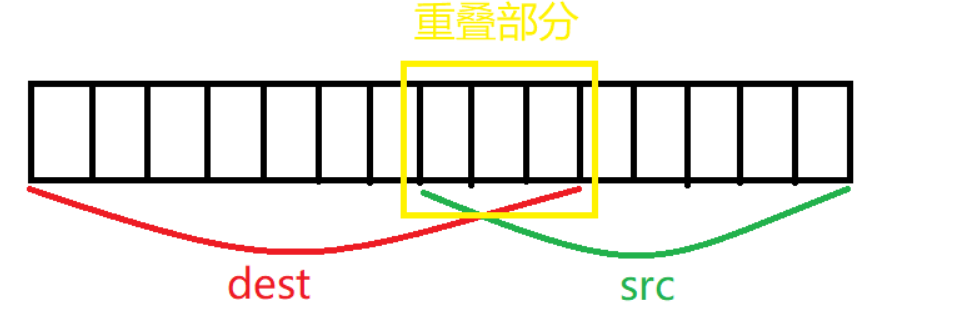
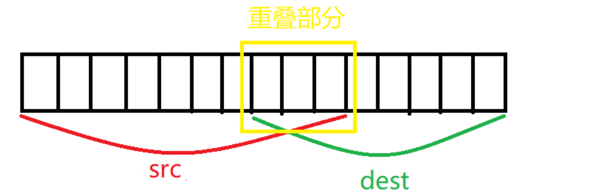
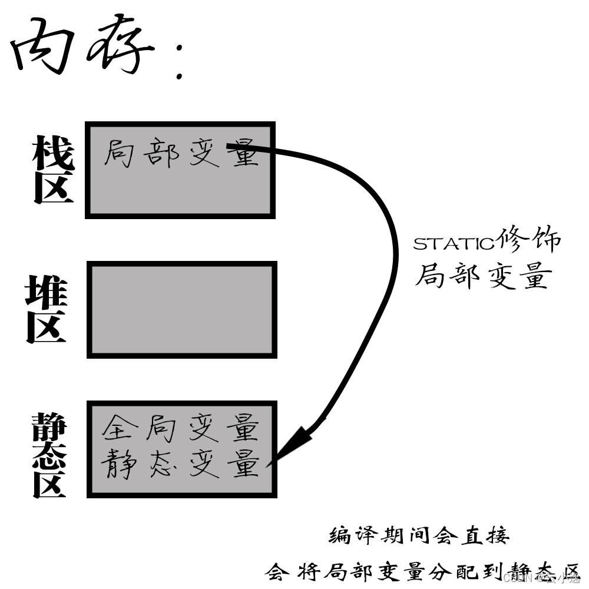

# C语言数据类型

| **关键字**         | **位数** | **表示范围**             | **stdint关键字** | **ST关键字** |
| ------------------ | -------- | ------------------------ | ---------------- | ------------ |
| char               | 8        | -128 ~ 127               | int8_t           | s8           |
| unsigned char      | 8        | 0 ~ 255                  | uint8_t          | u8           |
| short              | 16       | -32768 ~ 32767           | int16_t          | s16          |
| unsigned short     | 16       | 0 ~ 65535                | uint16_t         | u16          |
| int                | 32       | -2147483648 ~ 2147483647 | int32_t          | s32          |
| unsigned int       | 32       | 0 ~ 4294967295           | uint32_t         | u32          |
| long               | 32       | -2147483648 ~ 2147483647 |                  |              |
| unsigned long      | 32       | 0 ~ 4294967295           |                  |              |
| long long          | 64       | -(2^64)/2 ~ (2^64)/2-1   | int64_t          |              |
| unsigned long long | 64       | 0 ~ (2^64)-1             | uint64_t         |              |
| float              | 32       | -3.4e38 ~ 3.4e38         |                  |              |
| double             | 64       | -1.7e308 ~ 1.7e308       |                  |              |

 **stdint关键字**：为重写的关键字，推荐使用

**ST关键字**  ：为ST重写的关键字


**float类型**

float，默认是double类型，float类型需要加f后缀才能表达。

````c
float x = 8000000.7499999996f;
float y = 8000000.7499999996;
````

与实数“8000000.7499999996”最接近的“float 可表示的数”是 8000000.5，而最接近的 “double 可表示的数”是 8000000.75 。

和 8000000.75 最接近的“float 可表示的数”有两个，分别是 8000000.5 和 8000001 。如果向上取整，就会得到 8000001 。

结果就是`加f`和`不加f`有不同的值。`加f`的值（8000000.5）比`不加f`的值（8000001）更接近于原来的数。


**无符号类型**

在后面加U


# 指针

指针类型：指针也就是内存地址，指针变量是用来存放内存地址的变量。就像其他变量或常量一样，您必须在使用指针存储其他变量地址之前，对其进行声明。指针变量声明的一般形式为：`type *var_name;`


注意：指针本身也有内存地址

````c
int    *ip;    /* 一个整型的指针 */
double *dp;    /* 一个 double 型的指针 */
float  *fp;    /* 一个浮点型的指针 */
char   *ch;    /* 一个字符型的指针 */
````

所有实际数据类型，不管是整型、浮点型、字符型，还是其他的数据类型，对应指针的值的类型都是一样的，都是一个代表内存地址的长的十六进制数。

不同数据类型的指针之间唯一的不同是，指针所指向的变量或常量的数据类型不同。


**使用指针**

使用`&`号可以去地址

使用`*`号可以访问指针所指向的地址上的值

```c
int main(){
    int i = 3;

    int *p;
    p = &i;

    printf("i 的值： %d \n",i);
    printf("i 的地址： %p \n",&i);
    printf("p 指针的值： %p\n",p);
    printf("p 指针的地址： %p\n",&p);
    printf("p 指针指向的值： %d\n",*p);
}
/**
i 的值： 3
i 的地址： 000000000061FE1C
p 指针的值： 000000000061FE1C
p 的地址： 000000000061FE10
p 指针指向的值： 3
**/
```


**指针的算数运算**

指针也可以使用`+，-，++，--`这四种操作

- 指针的每一次递增，它其实会指向下一个元素的存储单元。
- 指针的每一次递减，它都会指向前一个元素的存储单元。
- 指针在递增和递减时跳跃的字节数取决于指针所指向变量数据类型长度，比如 int 就是 4 个字节。

````c
#include "stdio.h"


int main(){
    int var[5] = {1,2,3,4,5};
    int *p;
    p = var;

    printf("p 指针指向的值： %d\n",*p);
    printf("p 指针的值： %p\n",p);
    printf("p 指针的地址： %p\n",&p);
    p++;
    printf("p 指针指向的值： %d\n",*p);
    printf("p 指针的值： %p\n",p);
    printf("p 指针的地址： %p\n",&p);
}
/**
p 指针指向的值： 1
p 指针的值： 000000000061FE00
p 指针的地址： 000000000061FDF8
p 指针指向的值： 2
p 指针的值： 000000000061FE04
p 指针的地址： 000000000061FDF8
**/
````


**指针的指针**

指向指针的指针是一种多级间接寻址的形式，或者说是一个指针链。通常，一个指针包含一个变量的地址。当我们定义一个指向指针的指针时，第一个指针包含了第二个指针的地址，第二个指针指向包含实际值的位置。

````c
#include <stdio.h>
 
int main ()
{
   int  V;
   int  *Pt1;
   int  **Pt2;
 
   V = 100;
 
   /* 获取 V 的地址 */
   Pt1 = &V;
 
   /* 使用运算符 & 获取 Pt1 的地址 */
   Pt2 = &Pt1;
 
   /* 使用 pptr 获取值 */
   printf("var = %d\n", V );
   printf("Pt1 = %p\n", Pt1 );
   printf("*Pt1 = %d\n", *Pt1 );
    printf("Pt2 = %p\n", Pt2 );
   printf("**Pt2 = %d\n", **Pt2);
 
   return 0;
}
/**
var = 100
Pt1 = 0x7ffee2d5e8d8
*Pt1 = 100
Pt2 = 0x7ffee2d5e8d0
**Pt2 = 100
**/
````


**传递指针与返回指针**

````c
int* add10(int* arr){   //+10函数
    static int arrAdd10[5];   //必须为static
    for(int i = 0;i < 5;i++){
        arrAdd10[i] = arr[i] + 10;
    }

    return arrAdd10;   //将数组作为指针出出
}
int main(){
    int arr[5] = {1,2,3,4,5};
    int* arr10;
    arr10 = add10(arr);
    for(int i = 0;i < 5;i++){
        //printf("arr10[%d] = %d \n",i,*(arr10+i));
        printf("arr10[%d] = %d \n",i,arr10[i]);
    }
}
/**
arr10[0] = 11
arr10[1] = 12
arr10[2] = 13
arr10[3] = 14
arr10[4] = 15
**/
````


**指针数组和数组指针**

指针的数组：是一个装载指针的数组

数组的指针：是一个指向数组的指针

然后，需要明确一个优先级顺序：$()>[]>*$，所以：

1. `(*p)[n]`：根据优先级，先看括号内，则p是一个指针，这个指针指向一个一维数组，数组长度为n，这是“数组的指针”，即数组指针；
2. `*p[n]`：根据优先级，先看[]，则p是一个数组，再结合*，这个数组的元素是指针类型，共n个元素，这是“指针的数组”，即指针数组。

指针数组：是多个指针变量，以数组的形式存储在内存中，占有多个指针的存储空间。

````c
int main()
{
	int a = 1;
	int b = 2;
	int *p[2];
	p[0] = &a;
	p[1] = &b;
 
	printf("%p\n", p[0]); //a的地址
	printf("%p\n", &a); //a的地址
	printf("%p\n", p[1]); //b的地址
	printf("%p\n", &b); //b的地址
	printf("%d\n", *p[0]); //p[0]表示a的地址，则*p[0]表示a的值
	printf("%d\n", *p[1]); //p[1]表示b的地址，则*p[1]表示b的值
 
 
	//将二维数组赋给指针数组
	int *pp[3]; //一个一维数组内存放着三个指针变量，分别是p[0]、p[1]、p[2]，所以要分别赋值
	int c[3][4];
	for (int i = 0; i<3; i++)
		pp[i] = c[i];
 
	int k;
	scanf_s("%d", &k);
 
    return 0;
}

````

数组指针：是一个指针变量，占有内存中一个指针的存储空间；

````c
int main()
{
	//一维数组
	int a[5] = { 1, 2, 3, 4, 5 };
	//步长为5的数组指针，即数组里有5个元素
	int (*p)[5];
	//把数组a的地址赋给p，则p为数组a的地址，则*p表示数组a本身
	p = &a;
 
	//%p输出地址, %d输出十进制
	//\n回车
	//在C中，在几乎所有使用数组的表达式中，数组名的值是个指针常量，也就是数组第一个元素的地址，它的类型取决于数组元素的类型。
	printf("%p\n", a); //输出数组名，一般用数组的首元素地址来标识一个数组，则输出数组首元素地址
	printf("%p\n", p); //根据上面，p为数组a的地址，输出数组a的地址
	printf("%p\n", *p); //*p表示数组a本身，一般用数组的首元素地址来标识一个数组
	printf("%p\n", &a[0]); //a[0]的地址
	printf("%p\n", &a[1]); //a[1]的地址
	printf("%p\n", p[0]); //数组首元素的地址
	printf("%d\n", **p); //*p为数组a本身，即为数组a首元素地址，则*(*p)为值，当*p为数组首元素地址时，**p表示首元素的值1
	printf("%d\n", *p[0]); //根据优先级，p[0] 表示首元素地址，则*p[0]表示首元素本身，即首元素的值1
	printf("%d\n", *p[1]); //为一个绝对值很大的负数，不表示a[1]...表示什么我还不知道
 
	
	//将二维数组赋给指针
	int b[3][4];
	int(*pp)[4]; //定义一个数组指针，指向含4个元素的一维数组
	pp = b; //将该二维数组的首地址赋给pp，也就是b[0]或&b[0]，二维数组中pp=b和pp=&b[0]是等价的
	pp++; //pp=pp+1，该语句执行过后pp的指向从行b[0][]变为了行b[1][]，pp=&b[1]
 
	int k;
	scanf_s("%d", &k);
 
    return 0;
}
````


````c
int arr[5]={1，2，3，4，5};
int (*p1)[5] = &arr;
/*下面是错误的*/
int (*p2)[5] = arr;
````

不难看出，在上面的示例代码中，&arr 是指整个数组的首地址，而 arr 是指数组首元素的首地址，虽然所表示的意义不同，但二者之间的值却是相同的。那么问题出来了，既然值是相同的，为什么语句`int(*p1)[5]=&arr`是正确的，而语句`int(*p2)[5]=arr`却在有些编译器下运行时会提示错误信息呢（如在 Microsoft Visual Studio 2010 中提示的错误信息为`“a value of type"int*"cannot be used to initialize an entity of type"int(*)[5]"”）？`

其实原因很简单，在 C 语言中，赋值符号“=”号两边的数据类型必须是相同的，如果不同，则需要显示或隐式类型转换。在这里，p1 和 p2 都是数组指针，指向的是整个数组。p1 这个定义的“=”号两边的数据类型完全一致，而 p2 这个定义的“=”号两边的数据类型就不一致了（左边的类型是指向整个数组的指针，而右边的数据类型是指向单个字符的指针），因此会提示错误信息。


# 宏定义

关键字：`#define`

用途：用一个字符串代替一个数字，便于理解，防止出错；提取程序中经常出现的参数，便于快速修改

````c
//定义宏定义：
#define ABC 12345

//引用宏定义：
int a = ABC; //等效于int a = 12345;
````


| 命令     | 含义                                                         |
| -------- | ------------------------------------------------------------ |
| #define  | 定义一个预处理宏                                             |
| #undef   | 取消宏的定义                                                 |
| #if      | 编译预处理中的条件命令，相当于C语法中的if语句                |
| #ifdef   | 判断某个宏是否被定义，若已定义，执行随后的语句,他不能判断语句是否成立 |
| #ifndef  | 与#ifdef相反，判断某个宏是否未被定义                         |
| #elif    | 若#if,  #ifdef, #ifndef或前面的#elif条件不满足，则执行#elif之后的语句，相当于C语法中的else-if |
| #else    | 与#if,  #ifdef, #ifndef对应, 若这些条件不满足，则执行#else之后的语句，相当于C语法中的else |
| #endif   | #if, #ifdef, #ifndef这些条件命令的结束标志.                  |
| #defined | 与#if,  #elif配合使用，判断某个宏是否被定义                  |

````c
#define x 1
int i;
int main(void){
#ifdef x		
	//语句
#endif
/* 错误
#ifdef (x == 1)		
	//语句
#endif
*/  
    
#if (i == 1)
    //语句
#elif (i == 2)
    //语句
#endif 
}
````


# typedef

关键字：`typedef <数据类型> <别名>`

用途：将一个比较长的**变量类型**名换个名字，便于使用

````c
//定义typedef：
typedef unsigned char uint8_t;
    
//引用typedef：
uint8_t a; //等效于unsigned char a;

typedef int rainInt      //rainInt 即代表int类型
typedef int* rainpointer //rainprinter 即即代表int*类型
````


**typedef与define的区别**

1. typedef只能定义基本变量类型，如果定义的不是基本变量类型，则错误
2. define可以定义任何类型


# 结构体

关键字：`struct`

用途：数据打包，不同类型变量的集合

````c
int main(){
    struct {int a;char b} c;
    
    c.a = 2;
    c.b = 'b';
}
````


**与typedef结合**

````c
typedef  struct {
    int a;
    char b
} Ob,*POb;
int main(){
    Ob j;      
    j.a = 1;      //使用结构体名称.属性
    j.b = 'c';

    Ob* y;        //使用结构体指针->属性 
    y->a = 2;
    y->b = 'x';
    
    POb k;       //简化
    k->a = 3;
    k->b = 'd';

}
````

注意：结构体如果是指针类型的需要用`->`进行访问成员，否则使用`.`进行访问

**几种定义方式**

````c
struct {
        char* name;
        int age;
}yu,yuan;			/* yu，yuan相当于变量，直接使用 */
yu.name = 'yu';

struct person{
        char* name;
        int age;
};					/* person结构体类型，需要声明变量才能使用 */
struct person yu;
yu.name = 'yu';

typedef struct{
        char* name;
        int age;
}person,*person;		/* person结构体类型，需要声明变量才能使用 */
person yu;
yu.name = 'yu';
````

**几种赋值方式**

````c
struct person{
	char* name;
	int age;
};

int main(void){
	struct person yu;
	yu.name = "yu";
	yu.age = 12;
	
	struct person yuan = {
		.name = "yuan",
		.age = 12
	};

	printf("name:%s age:%d\r\n",yu.name,yu.age);
	printf("name:%s age:%d\r\n",yuan.name,yuan.age);
	return 0;
}
````


# 枚举

关键字：`enum`

用途：定义一个取值受限制的整型变量，用于限制变量取值范围；宏定义的集合

因为枚举变量类型较长，所以通常用typedef更改变量类型名

```c
typedef enum {TRUE = 1,FALSE=0} TF_t;   //简化
int main(){
    enum {TRUE = 1,FALSE=0} TF;
    TF  = TRUE;
    
    TF_t TF2;
    TF2 = FALSE;
}
```


# 引用外部文件

**.h**文件

````c
#ifndef __FileName_H
#define __FileName_H
//存放.c文件下的函数
#endif
````


在实施过程中，首先进行了硬件连接，将两个芯片通过GPIOA的Pin9、Pin10端口连接(接收与发送数据)

和GPIOB引脚连接起来，并正确配置了串口通信和按钮的引脚。在代码实现中，使用了适当的串口通信库，来配置和控制串口通信。同时，编写了相应的中断处理函数，以便在按钮按下时触发相应的操作。通过实施和测试，我们成功地实现了系统的功能。我们可以通过按下Pin10按钮来触发串口数据的发送操作，通过Pin12和Pin15按钮来加和减数字。系统将结果发送到另一个芯片，并通过外设显示出来。


# 字符串

我们可以把字符串储存在char类型的数组中，如果char类型的数组末尾包含一个表示字符串末尾的空字符`\0`，则该数组中的内容就构成了一个字符串

````c
char Str1[10] = {'r','a','i','n'};			// 不是个字符串
char Str2[10] = {'r','a','i','n','\0'};		// 是字符串
````

因为字符串需要用\0结尾，所以在定义字符串的时候，字符数组的长度要预留多一个字节用来存放\0，\0就是数字0

````c
#include <stdio.h>
#include <string.h>
int main(){
   char name[21];
   memset(name,0,sizeof(name));
   strcpy(name,"hello,world");//把hello,world赋值给name
   name[5]=0;//强制把第6个元素赋值为0   
   printf("%s\n",name);		// 输出hello,但是在内存中的值仍是hello0world，后面的 world 成了内存中的垃圾值
   return 0;
}
````


使用头文件：`\#include <string.h>`

## strlen长度

获取字符串的长度（strlen）

````c
size_t  strlen( const char*  str);
````

1. 功能：计算字符串的有效长度，不包含 \0
2. 返回值：返回字符串的字符数 
3. strlen 函数计算的是字符串的实际长度，遇到第一个\0结束
4. 函数返回值一定是size_t，是无符号的整数，即typedef unsigned int size_t
5. 如果您只定义字符串没有初始化，求它的长度是没意义的，它会从首地址一直找下去，遇到0停止


**和sizeof 的区别**：`sizeof` 返回的是变量所占的内存数，不是实际内容的长度

````c
#include <stdio.h>
#include <string.h>
int main(){
    char name[21];
    memset(name,0,sizeof(0));
    strcpy(name,"xiaoqiu");
 
    printf("strlen=%d\n",strlen(name)); // 7
    printf("sizeof=%d\n",sizeof(name)); // 21  sizeof 返回的是变量所占的内存数
    return 0;
}
````

**自己实现一个 strlen 函数**

````c
int mystrlen(const char* str){   
    int i = 0;
    while( str[i]!='\0' ) {
     i++;
    }
    return i;
}
````

## strcpy拷贝

````c
char *strcpy(char* dest, const char* src);
````

1. 功 能: 将参数src字符串拷贝至参数dest所指的地址
2. 返回值: 返回参数dest的字符串起始地址
3. 复制完字符串后，在dest后追加0
4. 如果参数dest所指的内存空间不够大，可能会造成**缓冲溢出**的错误情况

````c
char arr[10] = "########";
printf("%s\n", strcpy(arr,"hello"));		// 输出 hello

for(int i=0; i<sizeof(arr); i++){
    printf("%c",arr[i]);					// 输出 hello0##
}
````

**自己实现**

````c
char *mystrcpy(char* dest,const char* src){   
    size_t i = 0;  
    while (src[i] != '\0') {
      dest[i] = src[i];
      i++;
    } 
    dest[i]='\0';
    return dest;
}
````

## strncpy拷贝

````c
char * strncpy(char* dest,const char* src, const size_t n);
````

1. 功能：把src前n字符的内容复制到dest中
2. 返回值：dest字符串起始地址
3. 如果src字符串长度小于n，则拷贝完字符串后，在**dest后追加0，直到n个**
4. 如果src的长度大于等于n，就截取src的前n个字符，不会在dest后追加0
5. dest必须有足够的空间放置n个字符，否则可能会**造成缓冲溢出**的错误情况

````c
char *mystrncpy(char* dest,const char* src,const size_t n){
    int len = (strlen(src)>n)?n:strlen(src);
    size_t i = 0;
    for (i=0;i<len;i++) {
       dest[i] = src[i];
    }
    dest[i]='\0';
    return dest;
}
````

## strcat拼接

字符串拼接

````c
char *strcat(char* dest,const char* src);
````

1. 功能：将src字符串拼接到dest所指的字符串尾部
2. 返回值：返回dest字符串起始地址
3. dest最后原有的结尾字符0会被覆盖掉，并在连接后的字符串的尾部再增加一个0
4. dest要有足够的空间来容纳要拼接的字符串，否则可能会造成缓冲溢出的错误情况

````c
char *mystrcat(char* dest,const char* src){   
    int destlen = strlen(dest); 
    int i = 0;
    for (i=0;i<strlen(src);i++) {
     dest[destlen+i]=src[i];
    }
    dest[destlen+i]='\0';
    return dest;
}
````

## strncat拼接

````c
char *strncat (char* dest,const char* src, const size_t n);
````

1. 功能：将src字符串的前n个字符拼接到dest所指的字符串尾部
2. 返回值：返回dest字符串的起始地址
3. 如果n大于等于字符串src的长度，那么将src全部追加到dest的尾部，如果n小于字符串src的长度，只追加src的前n个字符
4. strncat会将dest字符串最后的0覆盖掉，字符追加完成后，再追加0
5. dest要有足够的空间来容纳要拼接的字符串，否则可能会造成**缓冲溢出**的错误情况

````c
char *mystrncat(char* dest,const char* src,size_t n){
    int len = (strlen(src)>n)?n:strlen(src);
    int destlen = strlen(dest);
    int i = 0;
    for (i=0;i<len;i++) {
     dest[destlen+i]=src[i];
    }
 
    dest[destlen+i]='\0';
}
=======================================================
char *mystrncat2(char* dest,const char* src,size_t n){
    int len = (strlen(src)>n)?n:strlen(src);
    char* temp = dest + strlen(dest);	//
    for (int i=0;i<len;i++) {
     *tempt = *src;
     test++;
     src++;
    }
 	*temp = '\0';
}
````


## strcmp比较

````c
int strcmp(const char *str1, const char *str2 );
````

1. 功能：比较str1和str2的大小
2. 返回值：相等返回0，str1大于str2返回1，str1小于str2返回-1

````c
int mystrcmp(const char *str1,const char *str2){    
     int i = 0;
     int len = 0;//  str1 和 str2 较短的字符串长度
     
     if ( strlen(str1) > strlen(str2) )  len = strlen(str2);
     else len = strlen(str1);

     for (i = 0;i < len;i++) {
       if (str1[i]==str2[i]) continue;
       else break;
     }
     
    
     if ( (i==len) && (strlen(str1)==strlen(str2))  ) return 0; // 两个字符串相等
     else if (str1[i]>str2[i]) return 1;						// 两个字符串不相等    
     else return -1;
    
}
````

## strncmp比较

````c
int strncmp(const char *str1,const char *str2 ,const size_t n);
````

1. 功能：比较str1和str2前n个字符的大小
2. 返回值：相等返回0，str1大于str2返回1，str1小于str2返回-1
3. 两个字符串比较的方法是比较字符的ASCII码的大小，从两个字符串的第一个字符开始，如果分不出大小，就比较第二个字符，如果全部的字符都分不出大小，就返回0，表示两个字符串相等

````c
int mystrcmp(const char *str1,const char *str2,size_t n){   
    int i = 0; 
    for (i = 0;i < n;i++) {
     if (str1[i]==str2[i]) continue;
     else break;
    }
    if (i==n) return 0;
    else if (str1[i]>str2[i]) return 1;
    else return -1;
}
````

## strchr查找

````c
char *strchr(const char *s,const int c);
````

返回一个指向在字符串s中第一个出现c的位置，如果找不到，返回0

````c
char *mystrchr(const char *s,const int c){   
    int i = 0; 
    int len = strlen(s);
    for (i = 0;i<len;i++) {
       if (s[i]==c) 
       return (char *)s+i;
    }
    return 0;
}
````

````c
char *strrchr(const char *s,const int c);
````

返回一个指向在字符串s中最后一个出现c的位置，如果找不到，返回0

````c
char *mystrrchr(const char *s,const int c){
    int i = 0;
 
    for (i = strlen(s)-1;i>=0;i--) {
       if (s[i]==c)
       return (char *)s+i;
    }
    return 0;
}
````

## strstr查找

````c
char *strstr(const char* str,const char* substr);
````

1. 功能：检索子串在字符串中首次出现的位置
2. 返回值：返回字符串str中第一次出现子串substr的地址；如果没有检索到子串，则返回0

````c
char *mystrstr(const char* str,const char* substr){   
    char* pos = (char *)str;//要被检索的 C 字符串
    char* pos1 = NULL;
    while (1) {
      if (pos[0]==0) break; // 如果要被检索的 C 字符串已经结束 break
      pos1 = strchr(pos,substr[0]); // 在pos中查找子字符串的首字符。
      if (pos == 0) return 0; // 如果没有找到，直接返回0
      if ( strncmp(pos1,substr,strlen(substr)) ==0  )  return pos1;// 如果找到了，返回找到的地址。
      pos++;// 待搜索的位置后移一个字节。
    }
}
````

## memset申请内存

memset是一个初始化函数，作用是将某一块内存中的全部设置为指定的值。

````c
void *memset(void *s, int c, size_t n); 
````

- s指向要填充的内存块。
- c是要被设置的值。
- n是要被设置该值的字符数。
- 返回类型是一个指向存储区s的指针。

**一、不能任意赋值**
memset函数是按照**字节**对内存块进行初始化，所以不能用它将int数组出初始化为0和-1之外的其他值（除非该值高字节和低字节相同）。
其实c的实际范围应该在0~255，因为memset函数只能取 参数2c 的**后八位**给所输入范围的每个字节。也就是说无论 参数2c 多大只有后八位二进制是有效的。


对于int a[4];
`memset(a, -1, sizeof(a))` 与`memset(a, 511, sizeof(a)) `所赋值的结果一样都为-1：
因为 -1 的二进制码为（11111111 11111111 11111111 11111111）；511 的二进制码为（00000000 00000000 00000001 11111111）；
后八位均为（11111111），所以数组中的每个字节都被赋值为（11111111）。
注意int占四个字节，例如a[0]的**四**个字节都被赋值为11111111，那么a[0] = 11111111 11111111 11111111 11111111，即a[0] = -1。


**二、注意所要赋值的数组的元素类型**

````c
int main(){
    char a[4];
    memset(a,'1',4);
    for(int i=0; i<4; i++){
        printf("%d \r\n",a[i]);		// 输出 1 1 1 1
    }
    
    int a[4];
    memset(a,1,sizeof(a));			// sizeof(a) = 16
    for(int i=0; i<4; i++){
        printf("%d \r\n",a[i]);		// 输出 16843009 16843009 16843009 16843009
    }
    return 0;
}
````

为什么下面的输出错误：

因为一个`int`占4个字节，`int a[4]` 占16个字节，`sizeof(a) = 16`。所以程序对这16个字节都进行赋值 00000001;

int 占4个字节，则每个int（0000001 0000001 0000001 0000001）转为十进制就是16843009


**关于所要赋值的字符数的写法**

````c
using namespace std;

void fun1(int a[]){
    memset(a,-1,sizeof(a)); 
}

int main(){
    int a[6];
    fun1(a);
    for(int i=0; i<6; i++){
        printf("%d \r\n",a[i]);
    }
    return 0;
}
````

当数组作为参数传递时，其**传递的实际上是一个指针**，这个指针指向数组的首地址，如果用**sizeof(a)函数得到的只是指针的长度**，而不是数组的长度。

可以更改为

````c
using namespace std;

void fun1(int a[], int len){
    memset(a,-1,len); 
}
int main(){
    int a[6];
    int len = sizeof(a);
    fun1(a,len);
    for(int i=0; i<6; i++){
        printf("%d \r\n",a[i]);
    }
    return 0;
}
````


## memcpy拷贝

声明在 `string.h`

````c
void *memcpy(void *destin, void *source, unsigned n);
````

作用是：以source指向的地址为起点，将连续的n个**字节**数据，复制到以destin指向的地址为起点的内存中。
函数有三个参数，第一个是目标地址，第二个是源地址，第三个是数据长度。

使用memcpy函数时，需要注意：

- 数据长度（第三个参数）的单位是**字节**（1byte = 8bit）。
- 注意该函数有一个返回值，类型是void*，是一个指向destin的指针。

````c
void *memcpy(void *dst, const void *src, size_t size){
    char *psrc;		// 注意 使用的是char 因为是按字节进行拷贝；如果是int类型，根据下面函数的分析 就是按四个字节进行拷贝
    char *pdst;

    if (NULL == dst || NULL == src) return NULL;

    if ((src < dst) && (char *)src + size > (char *)dst) // 出现地址重叠的情况，自后向前拷贝
    {
        psrc = (char *)src + size - 1;
        pdst = (char *)dst + size - 1;
        while (size--)
            *pdst-- = *psrc--;
    }
    else{
        psrc = (char *)src;
        pdst = (char *)dst;
        while (size--)
            *pdst++ = *psrc++;
    }

    return dst;
}
````

**memcpy函数复制的数据长度**

使用memcpy函数时，特别要注意数据长度。如果复制的数据类型是char，那么数据长度就等于元素的个数。而如果数据类型是其他（如int, double, 自定义结构体等），就要特别**注意数据长度**的值。

好的习惯是，无论拷贝何种数据类型，都用 `n * sizeof(type_name)`的写法。

````c
char a[10] = "abcdefgh";
unsigned n = 2;
void * p = memcpy(a+3, a, n); // "abcabfgh"
````

````c
int a[10] = { 0, 1, 2, 3, 4, 5, 6, 7, 8, 9 };
void * p = memcpy(a+3, a, 5);		// 输出 0 1 2 0 1 5 6 7 8 9
/**	为什么和想象的不一样
因为memcpy是按照字节个数进行拷贝
int 占4个字节；而我们要拷贝5个字节，即我们只拷贝的1.25个内容
前四个字节组成了一个完整的int（即第一个元素0）。第五个字节，只能取到第二个元素的第1个字节。这里又会涉及到big-endian和little-endian的问题。假设是小端方式储存（更常见），那么读到的是元素1的低8位，写成十六进制即0x1。
目标地址是a+3。由于指针加减常数，单位是与类型保持一致的，也就是在a的基础上，增加3倍int长度，对应的是元素3的地址。元素3被替换为0。元素4写成十六进制是0x0004，低8位被替换为0x1，变为0x0001。
**/
````

````c
int a[10] = { 0, -1, 2, 3, 4, 5, 6, 7, 8, 9 };
unsigned n = 5;
memcpy(a+3, a, n);

复制5个字节的数据，前4个字节组成了一个int，即第一个元素0。那么元素3被替换为0。第5个字节从-1中取。-1的十六进制表示为0xFFFF，第5个字节的数据是0xF。元素4变为0x000F，即15。数组a变为 { 0， -1， 2， 0， 15， 5， 6， 7， 8， 9 }。
如果 n = 6，那么4变为0x00FF，即255。数组a变为 { 0， -1， 2， 0， 255， 5， 6， 7， 8， 9 }。
````

可以看出，如果你想用memcpy复制元素，那么一定要写对数据长度。如果要完整地复制 n 个 int 类型元素，那么写法如下：

````c
int a[10] = { 0, -1, 2, 3, 4, 5, 6, 7, 8, 9 };
unsigned n = 5 * sizeof(int);
memcpy(a+3, a, n);	// 正确输出 数组a变为 { 0， -1， 2， 0， -1， 2， 0， -1， 8， 9 }。
````

**strcpy和memcpy主要有以下3方面的区别：**

1）复制的内容不同。strcpy只能**复制字符串**，而memcpy可以复制**任意内容**，例如字符数组、整型、结构体、类等。

2）复制的方法不同。strcpy不需要指定长度，它遇到被复制字符的串结束符**"\0"才结束**，所以**容易溢出**。memcpy则是根据其第3个参数决定复制的长度。

3）用途不同。通常在复制字符串时用strcpy，而需要复制其他类型数据时则一般用memcpy

## memmove拷贝

````c
void *memmove( void* dest, const void* src, size_t count );
````

memmove()复制 src 所指的内存数据的 n 个字节到 dest所指的内存地址上。也就是从源地址复制n 个字节到目标地址。如果目标区域和源区域有重叠的话，memmove能够保证源串在被覆盖之前将重叠区域的字节拷贝到目标区域中，但复制后源内容会被更改。但是当目标区域与源区域没有重叠则和memcpy函数功能相同。


`src(源字符数组)`内存区域和`dest(目标字符数组)`内存区域存在重叠 且dest所在区域在src所在区域前




如上图，`dest(目标字符数组)`和`src(源字符数组)`存在三个字节的内存区域重叠，但是在复制的时候，先把src的前三个字节复制到了dest的前三个内存区域内，再继续复制到重叠区域时，就算被覆盖，也不会有数据错误 所以这样可以正常复制


`src(源字符数组)`内存区域和`dest(目标字符数组)`内存区域存在重叠，且在dst所在区域在src所在区域后面



这时候如果使用memcpy()进行复制，会把三个重叠内存字节覆盖为src的前三个字节内容，导致复制到重叠部分的时候出现错误

如果使用memmove()，会先将`src(源字符数组)`中的内容复制到**缓冲区**，然后再复制到`dest(目标字符数组)`中去，有效的避免了数据重叠。


**memmove与memcpy区别**

* memmove会将内容复制到缓冲区，有效的避免了数据重叠。
* 如果没有重叠，效果相同

## memcmp比较

memcmp是比较内存区域buf1和buf2的前count个字节。该函数是按字节比较的。

````c
int memcmp(const void *buf1, const void *buf2, unsigned int count);
````

**strcmp和memcmp主要区别：**

与上方类似


# 内存


## sizeof

sizeof(0) = 0


# 关键字

## static

`static`一般修饰内部变量、全局变量、函数

**static修饰内部变量**

````c
#include<stdio.h>
void test(){
	int a = 1;					// 作用域在这个函数内部，出了作用域，销毁a的值
	a++;
    static int b = 1;			// 出了作用域，不会销毁b的值
	b++;
	printf("a:%d\r\n", a);		// 输出 2 2 2 2 2...
    printf("b:%d\r\n", b);		// 输出 2 3 4 5 6...
}
int main(void){
	int i = 0;
	while (i <= 10){
		test();
		i++;
	}
	return 0;
}
````

原因：



**一般的内部变量会存储在栈中，函数结束后，会销毁变量的值。**

被static修饰的内部变量不存在栈中，而是**存储在静态区中**，函数结束后，不会销毁变量的值。


**总结：**

1. static修饰局部变量
   1. 声明周期延长：该变量不随函数结束而结束
   2. 初始化：只在第一次调用该函数时进行初始化
   3. 记忆性：后序调用时，该变量使用前一次函数调用完成之后保存的值
   4. 存储位置：不会存储在栈上，放在数据段
2. static修饰全局变量
   1. 改变该变量的链接属性，让该变量具有文件作用域，即**只能在当前文件中使用**，其他.c文件无法使用该全局变量
   2. 修饰变量时，没有被初始化时会被自动初始化为0
3. static修饰函数
   1. 改变该函数的链接属性，让该函数具有文件作用域，即**只能在当前文件中使用**，其他.c文件无法使用该函数
      

## const

关键字const用来定义常量，如果一个变量被const修饰，那么它的值就不能再被改变，我想一定有人有这样的疑问，C语言中不是有#define吗，干嘛还要用const呢，我想事物的存在一定有它自己的道理，所以说const的存在一定有它的合理性，与预编译指令相比，const修饰符有以下的优点：

1、预编译指令只是对值进行**简单的替换**，不能进行**类型检查**

2、可以保护被修饰的东西，防止意外修改，增强程序的健壮性

3、编译器通常不为普通const常量分配存储空间，而是将它们保存在符号表中，这使得它成为一个编译期间的常量，没有了存储与读内存的操作，使得它的效率也很高。

### **修饰局部变量**

````c
const int n=5;
int const n=5;
````

这两种写法是一样的，都是表示变量n的值不能被改变了，需要注意的是，用const修饰变量时，一定要给变脸初始化，否则之后就不能再进行赋值了。

接下来看看const用于修饰常量静态字符串，例如：

````c
const char* str="fdsafdsa";
````

如果没有const的修饰，我们可能会在后面有意无意的写str[4]=’x’这样的语句，这样会导致对只读内存区域的赋值，然后程序会立刻异常终止。有了const，这个错误就能在程序被编译的时候就立即检查出来，这就是const的好处。让逻辑错误在编译期被发现


### **常量指针与指针常量**

**常量指针：**指针指向的内容是常量，可以有一下两种定义方式。

````c
const int * n;
int const * n;
````

需要注意的是一下两点：**常量指针不能改变指针指向的内容，可以改变指针的指向**

1、常量指针说的是不能通过这个指针改变变量的值，但是还是可以通过其他的引用来改变变量的值的。

````c
int a=5;
const int* n=&a;
a=6;
````

2、常量指针指向的值不能改变，但是这并不是意味着指针本身不能改变，常量指针可以指向其他的地址。

````c
int a=5;
int b=6;
const int* n=&a;
n=&b;
````

**指针常量：** **指针本身是个常量，不能在指向其他的地址，可以改变指针的指向的内容**，写法如下：

````c
int *const n;
````

需要注意的是，指针常量指向的地址不能改变，但是地址中保存的数值是可以改变的，可以通过其他指向改地址的指针来修改。

````c
int a=5;
int *p=&a;
int* const n=&a;
*p=8;
````

区分常量指针和指针常量的关键就在于星号的位置，我们以星号为分界线，如果const在星号的左边，则为常量指针，如果const在星号的右边则为指针常量。如果我们**将星号读作‘指针’，将const读作‘常量’的话**，内容正好符合。int const * n 是常量指针，int *const n 是指针常量。


指向常量的常量指针

是以上两种的结合，**指针指向的位置不能改变并且也不能通过这个指针改变变量的值**，但是依然可以通过其他的普通指针改变变量的值。

````c
const int* const p;
````

### **修饰函数的参数**

根据常量指针与指针常量，const修饰函数的参数也是分为三种情况

1、防止修改指针指向的内容

```c
void StringCopy(char *strDestination, const char *strSource);
```

其中 strSource 是输入参数，strDestination 是输出参数。给 strSource 加上 const 修饰后，如果函数体内的语句试图改动 strSource 的内容，编译器将指出错误。

2、防止修改指针指向的地址

```c
void swap ( int * const p1 , int * const p2 )
```

指针p1和指针p2指向的地址都不能修改。

3、以上两种的结合。


### **修饰函数的返回值**

如果给以“指针传递”方式的函数返回值加 const 修饰，那么函数返回值（即指针）的内容不能被修改，该返回值只能被**赋给加const 修饰的同类型指针**。
例如函数

```c
const char * GetString(void);
```

如下语句将出现编译错误：

```c
char *str = GetString();
```

正确的用法是

```c
const char *str = GetString();
```

### **修饰全局变量**

全局变量的作用域是整个文件，我们应该尽量避免使用全局变量，因为一旦有一个函数改变了全局变量的值，它也会影响到其他引用这个变量的函数，导致除了bug后很难发现，如果一定要用全局变量，我们应该尽量的使用const修饰符进行修饰，这样防止不必要的人为修改，使用的方法与局部变量是相同的。


## volatile

### 含义

开发者告诉编译器该变量是**易变的，**无非就是希望编译器去注意该变量的状态，时刻注意该变量是易变的，**每次读取该变量的值都重新从内存中读取**。

````c
int i = 10;
int main(void){
    int a, b;
    a = i;
    b = i;
    if(a == b){
        printf("a = b");
    }else {
        printf("a != b");
    }
    return 0;
}
````

如果选择编译器优化，可能会被编译成如下代码（当然不是在C语言层面上优化，而是在汇编过程优化，只是使用C程序举例）：

```cpp
int i = 10;
int main(void){
    int a, b;
    a = i;
    b = i;
    printf("a = b");
    return 0;
}
```

**因为在仅仅从main主函数来看，a == b是必然的，那么在什么情况，a 和 b不是必然相等呢？**

1. i 是**其他子线程与主线程共享的全局变量**，其他子线程有可能修改 i 值；

2. i 是**中断函数与主函数共享的全局变量**，中断函数有可能修改 i 值；

3. i 属于**硬件寄存器**，CPU可能通过硬件直接改变 i 的值（例如寄存器的标志位）


**如何启动编译器优化，我们结合 GCC 编译器和 keil 开发软件讲解。**

使用GCC编译器时，在编译脚本命令加入 -On ; n: 0 ~ 3，数字代表优化等级，数字越大，优化级别越高。

例如：

```shell
gcc -O2 -O hello hello.c	// 使用 O2 优化级别编译 hello.c 
```

使用keil 软件，我们可以通过如下操作选择优化级别：C/C++ -->Optimization-->选择优化级别

### **volatile关键字什么情况下要用**

**1.自定义延时函数**

````c
int main(){				
	delay(1000000);
	return 0;
}
void delay(long val){			// 可能被优化掉
	while(val--);
}
void delay(volatile long val){	// 正确执行
	while(val--);
}
````

**2.多线程共享的全局变量**

多线程数据安全问题一直是计算机领域十分常见的问题，为了解决这类问题，衍生出互斥锁、条件变量、临界区以及自旋锁等解决办法，如上都是为了线程数据同步，但是要做到线程数据同步，我们还需要注意一个编译器优化问题。

我们都知道，每一个线程虽然共享一个进程的资源，但是每个线程同样拥有自己的私有堆栈，保证每个线程函数中定义的局部变量相互之间不可见；线程间通信是十分简单的，其中一个十分常见的方式就是通过共享全局变量，全局变量对于每一个线程都是可见的，**但是线程的每一次读写全局变量都是对全局变量直接操作吗，答案是否定的。**

```c
//一个全局变量a
int a = 1;
int main(){
    int b,c,d,e,f;
    //多次赋值
    b = a;
    c = a;
    d = a;
    e = a;
    f = a;
    ....
}
void *child_pth_fun{
    //子线程修改a值
    a = 2;
    ......
}
```

如果每次**赋值**都去**内存中读入 a** , 对于程序来说开销实在太大了，**这时候编译器优化会引入一个中间变量**，加快程序执行效率，也正是因为优化原因，如果这个全局变量是多线程共享的，子线程可能在任意时刻改变a的值，但是主程序引入的中间变量值确实过去a的值，就可能出现数据未同步问题。

**使用volatile修饰变量后，每次都会重新从内存中读取**


**3.中断函数与主函数共享的全局变量**

中断函数和主函数共享的全局变量需要使用 volatile 修饰的情况是相似的。


**4.硬件寄存器**

什么叫硬件寄存器，学过硬件的同学应该不陌生，我们在做按键检测的时候是不是下面这种流程：

1.设置GPIO对应的寄存器配置成输入模式 

2.不断地去访问GPIO电平标志寄存器（或者是一个寄存器的标志位）

3.根据寄存器值的某个二进制位确定当前引脚电平

那么有没有想过一个问题，是什么去改变硬件寄存器的值？其实，**硬件寄存器上的值的是和底层电路相关的，硬件寄存器的值会影响电路，电路也会反过来影响硬件寄存器的值。**

所以在这种情况下，编译器更不应该拷贝副本，而应该每次读写都从内存中读写，保证数据正确，声明成volatile可以防止出现数据出错问题。

````c
// stm32函数库底层的寄存器定义就是加了volatile的：
typedef struct{
  __IO uint32_t CRL;
  __IO uint32_t CRH;
  __IO uint32_t IDR;
  __IO uint32_t ODR;
  __IO uint32_t BSRR;
  __IO uint32_t BRR;
  __IO uint32_t LCKR;
} GPIO_TypeDef;
#ifdef __cplusplus
  #define     __I     volatile                /*!< defines 'read only' permissions      */
#else
  #define     __I     volatile const          /*!< defines 'read only' permissions      */
#endif
#define     __O     volatile                  /*!< defines 'write only' permissions     */
#define     __IO    volatile                  /*!< defines 'read / write' permissions   */
````

### const volatile

从上面可以知道 const 修饰符表示常量，volatile 修饰符表示易变的，那么两个结合起来用的话，意思是易变的常量吗？ 难道const修饰了之后，值还可以改变吗？答案是可以改变。const修饰的对象在它的作用域之内不能够被改变，但是在作用域之外可以被改变。这个要怎么理解呢？

`const volatile` 表示这个对象在作用域内不能被修改，但是在作用域外是易变的，每次读取的时候，需要从原始位置读取。

博客：https://blog.csdn.net/qq_20222919/article/details/121010814


## typedef与define

**#define是预处理中的宏定义命令**，在预处理时进行**简单的字符串替换，不作正确性检查，只有在编译已被展开的源程序时才会发现可能的错误并报错**，例如：

````c
#define M(a,b) a*b
int main(void){
    printf("%d \r\n",M(5,6));		// 输出30
    printf("%d \r\n",M(5 + 1,6));	// 输出11，相当于5 + 1 * 6
}
#define M(a,b) (a)*(b)				// 可以避免错误
````

可见define只是简单的字符替换


**typedef**

使用 typedef 定义新类型的方法（步骤）：在传统的变量声明表达式里，用**（新的）类型名**替换**变量名**，然后把关键字 typedef 加在该语句的开头就可以了。

### 作用范围

typedef关键字的作用范围主要限定在特定的数据类型上。通过typedef，我们可以为基本类型（如int、float）或自定义的结构体、联合体等定义新的名称。这个新名称只在指定数据类型和作用域内有效，对其他类型不产生任何影响。

相比之下，define是一种预处理指令，宏定义在整个代码中都有效。可以通过define来定义常量、函数替换宏、条件编译等，它的作用范围更为广泛。所有满足条件的宏定义在预处理阶段都会被替换为指定的文本。

````c
// 自定义结构体
typedef struct {
    int x;
    int y;
} Point;
int main() {
    // 使用typedef定义的新类型变量
    Point p;
    p.x = 10;
    p.y = 20;
    // 在此作用域内使用Point类型
    // ...
    return 0;
}
int test(){
    p.x = 20; // 无法使用
}
````

### 处理方式

typedef在创建新类型时，只是为已有类型赋予别名。它只在**编译器阶段**有效，不会引起任何代码替换。使用typedef给基本类型或复杂类型取别名，可以集中管理多个相似的类型，提高代码的可读性和可维护性。

相比之下，define是在**预处理阶段进行文本替换**。预处理器会根据宏定义中指定的文本，将代码中所有的宏调用替换为对应的文本。这种替换是简单的文本替换，没有类型检查和语法分析。

### 类型安全性

typedef提供了类型检查，因为它本质上只是给已有类型起了一个新的别名。这样，在使用typedef定义的新类型时，编译器会对其进行类型检查，保证类型的一致性。这有助于提高代码的类型安全性，避免类型错误导致的潜在问题。

相反，define没有类型检查的功能，因为它只进行文本替换。它只是简单地将宏调用替换为宏定义中指定的文本，没有对文本进行语法分析和类型检查。这种情况下，类型错误很容易发生，特别是对于复杂的宏定义。
````c
typedef int myInt;

void printValue(myInt value) {
    printf("%d\n", value);
}
int main() {
    myInt num = 5;
    printValue(num);
    return 0;
}
````

在这个示例中，我们定义了一个函数printValue，该函数接受一个myInt类型的参数。在使用该函数时，只能传递myInt类型的值，编译器会进行类型检查。这样可以确保参数的类型正确，避免类型错误引发的问题。

````c
#define MAX(a, b) ((a) > (b) ? (a) : (b))
int main() {
    double num1 = 10.5;
    int num2 = 20;
    int maxNumber = MAX(num1, num2);
    
    // ...
    
    return 0;
}
````

在这个示例中，我们尝试使用宏MAX来比较两个数的最大值。然而，由于define只是进行文本替换，没有类型检查，所以代码会被替换为((num1) > (num2) ? (num1) : (num2))。这个表达式会导致错误，因为浮点数和整数不能进行直接比较。这种类型错误很容易在使用复杂的宏定义时发生，因此在使用宏时需要谨慎。


**区别：**

在C语言中，typedef和define是用于起别名的关键字，但它们在作用范围、处理方式和类型安全性等方面具有显著的区别。

* `#define` 用于定义**预处理宏**，进行简单的进行字符串替换。 #define 宏定义可以使用 #ifdef、#ifndef 等来进行逻辑判断，还可以使用 #undef 来取消定义。在**整个代码**中都有效，可以进行文本替换和宏展开。没有类型检查的功能，可能导致类型错误，特别是在复杂的宏定义中。只有在编译已被展开的源程序时才会发现可能的错误并报错。
* `typedef` **编译时处理**,是为**已有的数据类型创建新的名称**。typedef 符合（C语言）范围规则，使用 typedef 定义的变量类型，其作用**范围限制**在所定义的函数或者文件内（取决于此变量定义的位置），而宏定义则没有这种特性。提供了**类型检查**，因为它本质上只是给已有类型起了一个新的别名。这有助于提高代码的类型安全性。但不能在一个函数定义里面使用typedef


# 堆栈

**C语言中：**

* 堆：组成形式类似于**链表**
* 堆栈：简称栈

**数据结构中：**

* 堆：堆是一种常用的树形结构，是一种特殊的完全二叉树
* 栈：栈

**程序占用内存分为以下几个部分**

* 栈区（stack）：由编译器**自动分配释放** ，存放函数的**参数值，局部变量的值**等。其操作方式类似于数据结构中的栈。
* 堆区（heap） ：一般由程序员分配释放`malloc/free`， 若程序员不释放，程序结束时可能由OS回收 。与数据结构中的堆是两回事，分配方式倒是类似于链表
* 全局区（静态区）（static）：**全局变量和静态变量**的存储是放在一块的，初始化的全局变量和静态变量在一块区域， 未初始化的全局变量和未初始化的静态变量在相邻的另一块区域。程序结束后有系统释放
* 文字常量区：常量字符串就是放在这里的。 程序结束后由系统释放
* 程序代码区：存放函数体的二进制代码。

````c
//main.cpp
int a = 0; //全局初始化区
int a = 0; //全局初始化区
char *p1; //全局未初始化区
main() {
    int b; //栈
    char s[] = "abc"; //栈
    char *p2; //栈
    char *p3 = "123456"; //123456\0在常量区，p3在栈上。
    static int c = 0; //全局（静态）初始化区
    p1 = (char *)malloc(10);
    p2 = (char *)malloc(20);
    //分配得来得10和20字节的区域就在堆区。
    strcpy(p1, "123456"); //123456\0放在常量区，编译器可能会将它与p3所指向的"123456"优化成一个地方。
}
````

**区别**

堆与栈实际上是操作系统对进程占用的内存空间的两种管理方式，主要有如下几种区别：

1. 管理方式不同：栈由操作系统**自动分配释放**，无需我们手动控制；堆的申请和释放工作由**程序员控制**，容易产生内存泄漏；
2. 空间大小不同：每个进程拥有的栈大小要远远**小于**堆大小。理论上，进程可申请的堆大小为虚拟内存大小，进程栈的大小 64bits 的 Windows 默认 1MB，64bits 的 Linux 默认 10MB；
3. 生长方向不同：堆的生长方向向上，内存地址**由低到高**；栈的生长方向向下，内存地址**由高到低**。
4. 分配方式不同：堆都是**动态分配**的，没有静态分配的堆。栈有 2 种分配方式：静态分配和动态分配。静态分配是由操作系统完成的，比如局部变量的分配。动态分配由alloca()函数分配，但是栈的动态分配和堆是不同的，它的动态分配是由操作系统进行释放，无需我们手工实现。
5. 分配效率不同：栈由操作系统自动分配，会在硬件层级对栈提供支持：分配专门的寄存器存放栈的地址，压栈出栈都有专门的指令执行，这就决定了**栈的效率比较高**。堆则是由C/C++提供的库函数或运算符来完成申请与管理，实现机制较为复杂，频繁的内存申请容易产生内存碎片。显然，**堆的效率比栈要低得多**。
6. 存放内容不同：**栈存放的内容，函数返回地址、相关参数、局部变量和寄存器内容等**。当主函数调用另外一个函数的时候，要对当前函数执行断点进行保存，需要使用栈来实现，首先入栈的是主函数下一条语句的地址，即扩展指针寄存器的内容（EIP），然后是当前栈帧的底部地址，即扩展基址指针寄存器内容（EBP），再然后是被调函数的实参等，一般情况下是按照从右向左的顺序入栈，之后是被调函数的局部变量，注意静态变量是存放在数据段或者BSS段，是不入栈的。出栈的顺序正好相反，最终栈顶指向主函数下一条语句的地址，主程序又从该地址开始执行。堆，一般情况堆顶使用一个字节的空间来存放堆的大小，而堆中具体存放内容是由程序员来填充的。

从以上可以看到，堆和栈相比，由于大量malloc()/free()或new/delete的使用，**容易造成大量的内存碎片**，并且可能引发用户态和核心态的切换，效率较低。栈相比于堆，在程序中应用较为广泛，最常见的是函数的调用过程由栈来实现，函数返回地址、EBP、实参和局部变量都采用栈的方式存放。虽然栈有众多的好处，但是由于和堆相比不是那么灵活，有时候分配大量的内存空间，主要还是用堆。

无论是堆还是栈，在内存使用时都要防止非法越界，越界导致的非法内存访问可能会摧毁程序的堆、栈数据，轻则导致程序运行处于不确定状态，获取不到预期结果，重则导致程序异常崩溃，这些都是我们编程时与内存打交道时应该注意的问题。


**存取效率的比较**

`char s1[] = "aaaaaaaaaaaaaaa";`
`char *s2 = "bbbbbbbbbbbbbbbbb";`
aaaaaaaaaaa是在运行时刻赋值的；
而bbbbbbbbbbb是在编译时就确定的；
但是，在以后的存取中，在栈上的数组比指针所指向的字符串(例如堆)快。
比如：

```c
＃include
void main() {
    char a = 1;
    char c[] = "1234567890";
    char *p ="1234567890";
    a = c[1];
    a = p[1];
    return;
}123456789
```

对应的汇编代码

```c
10: a = c[1];
00401067 8A 4D F1 mov cl,byte ptr [ebp-0Fh]
0040106A 88 4D FC mov byte ptr [ebp-4],cl
11: a = p[1];
0040106D 8B 55 EC mov edx,dword ptr [ebp-14h]
00401070 8A 42 01 mov al,byte ptr [edx+1]
00401073 88 45 FC mov byte ptr [ebp-4],al1234567
```

第一种在读取时直接就把字符串中的元素读到寄存器cl中，而第二种则要先把指针值读到edx中，在根据edx读取字符，显然慢了。


# 知识

字节对齐：用空间换速度
