通常使用电压进行控制

电流的帕克变换 和 克拉克变换在电压控制中也同样适用

使用12v的电源进行供电，实际上曲线0位 = 12v / 2 = 6v;即轴上方大于6v，轴下方小于6v；而不是曲线0为 0v，因为供电电源没有负电压

# 灯STM32

**引脚**

PWM引脚：

* 电机1：32 33 25
* 电机2：26 27 14

# 无刷电机

## 参数

### 尺寸

2216、2814等，这个数字，前两位是定子外径（mm）、后两位的是定子高度（mm）。定子的外径和高度越多，定子的铁芯越大，线圈绕的匝数也越多，表现出来就是电机的功率越大。，尺寸越大功率越大，但重量也越大。

### 电机槽数和极数

1）槽数（N）：定子铁芯的槽数量。无刷电机是三相电机，所以槽数是3的倍数。
2）极数（P）：转子上磁钢的数量，磁铁必定是南北极成对使用，极数必然是偶数。

电机槽数和极数有些电机型号直接写为槽数N极数P，如12P14N，是12槽14极的意思。

3）槽数和极数特点

a、槽数(N)和极数§都与最高转速成反比，就是槽数（极数）越小，电机的最大转速越高。如9N12P的最高转速比12N14高。
b、在槽数(N)相同的情况下，极数§与扭力成正比，极数越大，扭力越大。
c、一般情况下，槽数(N)和极数§越大，电机顿挫感越小（在电机不带电的时候，用手转动电机，会感觉一卡一卡的顿挫感），理论上电机振动会更少，但槽数多了后很难做好动平衡。

### KV值

指无刷电机每分钟转数与电机电压之间的线性关系。KV值是无刷电动机的独特性能参数，也是判断无刷电动机的性能特征的重要数据。
KV值通常用于测量电动机速度对电压升高的敏感性，例如，100KV表示当电压增加1V时，无刷电机空转转速增加100rpm(每分钟转速)，KV值越大，电压增加，转速增加得越快。对于相同尺寸的无刷电机来说，匝数多的无刷航模电机KV值低，最大输出电流低，但转矩高；匝数少的无刷航模电机具有较高的KV值，较高的最大输出电流，但转矩较小。

1）空转转速的计算
指电机空转没有带螺旋桨等负荷下的转速与电压的关系，如KV是650，在11.1V电压下空转转速是 11.1×650 = 7215转/分钟，KV值是900，同样电压下的空转转速是11.1x900=9990转/分钟。

2）高低KV值的相对比较（只有相同的定子外径和定子高度的同一个型号，不同的KV值没有太大比较意义，如某某牌子的2216电机，有650KV、800KV、900KV三种型号）

|       KV值       | 高KV | 低KV |
| :--------------: | :--: | :--: |
| 定子线圈绕线匝数 |  少  |  多  |
|   最高输出电流   |  小  |  大  |
|  相同电压下扭矩  |  小  |  大  |
|  相同电压下转速  |  高  |  低  |
|  匹配螺旋桨直径  |  小  |  大  |

3）不能通过KV比较电机的好坏，不能说KV380的比KV600的好，同一个型号不同KV值的电机价格是一样的。

无刷电机其实可以分为**无刷直流电机（BLDC，我们航模上都是用这种）**和**永磁同步电机（PMSM）**，结构大同小异，主要区别在于制造方式（线圈绕组方式）不同导致的一些特性差异（比如反电动势的波形）。

从上面分析的无刷电机模型其实可以看到，由于转子在磁场中只有6个稳定的状态，因此旋转过程其实是不平滑的，存在扭矩的抖动（没有通电的时候可以用手转一下无刷电机，会感受到这种“颗粒感”）。因此为了解决这个问题，从“硬件”和从“软件”出发有两个解决方案，这就衍生出了**BLDC**和**PMSM**的区别。

## 原理

**右上螺旋定则**

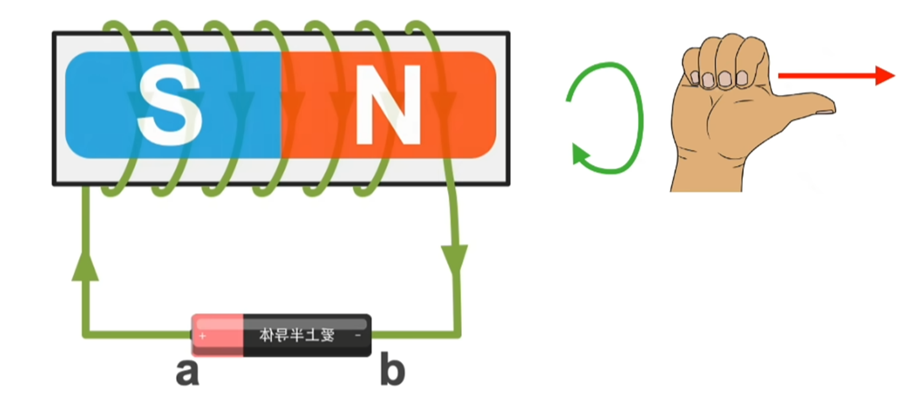

**单项无刷电动机**

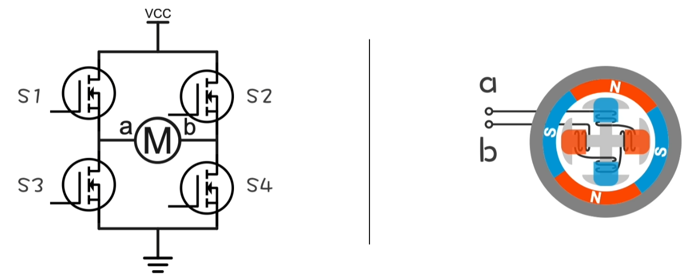

控制正反转：

* S1 S4闭合 S2 S3断开，电流从a流向b
* S2 S3闭合 S1 S4断开，电流从b流向a

控制转速：

* 如闭合S1，不停开关S4，输出PWM波形

获取转动角度：

* 采用霍尔编码器HALL

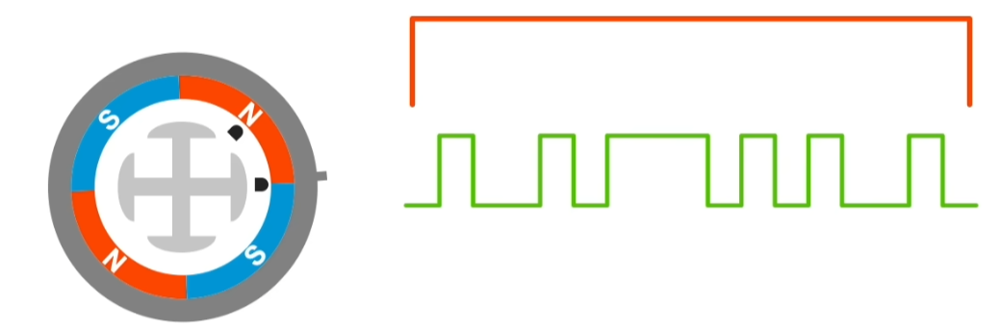

**三相无刷电动机**

刷电机的驱动电路主要使用**三相逆变电路**来实现

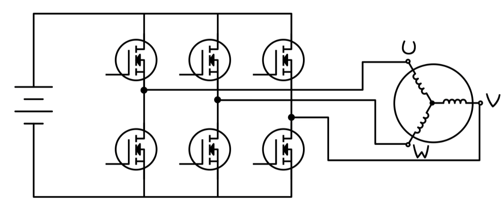

所谓**逆变电路**，即把**直流电**变换为**交流电**，或者简单点说就是一个可以产生不同电流流向的电路，通过前面的电机模型分析我们也可以看出，对于无刷电机的驱动是需要在不同时刻施加不同方向的电压（电流）的，因此需要逆变电路。

而逆变电路具体的实现则一般是采用**半桥MOS电路**来制作的。半桥电路的原型如下，其实很简单，就是两个MOS管组成的**上桥臂**和**下桥臂**，中间引出一条输出线

用3个半桥电路就可以组合成三相逆变电路，每个半桥引出的一根输出线跟无刷电机的一根相线相连，就完成了最基本的无刷驱动电路。

通过控制三个半桥的不同开关状态，可以控制电流在电机中的不同流向了。

在这个电路中，每个状态下电机的三相线圈都会有电流；可以产生更大的扭矩，所以当然是更好的选择啦。

将半桥电路的状态做一个编码，首先限定一个半桥只有两种状态：

- 上桥开通下桥关断定义为状态**1**
- 上桥关断下桥开通定义为状态**0**

这样，三组半桥就一共有8种组合方式，编码分别为：**000**、**001**、**010**、**011**、**100**、**101**、**110**、**111**，记住这点，后面会用上~

可能有人会问，为什么一个半桥只能上桥臂和下桥臂有一个导通呢？都关闭或者都导通不行？？
害，仔细想想就知道，上下都导通显然是不可能的，因为这就相当于把电源短路了啊...
那上下都断开呢？也不需要，因为这样就回到前面提到的，这时候电机有一相不起作用，浪了个费。

# 简介

FOC（Field-Oriented Control 磁场定向控制），也被称作矢量控制（VC，Vector Control），无刷直流电机（BLDC）和永磁同步电机（PMSM）高效控制的最优方法之一。FOC旨在通过精确地控制磁场大小与方向，使得电机的运动转矩平稳、噪声小、效率高，并且具有高速的动态响应。

**FOC驱动器和无刷电调的区别**

**FOC的优势：**

1. **低转速下控制**
   由于控制原理的区别，无刷电调只能控制电机工作在高转速下，低速下很难控制；而FOC控制器则完全没有这个限制，不论在什么转速下都可以实现精确控制。
2. **电机换向**
   同上面的理由，由于无感电调无法反馈转子位置，因此很难实现电机正反转的换向；而FOC驱动器的换向性能极其优秀，最高转速下正反转切换可以非常顺畅；此外FOC还可以以能量回收的形式进行刹车控制。
3. **力矩控制**
   普通电调都只能控制电机转速，而FOC可以进行电流（力矩）、速度、位置三个闭环控制。
4. **噪音**
   FOC驱动器的噪音会比电调小很多，原因是普通电调采用方波驱动，而FOC是正弦波。

**电子调速器（ESC）的优势：**

1. **兼容性**
   电调驱动不同的BLDC不需要进行参数整定，而FOC需要。
2. **算法复杂度**
   电调的算法实现更简单，运算量少，很适合需要提高带宽的超高转速电机。
3. **成本**
   电调的成本比FOC低很多。

# Clark

## 克拉克变换

交替开关的MOS管可以实现电机的转动，而这些交替开关的MOS管是以极其快的速度在周期性进行的，把这些周期性的开启和关断过程联系起来，并且对其各个相进行单独观察，就可以得到三个相A、B、C的电流随时间变换的曲线，他们之间存在120°的相位差。要能够**控制这个相位差为120°的sin状波形，就能够实现针对电机的控制**。而这个波形是极难控制和改变参数的。首先相与相之间是相互耦合的，MOS管一打开就会至少同时打开两个相，所以只想改变一相来实现电机控制是肯定不行的，必须得三相捷联起来一起改变，才能够实现电机的控制。所以，实现电机控制的问题就会变成很复杂。我们需要对这个问题进行降维，尽量把这个多变量耦合的问题降解为最好是单一变量的控制问题，克拉克变换就是想做这件事。

所谓**克拉克变换，实际上就是降维解耦的过程，把难以辨明和控制的三相相位差120°电机波形降维为两维矢量**。它的思路其实特别的简单

* 第一就是把三相随时间变换的，相位差为120°的电流波形抽象化为三个间隔120°的矢量。
* 第二就是利用三角函数对矢量进行降维，降维到两个坐标轴，从此复杂的三相变化问题就降解为了α-β坐标轴的坐标上的数值变化问题。

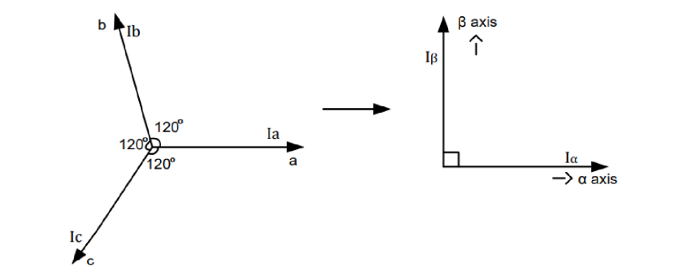

左边是我们把三相120度相位差的sin状波形抽象化为矢量之后的样子，而右边就是我们需要**把这三个矢量进行投影的坐标轴。只要我们把三个矢量都投影到坐标轴上，那么，一个三矢量问题就变成一个二维坐标平面问题**。

**投影过程的详细推导**

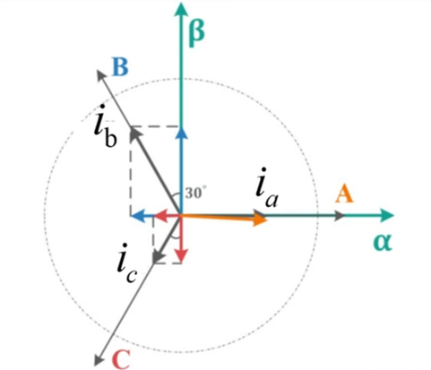

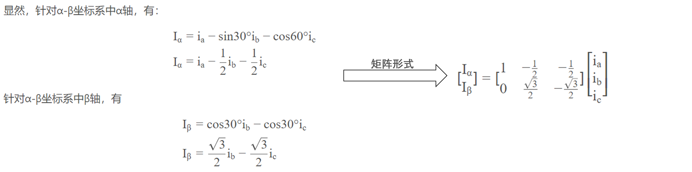

于是我们就回到直角坐标系啦，是不是很开心，变换前后的波形如下：

可以看到变换后其实还是正弦波...只不过我们少了一个需要控制的变量了，现在只需要控制 $i_a$,$i_b$ 这两个变量，让其满足上图的下面的波形变化规律就可以控制电机旋转 了，频率还是不变的。

**克拉克变换的等辐值形式**。

上面的步骤都很简单，但是我们会发现，往往最终论文或者资料上克拉克变换的体现形式都不是上面这样子，而是会加上一个系数，如$\frac{2}{3}$（等幅值变换系数），或者$\sqrt{\frac{2}{3}}$（等功率吧变换系数）。分别对应两个变换方式，分别为等功率（系数：$\sqrt{\frac{2}{3}}$）变换方式和等幅值（系数：$\frac{2}{3}$）变换方式。这里仅讨论等赋值变换加上系数后，原本的投影式变为：

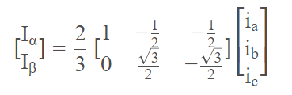

何为等幅值变换？用α相电流输入1A电流的特例来举例，当电流输入时候，根据基尔霍夫电流定律（电路中任一个节点上，在任意时刻，流入节点的电流之和等于流出节点的电流之和），有：$i_a+i_b+i_c = 0$

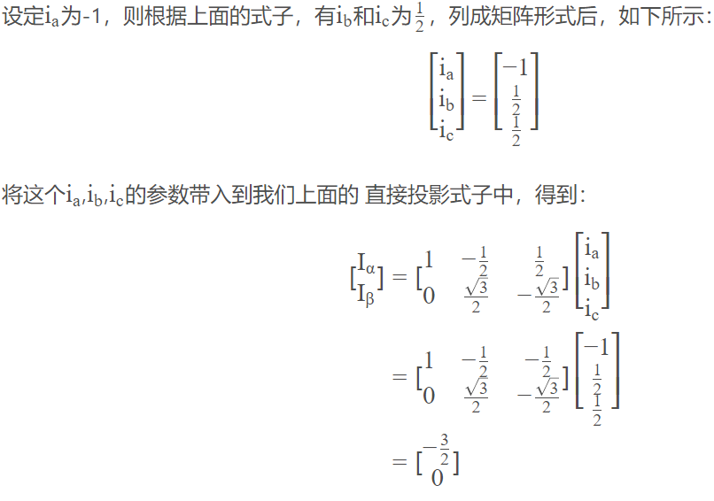

这就看出问题了，显然，尽管矢量a与α轴重合，但是由于b,c相电流投影的存在，导致在a相输入1A电流，反应在α轴上的电流并不是等赋值的1A，而是$-\frac{3}{2}$。

因此，为了让式子等辐值，即使得a相1A时，反应在α轴上的电流也是1A，我们就得乘上系数$\frac{2}{3}$，式子变换为：

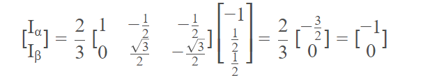

这就是**克拉克变换的等幅值表现形式**。

基于等赋值变换，我们就能够得到α、β相位与$i_a$,$i_b$,$i_c$的关系，已知等赋值变换式：

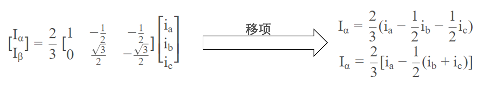

又根据上面所提到的基尔霍夫电流定律：

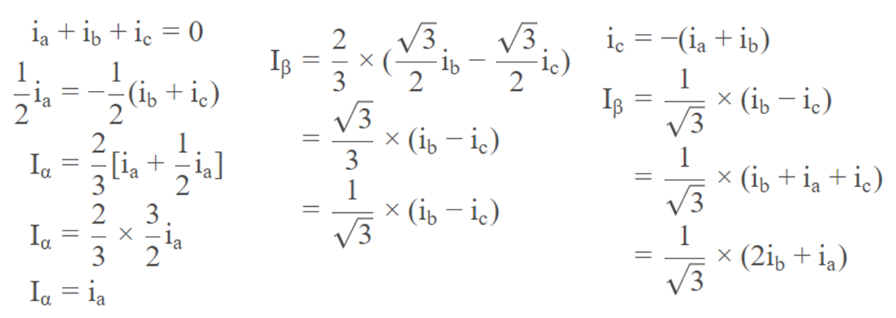

综合上述步骤，我们已经得到了列出$i_a$,$i_b$,$i_c$电流与$I_a$,$I_b$电流的关键关系式，总结如下：

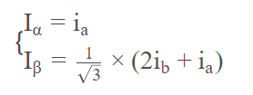

## 克拉克逆变换

我们学习了怎么把一个三相时域上的复杂问题用矢量表示，并且用克拉克变换对它进行了降维，得到了降维后的简化表达形式。那么，有没有什么办法能够反过来把降维后的形式重新升维变回原来的$i_a$,$i_b$,$i_c$三相电流波形呢？有，这就被称为**克拉克逆变换**。这个在后续的FOC算法中也会很常用到。

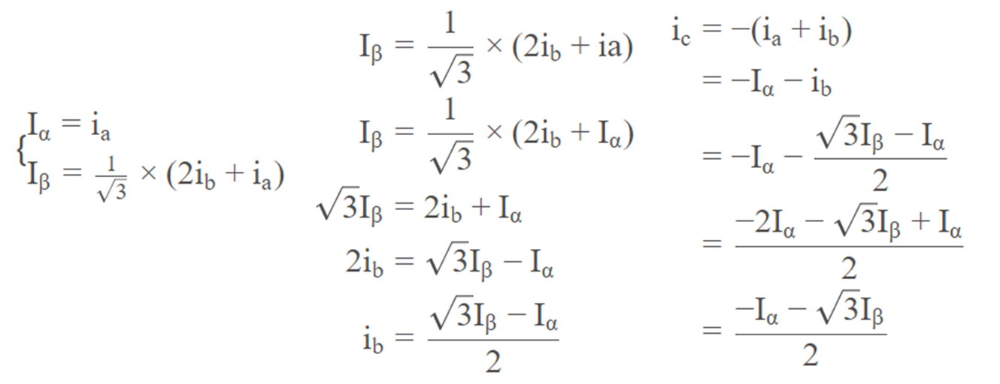

则克拉克逆变换三式皆得，总结如下：

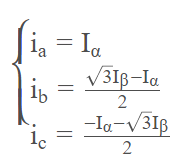

**总结**

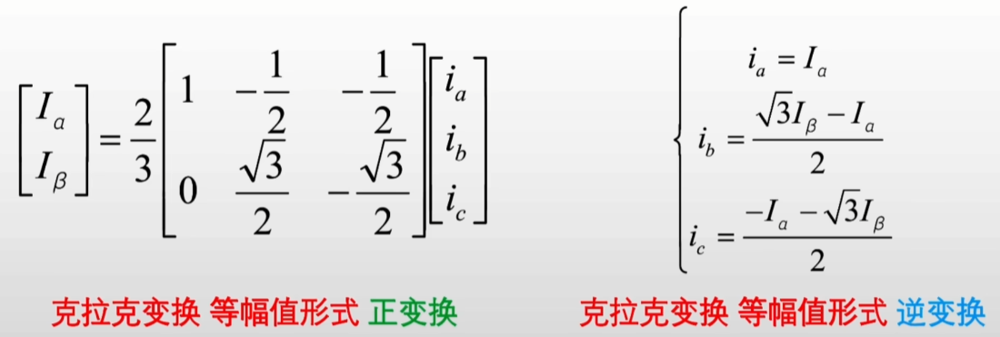

有趣的是我们还可以接着变换：虽然 $α-β$坐标系下少了一维变量，但是新的变量还是非线性的（正弦），有没有办法把它们线性化呢？有的，`Park变换`就是做这个工作的。

# Park

## 帕克变换

由克拉克变换，实际上我们已经成功对电机的正弦驱动三相曲线进行降维度，使之变成了一个两轴坐标问题，并且得到其转换关系。但是只有它是不够的，我们还需要将这个理论和旋转电机对应起来，也就是**建立电机旋转时的数学模型**。

我们需要知道**能够使得电机旋转**的$I_α$和$I_β$电流输入规律，如果我们可以知道这个能够使得电机旋转的$I_α$和$I_β$电流输入规律，就可以通过克拉克逆变换，把这个旋转情况下的$I_α$和$I_β$逆变换为$i_a$,$i_b$,$i_c$三相电流波形，从而就实现了用把$i_a$,$i_b$,$i_c$降维后的$I_α$和$I_β$实现对电机的控制

**帕克变换**就是能够帮助我们求得各种旋转情况下的$I_α$和$I_β$。

其实整个帕克变换的思路很简单，首先，我们把电机的定子线圈上固定一个$α-β$坐标系，如下图左边的图所示，这时候，我在坐标系的右边放上一个转子，如下图右边所示，如果此时转子被吸引且不动，那么在$α-β$坐标系中就一定有一个$I_α$和$I_β$值是能够对应转子现在的状态的

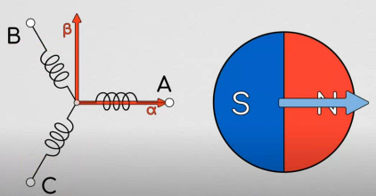

但是，显然，我们的问题不是不动那么简单，在实际的应用中，我们的转子是在转动的，因此，对应转子状态的$I_α$和$I_β$值实际上在一直变化

有没有办法能够用一个定值来描述无刷电机的旋转呢？也就是说，能不能对这个电机系统进行进一步的降维，使得我们甚至不用考虑变化的$I_α$和$I_β$，只需要有一个定值就能够描述整个电机系统的转动状态？

帕克在我们刚刚固定在电机定子上的$α-β$坐标系上，另外新建了一个可以随电机转子转动的$Q-D$坐标系，它与电机转子固联！！如下图所示：

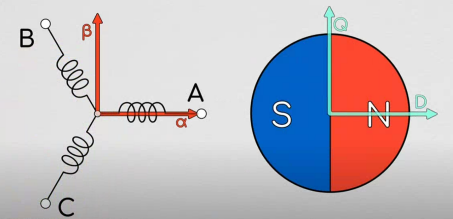

两个坐标系，一个是固定在定子上的$α-β$坐标系，一个是固定在转子上的$Q-D$坐标系。

进一步的，把两个坐标系画在一起，就有如下图所示的坐标：

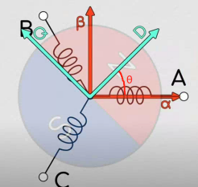

其中，$Q-D$坐标系随转子转动，D轴在此处设定为指向电机的N级，$Q-D$坐标系因转动而造成的与$α-β$坐标系的差角θ，就被称为电角度！

那么，很轻松的，还是利用简单的三角函数构建的旋转矩阵，在知道电角度的前提下，我们很容易就能够把$Q-D$坐标系上的值映射（旋转）到$α-β$坐标系上！式子如下：

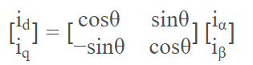

因此，在知道电角度的前提下，我们就可以用$Q-D$坐标系上的定值来描述电机的旋转！**这正是我们一直渴望的电机旋转数学模型！**

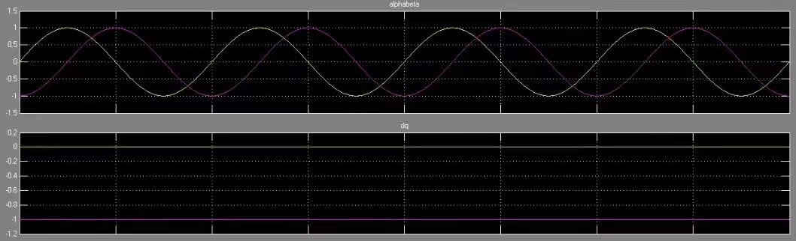

因为我们会通过编码器输入转子的实时旋转角度，所以这个角度始终是一个已知数。经过这一步的变换，我们会发现，一个匀速旋转向量在这个坐标系下变成了一个定值！（显然的嘛，因为参考系相对于该向量静止了），这个坐标系下两个控制变量都被线性化了！

## 帕克逆变换

根据矩阵乘法，取逆，我们可进行帕克逆变换，也就是知道$I_q$,$I_d$值和电角度的前提下，反求$I_α$和$I_β$,式子如下：

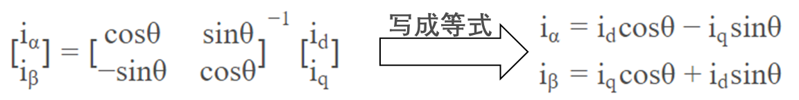

在实际的FOC应用中，电角度是实时有编码器求出的，因此是已知的。$I_q$,$I_d$可以合成一个矢量，加上电角度（旋转）的存在，因此可以看成一个旋转的矢量。在通过$I_q$,$I_d$和电角度求得$I_α$和$I_β$后，就可以通过克拉克逆变换求得$i_a$,$i_b$,$i_c$的波形，这正是FOC的基本过程！

通常在简单的FOC应用中，只需要控制$I_q$的电流大小，而把$I_d$设置为0。此时，$I_q$的大小间接就决定了定子三相电流的大小，进而决定了定子产生磁场的强度。进一步我们可以说，它决定了电机产生的力矩大小！

而$I_q$是旋转的矢量；在前面说了，同时$I_q$又会间接影响磁场的强度，这正是FOC的名称**磁场定向控制**的由来。

注意：所有的推导其实都是根据电流矢量。实际上我们都是使用电压来控制的。根据欧姆定律，乘以电阻R，它就会变成每相的电压矢量$U_a$,$U_b$,$U_c$，而无刷电机的电流矢量，和电压矢量其实没有任何的区别，只是他们的幅值不同！

# 简易FOC

## 电角度

因$Q-D$坐标系的转动，与$α-β$坐标系产生的夹角称为电角度

电角度和机械角度的换算公式是：**电角度=机械角度x极对数** 。

为什么电角度=机械角度x极对数，那是因为，如果只是刚刚的一级对电机，那么的机械角度转一圈，相位的一个周期是能够和机械角度一一对应的，此时电角度=机械角度；但是，如果是多级电机，那么机械角度转一圈，相位的周期可能是很多个。比如，当2极对电机时，转一圈对应两个相位周期，但是，我们在算法表示的时候又希望这两个相位周期都能得到数值上的一一对应，于是就出现了电角度=2x机械角度；以此类推，当极对数为11时，机械角度的转一圈对应11个相位周期，因此，为了电角度能得到一一对应，就有了电角度=11x机械角度。以此类推，我们就有了公式：**电角度=机械角度x极对数**

## 位置闭环

需要额外注意的是，电机位置闭环控制中，帕克逆变换计算所需要用到的**电角度**，而输入部分需要的是**机械角度**

  

**误差位置e=期望位置−偏差位置**

假设误差为45度，需要根据45度的误差求出一个力矩Uq，使得Uq能够让电机产生力矩，使得电机转子回位。

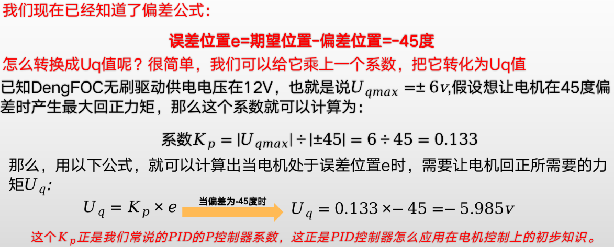

注意：只用到了P环，而I环、D环没有用到；在速度环中介绍I环

## 速度闭环

速度闭环算法和位置闭环算法的区别很小，主要的和位置环在原理性上的区别，就是位置闭环的编码器反馈量是角度，而速度闭环的编码器反馈量是速度。

**PID位置控制**

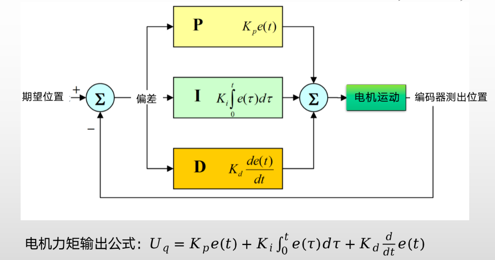

# 详细FOC

在FOC控制中主要用到三个PID环，从内环到外环依次是：**电流环**、**速度环**、**位置环。**电流环并不一定需要

## **电流环**

图中使用的是SVPWM算法，代替克拉克变换

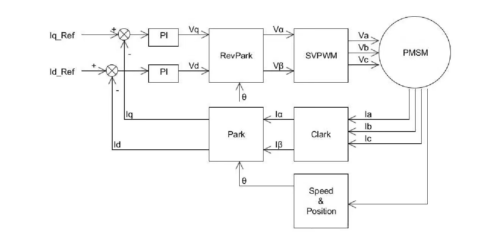

这幅图是以电流闭环控制为例的，也就是让电机始终产生一个恒定的力矩（也就是恒定的电流，因为力矩和电流成正比）。

可以看到控制器的输入是最左边的 $I_q{ref}$,$I_d{ref}$，两个变量经过PID控制器进行反馈调节，其中还涉及到几个变换模块，有`Park变换`和`Clark变换`；最后通过前面提到的`SVPWM模块`作用到三相逆变器上进而控制电机；而PID控制器的反馈量，是对电机输出电流的采样值。

**FOC控制的整个过程是这样的：**

1. 对电机三相电流进行采样得到 $I_a$,$I_b$,$I_c$
2. 将  $I_a$,$I_b$,$I_c$ 经过`Clark逆变换`得到$I_α$,$I_β$
3. 将$I_α$,$I_β$经过`Park变换`得到 $I_q$,$I_d$
4. 计算  $I_q$,$I_d$和其设定值  $I_q{ref}$,$I_d{ref}$的误差
5. 将上述误差输入两个PID（只用到PI）控制器，得到输出的控制电压$U_q$,$U_d$
6. 将$U_q$,$U_d$进行`反Park变换`得到 $U_α$,$U_β$
7. 用 $U_α$,$U_β$合成电压空间矢量，输入`SVPWM模块`进行调制，输出该时刻三个半桥的状态编码值（前文有提到）
8. 按照前面输出的编码值控制三相逆变器的MOS管开关，驱动电机
9. 循环上述步骤

实际只用到了PI控制，没有引入微分，因为如果推导一下电压和电流的传递函数会发现这其实就是一个一阶惯性环节（而且实际上我们可以通过零极点对消来简化掉PI参数，只需要控制一个参数即电流带宽即可）。

上图中的`Speed & Position`模块可以是编码器，或者霍尔传感器等能感应转子位置的传感器 。将获得的值传递给帕克逆变换和电流采样中的帕克变换

特别说明一下其中的 $I_q$,$I_d$, $I_q{ref}$,$I_d{ref}$前两者通过`Clark变换`和`Park变换`得到的，而后两者是我们预期希望前两者达到的值，这个值具体代表了什么物理量呢？参考一下下图：（我们希望毛驴向前走，Iq是主要的力量，而不需要Id）

也就是说我们一通操作将转子磁链进行了解耦，分解为了转子旋转的**径向**和**切向**这两个方向的变量：

- 其中 $I_q$是我们需要的，代表了期望的力矩输出
- 而 $I_d$是我们不需要的，我们希望尽可能把它控制为0

通过PID控制器使用上述输入（电流采样值、编码器位置）和输出（MOS管开关状态）完成对电机电流的闭环控制。

## **速度环-电流双闭环**

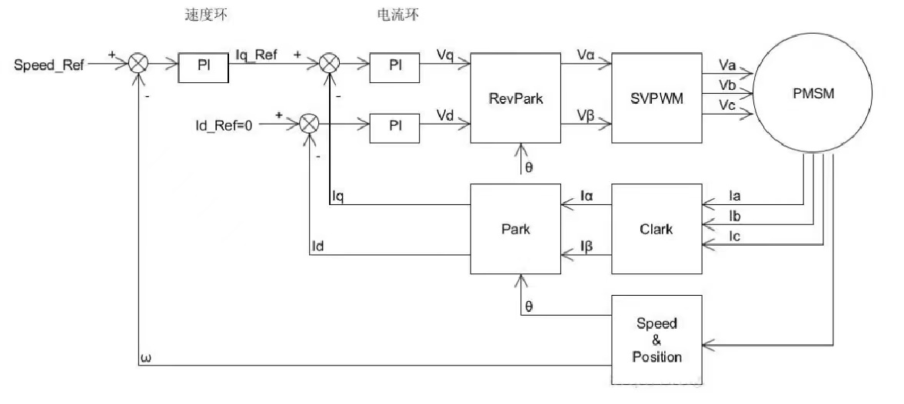

在上图中， $Speed_{ref}$ 是速度设定值， $ω$是电机的转速反馈，可以通过电机编码器或者霍尔传感器等计算得到，依然是使用**PI控制**。

将计算得到的电机速度  $ω$与速度设定值 $Speed_{ref}$  进行误差值计算，代入速度PI环，计算的结果作为电流环的输入，就实现了速度-电流的双闭环控制。

## **位置-速度-电流三闭环**

最外一层是位置环，也就是可以控制电机旋转到某个精确的角度并保持，控制框图如下：

在实际使用中，由于编码器无法直接返回电机转速 $ω$ ，因此可以通过计算一定时间内的编码值变化量来表示电机的转速（也即用**平均速度**代表**瞬时速度**）

## **位置-电流双闭环控制**

所以为了避免速度环节带来的误差，在做位置控制的时候可以只使用位置和电流组成的双环进行控制，不过此时需要对位置环做一定的变化，控制框图如下：

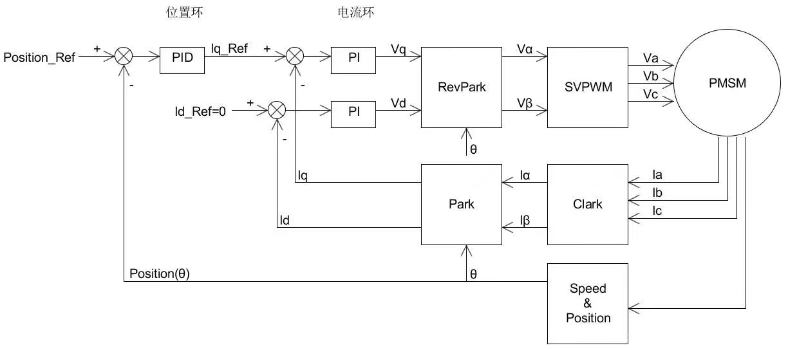

由于去掉了速度环，这里的位置环我们使用完整的**PID控制**，即把微分项加上（因为位置的微分就是速度，这样可以减小位置控制的震荡加快收敛；积分项的作用是为了消除静态误差）。

# SVPWM

**幅值**是在一个周期内，交流电瞬时出现的最大绝对值，也叫最大值、振幅、峰值，也是一个正弦波

SVPWM（Space Vector Pulse Width Modulation，空间矢量脉宽调制）

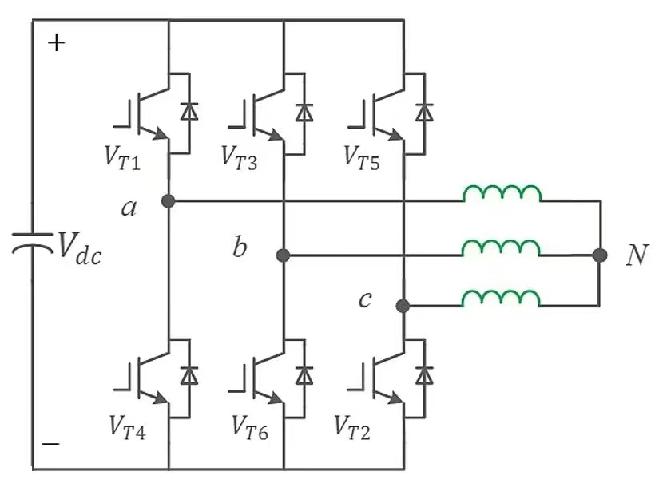

工业电源输出电压的频率和幅值是固定的。我们首先可以将工业电源输出的电压变为直流电压源，也就是图中大家可以看到的 $V_{dc}$ ，这一步叫做**整流**。这一直流电压源通过图中的三相逆变器就可以变换为频率和幅值可以变化的电压，这一步叫做**逆变**。

**SVPWM算法实际上计算的是上图所示逆变器的六个开关何时导通，何时切断。**

此时等效电路如图：

$V_{AN} = -V_{NA}$ 是 电机$A$相绕组的**相电压（也即电机绕组的相—中性点电压）**， $V_{BD}$和$V_{CN}$代表的意义类似。 $N$是Neutral的首字母，代表电机三相绕组的中性点。相电阻$R_{b}$和$R_{c}$并联，它们的总电阻就是相电阻$R_{a}$的一半（三个电阻相等）。

设$R_{a}$,$R_{b}$,$R_{c}$的电阻为$2R$，则电路中的并联电阻 $R_{b}$,$R_{c}$的电阻和为$1R$,电路中的总电阻为$3R$

因此电机中三个**相电压**（相电压是每相相对于电机中间连接点的电压）可以表示为：可以看到最大为$\frac{2}{3}$

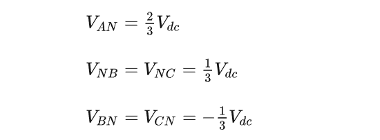

**将半桥电路的状态做一个编码**，首先限定一个半桥只有两种状态：

- 上桥开通下桥关断定义为状态**1**
- 上桥关断下桥开通定义为状态**0**

这样，三组半桥就一共有8种组合方式，编码分别为：**000**、**001**、**010**、**011**、**100**、**101**、**110**、**111**

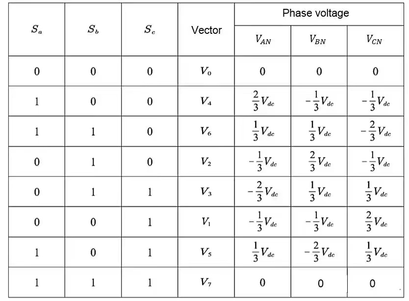

$V_4$ 代表半桥1的上臂打开，半桥2 3的下半桥打开，即一入 二出。把二进制的（1 0 0）转化为10进制后是数字4，所以下标4就代表该状态。电机的三个相绕组是在空间中互相间隔120°放置的，那么在这三个电机相绕组上的相电压在空间中就合成了一个空间电压向量。

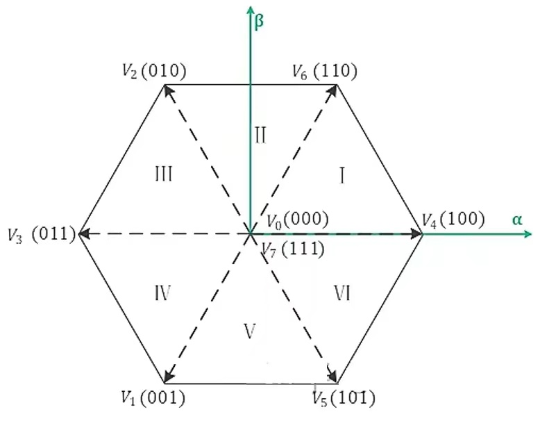

解释：上方8个基本矢量的由来，在普通的三相控制中，我们只有1相流入，2相流出，对应上图的(100 010 001)。为了加大扭矩，使用了2相流入，1相流出，对应上图的(110 011 101)。另外两个基本矢量为 000 111，即3相流出 或 3相流入，**可以看出零矢量状态下电机三相间电压都为0不产生转矩**

**八个矢量被分为两组：**一组零向量$V_{0}$、$V_{7}$ 和一组非零向量$V_{4}$、$V_{6}$、$V_{2}$、$V_{3}$、$V_{1}$、$V_{5}$；每个**基本矢量的最大值为$\frac{2}{3}U_{dc}$**,$U_{dc}$为母线电压

**扇区：**被两个相邻的基本向量包围的区域就是扇区，分为6个逆时针排列的扇区，如果顺时针排列在后边的计算中对应加上负号

**扇区示意图与三相正弦波对应关系**

每两条正弦波相交时就对应了一个基本矢量。由图中还可以看出 每两条正弦波相交的时刻相加 等于 另一条正弦波

**旋转矢量为正六边形，而不是圆形**

**那么这里问题就来了：由这6个空间电压矢量只能产生6个方向的力矩啊，我们怎么产生任意方向的力矩呢？**

答案就是：**使用这6个空间电压矢量作为基向量来合成任意矢量**。在每一个扇区，选择相邻两个电压矢量以及零矢量，按照**伏秒平衡原则**来合成每个扇区内的任意电压矢量，即：

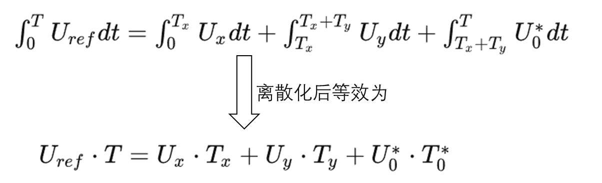

式子中的$U_{ref}$是我们期望得到的电压矢量，**T是一个PWM周期**。

$U_{x}$和 $U_{y}$分别是用于合成 $U_{ref}$的两个空间电压矢量，也就是上面说的6个基向量中的两个，至于是哪两个？这跟 $U_{ref}$所在的扇区有关，比如 $U_{ref}$在Ⅰ扇区，那么$U_{x}$和 $U_{y}$就是$U_{4}$和 $U_{6}$ ； $T_{x}$和$T_{y}$就是在一个周期T中 $U_{x}$和 $U_{y}$所占的时间。
$U_{0}^{*}$指的是两个零矢量，可以是 $U_{0}$也可以是 $U_{7}$，零矢量的选择比较灵活，通过合理地配置零矢量可以让空间电压矢量的切换更平顺，后面会做说明。

$V_{0}$、$V_{1}$、$V_{2}$、$V_{3}$、$V_{4}$、$V_{5}$、$V_{6}$、$V_{7}$ 计算方式

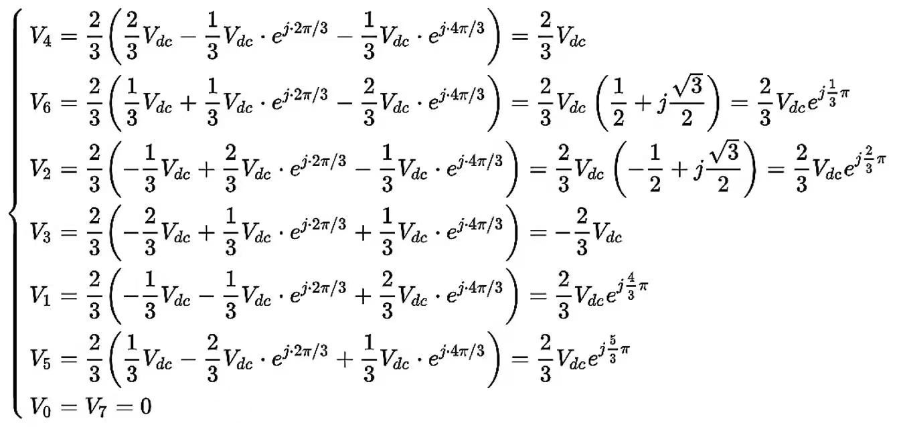

所以上面公式的含义就是：**我们可以周期性地在不同空间电压矢量之间切换，只要合理地配置不同基向量在一个周期中的占空比，就可以合成出等效的任意空间电压矢量了。**

**终极思想：**六个基本矢量只能控制六个方向，为了产生任意的方向，我们使用两个相邻基本矢量，对这两个矢量的值合理配置就能实现对所在扇区内任意方向的控制；而我们有六个扇区，只需要不停改变对应扇区的两个基本矢量就能控制整个圆形内任意方向

下面举一个栗子，假设我们要合成图中所示的 $U_{ref}$ ，在Ⅰ扇区：

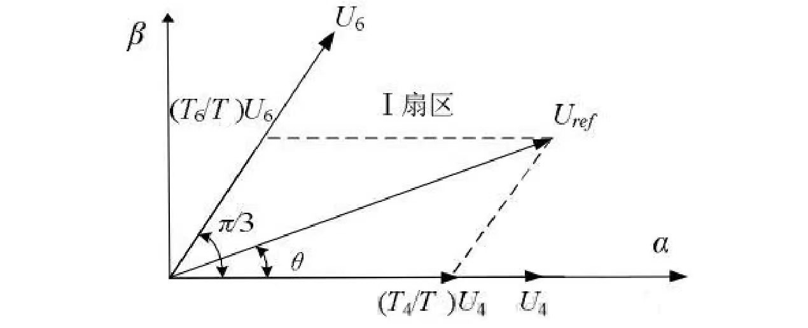

即通过控制$U_{4}$ 和$U_{6}$ 来合成$U_{ref}$ 。将$U_{ref}$ **投影**分解到$U_{4}$ 和$U_{6}$ ，由正弦定理有：

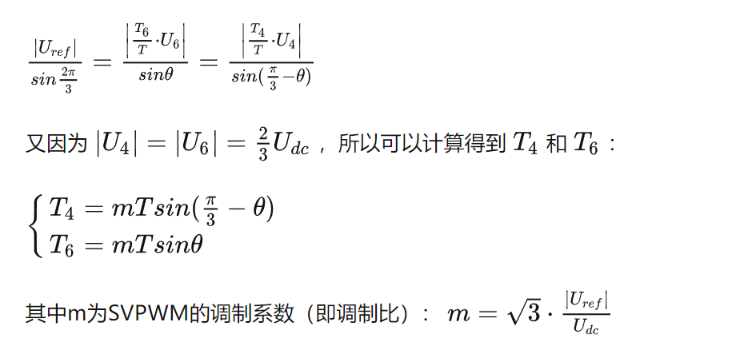

显然在电流环控制过程中m设置得越大代表了期望力矩越大。

而零矢量分配的时间为：$T_{0} = T_{7} = \frac{1}{2}(T-T_{4}-T_{6})$

为什么 $T_{0} = T_{7}$？这是我们将PWM波形设定为中央对齐模式对称配置零矢量的结果，后面会提到。

**注意：**上方推到只是将将$U_{ref}$ 投影分解到$U_{4}$ 和$U_{6}$ ，而最终我们投影到$α-β$坐标系中

现在一个周期内所有状态的持续时间我们都得到了，还差一个顺序，也就是**各个状态切换的顺序**。

理论上任何切换顺序都是ok的，但是实际中我们需要考虑更多限制，比如因为MOS管存在开关损耗，**我们希望能尽量减少MOS管的开关次数**，那么以最大限度减少开关损耗为目的，将基本矢量作用顺序的分配原则选定为：在每次开关状态转换时，只改变其中一相的开关状态。并且对零矢量在时间上进行了平均分配，以使产生的 PWM 对称，从而有效地降低 PWM 的谐波分量。

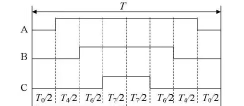

上图中可以看出来，在每个状态切换的时候，都只有一个相发生了转变：**000**->**100**->**110**->**111**->**110**->**100**->**000，**这也是所谓的**七段式**SVPWM调制法。

同时我们通过在合理的位置插入两个零矢量，并且对零矢量在时间上进行了平均分配，以使产生的PWM对称，从而有效地降低了PWM的谐波分量。使用**零矢量是为了平滑过渡**

上面的图片反应了第一扇区的情况：$V_{0} -> V_{4} -> V_{6} -> V_{7} -> V_{7} -> V_{6} -> V_{4} -> V_{0}$  

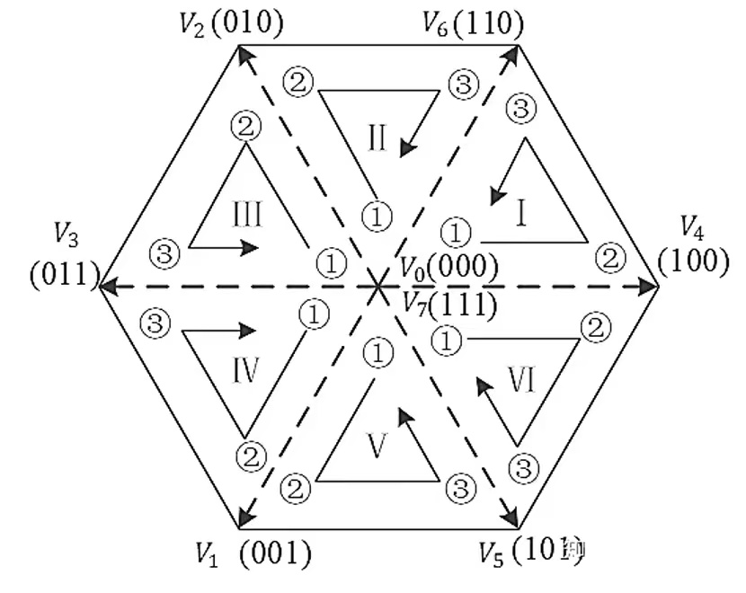

**下图为六个扇区下的矢量序列** ，abc为无刷电机的三根线

设置不同的T，就可以在对应的线上输出PWM

**SVPWM扇区的计算**

最终投影到$α-β$坐标系中，即逆帕克变换的输出

**以第一扇区为例**

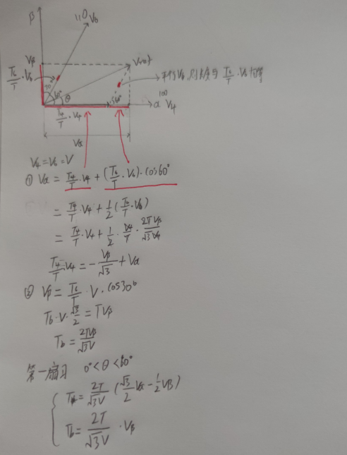

六个扇区对应在$α-β$坐标系中

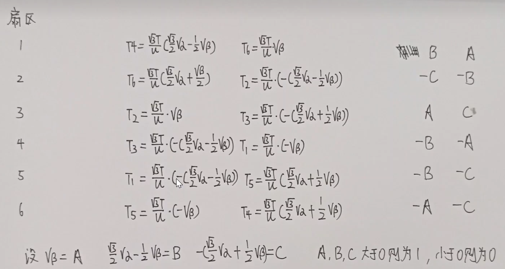

合成矢量Uref 所处扇区N 的判断 

    空间矢量调制的第一步是判断由Uα 和Uβ所决定的空间电压矢量所处的扇区。
    假定合成的电压矢量落在第 I 扇区，可知其等价条件如下： 0<arctan(Uβ/ Uα) <60
    落在第 I 扇区的充分必要条件为：Uα  > 0 ，Uβ  > 0 且Uβ/Uα  <√3。
    同理可得到合成的电压矢量落在其它扇区的等价条件，得出：
    
    Uref落在第Ⅱ扇区的充要条件为：Uβ>0 且Uβ/ Ua>√3；
    
    Uref落在第Ⅲ扇区的充要条件为：Ua<0 ，Uβ> 0 且-Uβ/Ua  <√3；
    
    Uref落在第Ⅳ扇区的充要条件为：Ua<0 ，Uβ  < 0 且Uβ/Ua  <√3；
    
    Uref落在第Ⅴ扇区的充要条件为：Uβ<0 且 -Uβ/Ua>√3；
    
    Uref落在第Ⅵ扇区的充要条件为：Ua>0 ，Uβ<0且-Uβ/Ua  <√3；

若进一步分析以上的条件，可看出参考电压矢量 Uref 所在的扇区完全由三式决定，因此令：

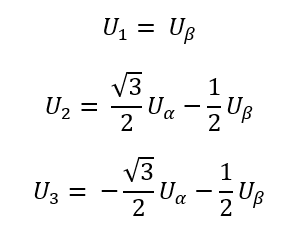

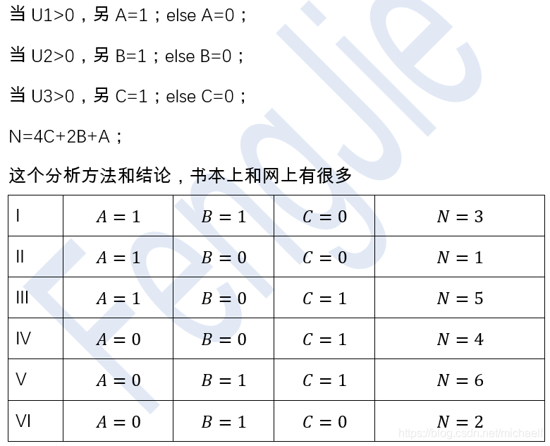

N的值位ABC三值的8421编码。

采用上述方法，只需经过简单的加减及逻辑运算即可确定所在的扇区，对于提高系统的响应速度和进行仿真都是很有意义的。比如$U_1>1 U_2>1 U_3<1$则在第一扇区

**矢量作用时间计算**

算得的值最终设置到Tim中

以第一扇区为例

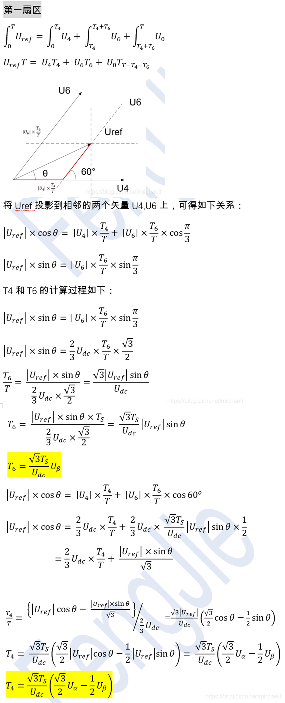

**总表**

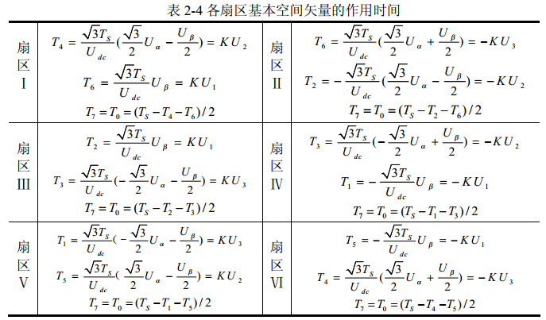

对照矢量图，可以总结如下：

**反帕克变换后得到$U_{α}$ 和 $U_{β}$，由$U_{α}$ 和 $U_{β}$ 判断合成矢量所在扇区，然后查上表得出两非零矢量的作用时间，最后得出三相开关管PWM波的占空比**
