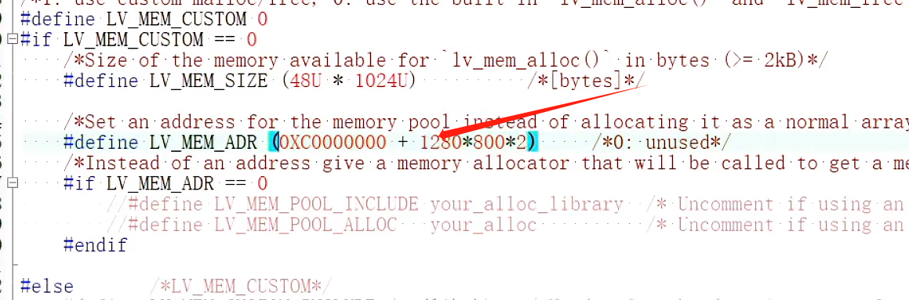
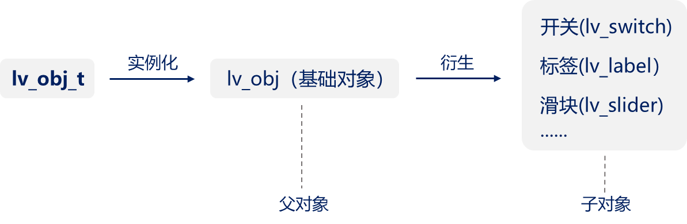
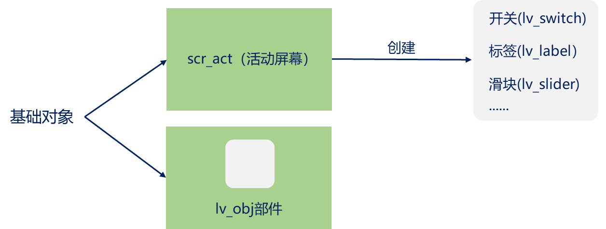
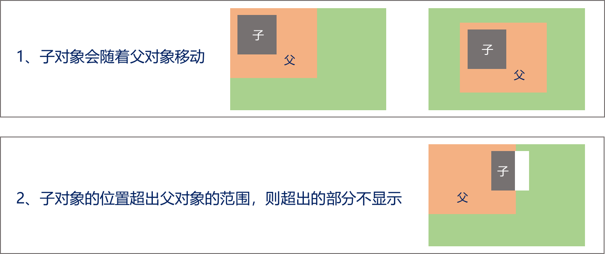

如果使用小内存的单片机：按需修改lv_conf.h下的LV_MEM_SIZE宏


如果屏幕显示卡顿，可以对Buf缓冲区适当扩大


## 外部SRAM

分为两种：


把LVGL管理的内存空间放到外部SRAM

修改lv_conf.h中关于LVGL管理内存的宏，填写外部SRAM首地址，可适当偏移(SRAM中可能存放其他内容，LVGL的管理内存不能覆盖其他内容)




把绘图缓冲区放到外部SRAM


# 模拟器

**环境搭建及工程获取**

* 环境搭建
  * 安装包获取：https://www.codeblocks.org/downloads/
  * 软件版本：codeblocks-20.03mingw-setup
* 工程获取
  * 途径1：LVGL官网à github仓库，https://lvgl.io（不推荐初学者使用）
  * 途径2 ：A盘资料à程序源码à扩展例程àLVGL例程à例程3 PC端模拟LVGL（推荐）

**PC端模拟LVGL**

* 配置屏幕分辨率、修改配置文件（重要）
  * 打开刚才下载并配置好的文件：修改    `lv_win32_init(hInstance, SW_SHOWNORMAL, 800, 480, NULL);        // 屏幕分辨率`
* 代码分层，建立专门存放lvgl用户代码的文件，移植和管理更加方便：放入`main()`文件调用
* 编写用户代码，在主函数中调用


# 基础对象

C语言中没有“类”的概念，LVGL以结构体的形式来实现“类”的思维。



基础对象（lv_obj）可以作为父对象，来创建其他对象，同时它也可作为部件使用。



**父和子对象的关系**




## 函数

基础对象类型：`lv_obj_t`

创建基础对象：`lv_obj_t* lv_obj_create(lv_obj_t* parent);`,其中产生为父对象，第一次创建可以`lv_scr_act()`使屏幕当做父对象

````c
void myLVGL(void){
    lv_obj_t *obj1 = lv_obj_create(lv_scr_act());	// obj1以屏幕作为父对象
	lv_obj_t *obj2 = lv_obj_create(obj1);			// obj2以obj1作为父对象
}
````

## **基本属性**

* 大小（size）
* 位置（position）
* 对齐（alignment）
* 样式（styles）
* 事件（events）

### 大小

````c
lv_obj_set_width(obj, new_width);			// 设置宽度
lv_obj_set_height(obj, new_height);			// 设置高度
lv_obj_set_size(obj, new_width, new_height);// 同时设置宽度、高度
````

