Ubuntu IP:192.168.137.128

Windwos IP:192.168.31.248


IRDA红外遥控模块 HS0038

~~DHT11 温湿度传感器~~

~~DS18B20温度传感器~~

~~SR501人体红外模块~~

~~SR04超声波测距模块~~

28BYJ-48电机 MX1508驱动

OLED模块 SSD1306 SPI 

~~TLC5615 DAC模块 SPI接口~~

GPS模块

AT24C02


应用开发：

* 《第四篇：嵌入式Linux应用开发基础知识》
* 《第六篇：嵌入式Linux项目基础》

驱动开发：

* 《Linux驱动入门实验班》    哔哩哔哩不全
* 第5篇《嵌入式Linux驱动开发基础知识》
* 《70天Linux驱动快速入门》

实战：

* 嵌入式Linux应用开发之编写APP操作硬件


# 没搞懂

freetype ~ tslib重看

IIC重看


# 环境搭建

## 串口

使用USB连接开发板，出现的是CH9102，串口号是COM7


通过Xshell使用串口连接开发板


输入：root即可进入开发板


## 双网卡

Ubuntu 使用 NAT 与 windows 连接

Linux开发板 使用桥接网卡 与 Ubuntu、windows 连接

由于使用NAT后，我的windows电脑网络特别卡


所以使用两个桥接模式，但是Ubuntu不能联网了

````c
开发板:	桥接1:192.168.5.22 桥接2::192.168.5.9
windows:  192.168.5.10
ubuntu:	  192.168.5.11
````

最终：

windows通过Xshell的串口连接开发板

windows通过Xshell 192.168.5.22 连接Ubuntu

Ubuntu通过NFS挂载到开发板


**桥接**

配置最终

````
开发板:	192.168.5.9
windows:  192.168.5.10
ubuntu:	  192.168.5.11
````

使用USB网卡连接开发板，在网络适配器中出现ASIX……


window配置：

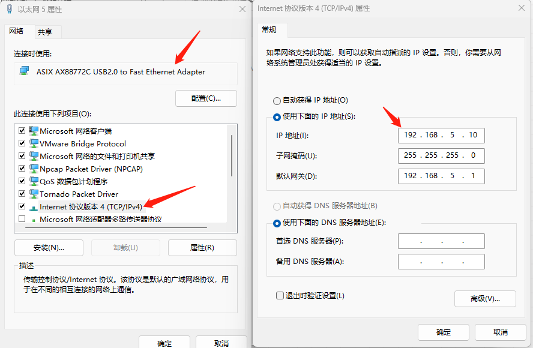

vmware 配置：先添加桥接再配置


Ubuntu配置


开发板配置：

使用上面的串口连接进入开发板，配置开发板的IP地址

````
vi /etc/network/interfaces

auto lo
iface lo inet loopback
auto eth0
iface eth0 inet static
    address 192.168.5.9
    netmask 255.255.255.0
    gateway 192.168.5.1
````

## 安装软件

### 安装Ubutu软件

使用下面命令一键配置/初始化开发环境(安装 tftp，nfs，vim 等软件，此脚本只支持 Ubuntu-16.04 /Ubuntu-18.04)。

````linux
git clone https://e.coding.net/weidongshan/DevelopmentEnvConf.git
cd DevelopmentEnvConf
sudo ./Configuring_ubuntu.sh
````

输入book密码：123456 和 选择对应系统：2Linux

指导完成


### 下载 BSP 及配置工具链

100ask_imx6ull 开发板的 BSP 都保存在 Git 站点上，通过 repo 命令进行统一管理。


**配置 repo**

下载 repo 工具前需要设置 git 的邮箱和用户名。

````
git config --global user.email "320951152@qq.com"
git config --global user.name "rain"
````

**下载BSP**

通过 repo 管理多个 git 仓库中的源码，可以及时更新最新代码，以方便开发者学习使用。执行以下 4 条命令

1. 下载repo：`git clone https://e.coding.net/codebug8/repo.git`
2. `mkdir -p 100ask_imx6ull-sdk && cd 100ask_imx6ull-sdk`
3. `../repo/repo init -u https://gitee.com/weidongshan/manifests.git -b linux-sdk -m imx6ull/100ask_imx6ull_linux4.9.88_release.xml --no-repo-verify`          //在100ask_imx6ull-sdk文件夹下执行
4. `~/100ask_imx6ull-sdk$ ../repo/repo sync -j4`

经过上面步骤，文件夹下有了这些文件


如使用在线方式获取源码可以直接在`~/100ask_imx6ull-sdk`目录下执行`../repo/repo sync -c`进行同步更新最新代码！

将Linux-4.9.88内核源码传回window中，方便分析源码


**配置交叉编译工具链**

交叉编译工具链用来在 Ubuntu 主机上编译应用程序，而这些应用程序是在ARM 等其他平台上运行。设置交叉编译工具主要是设置 PATH， ARCH 和 CROSS_COMPILE 三个环境变量，下面介绍具体设置方法。

在本文档中，源码、交叉编译工具链都是存放于/home/book 目录下

1. 修改用户配置文件： `vim~/.bashrc`
2. 在行尾添加或修改

````
export ARCH=arm
export CROSS_COMPILE=arm-buildroot-linux-gnueabihf-			// 编译工具
export PATH=$PATH:/home/book/100ask_imx6ull-sdk/ToolChain/arm-buildroot-linux-gnueabihf_sdk-buildroot/bin
````

3. 重新加载：`source ~/.bashrc `
4. 验证是否有效：`arm-buildroot-linux-gnueabihf-gcc -v`

## NFS

NFS 是 Network File System 的缩写， 它可以通过网络， 让不同的机器、 不同的操作系统可以共享彼此的文件。NFS 服务器可以让 PC 将网络中的 NFS 服务器共享的目录挂载到本地端的文件系统中， 而在本地端的系统中来看， 那个远程主机的目录就好像是自己的一个磁盘分区一样， 在使用上相当便利；


在嵌入式linux开发过程中，由于目标平台的资源限制，开发环境一般都不会放到目标板卡上（需要放在开发宿主机上），如果需要宿主机与目标板卡之间进行文件传输，该怎么办呢。这时候nfs就派生用场了。


**搭建NFS**

1. 下载NFS`sudo apt-get install nfs-kernel-server`
2. 配置NFS：`cat /etc/exports`  在文件最后一行添加：/xxx/xxx/ *(rw,sync,no_root_squash)
   1. /xxx/xxx/：指示要共享的目录；“/xxx/xxx/ ”目录需要自己创建。
   2. *：代表允许所有的网络段访问。
   3. rw：指示具有可读写的权限。
   4. sync：指示资料同步写入内存和硬盘
   5. no_root_squash：是 Ubuntu nfs 客户端分享目录使用者的权限。例如：如果客户端使用的是 root 用户，那么对于该共享目录而言，该客户端就具有 root 权限。
   6. ……
3. 启动rpcbind服务：`/etc/init.d/rpcbind restart`
4. 重启NFS服务：`/etc/init.d/nfs-kernel-server restart`

使用 `ps -A | grep nfs` 查看是否启动了NFS	


上面这些步骤在上面安装软件时已经开启过了

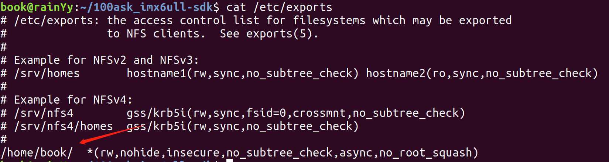

可以挂载Ubuntu的/home/book/目录


**挂载NFS**

在开发板中执行

````
mount -t nfs -o nolock,vers=3 192.168.5.11:/home/book/nfs_rootfs /mnt
````

将虚拟机Ubuntu的:/home/book/nfs_rootfs文件夹挂载到开发板的/mnt文件夹中

现在访问开发板的/mnt文件夹就能直接访问到虚拟机的/home/book/nfs_rootfs目录

每次关机就要重新挂载，可以使用Shell脚本编写一个指令


## Source Insight

Ctrl + / 查看引用函数的地方

Ctrl + 点击函数 跳转到函数定义位置


后面会使用SI来查看Linux源码

## VSCode

使用VSCode阅读Linux源码

使用插件Retome-ssh插件

### Remote - SSH

在VSCode Extension组件页搜索Remote - SSH插件安装

Remote-SSH是微软官方推出用于连接远程服务器的插件

### clangd

clangd 插件用于代码语义分析、代码补全、跳转等。能做到代码精准跳转、精准自动补全，其根本原理是通过读取工程编译自动生成的compile_commands.json 文件来索引其中包含的源文件和关联的头文件，因此能避免索引非编译的代码造成解析时语义混乱。

compile_commands.json 文件就是由每个源文件的编译参数、路径等信息组成的一个json文件，clangd 通过这个文件可以准确定位源文件需要引用的头文件从而准确的找到各种宏定义、函数、变量声明的准确值了。

那么问题来了，编译内核的时候也没有生成compile_commands.json这个文件呀。这个文件在编译cmake工程的时候可以自动生成，但是内核用的是make。这时候就需要另一个工具bear了，他就是专门用来生成这个的。

需要注意的是如果VSCode之前安装过C++ Intellisense插件需要禁用或者卸载掉，因为会和clangd插件有冲突。


**安装bear**

在Linux中安装bear

````sh
sudo apt instll bear
````

bear命令用来生成compile_commands.json，它的用法如下：

````c
bear make [其他make本身的参数]		// bear 3.0之前的版本
bear -- make [其他make本身的参数]	// bear 3.0之后的版本
bear --version					 //查看版本
````

**生成compile_commands.json**

````sh
// 如果之前曾经编译过内核，要清除掉
make clean  

// 然后重新编译
bear make zImage -j 4
````

编译成功后就会在当前目录下得到文件compile_commands.json

bear 3.0前的版本生成的compile_commands.json需要如下修改:将cc全部替换为arm-buildroot-linux-gnueabihf-gcc

````sh
%s/cc/arm-buildroot-linux-gnueabihf-gcc/g
````


* https://blog.csdn.net/thisway_diy/article/details/127426986
* https://blog.csdn.net/xhnmdlfl/article/details/117911630


# 其他

## man命令

在 Linux 系统下，可以通过 man 命令（也叫 man 手册）来查看某一个 Linux 系统调用的帮助信息，man命令可以将该系统调用的详细信息显示出来，譬如函数功能介绍、函数原型、参数、返回值以及使用该函数所需包含的头文件等信息；man 更像是一份帮助手册，所以也把它称为 man 手册


Linux 下有 3 大帮助方法：help、man、info。

````
1 Executable programs or shell commands						// 命令
2 System calls (functions provided by the kernel)			// 系统调用，比如 man 2 open
3 Library calls (functions within program libraries)		// 函数库调用
4 Special files (usually found in /dev) 					// 特殊文件, 比如 man 4 tty 
5 File formats and conventions eg /etc/passwd 				// 文件格式和约定, 比如 man 5 passwd
6 Games 													// 游戏
7 Miscellaneous (including macro packages and conventions), e.g. man(7), groff(7) //杂项
8 System administration commands (usually only for root) 	// 系统管理命令
9 Kernel routines [Non standard] 							// 内核例程
````

比如：想查看 open 函数的用法时，可以直接执行“man open”，发现这不是想要内容时再执行“man 2 open”。


常用的快捷键是：
````
f 往前翻一页
b 往后翻一页
/patten 往前搜
?patten 往后搜
q 退出
````


## C语言常用函数

**比较函数**

````c
#include <string.h>
int strncmp(const char *str1, const char *str2, size_t n)
````

参数

- str1 -- 要进行比较的第一个字符串。
- str2 -- 要进行比较的第二个字符串。
- n -- 要比较的最大字符数。

返回值

该函数返回值如下：

- 如果返回值 < 0，则表示 str1 小于 str2。
- 如果返回值 > 0，则表示 str1 大于 str2。
- 如果返回值 = 0，则表示 str1 等于 str2。


**sscanf()**

 从字符串读取格式化输入。

````c
#include <stdio.h>
int sscanf(const char *str, const char *format, ...)
````

````c
#include <stdio.h>
#include <stdlib.h>
#include <string.h>
int main(){
   int day, year;
   char weekday[20], month[20], dtm[100];
   strcpy( dtm, "Saturday March 25 1989" );
   sscanf( dtm, "%s %s %d  %d", weekday, month, &day, &year );	/* 以空格隔开，字符串 字符串 整数 整数 */

   printf("%s %d, %d = %s\n", month, day, year, weekday );  /* 打印March 25, 1989 = Saturday */ 
   return(0);
}
````

这个函数有更高级的用法，比如指定分隔符等，还能剔除某些符号


**memset()**

填充：复制字符 c（一个无符号字符）到参数 str所指向的字符串的前 n 个字符

````c
void *memset(void *str, int c, size_t n)
````

- str -- 指向要填充的内存块。
- c -- 要被设置的值。该值以 int 形式传递，但是函数在填充内存块时是使用该值的无符号字符形式。
- n -- 要被设置为该值的字符数。

## 交叉编译程序

使用 buildroot 来给 ARM 板编译程序、编译库会很简单，以后系统讲解buildroot 时再使用 buildroot。

### 程序运行基础知识

1. 编译程序时去哪找头文件？

   系统目录：就是Ubuntu交叉编译工具链里的某个 include 目录；也可以自己指定：编译时用 “ -I dir ”选项指定。

2. 链接时去哪找库文件？
   系统目录：就是Ubuntu交叉编译工具链里的某个 lib 目录；也可以自己指定：链接时用 “ -L dir ”选项指定。

3. 运行时去哪找库文件？
   系统目录：就是板子上的/lib、/usr/lib 目录；也可以自己指定：运行程序用环境变量 LD_LIBRARY_PATH 指定。

4. 运行时不需要头文件，所以头文件不用放到板子上

即：在Ubuntu编译链接程序时，需要用到依赖文件放在某个 include、 lib 目录中，板子运行时不需要头文件，但是需要库文件，放在板子上的/lib、/usr/lib 目录


**怎么找到 叉编译工具链里的include、lib 呢？**

````
/* arm-buildroot-linux-gnueabihf是交叉编译工具链的名称，不同板子不一样 */
/* 个人认为 echo 'main(){}' 仅仅是连带着 将后面管道符中的内容输出，并不一定非要按这种格式，可以echo 'xxx' */
echo 'main(){}'| arm-buildroot-linux-gnueabihf-gcc -E -v -
````

### 常见错误的解决方法

**头文件问题**
编译时找不到头文件。在程序中这样包含头文件：#include <xxx.h>、#include "xxx.h"

对于尖括号里的头文件，去哪里找它？

* 系统目录：就是交叉编译工具链里的某个 include 目录；也可以自己指定：编译时用 “ -I dir ”选项指定。

对于双引号里的头文件，去哪里找它？

* 当前文件夹

怎么确定“系统目录”？

````
echo 'main(){}'| arm-buildroot-linux-gnueabihf-gcc -E -v -
````

**库文件问题**

链接程序时如果有这样的提示：`undefined reference to xxx`，它表示 xxx 函数未定义。

解决方法

1. 写出这个函数
2. 使用库函数，那需要在链接时指定库

**运行问题**
运行程序时找不到库：

````
error while loading shared libraries: libxxx.so:
cannot open shared object file: No such file or directory
````

找不到库，库在哪？

* 系统目录：就是板子上的/lib、/usr/lib 目录

* 也可以自己指定：运行程序用环境变量 LD_LIBRARY_PATH 指定

  ````
  export LD_LIBRARY_PATH=/xxx_dir ; ./test
  或
  LD_LIBRARY_PATH=/xxx_dir ./test
  ````

### 交叉编译程序万能命令

交叉编译开源软件时，如果它目录里面有 configure，万能命令如下：

````
/* 假设交叉编辑工具链的前缀是 arm-buildroot-linux-gnueabihf-，比如 arm-buildroot-linux-gnueabihf-gcc， */
/* --prefix 选项指定库的安装目录；--host 选项设置为交叉编译器名称的前缀 */
./configure --host=arm-buildroot-linux-gnueabihf --prefix=$PWD/tmp		/* 将库安装在当前文件夹的/tmp中 */
make					
make instal
````

就可以在当前目录的 tmp 目录下看见 bin, lib, include 等目录，里面存有可执行程序、库、头文件。


**把头文件、库文件放到工具链目录里**

如果你编译的是一个库，请把得到的头文件、库文件放入工具链的 include、lib 目录里。别的程序要使用这些头文件、库时，会很方便。
使用：`echo 'main(){}'| arm-buildroot-linux-gnueabihf-gcc -E -v -`得到工具链的 include、lib 的目录

将得到的lib, include拷贝到工具链的 include、lib 目录中


**把库文件放到板子上的/lib 或/usr/lib 目录里**

程序在板子上运行时，需要用到板子上/lib 或/usr/lib 下的库文件；程序运行时不需要头文件。

将得到的lib拷贝到开发板的 lib 目录中


### 案例:freetype

给 IMX6ULL 交叉编译 freetype


freetype 依赖于 libpng，libpng 又依赖于 zlib，所以我们应该：先编译安装 zlib，再编译安装 libpng，最后编译安装 freetype。但是，有些工具链里有 zlib, 那就不用编译安装 zlib

````
/* 需要用到 */
freetype-2.10.2.tar.xz
libpng-1.6.37.tar.xz
zlib-1.2.11.tar.gz
````

Ubuntu上的include、lib目录位置

````
/home/book/100ask_imx6ull-sdk/ToolChain/arm-buildroot-linux-gnueabihf_sdk-buildroot/bin/../lib/gcc/arm-buildroot-linux-gnueabihf/7.5.0/include
/home/book/100ask_imx6ull-sdk/ToolChain/arm-buildroot-linux-gnueabihf_sdk-buildroot/arm-buildroot-linux-gnueabihf/sysroot/usr/lib/
````

由于使用的工具链中有了zlib，所以就不需要再次编译安装zlib，直接编译安装 libpng即可。（如果没有zlib，可以参照libpng的编译安装步骤即可）

./configure --host=arm-buildroot-linux-gnueabihf --prefix=$PWD/tmp


**安装 libpng**

````shell
tar -xJf libpng-1.6.37.tar.xz											/* 解压libpeng */
cd libpng-1.6.37	
./configure --host=arm-buildroot-linux-gnueabihf --prefix=$PWD/tmp		/* 执行万能命令 */
make
make install															/* 到此步就能看到libpng的include、lib等目录 */
cd tmp
/* 将获得的libpng的include、lib目录 拷贝到 Ubuntu的include、lib目录中 */
cp include/* -rf /home/book/100ask_imx6ull-sdk/ToolChain/arm-buildroot-linux-gnueabihf_sdk-buildroot/bin/../lib/gcc/arm-buildroot-linux-gnueabihf/7.5.0/include
/* -d表示拷贝的源文件如果是链接文件，则拷贝链接文件，不拷贝源文件，解约资源 */
cp lib/* -rfd /home/book/100ask_imx6ull-sdk/ToolChain/arm-buildroot-linux-gnueabihf_sdk-buildroot/arm-buildroot-linux-gnueabihf/sysroot/usr/lib/
````

**安装 freetype**

````shell
tar xJf freetype-2.10.2.tar.xz
cd freetype-2.10.2
./configure --host=arm-buildroot-linux-gnueabihf --prefix=$PWD/tmp
make
make install
cd tmp
cp include/* -rf /home/book/100ask_imx6ull-sdk/ToolChain/arm-buildroot-linux-gnueabihf_sdk-buildroot/bin/../lib/gcc/arm-buildroot-linux-gnueabihf/7.5.0/include
cp lib/* -rfd /home/book/100ask_imx6ull-sdk/ToolChain/arm-buildroot-linux-gnueabihf_sdk-buildroot/arm-buildroot-linux-gnueabihf/sysroot/usr/lib/
````


# 编译安装内核

**编译驱动程序之前要先编译内核**

* 驱动程序要用到内核文件：比如驱动程序中这样包含头文件：#include <asm/io.h>，其中的 asm 是一个链接文件，指向 asm-arm 或 asm-mips，这需要先配置、编译内核才会生成asm 这个链接文件。
* 编译驱动时用的内核、开发板上运行到内核，要一致：开发板上运行到内核是出厂时烧录的，你编译驱动时用的内核是你自己编译的，这两个内核不一致时会导致一些问题。所以我们编译驱动程序前，要把自己编译出来到内核放到板子上去，替代原来的内核。
* 更换板子上的内核后，板子上的其他驱动也要更换：板子使用新编译出来的内核时，板子上原来的其他驱动也要更换为新编译出来的。所以在编译我们自己的第 1 个驱动程序之前，要先编译内核、模块，并且放到板子上去。

**编译内核**

内核文件放在了虚拟机Ubuntu的/home/book/100ask_imx6ull-sdk文件夹中中

不同的开发板对应不同的配置文件 ， 配置文件位于内核源码arch/arm/configs/目录。**kernel** 的编译过程如下：

````c
cd /home/book/100ask_imx6ull-sdk/Linux-4.9.88
make mrproper
make 100ask_imx6ull_defconfig
make zImage -j4
make dtbs													/* 编译设备树 */
cp arch/arm/boot/zImage ~/nfs_rootfs						/* 将编译好的内核放入开发板共享文件夹 */
cp arch/arm/boot/dts/100ask_imx6ull-14x14.dtb ~/nfs_rootfs	/* 将编译好的设备树放入开发板共享文件夹 */
````

编译完成后，在 arch/arm/boot 目录下生成 zImage 内核文件, 在arch/arm/boot/dts 目录下生成设备树的二进制文件 100ask_imx6ull-14x14.dtb。把这 2 个文件复制到/home/book/nfs_rootfs 目录下备用


**编译安装内核模块**

进入内核源码目录后，就可以编译内核模块了：

````
cd ~/100ask_imx6ull-sdk/Linux-4.9.88/
make modules							/* 编译内核 */
/* 把模块安装在 nfs 目录“/home/book/nfs_rootfs/” */
make ARCH=arm INSTALL_MOD_PATH=/home/book/nfs_rootfs modules_install	
````

使用tree命令查看目录等级

````
sudo apt install tree		/* 安装tree */
tree						/* 查看目录 */
````

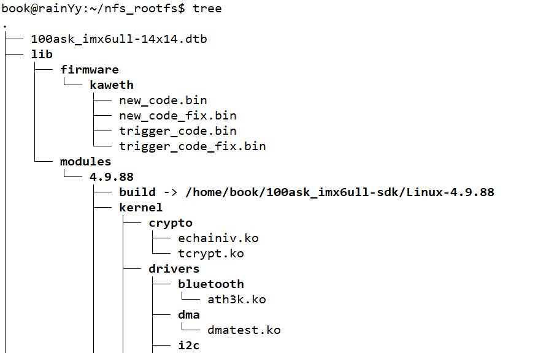


**安装内核和模块到开发板上**

假设：在 Ubuntu 的/home/book/nfs_rootfs 目录下，已经有了 zImage、dtb 文件，并且有 lib/modules 子目录(里面含有各种模块)。接下来要把这些文件复制到开发板上。假设 Ubuntu IP 为 192.168.5.11，在开发板上执行以下命令：

````
mount -t nfs -o nolock,vers=3 192.168.5.11:/home/book/nfs_rootfs /mnt		/* 挂载 */
cp /mnt/zImage /boot						/* 从共享文件夹中 将内核拷贝到开发板的/boot */
cp /mnt/100ask_imx6ull-14x14.dtb /boot		/* 从共享文件夹中 将设备树拷贝到开发板的/boot */
cp /mnt/lib/modules /lib -rfd				/* 从共享文件夹中 将模块覆盖 */
sync										/* 同步 */
reboot										/* 重启开发板 */
````

查看内核版本

````
uname -a
Linux imx6ull 4.9.88 #1 SMP PREEMPT Fri Aug 18 03:42:57 EDT 2023 armv7l GNU/Linux		/* 使用了刚才编译的内核 */
````


# 测试

## 开发板执行应用

在/home/book/nfs_rootfs目录下创建rain.c文件，内容如下

````c
#include <stdio.h>
int main(int argc,char **argv){
        if(argc >= 2){
                printf("hello %s \r\n",argv[1]);
        }else{
                printf("hello Linux\r\n");
        }
}
/* 
参数1：参数的个数
参数2：参数的值
我们的文件名叫rain
当执行./rain的时候，argc = 1，argv[0] = rain
执行./rain shuaige的时候，argc = 2，argv[0] = rain argv[1] = shuaige
*/
````

Ubuntu执行：

````
gcc -o rain rain.c
./rain
hello Linux
````

上述命令编译得到的可执行程序 hello 可以在 Ubuntu 中运行，但是如果把它放到 ARM板子上去，它是无法执行的。因为它是使用 gcc 编译的，是给 PC 机编译的，里面的机器指令是 x86 的。

我们要想给 ARM 板编译出 rain 程序，需要使用交叉编译工具链。

````
arm-buildroot-linux-gnueabihf-gcc -o rain rain.c 
````

这样编译出来的 rain 程序才可以在 ARM 板子上运行。

````
file rain   /* 查看文件类型 */
rain: ELF 32-bit LSB executable, ARM, EABI5 version 1 (SYSV), dynamically linked, interpreter /lib/ld-, for GNU/Linux 4.9.0, not stripped	/* 32位 ARM运行*/
````


交叉编译工具链无法在开发板执行，因为交叉编译工具链安装在了虚拟机Ubuntu的/home/book目录下，而开发板共享的是/home/book/nfs_rootfs目录，他访问不了/home/boo目录

## 编译LED驱动

**编译 led 驱动**

编译安装过内核之后，测试编译LED驱动,下载韦东山的驱动到Ubuntu中

````
01_all_series_quickstart/
	05_嵌入式 Linux 驱动开发基础知识/
		source/02_led_drv/02_led_drv_for_boards/100ask_imx6ull_src_bin
````

首 先 ， 进 入 100ask_imx6ull_src_bin 目 录， 修 改 Makefile 文 件“KERN_DIR”为自己的内核所在路径。

````
cd 100ask_imx6ull_src_bin
vi Makefile			
KERN_DIR = /home/book/100ask_imx6ull-sdk/Linux-4.9.88			/* 自己内核所在路径 */
````

修改完内核所在目录后，就可以编译 led 模块驱动了，执行 `make all` 命令就可以编译,编译完成后会生成 100ask_led.ko ledtest 两个文件。

````
make all
````

把这两个文件拷贝到 Ubuntu nfs 目录下让开发板访问

````
cp 100ask_led.ko ledtest ~/nfs_rootfs
````

**在开发板安装驱动模块**

开发板启动后通过 nfs 挂载 Ubuntu 目录的方式，将相应的文件拷贝到开发板内。

````
/* 将编译的文件拷贝到开发板的某个目录内 */
cp /mnt/100ask_led.ko ./	
cp /mnt/ledtest ./

insmod 100ask_led.ko			/* 安装驱动模块，可以使用insmod -f hello_drv.ko 强行安装*/
lsmod							/* 查看是否安装成功 */

chmod +x ./ledtest				/* 添加执行权限 */
./ledtest /dev/100ask_led0 on	/* 开灯 */
./ledtest /dev/100ask_led0 off	/* 关灯 */
````


# GCC

源文件需要经过编译才能生成可执行文件。在 Windows 下进行开发时，只需要点几个按钮即可编译，集成开发环境(比如 Visual studio)已经将各种编译工具的使用封装好了。Linux 下也有很优秀的集成开发工具，但是更多的时候是直接使用编译工具；即使使用集成开发工具，也需要掌握一些编译选项。PC 机上的编译工具链为 gcc、ld、objcopy、objdump 等，它们编译出来的程序在 x86 平台上运行。要编译出能在 ARM 平台上运行的程序，必须使用交叉编译工具 xxx-gcc、xxx-ld 等(不同版本的编译器的前缀不一样，比如 arm-linux￾gcc)

## GCC 编译过程

一个 C/C++文件要经过预处理(preprocessing)、编译(compilation)、汇编(assembly)和链接(linking)等 4 步才能变成可执行文件。

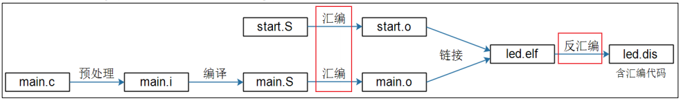

**预处理**

C/C++源文件中，以“#”开头的命令被称为预处理命令，如包含命令“#include”、宏定义命令“#define”、条件编译命令“#if”、“#ifdef”等。预处理就是将要包含(include)的文件插入原文件中、将宏定义展开、根据条件编译命令选择要使用的代码，最后将这些东西输出到一个“.i”文件中等待进一步处理。

**编译**

编译就是把 C/C++代码(比如上述的“.i”文件)“翻译”成汇编代码，所用到的工具为 cc1(它的名字就是 cc1，x86 有自己的 cc1 命令，ARM 板也有自己的cc1 命令)。

当代码中有错误时，会在此步报错

**汇编**

汇编就是将第二步输出的汇编代码翻译成符合一定格式的机器代码，在Linux 系统上一般表现为 ELF 目标文件(OBJ 文件)，用到的工具为 as。x86 有自己的 as 命令，ARM 版也有自己的 as 命令，也可能是 xxxx-as（比如 arm-linux-as）。“反汇编”是指将机器代码转换为汇编代码，这在调试程序时常常用到。

**链接**

链接就是将上步生成的 OBJ 文件和系统库的 OBJ 文件、库文件链接起来，最终生成了可以在特定平台运行的可执行文件，用到的工具为 ld 或 collect2。


编译程序时，加上-v 选项就可以看到这几个步骤。

````
gcc -o hello hello.c -v 
````

````
cc1 hello.c -o /tmp/cctETob7.s
as -o /tmp/ccvv2KbL.o /tmp/cctETob7.s
collect2 -o hello crt1.o crti.o crtbegin.o /tmp/ccvv2KbL.o crtend.o crtn.o
````

以上 3 个命令分别对应于编译步骤中的预处理+编译、汇编和链接，ld 被collect2 调用来链接程序。预处理和编译被放在了一个命令（cc1）中进行的，可以把它再次拆分为以下两步：


## GCC常用命令

| 命令 | 描述                                               |
| ---- | -------------------------------------------------- |
| -E   | 预处理，开发过程中想快速确定某个宏可以使用“-E -dM” |
| -S   | 编译后即停止，不进行汇编                           |
| -c   | 把预处理、编译、汇编都做了，但是不链接             |
| -o   | 指定输出文件                                       |
| -I   | 指定头文件目录                                     |
| -L   | 指定链接时库文件目录                               |
| -l   | 指定链接哪一个库文件                               |
| -v   | 显示制作 GCC 工具自身时的配置命令                  |
| -M   | 显示出依赖的文件                                   |

假设有main.c、sub.c文件

````c
/*______________________main.c______________________*/
#include <stdio.h>			/* <> 指定去库中查找*/
#include "sub.h"			/* 在当前目录中查找 */
int main(int argc, char *argv[]){
       int i;
       printf("Main fun!\n");
       sub_fun();
       return 0;
}
/*______________________sub.c______________________*/
sub.cvoid sub_fun(void){ 
       printf("Sub fun!\n");
}
/*______________________sub.h______________________*/
void sub_fun(void);
````

**编译多个文件**

一起编译、链接：会自动执行-E 、-c等命令

````
gcc -o test main.c sub.c	/* 编译链接main sub 为test可执行文件 */
````

分开编译，统一链接：比如只更改了某个文件，但是不想全部重新编译，则可以编译某个文件，再进行链接

````
gcc -c -o main.o main.c		/* 编译main */
gcc -c -o sub.o sub.c		/* 编译sub */
gcc -o test main.o sub.o	/* 链接 */
````

**头文件目录**

````
gcc -c -o main.o main.c -I ./	/* 在当前目录下寻找头文件 */
````

**制作、使用动态库**

````
gcc -c -o main.o main.c
gcc -c -o sub.o sub.c
gcc -shared -o libsub.so sub.o sub2.o sub3.o(可以使用多个.o 生成动态库)
gcc -o test main.o -lsub -L /libsub.so /* 所在目录 */
````

第2步 运行：先把 libsub.so 放到 Ubuntu 的/lib 目录，然后就可以运行 test 程序。

如果不想把 libsub.so 放到/lib，也可以放在某个目录比如/a，然后如下执行：

````
export LD_LIBRARY_PATH=$LD_LIBRARY_PATH:/a 
./test
````

**制作、使用静态库**

````
gcc -c -o main.o main.c
gcc -c -o sub.o sub.c
ar crs libsub.a sub.o sub2.o sub3.o		/* 可以使用多个.o 生成静态库 */
gcc -o test main.o libsub.a				/* 如果.a 不在当前目录下，需要指定它的绝对或相对路径 */
````


**很有用的选项**

````
gcc -E main.c 							// 查看预处理结果，比如头文件是哪个
gcc -E -dM main.c > 1.txt				// 把所有的宏展开，存在 1.txt 里
gcc -Wp,-MD,abc.dep -c -o main.o main.c // 生成依赖文件 abc.dep，后面 Makefile 会用
echo 'main(){}'| gcc -E -v -			// 它会列出头文件目录、库目录(LIBRARY_PATH)
````

````
gcc -M main.c							// 显示出依赖的文件
gcc -M -MF main.d main.c				// 将依赖的文件目录写进main.d文件中
gcc -c -o main.o main.c -MD -MF main.d	// 编译main文件，并生成依赖文件main.d
````


# Makefile

## 介绍

在 Linux 中使用 `make` 命令来编译程序，特别是大程序；而 make 命令所执行的动作依赖于 Makefile 文件。

**Makefile的作用**

当更新某个文件时，只会编写这个文件，不会重新编译所有文件


**原理**

比较生成的文件 和 源文件的时间，如果生成的文件 比 源文件的时间旧，说明源文件更新过


**使用**

执行 make 命令时，它会去当前目录下查找名为“Makefile”的文件，并根据它的指示去执行操作，生成第一个目标。


我们可以使用`-f`选项指定文件，不再使用名为“Makefile”的文件，比如：

````makefile
make -f Makefile.build 
````

我们可以使用“-C”选项指定目录，切换到其他目录里去，比如：

````makefile
make -C a/ -f Makefile.build 
````

我们可以指定目标，不再默认生成第一个目标：

````makefile
make -C a/ -f Makefile.build other_target
````

在 Makefile 中怎么放置第 1 个目标：

执行 make 命令时如果不指定目标，那么它默认是去生成第 1 个目标。所以“第 1 个目标”，位置很重要。有时候不太方便把第 1 个目标完整地放在文件前面，这时可以在文件的前面直接放置目标，在后面再完善它的依赖与命令。比如：

````makefile
First_target: // 这句话放在前面
．．．．
// 其他代码，比如 include 其他文件得到后面的 xxx 变量
First_target : $(xxx) $(yyy) // 在文件的后面再来完善
````

执行`make [目标]`,当没有目标时会从第一行开始执行

## **格式**

注意：缩进是Tab，不能是空格

````makefile
目标:依赖			# 注意这个依赖，是makefile语法的依赖，并不是C函数依赖
	命令
……
````

目标文件比较依赖文件，如果依赖文件更新过，则执行下方命令

例：

````makefile
test:main.o sub.o					/* 将main.o sub.o 链接成test可执行文件,依赖下面的main.o sub.o */
        gcc -o test main.o sub.o
main.o:main.c
        gcc -c -o main.o main.c
sub.o:sub.c
        gcc -c -o sub.o sub.c
````

第一次执行`make`时，生成test可执行文件，他依赖main.o sub.o，发现没有main.o和sub.o，进而执行 gcc -c -o main.o main.c，gcc -c -o sub.o sub.c，最终执行gcc -o test main.o sub.o

当更新时main.c时，main.o比main.c时间更旧，则执行 gcc -c -o main.o main.c

### **变量**

%是通配符

````
$符号表示取变量的值，当变量名多于一个字符时，使用"( )"
$符的其他用法:

$^ 表示所有的依赖文件
$@ 表示生成的目标文件
$< 代表第一个依赖文件
````

````makefile
# 假设有a b c 三个文件
test:a.o b.o c.o
        gcc -o test $^
%.o:%.c
        gcc -c -o $@ $<
````

**变量的导出(export)：**在编译程序时，我们会不断地使用“make -C dir”切换到其他目录，执行其他目录里的 Makefile。如果想让某个变量的值在所有目录中都可见，要把它export 出来。

比如“CC = $(CROSS_COMPILE)gcc”，这个 CC 变量表示编译器，在整个过程中都是一样的。定义它之后，要使用“export CC”把它导出来。


### **假想目标**

.PHONY

````makefile
test:a.o b.o c.o
        gcc -o test $^
%.o:%.c
        gcc -c -o $@ $<
rainclear:
        rm *.o test			# 执行make rainclear时，就会执行rm *.o test	
````

命令行中执行`make rainclear`,就会执行`rm *.o test`这句话

如果当前目录下恰好有名为“rainclear”的文件，那么执行“make rainclear”时它就不会执行那些删除命令。这时我们需要把“rainclear”这个目标，设置为“假想目标”，这样可以确保执行“make rainclear”时那些删除命令肯定可以得到执行。

````makefile
test:a.o b.o c.o
        gcc -o test $^
%.o:%.c
        gcc -c -o $@ $<
rainclear:
        rm *.o test
.PHONY: rainclear
````

这样执行`make rainclear`就可以了

### **赋值**

````makefile
A = xxx 		# 延时变量
B ?= xxx		# 延时变量，只有第一次定义时赋值才成功；如果曾定义过，此赋值无效
C := xxx		# 立即变量
D += yyy		# 累加变量
````

````makefile
# "="是最普通的等号，在Makefile中容易搞错赋值等号，使用 “=”进行赋值，变量的值是整个Makefile中最后被指定的值。
VIR_A = A
VIR_B = $(VIR_A) B
VIR_A = AA
# 经过上面的赋值后，最后VIR_B的值是AA B，而不是A B，在make时，会把整个Makefile展开，来决定变量的值

# “:=” 表示直接赋值，赋予当前位置的值。
VIR_A := A
VIR_B := $(VIR_A) B
VIR_A := AA
# 最后BIR_B的值是A B，即根据当前位置进行赋值。因此相当于“=”，“：=”才是真正意义上的直接赋值
````

### **函数**

在执行的命令前加`@`，当执行语句时，就不会显示出来这条命令

通配符：makefile的通配符是`%`,当执行linux的内容时使用`*`


`$(foreach var,list,text)`：简单地说，就是 for each var in list, change it to text。对 list 中的每一个元素，取出来赋给 var，然后把 var 改为 text 所描述的形式。

````makefile
A = a b d
B = $(foreach f,$(A),$(f).c)		# 将变量A中的值改为.c结尾
all:
        @echo $(B)					# 执行make all 输出a.c b.c d.c
````

`$(filter pattern...,text)`：把 text 中符合 pattern 格式的内容，保留

`$(filter-out pattern...,text)`：把 text 中符合 pattern 格式的内容，去除

````makefile
C = rain brain drain future
D = $(filter %rain,$(C))			# 保留rain结尾的词
E = $(filter-out %rain,$(C))		# 去除rain结尾的词
all:
        @echo $(D)					# 输出rain brain drain
        @echo $(E)					# 输出future
````

`$(wildcard pattern)`：将当前目录下符号pattern格式的文件列举出来

````makefile
# 假设当前文件夹下有a.c b.c d.c
F = $(wildcard *.c)					# 列举出当前文件夹下以.c结尾的文件

G = a.c b.c c.c d.c e.c
H = $(wildcard $(G))				# 列举出当前文件夹下以含义变量G包含的文件
all:
        @echo $(F)					# a.c b.c d.c
        @echo $(H)					# a.c b.c d.c	
````

**替换函数**

`$(patsubst pattern,replacement,text)`：寻找`text’中符合格式`pattern’的字，用`replacement’替换它们。

````makefile
G = a.c b.c c.c d.c e.c
I = $(patsubst %.c,%.d,$(G))		# 将G中以.c结尾的变量 替换为 以.d结尾
all:
        @echo $(I)					# a.d b.d c.d d.d e.d
````


`$(subst from,to,text) `：在文本`text`中使用`to`替换每一处`from`

````makefile
$(subst ee,EE,feet on the street)		# 结果为‘fEEt on the strEEt’
````

`$(strip string)`：去掉前导和结尾空格，并将中间的多个空格压缩为单个空格。

````makefile
$(strip a   b c )						#a b c
````

`$(findstring find,in) `：在字符串`in`中搜寻`find`，如果找到，则返回值是`find`，否则返回值为空。

````makefile
$(findstring a,a b c)					# a
$(findstring a,b c)						# 
````

`$(sort list)`：将`list`中的字按字母顺序排序，并去掉重复的字。输出由单个空格隔开的字的列表。

````makefile
$(sort foo bar lose)					# bar foo lose
````


**文件名函数**

`$(dir names...) `：抽取`names...`中每一个文件名的路径部分，文件名的路径部分包括从文件名的首字符到最后一个斜杠(含斜杠)之前的一切字符。

````makefile
$(dir src/foo.c hacks)					# src/ ./
````

`$(notdir names...) `：抽取`**names...`中每一个文件名中除路径部分外一切字符（真正的文件名）。

````makefile
$(notdir src/foo.c hacks)				# foo.c hacks
````

`$(suffix names...)`：抽取`names...`中每一个文件名的后缀。

````makefile
$(suffix src/foo.c src-1.0/bar.c hacks)	# .c .c
````

`$(basename names...)`：抽取`names...`中每一个文件名中除后缀外一切字符。

````makefile
$(basename src/foo.c src-1.0/bar hacks)	# src/foo src-1.0/bar hacks
````

`$(addsuffix suffix,names...)`：参数`names...`是一系列的文件名，文件名之间用空格隔开；`suffix` 是一个后缀名。将 `suffix`(后缀)的值附加在每一个独立文件名的后面，完成后将文件名串联起来，它们之间用单个空格隔开。

````makefile
$(addsuffix .c,foo bar)					# foo.c bar.c
````

`$(addprefix prefix,names...) `：参数`names`是一系列的文件名，文件名之间用空格隔开；`prefix` 是一个前缀名。将 `preffix`(前缀)的值附加在每一个独立文件名的前面，完成后将文件名串联起来，它们之间用单个空格隔开。

````makefile
$(addprefix src/,foo bar)				# src/foo src/bar
````

**其他函数**

`$(if condition,then-part,else-part)`：三目运算

````makefile
$(if ,1,2)								# 2
$(if 1,1,2)								# 1
````

`$(shell command arguments)`：函数 shell 是 make 与外部环境的通讯工具。函数 shell 的执行结果和在控制台上执行‘command arguments’的结果相似。不过如果‘command arguments’的结果含有换行符（和回车符），则在函数 shell 的返回结果中将把它们处理为单个空格，若返回结果最后是换行符（和回车符）则被去掉。

````makefile
# 比如当前目录下有文件 1.c、2.c、1.h、2.h，则：
c_src := $(shell ls *.c)				# 1.c 2.c
````

## GCC参数

-M 生成依赖关系

-MM 生成文件的依赖关系，和 -M 类似，但不包含标准库的头文件

-MG 要求把缺失的头文件按存在对待,并且假定他们和源程序文件在同一目录下.必须和 ‘-M’ 选项一起用.

-MF File 当使用了 ‘-M’ 或者 ‘-MM’ 选项时，则把依赖关系写入名为 ‘File’ 的文件中。若同时也使用了 ‘-MD’ 或 ‘-MMD’，’-MF’ 将覆写输出的依赖文件的名称

-MD 等同于 ‘-M -MF File’，但是默认关闭了 ‘-E’ 选项. 其输出的文件名是基于 ‘-o’ 选项，若给定了 ‘-o’ 选项，则输出的文件名是 ‘-o’ 指定的文件名，并添加 .d 后缀，若没有给定，则输入的文件名作为输出的文件名，并添加.d后缀，同时继续指定的编译工作 
注意：’-MD’ 不会像 ‘-M’ 那样阻止正常的编译任务. 因为它默认关闭了 ‘-E’ 选项, 比如命令中使用了 -c 选项，其结果要生成 .o 文件，若使用了 ‘-M’ 选项，则不会生成 .o 文件，若使用的是 ‘-MD’ 选项，则会生成 .o 文件

````
gcc -M main.c							// 显示出依赖的文件
gcc -M -MF main.d main.c				// 将依赖的文件目录写进main.d文件中
gcc -c -o main.o main.c -MD -MF main.d	// 编译main文件，并生成依赖文件main.d
````

## Makefile实例

````makefile
objs = a.o b.o c.o
dep_files := $(patsubst %,.%.d, $(objs))		# 输出.a.o.d 等文件，前面的.代表为隐藏文件
dep_files := $(wildcard $(dep_files))			# 在文件夹查找出这些.d文件
CFLAGS = -Werror -Iinclude						# -Werror表示所有waring 提醒为error -I指定头文件路径

test: $(objs)
        gcc -o test $^							# 链接成可执行文件

ifneq ($(dep_files),)							# 如果dep_files不是空就执行include
include $(dep_files)							# 不为空，则引入			
endif

%.o : %.c
        gcc $(CFLAGS) -c -o $@ $< -MD -MF .$@.d		# CFLAGS上方定义；编译，并将依赖写入为一个对应名称.d的文件

clean:
        rm *.o test
distclean:	
        rm $(dep_files)								# 删除依赖文件   
.PHONY: clean
````

## 通用Makefile

### 介绍

````
韦东山老师编写的通用Makefile
本程序的Makefile分为3类:
1. 顶层目录的Makefile
2. 顶层目录的Makefile.build
3. 各级子目录的Makefile

一、各级子目录的Makefile：
	它最简单，形式如下：
    EXTRA_CFLAGS  := 
    CFLAGS_file.o := 
    obj-y += file.o
    obj-y += subdir/
       "obj-y += file.o"  表示把当前目录下的file.c编进程序里，
       "obj-y += subdir/" 表示要进入subdir这个子目录下去寻找文件来编进程序里，是哪些文件由subdir目录下的Makefile决定。
       "EXTRA_CFLAGS",    它给当前目录下的所有文件(不含其下的子目录)设置额外的编译选项, 可以不设置
       "CFLAGS_xxx.o",    它给当前目录下的xxx.c设置它自己的编译选项, 可以不设置

注意: 
1. "subdir/"中的斜杠"/"不可省略
2. 顶层Makefile中的CFLAGS在编译任意一个.c文件时都会使用
3. CFLAGS  EXTRA_CFLAGS  CFLAGS_xxx.o 三者组成xxx.c的编译选项

二、顶层目录的Makefile：
   它除了定义obj-y来指定根目录下要编进程序去的文件、子目录外，
   主要是定义工具链前缀CROSS_COMPILE,
   定义编译参数CFLAGS,
   定义链接参数LDFLAGS,
   这些参数就是文件中用export导出的各变量。

三、顶层目录的Makefile.build：
   这是最复杂的部分，它的功能就是把某个目录及它的所有子目录中、需要编进程序去的文件都编译出来，打包为built-in.o
   详细的讲解请看视频。
````

### 使用

````
1．把顶层Makefile, Makefile.build放入程序的顶层目录
   在各自子目录创建一个空白的Makefile
2．确定编译哪些源文件
   修改顶层目录和各自子目录Makefile的obj-y : 
    obj-y += xxx.o
	obj-y += yyy/
	这表示要编译当前目录下的xxx.c, 要编译当前目录下的yyy子目录	
3. 确定编译选项、链接选项
   修改顶层目录Makefile的CFLAGS，这是编译所有.c文件时都要用的编译选项;
   修改顶层目录Makefile的LDFLAGS，这是链接最后的应用程序时的链接选项;
  
   修改各自子目录下的Makefile：
   "EXTRA_CFLAGS",    它给当前目录下的所有文件(不含其下的子目录)设置额外的编译选项, 可以不设置
   "CFLAGS_xxx.o",    它给当前目录下的xxx.c设置它自己的编译选项, 可以不设置
   
4. 使用哪个编译器？
   修改顶层目录Makefile的CROSS_COMPILE, 用来指定工具链的前缀(比如arm-linux-)
   
5. 确定应用程序的名字：
   修改顶层目录Makefile的TARGET, 这是用来指定编译出来的程序的名字

6. 执行"make"来编译，执行"make clean"来清除，执行"make distclean"来彻底清除
````


### 源码

**Makefile.build文件**

````makefile
PHONY := __build
__build:

obj-y :=
subdir-y :=
EXTRA_CFLAGS :=

include Makefile

# obj-y := a.o b.o c/ d/
# $(filter %/, $(obj-y))   : c/ d/
# __subdir-y  : c d
# subdir-y    : c d
__subdir-y	:= $(patsubst %/,%,$(filter %/, $(obj-y)))
subdir-y	+= $(__subdir-y)

# c/built-in.o d/built-in.o
subdir_objs := $(foreach f,$(subdir-y),$(f)/built-in.o)

# a.o b.o
cur_objs := $(filter-out %/, $(obj-y))
dep_files := $(foreach f,$(cur_objs),.$(f).d)
dep_files := $(wildcard $(dep_files))

ifneq ($(dep_files),)
  include $(dep_files)
endif

PHONY += $(subdir-y)

__build : $(subdir-y) built-in.o

$(subdir-y):
	make -C $@ -f $(TOPDIR)/Makefile.build

built-in.o : $(subdir-y) $(cur_objs)
	$(LD) -r -o $@ $(cur_objs) $(subdir_objs)

dep_file = .$@.d

%.o : %.c
	$(CC) $(CFLAGS) $(EXTRA_CFLAGS) $(CFLAGS_$@) -Wp,-MD,$(dep_file) -c -o $@ $<
	
.PHONY : $(PHONY)book@rainYy:~/nfs_rootfs/05_general_Makefile/Makefile_and_readme$ cat Makefile.build
````

**Makefile文件**

````makefile
CROSS_COMPILE = 					#添写GCC编译器
AS		= $(CROSS_COMPILE)as
LD		= $(CROSS_COMPILE)ld
CC		= $(CROSS_COMPILE)gcc
CPP		= $(CC) -E
AR		= $(CROSS_COMPILE)ar
NM		= $(CROSS_COMPILE)nm

STRIP		= $(CROSS_COMPILE)strip
OBJCOPY		= $(CROSS_COMPILE)objcopy
OBJDUMP		= $(CROSS_COMPILE)objdump

export AS LD CC CPP AR NM
export STRIP OBJCOPY OBJDUMP

CFLAGS := -Wall -O2 -g				# 指定编译选项
CFLAGS += -I $(shell pwd)/include

LDFLAGS := 							# 指定库文件

export CFLAGS LDFLAGS

TOPDIR := $(shell pwd)
export TOPDIR

TARGET := test

obj-y += main.o								# 假设当前文件夹下有main 和 sub文件 
obj-y += sub.o
obj-y += a/									# 指定子文件夹，后面的/是必须的
#	………………

all : start_recursive_build $(TARGET)
	@echo $(TARGET) has been built!
start_recursive_build:
	make -C ./ -f $(TOPDIR)/Makefile.build
$(TARGET) : built-in.o
	$(CC) -o $(TARGET) built-in.o $(LDFLAGS)
clean:
	rm -f $(shell find -name "*.o")
	rm -f $(TARGET)
distclean:
	rm -f $(shell find -name "*.o")
	rm -f $(shell find -name "*.d")
	rm -f $(TARGET)
````

**各级子目录Makefile**

……


# IO文件

文件 I/O 指的是对文件的输入/输出操作；Linux 下一切皆文件，文件作为 Linux 系统设计思想的核心理念，在 Linux 系统下显得尤为重要，所以对文件的 I/O 操作既是基础也是最重要的部分。


## IO基础

### 文件描述符

文件描述符：即一个与文件绑定的数字，当打开文件后，只需要操作这个数字就能操作文件


调用 open 函数会有一个返回值，这是一个 int 类型的数据，在 open函数执行成功的情况下，会返回一个非负整数，该返回值就是一个文件描述符（file descriptor），这说明文件描述符是一个非负整数；对于 Linux 内核而言，所有打开的文件都会通过文件描述符进行索引。
当调用 open 函数打开一个现有文件或创建一个新文件时，内核会向进程返回一个文件描述符，用于指代被打开的文件，所有执行 IO 操作的系统调用都是通过文件描述符来索引到对应的文件，当调用 read/write 函数进行文件读写时，会将文件描述符传送给 read/write 函数


一个进程可以打开多个文件(有限制的)，并不是可以无限制打开很多的文件，如果超过进程可打开的最大文件数限制，内核将会发送警告信号给对应的进程，然后结束进程；在 Linux 系统下，我们可以通过 ulimit 命令来查看进程可打开的最大文件数

````
ulimit -n
````

该最大值默认情况下是 1024，即一个进程最多可以打开 1024 个文件，这个限制数可以设置

对于一个进程来说，文件描述符是一种有限资源，文件描述符是从 0 开始分配的，譬如进程中第一个被打开的文件对应的文件描述符是 0、第二个文件是 1、第三个文件是 2以此类推，文件描述符数字最大值为 1023（0~1023）。每一个被打开的文件在同一个进程中都有一个唯一的文件描述符，不会重复，如果文件被关闭后，它对应的文件描述符将会被释放，那么这个文件描述符将可以再次分配给其它打开的文件、与对应的文件绑定起来。


每次给打开的文件分配文件描述符都是从最小的没有被使用的文件描述符（0~1023）开始，当之前打开的文件被关闭之后，那么它对应的文件描述符会被释放，释放之后也就成为了一个没有被使用的文件描述符了。
当我们在程序中，调用 open 函数打开文件的时候，分配的文件描述符一般都是从 3 开始， 0、1、2 这三个文件描述符已经默认被系统占用，分别分配给了系统标准输入（0）、标准输出（1）以及标准错误（2）

### OPEN

在 Linux 系统中要操作一个文件，需要先打开该文件，得到文件描述符，然后再对文件进行相应的读写操作（或其他操作），最后在关闭该文件；open 函数用于打开文件，除了打开已经存在的文件之外，还可以创建一个新的文件，函数原型如下所示： 可以通过 man 命令查看函数的依赖

在应用程序中使用 open 函数时，需要包含 3 个头文件`#include <sys/types.h>`、`#include <sys/stat.h>`、`#include <fcntl.h>`

````c
#include <sys/types.h>
#include <sys/stat.h>
#include <fcntl.h>
/**
*	参数1：路径
*	参数2：操作
*	参数3：创建文件的权限
**/
int open(const char *pathname, int flags);
int open(const char *pathname, int flags, mode_t mode);
//C 语言不支持重载，上方两个同名函数是可变参函数
````

在应用程序中调用 open 函数即可传入 2 个参数（pathname、flags）、也可传入 3 个参数（pathname、flags、mode），但是第三个参数 mode 需要在第二个参数 flags 满足条件时才会有效


**参数1 pathname：**字符串类型，用于标识需要打开或创建的文件，可以包含路径（绝对路径或相对路径）信息，譬如："./src_file"（当前目录下的 src_file 文件）、"/home/dengtao/hello.c"等；如果 pathname 是一个符号链接，会对其进行解引用。


**参数2 flags**：文件访问模式标志以及其它文件相关标志，这些标志使用宏定义进行描述，都是常量，open 函数提供了非常多的标志，我们传入 flags 参数时既可以单独使用某一个标志，也可以通过位或运算（|）将多个标志进行组合。这些标志介绍如下：


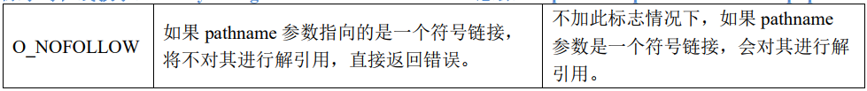


**参数3 mode：**指定新建文件的访问权限，只有当 flags 参数中包含 O_CREAT 或 O_TMPFILE 标志时才有效（O_TMPFILE 标志用于创建一个临时文件）。

首先 mode 参数的类型是 mode_t，这是一个 u32 无符号整形数据，权限表示方法如下所示：


每 3 个 bit 位分为一组，分别表示：

* O---这 3 个 bit 位用于表示其他用户的权限；
* G---这 3 个 bit 位用于表示同组用户（group）的权限，即与文件所有者有相同组 ID 的所有用户；
* U---这 3 个 bit 位用于表示文件所属用户的权限，即文件或目录的所属者；
* S---这 3 个 bit 位用于表示文件的特殊权限，文件特殊权限一般用的比较少


这些宏既可以单独使用，也可以通过位或运算将多个宏组合在一起


**返回值：**成功将返回文件描述符，文件描述符是一个非负整数；失败将返回-1。


### write

使用 write 函数需要先包含 unistd.h 头文件

````c
#include <unistd.h>
ssize_t write(int fd, const void *buf, size_t count);
````

**参数1 fd：**文件描述符。我们需要将进行写操作的文件所对应的文件描述符传递给 write 函数。
**参数2 buf：**指定写入数据对应的缓冲区。
**参数3 count：**指定写入的字节数。
**返回值：**如果成功将返回写入的字节数（0 表示未写入任何字节），如果此数字小于 count 参数，这不是错误，譬如磁盘空间已满，可能会发生这种情况；如果写入出错，则返回-1。

### read 

````c
#include <unistd.h>
ssize_t read(int fd, void *buf, size_t count);
````

**参数1 fd：**文件描述符。与 write 函数的 fd 参数意义相同。
**参数2 buf：**指定用于存储读取数据的缓冲区。

**参数3 count：**指定需要读取的字节数。
**返回值：**如果读取成功将返回读取到的字节数，实际读取到的字节数可能会小于 count 参数指定的字节数，也有可能会为 0，譬如进行读操作时，当前文件位置偏移量已经到了文件末尾。实际读取到的字节数少于要求读取的字节数，譬如在到达文件末尾之前有 30 个字节数据，而要求读取 100 个字节，则 read 读取成功只能返回 30；而下一次再调用 read 读，它将返回 0（文件末尾）。


### close

````c
#include <unistd.h>
int close(int fd);
````

**参数1 fd：**文件描述符，需要关闭的文件所对应的文件描述符。
**返回值：**如果成功返回 0，如果失败则返回-1。
除了使用 close 函数显式关闭文件之外，在 Linux 系统中，当一个进程终止时，内核会自动关闭它打开的所有文件

### lseek

对于每个打开的文件，系统都会记录它的读写位置偏移量，我们也把这个读写位置偏移量称为读写偏移量，记录了文件当前的读写位置，当调用 read()或 write()函数对文件进行读写操作时，就会从当前读写位置偏移量开始进行数据读写。
读写偏移量用于指示 read()或 write()函数操作时文件的起始位置，会以相对于文件头部的位置偏移量来表示，文件第一个字节数据的位置偏移量为 0。
当打开文件时，会将读写偏移量设置为指向文件开始位置处，以后每次调用 read()、write()将自动对其进行调整，以指向已读或已写数据后的下一字节，因此，连续的调用 read()和 write()函数将使得读写按顺序递增，对文件进行操作。

````c
#include <sys/types.h>
#include <unistd.h>
off_t lseek(int fd, off_t offset, int whence);
````

**参数1 fd：**文件描述符。
**参数2 offset：**偏移量，以字节为单位。
**参数3 whence：**用于定义参数 offset 偏移量对应的参考值，该参数为下列其中一种（宏定义）：

* SEEK_SET：读写偏移量将指向 offset 字节位置处（从文件头部开始算）；
* SEEK_CUR：读写偏移量将指向当前位置偏移量 + offset 字节位置处，offset 可以为正、也可以为负，如果是正数表示往后偏移，如果是负数则表示往前偏移；
* SEEK_END：读写偏移量将指向文件末尾 + offset 字节位置处，同样 offset 可以为正、也可以为负，如果是正数表示往后偏移、如果是负数则表示往前偏移。

**返回值：**成功将返回从文件头部开始算起的位置偏移量（字节为单位），也就是当前的读写位置；发生错误将返回-1。


### 案例

拷贝

````c
#include <stdio.h>
#include <sys/types.h>
#include <sys/stat.h>
#include <fcntl.h>
#include <unistd.h>

int main(int argc,char** argv){
        int fd_old,fd_new;
        char buffer[1024];
        int len;
    
		/* 打开旧文件 */
        fd_old = open(argv[1],O_RDONLY);
        if(fd_old == -1){
                printf("文件打开失败\r\n");
                return -1;
        }
    	/* 创建新文件 */
        fd_new = open(argv[2],O_WRONLY |O_CREAT | O_TRUNC, 
                      S_IRUSR | S_IWUSR | S_IRGRP | S_IWGRP | S_IROTH | S_IWOTH); /* 读写 */
    	if(fd_new == -1){
                printf("file creat failed\r\n");
                return -1;
        }
    	/* 循环搬运 */
        while((len = read(fd_old,buffer,sizeof(buffer)) > 0){
                if(write(fd_new,buffer,sizeof(buffer)) != len){
                        printf("write failed\r\n");
                        return -1;
                }
        }
        /* 关闭 */
        close(fd_old);
        close(fd_new);
        return 0;
}
````

````
./IOReadWrite ./rain.txt ./rain2.txt   // IOReadWrite为程序文件名；将当前目录下的rain.txt 拷贝 rain2.txt
````


# Framebuffer

在 Linux 系统中通过 Framebuffer 驱动程序来控制 LCD。Frame 是帧的意思，buffer 是缓冲的意思，这意味着 Framebuffer 就是一块内存，里面保存着
一帧图像。Framebuffer 中保存着一帧图像的每一个像素颜色值，假设 LCD 的分辨率是 1024x768，每一个像素的颜色用 32 位来表示，那么 Framebuffer 的
大小就是：1024x768x32/8=3145728 字节。

BPP(Bits Per Pixel)：像素深度


## **LCD 操作原理**

1. 驱动程序设置好 LCD 控制器：
   1. 根据 LCD 的参数设置 LCD 控制器的时序、信号极性；
   2. 根据 LCD 分辨率、BPP 分配 Framebuffer。
2. APP 使用 ioctl 获得 LCD 分辨率、BPP
3. APP 通过 mmap 映射 Framebuffer，在 Framebuffer 中写入数据

即：将LCD设备映射到内存中，在内存对应地址设置颜色深度就会在对应LCD屏幕中显示色彩


假设需要设置 LCD 中坐标(x,y)处像素的颜色，首要要找到这个像素对应的内存，然后根据它的 BPP 值设置颜色。假设 fb_base 是 APP 执行 mmap 后得到
的 Framebuffer 地址


可以用以下公式算出(x,y)坐标处像素对应的 Framebuffer 地址：

````
(x，y)像素起始地址=framebuffer基地址 + x轴像素 * y * bpp/8 + x*bpp/8
//(x，y)像素起始地址=fb_base+(xres*bpp/8)*y + x*bpp/8
````


**BPP**

它是用 RGB 三原色(红、绿、蓝)来表示的，在不同的 BPP 格式中，用不同的位来分别表示 R、G、B


对于 32BPP，一般只设置其中的低 24 位，高 8 位表示透明度，一般的 LCD都不支持。
对于 24BPP，硬件上为了方便处理，在 Framebuffer 中也是用 32 位来表示，效果跟 32BPP 是一样的。
对于 16BPP，常用的是 RGB565；很少的场合会用到 RGB555


这可以通过ioctl 读取驱动程序中的 RGB 位偏移来确定使用哪一种格式。


## LCD 应用编程介绍

在应用程序中，操作/dev/fbX 的一般步骤如下：

1. 首先打开/dev/fbX 设备文件。
2. 使用 ioctl()函数获取到当前显示设备的参数信息，譬如屏幕的分辨率大小、像素格式，根据屏幕参数计算显示缓冲区的大小。
3. 通过存储映射 I/O 方式将屏幕的显示缓冲区映射到用户空间（mmap）。
4. 映射成功后就可以直接读写屏幕的显示缓冲区，进行绘图或图片显示等操作了。
5. 完成显示后，调用 munmap()取消映射、并调用 close()关闭设备文件。
   

### 相关API 函数

**ioctl 函数**

ioctl()可以认为是一个文件 IO 操作的杂物箱，可以处理的事情非常杂、不统一，一般用于操作特殊文件或硬件外设，此函数将会在进阶篇中使用到，譬如可以通过 ioctl 获取 LCD 相关信息等

````c
#include <sys/ioctl.h>
int ioctl(int fd, unsigned long request, ...);
````

函数说明：

* fd 表示文件描述符；
* request 表示与驱动程序交互的命令，用不同的命令控制驱动程序输出我们需要的数据；
* … 表示可变参数 arg，根据 request 命令，设备驱动程序返回输出的数据。
* 返回值：打开成功返回文件描述符，失败将返回-1。

ioctl 的作用非常强大、灵活。不同的驱动程序内部会实现不同的 ioctl，APP 可以使用各种 ioctl 跟驱动程序交互：可以传数据给驱动程序，也可以从驱
动程序中读出数据。


**mmap 函数**

为了实现存储映射 I/O 这一功能，我们需要告诉内核将一个给定的文件映射到进程地址空间中的一块内存区域中

````c
#include <sys/mman.h>
void *mmap(void *addr, size_t length, int prot, int flags, int fd, off_t offset);
````

* addr：参数 addr 用于指定映射到内存区域的起始地址。通常将其设置为 NULL，这表示由系统选择该映射区的起始地址，这是最常见的设置方式；如果参数 addr 不为 NULL，则表示由自己指定映射区的起始地址，此函数的返回值是该映射区的起始地址。
* length：参数 length 指定映射长度，表示将文件中的多大部分映射到内存区域中，以字节为单位，譬如length=1024 * 4，表示将文件的 4K 字节大小映射到内存区域中。
* offset：文件映射的偏移量，通常将其设置为 0，表示从文件头部开始映射；所以参数 offset 和参数 length就确定了文件的起始位置和长度，将文件的这部分映射到内存区域中
* fd：文件描述符，指定要映射到内存区域中的文件。
* prot：参数 prot 指定了映射区的保护要求，可取值如下：
  * PROT_EXEC：映射区可执行；
  * PROT_READ：映射区可读；
  * PROT_WRITE：映射区可写；
  * PROT_NONE：映射区不可访问。
* flags：参数 flags 可影响映射区的多种属性，参数 flags 必须要指定以下两种标志之一：
  * MAP_SHARED：此标志指定当对映射区写入数据时，数据会写入到文件中，也就是会将写入到映射区中的数据更新到文件中，并且允许其它进程共享。
  * MAP_PRIVATE：此标志指定当对映射区写入数据时，会创建映射文件的一个私人副本（copy-on-write），对映射区的任何操作都不会更新到文件中，仅仅只是对文件副本进行读写。
* 返回值：若成功映射，将返回指向映射的区域的指针，失败将返回-1

**memset 函数**

内存填充：在编程中，经常需要将某一块内存中的数据全部设置为指定的值，譬如在定义数组、结构体这种类型变量时，通常需要对其进行初始化操作，而初始化操作一般都是将其占用的内存空间全部填充为 0

memset()函数用于将某一块内存的数据全部设置为指定的值，其函数原型如下所示：

````c
#include <string.h>
void *memset(void *s, int c, size_t n);
````

使用该函数需要包含头文件<string.h>。

* s：需要进行数据填充的内存空间起始地址。
* c：要被设置的值，该值以 int 类型传递。
* n：填充的字节数。
* 返回值：返回指向内存空间 s 的指针。
  参数 c 虽然是以 int 类型传递，但 memset()函数在填充内存块时是使用该值的无符号字符形式，也就是函数内部会将该值转换为 unsigned char 类型的数据，以字节为单位进行数据填充。

### 获取 LCD 参数

当打开 LCD 设备文件之后，需要先获取到 LCD 屏幕的参数信息，譬如 LCD 的 X 轴分辨率、Y 轴分辨率以及像素格式等信息，通过这些参数计算出 LCD 显示缓冲区的大小。


通 过 ioctl() 函数来获 屏幕参数信息， 对于 Framebuffer 设备来说， 常 用 的 request 包 括FBIOGET_VSCREENINFO、FBIOPUT_VSCREENINFO、FBIOGET_FSCREENINFO。

* `FBIOGET_VSCREENINFO`：表示获取 FrameBuffer 设备的可变参数信息，可变参数信息使用 struct fb_var_screeninfo 结 构 体 来 描 述 ， 所以此时 ioctl() 需要有第三个参 数 ， 它 是 一 个 struct fb_var_screeninfo *指针，指向 struct fb_var_screeninfo 类型对象，调用 ioctl()会将 LCD 屏的可变参数信息保存在 struct fb_var_screeninfo 类型对象中

  ````c
  struct fb_var_screeninfo fb_var;
  ioctl(fd, FBIOGET_VSCREENINFO, &fb_var);
  ````

LCD 驱动程序给 APP 提供 2 类参数：可变的参数 fb_var_screeninfo、固定的参数 fb_fix_screeninfo。编写应用程序时主要关心可变参数，它的结构体定义如下(#include <linux/fb.h>)：


**struct fb_var_screeninfo 结构体**

````c
struct fb_var_screeninfo { 
    __u32 xres;					/* 可视区域，一行有多少个像素点，X 分辨率 */
    __u32 yres; 				/* 可视区域，一列有多少个像素点，Y 分辨率 */
    __u32 xres_virtual;			/* 虚拟区域，一行有多少个像素点 */
    __u32 yres_virtual; 		/* 虚拟区域，一列有多少个像素点 */
    __u32 xoffset; 				/* 虚拟到可见屏幕之间的行偏移 */
    __u32 yoffset; 				/* 虚拟到可见屏幕之间的列偏移 */
    __u32 bits_per_pixel; 		/* 每个像素点使用多少个 bit 来描述，也就是像素深度 bpp */ 
    __u32 grayscale; 			/* =0 表示彩色, =1 表示灰度, >1 表示 FOURCC 颜色 */
    /* 用于描述 R、G、B 三种颜色分量分别用多少位来表示以及它们各自的偏移量 */
    struct fb_bitfield red;		/* Red 颜色分量色域偏移 */
    struct fb_bitfield green;	/* Green 颜色分量色域偏移 */
    struct fb_bitfield blue;	/* Blue 颜色分量色域偏移 */
    struct fb_bitfield transp;	/* 透明度分量色域偏移 */
    __u32 nonstd; 				/* nonstd 等于 0，表示标准像素格式；不等于 0 则表示非标准像素格式 */
    __u32 activate;
    __u32 height; 				/* 用来描述 LCD 屏显示图像的高度（以毫米为单位） */
    __u32 width; 				/* 用来描述 LCD 屏显示图像的宽度（以毫米为单位） */
}
struct fb_bitfield {
    __u32 offset;				/* 偏移量 */
    __u32 length;				/* 长度 */
    __u32 msb_right; 			/* != 0 : Most significant bit is right */
};
````

通过 xres、yres 获取到屏幕的水平分辨率和垂直分辨率，bits_per_pixel 表示像素深度 bpp，即每一个像素点使用多少个 bit 位来描述它的颜色，通过 xres * yres * bits_per_pixel / 8 计算可得到整个显示缓存区的大小。

red、green、blue 描述了 RGB 颜色值中 R、G、B 三种颜色通道分别使用多少 bit 来表示以及它们各自的偏移量，通过 red、green、blue 变量可知道 LCD 的 RGB 像素格式，譬如是 RGB888 还是 RGB565，亦或者是 BGR888、BGR565 等。struct fb_bitfield 结构体如下所示：


**struct fb_fix_screeninfo 结构体**：在应用编程中很少用到

````c
struct fb_fix_screeninfo {
    char id[16];					/* 字符串形式的标识符 */
    unsigned long smem_start; 		/* 显存的起始地址（物理地址） */
    __u32 smem_len; 				/* 显存的长度 */
    __u32 type;
    __u32 type_aux;
    __u32 visual;
    __u16 xpanstep;
    __u16 ypanstep;
    __u16 ywrapstep;
    __u32 line_length;				/* 一行的字节数 */
};
````

## 显示字符

显示中英文字符

**英文字符**

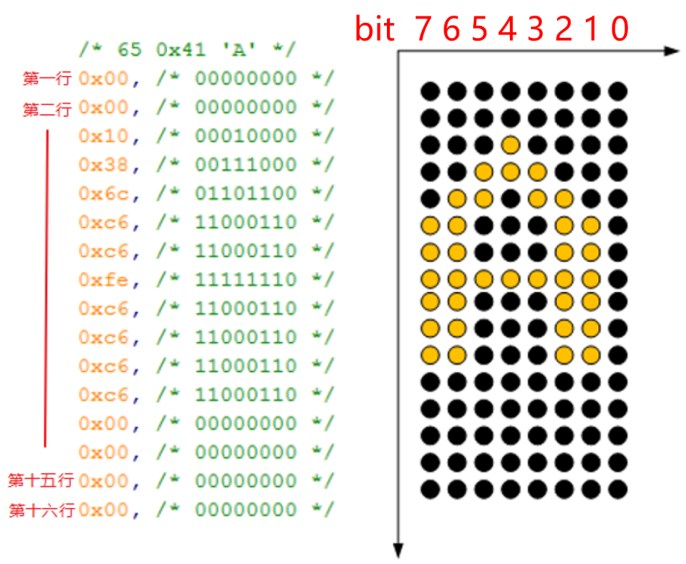


**指定编码格式**

````
-finput-charset=			/* 指定源文件格式 如果不指定 GCC 就会默认 C 程序的编码方式为 UTF-8*/
-fexec-charset=				/* 指定最终编码格式 如果不指定 GCC 就会默认 C 程序的编码方式为 UTF-8*/
````

````
/* 指定源文件格式为UTF-8，指定输出的可执行文件为GB2312 */
arm-buildroot-linux-gnueabihf-gcc -finput-charset=UTF-8 -fexec-charset=GB2312 -o show_chinese show_chinese.c 
````

**汉字区位码**

我们从网上搜到 HZK16 这个文件，它是常用汉字的 16*16 点阵字库。每个汉字使用 32 字节来描述（两个字节代表一个x轴，一共需要显示16个x轴）


HZK16 中是以 GB2312 编码值来查找点阵的，以“中”字为例，它的编码值是“0xd6 0xd0”，其中的 0xd6 表示“区码”，表示在哪一个区：第“0xd6 - 0xa1”
区；其中的 0xd0 表示“位码”，表示它是这个区里的哪一个字符：第“0xd0 -0xa1”个。每一个区有 94 个汉字。区位码从 0xa1 而不是从 0 开始，是为了兼
容 ASCII 码。

所以，我们要显示的“中”字，它的 GB2312 编码是 d6d0，它是 HZK16 里第“(0xd6-0xa1)*94+(0xd0-0xa1)”个字符。

**禁用板子自带GUI**

````
mv /etc/init.d/S99myirhmi2 /etc  /* 只需要将GUI显示文件移除掉即可，恢复可以将文件再移动回来*/
````


**案例**


````c
#include <sys/mman.h>
#include <sys/types.h>
#include <sys/stat.h>
#include <unistd.h>
#include <linux/fb.h>
#include <fcntl.h>
#include <stdio.h>
#include <string.h>
#include <sys/ioctl.h>

static int fd_fb;
static struct fb_var_screeninfo var;	/* Current var */
static int screen_size;
static unsigned char *fb_base;			/* LCD映射 */
static unsigned int line_width;
static unsigned int pixel_width;
int fd_hzk16;		
struct stat hzk_stat;					
unsigned char *hzkmem;					/* 字库映射 */

/* 使用一维数组储存字库，8*16显示一个字符 即一个字需要16个字节进行显示 */
#define FONTDATAMAX 4096
static const unsigned char fontdata_8x16[FONTDATAMAX] = {
    /* …… */
	/* 65 0x41 'A' */
	0x00, /* 00000000 */
	0x00, /* 00000000 */
	0x10, /* 00010000 */
	0x38, /* 00111000 */
	0x6c, /* 01101100 */
	0xc6, /* 11000110 */
	0xc6, /* 11000110 */
	0xfe, /* 11111110 */
	0xc6, /* 11000110 */
	0xc6, /* 11000110 */
	0xc6, /* 11000110 */
	0xc6, /* 11000110 */
	0x00, /* 00000000 */
	0x00, /* 00000000 */
	0x00, /* 00000000 */
	0x00, /* 00000000 */
	/* …… */
}
/* 在x y坐标处像素上显示颜色 */
void lcd_put_pixel(int x, int y, unsigned int color)
{
	unsigned char *pen_8 = fb_base + y * line_width + x * pixel_width; 	/* LCD像素点对应内存 */
	unsigned short *pen_16;												/* 不同的bpp */
	unsigned int *pen_32;	

	unsigned int red, green, blue;	

	pen_16 = (unsigned short *)pen_8;
	pen_32 = (unsigned int *)pen_8;

	switch (var.bits_per_pixel)											/* LCD对应pbb */
	{
		case 8:
		{
			*pen_8 = color;		/* 直接将值赋给内存地址，对应LCD屏幕就会显示色彩 */
			break;
		}
		case 16:				/* 偏移成 对RGB565 */
		{
			/* 565 */
			red   = (color >> 16) & 0xff;
			green = (color >> 8) & 0xff;
			blue  = (color >> 0) & 0xff;
			color = ((red >> 3) << 11) | ((green >> 2) << 5) | (blue >> 3);
			*pen_16 = color;
			break;
		}
		case 32:
		{
			*pen_32 = color;
			break;
		}
		default:
		{
			printf("can't surport %dbpp\n", var.bits_per_pixel);
			break;
		}
	}
}
/* 在对应x y轴处显示字符 */
void lcd_put_ascii(int x, int y, unsigned char c){
    /* 假设要显示字符A 0x41, 0x41 * 16 得到字符A所在数组中的地址 */
	unsigned char *dots = (unsigned char *)&fontdata_8x16[c*16];	
	int i, b;
	unsigned char byte;

	for (i = 0; i < 16; i++)		/* 循环显示16个字节 */
	{
		byte = dots[i];				
		for (b = 7; b >= 0; b--)	/* 循环显示x行，即一个字节 */
		{
			if (byte & (1<<b))		/* 如果byte 为1 显示白色 */
			{
				lcd_put_pixel(x+7-b, y+i, 0xffffff); /* 白 */
			}
			else
			{
				lcd_put_pixel(x+7-b, y+i, 0); /* 黑 */
			}
		}
	}
}
/* 在指定位置现在中文 */
void lcd_put_chinese(int x, int y, unsigned char *str)
{
	unsigned int area  = str[0] - 0xA1;			/* 区码 */
	unsigned int where = str[1] - 0xA1;			/* 位码 */
	unsigned char *dots = hzkmem + (area * 94 + where)*32;	/* 获得字符对应地址 */
	unsigned char byte;

	int i, j, b;
	for (i = 0; i < 16; i++)								/* 循环显示16个x轴 */
		for (j = 0; j < 2; j++)								/* 两个字节代表一个x轴 */
		{
			byte = dots[i*2 + j];
			for (b = 7; b >=0; b--)
			{
				if (byte & (1<<b))
				{
					/* show */
					lcd_put_pixel(x+j*8+7-b, y+i, 0xffffff); /* 白 */
				}
				else
				{
					/* hide */
					lcd_put_pixel(x+j*8+7-b, y+i, 0); /* 黑 */
				}	
			}
		}
}
int main(int argc, char **argv){
	int i;
	
	fd_fb = open("/dev/fb0", O_RDWR);				/* 1.打开设备节点*/
	if (fd_fb < 0)
	{
		printf("can't open /dev/fb0\n");
		return -1;
	}
	if (ioctl(fd_fb, FBIOGET_VSCREENINFO, &var))	/* 2.获取 LCD 参数 */
	{
		printf("can't get var\n");
		return -1;
	}

	line_width  = var.xres * var.bits_per_pixel / 8;				/* x轴宽度 */
	pixel_width = var.bits_per_pixel / 8;							/* 色彩深度 */
	screen_size = var.xres * var.yres * var.bits_per_pixel / 8;		/* 整块屏幕需要占用的内存大小 */
    
    /* 3.将LCD设备映射到内存 */
	fb_base = (unsigned char *)mmap(NULL , screen_size, PROT_READ | PROT_WRITE, MAP_SHARED, fd_fb, 0);
	if (fb_base == (unsigned char *)-1)
	{
		printf("can't mmap\n");
		return -1;
	}
    /* 打开字库 */
	fd_hzk16 = open("HZK16", O_RDONLY);
	if (fd_hzk16 < 0)
	{
		printf("can't open HZK16\n");
		return -1;
	}
	if(fstat(fd_hzk16, &hzk_stat))			/* 获得字库大小 */
	{
		printf("can't get fstat\n");
		return -1;
	}
    /* 使用映射 */
	hzkmem = (unsigned char *)mmap(NULL , hzk_stat.st_size, PROT_READ, MAP_SHARED, fd_hzk16, 0);
	if (hzkmem == (unsigned char *)-1)
	{
		printf("can't mmap for hzk16\n");
		return -1;
	}
	/* 清屏: 全部设为白色 */
	memset(fb_base, 0xff, screen_size);
    
	/* 随便设置出100个为红色 */
	//for (i = 0; i < 100; i++)
	//	lcd_put_pixel(var.xres/2+i, var.yres/2, 0xFF0000);
	
    /* 在屏幕中间显示8*16的字母A */
    lcd_put_ascii(var.xres/2, var.yres/2, 'A'); 
    /* 显示中文 */
    lcd_put_chinese(var.xres/2 + 8,  var.yres/2, str);
    
	munmap(fb_base , screen_size);			/* 取消映射 */
	close(fd_fb);							
	return 0;	
}
````


## FreeType

FreeType 一个完全免费（开源）的软件字体引擎库，设计小巧、高效、高度可定制且可移植，它提供了统一的接口来访问多种不同格式的字体文件。它提供了一个简单、易于使用且统一的接口来访问字体文件的内容，从而大大简化了这些任务


### freetype 移植

记录在交叉编译程序中

### 矢量字体引入

使用点阵字库显示英文字母、汉字时，大小固定，如果放大缩小则会模糊甚至有锯齿出现，为了解决这个问题，引用矢量字体。

矢量字体形成分三步：

* 第1步 确定关键点，
* 第2步 使用数学曲线（贝塞尔曲线）连接头键点，
* 第3步 填充闭合区线内部空间。


# 网络编程

## 网络知识基础

参考Java笔记、正点原子


## Socket简介

套接字（socket）是 Linux 下的一种进程间通信机制（socket IPC），使用 socket IPC 可以使得在不同主机上的应用程序之间进行通信（网络通信），当然也可以是同一台主机上的不同应用程序。socket IPC 通常使用客户端<--->服务器这种模式完成通信，多个客户端可以同时连接到服务器中，与服务器之间完成数据交互。
内核向应用层提供了 socket 接口，对于应用程序开发人员来说，我们只需要调用 socket 接口开发自己的应用程序即可！socket 是应用层与 TCP/IP 协议通信的中间软件抽象层，它是一组接口。在设计模式中，socket 其实就是一个门面模式，它把复杂的 TCP/IP 协议隐藏在 socket 接口后面，对用户来说，一组简单的接口就是全部，让 socket 去组织数据，以符合指定的协议。所以，我们无需深入的去理解 tcp/udp 等各种复杂的 TCP/IP 协议，socket 已经为我们封装好了，我们只需要遵循 socket 的规定去编程，写出的程序自然遵循 tcp/udp 标准的。

## SocketAPI

使用 socket 接口需要在我们的应用程序代码中包含两个头文件：

````c
#include <sys/types.h> /* See NOTES */
#include <sys/socket.h>
````

**sockaddr 结构体**

````c
struct sockaddr {
    sa_family_t sa_family;
    char sa_data[14];
}
````

不过由于系统的兼容性 , 一般使用另外一个结构 (struct sockaddr_in) 来代替。sockaddr_in 和 sockaddr 是并列的结构（占用的空间是一样的），指向 sockaddr_in 的结构体的指针也可以指向 sockadd 的结构体

````c
struct sockaddr_in {
    sa_family_t sin_family;			/* 协议族 */
    in_port_t sin_port;				/* 端口号 */
    struct in_addr sin_addr;		/* IP 地址 */
    unsigned char sin_zero[8];		/* 没有，设置为0 */
};
````

sin_port 字段需要填写的端口号信息，sin_addr字段需要填写的 IP 地址信息

使用示例

````c
struct sockaddr_in socket_addr;
memset(&socket_addr, 0x0, sizeof(socket_addr)); //清零
//填充变量
socket_addr.sin_family = AF_INET;					/* 使用ipv4 */
socket_addr.sin_addr.s_addr = htonl(INADDR_ANY);	/* 任意IP地址 */
socket_addr.sin_port = htons(8888);					/* 8888端口 */
````


**socket()函数**

socket()函数类似于 open()函数，它用于创建一个网络通信端点（打开一个网络通信），如果成功则返回一个网络文件描述符，通常把这个文件描述符称为 socket 描述符（socket descriptor），这个 socket 描述符跟文件描述符一样，后续的操作都有用到它，把它作为参数，通过它来进行一些读写操作。

````c
int socket(int domain, int type, int protocol);
````

* domain：网络程序所在的主机采用的通讯协族(AF_UNIX 和 AF_INET 等)。
  * AF_UNIX：只能够用于单一的 Unix 系统进程间通
  * AF_INET：针对 Internet IPV4,允许远程通信使用
  * AF_INET6：IPV6
* type：网络程序所采用的通讯协议(SOCK_STREAM,SOCK_DGRAM 等)
  * SOCK_STREAM 表明用的是 TCP 协议，这样会提供按顺序的，可靠，双
    向，面向连接的比特流。
  * SOCK_DGRAM 表明用的是 UDP 协议，这样只会提不可靠，无连接的通
    信
* protocol：通常设置为 0，表示为给定的通信域和套接字类型选择默认协议。
* 返回值：socket()函数调用失败，则会返回-1，并且会设置 errno 变量以指示错误类型

**bind()函数**

将一个 IP 地址或端口号与一个套接字进行绑定（将套接字与地址进行关联）。

````c
int bind(int sockfd, const struct sockaddr *addr, socklen_t addrlen);
````

* sockfd 是由 socket 函数调用返回的文件描述符。
* my_addr 是一个指向 sockaddr 的指针。描述绑定的IP 和端口
* addrlen 是 sockaddr 结构的长度。


**listen()函数**

listen()函数只能在服务器进程中使用，让服务器进程进入监听状态，等待客户端的连接请求，listen()函数在一般在 bind()函数之后调用，在 accept()函数之前调用

````C
int listen(int sockfd, int backlog);
````

* sockfd 是 bind 后的文件描述符。
* backlog 设置请求排队的最大长度。当有多个客户端程序和服务端相连时，使用这个表示可以介绍的排队长度。

**accept()函数**
服务器调用 listen()函数之后，就会进入到监听状态，等待客户端的连接请求，使用 accept()函数获取客户端的连接请求并建立连接。

````C
int accept(int sockfd, struct sockaddr *addr, socklen_t *addrlen);
````

* sockfd 是 listen 后的文件描述符。
* addr，addrlen 返回客户端的地址 端口,服务器端只要传递指针就可以了
* 返回值：返回新的文件描述符(即代表客户端的文件描述符)，失败时返回-1 。

accept 调用时，服务器端的程序会一直阻塞到有一个客户程序发出了连接。
理解 accept()函数的关键点在于它会创建一个新的套接字，其实这个新的套接字就是与执行connect()（客户端调用 connect()向服务器发起连接请求）的客户端之间建立了连接，这个套接字代表了服务器与客户端的一个连接。


**connect()函数**

````c
int connect(int sockfd, const struct sockaddr *addr, socklen_t addrlen);
````

* sockfd 是 socket 函数返回的文件描述符。
* serv_addr 储存了服务器端的连接信息，其中 sin_add 是服务端的地址。
* addrlen 是 serv_addr 的长度
* connect 函数是客户端用来同服务端连接的.成功时返回 0，sockfd 是同服务端通讯的文件描述符，失败时返回-1。

客户端通过 connect()函数请求与服务器建立连接，对于 TCP 连接来说，调用该函数将发生 TCP 连接的握手过程，并最终建立一个 TCP 连接，而对于 UDP 协议来说，调用这个函数只是在 sockfd 中记录服务器IP 地址与端口号，而不发送任何数据。


一旦客户端与服务器建立好连接之后，我们就可以通过套接字描述符来收发数据了（对于客户端使用socket()返回的套接字描述符，而对于服务器来说，需要使用 accept()返回的套接字描述符），这与我们读写普通文件是差不多的操作，譬如可以调用 read()或 recv()函数读取网络数据，调用 write()或 send()函数发送数据。


**recv()函数**

````c
ssize_t recv(int sockfd, void *buf, size_t len, int flags);
````

不论是客户端还是服务器都可以通过 revc()函数读取网络数据，它与 read()函数的功能是相似的。参数sockfd 指定套接字描述符，参数 buf 指向了一个数据接收缓冲区，参数 len 指定了读取数据的字节大小，参数 flags 可以指定一些标志用于控制如何接收数据。

一般将 flags 参数设置为 0

| 标志             | 描述                                                 |
| ---------------- | ---------------------------------------------------- |
| MSG_CMSG_CLOEXEC | 为 UNIX 域套接字上接收的文件描述符设置执行时关闭标志 |
| MSG_DONTWAIT     | 启动非阻塞操作（相当于 O_NONBLOCK）                  |
| MSG_ERRQUEUE     | 接收错误信息作为辅助数据                             |
| MSG_OOB          | 如果协议支持，获取带外数据                           |
| MSG_PEEK         | 返回数据包内容而不真正取走数据包                     |
| MSG_TRUNC        | 即使数据包被截断，也返回数据包的长度                 |
| MSG_WAITALL      | 等待知道所有的数据可用（仅 SOCK_STREAM）             |

**recvfrom() 函数**

````c
ssize_t recvfrom(int sockfd, void *buf, size_t len, int flags,struct sockaddr *src_addr, socklen_t *addrlen);
````

* recvfrom 通常用于无连接套接字，因为此函数可以获得发送者的地址。
* src_addr 是一个 struct sockaddr 类型的变量，该变量保存源机的 IP 地址及端口号。
* addrlen 常置为 sizeof （struct sockaddr）。


**send()函数**

````c
ssize_t send(int sockfd, const void *buf, size_t len, int flags);
````

| 标志          | 描述                                    |
| ------------- | --------------------------------------- |
| MSG_CONFIRM   | 提供链路层反馈以保持地址映射有效        |
| MSG_DONTROUTE | 勿将数据包路由出本地网络                |
| MSG_DONTWAIT  | 允许非阻塞操作（等价于使用 O_NONBLOCK） |
| MSG_EOR       | 如果协议支持，标志记录结束              |
| MSG_MORE      | 延迟发送数据包允许写更多数据            |
| MSG_NOSIGNAL  | 在写无连接的套接字时不产生 SIGPIPE 信号 |
| MSG_OOB       | 如果协议支持，发送带外数据              |

即使 send()成功返回，也并不表示连接的另一端的进程就一定接收了数据，我们所能保证的只是当 send成功返回时，数据已经被无错误的发送到网络驱动程序上。

**sendto() 函数**

````c
ssize_t sendto(int sockfd, const void *buf, size_t len, int flags,const struct sockaddr *dest_addr, socklen_t addrlen);
````

* sendto 和 send 相似，区别在于 sendto 允许在无连接的套接字上指定一个目标地址（省略connect函数 UDP连接）。
* dest_addr 表示目地机的 IP 地址和端口号信息
* addrlen 常常被赋值为 sizeof （struct sockaddr）。
* sendto 函数也返回实际发送的数据字节长度或在出现发送错误时返回-1。


**read()函数**

**write()函数**


**close()关闭套接字**

## 其他API

**IP 地址格式转换**

对于人来说，我们更容易阅读的是点分十进制的 IP 地址，譬如 192.168.1.110，这其实是一种字符串的形式，但是计算机所需要理解的是二进制形式的 IP 地址，所以我们就需要在点分十进制字符串和二进制地址之间进行转换。

点分十进制字符串和二进制地址之间的转换函数主要有：inet_aton、inet_addr、inet_ntoa、inet_ntop、inet_pton 这五个，在我们的应用程序中使用它们需要包含头文件 <sys/socket.h>、<arpa/inet.h>以及<netinet/in.h>。

**inet_pton()函数**

````c
int inet_pton(int af, const char *src, void *dst);
````

inet_pton()函数将点分十进制表示的字符串形式转换成二进制 Ipv4 或 Ipv6 地址。将字符串 src 转换为二进制地址，参数 af 必须是 AF_INET 或 AF_INET6，AF_INET 表示待转换的 Ipv4地址，AF_INET6 表示待转换的是 Ipv6 地址；并将转换后得到的地址存放在参数 dst 所指向的对象中，如果参数 af 被指定为 AF_INET，则参数 dst 所指对象应该是一个 struct in_addr 结构体的对象；如果参数 af 被指定为 AF_INET6，则参数 dst 所指对象应该是一个 struct in6_addr 结构体的对象。
**inet_ntop()函数**

````c
const char *inet_ntop(int af, const void *src, char *dst, socklen_t size);
````

参数 af 与 inet_pton()函数的 af 参数意义相同。参数 src 应指向一个 struct in_addr 结构体对象或 struct in6_addr 结构体对象，依据参数 af 而定。函数inet_ntop()会将参数 src 指向的二进制 IP 地址转换为点分十进制形式的字符串，并将字符串存放在参数 dts所指的缓冲区中，参数 size 指定了该缓冲区的大小。


**ntohl()、htonl()、ntohs()、htons()**

注意，htons 和 htonl 并不是函数，只是一个宏定义，主要的作用在于为了避免大小端的问题，需要这些宏需要在我们的应用程序代码中包含头文件<netinet/in.h>。

大端存储和小端存储：0x1234这个数据

* 大端存储：低地址：0x12(高字节)，高地址：0x32(低字节)
* 小端存储：低地址：0x34(低字节)，高地址：0x12(高字节)

在这几个函数中n代表net网络，h代表host主机，l代表long长整型，s代表short短整型。这几个函数的作用分别为：

* ntohl()：将一个无符号长整形数从网络字节顺序转换为主机字节顺序
* htonl()：将一个无符号长整形数从主机字节顺序转换为网络字节顺序
* ntohs()：将一个无符号短整形数从网络字节顺序转换为主机字节顺序
* htons()：将一个无符号短整形数从主机字节顺序转换为网络字节顺序

## 案例

### TCP案例

服务端使用：socket()、bind()、listen()、accept()函数

客户端使用：socket()、connect()函数

客户端发送数据，服务端接收数据

服务器

````c
#include <sys/types.h>          /* See NOTES */
#include <sys/socket.h>
#include <stdio.h>
#include <string.h>
#include <arpa/inet.h>          /* htons htonl inet_htop inet_ptoh*/
#include <netinet/in.h>
#include <unistd.h>

int main(int argc,char **argv){
    int SocketServer;					/* 服务端的Socket描述符 */
    int SocketClient;					/* 用来表示accept返回的客户端的Socket描述符 */
    struct sockaddr_in ServerAddr;		/* 服务端的地址 端口 */
    struct sockaddr_in ClientAddr;		/* 客户端的地址 端口 */
    int Ret;
    int RecvLen;
    char RecvBuffer[1000];

    SocketServer = socket(AF_INET,SOCK_STREAM,0);	/* 使用IPV4 TCP协议 */
    if(-1 == SocketServer){
        printf("socket失败\r\n");
        return -1;
    }
    /* 设置服务端监听的IP 地址 和端口 */
    ServerAddr.sin_family = AF_INET;				/* IPV4 */		
    ServerAddr.sin_port = htons(8888);				/* 监听8888端口 */
    ServerAddr.sin_addr.s_addr = htonl(INADDR_ANY);	/* 任意地址 */
	/* 将监听地址信息绑定到Socket描述符 */
    Ret = bind(SocketServer, (const struct sockaddr *)&ServerAddr,sizeof (ServerAddr));
    if(-1 == Ret){
        printf("bind 失败\r\n");
        return - 1;
    }
    Ret = listen(SocketServer , 10);				/* 开始监听，最大10个链接 */
    if(-1 == Ret){
        printf("listen 失败\r\n");
        return - 1;
    }

    int AddLen = sizeof (ClientAddr);
    /* 开始接受，一直阻塞，指导客户端发来请求，将客户端信息放入参数2中，返回新的Socket描述符 */
    SocketClient =  accept(SocketServer, (struct sockaddr *)&ClientAddr,&AddLen);
    while(1){
        printf("__________\r\n");
        if(-1 != SocketClient){
            /* 接收客户端数据 */
            RecvLen = recv(SocketClient, RecvBuffer, sizeof (RecvBuffer), 0);
            if(RecvLen <= 0){
                close(SocketClient);
                return -1;
            }else{
                RecvBuffer[RecvLen] = '\0';
            	printf("客户端IP:%s:%d \n",inet_ntoa(ClientAddr.sin_addr),ClientAddr.sin_port);
                printf("客户端:%s \r\n",RecvBuffer);
            }
        }

    }
    return 0;
}
````

客户端

````c
#include <sys/types.h>          /* See NOTES */
#include <sys/socket.h>
#include <stdio.h>
#include <string.h>
#include <arpa/inet.h>          /* htons htonl inet_htop inet_ptoh*/
#include <netinet/in.h>
#include <unistd.h>

int main(int argc,char **argv){
    int SocketClient;
    struct sockaddr_in ServerAddr;
    int Ret;
    int SendLen;
    unsigned char SendBuf[1000];

    SocketClient = socket(AF_INET,SOCK_STREAM,0);
    if(-1 == SocketClient){
        printf("socket失败\r\n");
        return -1;
    }
    ServerAddr.sin_family = AF_INET;
    ServerAddr.sin_port = htons(8888);
    inet_aton("192.168.5.11",&ServerAddr.sin_addr);			/* 发送给IP地址192.168.5.11，端口好8888的主机 */
    
    /* 建立连接 */
    Ret = connect(SocketClient, (const struct sockaddr *)&ServerAddr, sizeof(ServerAddr));
    if(-1 == Ret){
        printf("connect失败\r\n");
        return -1;
    }
    while(1){
        printf("请输入:");
        scanf("%s",SendBuf);

        if(SendBuf == NULL){
            printf(" scanf失败\r\n");
            return -1;
        }
        SendLen = send(SocketClient, SendBuf, strlen(SendBuf), 0);	/* 发送 */
        if (SendLen <= 0)
        {
            close(SocketClient);
            return -1;
        }
    }
    return 0;
}
````

### UDP案例

与TCP区别：

服务端使用：socket()、bind()、recefrom()函数

客户端使用：socket()、[connect()]、sendto()函数

服务端

````C
#include <sys/types.h>          /* See NOTES */
#include <sys/socket.h>
#include <stdio.h>
#include <string.h>
#include <arpa/inet.h>          /* htons htonl inet_htop inet_ptoh*/
#include <netinet/in.h>
#include <unistd.h>
int main(int argc,char **argv){
    int SocketServer;
    int SocketClient;
    struct sockaddr_in ServerAddr;
    struct sockaddr_in ClientAddr;
    int Ret;
    int RecvLen;
    char RecvBuffer[1000];

    SocketServer = socket(AF_INET,SOCK_DGRAM,0);                /* SOCK_DGRAM代表 UDP*/
    if(-1 == SocketServer){
        printf("socket失败\r\n");
        return -1;
    }
    ServerAddr.sin_family = AF_INET;
    ServerAddr.sin_port = htons(8888);
    ServerAddr.sin_addr.s_addr = htonl(INADDR_ANY);

    Ret = bind(SocketServer, (const struct sockaddr *)&ServerAddr,sizeof (ServerAddr));
    if(-1 == Ret){
        printf("bind 失败\r\n");
        return - 1;
    }

    while(1){
        printf("__________\r\n");
        int AddLen = sizeof (ClientAddr);
        /* 不使用listen()、accept()函数，直接使用recvfrom()进行发送 */
        RecvLen = recvfrom(SocketServer, RecvBuffer, sizeof (RecvBuffer), 0,(struct sockaddr *)&ClientAddr, 
                           &AddLen);
        
        if(RecvLen <= 0){
            close(SocketServer);
            return -1;
        }else{
            RecvBuffer[RecvLen] = '\0';
            printf("客户端IP:%s:%d \n",inet_ntoa(ClientAddr.sin_addr),ClientAddr.sin_port);
            printf("客户端:%s \r\n",RecvBuffer);
        }
    }
    return 0;
}
````

客户端

````c
#include <sys/types.h>          /* See NOTES */
#include <sys/socket.h>
#include <stdio.h>
#include <string.h>
#include <arpa/inet.h>          /* htons htonl inet_htop inet_ptoh*/
#include <netinet/in.h>
#include <unistd.h>

int main(int argc,char **argv){
    int SocketClient;
    struct sockaddr_in ServerAddr;
    int Ret;
    int SendLen;
    unsigned char SendBuf[1000];

    SocketClient = socket(AF_INET,SOCK_DGRAM,0);		/* UDP */
    if(-1 == SocketClient){
        printf("socket失败\r\n");
        return -1;
    }
    ServerAddr.sin_family = AF_INET;
    ServerAddr.sin_port = htons(8888);
    inet_aton("192.168.5.11",&ServerAddr.sin_addr);
    while(1){
        printf("请输入:");
        scanf("%s",SendBuf);

        if(SendBuf == NULL){
            printf(" scanf失败\r\n");
            return -1;
        }
        /* 可以不使用connect()函数进行连接，直接使用sendto()发送，参数5：发送目标地址 */
        SendLen = sendto(SocketClient, SendBuf, strlen(SendBuf), 0,(const struct sockaddr *)&ServerAddr, 
                         sizeof(ServerAddr));
        
        if (SendLen <= 0)
        {
            close(SocketClient);
            return -1;
        }
    }
    
    /* 使用TCP代码中的函数同样能完成发送，没有区别 */
//    Ret = connect(SocketClient, (const struct sockaddr *)&ServerAddr, sizeof(ServerAddr));
//    if(-1 == Ret){
//        printf("connect失败\r\n");
//        return -1;
//    }
//    while(1){
//        printf("请输入:");
//        scanf("%s",SendBuf);
//
//        if(SendBuf == NULL){
//            printf(" scanf失败\r\n");
//            return -1;
//        }
//        SendLen = send(SocketClient, SendBuf, strlen(SendBuf), 0);
//        if (SendLen <= 0)
//        {
//            close(SocketClient);
//            return -1;
//        }
//    }
    return 0;
}
````


# 线程


## 线程的使用

````c
#include <pthread.h>
````

**线程的标识 pthread_t**

对于进程而言，每一个进程都有一个唯一对应的 PID 号来表示该进程，而对于线程而言，也有一个“类似于进程的 PID 号”，名为 tid，其本质是一个
pthread_t 类型的变量。线程号与进程号是表示线程和进程的唯一标识，但是对于线程号而言，其仅仅在其所属的进程上下文中才有意义。

````c
#include <pthread.h>
/* 获取线程号 成功：返回线程号 */
pthread_t pthread_self(void);
/* 检查两个线程 ID 是否相等 */
int pthread_equal(pthread_t t1, pthread_t t2);
````


**创建**

````c
int pthread_create(pthread_t *thread, const pthread_attr_t *attr,void *(*start_routine) (void *), void *arg);
````

* 该函数第一个参数为 pthread_t 指针，用来保存新建线程的线程号；
* 第二个参数表示了线程的属性，一般传入 NULL 表示默认属性；
* 第三个参数是一个函数指针，就是线程执行的函数。这个函数返回值为 void，形参为 void。
* 第四个参数则表示为向线程处理函数传入的参数，若不传入，可用 NULL 填充，有关线程传参后续小节会有详细的说明，接下来通过一个简单例程来使用该函数创建出一个线程。

**退出与回收**

````c
/* 主动退出,退出时候可以传递一个 void*类型的数据带给主线程*/
void pthread_exit(void *retval);
/* 被动退出,其他线程使用该函数让另一个线程退出 */
int pthread_cancel(pthread_t thread);

/* 线程资源回收(阻塞方式) 
该函数为线程回收函数，默认状态为阻塞状态，直到成功回收线程后才返回。第一个参数为要回收线程的 tid 号，第二个参数为线程回收后接受线程传
出的数据
*/
int pthread_join(pthread_t thread, void **retval);
/* 线程资源回收(非阻塞方式),通过返回值判断是否回收掉线程，成功回收则返回 0，其余参数与 pthread_join 一致。*/
int pthread_tryjoin_np(pthread_t thread, void **retval);
````


**线程使用流程图**

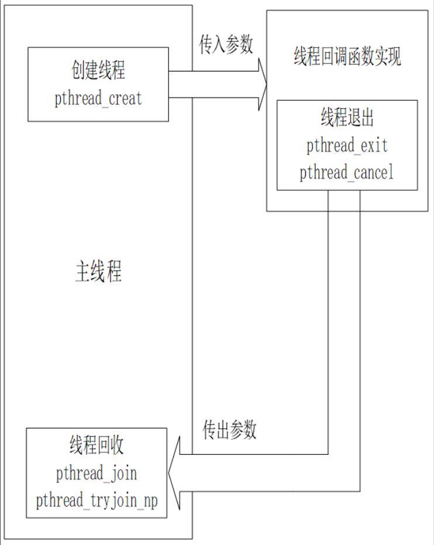


## 线程的控制

### 互斥锁

互斥锁使用 `pthread_mutex_t` 结构体数据类型表示

**互斥锁初始化**
两种方法

````c
/* 使用宏初始化 */
pthread_mutex_t mutex = PTHREAD_MUTEX_INITALIZER;
/* 使用函数初始化 
第一个参数是改互斥量指针，第二个参数为控制互斥量的属性，一般为 NULL。当函数成功后会返回 0*/
int pthread_mutex_init(phtread_mutex_t *mutex,const pthread_mutexattr_t *restrict attr);
````

**加锁/解锁/销毁**

````c
/* lock 函数与 unlock 函数分别为加锁解锁函数，只需要传入已经初始化好的pthread_mutex_t 互斥量指针。成功后会返回 0。 */
int pthread_mutex_lock(pthread_mutex_t *mutex);
int pthread_mutex_unlock(pthread_mutex_t *mutex);
/* 互斥量加锁(非阻塞方式) 该函数是非阻塞模式通过返回值来判断是否加锁成功 */
int pthread_mutex_trylock(pthread_mutex_t *mutex);
/* 互斥量销毁 */
int pthread_mutex_destory(pthread_mutex_t *mutex);
````

某一个线程获得了执行权后，执行 lock 函数，一旦加锁成功后，其余线程遇到 lock 函数时候会发生阻塞，直至获取资源的线程执行 unlock 函数后。unlock 函数会唤醒其他正在等待互斥量的线程。特别注意的是，当获取 lock 之后，必须在逻辑处理结束后执行 unlock，否则会发生死锁现象！导致其余线程一直处于阻塞状态，无法执行下去。在使用互斥量的时候，尤其要注意使用 pthread_cancel 函数，防止发生死锁现象！


**互斥量使用流程图**


### 信号量 

信号量跟互斥量不一样，互斥量用来防止多个线程同时访问某个临界资源。信号量起通知作用，线程 A 在等待某件事，线程 B 完成了这件事后就可以给线程 A 发信号。

**初始化**

````c
/*该函数可以初始化一个信号量
第一个参数传入 sem_t 类型指针；
第二个参数传入 0 代表线程控制，否则为进程控制；
第三个参数表示信号量的初始值，0 代表阻塞，1 代表运行。
待初始化结束信号量后，若执行成功会返回 0。
*/
int sem_init(sem_t *sem,int pshared,unsigned int value);
````

**申请/释放**

````c
/* sem_wait 函数作用为检测指定信号量是否有资源可用，若无资源可用会阻塞等待，若有资源可用会自动的执行“sem-1”的操作。所谓的“sem-1”是与上述初始化函数中第三个参数值一致，成功执行会返回 0。 */
int sem_wait(sem_t *sem);
/* 申请(非阻塞方式) */
int sem_trywait(sem_t *sem);

/* sem_post 函数会释放指定信号量的资源，执行“sem+1”操作。 */
int sem_post(sem_t *sem);
````

**销毁**

````c
/* 该函数为信号量销毁函数，执行过后可将信号量进行销毁。 */
int sem_destory(sem_t *sem);
````

**信号量使用流程图**


### **条件变量**

条件变量是线程可用的另一种同步机制。条件变量用于自动阻塞线程，知道某个特定事件发生或某个条件满足为止，通常情况下，条件变量是和互斥锁一起搭配使用的。使用条件变量主要包括两个动作：

* 一个线程等待某个条件满足而被阻塞；
* 另一个线程中，条件满足时发出“信号”。

**初始化**

条件变量使用 `pthread_cond_t` 数据类型来表示，类似于互斥锁，在使用条件变量之前必须对其进行初始化。初始化方式同样也有两种：使用宏 `PTHREAD_COND_INITIALIZER` 或者使用函数 `pthread_cond_init()`

````c
pthread_cond_t cond = PTHREAD_COND_INITIALIZER;
int pthread_cond_init(pthread_cond_t *cond, pthread_condattr_t *cond_attr);
````

**等待**

````c
/* 作用：执行这个函数，会给对应互斥锁加锁(注意是加锁)
cond：指向需要等待的条件变量，目标条件变量；
mutex：参数 mutex 是一个 pthread_mutex_t 类型指针，指向一个互斥锁对象；条件变量通常是和互斥锁一起使用，因为条件的检测（条件检测通常是需要访问共享资源的）是在互斥锁的保护下进行的，也就是说条件本身是由互斥锁保护的。
返回值：调用成功返回 0；失败将返回一个非 0 值的错误码。 */
int pthread_cond_wait(pthread_cond_t *cond, pthread_mutex_t *mutex);
````

个人理解：条件不满足时，阻塞，当条件满足时，对互斥锁加锁(即别的函数无法执行)


当程序当中使用条件变量，当判断某个条件不满足时，调用 pthread_cond_wait()函数将线程设置为等待状态（阻塞）

在 pthread_cond_wait()函数内部会对参数 mutex 所指定的互斥锁进行操作，通常情况下，条件判断以及pthread_cond_wait()函数调用均在互斥锁的保护下，也就是说，在此之前线程已经对互斥锁加锁了。调用pthread_cond_wait()函数时，调用者把互斥锁传递给函数，函数会自动把调用线程放到等待条件的线程列表上，然后将互斥锁解锁；当 pthread_cond_wait()被唤醒返回时，会再次锁住互斥锁。


**通知**

````c
/*
pthread_cond_signal()函数至少能唤醒一个线程
pthread_cond_broadcast()函数则能唤醒所有线程。
*/ 
int pthread_cond_signal(pthread_cond_t *cond);
int pthread_cond_broadcast(pthread_cond_t *cond);
````

使用 pthread_cond_broadcast()函数总能产生正确的结果，唤醒所有等待状态的线程，但函数 pthread_cond_signal()会更为高效，因为它只需确保至少唤醒一个线程即可，所以如果我们的程序当中，只有一个处于等待状态的线程，使用 pthread_cond_signal()更好，具体使用哪个函数根据实际情况进行选择！


### 自旋锁

如果在获取自旋锁时，自旋锁处于未锁定状态，那么将立即获得锁（对自旋锁上锁）；如果在获取自旋锁时，自旋锁已经处于锁定状态了，那么获取锁操作将会在原地“自旋”，直到该自旋锁的持有者释放了锁。


自旋锁通常用于以下情况：需要保护的代码段执行时间很短，这样就会使得持有锁的线程会很快释放锁，而“自旋”等待的线程也只需等待很短的时间；在这种情况下就比较适合使用自旋锁，效率高！


**自旋锁与互斥锁的区别**

* 互斥锁是基于自旋锁来实现的，所以自旋锁相较于互斥锁更加底层。

* 在无法获取锁时
  * 自旋锁：原地“自旋”等待，一直占用的 CPU
  * 互斥锁：阻塞等待状态，不浪费CPU
* 加锁两次
  * 自旋锁加锁两次必然会导致死锁
  * 互斥锁加锁两次不一定会导致死锁：原因在于互斥锁有不同的类型，当设置为 PTHREAD_MUTEX_ERRORCHECK 类型时，会进行错误检查，第二次加锁会返回错误


**初始化与销毁**

自旋锁使用 `pthread_spinlock_t` 数据类型表示，当定义自旋锁后，需要使用 `pthread_spin_init()`函数对其进行初始化，当不再使用自旋锁时，调用 `pthread_spin_destroy()`函数将其销毁

````c
/*
参数 lock 指向了需要进行初始化或销毁的自旋锁对象
参数 pshared 表示自旋锁的进程共享属性，可以取值如下：
	PTHREAD_PROCESS_SHARED：共享自旋锁。该自旋锁可以在多个进程中的线程之间共享；
	PTHREAD_PROCESS_PRIVATE：私有自旋锁。只有本进程内的线程才能够使用该自旋锁。
	
成功的情况下返回 0；失败将返回一个非 0 值的错误码
*/
int pthread_spin_init(pthread_spinlock_t *lock, int pshared);
int pthread_spin_destroy(pthread_spinlock_t *lock);
````

**加锁和解锁**

````c
int pthread_spin_lock(pthread_spinlock_t *lock);
int pthread_spin_trylock(pthread_spinlock_t *lock);
int pthread_spin_unlock(pthread_spinlock_t *lock);
````

### 读写锁

互斥锁或自旋锁要么是加锁状态、要么是不加锁状态，而且一次只有一个线程可以对其加锁。


读写锁有3 种状态：读模式下的加锁状态）、写模式下的加锁状态和不加锁状态，一次只有一个线程可以占有写模式的读写锁，但是可以有多个线程同时占有读模式的读写锁。因此可知，读写锁比互斥锁具有更高的并行性！


读写锁非常适合于对共享数据读的次数远大于写的次数的情况。读写锁也叫做共享互斥锁。


**两个规则：**

* 写加锁状态时，在锁被解锁之前，所有试图对这个锁进行加锁操作（不管是以读模式加锁还是以写模式加锁）的线程都会被阻塞。
* 读加锁状态时，所有试图以读模式对它进行加锁的线程都可以加锁成功；以写模式对它进行加锁的线程都会被阻塞，直到所有持有读模式锁的线程释放它们的锁为止。

**初始化/销毁**

读写锁使用`pthread_rwlock_t` 数据类型表示,两种方式

````c
/* 使用宏初始化 */
pthread_rwlock_t rwlock = PTHREAD_RWLOCK_INITIALIZER;
/* 使用函数初始化
参数 rwlock 指向需要进行初始化或销毁的读写锁对象。
参数 attr 是一个 pthread_rwlockattr_t *类型指针，一般设置为 NULL，则表示将读写锁的属性设置为默认值
*/
int pthread_rwlock_init(pthread_rwlock_t *rwlock, const pthread_rwlockattr_t *attr);

/* 销毁 */
int pthread_rwlock_destroy(pthread_rwlock_t *rwlock);
````

**上锁/解锁**

````c
/* 读上锁 */
int pthread_rwlock_rdlock(pthread_rwlock_t *rwlock);
/* 读上锁(非阻塞) 如果不可以获取锁，立马返回错误，错误码为 EBUSY */
int pthread_rwlock_tryrdlock(pthread_rwlock_t *rwlock);

/* 写上锁 */
int pthread_rwlock_wrlock(pthread_rwlock_t *rwlock);
/* 写上锁(非阻塞) 如果不可以获取锁，立马返回错误，错误码为 EBUSY */
int pthread_rwlock_trywrlock(pthread_rwlock_t *rwlock);


/* 解锁 */
int pthread_rwlock_unlock(pthread_rwlock_t *rwlock);
````


# 串口


串口（UART）在嵌入式 Linux 系统中常作为系统的标准输入、输出设备，系统运行过程产生的打印信息通过串口输出；同理，串口也作为系统的标准输入设备，用户通过串口与 Linux 系统进行交互。所以串口在 Linux 系统就是一个终端，提到串口，就不得不引出“终端（Terminal）”这个概念了。

## 终端 Terminal

终端就是处理主机输入、输出的一套设备，它用来显示主机运算的输出，并且接受主机要求的输入。典型的终端包括显示器键盘套件，打印机打字机套件等。

**终端的分类**

* 本地终端：一个显示器/键盘组合就是一个本地终端；同样对于开发板来说也是如此，开发板也可以连接一个LCD 显示器、键盘和鼠标等，同样可以构成本地终端。
* 用串口连接的远程终端：对于嵌入式 Linux 开发来说，这是最常见的终端—串口终端。譬如我们的开发板通过串口线连接到一个带有显示器和键盘的 PC 机，在 PC 机通过运行一个终端模拟程序
* 基于网络的远程终端：譬如我们可以通过 ssh、Telnet 这些协议登录到一个远程主机。

以上列举的这些都是终端，前两类称之为物理终端；最后一个称之为伪终端。前两类都是在本地就直接关联了物理设备的，譬如显示器、鼠标键盘、串口等之类的，这种终端叫做物理终端，而第三类在本地则没有关联任何物理设备，注意，不要把物理网卡当成终端关联的物理设备，它们与终端并不直接相关，所以这
类不直接关联物理设备的终端叫做伪终端。

**终端对应的设备节点**

在 Linux 当中，一切皆是文件。当然，终端也不例外，每一个终端在/dev 目录下都有一个对应的设备节点。

* `/dev/ttyX`（X 是一个数字编号，譬如 0、1等）设备节点：ttyX（teletype 的简称），在 Linux 中，/dev/ttyX 代表本地终端，包括/dev/tty1~/dev/tty63 一共63 个本地终端，也就是连接到本机的键盘显示器可以操作的终端。事实上，这是 Linux 内核在初始化时所生成的 63 个本地终端。
* `/dev/pts/X`（X 是一个数字编号，譬如 0、1等）设备节点：这类设备节点是伪终端对应的设备节点。譬如我们通过Xshell登录协议登录到开发板主机，那么此文件夹下就会多出一个数字
* `/dev/ttymxcX` 串口终端设备节点：对于韦东山开发板有3个串口，就对应3个设备。(mxc 这个名字不是一定的)

在 Linux 系统下，我们可以使用 `who` 命令来查看计算机系统当前连接了哪些终端（一个终端就表示有一个用户使用该计算机）


## 相关API

 Linux 为上层用户做了一层封装，就不需要我们使用ioctl()等对其进行配置了


termios API，这些 API 其实是 C 库函数，可以使用 man 3 手册查看到它们的帮助信息；这里需要注意的是，这一套接口并不是针对串口开发的，而是针对所有的终端设备，串口是一种终端设备，计算机系统本地连接的鼠标、键盘也是终端设备，通过 ssh 远程登录连接的伪终端也是终端设备。

````c
#include <termios.h>
#include <unistd.h>

/* 获得串口信息 */
int tcgetattr(int fd, struct termios *termios_p);
/* 设置串口学习 */
int tcsetattr(int fd, int optional_actions, const struct termios *termios_p);

int tcsendbreak(int fd, int duration);
/* 缓冲区处理 */
int tcdrain(int fd);
int tcflush(int fd, int queue_selector);
int tcflow(int fd, int action);

/* 配置为原始模式 */
void cfmakeraw(struct termios *termios_p);

/* 获得输入输出速度  */
speed_t cfgetispeed(const struct termios *termios_p);
speed_t cfgetospeed(const struct termios *termios_p);

/* 设置输入输出速度 */
int cfsetispeed(struct termios *termios_p, speed_t speed);
int cfsetospeed(struct termios *termios_p, speed_t speed);
int cfsetspeed(struct termios *termios_p, speed_t speed);
````

### **struct termios 结构体**

对于终端来说，其应用编程内容无非包括两个方面的内容：配置和读写；对于配置来说，一个很重要的数据结构便是 `struct termios` 结构体，该数据结构描述了终端的配置信息，这些参数能够控制、影响终端的行为、特性，事实上，终端设备应用编程（串口应用编程）主要就是对这个结构体进行配置。

````c
struct termios{
    tcflag_t c_iflag;	/* input mode flags		输入模式 */
    tcflag_t c_oflag;	/* output mode flags	输出模式 */
    tcflag_t c_cflag;	/* control mode flags	控制模式 */
    tcflag_t c_lflag;	/* local mode flags		本地模式 */
    cc_t c_line;		/* line discipline		线路规程 */
    cc_t c_cc[NCCS];	/* control characters	特殊控制字符 */
    speed_t c_ispeed;	/* input speed			输入速率 */
    speed_t c_ospeed;	/* output speed			输出速率 */
};
````

**输入模式：c_iflag**

输入模式控制输入数据（终端驱动程序从串口或键盘接收到的字符数据）在被传递给应用程序之前的处理方式。所有的标志都被定义为宏。

````
IGNBRK	忽略输入终止条件
BRKINT	当检测到输入终止条件时发送 SIGINT 信号
IGNPAR	忽略帧错误和奇偶校验错误
PARMRK	对奇偶校验错误做出标记
INPCK	对接收到的数据执行奇偶校验
ISTRIP	将所有接收到的数据裁剪为 7 比特位、也就是去除第八位
INLCR	将接收到的 NL（换行符）转换为 CR（回车符）
IGNCR	忽略接收到的 CR（回车符）
ICRNL	将接收到的 CR（回车符）转换为 NL（换行符）
IUCLC	将接收到的大写字符映射为小写字符
IXON	启动输出软件流控
IXOFF	启动输入软件流控
````

**输出模式：c_oflag**

输出模式控制输出字符的处理方式，即由应用程序发送出去的字符数据在传递到串口或屏幕之前是如何处理的。

````
OPOST	启用输出处理功能，如果不设置该标志则其他标志都被忽略
OLCUC	将输出字符中的大写字符转换成小写字符
ONLCR	将输出中的换行符（NL '\n'）转换成回车符（CR '\r'）
OCRNL	将输出中的回车符（CR '\r'）转换成换行符（NL '\n'）
ONOCR	在第 0 列不输出回车符（CR）
ONLRET	不输出回车符
OFILL	发送填充字符以提供延时
OFDEL	如果设置该标志，则表示填充字符为 DEL 字符，否则为 NULL字符
````

**控制模式：c_cflag**
控制模式控制终端设备的硬件特性，譬如对于串口来说，该字段比较重要，可设置串口波特率、数据位、校验位、停止位等硬件特性。

````
CBAUD	波特率的位掩码
B0	波特率为 0
……
……
B9600	9600波特率
B19200	19200波特率
……
……
CSIZE	数据位的位掩码
CS5		5个数据位
CS6		6个数据位
CS7		7个数据位
CS8		8个数据位
CSTOPB	2个停止位，如果不设置该标志则默认是一个停止位
CREAD	接收使能
PARENB	使能奇偶校验
PARODD	使用奇校验、而不是偶校验
HUPCL	关闭时挂断调制解调器
CLOCAL	忽略调制解调器控制线
CRTSCTS	使能硬件流控
````

在 struct termios 结构体中，有一个 `c_ispeed` 成员变量和 `c_ospeed` 成员变量，在其它一些系统中，可能会使用这两个变量来指定串口的波特率；在 Linux 系统下，则是使用 CBAUD 位掩码所选择的几个 bit 位来指定串口波特率。事实上，termios API 中提供了 `cfgetispeed()`和 `cfsetispeed()`函数分别用于获取和设置串口的波特率。


**本地模式：c_lflag**

本地模式用于控制终端的本地数据处理和工作模式。

````
ISIG	若收到信号字符（INTR、QUIT 等），则会产生相应的信号
ICANON	启用规范模式
ECHO	启用输入字符的本地回显功能。当我们在终端输入字符的时候，字符会显示出来，这就是回显功能
ECHOE	若设置 ICANON，则允许退格操作
ECHOK	若设置 ICANON，则 KILL 字符会删除当前行
ECHONL	若设置 ICANON，则允许回显换行符
ECHOCTL	若设置 ECHO，则控制字符（制表符、换行符等）会显示成“^X”，其中 X 的 ASCII 码等于给相应控制字符的 ASCII 码加上 0x40。例如，退格字符（0x08）会显示为“^H”（'H'的 ASCII 码为 0x48）

ECHOPRT	若设置 ICANON 和 IECHO，则删除字符（退格符等）和被删除的字符都会被显示
ECHOKE	若设置 ICANON，则允许回显在 ECHOE 和 ECHOPRT 中设定的 KILL字符
NOFLSH	在通常情况下，当接收到 INTR、QUIT 和 SUSP 控制字符时，会清空输入和输出队列。如果设置该标志，则所有的队列不会被清空
TOSTOP	若一个后台进程试图向它的控制终端进行写操作，则系统向该后台进程的进程组发送 SIGTTOU 信号。该信号通常终止进程的执行
IEXTEN	启用输入处理功能
````

**特殊控制字符：c_cc**

特殊控制字符是一些字符组合，如 Ctrl+C、Ctrl+Z 等，当用户键入这样的组合键，终端会采取特殊处理方式。struct termios 结构体中 c_cc 数组将各种特殊字符映射到对应的支持函数。每个字符位置（数组下标）由对应的宏定义的

* VEOF：文件结尾符 EOF，对应键为 Ctrl+D；该字符使终端驱动程序将输入行中的全部字符传递给正在读取输入的应用程序。如果文件结尾符是该行的第一个字符，则用户程序中的 read 返回 0，表示文件结束。
* VEOL：附加行结尾符 EOL，对应键为 Carriage return（CR）；作用类似于行结束符。
* VEOL2：第二行结尾符 EOL2，对应键为 Line feed（LF）；
* VERASE：删除操作符 ERASE，对应键为 Backspace（BS）；该字符使终端驱动程序删除输入行中的最后一个字符；
* VINTR：中断控制字符 INTR，对应键为 Ctrl+C；该字符使终端驱动程序向与终端相连的进程发送SIGINT 信号；
* VKILL：删除行符 KILL，对应键为 Ctrl+U，该字符使终端驱动程序删除整个输入行；
* VQUIT：退出操作符 QUIT，对应键为 Ctrl+Z；该字符使终端驱动程序向与终端相连的进程发送
  SIGQUIT 信号。
* VSTART：开始字符 START，对应键为 Ctrl+Q；重新启动被 STOP 暂停的输出。
* VSTOP：停止字符 STOP，对应键为 Ctrl+S；字符作用“截流”，即阻止向终端的进一步输出。用于支持 XON/XOFF 流控。
* VSUSP：挂起字符 SUSP，对应键为 Ctrl+Z；该字符使终端驱动程序向与终端相连的进程发送SIGSUSP 信号，用于挂起当前应用程序。
* `VMIN`：**在非规范模式下**，指定最少读取的字符数 MIN；
* `VTIME`：**非规范模式下**，指定读取的每个字符之间的超时时间（以分秒为单位）TIME。在以上所列举的这些宏定义中，TIME 和 MIN 值只能用于非规范模式，可用于控制非规范模式下 read()调用的一些行为特性，后面再向大家介绍。


**注意**

对于这些变量尽量不要直接对其初始化，而要将其通过“按位与”、“按位或”等操作添加标志或清除某个标志。

````c
/* 譬如，通常不会这样对变量进行初始化 */
struct termios ter;
ter.c_iflag = IGNBRK | BRKINT | PARMRK;
/* 而是要像下面这样： */
ter.c_iflag |= (IGNBRK | BRKINT | PARMRK | ISTRIP);
````

### 终端的三种工作模式

当 ICANON 标志被设置时表示启用终端的规范模式，
终端三种工作模式：规范模式（canonical mode）、非规范模式（non-canonical mode）原始模式（raw mode）。通过在 struct termios 结构体的 c_lflag 成员中设置ICANON 标志来定义终端是以规范模式还是以非规范模式工作，默认情况为规范模式。


**规范模式：**所有的输入是基于行进行处理的。在用户输入一个行结束符（回车符、EOF 等）之前，系统调用 read()函数是读不到用户输入的任何字符的。除了 EOF 之外的行结束符（回车符等）与普通字符一样会被 read()函数读取到缓冲区中。在规范模式中，行编辑是可行的，而且一次 read()调用最多只能读取一行数据。如果在 read()函数中被请求读取的数据字节数小于当前行可读取的字节数，则 read()函数只会读取被请求的字节数，剩下的字节下次再被读取。


**非规范模式：**所有的输入是即时有效的，不需要用户另外输入行结束符，而且不可进行行编辑。在非规范模式下，对参数 `MIN(c_cc[VMIN])`和`TIME(c_cc[VTIME])`的设置决定 read()函数的调用方式。TIME 和 MIN 的值只能用于非规范模式，两者结合起来可以控制对输入数据的读取方式。


根据 TIME 和 MIN 的取值不同，会有以下 4 种不同情况：

* MIN = 0 和 TIME = 0：
* 在这种情况下，read()调用总是会立即返回。若有可读数据，则读取数据并返回被读取的字节数；否则读取不到任何数据并返回 0。
* MIN > 0 和 TIME = 0：在这种情况下，read()函数会被阻塞，直到有 MIN 个字符可以读取时才返回，返回值是读取的字符数量。到达文件尾时返回 0。
* MIN = 0 和 TIME > 0：在这种情况下，只要有数据可读或者经过 TIME 个十分之一秒的时间，read()函数则立即返回，返回值为被读取的字节数。如果超时并且未读到数据，则 read()函数返回 0。
* MIN > 0 和 TIME > 0：在这种情况下，当有 MIN 个字节可读或者两个输入字符之间的时间间隔超过 TIME 个十分之一秒时，read()函数才返回。因为在输入第一个字符后系统才会启动定时器，所以，在这种情况下，read()函数至少读取一个字节后才返回。

**原始模式：**原始模式是一种特殊的非规范模式。在原始模式下，所有的输入数据以字节为单位被处理。在这个模式下，终端是不可回显的，并且禁用终端输入和输出字符的所有特殊处理。在我们的应用程序中，可以通过调用 `cfmakeraw()`函数将终端设置为原始模式

`cfmakeraw()`函数内部其实就是对 struct termios 结构体进行了如下配置：

````c
termios_p->c_iflag &= ~(IGNBRK | BRKINT | PARMRK | ISTRIP| INLCR | IGNCR | ICRNL | IXON);
termios_p->c_oflag &= ~OPOST;
termios_p->c_lflag &= ~(ECHO | ECHONL | ICANON | ISIG | IEXTEN);
termios_p->c_cflag &= ~(CSIZE | PARENB);
termios_p->c_cflag |= CS8;
````

什么时候会使用原始模式？串口在 Linux 系统下是作为一种终端设备存在，终端通常会对用户的输入、输出数据进行相应的处理，如前所述！
但是串口并不仅仅只扮演着人机交互的角色（数据以字符的形式传输、也就数说传输的数据其实字符对应的 ASCII 编码值）；串口本就是一种数据串行传输接口，通过串口可以与其他设备或传感器进行数据传输、通信，譬如很多 sensor 就使用了串口方式与主机端进行数据交互。那么在这种情况下，我们就得使用原始模式，意味着通过串口传输的数据不应进行任何特殊处理、不应将其解析成 ASCII 字符。


### 打开终端

````c
/* 打开终端设备 
参数1：指定串口终端
O_NOCTTY 标志告知系统/dev/ttyxx 不是控制终端，即可以获得输入的原始数据
*/
open("/dev/ttyxxx", O_RDWR | O_NOCTTY);	
````

### 获取配置参数

获取终端当前的配置参数：`tcgetattr()`函数

在配置终端之前，我们会先获取到终端当前的配置参数，将其保存到一个 struct termios 结构体对象中，这样可以在之后、很方便地将终端恢复到原来的状态，这也是为了安全起见以及后续的调试方便。

````c
int tcgetattr(int fd, struct termios *termios_p);
````

第一个参数：对应串口终端设备的文件描述符 fd。

第二个参数：struct termios 结构体变量；tcgetattr()调用成功后，将终端当前的配置参数保存到 termios_p 指针所指的对象中

函数调用成功返回 0；失败将返回-1，并且会设置 errno 以告知错误原因。

### 对串口终端进行配置

假设我们需要采用原始模式进行串口数据通信。

````c
/* 配置原始模式 */
void cfmakeraw(struct termios *termios_p);
````

**接收使能**

使能接收功能只需在 struct termios 结构体的 c_cflag 成员中添加 CREAD 标志即可

````c
struct termios new_cfg;
memset(&new_cfg, 0x0, sizeof(struct termios));

new_cfg.c_cflag |= CREAD; //接收使能
````

**设置串口的波特率**

设置波特率有专门的函数，用户不能直接通过位掩码来操作。设置波特率的主要函数有 `cfsetispeed()`、`cfsetospeed()`、 `cfsetspeed()`

````c
cfsetispeed(&new_cfg, B115200);				/* cfsetispeed()函数设置数据输入波特率 */
cfsetospeed(&new_cfg, B115200);				/* cfsetospeed()函数设置数据输出波特率 */

cfsetspeed(&new_cfg, B115200);				/* 一次性设置输入和输出波特率 */
````

**设置数据位大小**

将 c_cflag 成员中 CSIZE 位掩码所选择的几个 bit 位清零，然后再设置数据位大小

````c
new_cfg.c_cflag &= ~CSIZE;		/* 清零 */
new_cfg.c_cflag |= CS8;			/* 设置为 8 位数据位 */
````

**设置奇偶校验位**

串口的奇偶校验位配置一共涉及到 struct termios 结构体中的两个成员变量：c_cflag 和 c_iflag。首先对于 c_cflag 成员，需要添加 PARENB 标志以使能串口的奇偶校验功能，只有使能奇偶校验功能之后才会对输出数据产生校验位，而对输入数据进行校验检查；同时对于 c_iflag 成员来说，还需要添加 INPCK 标志，这样才能对接收到的数据执行奇偶校验

````c
//奇校验使能
new_cfg.c_cflag |= (PARODD | PARENB);
new_cfg.c_iflag |= INPCK;
//偶校验使能
new_cfg.c_cflag |= PARENB;
new_cfg.c_cflag &= ~PARODD; /* 清除 PARODD 标志，配置为偶校验 */
new_cfg.c_iflag |= INPCK;
//无校验
new_cfg.c_cflag &= ~PARENB;
new_cfg.c_iflag &= ~INPCK;
````

**设置停止位**

停止位则是通过设置 c_cflag 成员的 CSTOPB 标志而实现的。若停止位为一个比特，则清除 CSTOPB 标志；若停止位为两个，则添加 CSTOPB 标志即可

````c
// 将停止位设置为一个比特
new_cfg.c_cflag &= ~CSTOPB;
// 将停止位设置为 2 个比特
new_cfg.c_cflag |= CSTOPB;
````

**设置 MIN 和 TIME 的值**

MIN 和 TIME 的取值会影响非规范模式下 read()调用的行为特征，原始模式是一种特殊的非规范模式，所以 MIN 和 TIME 在原始模式下也是有效的。

````c
/* 在对接收字符和等待时间没有特别要求的情况下，可以将 MIN 和 TIME 设置为 0，这样则在任何情况下 read()调用都会立即返回，此时对串口的 read 操作会设置为非阻塞方式 */
new_cfg.c_cc[VTIME] = 0;
new_cfg.c_cc[VMIN] = 0;
````

### 缓冲区的处理

在使用串口之前，需要对串口的缓冲区进行处理，因为在我们使用之前，其缓冲区中可能已经存在一些数据等待处理或者当前正在进行数据传输、接收，所以使用之前，所以需要对此情况进行处理。这时就可以调用<termios.h>中声明的 `tcdrain()`、`tcflow()`、`tcflush()`等函数来处理目前串口缓冲中的数据

````c
#include <termios.h>
#include <unistd.h>
/* 使得应用程序阻塞，直到串口输出缓冲区中的数据全部发送完毕为止 */
int tcdrain(int fd);		

/* 暂停串口上的数据传输或接收工作，具体情况取决于参数 action
	TCOOFF：暂停数据输出（输出传输）；
	TCOON：重新启动暂停的输出；
	TCIOFF：发送 STOP 字符，停止终端设备向系统发送数据；
	TCION：发送一个 START 字符，启动终端设备向系统发送数据；
*/
int tcflush(int fd, int queue_selector);
/* 清空输入/输出缓冲区中的数据，具体情况取决于参数queue_selector 
	TCIFLUSH：对接收到而未被读取的数据进行清空处理；
	TCOFLUSH：对尚未传输成功的输出数据进行清空处理；
	TCIOFLUSH：包括前两种功能，即对尚未处理的输入/输出数据进行清空处理。
*/
int tcflow(int fd, int action);
````

一般使用

````c
tcdrain(fd);
tcflush(fd, TCIOFLUSH);
````

### 写入配置

写入配置、使配置生效：`tcsetattr()`函数

将配置参数写入到终端设备（串口硬件），使其生效。通过 `tcsetattr()`函数将配置参数写入到硬件设备

````c
int tcsetattr(int fd, int optional_actions, const struct termios *termios_p);
````

调用该函数会将参数 termios_p 所指 struct termios 对象中的配置参数写入到终端设备中，使配置生效！

而参数 optional_actions 可以指定更改何时生效，其取值如下：

* TCSANOW：配置立即生效。
* TCSADRAIN：配置在所有写入 fd 的输出都传输完毕之后生效。
* TCSAFLUSH：所有已接收但未读取的输入都将在配置生效之前被丢弃。
* 该函数调用成功时返回 0；失败将返回-1,、并设置 errno 以指示错误类型。

### 读写数据

直接调用 `read()`、`write()`函数即可！


````
setenv bootargs 'console=ttymxc0,115200 root=/dev/mmcblk1p2 rootwait rw'
setenv bootargs 'console=tty0,115200 root=/dev/mmcblk1p2 rootwait rw'
export bootargs console=ttymxc0,115200
setenv bootargs console=tty0 console=ttymxc0,115200
````


## 案例

````c
#include <stdio.h>
#include <string.h>
#include <sys/types.h>
#include <errno.h>
#include <sys/stat.h>
#include <fcntl.h>
#include <unistd.h>
#include <termios.h>
#include <stdlib.h>

struct termios ter_old,ter_new;

int termios_set(int fd){
    int Ret;
    tcgetattr(fd,&ter_old);			/* 获得旧数据 */

    cfmakeraw(&ter_new);			/* 原始模式 */
    ter_new.c_cflag |= CREAD;		/* 接收使能 */

    cfsetspeed(&ter_new, B115200);	/* 设置输入输出波特率 */

    ter_new.c_cflag &= ~CSIZE;		/* 清零 */
    ter_new.c_cflag |= CS8;			/* 设置为 8 位数据位 */

    ter_new.c_cflag &= ~PARENB;		/* 无校验 */
    ter_new.c_iflag &= ~INPCK;

    ter_new.c_cflag &= ~CSTOPB;		/* 1个停止位 */

    ter_new.c_cc[VMIN] = 1;			/* 至少读取1个数据,否则read()函数阻塞*/
    ter_new.c_cc[VTIME] = 1;		/* 等待第1个数据的时间: 
	                         		* 比如VMIN设为10表示至少读到10个数据才返回,
	                         		* 但是没有数据总不能一直等吧? 可以设置VTIME(单位是10秒)
	                         		* 假设VTIME=1，表示: 
	                         		*    10秒内一个数据都没有的话就返回
	                         		*    如果10秒内至少读到了1个字节，那就继续等待，完全读到VMIN个数据再返回
	                         		*/	
    
    tcflush(fd, TCIOFLUSH);			/* 清空缓冲区 */

    Ret = tcsetattr(fd, TCSANOW, &ter_new);	/* 设置 */
    if(-1 == Ret){
        printf("can't set termios \r\n");
        return -1;
    }
    return 0;
}
int open_dev(void){
    int fd;
    fd = open("/dev/ttymxc5", O_RDWR|O_NOCTTY);	/* 打开串口设备，O_NOCTTY表示串口不作为终端 */
    if(-1 == fd){
        printf("can't open device!!! \r\n");
        return -1;
    }
    if(fcntl(fd, F_SETFL, 0)<0) /* 设置串口为阻塞状态*/
	{
        printf("fcntl failed!\n");
        return -1;
    }
    return fd;
}
int main(){
    int fd;
    int Rte;
    char buf[1000];
    fd = open_dev();
    Rte = termios_set(fd);
    while(1){
//		printf("请输入数据: ");    
//		scanf("%s",&buf);
//		write(fd,&buf,sizeof(buf));			/* 将从键盘输入的内容通过串口发送 */
    	int len = read(fd,&buf,1000);		/* 读取串口接收的内容 */
        if(len <= 0){
            printf("没有接收到数据\r\n");
        }else{
            printf("获得: %s\r\n",buf);
        }
    	memset(buf,0,sizeof(buf));
    }
    return 0;
}
````


# IIC

使用i2cdetect命令检测I2C设备

````shell
Usage: i2cdetect -l | -F I2CBUS | [-ya] [-q|-r] I2CBUS [FIRST LAST]   # I2CBUS为I2C设备号(0 1……)
Detect I2C chips
	-l	List installed buses
	-F  BUS#	List functionalities on this bus
	-y	Disable interactive mode
	-a	Force scanning of non-regular addresses
	-q	Use smbus quick write commands for probing (default)
	-r	Use smbus read byte commands for probing
````


# 驱动

## APP 打开的文件

APP 打开文件时，可以得到一个整数，这个整数被称为文件句柄。对于 APP的每一个文件句柄，在内核里面都有一个“struct file”与之对应。

````c
struct file {
	union {
		struct llist_node	fu_llist;
		struct rcu_head 	fu_rcuhead;
	} f_u;
	struct path			f_path;
	struct inode		*f_inode;	/* cached value */
	const struct file_operations	*f_op;
	/*
	 * Protects f_ep_links, f_flags.
	 * Must not be taken from IRQ context.
	 */
	spinlock_t			f_lock;
	atomic_long_t		f_count;
	unsigned int 		f_flags;
	fmode_t				f_mode;
	struct mutex		f_pos_lock;
	loff_t				f_pos;
	struct fown_struct	f_owner;
	const struct cred	*f_cred;
	struct file_ra_state	f_ra;
};
````

可以猜测，我们使用 open 打开文件时，传入的 flags、mode 等参数会被记录在内核中对应的 struct file 结构体里(f_flags、f_mode)：

````c
int open(const char *pathname, int flags, mode_t mode);
````

去读写文件时，文件的当前偏移地址也会保存在 struct file 结构体的f_pos 成员里。

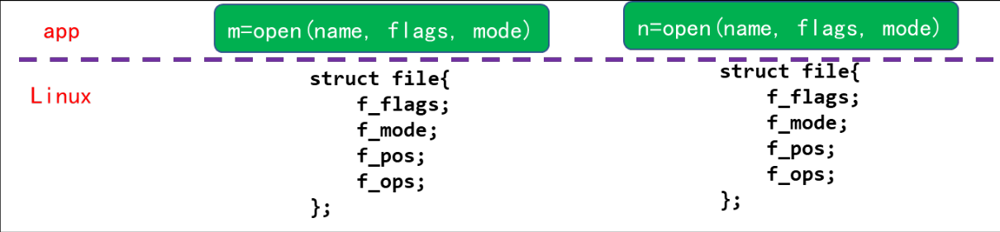


注册设备编号仅仅是驱动代码必须进行的诸多任务中的第一个。大部分的基础性的驱动操作包括 3 个重要的内核数据结构，称为： file_operations、file、和 inode。需要对这些结构基本了解，才能够做大量感兴趣的事情。

````c
struct file_operations /* 是一个字符设备把驱动的操作和设备号联系在一起的纽带，是一系列指针的集合，每个被打开的文件都对应于一系列的操作，这就是file_operations,用来执行一系列的系统调用。*/
struct file	/* 代表一个打开的文件，在执行file_operation中的open操作时被创建，这里需要注意的是与用户空间inode指针的区别，一个在内核，而file指针在用户空间，由c库来定义。*/
struct inode /* 被内核用来代表一个文件，注意和struct file的区别，struct inode一个是代表文件，struct file一个是代表打开的文件。*/
````

## File_operations结构体

打开字符设备节点时，内核中也有对应的 `struct file`,注意这个结构体中的结构体：`struct file_operations *f_op`，这是由驱动程序提供的。


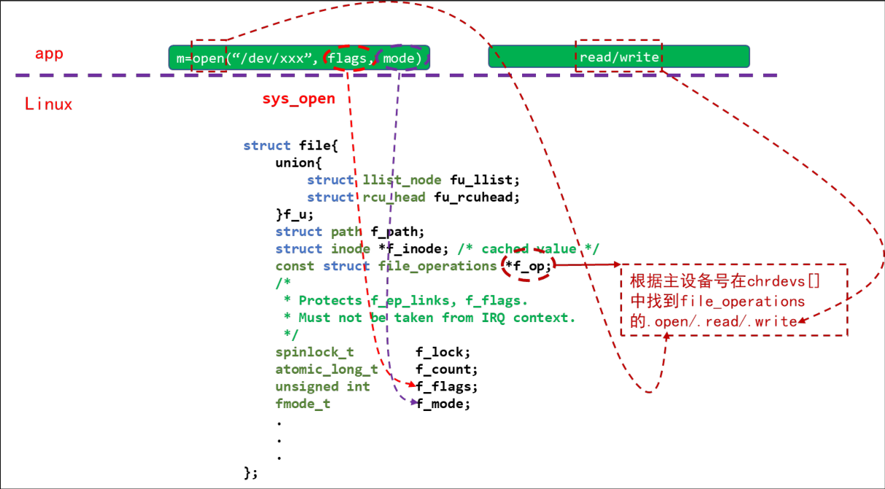


````c
/* 定义在<linux/fs.h> */
struct file_operations {
    /* 第一个 file_operations 成员不是一个操作, 它是一个指向拥有该结构的模块的指针，避免正在操作时被卸载，一般为初始化为THIS_MODULES (一个在 <linux/module.h> 中定义的宏) */
	struct module *owner;
    /* 改变文件中的当前读/写位置, 并且新位置作为(正的)返回值。 */
	loff_t (*llseek) (struct file *, loff_t, int);
    /* 用来从设备中读取数据。 */
	ssize_t (*read) (struct file *, char __user *, size_t, loff_t *);
    /* 向设备发送数据 */
	ssize_t (*write) (struct file *, const char __user *, size_t, loff_t *);
    /* 异步的读取操作，在函数返回之前可能不会完成的读取操作 */
	ssize_t (*read_iter) (struct kiocb *, struct iov_iter *);
    /* 异步写入操作 */
	ssize_t (*write_iter) (struct kiocb *, struct iov_iter *);
    
	int (*iterate) (struct file *, struct dir_context *);
	int (*iterate_shared) (struct file *, struct dir_context *);
	unsigned int (*poll) (struct file *, struct poll_table_struct *);
	long (*unlocked_ioctl) (struct file *, unsigned int, unsigned long);
	long (*compat_ioctl) (struct file *, unsigned int, unsigned long);
	int (*mmap) (struct file *, struct vm_area_struct *);
    /* 打开文件 */
	int (*open) (struct inode *, struct file *);
	int (*flush) (struct file *, fl_owner_t id);
	/* 当file结构被释放时，将调用这个操作 */
    int (*release) (struct inode *, struct file *);
	int (*fsync) (struct file *, loff_t, loff_t, int datasync);
	int (*fasync) (int, struct file *, int);
    /* 关闭文件 */
	int (*lock) (struct file *, int, struct file_lock *);
	ssize_t (*sendpage) (struct file *, struct page *, int, size_t, loff_t *, int);
	unsigned long (*get_unmapped_area)(struct file *, unsigned long, unsigned long, unsigned long, unsigned long);
	int (*check_flags)(int);
	int (*flock) (struct file *, int, struct file_lock *);
	ssize_t (*splice_write)(struct pipe_inode_info *, struct file *, loff_t *, size_t, unsigned int);
	ssize_t (*splice_read)(struct file *, loff_t *, struct pipe_inode_info *, size_t, unsigned int);
	int (*setlease)(struct file *, long, struct file_lock **, void **);
	long (*fallocate)(struct file *file, int mode, loff_t offset,
			  loff_t len);
	void (*show_fdinfo)(struct seq_file *m, struct file *f);
#ifndef CONFIG_MMU
	unsigned (*mmap_capabilities)(struct file *);
#endif
	ssize_t (*copy_file_range)(struct file *, loff_t, struct file *,
			loff_t, size_t, unsigned int);
	int (*clone_file_range)(struct file *, loff_t, struct file *, loff_t,
			u64);
	ssize_t (*dedupe_file_range)(struct file *, u64, u64, struct file *,
			u64);
};
````

## 函数

````c
/* 向内核注册一个字符设备，该设备的主设备号为major(或者由内核分配)，次设备号为0 ~ 255。表示以major为主设备号，以0 ~ 255为次设备号的设备对应同一个设备驱动。
 * @major: 主设备号
 * @name: 设备名称
 * @fops: file_operations 结构体
 *
 * 如果major为0，则由内核自动分配一个主设备号，此时返回值即为主设备号。
 * major大于0，则内核以major为主设备号，此时注册成功返回0。
 * major大于0，即手动指定主设备号时，必须使用未使用过的主设备号，可以事先查看哪些未使用的主设备号 cat /proc/devices 查看。
*/
static inline int register_chrdev(unsigned int major, const char *name, const struct file_operations *fops);
/* 卸载驱动
 * @major: 主设备号
 * @name: 设备名称
*/
static inline void unregister_chrdev(unsigned int major, const char *name)
````

通过 module_init 和 module_exit 这两个函数来指定驱动的入口和出口函数。

````c
module_init(sha1_neon_mod_init);
module_exit(sha1_neon_mod_fini);
````

````c
/*	Linux内核驱动模块中常常使用ioremap对Soc/外设寄存器进行映射，以获取内核态虚拟地址。
*	参数1：起始地址
*	参数2：所要映射长度；
*/
static inline void __iomem * ioremap (unsigned long offset, unsigned long size);
/* 解除映射 */
static inline void iounmap(volatile void __iomem *addr)
````

**创建和删除类**

````c
/* 
*	参数1：一般赋值为THIS_MODULE
*	参数2：将创建的struct class变量的名字，用于给struct class的name字段赋值。通俗地说，就是指向struct class名称的字符串的指针
*	返回值：返回新创建的逻辑类
*/
#define class_create(owner, name)
/*
*	删除设备的逻辑类
*/
void class_destroy(struct class *cls);
````

**创建设备**

上一小节创建好类以后还不能实现自动创建设备节点，还需要在这个类下创建一个设备。使用 device_create 函数在类下面创建设备，device_create 函数原型如下：

````c
struct device *device_create(struct class *class, struct device *parent,
			     dev_t devt, void *drvdata, const char *fmt, ...)   
````

device_create 是个可变参数函数，参数 class 就是设备要创建哪个类下面；参数 parent 是父设备，一般为 NULL，也就是没有父设备；参数 devt 是设备号；参数 drvdata 是设备可能会使用的一些数据，一般为 NULL；参数 fmt 是设备名字，如果设置 fmt=xxx 的话，就会生成/dev/xxx这个设备文件。返回值就是创建好的设备。

同样的，卸载驱动的时候需要删除掉创建的设备，设备删除函数为 device_destroy，函数原型如下：

````c
void device_destroy(struct class *class, dev_t devt)
````

参数 class 是要删除的设备所处的类，参数 devt 是要删除的设备号。


**copy_to_user/copy_from_user解析**

由于内核空间与用户空间的内存不能直接互访，因此借助函数copy_to_user()完成内核空间到用户空间的复制，函数copy_from_user()完成用户空间到内核空间的复制。

````c
/*
参数1：目标地址，这个地址是用户空间的地址；
参数2：源地址，这个地址是内核空间的地址；
参数3：将要拷贝的数据的字节数。
*/
unsigned long copy_to_user(void *to, const void __user *from, usigned long count);
/*
参数1：目标地址，这个地址是内核空间的地址；
参数2：源地址，这个地址是用户空间的地址；
参数3：将要拷贝的数据的字节数。
*/
unsigned long copy_from_user(void __user *to, const void *from, usigned long count);
````

## 相关命令

````sh
insmod	# 将指定模块加载到内核，建议使用modeprobe命令
rmmod	# 将已加载模块从内核中移除，建议使用modeprobe命令
````


# GPIO

## GPIO详解

### I.MX6U IO 命名

STM32 中的 IO 都是 `PA0~15`、`PB0~15` 这样命名的,而I.MX6U 并不是这样

参考手册的第 32 章“Chapter 32: IOMUX Controller(IOMUXC)”

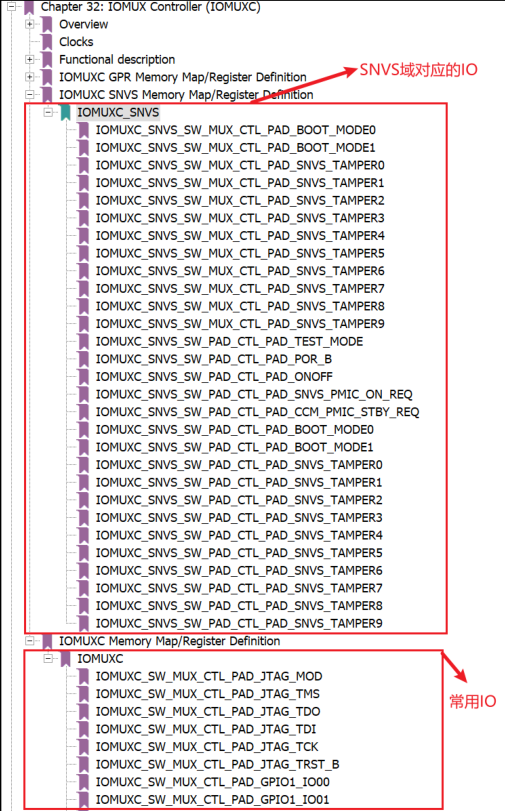

I.MX6ULL 的 IO 分为两类：SNVS 域的和通用的，这两类 IO 本质上都是一样的，以通用 IO 为例


形如“IOMUXC_SW_MUX_CTL_PAD_GPIO1_IO00”的就是 GPIO 命名，命名形式就是“IOMUXC_SW_MUC_CTL_PAD_XX_XX”，后面的“XX_XX”就是 GPIO 命名，比如：GPIO1_IO01、UART1_TX_DATA、JTAG_MOD 等等。I.MX6ULL 的 GPIO 并不像 STM32一样以 PA0~15 这样命名，他是根据某个 IO 所拥有的功能来命名的。“Chapter 32: IOMUX Controller(IOMUXC)”这一章列出了 I.MX6ULL 的所有 IO，但是只能找到GPIO1_IO00~GPIO1_IO09，难道I.MX6ULL 的 GPIO 只有这 10 个？显然不是的 ，  I.MX6ULL 的其它IO 也是可以复用为 GPIO功能 。 同样的 ，GPIO1_IO00~GPIO_IO09 也是可以复用为其它外设引脚的，接下来就是 I.MX6ULL IO 复用。

### I.MX6U IO 复用

IOMUX Controller，IO 复用控制器

以“IOMUXC_SW_MUX_CTL_PAD_GPIO1_IO00”这个 IO 为例，打开参考手册的 1568 页

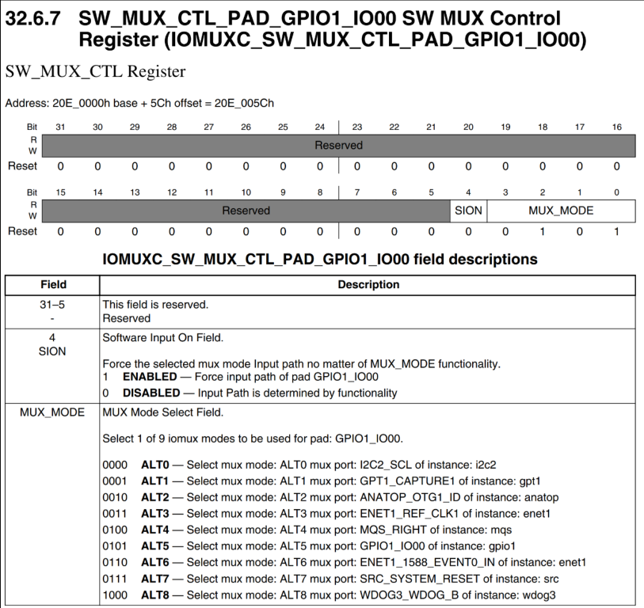

IOMUXC_SW_MUX_CTL_PAD_GPIO1_IO00 的寄存器，寄存器地址为 0X020E005C，这个寄存器是 32 位的，但是只用到了最低 5 位，其中
bit0~bit3(MUX_MODE)就是设置 GPIO1_IO00 的复用功能的。GPIO1_IO00 一共可以复用为 9种功能 IO，分别对应 ALT0~ALT8，其中 ALT5 就是作为 GPIO1_IO00。GPIO1_IO00 还可以作为 I2C2_SCL、GPT1_CAPTURE1、ANATOP_OTG1_ID 等。


I.MX6U 的 GPIO 一共有 5 组：GPIO1、GPIO2、GPIO3、GPIO4 和 GPIO5

* GPIO1 有 32 个引脚：GPIO1_IO0~GPIO1_IO31；
* GPIO2 有 22 个引脚：GPIO2_IO0~GPIO2_IO21；
* GPIO3 有 29 个引脚：GPIO3_IO0~GPIO3_IO28；
* GPIO4 有 29 个引脚：GPIO4_IO0~GPIO4_IO28；
* GPIO5 有 12 个引脚：GPIO5_IO0~GPIO5_IO11；

### I.MX6U GPIO 配置

IOMUXC_SW_MUX_CTL_PAD_XX_XX 和 IOMUXC_SW_PAD_CTL_PAD_XX_XX 这两种寄存器都是配置 IO 的，注意是 IO！不是 GPIO，GPIO 是一个 IO 众多复用功能中的一种。比如 GPIO1_IO00 这个 IO 可以复用为：I2C2_SCL、GPT1_CAPTURE1等功能

**GPIO 结构图**

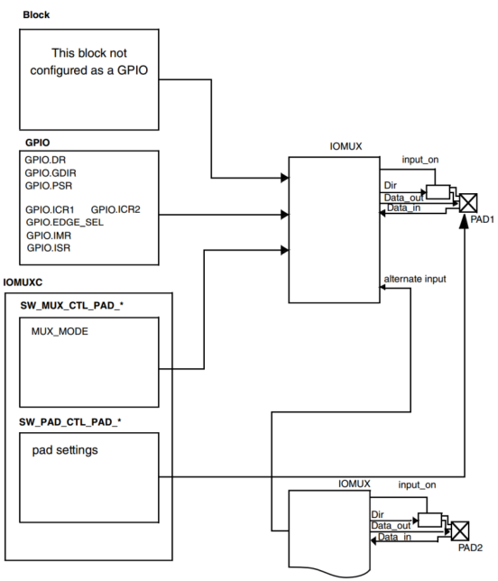

左下角的IOMUXC框 图 里 面 就 有SW_MUX_CTL_PAD_x和SW_PAD_CTL_PAD_x两种寄存器。这两种寄存器前面说了用来设置 IO 的复用功能和 IO 属性
配置。左上角部分的 GPIO 框图就是，当 IO 用作 GPIO 的时候需要设置的寄存器，一共有八个：DR、GDIR、PSR、ICR1、ICR2、EDGE_SEL、IMR 和 ISR。前面我们说了 I.MX6U 一共有GPIO1~GPIO5 共五组 GPIO，每组 GPIO 都有这 8 个寄存器。


**DR （数据寄存器）**

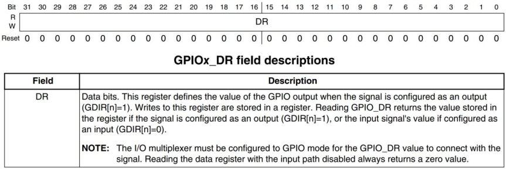

此寄存器是 32 位的，一个 GPIO 组最大只有 32 个 IO，因此 DR 寄存器中的每个位都对应一个 GPIO。当 GPIO 被配置为输出功能以后，向指定的位写入数据那么相应的 IO 就会输出相应的高低电平，比如要设置 GPIO1_IO00 输出高电平，那么就应该设置 GPIO1.DR=1。


**GDIR （方向寄存器）**


GDIR 寄存器也是 32 位的，此寄存器用来设置某个 IO 的工作方向，是输入还是输出。同样的，每个 IO 对应一个位，如果要设置 GPIO 为输入的话就设置相应的位为 0，如果要设置为输出的话就设置为 1。比如要设置 GPIO1_IO00 为输入，那么 GPIO1.GDIR=0；


 **PSR （GPIO状态寄存器）**

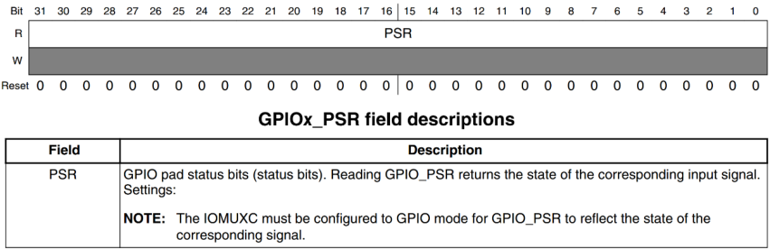

同样的 PSR 寄存器也是一个 GPIO 对应一个位，读取相应的位即可获取对应的 GPIO 的状态，也就是 GPIO 的高低电平值。功能和输入状态下的 DR 寄存器一样。


**ICR1/2 (中断控制寄存器)**

ICR1 用于配置低 16个 GPIO，ICR2 用于配置高 16 个 GPIO

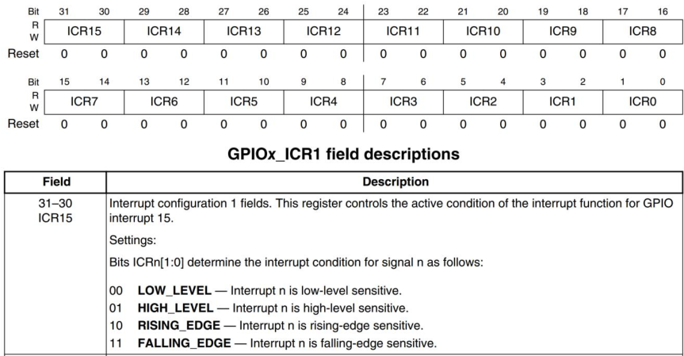

ICR1 用于 IO0~15 的配置， ICR2 用于 IO16~31 的配置。ICR1 寄存器中一个 GPIO 用两个位，这两个位用来配置中断的触发方式，和 STM32 的中断很类似

| 位设置 | 速度       |
| ------ | ---------- |
| 00     | 低电平触发 |
| 01     | 高电平触发 |
| 10     | 上升沿触发 |
| 11     | 下降沿触发 |

以 GPIO1_IO15为例，如果要设置GPIO1_IO15为上升沿触发中断，那么 GPIO1.ICR1=2<<30，如果要设置 GPIO1 的 IO16~31 的话就需要设置 ICR2 寄存器了

**IMR（中断屏蔽寄存器）**

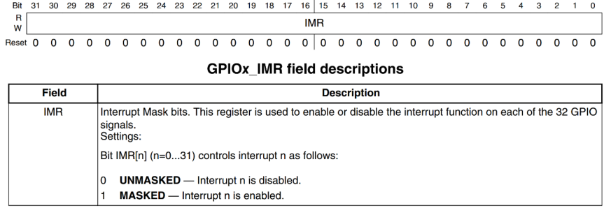

IMR 寄存器也是一个 GPIO 对应一个位，IMR 寄存器用来控制 GPIO 的中断禁止和使能，如果使能某个 GPIO 的中断，那么设置相应的位为 1 即可，反之，如果要禁止中断，那么就设置相应的位为 0 即可。例如，要使能 GPIO1_IO00 的中断，那么就可以设置 GPIO1.MIR=1 即可。


**ISR（中断状态寄存器）**

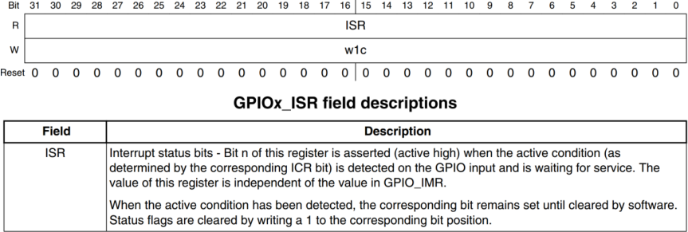

ISR 寄存器也是 32 位寄存器，一个 GPIO 对应一个位，只要某个 GPIO 的中断发生，那么ISR 中相应的位就会被置 1。所以，我们可以通过读取 ISR 寄存器来判断 GPIO 中断是否发生，相当于 ISR 中的这些位就是中断标志位。当我们处理完中断以后，必须清除中断标志位，清除方法就是向 ISR 中相应的位写 1，也就是写 1 清零。

**EDGE_SEL（边沿选择寄存器）**

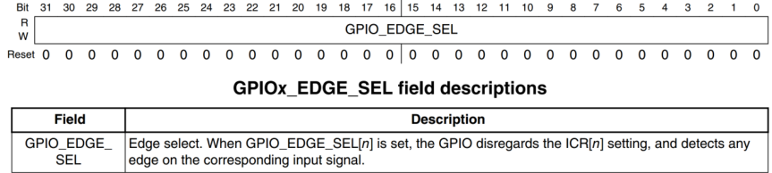

EDGE_SEL 寄存器用来设置边沿中断，这个寄存器会覆盖 ICR1 和 ICR2 的设置，同样是一个 GPIO 对应一个位。如果相应的位被置 1，那么就相当与设置了对应的 GPIO 是上升沿和下降沿(双边沿)触发。例如，我们设置 GPIO1.EDGE_SEL=1，那么就表示 GPIO1_IO01 是双边沿触发中断，无论 GFPIO1_CR1 的设置为多少，都是双边沿触发。

### I.MX6U GPIO 时钟使能

每个外设的时钟都可以独立的使能或禁止，这样可以关闭掉不使用的外设时钟，起到省电的目的。I.MX6U 的系统时钟参考《I.MX6UL 参考手册》的第 18 章“Chapter 18: ClockController Module(CCM)”

Clock Controller Module (时钟控制模块)

只看一下CCM里面的外设时钟使能寄存器 。CMM有CCM_CCGR0~CCM_CCGR6 这 7 个寄存器，这 7 个寄存器控制着 I.MX6U 的所有外设时钟开
关，我们以 CCM_CCGR0 为例来看一下如何禁止或使能一个外设的时钟

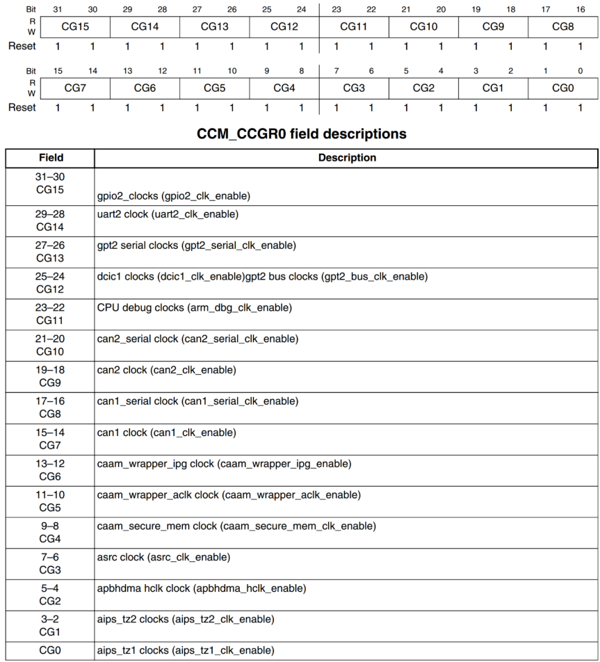

CCM_CCGR0 是个 32 位寄存器，其中每 2 位控制一个外设的时钟，比如 bit31:30 控制着GPIO2 的外设时钟，两个位就有 4 种操作方式

| 位设置 | 时钟控制                                                     |
| ------ | ------------------------------------------------------------ |
| 00     | 所有模式下都关闭外设时钟                                     |
| 01     | 只有在运行模式下打开外设时钟，等待模式和停止模式下均关闭外设时钟 |
| 10     | 未使用(保留)                                                 |
| 11     | 除了停止模式以外，其他所有模式下时钟都打开                   |

如果我们要打开 GPIO2 的外设时钟，那么只需要设置CCM_CCGR0 的 bit31 和 bit30 都为 1 即可，也就是 CCM_CCGR0=3 << 30。反之，如果要关闭GPIO2 的 外设时钟 ， 那就设置 CCM_CCGR0 的 bit31 和 bit30 都 为 0 即可 。

CCM_CCGR0~CCM_CCGR6 这 7 个寄存器操作都是类似的，只是不同的寄存器对应不同的外设时钟而已


# LED

写驱动程序的套路：

1. 确定主设备号，也可以让内核分配
2. 定义自己的 file_operations 结构体
3. 实现对应的 drv_open/drv_read/drv_write 等函数，填入 file_operations 结构体
4. 把 file_operations 结构体告诉内核：register_chrdev
5. 谁来注册驱动程序啊？得有一个入口函数：安装驱动程序时，就会去调用这个入口函数
6. 有入口函数就应该有出口函数：卸载驱动程序时，出口函数调用unregister_chrdev
7. 其他完善：提供设备信息，自动创建设备节点：class_create,device_create

驱动怎么操作硬件？

* 通过 ioremap 映射寄存器的物理地址得到虚拟地址，读写虚拟地址。

驱动怎么和 APP 传输数据？

* 通过 copy_to_user、copy_from_user 这 2 个函数。


**LED驱动**

````c
#include <linux/kernel.h>
#include <linux/module.h>
#include <linux/slab.h>
#include <linux/init.h>
#include <linux/fs.h>
#include <linux/delay.h>
#include <linux/poll.h>
#include <linux/mutex.h>
#include <linux/wait.h>
#include <linux/uaccess.h>
#include <linux/device.h>
#include <asm/io.h>

static int major;					/* 主驱动号 */
static struct class *led_class;		/* 类 */

// GPIO5_IO03
// IOMUXC_SNVS_SW_MUX_CTL_PAD_SNVS_TAMPER3 地址：0x02290000 + 0x14
static volatile unsigned int *IOMUXC_SNVS_SW_MUX_CTL_PAD_SNVS_TAMPER3;		/* 下方函数内设置复用为GPIO5_IO03 */

// GPIO5_GDIR 地址：0x020AC004
static volatile unsigned int *GPIO5_GDIR;			/* GPIO5的方向寄存器 */

//GPIO5_DR 地址：0x020AC000
static volatile unsigned int *GPIO5_DR;				/* GPIO5的数据寄存器 */

static struct file_operations led_fops = {
	.owner		= THIS_MODULE,
	.write		= led_write,						/*  */
	.open		= led_open,							/*  */
};

static ssize_t led_write(struct file *filp, const char __user *buf,
			 size_t count, loff_t *ppos){
	char val;
	int ret;
	ret = copy_from_user(&val, buf, 1);			/* 从用户输入的数据加载到内核 */

	if (val){
		*GPIO5_DR &= ~(1<<3);					/* GPIO5_IO03置0 */
	}else{
		*GPIO5_DR |= (1<<3);					/* GPIO5_IO03置1 */
	}
	return 1;
}
static int led_open(struct inode *inode, struct file *filp)
{
	/* enable gpio5
	 * configure gpio5_io3 as gpio
	 * configure gpio5_io3 as output 
	 */
	*IOMUXC_SNVS_SW_MUX_CTL_PAD_SNVS_TAMPER3 &= ~0xf;			/* 先清空 */
	*IOMUXC_SNVS_SW_MUX_CTL_PAD_SNVS_TAMPER3 |= 0x5;			/* 设置复用为GPIO5_IO03 */

	*GPIO5_GDIR |= (1<<3);										/* 设置为输出模式 */
	
	return 0;
}

/* 入口函数 */
static int __init led_init(void){
	printk("%s %s %d\n", __FILE__, __FUNCTION__, __LINE__);
	
    major = register_chrdev(0, "100ask_led", &led_fops);		/* 向内核注册一个字符设备，该设备的主设备号为0 */

	/* ioremap */
	// IOMUXC_SNVS_SW_MUX_CTL_PAD_SNVS_TAMPER3 地址：0x02290000 + 0x14
	IOMUXC_SNVS_SW_MUX_CTL_PAD_SNVS_TAMPER3 = ioremap(0x02290000 + 0x14, 4);	/* 映射地址 */
	
	// GPIO5_GDIR 地址：0x020AC004
	GPIO5_GDIR = ioremap(0x020AC004, 4);										/* 映射地址 */
	
	//GPIO5_DR 地址：0x020AC000
	GPIO5_DR  = ioremap(0x020AC000, 4);											/* 映射地址 */

	led_class = class_create(THIS_MODULE, "myled");								/* 创建类 */
	device_create(led_class, NULL, MKDEV(major, 0), NULL, "myled"); 			/* 常见设备 /dev/myled */
	return 0;
}
/* 出口函数 */
static void __exit led_exit(void){
	iounmap(IOMUXC_SNVS_SW_MUX_CTL_PAD_SNVS_TAMPER3);							/* 解除映射 */
	iounmap(GPIO5_GDIR);
	iounmap(GPIO5_DR);
	
	device_destroy(led_class, MKDEV(major, 0));									/* 删除设备 */
	class_destroy(led_class);													/* 卸载类 */
			
	unregister_chrdev(major, "100ask_led");										/* 卸载设备 */
}
/*
* 将上面两个函数指定为驱动的入口和出口函数
*/
module_init(led_init);
module_exit(led_exit);
MODULE_LICENSE("GPL");						/* 设置遵循GPL开源协议 */
````

LED应用

````c
#include <sys/types.h>
#include <sys/stat.h>
#include <fcntl.h>
#include <string.h>
#include <unistd.h>
#include <stdio.h>

// ledtest /dev/myled on
// ledtest /dev/myled off
int main(int argc, char **argv){
	int fd;
	char status = 0;
	
	if (argc != 3){
		printf("Usage: %s <dev> <on|off>\n", argv[0]);
		printf("  eg: %s /dev/myled on\n", argv[0]);
		printf("  eg: %s /dev/myled off\n", argv[0]);
		return -1;
	}
	// open
    //fd = open("dev/myled", O_RDWR);
	fd = open(argv[1], O_RDWR);		/* 最终会调用LED驱动的 led_open 函数 */
	if (fd < 0){
		printf("can not open %s\n", argv[0]);
		return -1;
	}

	// write
	if (strcmp(argv[2], "on") == 0){
		status = 1;
	}
	write(fd, &status, 1);			/* 最终会调用LED驱动的 led_write 函数 */
	return 0;	
}
````

Makefile

````makefile
KERN_DIR = /home/book/100ask_imx6ull-sdk/Linux-4.9.88			# Linux内核源码

all:
        make -C $(KERN_DIR) M=`pwd` modules 
        $(CROSS_COMPILE)gcc -o ledtest ledtest.c 				# 生成ledtest

clean:
        make -C $(KERN_DIR) M=`pwd` modules clean
        rm -rf modules.order
        rm -f ledtest

obj-m   += led_drv.o				
````

````sh
insmod /mnt/led_drv.ko						/* 安装驱动 */

/mnt/ledtest /dev/myled on // 点灯
/mnt/ledtest /dev/myled off // 关灯
````


# 中断

Linux中不允许中断嵌套，即高优先级不能打断低优先级。目前不清楚到底能不能中断嵌套


分为上半部中断，下半部中断

上半部中断执行用时较短的内容

下半部中断执行用时较长的


Linux上半部(硬件)中断不能被打断，下半部(软件)中断可以被打断


下半部中断处理的是 所有的软件中断

如果下半部中断用时很长，可以使用线程处理下半部中断


下半部执行时，中断是使能的:如果再次发生了中断，那么下半部被打断，先执行硬件中断的处理函数;硬件中断处理完发现“之前已经在处理软件中断”了，就不会往下“再次开始新的处理软件中断流程而是退出中断处理、并恢复原来的工作:继续执行刚刚被打断的“软件处理函数


