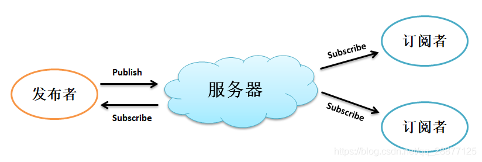
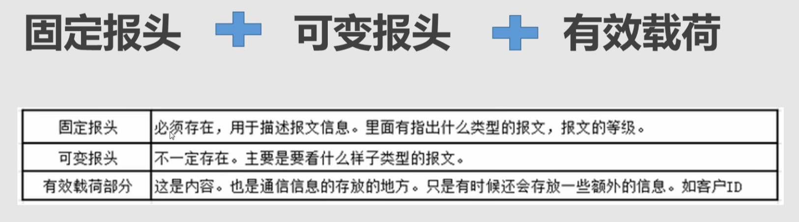
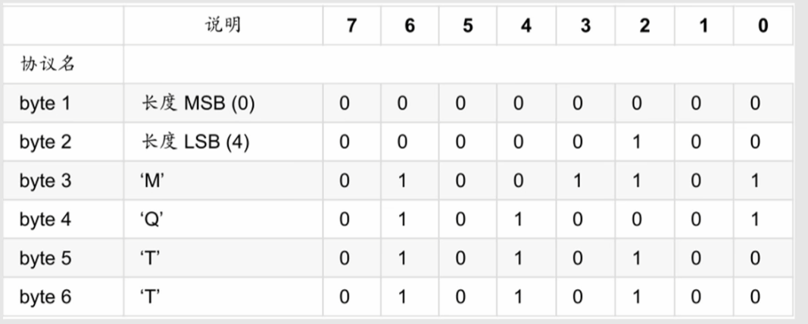

# 简述

MQTT（Message Queuing Telemetry Transport，消息队列遥测传输协议），是一种基于发布/订阅（publish/subscribe）模式的“轻量级”通讯协议，该协议构建于TCP/IP协议上，由IBM在1999年发布。MQTT最大优点在于，可以以极少的代码和有限的带宽，为连接远程设备提供实时可靠的消息服务。作为一种低开销、低带宽占用的即时通讯协议，使其在物联网、小型设备、移动应用等方面有较广泛的应用。

MQTT是一个基于客户端-服务器的消息发布/订阅传输协议。MQTT协议是轻量、简单、开放和易于实现的，这些特点使它适用范围非常广泛。在很多情况下，包括受限的环境中，如：机器与机器（M2M）通信和物联网（IoT）。其在，通过卫星链路通信传感器、偶尔拨号的医疗设备、智能家居、及一些小型化设备中已广泛使用。

**物联网中的名词**

| **名词** |                           **描述**                           |
| :------: | :----------------------------------------------------------: |
|   产品   | 设备的集合，通常指一组具有相同功能的设备。物联网平台为每个产品颁发全局唯一的ProductKey。 |
|   设备   | 归属于某个产品下的具体设备。物联网平台为设备颁发产品内唯一的证书DeviceName。设备可以直接连接物联网平台，也可以作为子设备通过网关连接物联网平台。 |
|  Topic   | Topic是UTF-8字符串，是发布（Pub）/订阅（Sub）消息的传输中介。可以向Topic发布或者订阅消息。 |
| Topic类  | 同一产品下不同设备的Topic集合，用*${productkey}*和*${deviceName}*通配一个唯一的设备，一个Topic类对一个ProductKey下所有设备通用。 |
|   发布   | 操作Topic的权限类型，对应的英文名称为Pub。可以往此类Topic中发布消息。 |
|   订阅   | 操作Topic的权限类型，对应的英文名称为Sub。可以从此类Topic中订阅消息。 |

**MQTT 数据包结构**

* 固定头（Fixed header），存在于所有MQTT数据包中，表示数据包类型及数据包的分组类标识；
* 可变头（Variable header），存在于部分MQTT数据包中，数据包类型决定了可变头是否存在及其具体内容；
* 消息体（Payload），存在于部分MQTT数据包中，表示客户端收到的具体内容

#### MQTT固定头

`固定头`存在于所有`MQTT`数据包中，其结构如下：

**MQTT消息类型 / message type**

| 名称        | 值   | 流方向         | 描述                        |
| :---------- | :--- | :------------- | :-------------------------- |
| Reserved    | 0    | 不可用         | 保留位                      |
| CONNECT     | 1    | 客户端到服务器 | 客户端请求连接到服务器      |
| CONNACK     | 2    | 服务器到客户端 | 连接确认                    |
| PUBLISH     | 3    | 双向           | 发布消息                    |
| PUBACK      | 4    | 双向           | 发布确认                    |
| PUBREC      | 5    | 双向           | 发布收到（保证第1部分到达） |
| PUBREL      | 6    | 双向           | 发布释放（保证第2部分到达） |
| PUBCOMP     | 7    | 双向           | 发布完成（保证第3部分到达） |
| SUBSCRIBE   | 8    | 客户端到服务器 | 客户端请求订阅              |
| SUBACK      | 9    | 服务器到客户端 | 订阅确认                    |
| UNSUBSCRIBE | 10   | 客户端到服务器 | 请求取消订阅                |
| UNSUBACK    | 11   | 服务器到客户端 | 取消订阅确认                |
| PINGREQ     | 12   | 客户端到服务器 | PING请求                    |
| PINGRESP    | 13   | 服务器到客户端 | PING应答                    |
| DISCONNECT  | 14   | 客户端到服务器 | 中断连接                    |
| Reserved    | 15   | 不可用         | 保留位                      |

**标识位 / DUP**

在不使用标识位的消息类型中，标识位被作为保留位。如果收到无效的标志时，接收端必须关闭网络连接：

| 数据包      | 标识位         | Bit 3 | Bit 2 | Bit 1 | Bit 0   |
| :---------- | :------------- | :---- | :---- | :---- | :------ |
| CONNECT     | 保留位         | 0     | 0     | 0     | 0       |
| CONNACK     | 保留位         | 0     | 0     | 0     | 0       |
| PUBLISH     | MQTT 3.1.1使用 | DUP1  | QoS2  | QoS2  | RETAIN3 |
| PUBACK      | 保留位         | 0     | 0     | 0     | 0       |
| PUBREC      | 保留位         | 0     | 0     | 0     | 0       |
| PUBREL      | 保留位         | 0     | 0     | 0     | 0       |
| PUBCOMP     | 保留位         | 0     | 0     | 0     | 0       |
| SUBSCRIBE   | 保留位         | 0     | 0     | 0     | 0       |
| SUBACK      | 保留位         | 0     | 0     | 0     | 0       |
| UNSUBSCRIBE | 保留位         | 0     | 0     | 0     | 0       |
| UNSUBACK    | 保留位         | 0     | 0     | 0     | 0       |
| PINGREQ     | 保留位         | 0     | 0     | 0     | 0       |
| PINGRESP    | 保留位         | 0     | 0     | 0     | 0       |
| DISCONNECT  | 保留位         | 0     | 0     | 0     | 0       |

- `DUP`：发布消息的副本。用来在保证消息的可靠传输，如果设置为 1，则在下面的变长中增加MessageId，并且需要回复确认，以保证消息传输完成，但不能用于检测消息重复发送。
- `QoS`发布消息的服务质量（前面已经做过介绍），即：保证消息传递的次数
  - `00`：最多一次，即：<=1
  - `01`：至少一次，即：>=1
  - `10`：一次，即：=1
  - `11`：预留
- `RETAIN`：发布保留标识，表示服务器要保留这次推送的信息，如果有新的订阅者出现，就把这消息推送给它，如果设有那么推送至当前订阅者后释放。

**剩余长度（Remaining Length）**

固定头的第二字节用来保存变长头部和消息体的总大小的，但不是直接保存的。这一字节是可以扩展，其保存机制，前7位用于保存长度，后一部用做标识。当最后一位为 1时，表示长度不足，需要使用二个字节继续保存。例如：计算出后面的大小为0

#### MQTT可变头

可变报头分为：协议名、协议级别、连接标志、保持连接

`MQTT`数据包中包含一个可变头，它驻位于固定的头和负载之间。可变头的内容因数据包类型而不同，较常的应用是做为包的标识：

**协议名**

#### 消息体

`Payload`消息体是`MQTT`数据包的第三部分，CONNECT、SUBSCRIBE、SUBACK、UNSUBSCRIBE四种类型的消息 有消息体：

- `CONNECT`，消息体内容主要是：客户端的ClientID、订阅的Topic、Message以及用户名和密码
- `SUBSCRIBE`，消息体内容是一系列的要订阅的主题以及`QoS`。
- `SUBACK`，消息体内容是服务器对于`SUBSCRIBE`所申请的主题及`QoS`进行确认和回复。
- `UNSUBSCRIBE`，消息体内容是要订阅的主题。