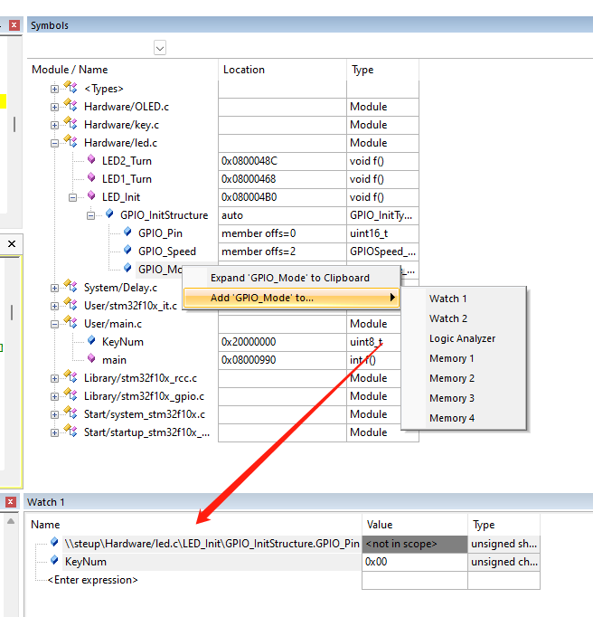
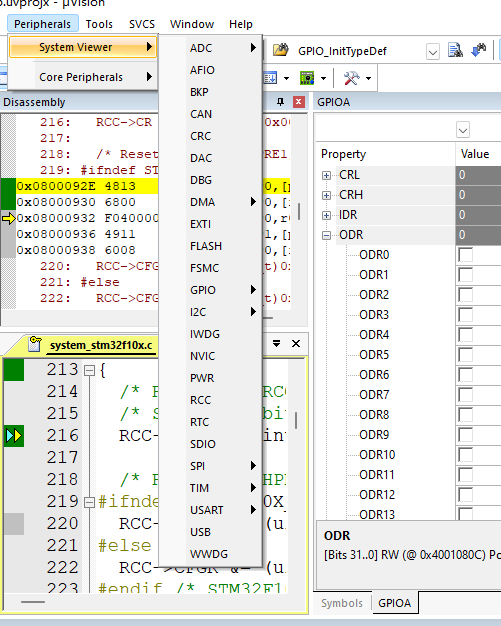
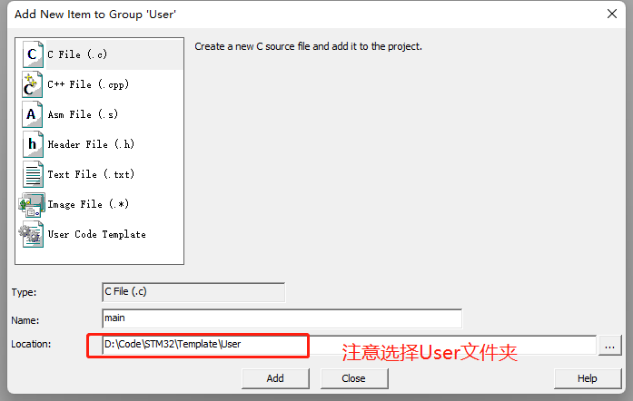
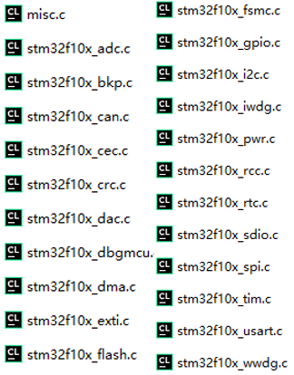
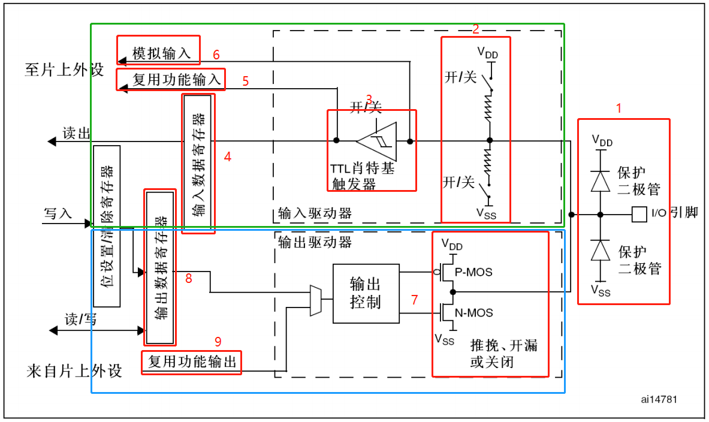
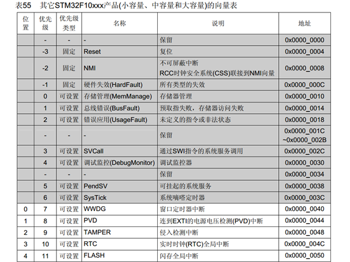
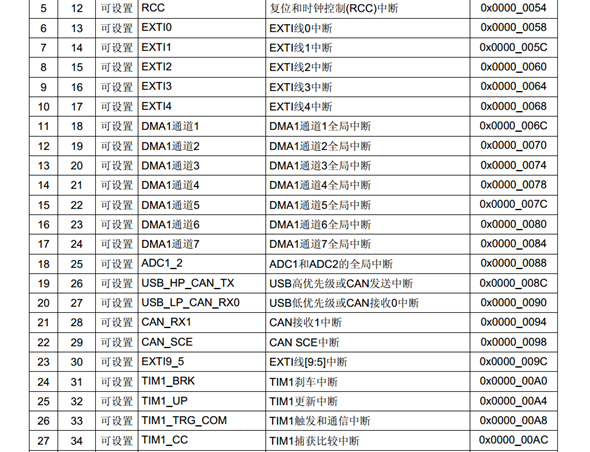
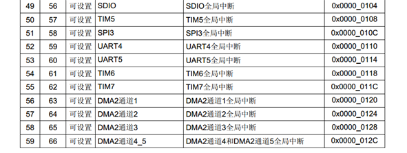

# Kiel的使用

## Debug


1. 重置程序到最初

2. 跳转到断点处

3. 停止程序

4. 单步运行

5. 跳过函数

6. 跳出函数

7. 跳转到光标处

8. 开启/关闭命令行(软件下面的窗口)

9. 开启/关闭汇编窗口

10. 符号窗口:在这个窗口可以看到变量的变化

    

11. 在Debug模式下，使用Peripherals可以查看寄存器

    

# 简介

**认识STM32**

ST 是意法半导体，M 是 Microelectronics 的缩写，32 表示 32 位，即STM32 指的是ST公司开发的基于ARM Cortex-M内核的32位微控制器。

ARM既指ARM公司，也指ARM处理器内核


**命名规则**


**片上资源/外设**

| **英文缩写** |      **名称**      | **英文缩写** |      **名称**      |
| :----------: | :----------------: | :----------: | :----------------: |
|     NVIC     | 嵌套向量中断控制器 |     CAN      |      CAN通信       |
|   SysTick    |   系统滴答定时器   |     USB      |      USB通信       |
|     RCC      |   复位和时钟控制   |     RTC      |      实时时钟      |
|     GPIO     |      通用IO口      |     CRC      |      CRC校验       |
|     AFIO     |      复用IO口      |     PWR      |      电源控制      |
|     EXTI     |      外部中断      |     BKP      |     备份寄存器     |
|     TIM      |       定时器       |     IWDG     |     独立看门狗     |
|     ADC      |     模数转换器     |     WWDG     |     窗口看门狗     |
|     DMA      |    直接内存访问    |     DAC      |     数模转换器     |
|    USART     | 同步/异步串口通信  |     SDIO     |      SD卡接口      |
|     I2C      |      I2C通信       |     FSMC     | 可变静态存储控制器 |
|     SPI      |      SPI通信       |   USB OTG    |    USB主机接口     |

**系统结构**


1. ICode总线：该总线将Cortex™-M3内核的指令总线与闪存指令接口相连接。指令预取在此总线上完成。
2. DCode总线：该总线将Cortex™-M3内核的DCode总线与闪存存储器的数据接口相连接(常量加载和调试访问)。
3. 系统总线：此总线连接Cortex™-M3内核的系统总线(外设总线)到总线矩阵，总线矩阵协调着内核和DMA间的访问。
4. DMA总线：此总线将DMA的AHB主控接口与总线矩阵相联，总线矩阵协调着CPU的DCode和DMA到SRAM、闪存和外设的访问。
5. 总线矩阵：总线矩阵协调内核系统总线和DMA主控总线之间的访问仲裁，仲裁利用轮换算法。在互联型产品中，总线矩阵包含5个驱动部件(CPU的DCode、系统总线、以太网DMA、DMA1总线和DMA2总线)和3个从部件(闪存存储器接口(FLITF)、SRAM和AHB2APB桥)。在其它产品中总线矩阵包含4个驱动部件(CPU的DCode、系统总线、DMA1总线和DMA2总线)和4个被动部件(闪存存储器接口(FLITF)、SRAM、FSMC和AHB2APB桥)。AHB外设通过总线矩阵与系统总线相连，允许DMA访问。
6. AHB/APB桥(APB)：两个AHB/APB桥在AHB和2个APB总线间提供同步连接。APB1操作速度限于36MHz，APB2操作于全速(最高72MHz)。有关连接到每个桥的不同外设的地址映射请参考表1。在每一次复位以后，所有除SRAM和FLITF以外的外设都被关闭，在使用一个外设之前，必须设置寄存器RCC_AHBENR来打开该外设的时钟。


**引脚定义**


其中红色为电源引脚，蓝色为最小系统引脚，绿色为IO口、功能口等

I/O口电平：FT表明为5V的电压，没有FT则表明只能容忍3.3V电压。没有FT要想接5V电平则需要加装电平转换电路

STM32F103C8T6有两组GPIO,分别为GPIOA,GPIOB


**启动配置**

在STM32F10xxx里，可以通过BOOT[1:0]引脚选择三种不同启动模式。


在系统复位后，SYSCLK的第4个上升沿，BOOT引脚的值将被锁存。用户可以通过设置BOOT1和BOOT0引脚的状态，来选择在复位后的启动模式。


**最小系统**

最小系统是指，为了确保单片机正常工作的最基本电路


**STM32F103C8T6**

- 系列：主流系列STM32F1
- 内核：ARM Cortex-M3
- 主频：72MHz
- RAM：20K（SRAM）
- ROM：64K（Flash）
- 供电：2.0~3.6V（标准3.3V）
- 封装：LQFP48


# 新建项目

**工程架构**


**新建项目**

1. 创建文件夹：用来存放以后所有的STM32程序，例如`D:\Code\STM32`

2. 进入软件：`Project->new Project` 在`D:\Code\STM32`目录中再次创建文件夹用于存放本次的项目，进入此文件夹创建工程名称


3. 选择相应的器件型号

   

4. 现在进入`D:\Code\STM32\Template`文件夹可以看到已经创建了一些文件。但是此时还不能使用keil来编写程序

5. 引入标准库启动文件

   1. 在`D:\Code\STM32\Template`创建文件夹`Start`(名称可以随便定义，方便后期理解)

   2. 引入`\固件库\STM32F10x_StdPeriph_Lib_V3.5.0\Libraries\CMSIS\CM3\DeviceSupport\ST\STM32F10x\startup\arm`文件夹下的启动文件`startup_stm32f10****`等到`D:\Code\STM32\Template\Start`
      
      
   3. 引入`\固件库\STM32F10x_StdPeriph_Lib_V3.5.0\Libraries\CMSIS\CM3\DeviceSupport\ST\STM32F10x`文件夹下的`stm32f10x.h`、`system_stm32f10x.c/.h`文件到`D:\Code\STM32\Template\Start`
      1. `stm32f10x.h`:外设寄存器描述
      2. `system_stm32f10x.c/.h`:时钟
      
   4. 引入`\固件库\STM32F10x_StdPeriph_Lib_V3.5.0\Libraries\CMSIS\CM3\CoreSupport`文件夹下的内核寄存器描述文件`core_cm3.c/.h`到`D:\Code\STM32\Template\Start`

   5. 进入keil软件，添加新组`Start`

      1. 右击Start组->add Existing Files to Group 'Start'

      2. 进入`D:\Code\STM32\Template\Start`目录，选择文件类型为`All file`

         - 引入`startup_stm32f***`开头的启动文件(在下方表格中说明了具体引入什么文件)，本次引入的是`startup_stm32f10x_md.s`，点击`Add`
         - 引入所有`.c .h`文件，就是刚才添加到`D:\Code\STM32\Template\Start`目录的`.c.h`文件
         - 支持`Start`文件夹的文件添加完毕

      3. 在工程选项中添加文件夹的头文件路径：依次点击 魔法棒、C/C++、Include Paths旁边三个点按钮、新建、三个点按钮、选择`D:\Code\STM32\Template\Start`文件夹

         

6. 在`D:\Code\STM32\Template`创建`User`文件夹

   1. 进入keil软件，添加新组`User`
   2. 右键User组->Add New Item to Group  'User'
   3. 添加C File，文件名为main，注意选择`D:\Code\STM32\Template\User`目录
      1. **一定要选择到对应的文件夹**
   4. 到此处就可以使用寄存器来开发了

7. 库开发

   1. 在`D:\Code\STM32\Template`创建`Library`文件夹

   2. 引入`\固件库\STM32F10x_StdPeriph_Lib_V3.5.0\Libraries\STM32F10x_StdPeriph_Driver\src`文件夹下的`misc.c` 和`stm32f10x_xxx.c`文件到`D:\Code\STM32\Template\Library`文件夹

      

   3. 引入`\固件库\STM32F10x_StdPeriph_Lib_V3.5.0\Libraries\STM32F10x_StdPeriph_Driver\inc`文件夹下的`misc.h` 和`stm32f10x_xxx.h`文件到`D:\Code\STM32\Template\Library`文件夹

      

   4. 进入keil软件，添加新组`Library`组，右击->add Existing Files to Group 'Library',全选`D:\Code\STM32\Template\Library`中的文件，点添加

   5. 将`\固件库\STM32F10x_StdPeriph_Lib_V3.5.0\Project\STM32F10x_StdPeriph_Template`文件夹下的`stm32f10x_conf.h`、`stm32f10x_it.h`引入到main所在的文件夹，也就是`D:\Code\STM32\Template\User`

      

      - 再将文件添加到`User`组中

   6. 点击魔法棒、C/C++ 

      1. 将`USE_STDPERIPH_DRIVER`添加到Define栏中
      2. 再将`User`、`Library`利用Include Paths添加到


**启动文件的选择**

| **缩写** | **释义**           | **Flash容量 ** | **型号**          |
| -------- | ------------------ | -------------- | ----------------- |
| LD_VL    | 小容量产品超值系列 | 16~32K         | STM32F100         |
| MD_VL    | 中容量产品超值系列 | 64~128K        | STM32F100         |
| HD_VL    | 大容量产品超值系列 | 256~512K       | STM32F100         |
| LD       | 小容量产品         | 16~32K         | STM32F101/102/103 |
| MD       | 中容量产品         | 64~128K        | STM32F101/102/103 |
| HD       | 大容量产品         | 256~512K       | STM32F101/102/103 |
| XL       | 加大容量产品       | 大于512K       | STM32F101/102/103 |
| CL       | 互联型产品         | -              | STM32F105/107     |


**总结**：

1. 建立工程文件夹，Keil中新建工程，选择型号
2. 工程文件夹里建立Start、Library、User等文件夹，复制固件库里面的文件到工程文件夹
3. 工程里对应建立Start、Library、User等同名称的分组，然后将文件夹内的文件添加到工程分组里
4. 工程选项，C/C++，Include Paths内声明所有包含头文件的文件夹
5. 工程选项，C/C++，Define内定义`USE_STDPERIPH_DRIVER`
6. 工程选项，Debug，下拉列表选择对应调试器，Settings，Flash Download里勾选Reset and Run


# GPIO

## 简介

**GPIO**(general porpose intput output):通用输入输出端口的简称。可以通过软件控制其输出和输入。stm32芯片的GPIO引脚与外部设备连接起来，从而实现与外部通信，控制以及数据采集的功能。


GPIO管脚： PA、PB、PC、PD 等均属于 GPIO 引脚。GPIO 占用了 STM32 芯片大部分的引脚。并且每一个端口都有 16 个引脚，比如 PA 端口，它有 PA0-PA15。其他的 PB、PC 等端口是一样的。


**GPIO基本结构**


**GPIO位结构**




绿色区域为输入，蓝色区域为输出

1. 保护二极管
   - 引脚内部加上这两个保护二级管可以防止引脚外部过高或过低的电压输入。
   - 当引脚电压高于 VDD_FT 或 VDD 时，上方的二极管导通吸收这个高电压。
   - 当引脚电压低于 VSS 时，下方的二极管导通，防止不正常电压引入芯片导致芯片烧毁。
2. 上下拉电阻
   - 上拉和下拉电阻上都有一个开关，通过配置上下拉电阻开关，可以控制引脚的默认状态电平。
   - 当开启上拉时引脚默认电压为高电平
   - 开启下拉时，引脚默认电压为低电平，这样就可以消除引脚不定状态的影响。
   - 将上拉和下拉的开关都关断，这种状态我们称为浮空模式，一旦配置成这个模式，引脚的电压是不确定的，如果用万用表测量此模式下管脚电压时会发现只有 1 点几伏，而且还不时改变，所以一般情况下我们都会给引脚设置成上拉或者下拉模式，使它有一个默认状态。
   - STM32 上下拉及浮空模式的配置是通过GPIOx_CRL 和 GPIOx_CRH 寄存器控制的。 
   - STM32 内部的上拉其实是一个弱上拉，也就是说通过此上拉电阻输出的电流很小，如果想要输出一个大电流，那么就需要外接上拉电阻了。
3. TTL肖特基触发器(施密特触发器)
   - 施密特触发电路是一种波形整形电路，当任何波形的信号进入电路时，输出在正、负饱和之间跳动，产生方波或脉波输出。不同于比较器，施密特触发电路有两个临界电压且形成一个滞后区，可以防止在滞后范围内之噪声干扰电路的正常工作。如遥控接收线路，传感器输入电路都会用到它整形。
4. 输入数据寄存器
   - 输入数据寄存器是由 IO 口经过上下拉电阻、施密特触发器引入。当信号经过触发器，模拟信号将变为数字信号 0 或 1，然后存储在输入数据寄存器中，通过读取输入数据寄存器 GPIOx_IDR 就可以知道 IO 口的电平状态。
5. 复用功能输入
   - 此模式与复用功能输出类似。在复用功能输入模式时，GPIO 引脚的信号传输到 STM32 其他片上外设，由该外设读取引脚的状态。同样，如我们使用 USART 串口通讯时，需要用到某个 GPIO 引脚作为通讯接收引脚，这个时候就可以把该 GPIO 引脚配置成 USART 串口复用功能，使 USART 可以通过该通讯引脚的接收远端数据。
6. 模拟输入输出
   - 当 GPIO 引脚用于 ADC 采集电压的输入通道时，用作“模拟输入”功能，此时信号是不经过施密特触发器的，因为经过施密特触发器后信号只有 0、1 两种状态，ADC 外设要采集到原始的模拟信号，信号源输入必须在施密特触发器之前。类似地，当 GPIO 引脚用于 DAC 作为模拟电压输出通道时，此时作为“模拟输出”功能， DAC 的模拟信号输出就不经过双 MOS 管结构了，模拟信号直接通过管脚输出。
7. P-MOS 和 SN-MOS 
   - GPIO 引脚经过两个保护二极管后就分成两路，上面一路是“输入模式”，下面一路是“输出模式”。
   - 输出模式，线路经过一个由 P-MOS 和 N-MOS管组成的单元电路，这让 GPIO 引脚具有了推挽和开漏两种输出模式。
   - 推挽输出模式，是根据 P-MOS 和 N-MOS 管的工作方式命名的。
     - 在该结构单元输入一个高电平时，P-MOS 管导通，N-MOS 管截止，对外输出高电平（3.3V）。
     - 在该单元输入一个低电平时，P-MOS 管截止，N-MOS 管导通，对外输出低电平（0V）。
     - 如果当切换输入高低电平时，两个 MOS 管将轮流导通，一个负责灌电流（电流输出到负载），一个负责拉电流（负载电流流向芯片），使其负载能力和开关速度都比普通的方式有很大的提高。
   - 在开漏输出模式时，不论输入是高电平还是低电平，P-MOS 管总处于关闭状态。
     - 当给这个单元电路输入低电平时，N-MOS 管导通，输出即为低电平。
     - 当输入高电平时，N-MOS 管截止，这个时候引脚状态既不是高电平，又不是低电平，我们称之为高阻态。
     - 如果想让引脚输出高电平，那么引脚必须外接一个上拉电阻，由上拉电阻提供高电平。
   - 在开漏输出模式中还有一个特点，引脚具有“线与”关系。即多个开漏输出模式的引脚接在一起，只要有一个引脚为低电平，其他所有管脚都为低电平，即把所有引脚连接在一起的这条总线拉低了。
     - 只有当所有引脚输出高阻态时这条总线的电平才由上拉电阻的 VDD 决定。如果 VDD 连接的是 3.3V，那么引脚输出的就是 3.3V，如果 VDD 连接的是 5V，那么引脚输出的就是 5V。因此如果想要让 STM32 管脚输出 5V，可以选择开漏输出模式，然后在外接上拉电阻的电源 VDD 选择 5V 即可，前提是这个 STM32 引脚是容忍 5V 的。开漏输出模式一般应用在 I2C、SMBUS 通讯等需要“线与”功能的总线电路中。还可以用在电平不匹配的场合中，就如上面说的输出 5V 一样。
     - 推挽输出模式一般应用在输出电平为 0-3.3V 而且需要高速切换开关状态的场合。除了必须要用开漏输出模式的场合，我们一般选择推挽输出模式。要配置引脚是开漏输出还是推挽输出模式可以使用GPIOx_CRL 和 GPIOx_CRH 寄存器。
8. 输出数据寄存器
   - 双 MOS 管结构电路的输入信号，是由 GPIO“输出数据寄存器GPIOx_ODR”提供的，因此我们通过修改输出数据寄存器的值就可以修改 GPIO 引脚的输出电平。而“置位/复位寄存器 GPIOx_BSRR”可以通过修改输出数据寄存器的值从而影响电路的输出。
9. 复用功能输出
   - 由于 STM32 的 GPIO 引脚具有第二功能，因此当使用复用功能的时候，也就是通过其他外设复用功能输出信号与 GPIO 数据寄存器一起连接到双 MOS 管电路的输入，其中梯形结构是用来选择使用复用功能还是普通 IO 口功能。例如我们使用 USART 串口通讯时，需要用到某个 GPIO 引脚作为通讯发送引脚，这个时候就可以把该 GPIO 引脚配置成 USART 串口复用功能，由串口外设控制该引脚，发送数据。
     


## **GPIO模式**

| **模式名称** | **性质** | **特征**                                                     | **编码**              |
| ------------ | -------- | ------------------------------------------------------------ | --------------------- |
| 浮空输入     | 数字输入 | 可读取引脚电平，若引脚悬空，则电平不确定                     | GPIO_Mode_IN_FLOATING |
| 上拉输入     | 数字输入 | 可读取引脚电平，内部连接上拉电阻，悬空时默认高电平           | GPIO_Mode_IPU         |
| 下拉输入     | 数字输入 | 可读取引脚电平，内部连接下拉电阻，悬空时默认低电平           | GPIO_Mode_IPD         |
| 模拟输入     | 模拟输入 | GPIO无效，引脚直接接入内部ADC                                | GPIO_Mode_AIN         |
| 开漏输出     | 数字输出 | 可输出引脚电平，高电平为高阻态，低电平接VSS  （高电平没有驱动能力） | GPIO_Mode_Out_OD      |
| 推挽输出     | 数字输出 | 可输出引脚电平，高电平接VDD，低电平接VSS      （高电平有驱动能力） | GPIO_Mode_Out_PP      |
| 复用开漏输出 | 数字输出 | 由片上外设控制，高电平为高阻态，低电平接VSS                  | GPIO_Mode_AF_PP       |
| 复用推挽输出 | 数字输出 | 由片上外设控制，高电平接VDD，低电平接VSS                     | GPIO_Mode_AF_OD       |


## 初始化GPIO

**GPIO初始化结构体**

````c
GPIO_InitTypeDef GPIO_InitStructure;   //此代码最好放在程序的开头，否则有些编译器报错
````

此结构体的定义是在`stm32f10x_gpio.h`文件中，其中包括3个成员。

````c
typedef struct{
  uint16_t GPIO_Pin;             /*!< Specifies the GPIO pins to be configured.
                                      This parameter can be any value of @ref GPIO_pins_define */
  GPIOSpeed_TypeDef GPIO_Speed;  /*!< Specifies the speed for the selected pins.
                                      This parameter can be a value of @ref GPIOSpeed_TypeDef */
  GPIOMode_TypeDef GPIO_Mode;    /*!< Specifies the operating mode for the selected pins.
                                      This parameter can be a value of @ref GPIOMode_TypeDef */
}GPIO_InitTypeDef;
````

1. `uint16_t GPIO_Pin;`:来指定GPIO的哪个或哪些引脚，取值参见`stm32f10x_gpio.h`头文件的宏定义。使用Ctrl+F查找`GPIO_pins_define`

   ````c
   #define GPIO_Pin_0                 ((uint16_t)0x0001)  /*!< Pin 0 selected */
   #define GPIO_Pin_1                 ((uint16_t)0x0002)  /*!< Pin 1 selected */
   #define GPIO_Pin_2                 ((uint16_t)0x0004)  /*!< Pin 2 selected */
   #define GPIO_Pin_3                 ((uint16_t)0x0008)  /*!< Pin 3 selected */
   #define GPIO_Pin_4                 ((uint16_t)0x0010)  /*!< Pin 4 selected */
   #define GPIO_Pin_5                 ((uint16_t)0x0020)  /*!< Pin 5 selected */
   #define GPIO_Pin_6                 ((uint16_t)0x0040)  /*!< Pin 6 selected */
   #define GPIO_Pin_7                 ((uint16_t)0x0080)  /*!< Pin 7 selected */
   #define GPIO_Pin_8                 ((uint16_t)0x0100)  /*!< Pin 8 selected */
   #define GPIO_Pin_9                 ((uint16_t)0x0200)  /*!< Pin 9 selected */
   #define GPIO_Pin_10                ((uint16_t)0x0400)  /*!< Pin 10 selected */
   #define GPIO_Pin_11                ((uint16_t)0x0800)  /*!< Pin 11 selected */
   #define GPIO_Pin_12                ((uint16_t)0x1000)  /*!< Pin 12 selected */
   #define GPIO_Pin_13                ((uint16_t)0x2000)  /*!< Pin 13 selected */
   #define GPIO_Pin_14                ((uint16_t)0x4000)  /*!< Pin 14 selected */
   #define GPIO_Pin_15                ((uint16_t)0x8000)  /*!< Pin 15 selected */
   #define GPIO_Pin_All               ((uint16_t)0xFFFF)  /*!< All pins selected */
   
   //将16进制转为2进制，可以发现GPIO_Pin_1 就是 GPIO_Pin_0 左移一位的结果
   ````

2. `GPIOSpeed_TypeDef GPIO_Speed;`:GPIO的速度配置，此项的取值参见`stm32f10x_gpio.h`头文件`GPIOSpeed_TypeDef`枚举的定义，其中对应3个速度：10MHz、2MHz、50MHz；

   ````c
   typedef enum
   { 
     GPIO_Speed_10MHz = 1,
     GPIO_Speed_2MHz, 
     GPIO_Speed_50MHz
   }GPIOSpeed_TypeDef;
   ````

3. `GPIOMode_TypeDef GPIO_Mode;`:为GPIO的工作模式配置，其取值参见`stm32f10x_gpio`头文件`GPIOMode_TypeDef`枚举的定义，即GPIO的8种工作模式。

   ````c
   typedef enum
   { GPIO_Mode_AIN = 0x0,
     GPIO_Mode_IN_FLOATING = 0x04,
     GPIO_Mode_IPD = 0x28,
     GPIO_Mode_IPU = 0x48,
     GPIO_Mode_Out_OD = 0x14,
     GPIO_Mode_Out_PP = 0x10,
     GPIO_Mode_AF_OD = 0x1C,
     GPIO_Mode_AF_PP = 0x18
   }GPIOMode_TypeDef;
   ````

````c
GPIO_InitTypeDef GPIO_InitStruct;                 //定义结构体
GPIO_InitStruct.GPIO_Pin = GPIO_Pin_0;			  //使用引脚0
GPIO_InitStruct.GPIO_Mode = GPIO_Mode_Out_PP;     //使用推挽输出
GPIO_InitStruct.GPIO_Speed = GPIO_Speed_50MHz;    //50MHz
````


**使能时钟**

> Q:为什么要设置时钟？

任何外设都需要时钟，51单片机，stm32，430等等，因为寄存器是由触发器组成的，往触发器里面写东西，前提条件是有时钟输入。stm32是低功耗，他将所有的门都默认设置为disable(不使能)，在你需要用哪个门的时候，开哪个门就可以，也就是说用到什么外设，只要打开对应外设的时钟就可以，   其他的没用到的可以还是disable(不使能)，这样耗能就会减少。

> Q:为什么 STM32 要有多个时钟源呢？

因为首 先 STM32 本身非常复杂，外设非常的多，但是并不是所有外设都需要系统时钟这么高的频率， 比如看门狗以及 RTC 只需要几十 k 的时钟即可。同一个电路，时钟越快功耗越大，同时抗电磁 干扰能力也会越弱，所以对于较为复杂的 MCU 一般都是采取多时钟源的方法来解决这些问题。

ARM与C51单片机不同的是，不用外设的时候，如IO口、ADC、定时器等等，都是禁止时钟的，以达到节能的目的，只有要用到的外设，才开启它的时钟。

在`stm32f10x_rcc.h`中声明了

````c
void RCC_AHBPeriphClockCmd(uint32_t RCC_AHBPeriph, FunctionalState NewState);
void RCC_APB2PeriphClockCmd(uint32_t RCC_APB2Periph, FunctionalState NewState);
void RCC_APB1PeriphClockCmd(uint32_t RCC_APB1Periph, FunctionalState NewState);
````

其中第一个参数指要打开哪一组GPIO的时钟，取值参见`stm32f10x_rcc.h`文件中的宏定义，第二个参数为打开或关闭使能，取值参见`stm32f10x.h`文件中的定义，其中`ENABLE`代表开启使能，`DISABLE`代表关闭使能。


**初始化GPIO**

````c
void GPIO_Init(GPIO_TypeDef* GPIOx, GPIO_InitTypeDef*  GPIO_InitStruct);
````

函数配置GPIO，此函数是在`stm32f10x_gpio.c`文件中定义的，其中第一个参数代表要配置哪组GPIO，取值参见`stm32f10x.h`文件中的定义，第二个参数是第1步定义的GPIO的初始化类型结构体。


## 输出

**GPIO电平输出**

| 函数                                                         | 参数                              | 作用                                              |
| ------------------------------------------------------------ | --------------------------------- | ------------------------------------------------- |
| `GPIO_SetBits(GPIO_TypeDef* GPIOx, uint16_t GPIO_Pin);`      | GPIOx:使用哪个GPIO  GPIO_Pin:引脚 | 设置高电平                                        |
| `GPIO_ResetBits(GPIO_TypeDef* GPIOx, uint16_t GPIO_Pin);`    | GPIOx:使用哪个GPIO  GPIO_Pin:引脚 | 设置低电平                                        |
| `GPIO_WriteBit(GPIO_TypeDef* GPIOx, uint16_t GPIO_Pin, BitAction BitVal);` |                                   | 根据第三个参数的值，进行写入`Bit_RESET`/`Bit_SET` |
| `GPIO_Write(GPIO_TypeDef* GPIOx, uint16_t PortVal);`         |                                   | 同时对16个端口进行写入                            |

**闪烁**


````c
#include "stm32f10x.h"                  // Device header
#include "Delay.h"                      //引入Delay延迟

int main(void)
{
	RCC_APB2PeriphClockCmd(RCC_APB2Periph_GPIOA, ENABLE);  //使GPIOA使能
	
	GPIO_InitTypeDef GPIO_InitStructure;                   //结构体
	GPIO_InitStructure.GPIO_Mode = GPIO_Mode_Out_PP;       //推挽输出
	GPIO_InitStructure.GPIO_Pin = GPIO_Pin_0;              //引脚0
	GPIO_InitStructure.GPIO_Speed = GPIO_Speed_50MHz;
	GPIO_Init(GPIOA, &GPIO_InitStructure);                 //使用结构体初始化GPIO
	
	while (1)
	{
        //方式一
		GPIO_ResetBits(GPIOA, GPIO_Pin_0);                 //使GPIOA的GPIO_Pin_0为0
		Delay_ms(500);
		GPIO_SetBits(GPIOA, GPIO_Pin_0);                   //使GPIOA的GPIO_Pin_0为1
		Delay_ms(500);
		//方式二
		GPIO_WriteBit(GPIOA, GPIO_Pin_0, Bit_RESET);       //使GPIOA的GPIO_Pin_0为0
		Delay_ms(500);
		GPIO_WriteBit(GPIOA, GPIO_Pin_0, Bit_SET);         //使GPIOA的GPIO_Pin_0为1
		Delay_ms(500);
		
        //方式三
		GPIO_WriteBit(GPIOA, GPIO_Pin_0, Bit_RESET);
        //GPIO_WriteBit(GPIOA, GPIO_Pin_0, (BitAction)0);
		Delay_ms(500);
		GPIO_WriteBit(GPIOA, GPIO_Pin_0, Bit_SET);
        //GPIO_WriteBit(GPIOA, GPIO_Pin_0, (BitAction)1);
		Delay_ms(500);
	}
}
````

**流水灯**


````c
#include "stm32f10x.h"                  // Device header
#include "Delay.h"

int main(void)
{
	RCC_APB2PeriphClockCmd(RCC_APB2Periph_GPIOA, ENABLE);
	
	GPIO_InitTypeDef GPIO_InitStructure;
	GPIO_InitStructure.GPIO_Mode = GPIO_Mode_Out_PP;
	GPIO_InitStructure.GPIO_Pin = GPIO_Pin_All;
	GPIO_InitStructure.GPIO_Speed = GPIO_Speed_50MHz;
	GPIO_Init(GPIOA, &GPIO_InitStructure);
	
	while (1)
	{
		GPIO_Write(GPIOA, ~0x0001);	//0000 0000 0000 0001 -->1111 1111 1111 1110 使0号引脚灯亮
		Delay_ms(100);
		GPIO_Write(GPIOA, ~0x0002);	//0000 0000 0000 0010 -->1111 1111 1111 1101 使1号引脚灯亮
		Delay_ms(100);
		GPIO_Write(GPIOA, ~0x0004);	//0000 0000 0000 0100
		Delay_ms(100);
		GPIO_Write(GPIOA, ~0x0008);	//0000 0000 0000 1000
		Delay_ms(100);
		GPIO_Write(GPIOA, ~0x0010);	//0000 0000 0001 0000
		Delay_ms(100);
		GPIO_Write(GPIOA, ~0x0020);	//0000 0000 0010 0000
		Delay_ms(100);
		GPIO_Write(GPIOA, ~0x0040);	//0000 0000 0100 0000
		Delay_ms(100);
		GPIO_Write(GPIOA, ~0x0080);	//0000 0000 1000 0000
		Delay_ms(100);
	}
}
````


**蜂鸣器**


````c
#include "stm32f10x.h"                  // Device header
#include "Delay.h"

int main(void)
{
	RCC_APB2PeriphClockCmd(RCC_APB2Periph_GPIOB, ENABLE);   //使用GPIOB接口
	
	GPIO_InitTypeDef GPIO_InitStructure;
	GPIO_InitStructure.GPIO_Mode = GPIO_Mode_Out_PP;
	GPIO_InitStructure.GPIO_Pin = GPIO_Pin_12;              //使用12引脚
	GPIO_InitStructure.GPIO_Speed = GPIO_Speed_50MHz;
	GPIO_Init(GPIOB, &GPIO_InitStructure);                  //初始化GPIOB
	
	while (1)
	{
		GPIO_ResetBits(GPIOB, GPIO_Pin_12);
		Delay_ms(100);
		GPIO_SetBits(GPIOB, GPIO_Pin_12);
		Delay_ms(100);
		GPIO_ResetBits(GPIOB, GPIO_Pin_12);
		Delay_ms(100);
		GPIO_SetBits(GPIOB, GPIO_Pin_12);
		Delay_ms(700);
	}
}
````


## 输入

### 电路即模块介绍

**传感器模块**：传感器元件（光敏电阻/热敏电阻/红外接收管等）的电阻会随外界模拟量的变化而变化，通过与定值电阻分压即可得到模拟电压输出，再通过电压比较器进行二值化即可得到数字电压输出


1. 光敏电阻
2. 比较器

光敏传感器内装有一个高精度的光电管， 光电管内有一块由”针式二管”组成的小平板， 当向光电管两端施加一个反向的固定压时， 任何光了对它的冲击都将导致其释放出电子， 结果是， 当光照强度越高， 光电管的电流也就越大， 电流通过一个电阻时， 电阻两端的电压被转换成可被采集器的数模转换器接受的0-5V 电压， 然后采集以适当的形式把结果保存下来。 简单的说，光敏传感器就是利用光敏电阻受光线强度影响而阻值发生变化的原理向机器人主机发送光线强度的模拟信号。

光敏电阻是利用半导体的光电效应制成的一种电阻值随入射光的强弱而改变的电阻器；入射光强，电阻减小，入射光弱，电阻增大。


**硬件电路**


1. 图一：按键接地，必须为上拉输入模式，当按键按下为低电平，松开为高电平
2. 图二：按键接地，可以为浮空输入也可以为上拉输入，当按键按下为低电平，松开为高电平
3. 图三：按键接电源，必须为下拉输入模式，当按键按下为高电平，松开为第电平
4. 图三：按键接电源，可以为浮空输入也可以为下拉输入，当按键按下为高电平，松开为第电平


### 输出

**GPIO电平输入**

| 函数                                                         | 参数                                  | 作用                                            |
| ------------------------------------------------------------ | ------------------------------------- | ----------------------------------------------- |
| uint8_t GPIO_ReadInputDataBit(GPIO_TypeDef* GPIOx, uint16_t GPIO_Pin) | GPIOx:使用哪个GPIO  端口GPIO_Pin:引脚 | 读取指定端口引脚的输入电平，针对引脚，并返回0/1 |
| uint16_t GPIO_ReadInputData(GPIO_TypeDef* GPIOx)             | GPIOx:使用哪个GPIO端口                | 读取指定GPIO端口的输入电平，针对端口            |
| uint8_t GPIO_ReadOutputDataBit(GPIO_TypeDef* GPIOx, uint16_t GPIO_Pin) | GPIOx:使用哪个GPIO端口  GPIO_Pin:引脚 | 读取指定端口引脚的输出电平，针对引脚，并返回0/1 |
| uint16_t GPIO_ReadOutputDate(GPIO_TypeDef* GPIOx)            | GPIOx:使用哪个GPIO 端口               | 读取指定GPIO端口的输出电平，针对端口            |

**按键控制LED**


led程序

````c
#include "stm32f10x.h"                  // Device header
void LED_Init(void)
{
	RCC_APB2PeriphClockCmd(RCC_APB2Periph_GPIOA, ENABLE);         //GPIOA端口使能
	
	GPIO_InitTypeDef GPIO_InitStructure;
	GPIO_InitStructure.GPIO_Mode = GPIO_Mode_Out_PP;
	GPIO_InitStructure.GPIO_Pin = GPIO_Pin_1 | GPIO_Pin_2;       //GPIO_Pin_1和GPIO_Pin_2引脚
	GPIO_InitStructure.GPIO_Speed = GPIO_Speed_50MHz;
	GPIO_Init(GPIOA, &GPIO_InitStructure);
	
	GPIO_SetBits(GPIOA, GPIO_Pin_1 | GPIO_Pin_2);                //GPIO_Pin_1和GPIO_Pin_2引脚为1，即灯熄灭
}

void LED1_ON(void)
{
	GPIO_ResetBits(GPIOA, GPIO_Pin_1);                           //点亮GPIO_Pin_1 的LED
}

void LED1_OFF(void)                                              //关闭GPIO_Pin_1 的LED
{
	GPIO_SetBits(GPIOA, GPIO_Pin_1);
}

//转变，当按键按下 亮，松开 灭
void LED1_Turn(void)                                             
{
	if (GPIO_ReadOutputDataBit(GPIOA, GPIO_Pin_1) == 0)          //读取GPIOA端口GPIO_Pin_1引脚的高低电平，进行反转
	{
		GPIO_SetBits(GPIOA, GPIO_Pin_1);
	}
	else
	{
		GPIO_ResetBits(GPIOA, GPIO_Pin_1);
	}
}
void LED2_ON(void)
{
	GPIO_ResetBits(GPIOA, GPIO_Pin_2);
}

void LED2_OFF(void)
{
	GPIO_SetBits(GPIOA, GPIO_Pin_2);
}

void LED2_Turn(void)
{
	if (GPIO_ReadOutputDataBit(GPIOA, GPIO_Pin_2) == 0)
	{
		GPIO_SetBits(GPIOA, GPIO_Pin_2);
	}
	else
	{
		GPIO_ResetBits(GPIOA, GPIO_Pin_2);
	}
}
````

````c
#ifndef __LED_H
#define __LED_H
void LED_Init(void);
void LED1_ON(void);
void LED1_OFF(void);
void LED1_Turn(void);
void LED2_ON(void);
void LED2_OFF(void);
void LED2_Turn(void);
#endif
````

按键程序

````c
#include "stm32f10x.h"                  // Device header
#include "Delay.h"

void Key_Init(void)
{
	RCC_APB2PeriphClockCmd(RCC_APB2Periph_GPIOB, ENABLE);       //使能GPIOB
	
	GPIO_InitTypeDef GPIO_InitStructure;
	GPIO_InitStructure.GPIO_Mode = GPIO_Mode_IPU;               //上拉输入
	GPIO_InitStructure.GPIO_Pin = GPIO_Pin_1 | GPIO_Pin_11;     //引脚GPIO_Pin_1和GPIO_Pin_11
	GPIO_InitStructure.GPIO_Speed = GPIO_Speed_50MHz;           //输入模式下GPIO_Speed没用，随便填写
	GPIO_Init(GPIOB, &GPIO_InitStructure);
}

uint8_t Key_GetNum(void)
{
	uint8_t KeyNum = 0;
	if (GPIO_ReadInputDataBit(GPIOB, GPIO_Pin_1) == 0)
	{
		Delay_ms(20);                                            //消除抖动
		while (GPIO_ReadInputDataBit(GPIOB, GPIO_Pin_1) == 0);
		Delay_ms(20);
		KeyNum = 1;
	}
	if (GPIO_ReadInputDataBit(GPIOB, GPIO_Pin_11) == 0)
	{
		Delay_ms(20);
		while (GPIO_ReadInputDataBit(GPIOB, GPIO_Pin_11) == 0);
		Delay_ms(20);
		KeyNum = 2;
	}
	
	return KeyNum;
}
````

````c
#ifndef __KEY_H
#define __KEY_H

void Key_Init(void);
uint8_t Key_GetNum(void);

#endif
````

主程序

````c
#include "stm32f10x.h"                  // Device header
#include "Delay.h"
#include "LED.h"
#include "Key.h"

uint8_t KeyNum;

int main(void)
{
	LED_Init();
	Key_Init();
	
	while (1)
	{
		KeyNum = Key_GetNum();
		if (KeyNum == 1)
		{
			LED1_Turn();
		}
		if (KeyNum == 2)
		{
			LED2_Turn();
		}
	}
}
````


**光敏传感器控制蜂鸣器**


蜂鸣器程序

````c
#include "stm32f10x.h"                  // Device header

void Buzzer_Init(void)
{
	RCC_APB2PeriphClockCmd(RCC_APB2Periph_GPIOB, ENABLE);
	
	GPIO_InitTypeDef GPIO_InitStructure;
	GPIO_InitStructure.GPIO_Mode = GPIO_Mode_Out_PP;
	GPIO_InitStructure.GPIO_Pin = GPIO_Pin_12;
	GPIO_InitStructure.GPIO_Speed = GPIO_Speed_50MHz;
	GPIO_Init(GPIOB, &GPIO_InitStructure);
	
	GPIO_SetBits(GPIOB, GPIO_Pin_12);
}

void Buzzer_ON(void)
{
	GPIO_ResetBits(GPIOB, GPIO_Pin_12);
}

void Buzzer_OFF(void)
{
	GPIO_SetBits(GPIOB, GPIO_Pin_12);
}

void Buzzer_Turn(void)
{
	if (GPIO_ReadOutputDataBit(GPIOB, GPIO_Pin_12) == 0)
	{
		GPIO_SetBits(GPIOB, GPIO_Pin_12);
	}
	else
	{
		GPIO_ResetBits(GPIOB, GPIO_Pin_12);
	}
}
````

````c
#ifndef __BUZZER_H
#define __BUZZER_H

void Buzzer_Init(void);
void Buzzer_ON(void);
void Buzzer_OFF(void);
void Buzzer_Turn(void);

#endif
````

光敏电阻传感器程序,遮住输出1，否则

````c
#include "stm32f10x.h"                  // Device header

void LightSensor_Init(void)
{
	RCC_APB2PeriphClockCmd(RCC_APB2Periph_GPIOB, ENABLE);
	
	GPIO_InitTypeDef GPIO_InitStructure;
	GPIO_InitStructure.GPIO_Mode = GPIO_Mode_IPU;               //上拉输入
	GPIO_InitStructure.GPIO_Pin = GPIO_Pin_13;
	GPIO_InitStructure.GPIO_Speed = GPIO_Speed_50MHz;
	GPIO_Init(GPIOB, &GPIO_InitStructure);
}

uint8_t LightSensor_Get(void)
{
	return GPIO_ReadInputDataBit(GPIOB, GPIO_Pin_13);           //读取GPIO_Pin_13引脚的光敏电阻
}
````

````c
#ifndef __LIGHT_SENSOR_H
#define __LIGHT_SENSOR_H

void LightSensor_Init(void);
uint8_t LightSensor_Get(void);

#endif
````

主程序

````c
#include "stm32f10x.h"                  // Device header
#include "Delay.h"
#include "Buzzer.h"
#include "LightSensor.h"

int main(void)
{
	Buzzer_Init();
	LightSensor_Init();
	
	while (1)
	{
		if (LightSensor_Get() == 1)
		{
			Buzzer_ON();
		}
		else
		{
			Buzzer_OFF();
		}
	}
}
````


## OLED

使用事先提供好的OLED程序代码,引入到分组中

| **函数**                               | **作用**             |
| -------------------------------------- | -------------------- |
| OLED_Init();                           | 初始化               |
| OLED_Clear();                          | 清屏                 |
| OLED_ShowChar(1, 1, 'A');              | 显示一个字符         |
| OLED_ShowString(1, 3,  "HelloWorld!"); | 显示字符串           |
| OLED_ShowNum(2, 1, 12345, 5);          | 显示十进制数字       |
| OLED_ShowSignedNum(2, 7, -66, 2);      | 显示有符号十进制数字 |
| OLED_ShowHexNum(3, 1, 0xAA55, 4);      | 显示十六进制数字     |
| OLED_ShowBinNum(4, 1, 0xAA55, 16);     | 显示二进制数字       |

其中参数1表示起始行，参数2表示起始行


````c
int main(void)
{	
	OLED_Init();
	while(1){
		OLED_ShowChar(1, 1, 'A');
		OLED_ShowNum(2, 1, 12345, 5);
		
		OLED_ShowString(1, 3, "HelloWorld!");
		Delay_ms(500);
		OLED_ShowString(1, 3, "RAINUPUP!  ");
		Delay_ms(500);
	}
}
````


# 中断系统

## 简介

硬件级别的函数跳转

**中断：**在主程序运行过程中，出现了特定的中断触发条件（中断源），使得CPU暂停当前正在运行的程序，转而去处理中断程序，处理完成后又返回原来被暂停的位置继续运行

**中断优先级：**当有多个中断源同时申请中断时，CPU会根据中断源的轻重缓急进行裁决，优先响应更加紧急的中断源

**中断嵌套：**当一个中断程序正在运行时，又有新的更高优先级的中断源申请中断，CPU再次暂停当前中断程序，转而去处理新的中断程序，处理完成后依次进行返回


**STM32中断**

STM32F103中最多有68个可屏蔽中断通道，包含EXTI、TIM、ADC、USART、SPI、I2C、RTC等多个外设

使用NVIC统一管理中断，每个中断通道都拥有16个可编程的优先等级，可对优先级进行分组，进一步设置**抢占优先级**和**响应优先级**


下图为STM32F10XX产品（小容量、中容量和大容量）的向量表； **灰色标住的是体现在内核水平的（异常），其余的是外设水平的（外部中断）。**









### NVIC

NVIC：嵌套向量中断控制器(Nested Vectored Interrupt Controller)，它属于M3内核的一个外设，控制着芯片的中断相关功能。由于ARM给NVIC预留了非常多的功能，但对于使用M3内核设计芯片的公司可能就不需要这么多功能，于是就需要在NVIC上裁剪。ST公司的STM32F103芯片内部中断数量就是NVIC裁剪后的结果。对于几乎所有的微控制器，中断都是一种常见的特性。中断一般是由硬件(如外设和外部输人引脚)产生的事件，它会引起程序流偏离正常的流程(如给外设提供服务)。

NVIC相当于一个小助手，接收EXTI、TIM、ADC、USART等中断源的信号，它最终会选择一个中断传送给CPU进行处理

**NVIC基本结构**


**NVIC优先级分组**

1. STM32F103芯片支持60个可屏蔽中断通道，每个中断通道都具备自己的中断优先级控制字节（8位，但是STM32F103中只使用4位，高4位有效），用于表达优先级的高4位又被分为组成抢占式优先级和响应式优先级，通常也把响应优先级称为“亚优先级”或“副优先级”，每个中断源都需要被指定这两种优先级。

2. NVIC的中断优先级由优先级寄存器的4位（0~15）决定，这4位可以进行切分，分为高n位的抢占优先级和低4-n位的响应优先级；抢占优先级高的可以中断嵌套，响应优先级高的可以优先排队，抢占优先级和响应优先级均相同的按中断号排队

   * 响应优先级: 等待其他中断，在抢占式优先级相同的情况下，高响应优先级的中断优先被响应。

   * 抢占优先级：高抢占式优先级的中断事件会打断当前的主程序或中断程序运行，俗称中断嵌套。

   * 当两个中断源的抢占式优先级相同时，这两个中断将没有嵌套关系，当一个中断到来后，如果正在处理另一个中断，这个后到来的中断就要等待前一个中断处理完之后才能被处理。如果这两个中断同时到达，则中断控制器根据他们的响应优先级高低来决定先处理哪一个；如果他们的抢占式优先级和响应优先级都相等，则根据他们在中断表(上面的向量表)中的排位顺序决定先处理哪一个。

STM32F103中指定中断优先级的寄存器位有4位，这4位的分组方式如下：（4个优先级描述位可以有5中组合方式）

| **分组方式** |    **优先级分组**    | **抢占优先级**  | **响应优先级**  |
| :----------: | :------------------: | :-------------: | :-------------: |
|    分组0     | NVIC_PriorityGroup_0 |  0位，取值为0   | 4位，取值为0~15 |
|    分组1     | NVIC_PriorityGroup_1 | 1位，取值为0~1  | 3位，取值为0~7  |
|    分组2     | NVIC_PriorityGroup_2 | 2位，取值为0~3  | 2位，取值为0~3  |
|    分组3     | NVIC_PriorityGroup_3 | 3位，取值为0~7  | 1位，取值为0~1  |
|    分组4     | NVIC_PriorityGroup_4 | 4位，取值为0~15 |  0位，取值为0   |


#### 函数

**NVIC**

NVIC需要的函数被定义在了`misc.c`中

| 函数                                                         | 作用                                                |
| ------------------------------------------------------------ | --------------------------------------------------- |
| `void NVIC_PriorityGroupConfig(uint32_t NVIC_PriorityGroup);` | 根据NVIC_InitStruct结构体变量中的参数初始化NVIC外设 |
| `void NVIC_Init(NVIC_InitTypeDef* NVIC_InitStruct);`         | 设置抢断优先级分组，NVIC_PriorityGroup_0……          |
| `void NVIC_SetVectorTable(uint32_t NVIC_VectTab, uint32_t Offset);` | 设置向量表的位置和偏移量                            |
| `void NVIC_SystemLPConfig(uint8_t LowPowerMode, FunctionalState NewState);` | 配置系统进入低功耗模式的条件                        |
| `void SysTick_CLKSourceConfig(uint32_t SysTick_CLKSource);`  | 配置SysTick时钟源                                   |


**NVIC_InitTypeDef结构体**

用于定义NVIC的初始化结构体。

`NVIC_InitTypeDef`结构体定义

````c
typedef struct
{
  //指定要启用或禁用的IRQ通道。该参数是@ref IRQn_Type的值(有关完整的STM32设备IRQ通道列表，请参考stm32f10x.h文件)
  uint8_t NVIC_IRQChannel;                      //指定中断源  
  
  //指定IRQ通道的优先级NVIC_IRQChannel中指定。该参数可以是一个值在0到15之间，如表@ref NVIC_Priority_Table所述   
  //设置抢占优先级，中断优先级分组不同，抢占优先级的位数不同。如NVIC_PriorityGroup_2，则添0~3
  uint8_t NVIC_IRQChannelPreemptionPriority;   
    
  //为指定的IRQ通道指定子优先级在NVIC_IRQChannel。该参数可以是一个值在0到15之间，如表@ref NVIC_Priority_Table所述
  //设置响应优先级，中断优先级分组不同，响应优先级的位数不同。如NVIC_PriorityGroup_2，则添0~3
  //无论是抢占优先级（主优先级）还是响应优先级（子优先级），优先级数值越小，就代表优先级越高。
  uint8_t NVIC_IRQChannelSubPriority;        

  //指定是否在NVIC_IRQChannel中定义的IRQ通道将启用或禁用。可设置为“ENABLE”或“DISABLE”
  FunctionalState NVIC_IRQChannelCmd;           //使能或者失能
} NVIC_InitTypeDef; 
````


NVIC_IRQChannel被定义在了`stm32f10x.h`中，定义了很多STM32F1XX的IRQChannel，我们只需要选择对应的型号

这个就是一个外部中断的入口通道，每个中断对应一个通道，中断发生后查询这个通道值就可以知道是哪个通道发生了中断 

例如：`NVIC_IRQChannel = EXTI15_10_IRQn ` 10~15号中断

````c
#ifdef STM32F10X_LD
……
#endif
……
#ifdef STM32F10X_MD
  ……
  EXTI15_10_IRQn              = 40,     /*!< External Line[15:10] Interrupts                      */
  ……
#endif /* STM32F10X_MD */     
……
````


例如

````c
// 整个STM32中只能有一种分组，所以在main程序中定义一次就行。如果在模块函数中定义，那么每个模块函数都只能是一种分组
NVIC_PriorityGroupConfig(NVIC_PriorityGroup_2);            //设置优先级分组为2
NVIC_InitTypeDef NVIC_InitStructure;                       //定义NVIC初始化结构体
NVIC_InitStructure.NVIC_IRQChannel = EXTI15_10_IRQn;       //外部中断EXTI10~15_IRQn
NVIC_InitStructure.NVIC_IRQChannelCmd = ENABLE;            //使能外部中断

//由于使用的NVIC_PriorityGroup_2优先级，取值为0~3；不同优先级取值不同，详细见上表
NVIC_InitStructure.NVIC_IRQChannelPreemptionPriority = 1;  //抢占优先级1
NVIC_InitStructure.NVIC_IRQChannelSubPriority = 1;         //抢占优先级1
NVIC_Init(&NVIC_InitStructure);                            //初始化NVIC
````


### EXTI

**简介**

1. EXTI（Extern Interrupt）：外部中断
2. EXTI可以监测指定GPIO口的电平信号，当其指定的GPIO口产生电平变化时，EXTI将立即向NVIC发出中断申请，经过NVIC裁决后即可中断CPU主程序，使CPU执行EXTI对应的中断程序
3. EXTI管理了控制器的20个中断/事件线。每个中断/事件线都对应有一个边沿检测器，可以实现输入信号的上升沿检测和下降沿的检测。EXTI可以实现对每个中断/事件线进行单独配置，可以单独配置为中断或者事件，以及触发事件的属性。
4. 支持的触发方式：上升沿/下降沿/双边沿(上下沿)/软件触发
5. 支持的GPIO口：所有GPIO口，但**相同的Pin不能同时触发中断**
6. 通道数：16个GPIO_Pin，外加PVD输出、RTC闹钟、USB唤醒、以太网唤醒；一共20个
7. 触发响应方式：中断响应 / 事件响应（响应事件，触发外部设备等）


**EXTI基本结构**


GPIOA/B/C……等中的16个引脚进入AFIO中进行中断引脚选择，AFIO的中的16个接口+PVD/RTC/USB/ETH一共20个进入EXTI，最终通往NVIC或其他外设(事件中断)


**AFIO复用IO口**

AFIO主要用于引脚复用功能的选择和重定义，在STM32中，AFIO主要完成两个任务：复用功能引脚重映射、中断引脚选择


解释：AFIO选择GPIOA/B等端口中的其中一个引脚进行输出；如EXTI0，它会选择PA0~PG0其中一个进行输出


**EXTI框图**


其中蓝色线为中断触发，红色线为事件触发。

1. 输入线：EXTI 0-15是连接到GPIO（每一个GPIO端口都有16个引脚），当我们使用EXTI0的时候，控制的是所有端口的第0个引脚。具体是哪个端口，在AFIO_EXTICR1、2、3、4这4个寄存器的EXTIx[3:0]位控制。（x属于0-15）
2. 边沿检测电路：检测上升沿还是下降沿，由上升沿触发选择寄存器(EXTI_RTSR)和下降沿触发选择寄存器(EXTI_FTSR)控制。
3. 或门：收到边沿检测电路传出的信号和软件中断事件寄存器(EXTI_SWIER)控制。软件中断事件寄存器返回1之后，就不受边沿检测电路控制。
4. 在经过或门之后，分为两路：
   - 当中断屏蔽寄存器和请求挂起寄存器相关位都置1的时候就会产生中断，交给NVIC，再交给内核相应。
   - 如果事件屏蔽寄存器相关位置1，就会把这个1信号给脉冲发生器，产生脉冲（脉冲就是高电平）。脉冲：ITM定时器开始计数、触发ADC的采集。【作为触发信号】


EXTI和NVIC不需要开启时钟，EXTI一直是开着的，在寄存器中没有控制他时钟的定义。NVIC是内核外设，不需要开启时钟

#### 函数

| 函数                                                         | 作用                                                     |
| ------------------------------------------------------------ | -------------------------------------------------------- |
| `void GPIO_EXTILineConfig(uint8_t GPIO_PortSource, uint8_t GPIO_PinSource)` | 配置AFIO的数据选择器，选择某个GPIO端口，选择一个中断线路 |


| 函数                                                       | 作用                                                         |
| ---------------------------------------------------------- | ------------------------------------------------------------ |
| `void EXTI_DeInit(void)`                                   | 将EXTI外设寄存器重置为默认值                                 |
| `void EXTI_Init(EXTI_InitTypeDef* EXTI_InitStruct);`       | 根据EXTI_InitStruct结构体中所配置的参数来初始化EXTI外设      |
| `void EXTI_StructInit(EXTI_InitTypeDef* EXTI_InitStruct);` | 将EXTI_InitStruct结构体中各成员按默认值填充                  |
| `void EXTI_GenerateSWInterrupt(uint32_t EXTI_Line);`       | 产生一个软件中断                                             |
| `FlagStatus EXTI_GetFlagStatus(uint32_t EXTI_Line);`       | 获取普通标志位,检查指定的标志是否被置位                      |
| `void EXTI_ClearFlag(uint32_t EXTI_Line);`                 | 清除普通标志位                                               |
| `ITStatus EXTI_GetITStatus(uint32_t EXTI_Line);`           | 获取中断标志位,检查指定的中断标志是否被置位；返回值SET/RESET |
| `void EXTI_ClearITPendingBit(uint32_t );`                  | 清除中断标志位                                               |


**EXTI_InitTypeDef结构体**

用于定义EXTI的初始化结构体。

`EXTI_InitTypeDef`结构体定义

````c
typedef struct
{
  //指定要启用或禁用的EXTI行。用于设置外部线路,如使用外部中断14，则取值EXTI_Line14
  uint32_t EXTI_Line;                
  
  //指定EXTI行模式。
  //取值：  EXTI_Mode_Interrupt 外部中断
  //       EXTI_Mode_Event     事件中断
  EXTIMode_TypeDef EXTI_Mode;    
    
  //为EXTI行指定触发信号活动边缘。
  //取值：EXTI_Trigger_Rising          设置上升沿为中断请求
  //     EXTI_Trigger_Falling         设置上升沿为中断请求
  //     EXTI_Trigger_Rising_Falling  设置上升/下降沿都能触发中断请求
  EXTITrigger_TypeDef EXTI_Trigger; 
    
  //指定所选EXTI行的新状态。可设置为“ENABLE”或“DISABLE”
  FunctionalState EXTI_LineCmd;
}EXTI_InitTypeDef;
````

初始化一个EXTI

````c
GPIO_EXTILineConfig(GPIO_PortSourceGPIOB, GPIO_PinSource14);   //APIO设置，使用GPIOB，14号引脚作为中断源触发

EXTI_InitTypeDef EXTI_InitStructure;                      //定义一个EXTI结构体	
EXTI_InitStructure.EXTI_Line = EXTI_Line14;               //使用外部中断线14 
EXTI_InitStructure.EXTI_LineCmd = ENABLE;                 //使能线路
EXTI_InitStructure.EXTI_Mode = EXTI_Mode_Interrupt;       //中断请求模式
EXTI_InitStructure.EXTI_Trigger = EXTI_Trigger_Falling;   //下降沿触发
EXTI_Init(&EXTI_InitStructure);                           //使用结构体初始化EXTI
````


每次中断程序结束后，都应该清除一下中断标志位,因为如果不清除中断标志位，那么这个中断会一直申请中断;使用`EXTI_ClearFlag(EXTI_Line) / EXTI_ClearITPendingBit(EXTI_Line）`


中断程序的名字都是固定的，参考`startup_stm32f10x_md.s`的100行左右（这个文件不是固定的，不同的型号对应不同的文件，参考上方笔记）

例如使用10~15号中断，则中断程序名为`EXTI15_10_IRQHandler`


## 程序演示

注意：在中断程序中不要操作外部设备，可能会照成错误(例如：在中断程序中操作OLED，那么OLED会出现错误)

步骤：

1. RCC开启时钟
2. 配置GPIO
3. 配置AFIO
4. 配置EXTI
5. 配置NVIC


````c
#include "stm32f10x.h"                  // Device header

uint16_t CountSensor_Count;

void CountSensor_Init(void)
{
	RCC_APB2PeriphClockCmd(RCC_APB2Periph_GPIOB, ENABLE); 
	RCC_APB2PeriphClockCmd(RCC_APB2Periph_AFIO, ENABLE);              //使能AFIO的时钟
	
	GPIO_InitTypeDef GPIO_InitStructure;
	GPIO_InitStructure.GPIO_Mode = GPIO_Mode_IPU;
	GPIO_InitStructure.GPIO_Pin = GPIO_Pin_14;
	GPIO_InitStructure.GPIO_Speed = GPIO_Speed_50MHz;
	GPIO_Init(GPIOB, &GPIO_InitStructure);
	
	GPIO_EXTILineConfig(GPIO_PortSourceGPIOB, GPIO_PinSource14);      //配置AFIO的数据选择器，选择GPIOB端口，选择14号引脚作为中断线路
	 
	EXTI_InitTypeDef EXTI_InitStructure;                              //EXTI初始化结构体
	EXTI_InitStructure.EXTI_Line = EXTI_Line14;                       //使用Line14作为中断线路
	EXTI_InitStructure.EXTI_LineCmd = ENABLE;                         //使能EXTI
	EXTI_InitStructure.EXTI_Mode = EXTI_Mode_Interrupt;               //使用中断模式
	EXTI_InitStructure.EXTI_Trigger = EXTI_Trigger_Falling;           //使用下降沿触发
	EXTI_Init(&EXTI_InitStructure);                                   //初始化EXTI
	
	NVIC_PriorityGroupConfig(NVIC_PriorityGroup_2);                   //选择NVIC的优先级
	 
	NVIC_InitTypeDef NVIC_InitStructure;                              //NVIC初始化结构体
	NVIC_InitStructure.NVIC_IRQChannel = EXTI15_10_IRQn;              //10~15外部中断
	NVIC_InitStructure.NVIC_IRQChannelCmd = ENABLE;                   //使能NVIC
	NVIC_InitStructure.NVIC_IRQChannelPreemptionPriority = 1;         //抢占优先级，我们设置的是NVIC_PriorityGroup_2优先级，抢占优先级为0~3
	NVIC_InitStructure.NVIC_IRQChannelSubPriority = 1;                //中断优先级，我们设置的是NVIC_PriorityGroup_2优先级，中断优先级为0~3
	NVIC_Init(&NVIC_InitStructure);                                   //初始化EXTI
}

uint16_t CountSensor_Get(void)
{
	return CountSensor_Count;
}

void EXTI15_10_IRQHandler(void)                                        //中断函数，此函数名固定
{
	if (EXTI_GetITStatus(EXTI_Line14) == SET)                          //获得外部中断标记
	{
		/*如果出现数据乱跳的现象，可再次判断引脚电平，以避免抖动*/
		if (GPIO_ReadInputDataBit(GPIOB, GPIO_Pin_14) == 0)
		{
			CountSensor_Count ++;
		}
		EXTI_ClearITPendingBit(EXTI_Line14);                            //清除外部中断标记，否则会持续发起中断
	}
}
````

````c
#include "stm32f10x.h"                  // Device header
#include "Delay.h"
#include "OLED.h"
#include "CountSensor.h"

int main(void)
{
	OLED_Init();
	CountSensor_Init();
	
	OLED_ShowString(1, 1, "Count:");
	
	while (1)
	{
		OLED_ShowNum(1, 7, CountSensor_Get(), 5);
	}
}
````


# 定时中断

## 简介

1. TIM（Timer）定时器
2. 定时器可以对输入的时钟进行计数，并在计数值达到设定值时触发中断
3. 16位计数器、预分频器、自动重装寄存器的时基单元，在72MHz计数时钟下可以实现最大59.65s的定时
4. 不仅具备基本的定时中断功能，而且还包含内外时钟源选择、输入捕获、输出比较、编码器接口、主从触发模式等多种功能
5. 根据复杂度和应用场景分为了**高级定时器**、**通用定时器**、**基本定时器**三种类型
6. 

|  **类型**  |        **编号**        | **总线** |                           **功能**                           |
| :--------: | :--------------------: | :------: | :----------------------------------------------------------: |
| 高级定时器 |       TIM1、TIM8       |   APB2   | 拥有通用定时器全部功能，并额外具有重复计数器、死区生成、互补输出、刹车输入等功能 |
| 通用定时器 | TIM2、TIM3、TIM4、TIM5 |   APB1   | 拥有基本定时器全部功能，并额外具有内外时钟源选择、输入捕获、输出比较、编码器接口、主从触发模式等功能 |
| 基本定时器 |       TIM6、TIM7       |   APB1   |              拥有定时中断、主模式触发DAC的功能               |

**基本定时器**


**通用定时器**


STM32的众多定时器中我们使用最多的是高级定时器和通用定时器，而高级定时器一般也是用作通用定时器的功能，下面我们就以通用定时器为例进行讲解，其功能和特点包括：

1. 位于低速的APB1总线上(APB1)

2. 16 位向上、向下、向上/向下(中心对齐)计数模式，自动装载计数器（TIMx_CNT）。

3. 16 位可编程(可以实时修改)预分频器(TIMx_PSC)，计数器时钟频率的分频系数 为 1～65535 之间的任意数值。

4. 4 个独立通道（TIMx_CH1~4），这些通道可以用来作为： 
   1. 输入捕获 
   2. 输出比较
   3. PWM 生成(边缘或中间对齐模式) 
   4. 单脉冲模式输出 

5. 可使用外部信号（TIMx_ETR）控制定时器和定时器互连（可以用 1 个定时器控制另外一个定时器）的同步电路。

6. 如下事件发生时产生中断/DMA（6个独立的IRQ/DMA请求生成器）： 
   1. 更新：计数器向上溢出/向下溢出，计数器初始化(通过软件或者内部/外部触发) 
   2. 触发事件(计数器启动、停止、初始化或者由内部/外部触发计数) 
   3. 输入捕获 
   4. 输出比较 
   5. 支持针对定位的增量(正交)编码器和霍尔传感器电路 
   6. 触发输入作为外部时钟或者按周期的电流管理

7. STM32 的通用定时器可以被用于：测量输入信号的脉冲长度(输入捕获)或者产生输出波形(输出比较和 PWM)等。   

8. 使用定时器预分频器和 RCC 时钟控制器预分频器，脉冲长度和波形周期可以在几个微秒到几个毫秒间调整。STM32 的每个通用定时器都是完全独立的，没有互相共享的任何资源。

   

**高级定时器**


### **计数器模式**

通用定时器可以向上计数、向下计数、向上向下双向计数模式。

1. 向上计数模式：计数器从0计数到自动加载值(TIMx_ARR)，然后重新从0开始计数并且产生一个计数器溢出事件。
2. 向下计数模式：计数器从自动装入的值(TIMx_ARR)开始向下计数到0，然后从自动装入的值重新开始，并产生一个计数器向下溢出事件。
3. 中央对齐模式（向上/向下计数）：计数器从0开始计数到自动装入的值-1，产生一个计数器溢出事件，然后向下计数到1并且产生一个计数器溢出事件；然后再从0开始重新计数。


### 工作原理


主要分为四大部分：时钟产生器部分，时基单元部分，输入捕获部分、输出比较部分。

**时钟产生器部分**

STM32定时器有四种时钟源选择，分别是：

1. 内部时钟(CK_INT)
2. 外部时钟模式：外部触发输入(ETR)
3. 内部触发输入(ITRx)：使用一个定时器作为另一个定时器的预分频器，如可以配置一个定时器Timer1而作为另一个定时器Timer2的预分频器。
4. 外部时钟模式：外部输入脚(TIx)
   

**时基单元部分**

包括三个寄存器：计数器寄存器（TIMx_CNT)、预分频器寄存器（TIMx_PSC)、自动装载寄存器（TIMx_ARR)。

1. 计数器寄存器（TIMx_CNT)：向上计数、向下计数或者中心对齐计数；
2. 计数器寄存器（TIMx_CNT)：可将时钟频率按1到65535之间的任意值进行分频，可在运行时改变其设置值；
3. 自动装载寄存器（TIMx_ARR)：如果TIMx_CR1寄存器中的ARPE位为0，ARR寄存器的内容将直接写入影子寄存器；如果ARPE为1，ARR寄存器的那日同将在每次的更新时间UEV发生时，传送到影子寄存器；

如果TIM1_CR1中的UDIS位为0，当计数器产生溢出条件时，产生更新事件。


**输入捕获部分**

1. IC1、2和IC3、4可以分别通过软件设置将其映射到TI1、TI2和TI3、TI4;
2. 4个16位捕捉比较寄存器可以编程用于存放检测到对应的每一次输入捕捉时计数器的值;
3. 当产生一次捕捉，相应的CCxIF标志位被置1;同时如果中断或DMA请求使能，则产生中断或DMA请求。
4. 如果当CCxIF标志位已经为1，当又产生一个捕捉，则捕捉溢出标志位CCxOF将被置1。
   

**输出比较部分**

1. PWM模式运行产生:

   1. 定时器2、3和4可以产生4独立的信号

   2. 频率和占空比可以进行如下设定:

      1. 一个自动重载寄存器用于设定PWM的周期;

      2. 每个PWM通道有一个捕捉比较寄存器用于设定占空时间。

         例如:产生一个40KHz的PWM信号:在定时器2的时钟为72MHz下，占空比为50% :

         预分频寄存器设置为0 (计数器的时钟为TIM1CLK/(O+1))，自动重载寄存器设为1799，CCRx寄存器设为899。

2. 两种可设置PWM模式:
   1. 边沿对齐模式
   2. 中心对齐模式

### 定时中断基本结构


## 定时器


## 常用函数


````c
void RCC_APB1PeriphClockCmd(uint32_t RCC_APB1Periph, FunctionalState NewState);   //使用APB1使能Timer
````


````c
// 常用
//初始化时基单元
void TIM_TimeBaseInit(TIM_TypeDef* TIMx, TIM_TimeBaseInitTypeDef* TIM_TimeBaseInitStruct);
void TIM_TimeBaseStructInit(TIM_TimeBaseInitTypeDef* TIM_TimeBaseInitStruct); //配置时基单元为默认配置 
void TIM_Cmd(TIM_TypeDef* TIMx, FunctionalState NewState); //使能计数器 
void TIM_ITConfig(TIM_TypeDef* TIMx, uint16_t TIM_IT, FunctionalState NewState); //使能中断输出信号 

//下面6个为定时器时钟选择信号，通用定时器以上才拥有
void TIM_InternalClockConfig(TIM_TypeDef* TIMx);  //选择内部时钟
void TIM_ITRxExternalClockConfig(TIM_TypeDef* TIMx, uint16_t TIM_InputTriggerSource);  //选择ITR其他定时器的时钟
void TIM_TIxExternalClockConfig(TIM_TypeDef* TIMx, uint16_t TIM_TIxExternalCLKSource,  //选择TIX捕获通道时钟
                                uint16_t TIM_ICPolarity, uint16_t ICFilter);
void TIM_ETRClockMode1Config(TIM_TypeDef* TIMx, uint16_t TIM_ExtTRGPrescaler, uint16_t TIM_ExtTRGPolarity,
                             uint16_t ExtTRGFilter);  //选择ETR外部时钟模式1输入的时钟
void TIM_ETRClockMode2Config(TIM_TypeDef* TIMx, uint16_t TIM_ExtTRGPrescaler, 
                             uint16_t TIM_ExtTRGPolarity, uint16_t ExtTRGFilter);  //选择ETR外部时钟模式2输入的时钟
void TIM_ETRConfig(TIM_TypeDef* TIMx, uint16_t TIM_ExtTRGPrescaler, uint16_t TIM_ExtTRGPolarity,
                   uint16_t ExtTRGFilter); // 单独配置ETR时钟的相关配置

//下面几个函数为单独配置某一参数（避免了为了修改某一参数而重新初始化）
void TIM_PrescalerConfig(TIM_TypeDef* TIMx, uint16_t Prescaler, uint16_t TIM_PSCReloadMode);  //单独配置预分频值的
void TIM_CounterModeConfig(TIM_TypeDef* TIMx, uint16_t TIM_CounterMode); //改变计数器的计数模式 
void TIM_ARRPreloadConfig(TIM_TypeDef* TIMx, FunctionalState NewState); //自动重装器预装功能配置 
void TIM_SetCounter(TIM_TypeDef* TIMx, uint16_t Counter); //给计数器写入值 
void TIM_SetAutoreload(TIM_TypeDef* TIMx, uint16_t Autoreload); //给自动重装器写入值 

//下面两个函数获取计数器和预分频值
uint16_t TIM_GetCounter(TIM_TypeDef* TIMx);  //获取当前计数器的值
uint16_t TIM_GetPrescaler(TIM_TypeDef* TIMx); // 获取当前预分频的值

//下面4个为获取标志位和清除标志位的函数
FlagStatus TIM_GetFlagStatus(TIM_TypeDef* TIMx, uint16_t TIM_FLAG);
void TIM_ClearFlag(TIM_TypeDef* TIMx, uint16_t TIM_FLAG);
ITStatus TIM_GetITStatus(TIM_TypeDef* TIMx, uint16_t TIM_IT);
void TIM_ClearITPendingBit(TIM_TypeDef* TIMx, uint16_t TIM_IT);


//------------------------------------------------------------------------------------------------------


void TIM_DeInit(TIM_TypeDef* TIMx);  //恢复缺省配置

//定时器输出比较模块初始化，注意不同的通道对应不同的GPIO口（将对应定时器产生的PWM波形传到选择的GPIO口）
void TIM_OC1Init(TIM_TypeDef* TIMx, TIM_OCInitTypeDef* TIM_OCInitStruct);
void TIM_OC2Init(TIM_TypeDef* TIMx, TIM_OCInitTypeDef* TIM_OCInitStruct);
void TIM_OC3Init(TIM_TypeDef* TIMx, TIM_OCInitTypeDef* TIM_OCInitStruct);
void TIM_OC4Init(TIM_TypeDef* TIMx, TIM_OCInitTypeDef* TIM_OCInitStruct);

void TIM_ICInit(TIM_TypeDef* TIMx, TIM_ICInitTypeDef* TIM_ICInitStruct);
void TIM_PWMIConfig(TIM_TypeDef* TIMx, TIM_ICInitTypeDef* TIM_ICInitStruct);
void TIM_BDTRConfig(TIM_TypeDef* TIMx, TIM_BDTRInitTypeDef *TIM_BDTRInitStruct);
void TIM_OCStructInit(TIM_OCInitTypeDef* TIM_OCInitStruct);
void TIM_ICStructInit(TIM_ICInitTypeDef* TIM_ICInitStruct);
void TIM_BDTRStructInit(TIM_BDTRInitTypeDef* TIM_BDTRInitStruct);

void TIM_CtrlPWMOutputs(TIM_TypeDef* TIMx, FunctionalState NewState);

void TIM_GenerateEvent(TIM_TypeDef* TIMx, uint16_t TIM_EventSource);
void TIM_DMAConfig(TIM_TypeDef* TIMx, uint16_t TIM_DMABase, uint16_t TIM_DMABurstLength);
void TIM_DMACmd(TIM_TypeDef* TIMx, uint16_t TIM_DMASource, FunctionalState NewState);
void TIM_SelectInputTrigger(TIM_TypeDef* TIMx, uint16_t TIM_InputTriggerSource);

// 定时器编码器接口模式
void TIM_EncoderInterfaceConfig(TIM_TypeDef* TIMx, uint16_t TIM_EncoderMode,
                                uint16_t TIM_IC1Polarity, uint16_t TIM_IC2Polarity);

//配置强制输出模式，只输出高or低电平，用的不多
void TIM_ForcedOC1Config(TIM_TypeDef* TIMx, uint16_t TIM_ForcedAction);
void TIM_ForcedOC2Config(TIM_TypeDef* TIMx, uint16_t TIM_ForcedAction);
void TIM_ForcedOC3Config(TIM_TypeDef* TIMx, uint16_t TIM_ForcedAction);
void TIM_ForcedOC4Config(TIM_TypeDef* TIMx, uint16_t TIM_ForcedAction);

void TIM_SelectCOM(TIM_TypeDef* TIMx, FunctionalState NewState);
void TIM_SelectCCDMA(TIM_TypeDef* TIMx, FunctionalState NewState);
void TIM_CCPreloadControl(TIM_TypeDef* TIMx, FunctionalState NewState);

//配置CCR预装功能（影子寄存器），用的不多
void TIM_OC1PreloadConfig(TIM_TypeDef* TIMx, uint16_t TIM_OCPreload);
void TIM_OC2PreloadConfig(TIM_TypeDef* TIMx, uint16_t TIM_OCPreload);
void TIM_OC3PreloadConfig(TIM_TypeDef* TIMx, uint16_t TIM_OCPreload);
void TIM_OC4PreloadConfig(TIM_TypeDef* TIMx, uint16_t TIM_OCPreload);

//配置快速使能的，用的不多
void TIM_OC1FastConfig(TIM_TypeDef* TIMx, uint16_t TIM_OCFast);
void TIM_OC2FastConfig(TIM_TypeDef* TIMx, uint16_t TIM_OCFast);
void TIM_OC3FastConfig(TIM_TypeDef* TIMx, uint16_t TIM_OCFast);
void TIM_OC4FastConfig(TIM_TypeDef* TIMx, uint16_t TIM_OCFast);

//外部事件清除REF信号，用的不多
void TIM_ClearOC1Ref(TIM_TypeDef* TIMx, uint16_t TIM_OCClear);
void TIM_ClearOC2Ref(TIM_TypeDef* TIMx, uint16_t TIM_OCClear);
void TIM_ClearOC3Ref(TIM_TypeDef* TIMx, uint16_t TIM_OCClear);
void TIM_ClearOC4Ref(TIM_TypeDef* TIMx, uint16_t TIM_OCClear);

//单独设置输出比较的极性的（结构体初始化时也会设置极性，这里用的不多），带N的是高级定时器互补通道的配置
void TIM_OC1PolarityConfig(TIM_TypeDef* TIMx, uint16_t TIM_OCPolarity);
void TIM_OC1NPolarityConfig(TIM_TypeDef* TIMx, uint16_t TIM_OCNPolarity);
void TIM_OC2PolarityConfig(TIM_TypeDef* TIMx, uint16_t TIM_OCPolarity);
void TIM_OC2NPolarityConfig(TIM_TypeDef* TIMx, uint16_t TIM_OCNPolarity);
void TIM_OC3PolarityConfig(TIM_TypeDef* TIMx, uint16_t TIM_OCPolarity);
void TIM_OC3NPolarityConfig(TIM_TypeDef* TIMx, uint16_t TIM_OCNPolarity);
void TIM_OC4PolarityConfig(TIM_TypeDef* TIMx, uint16_t TIM_OCPolarity);

//输出使能，带N为高级定时器互补通道的配置
void TIM_CCxCmd(TIM_TypeDef* TIMx, uint16_t TIM_Channel, uint16_t TIM_CCx);
void TIM_CCxNCmd(TIM_TypeDef* TIMx, uint16_t TIM_Channel, uint16_t TIM_CCxN);

//单独更改输出比较模式的函数
void TIM_SelectOCxM(TIM_TypeDef* TIMx, uint16_t TIM_Channel, uint16_t TIM_OCMode);

void TIM_UpdateDisableConfig(TIM_TypeDef* TIMx, FunctionalState NewState);
void TIM_UpdateRequestConfig(TIM_TypeDef* TIMx, uint16_t TIM_UpdateSource);
void TIM_SelectHallSensor(TIM_TypeDef* TIMx, FunctionalState NewState);
void TIM_SelectOnePulseMode(TIM_TypeDef* TIMx, uint16_t TIM_OPMode);
void TIM_SelectOutputTrigger(TIM_TypeDef* TIMx, uint16_t TIM_TRGOSource);
void TIM_SelectSlaveMode(TIM_TypeDef* TIMx, uint16_t TIM_SlaveMode);
void TIM_SelectMasterSlaveMode(TIM_TypeDef* TIMx, uint16_t TIM_MasterSlaveMode);
void TIM_SetAutoreload(TIM_TypeDef* TIMx, uint16_t Autoreload);

//单独更改CCR寄存器值的函数（更改占空比时用到，很重要）
void TIM_SetCompare1(TIM_TypeDef* TIMx, uint16_t Compare1);
void TIM_SetCompare2(TIM_TypeDef* TIMx, uint16_t Compare2);
void TIM_SetCompare3(TIM_TypeDef* TIMx, uint16_t Compare3);
void TIM_SetCompare4(TIM_TypeDef* TIMx, uint16_t Compare4);

//分别配置通道1，2，3，4的分频器
void TIM_SetIC1Prescaler(TIM_TypeDef* TIMx, uint16_t TIM_ICPSC);
void TIM_SetIC2Prescaler(TIM_TypeDef* TIMx, uint16_t TIM_ICPSC);
void TIM_SetIC3Prescaler(TIM_TypeDef* TIMx, uint16_t TIM_ICPSC);
void TIM_SetIC4Prescaler(TIM_TypeDef* TIMx, uint16_t TIM_ICPSC);
void TIM_SetClockDivision(TIM_TypeDef* TIMx, uint16_t TIM_CKD);

//读取CCR寄存器
uint16_t TIM_GetCapture1(TIM_TypeDef* TIMx);
uint16_t TIM_GetCapture2(TIM_TypeDef* TIMx);
uint16_t TIM_GetCapture3(TIM_TypeDef* TIMx);
uint16_t TIM_GetCapture4(TIM_TypeDef* TIMx);
````


# 串口

## 通信接口

•通信的目的：将一个设备的数据传送到另一个设备，扩展硬件系统

•通信协议：制定通信的规则，通信双方按照协议规则进行数据收发


| **名称** | **引脚**             | **双工** | **时钟** | **电平** | **设备** |
| -------- | -------------------- | -------- | -------- | -------- | -------- |
| USART    | TX、RX               | 全双工   | 异步     | 单端     | 点对点   |
| I2C      | SCL、SDA             | 半双工   | 同步     | 单端     | 多设备   |
| SPI      | SCLK、MOSI、MISO、CS | 全双工   | 同步     | 单端     | 多设备   |
| CAN      | CAN_H、CAN_L         | 半双工   | 异步     | 差分     | 多设备   |
| USB      | DP、DM               | 半双工   | 异步     | 差分     | 点对点   |


**同步通讯与异步通讯**

- 同步通讯：收发设备双方会使用一根信号线表示时钟信号，在`时钟信号`的驱动下双方进行协调，同步数据，通讯中通常双方会统一规定在时钟信号的上升沿或下降沿对数据线进行采样，对应时钟极性与时钟相位。
- 异步通讯：不需要时钟信号进行数据同步，它们直接在数据信号中穿插一些同步用的信号位，或者把主体数据进行打包，以数据帧（串口：起始位 数据 校验位(可以没有) 停止位）的格式传输数据，某些通讯中还需要双方约定数据的传输速率（波特率），以便更好地同步。

**STM32串口简介**

USART-通用同步异步收发器(Universal Synchronous Asynchronous Receiver and Transmitter)是一个串行通信设备，可以灵活地与外部设备进行全双工数据交换。有别于 USART 还有一个UART(Universal Asynchronous Receiver and Transmitter)，它是在 USART 基础上裁剪掉了同步通信功能（时钟同步），只有异步通信。简单区分同步和异步就是看通信时需不需要对外提供时钟输出，我们平时用的串口通信基本都是 UART。

串行通信一般是以帧格式传输数据，即是一帧一帧的传输，每帧包含有起始信号、数据信息、校验信息(由我们自己设置)、停止信号。


**串口的几个重要的参数:**

1. 波特率：串口通信的速率
2. 起始位：标志一个数据帧的开始，固定为低电平，当数据开始发送时，产生一个下降沿。(空闲–>起始位)
3. 数据位：数据帧的有效载荷，1为高电平，0为低电平，低位先行；比如 发送数据帧0x0F(00001111) 在数据帧里就是低位线性 即 1111 0000
4. 校验位：用于数据验证，根据数据位计算得来。分为奇校验，偶校验和无校验。
5. 停止位：用于数据帧间隔，固定为高电平。数据帧发送完成后，产生一个上升沿。(数据传输–>停止位)

## USART简介

1. USART（Universal Synchronous/Asynchronous Receiver/Transmitter）通用同步/异步收发器
2. USART是STM32内部集成的硬件外设，可根据数据寄存器的一个字节数据自动生成数据帧时序，从TX引脚发送出去，也可自动接收RX引脚的数据帧时序，拼接为一个字节数据，存放在数据寄存器里
3. 自带波特率发生器，最高达4.5Mbits/s
4. 可配置数据位长度（8/9）、停止位长度（0.5/1/1.5/2）
5. 可选校验位（无校验/奇校验/偶校验）
6. 支持同步模式、硬件流控制、DMA、智能卡、IrDA、LIN
7. STM32F103C8T6 USART资源： USART1、 USART2、 USART3


**USART基本结构**


**波特率发生器**

- 发送器和接收器的波特率由波特率寄存器BRR里的DIV确定
- 计算公式：$波特率 = fck / (16 * DIV)$


**硬件电路**

- 简单双向串口通信有两根通信线（发送端TX和接收端RX）

- **TX与RX要交叉连接**

- 当只需单向的数据传输时，可以只接一根通信线

- 当电平标准不一致时，需要加电平转换芯片

  


## 串口发送和接收

USART是STM32内部集成的硬件外设，可以根据数据寄存器的一个字节数据自动生成数据帧时序，从TX引脚发送出去，也可以自动接收RX引脚的数据帧时序，拼接成一个字节数据，存放在数据寄存器里。

当配置好USART的电路之后，直接读取数据寄存器，就可以自动发送数据和接收数据了。在发送和接收的模块有4个重要的寄存器

1. 发送数据寄存器TDR
2. 发送移位寄存器，把一个字节的数据一位一位的移出去
3. 接收数据寄存器RDR
4. 接收移位寄存器，把一个字节的数据


### 串口发送

在配置串口的各个参数时，可以选择发送数据帧的数据位的大小，可选8位或9位。

串口发送数据实际上就是对发送数据寄存器TDR进行写操作。

1. 当串口发送数据时，会检测发送移位寄存器是不是有数据正在移位，如果没有移位，那么这个数据就会立刻转移到发送移位寄存器里。准备发送。
2. 当数据移动到移位寄存器时，会产生一个TXE发送寄存器空标志位，该位描述如下。当TXE被置1，那么就可以在TDR写入下一个数据了。即发送下一个数据。

### 串口接收

1. 数据从RX引脚通向接收移位寄存器，在接收控制的控制下，一位一位的读取RX的电平，把第一位放在最高位，然后右移，移位八次之后就可以接收一个字节了。
2. 当一个字节数据移位完成之后，这一个字节的数据就会整体的移到接收数据寄存器RDR里来。
3. 在转移时会置RXNE接收标志位，即RDR寄存器非空，下方为该位的描述。当被置1后，就说明数据可以被读出


## 函数

stm32f10_usart.h

**USART初始化结构体**

````c
typedef struct{
  uint32_t USART_BaudRate;            //串口通信使用的波特率 一般是9600或者是115200
  uint16_t USART_WordLength;          //数据位 有8位和9位可以选择
  uint16_t USART_StopBits;            //停止位 有1、0.5、2位
  uint16_t USART_Parity;              //校验位，可以选择奇偶校验和不校验。没有需求就直接无校验
  uint16_t USART_Mode;                //串口的模式，发送模式(USART_Mode_Tx)还是接收模式(USART_Mode_Rx)，还是两者都有    
  uint16_t USART_HardwareFlowControl; //是否选择硬件流触发，一般这个不选，所以选择无硬件流触发。
} USART_InitTypeDef;
````

````c
void USART_DeInit(USART_TypeDef* USARTx);                                     //初始化
void USART_Init(USART_TypeDef* USARTx, USART_InitTypeDef* USART_InitStruct);
void USART_StructInit(USART_InitTypeDef* USART_InitStruct);

void USART_Cmd(USART_TypeDef* USARTx, FunctionalState NewState);
void USART_ITConfig(USART_TypeDef* USARTx, uint16_t USART_IT, FunctionalState NewState);
void USART_SendData(USART_TypeDef* USARTx, uint16_t Data);                    //发送数据
uint16_t USART_ReceiveData(USART_TypeDef* USARTx);                            //接收数据
FlagStatus USART_GetFlagStatus(USART_TypeDef* USARTx, uint16_t USART_FLAG);
void USART_ClearFlag(USART_TypeDef* USARTx, uint16_t USART_FLAG);
ITStatus USART_GetITStatus(USART_TypeDef* USARTx, uint16_t USART_IT);
void USART_ClearITPendingBit(USART_TypeDef* USARTx, uint16_t USART_IT);
````


## 在STM32中的配置

### 数据发送

**1.RCC开启USART、串口TX/RX所对应的GPIO口**

````c
	RCC_APB2PeriphClockCmd(RCC_APB2Periph_USART1, ENABLE);         //开启USART1的时钟
	RCC_APB2PeriphClockCmd(RCC_APB2Periph_GPIOA, ENABLE);          //开启GPIOA的时钟(查了端口复用表)
````


**2. 初始化GPIO口**

根据自己的需求来配置GPIO口，发送和接收是都需要还是只需要其中一个。然后对应的根据引脚定义表来初始化对应的GPIO口。

| 端口 | 复用      |
| ---- | --------- |
| PA9  | USART1_TX |
| PA10 | USART1_RX |

````c
	GPIO_InitTypeDef GPIO_InitStructure;
	GPIO_InitStructure.GPIO_Mode = GPIO_Mode_AF_PP;            //复用推挽输出
	GPIO_InitStructure.GPIO_Pin = GPIO_Pin_9;                  //USART1对应的TX端为GPIOA9
	GPIO_InitStructure.GPIO_Speed = GPIO_Speed_50MHz;
	GPIO_Init(GPIOA, &GPIO_InitStructure);
````


**3.串口初始化**

````c
	USART_InitTypeDef USART_InitStructure;
	USART_InitStructure.USART_BaudRate = 9600;
	USART_InitStructure.USART_HardwareFlowControl = USART_HardwareFlowControl_None;    //不使用硬件流触发
	USART_InitStructure.USART_Mode = USART_Mode_Tx;                                    //TX 发送模式
	USART_InitStructure.USART_Parity = USART_Parity_No;                                //不选择校验
	USART_InitStructure.USART_StopBits = USART_StopBits_1;                             //停止位1位
	USART_InitStructure.USART_WordLength = USART_WordLength_8b;                        //数据位8位
	USART_Init(USART1, &USART_InitStructure);
	
	USART_Cmd(USART1, ENABLE);                                                         //使能串口
````

**4. 串口发送数据**

````c
void Serial_SendByte(uint8_t Byte){
	USART_SendData(USART1, Byte);                                //使用USART_SendData函数，将数据输出到USART1
	
    //0 表示数据还未转移到移位寄存器，循环等待
    //1 数据已经被转移到了移位寄存器可以发送数据
    while (USART_GetFlagStatus(USART1, USART_FLAG_TXE) == RESET);
    //不需要手动清零 再次写入TDR时会自动清零	
}
````


**程序**

````c
#include "stm32f10x.h"                  // Device header
#include <stdio.h>
#include <stdarg.h>
void Serial_Init(void){
	RCC_APB2PeriphClockCmd(RCC_APB2Periph_USART1, ENABLE);
	RCC_APB2PeriphClockCmd(RCC_APB2Periph_GPIOA, ENABLE);
	
	GPIO_InitTypeDef GPIO_InitStructure;
	GPIO_InitStructure.GPIO_Mode = GPIO_Mode_AF_PP;
	GPIO_InitStructure.GPIO_Pin = GPIO_Pin_9;
	GPIO_InitStructure.GPIO_Speed = GPIO_Speed_50MHz;
	GPIO_Init(GPIOA, &GPIO_InitStructure);
	
	USART_InitTypeDef USART_InitStructure;
	USART_InitStructure.USART_BaudRate = 9600;
	USART_InitStructure.USART_HardwareFlowControl = USART_HardwareFlowControl_None;
	USART_InitStructure.USART_Mode = USART_Mode_Tx;
	USART_InitStructure.USART_Parity = USART_Parity_No;
	USART_InitStructure.USART_StopBits = USART_StopBits_1;
	USART_InitStructure.USART_WordLength = USART_WordLength_8b;
	USART_Init(USART1, &USART_InitStructure);
	
	USART_Cmd(USART1, ENABLE);
}

void Serial_SendByte(uint8_t Byte){
	USART_SendData(USART1, Byte);
	while (USART_GetFlagStatus(USART1, USART_FLAG_TXE) == RESET);
}

//发送数组
void Serial_SendArray(uint8_t *Array, uint16_t Length){
	uint16_t i;
	for (i = 0; i < Length; i ++){
		Serial_SendByte(Array[i]);
	}
}
//发送字符串
void Serial_SendString(char *String){
	uint8_t i;
	for (i = 0; String[i] != '\0'; i ++)  //String[i] != '\0;char类型会在最后一位+0，作为标志位{
		Serial_SendByte(String[i]);
	}
}

uint32_t Serial_Pow(uint32_t X, uint32_t Y){
	uint32_t Result = 1;
	while (Y --){
		Result *= X;
	}
	return Result;
}

void Serial_SendNumber(uint32_t Number, uint8_t Length){
	uint8_t i;
	for (i = 0; i < Length; i ++){
		Serial_SendByte(Number / Serial_Pow(10, Length - i - 1) % 10 + '0');
	}
}
//重写print函数
int fputc(int ch, FILE *f)                   {
	Serial_SendByte(ch);
	return ch;
}
//可变量print函数，需要#include <stdarg.h>
void Serial_Printf(char *format, ...){
	char String[100];
	va_list arg;
	va_start(arg, format);
	vsprintf(String, format, arg);
	va_end(arg);
	Serial_SendString(String);
}
````

 ````c
 #include "stm32f10x.h"                  // Device header
 #include "Delay.h"
 #include "OLED.h"
 #include "Serial.h"
 #include <stdio.h>
 
 int main(void){
 	OLED_Init();
 	Serial_Init();
 	Serial_SendByte(0x41);
 	uint8_t MyArray[] = {0x42, 0x43, 0x44, 0x45};
 	Serial_SendArray(MyArray, 4);
 	Serial_SendString("\r\nNum1=");
 	Serial_SendNumber(111, 3);
 	printf("\r\nNum2=%d", 222);        //需要#include <stdio.h>
 	char String[100];
 	sprintf(String, "\r\nNum3=%d", 333);
 	Serial_SendString(String);
 	Serial_Printf("\r\nNum4=%d", 444);
 	Serial_Printf("\r\n");
 	while (1){	
 	}
 }
 ````


### 数据接收

**两种方式**

- 查询方式就是通过不断的查询RXNE标志位，通过判断RXNE位的状态来确定数据是否接收。
- 中断方式就是通过配置接收输出控制通道，配置NVIC，在中断服务子函数里进行数据的接收。

#### 查询RXNE标志位

````c
void Serial_Init(void){
	RCC_APB2PeriphClockCmd(RCC_APB2Periph_USART1, ENABLE);
	RCC_APB2PeriphClockCmd(RCC_APB2Periph_GPIOA, ENABLE);
	
	GPIO_InitTypeDef GPIO_InitStructure;
	GPIO_InitStructure.GPIO_Mode = GPIO_Mode_AF_PP;
	GPIO_InitStructure.GPIO_Pin = GPIO_Pin_9;                //TX
	GPIO_InitStructure.GPIO_Speed = GPIO_Speed_50MHz;
	GPIO_Init(GPIOA, &GPIO_InitStructure);
	
	GPIO_InitStructure.GPIO_Mode = GPIO_Mode_IPU;
	GPIO_InitStructure.GPIO_Pin = GPIO_Pin_10;               //RX
	GPIO_InitStructure.GPIO_Speed = GPIO_Speed_50MHz;
	GPIO_Init(GPIOA, &GPIO_InitStructure);
	
	USART_InitTypeDef USART_InitStructure;
	USART_InitStructure.USART_BaudRate = 9600;
	USART_InitStructure.USART_HardwareFlowControl = USART_HardwareFlowControl_None;
	USART_InitStructure.USART_Mode = USART_Mode_Tx | USART_Mode_Rx;       //TX RX
	USART_InitStructure.USART_Parity = USART_Parity_No;
	USART_InitStructure.USART_StopBits = USART_StopBits_1;
	USART_InitStructure.USART_WordLength = USART_WordLength_8b;
	USART_Init(USART1, &USART_InitStructure);
	
	USART_Cmd(USART1, ENABLE);
}
````

为0时数据没有收到，为1时收到了数据，数据可以从RDR里读出

````c
uint8_t RX_Data;
int main(){ 
    Serial_Init();
    Serial_SendByte(0x16);
    while(1){
        if(USART_GetFlagStatus(USART1,USART_FLAG_RXNE)==SET)   //0 循环等待 1 可以接收数据{
            RX_Data=USART_ReceiveData(USART1);           
			Serial_SendByte(RX_Data);
        }
    }
}
````

#### 使用中断

**初始化** 

````c
void Serial_Init(void){
	RCC_APB2PeriphClockCmd(RCC_APB2Periph_USART1, ENABLE);
	RCC_APB2PeriphClockCmd(RCC_APB2Periph_GPIOA, ENABLE);
	
	GPIO_InitTypeDef GPIO_InitStructure;
	GPIO_InitStructure.GPIO_Mode = GPIO_Mode_AF_PP;
	GPIO_InitStructure.GPIO_Pin = GPIO_Pin_9;                //TX
	GPIO_InitStructure.GPIO_Speed = GPIO_Speed_50MHz;
	GPIO_Init(GPIOA, &GPIO_InitStructure);
	
	GPIO_InitStructure.GPIO_Mode = GPIO_Mode_IPU;
	GPIO_InitStructure.GPIO_Pin = GPIO_Pin_10;               //RX
	GPIO_InitStructure.GPIO_Speed = GPIO_Speed_50MHz;
	GPIO_Init(GPIOA, &GPIO_InitStructure);
	
	USART_InitTypeDef USART_InitStructure;
	USART_InitStructure.USART_BaudRate = 9600;
	USART_InitStructure.USART_HardwareFlowControl = USART_HardwareFlowControl_None;
	USART_InitStructure.USART_Mode = USART_Mode_Tx | USART_Mode_Rx;       //TX RX
	USART_InitStructure.USART_Parity = USART_Parity_No;
	USART_InitStructure.USART_StopBits = USART_StopBits_1;
	USART_InitStructure.USART_WordLength = USART_WordLength_8b;
	USART_Init(USART1, &USART_InitStructure);
	
    USART_ITConfig(USART1, USART_IT_RXNE, ENABLE);            //开启中断输出控制
	//配置NVIC
	NVIC_PriorityGroupConfig(NVIC_PriorityGroup_2);
	NVIC_InitTypeDef NVIC_InitStructure;
	NVIC_InitStructure.NVIC_IRQChannel = USART1_IRQn;
	NVIC_InitStructure.NVIC_IRQChannelCmd = ENABLE;
	NVIC_InitStructure.NVIC_IRQChannelPreemptionPriority = 1;
	NVIC_InitStructure.NVIC_IRQChannelSubPriority = 1;
	NVIC_Init(&NVIC_InitStructure);
    
	USART_Cmd(USART1, ENABLE);
}	
````

**中断服务子函数**

````c
uint8_t Serial_RxData;
uint8_t Serial_RxFlag;
uint8_t Serial_GetRxFlag(void){
	if (Serial_RxFlag == 1){
		Serial_RxFlag = 0;
		return 1;
	}
	return 0;
}
uint8_t Serial_GetRxData(void){
	return Serial_RxData;
}
//上面两个函数 仅仅是封装，一个良好的习惯，一般不在中断中写太长的程序
//中断服务子函数
void USART1_IRQHandler(void){
	if (USART_GetITStatus(USART1, USART_IT_RXNE) == SET){    //RXNE 标志位为1 表示可以接收数据
		Serial_RxData = USART_ReceiveData(USART1);           //接收数据
		Serial_RxFlag = 1;
		USART_ClearITPendingBit(USART1, USART_IT_RXNE);      //清除RXNE标志位
	}
}
````

````C
#include "stm32f10x.h"                  // Device header
#include "Delay.h"
#include "OLED.h"
#include "Serial.h"
uint8_t RxData;
int main(void){
	OLED_Init();
	OLED_ShowString(1, 1, "RxData:");
	Serial_Init();
	while (1){
		if (Serial_GetRxFlag() == 1){
			RxData = Serial_GetRxData();
			Serial_SendByte(RxData);
			OLED_ShowHexNum(1, 8, RxData, 2);
		}
	}
}
````


