# Kiel的使用

## Debug

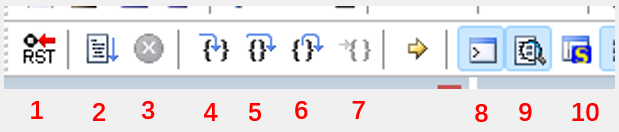

1. 重置程序到最初

2. 跳转到断点处

3. 停止程序

4. 单步运行

5. 跳过函数

6. 跳出函数

7. 跳转到光标处

8. 开启/关闭命令行(软件下面的窗口)

9. 开启/关闭汇编窗口

10. 符号窗口:在这个窗口可以看到变量的变化

    

11. 在Debug模式下，使用Peripherals可以查看寄存器

    

# 新建项目

**工程架构**


**新建项目**

1. 创建文件夹：用来存放以后所有的STM32程序，例如`D:\Code\STM32`

2. 进入软件：`Project->new Project` 在`D:\Code\STM32`目录中再次创建文件夹用于存放本次的项目，进入此文件夹创建工程名称

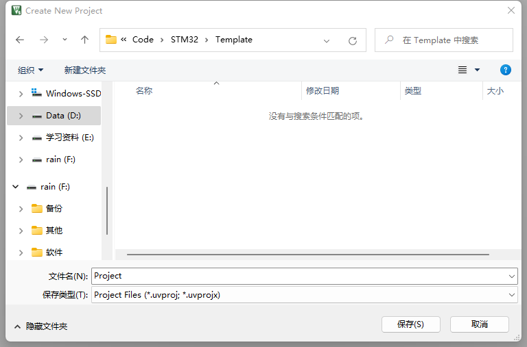

3. 选择相应的器件型号

   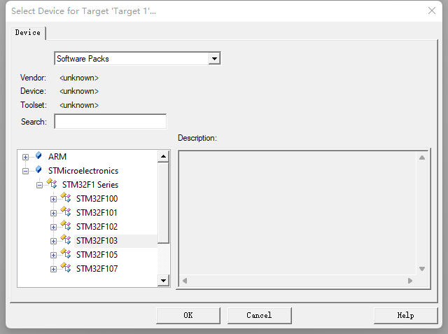

4. 现在进入`D:\Code\STM32\Template`文件夹可以看到已经创建了一些文件。但是此时还不能使用keil来编写程序

5. 引入标准库启动文件

   1. 在`D:\Code\STM32\Template`创建文件夹`Start`(名称可以随便定义，方便后期理解)

   2. 引入`\固件库\STM32F10x_StdPeriph_Lib_V3.5.0\Libraries\CMSIS\CM3\DeviceSupport\ST\STM32F10x\startup\arm`文件夹下的启动文件`startup_stm32f10****`等到`D:\Code\STM32\Template\Start`
      

   3. 引入`\固件库\STM32F10x_StdPeriph_Lib_V3.5.0\Libraries\CMSIS\CM3\DeviceSupport\ST\STM32F10x`文件夹下的`stm32f10x.h`、`system_stm32f10x.c/.h`文件到`D:\Code\STM32\Template\Start`

      1. `stm32f10x.h`:外设寄存器描述
      2. `system_stm32f10x.c/.h`:时钟

   4. 引入`\固件库\STM32F10x_StdPeriph_Lib_V3.5.0\Libraries\CMSIS\CM3\CoreSupport`文件夹下的内核寄存器描述文件`core_cm3.c/.h`到`D:\Code\STM32\Template\Start`

   5. 进入keil软件，添加新组`Start`

      1. 右击Start组->add Existing Files to Group 'Start'

      2. 进入`D:\Code\STM32\Template\Start`目录，选择文件类型为`All file`

         - 引入`startup_stm32f***`开头的启动文件(在下方表格中说明了具体引入什么文件)，本次引入的是`startup_stm32f10x_md.s`，点击`Add`
         - 引入所有`.c .h`文件，就是刚才添加到`D:\Code\STM32\Template\Start`目录的`.c.h`文件
         - 支持`Start`文件夹的文件添加完毕

      3. 在工程选项中添加文件夹的头文件路径：依次点击 魔法棒、C/C++、Include Paths旁边三个点按钮、新建、三个点按钮、选择`D:\Code\STM32\Template\Start`文件夹

         

6. 在`D:\Code\STM32\Template`创建`User`文件夹

   1. 进入keil软件，添加新组`User`
   2. 右键User组->Add New Item to Group  'User'
   3. 添加C File，文件名为main，注意选择`D:\Code\STM32\Template\User`目录
      1. **一定要选择到对应的文件夹**
   4. 到此处就可以使用寄存器来开发了

7. 库开发

   1. 在`D:\Code\STM32\Template`创建`Library`文件夹

   2. 引入`\固件库\STM32F10x_StdPeriph_Lib_V3.5.0\Libraries\STM32F10x_StdPeriph_Driver\src`文件夹下的`misc.c` 和`stm32f10x_xxx.c`文件到`D:\Code\STM32\Template\Library`文件夹

      

   3. 引入`\固件库\STM32F10x_StdPeriph_Lib_V3.5.0\Libraries\STM32F10x_StdPeriph_Driver\inc`文件夹下的`misc.h` 和`stm32f10x_xxx.h`文件到`D:\Code\STM32\Template\Library`文件夹

      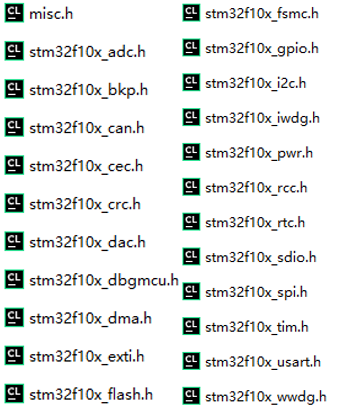

   4. 进入keil软件，添加新组`Library`组，右击->add Existing Files to Group 'Library',全选`D:\Code\STM32\Template\Library`中的文件，点添加

   5. 将`\固件库\STM32F10x_StdPeriph_Lib_V3.5.0\Project\STM32F10x_StdPeriph_Template`文件夹下的`stm32f10x_conf.h`、`stm32f10x_it.h`引入到main所在的文件夹，也就是`D:\Code\STM32\Template\User`

      

      - 再将文件添加到`User`组中

   6. 点击魔法棒、C/C++ 

      1. 将`USE_STDPERIPH_DRIVER`添加到Define栏中
      2. 再将`User`、`Library`利用Include Paths添加到


**启动文件的选择**

| **缩写** | **释义**           | **Flash容量 ** | **型号**          |
| -------- | ------------------ | -------------- | ----------------- |
| LD_VL    | 小容量产品超值系列 | 16~32K         | STM32F100         |
| MD_VL    | 中容量产品超值系列 | 64~128K        | STM32F100         |
| HD_VL    | 大容量产品超值系列 | 256~512K       | STM32F100         |
| LD       | 小容量产品         | 16~32K         | STM32F101/102/103 |
| MD       | 中容量产品         | 64~128K        | STM32F101/102/103 |
| HD       | 大容量产品         | 256~512K       | STM32F101/102/103 |
| XL       | 加大容量产品       | 大于512K       | STM32F101/102/103 |
| CL       | 互联型产品         | -              | STM32F105/107     |


**总结**：

1. 建立工程文件夹，Keil中新建工程，选择型号
2. 工程文件夹里建立Start、Library、User等文件夹，复制固件库里面的文件到工程文件夹
3. 工程里对应建立Start、Library、User等同名称的分组，然后将文件夹内的文件添加到工程分组里
4. 工程选项，C/C++，Include Paths内声明所有包含头文件的文件夹
5. 工程选项，C/C++，Define内定义`USE_STDPERIPH_DRIVER`
6. 工程选项，Debug，下拉列表选择对应调试器，Settings，Flash Download里勾选Reset and Run

# 简介

**认识STM32**

ST 是意法半导体，M 是 Microelectronics 的缩写，32 表示 32 位，即STM32 指的是ST公司开发的基于ARM Cortex-M内核的32位微控制器。

ARM既指ARM公司，也指ARM处理器内核


**命名规则**


**片上资源/外设**

| **英文缩写** |      **名称**      | **英文缩写** |      **名称**      |
| :----------: | :----------------: | :----------: | :----------------: |
|     NVIC     | 嵌套向量中断控制器 |     CAN      |      CAN通信       |
|   SysTick    |   系统滴答定时器   |     USB      |      USB通信       |
|     RCC      |   复位和时钟控制   |     RTC      |      实时时钟      |
|     GPIO     |      通用IO口      |     CRC      |      CRC校验       |
|     AFIO     |      复用IO口      |     PWR      |      电源控制      |
|     EXTI     |      外部中断      |     BKP      |     备份寄存器     |
|     TIM      |       定时器       |     IWDG     |     独立看门狗     |
|     ADC      |     模数转换器     |     WWDG     |     窗口看门狗     |
|     DMA      |    直接内存访问    |     DAC      |     数模转换器     |
|    USART     | 同步/异步串口通信  |     SDIO     |      SD卡接口      |
|     I2C      |      I2C通信       |     FSMC     | 可变静态存储控制器 |
|     SPI      |      SPI通信       |   USB OTG    |    USB主机接口     |

**系统结构**

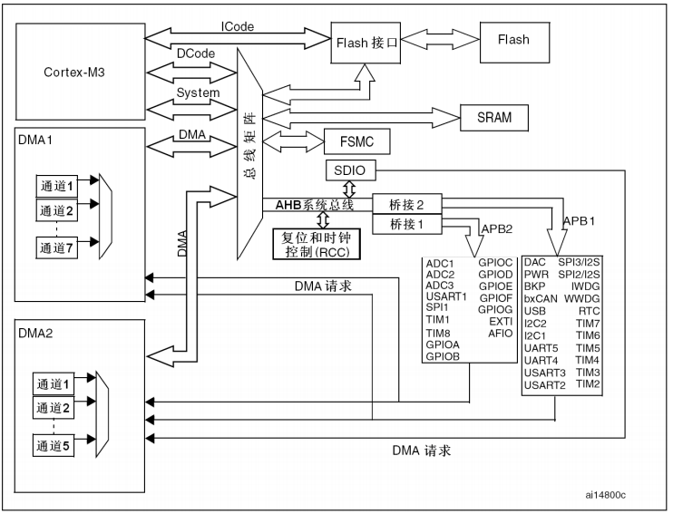

1. ICode总线：该总线将Cortex™-M3内核的指令总线与闪存指令接口相连接。指令预取在此总线上完成。
2. DCode总线：该总线将Cortex™-M3内核的DCode总线与闪存存储器的数据接口相连接(常量加载和调试访问)。
3. 系统总线：此总线连接Cortex™-M3内核的系统总线(外设总线)到总线矩阵，总线矩阵协调着内核和DMA间的访问。
4. DMA总线：此总线将DMA的AHB主控接口与总线矩阵相联，总线矩阵协调着CPU的DCode和DMA到SRAM、闪存和外设的访问。
5. 总线矩阵：总线矩阵协调内核系统总线和DMA主控总线之间的访问仲裁，仲裁利用轮换算法。在互联型产品中，总线矩阵包含5个驱动部件(CPU的DCode、系统总线、以太网DMA、DMA1总线和DMA2总线)和3个从部件(闪存存储器接口(FLITF)、SRAM和AHB2APB桥)。在其它产品中总线矩阵包含4个驱动部件(CPU的DCode、系统总线、DMA1总线和DMA2总线)和4个被动部件(闪存存储器接口(FLITF)、SRAM、FSMC和AHB2APB桥)。AHB外设通过总线矩阵与系统总线相连，允许DMA访问。
6. AHB/APB桥(APB)：两个AHB/APB桥在AHB和2个APB总线间提供同步连接。APB1操作速度限于36MHz，APB2操作于全速(最高72MHz)。有关连接到每个桥的不同外设的地址映射请参考表1。在每一次复位以后，所有除SRAM和FLITF以外的外设都被关闭，在使用一个外设之前，必须设置寄存器RCC_AHBENR来打开该外设的时钟。


**引脚定义**

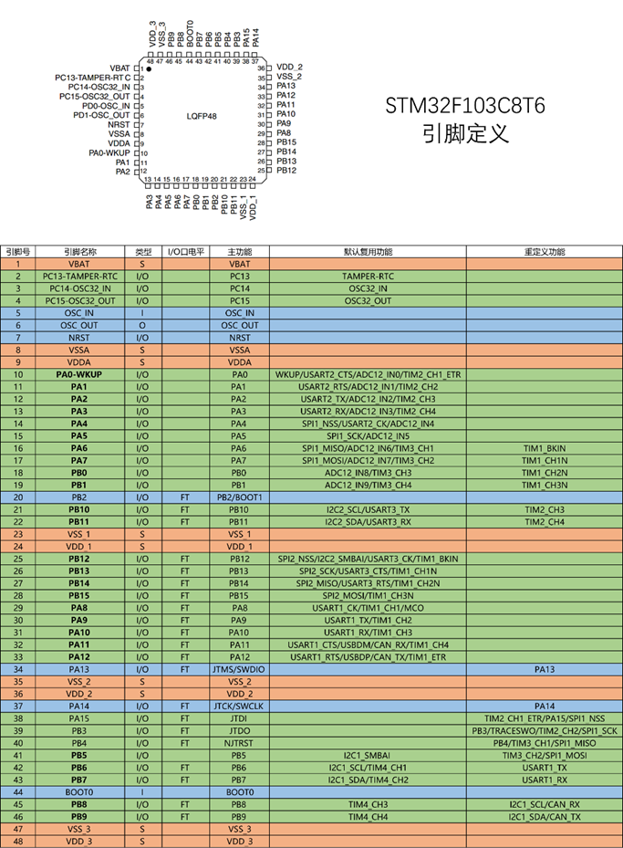

| 引脚号 |    引脚名称     | 类型 | I/O口电平 | 主功能     |              默认复用功能               |           重定义功能           |
| :----: | :-------------: | :--: | :-------: | :--------- | :-------------------------------------: | :----------------------------: |
|   1    |      VBAT       |  S   |           | VBAT       |                                         |                                |
|   2    | PC13-TAMPER-RTC | I/O  |           | PC13       |               TAMPER-RTC                |                                |
|   3    |  PC14-OSC32_IN  | I/O  |           | PC14       |                OSC32_IN                 |                                |
|   4    | PC15-OSC32_OUT  | I/O  |           | PC15       |                OSC32_OUT                |                                |
|   5    |     OSC_IN      |  I   |           | OSC_IN     |                                         |                                |
|   6    |     OSC_OUT     |  O   |           | OSC_OUT    |                                         |                                |
|   7    |      NRST       | I/O  |           | NRST       |                                         |                                |
|   8    |      VSSA       |  S   |           | VSSA       |                                         |                                |
|   9    |      VDDA       |  S   |           | VDDA       |                                         |                                |
|   10   |    PA0-WKUP     | I/O  |           | PA0        | WKUP/USART2_CTS/ADC12_IN0/TIM2_CH1_ETR  |                                |
|   11   |       PA1       | I/O  |           | PA1        |      USART2_RTS/ADC12_IN1/TIM2_CH2      |                                |
|   12   |       PA2       | I/O  |           | PA2        |      USART2_TX/ADC12_IN2/TIM2_CH3       |                                |
|   13   |       PA3       | I/O  |           | PA3        |      USART2_RX/ADC12_IN3/TIM2_CH4       |                                |
|   14   |       PA4       | I/O  |           | PA4        |      SPI1_NSS/USART2_CK/ADC12_IN4       |                                |
|   15   |       PA5       | I/O  |           | PA5        |           SPI1_SCK/ADC12_IN5            |                                |
|   16   |       PA6       | I/O  |           | PA6        |      SPI1_MISO/ADC12_IN6/TIM3_CH1       |           TIM1_BKIN            |
|   17   |       PA7       | I/O  |           | PA7        |      SPI1_MOSI/ADC12_IN7/TIM3_CH2       |           TIM1_CH1N            |
|   18   |       PB0       | I/O  |           | PB0        |           ADC12_IN8/TIM3_CH3            |           TIM1_CH2N            |
|   19   |       PB1       | I/O  |           | PB1        |           ADC12_IN9/TIM3_CH4            |           TIM1_CH3N            |
|   20   |       PB2       | I/O  |    FT     | PB2/BOOT1  |                                         |                                |
|   21   |      PB10       | I/O  |    FT     | PB10       |           I2C2_SCL/USART3_TX            |            TIM2_CH3            |
|   22   |      PB11       | I/O  |    FT     | PB11       |           I2C2_SDA/USART3_RX            |            TIM2_CH4            |
|   23   |      VSS_1      |  S   |           | VSS_1      |                                         |                                |
|   24   |      VDD_1      |  S   |           | VDD_1      |                                         |                                |
|   25   |      PB12       | I/O  |    FT     | PB12       | SPI2_NSS/I2C2_SMBAI/USART3_CK/TIM1_BKIN |                                |
|   26   |      PB13       | I/O  |    FT     | PB13       |      SPI2_SCK/USART3_CTS/TIM1_CH1N      |                                |
|   27   |      PB14       | I/O  |    FT     | PB14       |     SPI2_MISO/USART3_RTS/TIM1_CH2N      |                                |
|   28   |      PB15       | I/O  |    FT     | PB15       |           SPI2_MOSI/TIM1_CH3N           |                                |
|   29   |       PA8       | I/O  |    FT     | PA8        |         USART1_CK/TIM1_CH1/MCO          |                                |
|   30   |       PA9       | I/O  |    FT     | PA9        |           USART1_TX/TIM1_CH2            |                                |
|   31   |      PA10       | I/O  |    FT     | PA10       |           USART1_RX/TIM1_CH3            |                                |
|   32   |      PA11       | I/O  |    FT     | PA11       |    USART1_CTS/USBDM/CAN_RX/TIM1_CH4     |                                |
|   33   |      PA12       | I/O  |    FT     | PA12       |    USART1_RTS/USBDP/CAN_TX/TIM1_ETR     |                                |
|   34   |      PA13       | I/O  |    FT     | JTMS/SWDIO |                                         |              PA13              |
|   35   |      VSS_2      |  S   |           | VSS_2      |                                         |                                |
|   36   |      VDD_2      |  S   |           | VDD_2      |                                         |                                |
|   37   |      PA14       | I/O  |    FT     | JTCK/SWCLK |                                         |              PA14              |
|   38   |      PA15       | I/O  |    FT     | JTDI       |                                         |   TIM2_CH1_ETR/PA15/SPI1_NSS   |
|   39   |       PB3       | I/O  |    FT     | JTDO       |                                         | PB3/TRACESWO/TIM2_CH2/SPI1_SCK |
|   40   |       PB4       | I/O  |    FT     | NJTRST     |                                         |     PB4/TIM3_CH1/SPI1_MISO     |
|   41   |       PB5       | I/O  |           | PB5        |               I2C1_SMBAI                |       TIM3_CH2/SPI1_MOSI       |
|   42   |       PB6       | I/O  |    FT     | PB6        |            I2C1_SCL/TIM4_CH1            |           USART1_TX            |
|   43   |       PB7       | I/O  |    FT     | PB7        |            I2C1_SDA/TIM4_CH2            |           USART1_RX            |
|   44   |      BOOT0      |  I   |           | BOOT0      |                                         |                                |
|   45   |       PB8       | I/O  |    FT     | PB8        |                TIM4_CH3                 |        I2C1_SCL/CAN_RX         |
|   46   |       PB9       | I/O  |    FT     | PB9        |                TIM4_CH4                 |        I2C1_SDA/CAN_TX         |
|   47   |      VSS_3      |  S   |           | VSS_3      |                                         |                                |
|   48   |      VDD_3      |  S   |           | VDD_3      |                                         |                                |


其中红色为电源引脚，蓝色为最小系统引脚，绿色为IO口、功能口等

I/O口电平：FT表明为5V的电压，没有FT则表明只能容忍3.3V电压。没有FT要想接5V电平则需要加装电平转换电路

STM32F103C8T6有两组GPIO,分别为GPIOA,GPIOB


**启动配置**

在STM32F10xxx里，可以通过BOOT[1:0]引脚选择三种不同启动模式。


在系统复位后，SYSCLK的第4个上升沿，BOOT引脚的值将被锁存。用户可以通过设置BOOT1和BOOT0引脚的状态，来选择在复位后的启动模式。


**最小系统**

最小系统是指，为了确保单片机正常工作的最基本电路


**STM32F103C8T6**

- 系列：主流系列STM32F1
- 内核：ARM Cortex-M3
- 主频：72MHz
- RAM：20K（SRAM）
- ROM：64K（Flash）
- 供电：2.0~3.6V（标准3.3V）
- 封装：LQFP48

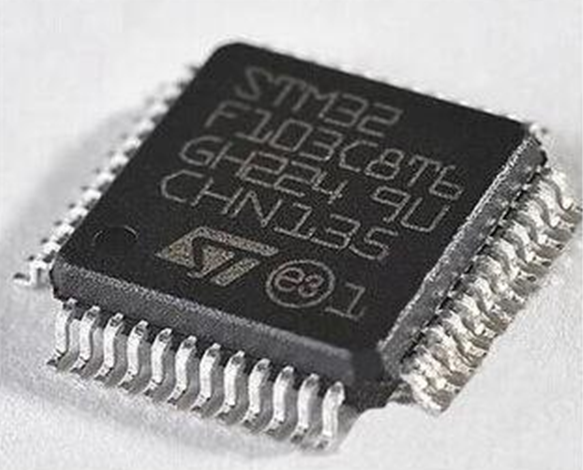


6. 


# 时钟RCC

RCC： Reset and Clock Control，即复位和时钟控制


**过程**


**时钟系统框图**


深蓝色为时钟源输入：有四个时钟源

* 内部时钟源:两个
  * HSI是高速内部时钟，RC振荡器，频率为8MHz，精度不高。(最多能产生64MHz的脉冲)
  * LSI是低速内部时钟，RC振荡器，频率为40kHz，提供低功耗时钟。独立看门狗的时钟源只能是 LSI ，同时LSI 还可以作为 RTC 的时钟源。
* 外部时钟源:两个
  * HSE是高速外部时钟，可接石英/陶瓷谐振器，或者接外部时钟源，频率范围为4MHz~16MHz。多数是: 8MHZ
  * LSE是低速外部时钟，频率范围为0-1000KHZ，接频率为32.768kHz的石英晶体。是主要的**实时时钟RTC**时钟源。

黄色为外部接口: 

* 外部接口是芯片内部与外界连接的通道(单片机引脚)，这类接口能够输入时钟信号到单片机或从单片机输出。
* 注意：高速外部时钟HSE的引脚是OSC_OUT和OSC_IN这两个引脚芯片是独立引出的，可以接外部的晶振电路，而低速外部时钟LSE的引脚OSC32_IN和OSC32_OUT两个引脚不是独立的，而是在PC14和PC15上，对应关系为OSC32_IN-->PC14 ; OSC32_OUT-->PC15
  

棕色为预分频器: 预分频器(Prescaler-PSC)用来将输入的时钟源进行分频输出。例如72Mhz的时钟信号经过1.5分频(/1.5)，得到48Mhz时钟信号。

绿色为选择器: 可对输入的多个时钟信号进行选择，选择其中的一个时钟信号输出

红色位倍频器: 锁相倍频器（phase locked frequency multiplier） 是完成倍频功能的锁相环。用来将输入的时钟源进行倍频输出。例如8Mhz时钟源进行9倍频，得到72Mhz时钟信号。

浅蓝色为与门：为降低能耗，默认一端低电平，即关闭状态(disable)，当需要使用相关外设时钟时，通过程序控制该端高电平使时钟信号导通。


最高频率: 72MHZ


**时钟去向讲解**


APB1 分频器输出一路供 APB1 外设使用 (PCLK1 最大频率 36MHz)，另一路送给定时器 Timer倍频器使用。
APB2 分频器输出一路供 APB2 外设使用 (PCLK2 最大频率 72MHz)，另一路送给定时器 Timer倍频器使用 或ADC预分频器使用。


**以定时器和ADC为例**


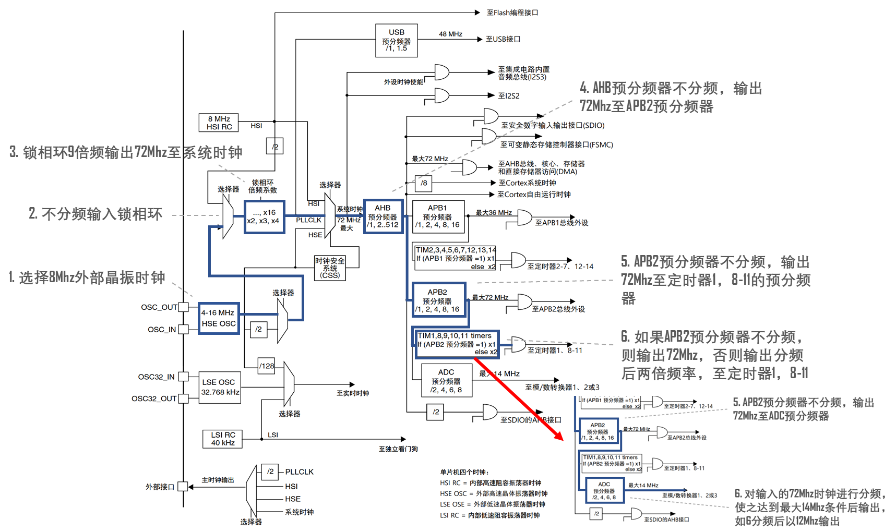

## **系统时钟配置**

**步骤：**

1. 配置HSE_VALUE：告诉HAL库外部晶振频率，stm32xxxx_hal_conf.h
2. 调用SystemInit()函数（可选）：在启动文件中调用， 在system_stm32xxxx.c定义
   1. 不想调用：可以在startup_stm32f103xe.s中的Reset_Handler注释掉
3. 选择时钟源，配置PLL：通过`HAL_RCC_OscConfig()`函数设置
4. 选择系统时钟源，配置总线分频器：通过`HAL_RCC_ClockConfig()`函数设置
5. 配置扩展外设时钟（可选）：通过`HAL_RCCEx_PeriphCLKConfig()`函数设置


**时钟源，配置PLL**

````c
HAL_StatusTypeDef HAL_RCC_OscConfig(RCC_OscInitTypeDef  *RCC_OscInitStruct)   //选择时钟源，配置PLL
````

````c
typedef struct { 
	uint32_t  OscillatorType; 		/* 选择需要配置的振荡器 */ 
	uint32_t  HSEState; 			/* HSE 状态 */ 
	uint32_t  HSEPredivValue; 		/* HSE 预分频值 */ 
	uint32_t  LSEState; 			/* LSE 状态 */ 
	uint32_t  HSIState; 			/* HSI状态 */ 
	uint32_t  HSICalibrationValue; 	/* HSI 校准值 */ 
	uint32_t  LSIState; 			/* LSI 状态 */ 
	RCC_PLLInitTypeDef  PLL; 		/* PLL 结构体 */ 
}RCC_OscInitTypeDef;
/* PLL 结构体 */ 
typedef struct { 
	uint32_t  PLLState; 	/* PLL 状态 */ 
	uint32_t  PLLSource; 	/* PLL 时钟源 */ 
	uint32_t  PLLMUL; 		/* PLL 倍频系数 */ 
}RCC_PLLInitTypeDef;
````

**系统时钟源，配置总线分频器**

````c
/** 选择系统时钟源，配置总线分频器
*	参数2FLatency:闪存访问控制寄存器(FLASH_ACR) 
*	LATENCY：时延
*	这些位表示SYSCLK(系统时钟)周期与闪存访问时间的比例
*	000：零等待状态，当 0 < SYSCLK ≤ 24MHz               FLASH_LATENCY_0 
*	001：一个等待状态，当 24MHz < SYSCLK ≤ 48MHz         FLASH_LATENCY_1 
*	010：两个等待状态，当 48MHz < SYSCLK ≤ 72MHz         FLASH_LATENCY_2
**/
HAL_StatusTypeDef HAL_RCC_ClockConfig(RCC_ClkInitTypeDef  *RCC_ClkInitStruct, uint32_t FLatency) 
````

````c
typedef struct { 
	uint32_t  ClockType; 		/* 要配置的时钟（SYSCLK/HCLK/PCLK1/PCLK2） (HCLK:AHB，PCLK1:APB1，PCLK2:APB2)*/ 
	uint32_t  SYSCLKSource; 	/* 系统时钟源 */ 
	uint32_t  AHBCLKDivider; 	/* AHB  时钟预分频系数 */ 
	uint32_t  APB1CLKDivider; 	/* APB1 时钟预分频系数 */ 
	uint32_t  APB2CLKDivider; 	/* APB2 时钟预分频系数 */ 
}RCC_ClkInitTypeDef;
````

**例：**

使用外部8MHz晶振

````c
#if !defined  (HSE_VALUE)
#if defined(USE_STM3210C_EVAL)
#define HSE_VALUE    25000000U /*!< Value of the External oscillator in Hz */
#else
#define HSE_VALUE    8000000U /*!< Value of the External oscillator in Hz */
#endif
#endif /* HSE_VALUE */
````

````c
RCC_OscInitTypeDef rcc_osc_init = {0};
rcc_osc_init.OscillatorType = RCC_OSCILLATORTYPE_HSE;       /* 选择要配置HSE */
rcc_osc_init.HSEState = RCC_HSE_ON;                         /* 打开HSE */
rcc_osc_init.HSEPredivValue = RCC_HSE_PREDIV_DIV1;          /* HSE预分频系数 */
rcc_osc_init.PLL.PLLState = RCC_PLL_ON;                     /* 打开PLL */
rcc_osc_init.PLL.PLLSource = RCC_PLLSOURCE_HSE;             /* PLL时钟源选择HSE */
rcc_osc_init.PLL.PLLMUL = RCC_PLL_MUL9;                     /* PLL倍频系数 */
ret = HAL_RCC_OscConfig(&rcc_osc_init);                     /* 初始化 */

RCC_ClkInitTypeDef rcc_clk_init = {0};
/* 选中PLL作为系统时钟源并且配置HCLK,PCLK1和PCLK2*/
rcc_clk_init.ClockType = (RCC_CLOCKTYPE_SYSCLK | RCC_CLOCKTYPE_HCLK | RCC_CLOCKTYPE_PCLK1 | RCC_CLOCKTYPE_PCLK2);
rcc_clk_init.SYSCLKSource = RCC_SYSCLKSOURCE_PLLCLK;        /* 设置系统时钟来自PLL,注意： 别选成RCC_OSCILLATORTYPE_HSE*/
rcc_clk_init.AHBCLKDivider = RCC_SYSCLK_DIV1;               /* AHB分频系数为1 */
rcc_clk_init.APB1CLKDivider = RCC_HCLK_DIV2;                /* APB1分频系数为2 */
rcc_clk_init.APB2CLKDivider = RCC_HCLK_DIV1;                /* APB2分频系数为1 */
ret = HAL_RCC_ClockConfig(&rcc_clk_init, FLASH_LATENCY_2);  /* 同时设置FLASH延时周期为2WS，也就是3个CPU周期。 */
````


**外设时钟使和失能**

使能某外设时钟：`__HAL_RCC_XXX_CLK_ENABLE();  `

禁止某外设时钟：`__HAL_RCC_XXX_CLK_DISABLE();  `

```c
__HAL_RCC_GPIOA_CLK_ENABLE();      		/* 使能 GPIOA 时钟 */
__HAL_RCC_GPIOA_CLK_DISABLE();      	/* 禁止 GPIOA 时钟 */
```


#   GPIO

## 简介

**GPIO**(general porpose intput output):通用输入输出端口的简称。可以通过软件控制其输出和输入。stm32芯片的GPIO引脚与外部设备连接起来，从而实现与外部通信，控制以及数据采集的功能。


GPIO管脚： PA、PB、PC、PD 等均属于 GPIO 引脚。GPIO 占用了 STM32 芯片大部分的引脚。并且每一个端口都有 16 个引脚，比如 PA 端口，它有 PA0-PA15。其他的 PB、PC 等端口是一样的。


**GPIO基本结构**


**GPIO位结构**


绿色区域为输入，蓝色区域为输出

1. 保护二极管
   - 引脚内部加上这两个保护二级管可以防止引脚外部过高或过低的电压输入。
   - 当引脚电压高于 VDD_FT 或 VDD 时，上方的二极管导通吸收这个高电压。
   - 当引脚电压低于 VSS 时，下方的二极管导通，防止不正常电压引入芯片导致芯片烧毁。
2. 上下拉电阻
   - 上拉和下拉电阻上都有一个开关，通过配置上下拉电阻开关，可以控制引脚的默认状态电平。
   - 当开启上拉时引脚默认电压为高电平
   - 开启下拉时，引脚默认电压为低电平，这样就可以消除引脚不定状态的影响。
   - 将上拉和下拉的开关都关断，这种状态我们称为浮空模式，一旦配置成这个模式，引脚的电压是不确定的，如果用万用表测量此模式下管脚电压时会发现只有 1 点几伏，而且还不时改变，所以一般情况下我们都会给引脚设置成上拉或者下拉模式，使它有一个默认状态。
   - STM32 上下拉及浮空模式的配置是通过GPIOx_CRL 和 GPIOx_CRH 寄存器控制的。 
   - STM32 内部的上拉其实是一个弱上拉，也就是说通过此上拉电阻输出的电流很小，如果想要输出一个大电流，那么就需要外接上拉电阻了。
3. TTL肖特基触发器(施密特触发器)
   - 施密特触发电路是一种波形整形电路，当任何波形的信号进入电路时，输出在正、负饱和之间跳动，产生方波或脉波输出。不同于比较器，施密特触发电路有两个临界电压且形成一个滞后区，可以防止在滞后范围内之噪声干扰电路的正常工作。如遥控接收线路，传感器输入电路都会用到它整形。
4. 输入数据寄存器
   - 输入数据寄存器是由 IO 口经过上下拉电阻、施密特触发器引入。当信号经过触发器，模拟信号将变为数字信号 0 或 1，然后存储在输入数据寄存器中，通过读取输入数据寄存器 GPIOx_IDR 就可以知道 IO 口的电平状态。
5. 复用功能输入
   - 此模式与复用功能输出类似。在复用功能输入模式时，GPIO 引脚的信号传输到 STM32 其他片上外设，由该外设读取引脚的状态。同样，如我们使用 USART 串口通讯时，需要用到某个 GPIO 引脚作为通讯接收引脚，这个时候就可以把该 GPIO 引脚配置成 USART 串口复用功能，使 USART 可以通过该通讯引脚的接收远端数据。
6. 模拟输入输出
   - 当 GPIO 引脚用于 ADC 采集电压的输入通道时，用作“模拟输入”功能，此时信号是不经过施密特触发器的，因为经过施密特触发器后信号只有 0、1 两种状态，ADC 外设要采集到原始的模拟信号，信号源输入必须在施密特触发器之前。类似地，当 GPIO 引脚用于 DAC 作为模拟电压输出通道时，此时作为“模拟输出”功能， DAC 的模拟信号输出就不经过双 MOS 管结构了，模拟信号直接通过管脚输出。
7. P-MOS 和 SN-MOS 
   - GPIO 引脚经过两个保护二极管后就分成两路，上面一路是“输入模式”，下面一路是“输出模式”。
   - 输出模式，线路经过一个由 P-MOS 和 N-MOS管组成的单元电路，这让 GPIO 引脚具有了推挽和开漏两种输出模式。
   - 推挽输出模式，是根据 P-MOS 和 N-MOS 管的工作方式命名的。
     - 在该结构单元输入一个高电平时，P-MOS 管导通，N-MOS 管截止，对外输出高电平（3.3V）。
     - 在该单元输入一个低电平时，P-MOS 管截止，N-MOS 管导通，对外输出低电平（0V）。
     - 如果当切换输入高低电平时，两个 MOS 管将轮流导通，一个负责灌电流（电流输出到负载），一个负责拉电流（负载电流流向芯片），使其负载能力和开关速度都比普通的方式有很大的提高。
   - 在开漏输出模式时，不论输入是高电平还是低电平，P-MOS 管总处于关闭状态。
     - 当给这个单元电路输入低电平时，N-MOS 管导通，输出即为低电平。
     - 当输入高电平时，N-MOS 管截止，这个时候引脚状态既不是高电平，又不是低电平，我们称之为高阻态。
     - 如果想让引脚输出高电平，那么引脚必须外接一个上拉电阻，由上拉电阻提供高电平。
   - 在开漏输出模式中还有一个特点，引脚具有“线与”关系。即多个开漏输出模式的引脚接在一起，只要有一个引脚为低电平，其他所有管脚都为低电平，即把所有引脚连接在一起的这条总线拉低了。
     - 只有当所有引脚输出高阻态时这条总线的电平才由上拉电阻的 VDD 决定。如果 VDD 连接的是 3.3V，那么引脚输出的就是 3.3V，如果 VDD 连接的是 5V，那么引脚输出的就是 5V。因此如果想要让 STM32 管脚输出 5V，可以选择开漏输出模式，然后在外接上拉电阻的电源 VDD 选择 5V 即可，前提是这个 STM32 引脚是容忍 5V 的。开漏输出模式一般应用在 I2C、SMBUS 通讯等需要“线与”功能的总线电路中。还可以用在电平不匹配的场合中，就如上面说的输出 5V 一样。
     - 推挽输出模式一般应用在输出电平为 0-3.3V 而且需要高速切换开关状态的场合。除了必须要用开漏输出模式的场合，我们一般选择推挽输出模式。要配置引脚是开漏输出还是推挽输出模式可以使用GPIOx_CRL 和 GPIOx_CRH 寄存器。
8. 输出数据寄存器
   - 双 MOS 管结构电路的输入信号，是由 GPIO“输出数据寄存器GPIOx_ODR”提供的，因此我们通过修改输出数据寄存器的值就可以修改 GPIO 引脚的输出电平。而“置位/复位寄存器 GPIOx_BSRR”可以通过修改输出数据寄存器的值从而影响电路的输出。
9. 复用功能输出
   - 由于 STM32 的 GPIO 引脚具有第二功能，因此当使用复用功能的时候，也就是通过其他外设复用功能输出信号与 GPIO 数据寄存器一起连接到双 MOS 管电路的输入，其中梯形结构是用来选择使用复用功能还是普通 IO 口功能。例如我们使用 USART 串口通讯时，需要用到某个 GPIO 引脚作为通讯发送引脚，这个时候就可以把该 GPIO 引脚配置成 USART 串口复用功能，由串口外设控制该引脚，发送数据。
     

## **GPIO模式**

| **模式名称** | **性质** | **特征**                                                     | **编码**              |
| :----------: | :------: | :----------------------------------------------------------- | --------------------- |
|   浮空输入   | 数字输入 | 可读取引脚电平，若引脚悬空，则电平不确定                     | GPIO_Mode_IN_FLOATING |
|   上拉输入   | 数字输入 | 可读取引脚电平，内部连接上拉电阻，悬空时默认高电平           | GPIO_Mode_IPU         |
|   下拉输入   | 数字输入 | 可读取引脚电平，内部连接下拉电阻，悬空时默认低电平           | GPIO_Mode_IPD         |
|   模拟输入   | 模拟输入 | GPIO无效，引脚直接接入内部ADC                                | GPIO_Mode_AIN         |
|   开漏输出   | 数字输出 | 可输出引脚电平，高电平为高阻态，低电平接VSS  （高电平没有驱动能力） | GPIO_Mode_Out_OD      |
|   推挽输出   | 数字输出 | 可输出引脚电平，高电平接VDD，低电平接VSS      （高电平有驱动能力,25mA） | GPIO_Mode_Out_PP      |
| 复用开漏输出 | 数字输出 | 由片上外设控制，高电平为高阻态，低电平接VSS(硬件IIC)         | GPIO_Mode_AF_PP       |
| 复用推挽输出 | 数字输出 | 由片上外设控制，高电平接VDD，低电平接VSS（SPI）              | GPIO_Mode_AF_OD       |

输入：Input

输出：Output

上拉：Pull-up

下拉：Pull-down

推挽：Push-Pull

开漏：Open-Drain

复用：Alternate-Function

### 输入


在输入模式时，施密特触发器打开，输出被禁止，可通过输入数据寄存器 GPIOx_IDR读取 I/O 状态

由于电阻阻值很大这里的上拉下拉输入都是弱上拉 弱下拉，为了对外部输入产生很大的影响


**浮空/上拉/下拉输入**

上拉输入：默认的高电平，当没有外部输入时默认输入高电平

下拉输入：默认的低电平，当没有外部输入时默认输入低电平

浮空输入：输入引脚啥都不接，此时输入电平极易受外界的干扰导致输入电平不确定，完全由外部的输入决定。


**模拟输入**


这模式主要为片上外设ADC而配置，从外部读取模拟信号

- 模拟信号：测试信号未经过采样前，均是时间和幅值均是连续的信号称为模拟信号，例如连续变化的电压，电流，温度等等。
- 数字信号：模拟信号经等间隔“采样”及幅值量化以后，时间和幅值均是不连续的（离散）的信号,例如0 /1

他的目的就是获取模拟量，没有经过施密特触发器

### 输出

* 输出寄存器只会记录0和1，再通过驱动器来输出3.3V电平
* 出现在I/O脚上的数据在每个APB2时钟被采样到输入数据寄存器
* 在开漏模式时，对输入数据寄存器的读访问可得到I/O状态
* 在推挽式模式时，对输出数据寄存器的读访问得到最后一次写的值
* 除了模拟输入的这种模式会关闭数字输入功能其他七种模式，都可以通过输入寄存器读取I/O状态，例：在模拟I2C实验中把GPIO的工作模式配置为开漏输出时同时也可以读取引脚电平状态，现在不知道不要紧后面会详细讲解
* 在输出模式中，推挽模式时双 MOS 管以轮流方式工作，输出数据寄存器 GPIOx_ODR可控制 I/O 输出高低电平。开漏模式时，只有 N-MOS 管工作，输出数据寄存器可控制 I/O输出高阻态或低电平。

**推挽输出**

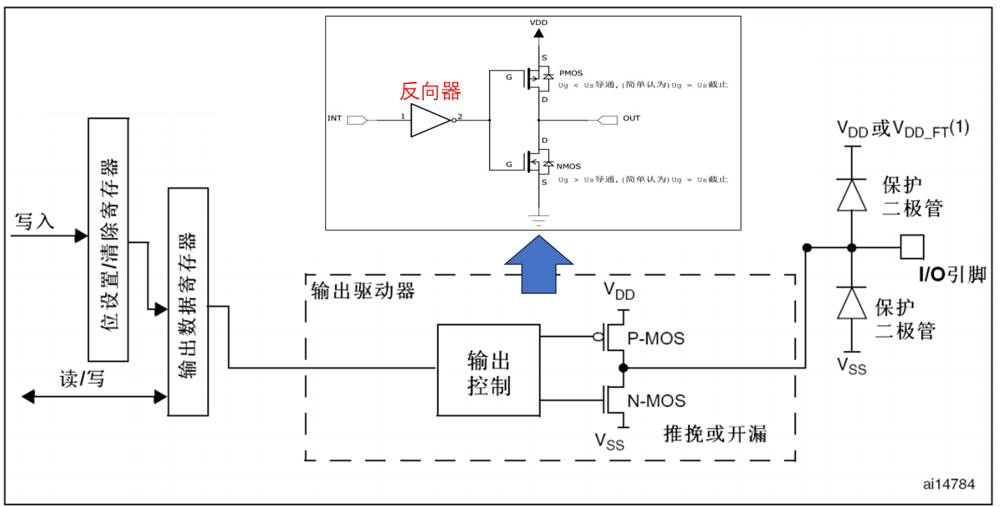


当输出寄存器输出高电平，则引脚也输出高电平


当输出寄存器输出低电平，则引脚也输出低电平


**开漏输出**

当输出寄存器输出高电平，则引脚输出高阻态；IIC就是利用引脚高阻态特性。


当输出寄存器输出低电平，则引脚输出低电平


**复用推挽开漏输出**

复用功能模式中，输出使能，输出速度可配置，可工作在开漏及推挽模式， 但是输出信号源于其它外设
输出数据寄存器 GPIOx_ODR 无效；输入可用，通过输入数据寄存器可获取 I/O 实际状态，但一般直接用外设的寄存器来获取该数据信号

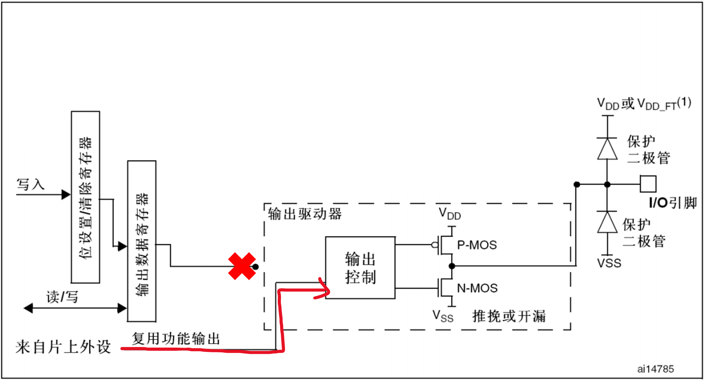

复用输出与其他输出一样，只是控制源来自其他外设，不来自输出数据寄存器


## GPIO寄存器

| **CRL\CRH**            | **IDR**  | **ODR**  | **BSRR**          | **BRR**                                            | **LCKR**           |
| ---------------------- | -------- | -------- | ----------------- | -------------------------------------------------- | ------------------ |
| 配置工作模式，输出速度 | 输入数据 | 输出数据 | 设置ODR寄存器的值 | F4之后没有这个寄存器，考虑代码兼容性的话不建议使用 | 配置锁定，用得不多 |

## HAL库

### 初始化GPIO

**GPIO初始化结构体**

````C
typedef struct { 
  uint32_t Pin;    /* 引脚号 */ 
  uint32_t Mode;   /* 模式设置 */ 
  uint32_t Pull;   /* 上拉下拉设置 */ 
  uint32_t Speed;  /* 速度设置 */ 
} GPIO_InitTypeDef;
````

````C
//Mode参数：模式设置
#define GPIO_MODE_INPUT             (0x00000000U) /* 输入模式 */
#define GPIO_MODE_OUTPUT_PP         (0x00000001U) /* 推挽输出 */
#define GPIO_MODE_OUTPUT_OD         (0x00000011U) /* 开漏输出 */
#define GPIO_MODE_AF_PP             (0x00000002U) /* 推挽式复用 */
#define GPIO_MODE_AF_OD             (0x00000012U) /* 开漏式复用 */
#define GPIO_MODE_AF_INPUT          GPIO_MODE_INPUT
#define GPIO_MODE_ANALOG            (0x00000003U) /* 模拟模式 */

#define GPIO_MODE_IT_RISING         (0x10110000u) /* 外部中断，上升沿触发检测 */
#define GPIO_MODE_IT_FALLING        (0x10210000u) /* 外部中断，下降沿触发检测 */
/* 外部中断，上升和下降双沿触发检测 */
#define GPIO_MODE_IT_RISING_FALLING (0x10310000u) 
#define GPIO_MODE_EVT_RISING        (0x10120000U) /*外部事件，上升沿触发检测 */
#define GPIO_MODE_EVT_FALLING       (0x10220000U) /*外部事件，下降沿触发检测 */
/* 外部事件，上升和下降双沿触发检测 */
#define GPIO_MODE_EVT_RISING_FALLING (0x10320000U)

//成员 Pull 用于配置输入模式时的上下拉电阻，有以下选择项：
#define GPIO_NOPULL                 (0x00000000U) /* 无上下拉 */
#define GPIO_PULLUP                 (0x00000001U) /* 上拉 */
#define GPIO_PULLDOWN               (0x00000002U) /* 下拉 */
//成员 Speed 用于配置 GPIO 的速度，有以下选择项：
#define GPIO_SPEED_FREQ_LOW         (0x00000002U) /* 低速 */
#define GPIO_SPEED_FREQ_MEDIUM      (0x00000001U) /* 中速 */
#define GPIO_SPEED_FREQ_HIGH        (0x00000003U) /* 高速 */
````

**开启时钟宏**

````c
__HAL_RCC_XXX_CLK_ENABLE();  //使能某外设时钟
__HAL_RCC_XXX_CLK_DISABLE(); //禁止某外设时钟
````

**初始化函数**

````c
void HAL_GPIO_Init(GPIO_TypeDef  *GPIOx, GPIO_InitTypeDef *GPIO_Init)
````

### 常用函数

````c
/**
*	形参 3 是要设置输出的状态，是枚举型有两个选择：GPIO_PIN_SET 表示高电平，GPIO_PIN_RESET 表示低电平。
**/
void HAL_GPIO_WritePin(GPIO_TypeDef *GPIOx, uint16_t GPIO_Pin,GPIO_PinState PinState);  // 写
void HAL_GPIO_TogglePin(GPIO_TypeDef *GPIOx, uint16_t GPIO_Pin);           // 反转
GPIO_PinState HAL_GPIO_ReadPin(GPIO_TypeDef *GPIOx, uint16_t GPIO_Pin)     // 读
````


## 标准库

### 初始化GPIO

**GPIO初始化结构体**

````c
GPIO_InitTypeDef GPIO_InitStructure;   //此代码最好放在程序的开头，否则有些编译器报错 C99规范不会报错
````

此结构体的定义是在`stm32f10x_gpio.h`文件中，其中包括3个成员。

````c
typedef struct{
  uint16_t GPIO_Pin;             /*!< Specifies the GPIO pins to be configured.
                                      This parameter can be any value of @ref GPIO_pins_define */
  GPIOSpeed_TypeDef GPIO_Speed;  /*!< Specifies the speed for the selected pins.
                                      This parameter can be a value of @ref GPIOSpeed_TypeDef */
  GPIOMode_TypeDef GPIO_Mode;    /*!< Specifies the operating mode for the selected pins.
                                      This parameter can be a value of @ref GPIOMode_TypeDef */
}GPIO_InitTypeDef;
````

1. `uint16_t GPIO_Pin;`:来指定GPIO的哪个或哪些引脚，取值参见`stm32f10x_gpio.h`头文件的宏定义。使用Ctrl+F查找`GPIO_pins_define`

   ````c
   #define GPIO_Pin_0                 ((uint16_t)0x0001)  /*!< Pin 0 selected */
   #define GPIO_Pin_1                 ((uint16_t)0x0002)  /*!< Pin 1 selected */
   #define GPIO_Pin_2                 ((uint16_t)0x0004)  /*!< Pin 2 selected */
   #define GPIO_Pin_3                 ((uint16_t)0x0008)  /*!< Pin 3 selected */
   #define GPIO_Pin_4                 ((uint16_t)0x0010)  /*!< Pin 4 selected */
   #define GPIO_Pin_5                 ((uint16_t)0x0020)  /*!< Pin 5 selected */
   #define GPIO_Pin_6                 ((uint16_t)0x0040)  /*!< Pin 6 selected */
   #define GPIO_Pin_7                 ((uint16_t)0x0080)  /*!< Pin 7 selected */
   #define GPIO_Pin_8                 ((uint16_t)0x0100)  /*!< Pin 8 selected */
   #define GPIO_Pin_9                 ((uint16_t)0x0200)  /*!< Pin 9 selected */
   #define GPIO_Pin_10                ((uint16_t)0x0400)  /*!< Pin 10 selected */
   #define GPIO_Pin_11                ((uint16_t)0x0800)  /*!< Pin 11 selected */
   #define GPIO_Pin_12                ((uint16_t)0x1000)  /*!< Pin 12 selected */
   #define GPIO_Pin_13                ((uint16_t)0x2000)  /*!< Pin 13 selected */
   #define GPIO_Pin_14                ((uint16_t)0x4000)  /*!< Pin 14 selected */
   #define GPIO_Pin_15                ((uint16_t)0x8000)  /*!< Pin 15 selected */
   #define GPIO_Pin_All               ((uint16_t)0xFFFF)  /*!< All pins selected */
   
   //将16进制转为2进制，可以发现GPIO_Pin_1 就是 GPIO_Pin_0 左移一位的结果
   ````

2. `GPIOSpeed_TypeDef GPIO_Speed;`:GPIO的速度配置，此项的取值参见`stm32f10x_gpio.h`头文件`GPIOSpeed_TypeDef`枚举的定义，其中对应3个速度：10MHz、2MHz、50MHz；

   ````c
   typedef enum
   { 
     GPIO_Speed_10MHz = 1,
     GPIO_Speed_2MHz, 
     GPIO_Speed_50MHz
   }GPIOSpeed_TypeDef;
   ````

3. `GPIOMode_TypeDef GPIO_Mode;`:为GPIO的工作模式配置，其取值参见`stm32f10x_gpio`头文件`GPIOMode_TypeDef`枚举的定义，即GPIO的8种工作模式。

   ````c
   typedef enum
   { GPIO_Mode_AIN = 0x0,
     GPIO_Mode_IN_FLOATING = 0x04,
     GPIO_Mode_IPD = 0x28,
     GPIO_Mode_IPU = 0x48,
     GPIO_Mode_Out_OD = 0x14,
     GPIO_Mode_Out_PP = 0x10,
     GPIO_Mode_AF_OD = 0x1C,
     GPIO_Mode_AF_PP = 0x18
   }GPIOMode_TypeDef;
   ````

````c
GPIO_InitTypeDef GPIO_InitStruct;                 //定义结构体
GPIO_InitStruct.GPIO_Pin = GPIO_Pin_0;			  //使用引脚0
GPIO_InitStruct.GPIO_Mode = GPIO_Mode_Out_PP;     //使用推挽输出
GPIO_InitStruct.GPIO_Speed = GPIO_Speed_50MHz;    //50MHz
````


**使能时钟**

> Q:为什么要设置时钟？

任何外设都需要时钟，51单片机，stm32，430等等，因为寄存器是由触发器组成的，往触发器里面写东西，前提条件是有时钟输入。stm32是低功耗，他将所有的门都默认设置为disable(不使能)，在你需要用哪个门的时候，开哪个门就可以，也就是说用到什么外设，只要打开对应外设的时钟就可以，其他的没用到的可以还是disable(不使能)，这样耗能就会减少。

> Q:为什么 STM32 要有多个时钟源呢？

因为首 先 STM32 本身非常复杂，外设非常的多，但是并不是所有外设都需要系统时钟这么高的频率， 比如看门狗以及 RTC 只需要几十 k 的时钟即可。同一个电路，时钟越快功耗越大，同时抗电磁干扰能力也会越弱，所以对于较为复杂的 MCU 一般都是采取多时钟源的方法来解决这些问题。

ARM与C51单片机不同的是，不用外设的时候，如IO口、ADC、定时器等等，都是禁止时钟的，以达到节能的目的，只有要用到的外设，才开启它的时钟。

在`stm32f10x_rcc.h`中声明了

````c
void RCC_AHBPeriphClockCmd(uint32_t RCC_AHBPeriph, FunctionalState NewState);
void RCC_APB2PeriphClockCmd(uint32_t RCC_APB2Periph, FunctionalState NewState);
void RCC_APB1PeriphClockCmd(uint32_t RCC_APB1Periph, FunctionalState NewState);
````

其中第一个参数指要打开哪一组GPIO的时钟，取值参见`stm32f10x_rcc.h`文件中的宏定义，第二个参数为打开或关闭使能，取值参见`stm32f10x.h`文件中的定义，其中`ENABLE`代表开启使能，`DISABLE`代表关闭使能。


**初始化GPIO**

````c
void GPIO_Init(GPIO_TypeDef* GPIOx, GPIO_InitTypeDef*  GPIO_InitStruct);
````

函数配置GPIO，此函数是在`stm32f10x_gpio.c`文件中定义的，其中第一个参数代表要配置哪组GPIO，取值参见`stm32f10x.h`文件中的定义，第二个参数是第1步定义的GPIO的初始化类型结构体。

### 输出

**GPIO电平输出**

| 函数                                                         | 作用                                              |
| ------------------------------------------------------------ | ------------------------------------------------- |
| GPIO_SetBits(GPIO_TypeDef* GPIOx, uint16_t GPIO_Pin);        | 设置高电平                                        |
| GPIO_ResetBits(GPIO_TypeDef* GPIOx, uint16_t GPIO_Pin);      | 设置低电平                                        |
| GPIO_WriteBit(GPIO_TypeDef* GPIOx, uint16_t GPIO_Pin, BitAction BitVal); | 根据第三个参数的值，进行写入`Bit_RESET`/`Bit_SET` |
| GPIO_Write(GPIO_TypeDef* GPIOx, uint16_t PortVal);           | 同时对16个端口进行写入                            |

**闪烁**


````c
#include "stm32f10x.h"                  // Device header
#include "Delay.h"                      //引入Delay延迟

int main(void)
{
	RCC_APB2PeriphClockCmd(RCC_APB2Periph_GPIOA, ENABLE);  //使GPIOA使能
	
	GPIO_InitTypeDef GPIO_InitStructure;                   //结构体
	GPIO_InitStructure.GPIO_Mode = GPIO_Mode_Out_PP;       //推挽输出
	GPIO_InitStructure.GPIO_Pin = GPIO_Pin_0;              //引脚0
	GPIO_InitStructure.GPIO_Speed = GPIO_Speed_50MHz;
	GPIO_Init(GPIOA, &GPIO_InitStructure);                 //使用结构体初始化GPIO
	
	while (1)
	{
        //方式一
		GPIO_ResetBits(GPIOA, GPIO_Pin_0);                 //使GPIOA的GPIO_Pin_0为0
		Delay_ms(500);
		GPIO_SetBits(GPIOA, GPIO_Pin_0);                   //使GPIOA的GPIO_Pin_0为1
		Delay_ms(500);
		//方式二
		GPIO_WriteBit(GPIOA, GPIO_Pin_0, Bit_RESET);       //使GPIOA的GPIO_Pin_0为0
		Delay_ms(500);
		GPIO_WriteBit(GPIOA, GPIO_Pin_0, Bit_SET);         //使GPIOA的GPIO_Pin_0为1
		Delay_ms(500);
		
        //方式三
		GPIO_WriteBit(GPIOA, GPIO_Pin_0, Bit_RESET);
        //GPIO_WriteBit(GPIOA, GPIO_Pin_0, (BitAction)0);
		Delay_ms(500);
		GPIO_WriteBit(GPIOA, GPIO_Pin_0, Bit_SET);
        //GPIO_WriteBit(GPIOA, GPIO_Pin_0, (BitAction)1);
		Delay_ms(500);
	}
}
````

**流水灯**


````c
#include "stm32f10x.h"                  // Device header
#include "Delay.h"

int main(void)
{
	RCC_APB2PeriphClockCmd(RCC_APB2Periph_GPIOA, ENABLE);
	
	GPIO_InitTypeDef GPIO_InitStructure;
	GPIO_InitStructure.GPIO_Mode = GPIO_Mode_Out_PP;
	GPIO_InitStructure.GPIO_Pin = GPIO_Pin_All;
	GPIO_InitStructure.GPIO_Speed = GPIO_Speed_50MHz;
	GPIO_Init(GPIOA, &GPIO_InitStructure);
	
	while (1)
	{
		GPIO_Write(GPIOA, ~0x0001);	//0000 0000 0000 0001 -->1111 1111 1111 1110 使0号引脚灯亮
		Delay_ms(100);
		GPIO_Write(GPIOA, ~0x0002);	//0000 0000 0000 0010 -->1111 1111 1111 1101 使1号引脚灯亮
		Delay_ms(100);
		GPIO_Write(GPIOA, ~0x0004);	//0000 0000 0000 0100
		Delay_ms(100);
		GPIO_Write(GPIOA, ~0x0008);	//0000 0000 0000 1000
		Delay_ms(100);
		GPIO_Write(GPIOA, ~0x0010);	//0000 0000 0001 0000
		Delay_ms(100);
		GPIO_Write(GPIOA, ~0x0020);	//0000 0000 0010 0000
		Delay_ms(100);
		GPIO_Write(GPIOA, ~0x0040);	//0000 0000 0100 0000
		Delay_ms(100);
		GPIO_Write(GPIOA, ~0x0080);	//0000 0000 1000 0000
		Delay_ms(100);
	}
}
````


**蜂鸣器**


````c
#include "stm32f10x.h"                  // Device header
#include "Delay.h"

int main(void)
{
	RCC_APB2PeriphClockCmd(RCC_APB2Periph_GPIOB, ENABLE);   //使用GPIOB接口
	
	GPIO_InitTypeDef GPIO_InitStructure;
	GPIO_InitStructure.GPIO_Mode = GPIO_Mode_Out_PP;
	GPIO_InitStructure.GPIO_Pin = GPIO_Pin_12;              //使用12引脚
	GPIO_InitStructure.GPIO_Speed = GPIO_Speed_50MHz;
	GPIO_Init(GPIOB, &GPIO_InitStructure);                  //初始化GPIOB
	
	while (1)
	{
		GPIO_ResetBits(GPIOB, GPIO_Pin_12);
		Delay_ms(100);
		GPIO_SetBits(GPIOB, GPIO_Pin_12);
		Delay_ms(100);
		GPIO_ResetBits(GPIOB, GPIO_Pin_12);
		Delay_ms(100);
		GPIO_SetBits(GPIOB, GPIO_Pin_12);
		Delay_ms(700);
	}
}
````


### 输入

#### 电路即模块介绍

**传感器模块**：传感器元件（光敏电阻/热敏电阻/红外接收管等）的电阻会随外界模拟量的变化而变化，通过与定值电阻分压即可得到模拟电压输出，再通过电压比较器进行二值化即可得到数字电压输出

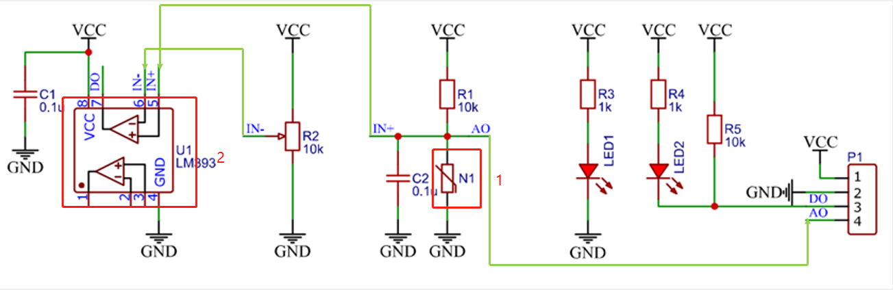

1. 光敏电阻
2. 比较器

光敏传感器内装有一个高精度的光电管， 光电管内有一块由”针式二管”组成的小平板， 当向光电管两端施加一个反向的固定压时， 任何光了对它的冲击都将导致其释放出电子， 结果是， 当光照强度越高， 光电管的电流也就越大， 电流通过一个电阻时， 电阻两端的电压被转换成可被采集器的数模转换器接受的0-5V 电压， 然后采集以适当的形式把结果保存下来。 简单的说，光敏传感器就是利用光敏电阻受光线强度影响而阻值发生变化的原理向机器人主机发送光线强度的模拟信号。

光敏电阻是利用半导体的光电效应制成的一种电阻值随入射光的强弱而改变的电阻器；入射光强，电阻减小，入射光弱，电阻增大。


**硬件电路**

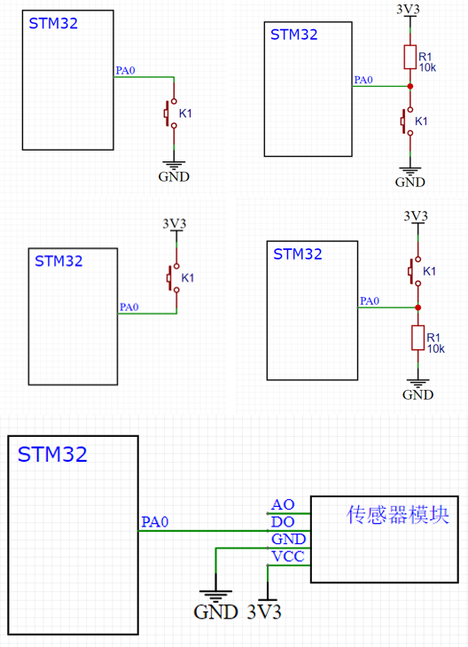

1. 图一：按键接地，必须为上拉输入模式，当按键按下为低电平，松开为高电平
2. 图二：按键接地，可以为浮空输入也可以为上拉输入，当按键按下为低电平，松开为高电平
3. 图三：按键接电源，必须为下拉输入模式，当按键按下为高电平，松开为第电平
4. 图三：按键接电源，可以为浮空输入也可以为下拉输入，当按键按下为高电平，松开为第电平


#### 输入

**GPIO电平输入**

| 函数                                                         | 作用                                            |
| ------------------------------------------------------------ | ----------------------------------------------- |
| uint8_t GPIO_ReadInputDataBit(GPIO_TypeDef* GPIOx, uint16_t GPIO_Pin) | 读取指定端口引脚的输入电平，针对引脚，并返回0/1 |
| uint16_t GPIO_ReadInputData(GPIO_TypeDef* GPIOx)             | 读取指定GPIO端口的输入电平，针对端口            |
| uint8_t GPIO_ReadOutputDataBit(GPIO_TypeDef* GPIOx, uint16_t GPIO_Pin) | 读取指定端口引脚的输出电平，针对引脚，并返回0/1 |
| uint16_t GPIO_ReadOutputDate(GPIO_TypeDef* GPIOx)            | 读取指定GPIO端口的输出电平，针对端口            |

**按键控制LED**


led程序

````c
#include "stm32f10x.h"                  // Device header
void LED_Init(void)
{
	RCC_APB2PeriphClockCmd(RCC_APB2Periph_GPIOA, ENABLE);         //GPIOA端口使能
	
	GPIO_InitTypeDef GPIO_InitStructure;
	GPIO_InitStructure.GPIO_Mode = GPIO_Mode_Out_PP;
	GPIO_InitStructure.GPIO_Pin = GPIO_Pin_1 | GPIO_Pin_2;       //GPIO_Pin_1和GPIO_Pin_2引脚
	GPIO_InitStructure.GPIO_Speed = GPIO_Speed_50MHz;
	GPIO_Init(GPIOA, &GPIO_InitStructure);
	
	GPIO_SetBits(GPIOA, GPIO_Pin_1 | GPIO_Pin_2);                //GPIO_Pin_1和GPIO_Pin_2引脚为1，即灯熄灭
}

void LED1_ON(void)
{
	GPIO_ResetBits(GPIOA, GPIO_Pin_1);                           //点亮GPIO_Pin_1 的LED
}

void LED1_OFF(void)                                              //关闭GPIO_Pin_1 的LED
{
	GPIO_SetBits(GPIOA, GPIO_Pin_1);
}

//转变，当按键按下 亮，松开 灭
void LED1_Turn(void)                                             
{
	if (GPIO_ReadOutputDataBit(GPIOA, GPIO_Pin_1) == 0)          //读取GPIOA端口GPIO_Pin_1引脚的高低电平，进行反转
	{
		GPIO_SetBits(GPIOA, GPIO_Pin_1);
	}
	else
	{
		GPIO_ResetBits(GPIOA, GPIO_Pin_1);
	}
}
void LED2_ON(void)
{
	GPIO_ResetBits(GPIOA, GPIO_Pin_2);
}

void LED2_OFF(void)
{
	GPIO_SetBits(GPIOA, GPIO_Pin_2);
}

void LED2_Turn(void)
{
	if (GPIO_ReadOutputDataBit(GPIOA, GPIO_Pin_2) == 0)
	{
		GPIO_SetBits(GPIOA, GPIO_Pin_2);
	}
	else
	{
		GPIO_ResetBits(GPIOA, GPIO_Pin_2);
	}
}
````

````c
#ifndef __LED_H
#define __LED_H
void LED_Init(void);
void LED1_ON(void);
void LED1_OFF(void);
void LED1_Turn(void);
void LED2_ON(void);
void LED2_OFF(void);
void LED2_Turn(void);
#endif
````

按键程序

````c
#include "stm32f10x.h"                  // Device header
#include "Delay.h"

void Key_Init(void)
{
	RCC_APB2PeriphClockCmd(RCC_APB2Periph_GPIOB, ENABLE);       //使能GPIOB
	
	GPIO_InitTypeDef GPIO_InitStructure;
	GPIO_InitStructure.GPIO_Mode = GPIO_Mode_IPU;               //上拉输入
	GPIO_InitStructure.GPIO_Pin = GPIO_Pin_1 | GPIO_Pin_11;     //引脚GPIO_Pin_1和GPIO_Pin_11
	GPIO_InitStructure.GPIO_Speed = GPIO_Speed_50MHz;           //输入模式下GPIO_Speed没用，随便填写
	GPIO_Init(GPIOB, &GPIO_InitStructure);
}

uint8_t Key_GetNum(void)
{
	uint8_t KeyNum = 0;
	if (GPIO_ReadInputDataBit(GPIOB, GPIO_Pin_1) == 0)
	{
		Delay_ms(20);                                            //消除抖动
		while (GPIO_ReadInputDataBit(GPIOB, GPIO_Pin_1) == 0);
		Delay_ms(20);
		KeyNum = 1;
	}
	if (GPIO_ReadInputDataBit(GPIOB, GPIO_Pin_11) == 0)
	{
		Delay_ms(20);
		while (GPIO_ReadInputDataBit(GPIOB, GPIO_Pin_11) == 0);
		Delay_ms(20);
		KeyNum = 2;
	}
	
	return KeyNum;
}
````

````c
#ifndef __KEY_H
#define __KEY_H

void Key_Init(void);
uint8_t Key_GetNum(void);

#endif
````

主程序

````c
#include "stm32f10x.h"                  // Device header
#include "Delay.h"
#include "LED.h"
#include "Key.h"

uint8_t KeyNum;

int main(void)
{
	LED_Init();
	Key_Init();
	
	while (1)
	{
		KeyNum = Key_GetNum();
		if (KeyNum == 1)
		{
			LED1_Turn();
		}
		if (KeyNum == 2)
		{
			LED2_Turn();
		}
	}
}
````


**光敏传感器控制蜂鸣器**


蜂鸣器程序

````c
#include "stm32f10x.h"                  // Device header

void Buzzer_Init(void)
{
	RCC_APB2PeriphClockCmd(RCC_APB2Periph_GPIOB, ENABLE);
	
	GPIO_InitTypeDef GPIO_InitStructure;
	GPIO_InitStructure.GPIO_Mode = GPIO_Mode_Out_PP;
	GPIO_InitStructure.GPIO_Pin = GPIO_Pin_12;
	GPIO_InitStructure.GPIO_Speed = GPIO_Speed_50MHz;
	GPIO_Init(GPIOB, &GPIO_InitStructure);
	
	GPIO_SetBits(GPIOB, GPIO_Pin_12);
}

void Buzzer_ON(void)
{
	GPIO_ResetBits(GPIOB, GPIO_Pin_12);
}

void Buzzer_OFF(void)
{
	GPIO_SetBits(GPIOB, GPIO_Pin_12);
}

void Buzzer_Turn(void)
{
	if (GPIO_ReadOutputDataBit(GPIOB, GPIO_Pin_12) == 0)
	{
		GPIO_SetBits(GPIOB, GPIO_Pin_12);
	}
	else
	{
		GPIO_ResetBits(GPIOB, GPIO_Pin_12);
	}
}
````

````c
#ifndef __BUZZER_H
#define __BUZZER_H

void Buzzer_Init(void);
void Buzzer_ON(void);
void Buzzer_OFF(void);
void Buzzer_Turn(void);

#endif
````

光敏电阻传感器程序,遮住输出1，否则

````c
#include "stm32f10x.h"                  // Device header

void LightSensor_Init(void)
{
	RCC_APB2PeriphClockCmd(RCC_APB2Periph_GPIOB, ENABLE);
	
	GPIO_InitTypeDef GPIO_InitStructure;
	GPIO_InitStructure.GPIO_Mode = GPIO_Mode_IPU;               //上拉输入
	GPIO_InitStructure.GPIO_Pin = GPIO_Pin_13;
	GPIO_InitStructure.GPIO_Speed = GPIO_Speed_50MHz;
	GPIO_Init(GPIOB, &GPIO_InitStructure);
}

uint8_t LightSensor_Get(void)
{
	return GPIO_ReadInputDataBit(GPIOB, GPIO_Pin_13);           //读取GPIO_Pin_13引脚的光敏电阻
}
````

````c
#ifndef __LIGHT_SENSOR_H
#define __LIGHT_SENSOR_H

void LightSensor_Init(void);
uint8_t LightSensor_Get(void);

#endif
````

主程序

````c
#include "stm32f10x.h"                  // Device header
#include "Delay.h"
#include "Buzzer.h"
#include "LightSensor.h"

int main(void)
{
	Buzzer_Init();
	LightSensor_Init();
	
	while (1)
	{
		if (LightSensor_Get() == 1)
		{
			Buzzer_ON();
		}
		else
		{
			Buzzer_OFF();
		}
	}
}
````


### OLED

使用事先提供好的OLED程序代码,引入到分组中

| **函数**                               | **作用**             |
| -------------------------------------- | -------------------- |
| OLED_Init();                           | 初始化               |
| OLED_Clear();                          | 清屏                 |
| OLED_ShowChar(1, 1, 'A');              | 显示一个字符         |
| OLED_ShowString(1, 3,  "HelloWorld!"); | 显示字符串           |
| OLED_ShowNum(2, 1, 12345, 5);          | 显示十进制数字       |
| OLED_ShowSignedNum(2, 7, -66, 2);      | 显示有符号十进制数字 |
| OLED_ShowHexNum(3, 1, 0xAA55, 4);      | 显示十六进制数字     |
| OLED_ShowBinNum(4, 1, 0xAA55, 16);     | 显示二进制数字       |

其中参数1表示起始行，参数2表示起始行


````c
int main(void)
{	
	OLED_Init();
	while(1){
		OLED_ShowChar(1, 1, 'A');
		OLED_ShowNum(2, 1, 12345, 5);
		
		OLED_ShowString(1, 3, "HelloWorld!");
		Delay_ms(500);
		OLED_ShowString(1, 3, "RAINUPUP!  ");
		Delay_ms(500);
	}
}
````

# 中断系统

## 简介

硬件级别的函数跳转

**中断：**在主程序运行过程中，出现了特定的中断触发条件（中断源），使得CPU暂停当前正在运行的程序，转而去处理中断程序，处理完成后又返回原来被暂停的位置继续运行

**中断优先级：**当有多个中断源同时申请中断时，CPU会根据中断源的轻重缓急进行裁决，优先响应更加紧急的中断源

**中断嵌套：**当一个中断程序正在运行时，又有新的更高优先级的中断源申请中断，CPU再次暂停当前中断程序，转而去处理新的中断程序，处理完成后依次进行返回


**STM32中断**

STM32F103中最多有68个可屏蔽中断通道，包含EXTI、TIM、ADC、USART、SPI、I2C、RTC等多个外设

使用NVIC统一管理中断，每个中断通道都拥有16个可编程的优先等级，可对优先级进行分组，进一步设置**抢占优先级**和**响应优先级**


下图为STM32F10XX产品（小容量、中容量和大容量）的向量表； **灰色标住的是体现在内核水平的（异常），其余的是外设水平的（外部中断）。**


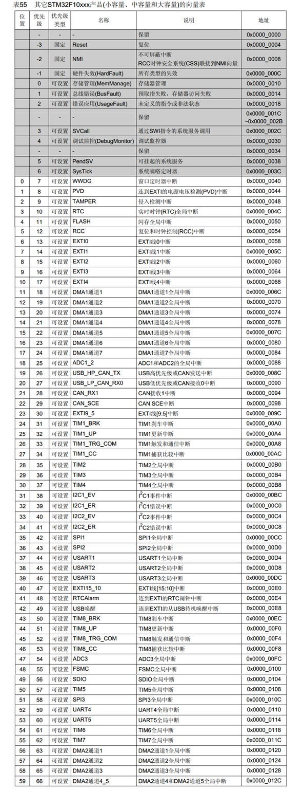

## NVIC

NVIC：嵌套向量中断控制器(Nested Vectored Interrupt Controller)，它属于M3内核的一个外设，控制着芯片的中断相关功能。由于ARM给NVIC预留了非常多的功能，但对于使用M3内核设计芯片的公司可能就不需要这么多功能，于是就需要在NVIC上裁剪。ST公司的STM32F103芯片内部中断数量就是NVIC裁剪后的结果。对于几乎所有的微控制器，中断都是一种常见的特性。中断一般是由硬件(如外设和外部输人引脚)产生的事件，它会引起程序流偏离正常的流程(如给外设提供服务)。

NVIC相当于一个小助手，接收EXTI、TIM、ADC、USART等中断源的信号，它最终会选择一个中断传送给CPU进行处理

**NVIC基本结构**

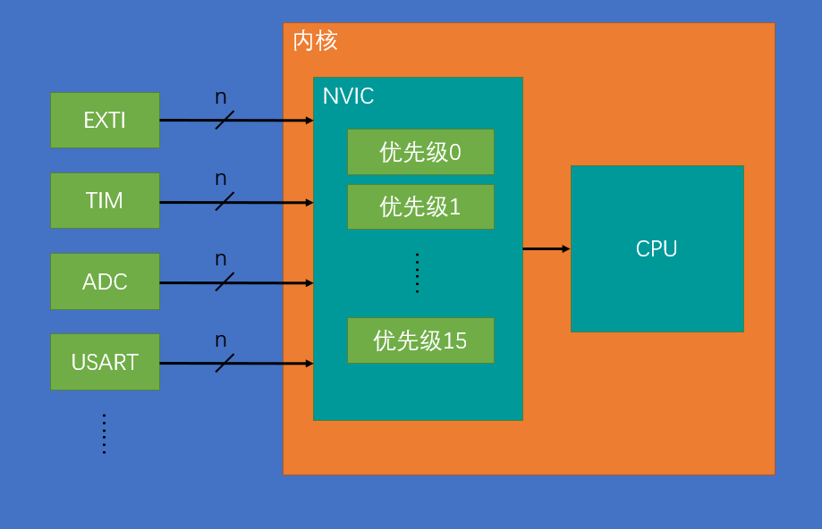


**NVIC优先级分组**

1. STM32F103芯片支持60个可屏蔽中断通道，每个中断通道都具备自己的中断优先级控制字节（8位，但是STM32F103中只使用4位，高4位有效），用于表达优先级的高4位又被分为组成抢占式优先级和响应式优先级，通常也把响应优先级称为“亚优先级”或“副优先级”，每个中断源都需要被指定这两种优先级。
2. NVIC的中断优先级由优先级寄存器的4位（0~15）决定，这4位可以进行切分，分为高n位的抢占优先级和低4-n位的响应优先级；抢占优先级高的可以中断嵌套，响应优先级高的可以优先排队，抢占优先级和响应优先级均相同的按中断号排队

   * 抢占优先级：高抢占式优先级的中断事件会打断当前的主程序或中断程序运行，俗称中断嵌套。
   * 响应优先级: 等待其他中断，在抢占式优先级相同的情况下，高响应优先级的中断优先被响应(响应优先级无法被打断)。
   * 当两个中断源的抢占式优先级相同时，这两个中断将没有嵌套关系，当一个中断到来后，如果正在处理另一个中断，这个后到来的中断就要等待前一个中断处理完之后才能被处理。如果这两个中断同时到达，则中断控制器根据他们的响应优先级高低来决定先处理哪一个；如果他们的抢占式优先级和响应优先级都相等，则根据他们在中断表(上面的向量表)中的排位顺序决定先处理哪一个。
   * 自然优先级：中断向量表中的默认优先级

STM32F103中指定中断优先级的寄存器位有4位，这4位的分组方式如下：（4个优先级描述位可以有5中组合方式）

无论是抢占优先级（主优先级）还是响应优先级（子优先级），优先级数值越小，就代表优先级越高。这一点与FreeRTOS不同

| **分组方式** |    **优先级分组**    | **抢占优先级**  | **响应优先级**  |
| :----------: | :------------------: | :-------------: | :-------------: |
|    分组0     | NVIC_PriorityGroup_0 |  0位，取值为0   | 4位，取值为0~15 |
|    分组1     | NVIC_PriorityGroup_1 | 1位，取值为0~1  | 3位，取值为0~7  |
|    分组2     | NVIC_PriorityGroup_2 | 2位，取值为0~3  | 2位，取值为0~3  |
|    分组3     | NVIC_PriorityGroup_3 | 3位，取值为0~7  | 1位，取值为0~1  |
|    分组4     | NVIC_PriorityGroup_4 | 4位，取值为0~15 |  0位，取值为0   |

**NVIC寄存器**

| NVIC相关寄存器                        | 位数 | 寄存器个数 | 备注                                  |
| ------------------------------------- | ---- | ---------- | ------------------------------------- |
| 中断使能寄存器（ISER）                | 32   | 8          | 每个位控制一个中断                    |
| 中断除能寄存器（ICER）                | 32   | 8          | 每个位控制一个中断                    |
| 应用程序中断及复位控制寄存器（AIRCR） | 32   | 1          | 位[10:8]控制优先级分组                |
| 中断优先级寄存器（IPR）               | 8    | 240        | 8个位对应一个中断，而STM32只使用高4位 |

| **优先级分组** | **AIRCR[10:8]** | **IPRxbit[7:4]分** |         **分配结果**         |
| :------------: | :-------------: | :----------------: | :--------------------------: |
|       0        |       111       |    None ：[7:4]    | 0位抢占优先级，4位响应优先级 |
|       1        |       110       |    [7] ：[6:4]     | 1位抢占优先级，3位响应优先级 |
|       2        |       101       |   [7:6] ：[5:4]    | 2位抢占优先级，2位响应优先级 |
|       3        |       100       |   [7:5]   ：[4]    | 3位抢占优先级，1位响应优先级 |
|       4        |       011       |    [7:4] ：None    | 4位抢占优先级，0位响应优先级 |

## HAL库

定义在stm32f1xx_hal_cortex.c下

````c
/**设置中断优先级分组函数
* NVIC_PRIORITYGROUP_0 
* NVIC_PRIORITYGROUP_1
* NVIC_PRIORITYGROUP_2
* NVIC_PRIORITYGROUP_3
* NVIC_PRIORITYGROUP_4
**/
void HAL_NVIC_SetPriorityGrouping(uint32_t PriorityGroup); 
/**	设置某个中断的抢占/响应优先级
*	参数1：设置中断
*	参数2：抢占优先级
*	参数3：响应优先级
**/
void HAL_NVIC_SetPriority(IRQn_Type IRQn, uint32_t PreemptPriority,uint32_t SubPriority);
/**	使能某个中断
**/
void HAL_NVIC_EnableIRQ(IRQn_Type IRQn);
void HAL_NVIC_disableIRQ(IRQn_Type IRQn);
````

````c
typedef enum{
  //…………
  EXTI0_IRQn                  = 6,      /*!< EXTI Line0 Interrupt                                 */
  TIM5_IRQn                   = 50,     /*!< TIM5 global Interrupt                                */
} IRQn_Type;
````

## 标准库

**NVIC**

NVIC需要的函数被定义在了`misc.c`中

| 函数                                                         | 作用                                                |
| ------------------------------------------------------------ | --------------------------------------------------- |
| void NVIC_PriorityGroupConfig(uint32_t NVIC_PriorityGroup);  | 设置抢断优先级分组，NVIC_PriorityGroup_0……          |
| void NVIC_Init(NVIC_InitTypeDef* NVIC_InitStruct);           | 根据NVIC_InitStruct结构体变量中的参数初始化NVIC外设 |
| void NVIC_SetVectorTable(uint32_t NVIC_VectTab, uint32_t Offset); | 设置向量表的位置和偏移量                            |
| void NVIC_SystemLPConfig(uint8_t LowPowerMode, FunctionalState NewState); | 配置系统进入低功耗模式的条件                        |
| void SysTick_CLKSourceConfig(uint32_t SysTick_CLKSource);    | 配置SysTick时钟源                                   |

**NVIC_InitTypeDef结构体**

````c
typedef struct
{
  //指定要启用或禁用的IRQ通道。该参数是@ref IRQn_Type的值(有关完整的STM32设备IRQ通道列表，请参考stm32f10x.h文件)
  uint8_t NVIC_IRQChannel;                      //指定中断源  
  
  //指定IRQ通道的优先级NVIC_IRQChannel中指定。该参数可以是一个值在0到15之间，如表@ref NVIC_Priority_Table所述   
  //设置抢占优先级，中断优先级分组不同，抢占优先级的位数不同。如NVIC_PriorityGroup_2，则添0~3
  uint8_t NVIC_IRQChannelPreemptionPriority;   
    
  //为指定的IRQ通道指定子优先级在NVIC_IRQChannel。该参数可以是一个值在0到15之间，如表@ref NVIC_Priority_Table所述
  //设置响应优先级，中断优先级分组不同，响应优先级的位数不同。如NVIC_PriorityGroup_2，则添0~3
  //无论是抢占优先级（主优先级）还是响应优先级（子优先级），优先级数值越小，就代表优先级越高。
  uint8_t NVIC_IRQChannelSubPriority;        

  //指定是否在NVIC_IRQChannel中定义的IRQ通道将启用或禁用。可设置为“ENABLE”或“DISABLE”
  FunctionalState NVIC_IRQChannelCmd;           //使能或者失能
} NVIC_InitTypeDef; 
````

NVIC_IRQChannel被定义在了`stm32f10x.h`中，定义了很多STM32F1XX的IRQChannel，我们只需要选择对应的型号

这个就是一个外部中断的入口通道(定时中断、外部中断……)，每个中断对应一个通道，中断发生后查询这个通道值就可以知道是哪个通道发生了中断 

例如：`NVIC_IRQChannel = EXTI15_10_IRQn ` 外部中断10~15号

````c
typedef enum IRQn{
#ifdef STM32F10X_CL
  //…………
  TIM1_UP_IRQn                = 25,     /*!< TIM1 Update Interrupt                                */
  TIM4_IRQn                   = 30,     /*!< TIM4 global Interrupt                                */
  I2C1_EV_IRQn                = 31,     /*!< I2C1 Event Interrupt                                 */
  SPI1_IRQn                   = 35,     /*!< SPI1 global Interrupt                                */
  USART1_IRQn                 = 37,     /*!< USART1 global Interrupt                              */
  EXTI15_10_IRQn              = 40,     /*!< External Line[15:10] Interrupts                      */
  //…………
#endif /* STM32F10X_CL */     
} IRQn_Type;
````

例如

````c
// 整个STM32中只能有一种分组，所以在main程序中定义一次就行。如果在模块函数中定义，那么每个模块函数都只能是一种分组
NVIC_PriorityGroupConfig(NVIC_PriorityGroup_2);            //设置优先级分组为2
NVIC_InitTypeDef NVIC_InitStructure;                       //定义NVIC初始化结构体
NVIC_InitStructure.NVIC_IRQChannel = EXTI15_10_IRQn;       //外部中断EXTI10~15_IRQn
NVIC_InitStructure.NVIC_IRQChannelCmd = ENABLE;            //使能外部中断

//由于使用的NVIC_PriorityGroup_2优先级，取值为0~3；不同优先级取值不同，详细见上表
NVIC_InitStructure.NVIC_IRQChannelPreemptionPriority = 1;  //抢占优先级1
NVIC_InitStructure.NVIC_IRQChannelSubPriority = 1;         //抢占优先级1
NVIC_Init(&NVIC_InitStructure);                            //初始化NVIC
````


# EXTI

## **简介**

1. EXTI（Extern Interrupt）：外部中断
2. EXTI可以监测指定GPIO口的电平信号，当其指定的GPIO口产生电平变化时，EXTI将立即向NVIC发出中断申请，经过NVIC裁决后即可中断CPU主程序，使CPU执行EXTI对应的中断程序
3. EXTI管理了控制器的20个中断/事件线。每个中断/事件线都对应有一个边沿检测器，可以实现输入信号的上升沿检测和下降沿的检测。EXTI可以实现对每个中断/事件线进行单独配置，可以单独配置为中断或者事件，以及触发事件的属性。
4. 支持的触发方式：上升沿/下降沿/双边沿(上下沿)/软件触发
5. 支持的GPIO口：所有GPIO口，但**相同的Pin不能同时触发中断**
6. 通道数：16个GPIO_Pin，外加PVD输出、RTC闹钟、USB唤醒、以太网唤醒；一共20个
7. 触发响应方式：中断响应 / 事件响应（响应事件，触发外部设备等）


**EXTI基本结构**

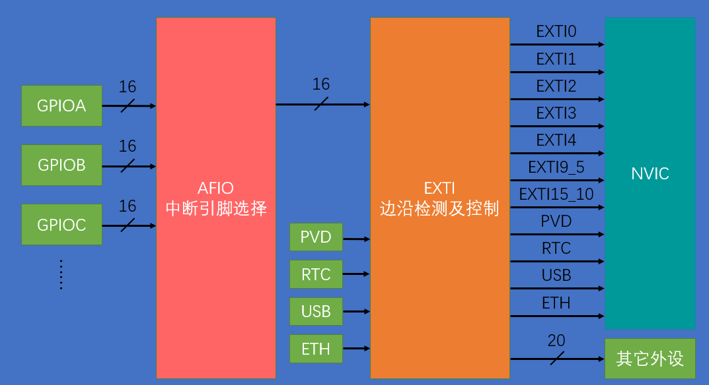


GPIOA/B/C……等中的16个引脚进入AFIO中进行中断引脚选择，AFIO的中的16个接口+PVD/RTC/USB/ETH一共20个进入EXTI，最终通往NVIC或其他外设(事件中断)


## **AFIO复用IO口**

AFIO主要用于引脚复用功能的选择和重定义，在STM32中，AFIO主要完成两个任务：复用功能引脚重映射、中断引脚选择


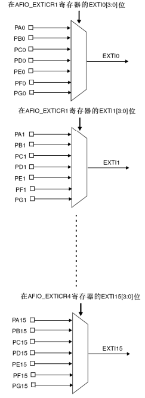

解释：AFIO选择GPIOA/B等端口中的其中一个引脚进行输出；如EXTI0，它会选择PA0~PG0其中一个进行输出；这就是为什么相同的Pin不能同时触发中断

**寄存器**

1. 调试IO配置：AFIO_MAPR[26:24]，配置JTAG/SWD的开关状态
2. 重映射配置：AFIO_MAPR，部分外设IO重映射配置
3. 外部中断配置：AFIO_EXTICR1\~4，配置EXTI中断线0~15对应具体哪个IO口


**特别注意**：配置AFIO寄存器之前要使能AFIO时钟，方法如下：

* HAL库：__HAL_RCC_AFIO_CLK_ENABLE();  
* 标准库：RCC_APB2PeriphClockCmd(RCC_APB2Periph_AFIO, ENABLE); 
* F4/F7/H7系列：__HAL_RCC_SYSCFG_CLK_ENABLE();

## **EXTI框图**

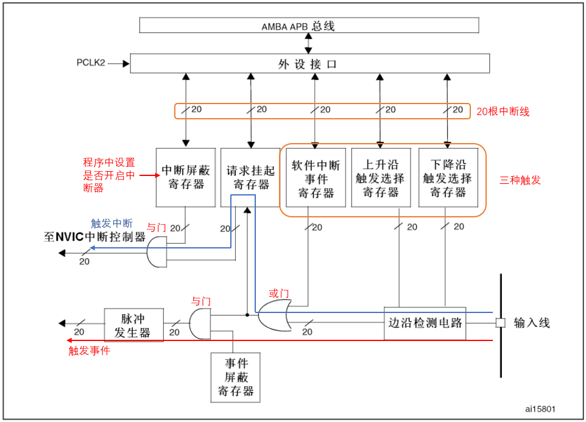

经过GPIO判断后，最终进入输入线


软件中断事件寄存器：可以模拟软件中断，可见他没有连接到输入线

请求挂起寄存器：就是对应中断标记位

* 调用`EXTI_GetITStatus(uint32_t EXTI_Line)`函数，查看该寄存器的对应位是否为1
* 调用`EXTI_ClearITPendingBit(uint32_t )`函数，清除寄存器对应位


其中蓝色线为中断触发，红色线为事件触发。

1. 输入线：EXTI 0-15是连接到GPIO（每一个GPIO端口都有16个引脚），当我们使用EXTI0的时候，控制的是所有端口的第0个引脚。具体是哪个端口，在AFIO_EXTICR1、2、3、4这4个寄存器的EXTIx[3:0]位控制。（x属于0-15）
2. 边沿检测电路：检测上升沿还是下降沿，由上升沿触发选择寄存器(EXTI_RTSR)和下降沿触发选择寄存器(EXTI_FTSR)控制。
3. 或门：收到边沿检测电路传出的信号和软件中断事件寄存器(EXTI_SWIER)控制。软件中断事件寄存器返回1之后，就不受边沿检测电路控制。
4. 在经过或门之后，分为两路：
   - 当中断屏蔽寄存器和请求挂起寄存器相关位都置1的时候就会产生中断，交给NVIC，再交给内核相应。
   - 如果事件屏蔽寄存器相关位置1，就会把这个1信号给脉冲发生器，产生脉冲（脉冲就是高电平）。脉冲：ITM定时器开始计数、触发ADC的采集。【作为触发信号】


EXTI和NVIC不需要开启时钟，EXTI一直是开着的，在寄存器中没有控制他时钟的定义。NVIC是内核外设，不需要开启时钟


## HAL库

**步骤：**

1. 使能GPIO时钟：__HAL_RCC_GPIOx_CLK_ENABLE
2. GPIO/AFIO(SYSCFG)/EXTI：HAL_GPIO_Init，一步到位
3. 设置中断分组：HAL_NVIC_SetPriorityGrouping，此函数仅需设置一次！
4. 设置中断优先级：HAL_NVIC_SetPriority
5. 使能中断：HAL_NVIC_EnableIRQ
6. 设计中断服务函数：EXTIx_IRQHandler，中断服务函数，清中断标志！

**HAL库中断回调处理机制介绍**


中断服务函数：就是产生中断后处理的函数，如EXTI2_IRQHandler

HAL库中断处理公用函数：HAL_GPIO_EXTI_IRQHandler,清除中断标志位

HAL库数据处理回调函数：最终调用此函数，这个函数是弱定义函数，在这个函数中写中断处理

````c
//stm32f1xx_hal_gpio.c
void HAL_GPIO_EXTI_IRQHandler(uint16_t GPIO_Pin){
  /* EXTI line interrupt detected */
  if (__HAL_GPIO_EXTI_GET_IT(GPIO_Pin) != 0x00u){
    __HAL_GPIO_EXTI_CLEAR_IT(GPIO_Pin);             //清除中断
    HAL_GPIO_EXTI_Callback(GPIO_Pin);               //调用回调函数
  }
}
__weak void HAL_GPIO_EXTI_Callback(uint16_t GPIO_Pin)//弱定义
{
}
````

**案例**：中断控制LED

````c
//GPIO_Pin2的中断函数
void EXTI2_IRQHandler (void){
    HAL_GPIO_EXTI_IRQHandler(GPIO_PIN_2);       // 调用HAL库中断处理公用函数，在里面会调用回调函数，并清除中断标志位
    __HAL_GPIO_EXTI_CLEAR_IT(GPIO_PIN_2);
}
void EXTI3_IRQHandler (void){
    HAL_GPIO_EXTI_IRQHandler(GPIO_PIN_3);
    __HAL_GPIO_EXTI_CLEAR_IT(GPIO_PIN_3); 
}
void EXTI4_IRQHandler (void){
    HAL_GPIO_EXTI_IRQHandler(GPIO_PIN_4);
    __HAL_GPIO_EXTI_CLEAR_IT(GPIO_PIN_4);
}
void HAL_GPIO_EXTI_Callback(uint16_t GPIO_Pin){ // 中断回调函数，在这个函数中写中断处理的内容
    delay_ms(20);
    switch(GPIO_Pin){
        case GPIO_PIN_2:
            if(HAL_GPIO_ReadPin(GPIOE,GPIO_PIN_2) == 0){
                LED0_TOGGLE();
                LED1_TOGGLE();
            }
            break;
        case GPIO_PIN_3:
            if(HAL_GPIO_ReadPin(GPIOE,GPIO_PIN_3) == 0){
                LED0_TOGGLE();
            }
            break;
        case GPIO_PIN_4:
            if(HAL_GPIO_ReadPin(GPIOE,GPIO_PIN_4) == 0){
                LED1_TOGGLE();
            }
            break;
        default:break;
    }
}
void EXTI_Init(void){ 
    GPIO_InitTypeDef GPIO_InitStructure;
    __HAL_RCC_GPIOE_CLK_ENABLE();                                // 使能GPIOE
    
    GPIO_InitStructure.Mode = GPIO_MODE_IT_FALLING;              // 下降沿触发中断
    GPIO_InitStructure.Pin = GPIO_PIN_2 | GPIO_PIN_3 |GPIO_PIN_4;
    GPIO_InitStructure.Pull = GPIO_PULLUP;                       // 默认为上拉输入
    GPIO_InitStructure.Speed = GPIO_SPEED_FREQ_HIGH;
    
    HAL_GPIO_Init(GPIOE,&GPIO_InitStructure);                    // 使用GPIO一步定义GPIO/AFIO/EXTI
    
    //设置NVIC
    HAL_NVIC_SetPriorityGrouping(NVIC_PRIORITYGROUP_2);
    HAL_NVIC_SetPriority(EXTI2_IRQn,2,2);
    HAL_NVIC_SetPriority(EXTI3_IRQn,2,2);
    HAL_NVIC_SetPriority(EXTI4_IRQn,2,2);
    HAL_NVIC_EnableIRQ(EXTI2_IRQn);
    HAL_NVIC_EnableIRQ(EXTI3_IRQn);
    HAL_NVIC_EnableIRQ(EXTI4_IRQn);
}
int main(void){
    //……
    LED_init();                             /* 初始化LED */
    EXTI_Init();
   
    while(1)
    {
    }
}
````


## 标准库

### 函数

| 函数                                                         | 作用                                                     |
| ------------------------------------------------------------ | -------------------------------------------------------- |
| void GPIO_EXTILineConfig(uint8_t GPIO_PortSource, uint8_t GPIO_PinSource) | 配置AFIO的数据选择器，选择某个GPIO端口，选择一个中断线路 |

| 函数                                                    | 作用                                                         |
| ------------------------------------------------------- | ------------------------------------------------------------ |
| void EXTI_DeInit(void)                                  | 将EXTI外设寄存器重置为默认值                                 |
| void EXTI_Init(EXTI_InitTypeDef* EXTI_InitStruct)       | 根据EXTI_InitStruct结构体中所配置的参数来初始化EXTI外设      |
| void EXTI_StructInit(EXTI_InitTypeDef* EXTI_InitStruct) | 将EXTI_InitStruct结构体中各成员按默认值填充                  |
| void EXTI_GenerateSWInterrupt(uint32_t EXTI_Line)       | 产生一个软件中断                                             |
| FlagStatus EXTI_GetFlagStatus(uint32_t EXTI_Line)       | 获取普通标志位,检查指定的标志是否被置位                      |
| void EXTI_ClearFlag(uint32_t EXTI_Line)                 | 清除普通标志位                                               |
| ITStatus EXTI_GetITStatus(uint32_t EXTI_Line)           | 获取中断标志位,检查指定的中断标志是否被置位；返回值SET/RESET |
| void EXTI_ClearITPendingBit(uint32_t )                  | 清除中断标志位                                               |


**EXTI_InitTypeDef结构体**

````c
typedef struct
{
  //指定要启用或禁用的EXTI行。用于设置外部线路,如使用外部中断14，则取值EXTI_Line14
  uint32_t EXTI_Line;                
  
  //指定EXTI行模式。
  //取值：  EXTI_Mode_Interrupt 外部中断
  //       EXTI_Mode_Event     事件中断
  EXTIMode_TypeDef EXTI_Mode;    
    
  //为EXTI行指定触发信号活动边缘。
  //取值：EXTI_Trigger_Rising          设置上升沿为中断请求
  //     EXTI_Trigger_Falling         设置上升沿为中断请求
  //     EXTI_Trigger_Rising_Falling  设置上升/下降沿都能触发中断请求
  EXTITrigger_TypeDef EXTI_Trigger; 
    
  //指定所选EXTI行的新状态。可设置为“ENABLE”或“DISABLE”
  FunctionalState EXTI_LineCmd;
}EXTI_InitTypeDef;
````

初始化一个EXTI

````c
GPIO_EXTILineConfig(GPIO_PortSourceGPIOB, GPIO_PinSource14);   //APIO设置，使用GPIOB，14号引脚作为中断源触发

EXTI_InitTypeDef EXTI_InitStructure;                      //定义一个EXTI结构体	
EXTI_InitStructure.EXTI_Line = EXTI_Line14;               //使用外部中断线14 
EXTI_InitStructure.EXTI_LineCmd = ENABLE;                 //使能线路
EXTI_InitStructure.EXTI_Mode = EXTI_Mode_Interrupt;       //中断请求模式
EXTI_InitStructure.EXTI_Trigger = EXTI_Trigger_Falling;   //下降沿触发
EXTI_Init(&EXTI_InitStructure);                           //使用结构体初始化EXTI
````


每次中断程序结束后，都应该清除一下中断标志位,因为如果不清除中断标志位，那么这个中断会一直申请中断;使用`EXTI_ClearFlag(EXTI_Line) / EXTI_ClearITPendingBit(EXTI_Line）`


中断程序的名字都是固定的，参考`startup_stm32f10x_md.s`的100行左右（这个文件不是固定的，不同的型号对应不同的文件，参考上方笔记）

例如使用10~15号中断，则中断程序名为`EXTI15_10_IRQHandler`

| 中断      | 对应函数             |
| --------- | -------------------- |
| EXTI0     | EXTI0_IROHandler     |
| EXTI1     | EXTI1_IROHandler     |
| EXTI2     | EXTI2_IROHandler     |
| EXTI3     | EXTI3_IROHandler     |
| EXTI4     | EXTI4_IROHandler     |
| EXTI9_5   | EXTI9_5_IROHandler   |
| EXTI15_10 | EXTI15_10_IRQHandler |

### 程序演示

注意：在中断程序中不要操作外部设备，可能会照成错误(例如：在中断程序中操作OLED，那么OLED会出现错误)

步骤：

1. RCC开启时钟
2. 配置GPIO
3. 配置AFIO
4. 配置EXTI
5. 配置NVIC


````c
#include "stm32f10x.h"                  // Device header

uint16_t CountSensor_Count;

void CountSensor_Init(void)
{
	RCC_APB2PeriphClockCmd(RCC_APB2Periph_GPIOB, ENABLE); 
	RCC_APB2PeriphClockCmd(RCC_APB2Periph_AFIO, ENABLE);              //使能AFIO的时钟
	
	GPIO_InitTypeDef GPIO_InitStructure;
	GPIO_InitStructure.GPIO_Mode = GPIO_Mode_IPU;
	GPIO_InitStructure.GPIO_Pin = GPIO_Pin_14;
	GPIO_InitStructure.GPIO_Speed = GPIO_Speed_50MHz;
	GPIO_Init(GPIOB, &GPIO_InitStructure);
	
	GPIO_EXTILineConfig(GPIO_PortSourceGPIOB, GPIO_PinSource14);      //配置AFIO的数据选择器，选择GPIOB端口，选择14号引脚作为中断线路
	 
	EXTI_InitTypeDef EXTI_InitStructure;                              //EXTI初始化结构体
	EXTI_InitStructure.EXTI_Line = EXTI_Line14;                       //使用Line14作为中断线路
	EXTI_InitStructure.EXTI_LineCmd = ENABLE;                         //使能EXTI
	EXTI_InitStructure.EXTI_Mode = EXTI_Mode_Interrupt;               //使用中断模式
	EXTI_InitStructure.EXTI_Trigger = EXTI_Trigger_Falling;           //使用下降沿触发
	EXTI_Init(&EXTI_InitStructure);                                   //初始化EXTI
	
	NVIC_PriorityGroupConfig(NVIC_PriorityGroup_2);                   //选择NVIC的优先级
	 
	NVIC_InitTypeDef NVIC_InitStructure;                              //NVIC初始化结构体
	NVIC_InitStructure.NVIC_IRQChannel = EXTI15_10_IRQn;              //10~15外部中断
	NVIC_InitStructure.NVIC_IRQChannelCmd = ENABLE;                   //使能NVIC
	NVIC_InitStructure.NVIC_IRQChannelPreemptionPriority = 1;         //抢占优先级，我们设置的是NVIC_PriorityGroup_2优先级，抢占优先级为0~3
	NVIC_InitStructure.NVIC_IRQChannelSubPriority = 1;                //中断优先级，我们设置的是NVIC_PriorityGroup_2优先级，中断优先级为0~3
	NVIC_Init(&NVIC_InitStructure);                                   //初始化EXTI
}

uint16_t CountSensor_Get(void)
{
	return CountSensor_Count;
}

void EXTI15_10_IRQHandler(void)                                        //中断函数，此函数名固定
{
	if (EXTI_GetITStatus(EXTI_Line14) == SET)                          //获得外部中断标记
	{
		/*如果出现数据乱跳的现象，可再次判断引脚电平，以避免抖动*/
		if (GPIO_ReadInputDataBit(GPIOB, GPIO_Pin_14) == 0)
		{
			CountSensor_Count ++;
		}
		EXTI_ClearITPendingBit(EXTI_Line14);                            //清除外部中断标记，否则会持续发起中断
	}
}
````

````c
#include "stm32f10x.h"                  // Device header
#include "Delay.h"
#include "OLED.h"
#include "CountSensor.h"

int main(void)
{
	OLED_Init();
	CountSensor_Init();
	
	OLED_ShowString(1, 1, "Count:");
	
	while (1)
	{
		OLED_ShowNum(1, 7, CountSensor_Get(), 5);
	}
}
````


# 定时中断

**STM32定时器分类**

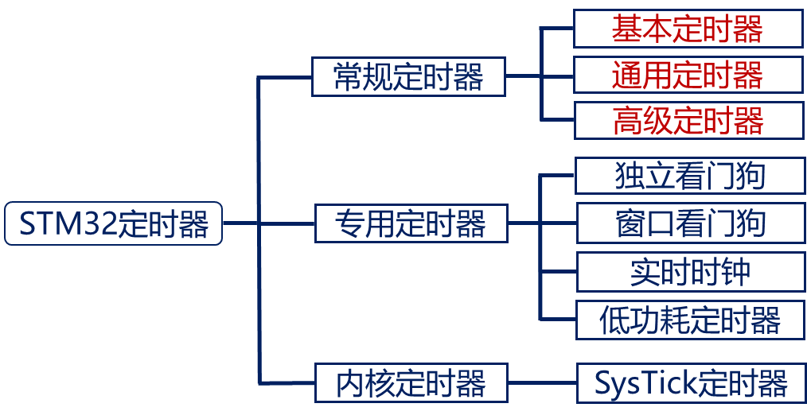

## 简介

1. TIM（Timer）定时器

2. 定时器可以对输入的时钟进行计数，并在计数值达到设定值时触发中断

3. 16位计数器、预分频器、自动重装寄存器的时基单元，在72MHz计数时钟下可以实现最大59.65s的定时

4. 不仅具备基本的定时中断功能，而且还包含内外时钟源选择、输入捕获、输出比较、编码器接口、主从触发模式等多种功能

5. 根据复杂度和应用场景分为了**高级定时器**、**通用定时器**、**基本定时器**三种类型


|  **类型**  |        **编号**        | **总线** | **计数模式**         |                           **功能**                           |
| :--------: | :--------------------: | :------: | -------------------- | :----------------------------------------------------------: |
| 高级定时器 |       TIM1、TIM8       |   APB2   | 递增、递减、中央对齐 | 拥有通用定时器全部功能，并额外具有重复计数器、死区生成、互补输出、刹车输入等功能 |
| 通用定时器 | TIM2、TIM3、TIM4、TIM5 |   APB1   | 递增、递减、中央对齐 | 拥有基本定时器全部功能，并额外具有内外时钟源选择、输入捕获、输出比较、编码器接口、主从触发模式等功能(DAC/ADC) |
| 基本定时器 |       TIM6、TIM7       |   APB1   | 递增                 |  拥有定时中断、主模式触发DAC的功能、常用作时基，即定时功能   |

**基本定时器**


**通用定时器**

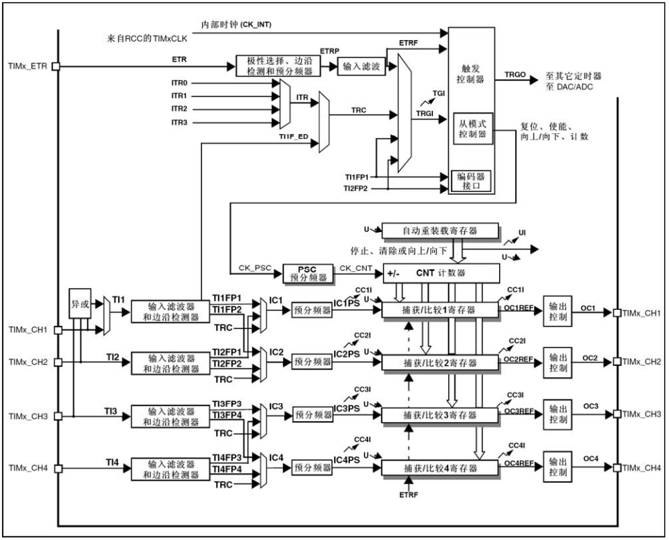

STM32的众多定时器中我们使用最多的是高级定时器和通用定时器，而高级定时器一般也是用作通用定时器的功能，下面我们就以通用定时器为例进行讲解，其功能和特点包括：

1. 位于低速的APB1总线上(APB1)

2. 16 位向上、向下、向上/向下(中心对齐)计数模式，自动装载计数器（TIMx_CNT）。

3. 16 位可编程(可以实时修改)预分频器(TIMx_PSC)，计数器时钟频率的分频系数 为 1～65535 之间的任意数值。

4. 4 个独立通道（TIMx_CH1~4），这些通道可以用来作为： 
   
   1. 输入捕获 
   2. 输出比较
   3. PWM 生成(边缘或中间对齐模式) 
   4. 单脉冲模式输出 
   
5. 可使用外部信号（TIMx_ETR）控制定时器和定时器互连（可以用 1 个定时器控制另外一个定时器）的同步电路。

6. 如下事件发生时产生中断/DMA（6个独立的IRQ/DMA请求生成器）： 
   1. 更新：计数器向上溢出/向下溢出，计数器初始化(通过软件或者内部/外部触发) 
   2. 触发事件(计数器启动、停止、初始化或者由内部/外部触发计数) 
   3. 输入捕获 
   4. 输出比较 
   5. 支持针对定位的增量(正交)编GGGGGG码器和霍尔传感器电路 
   6. 触发输入作为外部时钟或者按周期的电流管理

7. STM32 的通用定时器可以被用于：测量输入信号的脉冲长度(输入捕获)或者产生输出波形(输出比较和 PWM)等。   

8. 使用定时器预分频器和 RCC 时钟控制器预分频器，脉冲长度和波形周期可以在几个微秒到几个毫秒间调整。STM32 的每个通用定时器都是完全独立的，没有互相共享的任何资源。

   

**高级定时器**


### **计数器模式**

通用定时器可以向上计数、向下计数、向上向下双向计数模式。

1. 向上计数模式：计数器从0计数到自动加载值(TIMx_ARR)，然后重新从0开始计数并且产生一个计数器溢出事件。
2. 向下计数模式：计数器从自动装入的值(TIMx_ARR)开始向下计数到0，然后从自动装入的值重新开始，并产生一个计数器向下溢出事件。
3. 中央对齐模式（向上/向下计数）：计数器从0开始计数到自动装入的值-1，产生一个计数器溢出事件，然后向下计数到1并且产生一个计数器溢出事件；然后再从0开始重新计数。


### 工作原理


主要分为四大部分：时钟产生器部分，时基单元部分，输入捕获部分、输出比较部分。

**时钟产生器部分**

STM32定时器有四种时钟源选择，分别是：

1. 内部时钟(CK_INT)
2. 外部时钟模式：外部触发输入(ETR)
3. 内部触发输入(ITRx)：使用一个定时器作为另一个定时器的预分频器，如可以配置一个定时器Timer1而作为另一个定时器Timer2的预分频器。
4. 外部时钟模式：外部输入脚(TIx)
   

**时基单元部分**

包括三个寄存器：计数器寄存器（TIMx_CNT)、预分频器寄存器（TIMx_PSC)、自动装载寄存器（TIMx_ARR)。

1. 计数器寄存器（TIMx_CNT)：向上计数、向下计数或者中心对齐计数；
2. 预分频器寄存器（TIMx_PSC)：可将时钟频率按1到65535之间的任意值进行分频，可在运行时改变其设置值；
3. 自动装载寄存器（TIMx_ARR)：如果TIMx_CR1寄存器中的ARPE位为0，ARR寄存器的内容将直接写入影子寄存器；如果ARPE为1，ARR寄存器的那日同将在每次的更新时间UEV发生时，传送到影子寄存器；

如果TIM1_CR1中的UDIS位为0，当计数器产生溢出条件时，产生更新事件。

**输入捕获部分**

1. IC1、2和IC3、4可以分别通过软件设置将其映射到TI1、TI2和TI3、TI4;
2. 4个16位捕捉比较寄存器可以编程用于存放检测到对应的每一次输入捕捉时计数器的值;
3. 当产生一次捕捉，相应的CCxIF标志位被置1;同时如果中断或DMA请求使能，则产生中断或DMA请求。
4. 如果当CCxIF标志位已经为1，当又产生一个捕捉，则捕捉溢出标志位CCxOF将被置1。
   

**输出比较部分**

1. PWM模式运行产生:

   1. 定时器2、3和4可以产生4独立的信号

   2. 频率和占空比可以进行如下设定:

      1. 一个自动重载寄存器用于设定PWM的周期;

      2. 每个PWM通道有一个捕捉比较寄存器用于设定占空时间。

         例如:产生一个40KHz的PWM信号:在定时器2的时钟为72MHz下，占空比为50% :

         预分频寄存器设置为0 (计数器的时钟为TIM1CLK/(O+1))，自动重载寄存器设为1799，CCRx寄存器设为899。

2. 两种可设置PWM模式:
   1. 边沿对齐模式
   2. 中心对齐模式

### 定时中断基本结构

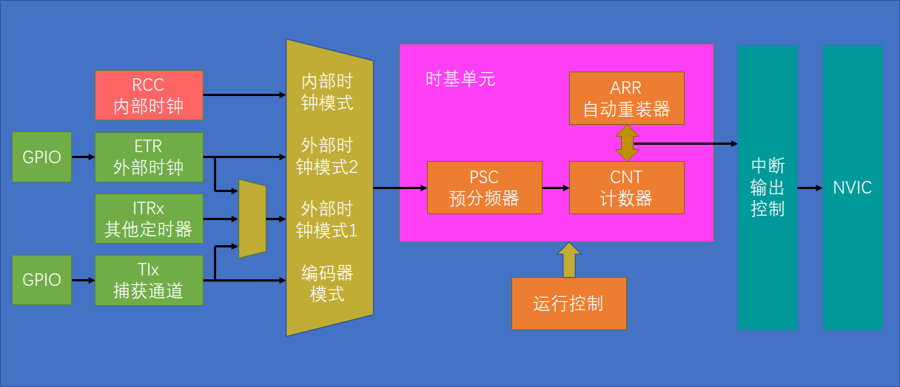


### 时序

**预分频器时序**：以预分频从1变为2为例，本来一个振荡计数器加1，变为两个振荡计数器加1

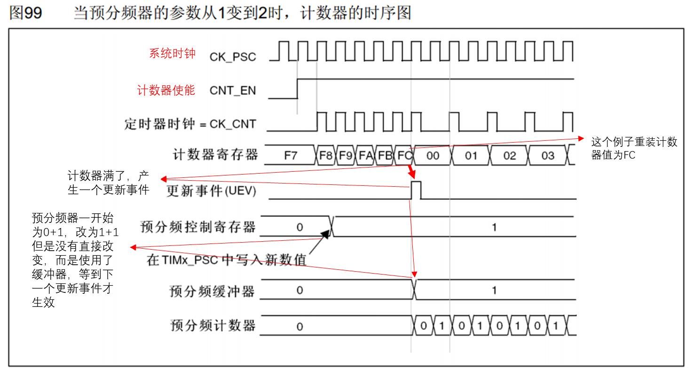

* **计数器计数频率**：CK_CNT = CK_PSC / (PSC + 1)   计数器频率 = 时钟 / (预分频 + 1)
  * 以时钟频率为72Mhz，预分频为7199为例，计数器频率为1s计数10000次

**计数器时序**

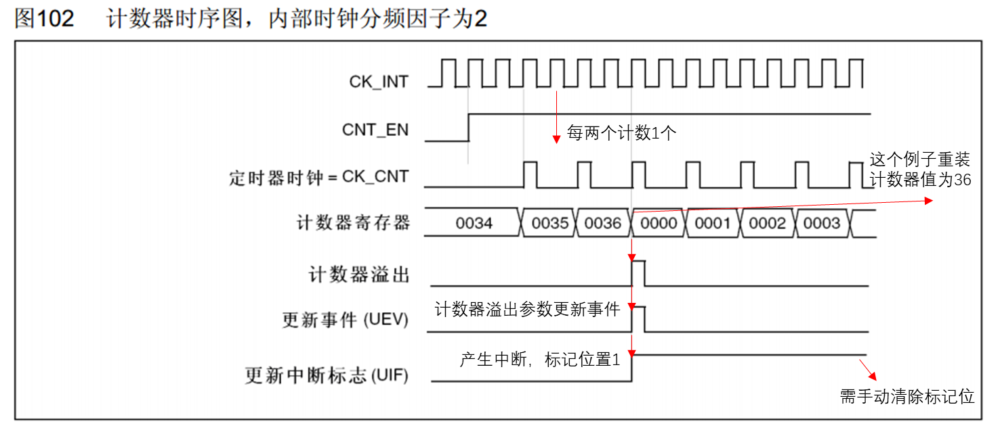

* **计数器溢出频率**：CK_CNT_OV = CK_CNT / (ARR + 1) = CK_PSC / (PSC + 1) / (ARR + 1)  计数器溢出 = 时钟 / (预分频 + 1) / (自动重装值 + 1)
  * 以时钟频率为72Mhz，预分频为7199为例，计数器频率为9999次，每秒溢出一次，即产生一个更新中断


**计数器无预装时序**

更改计数器自动重装值立即生效


**计数器有预装时序**

更改自动重装值，先写入影子寄存器，等到下一个计数器溢出，自动重装值才生效


## 基本定时器

### HAL库

基本定时器

#### **配置步骤**

1. 配置定时器基础工作参数：HAL_TIM_Base_Init()
2. 定时器基础MSP初始化：HAL_TIM_Base_MspInit()   配置NVIC、CLOCK等
3. 使能更新中断并启动计数器：HAL_TIM_Base_Start_IT()
4. 设置优先级，使能中断：HAL_NVIC_SetPriority()、 HAL_NVIC_EnableIRQ()
5. 编写中断服务函数：TIMx_IRQHandler()等  --> HAL_TIM_IRQHandler()
6. 编写定时器更新中断回调函数：HAL_TIM_PeriodElapsedCallback()

|              函数               |  主要寄存器   |               主要功能               |
| :-----------------------------: | :-----------: | :----------------------------------: |
|       HAL_TIM_Base_Init()       | CR1、ARR、PSC |         初始化定时器基础参数         |
|     HAL_TIM_Base_MspInit()      |      无       |   存放NVIC、CLOCK、GPIO初始化代码    |
|     HAL_TIM_Base_Start_IT()     |   DIER、CR1   |       使能更新中断并启动计数器       |
|      HAL_TIM_IRQHandler()       |      SR       | 定时器中断处理公用函数，处理各种中断 |
| HAL_TIM_PeriodElapsedCallback() |      无       | 定时器更新中断回调函数，由用户重定义 |

````c
/* 定时器溢出中断中断回调函数 */
void HAL_TIM_PeriodElapsedCallback(TIM_HandleTypeDef *htim);
/* 使能TIM */    
__HAL_RCC_TIMX_CLK_ENABLE();

/* 软件产生中断，参数1：TIM句柄，参数2：中断类型 */
HAL_StatusTypeDef HAL_TIM_GenerateEvent(TIM_HandleTypeDef *htim, uint32_t EventSource)
````


**句柄结构体**：基本定时器、通用定时器、高级定时器都是使用的同一个句柄结构体

````c
typedef struct { 
    TIM_TypeDef *Instance;         /* 外设寄存器基地址 */ 
    TIM_Base_InitTypeDef Init;     /* 定时器初始化结构体 */
   HAL_TIM_ActiveChannel Channel;  /* 外设的哪个通道 */
     ...
}TIM_HandleTypeDef;
typedef struct { 
    uint32_t Prescaler;            /* 预分频系数 */ 
    uint32_t CounterMode;          /* 计数模式 */ 
    uint32_t Period;               /* 自动重载值 ARR */ 
    uint32_t ClockDivision;        /* 时钟分频因子，高级定时器 */ 
    uint32_t RepetitionCounter;    /* 重复计数器寄存器的值，高级定时器 */ 
    uint32_t AutoReloadPreload;    /* 自动重载预装载使能，高级定时器 */
} TIM_Base_InitTypeDef;
//CounterMode参数
#define TIM_COUNTERMODE_UP                 0x00000000U    /* 向上计数  */
#define TIM_COUNTERMODE_DOWN               TIM_CR1_DIR    /* 向下计数  */                       
#define TIM_COUNTERMODE_CENTERALIGNED1     TIM_CR1_CMS_0  /* 中间计数  */                      
#define TIM_COUNTERMODE_CENTERALIGNED2     TIM_CR1_CMS_1                        
#define TIM_COUNTERMODE_CENTERALIGNED3     TIM_CR1_CMS                         
````

#### 案例

使用定时器6，实现500ms定时器更新中断，在中断里翻转LED0

````c
TIM_HandleTypeDef g_timx_handle;

/* 定时器中断初始化函数 */
void btim_timx_int_init(uint16_t arr, uint16_t psc){
    g_timx_handle.Instance = TIM6;
    g_timx_handle.Init.Prescaler = psc;           // 预分频
    g_timx_handle.Init.Period = arr;              // 自动重装
    HAL_TIM_Base_Init(&g_timx_handle);

    HAL_TIM_Base_Start_IT(&g_timx_handle);        // 开启更新中断，内部自动调用__HAL_TIM_ENABLE_IT(htim, TIM_IT_UPDATE);
}
/* 定时器基础MSP初始化函数 */
void HAL_TIM_Base_MspInit(TIM_HandleTypeDef *htim){
    if (htim->Instance == TIM6){
        __HAL_RCC_TIM6_CLK_ENABLE();              // 使能TIM6
        HAL_NVIC_SetPriority(TIM6_IRQn, 1, 3);
        HAL_NVIC_EnableIRQ(TIM6_IRQn);
    }
}
/* 定时器6中断服务函数 */
void TIM6_IRQHandler(void){
    HAL_TIM_IRQHandler(&g_timx_handle);
}

/* 定时器溢出中断中断回调函数 */
void HAL_TIM_PeriodElapsedCallback(TIM_HandleTypeDef *htim){
    if (htim->Instance == TIM6){
        LED0_TOGGLE();
    }
}
int main(void){
    HAL_Init();                                 /* 初始化HAL库 */
    sys_stm32_clock_init(RCC_PLL_MUL9);         /* 设置时钟,72M */
    delay_init(72);                             /* 初始化延时函数 */
    led_init();                                 /* 初始化LED */
    btim_timx_int_init(5000 - 1, 7200 - 1);     /* 10Khz的计数频率，计数5K次为500ms */
    
    while(1){
        delay_ms(500);
    }
}
````


### 标准库

#### **常用函数**

````c
void RCC_APB1PeriphClockCmd(uint32_t RCC_APB1Periph, FunctionalState NewState);   //使用APB1使能Timer
````

````c
// 初始化
void TIM_TimeBaseInit(TIM_TypeDef* TIMx, TIM_TimeBaseInitTypeDef* TIM_TimeBaseInitStruct);  //初始化时基单元
void TIM_TimeBaseStructInit(TIM_TimeBaseInitTypeDef* TIM_TimeBaseInitStruct); //配置时基单元为默认配置 
void TIM_Cmd(TIM_TypeDef* TIMx, FunctionalState NewState);                    //使能计数器 
void TIM_ITConfig(TIM_TypeDef* TIMx, uint16_t TIM_IT, FunctionalState NewState); //使能中断输出信号 

//下面6个为定时器时钟选择信号，通用定时器以上才拥有
void TIM_InternalClockConfig(TIM_TypeDef* TIMx);  //选择内部时钟
void TIM_ITRxExternalClockConfig(TIM_TypeDef* TIMx, uint16_t TIM_InputTriggerSource);  //选择ITR其他定时器的时钟
void TIM_TIxExternalClockConfig(TIM_TypeDef* TIMx, uint16_t TIM_TIxExternalCLKSource,  //选择TIX捕获通道时钟
                                uint16_t TIM_ICPolarity, uint16_t ICFilter);
void TIM_ETRClockMode1Config(TIM_TypeDef* TIMx, uint16_t TIM_ExtTRGPrescaler, uint16_t TIM_ExtTRGPolarity,
                             uint16_t ExtTRGFilter);  //选择ETR外部时钟模式1输入的时钟
void TIM_ETRClockMode2Config(TIM_TypeDef* TIMx, uint16_t TIM_ExtTRGPrescaler, 
                             uint16_t TIM_ExtTRGPolarity, uint16_t ExtTRGFilter);  //选择ETR外部时钟模式2输入的时钟
void TIM_ETRConfig(TIM_TypeDef* TIMx, uint16_t TIM_ExtTRGPrescaler, uint16_t TIM_ExtTRGPolarity,
                   uint16_t ExtTRGFilter); // 单独配置ETR时钟的相关配置


//下面几个函数为单独配置某一参数（避免了为了修改某一参数而重新初始化）
void TIM_PrescalerConfig(TIM_TypeDef* TIMx, uint16_t Prescaler, uint16_t TIM_PSCReloadMode);  //单独配置预分频值的
void TIM_CounterModeConfig(TIM_TypeDef* TIMx, uint16_t TIM_CounterMode); //改变计数器的计数模式 
void TIM_ARRPreloadConfig(TIM_TypeDef* TIMx, FunctionalState NewState); //自动重装器预装功能配置 
void TIM_SetCounter(TIM_TypeDef* TIMx, uint16_t Counter);       //给计数器写入值 
void TIM_SetAutoreload(TIM_TypeDef* TIMx, uint16_t Autoreload); //给自动重装器写入值 

//下面两个函数获取计数器和预分频值
uint16_t TIM_GetCounter(TIM_TypeDef* TIMx);  //获取当前计数器的值
uint16_t TIM_GetPrescaler(TIM_TypeDef* TIMx); // 获取当前预分频的值

//下面4个为获取标志位和清除标志位的函数
FlagStatus TIM_GetFlagStatus(TIM_TypeDef* TIMx, uint16_t TIM_FLAG);
void TIM_ClearFlag(TIM_TypeDef* TIMx, uint16_t TIM_FLAG);
ITStatus TIM_GetITStatus(TIM_TypeDef* TIMx, uint16_t TIM_IT);
void TIM_ClearITPendingBit(TIM_TypeDef* TIMx, uint16_t TIM_IT);
````

**时基单元结构体**

````c
void TIM_TimeBaseInit(TIM_TypeDef* TIMx, TIM_TimeBaseInitTypeDef* TIM_TimeBaseInitStruct);//定时器参数初始化
typedef struct
{
  uint16_t TIM_CounterMode;      //计数模式  
  uint16_t TIM_Prescaler;        //预分频系数的设置  0x0000 and 0xFFFF；如分频为2，则来两次脉冲才计数1次
  uint16_t TIM_Period;           //自动装载值  0x0000 and 0xFFFF
  uint16_t TIM_ClockDivision;    //输入捕获会用到,也是分频，但不是对时基单元分频，滤波用到
  uint8_t TIM_RepetitionCounter; //重复计数器，高级定时器会用到;直接给0
} TIM_TimeBaseInitTypeDef; 
````

````c
// TIM_CounterMode
#define TIM_CounterMode_Up                 ((uint16_t)0x0000)   // 向上计数
#define TIM_CounterMode_Down               ((uint16_t)0x0010)   // 向下计数
#define TIM_CounterMode_CenterAligned1     ((uint16_t)0x0020)   // 中间计数
#define TIM_CounterMode_CenterAligned2     ((uint16_t)0x0040)
#define TIM_CounterMode_CenterAligned3     ((uint16_t)0x0060)
//TIM_ClockDivision 输入捕获会用到,也是分频，但不是对时基单元分频，滤波用到
#define TIM_CKD_DIV1                       ((uint16_t)0x0000)
#define TIM_CKD_DIV2                       ((uint16_t)0x0100)
#define TIM_CKD_DIV4                       ((uint16_t)0x0200)
````

**选择中断**

````c
/**
  *	  参数2
  *   This parameter can be any combination of the following values:
  *     @arg TIM_IT_Update: TIM update Interrupt source          // 更新中断，计数器每溢出一次更新一次
  *     @arg TIM_IT_CC1: TIM Capture Compare 1 Interrupt source  // 输入捕获中断，当CNT的值转运到CCR一次，产生一次
  *     @arg TIM_IT_CC2: TIM Capture Compare 2 Interrupt source
  *     @arg TIM_IT_CC3: TIM Capture Compare 3 Interrupt source
  *     @arg TIM_IT_CC4: TIM Capture Compare 4 Interrupt source
  *     @arg TIM_IT_COM: TIM Commutation Interrupt source
  *     @arg TIM_IT_Trigger: TIM Trigger Interrupt source
  *     @arg TIM_IT_Break: TIM Break Interrupt source
  */
void TIM_ITConfig(TIM_TypeDef* TIMx, uint16_t TIM_IT, FunctionalState NewState);
````

**选择时钟**

````c
void TIM_InternalClockConfig(TIM_TypeDef* TIMx);  //选择内部时钟
// 选择外部时钟模式2
/**
  * 参数2：设置外部时钟预分频
  * @param  TIM_ExtTRGPrescaler: The external Trigger Prescaler.
  *   This parameter can be one of the following values:
  *     @arg TIM_ExtTRGPSC_OFF: ETRP Prescaler OFF.           // 不分频
  *     @arg TIM_ExtTRGPSC_DIV2: ETRP frequency divided by 2.
  *     @arg TIM_ExtTRGPSC_DIV4: ETRP frequency divided by 4.
  *     @arg TIM_ExtTRGPSC_DIV8: ETRP frequency divided by 8.
  * 参数3：选择极性
  * @param  TIM_ExtTRGPolarity: The external Trigger Polarity.
  *   This parameter can be one of the following values:
  *     @arg TIM_ExtTRGPolarity_Inverted: active low or falling edge active.  极性反转
  *     @arg TIM_ExtTRGPolarity_NonInverted: active high or rising edge active. 极性不反转
  * 参数4：外部时钟滤波
  * @param  ExtTRGFilter: External Trigger Filter.
  *   This parameter must be a value between 0x00 and 0x0F
  * @retval None
  */
void TIM_ETRClockMode2Config(TIM_TypeDef* TIMx, uint16_t TIM_ExtTRGPrescaler, 
                             uint16_t TIM_ExtTRGPolarity, uint16_t ExtTRGFilter)
````


**其他函数**

````c
void TIM_DeInit(TIM_TypeDef* TIMx);  //恢复缺省配置

//定时器输出比较模块初始化，注意不同的通道对应不同的GPIO口（将对应定时器产生的PWM波形传到选择的GPIO口）
void TIM_OC1Init(TIM_TypeDef* TIMx, TIM_OCInitTypeDef* TIM_OCInitStruct);
void TIM_OC2Init(TIM_TypeDef* TIMx, TIM_OCInitTypeDef* TIM_OCInitStruct);
void TIM_OC3Init(TIM_TypeDef* TIMx, TIM_OCInitTypeDef* TIM_OCInitStruct);
void TIM_OC4Init(TIM_TypeDef* TIMx, TIM_OCInitTypeDef* TIM_OCInitStruct);

void TIM_ICInit(TIM_TypeDef* TIMx, TIM_ICInitTypeDef* TIM_ICInitStruct);
void TIM_PWMIConfig(TIM_TypeDef* TIMx, TIM_ICInitTypeDef* TIM_ICInitStruct);
void TIM_BDTRConfig(TIM_TypeDef* TIMx, TIM_BDTRInitTypeDef *TIM_BDTRInitStruct);
void TIM_OCStructInit(TIM_OCInitTypeDef* TIM_OCInitStruct);
void TIM_ICStructInit(TIM_ICInitTypeDef* TIM_ICInitStruct);
void TIM_BDTRStructInit(TIM_BDTRInitTypeDef* TIM_BDTRInitStruct);

void TIM_CtrlPWMOutputs(TIM_TypeDef* TIMx, FunctionalState NewState);

void TIM_GenerateEvent(TIM_TypeDef* TIMx, uint16_t TIM_EventSource);
void TIM_DMAConfig(TIM_TypeDef* TIMx, uint16_t TIM_DMABase, uint16_t TIM_DMABurstLength);
void TIM_DMACmd(TIM_TypeDef* TIMx, uint16_t TIM_DMASource, FunctionalState NewState);
void TIM_SelectInputTrigger(TIM_TypeDef* TIMx, uint16_t TIM_InputTriggerSource);

// 定时器编码器接口模式
void TIM_EncoderInterfaceConfig(TIM_TypeDef* TIMx, uint16_t TIM_EncoderMode,
                                uint16_t TIM_IC1Polarity, uint16_t TIM_IC2Polarity);

//配置强制输出模式，只输出高or低电平，用的不多
void TIM_ForcedOC1Config(TIM_TypeDef* TIMx, uint16_t TIM_ForcedAction);
void TIM_ForcedOC2Config(TIM_TypeDef* TIMx, uint16_t TIM_ForcedAction);
void TIM_ForcedOC3Config(TIM_TypeDef* TIMx, uint16_t TIM_ForcedAction);
void TIM_ForcedOC4Config(TIM_TypeDef* TIMx, uint16_t TIM_ForcedAction);

void TIM_SelectCOM(TIM_TypeDef* TIMx, FunctionalState NewState);
void TIM_SelectCCDMA(TIM_TypeDef* TIMx, FunctionalState NewState);
void TIM_CCPreloadControl(TIM_TypeDef* TIMx, FunctionalState NewState);

//配置CCR预装功能（影子寄存器），用的不多
void TIM_OC1PreloadConfig(TIM_TypeDef* TIMx, uint16_t TIM_OCPreload);
void TIM_OC2PreloadConfig(TIM_TypeDef* TIMx, uint16_t TIM_OCPreload);
void TIM_OC3PreloadConfig(TIM_TypeDef* TIMx, uint16_t TIM_OCPreload);
void TIM_OC4PreloadConfig(TIM_TypeDef* TIMx, uint16_t TIM_OCPreload);

//配置快速使能的，用的不多
void TIM_OC1FastConfig(TIM_TypeDef* TIMx, uint16_t TIM_OCFast);
void TIM_OC2FastConfig(TIM_TypeDef* TIMx, uint16_t TIM_OCFast);
void TIM_OC3FastConfig(TIM_TypeDef* TIMx, uint16_t TIM_OCFast);
void TIM_OC4FastConfig(TIM_TypeDef* TIMx, uint16_t TIM_OCFast);

//外部事件清除REF信号，用的不多
void TIM_ClearOC1Ref(TIM_TypeDef* TIMx, uint16_t TIM_OCClear);
void TIM_ClearOC2Ref(TIM_TypeDef* TIMx, uint16_t TIM_OCClear);
void TIM_ClearOC3Ref(TIM_TypeDef* TIMx, uint16_t TIM_OCClear);
void TIM_ClearOC4Ref(TIM_TypeDef* TIMx, uint16_t TIM_OCClear);

//单独设置输出比较的极性的（结构体初始化时也会设置极性，这里用的不多），带N的是高级定时器互补通道的配置
void TIM_OC1PolarityConfig(TIM_TypeDef* TIMx, uint16_t TIM_OCPolarity);
void TIM_OC1NPolarityConfig(TIM_TypeDef* TIMx, uint16_t TIM_OCNPolarity);
void TIM_OC2PolarityConfig(TIM_TypeDef* TIMx, uint16_t TIM_OCPolarity);
void TIM_OC2NPolarityConfig(TIM_TypeDef* TIMx, uint16_t TIM_OCNPolarity);
void TIM_OC3PolarityConfig(TIM_TypeDef* TIMx, uint16_t TIM_OCPolarity);
void TIM_OC3NPolarityConfig(TIM_TypeDef* TIMx, uint16_t TIM_OCNPolarity);
void TIM_OC4PolarityConfig(TIM_TypeDef* TIMx, uint16_t TIM_OCPolarity);

//输出使能，带N为高级定时器互补通道的配置
void TIM_CCxCmd(TIM_TypeDef* TIMx, uint16_t TIM_Channel, uint16_t TIM_CCx);
void TIM_CCxNCmd(TIM_TypeDef* TIMx, uint16_t TIM_Channel, uint16_t TIM_CCxN);

//单独更改输出比较模式的函数
void TIM_SelectOCxM(TIM_TypeDef* TIMx, uint16_t TIM_Channel, uint16_t TIM_OCMode);

void TIM_UpdateDisableConfig(TIM_TypeDef* TIMx, FunctionalState NewState);
void TIM_UpdateRequestConfig(TIM_TypeDef* TIMx, uint16_t TIM_UpdateSource);
void TIM_SelectHallSensor(TIM_TypeDef* TIMx, FunctionalState NewState);
void TIM_SelectOnePulseMode(TIM_TypeDef* TIMx, uint16_t TIM_OPMode);
void TIM_SelectOutputTrigger(TIM_TypeDef* TIMx, uint16_t TIM_TRGOSource);
void TIM_SelectSlaveMode(TIM_TypeDef* TIMx, uint16_t TIM_SlaveMode);
void TIM_SelectMasterSlaveMode(TIM_TypeDef* TIMx, uint16_t TIM_MasterSlaveMode);
void TIM_SetAutoreload(TIM_TypeDef* TIMx, uint16_t Autoreload);

//单独更改CCR寄存器值的函数（更改占空比时用到，很重要）
void TIM_SetCompare1(TIM_TypeDef* TIMx, uint16_t Compare1);
void TIM_SetCompare2(TIM_TypeDef* TIMx, uint16_t Compare2);
void TIM_SetCompare3(TIM_TypeDef* TIMx, uint16_t Compare3);
void TIM_SetCompare4(TIM_TypeDef* TIMx, uint16_t Compare4);

//分别配置通道1，2，3，4的分频器
void TIM_SetIC1Prescaler(TIM_TypeDef* TIMx, uint16_t TIM_ICPSC);
void TIM_SetIC2Prescaler(TIM_TypeDef* TIMx, uint16_t TIM_ICPSC);
void TIM_SetIC3Prescaler(TIM_TypeDef* TIMx, uint16_t TIM_ICPSC);
void TIM_SetIC4Prescaler(TIM_TypeDef* TIMx, uint16_t TIM_ICPSC);
void TIM_SetClockDivision(TIM_TypeDef* TIMx, uint16_t TIM_CKD);

//读取CCR寄存器
uint16_t TIM_GetCapture1(TIM_TypeDef* TIMx);
uint16_t TIM_GetCapture2(TIM_TypeDef* TIMx);
uint16_t TIM_GetCapture3(TIM_TypeDef* TIMx);
uint16_t TIM_GetCapture4(TIM_TypeDef* TIMx);
````

#### 案例

步骤：

1. 使能定时器时钟。调用函数：RCC_APB1PeriphClockCmd()；
2. 选择定时器时钟源
3. 初始化定时器，配置ARR、PSC。调用函数：TIM_TimeBaseInit()；
4. 开启定时器中断，配置NVIC。调用函数：void TIM_ITConfig()；NVIC_Init()；
5. 使能定时器。调用函数：TIM_Cmd()；
6. 编写中断服务函数。调用函数：TIMx_IRQHandler()。

**案例1**：定时器内部中断，每1s使num++

````c
#include "stm32f10x.h"                  // Device header

void Timer_Init(void){
	RCC_APB1PeriphClockCmd(RCC_APB1Periph_TIM2,ENABLE);                  // 使能TIM2时钟
	
	TIM_InternalClockConfig(TIM2);                                       // 选择内部时钟源
    
	TIM_TimeBaseInitTypeDef Tim_TimeBaseInitSturcture;                   
	Tim_TimeBaseInitSturcture.TIM_CounterMode = TIM_CounterMode_Up;      // 向上计数
    // 1s = 1hz = 72MHZ / 100000 / 7200
	Tim_TimeBaseInitSturcture.TIM_Period = 10000-1;                      // 计数10000次，即每10000次进入一次中断 
	Tim_TimeBaseInitSturcture.TIM_Prescaler = 7200-1;                    // 分频7200，即每振动7200次计时器加1
    Tim_TimeBaseInitSturcture.TIM_ClockDivision = TIM_CKD_DIV1 ; 
	Tim_TimeBaseInitSturcture.TIM_RepetitionCounter = 0;
	TIM_TimeBaseInit(TIM2,&Tim_TimeBaseInitSturcture);                   // 初始化Timer
	
	TIM_ITConfig(TIM2,TIM_IT_Update,ENABLE);                             // 定时器中断使能，触发方式更新触发

	
	NVIC_PriorityGroupConfig(NVIC_PriorityGroup_2);
	
	NVIC_InitTypeDef NVIC_InitStucture;
	NVIC_InitStucture.NVIC_IRQChannel = TIM2_IRQn;
	NVIC_InitStucture.NVIC_IRQChannelCmd = ENABLE;
	NVIC_InitStucture.NVIC_IRQChannelPreemptionPriority = 2;
	NVIC_InitStucture.NVIC_IRQChannelSubPriority = 1;
	NVIC_Init(&NVIC_InitStucture);
	
	TIM_Cmd(TIM2,ENABLE);                                                // 使能定时器计数器
}
void TIM2_IRQHandler(void){
	if(TIM_GetITStatus(TIM2,TIM_IT_Update) == SET){
		num++;
		TIM_ClearITPendingBit(TIM2,TIM_IT_Update);
	}
}
int main(void){	
	OLED_Init();
	Timer_Init();
	OLED_ShowString(1,1,"NUM:");
	OLED_ShowString(2,1,"count:");
	while(1){
		OLED_ShowNum(1, 5, num, 4);
		OLED_ShowNum(2, 7, TIM_GetCounter(TIM2), 4);
	}
}
````


**案例2**：使用外部时钟，这里使用红外对射传感器模拟时钟


````c
#include "stm32f10x.h"                  // Device header

void Timer_Init(void){
	RCC_APB1PeriphClockCmd(RCC_APB1Periph_TIM2,ENABLE);
	RCC_APB2PeriphClockCmd(RCC_APB2Periph_GPIOA,ENABLE);
	
	GPIO_InitTypeDef GPIO_InitStructure;
	GPIO_InitStructure.GPIO_Mode = GPIO_Mode_IPU;
	GPIO_InitStructure.GPIO_Pin = GPIO_Pin_0;
	GPIO_InitStructure.GPIO_Speed = GPIO_Speed_50MHz;
	
	GPIO_Init(GPIOA,&GPIO_InitStructure);
	
	//TIM_InternalClockConfig(TIM2);
    // 使用外部时钟，不分频，极性不反转，没有滤波
	TIM_ETRClockMode2Config(TIM2, TIM_ExtTRGPSC_OFF, TIM_ExtTRGPolarity_NonInverted,0x0F);

	TIM_TimeBaseInitTypeDef Tim_TimeBaseInitSturcture;
	Tim_TimeBaseInitSturcture.TIM_ClockDivision = TIM_CKD_DIV1 ;
	Tim_TimeBaseInitSturcture.TIM_CounterMode = TIM_CounterMode_Up;
	Tim_TimeBaseInitSturcture.TIM_Period = 10-1;                   // 计数10次进入一次中断
	Tim_TimeBaseInitSturcture.TIM_Prescaler = 1-1;                 // 不分频
	Tim_TimeBaseInitSturcture.TIM_RepetitionCounter = 0;
	TIM_TimeBaseInit(TIM2,&Tim_TimeBaseInitSturcture);
	
	TIM_ITConfig(TIM2,TIM_IT_Update,ENABLE);

	
	NVIC_PriorityGroupConfig(NVIC_PriorityGroup_2);
	
	NVIC_InitTypeDef NVIC_InitStucture;
	NVIC_InitStucture.NVIC_IRQChannel = TIM2_IRQn;
	NVIC_InitStucture.NVIC_IRQChannelCmd = ENABLE;
	NVIC_InitStucture.NVIC_IRQChannelPreemptionPriority = 2;
	NVIC_InitStucture.NVIC_IRQChannelSubPriority = 1;
	NVIC_Init(&NVIC_InitStucture);
	
	TIM_Cmd(TIM2,ENABLE);
}
// 其他函数与案例1一致
````


## 通用定时器

* 16位递增、递减、中心对齐计数器（计数值：0~65535）~
* 16位预分频器（分频系数：1~65536）
* 可用于触发DAC、ADC
* 在更新事件、触发事件、输入捕获、输出比较时，会产生中断/DMA请求
* 4个独立通道，可用于：输入捕获、输出比较、输出PWM、单脉冲模式
* 使用外部信号控制定时器且可实现多个定时器互连的同步电路
* 支持编码器和霍尔传感器电路等

### 输出比较

#### **简介**

* OC（Output Compare）输出比较
* 输出比较可以通过比较CNT与CCR寄存器值的关系，来对输出电平进行置1、置0或翻转的操作，用于输出一定频率和占空比的PWM波形
* 每个高级定时器和通用定时器都拥有4个输出比较通道
* 高级定时器的前3个通道额外拥有死区生成和互补输出的功能
* 在更新事件、触发事件、输入捕获、输出比较时，会产生中断/DMA请求

  

#### PWM简介 

* PWM（Pulse Width Modulation）脉冲宽度调制
* 在具有惯性的系统中，可以通过对一系列脉冲的宽度进行调制，来等效地获得所需要的模拟参量，常应用于电机控速等领域
* PWM参数：
  * $频率 = 1 / T_S    $  
  * $占空比 = T_ON / T_S$      
  * $分辨率 = 占空比变化步距$

​	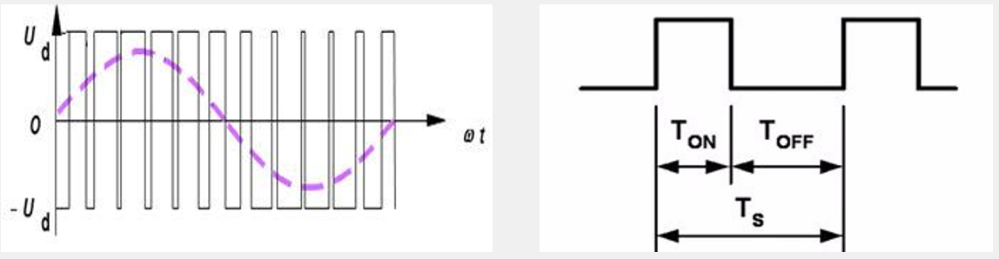


#### 输出比较通道

**通用**


经过输出模式控制器输出ref，CC1P极性控制，为0时：输出ref的电平，为1时：输出ref的相反电平


**高级**

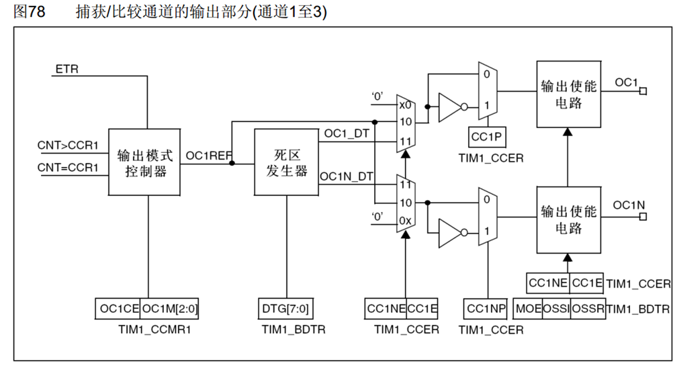

高级比通用多了死区生成：作用OC1导通时OC1N延迟导通，OC1N导通时OC1延时导通

#### 输出比较模式

|     **模式**     |                           **描述**                           |
| :--------------: | :----------------------------------------------------------: |
|       冻结       |                  CNT=CCR时，REF保持为原状态                  |
| 匹配时置有效电平 |                  CNT=CCR时，REF置有效电平1                   |
| 匹配时置无效电平 |                  CNT=CCR时，REF置无效电平0                   |
|  匹配时电平翻转  |                    CNT=CCR时，REF电平翻转                    |
|  强制为无效电平  |               CNT与CCR无效，REF强制为无效电平                |
|  强制为有效电平  |               CNT与CCR无效，REF强制为有效电平                |
|     PWM模式1     | 向上计数：CNT<CCR时，REF置有效电平，CNT≥CCR时，REF置无效电平  向下计数：CNT>CCR时，REF置无效电平，CNT≤CCR时，REF置有效电平 |
|     PWM模式2     | 向上计数：CNT<CCR时，REF置无效电平，CNT≥CCR时，REF置有效电平  向下计数：CNT>CCR时，REF置有效电平，CNT≤CCR时，REF置无效电平 |

````c
#define TIM_OCMode_Timing                  ((uint16_t)0x0000)    //冻结 
#define TIM_OCMode_Active                  ((uint16_t)0x0010)    //匹配时置有效电平
#define TIM_OCMode_Inactive                ((uint16_t)0x0020)    //匹配时置无效电平
#define TIM_OCMode_Toggle                  ((uint16_t)0x0030)    //匹配时电平翻转
#define TIM_OCMode_PWM1                    ((uint16_t)0x0060)    //PWM模式1
#define TIM_OCMode_PWM2                    ((uint16_t)0x0070)    //PWM模式2
````

#### PWM基本结构

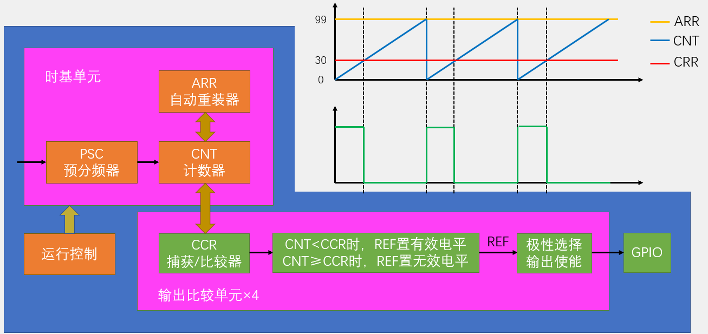

**参数计算**

* PWM频率： Freq = CK_PSC / (PSC + 1) / (ARR + 1)
* PWM占空比： Duty = CCR / (ARR + 1)
* PWM分辨率： Reso = 1 / (ARR + 1)

标准库

* 通过`TIM_TimeBaseInitTypeDef.TIM_Prescaler` 设置PSC
* 通过`TIM_TimeBaseInitTypeDef.TIM_Period` 设置ARR
* 通过`TIM_OCInitTypeDef.TIM_Pulse` 设置CCR

HAL库

* 通过`TIM_HandleTypeDef.Init.Prescale` 设置PSC
* 通过`TIM_HandleTypeDe.Init.Period` 设置ARR
* 通过`TIM_OC_InitTypeDef.Pulse` 设置CCR

#### HAL库

##### **配置步骤**

1. 配置定时器基础工作参数：HAL_TIM_PWM_Init()
2. 定时器PWM输出MSP初始化：HAL_TIM_PWM_MspInit()   配置NVIC、CLOCK、GPIO等
3. 配置PWM模式/比较值等：HAL_TIM_PWM_ConfigChannel()
4. 使能输出并启动计数器：HAL_TIM_PWM_Start()
5. 修改比较值控制占空比(可选)：__HAL_TIM_SET_COMPARE()
6. 使能通道预装载(可选)：__HAL_TIM_ENABLE_OCxPRELOAD()

|             函数              |    主要寄存器     |            主要功能             |
| :---------------------------: | :---------------: | :-----------------------------: |
|      HAL_TIM_PWM_Init()       |   CR1、ARR、PSC   |      初始化定时器基础参数       |
|     HAL_TIM_PWM_MspInit()     |        无         | 存放NVIC、CLOCK、GPIO初始化代码 |
|  HAL_TIM_PWM_ConfigChannel()  | CCMRx、CCRx、CCER | 配置PWM模式、比较值、输出极性等 |
|      HAL_TIM_PWM_Start()      |     CCER、CR1     |    使能输出比较并启动计数器     |
|    __HAL_TIM_SET_COMPARE()    |       CCRx        |           修改比较值            |
| __HAL_TIM_ENABLE_OCxPRELOAD() |       CCER        |         使能通道预装载          |

````c
HAL_StatusTypeDef HAL_TIM_PWM_Init(TIM_HandleTypeDef *htim);     // 和基本定时器的HAL_TIM_Base_Init()一样
````

HAL_TIM_OC_Init() 、 HAL_TIM_OC_ConfigChannel()  、  HAL_TIM_OC_Start()  

**输出比较结构体**

````c
typedef struct { 
   uint32_t OCMode; 	    /* 输出比较模式选择 */
   uint32_t Pulse; 	        /* 设置CCR */
   uint32_t OCPolarity;     /* 设置输出比较极性 */
   uint32_t OCNPolarity;    /* 设置互补输出比较极性 */
   uint32_t OCFastMode;     /* 使能或失能输出比较快速模式 */
   uint32_t OCIdleState;    /* 空闲状态下OC1输出 */
   uint32_t OCNIdleState;   /* 空闲状态下OC1N输出 */ 
} TIM_OC_InitTypeDef;
````

````c
//输出比较模式选择
#define TIM_OCMODE_TIMING                   0x00000000U
#define TIM_OCMODE_ACTIVE                   TIM_CCMR1_OC1M_0  
#define TIM_OCMODE_INACTIVE                 TIM_CCMR1_OC1M_1 
#define TIM_OCMODE_TOGGLE                   (TIM_CCMR1_OC1M_1 | TIM_CCMR1_OC1M_0)  
#define TIM_OCMODE_PWM1                     (TIM_CCMR1_OC1M_2 | TIM_CCMR1_OC1M_1) 
#define TIM_OCMODE_PWM2                     (TIM_CCMR1_OC1M_2 | TIM_CCMR1_OC1M_1 | TIM_CCMR1_OC1M_0)
#define TIM_OCMODE_FORCED_ACTIVE            (TIM_CCMR1_OC1M_2 | TIM_CCMR1_OC1M_0)
#define TIM_OCMODE_FORCED_INACTIVE          TIM_CCMR1_OC1M_2     

//设置输出比较极性
#define TIM_OCPOLARITY_HIGH                0x00000000U
#define TIM_OCPOLARITY_LOW                 TIM_CCER_CC1P
````


##### 重映射

stm32f1xx_hal_gpio_ex.h内部有众多AFIO重映射宏定义

````c
__HAL_RCC_AFIO_CLK_ENABLE();

**
  * @brief Enable the remapping of TIM3 alternate function channels 1 to 4
  * @note  PARTIAL: Partial remap (CH1/PB4, CH2/PB5, CH3/PB0, CH4/PB1)
  */
__HAL_AFIO_REMAP_TIM3_PARTIAL() 
````

##### 输出比较模式


翻转：PWM波由ARR的值决定，占空比固定位50%，而CCR控制的是相位。相位：产生上升沿的位置

函数

|             函数              |    主要寄存器     |               主要功能               |
| :---------------------------: | :---------------: | :----------------------------------: |
|       HAL_TIM_OC_Init()       |   CR1、ARR、PSC   |         初始化定时器基础参数         |
|      HAL_TIM_OC_MspInit       |        无         |   存放NVIC、CLOCK、GPIO初始化代码    |
|  HAL_TIM_OC_ConfigChannel()   | CCMRx、CCRx、CCER | 设置输出比较模式、比较值、输出极性等 |
| __HAL_TIM_ENABLE_OCxPRELOAD() |       CCMRx       |            使能通道预装载            |
|      HAL_TIM_OC_Start()       |  CR1、CCER、BDTR  |   使能输出比较、主输出、启动计数器   |
|    __HAL_TIM_SET_COMPARE()    |       CCRx        |       修改捕获/比较寄存器的值        |


案例：通过定时器8通道1/2/3/4输出相位分别为25%、50%、75%、100%的PWM，注意：PWM固定为50%，只是相位发生了变化

````c
TIM_HandleTypeDef g_timx_comp_pwm_handle;       /* 定时器x句柄 */

/* 高级定时器 输出比较模式 初始化函数 */
void atim_timx_comp_pwm_init(uint16_t arr, uint16_t psc){
    TIM_OC_InitTypeDef timx_oc_comp_pwm = {0};
    
    g_timx_comp_pwm_handle.Instance = TIM8;                       /* 定时器8 */
    g_timx_comp_pwm_handle.Init.Prescaler = psc  ;                /* 定时器分频 */
    g_timx_comp_pwm_handle.Init.CounterMode = TIM_COUNTERMODE_UP; /* 递增计数模式 */
    g_timx_comp_pwm_handle.Init.Period = arr;                     /* 自动重装载值 */
    HAL_TIM_OC_Init(&g_timx_comp_pwm_handle);                     /* 输出比较模式初始化 */

    timx_oc_comp_pwm.OCMode = TIM_OCMODE_TOGGLE;
    timx_oc_comp_pwm.OCPolarity = TIM_OCPOLARITY_HIGH;
    HAL_TIM_OC_ConfigChannel(&g_timx_comp_pwm_handle, &timx_oc_comp_pwm, TIM_CHANNEL_1);
    HAL_TIM_OC_ConfigChannel(&g_timx_comp_pwm_handle, &timx_oc_comp_pwm, TIM_CHANNEL_2);
    HAL_TIM_OC_ConfigChannel(&g_timx_comp_pwm_handle, &timx_oc_comp_pwm, TIM_CHANNEL_3);
    HAL_TIM_OC_ConfigChannel(&g_timx_comp_pwm_handle, &timx_oc_comp_pwm, TIM_CHANNEL_4);
    
    __HAL_TIM_ENABLE_OCxPRELOAD(&g_timx_comp_pwm_handle, TIM_CHANNEL_1);
    __HAL_TIM_ENABLE_OCxPRELOAD(&g_timx_comp_pwm_handle, TIM_CHANNEL_2);
    __HAL_TIM_ENABLE_OCxPRELOAD(&g_timx_comp_pwm_handle, TIM_CHANNEL_3);
    __HAL_TIM_ENABLE_OCxPRELOAD(&g_timx_comp_pwm_handle, TIM_CHANNEL_4);
    
    HAL_TIM_OC_Start(&g_timx_comp_pwm_handle, TIM_CHANNEL_1);
    HAL_TIM_OC_Start(&g_timx_comp_pwm_handle, TIM_CHANNEL_2);
    HAL_TIM_OC_Start(&g_timx_comp_pwm_handle, TIM_CHANNEL_3);
    HAL_TIM_OC_Start(&g_timx_comp_pwm_handle, TIM_CHANNEL_4);
}
/* 定时器 输出比较 MSP初始化函数 */
void HAL_TIM_OC_MspInit(TIM_HandleTypeDef *htim)
{
    if (htim->Instance == TIM8)
    {
        GPIO_InitTypeDef gpio_init_struct;

        __HAL_RCC_TIM8_CLK_ENABLE();
        __HAL_RCC_GPIOC_CLK_ENABLE();

        gpio_init_struct.Pin = GPIO_PIN_6;
        gpio_init_struct.Mode = GPIO_MODE_AF_PP;
        gpio_init_struct.Pull = GPIO_NOPULL;
        gpio_init_struct.Speed = GPIO_SPEED_FREQ_HIGH;
        HAL_GPIO_Init(GPIOC, &gpio_init_struct);

        gpio_init_struct.Pin = GPIO_PIN_7;
        HAL_GPIO_Init(GPIOC, &gpio_init_struct);

        gpio_init_struct.Pin = GPIO_PIN_8;
        HAL_GPIO_Init(GPIOC, &gpio_init_struct);

        gpio_init_struct.Pin = GPIO_PIN_9;
        HAL_GPIO_Init(GPIOC, &gpio_init_struct);
    }
}
int main(void)
{
    uint8_t t = 0;

    HAL_Init();                         /* 初始化HAL库 */
    sys_stm32_clock_init(RCC_PLL_MUL9); /* 设置时钟, 72Mhz */
    delay_init(72);                     /* 延时初始化 */
    usart_init(115200);                 /* 串口初始化为115200 */
    led_init();                         /* 初始化LED */
    atim_timx_comp_pwm_init(1000 - 1, 72 - 1);
    
    __HAL_TIM_SET_COMPARE(&g_timx_comp_pwm_handle, TIM_CHANNEL_1, 250 - 1);        // 25%相位
    __HAL_TIM_SET_COMPARE(&g_timx_comp_pwm_handle, TIM_CHANNEL_2, 500 - 1);
    __HAL_TIM_SET_COMPARE(&g_timx_comp_pwm_handle, TIM_CHANNEL_3, 750 - 1);
    __HAL_TIM_SET_COMPARE(&g_timx_comp_pwm_handle, TIM_CHANNEL_4, 1000 - 1);

    while (1)
    {
        delay_ms(10);
        t++;

        if (t >= 20)
        {
            LED0_TOGGLE(); /* LED0(RED)闪烁 */
            t = 0;
        }
    }
}
````


##### **案例**

通过定时器输出的PWM控制LED0，实现类似手机呼吸灯的效果，配置输出比较模式为：PWM模式1，通道输出极性为：低电平有效

````c
TIM_HandleTypeDef TIM_Handle;
TIM_OC_InitTypeDef TIM_OC_InitStructure;
void TIM_PWM_Init(void){
    TIM_Handle.Instance = TIM3;
    TIM_Handle.Init.CounterMode = TIM_COUNTERMODE_UP;     // 向上计数
    TIM_Handle.Init.Period = 499;                         // 自动重置ARR
    TIM_Handle.Init.Prescaler = 71;                       // 预分频
    
    HAL_TIM_PWM_Init(&TIM_Handle);                        // 初始化，和HAL_TIM_Base_Init()一样
    
    TIM_OC_InitStructure.OCMode = TIM_OCMODE_PWM1;        // 模式1
    TIM_OC_InitStructure.OCPolarity = TIM_OCPOLARITY_LOW; // 极性，低电平有效
    TIM_OC_InitStructure.Pulse = 300;                     // CCR

    HAL_TIM_PWM_ConfigChannel(&TIM_Handle,&TIM_OC_InitStructure,TIM_CHANNEL_2);  // 初始化OC
    
    HAL_TIM_PWM_Start(&TIM_Handle,TIM_CHANNEL_2);         // 使能定时器
}
void HAL_TIM_PWM_MspInit(TIM_HandleTypeDef *htim){
    if(htim->Instance == TIM3){
        __HAL_RCC_GPIOB_CLK_ENABLE();
        __HAL_RCC_TIM3_CLK_ENABLE();
        GPIO_InitTypeDef GPIO_InitStructure;
        GPIO_InitStructure.Mode = GPIO_MODE_AF_PP;
        GPIO_InitStructure.Pin = GPIO_PIN_5;
        GPIO_InitStructure.Pull =  GPIO_PULLUP;
        GPIO_InitStructure.Speed = GPIO_SPEED_FREQ_HIGH 
        HAL_GPIO_Init(GPIOB,&GPIO_InitStructure);
        
//        HAL_NVIC_SetPriorityGrouping(NVIC_PRIORITYGROUP_2);   
//        HAL_NVIC_SetPriority(TIM3_IRQn,2,2);
//        HAL_NVIC_EnableIRQ(TIM3_IRQn);
        
        __HAL_RCC_AFIO_CLK_ENABLE();                  // 开启AFIO
        __HAL_AFIO_REMAP_TIM3_PARTIAL();              // AFIO复用，TIM3的CH2复用到PB5
    }
}
int main(void){
    HAL_Init();                                 /* 初始化HAL库 */
    sys_stm32_clock_init(RCC_PLL_MUL9);         /* 设置时钟,72M */
    delay_init(72);                             /* 初始化延时函数 */
    UART_Init();
    LED_init();   
    TIM_PWM_Init();
    int cnt = 0;
    while(1){
        if(cnt > 499) cnt = 0;
        cnt++;
        delay_ms(10);
        __HAL_TIM_SET_COMPARE(&TIM_Handle,TIM_CHANNEL_2,cnt);    
    }
}
````


#### 标准库

##### 常用函数

````c
void TIM_DeInit(TIM_TypeDef* TIMx);  //恢复缺省配置

//定时器输出比较模块初始化，注意不同的通道对应不同的GPIO口（将对应定时器产生的PWM波形传到选择的GPIO口）
void TIM_OC1Init(TIM_TypeDef* TIMx, TIM_OCInitTypeDef* TIM_OCInitStruct);
void TIM_OC2Init(TIM_TypeDef* TIMx, TIM_OCInitTypeDef* TIM_OCInitStruct);
void TIM_OC3Init(TIM_TypeDef* TIMx, TIM_OCInitTypeDef* TIM_OCInitStruct);
void TIM_OC4Init(TIM_TypeDef* TIMx, TIM_OCInitTypeDef* TIM_OCInitStruct);

//给TIM_OCInitTypeDef结构体赋初始值
void TIM_OCStructInit(TIM_OCInitTypeDef* TIM_OCInitStruct);

//配置强制输出模式，只输出高or低电平，用的不多
void TIM_ForcedOC1Config(TIM_TypeDef* TIMx, uint16_t TIM_ForcedAction);
void TIM_ForcedOC2Config(TIM_TypeDef* TIMx, uint16_t TIM_ForcedAction);
void TIM_ForcedOC3Config(TIM_TypeDef* TIMx, uint16_t TIM_ForcedAction);
void TIM_ForcedOC4Config(TIM_TypeDef* TIMx, uint16_t TIM_ForcedAction);

//配置CCR预装功能（影子寄存器），用的不多
void TIM_OC1PreloadConfig(TIM_TypeDef* TIMx, uint16_t TIM_OCPreload);
void TIM_OC2PreloadConfig(TIM_TypeDef* TIMx, uint16_t TIM_OCPreload);
void TIM_OC3PreloadConfig(TIM_TypeDef* TIMx, uint16_t TIM_OCPreload);
void TIM_OC4PreloadConfig(TIM_TypeDef* TIMx, uint16_t TIM_OCPreload);

//配置快速使能的，用的不多
void TIM_OC1FastConfig(TIM_TypeDef* TIMx, uint16_t TIM_OCFast);
void TIM_OC2FastConfig(TIM_TypeDef* TIMx, uint16_t TIM_OCFast);
void TIM_OC3FastConfig(TIM_TypeDef* TIMx, uint16_t TIM_OCFast);
void TIM_OC4FastConfig(TIM_TypeDef* TIMx, uint16_t TIM_OCFast);

//外部事件清除REF信号，用的不多
void TIM_ClearOC1Ref(TIM_TypeDef* TIMx, uint16_t TIM_OCClear);
void TIM_ClearOC2Ref(TIM_TypeDef* TIMx, uint16_t TIM_OCClear);
void TIM_ClearOC3Ref(TIM_TypeDef* TIMx, uint16_t TIM_OCClear);
void TIM_ClearOC4Ref(TIM_TypeDef* TIMx, uint16_t TIM_OCClear);

//单独设置输出比较的极性的（结构体初始化时也会设置极性，这里用的不多），带N的是高级定时器互补通道的配置
void TIM_OC1PolarityConfig(TIM_TypeDef* TIMx, uint16_t TIM_OCPolarity);
void TIM_OC1NPolarityConfig(TIM_TypeDef* TIMx, uint16_t TIM_OCNPolarity);
void TIM_OC2PolarityConfig(TIM_TypeDef* TIMx, uint16_t TIM_OCPolarity);
void TIM_OC2NPolarityConfig(TIM_TypeDef* TIMx, uint16_t TIM_OCNPolarity);
void TIM_OC3PolarityConfig(TIM_TypeDef* TIMx, uint16_t TIM_OCPolarity);
void TIM_OC3NPolarityConfig(TIM_TypeDef* TIMx, uint16_t TIM_OCNPolarity);
void TIM_OC4PolarityConfig(TIM_TypeDef* TIMx, uint16_t TIM_OCPolarity);

//输出使能，带N为高级定时器互补通道的配置
void TIM_CCxCmd(TIM_TypeDef* TIMx, uint16_t TIM_Channel, uint16_t TIM_CCx);
void TIM_CCxNCmd(TIM_TypeDef* TIMx, uint16_t TIM_Channel, uint16_t TIM_CCxN);

//单独更改输出比较模式的函数
void TIM_SelectOCxM(TIM_TypeDef* TIMx, uint16_t TIM_Channel, uint16_t TIM_OCMode);

void TIM_UpdateDisableConfig(TIM_TypeDef* TIMx, FunctionalState NewState);
void TIM_UpdateRequestConfig(TIM_TypeDef* TIMx, uint16_t TIM_UpdateSource);
void TIM_SelectHallSensor(TIM_TypeDef* TIMx, FunctionalState NewState);
void TIM_SelectOnePulseMode(TIM_TypeDef* TIMx, uint16_t TIM_OPMode);
void TIM_SelectOutputTrigger(TIM_TypeDef* TIMx, uint16_t TIM_TRGOSource);
void TIM_SelectSlaveMode(TIM_TypeDef* TIMx, uint16_t TIM_SlaveMode);
void TIM_SelectMasterSlaveMode(TIM_TypeDef* TIMx, uint16_t TIM_MasterSlaveMode);
void TIM_SetAutoreload(TIM_TypeDef* TIMx, uint16_t Autoreload);

//单独更改CCR寄存器值的函数（更改占空比时用到，很重要）
void TIM_SetCompare1(TIM_TypeDef* TIMx, uint16_t Compare1);    //控制的是TIMx的CH1
void TIM_SetCompare2(TIM_TypeDef* TIMx, uint16_t Compare2);    //控制的是TIMx的CH2
void TIM_SetCompare3(TIM_TypeDef* TIMx, uint16_t Compare3);
void TIM_SetCompare4(TIM_TypeDef* TIMx, uint16_t Compare4);

//仅高级定时器使用，使能主输出，否则PWM将不能正常输出
void TIM_CtrlPWMOutputs(TIM_TypeDef* TIMx, FunctionalState NewState);
````


**输出比较结构体**

````c
typedef struct{
  uint16_t TIM_OCMode;       //输出比较模式
  uint16_t TIM_OutputState;  //输出使能


  uint16_t TIM_Pulse;         // 设置CCR
  uint16_t TIM_OCPolarity;    // 极性选择

  uint16_t TIM_OutputNState;  /*!< Specifies the TIM complementary Output Compare state.
                                   This parameter can be a value of @ref TIM_Output_Compare_N_state
                                   @note This parameter is valid only for TIM1 and TIM8. */
  uint16_t TIM_OCNPolarity;   /*!< Specifies the complementary output polarity.
                                   This parameter can be a value of @ref TIM_Output_Compare_N_Polarity
                                   @note This parameter is valid only for TIM1 and TIM8. */

  uint16_t TIM_OCIdleState;   /*!< Specifies the TIM Output Compare pin state during Idle state.
                                   This parameter can be a value of @ref TIM_Output_Compare_Idle_State
                                   @note This parameter is valid only for TIM1 and TIM8. */

  uint16_t TIM_OCNIdleState;  /*!< Specifies the TIM Output Compare pin state during Idle state.
                                   This parameter can be a value of @ref TIM_Output_Compare_N_Idle_State
                                   @note This parameter is valid only for TIM1 and TIM8. */
} TIM_OCInitTypeDef;

````

TIM_OCPolarity极性选择：

````c
#define TIM_OCPolarity_High                ((uint16_t)0x0000)                       //ref直接输出
#define TIM_OCPolarity_Low                 ((uint16_t)0x0002)                       //极性反转，输出ref相反
#define IS_TIM_OC_POLARITY(POLARITY) (((POLARITY) == TIM_OCPolarity_High) || \
                                      ((POLARITY) == TIM_OCPolarity_Low))
````

TIM_OutputState

````c
#define TIM_OutputState_Disable            ((uint16_t)0x0000)
#define TIM_OutputState_Enable             ((uint16_t)0x0001)          //使能
````

##### 重映射


TIM2_CH1_ETR默认在PA0端口，他还可以重映射到PA15，这需要AFIO

````c
RCC_APB2PeriphClockCmd(RCC_APB2Periph_AFIO, ENABLE);         //使能AFIO
GPIO_PinRemapConfig(GPIO_PartialRemap1_TIM2, ENABLE);        //外设复用引脚
GPIO_PinRemapConfig(GPIO_Remap_SWJ_JTAGDisable, ENABLE);     //解除调试引脚，如果复用引脚不是调试引脚则不需要这行代码
````

##### PWM呼吸灯

````c
#include "stm32f10x.h"                  // Device header

void PWM_Init(void){
	RCC_APB2PeriphClockCmd(RCC_APB2Periph_GPIOA, ENABLE);
	RCC_APB1PeriphClockCmd(RCC_APB1Periph_TIM2, ENABLE);
		
	//RCC_APB2PeriphClockCmd(RCC_APB2Periph_AFIO, ENABLE);   //引脚重映射
	//GPIO_PinRemapConfig(GPIO_PartialRemap1_TIM2, ENABLE);
	//GPIO_PinRemapConfig(GPIO_Remap_SWJ_JTAGDisable, ENABLE);
	
	GPIO_InitTypeDef GPIO_InitStructure;
	GPIO_InitStructure.GPIO_Mode = GPIO_Mode_AF_PP;           //必须使用复用开漏/推挽输出，使用复用推挽输出才能将控制权交给片上外设,PWM波形才能通过引脚输出
	GPIO_InitStructure.GPIO_Pin = GPIO_Pin_0;                 //TIM2的CH1只能用在PA0，当然也可以重映射
	GPIO_InitStructure.GPIO_Speed = GPIO_Speed_50MHz;
	GPIO_Init(GPIOA, &GPIO_InitStructure);
	
	TIM_InternalClockConfig(TIM2);          // 使用内部定时器
	
	TIM_TimeBaseInitTypeDef TIM_TimeBaseInitStructure;
	TIM_TimeBaseInitStructure.TIM_ClockDivision = TIM_CKD_DIV1;
	TIM_TimeBaseInitStructure.TIM_CounterMode = TIM_CounterMode_Up;
	TIM_TimeBaseInitStructure.TIM_Period = 100 - 1;             //ARR
	TIM_TimeBaseInitStructure.TIM_Prescaler = 720 - 1;           //PSC
	TIM_TimeBaseInitStructure.TIM_RepetitionCounter = 0;
	TIM_TimeBaseInit(TIM2, &TIM_TimeBaseInitStructure);
	
	//输出比较初始化
	TIM_OCInitTypeDef TIM_OCInitStructure;  
	TIM_OCStructInit(&TIM_OCInitStructure);   //先对结构体初始化，以免发生小错误

	TIM_OCInitStructure.TIM_OCMode = TIM_OCMode_PWM1;               //使用PWM1
	TIM_OCInitStructure.TIM_OCPolarity = TIM_OCPolarity_High;       //ref不反转
	TIM_OCInitStructure.TIM_OutputState = TIM_OutputState_Enable;
	TIM_OCInitStructure.TIM_Pulse = 0;                             //CCR
	TIM_OC1Init(TIM2, &TIM_OCInitStructure);                       //使用1号通道，对应GPIO PA0
	
	TIM_Cmd(TIM2, ENABLE);
}
void PWM_SetCompare1(uint16_t pulse){
	TIM_SetCompare1(TIM2,pulse);
}
------------------------------------------------------------------------
uint8_t pulse;
int main(void)
{
	PWM_Init();
	while (1)
	{
		for(pulse = 0; pulse < 100;pulse++){
			PWM_SetCompare1(pulse);
			Delay_ms(10);
		}
		for(pulse = 0; pulse < 100;pulse++){
			PWM_SetCompare1(100-pulse);
			Delay_ms(10);
		}
	}
}
````


### 输入捕获

#### 简介

* IC（Input Capture）输入捕获
* 输入捕获模式下，当通道输入引脚出现指定电平跳变时，**当前CNT的值将被锁存到CCR中**，可用于测量PWM波形的频率、占空比、脉冲间隔、电平持续时间等参数（CCR有多个，CNT只有一个）
* 每个高级定时器和通用定时器都拥有4个输入捕获通道
* 可配置为PWMI模式，同时测量频率和占空比
* 可配合主从触发模式，实现硬件全自动测量

对于同一个定时器输入捕获和输出比较只能用一个，不能同时使用

工作原理：在输入捕获模式下，当捕获单元捕捉到外部信号的有效边沿(上升沿/下降 沿/双边沿)时，将计数器的当前值锁存到捕获/比较寄存器TIMx_CCR， 供用户读取。

例：每来一次上升沿CNT的值就会转运到CCR一次，同时产生一个更新事件，也可以产生一个中断


**频率测量**


* 测频法：在闸门时间T内，对上升/下降  沿计次，得到N，则频率$f_x=N / T$；适合测高频信号
  * 比如1s内，计次10次，就是10hz

* 测周法：两个上升沿内，以标准频率fc计次，得到N ，则频率$f_x=f_c / N$：适合测低频信号
  * 每来一个上升沿，取一下CNT的值，自动存在CCR中，CCR捕获到的值,就是计数值N，CNT的驱动时钟就是$f_c$。每次捕获计数值清零一次

* 中界频率：测频法与测周法误差相等的频率点$f_m=√(f_c / T)$


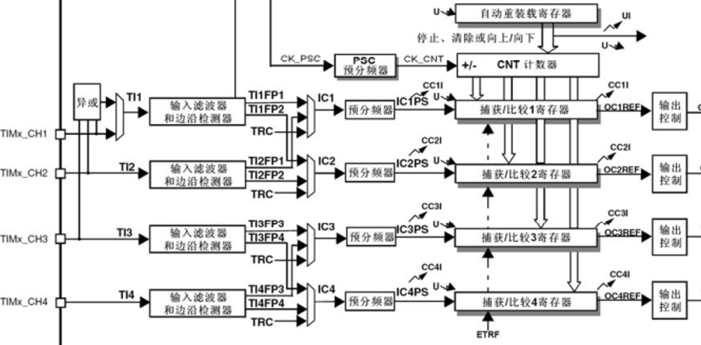

TIMx_CH1经过输入滤波器和边沿检测器输出TI1FP1到IC1的预分频器或输出TI1FP2到IC2的预分频器(交叉)


**详细图**


TI1FP1还会触发从模式，我们可以在从模式中触发一次CNT Reset操作，使计数器清零


#### **主从触发模式**

为了完成硬件自动化

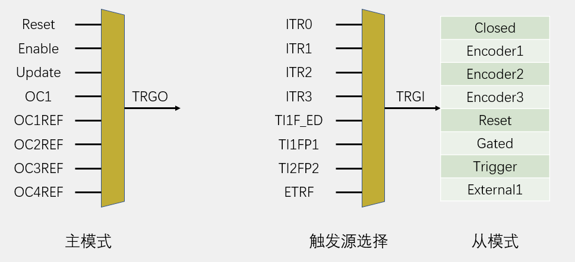

* 主模式：可以将定时器内部的信号，映射到TRGO引脚，用于触发别的外设
  * 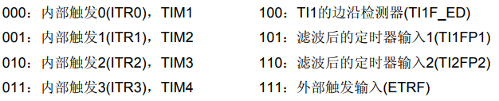

* 从模式：接收其他外设信号或自身外设的信号，用于控制自身定时器的运行，也就是被别的信号控制
  * 触发源选择：选择从模式的触发信号源
  * **例如**：想要让TI1FP1信号自动触发CNT清零，触发源选择TI1FP1,从模式选择执行Reset
  * 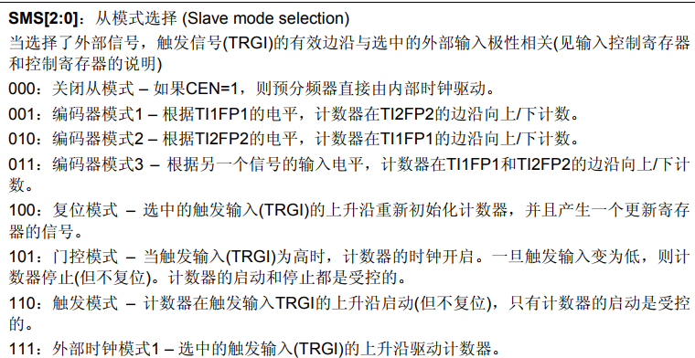
* 注意：要想使用主从触发模式只能用通道1和通道2，通道3和通道4无法作为触发源（如果使用通道34可以使用手动中断）

**HAL库**

````c
/** 开启从触发
*	参数1：TIM句柄
* 	参数2：从触发结构体
**/
HAL_StatusTypeDef HAL_TIM_SlaveConfigSynchro(TIM_HandleTypeDef *htim, TIM_SlaveConfigTypeDef *sSlaveConfig)
````

````c
typedef struct{
  uint32_t  SlaveMode;         // 选择从模式
  uint32_t  InputTrigger;      // 选择从模式的触发源 
  uint32_t  TriggerPolarity;   // 极性
  uint32_t  TriggerPrescaler;  //
  uint32_t  TriggerFilter;     // 滤波
} TIM_SlaveConfigTypeDef;
````

````c
void gtim_timx_cnt_chy_init(uint16_t psc){
    TIM_SlaveConfigTypeDef tim_salve_config = {0};
    TIM_HandleTypeDef g_timx_cnt_chy_handle; 
    
    g_timx_cnt_chy_handle.Instance = TIM2;
    g_timx_cnt_chy_handle.Init.Prescaler = psc;
    g_timx_cnt_chy_handle.Init.CounterMode = TIM_COUNTERMODE_UP;
    g_timx_cnt_chy_handle.Init.Period = 65535;
    HAL_TIM_IC_Init(&g_timx_cnt_chy_handle);
    
    tim_salve_config.SlaveMode = TIM_SLAVEMODE_EXTERNAL1;                 // 触发定时器通道1
    tim_salve_config.InputTrigger = TIM_TS_TI1F_ED;                       // 双边沿触发
    tim_salve_config.TriggerPolarity = TIM_TRIGGERPOLARITY_RISING;
    tim_salve_config.TriggerFilter = 0;
    
    HAL_TIM_SlaveConfigSynchro(&g_timx_cnt_chy_handle, &tim_salve_config);
    HAL_TIM_IC_Start(&g_timx_cnt_chy_handle, TIM_CHANNEL_1);
}
````


**标准库**

````c
void TIM_SelectOutputTrigger(TIM_TypeDef* TIMx, uint16_t TIM_TRGOSource);         //选择主模式的触发源

void TIM_SelectInputTrigger(TIM_TypeDef* TIMx, uint16_t TIM_InputTriggerSource);  //选择从模式的触发源
void TIM_SelectSlaveMode(TIM_TypeDef* TIMx, uint16_t TIM_SlaveMode);              //选择从模式
````


#### 输入捕获基本结构

注意：获得的是一整个PWM周期，不是获得高电平周期；比如设置成上升沿触发，只是说在每一次上升沿触发一次CNT搬运，而不是说上升沿后开始计数


例：

1. GPIO得到信号，经过滤波器边沿检测极性选择，选择上升沿触发
2. TI1FP1信号分为两路
   1. 路径一：最终触发CCR捕获
   2. 路径二：作为从模式的触发源，触发CNT计数器清零

小图：

1. CCR1 = CNT由硬件自动完成
2. CNT = 0 由从模式触发

注意：清零操作，如上升沿清零之后，CNT++，直到下一个上升沿，CCR=CNT，最终CCR的值就是这两个上升沿之间CNT++的值

#### PWMI基本结构


使用两个通道捕获一个引脚，在上升沿清零CNT，通道1直连输入，通道2交叉输入

多了一个通道，通道1上升沿触发搬运，通道2下降沿触发搬运；CCR1记录**整个周期**的计数值，CCR2记录高电平周期的计数值；$占空比=CCR2/CCR1$


#### HAL库

##### **配置步骤**

1. 配置定时器基础工作参数：HAL_TIM_IC_Init()
2. 定时器输入捕获MSP初始化：HAL_TIM_IC_MspInit()   配置NVIC、CLOCK、GPIO等
3. 配置输入通道映射、捕获边沿等：HAL_TIM_IC_ConfigChannel()
4. 设置优先级，使能中断：HAL_NVIC_SetPriority()、 HAL_NVIC_EnableIRQ()
5. 使能定时器更新中断：__HAL_TIM_ENABLE_IT()
6. 使能捕获、捕获中断及计数器：HAL_TIM_IC_Start_IT()
7. 编写中断服务函数：TIMx_IRQHandler()等  --> HAL_TIM_IRQHandler()
8. 编写更新中断和捕获回调函数：HAL_TIM_PeriodElapsedCallback()、 HAL_TIM_IC_CaptureCallback()

|              函数               |   主要寄存器    |               主要功能               |
| :-----------------------------: | :-------------: | :----------------------------------: |
|        HAL_TIM_IC_Init()        |  CR1、ARR、PSC  |         初始化定时器基础参数         |
|      HAL_TIM_IC_MspInit()       |       无        |   存放NVIC、CLOCK、GPIO初始化代码    |
|   HAL_TIM_IC_ConfigChannel()    |   CCMRx、CCER   | 配置通道映射、捕获边沿、分频、滤波等 |
|      __HAL_TIM_ENABLE_IT()      |      DIER       |            使能更新中断等            |
|      HAL_TIM_IC_Start_IT()      | CCER、DIER、CR1 |  使能输入捕获、捕获中断并启动计数器  |
|      HAL_TIM_IRQHandler()       |       SR        | 定时器中断处理公用函数，处理各种中断 |
| HAL_TIM_PeriodElapsedCallback() |       无        | 定时器更新中断回调函数，由用户重定义 |
|  HAL_TIM_IC_CaptureCallback()   |       无        | 定时器输入捕获回调函数，由用户重定义 |

**输入捕获结构体**

````c
typedef struct{ 
    uint32_t ICPolarity;    /* 输入捕获触发方式选择，比如上升、下降沿捕获 */ 
    uint32_t ICSelection;   /* 输入捕获选择，用于设置映射关系 直连、交叉 */ 
    uint32_t ICPrescaler;   /* 输入捕获分频系数，即捕获几次上升下/降沿生效一个 */ 
    uint32_t ICFilter;      /* 输入捕获滤波器设置 */ 
} TIM_IC_InitTypeDef;
````

````c
#define  TIM_ICPOLARITY_RISING             TIM_INPUTCHANNELPOLARITY_RISING      
#define  TIM_ICPOLARITY_FALLING            TIM_INPUTCHANNELPOLARITY_FALLING     
#define  TIM_ICPOLARITY_BOTHEDGE           TIM_INPUTCHANNELPOLARITY_BOTHEDGE   

#define TIM_ICPSC_DIV1                     0x00000000U                          
#define TIM_ICPSC_DIV2                     TIM_CCMR1_IC1PSC_0                   
#define TIM_ICPSC_DIV4                     TIM_CCMR1_IC1PSC_1                   
#define TIM_ICPSC_DIV8                     TIM_CCMR1_IC1PSC 

#define TIM_ICSELECTION_DIRECTTI           TIM_CCMR1_CC1S_0    // 直接链接
#define TIM_ICSELECTION_INDIRECTTI         TIM_CCMR1_CC1S_1                                                         
#define TIM_ICSELECTION_TRC                TIM_CCMR1_CC1S   
````


##### 案例

**案例1：**通过定时器5通道1来捕获按键高电平脉宽时间，通过串口打印出来，配置输入捕获方式：上升沿捕获、输入通道1映射在TI1上、不分频、不滤波

````c
TIM_HandleTypeDef g_timx_cap_chy_handle;     /* 定时器x句柄 */

/* 通用定时器通道y 输入捕获 初始化函数 */
void gtim_timx_cap_chy_init(uint16_t arr, uint16_t psc){
    TIM_IC_InitTypeDef timx_ic_cap_chy = {0};

    g_timx_cap_chy_handle.Instance = TIM5;                              /* 定时器5 */
    g_timx_cap_chy_handle.Init.Prescaler = psc;                         /* 定时器分频 */
    g_timx_cap_chy_handle.Init.CounterMode = TIM_COUNTERMODE_UP;        /* 递增计数模式 */
    g_timx_cap_chy_handle.Init.Period = arr;                            /* 自动重装载值 */
    HAL_TIM_IC_Init(&g_timx_cap_chy_handle);

    timx_ic_cap_chy.ICPolarity = TIM_ICPOLARITY_RISING;                 /* 上升沿捕获 */
    timx_ic_cap_chy.ICSelection = TIM_ICSELECTION_DIRECTTI;             /* 映射到TI1上 */
    timx_ic_cap_chy.ICPrescaler = TIM_ICPSC_DIV1;                       /* 配置输入分频，不分频 */
    timx_ic_cap_chy.ICFilter = 0;                                       /* 配置输入滤波器，不滤波 */
    HAL_TIM_IC_ConfigChannel(&g_timx_cap_chy_handle, &timx_ic_cap_chy, TIM_CHANNEL_1);  /* 配置TIM5通道1 */

    __HAL_TIM_ENABLE_IT(&g_timx_cap_chy_handle, TIM_IT_UPDATE);         /* 使能更新中断 */
    //__HAL_TIM_ENABLE_IT(&TIM_Handle,TIM_IT_CC1);              // 使能捕获中断
    
    
    /* 使能捕获中断，其实就是__HAL_TIM_ENABLE_IT(&TIM_Handle,TIM_IT_CC1); */
    HAL_TIM_IC_Start_IT(&g_timx_cap_chy_handle, TIM_CHANNEL_1); 
}

/* 定时器 输入捕获 MSP初始化函数 */
void HAL_TIM_IC_MspInit(TIM_HandleTypeDef *htim){
    if (htim->Instance == TIM5)                             /*输入通道捕获*/
    {
        GPIO_InitTypeDef gpio_init_struct;
        __HAL_RCC_TIM5_CLK_ENABLE();                        /* 使能TIM5时钟 */
        __HAL_RCC_GPIOA_CLK_ENABLE();                       /* 开启捕获IO的时钟 */

        gpio_init_struct.Pin = GPIO_PIN_0;
        gpio_init_struct.Mode = GPIO_MODE_AF_PP;            /* 复用推挽输出 */
        gpio_init_struct.Pull = GPIO_PULLDOWN;              /* 下拉 */
        gpio_init_struct.Speed = GPIO_SPEED_FREQ_HIGH;      /* 高速 */
        HAL_GPIO_Init(GPIOA, &gpio_init_struct);

        HAL_NVIC_SetPriority(TIM5_IRQn, 1, 3);              /* 抢占1，子优先级3 */
        HAL_NVIC_EnableIRQ(TIM5_IRQn);                      /* 开启ITMx中断 */
    }
}

/* 输入捕获状态(g_timxchy_cap_sta)
 * [7]  :0,没有成功的捕获;1,成功捕获到一次.
 * [6]  :0,还没捕获到高电平;1,已经捕获到高电平了.
 * [5:0]:捕获高电平后溢出的次数,最多溢出63次,所以最长捕获值 = 63*65536 + 65535 = 4194303
 *       注意:为了通用,我们默认ARR和CCRy都是16位寄存器,对于32位的定时器(如:TIM5),也只按16位使用
 *       按1us的计数频率,最长溢出时间为:4194303 us, 约4.19秒
 *
 *      (说明一下：正常32位定时器来说,1us计数器加1,溢出时间:4294秒)
 */
uint8_t g_timxchy_cap_sta = 0;    /* 输入捕获状态 */
uint16_t g_timxchy_cap_val = 0;   /* 输入捕获值 */

/* 定时器5中断服务函数 */
void TIM5_IRQHandler(void){
    HAL_TIM_IRQHandler(&g_timx_cap_chy_handle);  /* 定时器HAL库共用处理函数 */
}

/* 定时器输入捕获中断处理回调函数 */
void HAL_TIM_IC_CaptureCallback(TIM_HandleTypeDef *htim)
{
    if (htim->Instance == TIM5)
    {
        if ((g_timxchy_cap_sta & 0X80) == 0)                /* 还没有成功捕获 */
        {
            if (g_timxchy_cap_sta & 0X40)                   /* 捕获到一个下降沿 */
            {
                /* 标记成功捕获到一次高电平脉宽 */
                g_timxchy_cap_sta |= 0X80; 
                /* 获取当前的捕获值 */
                g_timxchy_cap_val = HAL_TIM_ReadCapturedValue(&g_timx_cap_chy_handle, TIM_CHANNEL_1); 
                /* 一定要先清除原来的设置 */
                TIM_RESET_CAPTUREPOLARITY(&g_timx_cap_chy_handle, TIM_CHANNEL_1);
                /* 配置TIM5通道1上升沿捕获,这一次是下降沿触发，下一次改上升沿触发 */
                TIM_SET_CAPTUREPOLARITY(&g_timx_cap_chy_handle, TIM_CHANNEL_1, TIM_ICPOLARITY_RISING); 
            }
            else /* 还未开始,第一次捕获上升沿 */
            {
                g_timxchy_cap_sta = 0;                              /* 清空 */
                g_timxchy_cap_val = 0;
                g_timxchy_cap_sta |= 0X40;                          /* 标记捕获到了上升沿 */
                __HAL_TIM_DISABLE(&g_timx_cap_chy_handle);          /* 关闭定时器5 */
                __HAL_TIM_SET_COUNTER(&g_timx_cap_chy_handle, 0);   /* 定时器5计数器清零 */
                TIM_RESET_CAPTUREPOLARITY(&g_timx_cap_chy_handle, TIM_CHANNEL_1);   /* 一定要先清除原来的设置！！ */
                /* 定时器5通道1设置为下降沿捕获，这一次是上升沿触发，下一次改下降沿触发 */
                TIM_SET_CAPTUREPOLARITY(&g_timx_cap_chy_handle, TIM_CHANNEL_1, TIM_ICPOLARITY_FALLING); 
                __HAL_TIM_ENABLE(&g_timx_cap_chy_handle);           /* 使能定时器5 */
            }
        }
    }
}
/* 定时器更新中断回调函数 */
void HAL_TIM_PeriodElapsedCallback(TIM_HandleTypeDef *htim)
{
    if (htim->Instance == TIM5)
    {
        if ((g_timxchy_cap_sta & 0X80) == 0)            /* 还未成功捕获 */
        {
            if (g_timxchy_cap_sta & 0X40)               /* 已经捕获到高电平了 */
            {
                if ((g_timxchy_cap_sta & 0X3F) == 0X3F) /* 高电平太长了 */
                {
                    TIM_RESET_CAPTUREPOLARITY(&g_timx_cap_chy_handle, TIM_CHANNEL_1);                     /* 一定要先清除原来的设置 */
                    TIM_SET_CAPTUREPOLARITY(&g_timx_cap_chy_handle, TIM_CHANNEL_1, TIM_ICPOLARITY_RISING);/* 配置TIM5通道1上升沿捕获 */
                    g_timxchy_cap_sta |= 0X80;          /* 标记成功捕获了一次 */
                    g_timxchy_cap_val = 0XFFFF;
                }
                else      /* 累计定时器溢出次数 */
                {
                    g_timxchy_cap_sta++;
                }
            }
        }
    }
}
````

**案例2：PWMI模式测频率占空比**

通过定时器3通道2（PB5）输出PWM

将PWM输入到定时器8通道1（PC6），测量PWM的频率/周期、占空比等信息（通道1获得整个周期，通道2获得高电平周期）

````c
TIM_HandleTypeDef MyTIM_IC_Handle;
TIM_IC_InitTypeDef MyTIM_IC_InitSturcture;
void MyIC_Init(void){

    MyTIM_IC_Handle.Instance = TIM8;
    MyTIM_IC_Handle.Init.Prescaler = 0;
    MyTIM_IC_Handle.Init.Period = 65535;
    MyTIM_IC_Handle.Init.CounterMode = TIM_COUNTERMODE_UP;
   
    HAL_TIM_IC_Init(&MyTIM_IC_Handle);

    TIM_SlaveConfigTypeDef TIM_SlaveInitStructure;
    TIM_SlaveInitStructure.SlaveMode = TIM_SLAVEMODE_RESET;             // 从模式：复位
    TIM_SlaveInitStructure.InputTrigger = TIM_TS_TI1FP1;                // 触发方式：TI1
    TIM_SlaveInitStructure.TriggerFilter = 0;
    TIM_SlaveInitStructure.TriggerPolarity = TIM_TRIGGERPOLARITY_RISING;
    HAL_TIM_SlaveConfigSynchro(&MyTIM_IC_Handle,&TIM_SlaveInitStructure);
    
    MyTIM_IC_InitSturcture.ICFilter = 0;
    MyTIM_IC_InitSturcture.ICPolarity = TIM_ICPOLARITY_RISING;          // 上升沿触发搬运
    MyTIM_IC_InitSturcture.ICPrescaler = TIM_ICPSC_DIV1 ;
    MyTIM_IC_InitSturcture.ICSelection = TIM_ICSELECTION_DIRECTTI;      // 直连
    HAL_TIM_IC_ConfigChannel(&MyTIM_IC_Handle,&MyTIM_IC_InitSturcture,TIM_CHANNEL_1);  // 通道1获得整个周期

    MyTIM_IC_InitSturcture.ICPolarity = TIM_ICPOLARITY_FALLING;         // 下降沿触发搬运
    MyTIM_IC_InitSturcture.ICPrescaler = TIM_ICPSC_DIV1 ;
    MyTIM_IC_InitSturcture.ICSelection = TIM_ICSELECTION_INDIRECTTI;    // 交叉连接
    HAL_TIM_IC_ConfigChannel(&MyTIM_IC_Handle,&MyTIM_IC_InitSturcture,TIM_CHANNEL_2);  // 通道2获得高电平周期
    
    //HAL_TIM_IC_Start(&MyTIM_IC_Handle,TIM_CHANNEL_1);    // 不产生中断，可以自己写个函数获取PWM比例
    HAL_TIM_IC_Start_IT(&MyTIM_IC_Handle,TIM_CHANNEL_1);   // 本次使用中断，在中断函数中获取PWM比例
    HAL_TIM_IC_Start(&MyTIM_IC_Handle,TIM_CHANNEL_2);
}
void HAL_TIM_IC_MspInit(TIM_HandleTypeDef *htim){
    if(htim->Instance == TIM8){
        GPIO_InitTypeDef gpio_init_struct = {0};

        __HAL_RCC_TIM8_CLK_ENABLE();
        __HAL_RCC_GPIOC_CLK_ENABLE();

        gpio_init_struct.Pin = GPIO_PIN_6;
        gpio_init_struct.Mode = GPIO_MODE_AF_PP;
        gpio_init_struct.Pull = GPIO_PULLDOWN;
        gpio_init_struct.Speed = GPIO_SPEED_FREQ_HIGH;
        HAL_GPIO_Init(GPIOC, &gpio_init_struct);
        
        /* TIM1/TIM8有独立的输入捕获中断服务函数 */
        HAL_NVIC_SetPriority(TIM8_CC_IRQn, 1, 3);
        HAL_NVIC_EnableIRQ(TIM8_CC_IRQn);
    }
}
// 中断服务函数：TIM8捕获中断
void TIM8_CC_IRQHandler(void){
    HAL_TIM_IRQHandler(&MyTIM_IC_Handle);
}
uint32_t PWMHigh = 0;
uint32_t PWMDown = 0;
void HAL_TIM_IC_CaptureCallback(TIM_HandleTypeDef *htim){
    if(htim->Instance == TIM8){
        if(htim->Channel == HAL_TIM_ACTIVE_CHANNEL_1){
            PWMHigh = HAL_TIM_ReadCapturedValue(htim,TIM_CHANNEL_1);   // 获得整个周期
            PWMDown = HAL_TIM_ReadCapturedValue(htim,TIM_CHANNEL_2);   // 获得高电平周期
        }
    }
}
````

#### 标准库

##### 常用函数

````c
//初始化IC，但是和OC不同的是，IC只有这一个函数，在TIM_ICInitTypeDef结构体中选择初始化通道；而OC有4个函数TIM_OCXInit初始化不同的通道
void TIM_ICInit(TIM_TypeDef* TIMx, TIM_ICInitTypeDef* TIM_ICInitStruct);    
// 配置PWMI模式：快速配置两个IC通道，不需要我们手动配置两个通道，内部会根据通道1的直连/交叉输入，自动配置通道2为相反的直连/交叉输入
void TIM_PWMIConfig(TIM_TypeDef* TIMx, TIM_ICInitTypeDef* TIM_ICInitStruct);
// 给结构体附初始值
void TIM_ICStructInit(TIM_ICInitTypeDef* TIM_ICInitStruct);

// 设置PSC，参数3TIM_PSCReloadMode：
//                              1、TIM_PSCReloadMode_Update:在更新事件后执行
//								2、TIM_PSCReloadMode_Immediate：立刻执行
void TIM_PrescalerConfig(TIM_TypeDef* TIMx, uint16_t Prescaler, uint16_t TIM_PSCReloadMode);


void TIM_SelectOutputTrigger(TIM_TypeDef* TIMx, uint16_t TIM_TRGOSource);         //选择主模式的触发源

void TIM_SelectInputTrigger(TIM_TypeDef* TIMx, uint16_t TIM_InputTriggerSource);  //选择从模式的触发源
void TIM_SelectSlaveMode(TIM_TypeDef* TIMx, uint16_t TIM_SlaveMode);              //选择从模式

//配置通道的分频器，在结构体中也可以配置
void TIM_SetIC1Prescaler(TIM_TypeDef* TIMx, uint16_t TIM_ICPSC);
void TIM_SetIC2Prescaler(TIM_TypeDef* TIMx, uint16_t TIM_ICPSC);
void TIM_SetIC3Prescaler(TIM_TypeDef* TIMx, uint16_t TIM_ICPSC);
void TIM_SetIC4Prescaler(TIM_TypeDef* TIMx, uint16_t TIM_ICPSC);

//读取对应通道的CCR
uint16_t TIM_GetCapture1(TIM_TypeDef* TIMx);
uint16_t TIM_GetCapture2(TIM_TypeDef* TIMx);
uint16_t TIM_GetCapture3(TIM_TypeDef* TIMx);
uint16_t TIM_GetCapture4(TIM_TypeDef* TIMx);
uint16_t TIM_GetCounter(TIM_TypeDef* TIMx);
````

**从模式函数**

````c
/**
  * @brief  选择从模式触发源
  * @param  TIMx: where x can be  1, 2, 3, 4, 5, 8, 9, 12 or 15 to select the TIM peripheral.
  * @param  TIM_InputTriggerSource: The Input Trigger source.
  *   This parameter can be one of the following values:
  *     @arg TIM_TS_ITR0: Internal Trigger 0
  *     @arg TIM_TS_ITR1: Internal Trigger 1
  *     @arg TIM_TS_ITR2: Internal Trigger 2
  *     @arg TIM_TS_ITR3: Internal Trigger 3
  *     @arg TIM_TS_TI1F_ED: TI1 Edge Detector
  *     @arg TIM_TS_TI1FP1: Filtered Timer Input 1       TI1FP1 触发
  *     @arg TIM_TS_TI2FP2: Filtered Timer Input 2
  *     @arg TIM_TS_ETRF: External Trigger input
  */
void TIM_SelectInputTrigger(TIM_TypeDef* TIMx, uint16_t TIM_InputTriggerSource)
    
/**
  * @brief  选择触发模式
  * @param  TIMx: where x can be 1, 2, 3, 4, 5, 8, 9, 12 or 15 to select the TIM peripheral.
  * @param  TIM_SlaveMode: specifies the Timer Slave Mode.
  *   This parameter can be one of the following values:
  *     @arg TIM_SlaveMode_Reset:     重置CNT
  *     @arg TIM_SlaveMode_Gated:     The counter clock is enabled when the trigger signal (TRGI) is high.
  *     @arg TIM_SlaveMode_Trigger:   The counter starts at a rising edge of the trigger TRGI.
  *     @arg TIM_SlaveMode_External1: Rising edges of the selected trigger (TRGI) clock the counter.
  */
void TIM_SelectSlaveMode(TIM_TypeDef* TIMx, uint16_t TIM_SlaveMode)
````


**初始化结构体**

````c
typedef struct{
  uint16_t TIM_Channel;          // 选择通道
  uint16_t TIM_ICPolarity;       // 选择极性
  uint16_t TIM_ICSelection;      // 选择直连、交叉
  uint16_t TIM_ICPrescaler;      // 选择分频
  uint16_t TIM_ICFilter;         // 滤波
} TIM_ICInitTypeDef;
````

````c
//TIM_Channel参数：选择通道
#define TIM_Channel_1                      ((uint16_t)0x0000)
#define TIM_Channel_2                      ((uint16_t)0x0004)
#define TIM_Channel_3                      ((uint16_t)0x0008)
#define TIM_Channel_4                      ((uint16_t)0x000C)

//TIM_ICPolarity参数：选择极性，上升沿触发、下降沿触发、上升下降都触发
#define  TIM_ICPolarity_Rising             ((uint16_t)0x0000)            
#define  TIM_ICPolarity_Falling            ((uint16_t)0x0002)
#define  TIM_ICPolarity_BothEdge           ((uint16_t)0x000A)

//参数uint16_t TIM_ICPrescaler：选择分频
#define TIM_ICPSC_DIV1                     ((uint16_t)0x0000)    //1就是1
#define TIM_ICPSC_DIV2                     ((uint16_t)0x0004)    //除2
#define TIM_ICPSC_DIV4                     ((uint16_t)0x0008)
#define TIM_ICPSC_DIV8                     ((uint16_t)0x000C)
    
//TIM_ICSelection参数：选择直连、交叉通道
#define TIM_ICSelection_DirectTI           ((uint16_t)0x0001)
#define TIM_ICSelection_IndirectTI         ((uint16_t)0x0002)

//TIM_ICFilter参数:0x0 ~ 0xf   滤波
````

##### 案例

**案例1：输入捕获模式测频率**

该工程使用了2块stm32芯片，一块产生PWM方波，一块检测PWM方波

产生PWM方波STM32

````c
void PWM_Init(void){
	RCC_APB2PeriphClockCmd(RCC_APB2Periph_GPIOA, ENABLE);
	RCC_APB1PeriphClockCmd(RCC_APB1Periph_TIM2, ENABLE);
		
	GPIO_InitTypeDef GPIO_InitStructure;
	GPIO_InitStructure.GPIO_Mode = GPIO_Mode_AF_PP;           //必须使用复用开漏/推挽输出，使用复用推挽输出才能将控制权交给片上外设,PWM波形才能通过引脚输出
	GPIO_InitStructure.GPIO_Pin = GPIO_Pin_0;                 //TIM2的CH1只能用在PA0，当然也可以重映射
	GPIO_InitStructure.GPIO_Speed = GPIO_Speed_50MHz;
	GPIO_Init(GPIOA, &GPIO_InitStructure);
	
	TIM_InternalClockConfig(TIM2);
	
	TIM_TimeBaseInitTypeDef TIM_TimeBaseInitStructure;
	TIM_TimeBaseInitStructure.TIM_ClockDivision = TIM_CKD_DIV1;
	TIM_TimeBaseInitStructure.TIM_CounterMode = TIM_CounterMode_Up;
	TIM_TimeBaseInitStructure.TIM_Period = 100 - 1;              //ARR
	TIM_TimeBaseInitStructure.TIM_Prescaler = 720 - 1;           //PSC
	TIM_TimeBaseInitStructure.TIM_RepetitionCounter = 0;
	TIM_TimeBaseInit(TIM2, &TIM_TimeBaseInitStructure);
	
	//输出比较初始化
	TIM_OCInitTypeDef TIM_OCInitStructure;  
	TIM_OCStructInit(&TIM_OCInitStructure);   //先对结构体初始化，以免发生小错误

	TIM_OCInitStructure.TIM_OCMode = TIM_OCMode_PWM1;               //使用PWM1
	TIM_OCInitStructure.TIM_OCPolarity = TIM_OCPolarity_High;       //ref不反转
	TIM_OCInitStructure.TIM_OutputState = TIM_OutputState_Enable;
	TIM_OCInitStructure.TIM_Pulse = 0;                              //CCR
	TIM_OC1Init(TIM2, &TIM_OCInitStructure);
	
	TIM_Cmd(TIM2, ENABLE);
}
void PWM_SetCompare1(uint16_t pulse){                //设置CCR
	TIM_SetCompare1(TIM2,pulse);
}
void PWM_SetPrescalerConfig(uint16_t Prescaler){     //设置PSC
	TIM_PrescalerConfig(TIM2, Prescaler, TIM_PSCReloadMode_Immediate);
}
````

检测PWM方波STM32

````c
#include "stm32f10x.h"                  // Device header

void IC_Init(void){
	RCC_APB2PeriphClockCmd(RCC_APB2Periph_GPIOA, ENABLE);
	RCC_APB1PeriphClockCmd(RCC_APB1Periph_TIM2, ENABLE);
		
	GPIO_InitTypeDef GPIO_InitStructure;
	GPIO_InitStructure.GPIO_Mode = GPIO_Mode_IPU;           
	GPIO_InitStructure.GPIO_Pin = GPIO_Pin_0;                     //读取PA0引脚
	GPIO_InitStructure.GPIO_Speed = GPIO_Speed_50MHz;
	GPIO_Init(GPIOA, &GPIO_InitStructure);
	
	TIM_InternalClockConfig(TIM2);
	
	TIM_TimeBaseInitTypeDef TIM_TimeBaseInitStructure;
	TIM_TimeBaseInitStructure.TIM_ClockDivision = TIM_CKD_DIV1;
	TIM_TimeBaseInitStructure.TIM_CounterMode = TIM_CounterMode_Up;
	TIM_TimeBaseInitStructure.TIM_Period = 65536 - 1;             //ARR
	TIM_TimeBaseInitStructure.TIM_Prescaler = 72 - 1;             //PSC
	TIM_TimeBaseInitStructure.TIM_RepetitionCounter = 0;
	TIM_TimeBaseInit(TIM2, &TIM_TimeBaseInitStructure);
	
	TIM_ICInitTypeDef TIM_ICInitStructure;
	TIM_ICInitStructure.TIM_Channel = TIM_Channel_1;                 //通道1
	TIM_ICInitStructure.TIM_ICFilter = 0xF;                          //滤波
	TIM_ICInitStructure.TIM_ICPolarity = TIM_ICPolarity_Rising;      //上升沿触发
	TIM_ICInitStructure.TIM_ICPrescaler = TIM_ICPSC_DIV1;            //1分频
	TIM_ICInitStructure.TIM_ICSelection = TIM_ICSelection_DirectTI;  //直连通道
	
	TIM_ICInit(TIM2,&TIM_ICInitStructure);                           //初始化IC
	
    // 自动完成CNT清零操作
	TIM_SelectInputTrigger(TIM2, TIM_TS_TI1FP1);                     //触发源选择，选择TI1FP1作为从模式触发源
	TIM_SelectSlaveMode(TIM2,TIM_SlaveMode_Reset);                   //从触发，使CNT清零
	
	TIM_Cmd(TIM2, ENABLE);
}

uint32_t IC_GetCapture1(void){            
	//fc = 72M / (PSC+1)
    //Freq = 72M / (PSC+1) / CCR             CCR就是CNT
	return 72000000 / 72 / TIM_GetCapture1(TIM2);   //读取CCR的值，计算频率
}

int main(void)
{
	IC_Init();
	OLED_Init();
	
	OLED_ShowString(1, 1, "Freq:00000Hz");
	while (1)
	{
		OLED_ShowNum(1, 6, IC_GetCapture1(), 5);
	}
}
````

**案例2：PWMI模式测频率占空比**

通道1获得整个周期，通道2获得高电平周期

````c
void IC_Init(void){
	RCC_APB2PeriphClockCmd(RCC_APB2Periph_GPIOA, ENABLE);
	RCC_APB1PeriphClockCmd(RCC_APB1Periph_TIM2, ENABLE);
		
	GPIO_InitTypeDef GPIO_InitStructure;
	GPIO_InitStructure.GPIO_Mode = GPIO_Mode_IPU;           
	GPIO_InitStructure.GPIO_Pin = GPIO_Pin_0;                     //读取PA0引脚
	GPIO_InitStructure.GPIO_Speed = GPIO_Speed_50MHz;
	GPIO_Init(GPIOA, &GPIO_InitStructure);
	
	TIM_InternalClockConfig(TIM2);
	
	TIM_TimeBaseInitTypeDef TIM_TimeBaseInitStructure;
	TIM_TimeBaseInitStructure.TIM_ClockDivision = TIM_CKD_DIV1;
	TIM_TimeBaseInitStructure.TIM_CounterMode = TIM_CounterMode_Up;
	TIM_TimeBaseInitStructure.TIM_Period = 65536 - 1;             //ARR
	TIM_TimeBaseInitStructure.TIM_Prescaler = 72 - 1;             //PSC
	TIM_TimeBaseInitStructure.TIM_RepetitionCounter = 0;
	TIM_TimeBaseInit(TIM2, &TIM_TimeBaseInitStructure);
	
	TIM_ICInitTypeDef TIM_ICInitStructure;
	TIM_ICInitStructure.TIM_Channel = TIM_Channel_1;                 //通道1
	TIM_ICInitStructure.TIM_ICFilter = 0xF;                          //滤波
	TIM_ICInitStructure.TIM_ICPolarity = TIM_ICPolarity_Rising;      //上升沿触发
	TIM_ICInitStructure.TIM_ICPrescaler = TIM_ICPSC_DIV1;            //1分频
	TIM_ICInitStructure.TIM_ICSelection = TIM_ICSelection_DirectTI;  //直连通道

    // 可以手动的配置通道1的直连输入 和通道2的交叉输入，但是有更方便的函数
	//	TIM_ICInit(TIM2,&TIM_ICInitStructure);
	//	TIM_ICInitStructure.TIM_Channel = TIM_Channel_2;                   //通道2
	//	TIM_ICInitStructure.TIM_ICFilter = 0xF;                            //滤波
	//	TIM_ICInitStructure.TIM_ICPolarity = TIM_ICPolarity_Falling;       //下降沿触发
	//	TIM_ICInitStructure.TIM_ICPrescaler = TIM_ICPSC_DIV1;              //1分频
	//	TIM_ICInitStructure.TIM_ICSelection = TIM_ICSelection_IndirectTI;  //交叉通道
	//	TIM_ICInit(TIM2,&TIM_ICInitStructure);
	
	// 自动完成通道12的配置
	TIM_PWMIConfig(TIM2,&TIM_ICInitStructure);                       //初始化通道1和2，函数内部会判断
	                     
	TIM_SelectInputTrigger(TIM2, TIM_TS_TI1FP1);                     //触发源选择
	TIM_SelectSlaveMode(TIM2,TIM_SlaveMode_Reset);                   //从触发
	
	TIM_Cmd(TIM2, ENABLE);
}

uint32_t IC_GetCapture1(void){
	//fc = 72M / (PSC+1)
	return 1000000 / TIM_GetCapture1(TIM2);
}
//获得占空比
uint32_t IC_GetDuty(void){
	return TIM_GetCapture2(TIM2) * 100 / TIM_GetCapture1(TIM2);  // 乘100 为了完成百分制
}

int main(void)
{
	IC_Init();
	OLED_Init();
	
	OLED_ShowString(1, 1, "Freq:00000Hz");
	OLED_ShowString(2, 1, "Duty:00000Hz");
	while (1)
	{
		OLED_ShowNum(1, 6, IC_GetCapture1(), 5);
		OLED_ShowNum(2, 6, IC_GetDuty(), 5);
	}
}
````


### 编码器接口

#### 编码器接口简介

* Encoder Interface 编码器接口
* 编码器接口可接收增量（正交）编码器的信号，根据编码器旋转产生的正交信号脉冲，自动控制CNT自增或自减，从而指示编码器的位置、旋转方向和旋转速度
* 每个高级定时器和通用定时器都拥有1个编码器接口
* 两个输入引脚借用了输入捕获的通道1和通道2
* 硬件级别的自增或自减，不需要像以前那样进入中断实现自增自减的(降低了软件内存的消耗)
* 抗毛刺：抗干扰

#### 正交编码器


#### 编码器接口基本结构


#### 工作模式


#### 实例（均不反相）

即边沿极性选择都为正

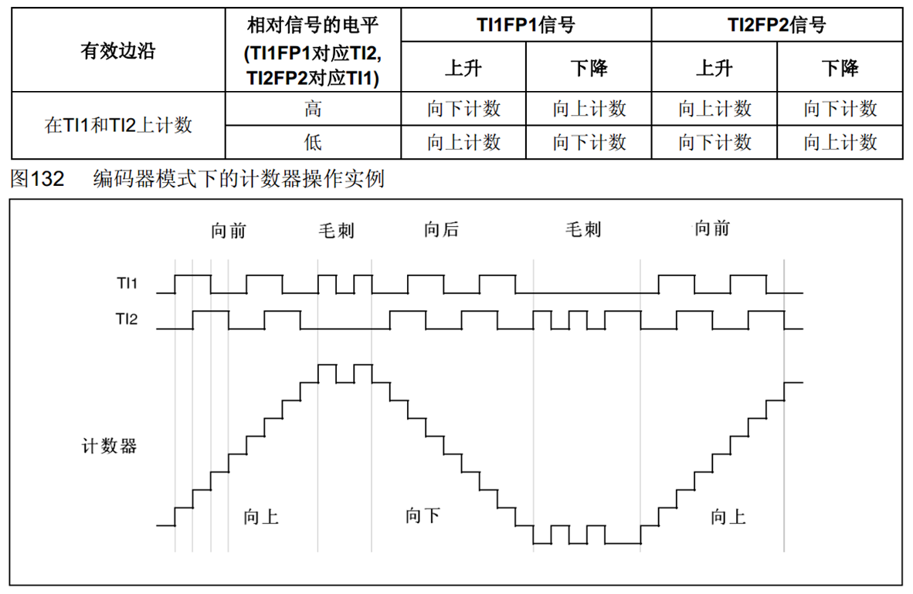

#### 实例（TI1反相）

对TI1的极性进行反转

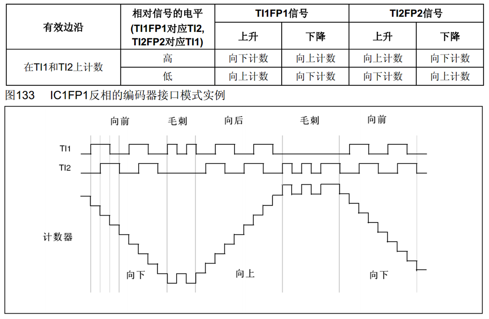

对TI1的极性进行反转，才能得到图中的结果

如果正反自增自减不是想要的结果，可以选择更改其中一个极性

#### HAL库

##### **常用函数**

````c
//编码器初始化
HAL_StatusTypeDef HAL_TIM_Encoder_Init(TIM_HandleTypeDef *htim,  TIM_Encoder_InitTypeDef *sConfig)
//编码器解初始化
HAL_StatusTypeDef HAL_TIM_Encoder_DeInit(TIM_HandleTypeDef *htim)

__weak void HAL_TIM_Encoder_MspInit(TIM_HandleTypeDef *htim)

__weak void HAL_TIM_Encoder_MspDeInit(TIM_HandleTypeDef *htim)

//开启编码器
HAL_TIM_Encoder_Start(TIM_HandleTypeDef *htim, uint32_t Channel)
//关闭编码器
HAL_TIM_Encoder_Stop(TIM_HandleTypeDef *htim, uint32_t Channel)

    
//开启成功中断
HAL_TIM_Encoder_Start_IT(TIM_HandleTypeDef *htim, uint32_t Channel)   //内部__HAL_TIM_ENABLE_IT(htim, TIM_IT_CCx);
//关闭成功中断
HAL_TIM_Encoder_Stop_IT(TIM_HandleTypeDef *htim, uint32_t Channel)

//开启DMA
HAL_StatusTypeDef HAL_TIM_Encoder_Start_DMA(TIM_HandleTypeDef *htim, uint32_t Channel, uint32_t *pData1,uint32_t *pData2, uint16_t Length)
//关闭DMA
HAL_StatusTypeDef HAL_TIM_Encoder_Stop_DMA(TIM_HandleTypeDef *htim, uint32_t Channel)

//获得counter值
__HAL_TIM_GET_COUNTER(__HANDLE__);
//获取编码器方向
__HAL_TIM_IS_TIM_COUNTING_DOWN(__HANDLE__);
````

**编码器结构体**

````c
typedef struct{
  uint32_t EncoderMode;     // 编码器计数模式，TI1,TI2,TI12
  uint32_t IC1Polarity;     // 极性
  uint32_t IC1Selection;    // 选择方向
  uint32_t IC1Prescaler;    // 分频：即多少个脉冲计数一次
  uint32_t IC1Filter;    
  uint32_t IC2Polarity;  
  uint32_t IC2Selection;  
  uint32_t IC2Prescaler;  
  uint32_t IC2Filter;     
} TIM_Encoder_InitTypeDef;
````

````c
//EncoderMode 编码器计数模式
#define TIM_ENCODERMODE_TI1                                                 
#define TIM_ENCODERMODE_TI2                                                                    
#define TIM_ENCODERMODE_TI12

// IC1Polarity 极性
#define  TIM_ENCODERINPUTPOLARITY_RISING     // 不反转
#define  TIM_ENCODERINPUTPOLARITY_FALLING    // 反转

// IC1Selection 
#define TIM_ICSELECTION_DIRECTTI
#define TIM_ICSELECTION_INDIRECTTI
#define TIM_ICSELECTION_TRC   

// IC1Prescaler 分频：即多少个脉冲计数一次
#define TIM_ICPSC_DIV1
#define TIM_ICPSC_DIV2
#define TIM_ICPSC_DIV4
#define TIM_ICPSC_DIV8  
````

##### 编码器接口测速

使用TIM2的CH1和CH2（PA0,PA1）

````c
TIM_HandleTypeDef TIM_HandleStructure;
TIM_Encoder_InitTypeDef TIM_Encoder_InitStructure;
void Encoder_Init(void){
    TIM_HandleStructure.Instance = TIM2;
    TIM_HandleStructure.Init.Prescaler = 0;
    TIM_HandleStructure.Init.Period = 65535;
    TIM_HandleStructure.Init.CounterMode = TIM_COUNTERMODE_UP;
    
    TIM_Encoder_InitStructure.EncoderMode = TIM_ENCODERMODE_TI12 ;           // 通道12都计数
    TIM_Encoder_InitStructure.IC1Filter = 0;                                 // 无滤波
    TIM_Encoder_InitStructure.IC1Polarity = TIM_ENCODERINPUTPOLARITY_RISING; // 极性不反转
    TIM_Encoder_InitStructure.IC1Prescaler =  TIM_ICPSC_DIV1;                // 不分频，一个上升沿产生一个计数
    TIM_Encoder_InitStructure.IC1Selection = TIM_ICSELECTION_DIRECTTI;       // 不反转
    TIM_Encoder_InitStructure.IC2Filter = 0;
    TIM_Encoder_InitStructure.IC2Polarity = TIM_ENCODERINPUTPOLARITY_RISING;
    TIM_Encoder_InitStructure.IC2Prescaler = TIM_ICPSC_DIV1;
    TIM_Encoder_InitStructure.IC2Selection = TIM_ICSELECTION_DIRECTTI;
    
    HAL_TIM_Encoder_Init(&TIM_HandleStructure,&TIM_Encoder_InitStructure);   // 初始化
    HAL_TIM_Encoder_Start(&TIM_HandleStructure,TIM_CHANNEL_ALL);             // 使能
}
void HAL_TIM_Encoder_MspInit(TIM_HandleTypeDef *htim){
    if(htim->Instance == TIM2){   
        GPIO_InitTypeDef gpio_init_struct;
        __HAL_RCC_TIM2_CLK_ENABLE();                  

        gpio_init_struct.Pin = GPIO_PIN_0 | GPIO_PIN_1;
        gpio_init_struct.Mode = GPIO_MODE_INPUT;           
        gpio_init_struct.Pull = GPIO_NOPULL;       
        gpio_init_struct.Speed = GPIO_SPEED_FREQ_HIGH;
        HAL_GPIO_Init(GPIOA, &gpio_init_struct);
    }
}
// 获得速度
int Get_Encoder(void){
    int cnt = __HAL_TIM_GET_COUNTER(&TIM_HandleStructure);
    __HAL_TIM_SET_COUNTER(&TIM_HandleStructure,0);
    return cnt;
}
// 获取方向
int Get_Direction(void){
    return __HAL_TIM_IS_TIM_COUNTING_DOWN(&TIM_HandleStructure);
}
int main(void){
    HAL_Init();                                 /* 初始化HAL库 */
    sys_stm32_clock_init(RCC_PLL_MUL9);         /* 设置时钟,72M */
    delay_init(72);                             /* 初始化延时函数 */
    UART_Init();
    Encoder_Init();
    int cnt = 0;
    uint32_t temp = 0;
    while(1){
        cnt = Get_Encoder();
        printf("encoder:%d \r\n",cnt);
        printf("direction:%d \r\n",Get_Direction());
        delay_ms(1000);
    }
}
````


#### 标准库

##### 常用函数

````c
//初始化编码器接口
/* 参数2
*          #define TIM_EncoderMode_TI1                ((uint16_t)0x0001)    TI1计数
*          #define TIM_EncoderMode_TI2                ((uint16_t)0x0002)    TI2计数
*          #define TIM_EncoderMode_TI12               ((uint16_t)0x0003)    TI12都计数
*  参数3、参数4 
*          @arg TIM_ICPolarity_Falling: IC Falling edge.  反转
*          @arg TIM_ICPolarity_Rising: IC Rising edge.    不反转
*/
void TIM_EncoderInterfaceConfig(TIM_TypeDef* TIMx, uint16_t TIM_EncoderMode,
                                uint16_t TIM_IC1Polarity, uint16_t TIM_IC2Polarity);

uint16_t TIM_GetCounter(TIM_TypeDef* TIMx);               //获取Counter的值
void TIM_SetCounter(TIM_TypeDef* TIMx, uint16_t Counter); //设置Counter的值
````

##### 编码器接口测速

````c
void Encoder_Init(void){
	RCC_APB1PeriphClockCmd(RCC_APB1Periph_TIM3, ENABLE);           //使用TIM3
	RCC_APB2PeriphClockCmd(RCC_APB2Periph_GPIOA, ENABLE);
	
	
	GPIO_InitTypeDef GPIO_InitSturcture;
	GPIO_InitSturcture.GPIO_Mode = GPIO_Mode_IPU;      
	GPIO_InitSturcture.GPIO_Pin = GPIO_Pin_6 | GPIO_Pin_7;         //TIM3的CH1对应PA6，CH2对应PA7
	GPIO_InitSturcture.GPIO_Speed = GPIO_Speed_50MHz;
	GPIO_Init(GPIOA, &GPIO_InitSturcture);
	

	TIM_TimeBaseInitTypeDef TIM_TimeInitSturcture;
	TIM_TimeInitSturcture.TIM_ClockDivision = TIM_CKD_DIV1;
	TIM_TimeInitSturcture.TIM_CounterMode = TIM_CounterMode_Up;
	TIM_TimeInitSturcture.TIM_Period = 65536 - 1;
	TIM_TimeInitSturcture.TIM_Prescaler = 1 - 1;
	TIM_TimeInitSturcture.TIM_RepetitionCounter =  0;
	TIM_TimeBaseInit(TIM3,&TIM_TimeInitSturcture);
	
	TIM_ICInitTypeDef TIM_ICinitStructure;                         //结构体配置，只需要配置极个别属性
	TIM_ICStructInit(&TIM_ICinitStructure);
	TIM_ICinitStructure.TIM_Channel = TIM_Channel_1;
	TIM_ICinitStructure.TIM_ICFilter = 0xf;
	TIM_ICInit(TIM3, &TIM_ICinitStructure);
	
	TIM_ICinitStructure.TIM_Channel = TIM_Channel_2;
	TIM_ICinitStructure.TIM_ICFilter = 0xf;
	TIM_ICInit(TIM3, &TIM_ICinitStructure);
	
	TIM_EncoderInterfaceConfig(TIM3, TIM_EncoderMode_TI12,TIM_ICPolarity_Rising, TIM_ICPolarity_Falling);  //编码器接口初始化
	
	TIM_Cmd(TIM3,ENABLE);
}

int16_t Get_Encoder(void){
	int16_t Temp = TIM_GetCounter(TIM3);
	//TIM_SetCounter(TIM3,0);
	return Temp;                 //获得Count值
}

int main(void)
{
	OLED_Init();
	Encoder_Init();
	OLED_ShowString(1,1,"Speed:");
	while (1)
	{
		OLED_ShowSignedNum(1,7, Get_Encoder(), 5);
		Delay_ms(1000);
	}
}
````

## 高级定时器

TIM1/TIM8

**主要特性**

* 16位递增、递减、中心对齐计数器（计数值：0~65535）~
* 16位预分频器（分频系数：1~65536）
* 可用于触发DAC、ADC
* 在更新事件、触发事件、输入捕获、输出比较时，会产生中断/DMA请求
* 4个独立通道，可用于：输入捕获、输出比较、输出PWM、单脉冲模式
* 使用外部信号控制定时器且可实现多个定时器互连的同步电路
* 支持编码器和霍尔传感器电路等
* **重复计数器**
* **死区时间带可编程的互补输出**
* **断路输入，用于将定时器的输出信号置于用户可选的安全配置中**


**高级定时器的中断函数**：TIM1和TIM8有多个中断函数

    TIM1_BRK_IRQHandler        ; TIM1 Break
    TIM1_UP_IRQHandler         ; TIM1 Update
    TIM1_TRG_COM_IRQHandler    ; TIM1 Trigger and Commutation
    TIM1_CC_IRQHandler         ; TIM1 Capture Compare

**框图**

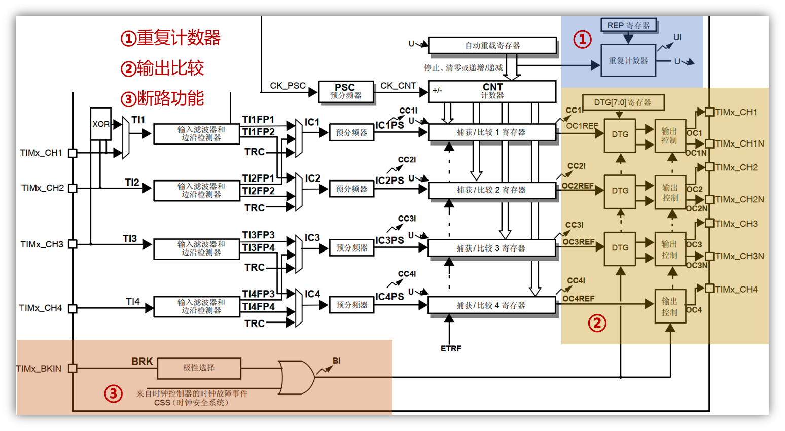

### **重复计数器**

重复计数器RCR

* 在基本/通用定时器发生上溢/下溢事件时直接就生成更新时间，但对于高级定时器却不是这样，高级控制定时器在硬件结构上多出了重复计数器，计数器每次上溢或下溢都能使重复计数器减1，当重复计数器减到0时，再发生一次溢出就会产生更新事件
* 如果设置RCR为N，更新事件将在N+1次溢出时发生
* 通过TIM1/8->RCR 设置RCR的值

可用于输出指定个数PWM：比如TIM8->RCR = 10，当溢出11次后，产生更新中断，在更新中断中停止TIM：TIM8->CR1 &= ~(1 << 0);


### 互补输出**死区控制**

互补输出：即OCx和OCxN，一路输出高电平时另一路输出低电平

死区控制：输出的两路PWM(互补),存在延迟，一路输出PWM高电平时，另一路延迟输出PWM低电平；


刹车控制：停止所有PWM的输出

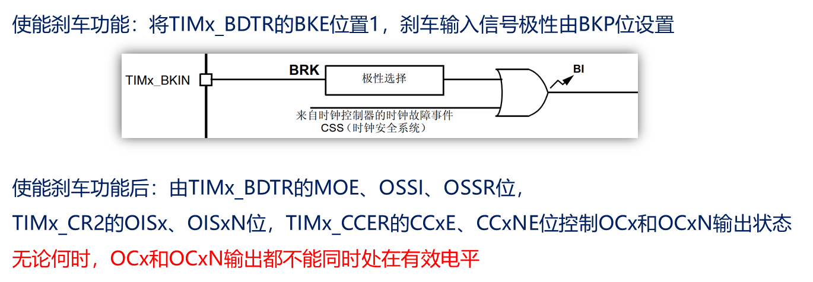

#### 常用函数


**带死区控制的互补输出应用之H桥**


OC1导通：Q1和Q4分别导通，电机正转

OC1N导通：Q2和Q3分别导通，电机反转


互补输出：常用与控制电机正反转

死区控制：由于元器件是有延迟特性，所以需要加上死区时间控制；即控制电机正反转时，正转切换反转时要有一个延迟，防止短路


**框图**


**死区时间计算**

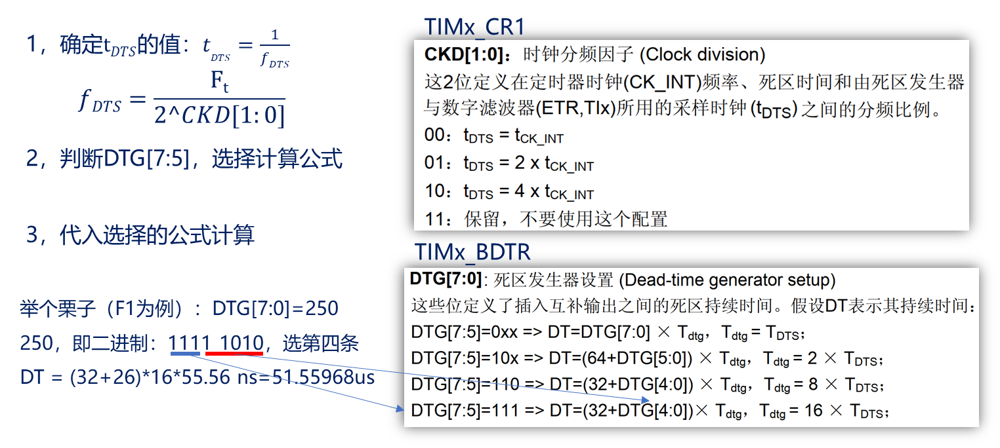


|              函数               |    主要寄存器     |             主要功能             |
| :-----------------------------: | :---------------: | :------------------------------: |
|       HAL_TIM_PWM_Init()        |   CR1、ARR、PSC   |       初始化定时器基础参数       |
|      HAL_TIM_PWM_MspInit()      |        无         | 存放NVIC、CLOCK、GPIO初始化代码  |
|   HAL_TIM_PWM_ConfigChannel()   | CCMRx、CCRx、CCER | 配置PWM模式、比较值、输出极性等  |
| HAL_TIMEx_ConfigBreakDeadTime() |       BDTR        |     配置刹车功能、死区时间等     |
|       HAL_TIM_PWM_Start()       |     CCER、CR1     |   使能输出、主输出、启动计数器   |
|     HAL_TIMEx_PWMN_Start()      |     CCER、CR1     | 使能互补输出、主输出、启动计数器 |

````c
typedef struct { 
   uint32_t OCMode; 	    /* 输出比较模式选择 */
   uint32_t Pulse; 	        /* 设置比较值 */
   uint32_t OCPolarity;     /* 设置输出比较极性 */
   uint32_t OCNPolarity;    /* 设置互补输出比较极性 */
   uint32_t OCFastMode;     /* 使能或失能输出比较快速模式 */
   uint32_t OCIdleState;    /* 空闲状态下OCx输出 */
   uint32_t OCNIdleState;   /* 空闲状态下OCxN输出 */ 
} TIM_OC_InitTypeDef;
typedef struct {
    uint32_t OffStateRunMode;    /* 运行模式下的关闭状态选择 */ 
    uint32_t OffStateIDLEMode;   /* 空闲模式下的关闭状态选择 */ 
    uint32_t LockLevel; 		 /* 寄存器锁定设置 */ 
    uint32_t DeadTime; 	         /* 死区时间设置 */ 
    uint32_t BreakState; 	     /* 是否使能刹车功能 */ 
    uint32_t BreakPolarity;		 /* 刹车输入极性 */ 
    uint32_t BreakFilter; 		 /* 刹车输入滤波器(F1/F4系列没有) */ 
    uint32_t AutomaticOutput; 	 /* 自动恢复输出使能，即使能AOE位 */
} TIM_BreakDeadTimeConfigTypeDef;
````


#### **案例**

互补输出带死区控制实验

* 通过定时器1通道1输出频率为1KHz，占空比为70%的PWM，使用PWM模式1：PSC=71，ARR=999，CCR = 700

* 使能互补输出并设置死区时间控制：设置DTG为100(5.56us),进行验证死区时间是否正确

  ​	以4分频为例：100转二进制01100100，根据上方图表的公式：100*1/72000000/4 = 5.56us

* 使能刹车功能：刹车输入信号高电平有效（当有高电平输入时，停止PWM输出），配置输出空闲状态等，最后用示波器验证

* TIM1_CH1复用在了PE9,TIM1_CH1N -->PE8,TIM1_BKIN-->PE15

````c
TIM_HandleTypeDef g_timx_cplm_pwm_handle;                                  /* 定时器x句柄 */
TIM_BreakDeadTimeConfigTypeDef g_sbreak_dead_time_config;                  /* 死区时间设置 */

/* 高级定时器 互补输出 初始化函数（使用PWM模式1） */
void atim_timx_cplm_pwm_init(){
    TIM_OC_InitTypeDef tim_oc_cplm_pwm = {0};

    g_timx_cplm_pwm_handle.Instance = TIM1;                                 /* 定时器x */
    g_timx_cplm_pwm_handle.Init.Prescaler = 72-1;                           /* 定时器预分频系数 */
    g_timx_cplm_pwm_handle.Init.CounterMode = TIM_COUNTERMODE_UP;           /* 递增计数模式 */
    g_timx_cplm_pwm_handle.Init.Period = 1000-1;                            /* 自动重装载值 */
    /* CKD[1:0] = 10, tDTS = 4 * tCK_INT = Ft / 4 = 18Mhz */
    g_timx_cplm_pwm_handle.Init.ClockDivision = TIM_CLOCKDIVISION_DIV4;    
    HAL_TIM_PWM_Init(&g_timx_cplm_pwm_handle);

    tim_oc_cplm_pwm.OCMode = TIM_OCMODE_PWM1;                               /* PWM模式1 */
    tim_oc_cplm_pwm.Pulse = 700 - 1;                                        /* CCR */
    tim_oc_cplm_pwm.OCPolarity = TIM_OCPOLARITY_HIGH;                       /* OCy 高电平有效 */
    tim_oc_cplm_pwm.OCNPolarity = TIM_OCNPOLARITY_HIGH;                     /* OCyN 高电平有效 */
    tim_oc_cplm_pwm.OCIdleState = TIM_OCIDLESTATE_RESET;                    /* 当MOE=0，OCx=0 */
    tim_oc_cplm_pwm.OCNIdleState = TIM_OCNIDLESTATE_RESET;                  /* 当MOE=0，OCxN=0 */
    HAL_TIM_PWM_ConfigChannel(&g_timx_cplm_pwm_handle, &tim_oc_cplm_pwm, TIM_CHANNEL_1);

    /* 设置死区参数，开启死区中断 */
    g_sbreak_dead_time_config.DeadTime = 100 - 1;                           /* 死区时间 */
    g_sbreak_dead_time_config.OffStateRunMode = TIM_OSSR_DISABLE;           /* 运行模式的关闭输出状态 */
    g_sbreak_dead_time_config.OffStateIDLEMode = TIM_OSSI_DISABLE;          /* 空闲模式的关闭输出状态 */
    g_sbreak_dead_time_config.LockLevel = TIM_LOCKLEVEL_OFF;                /* 不用寄存器锁功能 */
    g_sbreak_dead_time_config.BreakState = TIM_BREAK_ENABLE;                /* 使能刹车输入 */
    g_sbreak_dead_time_config.BreakPolarity = TIM_BREAKPOLARITY_HIGH;       /* 刹车输入有效信号极性为高 */
    g_sbreak_dead_time_config.AutomaticOutput = TIM_AUTOMATICOUTPUT_ENABLE; /* 使能AOE位，允许刹车结束后自动恢复输出 */
    HAL_TIMEx_ConfigBreakDeadTime(&g_timx_cplm_pwm_handle, &g_sbreak_dead_time_config); //配置刹车功能、死区时间等

    HAL_TIM_PWM_Start(&g_timx_cplm_pwm_handle, TIM_CHANNEL_1);              /* OCy 输出使能 */
    HAL_TIMEx_PWMN_Start(&g_timx_cplm_pwm_handle,TIM_CHANNEL_1);            /* OCyN 输出使能 */
}

/* 定时器 PWM输出 MSP初始化函数 */
void HAL_TIM_PWM_MspInit(TIM_HandleTypeDef *htim)
{
    if (htim->Instance == TIM1)
    {
        GPIO_InitTypeDef gpio_init_struct = {0};

        __HAL_RCC_TIM1_CLK_ENABLE();
        __HAL_RCC_GPIOE_CLK_ENABLE();

        gpio_init_struct.Pin = GPIO_PIN_9;
        gpio_init_struct.Mode = GPIO_MODE_AF_PP; 
        gpio_init_struct.Pull = GPIO_PULLDOWN;
        gpio_init_struct.Speed = GPIO_SPEED_FREQ_HIGH ;
        HAL_GPIO_Init(GPIOE, &gpio_init_struct);

        gpio_init_struct.Pin = GPIO_PIN_8;
        HAL_GPIO_Init(GPIOE, &gpio_init_struct);

        gpio_init_struct.Pin = GPIO_PIN_15;
        HAL_GPIO_Init(GPIOE, &gpio_init_struct);

        __HAL_RCC_AFIO_CLK_ENABLE();
        __HAL_AFIO_REMAP_TIM1_ENABLE();       // 复用AFIO
    }
}
int main(void){
    HAL_Init();                                /* 初始化HAL库 */
    sys_stm32_clock_init(RCC_PLL_MUL9);        /* 设置时钟, 72Mhz */
    delay_init(72);                            /* 延时初始化 */

    atim_timx_cplm_pwm_init();
    while (1){
    }
}
````

# RTC

## RTC简介

实时时钟(Real Time Clock，RTC)，本质是一个计数器，计数频率常为秒，专门用来记录时间,在相应软件配置下，可提供时钟日历的功能。修改计数器的值可以重新设置系统当前的时间和日期。


实时时钟与定时器的区别：

* 实时时钟：能提供时间（秒钟数）、能在MCU掉电后运行、低功耗
* 普通定时器无法掉电运行！

**常用的RTC方案**

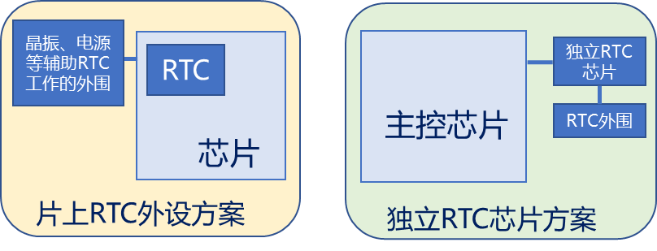

| **对比因素** | **内部RTC**      | **外置RTC**      |
| ------------ | ---------------- | ---------------- |
| **信息差异** | 提供秒/亚秒信号  | 提供秒信号和日历 |
| **功耗**     | 功耗高           | 功耗低           |
| **体积**     | 不用占用额外体积 | 体积大           |
| **成本**     | 成本低           | 成本高           |

1. 一般都需要设计RTC外围电路；
2. 一般都可以给RTC设置独立的电源；
3. 多数RTC的寄存器采用BCD码存储时间信息；

**RTC特性**

* 可编程的预分频系数：分频系数最高为2^20
* 32位的可编程计数器，可用于较长时间段的测量。（若最小单位为秒：=4,294,967,295秒=49,710天  大概136年。）
* 2个分离的时钟：用于APB1接口的PCLK1和RTC时钟(RTC时钟的频率必须小于PCLK1时钟频率的四分之一以上)。
* 可以选择以下三种RTC的时钟源：
  * HSE时钟除以128 
  * LSE振荡器时钟 32.768kHz（常用的是外部低速，稳定精准，重要的是VDD掉电后可有后备供电区域给它供电）
  * LSI振荡器时钟 40kHz
* 2个独立的复位类型：
  * APB1接口由系统复位；
  * RTC核心(预分频器、闹钟、计数器和分频器)只能由后备域复位。（可导致后备区域复位：侵入事件、软件复位、VBAT掉电）

* 3个专门的可屏蔽中断：
  * 闹钟中断，用来产生一个软件可编程的闹钟中断。
  * 秒中断，用来产生一个可编程的周期性中断信号(最长可达1秒)。
  * 溢出中断，指示内部可编程计数器溢出并回转为0的状态。


**RTC框图**


* 系统通过APB1总线对后备区域的RTC进行通信，三斜杠的意思是可断开，因为在系统掉电的时候RTC是独立的，只有在系统运行时才有可能会相通。RTCCLK（RTC时钟输入）必须小于PCLK1（低速AHB时钟）的三分之一以上。
* RTC_PRL（预分频装载寄存器）的值决定TR_CLK脉冲产生的周期，RTC_DIV（预分频器余数寄存器）可读不可写，当RTCCLK的一个上升沿到来，RTC_DIV的值减1，减到0后硬件重载为RTC_PRL的值同时产生一个TR_CLK脉冲，一个TR_CLK脉冲的到来会使RTC_CNT（计数器寄存器）的值加1，同时产生一个RTC_Second中断（由软件配置是否使能，“秒中断”并不一定是一秒触发一次，具体是根据RTC时钟和RTC_PRL的值决定）。
* 当RTC_CNT的值溢出后从0开始，并产生一个溢出中断（由软件配置是否使能）。当RTC_CNT等于RTC_CNTRTC_ALR（闹钟寄存器）时，产生一个闹钟中断（由软件配置是否使能，可在用在系统待机模式下唤醒系统）。
* RTC_CR（RTC控制寄存器）不在后备区域，所以它的数据会随系统复位而复位，也就是说当系统下电是，秒中断、溢出中断、闹钟中断就不存在了，在下一次系统上电时需要重新初始化。图中“退出待机模式”有两种方法：RTC闹钟、WKUP引脚。
  

## 寄存器

### RTC寄存器

**RTC 控制寄存器（RTC_CRH/CRL）**：RTC 控制寄存器共有两个控制寄存器 RTC_CRH 和 RTC_CRL，两个都是 16 位的。


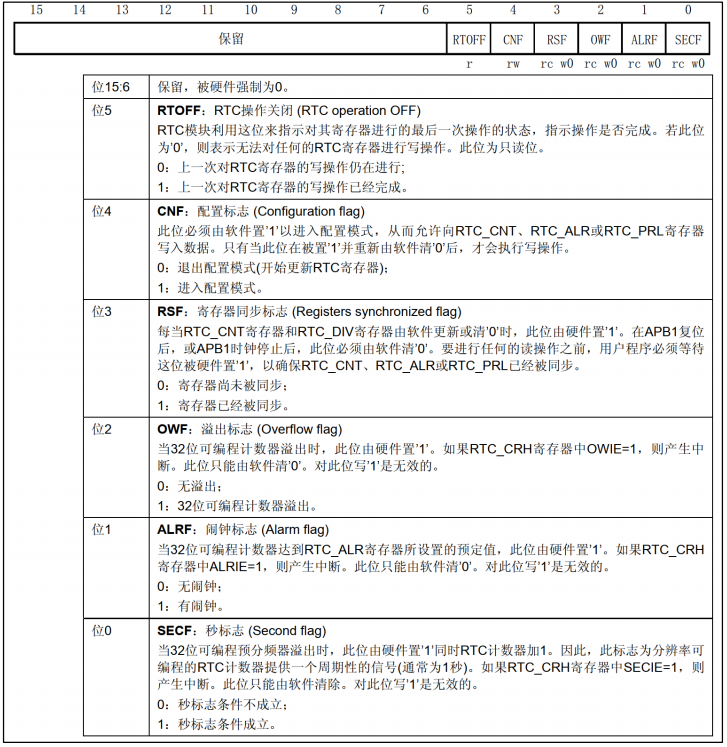

该寄存器是 RTC 控制寄存器低位，本章我们用到的是该寄存器的 0，3~5 这几个位，

第 0位是秒钟标志位，我们在进入闹钟中断的时候，通过判断这位来决定是不是发生了秒钟中断。然后必须通过软件将该位清零（写零）。

第 3 位为寄存器同步标志位，我们在修改控制寄存器RTC_CRH/RTC_CRL 之前，必须先判断该位，是否已经同步了，如果没有则需要等待同步，在没同步的情况下修改 RTC_CRH/RTC_CRL 的值是不行的。

第 4 位为配置标志位，在软件修改RTC_CNT/RTC_PRL 的值的时候，必须先软件置位该位，以允许进入配置模式。

第 5 位为 RTC操作位，该位由硬件操作，软件只读。通过该位可以判断上次对 RTC 寄存器的操作是否完成，如果没有，我们必须等待上一次操作结束才能开始下一次操作。

**RTC 预分频装载寄存器（RTC_PRLH/RTC_PRLL）**

RTC 预分频装载寄存器也是有两个寄存器组成，RTC_PRLH 和 RTC_PRLL。这两个寄存器用来配置 RTC 时钟的分频数的，比如我们使用外部 32.768K 的晶振作为时钟的输入频率，那么我们要设置这两个寄存器的值为 32767，得到一秒钟的计数频率。

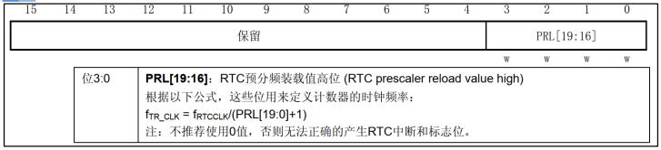


该寄存器是 RTC 预分频装载寄存器低位，存放 RTC 预分频装载值低位。如果输入时钟是32.768kHz，这个预分频寄存器中写入 7FFFF 可获得周期 1 秒钟的信号。

与RTC_PRL相似的寄存器RTC_DIV可以在不停止分频计数器的工作，获得预分频计数器的当前值。


**RTC 计数器寄存器（RTC_CNTH/RTC_CNTL）**

RTC 计数器寄存器 RTC_CNT，由 2 个 16 位寄存器组成 RTC_CNTH 和 RTC_CNTL，总共32 位，用来记录秒钟值。注意的是，修改这两个寄存器的时候要先进入配置模式。

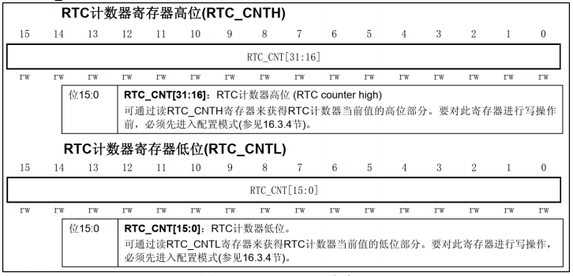

**RTC 闹钟寄存器（RTC_ALRH/RTC_ALRL）**

RTC 闹钟寄存器，该寄存器也是由 2 个 16 位的寄存器组成 RTC_ALRH 和 RTC_ALRL。总共 32 位，用来标记闹钟产生的时间（以秒为单元）。对于 STM32F1 系列的芯片来说，RTC 外设没有专门的年月日寄存器来分别存放这些信息，全部日期信息以秒的格式存储在这两个寄存器中，可以在编程中对时间进行特殊处理。如果 RTC_CNT 的值与 RTC_ALR 的值相等，并使能了中断的话，会产生一个闹钟中断。注意：该寄存器的修改也是要进入配置模式才能进行。

**备份数据寄存器（BKP_DRx）**


该寄存器是一个 16 位寄存器，可以用来存储用户数据，可在 VDD 电源关闭时，通过 VBAT保持上电状态。备份数据寄存器不会在系统复位、电源复位、从待机模式唤醒时复位。

那么在 MCU 复位后，对 RTC 和备份数据寄存器的写访问就被禁止，需要执行以下操作才可以对 RTC 及备份数据寄存器进行写访问：

1) 通过设置寄存器 RCC_APB1ENR 的 PWREN 和 BKPEN 位来打开电源和后备接口时钟
2) 电源控制寄存器(PWR_CR)的 DBP 位来使能对后备寄存器和 RTC 访问


### 相关寄存器

**RCC_APB1ENR寄存器**：使能PWR && BKP时钟

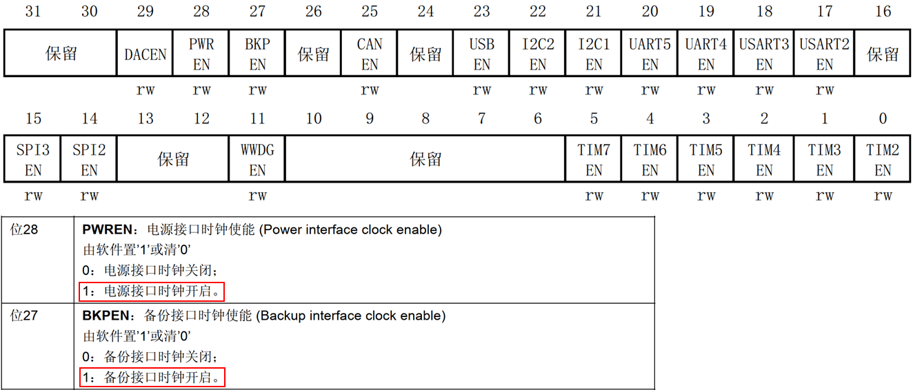

**PWR_CR寄存器**：使能后备域和RTC的访问权限


**备份区域控制寄存器（RCC_BDCR）**


RTC 的时钟源选择及使能设置都是通过这个寄存器来实现的，所以我们在 RTC 操作之前先要通过这个寄存器选择 RTC 的时钟源，然后才能开始其他的操作。

## 常用函数

|            驱动函数            |    关联寄存器     |       功能描述        |
| :----------------------------: | :---------------: | :-------------------: |
|       HAL_RTC_Init(...)        | CRL/CRH/PRLH/PRLL |       初始化RTC       |
|       HAL_RTC_MspInit(…)       |    初始化回调     |      使能RTC时钟      |
|      HAL_RCC_OscConfig(…)      |   RCC_CR/PWR_CR   |     开启LSE时钟源     |
| HAL_RCCEx_PeriphCLKConfig(...) |     RCC_BDCR      |  设置RTC时钟源为LSE   |
| HAL_PWR_EnableBkUpAccess(...)  |      PWR_CR       | 使能备份域的访问权限  |
|   HAL_RTCEx_BKUPWrite/Read()   |      BKP_DRx      | 读/写备份域数据寄存器 |

````c
typedef struct{
    RTC_TypeDef *Instance;   		/* 寄存器基地址 指向 RTC 寄存器基地址*/
    RTC_InitTypeDef Init;    		/* RTC 配置结构体 */
    RTC_DateTypeDef DataToUpdata;   /* RTC 日期结构体 */
    HAL_LockTypeDef Lock; 			/* RTC 锁定对象 */
    __IO HAL_RTCStateTypeDef State; /* RTC 设备访问状态 */
}RTC_HandleTypeDef;
typedef struct{
	uint32_t AsynchPrediv;				/* 异步预分频系数 */
	uint32_t OutPut;					/* 被发送到 RTC Tamper 引脚的信号 */ 
}RTC_InitTypeDef;
````

* AsynchPrediv 用来设置 RTC 的异步预分频系数，也就是设置两个预分频重载寄存器的相关位，因为异步预分频系数是 19 位，所以最大值为 0x7FFFF，不能超过这个值。
* OutPut 用来选择 RTC 输出到 Tamper 引脚的信号，取值为：RTC_OUTPUTSOURCE_NONE（没有输出），RTC_OUTPUTSOURCE_CALIBCLOCK（RTC时钟经过64分频输出到TAMPER），RTC_OUTPUTSOURCE_ALARM（闹钟脉冲信号输出）和 RTC_ OUTPUTSOURCE_SECOND（秒脉冲信号输出）。本实验选择没有输出，不配置即默认值，RTC_OUTPUTSOURCE_NONE。


开启时钟

````c
__HAL_RCC_RTC_ENABLE()
__HAL_RCC_PWR_CLK_ENABLE()
__HAL_RCC_BKP_CLK_ENABLE()
````

中断

````c
__HAL_RTC_ALARM_ENABLE_IT();
#define RTC_IT_OW            RTC_CRH_OWIE       /*!< Overflow interrupt */
#define RTC_IT_ALRA          RTC_CRH_ALRIE      /*!< Alarm interrupt */
#define RTC_IT_SEC           RTC_CRH_SECIE      /*!< Second interrupt */
#define RTC_IT_TAMP1         BKP_CSR_TPIE       /*!< TAMPER Pin interrupt enable */
__HAL_RTC_ALARM_GET_FLAG();
__HAL_RTC_ALARM_CLEAR_FLAG();
#define RTC_FLAG_RTOFF       RTC_CRL_RTOFF      /*!< RTC Operation OFF flag */
#define RTC_FLAG_RSF         RTC_CRL_RSF        /*!< Registers Synchronized flag */
#define RTC_FLAG_OW          RTC_CRL_OWF        /*!< Overflow flag */
#define RTC_FLAG_ALRAF       RTC_CRL_ALRF       /*!< Alarm flag */
#define RTC_FLAG_SEC         RTC_CRL_SECF       /*!< Second flag */
#define RTC_FLAG_TAMP1F      BKP_CSR_TEF        /*!< Tamper Interrupt Flag */
````


**案例**

````c
RTC_HandleTypeDef g_rtc_handle; /* RTC控制句柄 */
_calendar_obj calendar;         /* 时钟结构体 */

// 主要为了掉电重启后，不让他初始化RTC 计数器寄存器（RTC_CNTH/RTC_CNTL）的值，初始化的话不就是和掉电丢失一样嘛。
/** 
 * @brief       RTC写入后备区域SRAM
 * @param       bkrx : 后备区寄存器编号,范围:0~41 对应 RTC_BKP_DR1~RTC_BKP_DR42
 */
void rtc_write_bkr(uint32_t bkrx, uint16_t data){
    HAL_PWR_EnableBkUpAccess(); /* 取消备份区写保护 */
    HAL_RTCEx_BKUPWrite(&g_rtc_handle, bkrx + 1, data);
}
/**
 * @brief       RTC读取后备区域SRAM
 * @param       bkrx : 后备区寄存器编号,范围:0~41对应 RTC_BKP_DR1~RTC_BKP_DR42
 */
uint16_t rtc_read_bkr(uint32_t bkrx){
    uint32_t temp = 0;
    temp = HAL_RTCEx_BKUPRead(&g_rtc_handle, bkrx + 1);
    return (uint16_t)temp; /* 返回读取到的值 */
}

/**
 *              默认尝试使用LSE,当LSE启动失败后,切换为LSI.
 *              通过BKP寄存器0的值,可以判断RTC使用的是LSE/LSI:
 *              当BKP0==0X5050时,使用的是LSE
 *              当BKP0==0X5051时,使用的是LSI
 *              注意:切换LSI/LSE将导致时间/日期丢失,切换后需重新设置.
 */
uint8_t rtc_init(void){
    /* 检查是不是第一次配置时钟 */
    uint16_t bkpflag = 0;
   
    __HAL_RCC_PWR_CLK_ENABLE(); /* 使能电源时钟 */
    __HAL_RCC_BKP_CLK_ENABLE(); /* 使能备份时钟 */
    HAL_PWR_EnableBkUpAccess(); /* 取消备份区写保护 */

    g_rtc_handle.Instance = RTC;
    g_rtc_handle.Init.AsynchPrediv = 32767; /*时钟周期设置,理论值：32767, 这里也可以用 RTC_AUTO_1_SECOND */
    g_rtc_handle.Init.OutPut = RTC_OUTPUTSOURCE_NONE;

	bkpflag = rtc_read_bkr(0);  /* 读取BKP0的值 */
    
    // 只有第一次初始化，掉电重启后，不进行初始化
    if ((bkpflag != 0X5050) && (bkpflag != 0x5051)){        /* 之前未初始化过，重新配置 */
        rtc_set_time(2020, 4, 25, 20, 25, 35);              /* 设置时间 */
    }

    __HAL_RTC_ALARM_ENABLE_IT(&g_rtc_handle, RTC_IT_SEC);   /* 允许秒中断 */
    
    HAL_NVIC_SetPriority(RTC_IRQn, 0x2, 0);                 /* 优先级设置 */
    HAL_NVIC_EnableIRQ(RTC_IRQn);                           /* 使能RTC中断通道 */
    rtc_get_time(); /* 更新时间 */
    
    return 0;
}

void HAL_RTC_MspInit(RTC_HandleTypeDef *hrtc){
    uint16_t retry = 200;
    
    __HAL_RCC_RTC_ENABLE(); /* RTC时钟使能 */

    RCC_OscInitTypeDef rcc_oscinitstruct;
    RCC_PeriphCLKInitTypeDef rcc_periphclkinitstruct;
    
    /* 使用寄存器的方式去检测LSE是否可以正常工作 */
    RCC->BDCR |= 1 << 0;    /* 开启外部低速振荡器LSE */
    
    while (retry && ((RCC->BDCR & 0X02) == 0)){  /* 等待LSE准备好 */
        retry--;
        delay_ms(5);
    }
    // 如果LSE能起作用，就用LSE，否则使用LEI 
    if (retry == 0){     /* LSE起振失败 使用LSI */
        rcc_oscinitstruct.OscillatorType = RCC_OSCILLATORTYPE_LSI;  /* 选择要配置的振荡器 */
        rcc_oscinitstruct.LSEState = RCC_LSI_ON;                    /* LSI状态：开启 */
        rcc_oscinitstruct.PLL.PLLState = RCC_PLL_NONE;              /* PLL无配置 */
        HAL_RCC_OscConfig(&rcc_oscinitstruct);                      /* 配置设置的rcc_oscinitstruct */

        rcc_periphclkinitstruct.PeriphClockSelection = RCC_PERIPHCLK_RTC;   /* 选择要配置的外设 RTC */
        rcc_periphclkinitstruct.RTCClockSelection = RCC_RTCCLKSOURCE_LSI;   /* RTC时钟源选择 LSI */
        HAL_RCCEx_PeriphCLKConfig(&rcc_periphclkinitstruct);                /* 配置设置的rcc_periphClkInitStruct */
        rtc_write_bkr(0, 0X5051);        /* 将值写入BKP */ 
    }
    else{
        rcc_oscinitstruct.OscillatorType = RCC_OSCILLATORTYPE_LSE ; /* 选择要配置的振荡器 */
        rcc_oscinitstruct.LSEState = RCC_LSE_ON;                    /* LSE状态：开启 */
        rcc_oscinitstruct.PLL.PLLState = RCC_PLL_NONE;              /* PLL不配置 */
        HAL_RCC_OscConfig(&rcc_oscinitstruct);                      /* 配置设置的rcc_oscinitstruct */
        
        rcc_periphclkinitstruct.PeriphClockSelection = RCC_PERIPHCLK_RTC;   /* 选择要配置外设 RTC */
        rcc_periphclkinitstruct.RTCClockSelection = RCC_RTCCLKSOURCE_LSE;   /* RTC时钟源选择LSE */
        HAL_RCCEx_PeriphCLKConfig(&rcc_periphclkinitstruct);                /* 配置设置的rcc_periphclkinitstruct */
        rtc_write_bkr(0, 0X5050);
    }
}

void RTC_IRQHandler(void)
{
    if (__HAL_RTC_ALARM_GET_FLAG(&g_rtc_handle, RTC_FLAG_SEC) != RESET){     /* 秒中断 */
        rtc_get_time();                         /* 更新时间 */
        __HAL_RTC_ALARM_CLEAR_FLAG(&g_rtc_handle, RTC_FLAG_SEC);            /* 清除秒中断 */
        //printf("sec:%d\r\n", calendar.sec);   /* 打印秒钟 */
    }

    /* 顺带处理闹钟标志 */
    if (__HAL_RTC_ALARM_GET_FLAG(&g_rtc_handle, RTC_FLAG_ALRAF) != RESET){   /* 闹钟标志 */
        __HAL_RTC_ALARM_CLEAR_FLAG(&g_rtc_handle, RTC_FLAG_ALRAF);          /* 清除闹钟标志 */
        printf("Alarm Time:%d-%d-%d %d:%d:%d\n", calendar.year, calendar.month, calendar.date, calendar.hour, calendar.min, calendar.sec);
    }
    __HAL_RTC_ALARM_CLEAR_FLAG(&g_rtc_handle, RTC_FLAG_OW);                 /* 清除溢出中断标志 */
    while (!__HAL_RTC_ALARM_GET_FLAG(&g_rtc_handle, RTC_FLAG_RTOFF));       /* 等待RTC寄存器操作完成, 即等待RTOFF == 1 */
}


/**
 * @brief       设置时间, 包括年月日时分秒
 *   @note      以1970年1月1日为基准, 往后累加时间
 *              合法年份范围为: 1970 ~ 2105年
                HAL默认为年份起点为2000年
 */
uint8_t rtc_set_time(uint16_t syear, uint8_t smon, uint8_t sday, uint8_t hour, uint8_t min, uint8_t sec)
{
    uint32_t seccount = 0;

    seccount = rtc_date2sec(syear, smon, sday, hour, min, sec); /* 将年月日时分秒转换成总秒钟数 */

    __HAL_RCC_PWR_CLK_ENABLE(); /* 使能电源时钟 */
    __HAL_RCC_BKP_CLK_ENABLE(); /* 使能备份域时钟 */
    HAL_PWR_EnableBkUpAccess(); /* 取消备份域写保护 */
    /* 上面三步是必须的! */
    
    RTC->CRL |= 1 << 4;         /* 允许配置 */
    
    RTC->CNTL = seccount & 0xffff;
    RTC->CNTH = seccount >> 16;
    
    RTC->CRL &= ~(1 << 4);      /* 配置更新 */

    while (!__HAL_RTC_ALARM_GET_FLAG(&g_rtc_handle, RTC_FLAG_RTOFF));       /* 等待RTC寄存器操作完成, 即等待RTOFF == 1 */

    return 0;
}

/**
 * @brief       设置闹钟, 具体到年月日时分秒
 *   @note      以1970年1月1日为基准, 往后累加时间
 *              合法年份范围为: 1970 ~ 2105年
 */
uint8_t rtc_set_alarm(uint16_t syear, uint8_t smon, uint8_t sday, uint8_t hour, uint8_t min, uint8_t sec){
    uint32_t seccount = 0;

    seccount = rtc_date2sec(syear, smon, sday, hour, min, sec); /* 将年月日时分秒转换成总秒钟数 */

    __HAL_RCC_PWR_CLK_ENABLE(); /* 使能电源时钟 */
    __HAL_RCC_BKP_CLK_ENABLE(); /* 使能备份域时钟 */
    HAL_PWR_EnableBkUpAccess(); /* 取消备份域写保护 */
    /* 上面三步是必须的! */
    
    RTC->CRL |= 1 << 4;         /* 允许配置 */
    
    RTC->ALRL = seccount & 0xffff;
    RTC->ALRH = seccount >> 16;
    
    RTC->CRL &= ~(1 << 4);      /* 配置更新 */

    while (!__HAL_RTC_ALARM_GET_FLAG(&g_rtc_handle, RTC_FLAG_RTOFF));       /* 等待RTC寄存器操作完成, 即等待RTOFF == 1 */
    return 0;
}

/**
 * @brief       得到当前的时间
 *   @note      该函数不直接返回时间, 时间数据保存在calendar结构体里面
 */
void rtc_get_time(void){
    static uint16_t daycnt = 0;
    uint32_t seccount = 0;
    uint32_t temp = 0;
    uint16_t temp1 = 0;
    const uint8_t month_table[12] = {31, 28, 31, 30, 31, 30, 31, 31, 30, 31, 30, 31}; /* 平年的月份日期表 */

    seccount = RTC->CNTH;       /* 得到计数器中的值(秒钟数) */
    seccount <<= 16;
    seccount += RTC->CNTL;

    temp = seccount / 86400;    /* 得到天数(秒钟数对应的) */

    if (daycnt != temp)         /* 超过一天了 */
    {
        daycnt = temp;
        temp1 = 1970;           /* 从1970年开始 */

        while (temp >= 365){
            if (rtc_is_leap_year(temp1)) /* 是闰年 */
            {
                if (temp >= 366){
                    temp -= 366; /* 闰年的秒钟数 */
                }
                else{
                    break;
                }
            }else{
                temp -= 365;    /* 平年 */
            }

            temp1++;
        }

        calendar.year = temp1;  /* 得到年份 */
        temp1 = 0;

        while (temp >= 28){      /* 超过了一个月 */
            if (rtc_is_leap_year(calendar.year) && temp1 == 1){ /* 当年是不是闰年/2月份 */
                if (temp >= 29){
                    temp -= 29; /* 闰年的秒钟数 */
                }
                else{
                    break;
                }
            }
            else{
                if (temp >= month_table[temp1]){
                    temp -= month_table[temp1]; /* 平年 */
                }else{
                    break;
                }
            }
            temp1++;
        }

        calendar.month = temp1 + 1; /* 得到月份 */
        calendar.date = temp + 1;   /* 得到日期 */
    }

    temp = seccount % 86400;                                                    /* 得到秒钟数 */
    calendar.hour = temp / 3600;                                                /* 小时 */
    calendar.min = (temp % 3600) / 60;                                          /* 分钟 */
    calendar.sec = (temp % 3600) % 60;                                          /* 秒钟 */
    calendar.week = rtc_get_week(calendar.year, calendar.month, calendar.date); /* 获取星期 */
}

/**
 * @brief       将年月日时分秒转换成秒钟数
 *   @note      输入公历日期得到星期(起始时间为: 公元0年3月1日开始, 输入往后的任何日期, 都可以获取正确的星期)
 *              使用 基姆拉尔森计算公式 计算, 原理说明见此贴:
 *              https://www.cnblogs.com/fengbohello/p/3264300.html
 */
uint8_t rtc_get_week(uint16_t year, uint8_t month, uint8_t day){
    uint8_t week = 0;
    if (month < 3){
        month += 12;
        --year;
    }
    week = (day + 1 + 2 * month + 3 * (month + 1) / 5 + year + (year >> 2) - year / 100 + year / 400) % 7;
    return week;
}
/**
 * @brief       将年月日时分秒转换成秒钟数
 * @note        以1970年1月1日为基准, 1970年1月1日, 0时0分0秒, 表示第0秒钟
 *              最大表示到2105年, 因为uint32_t最大表示136年的秒钟数(不包括闰年)!
 *              本代码参考只linux mktime函数, 原理说明见此贴:
 *              http://www.openedv.com/thread-63389-1-1.html
 */
static long rtc_date2sec(uint16_t syear, uint8_t smon, uint8_t sday, uint8_t hour, uint8_t min, uint8_t sec){
    uint32_t Y, M, D, X, T;
    signed char monx = smon;    /* 将月份转换成带符号的值, 方便后面运算 */

    if (0 >= (monx -= 2)){       /* 1..12 -> 11,12,1..10 */
        monx += 12;             /* Puts Feb last since it has leap day */
        syear -= 1;
    }

    Y = (syear - 1) * 365 + syear / 4 - syear / 100 + syear / 400; /* 公元元年1到现在的闰年数 */
    M = 367 * monx / 12 - 30 + 59;
    D = sday - 1;
    X = Y + M + D - 719162;                      /* 减去公元元年到1970年的天数 */
    T = ((X * 24 + hour) * 60 + min) * 60 + sec; /* 总秒钟数 */
    return T;
}

/**
 * @brief       判断年份是否是闰年
 *   @note      月份天数表:
 *              月份   1  2  3  4  5  6  7  8  9  10 11 12
 *              闰年   31 29 31 30 31 30 31 31 30 31 30 31
 *              非闰年 31 28 31 30 31 30 31 31 30 31 30 31
 * @param       year : 年份
 * @retval      0, 非闰年; 1, 是闰年;
 */
static uint8_t rtc_is_leap_year(uint16_t year)
{
    /* 闰年规则: 四年闰百年不闰，四百年又闰 */
    if ((year % 4 == 0 && year % 100 != 0) || (year % 400 == 0)){
        return 1;
    }else{
        return 0;
    }
}
````


# ADC数模转换

## ADC简介

* ADC（Analog-Digital Converter）模拟-数字转换器
* ADC可以将引脚上连续变化的模拟电压转换为内存中存储的数字变量，建立模拟电路到数字电路的桥梁
* 12位逐次逼近型ADC，1us转换时间
* 输入电压范围：`0~3.3V`，转换结果范围：`0~4095`
* STM32f103系列有3个ADC，精度为12位，每个ADC最多有16个外部通道。
  * 18个输入通道，可测量16个外部和2个内部信号源
  * 各通道的A/D转换可以单次、连续、扫描或间断执行
* ADC转换的结果可以左对齐或右对齐储存在16位数据寄存器中
* 规则组和注入组两个转换单元
* 模拟看门狗自动监测输入电压范围
* ADC的输入时钟不得超过14MHz，其时钟频率由PCLK2分频产生。


STM32F103C8T6 ADC资源：ADC1、ADC2，10个外部输入通道


### **ADC类型**

| ADC电路类型 | 优点             | 缺点                     |
| ----------- | ---------------- | ------------------------ |
| 并联比较型  | 转换速度最快     | 成本高、功耗高，分辨率低 |
| 逐次逼近型  | 结构简单，功耗低 | 转换速度较慢             |

**并联比较型**


假设参考电压为8V，模拟输入电压为2V，则会进入下方第二个比较器中，最终编码器输出010

**逐次逼近型**


以3位为例：数码寄存器先将高位D2置1，经过D/A转换器输出V0，比较器比较V0和模拟电压的输入，如果模拟电压大于V0，则D2位的1被锁存，否则D2位为0。再次将D2位置1，进行比较……

### ADC特性参数

* 分辨率：表示ADC能辨别的最小模拟量，用二进制位数表示，比如：8、10、12、16位等
* 转换时间：表示完成一次A/D转换所需要的时间，转换时间越短，采样率就可以越高
* 精度(物理量的精准程度)：最小刻度基础上叠加各种误差的参数，精度受ADC性能、温度和气压等影响
* 量化误差：用数字量近似表示模拟量，采用四舍五入原则，此过程产生的误差为量化误差

**各系列ADC特性**


### 转换模式


一种比较少用的模式：不连续采样模式（F1手册称为：间断模式），只适用在扫描模式下。比如：设置成2，这第一次扫描1 2通道，第二次扫描3 4通道


### 数据对齐

由于ADC为12位，而数据寄存器为32位(低16位有效)

**数据右对齐**

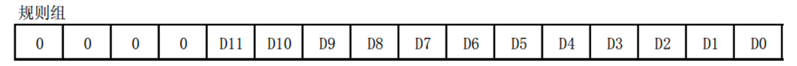

**数据左对齐**


###  校准

* ADC有一个内置自校准模式。校准可大幅减小因内部电容器组的变化而造成的准精度误差。校准期间，在每个电容器上都会计算出一个误差修正码(数字值)，这个码用于消除在随后的转换中每个电容器上产生的误差
* 建议在每次上电后执行一次校准
* 启动校准前， ADC必须处于关电状态超过至少两个ADC时钟周期

### 过采样

STM32F103 自带的 ADC 分辨率只有 12 位，虽然可以满足一般的应用，但是有些场合可能需要更高的分辨率，怎么办呢？可以使用外部专用的 ADC，或者换一个带更高分辨率 ADC 的主控芯片。这样做往往会增加额外的成本，那么有没有其它办法呢？答案是有的，可以通过引入过采样技术来实现。ADC 过采样技术，是利用 ADC 多次采集的方式，来提高 ADC 分辨率。 查看正点原子教学

## ADC框图


### 1. 电压输入范围

VREF+ / VREF-：ADC的参考电压

VDDA / VSS：ADC的供电电压

### 2. 输入通道

ADC的信号输入就是通过通道来实现，信号通过通道输入到单片机中，单片机经过转换后，将模拟信号输出为数字信号。STM32中的ADC有着18个输入通道，可测量16个外部和2个内部信号源


**通道选择**

| **通道** |   **ADC1**   | **ADC2** | **ADC3** |
| :------: | :----------: | :------: | :------: |
|  通道0   |     PA0      |   PA0    |   PA0    |
|  通道1   |     PA1      |   PA1    |   PA1    |
|  通道2   |     PA2      |   PA2    |   PA2    |
|  通道3   |     PA3      |   PA3    |   PA3    |
|  通道4   |     PA4      |   PA4    |   PF6    |
|  通道5   |     PA5      |   PA5    |   PF7    |
|  通道6   |     PA6      |   PA6    |   PF8    |
|  通道7   |     PA7      |   PA7    |   PF9    |
|  通道8   |     PB0      |   PB0    |   PF10   |
|  通道9   |     PB1      |   PB1    |          |
|  通道10  |     PC0      |   PC0    |   PC0    |
|  通道11  |     PC1      |   PC1    |   PC1    |
|  通道12  |     PC2      |   PC2    |   PC2    |
|  通道13  |     PC3      |   PC3    |   PC3    |
|  通道14  |     PC4      |   PC4    |          |
|  通道15  |     PC5      |   PC5    |          |
|  通道16  |  温度传感器  |          |          |
|  通道17  | 内部参考电压 |          |          |

注意：

* 通道对应的接口
* STM32F103C8T6 只有ADC1、ADC2，因为只有PA、PB，没有PC，所有只有10个外部输入通道

外部的16个通道在转换时又分为规则通道和注入通道，其中规则通道最多有16路，注入通道最多有4路（注入通道使用不多）


### 3. 转换顺序

**规则通道**
规则通道顾名思义就是，最平常的通道、也是最常用的通道，平时的ADC转换都是用规则通道实现的。

需要注意的是：规则通道最多可以同时接通16个通道，但是规则通道寄存器只能记录一个值(16位)，需要使用DMA转移数据来完成16个通道的记录

还能触发DMA


**注入通道**
注入通道是相对于规则通道的，注入通道可以在规则通道转换时，强行插入转换，相当于一个“中断通道”吧。当有注入通道需要转换时，规则通道的转换会停止，优先执行注入通道的转换，当注入通道的转换执行完毕后，再回到之前规则通道进行转换。


注意：输入通道从0开始，转换顺序从1开始


### 4. 触发源

ADC需要一个触发信号来实行模/数转换。
其一就是通过直接配置寄存器触发，通过配置控制寄存器CR2的ADON位，写1时开始转换，写0时停止转换。在程序运行过程中只要调用库函数，将CR2寄存器的ADON位置1就可以进行转换，比较好理解。
另外，还可以通过内部定时器或者外部IO触发转换，也就是说可以利用内部时钟让ADC进行周期性的转换，也可以利用外部IO使ADC在需要时转换，具体的触发由控制寄存器CR2决定。

**触发控制**

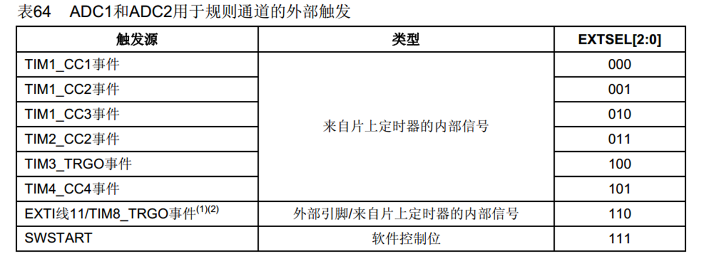

对于规则通道，选中EXTI线路11或TIM8_TRGO作为外部触发事件，可以分别通过设置ADC1和ADC2的ADC1_ETRGREG_REMAP位和ADC2_ETRGREG_REMAP位实现。


### 5.转换时间

AD转换的步骤：采样，保持，量化，编码

ADC的每一次信号转换都要时间，这个时间就是转换时间，转换时间由输入时钟和采样周期来决定。
**输入时钟**
由于ADC在STM32中是挂载在APB2总线上的，所以ADC得时钟是由PCLK2（72MHz）经过分频得到的，分频因子由 RCC 时钟配置寄存器RCC_CFGR 的位 15:14 ADCPRE[1:0]设置，可以是 2/4/6/8 分频，一般配置分频因子为8，即8分频得到ADC的输入时钟频率为9MHz。ADC最大时钟频率为**14MHz**
**采样周期**
采样周期是确立在输入时钟上的，配置采样周期可以确定使用多少个ADC时钟周期来对电压进行采样，采样的周期数可通过 ADC采样时间寄存器 ADC_SMPR1 和 ADC_SMPR2 中的 SMP[2:0]位设置，ADC_SMPR2 控制的是通道 0~9， ADC_SMPR1 控制的是通道 10~17。每个通道可以配置不同的采样周期，但最小的采样周期是1.5个周期，也就是说如果想最快时间采样就设置采样周期为1.5.

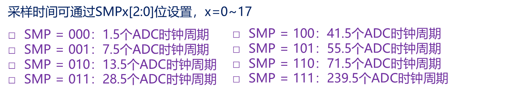


**转换时间**
$TCONV = 采样时间 + 12.5个ADC周期$
12.5个周期是固定的，一般我们设置 PCLK2=72M，经过 ADC 预分频器能分频到最大的时钟只能是 12M，采样周期设置为 1.5 个周期，算出最短的转换时间为 1.17us。


举个例子：ADC时钟频率为12MHz时，ADC最短的转换时间是多少？

TCONV = 采样时间 + 12.5个周期 = 1.5个周期 + 12.5个周期 = 14个周期 = (1/12000000)∗14 s = 1.17us

### 6. 数据寄存器

转换完成后的数据就存放在数据寄存器中，但数据的存放也分为规则通道转换数据和注入通道转换数据的。

**规则数据寄存器**
规则数据寄存器负责存放规则通道转换的数据，通过32位寄存器ADC_DR来存放。

当使用ADC独立模式（也就是只使用一个ADC，可以使用多个通道）时，数据存放在低16位中，当使用ADC多模式时高16位存放ADC2的数据。需要注意的是

ADC转换的精度是12位，而寄存器中有16个位来存放数据，所以要规定数据存放是左对齐还是右对齐。


当使用多个通道转换数据时，会产生多个转换数据，然鹅数据寄存器只有一个，多个数据存放在一个寄存器中会覆盖数据导致ADC转换错误，所以我们经常在一个通道转换完成之后就立刻将数据取出来，方便下一个数据存放。一般开启DMA模式将转换的数据，传输在一个数组中，程序对数组读操作就可以得到转换的结果。


**注入数据寄存器**
注入通道转换的数据寄存器有4个，由于注入通道最多有4个，所以注入通道转换的数据都有固定的存放位置，不会跟规则寄存器那样产生数据覆盖的问题。 ADC_JDRx 是 32 位的，低 16 位有效，高 16 位保留，数据同样分为左对齐和右对齐，具体是以哪一种方式存放，由ADC_CR2 的 11 位 ALIGN 设置。


### 7. 中断


| 中断事件               | 事件标志 | 使能控制位 |
| ---------------------- | -------- | ---------- |
| 规则通道转换结束       | EOC      | EOCIE      |
| 注入通道转换结束       | JEOC     | JEOCIE     |
| 设置了模拟看门狗状态位 | AWD      | AWDIE      |
| 溢出（F1没有）         | OVR      | OVRIE      |

**规则通道转换完成中断**
规则通道数据转换完成之后，可以产生一个中断，可以在中断函数中读取规则数据寄存器的值。这也是单通道时读取数据的一种方法。
**注入通道转换完成中断**
注入通道数据转换完成之后，可以产生一个中断，并且也可以在中断中读取注入数据寄存器的值，达到读取数据的作用。
**模拟看门狗事件**
当输入的模拟量（电压）不再阈值范围内就会产生看门狗事件，就是用来监视输入的模拟量是否正常。

以上中断的配置都由ADC_SR寄存器决定


**DMA请求**（只适用于规则组）:规则组每个通道转换结束后，除了可以产生中断外，还可以产生DMA请求，我们利用DMA及时把转换好的数据传输到指定的内存里，防止数据被覆盖。

### 8. 电压转换

要知道，转换后的数据是一个12位的二进制数，我们需要把这个二进制数代表的模拟量（电压）用数字表示出来。比如测量的电压范围是0~3.3V，转换后的二进制数是x，因为12位ADC在转换时将电压的范围大小（也就是3.3）分为4096（2^12）份，所以转换后的二进制数x代表的真实电压的计算方法就是：
$y=3.3* x / 4096$

### 简易框图


* 16个外部GPIO通道和2个内部通道
* START触发控制可以软件触发或硬件触发
* RCC CLOCK内部时钟驱动完成ADC记录，
* 规则通道最多可以同时接通16个通道，但是只能记录一个值(16位)，需要使用DMA转移数据来完成16个通道的记录
* 触发后会标记EOC
* 开关控制CMD，开启ADC
* 模拟看门狗

## 相关寄存器

**ADC控制寄存器1(ADC_CR1)**

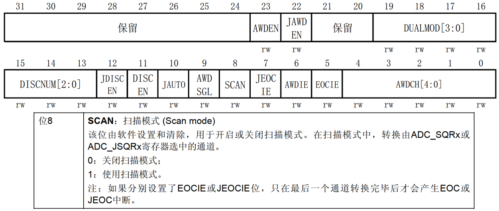

**ADC控制寄存器2(ADC_CR2)**

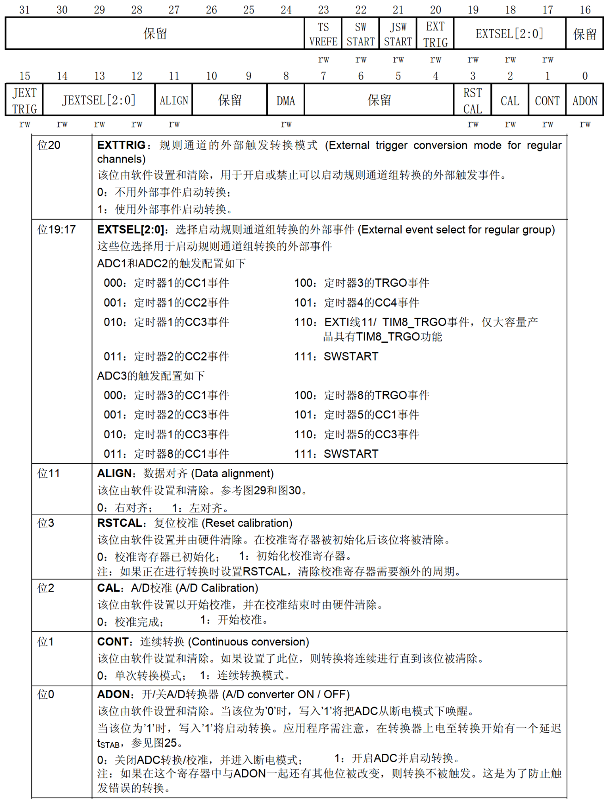

**ADC 采样事件寄存器 1（ADC_SMPR1）**


**ADC 采样事件寄存器 2（ADC_SMPR2）**


ADC 采样时间设置需要由两个寄存器设置，ADC_SMPR1 和 ADC_SMPR1，分别设置通道10~17 和通道 0~9 的采样时间，每个通道用 3 个位设置。可以看出 ADC 的每个通道的采样时间是支持单独设置的。


**ADC规则序列寄存器1(ADC_SQR1)**

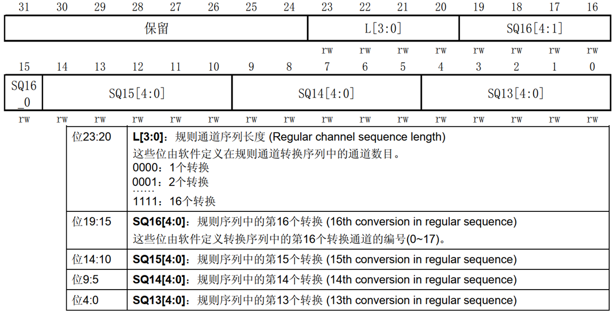

**ADC规则序列寄存器 2(ADC_SQR2)**


**ADC规则序列寄存器3(ADC_SQR3)**


**ADC规则数据寄存器(ADC_DR)**


**ADC状态寄存器(ADC_SR)** 


## HAL库

### 常用函数

|             函数              | 主要寄存器  |             主要功能             |
| :---------------------------: | :---------: | :------------------------------: |
|        HAL_ADC_Init()         |  CR1、CR2   |         配置ADC工作参数          |
| HAL_ADCEx_Calibration_Start() |     CR2     |             ADC校准              |
|       HAL_ADC_MspInit()       |     无      | 存放NVIC、CLOCK、GPIO初始化代码  |
|  HAL_RCCEx_PeriphCLKConfig()  |  RCC_CFGR   | 设置扩展外设时钟，如：ADC、RTC等 |
|    HAL_ADC_ConfigChannel()    | SQRx、SMPRx |    配置ADC相应通道的相关参数     |
|        HAL_ADC_Start()        |     CR2     |           启动A/D转换            |
|  HAL_ADC_PollForConversion()  |     SR      |       等待规则通道转换完成       |
|      HAL_ADC_GetValue()       |     DR      |     获取规则通道A/D转换结果      |

````c
typedef struct __ADC_HandleTypeDef{
	ADC_TypeDef *Instance; 			/* ADC 寄存器基地址 */ 
	ADC_InitTypeDef Init; 			/* ADC 参数初始化结构体变量 */ 
	DMA_HandleTypeDef *DMA_Handle; 	/* DMA 配置结构体 */
	…… 
}ADC_HandleTypeDef;
typedef struct{ 
	uint32_t DataAlign; 					/* 设置数据的对齐方式 */ 
	uint32_t ScanConvMode; 					/* 扫描模式 */ 
	FunctionalState ContinuousConvMode; 	/* 开启单次转换模式或者连续转换模式 ENABLE or DISABLE */ 	
    uint32_t NbrOfConversion; 				/* 设置转换通道数目 Min_Data = 1 and Max_Data = 16 */ 
	FunctionalState DiscontinuousConvMode; 	/* 是否使用规则通道组间断模式 ENABLE or DISABLE */ 
	uint32_t NbrOfDiscConversion; 			/* 配置间断模式的规则通道个数 Min_Data = 1 and Max_Data = 8*/ 
	uint32_t ExternalTrigConv; 				/* ADC 外部触发源选择 */ 
} ADC_InitTypeDef;
/* 设置数据的对齐方式 */ 
#define ADC_DATAALIGN_RIGHT
#define ADC_DATAALIGN_LEFT
/* 扫描模式 */ 
#define ADC_SCAN_DISABLE
#define ADC_SCAN_ENABLE
/* ADC 外部触发源选择 */ 
#define ADC_EXTERNALTRIGCONV_T1_CC1
#define ADC_EXTERNALTRIGCONV_EXT_IT11
......
#define ADC_SOFTWARE_START            /* 软件触发 */ 
 
    
typedef struct { 
	uint32_t Channel; 		/* ADC 转换通道*/ 
	uint32_t Rank; 			/* ADC 转换顺序 */ 
	uint32_t SamplingTime; 	/* ADC 采样周期 */ 
}  ADC_ChannelConfTypeDef;
/* ADC 转换通道*/ 
#define ADC_CHANNEL_0
......
#define ADC_CHANNEL_TEMPSENSOR   /* 温度 */ 
#define ADC_CHANNEL_VREFINT

/* ADC 转换顺序 */  
#define ADC_REGULAR_RANK_1 
......
    
/* ADC 采样周期 */   
#define ADC_SAMPLETIME_1CYCLE_5
......    
#define ADC_SAMPLETIME_239CYCLES_5
````

**外围时钟**

````c
HAL_StatusTypeDef HAL_RCCEx_PeriphCLKConfig(RCC_PeriphCLKInitTypeDef  *PeriphClkInit)  /* 设置外围时钟 */

typedef struct{
    uint32_t PeriphClockSelection;      /* 外围设备时钟选择 */
    uint32_t RTCClockSelection;         /* RTC时钟分频 */
    uint32_t AdcClockSelection;			/* ADC时钟分频 */
} RCC_PeriphCLKInitTypeDef;

/* 外围设备时钟选择 */
#define RCC_PERIPHCLK_RTC
#define RCC_PERIPHCLK_ADC
#define RCC_PERIPHCLK_USB
/* ADC时钟分频 */
#define RCC_ADCPCLK2_DIV2
#define RCC_ADCPCLK2_DIV4
#define RCC_ADCPCLK2_DIV6
#define RCC_ADCPCLK2_DIV8
````

### 实例

#### ADC单通道转换

````c
ADC_HandleTypeDef ADC_HandleStructure;
void ADC_Init(void){
    ADC_ChannelConfTypeDef ADC_ChConf;
    
    ADC_HandleStructure.Instance = ADC1;								/* 选择ADC1 */
    ADC_HandleStructure.Init.ContinuousConvMode = DISABLE;				/* 非连续模式 */   
    ADC_HandleStructure.Init.DataAlign = ADC_DATAALIGN_RIGHT;			/* 右对齐 */
    ADC_HandleStructure.Init.ScanConvMode = ADC_SCAN_DISABLE;			/* 非扫描模式 */
    ADC_HandleStructure.Init.NbrOfConversion = 1;						/* 使用1个通道 */
    ADC_HandleStructure.Init.DiscontinuousConvMode = DISABLE;			/* 间断模式关闭 */
    ADC_HandleStructure.Init.NbrOfDiscConversion = 0;					/* 间断模式关闭 */
    ADC_HandleStructure.Init.ExternalTrigConv = ADC_SOFTWARE_START ; 	/* 软件触发 */
    HAL_ADC_Init(&ADC_HandleStructure);
    
    HAL_ADCEx_Calibration_Start(&ADC_HandleStructure);		/* 校准 */
    
    ADC_ChConf.Channel = ADC_CHANNEL_1;						/* 通道1 PA1 */
    ADC_ChConf.Rank = ADC_REGULAR_RANK_1 ;					/* 序列1 */
    ADC_ChConf.SamplingTime = ADC_SAMPLETIME_239CYCLES_5;	/* 采样时间 */
    HAL_ADC_ConfigChannel(&ADC_HandleStructure,&ADC_ChConf);/* 初始化ADC通道 */
}
void HAL_ADC_MspInit(ADC_HandleTypeDef* hadc){
    if(hadc->Instance == ADC1){
        __HAL_RCC_GPIOA_CLK_ENABLE();
        __HAL_RCC_ADC1_CLK_ENABLE();                                  /* 使能ADC */
        
        RCC_PeriphCLKInitTypeDef RCC_PeriphInitStructure = {0};       		/* RCC配置外设时钟 */
        RCC_PeriphInitStructure.AdcClockSelection = RCC_ADCPCLK2_DIV6;		/* ADC分频 */
        RCC_PeriphInitStructure.PeriphClockSelection = RCC_PERIPHCLK_ADC;	/* 选择配置ADCADC分频 */
        HAL_RCCEx_PeriphCLKConfig(&RCC_PeriphInitStructure);				/* 初始化外围时钟 */
        
        GPIO_InitTypeDef GPIO_InitStructure;
        GPIO_InitStructure.Mode = GPIO_MODE_ANALOG;    /* 模拟输入，ADC专属 */
        GPIO_InitStructure.Pin = GPIO_PIN_1;
        GPIO_InitStructure.Pull = GPIO_PULLDOWN;
        GPIO_InitStructure.Speed = GPIO_SPEED_FREQ_HIGH;
        HAL_GPIO_Init(GPIOA,&GPIO_InitStructure);
    }
}
uint32_t ADC_Get_Result(void){
    HAL_ADC_Start(&ADC_HandleStructure);                 // 开启ADC，即软件触发
    HAL_ADC_PollForConversion(&ADC_HandleStructure,10);  // 等待规则通道转换完成,内部等待ADC_SR->EOC位,参数2：等待转换时间
    return (uint16_t)HAL_ADC_GetValue(&ADC_HandleStructure);  // 只有低16位用到了
}
int main(void){
    HAL_Init();                         /* 初始化HAL库 */
    sys_stm32_clock_init(RCC_PLL_MUL9); /* 设置时钟, 72Mhz */
    delay_init(72);                     /* 延时初始化 */
    usart_init(115200);                 /* 串口初始化为115200 */
    
    lcd_init();                         /* 初始化LCD */
    ADC_Init();
    
    lcd_show_string(30, 110, 200, 16, 16, "ADC1_CH1_VAL:", RED);
    lcd_show_string(30, 130, 200, 16, 16, "ADC1_CH1_VOL:0.000V", BLUE); /* 先在固定位置显示小数点 */
    int16_t adcnum;
    float temp;
    while (1){
        adcnum = ADC_Get_Result();
        lcd_show_xnum(134, 110, adcnum, 5, 16, 0, BLUE);    /* 显示ADCValue */
        
        temp = (float)adcnum * (3.3 / 4096);	/* 计算电压 */
        adcnum = temp;							/* 显示整数，float转到int会将小数位舍弃 */		
        lcd_show_xnum(134, 130, adcnum, 1, 16, 0, BLUE);
        
        temp -=adcnum;							/* 显示小数 */
        temp *= 1000;
        lcd_show_xnum(150, 130, temp, 3, 16, 0X80, BLUE);
    }
}
````


## 标准库

### 常用函数

````c
//在stm32f10x_rcc.h下，配置ADC时钟分频
/**
  * @brief  Configures the ADC clock (ADCCLK).
  * @param  RCC_PCLK2: defines the ADC clock divider. This clock is derived from 
  *   the APB2 clock (PCLK2).
  *   This parameter can be one of the following values:
  *     @arg RCC_PCLK2_Div2: ADC clock = PCLK2/2
  *     @arg RCC_PCLK2_Div4: ADC clock = PCLK2/4
  *     @arg RCC_PCLK2_Div6: ADC clock = PCLK2/6
  *     @arg RCC_PCLK2_Div8: ADC clock = PCLK2/8
  * @retval None
  */
void RCC_ADCCLKConfig(uint32_t RCC_PCLK2);
````

````c
void ADC_DeInit(ADC_TypeDef* ADCx);
void ADC_Init(ADC_TypeDef* ADCx, ADC_InitTypeDef* ADC_InitStruct);       // 初始化函数
void ADC_StructInit(ADC_InitTypeDef* ADC_InitStruct);
void ADC_Cmd(ADC_TypeDef* ADCx, FunctionalState NewState);               // 使能函数
void ADC_DMACmd(ADC_TypeDef* ADCx, FunctionalState NewState);            // DMA使能
void ADC_ITConfig(ADC_TypeDef* ADCx, uint16_t ADC_IT, FunctionalState NewState);  // 中断使能

// 校准
void ADC_ResetCalibration(ADC_TypeDef* ADCx);                            // 复位校准
FlagStatus ADC_GetResetCalibrationStatus(ADC_TypeDef* ADCx);             // 获得复位校准标准位，SET为正在复位校准
void ADC_StartCalibration(ADC_TypeDef* ADCx);                            // 开始校准
FlagStatus ADC_GetCalibrationStatus(ADC_TypeDef* ADCx);                  // 获得校准标志位，SET表示正在开始校准

// 软甲触发
void ADC_SoftwareStartConvCmd(ADC_TypeDef* ADCx, FunctionalState NewState);  // 软件转换函数
FlagStatus ADC_GetSoftwareStartConvStatus(ADC_TypeDef* ADCx);
void ADC_DiscModeChannelCountConfig(ADC_TypeDef* ADCx, uint8_t Number);
void ADC_DiscModeCmd(ADC_TypeDef* ADCx, FunctionalState NewState);
// 规则通道配置函数
void ADC_RegularChannelConfig(ADC_TypeDef* ADCx, uint8_t ADC_Channel, uint8_t Rank, uint8_t ADC_SampleTime);
void ADC_ExternalTrigConvCmd(ADC_TypeDef* ADCx, FunctionalState NewState);
uint16_t ADC_GetConversionValue(ADC_TypeDef* ADCx);                          // 获取转换结果函数
uint32_t ADC_GetDualModeConversionValue(void);
void ADC_AutoInjectedConvCmd(ADC_TypeDef* ADCx, FunctionalState NewState);
void ADC_InjectedDiscModeCmd(ADC_TypeDef* ADCx, FunctionalState NewState);
void ADC_ExternalTrigInjectedConvConfig(ADC_TypeDef* ADCx, uint32_t ADC_ExternalTrigInjecConv);
void ADC_ExternalTrigInjectedConvCmd(ADC_TypeDef* ADCx, FunctionalState NewState);
void ADC_SoftwareStartInjectedConvCmd(ADC_TypeDef* ADCx, FunctionalState NewState);
FlagStatus ADC_GetSoftwareStartInjectedConvCmdStatus(ADC_TypeDef* ADCx);
void ADC_InjectedChannelConfig(ADC_TypeDef* ADCx, uint8_t ADC_Channel, uint8_t Rank, uint8_t ADC_SampleTime);
void ADC_InjectedSequencerLengthConfig(ADC_TypeDef* ADCx, uint8_t Length);
void ADC_SetInjectedOffset(ADC_TypeDef* ADCx, uint8_t ADC_InjectedChannel, uint16_t Offset);
uint16_t ADC_GetInjectedConversionValue(ADC_TypeDef* ADCx, uint8_t ADC_InjectedChannel);
// 看门狗
void ADC_AnalogWatchdogCmd(ADC_TypeDef* ADCx, uint32_t ADC_AnalogWatchdog);
void ADC_AnalogWatchdogThresholdsConfig(ADC_TypeDef* ADCx, uint16_t HighThreshold, uint16_t LowThreshold);
void ADC_AnalogWatchdogSingleChannelConfig(ADC_TypeDef* ADCx, uint8_t ADC_Channel);
void ADC_TempSensorVrefintCmd(FunctionalState NewState);

FlagStatus ADC_GetFlagStatus(ADC_TypeDef* ADCx, uint8_t ADC_FLAG);           //获取标志位状态
void ADC_ClearFlag(ADC_TypeDef* ADCx, uint8_t ADC_FLAG);
ITStatus ADC_GetITStatus(ADC_TypeDef* ADCx, uint16_t ADC_IT);
void ADC_ClearITPendingBit(ADC_TypeDef* ADCx, uint16_t ADC_IT);
````

````C
/**
  * 配置通道
  * @param  ADCx: ADC1~3
  * @param  ADC_Channel: 选择通道 ADC_Channel_0~17
  * @param  Rank: 存放的序列位置 1~16
  * @param  ADC_SampleTime: 通道采样时间
  */
void ADC_RegularChannelConfig(ADC_TypeDef* ADCx, uint8_t ADC_Channel, uint8_t Rank, uint8_t ADC_SampleTime)
````

````c
typedef struct{
 uint32_t ADC_Mode;                // ADC 工作模式选择
 FunctionalState ADC_ScanConvMode; // ADC 扫描（多通道）或者单次（单通道）模式选择 ，ENABLE 扫描模式，DISABLE 非扫描模式
 FunctionalState ADC_ContinuousConvMode; // ADC 单次转换或者连续转换选择，ENABLE 连续模式，DISABLE 单次模式
 uint32_t ADC_ExternalTrigConv;    // ADC 外部转换触发信号选择
 uint32_t ADC_DataAlign;           // ADC 数据寄存器对齐格式
 uint8_t ADC_NbrOfChannel;         // ADC 采集通道数，from 1 to 16；非扫描模式为1
} ADC_InitTypeDef;
````

````c
//ADC_Mode参数： ADC 工作模式选择
#define ADC_Mode_Independent                       ((uint32_t)0x00000000)       // 独立模式         
#define ADC_Mode_RegInjecSimult                    ((uint32_t)0x00010000)       // 以下为双ADC模式
#define ADC_Mode_RegSimult_AlterTrig               ((uint32_t)0x00020000)
#define ADC_Mode_InjecSimult_FastInterl            ((uint32_t)0x00030000)
#define ADC_Mode_InjecSimult_SlowInterl            ((uint32_t)0x00040000)
#define ADC_Mode_InjecSimult                       ((uint32_t)0x00050000)
#define ADC_Mode_RegSimult                         ((uint32_t)0x00060000)
#define ADC_Mode_FastInterl                        ((uint32_t)0x00070000)
#define ADC_Mode_SlowInterl                        ((uint32_t)0x00080000)
#define ADC_Mode_AlterTrig                         ((uint32_t)0x00090000)

//ADC_DataAlign参数：ADC 数据寄存器对齐格式
#define ADC_DataAlign_Right                        ((uint32_t)0x00000000)       // 右对齐
#define ADC_DataAlign_Left                         ((uint32_t)0x00000800)       //左对齐

//ADC_ExternalTrigConv参数：外部触发源选择
#define ADC_ExternalTrigConv_T1_CC1                ((uint32_t)0x00000000)
#define ADC_ExternalTrigConv_T1_CC2                ((uint32_t)0x00020000) 
#define ADC_ExternalTrigConv_T2_CC2                ((uint32_t)0x00060000)
#define ADC_ExternalTrigConv_T3_TRGO               ((uint32_t)0x00080000)
#define ADC_ExternalTrigConv_T4_CC4                ((uint32_t)0x000A0000)
#define ADC_ExternalTrigConv_Ext_IT11_TIM8_TRGO    ((uint32_t)0x000C0000)

#define ADC_ExternalTrigConv_T1_CC3                ((uint32_t)0x00040000)
#define ADC_ExternalTrigConv_None                  ((uint32_t)0x000E0000)     // 不使用外部触发，（使用软件触发）

#define ADC_ExternalTrigConv_T3_CC1                ((uint32_t)0x00000000)
#define ADC_ExternalTrigConv_T2_CC3                ((uint32_t)0x00020000) 
#define ADC_ExternalTrigConv_T8_CC1                ((uint32_t)0x00060000)
#define ADC_ExternalTrigConv_T8_TRGO               ((uint32_t)0x00080000) 
#define ADC_ExternalTrigConv_T5_CC1                ((uint32_t)0x000A0000)
#define ADC_ExternalTrigConv_T5_CC3                ((uint32_t)0x000C0000) 
````

### 实例

**ADC一般步骤**

* 实例要求：利用ADC1的通道1（PA1）采集外部电压值。
* 开启PA口时钟和ADC1时钟，设置PA1为模拟输入。调用函数：GPIO_Init()；APB2PeriphClockCmd()；
* 复位ADC1，同时设置ADC1分频因子。调用函数：ADC_DeInit(ADC1)；RCC_ADCCLKConfig(RCC_PCLK2_Div6)；
* 初始化ADC1参数，设置ADC1的工作模式以及规则序列的相关信息。调用函数：void ADC_Init()；
* 使能ADC并校准。调用函数：ADC_Cmd()；
* 配置规则通道参数。调用函数：ADC_RegularChannelConfig()；
* 开启软件转换：ADC_SoftwareStartConvCmd(ADC1)；
* 等待转换完成，读取ADC值。调用函数：ADC_GetConversionValue(ADC1)。

#### AD单通道转换

````c
void AD_Init(void){
	RCC_APB2PeriphClockCmd(RCC_APB2Periph_GPIOA, ENABLE);
	RCC_APB2PeriphClockCmd(RCC_APB2Periph_ADC1, ENABLE);
	
	RCC_ADCCLKConfig(RCC_PCLK2_Div6);              //ADCCLK = 72MHz / 6 = 12MHz
	
	GPIO_InitTypeDef GPIO_InitSturcture;
	GPIO_InitSturcture.GPIO_Mode = GPIO_Mode_AIN;  //模拟输入模式，ADC的专属模式，断开GPIO口的输入输出对模拟电压照成的干扰
	GPIO_InitSturcture.GPIO_Pin = GPIO_Pin_0;
	GPIO_InitSturcture.GPIO_Speed = GPIO_Speed_50MHz;
	GPIO_Init(GPIOA, &GPIO_InitSturcture);
	
    //重要
	ADC_RegularChannelConfig(ADC1, ADC_Channel_0, 1,ADC_SampleTime_55Cycles5);   //使用通道1，放到序列1位置，采样时间55
	//ADC_RegularChannelConfig(ADC1, ADC_Channel_1, 2,ADC_SampleTime_55Cycles5); //使用通道2，放到序列2位置，采样时间55
	
	ADC_InitTypeDef ADC_InitStructure;
	ADC_InitStructure.ADC_Mode = ADC_Mode_Independent;        // 独立模式
	ADC_InitStructure.ADC_DataAlign = ADC_DataAlign_Right;    // 右对齐
	ADC_InitStructure.ADC_ExternalTrigConv = ADC_ExternalTrigConv_None;   //不使用外部触发
	ADC_InitStructure.ADC_ContinuousConvMode = DISABLE;       //单此触发
	ADC_InitStructure.ADC_ScanConvMode = DISABLE;             //非连续扫描
	ADC_InitStructure.ADC_NbrOfChannel = 1;                   //1号通道
	ADC_Init(ADC1, &ADC_InitStructure);
	
    ADC_Cmd(ADC1,ENABLE);
	
	ADC_ResetCalibration(ADC1);        // 复位校准
	while(ADC_GetResetCalibrationStatus(ADC1) == SET);    //返回复位校准状态，为SET则表示正在初始化校准寄存器
	ADC_StartCalibration(ADC1);        // 开始校准
	while(ADC_GetCalibrationStatus(ADC1) == SET);          //返回校准状态，为SET则表示正在开始校准
    
    //软件触发，连续触发，因为本段所在的函数AD_Init()只会调用一次
    //ADC_SoftwareStartConvCmd(ADC1, ENABLE);                
}

uint16_t Get_Value(void){
	ADC_SoftwareStartConvCmd(ADC1, ENABLE);        // 软件触发，如果是连续触发，则这一行可以只执行一次，可放在AD_Init函中
	while(ADC_GetFlagStatus(ADC1, ADC_FLAG_EOC) == RESET);  // 获得EOC标志位状态
	return ADC_GetConversionValue(ADC1);
}
//--------------------------------------------------------------------------------------------

uint16_t ADValue;
float Voltage;

int main(void)
{	
	OLED_Init();
	AD_Init();
	
	OLED_ShowString(1, 1, "ADValue:");
	OLED_ShowString(2, 1, "Volatge:0.00V");
	while(1){
		ADValue =Get_Value();
		Voltage = (float)ADValue / 4095 * 3.3;
		
		OLED_ShowNum(1, 9, ADValue, 4);
		
		OLED_ShowNum(2, 9, Voltage, 1);                              //显示整数
		OLED_ShowNum(2, 11, (uint16_t)(Voltage * 100) % 100, 2);     //显示小数
		Delay_ms(100);
	}	
}
````

#### AD多通道转换

使用规则通道，会掩盖数据，由于没有DMA转移数据，可以采用其他方式

使用函数`void ADC_RegularChannelConfig(ADC_TypeDef* ADCx, uint8_t ADC_Channel, uint8_t Rank, uint8_t ADC_SampleTime)`更改参数2，选择不同的通道

````c
//其他代码与上方代码相似
//每次调用这个函数可以选择不同的通道
uint16_t Get_Value(uint8_t ADC_Channel){
    //使用main函数传递来的通道，放到序列1位置，采样时间55
	ADC_RegularChannelConfig(ADC1, ADC_Channel, 1,ADC_SampleTime_55Cycles5);  
	
	ADC_SoftwareStartConvCmd(ADC1, ENABLE); // 软件触发，如果是连续触发，则这一行可以只执行一次，可放在AD_Init函中
	while(ADC_GetFlagStatus(ADC1, ADC_FLAG_EOC) == RESET);  // 获得EOC标志位状态
	return ADC_GetConversionValue(ADC1);
}
uint16_t AD1;
uint16_t AD2;
uint16_t AD3;
uint16_t AD4;
int main(void)
{	
	OLED_Init();
	AD_Init();
	
	OLED_ShowString(1, 1, "AD1:");
	OLED_ShowString(2, 1, "AD2:");
	OLED_ShowString(3, 1, "AD3:");
	OLED_ShowString(4, 1, "AD4:");

	while(1){
        //选择不同的通道
		AD1 = Get_Value(ADC_Channel_0);  //选择通道1
		AD2 = Get_Value(ADC_Channel_1);  //选择通道2
		AD3 = Get_Value(ADC_Channel_2);
		AD4 = Get_Value(ADC_Channel_3);
		
		OLED_ShowNum(1,4,AD1,4);
		OLED_ShowNum(2,4,AD2,4);
		OLED_ShowNum(3,4,AD3,4);
		OLED_ShowNum(4,4,AD4,4);
	}	
}
````

## 内部温度

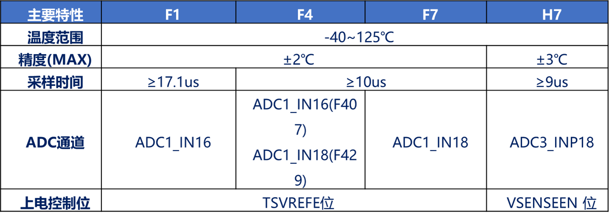


**代码**

````c
ADC_HandleTypeDef ADCTemp_HandleStructure;
void ADCTemp_Init(void){
    ADC_ChannelConfTypeDef ADC_ChConf;
  
    ADCTemp_HandleStructure.Instance = ADC1;
    ADCTemp_HandleStructure.Init.ContinuousConvMode = DISABLE;
    ADCTemp_HandleStructure.Init.DataAlign = ADC_DATAALIGN_RIGHT;
    ADCTemp_HandleStructure.Init.ScanConvMode = ADC_SCAN_DISABLE;
    ADCTemp_HandleStructure.Init.NbrOfConversion = 1;
    ADCTemp_HandleStructure.Init.DiscontinuousConvMode = DISABLE;
    ADCTemp_HandleStructure.Init.NbrOfDiscConversion = 0;
    ADCTemp_HandleStructure.Init.ExternalTrigConv = ADC_SOFTWARE_START ;
    
    HAL_ADC_Init(&ADCTemp_HandleStructure);
    
    HAL_ADCEx_Calibration_Start(&ADCTemp_HandleStructure);
    
    ADC_ChConf.Channel = ADC_CHANNEL_16;                   // 通道16 内部温度
    ADC_ChConf.Rank = ADC_REGULAR_RANK_1 ;                 // 序列1
    ADC_ChConf.SamplingTime = ADC_SAMPLETIME_239CYCLES_5;  // 采样时间
    HAL_ADC_ConfigChannel(&ADCTemp_HandleStructure,&ADC_ChConf);
}
void HAL_ADC_MspInit(ADC_HandleTypeDef* hadc){
    if(hadc->Instance == ADC1){
        __HAL_RCC_ADC1_CLK_ENABLE(); 
        RCC_PeriphCLKInitTypeDef RCC_PeriphInitStructure = {0};             // RCC配置外设时钟
        RCC_PeriphInitStructure.AdcClockSelection = RCC_ADCPCLK2_DIV6;     // ADC分频
        RCC_PeriphInitStructure.PeriphClockSelection = RCC_PERIPHCLK_ADC;  // 选择配置ADC
        HAL_RCCEx_PeriphCLKConfig(&RCC_PeriphInitStructure);
    }
}
uint32_t ADC_Get_Result(void){
    HAL_ADC_Start(&ADCTemp_HandleStructure);                 // 开启ADC
    // 等待规则通道转换完成,内部等待ADC_SR->EOC位,参数2：等待转换时间
    HAL_ADC_PollForConversion(&ADCTemp_HandleStructure,10);  
    return (uint16_t)HAL_ADC_GetValue(&ADCTemp_HandleStructure);  // 只有低16位用到了
}
uint32_t ADC_GetTemp(void){
    uint32_t adcx;
    double temperature;
    
    adcx = ADC_Get_Result();          // 获得上方函数的ADC_GetValue
    
    temperature = adcx * (3.3 / 4096);// 计数电压
    temperature = (1.43 - temperature) / 0.0043 +25; // 计数温度
    return temperature * 100; // 扩大100倍，方便显示
}
int main(void){
    HAL_Init();                         /* 初始化HAL库 */
    sys_stm32_clock_init(RCC_PLL_MUL9); /* 设置时钟, 72Mhz */
    delay_init(72);                     /* 延时初始化 */
    usart_init(115200);                 /* 串口初始化为115200 */
    lcd_init();                         /* 初始化LCD */
	ADCTemp_Init();						/* 初始化ADC */

    lcd_show_string(30, 120, 200, 16, 16, "TEMPERATE: 00.00C", RED);
    int32_t temper;
    while(1){
        temper = ADC_GetTemp();
        lcd_show_xnum(30 + 11 * 8, 120, temper / 100, 2, 16, 0, BLUE);    /* 显示整数部分 */
        lcd_show_xnum(30 + 14 * 8, 120, temper % 100, 2, 16,0X80, BLUE);  /* 显示小数部分 */
    }
}
````


# DAC

## DAC简介

* DAC，全称：Digital-to-Analog Converter，指数字/模拟转换器
* 2 个 DAC 转换器：每个转换器对应 1 个输出通道
* 8 位或者 12 位单调输出
* 12 位模式下数据左对齐或者右对齐
* 同步更新功能
* 噪声\三角波形生成
* 双 DAC 双通道同时或者分别转换
* 每个通道都有 DMA 功能
* DAC供电电源：VSSA、 VDDA （2.4V≤VDDA≤3.6V ）
* DAC输出电压范围：VREF–≤VOUT≤VREF+（即0V≤VOUT≤3.3V ）
* 在精度要求不高的场合，可以用一种廉价的解决方案实现DAC输出：PWM + RC滤波器

### **DAC特性参数**

* 分辨率：表示模拟电压的最小增量，常用二进制位数表示，比如：8、12位等
* 建立时间：表示将一个数字量转换为稳定模拟信号所需的时间
* 精度：转换器实际特性曲线与理想特性曲线之间的最大偏差（误差源：比例系统误差、失调误差、非线性误差 原因：元件参数误差、基准电压不稳定、运算放大器零漂等）

**各系列DAC特性**

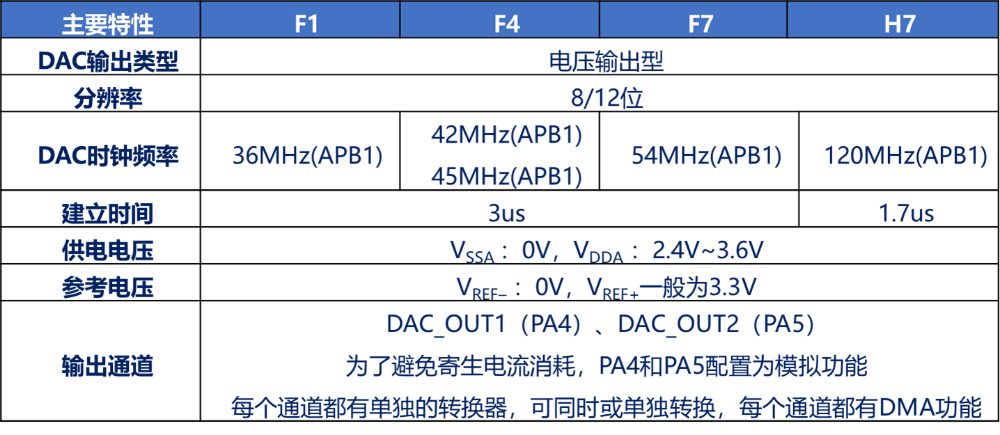

### DAC数据格式


### 触发源

三种触发转换的方式：自动触发、软件触发、外部事件触发

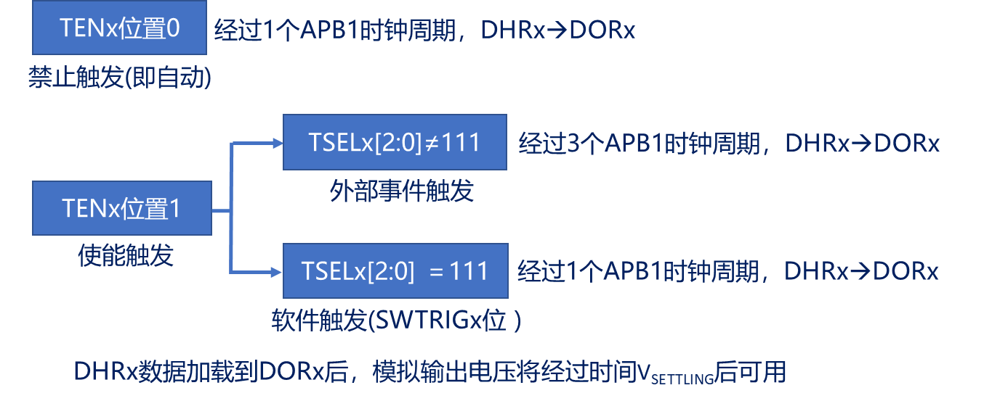

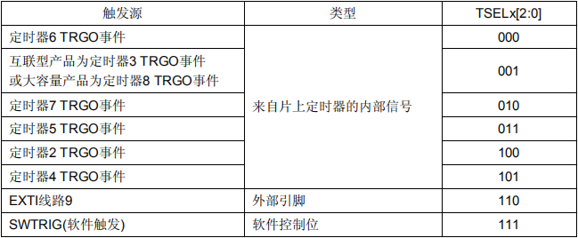


如果没有选中硬件触发（寄存器 DAC_CR 的 TENx 位置 0），存入寄存器 DAC_DHRx 的数据会在1个APB1时钟周期后自动传至寄存器DAC_DORx。如果选中硬件触发（寄存器DAC_CR的 TENx 位置 1），数据传输在触发发生以后 3 个 APB1 时钟周期后完成。一旦数据从 DAC_DHRx寄存器装入 DAC_DORx 寄存器，在经过时间 tSETTLING 之后，输出即有效，这段时间的长短依电源电压和模拟输出负载的不同会有所变化。tSETTLING 的典型值为 3us，最大是 4us


**不使用硬件触发（TEN=0），其转换的时间框图**

可以看到经过了一个APB1时钟周期，DHR将数据转移到DOR寄存器上，DOR经过Tsettling建立后进行输出

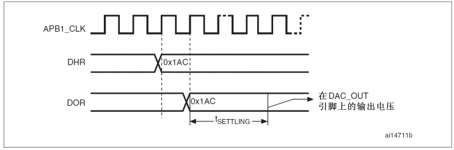

### **DAC输出电压**

12位模式下，DAC输出电压计算方法：DAC输出电压 = ( DORx / 4096 ) ∗ VREF+     DORx为数据保持寄存器的值，VREF+为参考电压

8位模式下，DAC输出电压计算方法：DAC输出电压 = ( DORx / 256 ) ∗ VREF+


## DAC框图


1. 参考电压/模拟部分电压
2. DA转换器
3. 输出通道
4. 数据输出寄存器
5. 数据保持寄存器
6. 控制逻辑(噪声波/三角波)
7. DAC控制寄存器
8. 触发源：可以是自动触发，软件触发，外部事件触发

如：外部中断触发后，DAC控制寄存器输出到 控制逻辑 最终将 数据保持寄存器的值 转移到 数据输出寄存器，数据输出寄存器 到 DA转换器，DA转换器输出

## 相关寄存器

**DAC 控制寄存器（DAC_CR）**


DAC_CR 的低 16 位用于控制通道 1，高 16 位用于控制通道 2


**DAC 通道 1 12 位右对齐数据保持寄存器（DAC_DHR12R1）**


该寄存器用来设置 DAC 输出，通过写入 12 位数据到该寄存器

## HAL库

### 常用函数

|          函数           | 主要寄存器  |             主要功能             |
| :---------------------: | :---------: | :------------------------------: |
|     HAL_DAC_Init()      |     无      | 配置DAC工作状态（HAL库内部使用） |
|    HAL_DAC_MspInit()    |     无      | 存放NVIC、CLOCK、GPIO初始化代码  |
| HAL_DAC_ConfigChannel() |     CR      |    配置DAC相应通道的相关参数     |
|     HAL_DAC_Start()     | CR、SWTRIGR |           启动D/A转换            |
|   HAL_DAC_SetValue()    |   DHR12Rx   |          设置输出数字量          |
|   HAL_DAC_GetValue()    |    DORx     |        读取通道输出数字量        |

````c
typedef struct { 
	DAC_TypeDef *Instance; 				/* DAC 寄存器基地址 */
 	__IO HAL_DAC_StateTypeDef State; 	/* DAC 工作状态 */
 	HAL_LockTypeDef Lock; 				/* DAC 锁定对象 */
 	DMA_HandleTypeDef *DMA_Handle1; 	/* 通道 1 的 DMA 处理句柄指针 */
 	DMA_HandleTypeDef *DMA_Handle2; 	/* 通道 2 的 DMA 处理句柄指针 */
 	__IO uint32_t ErrorCode; 			/* DAC 错误代码 */ 
} DAC_HandleTypeDef
typedef struct {
 	uint32_t DAC_Trigger; 				/* DAC 触发源的选择 */
 	uint32_t DAC_OutputBuffer; 			/* 启用或者禁用 DAC 通道输出缓冲区 */
} DAC_ChannelConfTypeDef;
/* DAC 触发源的选择 */
#define DAC_TRIGGER_NONE				/* 自动触发 */
#define DAC_TRIGGER_T6_TRGO				/* 定时器触发 */
#define DAC_TRIGGER_T7_TRGO
#define DAC_TRIGGER_T2_TRGO
#define DAC_TRIGGER_T4_TRGO
#define DAC_TRIGGER_EXT_IT9				/* 中断触发 */
#define DAC_TRIGGER_SOFTWARE			/* 软件触发 */

/* 启用或者禁用 DAC 通道输出缓冲区 */
#define DAC_OUTPUTBUFFER_ENABLE			/* 使用缓冲区 */
#define DAC_OUTPUTBUFFER_DISABLE		/* 不使用缓冲区 */

/**
*	参数1：DAC句柄
*	参数2：DAC通道初始化
*	参数3：
*		DAC_CHANNEL_1: DAC Channel1 selected
*		DAC_CHANNEL_2: DAC Channel2 selected
**/
HAL_StatusTypeDef HAL_DAC_ConfigChannel(DAC_HandleTypeDef *hdac, DAC_ChannelConfTypeDef *sConfig, uint32_t Channel)
/**
*	参数1：DAC句柄
*	参数2：
*		DAC_CHANNEL_1: DAC Channel1 selected
*		DAC_CHANNEL_2: DAC Channel2 selected
**/
HAL_StatusTypeDef HAL_DAC_Start(DAC_HandleTypeDef *hdac, uint32_t Channel)

    
/**	 设置输出数字量 
*	参数3：
*       DAC_ALIGN_8B_R: 8位
*       DAC_ALIGN_12B_L: 12位左对齐
*       DAC_ALIGN_12B_R: 12位右对齐
**/
HAL_StatusTypeDef HAL_DAC_SetValue(DAC_HandleTypeDef *hdac, uint32_t Channel, uint32_t Alignment, uint32_t Data)
````


### 案例

#### 案例1

在DAC1通道1(PA4) 输出设定电压

````c
DAC_HandleTypeDef DAC_HandleStructure;
void DAC_Init(void){
    DAC_ChannelConfTypeDef DAC_ChannelConf;
    
    DAC_HandleStructure.Instance = DAC1;                   /* F1只有1个DAC，所以直接写DAC也行 */
    HAL_DAC_Init(&DAC_HandleStructure);
    
    DAC_ChannelConf.DAC_Trigger = DAC_TRIGGER_NONE;                 /* 触发方式，自动触发 */  
    DAC_ChannelConf.DAC_OutputBuffer =  DAC_OUTPUTBUFFER_DISABLE;   /* 不使用缓冲 */
    HAL_DAC_ConfigChannel(&DAC_HandleStructure,&DAC_ChannelConf,DAC_CHANNEL_1);      /* 初始化DAC1的通道1，PA4 */
    
    HAL_DAC_Start(&DAC_HandleStructure,DAC_CHANNEL_1);
}
void HAL_DAC_MspInit(DAC_HandleTypeDef *hdac){
    if(hdac->Instance == DAC1){
        __HAL_RCC_GPIOA_CLK_ENABLE();
        __HAL_RCC_DAC_CLK_ENABLE();
        
        GPIO_InitTypeDef GPIO_InitStructure;
        GPIO_InitStructure.Mode = GPIO_MODE_ANALOG;                 /* 模拟 */
        GPIO_InitStructure.Pin = GPIO_PIN_4;                        /* DAC_Channel1 复用在PA4上 */
        GPIO_InitStructure.Speed = GPIO_SPEED_FREQ_HIGH;
        
        HAL_GPIO_Init(GPIOA,&GPIO_InitStructure);     
    }

}
void DAC_SetValue(float v){
    v = v * 4096 / 3.3;      /* DORx = DAC输出电压* 4096 / 3.3V */
    HAL_DAC_SetValue(&DAC_HandleStructure,DAC_CHANNEL_1,DAC_ALIGN_12B_R,v);  /* DAC1通道1,12位右对齐 */
}
int main(void){
    HAL_Init();                         /* 初始化HAL库 */
    sys_stm32_clock_init(RCC_PLL_MUL9); /* 设置时钟, 72Mhz */
    delay_init(72);                     /* 延时初始化 */
    usart_init(115200);                 /* 串口初始化为115200 */
    led_init();                         /* 初始化LED */
    lcd_init();                         /* 初始化LCD */
    
    DAC_Init();
    DAC_SetValue(2.2);					/* 设置输出电压*/
    while(1){
    }
}
````


# DMA

## DMA简介

* DMA（Direct Memory Access）直接存储器存取

* DMA传输将数据从一个地址空间复制到另一个地址空间，提供在外设和存储器之间或者存储器和存储器之间的高速数据传输，无须CPU干预，节省了CPU的资源

* 12个独立可配置的通道： DMA1（7个通道）， DMA2（5个通道）

* 每个通道都支持软件触发和特定的硬件触发


STM32F103C8T6 DMA资源：DMA1（7个通道）


**DMA传输方式**
DMA的作用就是实现数据的直接传输，而去掉了传统数据传输需要CPU寄存器参与的环节，主要涉及四种情况的数据传输，但本质上是一样的，都是从内存的某一区域传输到内存的另一区域（外设的数据寄存器本质上就是内存的一个存储单元）。四种情况的数据传输如下：

* 外设到内存
* 内存到外设
* 内存到内存
* 外设到外设


**DMA传输参数**

涉及源地址、目标地址、传输数据量这三个，DMA控制器就会启动数据传输，当剩余传输数据量为0时 达到传输终点，结束DMA传输 ，当然，DMA 还有循环传输模式 当到达传输终点时会重新启动DMA传输。
也就是说只要剩余传输数据量不是0，而且DMA是启动状态，那么就会发生数据传输。


**DMA的主要特征**
每个通道都直接连接专用的硬件DMA请求，每个通道都同样支持软件触发。这些功能通过软件来配置；

* 在同一个DMA模块上，多个请求间的优先权可以通过软件编程设置（共有四级：很高、高、中等和低），优先权设置相等时由硬件决定（请求0优先于请求1，依此类推）；
* 独立数据源和目标数据区的传输宽度（字节、半字、全字），模拟打包和拆包的过程。源和目标地址必须按数据传输宽度对齐；
* 支持循环的缓冲器管理；
* 每个通道都有3个事件标志（DMA半传输、DMA传输完成和DMA传输出错），这3个事件标志逻辑或成为一个单独的中断请求；
* 存储器和存储器间的传输、外设和存储器、存储器和外设之间的传输；
* 闪存、SRAM、外设的SRAM、APB1、APB2和AHB外设均可作为访问的源和目标；
* 可编程的数据传输数目：最大为65535。
  

## 存储器映像

| **类型** | **起始地址** |   **存储器**    |             **用途**             |
| :------: | :----------: | :-------------: | :------------------------------: |
|   ROM    | 0x0800 0000  | 程序存储器Flash |    存储C语言编译后的程序代码     |
|   ROM    | 0x1FFF F000  |   系统存储器    |   存储BootLoader，用于串口下载   |
|   ROM    | 0x1FFF F800  |    选项字节     | 存储一些独立于程序代码的配置参数 |
|   RAM    | 0x2000 0000  |  运行内存SRAM   |     存储运行过程中的临时变量     |
|   RAM    | 0x4000 0000  |   外设寄存器    |      存储各个外设的配置参数      |
|   RAM    | 0xE000 0000  | 内核外设寄存器  |    存储内核各个外设的配置参数    |

0x1FFF F800 选项字节：可以配置读保护

**关于BootLoader**

小知识：只要将 C语言编译后的程序代码 放到0x0800 0000地址的存储器中，STM32就会执行此程序。可以使用串口通信 + 烧录软件完成下载，这就需要BootLoader作为加载程序，加载想要通过串口下载的程序了


* 当BOOT0为0时 在0x0800 0000地址运行，启动主程序
* 当BOOT1为0，当BOOT0为1时，在0x1FFF F000地址运行，启动BootLoader


**熟悉存放机制**

````c
#define ADC_DR         (uint32_t *)0x4001244C 
uint8_t x;
uint32_t x2;
const uint8_t cx;      //常量

int main(void){	
	OLED_Init();
	
	OLED_ShowHexNum(1,1,(uint32_t)&x,8);             // 20000000       变量存储在SRAM中
	OLED_ShowHexNum(2,1,(uint32_t)&x2,8);            // 20000004       32位占4个字节
	
	OLED_ShowHexNum(3,1,(uint32_t)&cx,8);            // 08000838       因为cx为常量，存储在Flash中
	
	OLED_ShowHexNum(4,1,(uint32_t)&ADC1->DR,8);      // 4001244C       外设寄存器，地址固定
	
	//查询数据手册，DR偏移4C
	//#define ADC1                ((ADC_TypeDef *) ADC1_BASE)
	//#define ADC1_BASE           (APB2PERIPH_BASE + 0x2400)
	//#define APB2PERIPH_BASE     (PERIPH_BASE + 0x10000)
	//#define PERIPH_BASE         ((uint32_t)0x40000000)
	//4001244C  = 0x40000000 + 0x10000 + 0x2400 + 4C
	
    //使用自己定义的 *ADC_DR也可以访问到ADC的DR
	while(1){
	}
}
````

## DMA框图

### 基本介绍


上方的框图，我们可以看到STM32内核，存储器，外设及DMA的连接，这些硬件最终通过各种各样的线连接到总线矩阵中，硬件结构之间的数据转移都经过总线矩阵的协调，使各个外设和谐的使用总线来传输数据。


注意：**用的是AHB**

* AHB(Advanced High-performance Bus), 高速总线，用来接高速外设的。APB (Advanced Peripheral Bus) 低速总线，用来接低速外设的。
* 使能时使用`RCC_AHBPeriphClockCmd()`函数

**DMA 请求**

如果外设想要通过 DMA 来传输数据，必须先给 DMA 控制器发送 DMA 请求，DMA 收到请求信号之后，控制器会给外设一个应答信号，当外设应答后且 DMA 控制器收到应答信号之后，就会启动 DMA 的传输，直到传输完毕。


STM32F103 共有 DMA1 和 DMA2 两个控制器，DMA1 有 7 个通道，DMA2 有 5 个通道，不同的 DMA 控制器的通道对应着不同的外设请求


**通道**

DMA 具有 12 个独立可编程的通道，其中 DMA1 有 7 个通道，DMA2 有 5 个通道，每个通道对应不同的外设的 DMA 请求。虽然每个通道可以接收多个外设的请求，但是同一时间只能接收一个，不能同时接收多个。

**仲裁器**

当发生多个 DMA 通道请求时，就意味着有先后响应处理的顺序问题，这个就由仲裁器管理。仲裁器管理 DMA 通道请求分为两个阶段。第一阶段属于软件阶段，可以在 DMA_CCRx寄存器中设置，有 4 个等级：非常高，高，中和低四个优先级。第二阶段属于硬件阶段，如果两个或以上的 DMA 通道请求设置的优先级一样，则他们优先级取决于通道编号，编号越低优先权越高，比如通道 0 高于通道 1。在大容量产品和互联型产品中，DMA1 控制器拥有高于 DMA2 控制器的优先级。

### 有DMA和没有DMA的区别

下面看有与没有DMA的情况下，ADC采集的数据是怎样存放到SRAM中的？

**没有DMA**

如果没有DMA,CPU传输数据还要以内核作为中转站，比如要将ADC采集的数据转移到到SRAM中，这个过程是这样的：

1. 内核通过DCode经过总线矩阵协调，从获取AHB存储的外设ADC采集的数据，
2. 然后内核再通过DCode经过总线矩阵协调把数据存放到内存SRAM中。

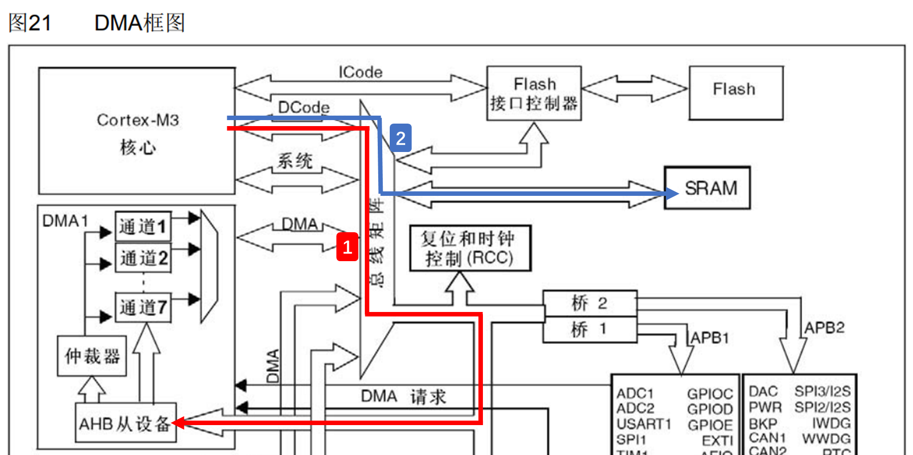

**有DMA传输**

1. DMA传输时外设对DMA控制器发出请求。
2. DMA控制器收到请求，触发DMA工作。
3. DMA控制器从AHB外设获取ADC采集的数据，存储到DMA通道中
4. DMA控制器的DMA总线与总线矩阵协调，使用AHB把外设ADC采集的数据经由DMA通道存放到SRAM中，这个数据的传输过程中，完全不需要内核的参与，也就是不需要CPU的参与
   


### DMA基本结构


M2M 0：硬件触发 1：为软件触发

传输计数器：设置好值后，每传输一次，值减一

主要配置：

* 起始位置
* 数据宽度
* 地址是否自增

### DMA触发源


* 不同通道的硬件请求信号不一样，软件触发相同
* M2M 0：硬件触发 1：为软件触发

* 使用硬件触发时，除了设置M2M为Disable外，还需要使用`XXX_DMACmd()`函数
  * 如使用ADC1触发DMA通道1：`ADC_DMACmd(ADC1,ENABLE); `  

````c
void ADC_DMACmd(ADC_TypeDef* ADCx, FunctionalState NewState);
void TIM_DMACmd(TIM_TypeDef* TIMx, uint16_t TIM_DMASource, FunctionalState NewState);
void USART_DMACmd(USART_TypeDef* USARTx, uint16_t USART_DMAReq, FunctionalState NewState);
……
````

### 数据宽度与对齐


* 同宽度直接复制
* 小宽度转大宽度补零
* 大宽度转小宽度保留高位

## 相关寄存器

| **寄存器** |         **名称**         |             **作用**             |
| :--------: | :----------------------: | :------------------------------: |
|  DMA_CCRx  |    DMA通道x配置寄存器    |  用于配置DMA（核心控制寄存器）   |
|  DMA_ISR   |    DMA中断状态寄存器     |     用于查询当前DMA传输状态      |
|  DMA_IFCR  |  DMA中断标志清除寄存器   |      用来清除DMA_ISR对应位       |
| DMA_CNDTRx |  DMA通道x传输数量寄存器  | 用于控制DMA通道x每次传输的数据量 |
| DMA_CPARx  |  DMA通道x外设地址寄存器  |      用于存储STM32外设地址       |
| DMA_CMARx  | DMA通道x存储器地址寄存器 |       用于存放存储器的地址       |
| USART_CR3  |     USART控制寄存器3     |       用于使能串口DMA发送        |

**DMA 中断状态寄存器（DMA_ISR）**


该寄存器是查询当前 DMA 传输的状态，我们常用的是 TCIFx 位，即通道 DMA 传输完成与否的标志。注意此寄存器为只读寄存器，所以在这些位被置位之后，只能通过其他的操作来清除。

**DMA 中断标志清除寄存器（DMA_IFCR）**

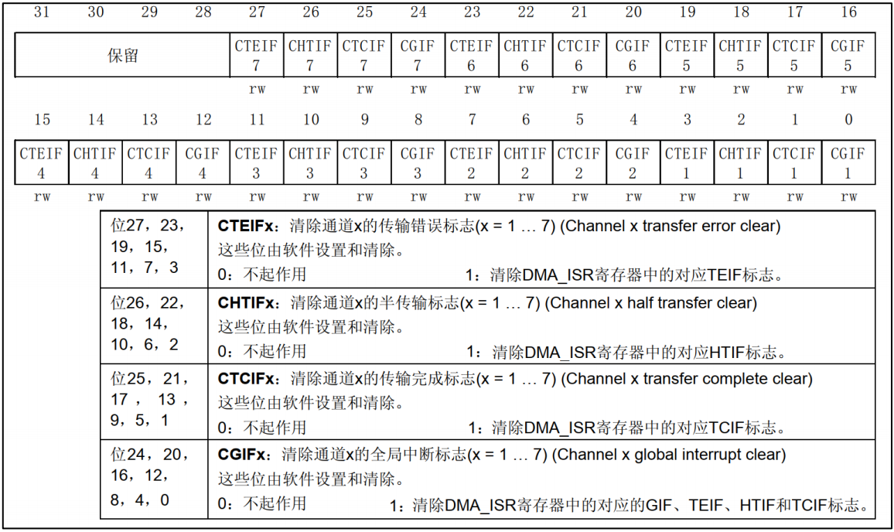

该寄存器是用来清除 DMA_ISR 的对应位的，通过写 0 清除。在 DMA_ISR 被置位后，我们必须通过向该寄存器对应的位写 0 来清除。


**DMA 通道 x 传输数量寄存器（DMA_CNDTRx）**


该寄存器控制着 DMA 通道 x 的每次传输所要传输的数据量。其设置范围为 0~65535。并且该寄存器的值随着传输的进行而减少，当该寄存器的值为 0 的时候就代表此次数据传输已经全部发送完成。所以可以通过这个寄存器的值来获取当前 DMA 传输的进度。

非循环模式下传输结束后，要开始新的DMA传输，需要在关闭DMA通道情况下，在该寄存器中重新写入传输数目。

**DMA 通道 x 配置寄存器（DMA_CCRx）**

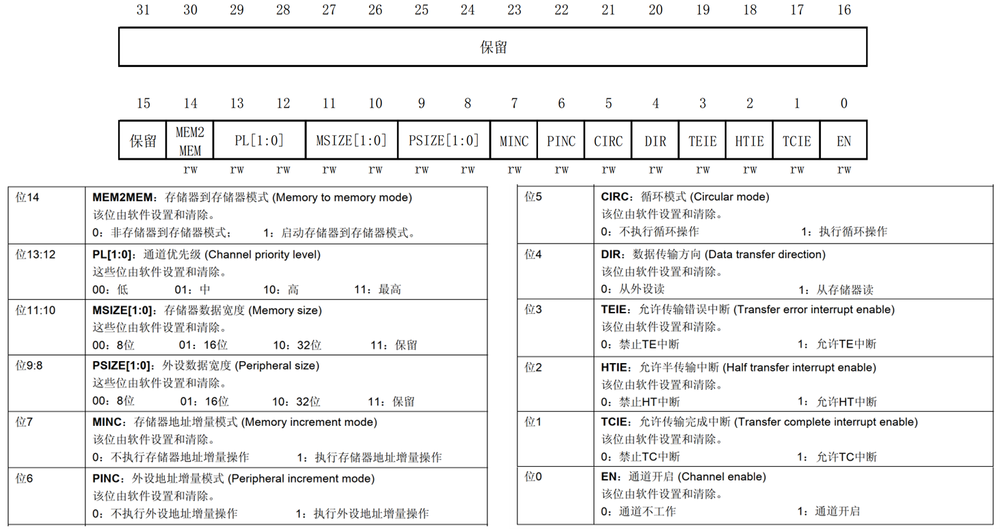

该寄存器控制着 DMA 很多相关信息，包括数据宽度、外设及存储器宽度、通道优先级、增量模式、传输方向、中断允许、使能等，所以说 DMA_CCRx 是 DMA 传输的核心控制寄存器。

**DMA 通道 x 外设地址寄存器（DMA_CPARx）**

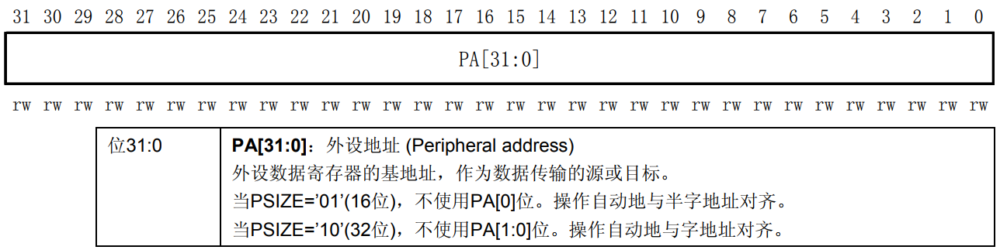

该寄存器是用来存储 STM32 外设的地址，比如我们平常使用串口 1，那么该寄存器必须写入 0x40013804（其实就是&USART1_DR）。其他外设就可以修改成其他对应外设地址就好了。

**DMA 通道 x 存储器地址寄存器（DMA_CMARx）**


## HAL库

### 常用函数

|           驱动函数           |       关联寄存器        |       功能描述        |
| :--------------------------: | :---------------------: | :-------------------: |
| __HAL_RCC_DMAx_CLK_ENABLE(…) |       RCC_AHBENR        |     使能DMAx时钟      |
|       HAL_DMA_Init(…)        |         DMA_CCR         |       初始化DMA       |
|     HAL_DMA_Start_IT(…)      | DMA_CCR/CPAR/CMAR/CNDTR |      开始DMA传输      |
|    __HAL_DMA_GET_FLAG(…)     |         DMA_ISR         | 查询DMA传输通道的状态 |
|     __HAL_DMA_ENABLE(…)      |       DMA_CCR(EN)       |      使能DMA外设      |
|     __HAL_DMA_DISABLE(…)     |       DMA_CCR(EN)       |      失能DMA外设      |

__HAL_RCC_DMAx_CLK_ENABLE(…)要在HAL_DMA_Init(…)之前完成，这也许就是DMA没有MspInit的缘故


使用其他外设触发DMA

|         驱动函数         |          关联寄存器           |          功能描述          |
| :----------------------: | :---------------------------: | :------------------------: |
|     __HAL_LINKDMA(…)     |                               |   用来连接DMA和外设句柄    |
| HAL_UART_Transmit_DMA(…) | CCR/CPAR/CMAR/CNDTR/USART_CR3 | 使能UART DMA发送，启动传输 |
|   HAL_UART_DMAStop(…)    |                               |  传输完成以后关闭串口DMA   |
|   HAL_ADC_Start_DMA(…)   |                               |                            |
|            ……            |              ……               |             ……             |

````C
/**	将DMA句柄连接到外设句柄中的关于DMA的参数
*	参数1：外设句柄
*	参数2：外设句柄中关于DMA的参数
*			如串口外设句柄中
*				DMA_HandleTypeDef             *hdmatx;      发送则用hdmatx
*				DMA_HandleTypeDef             *hdmarx;      接受则用hdmarx
*	参数3：DMA句柄
**/
__HAL_LINKDMA(__HANDLE__, __PPP_DMA_FIELD__, __DMA_HANDLE__);

/** 开启DMA
*	参数1：DMA句柄
*	参数2：来源地址
*	参数3：目标地址
*	参数4：传输的长度
**/
HAL_StatusTypeDef HAL_DMA_Start(DMA_HandleTypeDef *hdma, uint32_t SrcAddress, uint32_t DstAddress, uint32_t DataLength);

/** 使用UART激活DMA
*	内部实际上还是调用HAL_DMA_Start_IT()
**/
HAL_StatusTypeDef HAL_UART_Transmit_DMA(UART_HandleTypeDef *huart, uint8_t *pData, uint16_t Size)
````

````C
typedef struct __DMA_HandleTypeDef{
    DMA_Channel_TypeDef   *Instance;
    DMA_InitTypeDef       Init;
} DMA_HandleTypeDef; 
typedef struct{
    uint32_t Direction			    /* DMA传输方向 */
    uint32_t PeriphInc			    /* 外设地址(非)增量 */
    uint32_t MemInc			    	/* 存储器地址(非)增量*/
    uint32_t PeriphDataAlignment	/* 外设数据宽度 */
    uint32_t MemDataAlignment		/* 存储器数据宽度 */
    uint32_t Mode					/* 操作模式 */
    uint32_t Priority				/* DMA通道优先级 */
} DMA_InitTypeDef;
/* DMA传输方向 */
#define DMA_PERIPH_TO_MEMORY
#define DMA_MEMORY_TO_PERIPH
#define DMA_MEMORY_TO_MEMORY
/* 外设地址(非)增量 */
#define DMA_PINC_ENABLE
#define DMA_PINC_DISABLE
/* 存储器地址(非)增量*/
#define DMA_MINC_ENABLE
#define DMA_MINC_DISABLE
/* 外设数据宽度 */
#define DMA_PDATAALIGN_BYTE
#define DMA_PDATAALIGN_HALFWORD
#define DMA_PDATAALIGN_WORD
/* 存储器数据宽度 */
#define DMA_MDATAALIGN_BYTE
#define DMA_MDATAALIGN_HALFWORD
#define DMA_MDATAALIGN_WORD
/* 操作模式 */
#define DMA_NORMAL           // 正常模式，只传输一次
#define DMA_CIRCULAR         // 连续模式
/* DMA通道优先级 */
#define DMA_PRIORITY_LOW
#define DMA_PRIORITY_MEDIUM
#define DMA_PRIORITY_HIGH
#define DMA_PRIORITY_VERY_HIGH

````

### 实例

#### 数据传送DMA

将一个数组中的内容传输的另一个数组

````c
uint8_t Memory[10] = {0x00,0x01,0x02,0x03,0x04,0x05,0x06,0x07,0x08,0x09};
uint8_t Periph[10] = {0};
DMA_HandleTypeDef DMA_HandleStructure;
void DMA_Init(void){

    __HAL_RCC_DMA1_CLK_ENABLE();          // 使能DMA1
    
    DMA_HandleStructure.Instance = DMA1_Channel1;              /*使用DMA1的通道1*/
    DMA_HandleStructure.Init.Direction = DMA_MEMORY_TO_MEMORY;
    DMA_HandleStructure.Init.Mode = DMA_NORMAL;                /*使用标准模式，存储器到存储器无法使用连续模式*/
    DMA_HandleStructure.Init.Priority = DMA_PRIORITY_MEDIUM ;  /*使用中等优先级*/
    DMA_HandleStructure.Init.MemInc = DMA_MINC_ENABLE ;
    DMA_HandleStructure.Init.MemDataAlignment = DMA_MDATAALIGN_BYTE ;
    DMA_HandleStructure.Init.PeriphInc = DMA_PINC_ENABLE;
    DMA_HandleStructure.Init.PeriphDataAlignment = DMA_PDATAALIGN_BYTE;
    
    HAL_DMA_Init(&DMA_HandleStructure);
    HAL_DMA_Start(&DMA_HandleStructure,(uint32_t)Memory, (uint32_t)Periph,0);    // 参数3:传输数据个数
    
    __HAL_DMA_ENABLE(&DMA_HandleStructure);
}
// 设置传输多少数据，就是HAL_DMA_Start参数4
void DMA_Set_DataLeng(int leng){
    __HAL_DMA_DISABLE(&DMA_HandleStructure);    // 操作寄存器必须先失能
    DMA_HandleStructure.Instance->CNDTR = leng;
    __HAL_DMA_ENABLE(&DMA_HandleStructure);
}
int main(void){
    HAL_Init();                                 /* 初始化HAL库 */
    sys_stm32_clock_init(RCC_PLL_MUL9);         /* 设置时钟,72M */
    delay_init(72);                             /* 初始化延时函数 */
    UART_Init();
    key_init();
    DMA_Init();
    
    uint8_t key;
    while(1){
        key = key_scan(0);
        if(key == 1){
            DMA_Set_DataLeng(10);     // 开始传输
            while(__HAL_DMA_GET_FLAG(&DMA_HandleStructure,DMA_FLAG_TC1)!=RESET);
            printf("传输完成 \r\n");
            for(int i = 0;i < 10;i++){
                printf("Memory[%d] :%d \r\n",i,Memory[i]);
                printf("Periph[%d] :%d \r\n",i,Periph[i]);
            }  
        }
    }
}
````

#### 串口+DMA

将数组(存储器)中的内容通过串口外设调用DMA直接发送到上位机

````c
UART_HandleTypeDef UART_Handle;	               // 串口句柄
void UART_Init(void){
    UART_Handle.Instance = USART1;	                     // 使用USART1
    
    UART_Handle.Init.BaudRate = 115200;           
    UART_Handle.Init.Mode =  UART_MODE_TX_RX;            // 读写
    UART_Handle.Init.Parity = UART_PARITY_NONE;          // 不使用校验
    UART_Handle.Init.StopBits = UART_STOPBITS_1;         // 停止位1
    UART_Handle.Init.WordLength = UART_WORDLENGTH_8B;    // 数据位8
    UART_Handle.Init.HwFlowCtl = UART_HWCONTROL_NONE ;
    
    HAL_UART_Init(&UART_Handle);                         // 初始化
    
    __HAL_RCC_GPIOA_CLK_ENABLE();
    __HAL_RCC_USART1_CLK_ENABLE();
    
    GPIO_InitTypeDef GPIO_InitStructure;
    GPIO_InitStructure.Mode = GPIO_MODE_AF_PP;
    GPIO_InitStructure.Pin = GPIO_PIN_9;
    GPIO_InitStructure.Speed = GPIO_SPEED_FREQ_HIGH;
    HAL_GPIO_Init(GPIOA,&GPIO_InitStructure);
    
    GPIO_InitStructure.Mode = GPIO_MODE_INPUT;
    GPIO_InitStructure.Pin = GPIO_PIN_10;
    GPIO_InitStructure.Pull = GPIO_PULLUP;
    GPIO_InitStructure.Speed = GPIO_SPEED_FREQ_HIGH;
    HAL_GPIO_Init(GPIOA,&GPIO_InitStructure);
}
DMA_HandleTypeDef DMA_HandleStructure;
void DMA_Init(void){
    __HAL_RCC_DMA1_CLK_ENABLE();
    /*  将DMA与USART1联系起来(发送DMA)
    *   参数2：hdmatx，就是UART_HandleTypeDef->hdmatx; 发送
    *              与之对应UART_HandleTypeDef->hdmarx; 接收
    */
    __HAL_LINKDMA(&UART_Handle,hdmatx,DMA_HandleStructure);             
    
    DMA_HandleStructure.Instance = DMA1_Channel4;                      /* USART1_TX使用的DMA通道为: DMA1_Channel4 */
    DMA_HandleStructure.Init.Direction = DMA_MEMORY_TO_PERIPH;         /* DIR = 1 , 存储器到外设模式 */
    DMA_HandleStructure.Init.MemDataAlignment = DMA_MDATAALIGN_BYTE;   /* 存储器数据长度:8位 */
    DMA_HandleStructure.Init.MemInc = DMA_MINC_ENABLE;                 /* 存储器增量模式 */
    DMA_HandleStructure.Init.PeriphDataAlignment = DMA_PDATAALIGN_BYTE;/* 外设数据长度:8位 */
    DMA_HandleStructure.Init.PeriphInc = DMA_PINC_DISABLE;             /* 外设非增量模式 */
    DMA_HandleStructure.Init.Priority = DMA_PRIORITY_MEDIUM;           /* 中等优先级 */
    DMA_HandleStructure.Init.Mode = DMA_NORMAL;                        /* 正常模式，非连续 */
    
    HAL_DMA_Init(&DMA_HandleStructure);
}
uint8_t data[] = {"rainupup 雨神"};     // 一共13个字节

int main(void){
    HAL_Init();                                 /* 初始化HAL库 */
    sys_stm32_clock_init(RCC_PLL_MUL9);         /* 设置时钟,72M */
    delay_init(72);                             /* 初始化延时函数 */
    key_init();
    UART_Init();
    DMA_Init();
    uint8_t keynum;   
    while(1){
        keynum = key_scan(0);
        if(keynum == 1){
            HAL_UART_Transmit_DMA(&UART_Handle,data, sizeof(data));                // UART 开启DMA传送       
            while(__HAL_DMA_GET_FLAG(&DMA_HandleStructure,DMA_FLAG_TC4) == RESET);
            __HAL_DMA_CLEAR_FLAG(&DMA_HandleStructure,DMA_FLAG_TC4);               // 清除标志位
            HAL_UART_DMAStop(&UART_Handle);                                        // 关闭UART DMA通道
        }       
    }
}
````

#### ADC单通道DMA

ADC单通道连续非扫描：连续检测100次电压，并对这100次电压取平均

````c
ADC_HandleTypeDef ADC_HandleStructure;
DMA_HandleTypeDef DMA_HandleStructure;
/** 初始化ADC,DMA
*   参数:DMA目标地址，即ADC存放的位置
**/
void ADC_DMA_Init(uint32_t data){  
    __HAL_RCC_DMA1_CLK_ENABLE();  /* 开启DMA时钟，注意：要在HAL_DMA_Init之前完成 */
    
    DMA_HandleStructure.Instance = DMA1_Channel1;               /* ADC使用DMA1的通道1 */
    DMA_HandleStructure.Init.Direction = DMA_PERIPH_TO_MEMORY;  /* 外设到内存 */
    DMA_HandleStructure.Init.Mode = DMA_NORMAL;                 /* 使用标准模式，非连续传输 */
    DMA_HandleStructure.Init.Priority = DMA_PRIORITY_MEDIUM;    /* 使用中等优先级 */
    DMA_HandleStructure.Init.MemInc = DMA_MINC_ENABLE ;         /* 内存自增 */
    DMA_HandleStructure.Init.MemDataAlignment = DMA_MDATAALIGN_HALFWORD;    /* ADC采集的数据是16为长度，故采用半字 */
    DMA_HandleStructure.Init.PeriphInc = DMA_PINC_DISABLE;      /* 外设不自增 */
    DMA_HandleStructure.Init.PeriphDataAlignment = DMA_PDATAALIGN_HALFWORD; /* ADC采集的数据是16为长度 */
    HAL_DMA_Init(&DMA_HandleStructure); 
    
    
    ADC_ChannelConfTypeDef ADC_ChConf;
    
    ADC_HandleStructure.Instance = ADC1;								/* 选择ADC1 */
    ADC_HandleStructure.Init.ContinuousConvMode = ENABLE;				/* 连续模式 */   
    ADC_HandleStructure.Init.DataAlign = ADC_DATAALIGN_RIGHT;			/* 右对齐 */
    ADC_HandleStructure.Init.ScanConvMode = ADC_SCAN_DISABLE;			/* 非扫描模式 */
    ADC_HandleStructure.Init.NbrOfConversion = 1;						/* 使用1个通道 */
    ADC_HandleStructure.Init.DiscontinuousConvMode = DISABLE;			/* 间断模式关闭 */
    ADC_HandleStructure.Init.NbrOfDiscConversion = 0;					/* 间断模式关闭 */
    ADC_HandleStructure.Init.ExternalTrigConv = ADC_SOFTWARE_START ; 	/* 软件触发 */
    
    HAL_ADC_Init(&ADC_HandleStructure);
    HAL_ADCEx_Calibration_Start(&ADC_HandleStructure);		/* 校准 */

    ADC_ChConf.Channel = ADC_CHANNEL_1;						/* 通道1 PA1 */
    ADC_ChConf.Rank = ADC_REGULAR_RANK_1 ;					/* 序列1 */
    ADC_ChConf.SamplingTime = ADC_SAMPLETIME_239CYCLES_5;	/* 采样时间 */
    
    HAL_ADC_ConfigChannel(&ADC_HandleStructure,&ADC_ChConf);/* 初始化ADC通道 */
    
    __HAL_LINKDMA(&ADC_HandleStructure,DMA_Handle,DMA_HandleStructure);     /* DMA句柄连接到ADC句柄 */
    
    HAL_NVIC_SetPriorityGrouping(2);
    HAL_NVIC_SetPriority(DMA1_Channel1_IRQn,2,2);           /* 设置DMA中断 */
    HAL_NVIC_EnableIRQ(DMA1_Channel1_IRQn);
    
    /* 开启DMA，并开启DMA中断
    *  参数2：DMA数据来源
    *  参数3：DMA目标
    */
    HAL_DMA_Start_IT(&DMA_HandleStructure,(uint32_t)&ADC1->DR,data,0); 
    HAL_ADC_Start_DMA(&ADC_HandleStructure,&data,0);        /* 开启ADC,并连接DMA */
}
/**
*	初始化外围时钟，ADC的GPIO
**/
void HAL_ADC_MspInit(ADC_HandleTypeDef* hadc){
    if(hadc->Instance == ADC1){
        __HAL_RCC_GPIOA_CLK_ENABLE();
        __HAL_RCC_ADC1_CLK_ENABLE();

        RCC_PeriphCLKInitTypeDef RCC_PeriphInitStructure = {0};            // RCC配置外设时钟
        RCC_PeriphInitStructure.AdcClockSelection = RCC_ADCPCLK2_DIV6;     // ADC分频
        RCC_PeriphInitStructure.PeriphClockSelection = RCC_PERIPHCLK_ADC;  // 选择配置ADC
        HAL_RCCEx_PeriphCLKConfig(&RCC_PeriphInitStructure);
        
        GPIO_InitTypeDef GPIO_InitStructure;
        GPIO_InitStructure.Mode = GPIO_MODE_ANALOG;    //模拟输入，ADC专属
        GPIO_InitStructure.Pin = GPIO_PIN_1;
        GPIO_InitStructure.Pull = GPIO_PULLDOWN;
        GPIO_InitStructure.Speed = GPIO_SPEED_FREQ_HIGH;
        
        HAL_GPIO_Init(GPIOA,&GPIO_InitStructure);    
    }
}
/** 开启ADC转换
*   参数：传输的长度
**/
void MyADC_DMAEnable(uint16_t length){
//    ADC1->CR2 &= ~(1 << 0);
//    DMA1_Channel1->CCR &= ~(1 << 0);
//    while (DMA1_Channel1->CCR & (1 << 0));
//    DMA1_Channel1->CNDTR = length;
//    DMA1_Channel1->CCR |= 1 << 0;
//    ADC1->CR2 |= 1 << 0;
//    ADC1->CR2 |= 1 << 22;
    
    __HAL_ADC_DISABLE(&ADC_HandleStructure);        /* 操作寄存器必须失能 */
    __HAL_DMA_DISABLE(&DMA_HandleStructure);
    
    DMA_HandleStructure.Instance->CNDTR = length;   /* 设置传输的长度 */
    
    __HAL_ADC_ENABLE(&ADC_HandleStructure);
    __HAL_DMA_ENABLE(&DMA_HandleStructure);
    HAL_ADC_Start(&ADC_HandleStructure);            /* 软件开启ADC */
}
/**
*   传输完成，将标志位置1，方便main函数读取
**/
int DMA_TC_Flag = 0;
void DMA1_Channel1_IRQHandler(void){
//    if (DMA1->ISR & (1<<1))
//    {
//        DMA_TC_Flag = 1;
//        DMA1->IFCR |= 1 << 1;        //DMA只能使用IFCR来消除ISR的标记
//    } 
    if(__HAL_DMA_GET_FLAG(&DMA_HandleStructure,DMA_FLAG_TC1) != SET){ /* 等待传输完成 */
        DMA_TC_Flag = 1;
        __HAL_DMA_CLEAR_FLAG(&DMA_HandleStructure,DMA_FLAG_TC1);
    }
}

#define ADC_DMA_LENGHT 100
uint16_t adc_dma_buffer[ADC_DMA_LENGHT];
int main(void){
    HAL_Init();                         /* 初始化HAL库 */
    sys_stm32_clock_init(RCC_PLL_MUL9); /* 设置时钟, 72Mhz */
    delay_init(72);                     /* 延时初始化 */
    usart_init(115200);                 /* 串口初始化为115200 */
    led_init();                         /* 初始化LED */
    lcd_init();                         /* 初始化LCD */
    
    ADC_DMA_Init((uint32_t)&adc_dma_buffer); /* 初始化ADC和DMA */
    
    lcd_show_string(30, 110, 200, 16, 16, "ADC1_CH1_VAL:", RED);
    lcd_show_string(30, 130, 200, 16, 16, "ADC1_CH1_VOL:0.000V", BLUE); /* 先在固定位置显示小数点 */

    uint32_t adcsum,i;
    float temp;
   	MyADC_DMAEnable(ADC_DMA_LENGHT);   	/* 先开启一次ADC和DMA转换 */
    while (1){   
        adcsum = 0;
        if(DMA_TC_Flag == 1){			/* 等待传输完成 */
            for(i = 0;i < 100;i++){
                adcsum += adc_dma_buffer[i];
            }
            adcsum /= ADC_DMA_LENGHT;	/* 取平均 */
            lcd_show_xnum(134, 110, adcsum, 5, 16, 0, BLUE);
        
            temp = (float)adcsum * (3.3 / 4096);            
            adcsum = temp;            
            lcd_show_xnum(134, 130, adcsum, 1, 16, 0, BLUE);            
            temp -=adcsum;
            temp *= 1000;
            lcd_show_xnum(150, 130, temp, 3, 16, 0X80, BLUE);
            
            DMA_TC_Flag = 0;					/* 清除传输完成 */
            MyADC_DMAEnable(ADC_DMA_LENGHT);    /* 再次开启一次ADC和DMA转换 */     
        }
    }
}
````

#### ADC多通道DMA

连续扫描3个通道100次

````c
ADC_HandleTypeDef ADC_HandleStructure;
DMA_HandleTypeDef DMA_HandleStructure;
/** 初始化ADC,DMA
*   参数:DMA目标地址，即ADC存放的位置
**/
void ADC_DMA_Init(uint32_t data){  
    __HAL_RCC_DMA1_CLK_ENABLE();  /* 开启DMA时钟，注意：要在HAL_DMA_Init之前完成 */
    
    DMA_HandleStructure.Instance = DMA1_Channel1;               /* ADC使用DMA1的通道1 */
    DMA_HandleStructure.Init.Direction = DMA_PERIPH_TO_MEMORY;  /* 外设到内存 */
    DMA_HandleStructure.Init.Mode = DMA_NORMAL;                 /* 使用标准模式，非连续传输 */
    DMA_HandleStructure.Init.Priority = DMA_PRIORITY_MEDIUM;    /* 使用中等优先级 */
    DMA_HandleStructure.Init.MemInc = DMA_MINC_ENABLE ;         /* 内存自增 */
    DMA_HandleStructure.Init.MemDataAlignment = DMA_MDATAALIGN_HALFWORD;    /* ADC采集的数据是16为长度，故采用半字 */
    DMA_HandleStructure.Init.PeriphInc = DMA_PINC_DISABLE;      /* 外设不自增 */
    DMA_HandleStructure.Init.PeriphDataAlignment = DMA_PDATAALIGN_HALFWORD; /* ADC采集的数据是16为长度 */
    HAL_DMA_Init(&DMA_HandleStructure); 
    
    
    ADC_ChannelConfTypeDef ADC_ChConf;
    
    ADC_HandleStructure.Instance = ADC1;								/* 选择ADC1 */
    ADC_HandleStructure.Init.ContinuousConvMode = ENABLE;				/* 非连续模式 */   
    ADC_HandleStructure.Init.DataAlign = ADC_DATAALIGN_RIGHT;			/* 右对齐 */
    ADC_HandleStructure.Init.ScanConvMode = ADC_SCAN_ENABLE;			/* 扫描模式 */
    ADC_HandleStructure.Init.NbrOfConversion = 3;						/* 使用3个通道 */
    ADC_HandleStructure.Init.DiscontinuousConvMode = DISABLE;			/* 间断模式关闭 */
    ADC_HandleStructure.Init.NbrOfDiscConversion = 0;					/* 间断模式关闭 */
    ADC_HandleStructure.Init.ExternalTrigConv = ADC_SOFTWARE_START ; 	/* 软件触发 */
    
    HAL_ADC_Init(&ADC_HandleStructure);
    HAL_ADCEx_Calibration_Start(&ADC_HandleStructure);		/* 校准 */


    ADC_ChConf.Channel = ADC_CHANNEL_0;						/* 通道0 PA0 */
    ADC_ChConf.Rank = ADC_REGULAR_RANK_1 ;					/* 序列1 */
    ADC_ChConf.SamplingTime = ADC_SAMPLETIME_239CYCLES_5;	/* 采样时间 */
    HAL_ADC_ConfigChannel(&ADC_HandleStructure,&ADC_ChConf);/* 初始化ADC通道 */
    ADC_ChConf.Channel = ADC_CHANNEL_1;
    ADC_ChConf.Rank = ADC_REGULAR_RANK_2 ;
    HAL_ADC_ConfigChannel(&ADC_HandleStructure,&ADC_ChConf); 
    
    ADC_ChConf.Channel = ADC_CHANNEL_2;	
    ADC_ChConf.Rank = ADC_REGULAR_RANK_3;
    HAL_ADC_ConfigChannel(&ADC_HandleStructure,&ADC_ChConf);
    
    
    __HAL_LINKDMA(&ADC_HandleStructure,DMA_Handle,DMA_HandleStructure);     /* DMA句柄连接到ADC句柄 */
    
    HAL_NVIC_SetPriorityGrouping(2);
    HAL_NVIC_SetPriority(DMA1_Channel1_IRQn,2,2);           /* 设置DMA中断 */
    HAL_NVIC_EnableIRQ(DMA1_Channel1_IRQn);
    
    /* 开启DMA，并开启DMA中断
    *  参数2：DMA数据来源
    *  参数3：DMA目标
    */
    HAL_DMA_Start_IT(&DMA_HandleStructure,(uint32_t)&ADC1->DR,data,0);
    HAL_ADC_Start_DMA(&ADC_HandleStructure,&data,0);        /* 开启ADC,并连接DMA */
}
void HAL_ADC_MspInit(ADC_HandleTypeDef* hadc){
    if(hadc->Instance == ADC1){
        __HAL_RCC_GPIOA_CLK_ENABLE();
        __HAL_RCC_ADC1_CLK_ENABLE();
        
        
        RCC_PeriphCLKInitTypeDef RCC_PeriphInitStructure = {0};                  // RCC配置外设时钟

        RCC_PeriphInitStructure.AdcClockSelection = RCC_ADCPCLK2_DIV6;     // ADC分频
        RCC_PeriphInitStructure.PeriphClockSelection = RCC_PERIPHCLK_ADC;  // 选择配置ADC
        HAL_RCCEx_PeriphCLKConfig(&RCC_PeriphInitStructure);
        
        
        GPIO_InitTypeDef GPIO_InitStructure;
        GPIO_InitStructure.Mode = GPIO_MODE_ANALOG;    //模拟输入，ADC专属
        GPIO_InitStructure.Pin = GPIO_PIN_0 | GPIO_PIN_1 | GPIO_PIN_2;
        GPIO_InitStructure.Pull = GPIO_PULLDOWN;
        GPIO_InitStructure.Speed = GPIO_SPEED_FREQ_HIGH;
        
        HAL_GPIO_Init(GPIOA,&GPIO_InitStructure);    
    }
}
/** 开启ADC转换
*   参数：传输的长度
**/
void MyADC_DMAEnable(uint16_t length){
    __HAL_ADC_DISABLE(&ADC_HandleStructure);        /* 操作寄存器必须失能 */
    __HAL_DMA_DISABLE(&DMA_HandleStructure);
    
    DMA_HandleStructure.Instance->CNDTR = length;   /* 设置传输的长度 */
    
    __HAL_ADC_ENABLE(&ADC_HandleStructure);
    __HAL_DMA_ENABLE(&DMA_HandleStructure);
    HAL_ADC_Start(&ADC_HandleStructure);            /* 软件开启ADC */
}
/**
*   传输完成，将标志位置1，方便main函数读取
**/
int DMA_TC_Flag = 0;
void DMA1_Channel1_IRQHandler(void){
    if(__HAL_DMA_GET_FLAG(&DMA_HandleStructure,DMA_FLAG_TC1) != SET){
        DMA_TC_Flag = 1;
        __HAL_DMA_CLEAR_FLAG(&DMA_HandleStructure,DMA_FLAG_TC1);
    }
}
#define ADC_DMA_LENGHT 100 * 3                /* 连续转换100次，扫描3个通道*/
uint16_t adc_dma_buffer[ADC_DMA_LENGHT];
int main(void){
    HAL_Init();                         /* 初始化HAL库 */
    sys_stm32_clock_init(RCC_PLL_MUL9); /* 设置时钟, 72Mhz */
    delay_init(72);                     /* 延时初始化 */
    usart_init(115200);                 /* 串口初始化为115200 */
    led_init();                         /* 初始化LED */
    lcd_init();                         /* 初始化LCD */
    ADC_DMA_Init((uint32_t)&adc_dma_buffer);
    
    lcd_show_string(30, 50, 200, 16, 16, "STM32", RED);
    lcd_show_string(30, 70, 200, 16, 16, "WWW.RAINUPUP.CN", RED);
    lcd_show_string(30, 90, 200, 16, 16, "@RAINyy", RED);
    
    lcd_show_string(30, 110, 200, 16, 16, "ADC1_CH1_VAL:", RED);
    lcd_show_string(30, 130, 200, 16, 16, "ADC1_CH1_VOL:0.000V", BLUE); /* 先在固定位置显示小数点 */

    lcd_show_string(30, 150, 200, 16, 16, "ADC1_CH2_VAL:", RED);
    lcd_show_string(30, 170, 200, 16, 16, "ADC1_CH2_VOL:0.000V", BLUE); /* 先在固定位置显示小数点 */
    
    lcd_show_string(30, 190, 200, 16, 16, "ADC1_CH3_VAL:", RED);
    lcd_show_string(30, 210, 200, 16, 16, "ADC1_CH3_VOL:0.000V", BLUE); /* 先在固定位置显示小数点 */
    
    uint32_t adcsum;
    float temp;
    
    int i,j;
    MyADC_DMAEnable(ADC_DMA_LENGHT); 
    while (1)
    {   
        adcsum = 0;
        if(DMA_TC_Flag == 1){
            /*每次扫描3个通道，连续100次，数组下标 0 3 6……存放通道0的数据, 1 4 7……存放通道1的数据 */
            for(i = 0;i < 3;i++){
                for(j = 0;j < 100;j++){
                    adcsum += adc_dma_buffer[j * 3 + i];
                }
                adcsum  /= (ADC_DMA_LENGHT / 3);
                
                lcd_show_xnum(134, 110 + (i * 40), adcsum, 5, 16, 0, BLUE);
          
                temp = (float)adcsum * (3.3 / 4096);            
                adcsum = temp;            
                lcd_show_xnum(134, 130 + (i * 40), adcsum, 1, 16, 0, BLUE);            
                temp -=adcsum;
                temp *= 1000;
                lcd_show_xnum(150, 130 + (i * 40), temp, 3, 16, 0X80, BLUE);
                
                DMA_TC_Flag = 0;
                MyADC_DMAEnable(ADC_DMA_LENGHT);    
            }
        }
    }
}
````


## 标准库

### 常用函数

````c
/* 初始化参数DMAy_Channelx：
   参数DMAy_Channelx: y选择DMA，x选择通道
*/
void DMA_Init(DMA_Channel_TypeDef* DMAy_Channelx, DMA_InitTypeDef* DMA_InitStruct);
void DMA_DeInit(DMA_Channel_TypeDef* DMAy_Channelx);
void DMA_StructInit(DMA_InitTypeDef* DMA_InitStruct);
// 使能DMA
void DMA_Cmd(DMA_Channel_TypeDef* DMAy_Channelx, FunctionalState NewState);
// 使能中断
void DMA_ITConfig(DMA_Channel_TypeDef* DMAy_Channelx, uint32_t DMA_IT, FunctionalState NewState);
// 设置传送大小，即传输计数器
void DMA_SetCurrDataCounter(DMA_Channel_TypeDef* DMAy_Channelx, uint16_t DataNumber); 
// 获取传输计数器的值，即还有几次传输完毕
uint16_t DMA_GetCurrDataCounter(DMA_Channel_TypeDef* DMAy_Channelx);

// 获取传输的状态
/**
  *     @arg DMA1_FLAG_GL1: 获取 DMA1通道1的 组标志
  *     @arg DMA1_FLAG_TC1: 获取 DMA1通道1的 传输完成标志
  *     @arg DMA1_FLAG_HT1: 获取 DMA1通道1的 传输一半标志
  *     @arg DMA1_FLAG_TE1: 获取 DMA1通道1的 错误标志
  *     …………
  */
FlagStatus DMA_GetFlagStatus(uint32_t DMAy_FLAG);
// 清空传输完成标志位
void DMA_ClearFlag(uint32_t DMAy_FLAG);

ITStatus DMA_GetITStatus(uint32_t DMAy_IT);
void DMA_ClearITPendingBit(uint32_t DMAy_IT);
````


**结构体**

````c
typedef struct{
  uint32_t DMA_PeripheralBaseAddr; // 外设地址
  uint32_t DMA_PeripheralInc;      // 外设地址是否自增
  uint32_t DMA_PeripheralDataSize; // 外设数据长度
  uint32_t DMA_MemoryBaseAddr;     // 内存地址(要传输的变量的指针)
  uint32_t DMA_MemoryDataSize;     // 内存数据长度
  uint32_t DMA_MemoryInc;          // 内存地址是否自增

  uint32_t DMA_DIR;                // 传送方向
  uint32_t DMA_BufferSize;         // 传输内容的大小
    
  uint32_t DMA_Mode;               // DMA模式：一次传输，循环  注意：连续或是和DMA_M2M属性的软件触发只能二选一
  uint32_t DMA_M2M;                // 硬件触发、软件触发
  uint32_t DMA_Priority;           // 优先级
}DMA_InitTypeDef;
````

````c
/** DMA_DIR 传输方向
  * 它还是取决于结构体中的DMA_PeripheralBaseAddr和DMA_MemoryBaseAddr
  */
#define DMA_DIR_PeripheralDST              ((uint32_t)0x00000010)    // 外部设备寄存器为目标
#define DMA_DIR_PeripheralSRC              ((uint32_t)0x00000000)    // 外部设备寄存器为来源


/** DMA_PeripheralInc 外设地址是否自增
  */
#define DMA_PeripheralInc_Enable           ((uint32_t)0x00000040)
#define DMA_PeripheralInc_Disable          ((uint32_t)0x00000000)

/** DMA_MemoryInc 内存地址是否自增
  */
#define DMA_MemoryInc_Enable               ((uint32_t)0x00000080)
#define DMA_MemoryInc_Disable              ((uint32_t)0x00000000)

/** DMA_PeripheralDataSize;  外设数据长度
  */
#define DMA_PeripheralDataSize_Byte        ((uint32_t)0x00000000)
#define DMA_PeripheralDataSize_HalfWord    ((uint32_t)0x00000100)
#define DMA_PeripheralDataSize_Word        ((uint32_t)0x00000200)

/** DMA_MemoryDataSize;      内存数据长度
  */
#define DMA_MemoryDataSize_Byte            ((uint32_t)0x00000000)
#define DMA_MemoryDataSize_HalfWord        ((uint32_t)0x00000400)
#define DMA_MemoryDataSize_Word            ((uint32_t)0x00000800)

/** DMA_Mode;  DMA模式：一次传输，循环
  */
#define DMA_Mode_Circular                  ((uint32_t)0x00000020)   // 循环
#define DMA_Mode_Normal                    ((uint32_t)0x00000000)   // 一次

/** DMA_Priority;        优先级
  */
#define DMA_Priority_VeryHigh              ((uint32_t)0x00003000)
#define DMA_Priority_High                  ((uint32_t)0x00002000)
#define DMA_Priority_Medium                ((uint32_t)0x00001000)
#define DMA_Priority_Low                   ((uint32_t)0x00000000)

/**  DMA_M2M;            硬件触发、软件触发
  */
#define DMA_M2M_Enable                     ((uint32_t)0x00004000)   // 软件触发
#define DMA_M2M_Disable                    ((uint32_t)0x00000000)   // 硬件触发
````

### 实例

#### 数据传送DMA

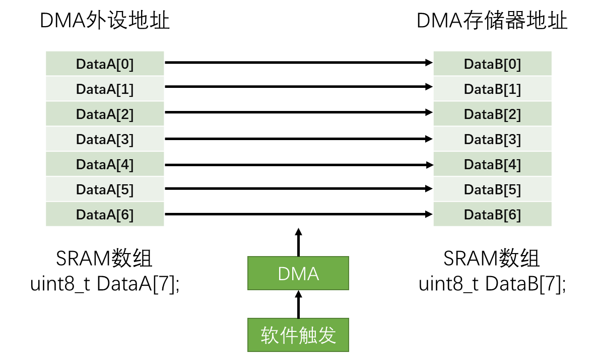

目的：将DataA数组中的值传送到DataB数组中，都使用自增，


````c
uint32_t MySize;
void MyDMA_Init(uint32_t AddA,uint32_t AddB,uint32_t Size){
	MySize = Size;
	
	RCC_AHBPeriphClockCmd(RCC_AHBPeriph_DMA1,ENABLE);      // DMA需要RCC_AHBPeriphClockCmd()函数使能
	
	DMA_InitTypeDef DMA_InitStructure;
	DMA_InitStructure.DMA_PeripheralBaseAddr = AddA;                         // 串口数据寄存器地址
	DMA_InitStructure.DMA_PeripheralDataSize = DMA_PeripheralDataSize_Byte;  // 外设数据单位
	DMA_InitStructure.DMA_PeripheralInc = DMA_PeripheralInc_Enable;          // 外设地址自增
	
	DMA_InitStructure.DMA_MemoryBaseAddr = AddB;                             // 内存地址(要传输的变量的指针)
	DMA_InitStructure.DMA_MemoryDataSize = DMA_MemoryDataSize_Byte ;         // 内存数据单位
	DMA_InitStructure.DMA_MemoryInc = DMA_MemoryInc_Enable  ;                // 内存地址自增
	
	DMA_InitStructure.DMA_Mode = DMA_Mode_Normal;                            // 单次传送
	DMA_InitStructure.DMA_BufferSize = Size;                                 // 传输内容的大小
	DMA_InitStructure.DMA_DIR = DMA_DIR_PeripheralSRC;                       // 方向(从外设到内存)，外设作为来源
	DMA_InitStructure.DMA_M2M = DMA_M2M_Enable;                              // 使用软件触发(禁止内存到内存的传输)
	DMA_InitStructure.DMA_Priority = DMA_Priority_Medium;                    // 优先级：中
	
	DMA_Init(DMA1_Channel1, &DMA_InitStructure);                             // 配置DMA1的1通道,DMAy_Channelx
	 
	//DMA_Cmd(DMA1_Channel1,ENABLE);                                         // 使能DMA1_Channel1
	DMA_Cmd(DMA1_Channel1,DISABLE);                                          // 不使能DMA1_Channel1
}
void DMA_Transfer(void){
	// 设置传输内容的大小，必须先不使能DMA，设置完后，使能DMA，传送
	DMA_Cmd(DMA1_Channel1,DISABLE);                       // 先不使能
	DMA_SetCurrDataCounter(DMA1_Channel1, MySize);        // 传输内容的大小，与DMA_InitStructure.DMA_BufferSize一样
	DMA_Cmd(DMA1_Channel1,ENABLE);                        // 使能
	
	while(DMA_GetFlagStatus(DMA1_FLAG_TC1) == RESET);     // 等待传送完成
	DMA_ClearFlag(DMA1_FLAG_TC1);	                      // 清除标志位
}
//----------------------------------------------------------------
uint8_t DataA[4] = {0x01,0x02,0x03,0x04};
uint8_t DataB[4] = {0,0,0,0};

int main(void)
{	
	OLED_Init();
	
	MyDMA_Init((uint32_t)DataA,(uint32_t)DataB,4);
	
	OLED_ShowString(1, 1, "DataA:");
	OLED_ShowString(3, 1, "DataB:");
	OLED_ShowHexNum(1, 6, (uint32_t)DataA, 8);
	OLED_ShowHexNum(3, 6, (uint32_t)DataB, 8);
	
	while(1){
		OLED_ShowHexNum(2, 1, DataA[0], 2);
		OLED_ShowHexNum(2, 4, DataA[1], 2);
		OLED_ShowHexNum(2, 7, DataA[2], 2);
		OLED_ShowHexNum(2, 10, DataA[3], 2);
		Delay_ms(1000);
		
		DataA[0]++;
		DataA[1]++;
		DataA[2]++;
		DataA[3]++;
		
		DMA_Transfer();
		
		OLED_ShowHexNum(4, 1, DataB[0], 2);
		OLED_ShowHexNum(4, 4, DataB[1], 2);
		OLED_ShowHexNum(4, 7, DataB[2], 2);
		OLED_ShowHexNum(4, 10, DataB[3], 2);
		Delay_ms(1000);
	}
}
````


#### ADC多通道DMA


ADC为软件触发，DMA的触发源为ADC，不需要获取ADC的值，直接使用DMA将ADC寄存器的DR中的值转移到数组

````c
uint16_t rainData[4];
void AD_DMA_Init(void){
	RCC_APB2PeriphClockCmd(RCC_APB2Periph_GPIOA, ENABLE);
	RCC_APB2PeriphClockCmd(RCC_APB2Periph_ADC1, ENABLE);     //开启ADC
	RCC_AHBPeriphClockCmd(RCC_AHBPeriph_DMA1,ENABLE);        //开启DMA
	
	RCC_ADCCLKConfig(RCC_PCLK2_Div6);                        //分频ADCCLK = 72MHz / 6 = 12MHz
	
	GPIO_InitTypeDef GPIO_InitSturcture;
	GPIO_InitSturcture.GPIO_Mode = GPIO_Mode_AIN;            //模拟输入模式，ADC的专属模式，断开GPIO口的输入输出对模拟电压照成的干扰
	GPIO_InitSturcture.GPIO_Pin = GPIO_Pin_0 | GPIO_Pin_1 | GPIO_Pin_2 |GPIO_Pin_3;
	GPIO_InitSturcture.GPIO_Speed = GPIO_Speed_50MHz;
	GPIO_Init(GPIOA, &GPIO_InitSturcture);
	
	ADC_RegularChannelConfig(ADC1, ADC_Channel_0, 1,ADC_SampleTime_55Cycles5);     //使用ADC1的通道1，放到序列1位置，采样时间55
	ADC_RegularChannelConfig(ADC1, ADC_Channel_1, 2,ADC_SampleTime_55Cycles5);     //使用ADC1的通道2，放到序列2位置，采样时间55
	ADC_RegularChannelConfig(ADC1, ADC_Channel_2, 3,ADC_SampleTime_55Cycles5);     //使用ADC1的通道3，放到序列3位置，采样时间55
	ADC_RegularChannelConfig(ADC1, ADC_Channel_3, 4,ADC_SampleTime_55Cycles5);     //使用ADC1的通道3，放到序列4位置，采样时间55
	
	ADC_InitTypeDef ADC_InitStructure;
	ADC_InitStructure.ADC_Mode = ADC_Mode_Independent;                    // 独立模式
	ADC_InitStructure.ADC_DataAlign = ADC_DataAlign_Right;                // 右对齐
	ADC_InitStructure.ADC_ExternalTrigConv = ADC_ExternalTrigConv_None;   // 不使用外部触发
	ADC_InitStructure.ADC_ContinuousConvMode = ENABLE;                    // 连续触发
	ADC_InitStructure.ADC_ScanConvMode = ENABLE;                          // 扫描模式
	ADC_InitStructure.ADC_NbrOfChannel = 4;                               // 4个通道
	ADC_Init(ADC1, &ADC_InitStructure);
	
	DMA_InitTypeDef DMA_InitStructure;
	DMA_InitStructure.DMA_PeripheralBaseAddr = (uint32_t)&ADC1->DR;       // 外部寄存器为ADC1的DR
	DMA_InitStructure.DMA_PeripheralDataSize = DMA_PeripheralDataSize_HalfWord;
	DMA_InitStructure.DMA_PeripheralInc = DMA_PeripheralInc_Disable;      // 外部寄存器不自增
	DMA_InitStructure.DMA_MemoryBaseAddr = (uint32_t)rainData;            // 存放到rainData;  数组
	DMA_InitStructure.DMA_MemoryDataSize = DMA_MemoryDataSize_HalfWord;
	DMA_InitStructure.DMA_MemoryInc = DMA_MemoryInc_Enable;               // 数组自增
	DMA_InitStructure.DMA_DIR = DMA_DIR_PeripheralSRC;
	DMA_InitStructure.DMA_BufferSize = 4;
	DMA_InitStructure.DMA_Mode = DMA_Mode_Circular;                       // 循环转移
	DMA_InitStructure.DMA_M2M = DMA_M2M_Disable;                          // 硬件触发，使用ADC触发
	DMA_InitStructure.DMA_Priority = DMA_Priority_Medium;
	DMA_Init(DMA1_Channel1, &DMA_InitStructure);
	
	DMA_Cmd(DMA1_Channel1,ENABLE);                                        // 使能DMA
	ADC_DMACmd(ADC1,ENABLE);                                              // 使ADC作为DMA的触发源，DMA1_Channel1的触发源之一是ADC1
	ADC_Cmd(ADC1,ENABLE);                                                 // 使能ADC
	
	ADC_ResetCalibration(ADC1);        // 复位校准
	while(ADC_GetResetCalibrationStatus(ADC1) == SET);    //返回复位校准状态，为SET则表示正在初始化校准寄存器
	ADC_StartCalibration(ADC1);        // 开始校准
	while(ADC_GetCalibrationStatus(ADC1) == SET);         //返回校准状态，为SET则表示正在开始校准

	ADC_SoftwareStartConvCmd(ADC1, ENABLE);                                // 软件触发ADC
}
//-----------------------------------------------------------------------------------------------------
int main(void)
{	
	OLED_Init();
	AD_DMA_Init();
	OLED_ShowString(1, 1, "AD1:");
	OLED_ShowString(2, 1, "AD2:");
	OLED_ShowString(3, 1, "AD3:");
	OLED_ShowString(4, 1, "AD4:");
	while(1){
		OLED_ShowNum(1, 5, rainData[0], 4);
		OLED_ShowNum(2, 5, rainData[1], 4);
		OLED_ShowNum(3, 5, rainData[2], 4);
		OLED_ShowNum(4, 5, rainData[3], 4);
		Delay_ms(100);
	}
}
````


# 串口

## 通信接口

* 通信的目的：将一个设备的数据传送到另一个设备，扩展硬件系统
* 通信协议：制定通信的规则，通信双方按照协议规则进行数据收发

| **名称** |       **引脚**       | **双工** | **时钟** | **电平** | **设备** |
| :------: | :------------------: | :------: | :------: | :------: | :------: |
|  USART   |        TX、RX        |  全双工  |   异步   |   单端   |  点对点  |
|   I2C    |       SCL、SDA       |  半双工  |   同步   |   单端   |  多设备  |
|   SPI    | SCLK、MOSI、MISO、CS |  全双工  |   同步   |   单端   |  多设备  |
|   CAN    |     CAN_H、CAN_L     |  半双工  |   异步   |   差分   |  多设备  |
|   USB    |        DP、DM        |  半双工  |   异步   |   差分   |  点对点  |


**同步通讯与异步通讯**

- 同步通讯：收发设备双方会使用一根信号线表示时钟信号，在`时钟信号`的驱动下双方进行协调，同步数据，通讯中通常双方会统一规定在时钟信号的上升沿或下降沿对数据线进行采样，对应时钟极性与时钟相位。
- 异步通讯：不需要**时钟信号**进行数据同步，它们直接在数据信号中穿插一些同步用的信号位，或者把主体数据进行打包，以数据帧（串口：起始位 数据 校验位(可以没有) 停止位）的格式传输数据，某些通讯中还需要双方约定数据的传输速率（波特率），以便更好地同步。

**STM32串口简介**

* **USART**-通用同步异步收发器(Universal Synchronous Asynchronous Receiver and Transmitter)是一个串行通信设备，可以灵活地与外部设备进行全双工数据交换。
* 有别于 USART 还有一个**UART**(Universal Asynchronous Receiver and Transmitter)，它是在 USART 基础上裁剪掉了同步通信功能（时钟同步），只有异步通信。简单区分同步和异步就是看通信时需不需要对外提供时钟输出，我们平时用的串口通信基本都是 UART。
* 串行通信一般是以帧格式传输数据，即是一帧一帧的传输，每帧包含有起始信号、数据信息、校验信息(由我们自己设置)、停止信号。
* 串口通信使用TTL逻辑：Transistor-transistor-logic 

**波特率**

* 比特率：每秒钟传送的比特数，单位bit/s
* 波特率：每秒钟传送的码元数，单位Baud(每秒钟的高低电平数量)
* 比特率 = 波特率 * log2 M ，M表示每个码元承载的信息量
* 二进制系统中，波特率数值上等于比特率


**串口的几个重要的参数:**

1. 波特率：串口通信的速率
2. 起始位：标志一个数据帧的开始，固定为低电平，当数据开始发送时，产生一个下降沿。(空闲–>起始位)
3. 数据位：数据帧的有效载荷，1为高电平，0为低电平，低位先行；比如 发送数据帧0x0F(00001111) 在数据帧里就是低位线性 即 1111 0000
4. 校验位：用于数据验证，根据数据位计算得来。分为奇校验，偶校验和无校验。
5. 停止位：用于数据帧间隔，固定为高电平。数据帧发送完成后，产生一个上升沿。(数据传输–>停止位)

| F103xx串口号 | TXD  | RXD  |
| :----------: | :--: | :--: |
|      1       | PA9  | PA10 |
|      2       | PA2  | PA3  |
|      3       | PB10 | PB11 |
|      4       | PC10 | PC11 |
|      5       | PC12 | PD2  |


## USART简介

1. USART（Universal Synchronous/Asynchronous Receiver/Transmitter）通用同步/异步收发器
2. USART是STM32内部集成的硬件外设，可根据数据寄存器的一个字节数据自动生成数据帧时序，从TX引脚发送出去，也可自动接收RX引脚的数据帧时序，拼接为一个字节数据，存放在数据寄存器里
3. 自带波特率发生器，最高达4.5Mbits/s
4. 可配置数据位长度（8/9）、停止位长度（0.5/1/1.5/2）
5. 可选校验位（无校验/奇校验/偶校验）
6. 支持同步模式、硬件流控制、DMA、智能卡、IrDA、LIN
7. STM32F103C8T6 USART资源： USART1、 USART2、 USART3


**USART基本结构**


**波特比率寄存器（BRR）**

把USARTDIV的整数部分写入位[15:4]， USARTDIV的小数部分写入[3:0]

USARTDIV = DIV_Mantissa + （DIV_Fraction/16）;DIV_Mantissa为整数部分，DIV_Fraction为小数部分


**波特率发生器**

- 发送器和接收器的波特率由波特率寄存器BRR里的DIV确定
- 计算公式：$波特率 = fck / (16 * USARTDIV)$
- 其中fck是串口的时钟，如：USART1的时钟是PCLK2,其他串口都是PCLK1

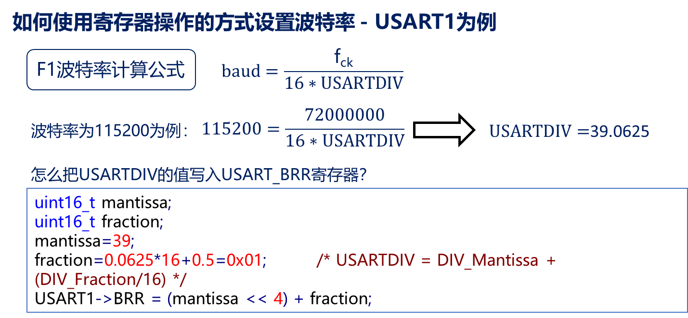

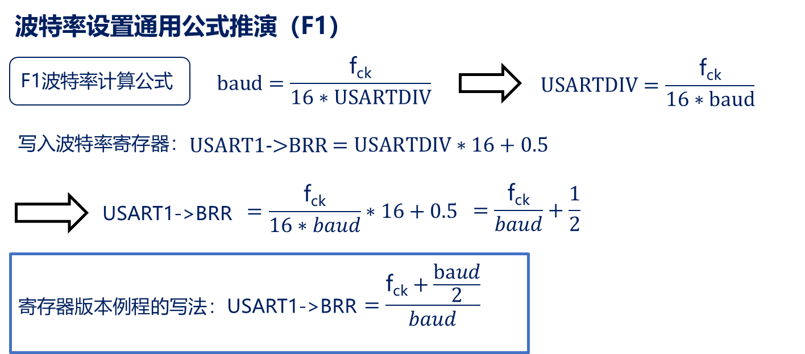


**硬件电路**

- 简单双向串口通信有两根通信线（发送端TX和接收端RX）

- **TX与RX要交叉连接**

- 当只需单向的数据传输时，可以只接一根通信线

- 当电平标准不一致时，需要加电平转换芯片

  


### USART框图

USART是STM32内部集成的硬件外设，可以根据数据寄存器的一个字节数据自动生成数据帧时序，从TX引脚发送出去，也可以自动接收RX引脚的数据帧时序，拼接成一个字节数据，存放在数据寄存器里。

当配置好USART的电路之后，直接读取数据寄存器，就可以自动发送数据和接收数据了。在发送和接收的模块有4个重要的寄存器

1. 发送数据寄存器TDR
2. 发送移位寄存器，把一个字节的数据一位一位的移出去
3. 接收数据寄存器RDR
4. 接收移位寄存器，把一个字节的数据


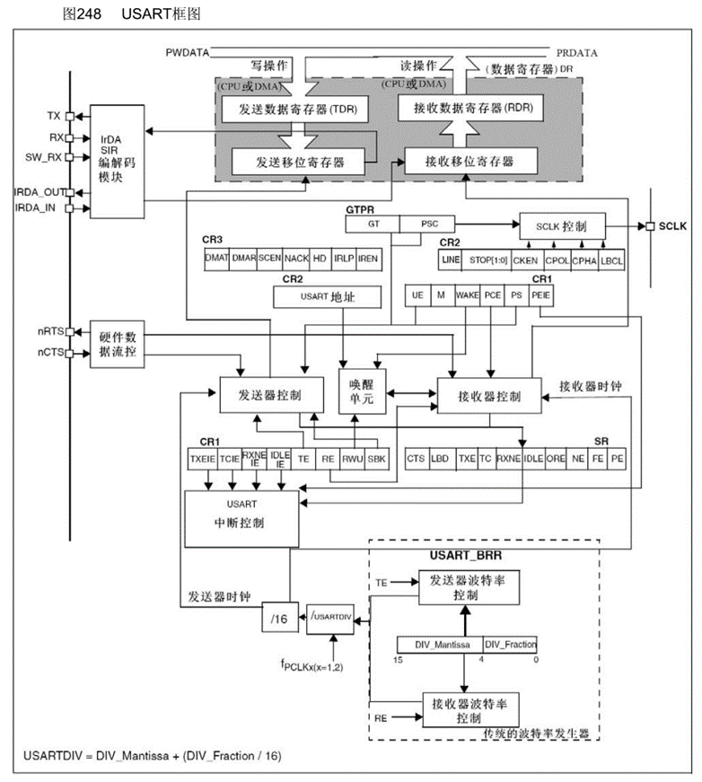


### 寄存器

状态寄存器(USART_SR) ：主要使用

* TC：发送完成 (Transmission complete) 
  * 0：发送还未完成；
  * 1：发送完成。
* RXNE：读数据寄存器非空 (Read data register not empty) 
  * 0：数据没有收到；
  * 1：收到数据，可以读出。

数据寄存器(USART_DR)：包含了发送或接收的数据。


控制寄存器 USART_CR1、USART_CR2、USART_CR3：设置控制模式


### 串口发送

在配置串口的各个参数时，可以选择发送数据帧的数据位的大小，可选8位或9位。

串口发送数据实际上就是对发送数据寄存器TDR进行写操作。

1. 当串口发送数据时，会检测发送移位寄存器是不是有数据正在移位，如果没有移位，那么这个数据就会立刻转移到发送移位寄存器里。准备发送。
2. 当数据移动到移位寄存器时，会产生一个TXE发送寄存器空标志位，该位描述如下。当TXE被置1，那么就可以在TDR写入下一个数据了。即发送下一个数据。

### 串口接收

1. 数据从RX引脚通向接收移位寄存器，在接收控制的控制下，一位一位的读取RX的电平，把第一位放在最高位，然后右移，移位八次之后就可以接收一个字节了。
2. 当一个字节数据移位完成之后，这一个字节的数据就会整体的移到接收数据寄存器RDR里来。
3. 在转移时会置RXNE接收标志位，即RDR寄存器非空，下方为该位的描述。当被置1后，就说明数据可以被读出

## HAL库

### 句柄结构体

以UART为例

stm32f1xx_hal_uart.h

stm32f1xx_hal_uart.c

**UART_HandleTypeDef**：串口的句柄

````c
typedef struct __UART_HandleTypeDef{
  USART_TypeDef                 *Instance;        /* UART 寄存器基地址 */
  UART_InitTypeDef              Init;             /* UART 通信参数 */
  uint8_t                       *pTxBuffPtr;      /* 指向 UART 发送缓冲区 */
  uint16_t                      TxXferSize;       /* UART 发送数据的大小 */
  __IO uint16_t                 TxXferCount;      /* UART 发送数据的个数 */
  uint8_t                       *pRxBuffPtr;      /* 指向 UART 接收缓冲区 */
  uint16_t                      RxXferSize;       /* UART 接收数据大小 */
  __IO uint16_t                 RxXferCount;      /* UART 接收数据的个数 */
  DMA_HandleTypeDef             *hdmatx;          /* UART 发送参数设置（DMA） */
  DMA_HandleTypeDef             *hdmarx;          /* UART 接收参数设置（DMA） */
  HAL_LockTypeDef               Lock;             /* 锁定对象 */
  __IO HAL_UART_StateTypeDef    gState;           /* UART 发送状态结构体 */
  __IO HAL_UART_StateTypeDef    RxState;          /* UART 接收状态结构体 */
  __IO uint32_t                 ErrorCode;        /* UART 操作错误信息 */
} UART_HandleTypeDef;
````

1）Instance：指向 UART 寄存器基地址。实际上这个基地址 HAL 库已经定义好了，可以选择范围：USART1~ USART3、UART4、UART5。
2）Init：UART 初始化结构体，用于配置通讯参数，如波特率、数据位数、停止位等等。下面我们再详细讲解这个结构体。
3）pTxBuffPtr，TxXferSize，TxXferCount：分别是指向发送数据缓冲区的指针，发送数据的大小，发送数据的个数。
4）pRxBuffPtr，RxXferSize，RxXferCount：分别是指向接收数据缓冲区的指针，接受数据的大小，接收数据的个数；
5）hdmatx，hdmarx：配置串口发送接收数据的 DMA 具体参数。
6）Lock：对资源操作增加操作锁保护功能，可选 HAL_UNLOCKED 或者 HAL_LOCKED 两个参数。如果 gState 的值等于 HAL_UART_STATE_RESET，则可认为串口未被初始化，此时，分配锁资源，并且调用 HAL_UART_MspInit 函数来对串口的 GPIO 和时钟进行初始化。

7）gState，RxState：分别是 UART 的发送状态、工作状态的结构体和 UART 接受状态的结构体。HAL_UART_StateTypeDef 是一个枚举类型，列出串口在工作过程中的状态值，有些值只适用于 gState，如 HAL_UART_STATE_BUSY。
8）ErrorCode：串口错误操作信息。主要用于存放串口操作的错误信息。


**UART_InitTypeDef**：串口的结构体

````c
typedef struct{
  uint32_t BaudRate;                  /* 波特率 */
  uint32_t WordLength;                /* 字长 */
  uint32_t StopBits;                  /* 停止位 */
  uint32_t Parity;                    /* 校验位 */
  uint32_t Mode;                      /* UART 模式 */
  uint32_t HwFlowCtl;                 /* 硬件流设置 */
  uint32_t OverSampling;              /* 过采样设置 */
} UART_InitTypeDef;
````

1）BaudRate：波特率设置。一般设置为 2400、9600、19200、115200。
2）WordLength：数据帧字长，可选 8 位或 9 位。这里我们设置为 8 位字长数据格式。
3）StopBits：停止位设置，可选 0.5 个、1 个、1.5 个和 2 个停止位，一般我们选择 1 个停止位。
4）Parity：奇偶校验控制选择，我们设定为无奇偶校验位。
5）Mode：UART 模式选择，可以设置为只收模式，只发模式，或者收发模式。这里我们设置为全双工收发模式。
6）HwFlowCtl：硬件流控制选择，我们设置为无硬件流控制。
7）OverSampling：过采样选择，选择 8 倍过采样或者 16 过采样，一般选择 16 过采样。

### **常用函数**

````c
/**初始化函数
*参数：串口句柄
*返回值：HAL_StatusTypeDef枚举类型，有4个，分别是HAL_OK表示成功，HAL_ERROR表示错误，HAL_BUSY表示忙碌HAL_TIMEOUT超时。
**/
HAL_StatusTypeDef HAL_UART_Init(UART_HandleTypeDef *huart);

/**用于开启以中断的方式接收指定字节。数据接收在中断处理函数里面实现。
* 形参 1 是 UART_HandleTypeDef 结构体指针类型的串口句柄。
* 形参 2 是要接收的数据地址。
* 形参 3 是要接收的数据大小，以字节为单位。
**/
HAL_StatusTypeDef HAL_UART_Receive_IT(UART_HandleTypeDef *huart,uint8_t *pData, uint16_t Size);

/**以阻塞的方式发送指定字节的数据
* 形参 1 ：UART_HandleTypeDef 结构体类型指针变量
* 形参 2：指向要发送的数据地址，地址所在的内容可以有多个数据，不一定是一个8位数据
* 形参 3：要发送的数据大小，以字节为单位
* 形参 4：设置的超时时间，以ms单位
**/
HAL_StatusTypeDef HAL_UART_Transmit(UART_HandleTypeDef *huart, uint8_t *pData, uint16_t Size, uint32_t Timeout);

//HAL 库中断处理公共函数
void HAL_UART_IRQHandler(UART_HandleTypeDef *huart);
//回调函数
__weak void HAL_UART_TxCpltCallback(UART_HandleTypeDef *huart)
__weak void HAL_UART_TxHalfCpltCallback(UART_HandleTypeDef *huart)
__weak void HAL_UART_RxCpltCallback(UART_HandleTypeDef *huart)
__weak void HAL_UART_RxHalfCpltCallback(UART_HandleTypeDef *huart)
__weak void HAL_UART_ErrorCallback(UART_HandleTypeDef *huart)
__weak void HAL_UART_AbortCpltCallback(UART_HandleTypeDef *huart)
__weak void HAL_UART_AbortTransmitCpltCallback(UART_HandleTypeDef *huart)
__weak void HAL_UART_AbortReceiveCpltCallback(UART_HandleTypeDef *huart)
    
    
// 常用的宏    
/** 
  * @param  __HANDLE__ specifies the UART Handle.
  * @param  __FLAG__ specifies the flag to check.
  *            @arg UART_FLAG_CTS:  CTS Change flag (not available for UART4 and UART5)
  *            @arg UART_FLAG_LBD:  LIN Break detection flag
  *            @arg UART_FLAG_TXE:  Transmit data register empty flag
  *            @arg UART_FLAG_TC:   Transmission Complete flag
  *            @arg UART_FLAG_RXNE: Receive data register not empty flag
  *            @arg UART_FLAG_IDLE: Idle Line detection flag
  *            @arg UART_FLAG_ORE:  Overrun Error flag
  *            @arg UART_FLAG_NE:   Noise Error flag
  *            @arg UART_FLAG_FE:   Framing Error flag
  *            @arg UART_FLAG_PE:   Parity Error flag
  */
#define __HAL_UART_GET_FLAG(__HANDLE__, __FLAG__) (((__HANDLE__)->Instance->SR & (__FLAG__)) == (__FLAG__))
#define __HAL_UART_CLEAR_FLAG(__HANDLE__, __FLAG__) ((__HANDLE__)->Instance->SR = ~(__FLAG__))
````

### **案例**

 将上位机发送给单片机的数据，再发回来

````c
UART_HandleTypeDef UART_Handle;	               // 串口句柄
uint8_t g_rx_buffer[1];                        // 接收的内容
uint8_t g_rx_flag = 0;                         // 接收标志位

void UART_Init(void){
    UART_Handle.Instance = USART1;	                     // 使用USART1
    
    UART_Handle.Init.BaudRate = 115200;           
    UART_Handle.Init.Mode =  UART_MODE_TX_RX;            // 读写
    UART_Handle.Init.Parity = UART_PARITY_NONE;          // 不使用校验
    UART_Handle.Init.StopBits = UART_STOPBITS_1;         // 停止位1
    UART_Handle.Init.WordLength = UART_WORDLENGTH_8B;    // 数据位8
    UART_Handle.Init.HwFlowCtl = UART_HWCONTROL_NONE ;
    
    HAL_UART_Init(&UART_Handle);                         // 初始化
    
    HAL_UART_Receive_IT(&UART_Handle, g_rx_buffer, 1);   // 接收1个字节的内容存入g_rx_buffer
}
//初始化回调函数，可以在内部完成GPIO、USART、NVIC的初始化
void HAL_UART_MspInit(UART_HandleTypeDef *huart){
	// 判断是不是USART1调用的回调函数
    if(huart->Instance == USART1){
        __HAL_RCC_GPIOA_CLK_ENABLE();
        __HAL_RCC_USART1_CLK_ENABLE();
        
        GPIO_InitTypeDef GPIO_InitStructure;
        GPIO_InitStructure.Mode = GPIO_MODE_AF_PP;
        GPIO_InitStructure.Pin = GPIO_PIN_9;
        GPIO_InitStructure.Speed = GPIO_SPEED_FREQ_HIGH;
        HAL_GPIO_Init(GPIOA,&GPIO_InitStructure);
        
        GPIO_InitStructure.Mode = GPIO_MODE_INPUT;
        GPIO_InitStructure.Pin = GPIO_PIN_10;
        GPIO_InitStructure.Pull = GPIO_PULLUP;
        GPIO_InitStructure.Speed = GPIO_SPEED_FREQ_HIGH;
        HAL_GPIO_Init(GPIOA,&GPIO_InitStructure);
        
        HAL_NVIC_SetPriorityGrouping(NVIC_PRIORITYGROUP_2);
        HAL_NVIC_SetPriority(USART1_IRQn,2,2);
        HAL_NVIC_EnableIRQ(USART1_IRQn);
    }
}
// 中断服务函数
void USART1_IRQHandler(void){
    HAL_UART_IRQHandler(&UART_Handle);                     // 调用HAL中断服务函数，在内部调用一些回调函数
    HAL_UART_Receive_IT(&UART_Handle, g_rx_buffer, 1);     // 从新开启接收中断
}
// 接收完成回调函数
void HAL_UART_RxCpltCallback(UART_HandleTypeDef *huart){
    if(huart->Instance == USART1){
        g_rx_flag = 1;                // 接收完成
    }
}
int main(void){
    HAL_Init();                             
    sys_stm32_clock_init(RCC_PLL_MUL9);       
    delay_init(72);                           
    UART_Init();
   
    while(1){
        if(g_rx_flag == 1){       // 当接收完成，再发送给上位机
            HAL_UART_Transmit(&UART_Handle,g_rx_buffer,1,10);           // 将1个字节大小的g_rx_buffer发出
            while(__HAL_UART_GET_FLAG(&UART_Handle,UART_FLAG_TC) != 1); // 等待发送完成标志位
            g_rx_flag = 0;        // 从置接收完成标志位
        }
    }
}
````


## 标准库

### 函数

stm32f10_usart.h

**USART初始化结构体**

````c
typedef struct{
  uint32_t USART_BaudRate;            //串口通信使用的波特率 一般是9600或者是115200
  uint16_t USART_WordLength;          //数据位 有8位和9位可以选择
  uint16_t USART_StopBits;            //停止位 有1、0.5、2位
  uint16_t USART_Parity;              //校验位，可以选择奇偶校验和不校验。没有需求就直接无校验
  uint16_t USART_Mode;                //串口的模式，发送模式(USART_Mode_Tx)还是接收模式(USART_Mode_Rx)，还是两者都有    
  uint16_t USART_HardwareFlowControl; //是否选择硬件流触发，一般这个不选，所以选择无硬件流触发。
} USART_InitTypeDef;
````

````c
void USART_DeInit(USART_TypeDef* USARTx);                                     //初始化
void USART_Init(USART_TypeDef* USARTx, USART_InitTypeDef* USART_InitStruct);
void USART_StructInit(USART_InitTypeDef* USART_InitStruct);

void USART_Cmd(USART_TypeDef* USARTx, FunctionalState NewState);
void USART_ITConfig(USART_TypeDef* USARTx, uint16_t USART_IT, FunctionalState NewState);
void USART_SendData(USART_TypeDef* USARTx, uint16_t Data);                    //发送数据
uint16_t USART_ReceiveData(USART_TypeDef* USARTx);                            //接收数据
//查看状态
FlagStatus USART_GetFlagStatus(USART_TypeDef* USARTx, uint16_t USART_FLAG);
void USART_ClearFlag(USART_TypeDef* USARTx, uint16_t USART_FLAG);
ITStatus USART_GetITStatus(USART_TypeDef* USARTx, uint16_t USART_IT);
void USART_ClearITPendingBit(USART_TypeDef* USARTx, uint16_t USART_IT);
````


### 在STM32中的配置

#### 数据发送

**1.RCC开启USART、串口TX/RX所对应的GPIO口**

````c
RCC_APB2PeriphClockCmd(RCC_APB2Periph_USART1, ENABLE);         //开启USART1的时钟
RCC_APB2PeriphClockCmd(RCC_APB2Periph_GPIOA, ENABLE);          //开启GPIOA的时钟(查了端口复用表)
````


**2. 初始化GPIO口**

根据自己的需求来配置GPIO口，发送和接收是都需要还是只需要其中一个。然后对应的根据引脚定义表来初始化对应的GPIO口。

| 端口 | 复用      |
| ---- | --------- |
| PA9  | USART1_TX |
| PA10 | USART1_RX |

````c
GPIO_InitTypeDef GPIO_InitStructure;
GPIO_InitStructure.GPIO_Mode = GPIO_Mode_AF_PP;            //复用推挽输出
GPIO_InitStructure.GPIO_Pin = GPIO_Pin_9;                  //USART1对应的TX端为GPIOA9
GPIO_InitStructure.GPIO_Speed = GPIO_Speed_50MHz;
GPIO_Init(GPIOA, &GPIO_InitStructure);
````


**3.串口初始化**

````c
USART_InitTypeDef USART_InitStructure;
USART_InitStructure.USART_BaudRate = 9600;
USART_InitStructure.USART_HardwareFlowControl = USART_HardwareFlowControl_None;    //不使用硬件流触发
USART_InitStructure.USART_Mode = USART_Mode_Tx;                                    //TX 发送模式
USART_InitStructure.USART_Parity = USART_Parity_No;                                //不选择校验
USART_InitStructure.USART_StopBits = USART_StopBits_1;                             //停止位1位
USART_InitStructure.USART_WordLength = USART_WordLength_8b;                        //数据位8位
USART_Init(USART1, &USART_InitStructure);

USART_Cmd(USART1, ENABLE);                                                         //使能串口
````

**4. 串口发送数据**

````c
void Serial_SendByte(uint8_t Byte){
	USART_SendData(USART1, Byte);                                //使用USART_SendData函数，将数据输出到USART1
	
    //0 表示数据还未转移到移位寄存器，循环等待
    //1 数据已经被转移到了移位寄存器可以发送数据
    while (USART_GetFlagStatus(USART1, USART_FLAG_TXE) == RESET);
    //不需要手动清零 再次写入TDR时会自动清零	
}
````


**程序**

````c
#include "stm32f10x.h"                  // Device header
#include <stdio.h>
#include <stdarg.h>
void Serial_Init(void){
	RCC_APB2PeriphClockCmd(RCC_APB2Periph_USART1, ENABLE);
	RCC_APB2PeriphClockCmd(RCC_APB2Periph_GPIOA, ENABLE);
	
	GPIO_InitTypeDef GPIO_InitStructure;
	GPIO_InitStructure.GPIO_Mode = GPIO_Mode_AF_PP;
	GPIO_InitStructure.GPIO_Pin = GPIO_Pin_9;
	GPIO_InitStructure.GPIO_Speed = GPIO_Speed_50MHz;
	GPIO_Init(GPIOA, &GPIO_InitStructure);
	
	USART_InitTypeDef USART_InitStructure;
	USART_InitStructure.USART_BaudRate = 9600;
	USART_InitStructure.USART_HardwareFlowControl = USART_HardwareFlowControl_None;
	USART_InitStructure.USART_Mode = USART_Mode_Tx;
	USART_InitStructure.USART_Parity = USART_Parity_No;
	USART_InitStructure.USART_StopBits = USART_StopBits_1;
	USART_InitStructure.USART_WordLength = USART_WordLength_8b;
	USART_Init(USART1, &USART_InitStructure);
	
	USART_Cmd(USART1, ENABLE);
}

void Serial_SendByte(uint8_t Byte){
	USART_SendData(USART1, Byte);
	while (USART_GetFlagStatus(USART1, USART_FLAG_TXE) == RESET);
}

//发送数组
void Serial_SendArray(uint8_t *Array, uint16_t Length){
	uint16_t i;
	for (i = 0; i < Length; i ++){
		Serial_SendByte(Array[i]);
	}
}
//发送字符串
void Serial_SendString(char *String){
	uint8_t i;
	for (i = 0; String[i] != '\0'; i ++)  //String[i] != '\0;char类型会在最后一位+0，作为标志位{
		Serial_SendByte(String[i]);
	}
}

uint32_t Serial_Pow(uint32_t X, uint32_t Y){
	uint32_t Result = 1;
	while (Y --){
		Result *= X;
	}
	return Result;
}

void Serial_SendNumber(uint32_t Number, uint8_t Length){
	uint8_t i;
	for (i = 0; i < Length; i ++){
		Serial_SendByte(Number / Serial_Pow(10, Length - i - 1) % 10 + '0');
	}
}
//重写print函数
int fputc(int ch, FILE *f)                   {
	Serial_SendByte(ch);
	return ch;
}
//可变量print函数，需要#include <stdarg.h>
void Serial_Printf(char *format, ...){
	char String[100];
	va_list arg;
	va_start(arg, format);
	vsprintf(String, format, arg);
	va_end(arg);
	Serial_SendString(String);
}
````

 ````c
 #include "stm32f10x.h"                  // Device header
 #include "Delay.h"
 #include "OLED.h"
 #include "Serial.h"
 #include <stdio.h>
 
 int main(void){
 	OLED_Init();
 	Serial_Init();
 	Serial_SendByte(0x41);
 	uint8_t MyArray[] = {0x42, 0x43, 0x44, 0x45};
 	Serial_SendArray(MyArray, 4);
 	Serial_SendString("\r\nNum1=");
 	Serial_SendNumber(111, 3);
 	printf("\r\nNum2=%d", 222);        //需要#include <stdio.h>
 	char String[100];
 	sprintf(String, "\r\nNum3=%d", 333);
 	Serial_SendString(String);
 	Serial_Printf("\r\nNum4=%d", 444);
 	Serial_Printf("\r\n");
 	while (1){	
 	}
 }
 ````


#### 数据接收

**两种方式**

- 查询方式就是通过不断的查询RXNE标志位，通过判断RXNE位的状态来确定数据是否接收。
- 中断方式就是通过配置接收输出控制通道，配置NVIC，在中断服务子函数里进行数据的接收。

#### 查询RXNE标志位

````c
void Serial_Init(void){
	RCC_APB2PeriphClockCmd(RCC_APB2Periph_USART1, ENABLE);
	RCC_APB2PeriphClockCmd(RCC_APB2Periph_GPIOA, ENABLE);
	
	GPIO_InitTypeDef GPIO_InitStructure;
	GPIO_InitStructure.GPIO_Mode = GPIO_Mode_AF_PP;
	GPIO_InitStructure.GPIO_Pin = GPIO_Pin_9;                //TX
	GPIO_InitStructure.GPIO_Speed = GPIO_Speed_50MHz;
	GPIO_Init(GPIOA, &GPIO_InitStructure);
	
	GPIO_InitStructure.GPIO_Mode = GPIO_Mode_IPU;
	GPIO_InitStructure.GPIO_Pin = GPIO_Pin_10;               //RX
	GPIO_InitStructure.GPIO_Speed = GPIO_Speed_50MHz;
	GPIO_Init(GPIOA, &GPIO_InitStructure);
	
	USART_InitTypeDef USART_InitStructure;
	USART_InitStructure.USART_BaudRate = 9600;
	USART_InitStructure.USART_HardwareFlowControl = USART_HardwareFlowControl_None;
	USART_InitStructure.USART_Mode = USART_Mode_Tx | USART_Mode_Rx;       //TX RX
	USART_InitStructure.USART_Parity = USART_Parity_No;
	USART_InitStructure.USART_StopBits = USART_StopBits_1;
	USART_InitStructure.USART_WordLength = USART_WordLength_8b;
	USART_Init(USART1, &USART_InitStructure);
	
	USART_Cmd(USART1, ENABLE);
}
````

为0时数据没有收到，为1时收到了数据，数据可以从RDR里读出

````c
uint8_t RX_Data;
int main(){ 
    Serial_Init();
    Serial_SendByte(0x16);
    while(1){
        if(USART_GetFlagStatus(USART1,USART_FLAG_RXNE)==SET)   //0 循环等待 1 可以接收数据{
            RX_Data=USART_ReceiveData(USART1);           
			Serial_SendByte(RX_Data);
        }
    }
}
````

#### 使用中断

**初始化** 

````c
void Serial_Init(void){
	RCC_APB2PeriphClockCmd(RCC_APB2Periph_USART1, ENABLE);
	RCC_APB2PeriphClockCmd(RCC_APB2Periph_GPIOA, ENABLE);
	
	GPIO_InitTypeDef GPIO_InitStructure;
	GPIO_InitStructure.GPIO_Mode = GPIO_Mode_AF_PP;
	GPIO_InitStructure.GPIO_Pin = GPIO_Pin_9;                //TX
	GPIO_InitStructure.GPIO_Speed = GPIO_Speed_50MHz;
	GPIO_Init(GPIOA, &GPIO_InitStructure);
	
	GPIO_InitStructure.GPIO_Mode = GPIO_Mode_IPU;
	GPIO_InitStructure.GPIO_Pin = GPIO_Pin_10;               //RX
	GPIO_InitStructure.GPIO_Speed = GPIO_Speed_50MHz;
	GPIO_Init(GPIOA, &GPIO_InitStructure);
	
	USART_InitTypeDef USART_InitStructure;
	USART_InitStructure.USART_BaudRate = 9600;
	USART_InitStructure.USART_HardwareFlowControl = USART_HardwareFlowControl_None;
	USART_InitStructure.USART_Mode = USART_Mode_Tx | USART_Mode_Rx;       //TX RX
	USART_InitStructure.USART_Parity = USART_Parity_No;
	USART_InitStructure.USART_StopBits = USART_StopBits_1;
	USART_InitStructure.USART_WordLength = USART_WordLength_8b;
	USART_Init(USART1, &USART_InitStructure);
	
    USART_ITConfig(USART1, USART_IT_RXNE, ENABLE);            //开启中断输出控制
	//配置NVIC
	NVIC_PriorityGroupConfig(NVIC_PriorityGroup_2);
	NVIC_InitTypeDef NVIC_InitStructure;
	NVIC_InitStructure.NVIC_IRQChannel = USART1_IRQn;
	NVIC_InitStructure.NVIC_IRQChannelCmd = ENABLE;
	NVIC_InitStructure.NVIC_IRQChannelPreemptionPriority = 1;
	NVIC_InitStructure.NVIC_IRQChannelSubPriority = 1;
	NVIC_Init(&NVIC_InitStructure);
    
	USART_Cmd(USART1, ENABLE);
}	
````

**中断服务子函数**

````c
uint8_t Serial_RxData;
uint8_t Serial_RxFlag;
uint8_t Serial_GetRxFlag(void){
	if (Serial_RxFlag == 1){
		Serial_RxFlag = 0;
		return 1;
	}
	return 0;
}
uint8_t Serial_GetRxData(void){
	return Serial_RxData;
}
//上面两个函数 仅仅是封装，一个良好的习惯，一般不在中断中写太长的程序
//中断服务子函数
void USART1_IRQHandler(void){
	if (USART_GetITStatus(USART1, USART_IT_RXNE) == SET){    //RXNE 标志位为1 表示可以接收数据
		Serial_RxData = USART_ReceiveData(USART1);           //接收数据
		Serial_RxFlag = 1;
		USART_ClearITPendingBit(USART1, USART_IT_RXNE);      //清除RXNE标志位
	}
}
````

````C
#include "stm32f10x.h"                  // Device header
#include "Delay.h"
#include "OLED.h"
#include "Serial.h"
uint8_t RxData;
int main(void){
	OLED_Init();
	OLED_ShowString(1, 1, "RxData:");
	Serial_Init();
	while (1){
		if (Serial_GetRxFlag() == 1){
			RxData = Serial_GetRxData();
			Serial_SendByte(RxData);
			OLED_ShowHexNum(1, 8, RxData, 2);
		}
	}
}
````

## RS485

### RS485简介

* 在串口的基础上，RS-485仅是一个电气标准，描述了接口的物理层，像协议、时序、串行或并行数据以及链路全部由设计者或更高层协议定义。

* RS485 是美国电子工业协会（Electronic Industries Association，EIA）于1983年发布的串行通信接口标准，经通讯工业协会（TIA）修订后命名为 TIA/EIA-485-A。
* RS485 是一种工业控制环境中常用的通讯协议，其中RS 是 Recommended Standard 的缩写。
* RS485 是 半双工异步 串行通信。
* RS485是串行通信标准，使用差分信号传输，抗干扰能力强，常用于工控领域。
* RS485具有强大的组网功能，在串口基础协议之上还制定MODBUS协议。
* 串口基础协议：仅指封装了基本数据包格式的协议（基于数据位）
* MODBUS协议：使用基本数据包组合成通讯帧格式的高层应用协议（基于数据包或字节）

| 通信接口 | 通信方式 | 信号线    | 电平标准                              | 拓扑结构 | 通信距离 | 通讯速率 | 抗干扰能力 |
| -------- | -------- | --------- | ------------------------------------- | -------- | -------- | -------- | ---------- |
| TTL      | 全双工   | TX/RX/GND | 逻辑1 : 2.4~5 V  逻辑0 : 0~0.4 V      | 点对点   | 1米      | 100kbps  | 弱         |
| RS232    | 全双工   | TX/RX/GND | 逻辑1 : -(15~3) V  逻辑0 : +(3~15)  V | 点对点   | 100米    | 20kbps   | 较弱       |
| RS485    | 半双工   | 差分线AB  | 逻辑1 : +(2~6)V  逻辑0 : -(2~6)V      | 多点双向 | 1200米   | 100kbps  | 强         |

**特点**

* 支持多节点：一般最大支持 32 个节点。
* 传输距离远：最远通讯距离可达1200米。
* 抗干扰能力强：差分信号传输。
* 连接简单：只需要两根信号线（A+和B-）就可以进行正常的通信。

**差分信号传输**
RS485 通信采用差分信号传输，通常情况下只需要两根信号线就可以进行正常的通信。
在差分信号中，逻辑0和逻辑1是用两根信号线（A+和B-）的电压差来表示。

* 逻辑 1：两根信号线（A+和B-）的电压差在 +2V～+6V 之间。
* 逻辑 0：两根信号线（A+和B-）的电压差在 -2V～-6V 之间。
  


### RS485总线连接图

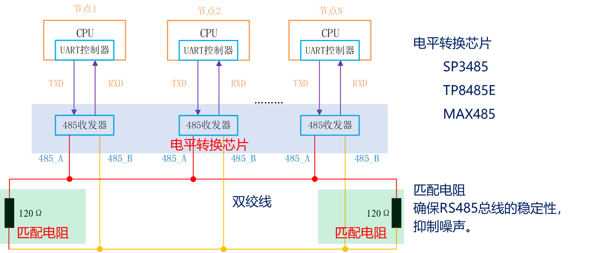

**连接方式**

* 在 RS485 通信网络中，通常会使用 485 收发器来转换 TTL 电平和 RS485 电平。
* 节点中的串口控制器使用 RX 与 TX 信号线连接到 485 收发器上，而收发器通过差分线连接到网络总线。
* 串口控制器与收发器之间一般使用 TTL 信号传输，收发器与总线则使用差分信号来传输。
* 发送数据时，串口控制器的 TX 信号经过收发器转换成差分信号传输到总线上。
* 接收数据时，收发器把总线上的差分信号转化成 TTL 信号通过 RX 引脚传输到串口控制器中。
* 通常在这些节点中只能有一个主机，剩下的全为从机。
* 在总线的起止端分别加了一个 120 欧的匹配电阻。

### TP8485

单片机串口通信一般是**TTL电平**，如果需要**RS485 通信**，就需要**RS485芯片**在中间转换一下。

TP8485E/SP3485 可作为 RS485 的收发器，该芯片支持 3.3V~5.5V 供电，最大传输速度可达 250Kbps，支持多达 256 个节点(单位负载为 1/8 的条件下)，并且支持输出短路保护。

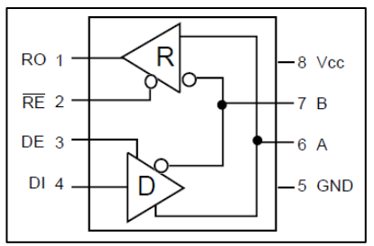


图中 A、B 总线接口，用于连接 485 总线。RO 是接收输出端，DI 是发送数据收入端，RE是接收使能信号（低电平有效），DE 是发送使能信号（高电平有效）。

| 引脚 | 名称 | 功能                              |
| ---- | ---- | --------------------------------- |
| 1    | RO   | 接收器输出----接RX                |
| 2    | RE   | 接收器输出使能（低电平-接收使能） |
| 3    | DE   | 驱动器输出使能（高电平-发送使能） |
| 4    | DI   | 驱动器输入----接TX                |
| 5    | GND  | 接地                              |
| 6    | A    | 驱动器输出/接收器输入（同相）     |
| 7    | B    | 驱动器输出/接收器输入（反相）     |
| 8    | VCC  | 芯片供电+3.3V                     |

RS485 普通收发电路图原理：

- **RS485_EN 为高电平**，逻辑为1，发送使能，接收禁止。
- **RS485_EN 为低电平**，逻辑为0，发送禁止，接收使能

在编写驱动程序时：

- 在**发送数据前**，给RS485_EN 置高电平。
- 在**发送数据后**，给RS485_EN 置低电平。


# I2C

## 简介

* I2C总线是Philips公司在八十年代初推出的一种串行、半双工的总线，主要用于近距离、低速的芯片之间的通信；I2C总线有两根双向的信号线，一根数据线SDA用于收发数据，一根时钟线SCL用于通信双方时钟的同步；I2C总线硬件结构简单，简化了PCB布线，降低了系统成本，提高了系统可靠性，因此在各个领域得到了广泛应用。
* I2C总线是一种多主机总线，连接在 I2C总线上的器件分为主机和从机。主机有权发起和结束一次通信，从机只能被动呼叫；当总线上有多个主机同时启用总线时，I2C也具备冲突检测和仲裁的功能来防止错误产生；每个连接到I2C总线上的器件都有一个唯一的地址（7bit），且每个器件都可以作为主机也可以作为从机（同一时刻只能有一个主机），总线上的器件增加和删除不影响其他器件正常工作；I2C总线在通信时总线上发送数据的器件为发送器，接收数据的器件为接收器。
* I2C总线可以通过外部连线进行在线检测，便于系统故障诊断和调试，故障可以立即被寻址，软件也有利于标准化和模块化，缩短开发时间。
* I2C总线上可挂接的设备数量受总线的最大电容400pF限制。
* 串行的8位双向数据传输速率在标准模式下可达100Kbit/s，快速模式下可达400Kbit/s，高速模式下可达3.4Mbit/s。
* 总线具有极低的电流消耗，抗噪声干扰能力强，增加总线驱动器可以使总线电容扩大10倍，传输距离达到15m；兼容不同电压等级的器件，工作温度范围宽。


### 特点

* 只需要SDA、SCL两条总线；
* 没有严格的波特率要求；
* 所有组件之间都存在简单的主/从关系，连接到总线的每个设备均可通过唯一地址进行软件寻址；
* I2C是真正的多主设备总线，可提供仲裁和冲突检测；
* 传输速度分为四种模式：
  * 标准模式（Standard Mode）：100 Kbps
  * 快速模式（Fast Mode）：400 Kbps
  * 高速模式（High speed mode）：3.4 Mbps
  * 超快速模式（Ultra fast mode）：5 Mbps

* 最大主设备数：无限制；
* 最大从机数：理论上，1008个从节点，寻址模式的最大节点数为2的7次方或2的10次方，但有16个地址保留用于特殊用途。


### 硬件电路

* 所有I2C设备的SCL连在一起，SDA连在一起
* 设备的SCL和SDA均要配置成**开漏输出模式**
* SCL和SDA各添加一个**上拉电阻**，阻值一般为4.7KΩ左右


### 物理特性

I2C 总线使用连接设备的 "SDA"（ 串行数据总线）和"SCL"（ 串行时钟总线 ） 来传送信息。

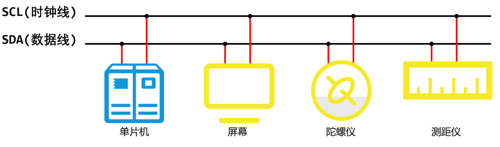


### 同步数据信号

I2C总线在进行数据传送时，时钟线SCL为低电平期间发送器向数据线上发送一位数据，在此期间数据线上的信号允许发生变化，时钟线SCL为高电平期间接收器从数据线上读取一位数据，在此期间数据线上的信号不允许发生变化，必须保持稳定。

### 时钟同步与仲裁

**（1）时钟同步**

时钟同步是通过I2C总线上的SCL之间的线“与”（wire-AND）来完成的，即如果有多个主机同时产生时钟，那么只有所有master都发送高电平时，SCL上才表现为高电平，否则SCL都表现为低电平。

线“与”特性由开漏电路实现。如果控制开漏输出INT为0，低电平，则VGS >0，N-MOS管导通，使输出接地，若控制开漏输出INT为1 (它无法直接输出高电平) 时，则N-MOS 管关闭，所以引脚既不输出高电平，也不输出低电平，为高阻态。正常使用时必须外部接上拉电阻。也就是说，若有很多个开漏模式引脚（C1、C2....）连接到一起时，只有当所有引脚都输出高阻态，才由上拉电阻提供高电平，此高电平的电压为外部上拉电阻所接的电源的电压。若其中一个引脚为低电平，那线路就相当于短路接地，使得整条线路都为低电平，0 伏。

**（2）仲裁**
总线仲裁与时钟同步类似，当所有主机在SDA上都写1时，SDA的数据才是1，只要有一个主机写0，那此时SDA上的数据就是0.

一个主机每发送一个bit数据，在SCL为高电平时，就检查SDA的电平是否和发送的数据一致，如果不一致，这个主机便知道自己输掉了仲裁，然后停止向SDA写数据。也就是说，如果主机一致检查到总线上数据和自己发送的数据一致，则继续传输，这样在仲裁过程中就保证了赢得仲裁的master不会丢失数据。

输掉仲裁的主机在检测到自己输了之后也就不再产生时钟脉冲，并且要在总线空闲时才能重新传输。

仲裁的过程可能要经过多个bit的发送和检查，实际上两个主机如果发送的时序和数据完全一样，则两个主机都能正常完成整个数据传输。
**注意：**多个主机仲裁时，因为线“与”特性，谁低谁能强制SDA为低，也就是跟自己匹配，所以先高（高电平1）的那个就会仲裁失败。


### IIC的高阻态

漏极开路（Open Drain）即高阻状态，适用于输入/输出，其可独立输入/输出低电平和高阻状态，若需要产生高电平，则需使用外部上拉电阻

高阻状态：高阻状态是三态门电路的一种状态。逻辑门的输出除有高、低电平两种状态外，还有第三种状态——高阻状态的门电路。电路分析时高阻态可做开路理解。

我们知道IIC的所有设备是接在一根总线上的，那么我们进行通信的时候往往只是几个设备进行通信，那么这时候其余的空闲设备可能会受到总线干扰，或者干扰到总线，怎么办呢？

为了避免总线信号的混乱，IIC的空闲状态只能有外部上拉， 而此时空闲设备被拉到了高阻态，也就是相当于断路， 整个IIC总线只有开启了的设备才会正常进行通信，而不会干扰到其他设备。


**为什么IIC总线SDA建议用开漏模式？**

IIC的SDA脚即要作为输出，又要作为输入，用开漏输出模式，很好实现输出输入共用，避免IO模式频繁切换带来的麻烦。

输出时：主机（MCU）输出0，可以拉低信号，来实现低电平发送，主机输出1（实际不起作用），由外部上拉电阻上拉，实现高电平发送。

输入时：主机（MCU）设置输出1状态，此时因为MCU无法输出1，相当于释放了SDA脚，此时外部器件可以主动拉低SDA脚/释放SDA脚（同样由上拉电阻提供“输出1的功能”），实现SDA脚的高低电平变化。


## 通讯特性

通常情况下，一个完整的I2C通信过程包括以下 4 部分：

* 开始条件
* 地址传送
* 数据传送
* 停止条件
  主机在 SCL 线上输出串行时钟信号，数据在 SDA 线上进行传输，每传输一个字节（最高位 MSB 开始传输）后面跟随一个应答位，一个 SCL 时钟脉冲传输一个数据位。

**通信过程**

1. 主机发送起始信号启用总线
2. 主机发送一个字节数据指明从机地址和后续字节的传送方向
3. 被寻址的从机发送应答信号回应主机
4. 发送器发送一个字节数据
5. 接收器发送应答信号回应发送器
6. ........ （循环步骤4、5）
7. 通信完成后主机发送停止信号释放总线

第4步和第5步用的是发送器和接收器，不是主机和从机，这是由第一个字节的最后一位决定主给从发，还是从给主发。

也就是说，第一个字节和最后的停止信号一定是主机发给从机，但中间就不一定了。

发送数据过程中不允许改变发送方向（除非重启一次通信）。


**这是一帧标准的写数据帧**


### 开始和停止

当总线上的主机都不驱动总线，总线进入空闲状态， SCL 和 SDA 都为高电平。总线空闲状态下总线上设备都可以通过发送开始条件启动通信。
当 SCL 线为高时，SDA 线上出现由高到低的信号，表明总线上产生了起始信号。 SDA 线上出现由低到高的信号，表明总线上产生了停止信号，如下图所示：
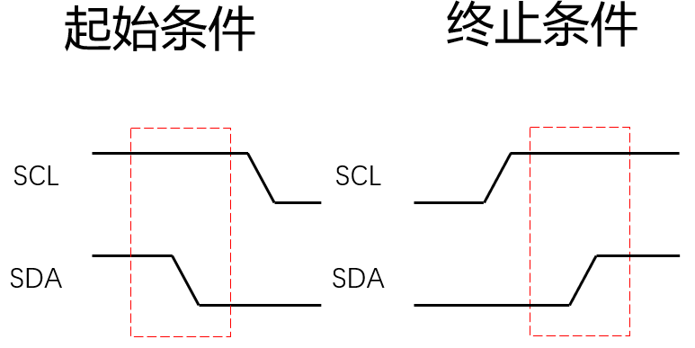

当两个起始信号之间没有停止信号时，即产生了重复起始信号。主机采用这种方法与另一个从机或相同的从机以不同传输方向进行通信（例如：从写入设备到从设备读出）而不释放总线。


停止情况有两种：

1. 主机不想发了，就发送停止信号；
2. 从机不想接了，不应答，主机就发送停止信号结束此次通信。

### 设备地址传送

* 开始条件或者重新开始条件后面的帧是地址帧（一个字节），用于指定主机通信的对象地址，在发送停止条件之前，指定的从机一直有效。
* I2C通讯支持：7 位寻址和10 位寻址两种模式。
  * 7 位寻址模式，地址帧（8bit）的高 7 位为从机地址，地址帧第 8 位来决定数据帧传送的方向：7 位从机地址 + 1位 读/写位，读/写位控制从机的数据传输方向（0：写； 1：读） 
  * 10 位寻址模式，主机发送帧，第一帧 发送头序列（11110XX0，其中 XX 表示 10 位地址的高 两位），然后第二帧发送低八位从机地址。 主机接收帧 ，第一帧发送头序列（11110XX0，其中 XX 表示 10 位地址的高两位），然后第二帧发送低八位从机地址。接下来会发送一个重新开始条件，然后再发送一帧头序列（11110XX1 ，其中 XX 表示 10 位地址的高两位）帧格式


**例如：**下图为设备地址码为1101000，也就是要和地址为1101000的设备通讯


### 数据传送

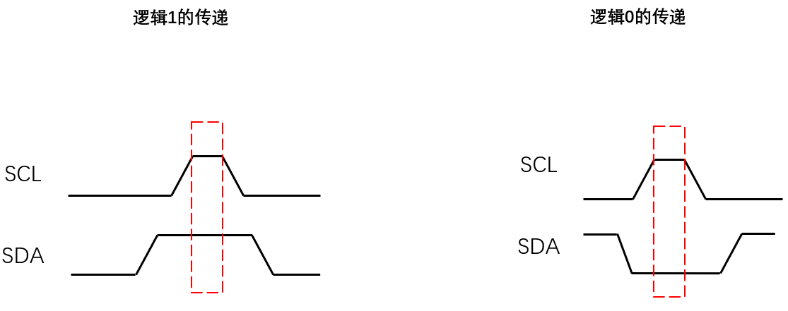

* SCL低电平期间，主机将数据位依次放到SDA线上（高位先行），然后释放SCL，从机将在SCL高电平期间读取数据位，所以SCL高电平期间SDA不允许有数据变化，依次循环上述过程8次，即可发送一个字节
* I2C总线通信时每个字节为8位长度，数据传送时，先传送最高位，后传送低位，发送器发送完一个字节数据后接收器必须发送1位应答位来回应发送器，即一帧共有9位。I2C每次发送数据必须是8位。


### 读写位


* 写数据，就给它置0
* 读数据，就给它置1


### 应答位

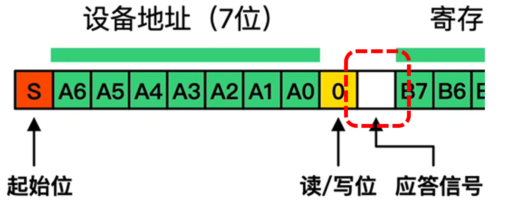

* 上拉电阻影响下SDA默认为高，而从机拉低SDA就是确认收到数据即ACK，否则NACK
* 0：收到
* 1：没有收到或者读取完成


## 读写简介

### 写出

这是一帧标准的写数据帧


**指定地址写：**对于指定设备（Slave Address），在指定地址（Reg Address）下，写入指定数据（Data）

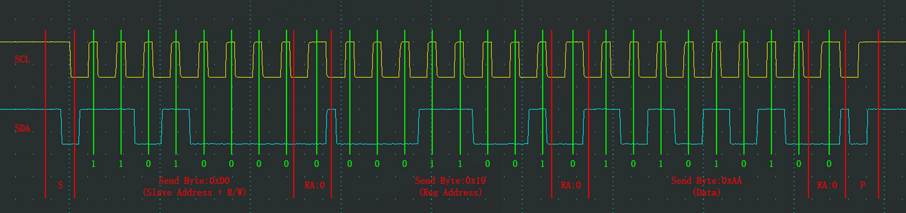

单片机对编号为1101000的设备，进行写入操作，并把数据0xaa写入到0x19寄存器下

解析如下：

* S ：表示开始条件；
* SLA ：表示从机地址；
* R/W#：表示发送和接收的方向。当 R/W# 为“1” 时，将数据从从机发送到主机；当 R/W#为“0” 时，将数据从主机发送到从机；
* Sr ：表示重新开始条件；
* DATA ：表示发送和接收的数据；
* P ：表示停止条件。

### 读入

这是一帧标准的读数据帧

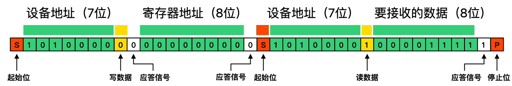

1. 它也是首先写入设备地址，然后是写数据0，接下来写的是寄存器的地址
2. 在收到从机的应答信号之后
3. 主机需要再发送一个起始信号，然后需要再发送一遍设备的地址
4. 然后才能发送读数据1
5. 接下来，存储器就会把寄存器里面的数据发送给单片机
6. 这样就完成了一帧数据的读取（最后的应答信号为1，是由主机发给从机）

**指定地址读**

对于指定设备（Slave Address），在指定地址（Reg Address）下，读取从机数据（Data）


## I2C外设简介

* STM32内部集成了硬件I2C收发电路，可以由硬件自动执行时钟生成、起始终止条件生成、应答位收发、数据收发等功能，减轻CPU的负担
* 支持多主机模型
* 支持7位/10位地址模式
* 支持不同的通讯速度，标准速度(高达100 kHz)，快速(高达400 kHz)
* 支持DMA
* 兼容SMBus协议
* STM32F103C8T6 硬件I2C资源：I2C1、I2C2


## I2C硬件框图


### 1.通讯引脚

STM32芯片有多个IIC外设，它们的IIC通讯信号引出到不同的GPIO引脚上，使用时必须配置这些指定的引脚。

| 引脚 |   I2C1   |     I2C2     |   I2C3   |
| :--: | :------: | :----------: | :------: |
| SCL  | PB6/PB10 | PH4/PF1/PB10 | PH7/PA10 |
| SDA  | PB7/PB9  | PH5/PF0/PB11 | PH8/PC9  |

### 2.时钟控制逻辑

* SCL线的时钟信号，由IIC接口根据时钟控制寄存器（CCR）控制，控制的参数主要位时钟频率。
* 可选择IIC通讯的“标准/快速”模式，这两个模式分别对应100/400Kbits/s的通讯速率。
* 在快速模式下可选择SCL时钟的占空比，可选T(low)/T(high) = 2或T(low)/T(high)=16/9模式。
* CCR寄存器中12位的配置因子CCR，它与IIC外设的输入时钟源共用作用，产生SCL时钟。STM32的IIC外设输入时钟源位PCKL1。

**计算时钟频率**

* 标准模式：T high = CCR T pckl1 T low= CCRTpclk1

* 快速模式中 Tlow/Tlow =2时：Thigh = CCRTpckl1 T low = 2low*Tpckl1

* 快速模式中 Tlow/Tlow =16/9时：Thigh = 9CCRTpckl1 T low = 16lowTpckl1


例：PCLK1 = 36MHz,想要配置400Kbits/s 方法
PCLK时钟周期：TPCLK1 = 1/36 000 000
目标SCL时钟周期：TSCL = 1/400 000
SCL时钟周期内的高电平时间：Thigh = TSCL/3
SCL时钟周期内的低电平时间：Tlow = 2*TSCL/3
计算CCR的值：CCR = THIGH/TPCLK1 = 30
计算出来的值写入到寄存器即可

### 3.数据控制逻辑

* IIC的SDA信号主要连接到数据移位寄存器上，数据移位寄存器的数据来源及目标是数据寄存器(DR)、地址寄存器(OAR)、PEC寄存器以及SDA数据线。
* 当向外发送数据的时候，数据移位寄存器以“数据寄存器”为数据源，把数据一位一位地通过SDA信号线发送出去。
* 当从外部接收数据的时候，数据移位寄存器把SDA信号线采样到的数据一位一位地存储到”数据寄存器”中。

### 4.整体控制逻辑

* 包含控制寄存器CR1 CR2和状态寄存器SR1 SR2。
* 整体控制逻辑负责协调整个I2C外设，控制逻辑的工作模式根据我们配置的“控制寄存器(CR1/CR2)”的参数而改变。其中，CR1寄存器控制各种起始、结束的使能，CR2寄存器管理中断。


**状态寄存器 1(I2C_SR1)** 

常用状态

* **TxE**：数据寄存器为空(发送时) (Data register empty (transmitters)) 

  * 0：数据寄存器非空；

  * 1：数据寄存器空。

    – 在发送数据时，数据寄存器为空时该位被置’1’，在发送地址阶段不设置该位。
    – 软件写数据到DR寄存器可清除该位；或在发生一个起始或停止条件后，或当PE=0时由硬件自动清除。
    如果收到一个NACK，或下一个要发送的字节是PEC(PEC=1)，该位不被置位。
    注：在写入第1个要发送的数据后，或设置了BTF时写入数据，都不能清除TxE位，这是因为数据寄存器仍然为空。

* **RxNE**：数据寄存器非空(接收时) (Data register not empty (receivers)) 

  * 0：数据寄存器为空；
  * 1：数据寄存器非空。
    – 在接收时，当数据寄存器不为空，该位被置’1’。在接收地址阶段，该位不被置位。
    – 软件对数据寄存器的读写操作清除该位，或当PE=0时由硬件清除。
    在发生ARLO事件时，RxNE不被置位。
    注：当设置了BTF时，读取数据不能清除RxNE位，因为数据寄存器仍然为满。

### I2C基本结构


## 通信过程

### 主机发送


1. 生成起始信号：CR1里的START 位置 1 后，接口会在 SR2的BUSY 位清零后生成一个起始位并切换到主模式。生成起始信号成功后SR1的SB 位会由硬件置 1 ，如果使能了事件中断(CR2的 ITEVFEN 位置 1 )则生成一个中断。这个中断在数据手册里官方命名为EV5。即为事件5中断。至于为什么从5开始，因为事件1到4在从机部分用了。接下来主设备会等待软件对 SR1 执行读操作，然后把从设备地址写入 DR 寄存器。只有这样才能清零SR1的SB位。

2. 从地址传输，接下来从地址会通过内部移位寄存器发送到 SDA 线。stm32支持10位和7位地址。大多数使用7位。在 7 位寻址模式下，会发送一个地址字节。地址字节被发出后，SR1的ADDR 位会由硬件置 1 如果使能了事件中断(CR2的 ITEVFEN 位置 1 )则生成一个中断EV6。接下来主设备会等待对 SR1 寄存器执行读操作，然后对 SR2 寄存器执行读操作，只有这样才能清零SR1的ADDR 位。

3. 主发送器，在发送出地址并将 ADDR 清零后，主设备会通过内部移位寄存器将 DR 寄存器中的字节发送到 SDA 线。在向数据寄存器写数据前如果开启了事件中断会进入中断EV8,接收到应答脉冲后，TxE 位会由硬件置 1 并在 ITEVFEN 和 ITBUFEN 位均置 1 时生成一个中断EV8。如果在上一次数据传输结束之前 TxE 位已置 1 但数据字节尚未写入 DR 寄存器，则 BTF 位会置 1，而接口会一直延长 SCL 低电平，等待I2C_DR 寄存器被写入，以将 BTF 清零。结束通信当最后一个字节写入 DR 寄存器后，软件会将 STOP 位置 1 以生成一个停止位EV8_2。接口会自动返回从模式（M/SL 位清零）。
4. 结束通信:主设备会针对自从设备接收的最后一个字节发送 NACK。在接收到此 NACK 之后，从设备会释放对 SCL 和 SDA 线的控制。随后，主设备可发送一个停止位/重复起始位。
   1. 为了在最后一个接收数据字节后生成非应答脉冲，必须在读取倒数第二个数据字节后（倒数第二个 RxNE 事件之后）立即将 ACK 位清零。
   2. 要生成停止位/重复起始位，软件必须在读取倒数第二个数据字节后（倒数第二个 RxNE事件之后）将 STOP/START 位置 1。
   3. 在只接收单个字节的情况下，会在 EV6 期间（在 ADDR 标志清零之前）禁止应答并在EV6 之后生成停止位。
   4. 生成停止位后，接口会自动返回从模式（M/SL 位清零）。

### 主机接收

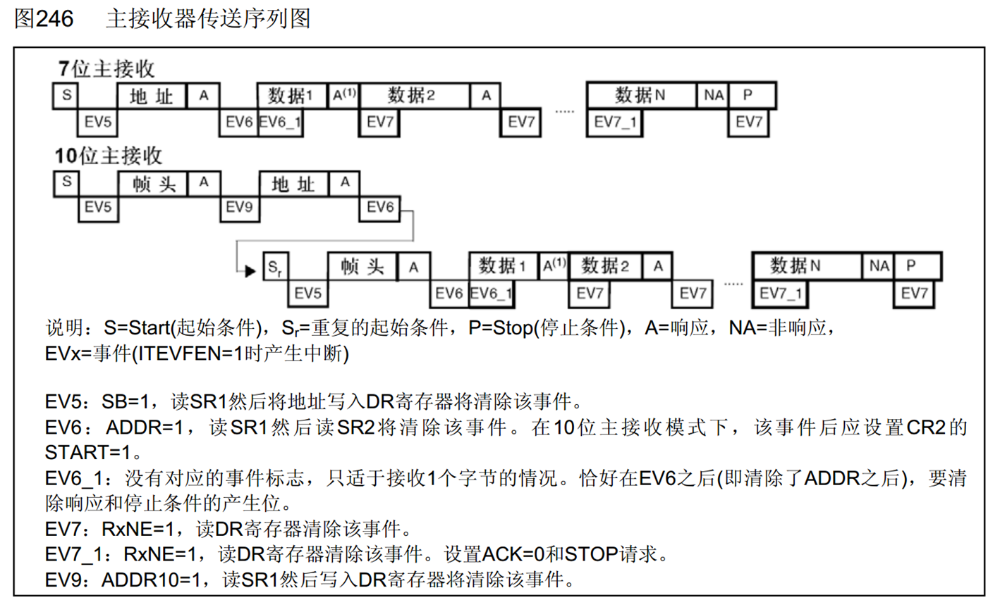


## HAL库

### 案例

AT24C02读写数据，使用引脚PB6 PB7；单次读/写，连续读/写

**IIC程序**

````C
#define IIC_PORT    GPIOB
#define IIC_SCL_PIN GPIO_PIN_6  
#define IIC_SDA_PIN GPIO_PIN_7
#define IIC_SCL(x)     do{x ? HAL_GPIO_WritePin(IIC_PORT,IIC_SCL_PIN,GPIO_PIN_SET) : HAL_GPIO_WritePin(IIC_PORT,IIC_SCL_PIN,GPIO_PIN_RESET);}while(0)
#define IIC_SDA(x)     do{x ? HAL_GPIO_WritePin(IIC_PORT,IIC_SDA_PIN,GPIO_PIN_SET) : HAL_GPIO_WritePin(IIC_PORT,IIC_SDA_PIN,GPIO_PIN_RESET);}while(0)
#define IIC_READ_SDA   HAL_GPIO_ReadPin(IIC_PORT,IIC_SDA_PIN)

void IIC_Init(void){
    __HAL_RCC_GPIOB_CLK_ENABLE();
    
    GPIO_InitTypeDef GPIO_InitStructure;
    GPIO_InitStructure.Mode = GPIO_MODE_OUTPUT_PP;    /* SCL 推挽输出*/
    GPIO_InitStructure.Pull = GPIO_PULLUP; 
    GPIO_InitStructure.Pin = IIC_SCL_PIN;
    GPIO_InitStructure.Speed = GPIO_SPEED_FREQ_HIGH; 
    HAL_GPIO_Init(IIC_PORT,&GPIO_InitStructure);
    
    GPIO_InitStructure.Mode = GPIO_MODE_OUTPUT_OD;    /* SDA 开漏输出*/
    GPIO_InitStructure.Pin = IIC_SDA_PIN;
    HAL_GPIO_Init(IIC_PORT,&GPIO_InitStructure);
}
void IIC_delay(void){
    delay_us(2);
}
// 起始信号
void IIC_start(void){
    /* SCL为高电平期间, SDA从高电平往低电平跳变*/
    IIC_SDA(1);
    IIC_SCL(1); 
    IIC_delay();  
    IIC_SDA(0);
    IIC_delay(); 
    IIC_SCL(0); 
    IIC_delay();    /* 钳住总线, 准备发送/接收数据 */
}
// 停止信号
void IIC_Stop(void){
    /* SCL为高电平期间, SDA从低电平往高电平跳变*/
    IIC_SDA(0);
    IIC_delay();
    IIC_SCL(1);
    IIC_delay();
    IIC_SDA(1);
    IIC_delay();
}
/** 等待应答位
*  返回1：没有应答；返回0：有应答 
**/
uint8_t IIC_WaitAck(void){
    IIC_SDA(1); /* 释放SDA为高电平,让外设下拉为低电平 */
    IIC_delay();    
    IIC_SCL(1); /* 开始读数据 */
    IIC_delay();
    
    /* 等待外设拉低电平 */
    if(IIC_READ_SDA){   /* 读取SDA线上的高低电平，为高电平时代表没有应答 */
        IIC_Stop();     /* 没应答信号，直接停止 */      
        return 1;
    }
    IIC_SCL(0);         /* SCL低电平表示结束ACK检查 */ 
    IIC_delay(); 
    return 0;
}
/**
*   发送应答位
**/
void IIC_Ack(void){
    IIC_SCL(0);
    IIC_delay();
    IIC_SDA(0);  /* 数据线为低电平，表示应答 */
    IIC_delay();
    IIC_SCL(1);
    IIC_delay();
}
/**
*   发送非应答位
**/
void IIC_NAck(void){
    IIC_SCL(0);
    IIC_delay();
    IIC_SDA(1);  /* 数据线为高电平,表示非应答 */
    IIC_delay();
    IIC_SCL(1);
    IIC_delay();
}
// 发送1字节数据
void IIC_SendByte(uint8_t data){
    for(uint8_t i = 0;i < 8;i++){
        IIC_SDA( (data & 0x80) >> 7 );   /* 发送最高位 */
        IIC_delay();
        IIC_SCL(1);     /* 读取数据 */
        IIC_delay();
        IIC_SCL(0);     /* 准备下次读 */    
        data <<= 1;     /* 将下一位变为高位 */
    }
    IIC_SDA(1); /* 发送完成,主机释放SDA线 */ 
}
/** 接收数据
*   参数：1发送应答位，0不发送应答位
**/
uint8_t IIC_ReadByte(uint8_t ack){
    uint8_t receive = 0; 
    for(uint8_t i = 0;i < 8;i++){
        receive <<= 1;  
        IIC_SCL(1);
        IIC_delay();
        if(IIC_READ_SDA) receive++; /* 如果SDA为高电平则最低为置1 */
        IIC_SCL(0);  
        IIC_delay();
    }
    if(!ack) IIC_NAck();
    else    IIC_Ack();
    return receive;
}
````

**AT24C02程序**

````c
#include "./BSP/AT23XX/at23xx.h"
#include "./BSP/IIC/iic.h"
#include "./SYSTEM/delay/delay.h"
void AT24XX_Init(void){
    IIC_Init();
}
uint8_t AT24_ReadData(uint8_t ADDR){
    uint8_t receive;
    IIC_start();   
    IIC_SendByte(0XA0); /*设备号A，0代表写入*/
    IIC_WaitAck();
    IIC_SendByte(ADDR); /* 写入地址 */
    IIC_WaitAck();
    
    IIC_start();        /* 重新发起开始信号 */
    IIC_SendByte(0XA1); /*设备号A，1代表读*/
    IIC_WaitAck();  
    receive  = IIC_ReadByte(0);
    IIC_Stop();   
    return receive;
}
void AT24_SentData(uint8_t ADDR,uint8_t DATA){
    IIC_start();
    IIC_SendByte(0XA0); /*设备号A，0代表写入*/   
    IIC_WaitAck();
    IIC_SendByte(ADDR); /* 写入地址 */
    IIC_WaitAck();
    IIC_SendByte(DATA); /* 写入数据 */
    IIC_WaitAck();
    IIC_Stop();
    delay_ms(10);  		/* 等待写入，AT24需要等待5ms*/
}
/** 连续读
*   参数1：地址
*   参数2：存放数据的数组
*   参数3：读取的长度
**/
void AT24_ContinueRead(uint8_t ADDR,uint8_t* pDATA,uint8_t Lenght){
    while(Lenght--){
        *pDATA = AT24_ReadData(ADDR);
        pDATA++;
        ADDR++;
    }
}
/** 连续写
*   参数1：地址
*   参数2：存放数据的数组
*   参数3：读取的长度
**/
void AT24_ContinueWrite(uint8_t ADDR,uint8_t* pDATA,uint8_t Lenght){
    while(Lenght--){
        AT24_SentData(ADDR,*pDATA);
        pDATA++;
        ADDR++;
    }
}

uint8_t Data[] = {"WWW.RAINUPUP.CN"};
#define DataSize sizeof(Data) 
uint8_t datatemp[DataSize];
int main(void){
    HAL_Init();                         /* 初始化HAL库 */
    sys_stm32_clock_init(RCC_PLL_MUL9); /* 设置时钟, 72Mhz */
    delay_init(72);                     /* 延时初始化 */
    usart_init(115200);                 /* 串口初始化为115200 */
    led_init();                         /* 初始化LED */
    lcd_init();                         /* 初始化LCD */
    key_init();
    
    lcd_show_string(30, 120, 200, 16, 16, "SentData:", RED);
    lcd_show_string(30, 140, 200, 16, 16, "ReadData:", RED);
    AT24XX_Init();
    uint8_t key;
    while (1) {
        key = key_scan(0);
        
        if(key == 1){
            AT24_ContinueWrite(0,Data,DataSize);
            lcd_show_string(132,120, 200, 16, 16, (char*)Data, RED);
        }
        if(key == 2){
            AT24_ContinueRead(0,datatemp,DataSize);
            lcd_show_string(132,140, 200, 16, 16, (char*)datatemp, RED);
        }
        
        if(key == 3){
            AT24_SentData(100,13);				/* 往地址100写入数据 13*/
            lcd_show_num(132,120,13,2,16,BLUE);
        }
        if(key == 4){
            uint8_t re = AT24_ReadData(100);	/* 在地址100处读数据 */	
            lcd_show_num(132,140,re,2,16,BLUE);
        }
    }
}
````

## 标准库

### 常用函数

````c
// 初始化相关
void I2C_DeInit(I2C_TypeDef* I2Cx);
void I2C_Init(I2C_TypeDef* I2Cx, I2C_InitTypeDef* I2C_InitStruct);
void I2C_StructInit(I2C_InitTypeDef* I2C_InitStruct);
// 使能相关
void I2C_Cmd(I2C_TypeDef* I2Cx, FunctionalState NewState);
void I2C_DMACmd(I2C_TypeDef* I2Cx, FunctionalState NewState);
void I2C_DMALastTransferCmd(I2C_TypeDef* I2Cx, FunctionalState NewState);
// 产生一个开始、结束信号，硬件IIC使用
void I2C_GenerateSTART(I2C_TypeDef* I2Cx, FunctionalState NewState);
void I2C_GenerateSTOP(I2C_TypeDef* I2Cx, FunctionalState NewState);
// 接收一个数据后，是否给从机一个应答，硬件IIC使用；在I2C结构体中也可以设置
void I2C_AcknowledgeConfig(I2C_TypeDef* I2Cx, FunctionalState NewState);
// 作为从机时，配置自身设备地址2
void I2C_OwnAddress2Config(I2C_TypeDef* I2Cx, uint8_t Address);
void I2C_DualAddressCmd(I2C_TypeDef* I2Cx, FunctionalState NewState);
void I2C_GeneralCallCmd(I2C_TypeDef* I2Cx, FunctionalState NewState);
void I2C_ITConfig(I2C_TypeDef* I2Cx, uint16_t I2C_IT, FunctionalState NewState);
// 发送数据、接收数据
void I2C_SendData(I2C_TypeDef* I2Cx, uint8_t Data);
uint8_t I2C_ReceiveData(I2C_TypeDef* I2Cx);

/* 发送一个7位地址，也可以使用上方I2C_SendData()函数进行发送地址
参数3:
	@arg I2C_Direction_Transmitter: Transmitter mode	发送模式
	@arg I2C_Direction_Receiver: Receiver mode			接收模式
*/
void I2C_Send7bitAddress(I2C_TypeDef* I2Cx, uint8_t Address, uint8_t I2C_Direction);
uint16_t I2C_ReadRegister(I2C_TypeDef* I2Cx, uint8_t I2C_Register);
void I2C_SoftwareResetCmd(I2C_TypeDef* I2Cx, FunctionalState NewState);
void I2C_NACKPositionConfig(I2C_TypeDef* I2Cx, uint16_t I2C_NACKPosition);
void I2C_SMBusAlertConfig(I2C_TypeDef* I2Cx, uint16_t I2C_SMBusAlert);
void I2C_TransmitPEC(I2C_TypeDef* I2Cx, FunctionalState NewState);
void I2C_PECPositionConfig(I2C_TypeDef* I2Cx, uint16_t I2C_PECPosition);
void I2C_CalculatePEC(I2C_TypeDef* I2Cx, FunctionalState NewState);
uint8_t I2C_GetPEC(I2C_TypeDef* I2Cx);
void I2C_ARPCmd(I2C_TypeDef* I2Cx, FunctionalState NewState);
void I2C_StretchClockCmd(I2C_TypeDef* I2Cx, FunctionalState NewState);
void I2C_FastModeDutyCycleConfig(I2C_TypeDef* I2Cx, uint16_t I2C_DutyCycle);

//由于发送或接收数据时，会产生多个标志位的变化，所以需要查看多个标志位
/**		同时查询1个或多个标志位，重要
  *     @arg I2C_EVENT_SLAVE_TRANSMITTER_ADDRESS_MATCHED           : EV1
  *     @arg I2C_EVENT_SLAVE_RECEIVER_ADDRESS_MATCHED              : EV1
  *     @arg I2C_EVENT_SLAVE_TRANSMITTER_SECONDADDRESS_MATCHED     : EV1
  *     @arg I2C_EVENT_SLAVE_RECEIVER_SECONDADDRESS_MATCHED        : EV1
  *     @arg I2C_EVENT_SLAVE_GENERALCALLADDRESS_MATCHED            : EV1
  *     @arg I2C_EVENT_SLAVE_BYTE_RECEIVED                         : EV2
  *     @arg (I2C_EVENT_SLAVE_BYTE_RECEIVED | I2C_FLAG_DUALF)      : EV2
  *     @arg (I2C_EVENT_SLAVE_BYTE_RECEIVED | I2C_FLAG_GENCALL)    : EV2
  *     @arg I2C_EVENT_SLAVE_BYTE_TRANSMITTED                      : EV3
  *     @arg (I2C_EVENT_SLAVE_BYTE_TRANSMITTED | I2C_FLAG_DUALF)   : EV3
  *     @arg (I2C_EVENT_SLAVE_BYTE_TRANSMITTED | I2C_FLAG_GENCALL) : EV3
  *     @arg I2C_EVENT_SLAVE_ACK_FAILURE                           : EV3_2
  *     @arg I2C_EVENT_SLAVE_STOP_DETECTED                         : EV4
  *     @arg I2C_EVENT_MASTER_MODE_SELECT                          : EV5	
  *     @arg I2C_EVENT_MASTER_TRANSMITTER_MODE_SELECTED            : EV6	注意有两个事件6     
  *     @arg I2C_EVENT_MASTER_RECEIVER_MODE_SELECTED               : EV6
  *     @arg I2C_EVENT_MASTER_BYTE_RECEIVED                        : EV7
  *     @arg I2C_EVENT_MASTER_BYTE_TRANSMITTING                    : EV8
  *     @arg I2C_EVENT_MASTER_BYTE_TRANSMITTED                     : EV8_2
  *     @arg I2C_EVENT_MASTER_MODE_ADDRESS10                       : EV9
  *		…………
  *		返回值：
  * 		- SUCCESS: 指定事件发生
  * 		- ERROR: 指定事件未发生
  */
ErrorStatus I2C_CheckEvent(I2C_TypeDef* I2Cx, uint32_t I2C_EVENT);
// 同时查询2个标志位
uint32_t I2C_GetLastEvent(I2C_TypeDef* I2Cx);
// 查询一个标准位
FlagStatus I2C_GetFlagStatus(I2C_TypeDef* I2Cx, uint32_t I2C_FLAG);

void I2C_ClearFlag(I2C_TypeDef* I2Cx, uint32_t I2C_FLAG);
ITStatus I2C_GetITStatus(I2C_TypeDef* I2Cx, uint32_t I2C_IT);
void I2C_ClearITPendingBit(I2C_TypeDef* I2Cx, uint32_t I2C_IT);
````

````c
typedef struct
{
  uint32_t I2C_ClockSpeed;                //时钟速度,0~100KHMz为标准状态，100~400KHMz为快速状态  
  uint16_t I2C_Mode;                      //工作模式,选择I2C还是SMBus模式
  uint16_t I2C_DutyCycle;                 //时钟信号低电平/高电平的占空比,只有在I2C_ClockSpeed设为快速状态时生效 
  uint16_t I2C_OwnAddress1;               //自身器件地址，从机时使用
  uint16_t I2C_Ack;                       //ACK应答使能，I2C_AcknowledgeConfig()函数可以设置  
  uint16_t I2C_AcknowledgedAddress;       //I2C寻址模式,7位、10位
}I2C_InitTypeDef;

````

````c
//I2C_Mode 工作模式
#define I2C_Mode_I2C                    ((uint16_t)0x0000)
#define I2C_Mode_SMBusDevice            ((uint16_t)0x0002)  
#define I2C_Mode_SMBusHost              ((uint16_t)0x000A)
//I2C_DutyCycle 高低电平占空比，由于高速模式，SDA线切换数据较快，可能来不及更改，所以增加SCL低电平时间
#define I2C_DutyCycle_16_9              ((uint16_t)0x4000) 
#define I2C_DutyCycle_2                 ((uint16_t)0xBFFF)
//I2C_Ack ACK应答使能 ，
#define I2C_Ack_Enable                  ((uint16_t)0x0400)
#define I2C_Ack_Disable                 ((uint16_t)0x0000)
//I2C_AcknowledgedAddress  I2C寻址模式,7位、10位
#define I2C_AcknowledgedAddress_7bit    ((uint16_t)0x4000)
#define I2C_AcknowledgedAddress_10bit   ((uint16_t)0xC000)
````

### 案例

硬件IIC

根据 发送接收序列图进行编写

````c
#define MPU6050_ADDRESS		0xD0
/*超时函数，在IIC发送或接收时，需要等待众多事件*/
void MPU6050_WaitEvent(I2C_TypeDef* I2Cx, uint32_t I2C_EVENT){	
	uint32_t Timeout;
	Timeout = 10000;
	while (I2C_CheckEvent(I2Cx, I2C_EVENT) != SUCCESS){
		Timeout --;
		if (Timeout == 0){
			break;
		}
	}
}
/* 硬件IIC 读*/
void MPU6050_WriteReg(uint8_t RegAddress, uint8_t Data){
	I2C_GenerateSTART(I2C2, ENABLE);	// 产生一个起始位
	MPU6050_WaitEvent(I2C2, I2C_EVENT_MASTER_MODE_SELECT);	// 调用上方编写的超时函数，等待EV5事件
	
	I2C_Send7bitAddress(I2C2, MPU6050_ADDRESS, I2C_Direction_Transmitter);	// 发送设备地址，发送模式
	MPU6050_WaitEvent(I2C2, I2C_EVENT_MASTER_TRANSMITTER_MODE_SELECTED);	// 等待EV6事件，注意是TRANSMITTER
	
	I2C_SendData(I2C2, RegAddress);											// 发送要写的地址
	MPU6050_WaitEvent(I2C2, I2C_EVENT_MASTER_BYTE_TRANSMITTING);			// 等待EV8事件
	
	I2C_SendData(I2C2, Data);												// 发送数据
	MPU6050_WaitEvent(I2C2, I2C_EVENT_MASTER_BYTE_TRANSMITTED);				// 等待EV8_2事件
	
	I2C_GenerateSTOP(I2C2, ENABLE);						// 停止位
}
/* 硬件IIC 写*/
uint8_t MPU6050_ReadReg(uint8_t RegAddress){
	uint8_t Data;
	
	I2C_GenerateSTART(I2C2, ENABLE);										// 产生一个起始位
	MPU6050_WaitEvent(I2C2, I2C_EVENT_MASTER_MODE_SELECT);					// 等待EV5事件
	
	I2C_Send7bitAddress(I2C2, MPU6050_ADDRESS, I2C_Direction_Transmitter);	// 发送设备地址，发送模式
	MPU6050_WaitEvent(I2C2, I2C_EVENT_MASTER_TRANSMITTER_MODE_SELECTED);	// 等待EV6事件
	
	I2C_SendData(I2C2, RegAddress);											// 发送要写的地址
	MPU6050_WaitEvent(I2C2, I2C_EVENT_MASTER_BYTE_TRANSMITTED);				// 等待EV8事件
	
	I2C_GenerateSTART(I2C2, ENABLE);										// 重新产生起始条件
	MPU6050_WaitEvent(I2C2, I2C_EVENT_MASTER_MODE_SELECT);					// 等待EV5事件
	
	I2C_Send7bitAddress(I2C2, MPU6050_ADDRESS, I2C_Direction_Receiver);		// 发送设备地址，接收模式
	MPU6050_WaitEvent(I2C2, I2C_EVENT_MASTER_RECEIVER_MODE_SELECTED);
	
	I2C_AcknowledgeConfig(I2C2, DISABLE);									// 先不发送 响应
	I2C_GenerateSTOP(I2C2, ENABLE);											// 停止位
	
	MPU6050_WaitEvent(I2C2, I2C_EVENT_MASTER_BYTE_RECEIVED);				// 等待EV7
	Data = I2C_ReceiveData(I2C2);											// 读取数据
	
	I2C_AcknowledgeConfig(I2C2, ENABLE);									// 启动响应位
	
	return Data;
}

void MPU6050_Init(void){
	RCC_APB1PeriphClockCmd(RCC_APB1Periph_I2C2, ENABLE);
	RCC_APB2PeriphClockCmd(RCC_APB2Periph_GPIOB, ENABLE);
	
	GPIO_InitTypeDef GPIO_InitStructure;
	GPIO_InitStructure.GPIO_Mode = GPIO_Mode_AF_OD;
	GPIO_InitStructure.GPIO_Pin = GPIO_Pin_10 | GPIO_Pin_11;
	GPIO_InitStructure.GPIO_Speed = GPIO_Speed_50MHz;
	GPIO_Init(GPIOB, &GPIO_InitStructure);
	
	I2C_InitTypeDef I2C_InitStructure;
	I2C_InitStructure.I2C_Mode = I2C_Mode_I2C;				// IIC模式
	I2C_InitStructure.I2C_ClockSpeed = 50000;				// 50Khz 低速模式
	I2C_InitStructure.I2C_DutyCycle = I2C_DutyCycle_2;		// 占空比 2：1
	I2C_InitStructure.I2C_Ack = I2C_Ack_Enable;				// 发送响应位
	I2C_InitStructure.I2C_AcknowledgedAddress = I2C_AcknowledgedAddress_7bit;	// 7位寻址模式
	I2C_InitStructure.I2C_OwnAddress1 = 0x00;				// 做从机时的地址
	I2C_Init(I2C2, &I2C_InitStructure);
	
	I2C_Cmd(I2C2, ENABLE);
	
	MPU6050_WriteReg(MPU6050_PWR_MGMT_1, 0x01);
	MPU6050_WriteReg(MPU6050_PWR_MGMT_2, 0x00);
	MPU6050_WriteReg(MPU6050_SMPLRT_DIV, 0x09);
	MPU6050_WriteReg(MPU6050_CONFIG, 0x06);
	MPU6050_WriteReg(MPU6050_GYRO_CONFIG, 0x18);
	MPU6050_WriteReg(MPU6050_ACCEL_CONFIG, 0x18);
}

uint8_t MPU6050_GetID(void){
	return MPU6050_ReadReg(MPU6050_WHO_AM_I);
}

void MPU6050_GetData(int16_t *AccX, int16_t *AccY, int16_t *AccZ, 
						int16_t *GyroX, int16_t *GyroY, int16_t *GyroZ)
{
	uint8_t DataH, DataL;
	
	DataH = MPU6050_ReadReg(MPU6050_ACCEL_XOUT_H);
	DataL = MPU6050_ReadReg(MPU6050_ACCEL_XOUT_L);
	*AccX = (DataH << 8) | DataL;
	
	DataH = MPU6050_ReadReg(MPU6050_ACCEL_YOUT_H);
	DataL = MPU6050_ReadReg(MPU6050_ACCEL_YOUT_L);
	*AccY = (DataH << 8) | DataL;
	
	DataH = MPU6050_ReadReg(MPU6050_ACCEL_ZOUT_H);
	DataL = MPU6050_ReadReg(MPU6050_ACCEL_ZOUT_L);
	*AccZ = (DataH << 8) | DataL;
	
	DataH = MPU6050_ReadReg(MPU6050_GYRO_XOUT_H);
	DataL = MPU6050_ReadReg(MPU6050_GYRO_XOUT_L);
	*GyroX = (DataH << 8) | DataL;
	
	DataH = MPU6050_ReadReg(MPU6050_GYRO_YOUT_H);
	DataL = MPU6050_ReadReg(MPU6050_GYRO_YOUT_L);
	*GyroY = (DataH << 8) | DataL;
	
	DataH = MPU6050_ReadReg(MPU6050_GYRO_ZOUT_H);
	DataL = MPU6050_ReadReg(MPU6050_GYRO_ZOUT_L);
	*GyroZ = (DataH << 8) | DataL;
}
````


# SPI

## SPI简介

* SPI（Serial Peripheral Interface 串行外围设备接口）是由Motorola公司开发的一种通用数据总线
* 四根通信线：SCK（Serial Clock）、MOSI（Master Output Slave Input）、MISO（Master Input Slave Output）、SS（Slave Select）
* 同步，全双工
* 支持总线挂载多设备（一主多从）
* 时钟是一个振荡信号，它告诉接收端在确切的时机对数据线上的信号进行采样。
* 产生时钟的一侧称为主机，另一侧称为从机。总是只有一个主机（一般来说可以是微控制器/MCU），但是可以有多个从机（后面详细介绍）；
* 数据的采集时机可能是时钟信号的上升沿（从低到高）或下降沿（从高到低）。


整体的传输大概可以分为以下几个过程：

* 主机先将SS信号拉低，这样保证开始接收数据；
* 当接收端检测到时钟的边沿信号时，它将立即读取数据线上的信号，这样就得到了一位数据（1bit）;
* 由于时钟是随数据一起发送的，因此指定数据的传输速度并不重要，尽管设备将具有可以运行的最高速度（稍后我们将讨论选择合适的时钟边沿和速度）。
* 主机发送到从机时：主机产生相应的时钟信号，然后数据一位一位地将从MOSI信号线上进行发送到从机；
* 主机接收从机数据：如果从机需要将数据发送回主机，则主机将继续生成预定数量的时钟信号，并且从机会将数据通过MISO信号线发送；
  


**SPI分类**

对于FLASH来说：速度至上

| SPI分类              | 方向   | 描述                                                         |
| -------------------- | ------ | ------------------------------------------------------------ |
| Standard SPI 标准SPI | 全双工 | 标准SPI，通信线包含：片选CS、时钟线CLK、输入DI、输出DO。驱动SPI FLASH还需要写保护WR以及维持HOLD引脚 |
| Dual SPI 双线SPI     | 半双工 | 对标准SPI改进，DO和DI改成IO0和IO1，变为双向IO口。 一个周期内，通过数据线，传输2位数据 |
| Qual SPI 四线SPI     | 半双工 | 对Dual SPI改进，写保护WR和维持HOLD复用为数据IO口，为IO2和IO3。 一个周期内，通过数据线，传输4位数据 |


## 硬件电路

* 所有SPI设备的SCK、MOSI、MISO分别连在一起
* 主机另外引出多条SS控制线，分别接到各从机的SS引脚
* 输出引脚配置为**推挽输出**，输入引脚配置为**浮空或上拉输入**


SPI总线包括4条逻辑线，定义如下：

* MISO：Master input slave output 主机输入，从机输出（数据来自从机）；
* MOSI：Master output slave input 主机输出，从机输入（数据来自主机）；
* SCLK ： Serial Clock 串行时钟信号，由主机产生发送给从机；
* SS：Slave Select 片选信号，由主机发送，以控制与哪个从机通信，通常是低电平有效信号。

其他制造商可能会遵循其他命名规则，但是最终他们指的相同的含义。以下是一些常用术语；

* MISO也可以是SIMO，DOUT，DO，SDO或SO（在主机端）;
* MOSI也可以是SOMI，DIN，DI，SDI或SI（在主机端）;
* NSS也可以是CE，CS或SSEL;
* SCLK也可以是SCK;
  


当主机要发送数据到从机或接收从机数据时，要先将对应的SS置为低电平


## 移位示意图


1. 主机的波特率发生器产生时钟，这个时钟信号发送到从机，主机和从机根据对应的时钟信号发送接收数据
2. 当时钟信号发生第一次变化时，主机的移位寄存器将最左侧数据放到MOSI中，从机的移位寄存器将最左侧的数据放到MISO中
3. 当时钟信号再次发生变化时，主机将从机放到MISO中的数据添加到移位寄存器的最右侧，从机将主机放到MOSI中的数据添加到移位寄存器的最右侧
4. 循环往复


没有读和写的说法，因为实质上每次SPI是主从设备在交换数据。也就是说，你发一个数据必然会收到一个数据；你要收一个数据必须也要先发一个数据。

在只发送或只接收时，会存在浪费，

* 当只发送时，实际上也在接收，只是接收的数据不存放,一般接收(由发送端发出)的无用数据都是0x00或0xFF
* 当只接收时，实际上也在发送，只是发送的数据接收端不存放,一般发送无用数据(0x00或0xFF)

**数据发送**


**数据接收**


## SPI框图

### 硬件介绍

* STM32内部集成了硬件SPI收发电路，可以由硬件自动执行时钟生成、数据收发等功能，减轻CPU的负担
* 可配置8位/16位数据帧、高位先行/低位先行
* 时钟频率： fPCLK / (2, 4, 8, 16, 32, 64, 128, 256)
* 支持多主机模型、主或从操作
* 可精简为半双工/单工通信
* 支持DMA
* 兼容I2S协议：数字音频信号协议
* STM32F103C8T6 硬件SPI资源：SPI1、SPI2
  * SPI1由APB2控制：72MHz
  * SPI2由APB1控制：36MHz


### 1.通讯引脚

SPI 一共有 4 个引脚，不同 SPI 对应的引脚也不同：

**注意**：硬件SPI的引脚是固定的，而软件SPI引脚可以随意，一般NSS引脚都是由软件模拟，所以不需要一定按引脚接线，其他引脚需要

| 引脚 | SPI1 | SPI2 |       SPI3       |
| :--: | :--: | :--: | :--------------: |
| NSS  | PA4  | PB12 | PA15下载口的TDI  |
| CLK  | PA5  | PB13 |  PB3下载口的TDO  |
| MISO | PA6  | PB14 | PB4下载口的NTRST |
| MOSI | PA7  | PB15 |       PB5        |

实际应用中，一般不使用 SPI 外设的标准 NSS 信号线，而是更简单地使用普通的 GPIO，软件控制它的电平输出，从而产生通讯起始和停止信号。

### 2.数据控制逻辑

* 这部分主要控制数据的接收和发送以及数据帧格式和MSB/LSB先行，和串口通讯类似，SPI的收发数据也是通过缓冲区和移位寄存器来实现的。MOSI和MISO都与移位寄存器相连以便传输数据，下面具体说明一下主机发送数据和接收数据的流程。
* 当发送完一帧数据的时候，“状态寄存器 SR”中的“TXE 标志位”会被置 1，表示传输完一帧，发送缓冲区已空；类似地，当接收完一帧数据的时候，“ RXNE
  标志位”会被置 1，表示传输完一帧，接收缓冲区非空；
* 发送数据：地址和数据总线会在相应的地址上取到要发送的数据，将数据放入发送缓冲区，当向外发送数据时，移位寄存器会以发送缓冲区为数据源，一位一位的将数据发送出去。
* 接收数据：接收数据时，移位寄存器把数据线采样到的数据一位一位的传到接收缓冲区，再由总线读取接收缓冲区中的数据。
* 数据帧格式：通过配置“控制寄存器CR1”的“DFF为”可以控制数据帧格式为8位还是16位，即一次接收或发送数据的大小。(16位就是一次性发2个8位)
* 先行位：通过配置“控制寄存器CR1”的“LSBFIRST 位”可选择 MSB（最高有效位） 先行还是 LSB（最低有效位） 先行。Most/Least Significant Bit

**发送缓冲器空闲标志(TXE)** 

* 此标志为’1’时表明发送缓冲器为空，可以写下一个待发送的数据进入缓冲器中。当写入SPI_DR时，TXE标志被**自动清除**。

**接收缓冲器非空(RXNE)** 

* 此标志为’1’时表明在接收缓冲器中包含有效的接收数据。读SPI数据寄存器可以清除此标志。

**2.x** ：主要配置的是多主多从，MOSI与MISO进行交换

### 3.时钟控制逻辑

这一块的内容主要是配置SCK的时钟频率和SPI的通讯模式（CPOL和CPHA）。
时钟频率的配置：波特率发生器通过控制“控制寄存器CR1”中的BR[2:0]三个位来配置fpclk的分频因子，对fpclk分频后的频率就是SCK的时钟频率，具体配

| BR[0:2] | 分频结果(SCK 频率) |
| :-----: | :----------------: |
|   000   |      fpclk/2       |
|   001   |      fpclk/4       |
|   010   |      fpclk/8       |
|   011   |      fpclk/16      |
|   100   |      fpclk/32      |
|   101   |      fpclk/64      |
|   110   |     fpclk/128      |
|   111   |     fpclk/256      |

### 4.整体逻辑控制

在外设工作时，控制逻辑会根据外设的工作状态修改“状态寄存器(SR)”，我们只要读取状态寄存器相关的寄存器位，就可以了解 SPI 的工作状态了。除此之外，控制逻辑还根据要求，负责控制产生 SPI 中断信号、DMA 请求及控制NSS 信号线，不过NSS信号线我们时一般是连接GPIO口，通过软件来控制电平输出，从而产生起始信号和停止信号。


### SPI基本结构

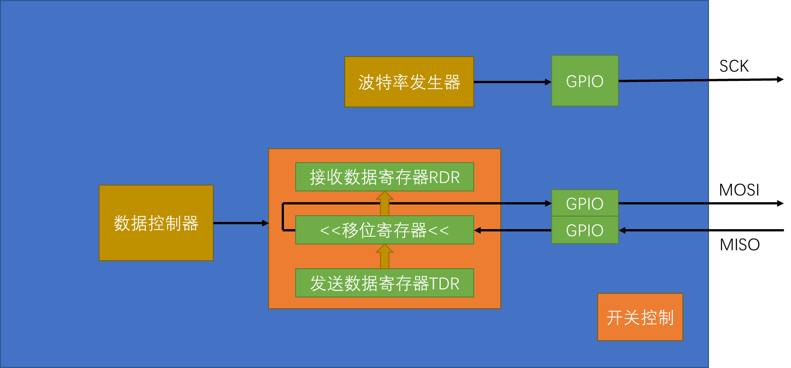


## 工作机制

### 起始条件

* 起始条件：SS从高电平切换到低电平(片选)
* 终止条件：SS从低电平切换到高电平
* 即选中从机时为开启，不选中从机时为关闭

### **相关缩写**

SPI的极性Polarity和相位Phase，最常见的写法是CPOL和CPHA，不过也有一些其他写法，简单总结如下：

1. CKPOL (Clock Polarity) = CPOL = POL = Polarity = 时钟极性
2. CKPHA (Clock Phase) = CPHA = PHA = Phase = 时钟相位
3. SCK = SCLK = SPI的时钟
4. Edge = 边沿，即时钟电平变化的时刻，即上升沿(rising edge)或者下降沿(falling edge)
   * Leading edge=前一个边沿=第一个边沿，对于开始电压是1，那么就是1变成0的时候，对于开始电压是0，那么就是0变成1的时候；
   * Trailing edge=后一个边沿=第二个边沿，对于开始电压是1，那么就是0变成1的时候（即在第一次1变成0之后，才可能有后面的0变成1），对于开始电压是0，那么就是1变成0的时候；

### 时钟极性CPOL

先说什么是SCLK时钟的空闲时刻，其就是当SCLK在数发送8个bit比特数据之前和之后的状态，于此对应的，SCLK在发送数据的时候，就是正常的工作的时候，有效active的时刻了。

先说英文，其精简解释为：Clock Polarity = IDLE state of SCK。

再用中文详解：

* SPI的CPOL，表示当SCLK空闲idle的时候，其电平的值是低电平0还是高电平1：
  * **CPOL=0**，表示当SCLK=0时处于空闲态，所以有效状态就是SCLK处于高电平时
  * **CPOL=1**，表示当SCLK=1时处于空闲态，所以有效状态就是SCLK处于低电平时


### 时钟相位CPHA

首先说明一点，capture strobe = latch = read = sample，都是表示数据采样，数据有效的时刻。相位，对应着数据采样是在第几个边沿（edge），是第一个边沿还是第二个边沿，0对应着第一个边沿，1对应着第二个边沿。

- **CPHA=0**，在时钟的第一个跳变沿（上升沿或下降沿）进行数据采样。，在第2个边沿发送数据
- **CPHA=1**，在时钟的第二个跳变沿（上升沿或下降沿）进行数据采样。，在第1个边沿发送数据

### 模式

| SPI工作模式 | CPOL | CPHA | SCL空闲状态 | 采样边沿 | 采样时刻 |
| ----------- | ---- | ---- | ----------- | -------- | -------- |
| 0           | 0    | 0    | 低电平      | 上升沿   | 奇数边沿 |
| 1           | 0    | 1    | 低电平      | 下降沿   | 偶数边沿 |
| 2           | 1    | 0    | 高电平      | 下降沿   | 奇数边沿 |
| 3           | 1    | 1    | 高电平      | 上升沿   | 偶数边沿 |

工作站基本采用模式0 或3，但是模式1方便理解

**Mode0**：

* 交换一个字节（模式0）
* CPOL=0：空闲状态时，SCK为低电平
* CPHA=0：SCK第一个边沿移入数据（将MOSI和MISI中的值放入寄存器），第二个边沿移出数据（将寄存器中的值放入MOSI和MISI中）


当检测到第一个边沿之前，先将数据放到MOSI和MISI中，当检测到第一个边沿时(上升沿),将MOSI和MISI中的数据放入寄存器，当检测到第二个边沿时(下降沿),将数据放入MOSI和MISI中


**Mode1**：

* 交换一个字节（模式1）
* CPOL=0：空闲状态时，SCK为低电平
* CPHA=1：SCK第一个边沿移出数据，第二个边沿移入数据


当检测到第一个边沿时(上升沿),将数据放入MOSI和MISI中，当检测到第二个边沿时(下降沿),将MOSI和MISI中的数据放入寄存器


**Mode2**：

* 交换一个字节（模式2）
* CPOL=1：空闲状态时，SCK为高电平
* CPHA=0：SCK第一个边沿移入数据，第二个边沿移出数据


**Mode3**：

* 交换一个字节（模式3）
* CPOL=1：空闲状态时，SCK为高电平
* CPHA=1：SCK第一个边沿移出数据，第二个边沿移入数据


### SPI时序

**发送指令**

向SS指定的设备，发送指令（0x06）

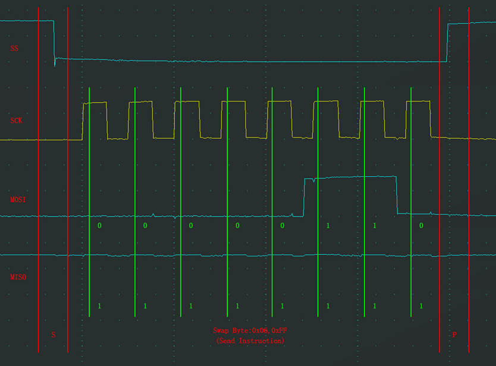

**指定地址写**

向SS指定的设备，发送写指令（0x02），

随后在指定地址（Address[23:0]）下，写入指定数据（Data）

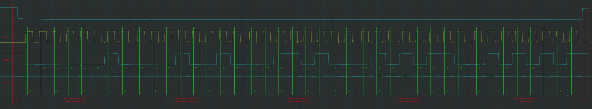

由于地址为24为，而每次只能传8为，所以地址需要3次传送

**指定地址读**

向SS指定的设备，发送读指令（0x03），

随后在指定地址（Address[23:0]）下，读取从机数据（Data）


## 通信过程

### **主模式全双工连续传输**

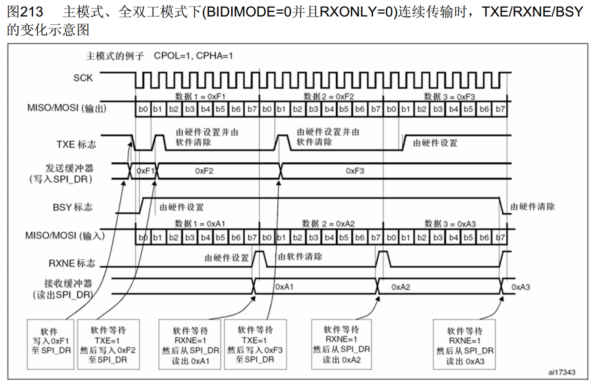

首先需要知道一个大概的过程：主机输出的数据都要通过缓冲区（对应数据寄存器`SPI_DR`）才能进入移位寄存器，最后再发送；主机读入的数据都要通过移位寄存器，再移入缓冲区。因此，**缓冲区和移位寄存器中的数据在同一时刻是不一样的，它们正好相差了一次通信时间**。


**从主机发送数据到从机的详细过程（以 CPHA=1、CPOL=1 为例）**

* 往发送缓冲区（即数据寄存器SPI_DR）写入一个数据（比如图中的 0XF1），此时触发 SCK 信号进入忙碌状态。此时状态寄存器SPI_SR的BSY（忙标志，Busy flag）位为 1，表示 SPI 开始通信；TXE（发送缓冲为空，Transmit buffer empty）位为 0，表示发送缓冲非空。
* 由于移位寄存器还没有数据，因此发送缓冲区很快将数据 0xF1 转移到移位寄存器中。此时TXE位为 1，表示发送缓冲为空。移位寄存器将数据一位一位传到 MOSI 线。
* 等待至TXE位为 1后，软件往发送缓冲区写入第二个数据（比如 0xF2），TXE位变为 0，表示发送缓冲非空。由于移位寄存器还没将前一个数据 0xF1 全部发送出去，因此新数据 0xF2 暂时存到缓冲区。
* 前一个数据发送完毕后，新数据 0xF2 转移到移位寄存器中，此时TXE位为 1，表示发送缓冲为空。移位寄存器将数据一位一位传到 MOSI 线。
* 如此往复：等待TXE位由0变为 1，软件往发送缓冲区写入新数据，前一个数据发送完，新数据就往移位寄存器补，并将其一位一位发出去。发送出去的数据总比新写入缓冲区的数据少一次发送周期。


**从从机接收数据到主机的详细过程（以 CPHA=1、CPOL=1 为例）**

* 必须先使 SPI 启动（即让 SCK 处于忙碌状态），才能接收数据。因此，需要先往发送缓冲随意写入一个数据，以触发 SCK 信号进入忙碌状态。写入数据后，状态寄存器SPI_SR的BSY位为 1，表示 SPI 开始通信；RXNE（接收缓冲非空，Receive buffer not empty）位为 0，表示接收缓冲为空。
* 移位寄存器一位位接收到从 MISO 来的数据 0xA1，将数据转移到接收缓冲区中，然后进行下一次数据接收；此时RXNE位为 1，表示接收缓冲非空，表明软件可以开始读取数据 0xA1。
* 待数据读取完后，RXNE位为 0，表示接收缓冲为空。此时移位寄存器将新数据 0xA2 转移到接收缓冲区中，RXNE位为 1，表示接收缓冲非空，表明软件可以开始读取数据 0xA2
* 如此往复：移位寄存器一位位接收数据，然后将数据转移到接收缓冲区，然后继续接收下一次数据；软件等待RXNE位由 0 变为 1 后，从接收缓冲区读取数据。接收到的数据总比新读取缓冲区的数据多一个发送周期。
  

### 非连续传输


1. 先等待 发送缓冲器空闲标志(TXE) 为空(1)，即缓冲器SPI_DR中为空
   * TXE当为0时，一直等待
   * TXE当为1时 --> 写入数据到缓冲器SPI_DR，此时缓冲器SPI_DR有数据 --> TXE的值变为0
2. 移位寄存器再从SPI_DR取值，取完后缓冲器SPI_DR为空(TXE为1)，但是现在不着急将数据再次放到缓冲器SPI_DR中
   * 发送的同时，也会接收，发送完成也就代表接收完成，当接收完一个字节后 接收缓冲器非空(RXNE) 为1

**注意：** 要想接收，必须先发送，因为只有发送，才能触发时序的生成

## 相关寄存器

| **寄存器** | **名称**       | **作用**                                            |
| ---------- | -------------- | --------------------------------------------------- |
| SPI_CR1    | SPI控制寄存器1 | 用于配置SPI工作参数                                 |
| SPI_SR     | SPI状态寄存器  | 用于查询当前SPI传输状态（TXE、RXNE）                |
| SPI_DR     | SPI数据寄存器  | 用于存放待发送数据或接收数据，有两个缓冲区（TX/RX） |

**SPI 控制寄存器 1（SPI_CR1）**


该寄存器控制着 SPI 很多相关信息，包括主设备模式选择，传输方向，数据格式，时钟极性、时钟相位和使能等。


**SPI 状态寄存器（SPI_SR）**

该寄存器是查询当前 SPI 的状态的，我们在实验中用到的是 TXE 位和 RXNE 位，即发送完成和接收完成是否的标记。

**SPI 数据寄存器（SPI_DR）**

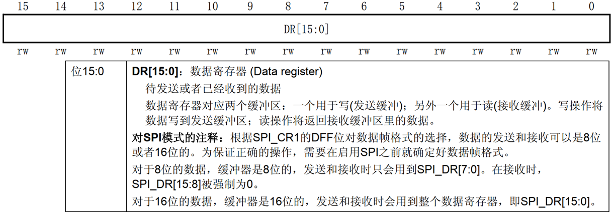

该寄存器是 SPI 数据寄存器，是一个双寄存器，包括了发送缓存和接收缓存。当向该寄存器写数据的时候，SPI 就会自动发送，当收到数据的时候，也是存在该寄存器内。

## HAL库

|           驱动函数           |  关联寄存器   |     功能描述      |
| :--------------------------: | :-----------: | :---------------: |
| __HAL_RCC_SPIx_CLK_ENABLE(…) |  RCC_APB2ENR  |   使能SPIx时钟    |
|       HAL_SPI_Init(…)        |    SPI_CR1    |     初始化SPI     |
|      HAL_SPI_MspInit(…)      |  初始化回调   | 初始化SPI相关引脚 |
|     HAL_SPI_Transmit(…)      | SPI_DR/SPI_SR |      SPI发送      |
|      HAL_SPI_Receive(…)      | SPI_DR/SPI_SR |      SPI接收      |
|  HAL_SPI_TransmitReceive(…)  | SPI_DR/SPI_SR |    SPI接收发送    |
|     __HAL_SPI_ENABLE(…)      | SPI_CR1(SPE)  |    使能SPI外设    |
|     __HAL_SPI_DISABLE(…)     | SPI_CR1(SPE)  |    失能SPI外设    |

````c
typedef struct __SPI_HandleTypeDef{
    SPI_TypeDef                *Instance;
    SPI_InitTypeDef            Init;
    DMA_HandleTypeDef          *hdmatx;
    DMA_HandleTypeDef          *hdmarx;
} SPI_HandleTypeDef;
typedef struct{
    uint32_t Mode				/* SPI模式 */
    uint32_t Direction			/* 工作方式 */
    uint32_t DataSize			/* 帧格式 */
    uint32_t CLKPolarity		/* 时钟极性 */
    uint32_t CLKPhase			/* 时钟相位 */
    uint32_t NSS				/* SS控制方式 */
    uint32_t BaudRatePrescaler	/* SPI波特率预分频值 */
    uint32_t FirstBit			/* 数据传输顺序 */
    uint32_t TIMode				/* 帧格式：Motorola / TI  */
    uint32_t CRCCalculation		/* 设置硬件CRC校验 */
    uint32_t CRCPolynomial		/* 设置CRC校验多项式，1~65535 默认为7 */
    …
} SPI_InitTypeDef;
/* SPI模式 */
#define SPI_MODE_SLAVE		/* 从机模式 */
#define SPI_MODE_MASTER		/* 主机模式 */
/* 工作方式 */
#define SPI_DIRECTION_2LINES            /* 双线全双工 */
#define SPI_DIRECTION_2LINES_RXONLY
#define SPI_DIRECTION_1LINE
/* 帧格式 */
#define SPI_DATASIZE_8BIT
#define SPI_DATASIZE_16BIT
/* 时钟极性 */
#define SPI_POLARITY_LOW		/* 空闲低电平 */
#define SPI_POLARITY_HIGH		/* 空闲高电平 */
/* 时钟相位 */
#define SPI_PHASE_1EDGE         /* 第一个边沿 */
#define SPI_PHASE_2EDGE         /* 第二个边沿 */

/* SS控制方式 */
#define SPI_NSS_SOFT            /* 软件片选 */
#define SPI_NSS_HARD_INPUT
#define SPI_NSS_HARD_OUTPUT
/* SPI波特率预分频值 */    
#define SPI_BAUDRATEPRESCALER_2
#define SPI_BAUDRATEPRESCALER_4
#define SPI_BAUDRATEPRESCALER_8
#define SPI_BAUDRATEPRESCALER_16
#define SPI_BAUDRATEPRESCALER_32
#define SPI_BAUDRATEPRESCALER_64
#define SPI_BAUDRATEPRESCALER_128
#define SPI_BAUDRATEPRESCALER_25
/* 数据传输顺序 */      
#define SPI_FIRSTBIT_MSB		/* 高位先行 */
#define SPI_FIRSTBIT_LSB		/* 低位先行*/

/* 帧格式：Motorola / TI  默认摩托罗拉*/
#define SPI_TIMODE_DISABLE

/* 设置硬件CRC校验 */      
#define SPI_CRCCALCULATION_DISABLE
#define SPI_CRCCALCULATION_ENABLE
````

### 软件读写

读写WQ25QXX


SPI模块

````c
#define SPI_GPIO_PORT       GPIOA
#define SPI_GPIO_PIN_CS     GPIO_PIN_4
#define SPI_GPIO_PIN_CLK    GPIO_PIN_5
#define SPI_GPIO_PIN_MISO   GPIO_PIN_6
#define SPI_GPIO_PIN_MOSI   GPIO_PIN_7

#define SPI_CS(X)  do{ X ? HAL_GPIO_WritePin(GPIOA,SPI_GPIO_PIN_CS ,GPIO_PIN_SET) : HAL_GPIO_WritePin(GPIOA,SPI_GPIO_PIN_CS ,GPIO_PIN_RESET); }while(0)

#define SPI_CLK(X)  do{ X ? HAL_GPIO_WritePin(GPIOA,SPI_GPIO_PIN_CLK,GPIO_PIN_SET) : HAL_GPIO_WritePin(GPIOA,SPI_GPIO_PIN_CLK,GPIO_PIN_RESET); }while(0)

#define SPI_W_MOSI(X) do{ X ? HAL_GPIO_WritePin(GPIOA,SPI_GPIO_PIN_MOSI,GPIO_PIN_SET) : HAL_GPIO_WritePin(GPIOA,SPI_GPIO_PIN_MOSI,GPIO_PIN_RESET); }while(0)

#define SPI_R_MISO()  HAL_GPIO_ReadPin(GPIOA,SPI_GPIO_PIN_MISO)


void SPI_Init(void){   
    __HAL_RCC_GPIOA_CLK_ENABLE();
    // 输出引脚配置为推挽输出，输入引脚配置为浮空或上拉输入
    GPIO_InitTypeDef GPIO_InitStructure;
    GPIO_InitStructure.Mode = GPIO_MODE_OUTPUT_PP;
    GPIO_InitStructure.Pin = SPI_GPIO_PIN_CS | SPI_GPIO_PIN_CLK |SPI_GPIO_PIN_MOSI;
    GPIO_InitStructure.Pull = GPIO_NOPULL;
    GPIO_InitStructure.Speed = GPIO_SPEED_FREQ_HIGH;
    HAL_GPIO_Init(SPI_GPIO_PORT,&GPIO_InitStructure);
    
    GPIO_InitStructure.Mode = GPIO_MODE_INPUT;
    GPIO_InitStructure.Pin = SPI_GPIO_PIN_MISO;
    
    HAL_GPIO_Init(SPI_GPIO_PORT,&GPIO_InitStructure);
    
    SPI_CS(1);      // 初始化SS线为高电平，表示不选中从机
    SPI_CLK(0);     // 空闲转态
}
/* 开启SPI */
void SPI_Start(void){
    SPI_CS(0);
}
/* 停止SPI */
void SPI_Stop(void){
    SPI_CS(1);
}
/**
*   SPI输出和读入，由于读的时候一定有写，写的时候一定有读，所以读写在一起
*   使用移位寄存器方式
**/
uint8_t SPI_SendReadByte(uint8_t data){  
    for(uint8_t i = 0;i < 8;i++){
        SPI_W_MOSI( ( data & 0x80) >> 7);   // 将最高为输出
        SPI_CLK(1);
        data <<= 1;                         // 移除最高位
        if(SPI_R_MISO() == 1) data++;       // 如果读入为1，则将1加入到最低位
        SPI_CLK(0);   
    }  
    return data;
}
````

W25QXX模块

````c
void W25QXX_Init(void){
    SPI_Init();
}
void W25QXX_ReadID(uint8_t *MID,uint16_t *DID){ // 读取厂商ID，和设备ID
    SPI_Start();
    SPI_SendReadByte(0X9F);                     // 向W25Q64发送0x9f，查询厂商ID，和设备ID

    /*
	* 当发送0x9f后，W25Q64会发出1个8位的厂商ID，再通过两次发出一个16为的设备ID
	* 但是SPI没有单独接收或发送的情况，只有发送和接收同时进行，所以主机要想接收到厂商ID和设备ID
	* 就必须连续发送3个8为数据，从而接收3个8位数据
	*/
    *MID = SPI_SendReadByte(0XFF);              // 通过发送0xff这种无效数据，接收到厂商ID
    *DID = SPI_SendReadByte(0XFF);              // 通过发送0xff这种无效数据，接收到设备ID的高八位
    *DID <<= 8;                                 // 左移8位
    *DID |= SPI_SendReadByte(0XFF);             // 合并低八位
    SPI_Stop();
}
// 写使能
void W25QXX_WriteEnable(void){
    SPI_Start();
    SPI_SendReadByte(0X06);                     // 06h为写使能，W2W25Q64不会再发送数据到主机
    SPI_Stop();
}
// 读状态寄存器，主要是判断芯片是否在忙转态
void W25QXX_ReadStatue(void){
    uint32_t Timeout = 1000000;
    
    SPI_Start();
    SPI_SendReadByte(0X05);                     // 05h为读状态寄存器，W2W25Q64会再发送1个数据到主机，读取最低位即可
    while((SPI_SendReadByte(0XFF) & 0x01) == 0x01){         // 如果读取到的数据为1，则表示芯片正忙
        if(--Timeout == 0) break;                           // 最多等1000000自减
    }
    SPI_Stop();
    
}
// 指定页写入
void W25QXX_PageWrite(uint32_t ADDR,uint8_t *pData,uint16_t lenght){
    W25QXX_WriteEnable();                       // 写操作需要先使能
    SPI_Start();
    //发送0x02 表示指定页写入，后面还需要24为的地址，再之后是写入的内容
    SPI_SendReadByte(0X02);         // 02h为写入页，W2W25Q64会再发送1个数据到主机，读取最低位即可 
    
    SPI_SendReadByte(ADDR >> 16);   // 右移16位，就是23~16位，注意不是Address >>= 16，>> 仅仅为右移不赋值
    SPI_SendReadByte(ADDR >> 8);    
    SPI_SendReadByte(ADDR);         // 强制类型转换，SPI_SendReadByte(uint8_t data) uint32_t -> uint8_t会保留下低八位
    
    for(uint8_t i = 0;i < lenght;i++){
        SPI_SendReadByte(pData[i]);
    }
    
    SPI_Stop();
    W25QXX_ReadStatue();            // 等待芯片为空闲状态时再放行
}
// 扇区擦除
void W25QXX_SectorErase(uint32_t ADDR){
    W25QXX_WriteEnable();           // 需要先使能
    SPI_Start();    
    SPI_SendReadByte(0X20);         //发送0x20表示扇区擦除，需要24为地址
    
    SPI_SendReadByte(ADDR >> 16);
    SPI_SendReadByte(ADDR >> 8);
    SPI_SendReadByte(ADDR);
    
    SPI_Stop();
    W25QXX_ReadStatue();
}
// 读数据
void W25QXX_ReadData(uint32_t ADDR,uint8_t *pData,uint16_t lenght){
//    W25QXX_WriteEnable();         // 读数据不需要使能
    SPI_Start();
    SPI_SendReadByte(0X03); 
    
    SPI_SendReadByte(ADDR >> 16);
    SPI_SendReadByte(ADDR >> 8);
    SPI_SendReadByte(ADDR);
    
    for(uint8_t i = 0;i < lenght;i++){
        pData[i] = SPI_SendReadByte(0XFF);
    } 
    SPI_Stop();
}
````

main

````c
uint8_t SendData[4] = {1,2,3,4};
#define SendSize    sizeof(SendData)
uint8_t ReadData[SendSize];
int main(void)
{
    HAL_Init();                         /* 初始化HAL库 */
    sys_stm32_clock_init(RCC_PLL_MUL9); /* 设置时钟, 72Mhz */
    delay_init(72);                     /* 延时初始化 */
    usart_init(115200);                 /* 串口初始化为115200 */
    led_init();                         /* 初始化LED */
    lcd_init();                         /* 初始化LCD */
    key_init();                         /* 初始化key */
    
    lcd_show_string(30, 110, 200, 16, 16, "Mid:", RED);
    lcd_show_string(30, 130, 200, 16, 16, "DID:", RED);
    
    lcd_show_string(30, 150, 200, 16, 16, "Send Data:", RED);
    lcd_show_string(30, 180, 200, 16, 16, "Read Data:", RED);
    W25QXX_Init();
    uint8_t mid=0;
    uint16_t did=0;
    while (1){  
        W25QXX_ReadID(&mid,&did);                  // 读取设备ID
        lcd_show_num(132, 110,mid,4,16,BLUE);
        lcd_show_num(132, 130,did,8,16,BLUE);  
        
        for(int i = 0;i < SendSize;i++){
            lcd_show_num(132 + i * 17, 150,SendData[i],1,16,BLUE);
        }      
        //对0x00000000地址的扇区进行擦除，即填充0xff
        W25QXX_SectorErase(0x00000000); 
       	
        W25QXX_PageWrite(0x00000000,SendData,4);	// 指定页写
        W25QXX_ReadData(0x00000000,ReadData,4);		// 将数据读出
        for(int i = 0;i < SendSize;i++){
            lcd_show_num(132 + i * 17, 180,ReadData[i],1,16,BLUE);
        }
        
        for(int i = 0;i < SendSize;i++){
            SendData[i]++;
        }
    }
}
````

### 硬件读写

与软件读写相比，只需要更改SPI模块

````c
#define SPI_GPIO_PORT       GPIOA
#define SPI_GPIO_PIN_CS     GPIO_PIN_4
#define SPI_GPIO_PIN_CLK    GPIO_PIN_5
#define SPI_GPIO_PIN_MISO   GPIO_PIN_6
#define SPI_GPIO_PIN_MOSI   GPIO_PIN_7

#define SPI_CS(X)  do{ X ? HAL_GPIO_WritePin(GPIOA,SPI_GPIO_PIN_CS ,GPIO_PIN_SET) : HAL_GPIO_WritePin(GPIOA,SPI_GPIO_PIN_CS ,GPIO_PIN_RESET); }while(0)

SPI_HandleTypeDef SPI_HandleStructure;

void SPI_Init(void){
    SPI_HandleStructure.Instance = SPI1;				
    SPI_HandleStructure.Init.Mode = SPI_MODE_MASTER;				/* 设置SPI模式（主机模式） */
    SPI_HandleStructure.Init.Direction =  SPI_DIRECTION_2LINES;		/* 设置SPI工作方式（全双工） */
    SPI_HandleStructure.Init.DataSize = SPI_DATASIZE_8BIT;			/* 设置数据格式（8bit长度） */
    SPI_HandleStructure.Init.CLKPolarity = SPI_POLARITY_LOW;		/* 设置时钟极性（CPOL = 0） */
    SPI_HandleStructure.Init.CLKPhase = SPI_PHASE_1EDGE;			/* 设置时钟相位（CPHA = 0）第一个边沿 */
    SPI_HandleStructure.Init.NSS = SPI_NSS_SOFT;					/* 设置片选方式（软件片选，自定义GPIO） */
    SPI_HandleStructure.Init.BaudRatePrescaler = SPI_BAUDRATEPRESCALER_256;	/* 设置SPI时钟波特率分频（256分频） */
    SPI_HandleStructure.Init.FirstBit = SPI_FIRSTBIT_MSB;			/* 设置大小端模式（MSB高位在前） */
    SPI_HandleStructure.Init.TIMode = SPI_TIMODE_DISABLE;			/* 设置帧格式（关闭TI模式） */
    SPI_HandleStructure.Init.CRCCalculation = SPI_CRCCALCULATION_DISABLE;	/* 设置CRC校验（关闭CRC校验） */
    SPI_HandleStructure.Init.CRCPolynomial = 7;								/* 设置CRC校验多项式（范围：1~65535） */

    HAL_SPI_Init(&SPI_HandleStructure);

    SPI_CS(1); /* 不选择CS */
}
void HAL_SPI_MspInit(SPI_HandleTypeDef *hspi){
    __HAL_RCC_SPI1_CLK_ENABLE();
    if(hspi->Instance == SPI1){
        __HAL_RCC_GPIOA_CLK_ENABLE();
            
        GPIO_InitTypeDef GPIO_InitStructure;
         
        GPIO_InitStructure.Mode = GPIO_MODE_OUTPUT_PP;
        GPIO_InitStructure.Pin = SPI_GPIO_PIN_CS;
        GPIO_InitStructure.Pull = GPIO_NOPULL;
        GPIO_InitStructure.Speed = GPIO_SPEED_FREQ_HIGH;
        HAL_GPIO_Init(SPI_GPIO_PORT,&GPIO_InitStructure);
        
        GPIO_InitStructure.Mode = GPIO_MODE_AF_PP;
        GPIO_InitStructure.Pin = SPI_GPIO_PIN_CLK | SPI_GPIO_PIN_MOSI;
        HAL_GPIO_Init(SPI_GPIO_PORT,&GPIO_InitStructure);
        
        GPIO_InitStructure.Mode = GPIO_MODE_INPUT;
        GPIO_InitStructure.Pin = SPI_GPIO_PIN_MISO;
        
        HAL_GPIO_Init(SPI_GPIO_PORT,&GPIO_InitStructure); 
        
//        __HAL_SPI_ENABLE(&g_spi2_handler);
    }
}
/* 开启SPI */
void SPI_Start(void){
    SPI_CS(0);
}
/* 停止SPI */
void SPI_Stop(void){
    SPI_CS(1);
}
uint8_t SPI_SendReadByte(uint8_t data){  
    uint8_t receive;
    HAL_SPI_TransmitReceive(&SPI_HandleStructure,&data,&receive,1,1000);
    return receive;
}
````


## 标准库

### 常用函数

````c
//初始化，I2S为数字音频信号协议
void SPI_Init(SPI_TypeDef* SPIx, SPI_InitTypeDef* SPI_InitStruct);
void I2S_Init(SPI_TypeDef* SPIx, I2S_InitTypeDef* I2S_InitStruct);
void SPI_StructInit(SPI_InitTypeDef* SPI_InitStruct);
void I2S_StructInit(I2S_InitTypeDef* I2S_InitStruct);
//使能
void SPI_Cmd(SPI_TypeDef* SPIx, FunctionalState NewState);
void I2S_Cmd(SPI_TypeDef* SPIx, FunctionalState NewState);
//中断
void SPI_I2S_ITConfig(SPI_TypeDef* SPIx, uint8_t SPI_I2S_IT, FunctionalState NewState);
//使能DMA，与DMA配合
void SPI_I2S_DMACmd(SPI_TypeDef* SPIx, uint16_t SPI_I2S_DMAReq, FunctionalState NewState);

//接收、发送数据
void SPI_I2S_SendData(SPI_TypeDef* SPIx, uint16_t Data);
uint16_t SPI_I2S_ReceiveData(SPI_TypeDef* SPIx);

void SPI_NSSInternalSoftwareConfig(SPI_TypeDef* SPIx, uint16_t SPI_NSSInternalSoft);
void SPI_SSOutputCmd(SPI_TypeDef* SPIx, FunctionalState NewState);
void SPI_DataSizeConfig(SPI_TypeDef* SPIx, uint16_t SPI_DataSize);
void SPI_TransmitCRC(SPI_TypeDef* SPIx);
void SPI_CalculateCRC(SPI_TypeDef* SPIx, FunctionalState NewState);
uint16_t SPI_GetCRC(SPI_TypeDef* SPIx, uint8_t SPI_CRC);
uint16_t SPI_GetCRCPolynomial(SPI_TypeDef* SPIx);
void SPI_BiDirectionalLineConfig(SPI_TypeDef* SPIx, uint16_t SPI_Direction);
// 与标志位相关：
/**
  *     @arg SPI_I2S_FLAG_TXE: Transmit buffer empty flag.
  *     @arg SPI_I2S_FLAG_RXNE: Receive buffer not empty flag.
  *     …………
**/
FlagStatus SPI_I2S_GetFlagStatus(SPI_TypeDef* SPIx, uint16_t SPI_I2S_FLAG);
void SPI_I2S_ClearFlag(SPI_TypeDef* SPIx, uint16_t SPI_I2S_FLAG);

// 与中断标志位相关：
ITStatus SPI_I2S_GetITStatus(SPI_TypeDef* SPIx, uint8_t SPI_I2S_IT);
void SPI_I2S_ClearITPendingBit(SPI_TypeDef* SPIx, uint8_t SPI_I2S_IT);
````

````c
typedef struct
{
 uint16_t SPI_Direction;         /*设置 SPI 的单双向模式 */
 uint16_t SPI_Mode;              /*设置 SPI 的主/从机端模式 */
 uint16_t SPI_DataSize;          /*设置 SPI 的数据帧长度，可选 8/16 位 */
 uint16_t SPI_CPOL;              /*设置时钟极性 CPOL，可选高/低电平*/
 uint16_t SPI_CPHA;              /*设置时钟相位，可选奇/偶数边沿采样 */
 uint16_t SPI_NSS;               /*设置 NSS 引脚由 SPI 硬件控制还是软件控制*/
 uint16_t SPI_BaudRatePrescaler; /*设置时钟分频因子， fpclk/分频数=fSCK */
 uint16_t SPI_FirstBit;          /*设置 MSB/LSB 先行 */
 uint16_t SPI_CRCPolynomial;     /*设置 CRC 校验的表达式 这是 SPI 的 CRC 校验中的多项式，若我们使用 CRC 校验时，就使用这个成员的参数(多项式)，来计算 CRC 的值。*/
} SPI_InitTypeDef;
````

````c
// uint16_t SPI_BaudRatePrescaler 本成员设置波特率分频因子，分频后的时钟即为 SPI 的 SCK 信号线的时钟频率。这个成员参数可设置为 fpclk 的 2、 4、 6、 8、 16、 32、 64、 128、 256 分频。
#define SPI_BaudRatePrescaler_2         ((uint16_t)0x0000)
#define SPI_BaudRatePrescaler_4         ((uint16_t)0x0008)
#define SPI_BaudRatePrescaler_8         ((uint16_t)0x0010)
#define SPI_BaudRatePrescaler_16        ((uint16_t)0x0018)
#define SPI_BaudRatePrescaler_32        ((uint16_t)0x0020)
#define SPI_BaudRatePrescaler_64        ((uint16_t)0x0028)
#define SPI_BaudRatePrescaler_128       ((uint16_t)0x0030)
#define SPI_BaudRatePrescaler_256       ((uint16_t)0x0038)

//SPI_CPHA时钟相位
#define SPI_CPHA_1Edge                  ((uint16_t)0x0000)
#define SPI_CPHA_2Edge                  ((uint16_t)0x0001)
//SPI_CPOL时钟极性
#define SPI_CPOL_Low                    ((uint16_t)0x0000)
#define SPI_CPOL_High                   ((uint16_t)0x0002)

//SPI_CRCPolynomial

//SPI_DataSize本成员可以选择 SPI 通讯的数据帧大小是为 8 位(SPI_DataSize_8b)还是 16 位
#define SPI_DataSize_16b                ((uint16_t)0x0800)
#define SPI_DataSize_8b                 ((uint16_t)0x0000)

//SPI_Direction 本成员设置 SPI 的通讯方向
#define SPI_Direction_2Lines_FullDuplex ((uint16_t)0x0000)    //双线全双工
#define SPI_Direction_2Lines_RxOnly     ((uint16_t)0x0400)    //双线只接
#define SPI_Direction_1Line_Rx          ((uint16_t)0x8000)    //单线只接收
#define SPI_Direction_1Line_Tx          ((uint16_t)0xC000)    //单线只发送

//SPI_Mode本成员设置 SPI 工作在主机模式(SPI_Mode_Master)或从机模式(SPI_Mode_Slave )，这两个模式的最大区别为 SPI 的 SCK 信号线的时序， SCK 的时序是由通讯中的主机产生的。若被配置为从机模式， STM32 的 SPI 外设将接受外来的 SCK 信号。
#define SPI_Mode_Master                 ((uint16_t)0x0104)
#define SPI_Mode_Slave                  ((uint16_t)0x0000)
//SPI_FirstBit设置高位先行还是低位先行
#define SPI_FirstBit_MSB                ((uint16_t)0x0000)    //高位数据在前
#define SPI_FirstBit_LSB                ((uint16_t)0x0080)    //低位数据在前
//SPI_NSS本成员配置 NSS 引脚的使用模式，在硬件模式中的 SPI 片选信号由 SPI 硬件自动产生，而软件模式则需要我们亲自把相应的 GPIO 端口拉高或置低产生非片选和片选信号。实际中软件模式应用比较多。
#define SPI_NSS_Soft                    ((uint16_t)0x0200)    //软件模式
#define SPI_NSS_Hard                    ((uint16_t)0x0000)    //硬件模式
````

### 软件读写

MySPI模块：完成通用的读写交换

````c
#include "stm32f10x.h"                  // Device header

//注意BitAction类型，它表示只要不是0，就为1
void MySPI_W_SS(uint8_t BitValue){
	GPIO_WriteBit(GPIOA,GPIO_Pin_4,(BitAction)BitValue);       // 选择从设备
}
void MySPI_W_SCK(uint8_t BitValue){
	GPIO_WriteBit(GPIOA, GPIO_Pin_5, (BitAction)BitValue);
}
void MySPI_W_MOSI(uint8_t BitValue){
	GPIO_WriteBit(GPIOA, GPIO_Pin_7, (BitAction)BitValue);
}
uint8_t MySPI_R_MISO(void){
	return GPIO_ReadInputDataBit(GPIOA,GPIO_Pin_6);
}
void MySPI_Init(void){
	RCC_APB2PeriphClockCmd(RCC_APB2Periph_GPIOA,ENABLE);
	
	// 输出引脚配置为推挽输出，输入引脚配置为浮空或上拉输入
	GPIO_InitTypeDef GPIO_InitStructure;
	GPIO_InitStructure.GPIO_Mode = GPIO_Mode_Out_PP;
	GPIO_InitStructure.GPIO_Pin = GPIO_Pin_4 | GPIO_Pin_5 | GPIO_Pin_7;
	GPIO_InitStructure.GPIO_Speed = GPIO_Speed_50MHz;
	GPIO_Init(GPIOA,&GPIO_InitStructure);
	
	GPIO_InitStructure.GPIO_Mode = GPIO_Mode_IPU;
	GPIO_InitStructure.GPIO_Pin = GPIO_Pin_6;
	GPIO_InitStructure.GPIO_Speed = GPIO_Speed_50MHz;
	GPIO_Init(GPIOA,&GPIO_InitStructure);
	
	MySPI_W_SS(1);               // 初始化SS线为高电平，表示不选中从机
	MySPI_W_SCK(0);              // 空闲转态，要想切换模式，更改初始SCK 和 MySPI_W_SCK(0)、MySPI_W_SCK(1)的位置即可
}
void MySPI_Start(void){          // 开始传输，选中从机
	MySPI_W_SS(0);  
}
void MySPI_Stop(void){           // 停止传输，选中从机
	MySPI_W_SS(1);  
}
// 使用掩码方式
uint8_t MySPI_ReadWrite(uint8_t ByteSend){
	uint8_t ByteReceive = 0x00;
	/*
	* 如要发送1000 0000
	* 第一次应发送1：1000 0000 & 1000 0000 = 1000 0000  第一次发送第八位
	* 左移一位  0100 0000   
	* 第二次应发送0：1000 0000 & 0100 0000 = 0000 0000  第二次发送第七位
	* 接收类似
	*/
	for(int i = 0;i < 8; i++){
		MySPI_W_MOSI(ByteSend & (0x80 >> i));             // 将数据放入MOSI
		MySPI_W_SCK(1);                                   // 将数据移入
		if(MySPI_R_MISO() == 1)ByteReceive |= (0x80 >> i);// 读取MISO中的值，为1，则说明从机发送了数据1，经过0x80 >> i，放入ByteReceive
		MySPI_W_SCK(0);                                   // 将数据移出
	}
	return ByteReceive;
}
// 使用移位寄存器方式
uint8_t MySPI_ReadWrite2(uint8_t ByteSend){
	for(int i = 0;i < 8; i++){
		MySPI_W_MOSI(ByteSend & 0x80);          // 每一次都发送最高位 第八位
		ByteSend <<= 1;                         // 移除最高位
		MySPI_W_SCK(1);                         
		if(MySPI_R_MISO() == 1)ByteSend |= 0x01;// 如果为1，则将1加入到最低位
		MySPI_W_SCK(0);
	}
	return ByteSend;
}
````

W25Q64模块：完成对W25Q64的读写、擦除、查询设备ID、使能等操作

````c
#include "stm32f10x.h"                  // Device header
#include "MySPI.h"              

void W25Q64_Init(){
	MySPI_Init();
}
void W25Q64_ReadID(uint8_t *MID,uint16_t *DID){         // 读取厂商ID，和设备ID
	MySPI_Start();                                      // 开启
	MySPI_ReadWrite(0x9f);                              // 向W25Q64发送0x9f，查询厂商ID，和设备ID
	/*
	* 当发送0x9f后，W25Q64会发出1个8位的厂商ID，再通过两次发出一个16为的设备ID
	* 但是SPI没有单独接收或发送的情况，只有发送和接收同时进行，所以主机要想接收到厂商ID和设备ID
	* 就必须连续发送3个8为数据，从而接收3个8位数据
	*/
	*MID = MySPI_ReadWrite(0xff);                       // 通过发送0xff这种无效数据，接收到厂商ID
	*DID = MySPI_ReadWrite(0xff);                       // 通过发送0xff这种无效数据，接收到设备ID的高八位
	*DID <<= 8;                                         // 左移8位
	*DID |= MySPI_ReadWrite(0xff);                      // 合并低八位
	MySPI_Stop();                                       // 停止
}
// 写使能
void W2W25Q64_WriteEnable(void){
	MySPI_Start();   
	MySPI_ReadWrite(0x06);   // 06h为写使能，W2W25Q64不会再发送数据到主机
	MySPI_Stop(); 
}
// 读状态寄存器，主要是判断芯片是否在忙转态
void W2W25Q64_ReadStatusReg(void){
	
	uint32_t TimeOut = 10000000;
	
	MySPI_Start();  
	MySPI_ReadWrite(0x05);   // 05h为读状态寄存器，W2W25Q64会再发送1个数据到主机，读取最低位即可
	
	while((MySPI_ReadWrite(0xFF) & 0x01) == 0x01){     // 如果读取到的数据为1，则表示芯片正忙
		if(--TimeOut == 0) break;                      // 最多等10000000自减
	}
	
	MySPI_Stop(); 
}
// 指定页写入
void W2W25Q64_PageWrite(uint32_t Address,uint8_t *Array,uint16_t count){
	
	W2W25Q64_WriteEnable();                      // 写操作需要先使能
	
	MySPI_Start(); 
	//发送0x02 表示指定页写入，后面还需要24为的地址，再之后是写入的内容
	MySPI_ReadWrite(0x02);  // 02h为写入页，W2W25Q64会再发送1个数据到主机，读取最低位即可  

	MySPI_ReadWrite(Address >> 16);  // 右移16位，就是23~16位，注意不是Address >>= 16，>> 仅仅为右移不赋值
	MySPI_ReadWrite(Address >> 8);
	MySPI_ReadWrite(Address);        // uint8_t MySPI_ReadWrite2(uint8_t ByteSend) uint8_t会保留下低八位
	
	for(int i = 0; i < count; i++){
		MySPI_ReadWrite(Array[i]);
	}
	MySPI_Stop(); 
	
	W2W25Q64_ReadStatusReg();        // 等待芯片为空闲状态时再放行
}

// 扇区擦除
void W2W25Q64_SectorErase(uint32_t Address){
	W2W25Q64_WriteEnable();                      // 需要先使能
	
	MySPI_Start(); 
	//发送0x20表示扇区擦除，需要24为地址
	MySPI_ReadWrite(0x20);
	MySPI_ReadWrite(Address >> 16);
	MySPI_ReadWrite(Address >> 8);
	MySPI_ReadWrite(Address);
	MySPI_Stop(); 
	
	W2W25Q64_ReadStatusReg();        // 等待芯片为空闲状态时再放行
}
// 读数据
void W2W25Q64_ReadData(uint32_t Address,uint8_t *Array,uint32_t count){
	MySPI_Start(); 
	
	MySPI_ReadWrite(0x03);
	MySPI_ReadWrite(Address >> 16);
	MySPI_ReadWrite(Address >> 8);
	MySPI_ReadWrite(Address);

	for(int i = 0; i < count; i++){
		Array[i] = MySPI_ReadWrite(0xff);
	}
	MySPI_Stop(); 
}
````

main模块：将一个数组写入到W2W25Q64中，并从W2W25Q64中读取

````c
uint8_t MID;
uint16_t DID;
uint8_t writeArray[4] = {0x01,0x02,0x03,0x04};
uint8_t readArray[4] = {0x00,0x00,0x00,0x00};
int main(void)
{	
	OLED_Init();
	W25Q64_Init();
	
	OLED_ShowString(1,1,"MID:");
	OLED_ShowString(1,1,"MID:");
	W25Q64_ReadID(&MID,&DID);
	OLED_ShowHexNum(1, 5, MID, 2);
	OLED_ShowHexNum(1, 12, DID, 4);
	
	OLED_ShowString(2,1,"W:");
	OLED_ShowString(3,1,"R:");
	while(1){
		OLED_ShowHexNum(2, 3, writeArray[0], 2);
		OLED_ShowHexNum(2, 6, writeArray[1], 2);
		OLED_ShowHexNum(2, 9, writeArray[2], 2);
		OLED_ShowHexNum(2, 12, writeArray[3], 2);
		
		Delay_ms(1000);
        //对0x00000000地址的扇区进行擦除，即填充0xff
		W2W25Q64_SectorErase(0x00000000);                 //要想写入，必须先擦除，否则会出现乱码，因为W2W25Q64只能从1变为0
		W2W25Q64_PageWrite(0x00000000,writeArray,4);
		
		writeArray[0]++;
		writeArray[1]++;
		writeArray[2]++;
		writeArray[3]++;
		
		W2W25Q64_ReadData(0x00000000,readArray,4);
		OLED_ShowHexNum(3, 3, readArray[0], 2);
		OLED_ShowHexNum(3, 6, readArray[1], 2);
		OLED_ShowHexNum(3, 9, readArray[2], 2);
		OLED_ShowHexNum(3, 12, readArray[3], 2);
	}
}
````

### 硬件读写

与软件读写相比只需要修改MySPI模块

````c
#include "stm32f10x.h"                  // Device header

void MySPI_W_SS(uint8_t BitValue){
	GPIO_WriteBit(GPIOA,GPIO_Pin_4,(BitAction)BitValue); //虽然SS选择可用有硬件的NSS来决定，但是工作中一般还是使用软件模拟SS
}
void MySPI_Init(void){
	RCC_APB2PeriphClockCmd(RCC_APB2Periph_GPIOA,ENABLE);
	RCC_APB2PeriphClockCmd(RCC_APB2Periph_SPI1,ENABLE);  //SPI1使用APB2
	
	// 输出引脚配置为推挽输出，输入引脚配置为浮空或上拉输入
	GPIO_InitTypeDef GPIO_InitStructure;
	GPIO_InitStructure.GPIO_Mode = GPIO_Mode_Out_PP;     //GPIO_Pin_4为SS选择
	GPIO_InitStructure.GPIO_Pin = GPIO_Pin_4;     
	GPIO_InitStructure.GPIO_Speed = GPIO_Speed_50MHz;
	GPIO_Init(GPIOA,&GPIO_InitStructure);
	
	GPIO_InitStructure.GPIO_Mode = GPIO_Mode_AF_PP;     //时钟信号的发出和数据的发出使用复用推挽输出
	GPIO_InitStructure.GPIO_Pin = GPIO_Pin_5 | GPIO_Pin_7;
	GPIO_InitStructure.GPIO_Speed = GPIO_Speed_50MHz;
	GPIO_Init(GPIOA,&GPIO_InitStructure);
	
	GPIO_InitStructure.GPIO_Mode = GPIO_Mode_IPU;       //数据的接收使用上拉输入
	GPIO_InitStructure.GPIO_Pin = GPIO_Pin_6;
	GPIO_InitStructure.GPIO_Speed = GPIO_Speed_50MHz;
	GPIO_Init(GPIOA,&GPIO_InitStructure);
	
	SPI_InitTypeDef SPI_InitStructure;                  //初始化SPI
	SPI_InitStructure.SPI_BaudRatePrescaler = SPI_BaudRatePrescaler_128;   //128分频
	SPI_InitStructure.SPI_CPHA = SPI_CPHA_1Edge;        //第一个边沿作为输出
	SPI_InitStructure.SPI_CPOL = SPI_CPOL_Low;          //空闲为低电平
	SPI_InitStructure.SPI_CRCPolynomial = 7;            //不知道
	SPI_InitStructure.SPI_DataSize = SPI_DataSize_8b;   //一次发送8位
	SPI_InitStructure.SPI_Direction = SPI_Direction_2Lines_FullDuplex;     //全双工
	SPI_InitStructure.SPI_FirstBit = SPI_FirstBit_MSB;  //高位先行
	SPI_InitStructure.SPI_Mode = SPI_Mode_Master;       //作为主机模式
	SPI_InitStructure.SPI_NSS = SPI_NSS_Soft;           //由软件模拟SS
	SPI_Init(SPI1,&SPI_InitStructure);
	
	SPI_Cmd(SPI1,ENABLE); 
	
	MySPI_W_SS(1);               // 初始化SS线为高电平，表示不选中从机
}
void MySPI_Start(void){          // 开始传输，选中从机
	MySPI_W_SS(0);  
}
void MySPI_Stop(void){           // 停止传输，选中从机
	MySPI_W_SS(1);  
}
uint8_t MySPI_ReadWrite(uint8_t ByteSend){
	while(SPI_I2S_GetFlagStatus(SPI1, SPI_I2S_FLAG_TXE) != SET);   //1先等待，TXE为1，也就是数据缓冲器SPI_DR为空
	SPI_I2S_SendData(SPI1, ByteSend);                              //2写出数据，并自动将TXE设为0
	
	while(SPI_I2S_GetFlagStatus(SPI1, SPI_I2S_FLAG_RXNE) != SET);  //3等待，RXNE为1，也就是接收缓冲器SPI_DR非空
	return SPI_I2S_ReceiveData(SPI1);                              //4读入数据，并自动将RXNE设为0
}
````

# CAN

## 简介

CAN 是 Controller Area Network 的缩写（以下称为 CAN），是 ISO 国际标准化的串行通信协议。“通过多个 LAN，进行大量数据的高速通信”的需要，1986 年德国电气商博世公司开发出面向汽车的 CAN 通信协议。此后，CAN 通过 ISO11898 及 ISO11519 进行了标准化


**CAN 协议特点：**

1. 多主控制。在总线空闲时，所有单元都可以发送消息（多主控制），而两个以上的单元同时开始发送消息时，根据标识符（Identifier以下称为ID）决定优先级。**ID并不是表示发送的目的地址，而是表示访问总线的消息的优先级**。两个以上的单元同时开始发送消息时，对各消息ID的每个位进行逐个仲裁比较。仲裁获胜（被判定为优先级最高）的单元可继续发送消息，仲裁失利的单元则立刻停止发送而进行接收工作。
2. 系统的柔软性。与总线相连的单元没有类似于“地址”的信息。因此在总线上增加单元时，连接在总线上的其它单元的软硬件及应用层都不需要改变。
3. 通信速度较快，通信距离远。最高1Mbps（距离小于40M），最远可达10KM（速率低于5Kbps）。
4. 具有错误检测、错误通知和错误恢复功能。所有单元都可以检测错误（错误检测功能），检测出错误的单元会立即同时通知其他所有单元（错误通知功能），正在发送消息的单元一旦检测出错误，会强制结束当前的发送。强制结束发送的单元会不断反复地重新发送此消息直到成功发送为止（错误恢复功能）。
5. 故障封闭功能。CAN可以判断出错误的类型是总线上暂时的数据错误（如外部噪声等）还是持续的数据错误（如单元内部故障、驱动器故障、断线等）。由此功能，当总线上发生持续数据错误时，可将引起此故障的单元从总线上隔离出去。
6. 连接节点多。CAN总线是可同时连接多个单元的总线。可连接的单元总数理论上是没有限制的。但实际上可连接的单元数受总线上的时间延迟及电气负载的限制。降低通信速度，可连接的单元数增加；提高通信速度，则可连接的单元数减少。正是因为 CAN 协议的这些特点，使得 CAN 特别适合工业过程监控设备的互连，因此，越来越受到工业界的重视，并已公认为最有前途的现场总线之一。CAN 协议经过 ISO 标准化后有两个标准：ISO11898 标准（高速 CAN）和 ISO11519-2 标准（低速CAN）。其中 ISO11898 是针对通信速率为125Kbps~1Mbps 的高速通信标准，而 ISO11519-2 是针对通信速率为 125Kbps 以下的低速通信标准。


**CAN FD** ：了解即可

CAN FD 是CAN with Flexible Data rate的缩写。也可以简单的认为是传统CAN的升级版。CAN FD是为了适应新能源和智能化汽车发展，由CAN2.0演变而来的新的CAN通信协议。
对比传统CAN总线技术，CAN FD有两方面的升级：

* 支持可变速率—> 最大5Mbit/s；
* 支持更长数据长度–> 最长64 bytes数据。

CAN和CAN FD区别：可以理解成CAN协议的升级版，只升级了协议，物理层未改变。

* 传输速率不同
  * CAN：最大传输速率1Mbps。
  * CAN FD：速率可变，仲裁比特率最高1Mbps（与CAN相同），数据比特率最高8Mbps,据调研目前应用的都是5Mbps。
* 数据长度不同
  * CAN：一帧数据最长8字节
  * CAN FD：一帧数据最长64字节。
* 帧格式不同：CanFD新增了FDF、BRS、ESI位。
* ID长度不同
  * CAN标准帧ID长度最长11bit
  * CANFD标准帧ID长度可扩展到12bit。
* CAN-FD和CAN主要的区别有两点：
  * 可变速率：CAN-FD采用了两种位速率：从控制场中的BRS位到ACK场之前（含CRC分界符）为可变速率，其余部分为原CAN总线用的速率。两种速率各有一套位时间定义寄存器，它们除了采用不同的位时间单位TQ外，位时间各段的分配比例也可不同。
  * 新的数据场长度：CAN-FD对数据场的长度作了很大的扩充，DLC最大支持64个字节，在DLC小于等于8时与原CAN总线是一样的，大于8时有一个非线性的增长，所以最大的数据场长度可达64字节。


### CAN物理层

与 I2C、SPI 等具有时钟信号的同步通讯方式不同，CAN 通讯并不是以时钟信号来进行同步的，它是一种异步通讯，只具有 CAN_High 和 CAN_Low 两条信号线，CAN 类似 RS485 也是通过差分信号传输数据。根据 CAN 总线上两根线的电位差来判断总线电平。总线电平分为显性电平和隐性电平，二者必居其一。


CAN 物理层的形式主要有两种

* 遵循 ISO11898 标准的高速、短距离“闭环网络”，它的总线最大长度为 40m，通信速度最高为 1Mbps，总线的两端各要求有一个“120 欧”的电阻。
* 遵循 ISO11519-2 标准的低速、远距离“开环网络”，它的最大传输距离为 1km，最高通讯速率为 125kbps，两根总线是独立的、不形成闭环，要求每根总线上
  各串联有一个“2.2 千欧”的电阻。
* 终端电阻，用于阻抗匹配，以减少回波反射

#### **闭环总线网络**

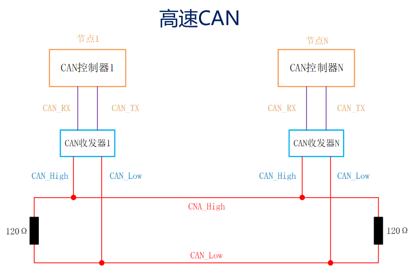

#### **开环总线网络**


#### **通信节点**

从 CAN 通讯网络图可了解到，CAN 总线上可以挂载多个通讯节点，节点之间的信号经过总线传输，实现节点间通讯。由于 CAN 通讯协议不对节点进行地址编码，而是**对数据内容进行编码**的，所以网络中的节点个数理论上不受限制，只要总线的负载足够即可，可以通过中继器增强负载。


CAN 通讯节点由一个 CAN 控制器及 CAN 收发器组成，控制器与收发器之间通过CAN_Tx 及 CAN_Rx 信号线相连，收发器与 CAN 总线之间使用 CAN_High 及 CAN_Low信号线相连。其中 CAN_Tx 及 CAN_Rx 使用普通的类似 TTL 逻辑信号，而 CAN_High 及CAN_Low 是一对差分信号线，使用比较特别的差分信号。当 CAN 节点需要发送数据时，控制器把要发送的二进制编码通过 CAN_Tx 线发送到收发器，然后由收发器把这个普通的逻辑电平信号转化成差分信号，通过差分线
CAN_High 和 CAN_Low 线输出到 CAN 总线网络。而通过收发器接收总线上的数据到控制器时，则是相反的过程，收发器把总线上收到的 CAN_High 及 CAN_Low 信号转化成普通的逻辑电平信号，通过 CAN_Rx 输出到控制器中。


例如，STM32 的 CAN 片上外设就是通讯节点中的控制器，为了构成完整的节点，还要给它外接一个CAN收发器，CAN 控制器与 CAN 收发器的关系如同 TTL 串口与 MAX3232 电平转换芯片的关系，MAX3232 芯片把 TTL 电平的串口信号转换成 RS-232 电平的串口信号，CAN 收发器的作用则是把 CAN 控制器的 TTL 电平信号转换成差分信号(或者相反)。


目前有以下CAN电平转换芯片（不全）


#### **差分信号**

差分信号又称差模信号，与传统使用单根信号线电压表示逻辑的方式有区别，使用差分信号传输时，需要两根信号线，这两个信号线的振幅相等，相位相反，通过两根信号线的电压差值来表示逻辑 0 和逻辑 1。

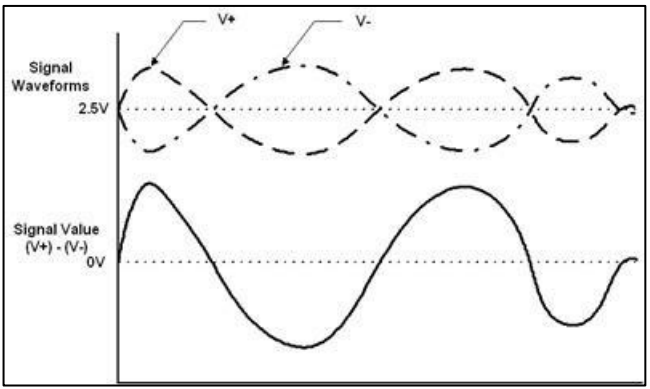

相对于单信号线传输的方式，使用差分信号传输具有如下优点：

* 抗干扰能力强，当外界存在噪声干扰时，几乎会同时耦合到两条信号线上，而接收端只关心两个信号的差值，所以外界的共模噪声可以被完全抵消。
* 能有效抑制它对外部的电磁干扰，同样的道理，由于两根信号的极性相反，他们对外辐射的电磁场可以相互抵消，耦合的越紧密，泄放到外界的电磁能量越少。
* 时序定位精确，由于差分信号的开关变化是位于两个信号的交点，而不像普通单端信号依靠高低两个阈值电压判断，因而受工艺，温度的影响小，能降低时序上的误差，同时也更适合于低幅度信号的电路。

#### **CAN 协议中的差分信号**

CAN 协议中对它使用的 CAN_High 及 CAN_Low 表示的差分信号做了规定。

显性电平具有优先权。发送方通过使总线电平发生变化，将消息发送给接收方。

以高速 CAN 协议为例，当表示**逻辑 1 时(隐性电平)**，CAN_High 和 CAN_Low线上的电压均为 2.5v，即它们的电压差 VH-VL=0V；而表示**逻辑 0 时(显性电平)**，CAN_High 的电平为 3.5V，CAN_Low 线的电平为 1.5V，即它们的电压差为 VH-VL=2V。

例如，当 CAN 收发器从 CAN_Tx 线接收到来自 CAN 控制器的低电平信号时(逻辑 0)，它会使 CAN_High 输出 3.5V，同时 CAN_Low 输出 1.5V，从而输出显性电平表示逻辑 0。


在 CAN 总线中，必须使它处于隐性电平(逻辑 1)或显性电平(逻辑 0)中的其中一个状态。假如有两个 CAN 通讯节点，在同一时间，一个输出隐性电平，另一个输出显性电平，类似 I2C 总线的“线与”特性将使它处于显性电平状态，显性电平的名字就是这样来的，即可以认为显性具有优先的意味。


由于 CAN 总线协议的物理层只有 1 对差分线，在一个时刻只能表示一个信号，所以对通讯节点来说，**CAN 通讯是半双工**的，收发数据需要分时进行。在 CAN 的通讯网络中，因为共用总线，在整个网络中同一时刻只能有一个通讯节点发送信号，其余的节点在该时刻都只能接收。


### CAN协议层

#### **报文(帧)**

在 SPI 通讯中，片选、时钟信号、数据输入及数据输出这 4 个信号都有单独的信号线，I2C 协议包含有时钟信号及数据信号 2 条信号线，异步串口包含接收与发送 2 条信号线，这些协议包含的信号都比 CAN 协议要丰富，它们能轻易进行数据同步或区分数据传输方向。而 CAN 使用的是两条差分信号线，只能表达一个信号，简洁的物理层决定了 CAN 必然要配上一套更复杂的协议，如何用一个信号通道实现同样、甚至更强大的功能呢？CAN协议给出的解决方案是**对数据、操作命令(如读/写)以及同步信号进行打包**，**打包后的这些内容称为报文**。


**报文的种类**

在原始数据段的前面加上传输起始标签、片选(识别)标签和控制标签，在数据的尾段加上 CRC 校验标签、应答标签和传输结束标签，把这些内容按特定的格式打包好，就可以用一个通道表达各种信号了，各种各样的标签就如同 SPI 中各种通道上的信号，起到了协同传输的作用。当整个数据包被传输到其它设备时，只要这些设备按格式去解读，就能还原出原始数据，这样的报文就被称为 CAN 的“数据帧”

| 帧类型                      | 帧作用                                         |
| --------------------------- | ---------------------------------------------- |
| 数据帧（Data Frame）        | 用于发送单元向接收单元传输数据的帧             |
| 遥控帧（Remote Frame）      | 用于接收单元向具有相同ID的发送单元请求数据的帧 |
| 错误帧（Error Frame）       | 用于当检测出错误时向其他单元通知错误的帧       |
| 过载帧（Overload Frame）    | 用于接收单元通知其尚未做好接收准备的帧         |
| 间隔帧（Inter Frame Space） | 用于将数据帧  及遥控帧与前面的帧分离开来的帧   |

#### 数据帧结构


数据帧以一个显性位(逻辑 0)开始，以 7 个连续的隐性位(逻辑 1)结束，在它们之间，分别有仲裁段、控制段、数据段、CRC 段和 ACK 段。

**帧起始：**SOF 段(Start Of Frame)，译为帧起始，帧起始信号只有一个数据位，是一个显性电平，它用于通知各个节点将有数据传输，其它节点通过帧起始信号的电平跳变沿来进行硬同步。


**仲裁段：**当同时有两个报文被发送时，总线会根据仲裁段的内容决定哪个数据包能被传输，这也是它名称的由来。
仲裁段的内容主要为本数据帧的 ID 信息(标识符)，数据帧具有标准格式和扩展格式两种，区别就在于 ID 信息的长度，标准格式的 ID 为 11 位，扩展格式的 ID 为 29 位，它在标准 ID 的基础上多出 18 位。在 CAN 协议中，ID 起着重要的作用，它决定着数据帧发送的优先级，也决定着其它节点是否会接收这个数据帧。CAN 协议不对挂载在它之上的节点分配优先级和地址，对总线的占有权是由信息的重要性决定的，即对于重要的信息，我们会给它打包上一个优先级高的 ID，使它能够及时地发送出去。也正因为它这样的优先级分配原则，使得 CAN 的扩展性大大加强，在总线上增加或减少节点并不影响其它设备。报文的优先级，是通过对 ID 的仲裁来确定的。根据前面对物理层的分析我们知道如果总线上同时出现显性电平和隐性电平，总线的状态会被置为显性电平，CAN 正是利用这个特性进行仲裁。

若两个节点同时竞争 CAN 总线的占有权，当它们发送报文时，若**首先出现隐性电平，则会失去对总线的占有权**，进入接收状态。

两个设备发送的电平一样，所以它们一直继续发送数据。到了图中箭头所指的时序处，节点单元 1 发送的为隐性电平，而此时节点单元 2 发送的为显性电平，由于总线的“线与”特性使它表达出显示电平，因此单元 2 竞争总线成功，这个报文得以被继续发送出去。


仲裁段 ID 的优先级也影响着接收设备对报文的反应。因为在 CAN 总线上数据是以**广播**的形式发送的，**所有连接在 CAN 总线的节点都会收到所有其它节点发出的有效数据，因而我们的 CAN 控制器大多具有根据 ID 过滤报文的功能，它可以控制自己只接收某些 ID的报文。**


RTR 位(Remote Transmission Request Bit)，译作远程传输请求位，它是用于区分数据帧和遥控帧的（0，数据帧；1，远程帧），当它为显性电平时表示数据帧，隐性电平时表示遥控帧。

IDE 位(Identifier Extension Bit)，译作标识符扩展位，它是用于区分标准格式与扩展格式，当它为显性电平时表示标准格式，隐性电平时表示扩展格式。

SRR 位(Substitute Remote Request Bit)，只存在于扩展格式，它用于替代标准格式中的RTR 位。由于扩展帧中的 SRR 位为隐性位，RTR 在数据帧为显性位，所以在两个 ID相同的标准格式报文与扩展格式报文中，标准格式的优先级较高。


**控制段：**在控制段中的 r1 和 r0 为保留位，默认设置为显性位。它最主要的是 DLC 段(Data Length Code)，译为数据长度码，它由 4 个数据位组成，用于表示本报文中的数据段含有多少个字节，DLC 段表示的数字为 0~8。


**数据段：**数据段为数据帧的核心内容，它是节点要发送的原始信息，由 0~8 个字节组成，MSB先行。


**CRC 段：**为了保证报文的正确传输，CAN 的报文包含了一段 15 位的 CRC 校验码，一旦接收节点算出的 CRC 码跟接收到的 CRC 码不同，则它会向发送节点反馈出错信息，利用错误帧请求它重新发送。CRC 部分的计算一般由 CAN 控制器硬件完成，出错时的处理则由软件控制最大重发数。在 CRC 校验码之后，有一个 CRC 界定符，它为隐性位，主要作用是把 CRC 校验码与后面的 ACK 段间隔起来。

**ACK 段：**ACK 段包括一个 ACK 槽位，和 ACK 界定符位。类似 I2C 总线，在 ACK 槽位中，发送节点发送的是隐性位，而接收节点则在这一位中发送显性位以示应答。在 ACK 槽和帧结束之间由 ACK 界定符间隔开。

**帧结束：**EOF 段(End Of Frame)，译为帧结束，帧结束段由发送节点发送的 7 个隐性位表示结束。

#### 其他帧结构


#### CAN 波特率及位同步

由于 CAN 属于异步通讯，没有时钟信号线，连接在同一个总线网络中的各个节点会像串口异步通讯那样，节点间使用约定好的波特率进行通讯，特别地，CAN 还会使用“位同步”的方式来抗干扰、吸收误差，实现对总线电平信号进行正确的采样，确保通讯正常。

##### **位时序**

为了实现位同步，CAN 协议把每一个数据位的时序分解成 SS 段、PTS 段、PBS1 段、PBS2 段，这**四段的长度加起来即为一个 CAN 数据位的长度**。分解后最
小的时间单位是 Tq(Time Quantum)，而一个完整的位由 8~25 个 Tq 组成。为方便表示，图中的高低电平直接代表信号逻辑 0 或逻辑 1(不是差分信号)。

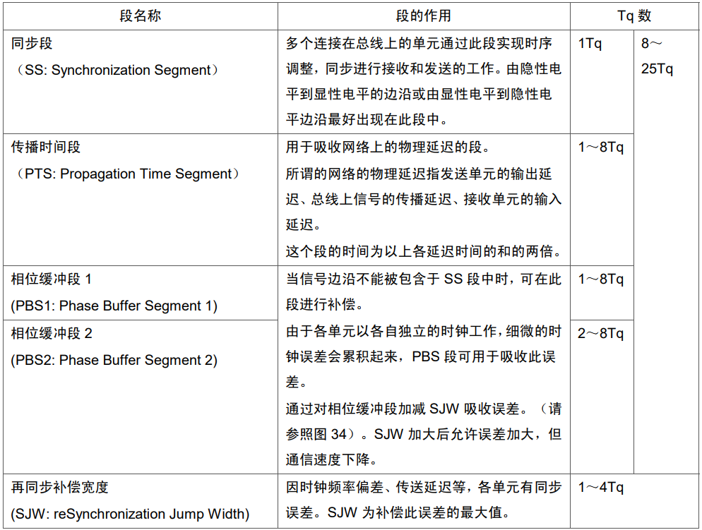


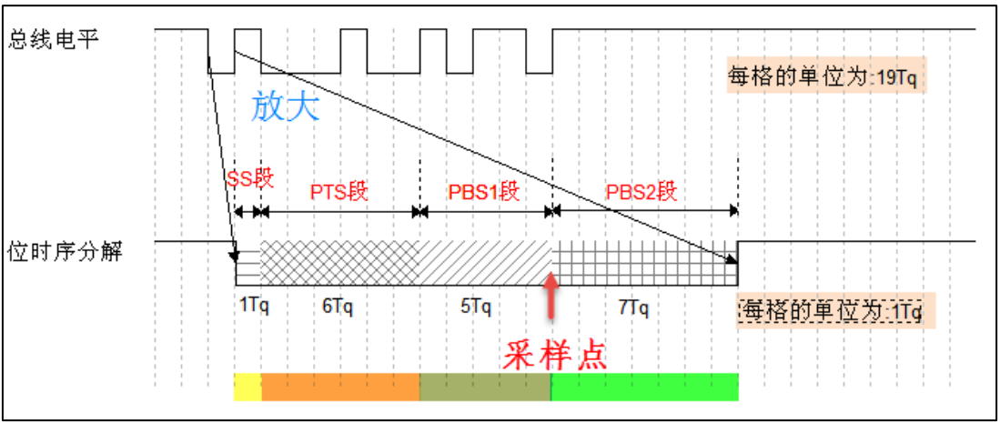

​	该图中表示的 CAN 通讯信号每一个数据位的长度为 19Tq，其中 SS 段占 1Tq，PTS 段占 6Tq，PBS1 段占 5Tq，PBS2 段占 7Tq。信号的采样点位于 PBS1 段与 PBS2 段之间，通过控制各段的长度，可以对采样点的位置进行偏移，以便准确地采样。

* SS 段(SYNC SEG)：SS 译为同步段，若通讯节点检测到总线上信号的跳变沿被包含在 SS 段的范围之内，则表示节点与总线的时序是同步的，当节点与总线同步时，采样点采集到的总线电平即可被确定为该位的电平。SS 段的大小固定为 1Tq。
* PTS 段(PROP SEG)：PTS 译为传播时间段，这个时间段是用于补偿网络的物理延时时间。是总线上输入比较器延时和输出驱动器延时总和的两倍。PTS 段的大小可以为 1~8Tq。
* PBS1 段(PHASE SEG1)：PBS1 译为相位缓冲段，主要用来补偿边沿阶段的误差，它的时间长度在重新同步的时候可以加长。PBS1 段的初始大小可以为 1~8Tq。
* PBS2 段(PHASE SEG2)：PBS2 这是另一个相位缓冲段，也是用来补偿边沿阶段误差的，它的时间长度在重新同步时可以缩短。PBS2 段的初始大小可以为 2~8Tq。

##### **通讯的波特率**

总线上的各个通讯节点只要约定好 1 个 Tq 的时间长度以及每一个数据位占据多少个Tq，就可以确定 CAN 通讯的波特率。
例如，假设上图中的 1Tq=1us，而每个数据位由 19 个 Tq 组成，则传输一位数据需要时间 T1bit =19us，从而每秒可以传输的数据位个数为：$1000000ns/19us = 52631.6bps$

这个每秒可传输的数据位的个数即为通讯中的波特率。

##### **同步过程分析**

波特率只是约定了每个数据位的长度，数据同步还涉及到相位的细节，这个时候就需要用到数据位内的 SS、PTS、PBS1 及 PBS2 段了。根据对段的应用方式差异，CAN 的数据同步分为硬同步和重新同步。其中硬同步只是当存在“帧起始信号”时起作用，无法确保后续一连串的位时序都是同步的，而重新同步方式可解决该问题，这两种方式具体介绍如下：


**硬件同步：** 节点通过CAN总线发送数据，一开始发送帧起始信号。总线上其他节点会检测帧起始信号在不在位数据的SS段内，判断内部时序与总线是否同步。 假如不在SS段内，这种情况下，采样点获得的电平状态是不正确的。所以，节点会使用硬件同步方式调整， 把自己的SS段平移到检测到边沿的地方，获得同步，同步情况下，采样点获得的电平状态才是正确的。

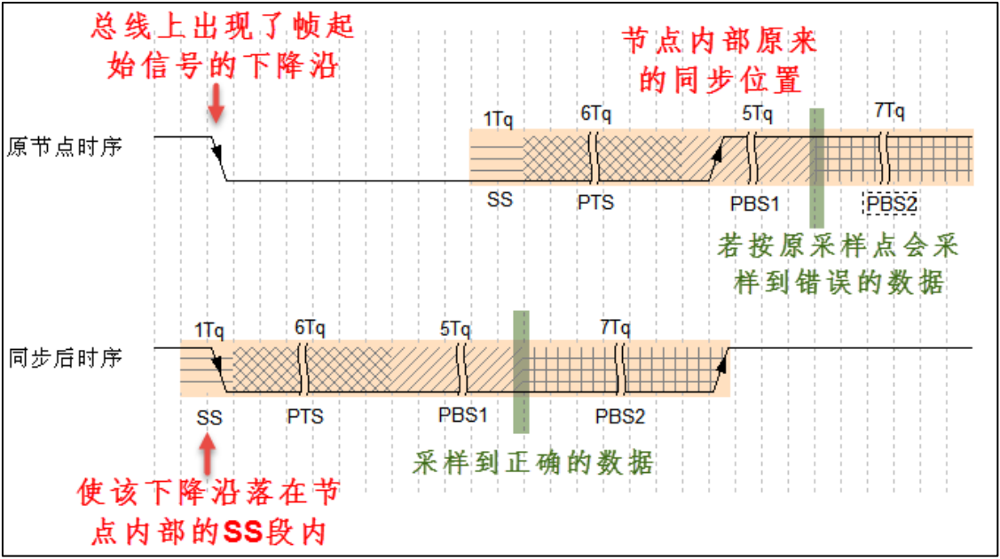

**重新同步：**前面的硬同步只是当存在帧起始信号时才起作用，如果在一帧很长的数据内，节点信号与总线信号相位有偏移时，这种同步方式就无能为力了。因而需要引入重新同步方式，它利用普通数据位的高至低电平的跳变沿来同步(帧起始信号是特殊的跳变沿)。重新同步与硬同步方式相似的地方是它们都使用 SS 段来进行检测，同步的目的都是使节点内的 SS段把跳变沿包含起来。


重新同步的方式分为超前和滞后两种情况，以总线跳变沿与 SS 段的相对位置进行区分。第一种相位超前的情况如图，节点从总线的边沿跳变中，检测到它内部的时序比总线的时序相对超前 2Tq，这时控制器在下一个位时序中的 PBS1 段增加 2Tq 的时间长度，使得节点与总线时序重新同步。


第二种相位滞后的情况如图，节点从总线的边沿跳变中，检测到它的时序比总线的时序相对滞后 2Tq，这时控制器在**前一个位时序**中的 PBS2 段减少 2Tq 的时间长度，获得同步。

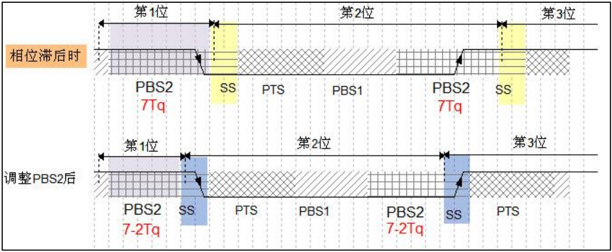

在重新同步的时候，PBS1 和 PBS2 中增加或减少的这段时间长度被定义为“**重新同步补偿宽度 SJW (reSynchronization Jump Width)**”。一般来说 CAN 控制器会限定 SJW 的最大值，如限定了最大 SJW=3Tq 时，单次同步调整的时候不能增加或减少超过 3Tq 的时间长度，若有需要，控制器会通过多次小幅度调整来实现同步。当控制器设置的 SJW 极限值较大时，可以吸收的误差加大，但通讯的速度会下降。


## STM32 CAN 外设

STM32 的芯片中具有 bxCAN 控制器 (Basic Extended CAN)，它支持 CAN 协议 2.0A 和2.0B 标准。该 CAN 控制器支持最高的通讯速率为 1Mb/s；可以自动地接收和发送 CAN 报文，支持使用标准 ID 和扩展 ID 的报文；外设中具有 3 个发送邮箱，发送报文的优先级可以使用软件控制，还可以记录发送的时间；具有 2 个 3 级深度的接收 FIFO，可使用过滤功能只接收或不接收某些 ID 号的报文；可变的过滤器组（最多 28 个）;可配置成自动重发；不支持使用 DMA 进行数据收发。

CAN2 无法直接访问存储区域，所以使用 CAN2 的时候必须使能 CAN1 外设的时钟。在 STM32 互联型产品中，带有 2 个 CAN 控制器，而我们使用的STM32F103ZET6 属于增强型，不是互联型，只有 1 个 CAN 控制器。


### CAN 控制内核

CAN 控制内核包含了各种控制寄存器及状态寄存器

**CAN主控制寄存器 (CAN_MCR)** 

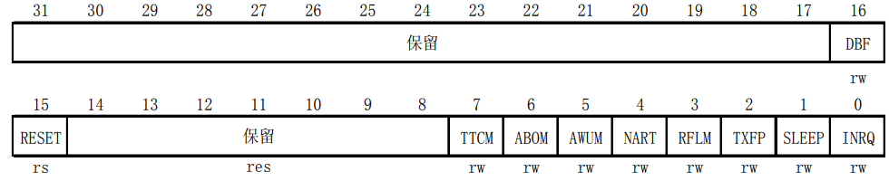

(1) DBF 调试冻结功能
	DBF(Debug freeze)调试冻结，使用它可设置 CAN 处于工作状态或禁止收发的状态，禁止收发时仍可访问接收 FIFO 中的数据。这两种状态是当 STM32 芯片处于程序调试模式时才使用的，平时使用并不影响。
(2) TTCM 时间触发模式
	TTCM(Time triggered communication mode)时间触发模式，它用于配置 CAN 的时间触发通信模式，在此模式下，CAN 使用它内部定时器产生时间戳，并把它保存在CAN_RDTxR、CAN_TDTxR 寄存器中。内部定时器在每个 CAN 位时间累加，在接收和发送的帧起始位被采样，并生成时间戳。利用它可以实现 ISO 11898-4 CAN 标准的分时同步通信功能。
(3) ABOM 自动离线管理
	ABOM(Automatic bus-off management) 自动离线管理，它用于设置是否使用自动离线管理功能。当节点检测到它发送错误或接收错误超过一定值时，会自动进入离线状态，在离线状态中，CAN 不能接收或发送报文。处于离线状态的时候，可以软件控制恢复或者直接使用这个自动离线管理功能，它会在适当的时候自动恢复。
(4) AWUM 自动唤醒
	AWUM(Automatic bus-off management)，自动唤醒功能，CAN 外设可以使用软件进入低功耗的睡眠模式，如果使能了这个自动唤醒功能，当 CAN 检测到总线活动的时候，会自动唤醒。
(5) NART 自动重传
	NART(No automatic retransmission)报文自动重传功能，设置这个功能后，当报文发送失败时会自动重传至成功为止。若不使用这个功能，无论发送结果如何，消息只发送一次。
(6) RFLM 锁定模式
	RFLM(Receive FIFO locked mode)FIFO 锁定模式，该功能用于锁定接收 FIFO。锁定后，当接收 FIFO 溢出时，会丢弃下一个接收的报文。若不锁定，则下一个接收到的报文会覆盖原报文。
(7) TXFP 报文发送优先级的判定方法
	TXFP(Transmit FIFO priority)报文发送优先级的判定方法，当 CAN 外设的发送邮箱中有多个待发送报文时，本功能可以控制它是根据报文的 ID 优先级还是报文存进邮箱的顺序来发送。


**位时序寄存器(CAN_BTR)及波特率**

CAN 外设中的位时序寄存器 CAN_BTR 用于配置测试模式、波特率以及各种位内的段参数。


(1) CAN控制器模式：为方便调试，STM32 的 CAN 提供了测试模式，配置位时序寄存器 CAN_BTR 的 SILM及 LBKM 寄存器位可以控制使用正常模式、静默模式、回环模式及静默回环模式

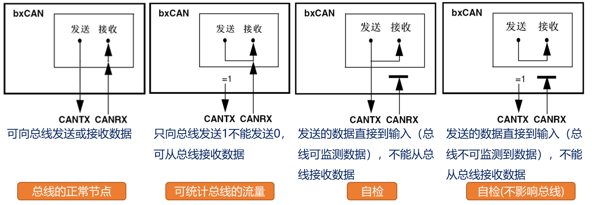

(2) 位时序及波特率：STM32 外设定义的位时序与前面的 CAN 标准时序有一点区别


STM32 的 CAN 外设位时序中只包含 3 段，分别是同步段 SYNC_SEG、位段 BS1 及位段 BS2，采样点位于 BS1 及 BS2 段的交界处。其中 SYNC_SEG 段固定长度为 1Tq，而BS1 及 BS2 段可以在位时序寄存器 CAN_BTR 设置它们的时间长度，它们可以在重新同步期间增长或缩短，该长度 SJW 也可在位时序寄存器中配置。理解 STM32 的 CAN 外设的位时序时，可以把它的 BS1 段理解为是由前面介绍的CAN 标准协议中 PTS 段与 PBS1 段合在一起的，而 BS2 段就相当于 PBS2 段。

通过配置位时序寄存器 CAN_BTR 的TS1[3:0]及 TS2[2:0]寄存器位设定 BS1 及 BS2 段的长度后，我们就可以确定每个 CAN 数据位的时间：

BS1 段时间：$T_{S1}=Tq*(TS1[3:0] + 1)$

BS2 段时间：$T_{S2}= Tq * (TS2[2:0] + 1)$

一个数据位的时间：$T_{1bit} =1Tq+T_{S1}+T_{S2} =1+ (TS1[3:0] + 1)+ (TS2[2:0] + 1)= N Tq$


其中单个时间片的长度 Tq 与 CAN 外设的所挂载的时钟总线及分频器配置有关，**CAN1 和 CAN2 外设都是挂载在 APB1 总线上**的，而位时序寄存器 CAN_BTR 中的 BRP[9:0]寄存器位可以设置 CAN 外设时钟的分频值 ，所以：$Tq = (BRP[9:0]+1) * T_{PCLK}$  其中的 PCLK 指 APB1 时钟，默认值为 36MHz。

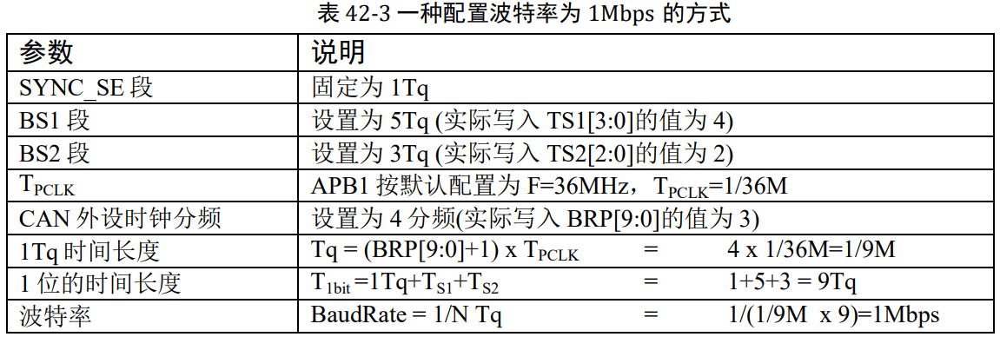

### CAN 发送邮箱

一共有 3个发送邮箱，即最多可以缓存 3 个待发送的报文。

每个发送邮箱中包含有标识符寄存器 CAN_TIxR、数据长度控制寄存器 CAN_TDTxR及 2 个数据寄存器 CAN_TDLxR、CAN_TDHxR

**发送邮箱标识符寄存器 (CAN_TIxR) (x=0..2)**


CAN 的标准标识符的总位数为 11 位，而扩展标识符的总位数为 29 位。当报文使用扩展标识符的时候，标识符寄存器 CAN_TIxR 中的 STDID[10:0]等效于 EXTID[18:28]位，它与 EXTID[17:0]共同组成完整的 29 位扩展标识符。

该寄存器主要用来设置标识符（包括扩展标识符），另外还可以设置帧类型，通过 TXRQ 置1，来请求邮箱发送。因为有 3 个发送邮箱，所以寄存器 CAN_TIxR 有 3 个。

**CAN 发送邮箱数据长度和时间戳寄存器(CAN_TDTxR)**

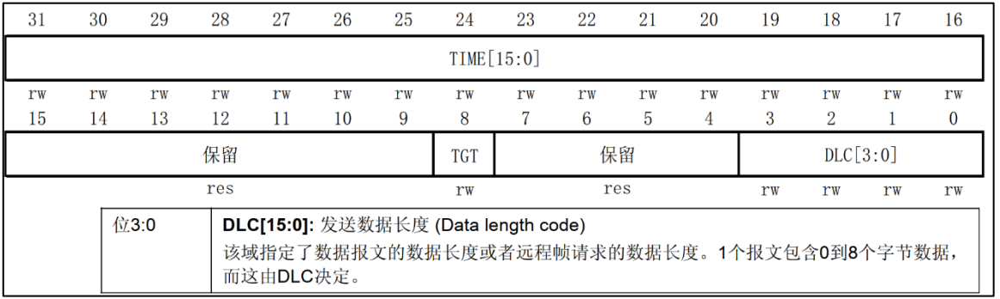

**CAN 发送邮箱低字节数据寄存器(CAN_TDLxR)**

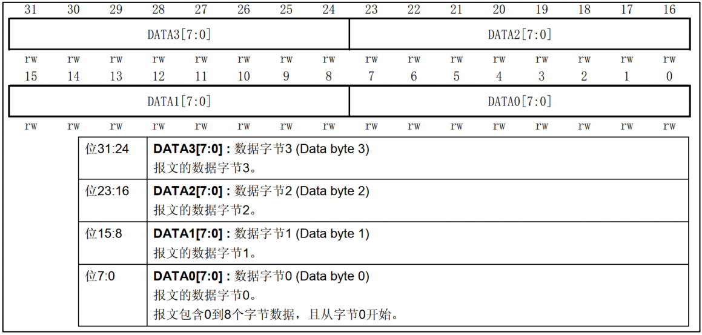

该寄存器用来存储将要发送的数据，这里只能存储低 4 个字节，另外还有一个寄存器CAN_TDHxR，该寄存器用来存储高 4 个字节，这样总共就可以存储 8 个字节。

### CAN 接收 FIFO

它一共有 2 个接收 FIFO，每个 FIFO 中有 3 个邮箱，即最多可以缓存 6 个接收到的报文。当接收到报文时，FIFO 的报文计数器会自增，而 STM32 内部读取 FIFO 数据之后，报文计数器会自减，我们通过状态寄存器可获知报文计数器的值，而通过前面主控制寄存器的 RFLM 位，可设置锁定模式，锁定模式下 FIFO 溢出时会丢弃新报文，非锁定模式下 FIFO 溢出时新报文会覆盖旧报文。


跟发送邮箱类似，每个接收 FIFO 中包含有标识符寄存器 CAN_RIxR、数据长度控制寄存器 CAN_RDTxR 及 2 个数据寄存器 CAN_RDLxR、CAN_RDHxR

通过中断或状态寄存器知道接收 FIFO 有数据后，我们再读取这些寄存器的值即可把接收到的报文加载到 STM32 的内存中。

### 验收筛选器

设置接收哪些信息

一共有 28 个筛选器组，每个筛选器组有 2 个寄存器，CAN1 和 CAN2 共用的筛选器的。其中STM32F103 系列芯片仅有 14 个筛选器组：0-13 号。
在 CAN 协议中，消息的标识符与节点地址无关，但与消息内容有关。因此，发送节点将报文广播给所有接收器时，接收节点会根据报文标识符的值来确定软件是否需要该消息，为了简化软件的工作，STM32 的 CAN 外设接收报文前会先使用验收筛选器检查，只接收需要的报文到 FIFO 中。


筛选器工作的时候，可以调整筛选 ID 的长度及过滤模式。根据筛选 ID 长度来分类有有以下两种：

| 过滤器组Reg | 32位                               | 16位（寄存器由两部分组成）          |
| ----------- | ---------------------------------- | ----------------------------------- |
| CAN_FxR1    | STDID[10:0]、EXTID[17:0]、IDE、RTR | STDID[10:0]、EXTID[17:15]、IDE、RTR |
| CAN_FxR2    | STDID[10:0]、EXTID[17:0]、IDE、RTR | STDID[10:0]、EXTID[17:15]、IDE、RTR |

通过配置筛选尺度寄存器 CAN_FS1R 的 FSCx 位可以设置筛选器工作在哪个尺度。

而根据过滤的方法分为以下两种模式：

* 标识符列表模式，它把要接收报文的 ID 列成一个表，要求报文 ID 与列表中的某一个标识符完全相同才可以接收，可以理解为白名单管理。

* 掩码模式，它把可接收报文 ID 的某几位作为列表，这几位被称为掩码，可以把它理解成关键字搜索，只要掩码(关键字)相同，就符合要求，报文就会被保存到接收 FIFO。

  通过配置筛选尺度寄存器 CAN_FS1R 的 FSCx 位可以设置筛选器工作在哪个尺度。

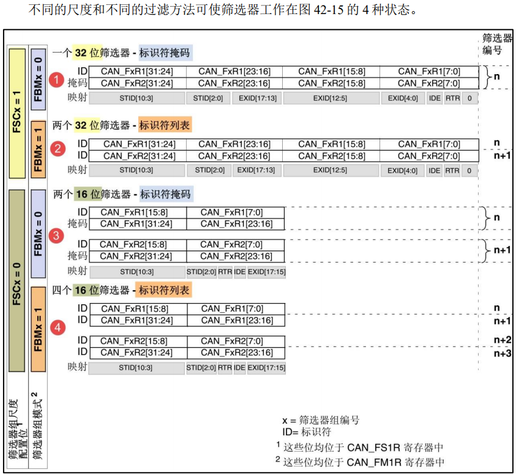

每组筛选器包含 2 个 32 位的寄存器，分别为 CAN_FxR1 和 CAN_FxR2，它们用来存储要筛选的 ID 或掩码


例如下面的表格所示，在掩码模式时，第一个寄存器存储要筛选的 ID，第二个寄存器存储掩码，掩码为 1 的部分表示该位必须与 ID 中的内容一致，筛选的结果为表中第三行的ID 值，它是一组包含多个的 ID 值，其中 x 表示该位可以为 1 可以为 0。

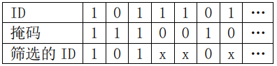

而工作在标识符模式时，2 个寄存器存储的都是要筛选的 ID，它只包含 2 个要筛选的ID 值(32 位模式时)。如果使能了筛选器，且报文的 ID 与所有筛选器的配置都不匹配，CAN 外设会丢弃该报文，不存入接收 FIFO。


**CAN 过滤器模式寄存器（CAN_FM1R）**

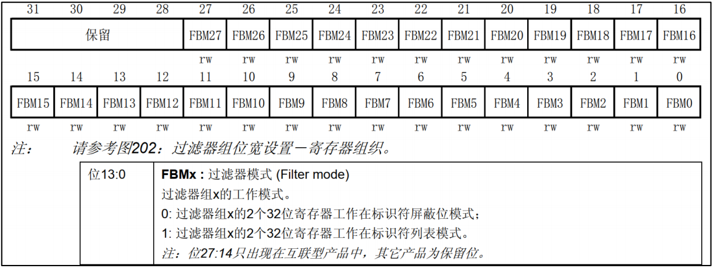

该寄存器用于设置各过滤器组的工作模式，对 28 个过滤器组的工作模式，都可以通过该寄存器设置，不过该寄存器必须在过滤器处于初始化模式下（CAN_FMR 的 FINIT 位=1），才可以进行设置。对 STM32F103ZET6 来说，只有[13:0]这 14 个位有效。

**CAN 过滤器位宽寄存器(CAN_FS1R)**

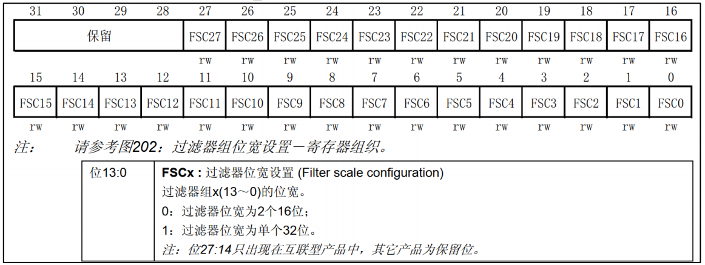

**CAN 过滤器 FIFO 关联寄存器（CAN_FFA1R）**


该寄存器设置报文通过过滤器组之后，被存入的 FIFO，如果对应位为 0，则存放到 FIFO0；如果为 1，则存放到 FIFO1。该寄存器也只能在过滤器处于初始化模式下配置。

**CAN 过滤器激活寄存器（CAN_FA1R）**

对对应位置 1，即开启对应的过滤器组；置 0 则关闭该过滤器组。

**CAN 的过滤器组 i 的寄存器 x（CAN_FiRx）**


每个过滤器组的 CAN_FiRx 都由 2 个 32 位寄存器构成，即：CAN_FiR1 和 CAN_FiR2。根据过滤器位宽和模式的不同设置，这两个寄存器的功能也不尽相同。关


## HAL库

### 常用函数

|              驱动函数              |         关联寄存器         |             功能描述              |
| :--------------------------------: | :------------------------: | :-------------------------------: |
|    __HAL_RCC_CANx_CLK_ENABLE(…)    |                            |            使能CAN时钟            |
|          HAL_CAN_Init(…)           |         MCR / BTR          |             初始化CAN             |
|      HAL_CAN_ConfigFilter(…)       |        过滤器寄存器        |         配置CAN接收过滤器         |
|          HAL_CAN_Start(…)          |         MCR / MSR          |            启动CAN设备            |
|  HAL_CAN_ActivateNotification(…)   |            IER             |             使能中断              |
|       __HAL_CAN_ENABLE_IT(…)       |            IER             |          使能CAN中断允许          |
|      HAL_CAN_AddTxMessage(…)       | TSR/TIxR/TDTxR/TDLxR/TDHxR |             发送消息              |
| HAL_CAN_GetTxMailboxesFreeLevel(…) |            TSR             | 等待发送完成 ,返回值为3时发送完成 |
|   HAL_CAN_GetRxFifoFillLevel(…)    |         RF0R/RF1R          |           等待接收完成            |
|      HAL_CAN_GetRxMessage(…)       |   RF0R/RF1R/RDLxR/RDHxR    |             接收消息              |

````c
/**	发送数据
*	参数1：CAN句柄
*	参数2：CAN TX句柄
*	参数3：输出的数据
*	参数4：使用的发送邮箱：CAN_TX_MAILBOX0、CAN_TX_MAILBOX1、CAN_TX_MAILBOX2
**/
HAL_StatusTypeDef HAL_CAN_AddTxMessage(CAN_HandleTypeDef *hcan, CAN_TxHeaderTypeDef *pHeader, uint8_t aData[], uint32_t *pTxMailbox);
/**	等待接收完成
*	参数1：CAN句柄
*	参数2：接收用的FIFO:CAN_RX_FIFO0、CAN_RX_FIFO1
**/
uint32_t HAL_CAN_GetRxFifoFillLevel(CAN_HandleTypeDef *hcan, uint32_t RxFifo);
/**	接收数据
*	参数1：CAN句柄
*	参数2：接收用的FIFO:CAN_RX_FIFO0、CAN_RX_FIFO1
*	参数3：CAN RX句柄
*	参数4：接收到的数据
**/
HAL_StatusTypeDef HAL_CAN_GetRxMessage(CAN_HandleTypeDef *hcan, uint32_t RxFifo, CAN_RxHeaderTypeDef *pHeader, uint8_t aData[]); 
````

**初始化**

````c
typedef struct __CAN_HandleTypeDef{
    CAN_TypeDef                 *Instance;			/* CAN1/CAN2 */
    CAN_InitTypeDef             Init;
} CAN_HandleTypeDef;
typedef struct{
    uint32_t Prescaler				/* 预分频 范围: 1~1024*/
    uint32_t Mode					/* 配置 CAN 的工作模式，回环或正常模式 */
    uint32_t SyncJumpWidth			/* 配置 SJW 极限值 */
    uint32_t TimeSeg1				/* 时间段1(BS1)长度 */
    uint32_t TimeSeg2				/* 时间段1(BS1)长度 */
    uint32_t TimeTriggeredMode		/* 是否使能 TTCM 时间触发功能 */
    uint32_t AutoBusOff				/* 是否使能 ABOM 自动离线管理功能 */
    uint32_t AutoWakeUp				/* 是否使能 AWUM 自动唤醒功能 */
    uint32_t AutoRetransmission 	/* 是否使能 NART 自动重传功能 */
    uint32_t ReceiveFifoLocked		/* 是否使能 RFLM 锁定 FIFO 功能 */
    uint32_t TransmitFifoPriority	/*  传输FIFO优先级 */
} CAN_InitTypeDef;
````

(1) Prescaler

本成员设置 CAN 外设的时钟分频，它可控制时间片 Tq 的时间长度，这里设置的值最终会减 1 后再写入 BRP 寄存器位，即前面介绍的 Tq 计算公式：

Tq = (BRP[9:0]+1) x TPCLK等效于：Tq = CAN_Prescaler x TPCLK

(2) Mode

本成员设置 CAN 的工作模式，可设置为正常模式 (CAN_MODE_NORMAL)、回环模式 (CAN_MODE_LOOPBACK)、静默模式 (CAN_MODE_SILENT) 以及回环静默模式(CAN_MODE_SILENT_LOOPBACK)。

(3) SyncJumpWidth

本成员可以配置 SJW 的极限长度，即 CAN 重新同步时单次可增加或缩短的最大长度，它可以被配置为 1-4Tq(CAN_SJW_1/2/3/4tq)。

(4) TimeSeg1

本成员用于设置 CAN 位时序中的 BS1 段的长度，它可以被配置为 1-16 个 Tq 长度(CAN_BS1_1/2/3…16tq)。

(5) TimeSeg2

本成员用于设置 CAN 位时序中的 BS2 段的长度，它可以被配置为 1-8 个 Tq 长度(CAN_BS2_1/2/3…8tq)。SYNC_SEG、 BS1 段及 BS2 段的长度加起来即一个数据位的长度，即前面介绍的原来

计算公式：T1bit =1Tq+TS1+TS2=1+ (TS1[3:0] + 1)+ (TS2[2:0] + 1)

等效于：T1bit= 1Tq+CAN_BS1+CAN_BS2

(6) TimeTriggeredMode

本成员用于设置是否使用时间触发功能 (ENABLE/DISABLE)，时间触发功能在某些CAN 标准中会使用到。

(7) AutoBusOff

本成员用于设置是否使用自动离线管理 (ENABLE/DISABLE)，使用自动离线管理可以在节点出错离线后适时自动恢复，不需要软件干预。

(8) AutoWakeUp

本成员用于设置是否使用自动唤醒功能 (ENABLE/DISABLE)，使能自动唤醒功能后它会在监测到总线活动后自动唤醒。

(9) AutoWakeUp

本成员用于设置是否使用自动离线管理功能 (ENABLE/DISABLE)，使用自动离线管理可以在出错时离线后适时自动恢复，不需要软件干预。

(10) AutoRetransmission

本成员用于设置是否使用自动重传功能 (ENABLE/DISABLE)，使用自动重传功能时，会一直发送报文直到成功为止。

(11) ReceiveFifoLocked

本成员用于设置是否使用锁定接收 FIFO(ENABLE/DISABLE)，锁定接收 FIFO 后，若FIFO 溢出时会丢弃新数据，否则在 FIFO 溢出时以新数据覆盖旧数据。

(12) TransmitFifoPriority

本成员用于设置发送报文的优先级判定方法 (ENABLE/DISABLE)，使能时，以报文存入发送邮箱的先后顺序来发送，否则按照报文 ID 的优先级来发送。配置完这些结构体成员后，我们调用库函数 HAL_CAN_Init 即可把这些参数写入到 CAN 控制寄存器中，实现 CAN 的初始化


**CAN 发送及接收结构体**

````c
typedef struct{
    uint32_t StdId;	/* 存储报文的标准标识符 11 位，0-0x7FF. */
    uint32_t ExtId;	/* 存储报文的扩展标识符 29 位，0-0x1FFFFFFF. */
    uint32_t IDE;   /* 存储 IDE 扩展标志 */
    uint32_t RTR	/* 存储 RTR 远程帧标志 */
    uint32_t DLC;   /* 存储报文数据段的长度，0-8 */
    FunctionalState TransmitGlobalTime; 
} CAN_TxHeaderTypeDef;
typedef struct{
    uint32_t StdId;	/* 存储报文的标准标识符 11 位，0-0x7FF. */
    uint32_t ExtId;	/* 存储报文的扩展标识符 29 位，0-0x1FFFFFFF. */
    uint32_t IDE;   /* 存储 IDE 扩展标志 */
    uint32_t RTR;	/* 存储 RTR 远程帧标志 */
    uint32_t DLC;   /* 存储报文数据段的长度，0-8 */
    uint32_t Timestamp; 
    uint32_t FilterMatchIndex; 
} CAN_RxHeaderTypeDef;
````

(1) StdId

本成员存储的是报文的 11 位标准标识符，范围是 0-0x7FF。

(2) ExtId

本成员存储的是报文的 29 位扩展标识符，范围是 0-0x1FFFFFFF。ExtId 与 StdId 这两个成员根据下面的 IDE 位配置，只有一个是有效的。

(3) IDE

本成员存储的是扩展标志 IDE 位，当它的值为宏 CAN_ID_STD 时表示本报文是标准帧，使用 StdId 成员存储报文 ID；当它的值为宏 CAN_ID_EXT 时表示本报文是扩展帧，使用 ExtId 成员存储报文 ID。

(4) RTR

本成员存储的是报文类型标志 RTR 位，当它的值为宏 CAN_RTR_Data 时表示本报文是数据帧；当它的值为宏 CAN_RTR_Remote 时表示本报文是遥控帧，由于遥控帧没有数据段，所以当报文是遥控帧时，数据是无效的

(5) DLC

本成员存储的是数据帧数据段的长度，它的值的范围是 0-8，当报文是遥控帧时 DLC值为 0。


**CAN 筛选器结构体**

````c
typedef struct{
    uint32_t FilterIdHigh			/* ID高字节 */
    uint32_t FilterIdLow			/* ID低字节 */
    uint32_t FilterMaskIdHigh	 	/* 掩码高字节 */
    uint32_t FilterMaskIdLow		/* 掩码低字节 */
    uint32_t FilterFIFOAssignment	/* 过滤器关联FIFO */
    uint32_t FilterBank				/* 选择过滤器组 */
    uint32_t FilterMode				/* 过滤器模式*/
    uint32_t FilterScale			/* 过滤器位宽 */
    uint32_t FilterActivation		/* 过滤器使能 */
    Uint32_t SlaveStartFilterBank 	/* 从CAN选择启动过滤器组 单CAN没有意义*/
} CAN_FilterTypeDef;
````

(1) FilterIdHigh

FilterIdHigh 成员用于存储要筛选的 ID，若筛选器工作在 32 位模式，它存储的是所筛选 ID 的高 16 位；若筛选器工作在 16 位模式，它存储的就是一个完整的要筛选的 ID。

(2) FilterIdLow

类似地，FilterIdLow 成员也是用于存储要筛选的 ID，若筛选器工作在 32 位模式，它存储的是所筛选 ID 的低 16 位；若筛选器工作在 16 位模式，它存储的就是一个完整的要筛选的 ID。

(3) FilterMaskIdHigh

FilterMaskIdHigh 存储的内容分两种情况，当筛选器工作在标识符列表模式时，它的功能与 FilterIdHigh 相同，都是存储要筛选的 ID；而当筛选器工作在掩码模式时，它存储的是 FilterIdHigh 成员对应的掩码，与 FilterIdLow 组成一组筛选器。

(4) FilterMaskIdLow

类似地， FilterMaskIdLow 存储的内容也分两种情况，当筛选器工作在标识符列表模式时，它的功能与 FilterIdLow 相同，都是存储要筛选的 ID；而当筛选器工作在掩码模式时，它存储的是 FilterIdLow 成员对应的掩码，与 FilterIdLow 组成一组筛选器。

|   过滤器配置模式   | CAN_FxR1[31:16] | CAN_FxR1[15:0] | CAN_FxR2[31:16]  | CAN_FxR2[15:0]  |
| :----------------: | :-------------: | :------------: | :--------------: | :-------------: |
| 32位标识符屏蔽模式 |  FilterIdHigh   |  FilterIdLow   | FilterMaskIdHigh | FilterMaskIdLow |
| 32位标识符列表模式 |  FilterIdHigh   |  FilterIdLow   | FilterMaskIdHigh | FilterMaskIdLow |
| 16位标识符屏蔽模式 | FilterMaskIdLow |  FilterIdLow   | FilterMaskIdHigh |  FilterIdHigh   |
| 16位标识符列表模式 | FilterMaskIdLow |  FilterIdLow   | FilterMaskIdHigh |  FilterIdHigh   |

(5) CAN_FilterFIFOAssignment
本成员用于设置当报文通过筛选器的匹配后，该报文会被存储到哪一个接收 FIFO，它的可选值为 FIFO0 或 FIFO1(宏 CAN_Filter_FIFO0/1)。
(6) CAN_FilterNumber
本成员用于设置筛选器的编号，即本过滤器结构体配置的是哪一组筛选器，CAN 一共有 28 个筛选器，所以它的可输入参数范围为 0-27(STM32F103 系列芯片的可输入参数为 0-13)。

(7) CAN_FilterMode
本成员用于设置筛选器的工作模式，可以设置为列表模式(宏 CAN_FilterMode_IdList)及掩码模式(宏 CAN_FilterMode_IdMask)。
(8) CAN_FilterScale
本成员用于设置筛选器的尺度，可以设置为 32 位长(宏 CAN_FilterScale_32bit)及 16 位长(宏 CAN_FilterScale_16bit)。
(9) CAN_FilterActivation
本成员用于设置是否激活这个筛选器(宏 ENABLE/DISABLE)。

### 案例

使用CAN1，PA11PA12,进行回环传输数据

````c
#define CAN_RX_GPIO_PORT                GPIOA
#define CAN_RX_GPIO_PIN                 GPIO_PIN_11
#define CAN_RX_GPIO_CLK_ENABLE()        do{ __HAL_RCC_GPIOA_CLK_ENABLE(); }while(0)   /* PA口时钟使能 */
#define CAN_TX_GPIO_PORT                GPIOA
#define CAN_TX_GPIO_PIN                 GPIO_PIN_12
#define CAN_TX_GPIO_CLK_ENABLE()        do{ __HAL_RCC_GPIOA_CLK_ENABLE(); }while(0)   /* PA口时钟使能 */
/* CAN接收RX0中断使能 */
#define CAN_RX0_INT_ENABLE      0               /* 0,不使能; 1,使能; */


CAN_HandleTypeDef   g_canx_handler;     /* CANx句柄 */
CAN_TxHeaderTypeDef g_canx_txheader;    /* 发送参数句柄 */
CAN_RxHeaderTypeDef g_canx_rxheader;    /* 接收参数句柄 */
/**
 * @brief       CAN初始化
 * @param       tsjw    : 重新同步跳跃时间单元.范围: 1~3;
 * @param       tbs2    : 时间段2的时间单元.范围: 1~8;
 * @param       tbs1    : 时间段1的时间单元.范围: 1~16;
 * @param       brp     : 波特率分频器.范围: 1~1024;
 *   @note      以上4个参数, 在函数内部会减1, 所以, 任何一个参数都不能等于0
 *              CAN挂在APB1上面, 其输入时钟频率为 Fpclk1 = PCLK1 = 36Mhz
 *              tq     = brp * tpclk1;
 *              波特率 = Fpclk1 / ((tbs1 + tbs2 + 1) * brp);
 *              我们设置 can_init(1, 8, 9, 4, 1), 则CAN波特率为:
 *              36M / ((8 + 9 + 1) * 4) = 500Kbps
 *
 * @param       mode    : CAN_MODE_NORMAL,  普通模式;
                          CAN_MODE_LOOPBACK,回环模式;
 * @retval      0,  初始化成功; 其他, 初始化失败;
 */
uint8_t can_init(uint32_t tsjw, uint32_t tbs2, uint32_t tbs1, uint16_t brp, uint32_t mode){
  g_canx_handler.Instance = CAN1;
  g_canx_handler.Init.Prescaler = brp;                /* 分频系数(Fdiv)为brp+1 */
  g_canx_handler.Init.Mode = mode;                    /* 模式设置 */
  g_canx_handler.Init.SyncJumpWidth = tsjw;           /* 重新同步跳跃宽度(Tsjw)为tsjw+1个时间单位 CAN_SJW_1TQ~CAN_SJW_4TQ */
  g_canx_handler.Init.TimeSeg1 = tbs1;                /* tbs1范围CAN_BS1_1TQ~CAN_BS1_16TQ */
  g_canx_handler.Init.TimeSeg2 = tbs2;                /* tbs2范围CAN_BS2_1TQ~CAN_BS2_8TQ */
  g_canx_handler.Init.TimeTriggeredMode = DISABLE;    /* 非时间触发通信模式 */
  g_canx_handler.Init.AutoBusOff = DISABLE;           /* 软件自动离线管理 */
  g_canx_handler.Init.AutoWakeUp = DISABLE;           /* 睡眠模式通过软件唤醒(清除CAN->MCR的SLEEP位) */
  g_canx_handler.Init.AutoRetransmission = ENABLE;    /* 禁止报文自动传送 */
  g_canx_handler.Init.ReceiveFifoLocked = DISABLE;    /* 报文不锁定,新的覆盖旧的 */
  g_canx_handler.Init.TransmitFifoPriority = DISABLE; /* 优先级由报文标识符决定 */
  if (HAL_CAN_Init(&g_canx_handler) != HAL_OK){
    return 1;
  }
#if CAN_RX0_INT_ENABLE
  /* 使用中断接收 */
  __HAL_CAN_ENABLE_IT(&g_canx_handler, CAN_IT_RX_FIFO0_MSG_PENDING); /* FIFO0消息挂号中断允许 */
  HAL_NVIC_EnableIRQ(USB_LP_CAN1_RX0_IRQn);                          /* 使能CAN中断 */
  HAL_NVIC_SetPriority(USB_LP_CAN1_RX0_IRQn, 1, 0);                  /* 抢占优先级1，子优先级0 */
#endif

  CAN_FilterTypeDef sFilterConfig;
  /* 配置CAN过滤器 不使用任何过滤*/
  sFilterConfig.FilterBank = 0;                             /* 过滤器0 */
  sFilterConfig.FilterMode = CAN_FILTERMODE_IDMASK;
  sFilterConfig.FilterScale = CAN_FILTERSCALE_32BIT;
  sFilterConfig.FilterIdHigh = 0x0000;                      /* 32位ID */
  sFilterConfig.FilterIdLow = 0x0000;
  sFilterConfig.FilterMaskIdHigh = 0x0000;                  /* 32位MASK */
  sFilterConfig.FilterMaskIdLow = 0x0000;
  sFilterConfig.FilterFIFOAssignment = CAN_FILTER_FIFO0;    /* 过滤器0关联到FIFO0 */
  sFilterConfig.FilterActivation = CAN_FILTER_ENABLE;       /* 激活滤波器0 */
  sFilterConfig.SlaveStartFilterBank = 14;
  /* 过滤器配置 */
  if (HAL_CAN_ConfigFilter(&g_canx_handler, &sFilterConfig) != HAL_OK){
    return 2;
  }
  /* 启动CAN外围设备 */
  if (HAL_CAN_Start(&g_canx_handler) != HAL_OK){
    return 3;
  }
  return 0;
}

void HAL_CAN_MspInit(CAN_HandleTypeDef *hcan){
  if (CAN1 == hcan->Instance){
    CAN_RX_GPIO_CLK_ENABLE();       /* CAN_RX脚时钟使能 */
    CAN_TX_GPIO_CLK_ENABLE();       /* CAN_TX脚时钟使能 */
    __HAL_RCC_CAN1_CLK_ENABLE();    /* 使能CAN1时钟 */

    GPIO_InitTypeDef gpio_initure;

    gpio_initure.Pin = CAN_TX_GPIO_PIN;
    gpio_initure.Mode = GPIO_MODE_AF_PP;
    gpio_initure.Pull = GPIO_PULLUP;
    gpio_initure.Speed = GPIO_SPEED_FREQ_HIGH;
    HAL_GPIO_Init(CAN_TX_GPIO_PORT, &gpio_initure); /* CAN_TX脚 模式设置 */

    gpio_initure.Pin = CAN_RX_GPIO_PIN;
    gpio_initure.Mode = GPIO_MODE_AF_INPUT;
    HAL_GPIO_Init(CAN_RX_GPIO_PORT, &gpio_initure); /* CAN_RX脚 必须设置成输入模式 */
  }
}
#if CAN_RX0_INT_ENABLE /* 使能RX0中断 */
/**
 * @brief       CAN RX0 中断服务函数
 *   @note      处理CAN FIFO0的接收中断
 * @param       无
 * @retval      无
 */
void USB_LP_CAN1_RX0_IRQHandler(void)
{
  uint8_t rxbuf[8];
  uint32_t id;
  can_receive_msg(id, rxbuf);
  printf("id:%d\r\n", g_canx_rxheader.StdId);
  //……
}
#endif
/**
 * @brief       CAN 发送一组数据
 * @note      	发送格式固定为: 标准ID, 数据帧
 * @param       id			: 标准ID(11位)
 */
uint8_t can_send_msg(uint32_t id, uint8_t *msg, uint8_t len){
  uint32_t TxMailbox = CAN_TX_MAILBOX0;  	/* 使用邮箱1 */
  g_canx_txheader.StdId = id;         /* 标准标识符 */
  //g_canx_txheader.ExtId = id;		  /* 扩展标识符(29位) */
  g_canx_txheader.IDE = CAN_ID_STD;   /* 使用标准帧 */
  g_canx_txheader.RTR = CAN_RTR_DATA; /* 数据帧 */
  g_canx_txheader.DLC = len;
  if (HAL_CAN_AddTxMessage(&g_canx_handler, &g_canx_txheader, msg, &TxMailbox) != HAL_OK) { /* 发送消息 */
    return 1;
  }
  while (HAL_CAN_GetTxMailboxesFreeLevel(&g_canx_handler) != 3); /* 等待发送完成,所有邮箱为空 */
  return 0;
}

/**
 * @brief       CAN 接收数据查询
 * @note      	接收数据格式固定为: 标准ID, 数据帧
 * @param       id      : 要查询的 标准ID(11位)
 * @param       buf     : 数据缓存区
 * @retval      接收结果
 *   @arg       0   , 无数据被接收到;
 *   @arg       其他, 接收的数据长度
 */
uint8_t can_receive_msg(uint32_t id, uint8_t *buf){
  if (HAL_CAN_GetRxFifoFillLevel(&g_canx_handler, CAN_RX_FIFO0) == 0){     /* 没有接收到数据 */
    return 0;
  }
  if (HAL_CAN_GetRxMessage(&g_canx_handler, CAN_RX_FIFO0, &g_canx_rxheader, buf) != HAL_OK){  /* 读取数据 */
    return 0;
  } 
  /* 软件判断，接收到的ID不对 / 不是标准帧 / 不是数据帧 */
  if (g_canx_rxheader.StdId!= id || g_canx_rxheader.IDE != CAN_ID_STD || g_canx_rxheader.RTR != CAN_RTR_DATA){     
    return 0;
  }
  return g_canx_rxheader.DLC;
}
int main(void){
    uint8_t key;
    uint8_t i = 0, t = 0;
    uint8_t cnt = 0;
    uint8_t canbuf[8];
    uint8_t rxlen = 0;
    uint8_t res;
    uint8_t mode = 1; /* CAN工作模式: 0,普通模式; 1,环回模式 */

    HAL_Init();                                                            /* 初始化HAL库 */
    sys_stm32_clock_init(RCC_PLL_MUL9);                                    /* 设置时钟, 72Mhz */
    delay_init(72);                                                        /* 延时初始化 */
    usart_init(115200);                                                    /* 串口初始化为115200 */
    usmart_dev.init(72);                                                   /* 初始化USMART */
    led_init();                                                            /* 初始化LED */
    lcd_init();                                                            /* 初始化LCD */
    key_init();                                                            /* 初始化按键 */
    can_init(CAN_SJW_1TQ, CAN_BS2_8TQ, CAN_BS1_9TQ, 4, CAN_MODE_LOOPBACK); /* CAN初始化, 环回模式, 波特率500Kbps */

    lcd_show_string(30, 110, 200, 16, 16, "LoopBack Mode", RED);
    lcd_show_string(30, 130, 200, 16, 16, "KEY0:Send KEK_UP:Mode", RED); /* 显示提示信息 */

    lcd_show_string(30, 150, 200, 16, 16, "Count:", RED);        /* 显示当前计数值 */
    lcd_show_string(30, 170, 200, 16, 16, "Send Data:", RED);    /* 提示发送的数据 */
    lcd_show_string(30, 230, 200, 16, 16, "Receive Data:", RED); /* 提示接收到的数据 */

    while (1) {
        key = key_scan(0);
        if (key == KEY0_PRES){
            for (i = 0; i < 8; i++){
                canbuf[i] = cnt + i; /* 填充发送缓冲区 */
                if (i < 4){
                    lcd_show_xnum(30 + i * 32, 190, canbuf[i], 3, 16, 0X80, BLUE); /* 显示数据 */
                }else{
                    lcd_show_xnum(30 + (i - 4) * 32, 210, canbuf[i], 3, 16, 0X80, BLUE); /* 显示数据 */
                }
            }
            res = can_send_msg(0X12, canbuf, 8); /* ID = 0X12, 发送8个字节 */
            if (res){
                lcd_show_string(30 + 80, 170, 200, 16, 16, "Failed", BLUE); /* 提示发送失败 */
            }else{
                lcd_show_string(30 + 80, 170, 200, 16, 16, "OK    ", BLUE); /* 提示发送成功 */
            }
        }
        else if (key == WKUP_PRES){ /* WK_UP按下，改变CAN的工作模式 */
            mode = !mode;
            if (mode == 0){  /* 普通模式，需要2个开发板 */
                /* CAN普通模式初始化, 普通模式, 波特率500Kbps */
                can_init(CAN_SJW_1TQ, CAN_BS2_8TQ, CAN_BS1_9TQ, 4, CAN_MODE_NORMAL);    
                lcd_show_string(30, 110, 200, 16, 16, "Nnormal Mode ", RED);
            }
            else{            /* 回环模式,一个开发板就可以测试了. */
                /* CAN普通模式初始化, 回环模式, 波特率500Kbps */
                can_init(CAN_SJW_1TQ, CAN_BS2_8TQ, CAN_BS1_9TQ, 4, CAN_MODE_LOOPBACK);  
                lcd_show_string(30, 110, 200, 16, 16, "LoopBack Mode", RED);
            }
        }

        rxlen = can_receive_msg(0X12, canbuf); /* CAN ID = 0X12, 接收数据查询 */
        if (rxlen){ /* 接收到有数据 */
            lcd_fill(30, 270, 130, 310, WHITE); /* 清除之前的显示 */
            for (i = 0; i < rxlen; i++){
                if (i < 4){
                    lcd_show_xnum(30 + i * 32, 250, canbuf[i], 3, 16, 0X80, BLUE); /* 显示数据 */
                }else{
                    lcd_show_xnum(30 + (i - 4) * 32, 270, canbuf[i], 3, 16, 0X80, BLUE); /* 显示数据 */
                }
            }
        }
    }
}
````


## 标准库

### 常用函数

````c
/* Initialization and Configuration functions *********************************/ 
uint8_t CAN_Init(CAN_TypeDef* CANx, CAN_InitTypeDef* CAN_InitStruct);
void CAN_FilterInit(CAN_FilterInitTypeDef* CAN_FilterInitStruct);//初始化CAN的过滤器
void CAN_StructInit(CAN_InitTypeDef* CAN_InitStruct);//初始化CAN的控制器
void CAN_SlaveStartBank(uint8_t CAN_BankNumber); //启动CAN从机过滤器
void CAN_DBGFreeze(CAN_TypeDef* CANx, FunctionalState NewState);//控制CAN控制器的调试模式
void CAN_TTComModeCmd(CAN_TypeDef* CANx, FunctionalState NewState);//控制CAN控制器的TT-COM模式
 
/* Transmit functions *********************************************************/
//用于CAN消息的发送,参数1：CAN1 or CAN2
uint8_t CAN_Transmit(CAN_TypeDef* CANx, CanTxMsg* TxMessage);
uint8_t CAN_TransmitStatus(CAN_TypeDef* CANx, uint8_t TransmitMailbox);//用于获取CAN消息发送状态
void CAN_CancelTransmit(CAN_TypeDef* CANx, uint8_t Mailbox);//取消发送
 
/* Receive functions **********************************************************/
//CAN消息接收，参数2:CAN_FIFO0 or CAN_FIFO1
void CAN_Receive(CAN_TypeDef* CANx, uint8_t FIFONumber, CanRxMsg* RxMessage);
void CAN_FIFORelease(CAN_TypeDef* CANx, uint8_t FIFONumber);//清空缓冲区
uint8_t CAN_MessagePending(CAN_TypeDef* CANx, uint8_t FIFONumber);//获取CAN接收FIFO中待处理的消息数量
 
/* Operation modes functions **************************************************/
uint8_t CAN_OperatingModeRequest(CAN_TypeDef* CANx, uint8_t CAN_OperatingMode);
uint8_t CAN_Sleep(CAN_TypeDef* CANx);
uint8_t CAN_WakeUp(CAN_TypeDef* CANx);
 
/* Error management functions *************************************************/
uint8_t CAN_GetLastErrorCode(CAN_TypeDef* CANx);
uint8_t CAN_GetReceiveErrorCounter(CAN_TypeDef* CANx);
uint8_t CAN_GetLSBTransmitErrorCounter(CAN_TypeDef* CANx);
 
/* Interrupts and flags management functions **********************************/
void CAN_ITConfig(CAN_TypeDef* CANx, uint32_t CAN_IT, FunctionalState NewState);
FlagStatus CAN_GetFlagStatus(CAN_TypeDef* CANx, uint32_t CAN_FLAG);
void CAN_ClearFlag(CAN_TypeDef* CANx, uint32_t CAN_FLAG);
ITStatus CAN_GetITStatus(CAN_TypeDef* CANx, uint32_t CAN_IT);
void CAN_ClearITPendingBit(CAN_TypeDef* CANx, uint32_t CAN_IT);
````

**CAN初始化结构体**

````c
typedef struct{
  uint16_t CAN_Prescaler;   /* 预分频 范围: 1~1024*/ 
  uint8_t CAN_Mode;         /* 配置 CAN 的工作模式，回环或正常模式 */
  uint8_t CAN_SJW;          /* 配置 SJW 极限值 */
  uint8_t CAN_BS1;          /* 时间段1(BS1)长度 */
  uint8_t CAN_BS2;          /* 时间段1(BS1)长度 */
  FunctionalState CAN_TTCM; /* 是否使能 TTCM 时间触发功能 */
  FunctionalState CAN_ABOM;  /* 是否使能 ABOM 自动离线管理功能 */
  FunctionalState CAN_AWUM;  /* 是否使能 AWUM 自动唤醒功能 */
  FunctionalState CAN_NART;  /* 是否使能 NART 自动重传功能 */
  FunctionalState CAN_RFLM;  /* 是否使能 RFLM 锁定 FIFO 功能 */
  FunctionalState CAN_TXFP;  /* 传输FIFO优先级 */
} CAN_InitTypeDef;
````

**CAN过滤结构体**

````c
typedef struct{
  uint16_t CAN_FilterIdHigh;			/* ID高字节 */
  uint16_t CAN_FilterIdLow;				/* ID低字节 */
  uint16_t CAN_FilterMaskIdHigh;		/* 掩码高字节 */
  uint16_t CAN_FilterMaskIdLow;			/* 掩码低字节 */
  uint16_t CAN_FilterFIFOAssignment;	/* 过滤器关联FIFO */
  uint8_t CAN_FilterNumber;				/* 选择过滤器组 */
  uint8_t CAN_FilterMode;				/* 过滤器模式*/
  uint8_t CAN_FilterScale;				/* 过滤器位宽 */
  FunctionalState CAN_FilterActivation; /* 过滤器使能 */
} CAN_FilterInitTypeDef;
````

**CAN发送接收结构体**

````c
typedef struct {
    uint32_t StdId;  /* 存储报文的标准标识符11位，0-0x7FF. */
    uint32_t ExtId;  /* 存储报文的扩展标识符29位，0-0x1FFFFFFF. */
                     /* ExtId与StdId这两个成员根据IDE位配置，只有一个是有效的。*/
    uint8_t IDE;     /* 存储IDE扩展标志 */
                     /* 当它的值为宏CAN_ID_STD时表示本报文是标准帧，使用StdId成员存储报文ID； 
                        当它的值为宏CAN_ID_EXT时表示本报文是扩展帧，使用ExtId成员存储报文ID。*/
    uint8_t RTR;     /* 存储RTR远程帧标志*/
                     /* 当它的值为宏CAN_RTR_Data时表示本报文是数据帧；
                        当它的值为宏CAN_RTR_Remote时表示本报文是遥控帧， 
                        由于遥控帧没有数据段，所以当报文是遥控帧时，下面的Data[8]成员的内容是无效的。*/
    uint8_t DLC;     /* 存储报文数据段的长度，0-8, 当报文是遥控帧时DLC值为0。 */
    uint8_t Data[8]; /* 存储报文数据段的内容 */
} CanTxMsg;
````

````c
typedef struct {
    uint32_t StdId;  /* 存储了报文的标准标识符11位，0-0x7FF. */
    uint32_t ExtId;  /* 存储了报文的扩展标识符29位，0-0x1FFFFFFF. */
                     /* ExtId与StdId这两个成员根据IDE位配置，只有一个是有效的。*/
    uint8_t IDE;     /* 存储了IDE扩展标志 */
                     /* 当它的值为宏CAN_ID_STD时表示本报文是标准帧，使用StdId成员存储报文ID； 
                        当它的值为宏CAN_ID_EXT时表示本报文是扩展帧，使用ExtId成员存储报文ID。*/
    uint8_t RTR;     /* 存储了RTR远程帧标志*/
                     /* 当它的值为宏CAN_RTR_Data时表示本报文是数据帧；
                        当它的值为宏CAN_RTR_Remote时表示本报文是遥控帧， 
                        由于遥控帧没有数据段，所以当报文是遥控帧时，下面的Data[8]成员的内容是无效的。*/
    uint8_t DLC;     /* 存储报文数据段的长度，0-8, 当报文是遥控帧时DLC值为0。 */
    uint8_t Data[8]; /* 存储了报文数据段的内容 */
    uint8_t FMI;     /* 存储了筛选器的编号，表示本报文是经过哪个筛选器存储进接收FIFO的，可以用它简化软件处理，0-0xFF */
} CanRxMsg;
````


# 看门狗

## 独立看门狗

### **IWDG简介** 

IWDG的全称：Independent watchdog，即独立看门狗

IWDG的本质：能产生系统复位信号的计数器，对系统进行复位

IWDG的特性：递减的计数器，时钟由独立的RC振荡器提供（可在待机和停止模式下运行），看门狗被激活后，当递减计数器计数到0x000时产生复位

喂狗：在计数器计数到0之前，重装载计数器的值，防止复位

时钟源：来自内部低速时钟


**产出复位的方式**

1. NRST引脚上的低电平(外部复位) 
2. 窗口看门狗计数终止(WWDG复位) 
3. 独立看门狗计数终止(IWDG复位) 
4. 软件复位(SW复位) 
5. 低功耗管理复位


**作用**：当产生异常（无法喂狗）,看门狗会对系统进行复位

1. 异常：外界电磁干扰或者自身系统（硬件或软件）异常，造成程序跑飞，如：陷入某个不正常的死循环，打断正常的程序运行
2. 作用：主要用于检测外界电磁干扰，或硬件异常导致的程序跑飞问题
3. 应用：在一些需要高稳定性的产品中，并且对时间精度要求较低的场合
4. 独立看门狗是异常处理的最后手段，不可依赖，应在设计时尽量避免异常的发生！


**工作原理**


**IWDG框图**


启用IWDG后，LSI时钟会自动开启；LSI时钟频率并不精确，F1用40kHz，F4/F7/H7用32kHz进行计算即可


**IWDG寄存器**

键寄存器（IWDG_KR）：用于喂狗，解除PR和RLR寄存器写访问保护，以及启动看门狗工作

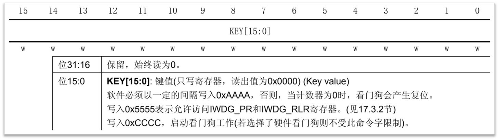

预分频器寄存器(IWDG_PR)


重装载寄存器(IWDG_RLR)：用于存放重装载值，低12位有效，即最大值为4096


状态寄存器(IWDG_SR)：用于判断预分频值和重装载值是否已经被更新

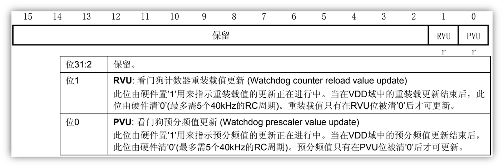

寄存器配置操作步骤

1. 通过在键寄存器 (IWDG_KR) 中写入 0xCCCC 来使能 IWDG。
2. 通过在键寄存器 (IWDG_KR) 中写入 0x5555 来使能寄存器访问。
3. 通过将预分频器寄存器 (IWDG_PR) 编程为 0~7 中的数值来配置预分频器。
4. 对重载寄存器 (IWDG_RLR) 进行写操作。
5. 等待寄存器更新 (IWDG_SR = 0x0000 0000)。
6. 刷新计数器值为 IWDG_RLR 的值 (IWDG_KR = 0xAAAA)。


**IWDG溢出时间计算**


### IWDG配置步骤

1. 取消PR/RLR寄存器写保护，设置IWDG预分频系数和重装载值，启动IWDG：HAL_IWDG_Init()
2. 及时喂狗，即写入0xAAAA 到IWDG_KR：HAL_IWDG_Refresh()

|       函数       |  主要寄存器   |                主要功能                |
| :--------------: | :-----------: | :------------------------------------: |
|  HAL_IWDG_Init   | IWDG_PR/RL/KR |  使能IWDG，设置预分频系数和重装载值等  |
| HAL_IWDG_Refresh |    IWDG_KR    | 把重装载寄存器的值重载到计数器中，喂狗 |

**句柄结构体**

````c
typedef struct { 
   IWDG_TypeDef *Instance; /* IWDG 寄存器基地址 */
   IWDG_InitTypeDef Init;  /* IWDG 初始化参数 */
}IWDG_HandleTypeDef;
typedef struct{ 
    uint32_t Prescaler;    /* 预分频系数 */ 
    uint32_t Reload;       /* 重装载值 */ 
} IWDG_InitTypeDef;
````

### 案例

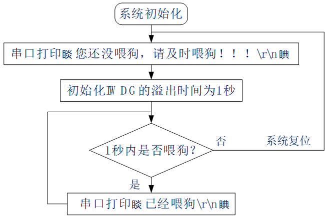


````c
IWDG_HandleTypeDef g_iwdg_handle;
/* IWDG初始化函数 */
void iwdg_init(uint8_t prer, uint16_t rlr){
    g_iwdg_handle.Instance = IWDG;
    g_iwdg_handle.Init.Prescaler = prer;
    g_iwdg_handle.Init.Reload = rlr;
    HAL_IWDG_Init(&g_iwdg_handle);
}

/* 喂狗函数 */
void iwdg_feed(void){
    HAL_IWDG_Refresh(&g_iwdg_handle);
}
int main(void){
    HAL_Init();                             /* 初始化HAL库 */
    sys_stm32_clock_init(RCC_PLL_MUL9);     /* 设置时钟为72Mhz */
    delay_init(72);                         /* 延时初始化 */
    usart_init(115200);                     /* 串口初始化为115200 */
    
    printf("您还没喂狗，请及时喂狗！！！\r\n");
    iwdg_init(IWDG_PRESCALER_32, 1250);     /* 预分频系数为32，重装载值为1250，溢出时间约为1s 32*1250/40000 */
    while (1) {
        delay_ms(999);                      /* 串口显示 已经喂狗 */
        //delay_ms(1050);                   /* 没有及时喂狗，系统复位串口显示 您还没喂狗，请及时喂狗！！！ */
        iwdg_feed();
        printf("已经喂狗\r\n");
    }
}
````


## 窗口看门狗

### WWDG简介

WWDG的全称：Window watchdog，即窗口看门狗

WWDG的本质：能产生系统复位信号和**提前唤醒中断**的计数器

WWDG的特性：

* 递减的计数器
* 当递减计数器值从 0x40减到0x3F时复位（64到63，01000000 -->00111111,即T6位跳变到0）
* 计数器的值大于W[6:0]值时喂狗会复位
* 提前唤醒中断 (EWI)：当递减计数器等于 0x40 时可产生

喂狗：在窗口期内重装载计数器的值，防止复位

时钟源：来自PCLK1（APB1 34MHz）


**作用：**用于监测单片机程序运行时效是否精准，主要检测**软件**异常

**应用：**需要**精准**检测程序运行时间的场合


**工作原理**

(T[6:0])最大值为127; W[6:0]最小为64

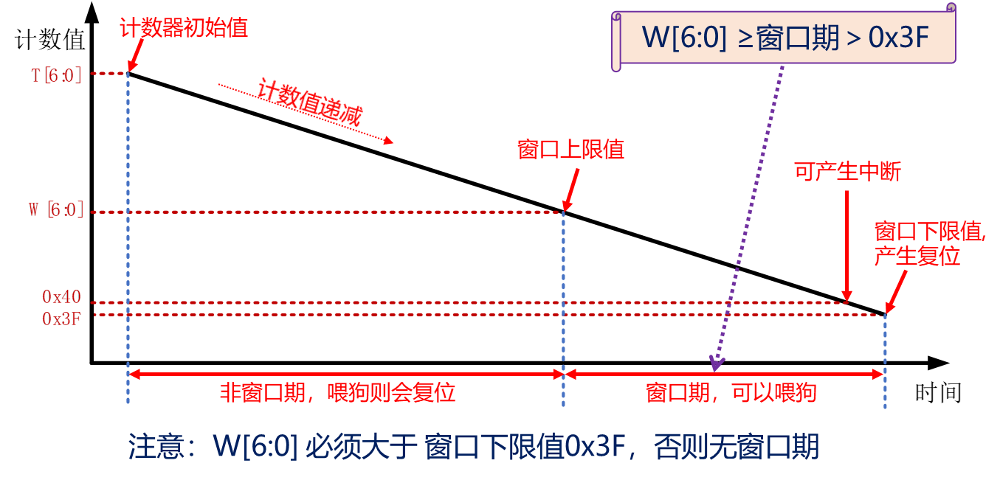

**WWDG框图**

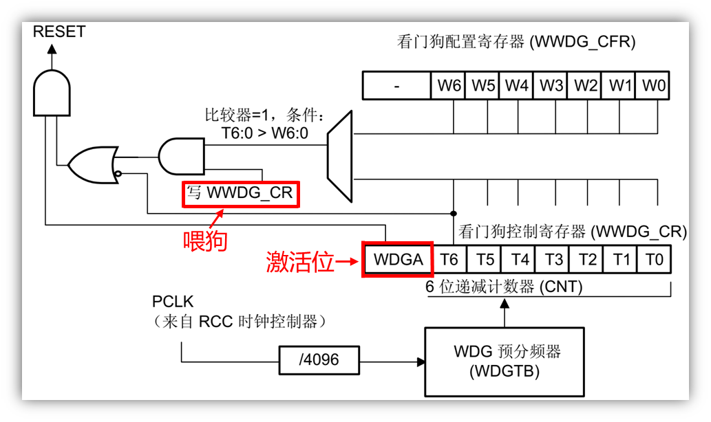

可以看出：复位的两种激活路线：WDGA激活位必须要为1

* 路线1：WWDG_CR寄存器的T6变为0，也就是 0x40减到0x3F时（64到63，01000000 -->00111111,即T6位跳变到0）
* 路线2：当T6:0 >W6:0时，进行写WWDG_CR (喂狗)


**WWDG寄存器**

控制寄存器(WWDG_CR)：用于使能窗口看门狗工作，以及重装载计数器值（即喂狗）


配置寄存器(WWDG_CFR)：用于使能窗口看门狗提前唤醒中断，设置预分频系数，设置窗口上限值


状态寄存器(WWDG_SR)：用于判断是否发生了WWDG提前唤醒中断

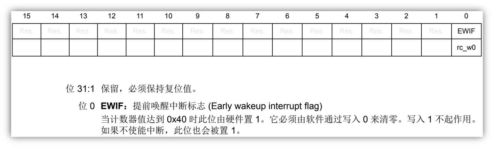

**WWDG超时时间计算**


### WWDG配置步骤

1. WWDG工作参数初始化：HAL_WWDG_Init()
2. WWDG Msp初始化：HAL_WWDG_MspInit()  配置NVIC、CLOCK等
3. 设置优先级，使能中断：HAL_NVIC_SetPriority()、 HAL_NVIC_EnableIRQ()
4. 编写中断服务函数：WWDG_IRQHandler() --> HAL_WWDG_IRQHandler
5. 重定义提前唤醒回调函数：HAL_WWDG_EarlyWakeupCallback()
6. 在窗口期内喂狗：HAL_WWDG_Refresh()

**常用函数**

|       函数       |    主要寄存器    |              主要功能              |
| :--------------: | :--------------: | :--------------------------------: |
|  HAL_WWDG_Init   | WWDG_CR/WWDG_CFR | 使能WWDG，设置预分频系数和窗口值等 |
| HAL_WWDG_Refresh |     WWDG_CR      |        重装载计数器，即喂狗        |

````c
__HAL_RCC_WWDG_CLK_ENABLE();      // 开启WWDG时钟
void HAL_WWDG_EarlyWakeupCallback(WWDG_HandleTypeDef *hwwdg);       // 提前回调函数
````

**句柄结构体**

````c
typedef struct {
  WWDG_TypeDef *Instance; 	/* WWDG 寄存器基地址 */ 
  WWDG_InitTypeDef Init;    /* WWDG 初始化参数 */
}WWDG_HandleTypeDef;
typedef struct {
  uint32_t Prescaler;       /* 预分频系数 */
  uint32_t Window;          /* 窗口值M */
  uint32_t Counter;         /* 计数器值T */
  uint32_t EWIMode;         /* 提前唤醒中断使能 */ 
}WWDG_InitTypeDef;
````

### 案例

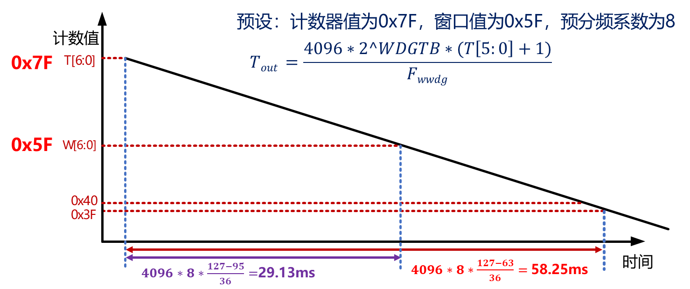

````c
WWDG_HandleTypeDef g_wwdg_handle;
void WWDG_Init(uint8_t tr, uint8_t wr, uint32_t fprer){
    g_wwdg_handle.Instance = WWDG;                // 基地址
    g_wwdg_handle.Init.Prescaler = fprer;         // 分频
    g_wwdg_handle.Init.Counter = tr;              // T值
    g_wwdg_handle.Init.Window = wr;               // W值
    g_wwdg_handle.Init.EWIMode = WWDG_EWI_ENABLE; // 提前中断使能
    HAL_WWDG_Init(&g_wwdg_handle);
}
// WWDG初始化回调函数
void HAL_WWDG_MspInit(WWDG_HandleTypeDef *hwwdg){
    __HAL_RCC_WWDG_CLK_ENABLE();                  // 开启WWDG时钟
    HAL_NVIC_SetPriority(WWDG_IRQn, 2, 3);
    HAL_NVIC_EnableIRQ(WWDG_IRQn);
}
// 中断服务函数
void WWDG_IRQHandler(void){
    HAL_WWDG_IRQHandler(&g_wwdg_handle);  // HAL中断公共函数
}
// 提前中断函数回调函数
void HAL_WWDG_EarlyWakeupCallback(WWDG_HandleTypeDef *hwwdg){
    LED1_TOGGLE();
}

int main(void){
    HAL_Init();                                 /* 初始化HAL库 */
    sys_stm32_clock_init(RCC_PLL_MUL9);         /* 设置时钟,72M */
    delay_init(72);                             /* 初始化延时函数 */
    UART_Init();
    LED_init();   
    
    if(__HAL_RCC_GET_FLAG(RCC_FLAG_WWDGRST) != RESET){  // 这个函数可以查看是谁复位的系统
        printf("窗口看门狗复位\r\n");
        __HAL_RCC_CLEAR_RESET_FLAGS();
    }else{
        printf("外部复位\r\n");
    }
   
    WWDG_Init(0x7f, 0x5f, WWDG_PRESCALER_8);  //T值127 W值95 8分频
    
    printf("请在窗口期内喂狗\r\n\r\n");
    
    while(1){
        delay_ms(55);						// 串口显示 已经喂狗！！！！
        //delay_ms(10);                     // 在T W区间喂狗，触发服务，串口显示 窗口看门狗复位
        HAL_WWDG_Refresh(&g_wwdg_handle);
        printf("已经喂狗！！！！\r\n");
        LED0_TOGGLE();
    }
}
````

## 区别

|     对比点     |          独立看门狗          |            窗口看门狗            |
| :------------: | :--------------------------: | :------------------------------: |
|     时钟源     |      LSI(40KHz或32KHz)       |           PCLK1或PCLK3           |
|    复位条件    |         递减计数到0          | 计数值大于W[6:0]值喂狗或减到0x3F |
|      中断      |           没有中断           |     计数值减到0x40可产生中断     |
| 递减计数器位数 | 12位（最大计数范围：4096~0） |   7位（最大计数范围：127~63）    |
|    应用场合    |  防止程序跑飞，死循环，死机  |    检测程序时效，防止软件异常    |


# FSMC

## **FSMC简介**

* FSMC( Flexible static memory controller)全称“灵活的静态存储器控制器”，是 STM32中一个很有特色的外设，通过 FSMC，STM32可以通过FSMC与SRAM、ROM、PSRAM、Nor Flash和NandFlash存储器的引脚相连，从而进行数据的交换。
* 要注意的是，FSMC 只能扩展静态的内存，即名称里面的 S：static，不能是动态的内存，比如 SDRAM 就不能扩展。
* 配置好FSMC，**定义一个指向这些地址的指针，通过对指针操作就可以直接修改存储单元的内容**，FSMC自动完成读写命令和数据访问操作，不需要程序去实现时序。
* F1/ F4(407)系列大容量型号，且引脚数目在100脚以上的芯片都有FSMC接口，F4/F7/H7系列就是FMC接口

````c
#define      FSMC_Addr_DATA        ( ( uint32_t ) 0x60020000 )       // 定义一个地址
void SRAM_Write_Data ( uint16_t usData ){
	* ( __IO uint16_t * ) ( FSMC_Addr_DATA ) = usData;               // 传输数据，直接往这个地址写数据即可
}
uint16_t SRAM_Read_Data ( void ){
	return ( * ( __IO uint16_t * ) ( FSMC_Addr_DATA ) );             // 读数据，直接返回这个地址上的数据即可
}
````

**FSMC和FMC区别**

* F1 和 F407 使用的是FSMC（Flexible static memory controller）“静态存储器控制器” 是Cortex-M3内核的芯片专属的,STM32可以通过FSMC与静态SRAM、ROM、PSRAM、Nor Flash和NandFlash存储器的引脚相连，从而进行数据的交换。

* 在Cortex-M4内核的F429和Cortex-M7内核的F7,H7系列中，变成了FMC(Flexible Memory Controller) 灵活存储控制器,支持了动态SDRAM 等设备，

* 其中最大的区别是什么呢？

  * FMC是在FSMC(Flexible Static Memory Controller)的基础上扩展了SDRAM的总线控制器,使用 FMC 可以动态刷新 SDRAM

* 静态RAM跟动态RAM

  * SRAM，静态的随机存取存储器，又被称为静态RAM，利用双稳态电路进行存储。即使有干扰对稳态电路也没影响，所以有双稳态性，“静态”是指只要不掉电，存储在SRAM中的数据就可以一直保存，只要有电，SRAM中的数据就不会有变化。加电情况下，不需要一直刷新，数据不会丢失，而且，

  * DRAM，动态随机存取存储器，需要不断的刷新，才能保存数据。主要的作用原理是利用电容内存储电荷的多寡来代表一个二进制比特（bit）是1还是0。由于在现实中电容会有漏电的现象，导致电位差不足而使记忆消失，因此除非电容经常周期性地充电，否则无法确保记忆长存。DRAM读取具有破坏性，也就是说，在读操作中会破坏内存单元行中的数据。因此，必需在该行上的读或写操作结束时，把行数据写回到同一行中。这一操作称为预充电，是行上的最后一项操作。必须完成这一操作之后，才能访问新的行，这一操作称为关闭打开的行。
  * SDRAM（Synchronous Dynamic Random Access Memory），同步动态随机存储器。同步的DRAM
  * 同步和异步的区别是同步方式需要一个专门的片外时钟CLK信号引脚，所有的读写操作都是跟着这个时钟信号走的


**框图**


在框图的右侧是FSMC外设相关的控制引脚，控制不同类型存储器的时候会有一些不同的引脚，其中地址线FSMC_A和数据线FSMC_D是所有控制器都共用的

用于连接硬件设备的引脚，控制不同类型的存储器会用不同的引脚。（“N”表明低电平有效信号）  

|   **FSMC信号**   | **信号方向** |               **功能**                |
| :--------------: | :----------: | :-----------------------------------: |
|  **FSMC_NE[x]**  |     输出     | 片选引脚，x=1…4，每个对应不同的内存块 |
|   **FSMC_CLK**   |     输出     |       时钟（同步突发模式使用）        |
| **FSMC_A[25:0]** |     输出     |               地址总线                |
| **FSMC_D[15:0]** |  输出/输入   |             双向数据总线              |
|   **FSMC_NOE**   |     输出     |               输出使能                |
|   **FSMC_NWE**   |     输出     |               写入使能                |
|  **FSMC_NWAIT**  |     输入     |       NOR闪存要求FSMC等待的信号       |
|  **FSMC_NADV**   |     输出     |     地址、数据线复用时作锁存信号      |

假如我们控制SRAM，则只需要**FSMC_NE[x]**  、  **FSMC_A[25:0]**  、  **FSMC_D[15:0]**  、**FSMC_NOE**  、 **FSMC_NWE**  


**FSMC地址映射**

FSMC 连接好外部的存储器并初始化后，就可以直接通过访问地址来读写数据 其中这部分在内存中有着固定的存储地址，存储单元是映射到 STM32 的内部寻址空间的；在程序里，定义一个指向这些地址的指针，然后就可以通过指针直接修改该存储单元的内容，FSMC 外设会自动完成数据访问过程，读写命令之类的操作不需要程序控制，具体如下：

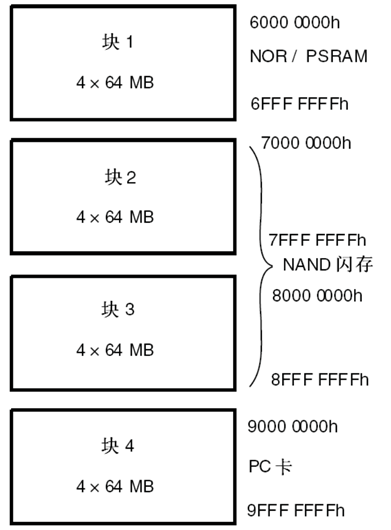

也就是从0x6000 0000 到0x9FFF FFFF 这1.0GB大小的空间被作为FMC的地址


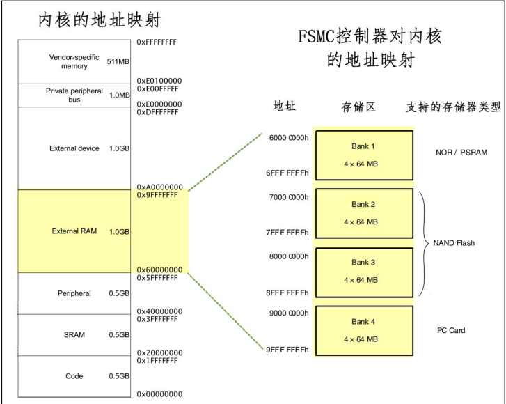

如果从内核看的话中，左侧的是 Cortex-M3 内核的存储空间分配，右侧是 STM32 FSMC 外设的地址映射。可以看到 FSMC 的 NOR/PSRAM/SRAM/NAND FLASH 以及 PC 卡的地址都在 External RAM 地址空间内。正是因为存在这样的地址映射，使得访问 FSMC 控制的存储器时，就跟访问 STM32 的片上外设寄存器一样(片上外设的地址映射即图中左侧的“Peripheral”区域)

也就是访问FSMC其实就是访问固定的地址，跟寄存器操作异曲同工。


FSMC 把整个 存储区域分成了 4 个 Bank 区域，NOR 及 SRAM 存储器只能使用 Bank1 的地址，在每个 Bank 的内部又分成了 4 个小块，每个小块有相应的控制引脚用于连接片选信号FSMC_NE1/2/3/4


**拿存储块1为例**：FSMC存储块1被分为4个区，每个区管理64M字节空间

| **BANK1选区** | **片选信号** | **地址范围**              |
| ------------- | ------------ | ------------------------- |
| 第1区         | FSMC_NE1     | 0x6000 0000 ~ 0x63FF FFFF |
| 第2区         | FSMC_NE2     | 0x6400 0000 ~ 0x67FF FFFF |
| 第3区         | FSMC_NE3     | 0x6800 0000 ~ 0x6BFF FFFF |
| 第4区         | FSMC_NE4     | 0x6C00 0000 ~ 0x6FFF FFFF |


**HADDR**

HADDR[27:26]位用于选择四个存储块之一：

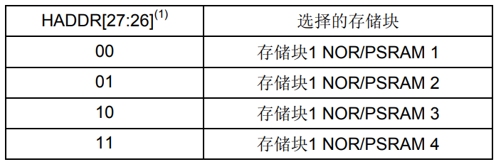

HADDR总线是转换到外部存储器的内部AHB地址线。

简单来说，从CPU通过AHB总线到外部信号线之间的关系。

HADDR[25:0]包含外部存储器地址。HHADDR是字节地址，而存储器访问不都是按字节访问，接到存储器的地址线与其数据宽度相关。（比如LCD使用16位数据线）

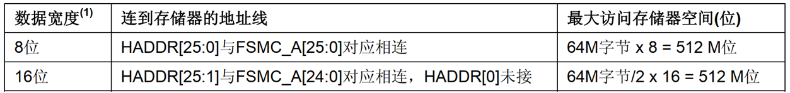

> 注意：数据宽度为16位时，地址存在偏移

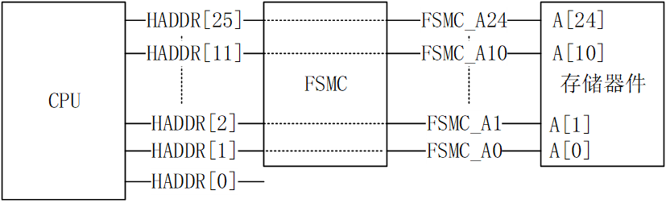

Bank1的256M字节空间由`28根地址线`（ADDR[27:0]）寻址。这里ADDR 是内部AHB地址总线，其中`ADDR[25:0]`对应外部存储器地址`FSMC_A[25:0]`，而HADDR[26:27]对4个区进行寻址。为什么[25:0]这26位为地址：64M Byte = 2^26 Byte

四个区对应二进制：

* Bank1：0110-0000 0000-0000 0000-0000 0000-0000 ，即 60 00 00 00；
* Bank2：0110-0100 0000-0000 0000-0000 0000-0000 ，即 64 00 00 00；
* Bank3：0110-1000 0000-0000 0000-0000 0000-0000 ，即 68 00 00 00；
* Bank4：0110-1100 0000-0000 0000-0000 0000-0000 ，即 6c 00 00 00；

**数据宽度**：

* 这里要注意的是FSMC中每一个地址，对应的是存储器中的一个字节
* 假设我们用BANK1的区1，那么0x6000 0000-0x63ff ffff (共64M个字节byte地址) 对应的就是存储器的地址就是64Mx8=512M地址
* 也就是FSMC的64M个bit地址映射着存储器64M个字节byte地址
* 那也就是默认情况下存储器地址数据为8位，可以正常读取，但是如果存储器地址数据为16位，32位，就是两个字节一个地址，四个字节一个地址，那么控制16位，32位宽度的存储设备，且不支持单字节访问就比较麻烦了。比如16位宽度的NOR Flash，写入仅支持16位或者32位（通过写入两次16位），写入8位数据是不支持的 。
* 这个时候，为了方便操作，FMC在硬件设计上就提供了一种解决办法，将内部数据总线ADDR[25:0]措位后接到FMC_A地址引脚上，“丢弃”地址的bit-0，从bit-1开始对地址计数（相当于只计算偶数地址，总共有32M个地址）
* FSMC在实际输出地址时，将地址的值右移一位（相当于除以2，变成了偶数地址），输出到实际的地址线上。

## FSMC时钟

FSMC 外设挂载在 AHB 总线上，时钟信号来自于 HCLK(默认 72MHz)，控制器的同步时钟输出就是由它分频得到。
它的时钟频率可通过 FSMC_BTR 寄存器的 CLKDIV 位配置，HCLK 与 FSMC_CLK 的分频系数(CLKDIV)，可以为 2～16 分频

- 它可用于与**同步类型**的 NOR FLASH 芯片通过FSMC_CLK 引脚输出进行**同步通讯**，
- 对于**异步类型**的存储器，不使用同步时钟信号，所以时钟分频配置不起作用

FSMC 外设支持输出多种不同的时序以便于控制不同的存储器, 综合了 SRAM／ROM、PSRAM 和 NOR Flash 产品的信号特点，定义了 ABCD 四种不同的异步时序模型。选用不同的时序模型时，需要设置不同的时序参数

NOR/PSRAM控制器产生的异步时序就有5种，总体分为两类：一类是模式1，其他为拓展模式。拓展模式相对模式1来说读写时序时间参数设置可以不同，满足存储器读写时序不一样需求。

| **访问模式** | **对应的外部存储器** | **时序特性**                                                 | **时间参数**           |
| ------------ | -------------------- | ------------------------------------------------------------ | ---------------------- |
| 模式1        | SRAM/CRAM            | OE在读时序片选过程不翻转，有NBL信号，无NADV信号              | DATAST、ADDSET         |
| 模式A        | SRAM/PSRAM(CRAM)     | OE在读时序片选过程翻转，有NBL信号，无NADV信号                | DATAST、ADDSET         |
| 模式B/2      | NOR FLASH            | OE在读时序片选过程不翻转，无NBL信号，有NADV信号              | DATAST、ADDSET         |
| 模式C        | NOR FLASH            | OE在读时序片选过程翻转，无NBL信号，有NADV信号                | DATAST、ADDSET         |
| 模式D        | 带地址扩展的异步操作 | OE在读时序片选过程翻转，无NBL信号，有NADV信号，存在地址保存时间 | DATAST、ADDSET、ADDHLK |
| 同步突发     |                      | 根据同步时钟FSMC_CK读取多个顺序单元的数据                    | CLKDIV、DATLAT         |

## 常用函数

FSMC 相关的库函数分布在 stm32f1xx_II_fsmc.c 文件和头文件 stm32f1xx_II_fsmc.h 中。sram在stm32f1xx_hal_sram.c中

````d
SRAM_HandleTypeDef
    
FSMC_NORSRAMInitTypeDef类型
FSMC_NORSRAMTimingInitTypeDef类型

FSMC_NANDInitTypeDef类型  
FSMC_NAND_PCCARDTimingInitTypeDef类型
FSMC_PCCARDInitTypeDef类型
````

````c
/** SRAM 初始化函数
*	参数1：SRAM句柄
*	参数2：设置NORSRAM存储器的读时序
*	参数3：设置NORSRAM存储器的读时序，读写不同步用到
**/
HAL_StatusTypeDef HAL_SRAM_Init(SRAM_HandleTypeDef *hsram, FSMC_NORSRAM_TimingTypeDef *Timing,
                                FSMC_NORSRAM_TimingTypeDef *ExtTiming); 
__weak void HAL_SRAM_MspInit(SRAM_HandleTypeDef *hsram)

HAL_SDRAM_Init(); //SDRAM 初始化函数,省略入口参数
HAL_NOR_Init();   //NOR 初始化函数,省略入口参数
HAL_NAND_Init();  //NAND 初始化函数,省略入口参数
````

````c
typedef struct{
	FSMC_NORSRAM_TypeDef *Instance;				/* 寄存器基地址,寄存器基地址，如果读写时序一样则配置基地址就行 */ 	
    FSMC_NORSRAM_EXTENDED_TypeDef *Extended; 	/* 扩展模式寄存器基地址,也就是读写时序不同的时候， 指定写操作时序寄存器地址 */ 
	FSMC_NORSRAM_InitTypeDef Init;				/* SRAM初始化结构体 真正用来设置 SRAM 控制接口参数的*/ 
	HAL_LockTypeDef Lock; 						/* SRAM锁对象结构体 */ 
	__IO HAL_SRAM_StateTypeDef State; 			/* SRAM设备访问状态 */ 
	DMA_HandleTypeDef *hdma; 					/* DMA结构体 使用 DMA 时候才使用*/ 
} SRAM_HandleTypeDef;
````

````c
typedef struct{
	uint32_t NSBank; 				/* 存储区块号 */ 
	uint32_t DataAddressMux; 		/* 设置地址总线与数据总线是否复用,该变量仅对 NOR/PSRAM有效  */ 	
	uint32_t MemoryType; 			/* 存储器类型 */ 	
	uint32_t MemoryDataWidth; 		/* 存储器数据宽度，可选 8 位还是 16 位*/
	uint32_t BurstAccessMode;		/* 设置是否支持突发访问模式，只支持同步类型的存储器 */
	uint32_t WaitSignalPolarity;	/* 设置等待信号的极性 */
	uint32_t WrapMode; 				/* 突发模式下存储器传输使能 */
	uint32_t WaitSignalActive; 		/* 等待信号在等待状态之前或等待状态期间有效 */ 
	uint32_t WriteOperation; 		/* 存储器写使能,也就是是否允许写入 */ 
	uint32_t WaitSignal; 			/* 是否使能等待状态插入 */ 
	uint32_t ExtendedMode; 			/* 使能或者禁止使能扩展模式,也就是是否允许读写使用不同时序 */ 
	uint32_t AsynchronousWait; 		/* 用于异步传输期间，使能或者禁止等待信号 */ 
	uint32_t WriteBurst; 			/* 用于使能或者禁止异步的写突发操作 */ 
	uint32_t PageSize; 				/* 设置页大小 */ 
} FSMC_NORSRAM_InitTypeDef;
````


参数 WriteBurst，BurstAccessMode，WaitSignalPolarity，WrapMode，WaitSignalActive，WaitSignal，AsynchronousWait 等是用在**突发访问和同步时序**情况下。

````c
typedef struct{
	uint32_t AddressSetupTime; 			/* 地址建立时间 */ 
	uint32_t AddressHoldTime; 			/* 地址保持时间 */ 	
	uint32_t DataSetupTime; 			/* 数据建立时间 */ 	
	uint32_t BusTurnAroundDuration; 	/* 总线周转阶段的持续时间 */
	uint32_t CLKDivision;				/* CLK时钟输出信号的周期 */
	uint32_t DataLatency;				/* 同步突发NOR FLASH的数据延迟 */
	uint32_t AccessMode;				/* 异步模式配置 */
}FSMC_NORSRAM_TimingTypeDef;
````

## FSMC驱动LCD

### 8080协议

**8080时序简介**

8080协议是一种并行、异步、[半双工](https://so.csdn.net/so/search?q=半双工&spm=1001.2101.3001.7020)通信协议，可用于单片机控制器与LCD驱动芯片之间的通信，由Intel提出，也叫英特尔总线。8080的通信端包括：

|  **信号**   | **名称**  | **控制状态** |                **作用**                |
| :---------: | :-------: | :----------: | :------------------------------------: |
|   **CS**    |   片选    |    低电平    |  选中器件，低电平有效，先选中，后操作  |
|   **WR**    |    写     |      ↑       | 写信号，上升沿有效，用于数据/命令写入  |
|   **RD**    |    读     |      ↑       | 读信号，上升沿有效，用于数据/命令读取  |
|   **RS**    | 数据/命令 |  0=命/1=数   | 表示当前是读写数据还是命令，也叫DC信号 |
| **D[15:0]** |  数据线   |      无      |  双向数据线，可以写入/读取驱动IC数据   |
|   **RES**   |   复位    |              |          复位信号，低电平有效          |

**8080写时序**

CS低电平选择外设，WR设置写入信号，RS设置写入命令还是数据(数据1/命令0在WR的上升沿),D表示写入的内容，RD保存高电平

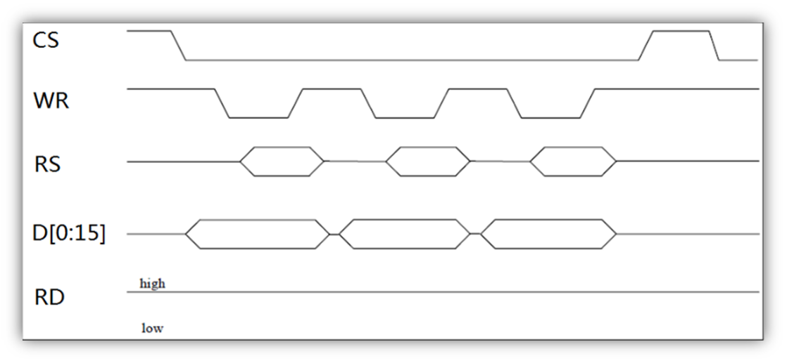

**8080读时序**

数据（RS=1）/命令（RS=0）在RD的上升沿，读取到MCU，WR保持高电平


**案例**：读写LCD

````c
void lcd_wr_data(uint16_t data){
    LCD_RS(1);		/* 操作数据 */
    LCD_CS(0);		/* 选中 */
    LCD_DATA_OUT(data);	/* 数据 */
    LCD_WR(0);		/* WR低电平 */
    LCD_WR(1);		/* WR高电平 */
    LCD_CS(1);		/* 释放片选 */
}
uint16_t  lcd_rd_data(void){
	uint16_t ram;  			/* 定义变量 */
 	LCD_RS(1);              		/* 操作数据 */
    LCD_CS(0);			/* 选中 */
    LCD_RD(0);			/* RD低电平 */
   	ram = LCD_DATA_IN;    	/* 读取数据 */
    LCD_RD(1);			/* RD高电平 */
    LCD_CS(1);			/* 释放片选 */
	return ram；			/* 返回读数 */
}
````

### LCD

**LCD驱动芯片简介**

用于控制LCD的各种显示功能和效果，整体功能较复杂。常见型号：ILI9341/ST7789等

一般我们只需要：6条指令即可完成对LCD的基本使用（以9341为例）

| **指令(HEX)** | **名称** |             **作用**              |
| :-----------: | :------: | :-------------------------------: |
|   **0XD3**    |   读ID   | 用于读取LCD控制器的ID，区分型号用 |
|   **0X36**    | 访问控制 |  设置GRAM读写方向，控制显示方向   |
|   **0X2A**    |  列地址  |         一般用于设置X坐标         |
|   **0X2B**    |  页地址  |         一般用于设置Y坐标         |
|   **0X2C**    |  写GRAM  |        用于往LCD写GRAM数据        |
|   **0X2E**    |  读GRAM  |       用于读取LCD的GRAM数据       |


### FSMC驱动LCD

LCD使用的是类似异步、地址与数据线独立的SRAM控制方式

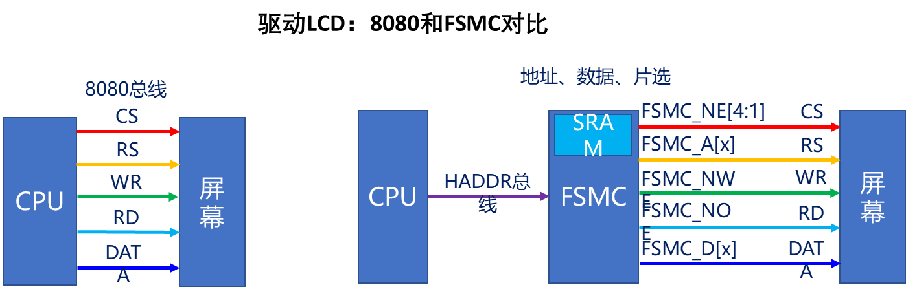

使用FSMC模式A与8080对比


**时序**


**LCD的RS信号线与地址线关系**


### 程序

````c
SRAM_HandleTypeDef g_sram_handle;    /* SRAM句柄(用于控制LCD) */
void lcd_init(void){
    FSMC_NORSRAM_TimingTypeDef fsmc_read_handle;
    FSMC_NORSRAM_TimingTypeDef fsmc_write_handle;
    
    /* FSMC控制的对象 */
    g_sram_handle.Instance = FSMC_NORSRAM_DEVICE;            // NORSRAM设备
    g_sram_handle.Extended = FSMC_NORSRAM_EXTENDED_DEVICE;   // NORSRAM扩展设备
    
    g_sram_handle.Init.NSBank               = FSMC_NORSRAM_BANK4;               /* NOR/PSRAM存储块中的BANK4 */
    g_sram_handle.Init.DataAddressMux       = FSMC_DATA_ADDRESS_MUX_DISABLE;    /* 数据线和地址线不复用 */
    g_sram_handle.Init.MemoryType           = FSMC_MEMORY_TYPE_SRAM;            /* 存储器类型 SRAM */
    g_sram_handle.Init.MemoryDataWidth      = FSMC_NORSRAM_MEM_BUS_WIDTH_16;    /* 存储器数据宽度 16位 */
    g_sram_handle.Init.BurstAccessMode      = FSMC_BURST_ACCESS_MODE_DISABLE;   /* 是否使能突发访问，仅对同步突发存储器有效 此处未用到 */
    g_sram_handle.Init.WaitSignalPolarity   = FSMC_WAIT_SIGNAL_POLARITY_LOW;    /* 等待信号的极性,仅在突发模式访问下有用 */
    g_sram_handle.Init.WaitSignalActive     = FSMC_WAIT_TIMING_BEFORE_WS;       /* 存储器是在等待周期之前的一个时钟周期还是等待周期期间使能NWAIT */
    g_sram_handle.Init.WriteOperation       = FSMC_WRITE_OPERATION_ENABLE;      /* 存储器写使能 */
    g_sram_handle.Init.WaitSignal           = FSMC_WAIT_SIGNAL_DISABLE;         /* 等待使能位,此处未用到 */
    g_sram_handle.Init.ExtendedMode         = FSMC_EXTENDED_MODE_ENABLE;        /* 读写使用不同的时序 */
    g_sram_handle.Init.AsynchronousWait     = FSMC_ASYNCHRONOUS_WAIT_DISABLE;   /* 是否使能同步传输模式下的等待信号,此处未用到 */
    g_sram_handle.Init.WriteBurst           = FSMC_WRITE_BURST_DISABLE;         /* 禁止突发写 */

    /* FSMC读时序控制寄存器 */
    fsmc_read_handle.AccessMode         = FSMC_ACCESS_MODE_A;    /* 模式A */
    fsmc_read_handle.AddressSetupTime   = 1;        /* 地址建立时间(ADDSET)为2个HCLK 1/72M = 13.9ns * 2 = 27.8ns (实际 > 200ns) */
    fsmc_read_handle.AddressHoldTime    = 0;        /* 地址保持时间(ADDHLD) 模式A是没有用到 */
    /* 因为液晶驱动IC的读数据的时候，速度不能太快,尤其是个别奇葩芯片 */
    fsmc_read_handle.DataSetupTime      = 15;       /* 数据保存时间(DATAST)为16个HCLK = 13.9 * 16 = 222.4ns */

    /* FSMC写时序控制寄存器 波形一致 */
    fsmc_write_handle.AccessMode        = FSMC_ACCESS_MODE_A;   /* 模式A */
    fsmc_write_handle.AddressSetupTime  = 1;        /* 地址建立时间(ADDSET)为2个HCLK = 27.8 ns */
    fsmc_write_handle.AddressHoldTime   = 0;        /* 地址保持时间(ADDHLD) 模式A是没有用到 */
    /* 某些液晶驱动IC的写信号脉宽，最少也得50ns。 */
    fsmc_write_handle.DataSetupTime     = 3;        /* 数据保存时间(DATAST)为4个HCLK = 13.9 * 4 = 55.6ns (实际 > 200ns) */
    HAL_SRAM_Init(&g_sram_handle, &fsmc_read_handle, &fsmc_write_handle);
    /**……**/
}
void HAL_SRAM_MspInit(SRAM_HandleTypeDef *hsram){
    __HAL_RCC_FSMC_CLK_ENABLE();            /* 使能FSMC时钟 */
    /**……**/
}
````


## FSMC相关寄存器

对于NOR_FLASH/PSRAM控制器(存储块1)配置工作，通过FSMC_BCRx、FSMC_BTRx和FSMC_BWTRx寄存器设置（其中x=1~4，对应4个区）。

| **寄存器** | **名称**       | **作用**                                    |
| ---------- | -------------- | ------------------------------------------- |
| FSMC_BCR4  | 片选控制寄存器 | 包含存储器块的信息（存储器类型/数据宽度等） |
| FSMC_BTR4  | 片选时序寄存器 | 设置读操作时序参数（ADDSET/DATAST）         |
| FSMC_BWTR4 | 写时序寄存器   | 设置写操作时序参数（ADDSET/DATAST）         |

**SRAM/NOR闪存片选控制寄存器（FSMC_BCRx）**


* EXTMOD：扩展模式使能位，控制是否允许读写不同的时序。
* WREN：写使能位。
* MWID[1:0]：存储器数据总线宽度。00，表示8位数据模式；01表示16位数据模式；10和11保留。
* MTYP[1:0]：存储器类型。00表示SRAM、ROM；01表示PSRAM；10表示NOR FLASH；11保留。
* MBKEN：存储块使能位。

以驱动LCD为例：

* EXTMOD：1,    LCD采用读和写用不同的时序
* WREN：1，向TFTLCD写入数据
* MWID：01，表示16位数据模式
* MTYP：00，表示SRAM
* MBKEN：1，使能块

**SRAM/NOR闪存片选时序寄存器（FSMC_BTRx）**：如果未设置FSMC_BCRx的EXTMOD位，则读写共用这个时序寄存器！


* ACCMOD[1:0]：访问模式。00：模式A；01：模式B；10：模式C；11：模式D。
* DATAST[7:0]：数据保持时间，等于DATAST(+1)个HCLK时钟周期，DATAST最大为255。
* ADDSET[3:0]：地址建立时间。表示ADDSET(+1)个HCLK时钟周期，ADDSET最大为15。


以驱动LCD为例：

* DATAST[7:0]
  * 对于ILI9341来说，其实就是RD低电平持续时间，最小为355ns。
  * 对于F1，一个HCLK = 13.9ns(1/72M)，设置为15         (STM32F1的FSMC性能存在问题)
  * 对于F4，一个HCLK = 6ns(1/168M)，设置为60

* ADDSET[3:0]
  * 对于ILI9341来说，相当于RD高电平持续时间，为90ns。
  * F1即使设置为0，RD也有超过90ns的高电平，这里设置为1。F4对该位设置为15。


**SRAM/NOR闪存写时序寄存器（FSMC_BWTRx）**：读写不同步时才用到这个寄存器

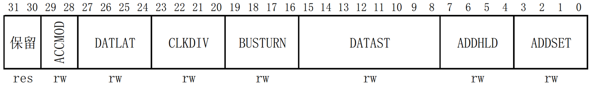

* ACCMOD[1:0]：访问模式。00：模式A；01：模式B；10：模式C；11：模式D。
* DATAST[7:0]：数据保持时间，等于DATAST(+1)个HCLK时钟周期，DATAST最大为255。
* ADDSET[3:0]：地址建立时间。表示ADDSET(+1)个HCLK时钟周期，ADDSET最大为15。

以驱动LCD为例：

* DATAST[7:0]
  * 对于ILI9341来说，其实就是WR低电平持续时间，最小为15ns。
  * 对于F1，一个HCLK = 13.9ns，设置为3
  * 对于F4，一个HCLK = 6ns，设置为9

* ADDSET[3:0]
  * 对于ILI9341来说，相当于WR高电平持续时间，为15ns。
  * F1即使设置为1，WR也有超过15ns的高电平，这里设置为1。F4对该位设置为8。

**FSMC寄存器组合说明**

在ST官方提供的寄存器定义里面，并没有定义FSMC_BCRx、FSMC_BTRx、FSMC_BWTRx等这个单独的寄存器，而是将他们进行了一些组合，规则如下：

FSMC_BCRx和FSMC_BTRx，组合成BTCR[8]寄存器组，他们的对应关系如下：

* BTCR[0]对应FSMC_BCR1，BTCR[1]对应FSMC_BTR1
* BTCR[2]对应FSMC_BCR2，BTCR[3]对应FSMC_BTR2
* BTCR[4]对应FSMC_BCR3，BTCR[5]对应FSMC_BTR3
* BTCR[6]对应FSMC_BCR4，BTCR[7]对应FSMC_BTR4

FSMC_BWTRx则组合成BWTR[7]寄存器组，他们的对应关系如下：

* BWTR[0]对应FSMC_BWTR1，BWTR[2]对应FSMC_BWTR2，
* BWTR[4]对应FSMC_BWTR3，BWTR[6]对应FSMC_BWTR4，
* BWTR[1]、BWTR[3]和BWTR[5]保留，没有用到


# SDIO

## SD卡

很多单片机系统都需要大容量存储设备，以存储数据。目前常用的有 U 盘，FLASH 芯片，SD 卡等。最适合单片机系统的莫过于 SD 卡了，它不仅容量可以做到很大（32GB 以上），支持 SPI/SDIO 驱动，而且有多种体积的尺寸可供选择（标准的 SD 卡尺寸及 Micor SD 卡尺寸等）

SD 卡主要有 SD、Mini SD 和 microSD(原名 TF 卡，2004 年正式更名为 Micro SD Card）

SD卡存储容量等级分为四个

| **SD卡类型** | **协议规范** | **文件系统** | **容量等级** |
| :----------: | :----------: | :----------: | :----------: |
|     SDSC     |    SD1.0     |   FAT12,16   |  上限至2GB   |
|     SDHC     |    SD2.0     |    FAT32     |  2GB至32GB   |
|     SDXC     |    SD3.0     |    exFAT     |  32GB至2TB   |
|     SDUC     |    SD7.0     |    exFAT     |  2TB至128TB  |

SD卡经常被用在Window操作系统上存取数据，就得使用操作系统支持的FAT或exFAT文件系统。（EEPROM或者NOR FLASH操作一样，读写数据并验证数据的正确性，不需要FAT文件系统。）


### **SD卡驱动方式**

可以通过SPI与SD卡进行通信(非常复杂),使用SDIO与HAL库配合简单快捷

SD 卡 与 microSD卡的引脚不同，SD卡有9个引脚，microSD卡有8个引脚，只比 SD 卡少了一个电源引脚 VSS2。SD 卡和 micorSD 只有引脚和形状大小不同，内部结构类似，操作时序完全相同，可以使用完全相同的代码驱动

SD 卡允许了不同的接口来访问它的内部存储单元。最常见的是 **SDIO 模式和 SPI 模式**

下面以microSD卡为例

| **引脚编号** | **引脚名称** | **功能（SDIO模式）** | **功能（SP模式）** |
| :----------: | :----------: | :------------------: | :----------------: |
|    Pin  1    |     DAT2     |       数据线2        |        保留        |
|    Pin  2    |   DAT3/CS    |       数据线3        |      片选信号      |
|    Pin  3    |   CMD/MOSI   |        命令线        | 主机输出，从机输入 |
|    Pin  4    |     VDD      |         电源         |        电源        |
|    Pin  5    |     CLK      |         时钟         |        时钟        |
|    Pin  6    |     VSS      |        电源地        |       电源地       |
|    Pin  7    |  DAT0/MISO   |       数据线0        | 主机输入，从机输出 |
|    Pin  8    |     DAT1     |       数据线1        |        保留        |

SDIO接口通信线：CLK/CMD/DAT0~3

* CLK：时钟线，由SDIO主机产生，由STM32微控制器SDIO外设输出
* CMD：命令线，SDIO主机通过该线发送命令控制SD卡，若命令要求SD卡响应，SD卡也是通过该线传输响应信息。
* DAT0~3：数据线，用于接收或发送数据；SD卡可将DAT0拉低表示处于忙状态

### SD卡寄存器

SD 卡有自己的寄存器，但它不能直接进行读写操作，需要通过命令来控制，SDIO 协议定义了一些命令用于实现某一特定功能，SD 卡根据收到的命令要求对内部寄存器进行修改。

| **名称** | **宽度(bit)** |                           **描述**                           |
| :------: | :-----------: | :----------------------------------------------------------: |
|   CID    |      128      | 卡标识寄存器，提供制造商ID、OEM/应用ID、产品名称、版本、序列号、制造日期等信息（每个卡都是唯一的） |
|   RCA    |      16       | 相对卡地址(Relative card address)寄存器，提供本地系统中卡的地址，动态由卡建议，在主机初始化的时候确定  注意：仅SDIO模式下有，SPI模式下无RCA |
|   CSD    |      128      |       卡特定数据寄存器，提供SD卡操作条件相关信息和数据       |
|   SCR    |      64       |             SD配置寄存器，提供SD卡一些特定的数据             |
|   OCR    |      32       |          操作条件寄存器，主要是SD卡的操作电压等信息          |

OCR寄存器：0~23位表示支持的电压范围(SD卡支持范围中，相应位置1)，30为表示支持卡的类别(1：V2.0 SDHC卡，0：V2.0 SDSC卡)

### 命令和响应

SDIO与SPI模式有区别，以SDIO模式为例

一个完整的 SD 卡操作过程是：主机(单片机等)发起“命令”，SD 卡根据命令的内容决定是否发送响应信息及数据等，如果是数据读/写操作，主机还需要发送停止读/写数据的命令来结束本次操作，这意味着主机发起命令指令后，SD 卡可以没有响应、数据等过程，这取决于命令的含义。

SD 卡有多种命令和响应，它们的格式定义及含义在《SD 卡协议 V2.0》的第三和第四章有详细介绍，发送命令时主机只能通过 CMD 引脚发送给 SD 卡，串行逐位发送时先发送最高位(MSB)，然后是次高位这样类推

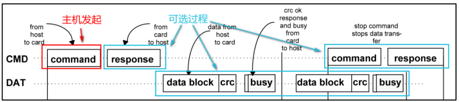

命令：应用相关命令(ACMD)和通用命令(CMD)，通过命令线CMD传输，固定长度48位

响应：SD卡接收到命令，会有一个响应，用来反应SD卡状态。有2种响应类型：短响应(48位，格式与命令一样)和长响应(136位)。

数据：主机发送的数据 / SD发送的数据。SD数据是以块(Block)形式传输，SDHC卡数据块长度一般为512字节。数据块需要CRC保证数据传输成功。


**SD卡命令格式**

SD卡的命令格式由6个字节组成，发送数据时高位在前，SD卡的写入命令格式如下：


字节1：最高 2 位固定为 01，低 6 位为命令号（比如 CMD16，为 10000B 即 16 进制的 0X10，完整的 CMD16，第一个字节为 01010000，
即 0X10+0X40）

字节2~5：命令参数，有些命令参数是保留位，没有定义参数的内容，保留位应设置为0

字节6：用于校验命令传输内容正确性，前7位为CRC(循环冗余校验)校验位，最后一位为停止位1


SD 卡的命令总共有 12 类，分为 Class0~Class11，介绍几个比较重要的命令

基本命令 Class 0（CMD0/CMD8/CMD9/CMD10/CMD12/CMD2/CMD3）、面向块读取命令 Class 2（CMD16/CMD17/CMD18）、面向块写入命令 Class 4（CMD16/CMD24/CMD25）、擦除命令 Class 5、加锁命令 Class 7、特定于应用命令 Class 8（CMD55）、面向块写保护命令 Class 6、I/O模式命令 Class 9、SD卡特定应用命令（ ACMD41 / ACMD6 / ACMD51）、Switch功能命令


**SD卡常用命令**

|     命令     |        参数        | 响应 |                            描述                            |
| :----------: | :----------------: | :--: | :--------------------------------------------------------: |
|  CMD0(0x0)   |        NONE        |  无  |                          复位SD卡                          |
|  CMD8(0X08)  | VHS+Check  pattern |  R7  |                    主机发送接口状态命令                    |
| ACMD41(0X29) |    HCS+VDD电压     |  R3  |          主机发送容量支持信息HCS  和OCR寄存器内容          |
|  CMD2(0X2)   |        NONE        |  R2  |                   读取SD卡的CID寄存器值                    |
|  CMD3(0X3)   |        NONE        |  R6  |                  要求SD卡发布新的相对地址                  |
|  CMD9(0X9)   |        RCA         |  R2  |                 获得选定卡的CSD寄存器内容                  |
|  CMD7(0X7)   |        RCA         | R1b  |                          选中SD卡                          |
| CMD16(0x10)  |    block length    |  R1  |                   设置SD卡的块大小(字节)                   |
| CMD17(0X11)  |        地址        |  R1  |                      读取一个块的数据                      |
| CMD18(0X12)  |        地址        |  R1  |                    连续读取多个块的数据                    |
| CMD12(0X0C)  |        NONE        | R1b  |                   多块读取强制卡停止传输                   |
| CMD13(0x0D)  |        RCA         |  R1  |                    被选中的卡返回其状态                    |
| ACMD23(0x97) |  Number of block   |  R1  | 设置需要预擦除的数据块数，提高SD卡多数据块写入性能（速度） |
| CMD24(0X18)  |        地址        |  R1  |                      写入一个块的数据                      |
| CMD25(0X19)  |        地址        |  R1  |                    连续写入多个块的数据                    |
| CMD55(0X37)  |        NONE        |  R1  |               通知SD卡，接下来发送是应用命令               |

**SD卡响应**

* SD卡和单片机的通信采用发送应答机制。
* 每发送一个命令，SD卡都会给出一个应答，以告知主机该命令的执行情况，或者返回主机需要获取的数据。使用SDIO接口时，响应通过CMD线传输。
* SD卡响应因使用接口不同，格式也不同。响应具体有R1、R1b、R2、R3、R7。
* 响应内容大小可以分为短响应48bit和长响应136bit。

| 响应 | 长度(SDIO) |                    描述                     |
| :--: | :--------: | :-----------------------------------------: |
|  R1  |   48bit    |                正常响应命令                 |
| R1b  |   48bit    | 格式与R1相同，可选增加忙信号(数据线0上传输) |
|  R2  |   136bit   |     SDIO:根据命令可返回CID/CSD寄存器值      |
|  R3  |   48bit    |   SDIO:ACMD41命令的响应，返回OCR寄存器值    |
|  R6  |   48bit    |               已发布的RCA响应               |
|  R7  |   48bit    |       CMD8命令的响应(卡支持电压信息)        |

SD 卡的响应因使用接口不同，比如 SDIO 和 SPI 接口，它们的响应种类以及响应格式也是不同。这里以 SDIO 接口下的 R1 响应为例


### 操作模式

* SD 卡系统(包括主机和 SD 卡)定义了 SD 卡的工作模式，在每个操作模式下，SD 卡都有几种状态，状态之间通过命令控制实现卡状态的切换。
* 在SD卡系统(主机和SD卡)定义了两种操作模式：卡识别模式和数据传输模式。
* 系统复位后，主机和SD卡都处于卡识别模式，主机在总线上找设备；当SD卡被主机识别后，SD卡进入到数据传输模式，而主机在总线上所有卡都被识别后也进入数据传输模式。


**卡识别模式状态转换**

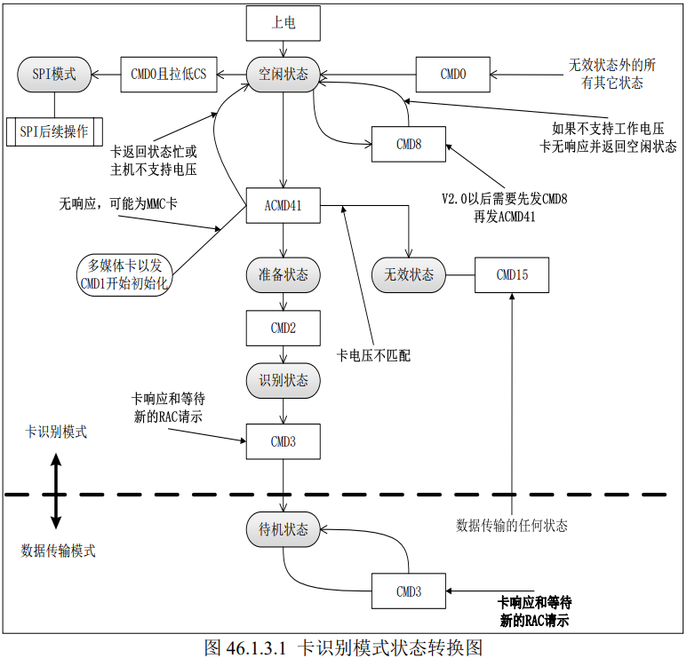

**数据传输模式卡状态转换**


## SDIO接口简介

SDIO，全称 Secure Digital Input and Output，即安全数字输入输出接口。多媒体卡（MMC 卡）、SD 存储卡、SDI/O 卡和 CE￾ATA 设备都有 SDIO 接口。

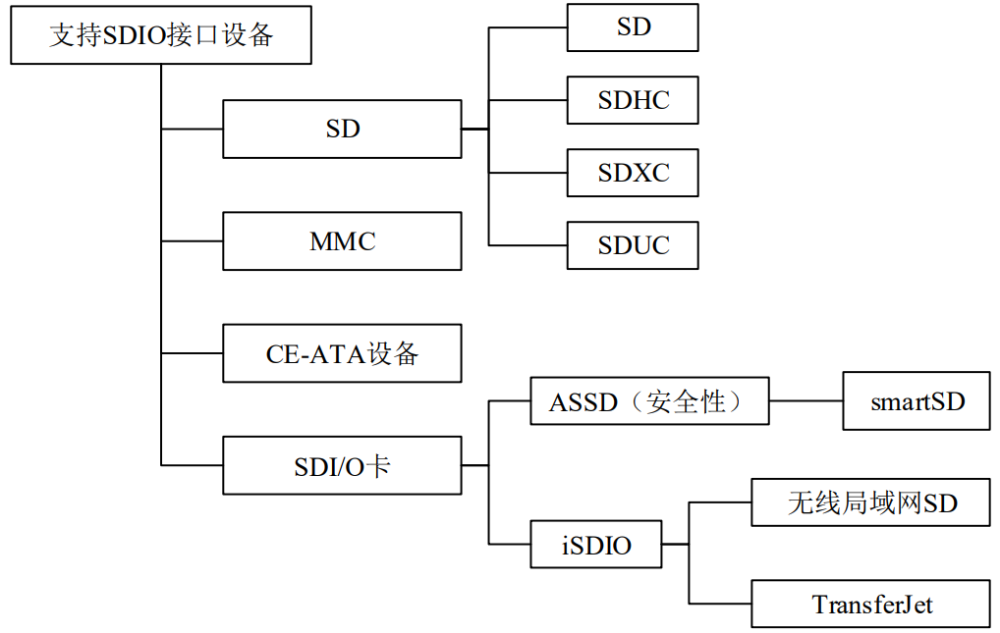

STM32F10x系列和F4xx系列控制器只支持SD卡规范版本2.0，即只支持标准容量SD卡和高容量SDHC卡，不支持超大容量SDXC标准卡，所以可以支持最高卡容量是32G

支持三种不同的数据总线模式：1 位(默认)、4 位和 8 位。


### **SDIO框图**

STM32F1 的 SDIO 控制器功能框图，F4系列不同


复位后默认情况下 SDIO_D0 用于数据传输。初始化后主机可以改变数据总线的宽度（通过ACMD6 命令设置）。
如果一个多媒体卡接到了总线上，则 SDIO_D0、SDIO_D[3:0]或 SDIO_D[7:0]可以用于数据传输。MMC 版本 V3.31 和之前版本的协议只支持 1 位数据线，所以只能用 SDIO_D0（为了通用性考虑，在程序里面我们只要检测到是 MMC 卡就设置为 1 位总线数据）。
如果一个 SD 或 SDI/O 卡接到了总线上，可以通过主机配置数据传输使用 SDIO_D0 或SDIO_D[3:0]。所有的数据线都工作在推挽模式。
SDIO_CMD 有两种操作模式：

* 用于初始化时的开路模式(仅用于 MMC 版本 V3.31 或之前版本)
* 用于命令传输的推挽模式(SD/SD I/O 卡和 MMCV4.2 在初始化时也使用推挽驱动)


### **SDIO 的时钟**

SDIO 总共有 3 个时钟，分别是

* 卡时钟（SDIO_CK）：每个时钟周期在命令和数据线上传输 1 位命令或数据。对于多媒体卡 V3.31 协议，时钟频率可以在 0MHz 至 20MHz 间变化；对于多媒体卡 V4.0/4.2 协议，时钟频率可以在 0MHz 至 48MHz 间变化；对于 SD 或 SDI/O 卡，时钟频率可以在 0MHz 至 25MHz间变化。
* SDIO 适配器时钟（SDIOCLK）：该时钟用于驱动 SDIO 适配器，其频率等于 AHB 总线频率（HCLK 48MHz），并用于产生 SDIO_CK 时钟。
* AHB 总线接口时钟（HCLK/2）：该时钟用于驱动 SDIO 的 AHB 总线接口，其频率为HCLK/2。AHB总线接口时钟(HCLK/2)，36MHz   

SDIO_CK 与 SDIOCLK 的关系为：SDIO_CK = SDIOCLK / (2 + CLKDIV)

注意：SD卡初始化时，SDIO_CK不可超过400KHz；初始化完成后，可设为最大(不可超过SD卡最大操作频率25MHz)并可更改数据总线宽度(默认只用SDIO_D0进行初始化)


### **SDIO适配器**

提供SD卡特有的功能：产生时钟、发送命令、接收应答、双向传输数据

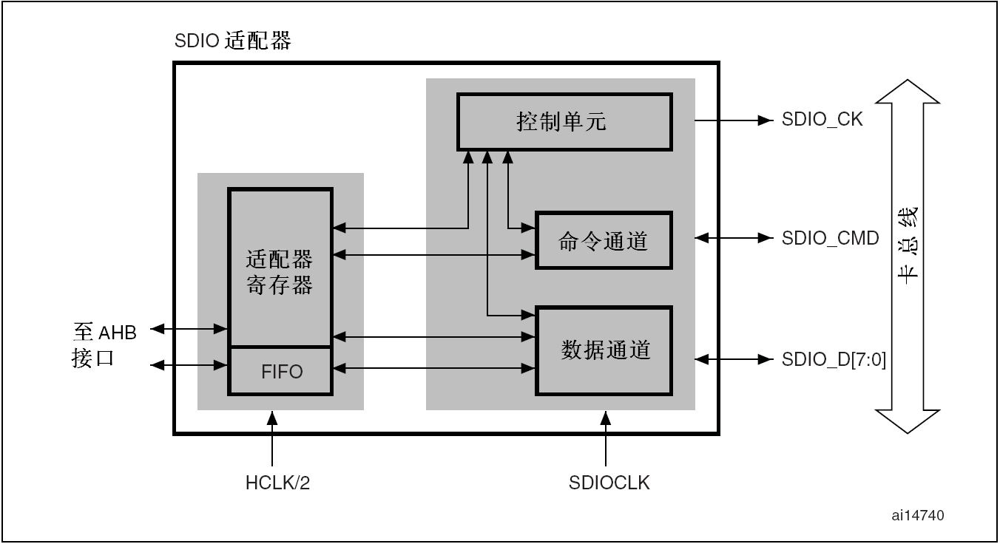

**控制单元**：电源管理和时钟管理功能

**命令通道**

命令通道单元向卡发送命令并从卡接收响应。


命令通道状态机(CPSM) 

当写入命令寄存器并设置了使能位，开始发送命令。命令发送完成时，命令通道状态机(CPSM)设置状态标志并在不需要响应时进入空闲状态(见下图)。当收到响应后，接收到的CRC码将会与内部产生的CRC码比较，然后设置相应的状态标志。


**数据通道**

数据通道子单元在主机与卡之间传输数据。


在时钟控制寄存器中可以配置卡的数据总线宽度。如果选择了4位总线模式，则每个时钟周期四条数据信号线(SDIO_D[3:0])上将传输4位数据；如果选择了8位总线模式，则每个时钟周期八条数据信号线(SDIO_D[7:0])上将传输8位数据；如果没有选择宽总线模式，则每个时钟周期只在SDIO_D0上传输1位数据。

根据传输的方向(发送或接收)，使能时数据通道状态机(DPSM)将进入Wait_S或Wait_R状态：

* 发送：DPSM进入Wait_S状态。如果发送FIFO中有数据，则DPSM进入发送状态，同时数据通道子单元开始向卡发送数据。
* 接收：DPSM进入Wait_R状态并等待开始位；当收到开始位时，DPSM进入接收状态，同时数据通道子单元开始从卡接收数据。

数据通道状态机(DPSM) 

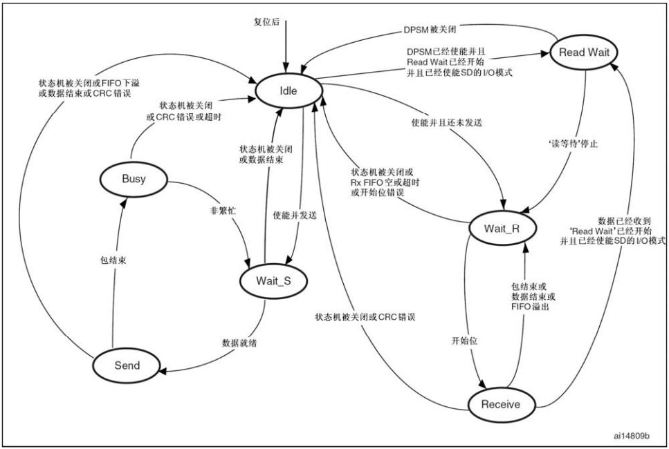

**数据FIFO** 

数据FIFO(先进先出)子单元是一个具有发送和接收单元的数据缓冲区。

包括32个字的数据缓冲，和发送与接收电路

TXACT和RXACT标志分别表明当前处于发送还是接收状态，由数据通道子单元对这两个标志互斥的置位


发送FIFO

* SDIO发送数据时，由数据通道单元置位TXACT，表示数据传输正在进行
* 当TXACT位为1，通过APB2接口(F4) / AHB接口(F1)将数据写入到发送FIFO
* 发送FIFO相关状态：TXFIFOF,TXFIFOE,TXFIFOHE,TXDAVL,TXUNDERRUN

| 标志     | 说明                                                         |
| -------- | ------------------------------------------------------------ |
| TXFIFOF  | 当所有32个发送FIFO字都有有效的数据时，该标志为高。           |
| TXFIFOE  | 当所有32个发送FIFO字都没有有效的数据时，该标志为高。         |
| TXFIFOHE | 当8个或更多发送FIFO字为空时，该标志为高。该标志可以作为DMA请求。 |
| TXDAVL   | 当发送FIFO包含有效数据时，该标志为高。该标志的意思刚好与TXFIFOE相反。 |
| TXUNDERR | 当发生下溢错误时，该标志为高。写入SDIO清除寄存器时清除该标志。读空FIFO后继续读则导致下溢 |

接收FIFO

* SDIO接收数据时，由数据通道单元置位RXACT
* 当RXACT位为1，通过接收FIFO存放从数据通道接收到的数据
* 接收FIFO的相关状态： RXFIFOF,RXFIFOE,RXFIFOHF,RXDAVL,RXOVERR

| 标志     | 说明                                                         |
| -------- | ------------------------------------------------------------ |
| RXFIFOF  | 当所有32个接收FIFO字都有有效的数据时，该标志为高。           |
| RXFIFOE  | 当所有32个接收FIFO字都没有有效的数据时，该标志为高。         |
| RXFIFOHF | 当8个或更多接收FIFO字有有效的数据时，该标志为高。该标志可以作为DMA请求。 |
| RXDAVL   | 当接收FIFO包含有效数据时，该标志为高。该标志的意思刚好与RTXFIFOE相反。 |
| RXOVERR  | 当发生上溢错误时，该标志为高。写入SDIO清除寄存器时清除该标志。写满FIFO后继续写则导致上溢 |

 通过硬件流控：可避免发送模式下溢、可避免接收模式上溢

 

### **命令格式**

命令是用于开始一项操作。命令在CMD线上串行发送，属于半双工模式，命令和响应可分别发送和接收。命令固定长度为48位。

1位 start bit + 1位 transmission bit + 6位 command index + 32位argument + 7位CRC + 1位end bit


SDIO支持2种响应类型，48位短响应和136位长响应，2种类型都有CRC错误检测


其中命令索引是寄存器SDIO_CMD 和 参数是寄存器SDIO_ARG

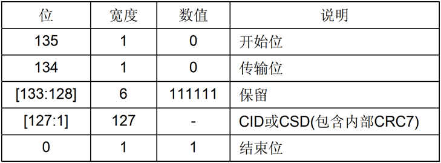


### **SDIO块数据传输**

SDIO和SD卡通信一般以数据块的形式进行传输（还有一种是流的方式）


**块读**

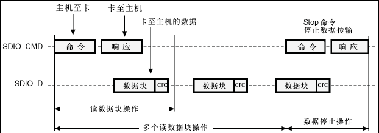

SD卡在收到主机相关命令后，开始发送数据块到主机，所有数据块都带CRC校验(由硬件自动处理)；单块数据块读时，在收到1个数据块就停止，不需要发送停止命令。

多块数据块读时，SD卡将一直发送数据给主机，直到接到主机发送的STOP命令。


**块写**

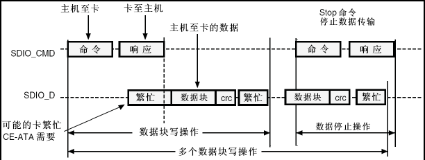

数据块写操作同数据块读操作基本类似，只是数据块写时，多了一个繁忙判断，新的数据块必须在SD卡非繁忙时发送。

这里的繁忙信号由SD卡拉低SDIO_D0表示，SDIO硬件自动控制，不需要我们软件处理。

## 相关寄存器

|   **寄存器**    |       **名称**        |                **作用**                |
| :-------------: | :-------------------: | :------------------------------------: |
|   SDIO_POWER    |  SDIO电源控制寄存器   |        定义卡时钟的当前功能状态        |
|   SDIO_CLKCR    |  SDIO时钟控制寄存器   | 用于设置SDIO_CK输出时钟(设置分频系数)  |
|    SDIO_ARG     |    SDIO参数寄存器     |    用于存储命令参数(写命令之前先写)    |
|    SDIO_CMD     |    SDIO命令寄存器     |       用于设置命令索引和命令类型       |
|  SDIO_RESPCMD   |  SDIO命令响应寄存器   | 用于存储最后收到的命令响应中的命令索引 |
| SDIO_RESPx(1~4) | SDIO命令响应1~4寄存器 |     用于存放接收到的卡响应部分信息     |
|   SDIO_DTIMER   | SDIO数据定时器寄存器  |  用于存储以卡时钟为周期的数据超时时间  |
|    SDIO_DLEN    |  SDIO数据长度寄存器   |     用于设置需要传输的数据字节长度     |
|   SDIO_DCTRL    |  SDIO数据控制寄存器   |         用于控制数据通道状态机         |
|    SDIO_STA     |    SDIO状态寄存器     |      用于查询SDIO控制器的当前状态      |
|    SDIO_FIFO    |  SDIO数据FIFO寄存器   |        用于接收或者发送FIFO数据        |

**SDIO电源控制寄存器(SDIO_POWER)** 


该寄存器复位值为 0，所以 SDIO 的电源是关闭的，我们要启用 SDIO，第一步就是要设置该寄存器最低 2 个位均为 1，让 SDIO 上电，开启卡时钟。


**SDIO 时钟控制寄存器（SDIO_CLKCR）**

SDIO 时钟控制寄存器（SDIO_CLKCR），该寄存器主要用于设置 SDIO_CK 的分配系数，开关等，并可以设置 SDIO 的数据位宽


WIDBUS 用于设置 SDIO 总线位宽，正常使用的时候，设置为 1，即 4 位宽度，初始化时为0。BYPASS 用于设置分频器是否旁路，我们一般要使用分频器，所以这里设置为 0，禁止旁路。CLKEN 则用于设置是否使能 SDIO_CK，我们设置为 1。最后，CLKDIV 则用于控制 SDIO_CK 的分频，设置为 1，即可得到 24Mhz 的 SDIO_CK 频率。


**SDIO 参数寄存器（SDIO_ARG）**

该寄存器比较简单，就是一个 32 位寄存器，用于存储命令参数，不过需要注意的是，必须在写命令之前先写这个参数寄存器！

**SDIO 命令响应寄存器（SDIO_RESPCMD）**

该寄存器为 32 位，但只有低 6 位有效，比较简单，用于存储最后收到的命令响应中的命令索引。如果传输的命令响应不包含命令索引，则该寄存器的内容不可预知。

**SDIO 响应寄存器组（SDIO_RESP1~SDIO_RESP4）**

SDIO 响应寄存器组（SDIO_RESP1~SDIO_RESP4），该寄存器组总共由 4 个 32 位寄存器组成，用于存放接收到的卡响应部分信息。如果收到短响应，则数据存放在 SDIO_RESP1 寄存器里面，其他三个寄存器没有用到。而如果收到长响应，则依次存放在SDIO_RESP1~SDIO_RESP4 里面


**SDIO 命令寄存器（SDIO_CMD）**

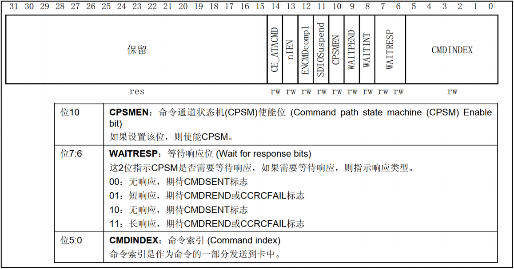

其中低 6 位为命令索引，也就是我们要发送的命令索引号（比如发送 CMD1，其值为 1，索引就设置为 1）。位[7:6]，用于设置等待响应位，用于指示 CPSM
是否需要等待，以及等待类型等。这里的 CPSM，即命令通道状态机，我们就不详细介绍了，请参阅《STM32F10xxx 参考手册_V10（中文版）.pdf》V10 的第 368 页，有详细介绍。命令通道状态机我们一般都是开启的，所以位 10 要设置为 1。


**SDIO 数据定时器寄存器（SDIO_DTIMER）**
在写入数据控制寄存器进行数据传输之前，必须先写入数据定时器寄存器和数据长度寄存器


**SDIO 数据长度寄存器（SDIO_DLEN）**

SDIO 数据长度寄存器（SDIO_DLEN）低 25 位有效，用于设置需要传输的数据字节长度。对于块数据传输，该寄存器的数值，必须是数据块长度（通过 SDIO_DCTRL 设置）的倍数。


**SDIO 数据控制寄存器（SDIO_DCTRL）**

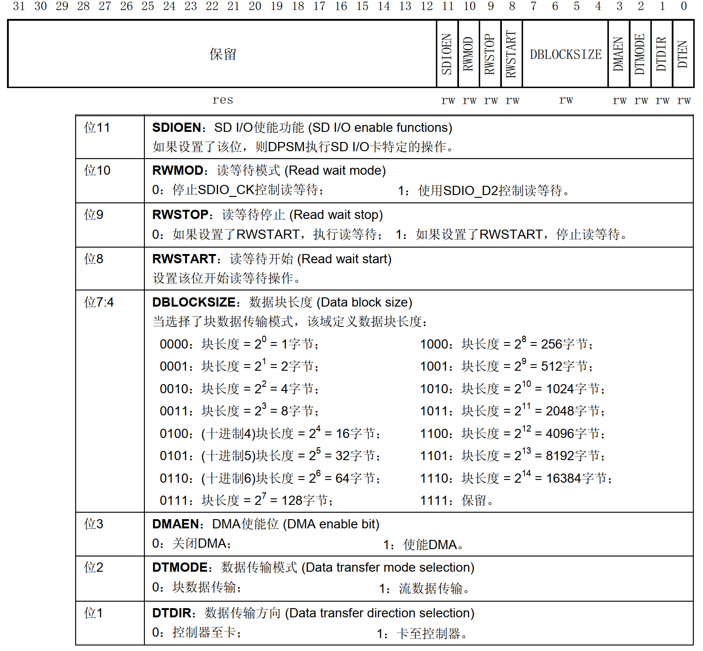

用于控制数据通道状态机（DPSM），包括数据传输使能、传输方向、传输模式、DMA 使能、数据块长度等信息，都是通过该寄存器设置。我们需要根据自己的实际情况，来配置该寄存器，才可正常实现数据收发。


**SDIO状态寄存器（SDIO_STA）**

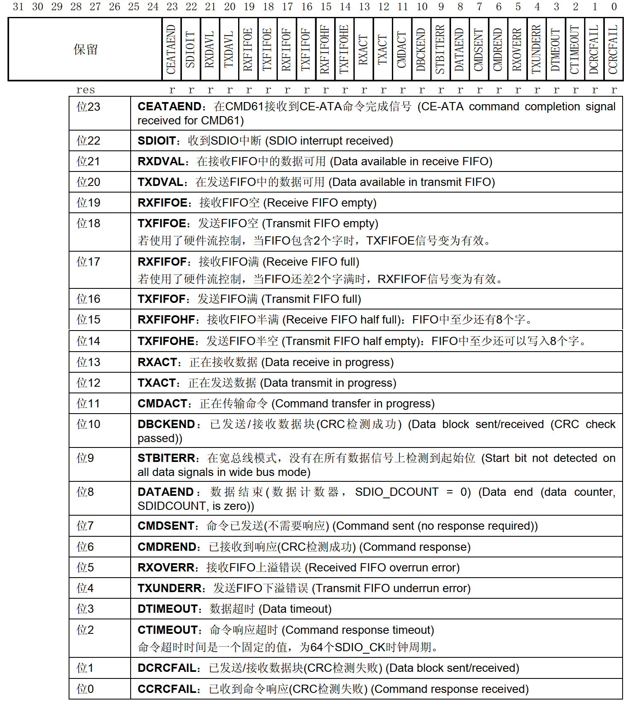


**SDIO 数据 FIFO 寄存器（SDIO_FIFO）**

接收和发送FIFO是32位宽度读或写一组寄存器，它在连续的32个地址上包含32个寄存器，CPU可以使用FIFO读写多个操作数。

我们操作SDIO_FIFO（不论读出还是写入）必须是以4字节对齐的内存进行操作，否则将导致出错。


## HAL库

SD卡HAL库驱动文件：stm32f1xx_hal_sd.c和stm32f1xx_ll_sdmmc.c

### 常用函数

|           驱动函数            |       关联寄存器        |         功能描述         |
| :---------------------------: | :---------------------: | :----------------------: |
|   __HAL_RCC_SDIO_CLK_ENABLE   |    AHBENR / APB2ENR     |     用于SDIO时钟使能     |
|          HAL_SD_Init          | SDIO_CLKCR/CMD/ARG/RESP |      用于初始化SD卡      |
|        HAL_SD_MspInit         |     初始化回调函数      | 用于初始化SDIO的底层硬件 |
| HAL_SD_ConfigWideBusOperation | SDIO_CLKCR/CMD/ARG/RESP |       配置总线宽度       |
|       HAL_SD_ReadBlocks       | SDIO_DCTRL/CMD/ARG/RESP |        读取块数据        |
|      HAL_SD_WriteBlocks       | SDIO_DCTRL/CMD/ARG/RESP |        写入块数据        |
|      HAL_SD_GetCardInfo       |                         |        获取卡信息        |
|      HAL_SD_GetCardState      |                         |        获取卡状态        |
|       HAL_SD_GetCardCID       |                         |         获取卡ID         |

````c
/*	读取块数据  
*	参数1：SDIO句柄
*	参数2：接收地址缓冲区
*	参数3：块地址
*	参数4：读取几个块（一个快512字节）
*	参数5：超时时间，HAL库内部有个宏#define SD_TIMEOUT  ((uint32_t)100000000)
*/
HAL_StatusTypeDef HAL_SD_ReadBlocks(SD_HandleTypeDef *hsd, uint8_t *pData, uint32_t BlockAdd, uint32_t NumberOfBlocks, uint32_t Timeout)

HAL_StatusTypeDef HAL_SD_WriteBlocks(SD_HandleTypeDef *hsd, uint8_t *pData, uint32_t BlockAdd, uint32_t NumberOfBlocks, uint32_t Timeout)    

/*	获取卡状态
*	返回值：
*		HAL_SD_CARD_READY
*		HAL_SD_CARD_IDENTIFICATION
*		HAL_SD_CARD_STANDBY
*		HAL_SD_CARD_TRANSFER
*		HAL_SD_CARD_SENDING
*		HAL_SD_CARD_RECEIVING
*		HAL_SD_CARD_PROGRAMMING
*		HAL_SD_CARD_DISCONNECTED
*		HAL_SD_CARD_ERROR
*/
HAL_SD_CardStateTypeDef HAL_SD_GetCardState(SD_HandleTypeDef *hsd) 
````

**结构体**

SDIO外设相关结构体：

* SD_HandleTypeDef：SDIO句柄
* SDIO_CmdInitTypeDef：命令相关结构体
* SDIO_DataInitTypeDef：数据相关结构体
* HAL_SD_CardInfoTypeDef：卡相关结构体

````c
typedef struct
    SD_TypeDef *Instance;	/* SD 相关寄存器基地址 */
    SD_InitTypeDef Init;	/* SDIO 初始化变量,宏定义替代SDIO_InitTypeDef */
    HAL_LockTypeDef Lock;	/* 互斥锁，用于解决外设访问冲突 */
    uint8_t *pTxBuffPtr;	/* SD 发送数据指针 */
    uint32_t TxXferSize;	/* SD 发送缓存按字节数的大小 */
    uint8_t *pRxBuffPtr;	/* SD 接收数据指针 */
	uint32_t RxXferSize;	/* SD 接收缓存按字节数的大小 */
    __IO uint32_t Context;	/* HAL 库对 SD 卡的操作阶段 */
    __IO HAL_SD_StateTypeDef State;	/* SD 卡操作状态 */
    __IO uint32_t ErrorCode;	/* SD 卡错误代码 */
    DMA_HandleTypeDef *hdmatx;	/* SD DMA 数据发送指针 */
    DMA_HandleTypeDef *hdmarx;	/* SD DMA 数据接收指针 */
    HAL_SD_CardInfoTypeDef SdCard;	/* SD 卡信息的 */
    uint32_t CSD[4];	/* 保存 SD 卡 CSD 寄存器信息 */
    uint32_t CID[4];	/* 保存 SD 卡 CID 寄存器信息 */
}SD_HandleTypeDef;
typedef struct{
    uint32_t ClockEdge;            /* 数据或指令变化的时钟沿 */
    uint32_t ClockBypass;          /* 是否设置旁路分频器 */
    uint32_t ClockPowerSave;       /* 空闲状态，是否输出时钟 */
    uint32_t BusWide;              /* 设置SDIO总线位宽 */
    uint32_t HardwareFlowControl;  /* 用于使能硬件流控制 */
    uint32_t ClockDiv;             /* 设置SDIO时钟分频 */ 
}SDIO_InitTypeDef;
//注意：在搜索宏定义时 SDMMC_LL_XXX_XXX搜索不到将SDMMC替换为SDIO就能搜索到了，SDIO_LL_XXX_XXX
/* 数据或指令变化的时钟沿 */
#define SDIO_CLOCK_EDGE_RISING 
#define SDIO_CLOCK_EDGE_FALLING
/* 是否设置旁路分频器 */
#define SDIO_CLOCK_BYPASS_DISABLE   //不开启
#define SDIO_CLOCK_BYPASS_ENABLE
/* 空闲状态，是否输出时钟 */
#define SDIO_CLOCK_POWER_SAVE_DISABLE	
#define SDIO_CLOCK_POWER_SAVE_ENABLE
/* 设置SDIO总线位宽 */
#define SDIO_BUS_WIDE_1B			// 初始化使用
#define SDIO_BUS_WIDE_4B			// 想提高速度时使用
#define SDIO_BUS_WIDE_8B
/* 用于使能硬件流控制，控制FIFO溢出 */
#define SDIO_HARDWARE_FLOW_CONTROL_DISABLE
#define SDIO_HARDWARE_FLOW_CONTROL_ENABLE
/* 设置SDIO时钟分频 */ 
#define SDIO_INIT_CLK_DIV     ((uint8_t)0x76)	/* 48MHz / (SDMMC_INIT_CLK_DIV + 2) < 400KHz */
#define SDIO_TRANSFER_CLK_DIV ((uint8_t)0x4)	/* SDIO Data Transfer Frequency (25MHz max) */

/*----------------------------HAL库内部使用------------------------------------*/
typedef struct{
    uint32_t Argument;		/* 命令参数 */
    uint32_t CmdIndex; 		/* 命令索引 */
    uint32_t Response;		/* 响应类型 */
    uint32_t WaitForInterrupt;	/* 等待中断请求 */
    uint32_t CPSM;			/* 是否使用命令通道状态机 */
}SDIO_CmdInitTypeDef;
// SDIO_DataInitTypeDef关联的函数SDIO_ConfigData，发送/接收数据块会使用到。
typedef struct{
    uint32_t DataTimeOut;	/* 数据超时时间 */
    uint32_t DataLength; 	/* 数据长度 */
    uint32_t DataBlockSize;	/* 数据块大小 */
    uint32_t TransferDir;	/* 传输方向(读/写) */
    uint32_t TransferMode;	/* 传输模式(块/流)*/
    Uint32_t DPSM;			/* 是否使用数据通道状态机 */
}SDIO_DataInitTypeDef;
// 通过HAL_SD_GetCardInfo函数获取卡信息
typedef struct{
    uint32_t CardType;		/* 卡类型 */
    uint32_t CardVersion; 	/* 卡版本 */
    uint32_t Class;			/* 卡类型 */		
    uint32_t RelCardAdd;	/* 卡相对地址 */
    uint32_t BlockNbr;		/* 整个卡的块数 */
    uint32_t BlockSize;		/* 每个块的字节数 */ 
    uint32_t LogBlockNbr;	/* 整个卡的逻辑块数 */
    uint32_t LogBlockSize;	/* 逻辑块大小 */ 
}HAL_SD_CardInfoTypeDef;
typedef struct{
  __IO uint8_t  ManufacturerID;  /*!< Manufacturer ID       */
  __IO uint16_t OEM_AppliID;     /*!< OEM/Application ID    */
}HAL_SD_CardCIDTypeDef;
````

### 案例

没有使用文件管理器，将SD卡当作Flash来读，指定块读/写

````c
#define SDIO_PORT GPIOC
#define SDIO_CMD_PORT GPIOD
#define SDIO_PIN_D0  GPIO_PIN_8
#define SDIO_PIN_D1  GPIO_PIN_9
#define SDIO_PIN_D2  GPIO_PIN_10
#define SDIO_PIN_D3  GPIO_PIN_11
#define SDIO_PIN_CLK  GPIO_PIN_12
#define SDIO_PIN_CMD  GPIO_PIN_2
SD_HandleTypeDef SD_HandleStructure;
void SD_Init(void){			
    SD_HandleStructure.Instance = SDIO;									
    SD_HandleStructure.Init.ClockEdge = SDIO_CLOCK_EDGE_RISING;			/* 上升沿 */
    /* 不使用bypass模式，直接用HCLK进行分频得到SDIO_CK */
    SD_HandleStructure.Init.ClockBypass = SDIO_CLOCK_BYPASS_DISABLE; 	
    SD_HandleStructure.Init.ClockPowerSave = SDIO_CLOCK_POWER_SAVE_DISABLE;	/* 空闲时不关闭时钟电源 */
    SD_HandleStructure.Init.BusWide = SDIO_BUS_WIDE_1B;					/* 1位数据线 */
    SD_HandleStructure.Init.HardwareFlowControl =  SDIO_HARDWARE_FLOW_CONTROL_ENABLE;	/* 开启硬件流控 */
    SD_HandleStructure.Init.ClockDiv = SDIO_TRANSFER_CLK_DIV;   		/* SD传输时钟频率最大25MHZ */
    HAL_SD_Init(&SD_HandleStructure);
}
void HAL_SD_MspInit(SD_HandleTypeDef *hsd){ 
    if(SDIO ==hsd->Instance){
        __HAL_RCC_SDIO_CLK_ENABLE();
        __HAL_RCC_GPIOC_CLK_ENABLE();
        __HAL_RCC_GPIOD_CLK_ENABLE();
        GPIO_InitTypeDef GPIO_InitStructure;
        GPIO_InitStructure.Mode = GPIO_MODE_AF_PP;		/* 推挽复用 */
        GPIO_InitStructure.Pin = SDIO_PIN_D0 | SDIO_PIN_D1 | SDIO_PIN_D2 |SDIO_PIN_D3 |SDIO_PIN_CLK;
        GPIO_InitStructure.Pull = GPIO_NOPULL;
        GPIO_InitStructure.Speed = GPIO_SPEED_FREQ_HIGH;
        HAL_GPIO_Init(SDIO_PORT,&GPIO_InitStructure); 
        GPIO_InitStructure.Pin = GPIO_PIN_2;
        HAL_GPIO_Init(SDIO_CMD_PORT,&GPIO_InitStructure);  
    }
}
/**	获取Card信息
*	参数：SD卡信息结构体
**/
uint8_t GetSD_Card_Info(HAL_SD_CardInfoTypeDef *cardInfo){
    return HAL_SD_GetCardInfo(&SD_HandleStructure,cardInfo);
}
/* 获取卡状态 */
uint8_t GetSD_State(void){
    if(HAL_SD_GetCardState(&SD_HandleStructure) == HAL_SD_CARD_TRANSFER ){  /* 是否正在传输 */
        return 0x00;			/* 传输完成 */	
    }else{
        return 0x01;  			/* 忙 */
    }
}
/* 读取扇区 */
uint8_t SD_ReadDisk(uint8_t *pData,uint32_t Addr,uint32_t cnt){
    uint32_t timeout = 100000;
    uint8_t sta;
    sta = HAL_SD_ReadBlocks(&SD_HandleStructure,pData,Addr,cnt,HAL_TIMEOUT);
    
    while(GetSD_State() != 0x00){	/* 如果忙 则等待100000个数 */
        if(timeout-- == 0){
            sta = 0x01;
        }
    } 
    return sta;
}
/*	写扇区 */
uint8_t SD_WriteDisk(uint8_t *pData,uint32_t Addr,uint32_t cnt){
    uint32_t timeout = 100000;
    uint8_t sta;
    sta = HAL_SD_WriteBlocks(&SD_HandleStructure,pData,Addr,cnt,HAL_TIMEOUT); 
    while(GetSD_State() != 0x00){
        if(timeout-- == 0){
            sta = 0x01;
        }
    } 
    return sta;
}
uint8_t readBuf[500] = {0};
uint8_t writeBuf[500] = {0};
HAL_SD_CardInfoTypeDef SD_CardInfoStructure;	/* Card 信息结构体 */
HAL_SD_CardCIDTypeDef SD_CardCID;				/* Card ID结构体*/
int main(void){
    HAL_Init();                         /* 初始化HAL库 */
    sys_stm32_clock_init(RCC_PLL_MUL9); /* 设置时钟, 72Mhz */
    delay_init(72);                     /* 延时初始化 */
    usart_init(115200);                 /* 串口初始化为115200 */
    led_init();                         /* 初始化LED */
    lcd_init();                         /* 初始化LCD */
    key_init();                         /* 初始化key */
    SD_Init();							/* 初始化SDIO */
    
    lcd_show_string(30, 110, 200, 16, 16, "Card ID:", RED);  
    lcd_show_string(30, 130, 200, 16, 16, "Card Size:", RED);   
    
    HAL_SD_GetCardCID(&SD_HandleStructure,&SD_CardCID);			/* 获取CardID */
    lcd_show_num(130,110,SD_CardCID.ManufacturerID,8,16,BLUE);
    
    GetSD_Card_Info(&SD_CardInfoStructure);						/* 获取Card信息 */
    /* 计算内存大小 MB */
    uint64_t cardSize = (SD_CardInfoStructure.LogBlockNbr * SD_CardInfoStructure.LogBlockSize) >> 20; 
    lcd_show_num(130,130,cardSize,8,16,BLUE);

    uint8_t key;
    while (1) {
        key = key_scan(0);
        if(key == 1){
            SD_ReadDisk(readBuf,0,1);						/* 从0扇区读取1*512字节的内容 */
            for(uint16_t u = 0;u < sizeof(readBuf);u++){
                printf("%d ",readBuf[u]);
            }
        }
        if(key == 2){
            for(uint16_t u = 0;u < sizeof(writeBuf);u++){
                writeBuf[u] = 1;
            }
            SD_WriteDisk(writeBuf,0,1);
        }
        LED0_TOGGLE();                  /* LED0(RED) 闪烁 */
        delay_ms(500);
    }
}
````

## FATFS

使用文件系统前，需先对存储设备进行格式化，擦除原来的数据，在存储设备上建立一个文件分配表和目录。

**FAT文件系统简介**


系统引导扇区：引导程序，以及文件系统信息(扇区字节数/每簇扇区数/保留扇区数等)

文件分配表：记录文件存储中簇与簇之间连接的信息

根目录：存在所有文件和子目录信息(文件名/文件夹名/创建时间/文件大小)

数据区：文件等数据存放地方，占用大部分的磁盘空间


FAT文件系统用“簇” 作为数据单元，一个“簇”由一组连续的扇区组成，而一个扇区的大小为512字节。

所有的簇从2开始进行编号，每个簇都有自己的地址编号，用户文件和数据都存储在簇中。

### **FATFS文件系统简介**

FATFS 是一个完全免费开源的 FAT/exFAT 文件系统模块，专门为小型的嵌入式系统而设计。它完全用标准 C 语言（ANSI C C89）编写，所以具有良好的硬件平台独立性，只需做简单的修改就可以移植到 8051、PIC、AVR、ARM、Z80、RX 等系列单片机上。它支持 FATl2、FATl6 和FAT32，支持多个存储媒介；有独立的缓冲区，可以对多个文件进行读／写，并特别对 8 位单片机和 16 位单片机做了优化。****


下载链接 http://elm-chan.org/fsw/ff/archives.html

FATFS 模块的层次结构图

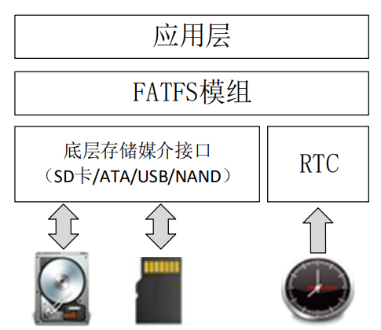


最顶层是应用层，使用者无需理会FATFS的内部结构和复杂的FAT协议，只需要调用FATFS模块提供给用户的一系列应用接口函数，如 f_open，f_read，f_write 和 f_close 等，就可以像在PC 上读／写文件那样简单。
中间层 FATFS 模块，实现了 FAT 文件读／写协议。FATFS 模块提供的是 ff.c 和 ff.h。除非有必要，使用者一般不用修改，使用时将头文件直接包含进去即可。
需要我们编写移植代码的是 FATFS 模块提供的底层接口，它包括存储媒介读／写接口（diskI/O）和供给文件创建修改时间的实时时钟。


**目录结构**

解压后可以得到两个文件夹：documents 和 source。documents 里面主要是对 FATFS 的介绍，而 source 里面才是我们需要的源码。source 文件夹详情

| **文件名**  |             **功能名**             |    **说明**    |
| :---------: | :--------------------------------: | :------------: |
|  ffconf.h   |         FATFS模块配置文件          | 根据需求来配置 |
|    ff.h     |   FATFS和应用模块共用的包含文件    |   不需要修改   |
|    ff.c     |     FATFS模块源码(文件系统API)     |   不需要修改   |
|  diskio.h   | FATFS和disk  I/O模块共用的包含文件 |   不需要修改   |
|  diskio.c   |   FATFS和disk  I/O模块接口层文件   | 与硬件相关代码 |
| ffunicode.c |    FATFS所支持的字体代码转换表     |   不需要修改   |
| ffsystem.c  |     FATFS的OS相关函数示例代码      |     没用到     |

FATFS 模块在移植的时候，我们一般只需要修改 2 个文件，即 ffconf.h 和 diskio.c。FATFS模块的所有配置项都是存放在 ffconf.h 里面，我们可以通过配置里面的一些选项 完整介绍 http://elm-chan.org/fsw/ff/doc/config.html 

### 配置文件

ffconf.h 

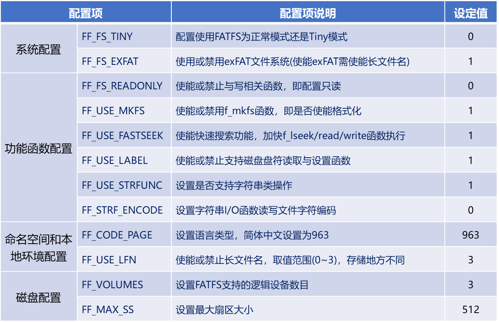


### **diskio.c文件** 

* disk_initialize 初始化磁盘驱动器 
* disk_status 获取磁盘状态
* disk_read 从磁盘驱动器读扇区
* disk_write 从磁盘驱动器写扇区
* disk_ioctl 控制设备实现指定功能，用于辅助FATFS中其他API
* get_fattime  获取当前时间

**disk_initialize函数**


需要将初始化函数添加到此函数中，如我们自己读取SD或者AT25C02等的初始化函数放到此函数

这个函数不需要自己调用，在使用f_mount挂载时自动调用


**disk_status函数**

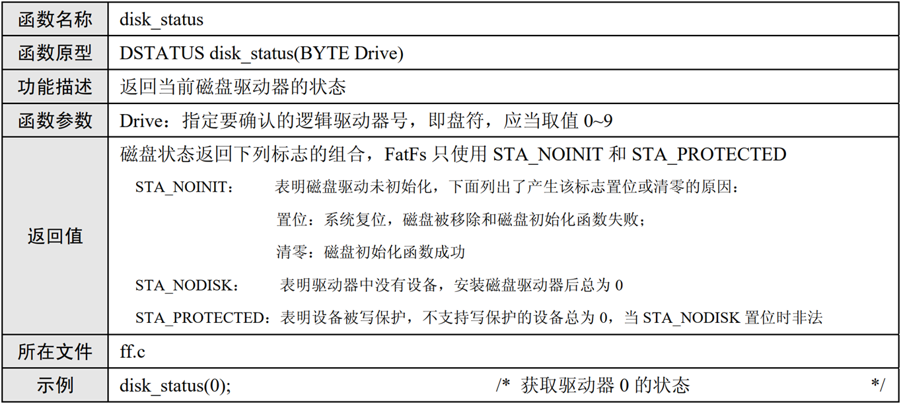

**disk_read函数**

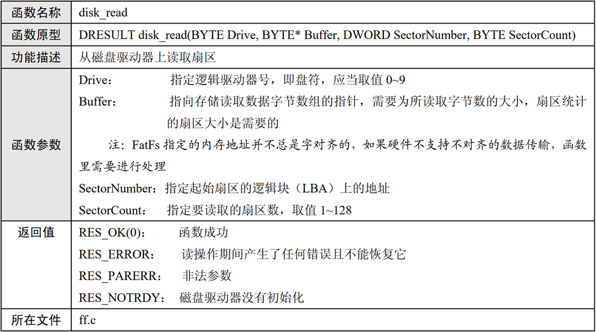

**disk_write函数**


**disk_ioctl函数**


**get_fattime函数**


### **FATFS开放函数**

FATFS 提供了很多 API 函数，这些函数 FATFS 的自带介绍文件里面都有详细的介绍(包括参考代码)，我们这里就不多说了。这里需要注意的是，在使用FATFS的时候，必须先通过**f_mount**函数注册一个工作区，才能开始后续 API 的使用

````c
/*_____________________________文件操作_________________________________*/
f_open		打开/创建一个文件
f_close		关闭一个打开的文件
f_read 		从文件中读取数据
f_write		往文件中写数据
f_gets		读一个字符串
f_putc 		写一个字符
f_puts		写一个字符串
f_printf	写一个格式化的字符串
f_lseek		移动文件读/写指针
f_tell		获取当前读/写指针
f_size		获取文件大小
/*_____________________________目录操作_________________________________*/
f_opendif	打开一个目录
f_closedir	关闭一个已经打开的目录
f_readdir	读取目录条目
f_mkdir		创建一个新目录
f_unlink	删除一个文件或目录
f_rename	重命名/移动一个文件或文件夹
/*_____________________________劵管理_________________________________*/  
f_mount		注册/注销一个工作区
f_mkfs		格式化，创建一个文件系统
f_getfree	获取磁盘信息以及空闲簇数量
f_setlabel	设置盘符(磁盘名字)
f_getlabel	获取盘符
````

### 移植FATFS

移植一个最简单的FATFS系统，使用SDIO中的案例

步骤：

1. 前期工作:准备好一个带有存储设备驱动的工程(SPI实验/SD卡实验)FATFS文件系统开源库
2. 复制FATFS文件到工程文件夹下 并 将移植文件添加到工程中(设置包含路径)
3. 修改ffconf.h的配置项：FF_FS_NORTC / FF_USE_STRFUNC /FF_CODE_PAGE / FF_VOLUMES等
4. 修改diskio.c文件5个函数：disk_initialize/status/read/write/ioctl
5. 编写测试代码：最简读写：f_mount、f_open、f_write、f_read、f_close

**修改ffconf.h配置项**

````h
#define FF_USE_STRFUNC	1		/* 可以使用f_gets(), f_putc(), f_puts()等函数 */
#define FF_CODE_PAGE	936		/* 简体中文 */
#define FF_VOLUMES		1		/* 一个卷积，使用的是SD卡*/
#define FF_USE_LABEL	1		/* 可以更改SD卡名称 */
#define FF_FS_NORTC		1		/* get_fattime 不使用RTC时间，使用下面宏定义的时间*/
#define FF_NORTC_MON	4
#define FF_NORTC_MDAY	6
#define FF_NORTC_YEAR	2000
````

**修改diskio.c**

````c
#include "ff.h"			/* Obtains integer types */
#include "diskio.h"		/* Declarations of disk functions */
#include "./BSP/SD/sdio.h"	/* 引入自己写的SDIO项目 */
#define DEV_SD		0	    /*SD卡*/
/*disk 状态*/
DSTATUS disk_status (BYTE pdrv		){
	return RES_OK; /* 直接返回一个OK */
}
/*f_mount 会自动调用这个函数*/
DSTATUS disk_initialize (BYTE pdrv){  
    if(pdrv == DEV_SD){
        SD_Init();          /* 自己写的SDIO初始化函数，可以添加一些判断 */
    }
	return RES_OK;
}
DRESULT disk_read (BYTE pdrv,		BYTE *buff,LBA_t sector,UINT count){
	if(pdrv == DEV_SD){
        SD_ReadDisk((uint8_t *)buff,sector,count);         /* 自己写的SDIO读函数，可以添加一些判断 */
    }
	return RES_OK;
}

#if FF_FS_READONLY == 0			/* 只有这一项宏为0时才可以进行写操作，否则就是只读*/
DRESULT disk_write (BYTE pdrv,const BYTE *buff,LBA_t sector,UINT count){
	if(pdrv == DEV_SD){
        SD_WriteDisk((uint8_t *)buff,sector,count);         /* 自己写的SDIO读函数，可以添加一些判断 */
    }
	return RES_OK;
}

#endif
DRESULT disk_ioctl (BYTE pdrv,BYTE cmd,void *buff){
	DRESULT res;
    if (pdrv == DEV_SD){
        switch (cmd) {
            case CTRL_SYNC :
                res = RES_OK;
                break;
            case GET_SECTOR_SIZE :          /* 扇区大小 */
                *(DWORD *)buff = 512;
                break;
            case GET_BLOCK_SIZE :           /* 块尺寸 */
                *(DWORD *)buff  = SD_HandleStructure.SdCard.BlockSize;      /* 自己编写的SDIO模块中定义的SD卡结构体 */
                res = RES_OK;
                break;
            case GET_SECTOR_COUNT :         /* 块数目 */
                *(DWORD *)buff  = 
                    ((long long)SD_HandleStructure.SdCard.BlockNbr * SD_HandleStructure.SdCard.BlockSize) / 512;
                res = RES_OK;
                break;
            default:
                res = RES_PARERR;
                break;
        }
    }
	return res;
}
#include "./BSP/SD/sdio.h"
#include "ff.h"	        /* FATFS */

FATFS FS_Obj;       /* 每个逻辑驱动器的文件系统对象*/
FIL FIL_Obj;        /* 文件结构体 */ 
DIR dir;            /* 目录 */
FILINFO filinfo;    /* 目录 */
/* 1 挂载SD卡设备 */ 
void SD_Mount(void){
    FRESULT ret;  
    ret = f_mount(&FS_Obj, "0:", 1);        /* 挂载 */
    if (ret){
        printf("mount fail %d \r\n", ret);
    }else{
        printf("mount OK\r\n");
    }
}
void SD_OpenReadWrite(void){
    FRESULT ret;             
    uint8_t rd_buf[255] = {0};              /* 读取缓冲区 */
    uint16_t fsize = 0;
    uint16_t rd_conut, wd_conut;
    /* 2 打开文件(需要注意要关闭文件f_close) */
    ret = f_open(&FIL_Obj,"0:rain.txt",FA_READ | FA_WRITE | FA_OPEN_ALWAYS);   /* 打开0:rain.txt 读 写*/
    if (ret){
        printf("open fail %d \r\n", ret);
    }else{
        printf("open OK\r\n");
    }
    /* 3 数据写入 */ 
    f_lseek(&FIL_Obj, 0);    							/* 指针偏移到文件开头，即在文件开头进行写入 */
    f_write(&FIL_Obj, "337337", 6, (UINT *)&wd_conut);  /* 写入337337 6个数据到FIL_Obj代表的文件中，参数4：写入几个数据*/
    f_printf(&FIL_Obj, "hello_world");                  /* 写入数据的另一种方式 */
    /* 4 读取数据 */
    f_lseek(&FIL_Obj, 0);    							/* 指针偏移到文件开头，在文件开头读 */
    fsize  = f_size(&FIL_Obj);       					/* 获得文件中数据大小 */
    f_read(&FIL_Obj, rd_buf, fsize, (UINT *)&rd_conut);
    if (rd_conut != 0){
        printf("rd_conut:%d rd_buf:%s \r\n",rd_conut, rd_buf);
    }  
    f_close(&FIL_Obj);
}
/* 打开指定目录 */
void SD_ScanDir(uint8_t * path){
    FRESULT res; 
    res = f_opendir(&dir,(const TCHAR*)path);
    if (res == FR_OK) {
        printf("\r\n"); 
        while(1){
            res = f_readdir(&dir, &filinfo);   /* 读取目录下的一个文件 */
            if (res != FR_OK || filinfo.fname[0] == 0) break; /* 错误了/到末尾了,退出 */
            //if (fileinfo.fname[0] == '.') continue;           /* 忽略上级目录 */
            printf("%s/", path);                /* 打印路径 */
            printf("%s\r\n",filinfo.fname);   /* 打印文件名 */
        } 
    }
    f_closedir(&dir);
}
int main(void){
    HAL_Init();                         /* 初始化HAL库 */
    sys_stm32_clock_init(RCC_PLL_MUL9); /* 设置时钟, 72Mhz */
    delay_init(72);                     /* 延时初始化 */
    usart_init(115200);                 /* 串口初始化为115200 */
    led_init();                         /* 初始化LED */
    lcd_init();                         /* 初始化LCD */
    key_init();                         /* 初始化key */
    
    uint8_t buf[20] = {0};
    
    SD_Mount();                         /* 必须先挂载设置，才能进行下一步操作 */
    SD_OpenReadWrite();
    SD_ScanDir((uint8_t *)"0:");
    
    /* 设置劵名 */
    f_setlabel((const TCHAR *)"0:Yy");
    f_getlabel((const TCHAR *)"0:", (TCHAR *)buf , 0);
    printf("label:%s \r\n", buf);
    while (1){ 
    }
}
````


# 低功耗

## 电源控制PWR

### **电源系统**


在电源概述框图中我们划分了 3 个区域①②③，分别是独立的 A/D 转换器供电和参考电压、电压调节器、电池备份区域。

1. 独立的 A/D 转换器供电和参考电压（VDDA供电区域）
   VDDA 供电区域，主要是 ADC 电源以及参考电压，STM32 的 ADC 模块配备独立的供电方式，使用了 VDDA 引脚作为输入，使用 VSSA 引脚作为独立地连接，VREF 引脚为提供给 ADC 的参考电压。
2. 电压调节器（VDD /1.8V 供电区域）
   电压调节器是 STM32 的电源系统中最核心部分，连接 VDD 供电区域和 1.8 供电区域。VDD供电来自于 VSS 和 VDD，给 I/O 电路以及待机电路供电，电压调节器主要为备份域以及待机电路以外的所有数字电路供电，其中包括内核、数字外设以及RAM，调节器的输出电压约为1.8V，因此由调压器供电的区域称为 1.8V 供电区域。电压调节器根据应用方式不同有三种不同的工作模式。在运行模式下，调节器以正常工作模式为内核、内存和外设提供 1.8V；在停止模式下，调节器以低功耗模式提供 1.8V 电源，以保存寄存器和 SRAM 的内容。在待机模式下，调节器停止供电，除了备用电路和备份域外，寄存器和 SRAM 的内容全部丢失。
3. 电池备份区域（后备供电区域）
   电池备份区域也就是后备供电区域，使用电池或者其他电源连接到 VBAT 脚上，当 VDD 断电时，可以保存备份寄存器的内容和维持 RTC 的功能。同时 VBAT 引脚也为 RTC 和 LSE 振荡器供电，这保证了当主要电源被切断时，RTC 能够继续工作。切换到 VBAT 供电由复位模块中的掉电复位功能控制。

### 电源监控

电源监控即对某些电源电压（VDD / VDDA / VBAT）进行监控

POR/PDR监控器、PVD监控器、 BOR监控器、AVD监控器、VBAT阈值、温度阈值

* POR/PDR（power on/down reset）：上电/掉电复位
* PVD（programmable voltage detector）：监控VDD 电压
* BOR（brown out reset）：欠压复位
* AVD（analog voltage detector）：监控VDDA电压
* VBAT阈值（battery voltage thresholds）：监控VBAT电池电压
* 温度阈值（temperature thresholds）：监控结温

**上电复位(POR)/掉电复位(PDR)**

上电时，当 VDD 低于指定 VPOR 阈值时，系统无需外部复位电路便会保持复位模式。一旦VDD 电源电压高于 VPOR 阈值，系统便会退出复位状态，芯片正常工作。掉电时，当 VDD 低于指定 VPDR阈值时，系统就会保持复位模式。POR 与 PDR 的复位电压阈值是固定的，VPOR 阈值（典型值）为 1.92V，VPDR 阈值
（典型值）为 1.88V。


**可编程电压检测器(PVD)**

监视供电电压VDD。当电压下降到设定阈值以下时产生中断(PVD中断EXTI16)，通知软件做紧急处理；当电压恢复到设定阈值以上时产生中断，通知软件供电恢复(PWR_CR设置)。

供电下降的阈值和上升的阈值有固定差值，是为了防止电压在阈值上下小幅度抖动，而频繁产生中断。


PVD 阀值有 8 个等级，有上升沿和下降沿的区别，具体由 PWR_CSR 寄存器中的 PVDO 位决定。


### **电源管理**

在 STM32 的正常工作中，具有四种工作模式，运行、睡眠、停止以及待机。在上电复位后，STM32 处于运行状态时，当内核不需要继续运行，就可以选择进入后面的三种模式降低功耗。


**睡眠模式**

进入睡眠模式，Cortex_M3 内核停止，所有外设包括 Cortex_M3 核心的外设，如 NVIC、系统时钟（SysTick）等仍在运行，有两种进入睡眠模式的模式 WFI 和 WFE。WFI(Wait for interrupt 等待中断)和 WFE(Wait for event等待事件)是内核指令，会调用一些汇编指令，更详细的描述可以查看《CM3 权威指南》。睡眠后唤醒的方式即由等待“中断”唤醒和“事件”唤醒。

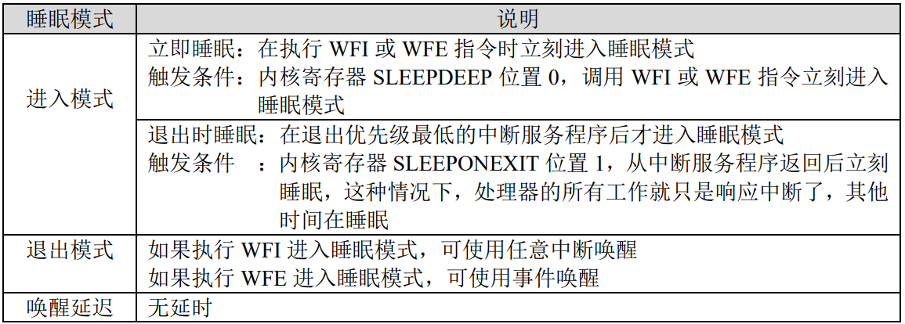


**停止模式**
进入停止模式，所有的时钟都关闭，所有的外设也就停止了工作。但是 VDD电源是没有关闭的，所以内核的寄存器和内存信息都保留下来，等待重新开启时钟就可以从上次停止的地方继续执行程序。
值得注意的是：当电压调节器处于低功耗模式下，当系统从停止模式退出时，将会有一段额外的启动延时。如果在停止模式期间保持内部调节器开启，则退出启动时间会缩短，但相应的功耗会增加。

停止模式退出后：默认退出后HSI RC振荡器被选为系统时钟，如果我们使用的是HSE则需要重新初始化


**待机模式**

待机模式可实现最低功耗。该模式是在 CM3 深睡眠模式时关闭电压调节器，整个 1.8V 供电区域被断电。PLL、HSI 和 HSE 振荡器也被断电。除备份域（RTC 寄存器、RTC 备份寄存器和备份 SRAM）和待机电路中的寄存器外，SRAM 和其他寄存器内容都将丢失。不过如果我们使能了备份区域（备份 SRAM、RTC、LSE），那么待机模式下的功耗，将达到 3.8uA 左右。

待机模式下，所有I/O引脚处于高阻态，除了复位引脚、被使能的唤醒引脚，不能下载程序，必须退出待机模式才能下载


## 相关寄存器

| **寄存器** | **名称**            | **作用**                                                     |
| ---------- | ------------------- | ------------------------------------------------------------ |
| SCB_SCR    | 系统控制寄存器      | 选择休眠和深度休眠模式，用于其他低功耗特性的控制             |
| PWR_CR     | 电源控制寄存器      | 可以设置低功耗相关（清除标记位、模式）/设置PVD检测的电压阈值以及使能PVD |
| PWR_CSR    | 电源控制/状态寄存器 | 用于查看系统当前状态（待机/唤醒标志 使能唤醒引脚、PVD输出）  |

**系统控制寄存器(SCB_SCR)**


进入停止模式 or 待机模式 ，SLEEPDEEP置1

**电源控制寄存器PWR_CR**


停止模式：PDDS清0，LPDS选调节器模式

待机模式：清除唤醒位 CWUF

**电源控制状态寄存器PWR_CSR**


待机模式下 ，使用WKUP引脚唤醒并需要清除WUF标记位

WKUP上升沿才能唤醒待机状态

PVDO:通过该位判断此时电压与设定的电压阈值关系

## 常用函数

### 电源管理

|          驱动函数           |   关联寄存器   |       功能描述       |
| :-------------------------: | :------------: | :------------------: |
| HAL_PWR_EnterSLEEPMode(...) |    SCB_SCR     |     进入睡眠模式     |
|  HAL_PWR_EnterSTOPMode(…)   | PWR_CR/SCB_SCR |     进入停止模式     |
| HAL_PWR_EnterSTANDBYMode(…) | PWR_CR/SCB_SCR |     进入待机模式     |
| HAL_PWR_EnableWakeUpPin(…)  |    PWR_CSR     | 使能WKUP管脚唤醒功能 |
|   __HAL_PWR_CLEAR_FLAG(…)   |     PWR_CR     |  清除PWR的相关标记   |
|   __HAL_PWR_GET_FLAG(...)   |     PWR_CR     |      获取标志位      |
| __HAL_RCC_PWR_CLK_ENABLE(…) |  RCC_APB1ENR   |     使能电源时钟     |

````c
/**
*	参数1：指定稳压器的状态。有两个选择，PWR_MAINREGULATOR_ON 表示稳压器处于正常模式，PWR_LOWPOWERREGULATOR_ON 表示稳压器处于低功耗模式。对应的是 PWR_CR 寄存器的 LPDS 位的设置（该形参在该函数中没有实质用处）。
*	参数2：指定进入睡眠模式的方式。有两个选择，PWR_SLEEPENTRY _WFI 表示使用 WFI指令，PWR_SLEEPENTRY_WFE 表示使用 WFE 指令。
**/
void HAL_PWR_EnterSLEEPMode(uint32_t Regulator, uint8_t SLEEPEntry);
/** 与上方函数参数一样 **/
void HAL_PWR_EnterSTOPMode (uint32_t Regulator, uint8_t STOPEntry);

/** 使能唤醒引脚函数
*	形参 1 取值范围：PWR_WAKEUP_PIN1。
**/
void HAL_PWR_EnableWakeUpPin (uint32_t WakeUpPinPolarity);
void HAL_PWR_EnterSTANDBYMode (void);
````

### 电源监控

|          驱动函数           | 关联寄存器  |    功能描述     |
| :-------------------------: | :---------: | :-------------: |
| __HAL_RCC_PWR_CLK_ENABLE(…) | RCC_APB1ENR |  使能电源时钟   |
|    HAL_PWR_ConfigPVD(…)     |   PWR_CR    | 配置PVD相关参数 |
|    HAL_PWR_EnablePVD(…)     |   PWR_CR    |   使能PVD功能   |
|   __HAL_PWR_GET_FLAG(...)   |   PWR_CR    |   获取标志位    |

````c
typedef struct  { 
	uint32_t			PVDLevel; 		/* PVD检测级别 */ 
	uint32_t			Mode; 			/* PVD的EXTI检测模式 */ 
} PWR_PVDTypeDef;
#define PWR_PVDLEVEL_0                  PWR_CR_PLS_2V2
#define PWR_PVDLEVEL_1                  PWR_CR_PLS_2V3
#define PWR_PVDLEVEL_2                  PWR_CR_PLS_2V4
#define PWR_PVDLEVEL_3                  PWR_CR_PLS_2V5
#define PWR_PVDLEVEL_4                  PWR_CR_PLS_2V6
#define PWR_PVDLEVEL_5                  PWR_CR_PLS_2V7
#define PWR_PVDLEVEL_6                  PWR_CR_PLS_2V8
#define PWR_PVDLEVEL_7                  PWR_CR_PLS_2V9 

#define PWR_PVD_MODE_NORMAL
#define PWR_PVD_MODE_IT_RISING
#define PWR_PVD_MODE_IT_FALLING
#define PWR_PVD_MODE_IT_RISING_FALLING
#define PWR_PVD_MODE_EVENT_RISING
#define PWR_PVD_MODE_EVENT_FALLING
#define PWR_PVD_MODE_EVENT_RISING_FALLING

/**
*	参数：PWR_FLAG_WU唤醒标志位，PWR_FLAG_SB待机标志位，PWR_FLAG_PVDO PVD输出标志位
**/
__HAL_PWR_GET_FLAG()
````

## 案例

使用按键1 2 3选择进入的模式，使用外部中断(GPIOA_PIN0)来唤醒模式,使用PVD监控电源电压

问题：无法进入睡眠模式

````c
#define PWR_WU_GPIO_PORT    GPIOA
#define PWR_WU_GPIO_PIN     GPIO_PIN_0
GPIO_InitTypeDef GPIO_InitStructure;
/**电源管理**/
void PWR_WU_Init(void){
    GPIO_InitStructure.Mode = GPIO_MODE_IT_RISING;
    GPIO_InitStructure.Pin = PWR_WU_GPIO_PIN;
    GPIO_InitStructure.Pull = GPIO_PULLDOWN;
    GPIO_InitStructure.Speed = GPIO_SPEED_FREQ_HIGH;
    
    __HAL_RCC_GPIOA_CLK_ENABLE();
    
    HAL_GPIO_Init(PWR_WU_GPIO_PORT,&GPIO_InitStructure);
        
    HAL_NVIC_SetPriorityGrouping(2);
    HAL_NVIC_SetPriority(EXTI0_IRQn,2,2);
    HAL_NVIC_EnableIRQ(EXTI0_IRQn);
}
void EXTI0_IRQHandler(void){
    HAL_GPIO_EXTI_IRQHandler(PWR_WU_GPIO_PIN);
}
void HAL_GPIO_EXTI_Callback(uint16_t GPIO_Pin){
    if(GPIO_Pin  == PWR_WU_GPIO_PIN){
        __HAL_GPIO_EXTI_CLEAR_IT(GPIO_Pin);      // 清除中断标志位，实际上不用写，HAL_GPIO_EXTI_IRQHandler中已经执行过了
    }
}
/**电源监控**/
void PWR_PVD_Init(void){
    __HAL_RCC_PWR_CLK_ENABLE();
    
    PWR_PVDTypeDef PWR_PVDStructure;
    PWR_PVDStructure.PVDLevel = PWR_PVDLEVEL_7;               /* 检测电压级别 */     
    PWR_PVDStructure.Mode = PWR_PVD_MODE_IT_RISING_FALLING;   /* 使用中断线的上升沿和下降沿双边缘触发，高于低于都触发 */
    HAL_PWR_ConfigPVD(&PWR_PVDStructure);
    HAL_PWR_EnablePVD();
    
    HAL_NVIC_SetPriority(PVD_IRQn, 2, 2);
    HAL_NVIC_EnableIRQ(PVD_IRQn); 
}
void PVD_IRQHandler(void){
    HAL_PWR_PVD_IRQHandler();
}
void HAL_PWR_PVDCallback(void){
    if(__HAL_PWR_GET_FLAG(PWR_FLAG_PVDO)){  /* 电压比 PLS 所选电压还低 */
        printf("电压过低\r\n");
    }else{
        printf("电压正常\r\n");
    }
}
int main(void){
    HAL_Init();                                 /* 初始化HAL库 */
    sys_stm32_clock_init(RCC_PLL_MUL9);         /* 设置时钟,72M */
    delay_init(72);                             /* 初始化延时函数 */
    UART_Init();
    key_init();
    PWR_WU_Init();
    PWR_PVD_Init();
    uint8_t key;
    printf("低功耗实验\r\n");
    while(1){
        key = key_scan(0);
        
        if(key){
            switch(key){
                case 1:   // 进入睡眠
                      printf("进入睡眠模式\r\n");
                      HAL_PWR_EnterSLEEPMode(PWR_MAINREGULATOR_ON,PWR_SLEEPENTRY_WFI);
                      printf("退出睡眠模式\r\n");
                break;
                case 2:  // 进入停机转态
                      printf("进入停机模式\r\n");
                      HAL_PWR_EnterSTOPMode(PWR_LOWPOWERREGULATOR_ON,PWR_SLEEPENTRY_WFI);
                      sys_stm32_clock_init(RCC_PLL_MUL9);           /* 需要重新初始化时钟 */
                      delay_init(72); 
                      printf("退出停机模式\r\n");
                break;
                case 3:  //进入待机模式
                        printf("进入待机模式\r\n");
                        __HAL_RCC_PWR_CLK_ENABLE();                 /* 使能电源时钟 */
                        HAL_PWR_EnableWakeUpPin(PWR_WAKEUP_PIN1);   /* 使能 KEY_UP 引脚的唤醒功能 */
                        __HAL_PWR_CLEAR_FLAG(PWR_FLAG_WU);          /* 需要清此标记，否则将保持唤醒状态 */
                        HAL_PWR_EnterSTANDBYMode();                 /* 进入待机模式 */
                        printf("退出待机模式\r\n");                   // 这一句永远没法触发，因为待机模式会从启MCU
                break;
                default:break;
            }
        }
    }
}
````


# 其他

## SysTick

## FPU

FPU：Float Point Unit，浮点运算单元


|      对比项       |   F1   |   F4   |  F7  |  H7  |
| :---------------: | :----: | :----: | :--: | :--: |
|      有无FPU      |   无   |   有   |  有  |  有  |
| 是否支持单精度FPU | 不支持 |  支持  | 支持 | 支持 |
| 是否支持双精度FPU | 不支持 | 不支持 | 支持 | 支持 |

## DSP

提高数字运算速度

DSP：Digital Signal Processing，数字信号处理

M3内核没有硬件FPU，也没有DSP指令集

M4和M7等内核自带FPU和DSP单元，并集成了专用的DSP指令集（如：单周期乘加指令(MAC)、优化的单指令多数据流指令(SIMD)、饱和算术运算等多种数字信号处理指令）

M4/M7执行的DSP指令可以在单周期内完成，M3则需要多个指令和多个周期才能完成


## IAP

**STM32三种烧录方式**

* ISP In System Programming（在系统编程）：执行芯片厂商的 Bootloader 程序进入 ISP 模式，进入ISP 模式后，用户可选择官方提供的烧录通信接口（如：串口），并配合ISP 编程工具（如：FlyMcu）对闪存进行烧录。
* ICP In Circuit Programing（在线编程）：使用IDE并通过JTAG/SWD接口对闪存进行烧录。常用
* IAPIn Application Programming（在应用编程）：使用用户的应用程序（也称为：Bootloader程序）对闪存进行烧录。该应用程序需要通过一种通信接口（如：IO口\USB\CAN\UART\I2C\SPI等）对闪存进行烧录（即把APP程序烧录到闪存）。IAP 通常被开发者用作远程升级的手段。

前两种生成.hex文件，IAP生成的是.bin文件


## USB

USB， 英文全称：Universal Serial Bus，即通用串行总线

USB提供适合各种应用的传输协议，而且协议标准向下兼容

| **标准**        | **推出时间** | **最大传输速度** | **电缆长度** | **速度模式** |
| --------------- | ------------ | ---------------- | ------------ | ------------ |
| USB 1.0         | 1996         | 1.5Mbps          | 3m           | 低速模式     |
| USB 1.1         | 1998         | 12Mbps           | 3m           | 全速模式     |
| USB 2.0         | 2000         | 480Mbps          | 5m           | 高速模式     |
| USB 3.2 Gen 1   | 2008         | 5Gbps            | 3m           | 超高速模式   |
| USB 3.2 Gen 2   | 2013         | 10Gbps           | 3m           | 超高速模式   |
| USB 3.2 Gen 2x2 | 2017         | 20Gbps           | 3m           | 超高速模式   |
| USB 4           | 2019         | 40Gbps+          | 0.8m         | 超高速模式   |

USB是一种主从结构的系统，数据交换只能发生在主从设备之间，且只能由主机主动发起

USB主机具有一个或者多个USB主控制器(Host controller)和根集线器(Root Hub)

USB主控制器：主要负责数据处理

根集线器：提供一个连接主控制器与设备之间的接口和通路

USB从机可以是各种USB设备也可以是USB集线器

USB集线器(USB Hub)：用于对原有的USB接口数量进行扩展，但不能扩展更多的带宽

USB OTG作为USB协议的补充版本，允许同一设备，在不同场合下，在主机和从机之间切换


**STM32的USB**

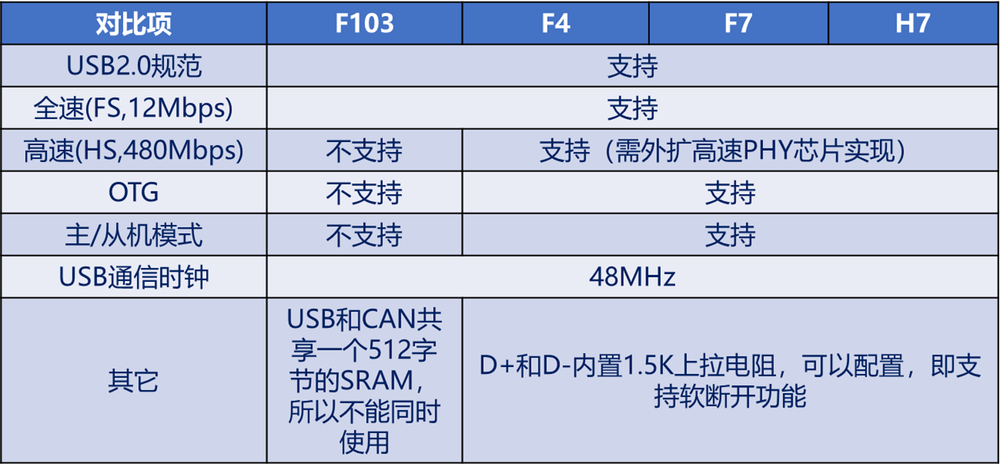


**STM32 USB框图**

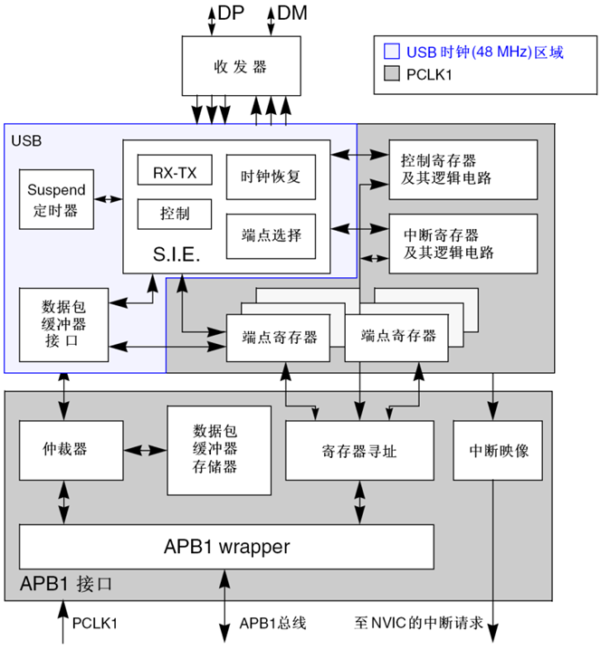

48MHz的USB时钟由锁相环经过1.5分频得到

# HAL库相关


AFIO宏定义都定义在stm32f1xx_hal_gpio_ex.h中

## 回调机制

### **外设初始化MSP**


USART为例


### **中断回调机制**

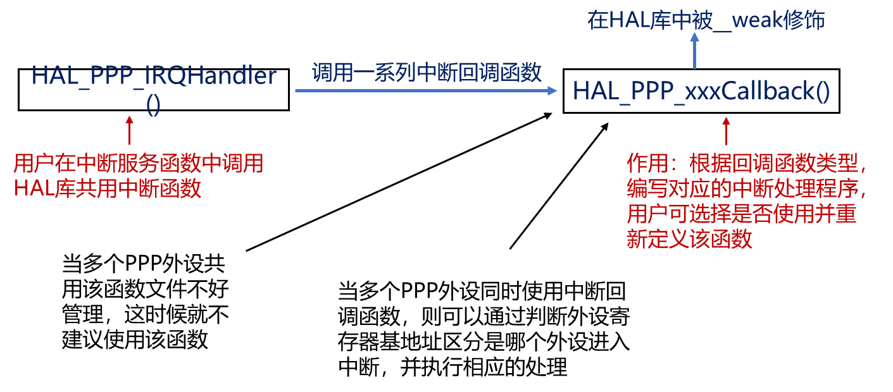

USART为例

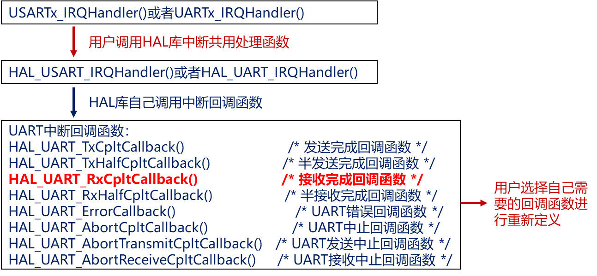


