# 简介

## RTOS简介

假设要调用两个函数AB，AB执行的时间都很长，裸机就很难处理这种场景。

如果非要基于裸机解决这个问题的话，可以使用状态机。

示例代码如下：


需要我们使用状态机拆分程序：

* 比较麻烦
* 有些复杂的程序无法拆分为状态机


基于裸机的程序框架无法完美地解决这类问题：复杂的、很耗时的多个函数。


## 目录结构

以 Keil 工具下 STM32F103 芯片为例，它的 FreeRTOS 的目录如下:


只需要保存需要的文件，其余文件删除即可

当我们直接使用完整FreeRTOS的源码时，其中的一些程序我们可能不需要，这就需要我们进行裁减，让程序体积变小


## 移植

移植到江协科技的Demo中，

在freertosconfig.h文件增加以下宏定义

````c
#define xPortPendSVHandler     PendSV_Handler
#define vPortSVCHandler     SVC_Handler
#define xPortSysTickHandler SysTick_Handler
#define INCLUDE_xTaskGetCurrentTaskHandle 1
````

在stm32f10x_it.c文件中删除PendSV_Handler、SVC_Handler、SysTick_Handler三个中断函数。


# 编程规范

## 数据类型

**TickType_t：**

* FreeRTOS 配置了一个周期性的时钟中断：Tick Interrupt
* 每发生一次中断，中断次数累加，这被称为 tick count
*  tick count 这个变量的类型就是 TickType_t
* TickType_t 可以是 16 位的，也可以是 32 位的
  * FreeRTOSConfig.h 中定义 configUSE_16_BIT_TICKS 时，TickType_t 就是 uint16_t
  * 否则 TickType_t 就是 uint32_t， 对于 32 位架构，建议把 TickType_t 配置为 uint32_t

**BaseType_t：**

* 这是该架构最高效的数据类型
* 32 位架构中，它就是 uint32_t
* 16 位架构中，它就是 uint16_t
* 8 位架构中，它就是 uint8_t
* BaseType_t 通常用作简单的返回值的类型，还有逻辑值，比如 `pdTRUE/pdFALSE`

## 变量名

| 变量前缀 |                             含义                             |
| :------: | :----------------------------------------------------------: |
|    c     |                             char                             |
|    s     |                        int16_t,short                         |
|    l     |                         int32_t.long                         |
|    x     | BaseType_t 或者 其他非标准类型(结构体、taskhandle、queuehandle等) |
|    u     |                           unsigned                           |
|    p     |                             指针                             |
|    uc    |                    uint8_t,unsigned char                     |
|    pc    |                           char指针                           |

````c
TCB_t * pxNewTCB;        // p为指针，x为非标准类型，NewTCB为含义
BaseType_t xReturn；     // x为BaseType_t,Return为含义
````


## 函数名

一个函数名分为三部分，第一部分为返回值类型，第二部分为在哪个文件中定义，第三部分为含义


|    函数名前缀     |                       含义                       |
| :---------------: | :----------------------------------------------: |
| vTaskPrioritySet  |      返回值类型：void<br/>在 task.c 中定义       |
|   xQueueReceive   |   返回值类型：BaseType_t<br/>在 queue.c 中定义   |
| pvTimerGetTimerID | 返回值类型：pointer to void<br/>在 tmer.c 中定义 |
| prvSetupHardware  | prv为私有函数，static函数<br/>在 Setup.c 中定义  |


## 宏的名

宏的名字是大小，可以添加小写的前缀。前缀是用来表示：宏在哪个文件中定义。

|              宏的前缀              |  含义：在哪个文件里定义   |
| :--------------------------------: | :-----------------------: |
|     port (比如 portMAX_DELAY)      | portable.h 或 portmacro.h |
|  task (比如 taskENTER_CRITICAL())  |          task.h           |
|          pd (比如 pdTRUE)          |        projdefs.h         |
| config (比如 configUSE_PREEMPTION) |     FreeRTOSConfig.h      |
|      err (比如 errQUEUE_FULL)      |        projdefs.h         |

通用的宏定义如下：

|   宏    |  值  |
| :-----: | :--: |
| pdTRUE  |  1   |
| pdFALSE |  0   |
| pdPASS  |  1   |
| pdFAIL  |  0   |


# 任务管理

## 创建任务

在STM32裸机编程中，一个普通任务执行完，才能执行下一个普通任务

在FreeRTOS中，可以创建多个任务(Task),也可以理解为线程(Thread)

关于任务的函数都在`tasks.c`中

### 动态创建

使用`xTaskCreate()`创建任务函数

```c
BaseType_t xTaskCreate( TaskFunction_t pxTaskCode,                // 被调用任务的函数指针
                        const char * const pcName,                // 任务名称
                        const configSTACK_DEPTH_TYPE usStackDepth,// 栈的深度
                        void * const pvParameters,                // 被调用任务函数的参数，可为NULL
                        UBaseType_t uxPriority,                   // 优先级
                        TaskHandle_t * const pxCreatedTask )      // 任务句柄，以后使用这个来操作任务，可为NULL
```

|     参数      |                             描述                             |
| :-----------: | :----------------------------------------------------------: |
|  pxTaskCode   | 函数指针，可以简单地认为任务就是一个 C 函数。<br/>它稍微特殊一点：永远不退出，或者退出时要调用"vTaskDelete(NULL)" |
|    pcName     | 任务的名字，FreeRTOS 内部不使用它，仅仅起调试作用。<br/>长度为：configMAX_TASK_NAME_LEN |
| usStackDepth  | 每个任务都有自己的栈，这里指定栈大小。<br/>单位是 word，比如传入 100，表示栈大小为 100 word，也就是 400 字节。<br/>最大值为 uint16_t 的最大值。<br/>怎么确定栈的大小，并不容易，很多时候是估计。<br/>精确的办法是看反汇编码。 |
| pvParameters  |   调用 pxTaskCode 函数指针时用到：pvTaskCode(pvParameters)   |
|  uxPriority   | 优先级范围：0~(configMAX_PRIORITIES – 1)<br/>数值越小优先级越低，<br/>如果传入过大的值，xTaskCreate 会把它调整为(configMAX_PRIORITIES –1) |
| pxCreatedTask | 用来保存 xTaskCreate 的输出结果：task handle。<br/>以后如果想操作这个任务，比如修改它的优先级，就需要这个 handle。<br/>如果不想使用该 handle，可以传入 NULL。 |
|    返回值     | 成功：pdPASS；<br/>失败：errCOULD_NOT_ALLOCATE_REQUIRED_MEMORY(失败原因只有内存不足)<br/>注意：文档里都说失败时返回值是 pdFAIL，这不对。<br/>pdFAIL 是 0，errCOULD_NOT_ALLOCATE_REQUIRED_MEMORY 是-1。 |

**代码实例**

````c
void Task1(void* data){
	while(1){
		printf("1");	
	}
}
void Task2(void* data){
	while(1){
		printf("2");	
	}
}
int main( void )
{
    prvSetupHardware();
    
	TaskHandle_t task1Handle;
	TaskHandle_t task2Handle;

	xTaskCreate(Task1,"task1",100,NULL,1,&task1Handle);        // 调用Task1函数
	xTaskCreate(Task2,"task2",100,NULL,1,NULL);                // 调用Task2函数，句柄可设置为NULL
	
	vTaskStartScheduler();
	return 0;
}
````

创建同一个任务函数：用同一个函数，创建不同的任务

````c
void TaskGeneric(void* data){
	while(1){
		int i = (int)data;
		printf("%d",i);	
	}
}
int main( void )
{
	prvSetupHardware();
	
	xTaskCreate(TaskGeneric,"task4",100,(void *) 1,1,NULL);  // 给不同的参数
	xTaskCreate(TaskGeneric,"task5",100,(void *) 2,1,NULL);
	
    vTaskStartScheduler();

	return 0;
}
````


源码的一部分，可以看到动态的取分配TCB_t

````c
typedef struct tskTaskControlBlock * TaskHandle_t;

typedef struct tskTaskControlBlock{
    //……
} tskTCB;
typedef tskTCB TCB_t;                                 
// tskTCB、TCB_t、 TaskHandle_t 其实都是tskTaskControlBlock 任务控制块
BaseType_t xTaskCreate( TaskFunction_t pxTaskCode,
                            const char * const pcName,
                            const configSTACK_DEPTH_TYPE usStackDepth,
                            void * const pvParameters,
                            UBaseType_t uxPriority,
                            TaskHandle_t * const pxCreatedTask ){
    TCB_t * pxNewTCB;
    //……
    pxNewTCB = ( TCB_t * ) pvPortMalloc( sizeof( TCB_t ) );        //动态的取分配TCB_t
    //……
}
````

### 静态创建

使用`xTaskCreateStatic()`函数静态创建任务

````c
TaskHandle_t xTaskCreateStatic( TaskFunction_t 			pxTaskCode,
                                 const char * const 	pcName, 
                                 const uint32_t 		ulStackDepth,
                                 void * const 			pvParameters,
                                 UBaseType_t		 	uxPriority,
                                 StackType_t * const 	puxStackBuffer,
                                 StaticTask_t * const 	pxTaskBuffer )

````

比动态创建任务多了两个参数：

* puxStackBuffer	任务堆栈，一般为 数组类型要StackType_t类
* pxTaskBuffer	任务控制块

使用较为复杂，

1. 使用静态方法创建任务的时候需要将宏 `configSUPPORT_STATIC_ALLOCATION`设置为 1， 在文件 FreeRTOSConfig.h中,否则`xTaskCreateStatic()`函数不生效

````c
#define configSUPPORT_STATIC_ALLOCATION 1 //静态内存
````

2. 如果使用静态方法 的 话 需 要 用 户 实 现 两 个 函 数 vApplicationGetIdleTaskMemory() 和vApplicationGetTimerTaskMemory()。通过这两个函数来给空闲任务和定时器服务任务的任务堆栈和任务控制块分配内存，这两个函数我们在 mainc.c 中定义

````c
void Task3(void* data){
	while(1){
		printf("3");	
	}
}
StackType_t puxStackBuffer[100];
StaticTask_t pxTask;

StackType_t xIdleTaskStack[100];
StaticTask_t xIdleTaskTCB;
void vApplicationGetIdleTaskMemory( StaticTask_t ** ppxIdleTaskTCBBuffer,
                                    StackType_t ** ppxIdleTaskStackBuffer,
                                    uint32_t * pulIdleTaskStackSize ){
    *ppxIdleTaskTCBBuffer = &xIdleTaskTCB;
    *ppxIdleTaskStackBuffer = xIdleTaskStack;
    *pulIdleTaskStackSize = 100;
}

int main( void )
{
	prvSetupHardware();

	xTaskCreateStatic(Task3,"Task3",100,NULL,1,puxStackBuffer,&pxTask);
	vTaskStartScheduler();
	return 0;
}
````


## 删除任务

使用`vTaskDelete( TaskHandle_t xTaskToDelete )`删除任务

* 参数：
  * 传入任务句柄：xTaskCreate 创建任务时可以得到一个句柄
  * 传入NULL：表示删除自己。

**代码案例**  当执行100次任务2后，任务1停止，当执行200次任务2后，任务2也停止

````c
TaskHandle_t task1Handle;
TaskHandle_t task2Handle;

void Task1(void* data){
	while(1){
		printf("1");	
	}
}
void Task2(void* data){
	int i = 0;
	while(1){
		if(i++ >= 100){
			vTaskDelete(task1Handle);        // 通过任务1的句柄删除任务1
		}
		if(i++ >= 200){
			vTaskDelete(NULL);                // 在本任务中调用NULL，则自删
		}
		printf("2");	
	}
}
int main( void )
{
	prvSetupHardware();

	xTaskCreate(Task1,"task1",100,NULL,1,&task1Handle);
	xTaskCreate(Task2,"task2",100,NULL,1,&task2Handle);

	vTaskStartScheduler();
	return 0;
}
````


## Tick

对于相同优先级的任务，FreeRTOS要轮流执行的话，就需要有系统心跳。系统心跳来源于SysTick系统定时器产生周期性中断，比如我们设置SysTick定时器10ms产生一次中断，那么FreeRTOS的心跳就是10ms。

如下图：

- 假设t1、t2、t3发生时钟中断
- 两次中断之间的时间被称为时间片(time slice、tick period)
- 时间片的长度由`configTICK_RATE_HZ` 决定，假设`configTICK_RATE_HZ`为100，那么时间片长度就是10ms

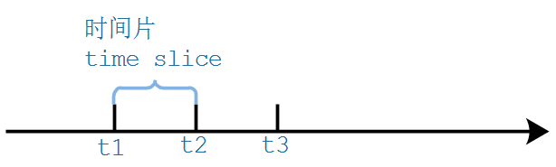


这个在FreeROS.h中被定义为：

```h
#define portTICK_RATE_MS              portTICK_PERIOD_MS
```

然后跟踪portTICK_PERIOD_MS发现在portmacro.h中被定义为：

```h
#define portTICK_PERIOD_MS    ( ( TickType_t ) 1000 / configTICK_RATE_HZ ) // 每毫秒tick多少次
```

然后继续跟踪可以知道configTICK_RATE_HZ是在FreeRTOSConfig.h中定义的：

```h
#define configTICK_RATE_HZ                    ((TickType_t)1000)          // 默认为1秒tick1000次
```

configTICK_RATE_HZ其含义是1秒钟TICK中断产生的次数，因为FreeRTOS使用Tick终端进行调度，这个频率越高则定时的精度越高，但是由此带来的系统开销也越大。


知道了这个宏定义以后，我们就可以进行时间的换算了，例如我们想演示500ms，则可以使用：

```c
vTaskDelay(500/portTICK_RATE_MS);
```

 

通过`xTaskGetTickCount()`函数获取Tick的次数

````c
TickType_t Tc = xTaskGetTickCount();   //获取当前Tick的次数
````

可以使用Tick来衡量时间，比如：

```c
vTaskDelay(2);  // 等待2个Tick，假设configTICK_RATE_HZ=100, Tick周期时10ms, 等待20ms

// 还可以使用pdMS_TO_TICKS宏把ms转换为tick
vTaskDelay(pdMS_TO_TICKS(100));	 // 等待100ms
```

**pdMS_TO_TICKS**
这是一个带参数的宏，其实本质上就是把上面的那个公式进行了一次封装，将毫秒数换算成了tick数，projdefs.h中的宏定义：

```h
#ifndef pdMS_TO_TICKS
    #define pdMS_TO_TICKS( xTimeInMs )    ( ( TickType_t ) ( ( ( TickType_t ) ( xTimeInMs ) * ( TickType_t ) configTICK_RATE_HZ ) / ( TickType_t ) 1000U ) )
#endif
```

例如我们上面把500/portTICK_RATE_MS进行展开，其实就是500*configTICK_RATE_HZ/1000了。

所以上面的延时也可以写成：

```c
vTaskDelay(pdMS_TO_TICKS(500));
```


## 任务调度

Freertos支持三种任务调度方式：

1.抢占式调度：主要是针对优先级不同的任务，每个任务都有一个优先级，优先级高的任务可以抢占优先级低的任务。

2.时间片调度：主要针对优先级相同的任务，当多个任务的优先级相同时， 任务调度器会在每一次系统时钟节拍到的时候切换任务。

3.协程式调度：当前执行任务将会一直运行，同时高优先级的任务不会抢占低优先级任务


FreeRTOS现在虽然还支持，但是官方已经表示不再更新协程式调度

注：抢占式调度和时间片轮转可以同时存在，当有高优先级任务就绪时，运行高优先级任务；当最高优先级的任务有好几个时，这几个任务可以以时间片轮转方式调度


优先级的取值范围是：0~(configMAX_PRIORITIES – 1)，数值越大优先级越高。

## 任务状态

1.运行态(Run)：正在执行的任务，该任务就处于运行态，如果使用的是单核处理器的话那么不管在任何时刻永远都只有一个任务处于运行态

2.就绪态(Ready)：处于就绪态的任务是那些已经准备就绪(这些任务没有被阻塞或者挂起)，可以运行的任务，但是处于就绪态的任务还没有运行，因为有一个同优先级或者更高优先级的任务正在运行！

3.阻塞态(Blocked)：如果一个任务因延时(调用了函数 `vTaskDelay()`)或等待外部事件发生，那么这个任务就处于阻塞态。任务进入阻塞态会有一个超时时间，当超过这个超时时间 任务就会退出阻塞态。

4.挂起态(Suspended)：任务进入挂起态以后也不能被调度器调用进入运行态，但是进入挂起态的任务 没有超时时间。任务进入和退出挂起态通过调用函数 `vTaskSuspend()` 和 `vTaskResume()`

````c
void vTaskDelay( const TickType_t xTicksToDelay );     //进入阻塞状态,参数数字,阻塞 参数个 tick
// 进入阻塞状态，从 参数1 开始进入阻塞，到 参数2 退出阻塞;也就是最多阻塞 参数2 个tick
BaseType_t xTaskDelayUntil( TickType_t * const pxPreviousWakeTime,
                                const TickType_t xTimeIncrement );
    
    
void vTaskSuspend( TaskHandle_t xTaskToSuspend );      //使进入挂起态状态,参数任务句柄
void vTaskResume( TaskHandle_t xTaskToResume )         //退出挂起态状态,参数任务句柄
````


````c
int task1Flag = 0;
int task2Flag = 0;
int task3Flag = 0;

TaskHandle_t task1Handle;
TaskHandle_t task2Handle;
TaskHandle_t task3Handle;

void Task1(void* data){
	TickType_t tStart = xTaskGetTickCount();         // 获取开始时的tick数
	TickType_t t;
	int flag = 0;
	while(1){
		t = xTaskGetTickCount();                     // 获取当前时的tick数
		task1Flag = 1;
		task2Flag = 0;
		task3Flag = 0;
		printf("1");	
		
		if(!flag && (t > tStart +10)){
			vTaskSuspend(task3Handle);
			flag = 1;
		}
		if(flag && (t > tStart +20)){
			vTaskResume(task3Handle);
			flag = 0;
		}
	}
}
void Task2(void* data){
	int i = 0;
	while(1){
		task1Flag = 0;
		task2Flag = 1;
		task3Flag = 0;
		printf("2");	
		
		vTaskDelay(10);          // 阻塞10个tick
	}
}
void Task3(void* data){
	while(1){
		task1Flag = 0;
		task2Flag = 0;
		task3Flag = 1;
		printf("3");	
	}
}
int main( void )
{
	prvSetupHardware();
	xTaskCreate(Task1,"task1",100,NULL,1,&task1Handle);
	xTaskCreate(Task2,"task2",100,NULL,1,&task2Handle);
	xTaskCreate(Task3,"task3",100,NULL,1,&task3Handle);
	
	vTaskStartScheduler();
	return 0;
}
````


**vTaskDelay()和vTaskDelayUntil()的区别**

````c
int rank[5] = {5,33,71,23,10};
void Task1(void* data){
	TickType_t tStart = xTaskGetTickCount();
	int i = 0,j = 0;
	while(1){
		task1Flag = 1;
		task2Flag = 0;
		for(i = 0;i < rank[j];i++){	   // 模拟执行时间，每次执行的时间都不一样
			printf("1");
		}
		j++;
		if(j == 5){
			j = 0;
		}
		vTaskDelay(10);                // 从任务停止到下一次任务开始的时间一致，不论本次任务执行多长时间 
		//vTaskDelayUntil(&tStart,10); // 从任务停止到任务结束的时间一致，不论本次任务执行多长时间
	}
}
void Task2(void* data){
	int i = 0;
	while(1){
		task1Flag = 0;
		task2Flag = 1;
		printf("2");	
	}
}
int main( void )
{
	prvSetupHardware();
	xTaskCreate(Task1,"task1",100,NULL,2,&task1Handle);
	xTaskCreate(Task2,"task2",100,NULL,1,&task2Handle);
	vTaskStartScheduler();
	return 0;
}
````

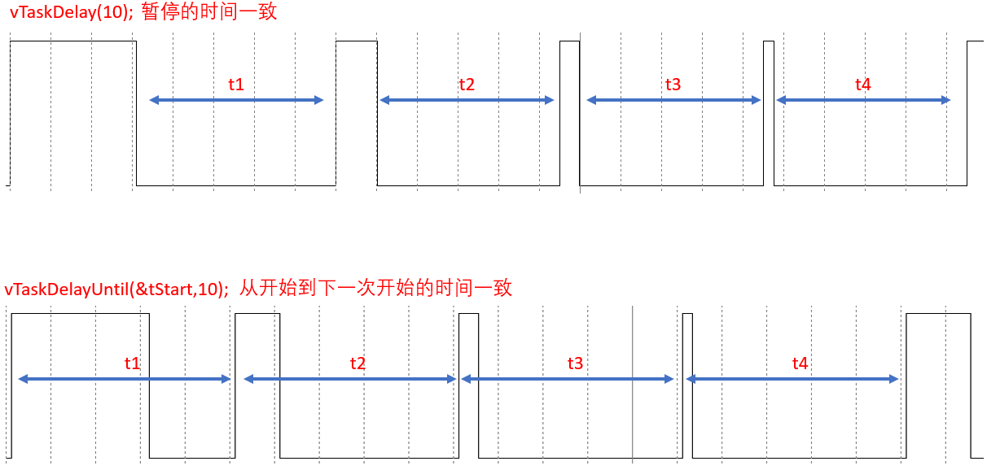

`vTaskDelayUntil( pxPreviousWakeTime, xTimeIncrement ) `实现原理：第一次任务传入pxPreviousWakeTime 到xTimeIncrement停止，下一次的`pxPreviousWakeTime = pxPreviousWakeTime+xTimeIncrement`自动完成赋值


# 空闲任务

**空闲任务(Idle 任务)的作用：**释放被删除任务 的内存。

除了上述目的之外，为什么必须要有空闲任务？一个良好的程序，它的任务都是事件驱动的：平时大部分时间处于阻塞状态。有可能我们自己创建的所有任务都无法执行，但是调度器必须能找到一个可以运行的任务：所以，我们要提供空闲任务。在使用`vTaskStartScheduler()`函数来创建、启动调度器时，这个函数内部会创建空闲任务：

* 空闲任务优先级为 0：它不能阻碍用户任务运行
* 空闲任务要么处于就绪态，要么处于运行态，永远不会阻塞

空闲任务的优先级为 0，这意味着一旦某个用户的任务变为就绪态，那么空闲任务马上被切换出去，让这个用户任务运行。在这种情况下，我们说用户任务"抢占"(pre-empt)了空闲任务，这是由调度器实现的。
要注意的是：如果使用 `vTaskDelete()`来删除任务，那么你就要确保空闲任务有机会执行，否则就无法释放被删除任务的内存。

空闲任务：是在系统中的所有其他任务都阻塞或被挂起才运行的


**实验：**main创建任务1，任务1创建任务2，任务2自杀

````c
int task1Flag = 0;
int task2Flag = 0;
int taskIdleFlag = 0;

TaskHandle_t task2Handle;

void Task2(void* data){
	while(1){
		task1Flag = 0;
		task2Flag = 1;
		taskIdleFlag = 0;
		printf("2");
		vTaskDelay(2);     // 由于任务2的优先级高，如果不进入等待，则会一直执行任务2
		vTaskDelete(NULL); // 任务2 自杀
	}
}

void Task1(void* data){
	BaseType_t xReturn;
	while(1){	
		task1Flag = 1;
		task2Flag = 0;
		taskIdleFlag = 0;
		printf("1");
        // 创建任务2，优先级2，高于任务一的优先级;返回pdPASS则表示创建成功
		xReturn = xTaskCreate(Task2,"task2",100,NULL,2,&task2Handle);  
		if(xReturn != pdPASS){   
			printf("err\n");     // 如果无法创建任务2则打印err
		}
	}
}
int main( void )
{
	prvSetupHardware();
	xTaskCreate(Task1,"task1",100,NULL,1,&task1Handle);    // 创建任务1，优先级1
	vTaskStartScheduler();
	return 0;
}
````

由于任务2自杀，而现在没有空闲任务执行清除操作，所以会打印err,因为栈已经满了

**结果：** 自杀的任务，无法清零自身内存，如果此时没有空闲任务执行清除操作，则崩溃


## 钩子函数

原理上我们可以直接在FreeRTOS的源码中编写空闲任务，但是破坏FreeRTOS的完整性，所以就引出了钩子函数，我们可以在钩子函数中执行对空闲任务的操作，FreeRTOS最终会调用钩子函数


我们可以添加一个空闲任务的钩子函数(Idle Task Hook Functions)，空闲任务的循环每执行一次，就会调用一次钩子函数。钩子函数的作用有这些：

* 执行一些低优先级的、后台的、需要连续执行的函数
* 测量系统的空闲时间：空闲任务能被执行就意味着所有的高优先级任务都停止了，所以测量空闲任务占据的时间，就可以算出处理器占用率。
* 让系统进入省电模式：空闲任务能被执行就意味着没有重要的事情要做，当然可以进入省电模式了。
* 空闲任务的钩子函数的限制：
  * 不能导致空闲任务进入阻塞状态、暂停状态
  * 如果你会使用 `vTaskDelete()`来删除任务，那么钩子函数要非常高效地执行。
  * 如果空闲任务移植卡在钩子函数里的话，它就无法释放内存。也就是在钩子函数中不能有while等卡死的操作
* 钩子函数等源码在tasks.c 中

**钩子函数的使用**


1. `configUSE_IDLE_HOOK`宏定义为 1，放在FreeRTOSconfig.h中

   ````c
   #define configUSE_IDLE_HOOK			1
   ````

2. 在我们的代码中实现 `vApplicationIdleHook` 函数，在此函数中添加操作

````c
int task1Flag = 0;
int task2Flag = 0;
int taskIdleFlag = 0;
TaskHandle_t task1Handle;
TaskHandle_t task2Handle;
TaskHandle_t task3Handle;

void Task2(void* data){
	while(1){
		task1Flag = 0;
		task2Flag = 1;
		taskIdleFlag = 0;
		printf("2");
		vTaskDelay(2);
		vTaskDelete(NULL);
	}
}
void Task1(void* data){
	BaseType_t xReturn;
	while(1){	
		task1Flag = 1;
		task2Flag = 0;
		taskIdleFlag = 0;

		printf("1");
		xReturn = xTaskCreate(Task2,"task2",100,NULL,2,&task2Handle);
		if(xReturn != pdPASS){
			printf("err\n");
		}
	}
}
void vApplicationIdleHook(void){
		task1Flag = 0;
		task2Flag = 0;
		taskIdleFlag = 1;
		printf("0");
}
int main( void ){
	prvSetupHardware();
    // 必须设置为0优先级，因为如果高于1，空闲任务优先级为0，必须让空闲任务有运行的机会
	xTaskCreate(Task1,"task1",100,NULL,0,&task1Handle);      
	vTaskStartScheduler();
	return 0;
}
````


````c
xIdleTaskHandle = xTaskCreateStatic( prvIdleTask,
                                                 configIDLE_TASK_NAME,
                                                 ulIdleTaskStackSize,
                                                 ( void * ) NULL,       /*lint !e961.  The cast is not redundant for all compilers. */
                                                 portPRIVILEGE_BIT,     /* In effect ( tskIDLE_PRIORITY | portPRIVILEGE_BIT ), but tskIDLE_PRIORITY is zero. */
                                                 pxIdleTaskStackBuffer,
                                                 pxIdleTaskTCBBuffer ); /*lint !e961 MISRA exception, justified as it is not a redundant explicit cast to all supported compilers. */


static portTASK_FUNCTION( prvIdleTask, pvParameters )
{
    /* Stop warnings. */
    ( void ) pvParameters;
        #if ( configUSE_IDLE_HOOK == 1 )
            {
                extern void vApplicationIdleHook( void );

                /* Call the user defined function from within the idle task.  This
                 * allows the application designer to add background functionality
                 * without the overhead of a separate task.
                 * NOTE: vApplicationIdleHook() MUST NOT, UNDER ANY CIRCUMSTANCES,
                 * CALL A FUNCTION THAT MIGHT BLOCK. */
                vApplicationIdleHook();
            }
        #endif /* configUSE_IDLE_HOOK */
}
````


## 调度算法

````c
#define configUSE_PREEMPTION		1    // 是否抢占
#define configUSE_TIME_SLICING      1    // 是否轮转
#define configIDLE_SHOULD_YIELD		1    // 空闲任务是否让步
````

### 重要概念

* 正在运行的任务，被称为"正在使用处理器"，它处于运行状态。在单处理系统中，任何时间里只能有一个任务处于运行状态。
* 非运行状态的任务，它处于这3中状态之一：阻塞(Blocked)、暂停(Suspended)、就绪(Ready)。就绪态的任务，可以被调度器挑选出来切换为运行状态，调度器永远都是挑选最高优先级的就绪态任务并让它进入运行状态。
* 阻塞状态的任务，它在等待"事件"，当事件发生时任务就会进入就绪状态。事件分为两类：时间相关的事件、同步事件。所谓时间相关的事件，就是设置超时时间：在指定时间内阻塞，时间到了就进入就绪状态。使用时间相关的事件，可以实现周期性的功能、可以实现超时功能。同步事件就是：某个任务在等待某些信息，别的任务或者中断服务程序会给它发送信息。怎么"发送信息"？方法很多，有：任务通知(task notification)、队列(queue)、事件组(event group)、信号量(semaphoe)、互斥量(mutex)等。这些方法用来发送同步信息，比如表示某个外设得到了数据。

### **配置调度算法**

* 所谓调度算法，就是怎么确定哪个就绪态的任务可以切换为运行状态。
* 通过配置文件FreeRTOSConfig.h的两个配置项来配置调度算法：`configUSE_PREEMPTION`、`configUSE_TIME_SLICING`。
* 还有第三个配置项：`configUSE_TICKLESS_IDLE`，它是一个高级选项，用于关闭Tick中断来实现省电，后续单独讲解。现在我们假设`configUSE_TICKLESS_IDLE`被设为0，先不使用这个功能。
* 调度算法的行为主要体现在两方面：高优先级的任务先运行、同优先级的就绪态任务如何被选中。调度算法要确保同优先级的就绪态任务，能"轮流"运行，策略是"轮转调度"(Round Robin Scheduling)。轮转调度并不保证任务的运行时间是公平分配的，我们还可以细化时间的分配方法。


从3个角度统一理解多种调度算法：

* 可否抢占？高优先级的任务能否优先执行(配置项: `configUSE_PREEMPTION`)
  * 可以：被称作"可抢占调度"(Pre-emptive)，高优先级的就绪任务马上执行，下面再细化。
  * 不可以：不能抢就只能协商了，被称作"合作调度模式"(Co-operative Scheduling)
    * 当前任务执行时，更高优先级的任务就绪了也不能马上运行，只能等待当前任务主动让出CPU资源。
    * 其他同优先级的任务也只能等待：更高优先级的任务都不能抢占，平级的更应该老实点
* 可抢占的前提下，同优先级的任务是否轮流执行(配置项：`configUSE_TIME_SLICING`)
  * 轮流执行：被称为"时间片轮转"(Time Slicing)，同优先级的任务轮流执行，你执行一个时间片、我再执行一个时间片
  * 不轮流执行：英文为"without Time Slicing"，当前任务会一直执行，直到主动放弃、或者被**高优先级**任务抢占
* 在"可抢占"+"时间片轮转"的前提下，进一步细化：空闲任务是否让步于用户任务(配置项：`configIDLE_SHOULD_YIELD`)
  * 空闲任务低人一等，每执行一次循环，就看看是否主动让位给用户任务
  * 空闲任务跟用户任务一样，大家轮流执行，没有谁更特殊

**列表如下：**

| 配置项                  | A    | B      | C      | D      | E      |
| ----------------------- | ---- | ------ | ------ | ------ | ------ |
| configUSE_PREEMPTION    | 1    | 1      | 1      | 1      | 0      |
| configUSE_TIME_SLICING  | 1    | 1      | 0      | 0      | x      |
| configIDLE_SHOULD_YIELD | 1    | 0      | 1      | 0      | x      |
| 说明                    | 常用 | 很少用 | 很少用 | 很少用 | 很少用 |

A：可抢占+时间片轮转+空闲任务让步
B：可抢占+时间片轮转+空闲任务不让步
C：可抢占+非时间片轮转+空闲任务让步
D：可抢占+非时间片轮转+空闲任务不让步
E：合作调度

### **代码案例**

代码里创建了3个任务：Task1、Task2的优先级都是0，跟空闲任务一样，Task3优先级最高为2。程序里定义了4个全局变量，当某个的任务执行时，对应的变量就被设为1，可以通过Keil的逻辑分析仪查看任务切换情况：

````c
int task1Flag = 0;
int task2Flag = 0;
int task3Flag = 0;
int taskIdleFlag = 0;

void Task1(void* data){
	while(1){	
		task1Flag = 1;
		task2Flag = 0;
		task3Flag = 0;
		taskIdleFlag = 0;
		printf("1");
	}
}
void Task2(void* data){
	while(1){
		task1Flag = 0;
		task2Flag = 1;
		task3Flag = 0;
		taskIdleFlag = 0;
		printf("2");
	}
}
void Task3(void* data){
	while(1){
		task1Flag = 0;
		task2Flag = 0;
		task3Flag = 1;
		taskIdleFlag = 0;
		printf("3");

		vTaskDelay(2);        // 主动让出执行权
	}
}
void vApplicationIdleHook(void){
		task1Flag = 0;
		task2Flag = 0;
		task3Flag = 0;
		taskIdleFlag = 1;
		printf("0");
}
int main( void )
{
	prvSetupHardware();
	xTaskCreate(Task1,"task1",100,NULL,0,&task1Handle);
	xTaskCreate(Task2,"task2",100,NULL,0,&task2Handle);
	xTaskCreate(Task3,"task3",100,NULL,2,&task3Handle);   // 任务3的优先级最高
	vTaskStartScheduler();
	return 0;
}
````

**抢占与非抢占**

````c
// 实验1：抢占
#define configUSE_PREEMPTION		1
#define configUSE_TIME_SLICING      1
#define configIDLE_SHOULD_YIELD		1

// 实验2：不抢占
#define configUSE_PREEMPTION		0
#define configUSE_TIME_SLICING      1
#define configIDLE_SHOULD_YIELD		1
````

从下面的对比图可以知道：

- 抢占时：高优先级任务就绪时，就可以马上执行
- 不抢占时：优先级失去意义了，既然不能抢占就只能协商了，图中任务1一直在运行(一点都没有协商精神)，其他任务都无法执行。即使任务3的`vTaskDelay`已经超时、即使它的优先级更高，都没办法执行。


**时间片轮转与否**

````c
// 实验1：时间片轮转
#define configUSE_PREEMPTION		1
#define configUSE_TIME_SLICING      1
#define configIDLE_SHOULD_YIELD		1

// 实验2：时间片不轮转
#define configUSE_PREEMPTION		1
#define configUSE_TIME_SLICING      0
#define configIDLE_SHOULD_YIELD		1
````

从下面的对比图可以知道：

- 时间片轮转：在Tick中断中会引起任务切换
- 时间片不轮转：高优先级任务就绪时会引起任务切换，高优先级任务不再运行时也会引起任务切换。可以看到任务3就绪后可以马上执行，它运行完毕后导致任务切换。其他时间没有任务切换，可以看到任务1、任务2都运行了很长时间。

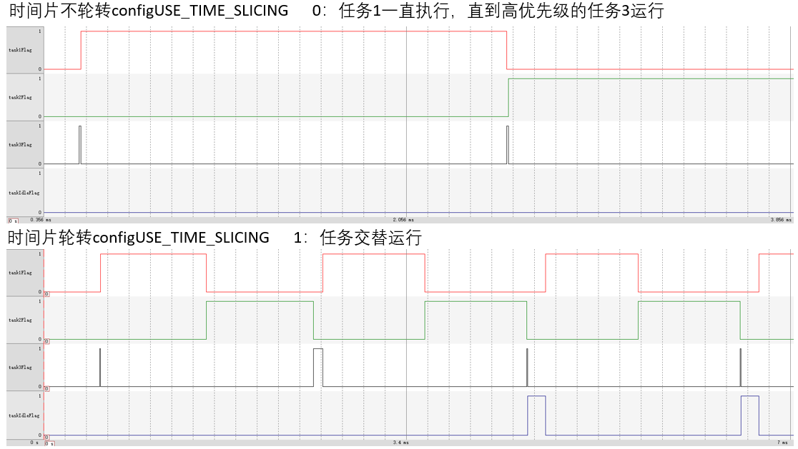


# 同步与互斥

## 同步与互斥的概念

一句话理解同步与互斥：我等你用完厕所，我再用厕所。

* 等，就是同步，让其步调一致。
* 厕所，就是互斥，同一时间只能让一个人使用。对于某些资源，同一时间只能有一个任务使用，他们必须独占的使用它，叫做互斥。

同步与互斥经常放在一起讲，是因为它们之的关系很大，“互斥”操作可以使用“同步”来实现。我“等”你用完厕所，我再用厕所。这不就是用“同步”来实现“互斥”吗？

再举一个例子。在团队活动里，同事A先写完报表，经理B才能拿去向领导汇报。经理B必须等同事A完成报表，AB之间有依赖，B必须放慢脚步，被称为同步。在团队活动中，同事A已经使用会议室了，经理B也想使用，即使经理B是领导，他也得等着，这就叫互斥。经理B跟同事A说：你用完会议室就提醒我。这就是使用"同步"来实现"互斥"。

**同步代码举例(瑕疵)：**

当任务1执行完累加1000000次的操作后，另task12Flag=1，任务2等待任务1将task12Flag置1

`````c
volatile int task12Flag = 0,sum = 0;
void vTask1(void *pvParameters){
	volatile int i;
	while(1){
		for(i = 0;i<1000000;i++)sum++;
		task12Flag = 1;
		vTaskDelete(NULL);
	}
}
void vTask2(void *pvParameters){
	while(1){
		if(task12Flag == 1)printf("sum:%d \n",sum);
	}
}
int main( void )
{
	prvSetupHardware();
	xTaskCreate(vTask1,"vTask1",100,NULL,1,NULL);
	xTaskCreate(vTask2,"vTask2",100,NULL,1,NULL);
	vTaskStartScheduler();
	return 0;
}
`````

当创建两个任务时，任务2会抢占任务1的执行，虽然任务2不满足打印的条件，但任然抢占，这样会使CPU资源浪费，任务1用时0.6s才执行完累加操作

只创建任务1时，用时0.3s执行完累加操作

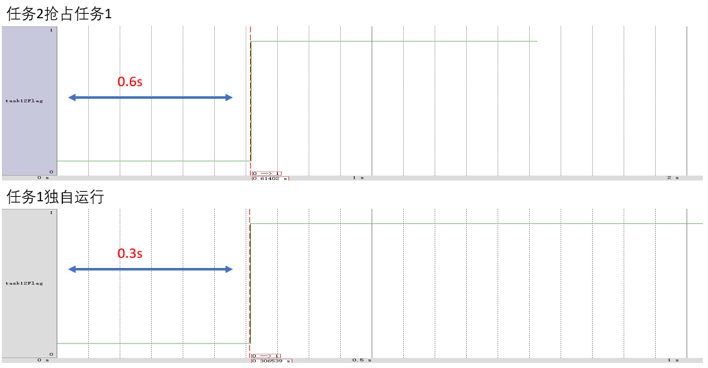


**互斥代码举例(瑕疵)：**任务4和任务5都使用同一串口打印，由于任务交替执行，任务4没打印完任务5就开始打印，输出混合的结果

````c
int flag = 0;
void Task4(void* data){
	while(1){
		printf("task4 is runing \n");
	}
}
void Task5(void* data){
	while(1){
		printf("task5 is runing \n");
	}
}
int main( void )
{
	prvSetupHardware();
	xTaskCreate(Task4,"task4",100,NULL,0,NULL);
	xTaskCreate(Task5,"task5",100,NULL,0,NULL);
	//xTaskCreate(Task3,"task3",100,NULL,2,&task3Handle);
	vTaskStartScheduler();
	return 0;
}
````

输出结果如下图：


我们可以使用一个标记,实现正确的打印，但是仍然有缺陷

````c
int flag = 0;
void Task4(void* data){
	while(1){
		if(flag == 0){
			printf("task4 is runing \n");
			flag = 1;
		}	
	}
}
void Task5(void* data){
	while(1){
		if(flag == 1){
			printf("task5 is runing \n");
			flag = 0;
		}
	}
}

int main( void )
{
	prvSetupHardware();
	xTaskCreate(Task4,"task4",100,NULL,0,NULL);
	xTaskCreate(Task5,"task5",100,NULL,0,NULL);
	vTaskStartScheduler();
	return 0;
}
````

输出如下图：但是仍然有问题，会有小几率出现混合打印的情况

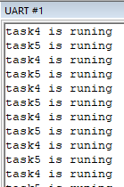


FreeRTOS怎么实现的互斥：

* 如果是任务：就关闭任务调度器(其他任务无法被调用)
* 如果是中断：就关闭中断(其他中断无法进入)


# 队列

## 概述

队列(queue)可以用于"任务到任务"、“任务到中断”、"中断到任务"直接传输信息。

## 队列的特性

### 常规操作

队列的简化操如入下图所示，从此图可知：

* 队列可以包含若干个数据：队列中有若干项，这被称为"长度"(length)
* 每个数据大小固定
* 创建队列时就要指定长度、数据大小
* 数据的操作采用先进先出的方法(FIFO，First In First Out)：写数据时放到尾部，读数据时从头部读
* 也可以强制写队列头部：覆盖头部数据
  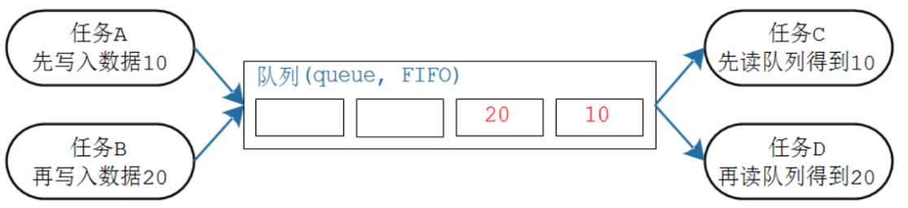

更详细的操作入下图所示：

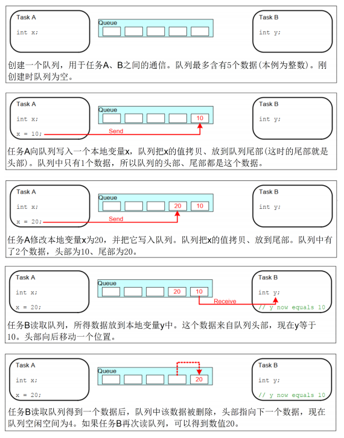

### 传输数据的两种方法

使用队列传输数据时有两种方法：

* 拷贝：把数据、把变量的值复制进队列里

* 引用：把数据、把变量的地址复制进队列里

  

FreeRTOS使用拷贝值的方法，这更简单：

* 局部变量的值可以发送到队列中，后续即使函数退出、局部变量被回收，也不会影响队列中的数据
* 无需分配buffer来保存数据，队列中有buffer
* 局部变量可以马上再次使用
* 发送任务、接收任务解耦：接收任务不需要知道这数据是谁的、也不需要发送任务来释放数据
* 如果数据实在太大，你还是可以使用队列传输它的地址
* 队列的空间有FreeRTOS内核分配，无需任务操心
* 对于有内存保护功能的系统，如果队列使用引用方法，也就是使用地址，必须确保双方任务对这个地址都有访问权限。使用拷贝方法时，则无此限制：内核有足够的权限，把数据复制进队列、再把数据复制出队列。

### 队列的阻塞访问

* 只要知道队列的句柄，谁都可以读、写该队列。任务、ISR都可读、写队列。可以多个任务读写队列。
* 任务读写队列时，简单地说：如果读写不成功，则阻塞；可以指定超时时间。口语化地说，就是可以定个闹钟：如果能读写了就马上进入就绪态，否则就阻塞直到超时。
* 某个任务读队列时，如果队列没有数据，则该任务可以进入阻塞状态：还可以指定阻塞的时间。如果队列有数据了，则该阻塞的任务会变为就绪态。如果一直都没有数据，则时间到之后它也会进入就绪态。
* 既然读取队列的任务个数没有限制，那么当多个任务读取空队列时，这些任务都会进入阻塞状态：有多个任务在等待同一个队列的数据。当队列中有数据时，哪个任务会进入就绪态？
  * 优先级最高的任务
  * 如果大家的优先级相同，那等待时间最久的任务会进入就绪态
* 跟读队列类似，一个任务要写队列时，如果队列满了，该任务也可以进入阻塞状态：还可以指定阻塞的时间。如果队列有空间了，则该阻塞的任务会变为就绪态。如果一直都没有空间，则时间到之后它也会进入就绪态。
* 既然写队列的任务个数没有限制，那么当多个任务写"满队列"时，这些任务都会进入阻塞状态：有多个任务在等待同一个队列的空间。当队列中有空间时，哪个任务会进入就绪态？
  * 优先级最高的任务
  * 如果大家的优先级相同，那等待时间最久的任务会进入就绪态
    

## 队列函数

使用队列的流程：创建队列、写队列、读队列、删除队列。

### 创建

队列的创建有两种方法：动态分配内存、静态分配内存

* **动态分配内存**：`xQueueCreate`，队列的内存在函数内部动态分配

````c
QueueHandle_t xQueueCreate( UBaseType_t uxQueueLength, UBaseType_t uxItemSize );
````

| 参数          | 说明                                                         |
| ------------- | ------------------------------------------------------------ |
| uxQueueLength | 队列长度，最多能存放多少个数据(item)                         |
| uxItemSize    | 每个数据(item)的大小：以字节为单位                           |
| 返回值        | 非0：成功，返回句柄，以后使用句柄来操作队列 <br/>NULL：失败，因为内存不足 |

- **静态分配内存**：`xQueueCreateStatic`，队列的内存要事先分配好

````c
QueueHandle_t xQueueCreateStatic(
                           UBaseType_t uxQueueLength,
                           UBaseType_t uxItemSize,
                           uint8_t *pucQueueStorageBuffer,
                           StaticQueue_t *pxQueueBuffer
                       );
````

| 参数                  | 说明                                                         |
| --------------------- | ------------------------------------------------------------ |
| uxQueueLength         | 队列长度，最多能存放多少个数据(item)                         |
| uxItemSize            | 每个数据(item)的大小：以字节为单位                           |
| pucQueueStorageBuffer | 如果uxItemSize非0，pucQueueStorageBuffer必须指向一个uint8_t数组,此数组大小至少为"uxQueueLength * uxItemSize" |
| pxQueueBuffer         | 必须执行一个StaticQueue_t结构体，用来保存队列的数据结构      |
| 返回值                | 非0：成功，返回句柄，以后使用句柄来操作队列<br/>NULL：失败，因为pxQueueBuffer为NULL |

代码：

````c
// 示例代码
 #define QUEUE_LENGTH 10
 #define ITEM_SIZE sizeof( uint32_t )
 
 // xQueueBuffer用来保存队列结构体
 StaticQueue_t xQueueBuffer;
 
 // ucQueueStorage 用来保存队列的数据
 // 大小为：队列长度 * 数据大小
 uint8_t ucQueueStorage[ QUEUE_LENGTH * ITEM_SIZE ];
 
 void vATask( void *pvParameters )
 {
	QueueHandle_t xQueue1;
 
	// 创建队列: 可以容纳QUEUE_LENGTH个数据，每个数据大小是ITEM_SIZE
	xQueue1 = xQueueCreateStatic( QUEUE_LENGTH,
						  ITEM_SIZE,
						  ucQueueStorage,
						  &xQueueBuffer ); 
 }
````

### 复位

队列刚被创建时，里面没有数据；使用过程中可以调用`xQueueReset()`把队列恢复为初始状态，此函数原型为：

````c
/* pxQueue : 复位哪个队列;
 * 返回值: pdPASS(必定成功)
 */
BaseType_t xQueueReset( QueueHandle_t pxQueue);
````

### 删除

删除队列的函数为`vQueueDelete()`，只能删除使用动态方法创建的队列，它会释放内存。原型如下：

````c
void vQueueDelete( QueueHandle_t xQueue );
````

### 写队列

可以把数据写到队列头部，也可以写到尾部，这些函数有两个版本：在任务中使用、在ISR中使用。函数原型如下：

````c
/* 等同于xQueueSendToBack
 * 往队列尾部写入数据，如果没有空间，阻塞时间为xTicksToWait
 */
BaseType_t xQueueSend(QueueHandle_t xQueue,const void *pvItemToQueue,TickType_t xTicksToWait);

/* 
 * 往队列尾部写入数据，如果没有空间，阻塞时间为xTicksToWait
 */
BaseType_t xQueueSendToBack(QueueHandle_t xQueue,const void *pvItemToQueue,TickType_t xTicksToWait);


/* 
 * 往队列尾部写入数据，此函数可以在中断函数中使用，不可阻塞
 */
BaseType_t xQueueSendToBackFromISR( QueueHandle_t xQueue,const void *pvItemToQueue,BaseType_t *pxHigherPriorityTaskWoken );

/* 
 * 往队列头部写入数据，如果没有空间，阻塞时间为xTicksToWait
 */
BaseType_t xQueueSendToFront(QueueHandle_t xQueue,const void *pvItemToQueue,TickType_t xTicksToWait);

/* 
 * 往队列头部写入数据，此函数可以在中断函数中使用，不可阻塞
 */
BaseType_t xQueueSendToFrontFromISR(QueueHandle_t xQueue,const void *pvItemToQueue,BaseType_t *pxHigherPriorityTaskWoken);
````

这些函数用到的参数是类似的，统一说明如下：

|     参数      |                             说明                             |
| :-----------: | :----------------------------------------------------------: |
|    xQueue     |                    队列句柄，要写哪个队列                    |
| pvItemToQueue | 数据指针，这个数据的值会被复制进队列， 复制多大的数据？在创建队列时已经指定了数据大小 |
| xTicksToWait  | 如果队列满则无法写入新数据，可以让任务进入阻塞状态，<br/>xTicksToWait表示阻塞的最大时间(Tick Count)。<br/>如果被设为0，无法写入数据时函数会立刻返回；<br/>如果被设为portMAX_DELAY，则会一直阻塞直到有空间可写 |
|    返回值     | pdPASS：数据成功写入了队列<br/>errQUEUE_FULL：写入失败，因为队列满了。 |

### 读队列

使用`xQueueReceive()`函数读队列，读到一个数据后，队列中该数据会被移除。这个函数有两个版本：在任务中使用、在ISR中使用。函数原型如下：

````c
BaseType_t xQueueReceive(QueueHandle_t xQueue, void * const pvBuffer,TickType_t xTicksToWait );
BaseType_t xQueueReceiveFromISR(QueueHandle_t xQueue,void *pvBuffer,BaseType_t *pxTaskWoken);
````

|     参数     |                             说明                             |
| :----------: | :----------------------------------------------------------: |
|    xQueue    |                    队列句柄，要读哪个队列                    |
|   pvBuffer   | bufer指针，队列的数据会被复制到这个buffer 复制多大的数据？在创建队列时已经指定了数据大小 |
| xTicksToWait | 果队列空则无法读出数据，可以让任务进入阻塞状态，<br/>xTicksToWait表示阻塞的最大时间(Tick Count)。<br/>如果被设为0，无法读出数据时函数会立刻返回；<br/>如果被设为portMAX_DELAY，则会一直阻塞直到有数据可写 |
|    返回值    | pdPASS：从队列读出数据入<br/>errQUEUE_EMPTY：读取失败，因为队列空了。 |

### 查询

可以查询队列中有多少个数据、有多少空余空间。函数原型如下：

````c
/*
 * 返回队列中可用数据的个数
 */
UBaseType_t uxQueueMessagesWaiting( const QueueHandle_t xQueue );
/*
 * 返回队列中可用空间的个数
 */
UBaseType_t uxQueueSpacesAvailable( const QueueHandle_t xQueue );
````

### 覆盖/偷看

当队列长度为1时，可以使用`xQueueOverwrite()`或`xQueueOverwriteFromISR()`来覆盖数据。
注意，队列长度必须为1。当队列满时，这些函数会覆盖里面的数据，这也以为着这些函数不会被阻塞。
函数原型如下：

````c
/* 覆盖队列
 * xQueue: 写哪个队列
 * pvItemToQueue: 数据地址
 * 返回值: pdTRUE表示成功, pdFALSE表示失败
 */
BaseType_t xQueueOverwrite(QueueHandle_t xQueue,const void * pvItemToQueue);
BaseType_t xQueueOverwriteFromISR(QueueHandle_t xQueue,const void * pvItemToQueue,BaseType_t *pxHigherPriorityTaskWoken);
````

如果想让队列中的数据供多方读取，也就是说读取时不要移除数据，要留给后来人。那么可以使用"窥视"，也就是`xQueuePeek()`或`xQueuePeekFromISR()`。这些函数会从队列中复制出数据，但是不移除数据。这也意味着，如果队列中没有数据，那么"偷看"时会导致阻塞；一旦队列中有数据，以后每次"偷看"都会成功。

````c
/* 偷看队列
 * xQueue: 偷看哪个队列
 * pvItemToQueue: 数据地址, 用来保存复制出来的数据
 * xTicksToWait: 没有数据的话阻塞一会
 * 返回值: pdTRUE表示成功, pdFALSE表示失败
 */
BaseType_t xQueuePeek(QueueHandle_t xQueue,void * const pvBuffer,TickType_t xTicksToWait);
BaseType_t xQueuePeekFromISR(QueueHandle_t xQueue,void *pvBuffer,);
````

偷看和覆盖配合使用：偷看不会移除队列中的值，谁来移除？ 答：不需要移除，直接使用覆盖


## 队列的基本使用

本程序会创建一个队列，然后创建2个发送任务、1个接收任务：

- 发送任务优先级为1，分别往队列中写入100、200
- 接收任务优先级为2，读队列、打印数值

main函数中创建的队列、创建了发送任务、接收任务，代码如下：

````c
/* 队列句柄, 创建队列时会设置这个变量 */
QueueHandle_t xQueue;
static void vSenderTask( void *pvParameters )
{
	int32_t lValueToSend;
	BaseType_t xStatus;

	/* 我们会使用这个函数创建2个任务
	 * 这些任务的pvParameters不一样
 	 */
	lValueToSend = ( int32_t ) pvParameters;

	/* 无限循环 */
	for( ;; )
	{
		/* 写队列
		 * xQueue: 写哪个队列
		 * &lValueToSend: 写什么数据? 传入数据的地址, 会从这个地址把数据复制进队列
		 * 0: 不阻塞, 如果队列满的话, 写入失败, 立刻返回
		 */
		xStatus = xQueueSendToBack( xQueue, &lValueToSend, 0 );

		if( xStatus != pdPASS )
		{
			printf( "Could not send to the queue.\r\n" );
		}
	}
}
static void vReceiverTask( void *pvParameters )
{
	/* 读取队列时, 用这个变量来存放数据 */
	int32_t lReceivedValue;
	BaseType_t xStatus;
	const TickType_t xTicksToWait = pdMS_TO_TICKS( 100UL );

	/* 无限循环 */
	for( ;; )
	{
		/* 读队列
		 * xQueue: 读哪个队列
		 * &lReceivedValue: 读到的数据复制到这个地址
		 * xTicksToWait: 如果队列为空, 阻塞一会
		 */
		xStatus = xQueueReceive( xQueue, &lReceivedValue, xTicksToWait );

		if( xStatus == pdPASS )
		{
			/* 读到了数据 */
			printf( "Received = %d\r\n", lReceivedValue );
		}
		else
		{
			/* 没读到数据 */
			printf( "Could not receive from the queue.\r\n" );
		}
	}
}
int main( void )
{
	prvSetupHardware();
	
    /* 创建队列: 长度为5，数据大小为4字节(存放一个整数) */
    xQueue = xQueueCreate( 5, sizeof( int32_t ) );

	if( xQueue != NULL )
	{
		/* 创建2个任务用于写队列, 传入的参数分别是100、200
		 * 任务函数会连续执行，向队列发送数值100、200
		 * 优先级为1
		 */
		xTaskCreate( vSenderTask, "Sender1", 1000, ( void * ) 100, 1, NULL );
		xTaskCreate( vSenderTask, "Sender2", 1000, ( void * ) 200, 1, NULL );

		/* 创建1个任务用于读队列
		 * 优先级为2, 高于上面的两个任务
		 * 这意味着队列一有数据就会被读走
		 */
		xTaskCreate( vReceiverTask, "Receiver", 1000, NULL, 2, NULL );

		/* 启动调度器 */
		vTaskStartScheduler();
	}
	else
	{
		/* 无法创建队列 */
	}

	/* 如果程序运行到了这里就表示出错了, 一般是内存不足 */
	return 0;
}
````


任务调度情况：

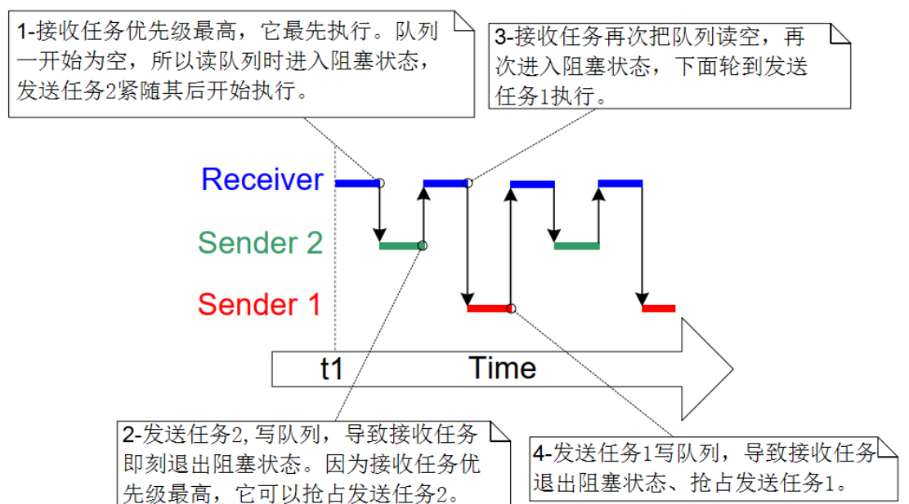


## 利用队列完成同步和互斥

**同步**

目的：任务1累加1000000次后，任务2才可以执行

利用队列出入和读取的特性来实现同步：任务2执行时，队列中没有数据，导致任务2阻塞，直到任务1累加完后执行往队列中存放数据的操作后，任务2读取到数据

````c
QueueHandle_t xQueueMyHandle;
int task12Flag = 0,sum = 0;
void vTask1(void *pvParameters){
	volatile int i;
	while(1){
		for(i = 0;i<1000000;i++)sum++;
		xQueueSend(xQueueMyHandle,&sum,portMAX_DELAY);
		task12Flag = 1;
		vTaskDelete(NULL);
	}
}
void vTask2(void *pvParameters){
	while(1){
		int val;
		xQueueReceive(xQueueMyHandle,&val,portMAX_DELAY);
		printf("val:%d \n",val);
	}
}
int main( void )
{
	prvSetupHardware();
	xQueueMyHandle = xQueueCreate(1,sizeof(int32_t));
	xTaskCreate(vTask1,"vTask1",100,NULL,1,NULL);
	xTaskCreate(vTask2,"vTask2",100,NULL,1,NULL);
	vTaskStartScheduler();
	return 0;
}
````

**互斥**

任务3和任务4只能有一个执行打印操作

````c
static QueueHandle_t xQueueUARTcHandle;
int InitUARTLock(void)                           // 就是创建个队列
{	
	int val;
	xQueueUARTcHandle = xQueueCreate(1, sizeof(int));
	if (xQueueUARTcHandle == NULL)
	{
		printf("can not create queue\r\n");
		return -1;
	}
	xQueueSend(xQueueUARTcHandle, &val, portMAX_DELAY);
	return 0;
}
void GetUARTLock(void)                           // 获得锁：就是读取队列中的值，如果没值则阻塞
{	
	int val;
	xQueueReceive(xQueueUARTcHandle, &val, portMAX_DELAY);
}
void PutUARTLock(void)                          // 释放锁：就是往队列中添加值，添加完后，其他任务的读取操作才能执行
{	
	int val;
	xQueueSend(xQueueUARTcHandle, &val, portMAX_DELAY);
}
void TaskGenericFunction(void * param)
{
	while (1)
	{
		GetUARTLock();
		printf("%s\r\n", (char *)param);
		PutUARTLock();
		vTaskDelay(1);
	}
}
int main( void )
{
	prvSetupHardware();
	InitUARTLock();
	xTaskCreate(TaskGenericFunction, "Task3", 100, "Task 3 is running", 1, NULL);
	xTaskCreate(TaskGenericFunction, "Task4", 100, "Task 4 is running", 1, NULL);
	vTaskStartScheduler();

	return 0;
}
````


## 队列集QueueSet

队列集提供了一种机制，允许 RTOS 任务从多个 RTOS 队列或信号量同时进行读取操作后阻塞（挂起）。 请注意， 除了使用队列集之外，还有更简单的替代方法。 有关详细信息，请参阅 [阻塞多个对象](https://www.freertos.org/zh-cn-cmn-s/Pend-on-multiple-rtos-objects.html)页面 。

必须使用调用 `xQueueCreateSet()` 显式创建队列集， 然后才能使用它。 创建后，可以将标准 FreeRTOS 队列和信号量添加到集合中 （通过调用 [xQueueAddToSet()](https://www.freertos.org/zh-cn-cmn-s/xQueueAddToSet.html)）。 然后，使用 [xQueueSelectFromSet()](https://www.freertos.org/zh-cn-cmn-s/xQueueSelectFromSet.html) 确定集合中包含的队列或信号量中的哪些（如果有） 处于队列读取或信号量获取操作将成功的状态。


**队列即中不仅可以存放队列，也可以存放信号量**


**原理：**

* 写入

  * 当鼠标有数据时，会写入鼠标队列中，然后在将鼠标Handle写入队列集中

* 读取

  * 当读取一次队列集，会返回一个队列

  * 再对读取队列

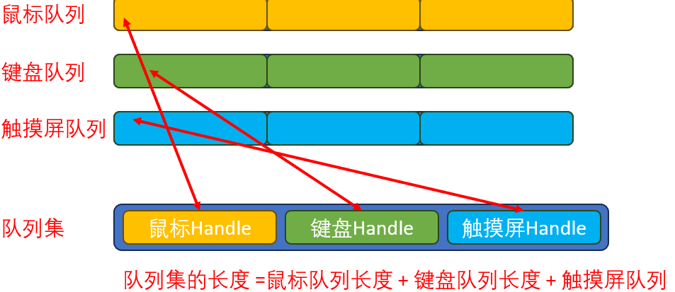

### 创建队列集

必须在 FreeRTOSConfig.h 中将 `configUSE_QUEUE_SETS` 设置为 1，`xQueueCreateSet() `API 函数才可用。

queue.h

````c
QueueSetHandle_t xQueueCreateSet( const UBaseType_t uxEventQueueLength )
````

|        参数        |                             含义                             |
| :----------------: | :----------------------------------------------------------: |
| uxEventQueueLength |                 队列集的长度：各队列长度总和                 |
|       返回值       | 如果成功创建队列集，则返回所创建队列集的句柄 。 否则返回 NULL。 |

### 添加队列

往对列集中添加队列

queue.h

```c
 BaseType_t xQueueAddToSet(QueueSetMemberHandle_t xQueueOrSemaphore, QueueSetHandle_t xQueueSet);
```

将 RTOS 队列或信号量添加至先前由 `xQueueCreateSet()`调用创建的队列集。

接收（如果是队列）或获取（如果是 信号量）操作，除非 调用 xQueueSelectFromSet() 先返回了队列集成员的句柄。


**参数：**

|       参数        |                             含义                             |
| :---------------: | :----------------------------------------------------------: |
| xQueueOrSemaphore |       队列句柄 （转换为 QueueSetMemberHandle_t 类型）        |
|     xQueueSet     |                          队列集句柄                          |
|      返回值       | 如果队列或信号量成功添加到队列集 那么返回 pdPASS。 <br/>如果队列无法成功添加到 队列集，因为它已经是其他队列集的成员，那么返回 pdFAIL 。 |

### 删除队列

从队列集中删除 RTOS 队列或信号量。

````c
 BaseType_t xQueueRemoveFromSet(QueueSetMemberHandle_t xQueueOrSemaphore,QueueSetHandle_t xQueueSet);
````

仅当队列或信号量为空时，才能从队列集中删除 RTOS 队列或信号量 。

|       参数        |                             含义                             |
| :---------------: | :----------------------------------------------------------: |
| xQueueOrSemaphore |       队列句柄 （转换为 QueueSetMemberHandle_t 类型）        |
|     xQueueSet     |                          队列集句柄                          |
|      返回值       | 如果队列或信号量已成功从队列集中删除， 则返回 pdPASS。 <br/>如果队列不在队列集中，或者 队列（或信号量）不为空，则返回 pdFAIL。 |

### 获取队列

xQueueSelectFromSet() 从队列集成员中选择队列或信号量， 它们要么包含数据（若选择队列），要么可供获取 （若选择信号量）。 `xQueueSelectFromSet() `能有效 允许任务同时读取一个队列集中的所有 队列和信号量后阻塞（挂起）。

````c
QueueSetMemberHandle_t xQueueSelectFromSet(QueueSetHandle_t xQueueSet, const TickType_t xTicksToWait  );`  `
````

|     参数     |                             含义                             |
| :----------: | :----------------------------------------------------------: |
|  xQueueSet   |                          队列集句柄                          |
| xTicksToWait | 调用任务保持阻塞状态（其他任务正在执行）， 等待队列集成员做好准备 以便成功读取队列或获取信号量所需的最长时间， 以滴答为单位 |
|    返回值    | 队列集中包含数据的队列的句柄（转换为 QueueSetMemberHandle_t 类型） 或队列集中可用信号量的句柄（转换为 QueueSetMemberHandle_t 类型）， 如果在指定的阻塞时间到期之前不存在这样的队列或信号量， 则返回 NULL。 |

**xQueueSelectFromSetFromISR()** 

`xQueueSelectFromSet()`的一个版本， 可以从中断服务程序 (ISR) 中使用。

````c
QueueSetMemberHandle_t xQueueSelectFromSetFromISR ( QueueSetHandle_t xQueueSet);
````

|   参数    |                             含义                             |
| :-------: | :----------------------------------------------------------: |
| xQueueSet | 正在查询的队列集。 因为此函数设计为从中断中使用， 所以无法在读取时阻塞 。 |
|  返回值   | 返回一个队列的句柄（被转换为 QueueSetMemberHandle_t 类型）， 该队列包含在包含数据的队列集中， 或队列集中可用信号量的句柄（转换为 QueueSetMemberHandle_t 类型）， 该信号量包含在可用的队列集中；如果不存在这样的队列或信号量，则返回 NULL 。 |


### 代码案例

两个队列，一个队列集

* 任务1：往队列1中添加数字
* 任务2：往队列2中添加数字
* 任务3：从队列集中读取有值的队列，并从队列中读值

````c
QueueHandle_t xQueueMyHandle1;
QueueHandle_t xQueueMyHandle2;
QueueSetHandle_t xQueueSetMyHandle;
void vSendTask1(void *pvParameters){
	int i = 0;
	while(1){
		task1Flag = 1;
		task2Flag = 0;
		task3Flag = 0;
		i++;
		xQueueSend(xQueueMyHandle1,&i,portMAX_DELAY);
		vTaskDelay(10);
	}
}
void vSendTask2(void *pvParameters){
	int i = 0;
	while(1){
		task1Flag = 0;
		task2Flag = 1;
		task3Flag = 0;
		i--;
		xQueueSend(xQueueMyHandle2,&i,portMAX_DELAY);
		vTaskDelay(10);
	}
}
void vReceiverTask(void *pvParameters){
	QueueSetMemberHandle_t handle;
	int i;
	BaseType_t rReturn;
	while(1){		
		task1Flag = 0;
		task2Flag = 0;
		task3Flag = 1;
		handle = xQueueSelectFromSet(xQueueSetMyHandle,portMAX_DELAY);
		xQueueReceive(handle,&i,0);
		printf("i: %d \r\n",i);
	}
}

int main( void )
{
	prvSetupHardware();
	
	xQueueMyHandle1 = xQueueCreate(2,sizeof(int32_t));
	xQueueMyHandle2 = xQueueCreate(2,sizeof(int32_t));
	printf("0");
	xQueueSetMyHandle = xQueueCreateSet(4);
	
	xQueueAddToSet(xQueueMyHandle1,xQueueSetMyHandle);
	xQueueAddToSet(xQueueMyHandle2,xQueueSetMyHandle);
	
	xTaskCreate(vSendTask1,"vTask1",100,NULL,1,NULL);
	xTaskCreate(vSendTask2,"vTask2",100,NULL,1,NULL);
	xTaskCreate(vReceiverTask,"vTask3",100,NULL,1,NULL);
	vTaskStartScheduler();
	return 0;
}
````

# 信号量

信号量的本质还是队列，使用信号量，必须包含semphr. h


## 信号量的特性

### 信号量的常规操作

信号量这个名字很恰当：

* 信号：起通知作用
* 量：还可以用来表示资源的数量
  * 当"量"没有限制时，它就是**计数型信号量**(Counting Semaphores)
  * 当"量"只有0、1两个取值时，它就是**二进制信号量**(Binary Semaphores)
* 支持的动作："give"给出资源，计数值加1；"take"获得资源，计数值减1

计数型信号量的典型场景是：

* 计数：事件产生时"give"信号量，让计数值加1；处理事件时要先"take"信号量，就是获得信号量，让计数值减1。
* 资源管理：要想访问资源需要先"take"信号量，让计数值减1；用完资源后"give"信号量，让计数值加1。

信号量的"give"、"take"双方并不需要相同，可以用于生产者-消费者场合：

* 生产者为任务A、B，消费者为任务C、D
* 一开始信号量的计数值为0，如果任务C、D想获得信号量，会有两种结果：
  * 阻塞：买不到东西咱就等等吧，可以定个闹钟(超时时间)
  * 即刻返回失败：不等
* 任务A、B可以生产资源，就是让信号量的计数值增加1，并且把等待这个资源的顾客唤醒
* 唤醒谁？谁优先级高就唤醒谁，如果大家优先级一样就唤醒等待时间最长的人

二进制信号量跟计数型的唯一差别，就是计数值的最大值被限定为1。
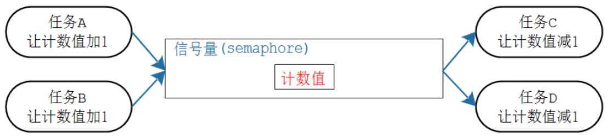

### 信号量跟队列的对比

|                             队列                             |                            信号量                            |
| :----------------------------------------------------------: | :----------------------------------------------------------: |
| 可以容纳多个数据， 创建队列时有2部分内存: 队列结构体、存储数据的空间 | 只有计数值，无法容纳其他数据。 创建信号量时，只需要分配信号量结构体 |
|              生产者：没有空间存入数据时可以阻塞              |       生产者：用于不阻塞，计数值已经达到最大时返回失败       |
|                  消费者：没有数据时可以阻塞                  |                  消费者：没有资源时可以阻塞                  |

### 两种信号量的对比

信号量的计数值都有限制：限定了最大值。如果最大值被限定为1，那么它就是二进制信号量；如果最大值不是1，它就是计数型信号量。

|   二进制信号量    |      技术型信号量      |
| :---------------: | :--------------------: |
| 被创建时初始值为0 | 被创建时初始值可以设定 |
| 其他操作是一样的  |    其他操作是一样的    |

##  信号量函数

* `configSUPPORT_DYNAMIC_ALLOCATION`必须在 FreeRTOSConfig.h 中被设置为 1

* 使用信号量时，先创建、然后去添加资源、获得资源。使用句柄来表示一个信号量。


### 创建

使用信号量之前，要先创建，得到一个句柄；使用信号量时，要使用句柄来表明使用哪个信号量。

对于二进制信号量、计数型信号量，它们的创建函数不一样：

|          | 二进制信号量                           | 计数型信号量                   |
| -------- | -------------------------------------- | ------------------------------ |
| 动态创建 | xSemaphoreCreateBinary 计数值初始值为0 | xSemaphoreCreateCounting       |
| 静态创建 | xSemaphoreCreateBinaryStatic           | xSemaphoreCreateCountingStatic |

**二进制信号量**

````c
/* 创建一个二进制信号量，返回它的句柄。
 * 此函数内部会分配信号量结构体 
 * 返回值: 返回句柄，非NULL表示成功
 */
SemaphoreHandle_t xSemaphoreCreateBinary( void );

/* 创建一个二进制信号量，返回它的句柄。
 * 此函数无需动态分配内存，所以需要先有一个StaticSemaphore_t结构体，并传入它的指针
 * 返回值: 返回句柄，非NULL表示成功
 */
SemaphoreHandle_t xSemaphoreCreateBinaryStatic( StaticSemaphore_t *pxSemaphoreBuffer );
````

**计数型信号量**

````c
/* 创建一个计数型信号量，返回它的句柄。
 * 此函数内部会分配信号量结构体 
 * uxMaxCount: 最大计数值
 * uxInitialCount: 初始计数值
 * 返回值: 返回句柄，非NULL表示成功
 */
SemaphoreHandle_t xSemaphoreCreateCounting(UBaseType_t uxMaxCount, UBaseType_t uxInitialCount);

/* 创建一个计数型信号量，返回它的句柄。
 * 此函数无需动态分配内存，所以需要先有一个StaticSemaphore_t结构体，并传入它的指针
 * uxMaxCount: 最大计数值
 * uxInitialCount: 初始计数值
 * pxSemaphoreBuffer: StaticSemaphore_t结构体指针
 * 返回值: 返回句柄，非NULL表示成功
 */
SemaphoreHandle_t xSemaphoreCreateCountingStatic( UBaseType_t uxMaxCount, 
                                                 UBaseType_t uxInitialCount, 
                                                 StaticSemaphore_t *pxSemaphoreBuffer );
````

### 删除

对于动态创建的信号量，不再需要它们时，可以删除它们以回收内存。

`vSemaphoreDelete`可以用来删除二进制信号量、计数型信号量，函数原型如下：

````c
/*
 * xSemaphore: 信号量句柄，你要删除哪个信号量
 */
void vSemaphoreDelete( SemaphoreHandle_t xSemaphore );
````

### give/take

二进制信号量、计数型信号量的give、take操作函数是一样的。这些函数也分为2个版本：给任务使用，给ISR使用。列表如下：

|      |  在任务中使用  |      在ISR中使用      |
| :--: | :------------: | :-------------------: |
| give | xSemaphoreGive | xSemaphoreGiveFromISR |
| take | xSemaphoreTake | xSemaphoreTakeFromISR |

**xSemaphoreGive()**

```c
BaseType_t xSemaphoreGive( SemaphoreHandle_t xSemaphore );
```

|    参数    |                             说明                             |
| :--------: | :----------------------------------------------------------: |
| xSemaphore |                  信号量句柄，释放哪个信号量                  |
|   返回值   | pdTRUE表示成功, 如果二进制信号量的计数值已经是1，再次调用此函数则返回失败； 如果计数型信号量的计数值已经是最大值，再次调用此函数则返回失败 |

**xSemaphoreGiveFromISR**

````c
BaseType_t xSemaphoreGiveFromISR(
                        SemaphoreHandle_t xSemaphore,
                        BaseType_t *pxHigherPriorityTaskWoken
                    );
````

|           参数            |                             说明                             |
| :-----------------------: | :----------------------------------------------------------: |
|        xSemaphore         |                  信号量句柄，释放哪个信号量                  |
| pxHigherPriorityTaskWoken | 如果释放信号量导致更高优先级的任务变为了就绪态， 则*pxHigherPriorityTaskWoken = pdTRUE |
|          返回值           | pdTRUE表示成功,<br/>如果二进制信号量的计数值已经是1，再次调用此函数则返回失败；<br/>如果计数型信号量的计数值已经是最大值，再次调用此函数则返回失败 |

**xSemaphoreTake**

````c
BaseType_t xSemaphoreTake(
                   SemaphoreHandle_t xSemaphore,
                   TickType_t xTicksToWait
               );
````

|     参数     |                             说明                             |
| :----------: | :----------------------------------------------------------: |
|  xSemaphore  |                  信号量句柄，获取哪个信号量                  |
| xTicksToWait | 如果无法马上获得信号量，阻塞一会：<br/>0：不阻塞，马上返回<br/>portMAX_DELAY: 一直阻塞直到成功<br/>其他值: 阻塞的Tick个数，可以使用`pdMS_TO_TICKS()`来指定阻塞时间为若干ms |
|    返回值    |                        pdTRUE表示成功                        |

**xSemaphoreTakeFromISR**

````c
BaseType_t xSemaphoreTakeFromISR(
                        SemaphoreHandle_t xSemaphore,
                        BaseType_t *pxHigherPriorityTaskWoken
                    );
````

|           参数            |                             说明                             |
| :-----------------------: | :----------------------------------------------------------: |
|        xSemaphore         |                  信号量句柄，获取哪个信号量                  |
| pxHigherPriorityTaskWoken | 如果获取信号量导致更高优先级的任务变为了就绪态，<br/>则*pxHigherPriorityTaskWoken = pdTRUE |
|          返回值           |                        pdTRUE表示成功                        |

## 使用二进制信号量同步

````c
SemaphoreHandle_t semaphoreHandle;
volatile int task12Flag = 0,sum = 0;
void vTask1(void *pvParameters){
	volatile int i;
	while(1){
		for(i = 0;i<1000000;i++)sum++;
		xSemaphoreGive(semaphoreHandle);                  
		vTaskDelete(NULL);
	}
}
void vTask2(void *pvParameters){
	while(1){
		xSemaphoreTake(semaphoreHandle,portMAX_DELAY);
		printf("sum:%d \n",sum);
	}
}
int main( void )
{
	prvSetupHardware();
	semaphoreHandle = xSemaphoreCreateBinary();           // 创建二进制信号量
	xSemaphoreGive(semaphoreHandle);                      // 初始值是0，手动give一次
	xTaskCreate(vTask1,"vTask1",100,NULL,1,NULL);
	xTaskCreate(vTask2,"vTask2",100,NULL,1,NULL);

	vTaskStartScheduler();
	return 0;
}
````


## 使用二进制信号量互斥

````c
SemaphoreHandle_t semaphoreHandle;
void vTaskGenerice(void *pvParameters){
	while(1){
		xSemaphoreTake(semaphoreHandle,portMAX_DELAY);     // 获得锁
		printf("%s \n",(char *)pvParameters);
		xSemaphoreGive(semaphoreHandle);                   // 释放锁
		
		vTaskDelay(1);
	}
}
int main( void )
{
	prvSetupHardware();
	semaphoreHandle = xSemaphoreCreateBinary();      // 创建二进制信号量
	xSemaphoreGive(semaphoreHandle );
    
	xTaskCreate(vTaskGenerice,"vTask1",100,"Task 1 is running",1,NULL);
	xTaskCreate(vTaskGenerice,"vTask2",100,"Task 2 is running",1,NULL);
	vTaskStartScheduler();
	return 0;
}
````


# 互斥量


怎么独享厕所？自己开门上锁，完事了自己开锁。

你当然可以进去后，让别人帮你把门：但是，命运就掌握在别人手上了。

使用队列、信号量，都可以实现互斥访问，以信号量为例：

* 信号量初始值为1
* 任务A想上厕所，"take"信号量成功，它进入厕所
* 任务B也想上厕所，"take"信号量不成功，等待
* 任务A用完厕所，"give"信号量；轮到任务B使用

这需要有2个前提：

* 任务B很老实，不撬门(一开始不"give"信号量)
* 没有坏人：别的任务不会"give"信号量

可以看到，使用信号量确实也可以实现互斥访问，但是不完美。

使用互斥量可以解决这个问题，互斥量的名字取得很好：

* 量：值为0、1
* 互斥：用来实现互斥访问

它的核心在于：谁上锁，就只能由谁开锁。

很奇怪的是，FreeRTOS的互斥锁，并没有在代码上实现这点：

即使任务A获得了互斥锁，任务B竟然也可以释放互斥锁。
谁上锁、谁释放：只是约定。


互斥信号量其实就是一个拥有优先级继承的二值信号量，在同步的应用中二值信号量最适合。互斥信号量适合用于那些需要互斥访问的应用中！


## 使用场合

在多任务系统中，任务A正在使用某个资源，还没用完的情况下任务B也来使用的话，就可能导致问题。

比如对于串口，任务A正使用它来打印，在打印过程中任务B也来打印，客户看到的结果就是A、B的信息混杂在一起。


这种现象很常见：

* 访问外设：刚举的串口例子
* 读、修改、写操作导致的问题
  对于同一个变量，比如int a，如果有两个任务同时写它就有可能导致问题。
  对于变量的修改，C代码只有一条语句，比如：a=a+8;，它的内部实现分为3步：读出原值、修改、写入。


我们想让任务A、B都执行add_a函数，a的最终结果是1+8+8=17。
假设任务A运行完代码①，在执行代码②之前被任务B抢占了：现在任务A的R0等于1。
任务B执行完add_a函数，a等于9。
任务A继续运行，在代码②处R0仍然是被抢占前的数值1，执行完②③的代码，a等于9，这跟预期的17不符合。

* 对变量的非原子化访问
  修改变量、设置结构体、在16位的机器上写32位的变量，这些操作都是非原子的。也就是它们的操作过程都可能被打断，如果被打断的过程有其他任务来操作这些变量，就可能导致冲突。
* 函数重入
  “可重入的函数"是指：多个任务同时调用它、任务和中断同时调用它，函数的运行也是安全的。可重入的函数也被称为"线程安全”(thread safe)。
  每个任务都维持自己的栈、自己的CPU寄存器，如果一个函数只使用局部变量，那么它就是线程安全的。
  函数中一旦使用了全局变量、静态变量、其他外设，它就不是"可重入的"，如果改函数正在被调用，就必须阻止其他任务、中断再次调用它。

上述问题的解决方法是：任务A访问这些全局变量、函数代码时，独占它，就是上个锁。这些全局变量、函数代码必须被独占地使用，它们被称为临界资源。

互斥量也被称为互斥锁，使用过程如下：

* 互斥量初始值为1
* 任务A想访问临界资源，先获得并占有互斥量，然后开始访问
* 任务B也想访问临界资源，也要先获得互斥量：被别人占有了，于是阻塞
* 任务A使用完毕，释放互斥量；任务B被唤醒、得到并占有互斥量，然后开始访问临界资源
* 任务B使用完毕，释放互斥量

正常来说：在任务A占有互斥量的过程中，任务B、任务C等等，都无法释放互斥量。

但是FreeRTOS未实现这点：任务A占有互斥量的情况下，任务B也可释放互斥量。


## 函数

`configSUPPORT_DYNAMIC_ALLOCATION` 和 `configUSE_MUTEXES`必须同时在 FreeRTOSConfig.h 中设置为 1， 方能确保 xSemaphoreCreateMutex() 可用。（可不定义 configSUPPORT_DYNAMIC_ALOGRATION， 在这种情况下，它将默认为 1。）

````c
#define configSUPPORT_DYNAMIC_ALLOCATION  1
#define configUSE_MUTEXES 1
````

### 创建

互斥量是一种特殊的二进制信号量。

使用互斥量时，先创建、然后去获得、释放它。使用句柄来表示一个互斥量。

创建互斥量的函数有2种：动态分配内存，静态分配内存，函数原型如下：

````c
/* 创建一个互斥量，返回它的句柄。
 * 此函数内部会分配互斥量结构体 
 * 返回值: 返回句柄，非NULL表示成功
 */
SemaphoreHandle_t xSemaphoreCreateMutex( void );

/* 创建一个互斥量，返回它的句柄。
 * 此函数无需动态分配内存，所以需要先有一个StaticSemaphore_t结构体，并传入它的指针
 * 返回值: 返回句柄，非NULL表示成功
 */
SemaphoreHandle_t xSemaphoreCreateMutexStatic( StaticSemaphore_t *pxMutexBuffer );
````

### 其他函数

要注意的是，互斥量不能在ISR中使用。

各类操作函数，比如删除、give/take，跟一般是信号量是一样的。

````c
/*
 * xSemaphore: 信号量句柄，你要删除哪个信号量, 互斥量也是一种信号量
 */
void vSemaphoreDelete( SemaphoreHandle_t xSemaphore );

/* 释放 */
BaseType_t xSemaphoreGive( SemaphoreHandle_t xSemaphore );

/* 释放(ISR版本) */
BaseType_t xSemaphoreGiveFromISR(SemaphoreHandle_t xSemaphore,BaseType_t *pxHigherPriorityTaskWoken);

/* 获得 */
BaseType_t xSemaphoreTake(SemaphoreHandle_t xSemaphore,TickType_t xTicksToWait);
/* 获得(ISR版本) */
xSemaphoreGiveFromISR(SemaphoreHandle_t xSemaphore,BaseType_t *pxHigherPriorityTaskWoken);
````

### 基本使用

使用互斥量完成互斥任务

````c
SemaphoreHandle_t mutexHandle;

void vTaskGenerice(void *pvParameters){
	while(1){
		xSemaphoreTake(mutexHandle,portMAX_DELAY);
		printf("%s \n",(char *)pvParameters);
		xSemaphoreGive(mutexHandle);
		vTaskDelay(1);
	}
}
int main( void )
{
	prvSetupHardware();

	mutexHandle = xSemaphoreCreateMutex();   // 互斥量默认为1
	
	xTaskCreate(vTaskGenerice0,"vTask1",100,"Task 1 is running",1,NULL);
	xTaskCreate(vTaskGenerice0,"vTask2",100,"Task 2 is running",1,NULL);
	vTaskStartScheduler();
	return 0;
}
````

## 优先级反转

优先级翻转：高优先级的任务反而慢执行，低优先级的任务反而优先执行

优先级翻转在抢占式内核中是非常常见的，但是在实时操作系统中是不允许出现优先级翻转的，因为优先级翻转会破坏任务的预期顺序，可能会导致未知的严重后果。

在使用二值信号量的时候，经常会遇到优先级翻转的问题。

高优先级任务被低优先级任务阻塞，导致高优先级任务迟迟得不到调度。但其他中等优先级的任务却能抢到CPU资源。从现象上看，就像是中优先级的任务比高优先级任务具有更高的优先权（即优先级翻转）


假设任务A、B都想使用串口，A优先级比较低：

* 任务A获得了串口的互斥量
* 任务B也想使用串口，它将会阻塞、等待A释放互斥量
* 高优先级的任务，被低优先级的任务延迟，这被称为"优先级反转"(priority inversion)

如果涉及3个任务，可以让"优先级反转"的后果更加恶劣。

互斥量可以通过"优先级继承"，可以很大程度解决"优先级反转"的问题，这也是FreeRTOS中互斥量和二级制信号量的差别。


main函数创建了3个任务：LPTask/MPTask/HPTask(低/中/高优先级任务)，代码如下：**使用二进制信号量**

````c
static volatile uint8_t flagLPTaskRun = 0;
static volatile uint8_t flagMPTaskRun = 0;
static volatile uint8_t flagHPTaskRun = 0;

/* 二进制信号量句柄 */
SemaphoreHandle_t xLock;
int main( void )
{
	prvSetupHardware();
	
    /* 创建二进制信号量 */
	xLock = xSemaphoreCreateMutex( );

	if( xLock != NULL )
	{
		/* 创建3个任务: LP,MP,HP(低/中/高优先级任务)
		 */
		xTaskCreate( vLPTask, "LPTask", 1000, NULL, 1, NULL );
		xTaskCreate( vMPTask, "MPTask", 1000, NULL, 2, NULL );
		xTaskCreate( vHPTask, "HPTask", 1000, NULL, 3, NULL );

		/* 启动调度器 */
		vTaskStartScheduler();
	}
	else
	{
		/* 无法创建二进制信号量 */
	}

	/* 如果程序运行到了这里就表示出错了, 一般是内存不足 */
	return 0;
}

/*-----------------------------------------------------------*/

/*-----------------------------------------------------------*/
static void vLPTask( void *pvParameters )
{
	const TickType_t xTicksToWait = pdMS_TO_TICKS( 10UL );	
	uint32_t i;
	char c = 'A';

	printf("LPTask start\r\n");
	
	/* 无限循环 */
	for( ;; )
	{	
		flagLPTaskRun = 1;
		flagMPTaskRun = 0;
		flagHPTaskRun = 0;

		/* 获得二进制信号量 */
		xSemaphoreTake(xLock, portMAX_DELAY);
		
		/* 耗时很久 */
		
		printf("LPTask take the Lock for long time");
		for (i = 0; i < 500; i++) 
		{
			flagLPTaskRun = 1;
			flagMPTaskRun = 0;
			flagHPTaskRun = 0;
			printf("%c", c + i);
		}
		printf("\r\n");
		
		/* 释放二进制信号量 */
		xSemaphoreGive(xLock);
		
		vTaskDelay(xTicksToWait);
	}
}
static void vMPTask( void *pvParameters )
{
	const TickType_t xTicksToWait = pdMS_TO_TICKS( 30UL );	

	flagLPTaskRun = 0;
	flagMPTaskRun = 1;
	flagHPTaskRun = 0;

	printf("MPTask start\r\n");
	
	/* 让LPTask、HPTask先运行 */	
	vTaskDelay(xTicksToWait);
	
	/* 无限循环 */
	for( ;; )
	{	
		flagLPTaskRun = 0;
		flagMPTaskRun = 1;
		flagHPTaskRun = 0;
	}
}
static void vHPTask( void *pvParameters )
{
	const TickType_t xTicksToWait = pdMS_TO_TICKS( 10UL );	

	flagLPTaskRun = 0;
	flagMPTaskRun = 0;
	flagHPTaskRun = 1;

	printf("HPTask start\r\n");
	
	/* 让LPTask先运行 */	
	vTaskDelay(xTicksToWait);
	
	/* 无限循环 */
	for( ;; )
	{	
		flagLPTaskRun = 0;
		flagMPTaskRun = 0;
		flagHPTaskRun = 1;
		printf("HPTask wait for Lock\r\n");
		
		/* 获得二进制信号量 */
		xSemaphoreTake(xLock, portMAX_DELAY);
		
		flagLPTaskRun = 0;
		flagMPTaskRun = 0;
		flagHPTaskRun = 1;
		
		/* 释放二进制信号量 */
		xSemaphoreGive(xLock);
	}
}
````

LPTask/MPTask/HPTask三个任务的代码和运行过程如下图所示：

* A：HPTask优先级最高，它最先运行。在这里故意打印，这样才可以观察到flagHPTaskRun的脉冲。
* HP Delay：HPTask阻塞
* B：MPTask开始运行。在这里故意打印，这样才可以观察到flagMPTaskRun的脉冲。
* MP Delay：MPTask阻塞
* C：LPTask开始运行，获得二进制信号量，然后故意打印很多字符
* D：HP Delay时间到，HPTask恢复运行，它无法获得二进制信号量，一直阻塞等待
* E：MP Delay时间到，MPTask恢复运行，它比LPTask优先级高，一直运行。导致LPTask无法运行，自然无法释放二进制信号量，于是HPTask用于无法运行。

总结：

* LPTask先持有二进制信号量，
* 但是MPTask抢占LPTask，是的LPTask一直无法运行也就无法释放信号量，
* 导致HPTask任务无法运行
* 优先级最高的HPTask竟然一直无法运行！


## 优先级继承

互斥信号量其实就是一个拥有优先级继承的二值信号量，在同步的应用中二值信号量最适合。互斥信号量适合用于那些需要互斥访问的应用中！

优先级继承：当一个互斥信号量正在被一个低优先级的任务持有时， 如果此时有个高优先级的任务也尝试获取这个互斥信号量，那么这个高优先级的任务就会被阻塞。**不过这个高优先级的任务会将低优先级任务的优先级提升到与自己相同的优先级。**

* 假设持有互斥锁的是任务A，如果更高优先级的任务B也尝试获得这个锁
* 任务B说：你既然持有宝剑，又不给我，那就继承我的愿望吧
* 于是任务A就继承了任务B的优先级

这就叫：优先级继承
等任务A释放互斥锁时，它就恢复为原来的优先级
互斥锁内部就实现了优先级的提升、恢复


优先级继承并不能完全的消除优先级翻转的问题，它只是尽可能的降低优先级翻转带来的影响

注意：互斥信号量不能用于中断服务函数中，原因如下：

* 互斥信号量有任务优先级继承的机制， 但是中断不是任务，没有任务优先级， 所以互斥信号量只能用与任务中，不能用于中断服务函数。
* 中断服务函数中不能因为要等待互斥信号量而设置阻塞时间进入阻塞态。


在优先级反转的代码上做了一些简单修改，

````c
SemaphoreHandle_t xLock;

int main( void )
{
	prvSetupHardware();
    //xLock = xSemaphoreCreateBinary( );
	//xSemaphoreGive(xLock);
	xLock = xSemaphoreCreateMutex( );      // 修改为用互斥信号量
}
````

运行时序图如下图所示：

* A：HPTask执行xSemaphoreTake(xLock, portMAX_DELAY);，它的优先级被LPTask继承
* B：LPTask抢占MPTask，运行
* C：LPTask执行xSemaphoreGive(xLock);，它的优先级恢复为原来值
* D：HPTask得到互斥锁，开始运行
* 互斥锁的"优先级继承"，可以减小"优先级反转"的影响
  


## 递归锁

**死锁的概念**
日常生活的死锁：我们只招有工作经验的人！我没有工作经验怎么办？那你就去找工作啊！

假设有2个互斥量M1、M2，2个任务A、B：

* A获得了互斥量M1

* B获得了互斥量M2

* A还要获得互斥量M2才能运行，结果A阻塞

* B还要获得互斥量M1才能运行，结果B阻塞

* A、B都阻塞，再无法释放它们持有的互斥量

* 死锁发生！

  

**自我死锁**
假设这样的场景：

* 任务A获得了互斥锁M
* 它调用一个库函数
* 库函数要去获取同一个互斥锁M，于是它阻塞：任务A休眠，等待任务A来释放互斥锁！
* 死锁发生


### 概述

谁上的锁谁打开，其他人无法打开别人的锁

递归锁(Recursive Mutexes)，它的特性如下：

- 任务A获得递归锁M后，它还可以多次去获得这个锁
- "take"了N次，要"give"N次，这个锁才会被释放

`configSUPPORT_DYNAMIC_ALLOCATION` 、`configUSE_MUTEXES`、`#define configUSE_RECURSIVE_MUTEXES   1`必须同时在 FreeRTOSConfig.h 中设置为 1

````c
#define configSUPPORT_DYNAMIC_ALLOCATION  1
#define configUSE_RECURSIVE_MUTEXES   1
#define configUSE_MUTEXES 1
````

### 函数

递归锁的函数根一般互斥量的函数名不一样，参数类型一样，列表如下：

|      |             递归锁             |      一般互斥量       |
| :--: | :----------------------------: | :-------------------: |
| 创建 | xSemaphoreCreateRecursiveMutex | xSemaphoreCreateMutex |
| 获得 |    xSemaphoreTakeRecursive     |    xSemaphoreTake     |
| 释放 |    xSemaphoreGiveRecursive     |    xSemaphoreGive     |

````c
/* 创建一个递归锁，返回它的句柄。
 * 此函数内部会分配互斥量结构体 
 * 返回值: 返回句柄，非NULL表示成功
 */
SemaphoreHandle_t xSemaphoreCreateRecursiveMutex( void );

/* 释放 */
BaseType_t xSemaphoreGiveRecursive( SemaphoreHandle_t xSemaphore );

/* 获得 */
BaseType_t xSemaphoreTakeRecursive(
                   SemaphoreHandle_t xSemaphore,
                   TickType_t xTicksToWait
               );
````


### 案例

**使用普通互斥量**创建3个任务，任务1任务2使用串口打印信息

* 当使用了互斥量后，理想结果：打印信息应该不会混乱

任务3在内部尝试释放锁(这个锁可能是别人的锁)

````c
SemaphoreHandle_t mutexHandle;
void vTaskGenerice(void *pvParameters){
	while(1){
		xSemaphoreTake(mutexHandle,portMAX_DELAY);
		printf("%s \n",(char *)pvParameters);
		xSemaphoreGive(mutexHandle);
		vTaskDelay(1);
	}
}
void vTaskBreak(void *pvParameters){
	while(1){
		while(1){
			if(xSemaphoreTake(mutexHandle,0) != pdTRUE){
				xSemaphoreGive(mutexHandle);
			}else{
				break;
			}	
		}
		printf("taskbreak is runing \r\n");
		
		xSemaphoreGive(mutexHandle);
		vTaskDelay(1);
	}
}

int main( void )
{
	prvSetupHardware();
	mutexHandle = xSemaphoreCreateMutex();
	xTaskCreate(vTaskGenerice,"vTask1",100,"Task 1 is running",1,NULL);
	xTaskCreate(vTaskGenerice,"vTask2",100,"Task 2 is running",1,NULL);
	xTaskCreate(vTaskBreak,"vTask3",100,NULL,1,NULL);
	vTaskStartScheduler();
	return 0;
}
````

打印结果：


这说明了，FreeRTOS中不是谁上的锁谁打开


**使用递归锁**

````c
SemaphoreHandle_t mutexHandle;
void vTaskGenerice(void *pvParameters){
	while(1){
		xSemaphoreTakeRecursive(mutexHandle,portMAX_DELAY);
		printf("%s \n",(char *)pvParameters);
		xSemaphoreGiveRecursive(mutexHandle);
		vTaskDelay(1);
	}
}
void vTaskBreak(void *pvParameters){
	while(1){
		while(1){
			if(xSemaphoreTakeRecursive(mutexHandle,0) != pdTRUE){
				xSemaphoreGiveRecursive(mutexHandle);
			}else{
				break;
			}	
		}
		printf("taskbreak is runing \r\n");
		
		xSemaphoreGiveRecursive(mutexHandle);
		vTaskDelay(1);
	}
}

int main( void )
{
	prvSetupHardware();
	mutexHandle = xSemaphoreCreateRecursiveMutex();
	xTaskCreate(vTaskGenerice,"vTask1",100,"Task 1 is running",1,NULL);
	xTaskCreate(vTaskGenerice,"vTask2",100,"Task 2 is running",1,NULL);
	xTaskCreate(vTaskBreak,"vTask3",100,NULL,1,NULL);
	vTaskStartScheduler();
	return 0;
}
````

输出结果：没有混乱

可见递归锁，只有自己能打开自己的锁，其他任务无法打开别的任务的锁


# 事件组

1. `configSUPPORT_DYNAMIC_ALLOCATION`必须在 FreeRTOSConfig.h 中设置为 1，或保留未定义状态（此时 默认为 1）。
2. RTOS 源文件 `FreeRTOS/source/event_groups.c` 必须 包含在构建中。
3. 文件包含`#include "event_groups.h"`


学校组织秋游，组长在等待：

* 张三：我到了
* 李四：我到了
* 王五：我到了
* 组长说：好，大家都到齐了，出发！

秋游回来第二天就要提交一篇心得报告，组长在焦急等待：张三、李四、王五谁先写好就交谁的。

在这个日常生活场景中：

* 出发：要等待这3个人都到齐，他们是"与"的关系
* 交报告：只需等待这3人中的任何一个，他们是"或"的关系

在FreeRTOS中，可以使用事件组(event group)来解决这些问题。

## 概念

事件组可以简单地认为就是一个整数：

* 每一位表示一个事件
* 每一位事件的含义由程序员决定，比如：Bit0表示用来串口是否就绪，Bit1表示按键是否被按下
* 这些位，值为1表示事件发生了，值为0表示事件没发生
* 一个或多个任务、ISR都可以去写这些位；一个或多个任务、ISR都可以去读这些位
* 可以等待某一位、某些位中的任意一个，也可以等待多位

事件组用一个整数来表示，其中的高8位留给内核使用，只能用其他的位来表示事件。那么这个整数是多少位的？

* 如果configUSE_16_BIT_TICKS是1，那么这个整数就是16位的，低8位用来表示事件
* 如果configUSE_16_BIT_TICKS是0，那么这个整数就是32位的，低24位用来表示事件
* configUSE_16_BIT_TICKS是用来表示Tick Count的，怎么会影响事件组？这只是基于效率来考虑
  * 如果configUSE_16_BIT_TICKS是1，就表示该处理器使用16位更高效，所以事件组也使用16位
  * 如果configUSE_16_BIT_TICKS是0，就表示该处理器使用32位更高效，所以事件组也使用32位


事件组和队列、信号量等不太一样，主要集中在2个地方：

* 唤醒谁？
  * 队列、信号量：事件发生时，只会唤醒一个任务
  * 事件组：事件发生时，会唤醒所有符号条件的任务，简单地说它有"广播"的作用
* 是否清除事件？
  * 队列、信号量：是消耗型的资源，队列的数据被读走就没了；信号量被获取后就减少了
  * 事件组：被唤醒的任务有两个选择，可以让事件保留不动，也可以清除事件

以上图为列，事件组的常规操作如下：

* 先创建事件组
* 任务C、D等待事件：
  * 等待什么事件？可以等待某一位、某些位中的任意一个，也可以等待多位。简单地说就是"或"、"与"的关系。
  * 得到事件时，要不要清除？可选择清除、不清除。
* 任务A、B产生事件：设置事件组里的某一位、某些位


## 函数

### 创建

使用事件组之前，要先创建，得到一个句柄；使用事件组时，要使用句柄来表明使用哪个事件组。

有两种创建方法：动态分配内存、静态分配内存。函数原型如下：

````c
/* 创建一个事件组，返回它的句柄。
 * 此函数内部会分配事件组结构体 
 * 返回值: 返回句柄，非NULL表示成功
 */
EventGroupHandle_t xEventGroupCreate( void );

/* 创建一个事件组，返回它的句柄。
 * 此函数无需动态分配内存，所以需要先有一个StaticEventGroup_t结构体，并传入它的指针
 * 返回值: 返回句柄，非NULL表示成功
 */
EventGroupHandle_t xEventGroupCreateStatic( StaticEventGroup_t * pxEventGroupBuffer );
````

### 删除

对于动态创建的事件组，不再需要它们时，可以删除它们以回收内存。

vEventGroupDelete可以用来删除事件组，函数原型如下：

````c
/*
 * xEventGroup: 事件组句柄，你要删除哪个事件组
 */
void vEventGroupDelete( EventGroupHandle_t xEventGroup )
````

### 设置事件

可以设置事件组的某个位、某些位，使用的函数有2个：

- 在任务中使用`xEventGroupSetBits()`
- 在ISR中使用`xEventGroupSetBitsFromISR()`

有一个或多个任务在等待事件，如果这些事件符合这些任务的期望，那么任务还会被唤醒。

````c
/* 设置事件组中的位
 * xEventGroup: 哪个事件组
 * uxBitsToSet: 设置哪些位? 
 *              如果uxBitsToSet的bitX, bitY为1, 那么事件组中的bitX, bitY被设置为1
 *               可以用来设置多个位，比如 0x15 就表示设置bit4, bit2, bit0
 * 返回值: 返回原来的事件值(没什么意义, 因为很可能已经被其他任务修改了)
 */
EventBits_t xEventGroupSetBits( EventGroupHandle_t xEventGroup,
                                    const EventBits_t uxBitsToSet );


/* 设置事件组中的位
 * xEventGroup: 哪个事件组
 * uxBitsToSet: 设置哪些位? 
 *              如果uxBitsToSet的bitX, bitY为1, 那么事件组中的bitX, bitY被设置为1
 *               可以用来设置多个位，比如 0x15 就表示设置bit4, bit2, bit0
 * pxHigherPriorityTaskWoken: 有没有导致更高优先级的任务进入就绪态? pdTRUE-有, pdFALSE-没有
 * 返回值: pdPASS-成功, pdFALSE-失败
 */
BaseType_t xEventGroupSetBitsFromISR( EventGroupHandle_t xEventGroup,
									  const EventBits_t uxBitsToSet,
									  BaseType_t * pxHigherPriorityTaskWoken );
````

值得注意的是，ISR中的函数，比如队列函数xQueueSendToBackFromISR、信号量函数xSemaphoreGiveFromISR，它们会唤醒某个任务，最多只会唤醒1个任务。

但是设置事件组时，有可能导致多个任务被唤醒，这会带来很大的不确定性。所以xEventGroupSetBitsFromISR函数不是直接去设置事件组，而是给一个FreeRTOS后台任务(daemon task)发送队列数据，由这个任务来设置事件组。

如果后台任务的优先级比当前被中断的任务优先级高，xEventGroupSetBitsFromISR会设置*pxHigherPriorityTaskWoken为pdTRUE。

如果daemon task成功地把队列数据发送给了后台任务，那么xEventGroupSetBitsFromISR的返回值就是pdPASS。


### 等待事件

使用`xEventGroupWaitBits`来等待事件，可以等待某一位、某些位中的任意一个，也可以等待多位；等到期望的事件后，还可以清除某些位。

````c
EventBits_t xEventGroupWaitBits( EventGroupHandle_t xEventGroup,
                                 const EventBits_t uxBitsToWaitFor,
                                 const BaseType_t xClearOnExit,
                                 const BaseType_t xWaitForAllBits,
                                 TickType_t xTicksToWait );
````

| 参数            | 说明                                                         |
| --------------- | ------------------------------------------------------------ |
| xEventGroup     | 等待哪个事件组？                                             |
| uxBitsToWaitFor | 等待哪些位？哪些位要被测试？                                 |
| xWaitForAllBits | 怎么测试？是"AND"还是"OR"？<br/>pdTRUE: 等待的位，全部为1;<br/>pdFALSE: 等待的位，某一个为1即可 |
| xClearOnExit    | 函数提出前是否要清除事件？<br/>pdTRUE: 清除uxBitsToWaitFor指定的位<br/>pdFALSE: 不清除 |
| xTicksToWait    | 如果期待的事件未发生，阻塞多久。<br/>可以设置为0：判断后即刻返回；<br/>可设置为portMAX_DELAY：一定等到成功才返回；<br/>可以设置为期望的Tick Count，一般用`pdMS_TO_TICKS()`把ms转换为Tick Count |
| 返回值          | 返回的是事件值，<br/>如果期待的事件发生了，返回的是"非阻塞条件成立"时的事件值；<br/>如果是超时退出，返回的是超时时刻的事件值。 |

等待的事件中，它们要么是或的关系，要么是与的关系。也就是可以等待若干个事件中的任一个，可以等待若干个事件中的所有。不能在若干个事件中指定某些事件。

**举例**

| 事件组的值 | uxBitsToWaitFor | xWaitForAllBits | 说明                                                         |
| ---------- | --------------- | --------------- | ------------------------------------------------------------ |
| 0100       | 0101            | pdTRUE          | 任务期望bit0,bit2都为1，<br/>当前值只有bit2满足，任务进入阻塞态；<br/>当事件组中bit0,bit2都为1时退出阻塞态 |
| 0100       | 0110            | pdFALSE         | 任务期望bit0,bit2某一个为1，<br/>当前值满足，所以任务成功退出 |
| 0100       | 0110            | pdTRUE          | 任务期望bit1,bit2都为1，<br/>当前值不满足，任务进入阻塞态；<br/>当事件组中bit1,bit2都为1时退出阻塞态 |

你可以使用`xEventGroupWaitBits()`等待期望的事件，它发生之后再使用`xEventGroupClearBits()`来清除。但是这两个函数之间，有可能被其他任务或中断抢占，它们可能会修改事件组。

可以使用设置`xClearOnExit`为`pdTRUE`，使得对事件组的测试、清零都在`xEventGroupWaitBits()`函数内部完成，这是一个原子操作。


### 同步点

使用`xEventGroupSync()`函数可以同步多个任务：

* 可以设置某位、某些位，表示自己做了什么事
* 可以等待某位、某些位，表示要等等其他任务
* 期望的时间发生后，xEventGroupSync()才会成功返回。
* `xEventGroupSync`成功返回后，会清除事件

````c
EventBits_t xEventGroupSync(    EventGroupHandle_t xEventGroup,
                                const EventBits_t uxBitsToSet,
                                const EventBits_t uxBitsToWaitFor,
                                TickType_t xTicksToWait );
````

|      参数       |                             说明                             |
| :-------------: | :----------------------------------------------------------: |
|   xEventGroup   |                         哪个事件组？                         |
|   uxBitsToSet   | 要设置哪些事件？我完成了哪些事件？<br/>比如0x05(二进制为0101)会导致事件组的bit0,bit2被设置为1 |
| uxBitsToWaitFor | 等待那个位、哪些位？<br/>比如0x15(二级制10101)，表示要等待bit0,bit2,bit4都为1 |
|  xTicksToWait   | 如果期待的事件未发生，阻塞多久。<br/>可以设置为0：判断后即刻返回；<br/>可设置为portMAX_DELAY：一定等到成功才返回；<br/>可以设置为期望的Tick Count，一般用`pdMS_TO_TICKS()`把ms转换为Tick Count |
|     返回值      | 返回的是事件值，<br/>如果期待的事件发生了，返回的是"非阻塞条件成立"时的事件值；<br/>如果是超时退出，返回的是超时时刻的事件值。 |

## 代码案例

**案例1**任务3等待任务1和任务2的标记位

````c
SemaphoreHandle_t mutexHandle;
EventGroupHandle_t xCreatedEventGroup;
QueueHandle_t xQueueMyHandle;
int sum = 0,del = 0;
void vTask1(void *pvParameters){
	int i = 0;
	while(1){
		for(i = 0;i < 100000;i++)sum++;
		xQueueSend(xQueueMyHandle,&sum,portMAX_DELAY);
		printf("%s \n",(char *)pvParameters);
		xEventGroupSetBits(xCreatedEventGroup,(1<<0));      // 设置0001位
	}
}
void vTask2(void *pvParameters){
	int i = 0;
	while(1){
		for(i = 0;i < 100000;i++)del--;
		xQueueSend(xQueueMyHandle,&del,portMAX_DELAY);
		printf("%s \n",(char *)pvParameters);
		xEventGroupSetBits(xCreatedEventGroup,(1<<1));      // 设置0010位
	}
}
void vTask3(void *pvParameters){
	int val1,val2;
	while(1){
         // 等待bit0、bit1位都为1，如果都为1则清除
		xEventGroupWaitBits(xCreatedEventGroup,(1<<1) | (1<<0),pdTRUE,pdTRUE,portMAX_DELAY); 

		xQueueReceive(xQueueMyHandle,&val1,portMAX_DELAY);
		xQueueReceive(xQueueMyHandle,&val2,portMAX_DELAY);
		printf("val1 = %d , val2 = %d\n",val1,val2);
	}
}
int main( void )
{
	prvSetupHardware();

    xCreatedEventGroup = xEventGroupCreate();
	xQueueMyHandle = xQueueCreate(5,sizeof(int));
    
	xTaskCreate(vTask1,"vTask1",100,"Task 1 is running",1,NULL);
	xTaskCreate(vTask2,"vTask2",100,"Task 2 is running",1,NULL);
	xTaskCreate(vTask3,"vTask3",100,"Task 3 is running",1,NULL);
    
	vTaskStartScheduler();
	return 0;
}
````


**同步点案例**

任务1设置bit0位，等待bit0、bit1、bit2

任务2设置bit1位，等待bit0、bit1、bit2

任务3设置bit2位，等待bit0、bit1、bit2

````c
EventGroupHandle_t xCreatedEventGroup;

void vTask1(void *pvParameters){
	printf("in to task1\n");
	while(1){
        // 设置bit0位，等待 bit0、bit1、bit2
		xEventGroupSync(xCreatedEventGroup,(1<<0),(1<<0) | (1<<1) | (1<<2),portMAX_DELAY);    
		printf("task1 is runing\n");
	}
}
void vTask2(void *pvParameters){
	printf("in to task2\n");
	while(1){
        // 设置bit1位，等待 bit0、bit1、bit2
		xEventGroupSync(xCreatedEventGroup,(1<<1),(1<<0) | (1<<1) |(1<<2),portMAX_DELAY);
		printf("task2 is runing\n");
	}
}
void vTask3(void *pvParameters){
	printf("in to task3\n");
	while(1){
        // 设置bit2位，等待 bit0、bit1、bit2
		xEventGroupSync(xCreatedEventGroup,(1<<2),(1<<0) | (1<<1) |(1<<2),portMAX_DELAY);
		printf("task3 is runing\n");
	}
}
int main( void )
{
	prvSetupHardware();
    xCreatedEventGroup = xEventGroupCreate();
	xTaskCreate(vTask1,"vTask1",100,NULL,1,NULL);
	xTaskCreate(vTask2,"vTask2",100,NULL,2,NULL);
	xTaskCreate(vTask3,"vTask3",100,NULL,3,NULL);
	vTaskStartScheduler();
	return 0;
}
````


# 任务通知


任务通知：通知某个特定的任务，任务控制块中的结构体成员变量 ulNotifiedValue就是这个通知值。

 

task.h

**任务通知的优势及劣势**

**任务通知的优势：**

效率更高：使用任务通知向任务发送事件或数据比使用队列、事件标志组或信号量快得多

使用内存更小：使用其他方法时都要先创建对应的结构体，使用任务通知时无需额外创建结构体

**任务通知的劣势：**

* 无法发送数据给ISR：ISR没有任务结构体，所以无法给ISR发送数据。但是ISR可以使用任务通知的功能，发数据给任务。
* 无法广播给多个任务：任务通知只能是被指定的一个任务接收并处理 
* 无法缓存多个数据：任务通知是通过更新任务通知值来发送数据的，任务结构体中只有一个任务通知值，只能保持一个数据。
* 发送受阻不支持阻塞：发送方无法进入阻塞状态等待
  * 假设队列已经满了，使用xQueueSendToBack()给队列发送数据时，任务可以进入阻塞状态等待发送完成。
  * 使用任务通知时，即使对方无法接收数据，发送方也无法阻塞等待，只能即刻返回错误。


每个任务都有一个结构体：任务控制块TCB，它里边有两个结构体成员变量：通知值、通知状态

````c
typedef struct tskTaskControlBlock{
	// …………
    #if ( configUSE_TASK_NOTIFICATIONS == 1 )
        volatile uint32_t ulNotifiedValue[ configTASK_NOTIFICATION_ARRAY_ENTRIES ];  // 通知值
        volatile uint8_t ucNotifyState[ configTASK_NOTIFICATION_ARRAY_ENTRIES ];     // 通知状态
    #endif
	// …………
} tskTCB;
````

**通知值**

任务通知值的更新方式有多种类型：

* 计数值（数值累加，类似信号量）
* 相应位置一（类似事件标志组）
* 任意数值（支持覆写和不覆写，类似队列）


**通知状态**

- `taskNOT_WAITING_NOTIFICATION`：任务没有在等待通知
- `taskWAITING_NOTIFICATION`：任务在等待通知，当调用ulTaskNotifyTake、xTaskNotifyWait时任务进入这个状态
- `taskNOTIFICATION_RECEIVED`：任务接收到了通知，也被称为pending(有数据了，待处理)，当调用xTaskNotifyGive、xTaskNotify时任务进入这个状态

````c
#define taskNOT_WAITING_NOTIFICATION              ( ( uint8_t ) 0 )  /* 也是初始状态 */
#define taskWAITING_NOTIFICATION                  ( ( uint8_t ) 1 )
#define taskNOTIFICATION_RECEIVED                 ( ( uint8_t ) 2 )
````

## 函数

使用任务通知，可以实现轻量级的队列(长度为1)、邮箱(覆盖的队列)、计数型信号量、二进制信号量、事件组。

直接使用的是任务的句柄

**两类函数**

任务通知有2套函数，简化版、专业版，列表如下：

- 简化版函数的使用比较简单，它实际上也是使用专业版函数实现的
- 专业版函数支持很多参数，可以实现很多功能

|          | 简化版                                   | 专业版                           |
| -------- | ---------------------------------------- | -------------------------------- |
| 发出通知 | xTaskNotifyGive / vTaskNotifyGiveFromISR | xTaskNotify / xTaskNotifyFromISR |
| 取出通知 | ulTaskNotifyTake                         | xTaskNotifyWait                  |

### 简化版

#### **xTaskNotifyGive函数**

在任务中使用`xTaskNotifyGive`函数，在ISR中使用`vTaskNotifyGiveFromISR`函数，都是直接给其他任务发送通知：

- 使得通知值加一
- 并使得通知状态变为"pending"，也就是`taskNOTIFICATION_RECEIVED`，表示有数据了、待处理

````c
BaseType_t xTaskNotifyGive( TaskHandle_t xTaskToNotify );
````

|     参数      |                    说明                    |
| :-----------: | :----------------------------------------: |
| xTaskToNotify | 任务句柄(创建任务时得到)，给哪个任务发通知 |
|    返回值     |               必定返回pdPASS               |

#### **vTaskNotifyGiveFromISR函数**

````c
void vTaskNotifyGiveFromISR( TaskHandle_t xTaskHandle, BaseType_t *pxHigherPriorityTaskWoken );
````

|           参数            |                             说明                             |
| :-----------------------: | :----------------------------------------------------------: |
|        xTaskHandle        |          任务句柄(创建任务时得到)，给哪个任务发通知          |
| pxHigherPriorityTaskWoken | 被通知的任务，可能正处于阻塞状态。<br/>此函数发出通知后，会把它从阻塞状态切换为就绪态。<br/>如果被唤醒的任务的优先级，高于当前任务的优先级，<br/>则"*pxHigherPriorityTaskWoken"被设置为pdTRUE，<br/>这表示在中断返回之前要进行任务切换。 |

#### **ulTaskNotifyTake函数**

可以使用`ulTaskNotifyTake`函数来取出通知值：

- 如果通知值等于0，则阻塞(可以指定超时时间)
- 当通知值大于0时，任务从阻塞态进入就绪态
- 在`ulTaskNotifyTake`返回之前，还可以做些清理工作：把通知值减一，或者把通知值清零

````c
uint32_t ulTaskNotifyTake( BaseType_t xClearCountOnExit, TickType_t xTicksToWait );
````

|       参数        |                             说明                             |
| :---------------: | :----------------------------------------------------------: |
| xClearCountOnExit | 函数返回前是否清零：<br/>pdTRUE：把通知值清零（无论通知值是多少）<br/>pdFALSE：如果通知值大于0，则把通知值减一 |
|   xTicksToWait    | 任务进入阻塞态的超时时间，它在等待通知值大于0。<br/>0：不等待，即刻返回；<br/>portMAX_DELAY：一直等待，直到通知值大于0；<br/>其他值：Tick Count，可以用`pdMS_TO_TICKS()`把ms转换为Tick Count |
|      返回值       | 函数返回之前，在清零或减一之前的通知值。<br/>如果xTicksToWait非0，则返回值有2种情况：  <br/>1.大于0：在超时前，通知值被增加了   <br/>2.等于0：一直没有其他任务增加通知值，最后超时返回0 |

### 专业版

#### **xTaskNotify函数**

`xTaskNotify` 函数功能更强大，可以使用不同参数实现各类功能，比如：

* 让接收任务的通知值加一：这时`xTaskNotify()`等同于`xTaskNotifyGive()`
* 设置接收任务的通知值的某一位、某些位，这就是一个轻量级的、更高效的事件组
* 把一个新值写入接收任务的通知值：上一次的通知值被读走后，写入才成功。这就是轻量级的、长度为1的队列
* 用一个新值覆盖接收任务的通知值：无论上一次的通知值是否被读走，覆盖都成功。类似`xQueueOverwrite()`函数，这就是轻量级的邮箱。
* `xTaskNotifyFromISR()`是它对应的ISR版本。

````c
BaseType_t xTaskNotify( TaskHandle_t xTaskToNotify, uint32_t ulValue, eNotifyAction eAction );

BaseType_t xTaskNotifyFromISR( TaskHandle_t xTaskToNotify,
                               uint32_t ulValue, 
                               eNotifyAction eAction, 
                               BaseType_t *pxHigherPriorityTaskWoken );
````

| 参数          | 说明                                                         |
| ------------- | ------------------------------------------------------------ |
| xTaskToNotify | 任务句柄(创建任务时得到)，给哪个任务发通知                   |
| ulValue       | 怎么使用ulValue，由eAction参数决定                           |
| eAction       | 见下表                                                       |
| 返回值        | pdPASS：成功，大部分调用都会成功<br/>pdFAIL：只有一种情况会失败，当eAction为eSetValueWithoutOverwrite，<br/>并且通知状态为"pending"(表示有新数据未读)，这时就会失败。 |

eNotifyAction参数说明：

| eNotifyAction取值         | 说明                                                         |
| ------------------------- | ------------------------------------------------------------ |
| eNoAction                 | 仅仅是更新通知状态为"pending"，未使用ulValue。<br/>这个选项相当于轻量级的、更高效的二进制信号量。 |
| eSetBits                  | 通知值 = 原来的通知值 \| ulValue，按位或。<br/> 相当于轻量级的、更高效的事件组。 |
| eIncrement                | 通知值 = 原来的通知值 + 1，未使用ulValue。<br/>相当于轻量级的、更高效的二进制信号量、计数型信号量。<br/>相当于`xTaskNotifyGive()`函数。 |
| eSetValueWithoutOverwrite | 不覆盖。<br/>如果通知状态为"pending"(表示有数据未读)，<br/>则此次调用xTaskNotify不做任何事，返回pdFAIL。<br/>如果通知状态不是"pending"(表示没有新数据)，<br/>则：通知值 = ulValue。 |
| eSetValueWithOverwrite    | 覆盖。<br/>无论如何，不管通知状态是否为"pendng"，<br/>通知值 = ulValue。 |

xTaskNotifyFromISR函数跟xTaskNotify很类似，就多了最后一个参数`pxHigherPriorityTaskWoken`。在很多ISR函数中，这个参数的作用都是类似的，使用场景如下：

* 被通知的任务，可能正处于阻塞状态
* xTaskNotifyFromISR函数发出通知后，会把接收任务从阻塞状态切换为就绪态
* 如果被唤醒的任务的优先级，高于当前任务的优先级，则"*pxHigherPriorityTaskWoken"被设置为pdTRUE，这表示在中断返回之前要进行任务切换。

#### **xTaskNotifyWait函数**

使用`xTaskNotifyWait()`函数！它比`ulTaskNotifyTake()`更复杂：

* 可以让任务等待(可以加上超时时间)，等到任务状态为"pending"(也就是有数据)
* 还可以在函数进入、退出时，清除通知值的指定位

````c
BaseType_t xTaskNotifyWait( uint32_t ulBitsToClearOnEntry, 
                            uint32_t ulBitsToClearOnExit, 
                            uint32_t *pulNotificationValue, 
                            TickType_t xTicksToWait );
````

| 参数                 | 说明                                                         |
| -------------------- | ------------------------------------------------------------ |
| ulBitsToClearOnEntry | 在xTaskNotifyWait入口处，要清除通知值的哪些位？<br/>通知状态不是"pending"的情况下，才会清除。<br/>它的本意是：我想等待某些事件发生，所以先把"旧数据"的某些位清零。<br/>能清零的话：通知值 = 通知值 & ~(ulBitsToClearOnEntry)。<br/>比如传入0x01，表示清除通知值的bit0；<br/>传入0xffffffff即ULONG_MAX，表示清除所有位，即把值设置为0<br/ |
| ulBitsToClearOnExit  | 在xTaskNotifyWait出口处，如果不是因为超时推出，而是因为得到了数据而退出时：<br/>通知值 = 通知值 & ~(ulBitsToClearOnExit)。<br/>在清除某些位之前，通知值先被赋给"*pulNotificationValue"。<br/>比如入0x03，表示清除通知值的bit0、bit1；<br/>传入0xffffffff即ULONG_MAX，表示清除所有位，即把值设置为0 |
| pulNotificationValue | 用来取出通知值。<br/>在函数退出时，使用ulBitsToClearOnExit清除之前，把通知值赋给"*pulNotificationValue"。<br/>如果不需要取出通知值，可以设为NULL。 |
| xTicksToWait         | 任务进入阻塞态的超时时间，它在等待通知状态变为"pending"。<br/>0：不等待，即刻返回；<br/>portMAX_DELAY：一直等待，直到通知状态变为"pending"；<br/>其他值：Tick Count，可以用`pdMS_TO_TICKS()`把ms转换为Tick Count |
| 返回值               | pdPASS：成功<br/>这表示xTaskNotifyWait成功获得了通知：<br/>可能是调用函数之前，通知状态就是"pending"；<br/>也可能是在阻塞期间，通知状态变为了"pending"。 |


## 代码案例

**使用任务通知实现类似信号量**

````c
TaskHandle_t task1Handle;
TaskHandle_t task2Handle;
void vTask1(void *pvParameters){
	volatile int i;
	while(1){
		for(i = 0;i<10000;i++)sum++;
		for(i = 0;i<10;i++){
			//xSemaphoreGive(semaphoreHandle);
			xTaskNotifyGive(task2Handle);              //将任务2TBC的value++
		}
		vTaskDelete(NULL);
	}
}
void vTask2(void *pvParameters){
	volatile int i,val;
	while(1){
		//xSemaphoreTake(semaphoreHandle,portMAX_DELAY);
		//ulTaskNotifyTake(pdTRUE,portMAX_DELAY);	    //将任务2TBC的value清零
		val = ulTaskNotifyTake(pdFALSE,portMAX_DELAY);  //任务2TBC的value--
		i++;
		printf("i: %d ,val: %d ,sum:%d \n",i,val,sum);
	}
}

int main( void )
{
	prvSetupHardware();
	//semaphoreHandle = xSemaphoreCreateBinary();
	//xSemaphoreGive(semaphoreHandle );
	xTaskCreate(vTask1,"vTask1",100,NULL,1,&task1Handle);
	xTaskCreate(vTask2,"vTask2",100,NULL,1,&task2Handle);
	vTaskStartScheduler();
	return 0;
}
````

ulTaskNotifyTake(pdTRUE,portMAX_DELAY)：将value的值直接清零

ulTaskNotifyTake(pdFALSE,portMAX_DELAY)：任务2TBC的value--


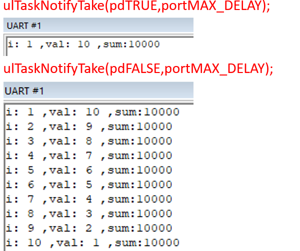


**使用任务通知实现类似事件组**

任务通知的每次xTaskNotify都会通知指定的任务，而指定任务无法等待特定的事件

````c
void vTask1(void *pvParameters){
	int i = 0;
	while(1){
		for(i = 0;i < 100000;i++)sum++;
		xTaskNotify(task3Handle,(1<<0),eSetBits);        // task3TBC的value = 原先的value | 0001
		//xEventGroupSetBits(xCreatedEventGroup,(1<<0));
	}
}
void vTask2(void *pvParameters){
	int i = 0;
	while(1){
		for(i = 0;i < 100000;i++)del--;
		xTaskNotify(task3Handle,(1<<1),eSetBits);        // task3TBC的value = 原先的value | 0010
		//xEventGroupSetBits(xCreatedEventGroup,(1<<1));
	}
}
void vTask3(void *pvParameters){
	uint32_t bit;
	while(1){
		xTaskNotifyWait(0,0,&bit,portMAX_DELAY);         // 获取task3TBC的value,进入不清除，退出不清除
		// 由于每次xTaskNotify都会通知一次任务3,但是我们想等待任务1,2都通知才执行
        // 也就是任务1通知后任务3直接就能获取value,任务2同理
        if ((bit & 0x3) == 0x3){
			vTaskDelay(1);
			printf("sum = %d,del = %d \n",sum,del);
		}else{
			printf("have not get all bit,bit = %d \n",bit);
		}
		//xEventGroupWaitBits(xCreatedEventGroup,(1<<1) | (1<<0),pdTRUE,pdTRUE,portMAX_DELAY);
		//printf("sum = %d,del = %d \n",sum,del);
	}
}
int main( void )
{
	prvSetupHardware();
    xCreatedEventGroup = xEventGroupCreate();
    
	xTaskCreate(vTask1,"vTask1",100,"Task 1 is running",1,NULL);
	xTaskCreate(vTask2,"vTask2",100,"Task 2 is running",1,NULL);
	xTaskCreate(vTask3,"vTask3",100,"Task 3 is running",1,&task3Handle);
	vTaskStartScheduler();
	return 0;
}
````


# 定时器

## 简介

**定时器分类**： 从指定的时刻开始，经过一个指定时间，然后触发一个超时事件，用户可自定义定时器的周期

* 硬件定时器：芯片本身自带的定时器模块，硬件定时器的精度一般很高，每次在定时时间到达之后就会自动触发一个中断，用户在**中断服务函数**中处理信息。
* 软件定时器：是指具有定时功能的软件，可设置定时周期，当指定时间到达后要调用回调函数（也称超时函数），用户在**回调函数**中处理信息


**软件定时器优缺点？**

* 优点
  * 硬件定时器数量有限，而软件定时器理论上只需有足够内存，就可以创建多个；
  * 使用简单、成本低
* 缺点：
  * 软件定时器相对硬件定时器来说，精度没有那么高（因为它以系统时钟为基准，系统时钟中断优先级又是最低，容易被打断）。 对于需要高精度要求的场合，不建议使用软件定时器。


**FreeRTOS软件定时器特点**

* 可裁剪：软件定时器是可裁剪可配置的功能， 如果要使能软件定时器，需将`configUSE_TIMERS `配置项配置成 1 
* 单次和周期：软件定时器支持设置成：单次定时器或周期定时器 

注意：软件定时器的超时回调**函数**是由软件定时器服务**任务**调用的，软件定时器的超时回调函数本身不是任务，因此不能在该回调函数中使用可能会导致任务阻塞的 API 函数。


**软件定时器服务任务**：在调用函数 `vTaskStartScheduler()`开启任务调度器的时候，会创建一个用于管理软件定时器的任务，这个任务就叫做**软件定时器服务任务**。

软件定时器服务任务作用

* 负责软件定时器超时的逻辑判断 
* 调用超时软件定时器的超时回调函数 
* 处理软件定时器命令队列 


调用vTaskStartScheduler()函数会创建空闲任务和定时器服务任务


**软件定时器的命令队列**

FreeRTOS 提供了许多软件定时器相关的 API 函数，这些 API 函数大多都是往定时器的队列中写入消息（发送命令），这个队列叫做软件定时器命令队列，是提供给 FreeRTOS 中的软件定时器使用的，用户是不能直接访问的。 

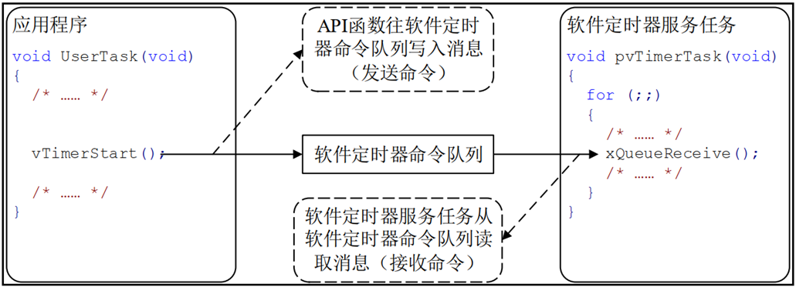

**定时器的状态**

软件定时器共有两种状态：

* 休眠态:软件定时器可以通过其句柄被引用，但因为没有运行，所以其定时超时回调函数不会被执行
* 运行态:运行态的定时器，当指定时间到达之后，它的超时回调函数会被调用

注意：新创建的软件定时器处于休眠状态 ，也就是未运行的！ 

问题：如何让软件定时器从休眠态转变为运行态？发送命令队列


**单次定时器和周期定时器**

FreeRTOS 提供了两种软件定时器：

* 单次定时器：单次定时器的一旦定时超时，只会执行一次其软件定时器超时回调函数，不会自动重新开启定时，不过可以被手动重新开启。
* 周期定时器：周期定时器的一旦启动以后就会在执行完回调函数以后自动的重新启动 ，从而周期地执行其软件定时器回调函数。


Timer1：周期定时器，定时超时时间为 2 个单位时间，开启后，一直以2个时间单位间隔重复执行； 

Timer2：单次定时器，定时超时时间为 1 个单位时间，开启后，则在第一个超时后就不在执行了。


**软件定时器的状态转换图**

单次定时器状态转换图：


周期定时器状态转换图：


当创建定时器后，定时器进入休眠状态，执行一些API操作后，进入运行时态

* 在单次定时器中：定时器超时后执行回调函数 和 执行`xTimerStop()`函数 都会进入休眠状态
* 在周期定时器中：执行`xTimerStop()`函数 进入休眠状态，执行超时后执行回调函数后会再次进入运行时态


**守护任务**

要理解软件定时器API函数的参数，特别是里面的xTicksToWait，需要知道定时器执行的过程。

FreeRTOS中有一个Tick中断，软件定时器基于Tick来运行。在哪里执行定时器函数？第一印象就是在Tick中断里执行：

* 在Tick中断中判断定时器是否超时
* 如果超时了，调用它的回调函数

FreeRTOS是RTOS，它不允许在内核、中断中执行不确定的代码：如果定时器函数很耗时，会影响整个系统。

所以，FreeRTOS中，不在Tick中断中执行定时器函数。

在哪里执行？在**某个任务里执行**，这个任务就是：RTOS Damemon Task，RTOS守护任务。以前被称为"Timer server"，但是这个任务要做并不仅仅是定时器相关，所以改名为：RTOS Damemon Task。

当FreeRTOS的配置项`configUSE_TIMERS`被设置为1时，在启动调度器时，会自动创建RTOS Damemon Task。

我们自己编写的任务函数要使用定时器时，是通过"定时器命令队列"(timer command queue)和守护任务交互，如下图所示：


守护任务的优先级为：`configTIMER_TASK_PRIORITY`；定时器命令队列的长度为`configTIMER_QUEUE_LENGTH`。


守护任务的调度，跟普通的任务并无差别。当守护任务是当前优先级最高的就绪态任务时，它就可以运行。它的工作有两类：

- 处理命令：从命令队列里取出命令、处理
- 执行定时器的回调函数

执行某个定时器函数后，会将执行的操作放入一个队列，守护线程再去读取这个队列，进行处理，执行回调函数


**回调函数**

````c
void ATimerCallback( TimerHandle_t xTimer );
````

定时器的回调函数是在守护任务中被调用的，守护任务不是专为某个定时器服务的，它还要处理其他定时器。

所以，定时器的回调函数不要影响其他人：

* 回调函数要尽快实行，不能进入阻塞状态
* 不要调用会导致阻塞的API函数，比如`vTaskDelay()`
* 可以调用`xQueueReceive()`之类的函数，但是超时时间要设为0：即刻返回，不可阻塞
  

## 相关配置

将timers.c添加至FreeRTOSfiles中

引入头文件`include "timers.h"`

* 当FreeRTOS 的配置项 `configUSE_TIMERS` 设置为1，在启动任务调度器时，会自动创建软件定时器的服务/守护任务`prvTimerTask( ) `；
* 软件定时器服务任务的优先级为 `configTIMER_TASK_PRIORITY = 31`；应当设置为最大(32)
* 定时器的命令队列长度为 `configTIMER_QUEUE_LENGTH`；
* 守护任务的栈大小`configTIMER_TASK_STACK_DEPTH` 

注意：软件定时器的超时回调函数是在软件定时器服务任务中被调用的，服务任务不是专为某个定时器服务的，它还要处理其他定时器。


软件定时器服务任务的优先级应当必其他任务优先级大，否则守护线程无法被启动(被其他高优先级的任务抢占)


所以，定时器的回调函数不要影响其他“人”：

* 回调函数要尽快实行，不能进入阻塞状态，即不能调用那些会阻塞任务的 API 函数，如：vTaskDelay() ；
* 访问队列或者信号量的非零阻塞时间的 API 函数也不能调用。 

## 函数

**定时器结构体成员**

````c
typedef    struct
{
    const char * 					pcTimerName		/* 软件定时器名字 */
    ListItem_t 					xTimerListItem		/* 软件定时器列表项 */
    TickType_t 					xTimerPeriodInTicks;        	/* 软件定时器的周期 */     
    void * 						pvTimerID			/* 软件定时器的ID */
    TimerCallbackFunction_t	 		pxCallbackFunction; 	/* 软件定时器的回调函数 */
    #if ( configUSE_TRACE_FACILITY == 1 )
     UBaseType_t 					uxTimerNumber		/*  软件定时器的编号，调试用  */
    #endif
    uint8_t 						ucStatus;                     		/*  软件定时器的状态  */
} xTIMER;
````

**FreeRTOS软件定时器相关API函数**

| 函数                        | 描述                         |
| --------------------------- | ---------------------------- |
| xTimerCreate()              | 动态方式创建软件定时器       |
| xTimerCreateStatic()        | 静态方式创建软件定时器       |
| xTimerStart()               | 开启软件定时器定时           |
| xTimerStartFromISR()        | 在中断中开启软件定时器定时   |
| xTimerStop()                | 停止软件定时器定时           |
| xTimerStopFromISR()         | 在中断中停止软件定时器定时   |
| xTimerReset()               | 复位软件定时器定时           |
| xTimerResetFromISR()        | 在中断中复位软件定时器定时   |
| xTimerChangePeriod()        | 更改软件定时器的定时超时时间 |
| xTimerChangePeriodFromISR() | 在中断中更改定时超时时间     |

### 创建

要使用定时器，需要先创建它，得到它的句柄。

````c
TimerHandle_t xTimerCreate( const char * const pcTimerName, 
							const TickType_t xTimerPeriodInTicks,
							const UBaseType_t uxAutoReload,
							void * const pvTimerID,
							TimerCallbackFunction_t pxCallbackFunction );

TimerHandle_t xTimerCreateStatic(const char * const pcTimerName,
                                 TickType_t xTimerPeriodInTicks,
                                 UBaseType_t uxAutoReload,
                                 void * pvTimerID,
                                 TimerCallbackFunction_t pxCallbackFunction,
                                 StaticTimer_t *pxTimerBuffer );
````

|        形参         |                             描述                             |
| :-----------------: | :----------------------------------------------------------: |
|     pcTimerName     |                         软件定时器名                         |
| xTimerPeriodInTicks |               定时超时时间，单位：系统时钟节拍               |
|    uxAutoReload     |    定时器模式， pdTRUE：周期定时器， pdFALSE：单次定时器     |
|      pvTimerID      | 软件定时器 ID，用于多个软件定时器公用一个超时回调函数（判断是哪个定时器调用） |
| pxCallbackFunction  |                    软件定时器超时回调函数                    |

| 返回值 | 描述                           |
| :----: | :----------------------------: |
| NULL   | 软件定时器创建失败             |
| 其他值  | 软件定时器创建成功，返回其句柄 |

回调函数的类型是：

````c
void ATimerCallback( TimerHandle_t xTimer );
typedef void (* TimerCallbackFunction_t)( TimerHandle_t xTimer );
````

### 开启

````c
BaseType_t xTimerStart(TimerHandle_t xTimer,const TickType_t xTicksToWait); 
````

| 形参        | 描述                                       |
| ----------- | ------------------------------------------ |
| xTimer      | 待开启的软件定时器的句柄                   |
| xTickToWait | 发送命令到软件定时器命令队列的最大等待时间 |

| 返回值 | 描述               |
| ------ | ------------------ |
|pdPASS | 软件定时器开启成功 |
| pdFAIL | 软件定时器开启失败 |

### 停止

````c
BaseType_t xTimerStop( TimerHandle_t xTimer, TickType_t xTicksToWait );
````

| 形参        | 描述                                       |
| ----------- | ------------------------------------------ |
| xTimer      | 待停止的软件定时器的句柄                   |
|xTickToWait | 发送命令到软件定时器命令队列的最大等待时间 |

| 返回值 | 描述               |
| ------ | ------------------ |
|pdPASS | 软件定时器停止成功 |
| pdFAIL | 软件定时器停止失败 |

### 删除

动态分配的定时器，不再需要时可以删除掉以回收内存。删除函数原型如下：

````c
BaseType_t xTimerDelete( TimerHandle_t xTimer, TickType_t xTicksToWait );
````

| 形参        | 描述                                       |
| ----------- | ------------------------------------------ |
| xTimer      | 待停止的软件定时器的句柄                   |
| xTickToWait | 发送命令到软件定时器命令队列的最大等待时间 |

| 返回值 | 描述               |
| ------ | ------------------ |
|pdPASS | 软件定时器停止成功 |
| pdFAIL | 软件定时器停止失败 |

注意，这些函数的xTicksToWait表示的是，把命令写入命令队列的超时时间。命令队列可能已经满了，无法马上把命令写入队列里，可以等待一会。

xTicksToWait不是定时器本身的超时时间，不是定时器本身的"周期"。

创建定时器时，设置了它的周期(period)。xTimerStart()函数是用来启动定时器。假设调用xTimerStart()的时刻是tX，定时器的周期是n，那么在tX+n时刻定时器的回调函数被调用。

如果定时器已经被启动，但是它的函数尚未被执行，再次执行xTimerStart()函数相当于执行xTimerReset()，重新设定它的启动时间。


### 复位

从定时器的状态转换图可以知道，使用`xTimerReset()`函数可以让定时器的状态从冬眠态转换为运行态，相当于使用`xTimerStart()`函数。

如果定时器已经处于运行态，使用`xTimerReset()函数`就相当于重新确定超时时间。假设调用`xTimerReset()`的时刻是tX，定时器的周期是n，那么tX+n就是重新确定的超时时间。

````c
BaseType_t xTimerReset( TimerHandle_t xTimer, TickType_t xTicksToWait );
````

| 形参        | 描述                                       |
| ----------- | ------------------------------------------ |
| xTimer      | 待复位的软件定时器的句柄                   |
| xTickToWait | 发送命令到软件定时器命令队列的最大等待时间 |

| 返回值 | 描述               |
| ---------- | ------------------ |
|pdPASS     | 软件定时器复位成功 |
| pdFAIL     | 软件定时器复位失败 |

该功能将使软件定时器的重新开启定时，复位后的软件定时器以复位时的时刻作为开启时刻重新定时


###  修改周期

从定时器的状态转换图可以知道，使用`xTimerChangePeriod()`函数，处理能修改它的周期外，还可以让定时器的状态从冬眠态转换为运行态。

修改定时器的周期时，会使用新的周期重新计算它的超时时间。假设调用`xTimerChangePeriod()`函数的时间tX，新的周期是n，则tX+n就是新的超时时间。


| 形参        | 描述                                       |
| ----------- | ------------------------------------------ |
|xTimer      | 待更新的软件定时器的句柄                   |
| xNewPeriod  | 新的定时超时时间，单位：系统时钟节拍       |
| xTickToWait | 发送命令到软件定时器命令队列的最大等待时间 |

| 返回值 | 描述                           |
| ---------- | ------------------------------ |
|pdPASS     | 软件定时器定时超时时间更改成功 |
| pdFAIL     | 软件定时器定时超时时间更改失败 |

## 代码案例

**案例1**

````c
/* 1. 工程中 */
//添加 timer.c

/* 2. 配置文件FreeRTOSConfig.h中 */
#define configUSE_TIMERS			 1   /* 使能定时器 */
#define configTIMER_TASK_PRIORITY    31  /* 守护任务的优先级, 尽可能高一些 */
#define configTIMER_QUEUE_LENGTH     5   /* 命令队列长度 */
#define configTIMER_TASK_STACK_DEPTH 100  /* 守护任务的栈大小 */
    
/* 3. 源码中 */
#include "timers.h"
````

````c
int flag1,flag2;
TimerHandle_t xTimerMyHandle1;
TimerHandle_t xTimerMyHandle2;
void vTimer1(TimerHandle_t xTimer){
	flag1 =! flag1;
	printf("timer1 is runing\n");
}
void vTimer2(TimerHandle_t xTimer){	
	flag2 =! flag2;
	printf("timer2 is runing\n");
}
int main( void )
{
	prvSetupHardware();

	xTimerMyHandle1 = xTimerCreate("timer1",10,pdTRUE,0,vTimer1);       // 定时器1重复计数
	xTimerMyHandle2 = xTimerCreate("timer2",20,pdFALSE,0,vTimer2);      // 定时器2一次性
	
	xTimerStart(xTimerMyHandle1,0);
	xTimerStart(xTimerMyHandle2,0);

	vTaskStartScheduler();
	return 0;
}
````

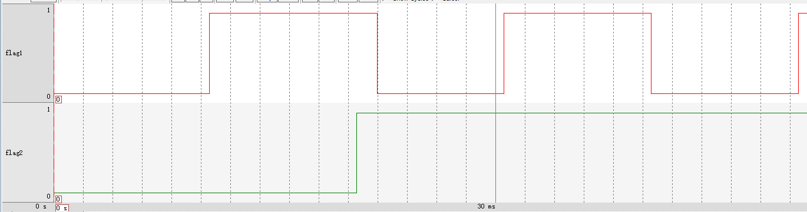


**案例2消除抖动**

在嵌入式开发中，我们使用机械开关时经常碰到抖动问题：引脚电平在短时间内反复变化。

怎么读到确定的按键状态？

* 连续读很多次，知道数值稳定：浪费CPU资源
* 使用定时器：要结合中断来使用

对于第2种方法，处理方法如下图所示，按下按键后：

* 在t1产生中断，这时不马上确定按键，而是复位定时器，假设周期时20ms，超时时间为"t1+20ms"
* 由于抖动，在t2再次产生中断，再次复位定时器，超时时间变为"t2+20ms"
* 由于抖动，在t3再次产生中断，再次复位定时器，超时时间变为"t3+20ms"
* 在"t3+20ms"处，按键已经稳定，读取按键值


````c
int flagTimer;
void Init(void){
    GPIO_InitTypeDef GPIO_InitStructure;//定义结构体
	EXTI_InitTypeDef EXTI_InitStructure;//定义初始化结构体
	NVIC_InitTypeDef NVIC_InitStructure;//定义结构体
    RCC_APB2PeriphClockCmd(RCC_APB2Periph_AFIO, ENABLE); /* 使能AFIO复用时钟 */

    RCC_APB2PeriphClockCmd(RCC_APB2Periph_GPIOA, ENABLE);// 使能时钟
	GPIO_InitStructure.GPIO_Pin  = GPIO_Pin_0;             // 选择IO口   PA0
	GPIO_InitStructure.GPIO_Mode = GPIO_Mode_IPU;          // 设置成上拉输入
	GPIO_Init(GPIOA, &GPIO_InitStructure);                  // 使用结构体信息进行初始化IO口}
	
	GPIO_EXTILineConfig(GPIO_PortSourceGPIOA, GPIO_PinSource0); /* 将GPIO口与中断线映射起来 */

	EXTI_InitStructure.EXTI_Line=EXTI_Line0; // 中断线
	EXTI_InitStructure.EXTI_Mode = EXTI_Mode_Interrupt;            // 中断模式
	EXTI_InitStructure.EXTI_Trigger = EXTI_Trigger_Rising_Falling; // 双边沿触发

	EXTI_InitStructure.EXTI_LineCmd = ENABLE;

	EXTI_Init(&EXTI_InitStructure); // 初始化	
	
	NVIC_InitStructure.NVIC_IRQChannel = EXTI0_IRQChannel;     //使能外部中断所在的通道	
	NVIC_InitStructure.NVIC_IRQChannelPreemptionPriority = 0;  // 抢占优先级
	NVIC_InitStructure.NVIC_IRQChannelSubPriority = 0;         // 子优先级
	NVIC_InitStructure.NVIC_IRQChannelCmd = ENABLE;            // 使能外部中断通道 	
	NVIC_Init(&NVIC_InitStructure); // 初始化 
}

// 此处模拟开关执行的任务
void MyTimerCallbackFunction( TimerHandle_t xTimer ){
	static int cnt = 0;
	flagTimer = !flagTimer;
	printf("Get GPIO Key cnt = %d\r\n", cnt++);            // 显示开关执行了几次
}
// 当多次按下开关时，产生延时，最后一次中断才进入回调函数
void EXTI0_IRQHandler(void)
{
	static int cnt = 0;
	if(EXTI_GetITStatus(EXTI_Line0) != RESET)
	{
		printf("EXTI0_IRQHandler cnt = %d\r\n", cnt++);      // 显示进入中断几次
		/* 使用定时器消除抖动 重置定时器
		*  实际上我们不能在中断中使用这个函数,在中断中不能使用可以阻塞任务的函数
		*  但是这个程序仍然会正常运行：因为如果阻塞我们等待了0秒(参数2)
		*/
		xTimerReset(xMyTimerHandle, 0);         
		EXTI_ClearITPendingBit(EXTI_Line0);     // 清除中断
	}     
}

int main( void )
{
	prvSetupHardware();
	Init();
	xMyTimerHandle = xTimerCreate("timer1",200,pdFALSE,0,MyTimerCallbackFunction);
	
	xTimerStart(xMyTimerHandle,0);

	vTaskStartScheduler();
	return 0;
}
````

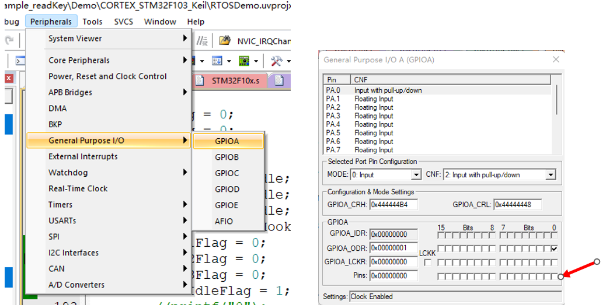

快速点击GPIO_Pin_0(模拟抖动),如图显示：中断进入了6次(模拟按键抖动了6次)，回调函数才执行一次

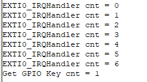


# 中断管理

## 概述

在RTOS中，需要应对各类事件。这些事件很多时候是通过硬件中断产生，怎么处理中断呢？

假设当前系统正在运行Task1时，用户按下了按键，触发了按键中断。这个中断的处理流程如下：

* CPU跳到固定地址去执行代码，这个固定地址通常被称为中断向量，这个跳转时硬件实现的

* 执行代码做什么？

  * 保存现场：Task1被打断，需要先保存Task1的运行环境，比如各类寄存器的值
  * 分辨中断、调用处理函数(这个函数就被称为ISR，interrupt service routine)
  * 恢复现场：继续运行Task1，或者运行其他优先级更高的任务

  

你要注意到，ISR是在内核中被调用的，ISR执行过程中，用户的任务无法执行。ISR要尽量快，否则：

* 其他低优先级的中断无法被处理：实时性无法保证
* 用户任务无法被执行：系统显得很卡顿

如果这个硬件中断的处理，就是非常耗费时间呢？对于这类中断的处理就要分为2部分：

* ISR：尽快做些清理、记录工作，然后触发某个任务
* 任务：更复杂的事情放在任务中处理
* 所以：需要ISR和任务之间进行通信

要在FreeRTOS中熟练使用中断，有几个原则要先说明：

* FreeRTOS把任务认为是硬件无关的，任务的优先级由程序员决定，任务何时运行由调度器决定
* ISR虽然也是使用软件实现的，但是它被认为是硬件特性的一部分，因为它跟硬件密切相关
  * 何时执行？由硬件决定
  * 哪个ISR被执行？由硬件决定
* ISR的优先级高于任务：即使是优先级最低的中断，它的优先级也高于任务。任务只有在没有中断的情况下，才能执行。
  

## 两套API函数

### 为什么需要两套API

在任务函数中，我们可以调用各类API函数，比如队列操作函数：xQueueSendToBack。但是在ISR中使用这个函数会导致问题，应该使用另一个函数：xQueueSendToBackFromISR，它的函数名含有后缀"FromISR"，表示"从ISR中给队列发送数据"。

FreeRTOS中很多API函数都有两套：一套在任务中使用，另一套在ISR中使用。后者的函数名含有"FromISR"后缀。

为什么要引入两套API函数？

* 很多API函数会导致任务计入阻塞状态：
  * 运行这个函数的任务进入阻塞状态
  * 比如写队列时，如果队列已满，可以进入阻塞状态等待一会
* ISR调用API函数时，ISR不是"任务"，ISR不能进入阻塞状态
* 所以，在任务中、在ISR中，这些函数的功能是有差别的

FreeRTOS使用两套函数，而不是使用一套函数，是因为有如下好处：

* 使用同一套函数的话，需要增加额外的判断代码、增加额外的分支，是的函数更长、更复杂、难以测试
* 在任务、ISR中调用时，需要的参数不一样，比如：
  * 在任务中调用：需要指定超时时间，表示如果不成功就阻塞一会
  * 在ISR中调用：不需要指定超时时间，无论是否成功都要即刻返回
  * 如果强行把两套函数揉在一起，会导致参数臃肿、无效
* 移植FreeRTOS时，还需要提供监测上下文的函数，比如is_in_isr()
* 有些处理器架构没有办法轻易分辨当前是处于任务中，还是处于ISR中，就需要额外添加更多、更复杂的代码

使用两套函数可以让程序更高效，但是也有一些缺点，比如你要使用第三方库函数时，即会在任务中调用它，也会在ISR总调用它。这个第三方库函数用到了FreeRTOS的API函数，你无法修改库函数。这个问题可以解决：

* 把中断的处理推迟到任务中进行(Defer interrupt processing)，在任务中调用库函数
* 尝试在库函数中使用"FromISR"函数：
  * 在任务中、在ISR中都可以调用"FromISR"函数
  * 反过来就不行，非FromISR函数无法在ISR中使用
* 第三方库函数也许会提供OS抽象层，自行判断当前环境是在任务还是在ISR中，分别调用不同的函数

###  两套API函数列表

|            类型             |      在任务中      |          在ISR中          |
| :-------------------------: | :----------------: | :-----------------------: |
|         队列(queue)         |  xQueueSendToBack  |  xQueueSendToBackFromISR  |
|                             | xQueueSendToFront  | xQueueSendToFrontFromISR  |
|                             |   xQueueReceive    |   xQueueReceiveFromISR    |
|                             |  xQueueOverwrite   |  xQueueOverwriteFromISR   |
|                             |     xQueuePeek     |     xQueuePeekFromISR     |
|      信号量(semaphore)      |   xSemaphoreGive   |   xSemaphoreGiveFromISR   |
|                             |   xSemaphoreTake   |   xSemaphoreTakeFromISR   |
|     事件组(event group)     | xEventGroupSetBits | xEventGroupSetBitsFromISR |
|                             | xEventGroupGetBits | xEventGroupGetBitsFromISR |
| 任务通知(task notification) |  xTaskNotifyGive   |  vTaskNotifyGiveFromISR   |
|                             |    xTaskNotify     |    xTaskNotifyFromISR     |
| 软件定时器(software timer)  |    xTimerStart     |    xTimerStartFromISR     |
|                             |     xTimerStop     |     xTimerStopFromISR     |
|                             |    xTimerReset     |    xTimerResetFromISR     |
|                             | xTimerChangePeriod | xTimerChangePeriodFromISR |

### xxHigherPriorityTaskWoken参数

xHigherPriorityTaskWoken的含义是：是否有更高优先级的任务被唤醒了。如果为pdTRUE，则意味着后面要进行任务切换。

还是以写队列为例。

任务A调用`xQueueSendToBack()`写队列，有几种情况发生：

- 队列满了，任务A阻塞等待，另一个任务B运行
- 队列没满，任务A成功写入队列，但是它导致另一个任务B被唤醒，任务B的优先级更高：任务B先运行
- 队列没满，任务A成功写入队列，即刻返回

可以看到，在任务中调用API函数可能导致任务阻塞、任务切换，这叫做"context switch"，上下文切换。这个函数可能很长时间才返回，在函数的内部实现了任务切换。


`xQueueSendToBackFromISR()`函数也**可能导致任务切换**，但是不会在函数内部进行切换，而是返回一个参数：表示是否需要切换，函数原型与用法如下：

````c
/* 
 * 往队列尾部写入数据，此函数可以在中断函数中使用，不可阻塞
 */
BaseType_t xQueueSendToBackFromISR(
                                      QueueHandle_t xQueue,
                                      const void *pvItemToQueue,
                                      BaseType_t *pxHigherPriorityTaskWoken
                                   );

/* 用法示例 */

BaseType_t xHigherPriorityTaskWoken = pdFALSE;
xQueueSendToBackFromISR(xQueue, pvItemToQueue, &xHigherPriorityTaskWoken);

if (xHigherPriorityTaskWoken == pdTRUE)
{
    /* 任务切换 */    
}
````

**pxHigherPriorityTaskWoken参数，就是用来保存函数的结果：是否需要切换**

- *pxHigherPriorityTaskWoken等于pdTRUE：函数的操作导致更高优先级的任务就绪了，ISR应该进行任务切换
- *pxHigherPriorityTaskWoken等于pdFALSE：没有进行任务切换的必要


为什么不在"FromISR"函数内部进行任务切换，而只是标记一下而已呢？为了效率！

在ISR中调用API时不进行任务切换，而只是在"xHigherPriorityTaskWoken"中标记一下，除了效率，还有多种好处：

- 效率高：避免不必要的任务切换
- 让ISR更可控：中断随机产生，在API中进行任务切换的话，可能导致问题更复杂
- 可移植性
- 在Tick中断中，调用`vApplicationTickHook()`：它运行与ISR，只能使用"FromISR"的函数

使用"FromISR"函数时，如果不想使用xHigherPriorityTaskWoken参数，可以设置为NULL。

### 切换任务

FreeRTOS的ISR函数中，使用两个宏进行任务切换：

````c
portEND_SWITCHING_ISR( xHigherPriorityTaskWoken );
//或
portYIELD_FROM_ISR( xHigherPriorityTaskWoken );
````

这两个宏做的事情是完全一样的，在老版本的FreeRTOS中，

- `portEND_SWITCHING_ISR`使用汇编实现
- `portYIELD_FROM_ISR`使用C语言实现

新版本都统一使用`portYIELD_FROM_ISR`。

````c
void XXX_ISR()
{
    int i;
    BaseType_t xHigherPriorityTaskWoken = pdFALSE;
    
    for (i = 0; i < N; i++)
    {
        xQueueSendToBackFromISR(..., &xHigherPriorityTaskWoken); /* 被多次调用 */
    }
	
    /* 最后再决定是否进行任务切换 
     * xHigherPriorityTaskWoken为pdTRUE时才切换
     */
    portYIELD_FROM_ISR(xHigherPriorityTaskWoken);
}
````

## 中断的延迟处理

前面讲过，ISR要尽量快，否则：

- 其他低优先级的中断无法被处理：实时性无法保证
- 用户任务无法被执行：系统显得很卡顿
- 如果运行中断嵌套，这会更复杂，ISR越快执行约有助于中断嵌套

如果这个硬件中断的处理，就是非常耗费时间呢？对于这类中断的处理就要分为2部分：

- ISR：尽快做些清理、记录工作，然后触发某个任务
- 任务：更复杂的事情放在任务中处理


这种处理方式叫"中断的延迟处理"(Deferring interrupt processing)，处理流程如下图所示：

- tick1：任务1运行，任务2阻塞
- tic2：发生中断，
  - 该中断的ISR函数被执行，任务1被打断
  - ISR函数要尽快能快速地运行，它做一些必要的操作(比如清除中断)，然后唤醒任务2
- tick3：在创建任务时设置任务2的优先级比任务1高(这取决于设计者)，所以ISR返回后，运行的是任务2，它要完成中断的处理。任务2就被称为"deferred processing task"，中断的延迟处理任务。
- tick4：任务2处理完中断后，进入阻塞态以等待下一个中断，任务1重新运行

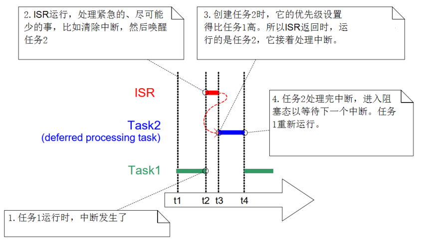

## 代码案例

其他代码与定时器案例2消除抖动相同

````c
void EXTI0_IRQHandler(void)
{
	static int cnt = 0;
	BaseType_t xHigherPriorityTaskWoken  = pdTRUE;
	if(EXTI_GetITStatus(EXTI_Line0) != RESET)
	{
		printf("EXTI0_IRQHandler cnt = %d\r\n", cnt++);
		/* 使用定时器消除抖动 */
		xTimerResetFromISR(xMyTimerHandle, &xHigherPriorityTaskWoken); /* Tcur + 2000 */
		
        portYIELD_FROM_ISR(xHigherPriorityTaskWoken);   //是否进行任务切换 
		
		EXTI_ClearITPendingBit(EXTI_Line0);     //清除中断
	}     
}
````


# 资源管理

**概述**

在前面讲解互斥量时，引入过临界资源的概念。在前面课程里，已经实现了临界资源的互斥访问。

本章节的内容比较少，只是引入两个功能：屏蔽/使能中断、暂停/恢复调度器。

要独占式地访问临界资源，有3种方法：

- 公平竞争：比如使用互斥量，谁先获得互斥量谁就访问临界资源，这部分内容前面讲过。
- 谁要跟我抢，我就灭掉谁：
  - 中断要跟我抢？我屏蔽中断
  - 其他任务要跟我抢？我禁止调度器，不运行任务切换


谁跟我抢，就先禁止谁！

* 任务A、B都可以使用临界资源，那么访问临界资源前，先禁止任务调度
  * 假设任务A先禁止任务调度，那么任务B就无法执行，任务A可以安心访问临界资源
  * 假设任务B先禁止任务调度，那么任务A就无法执行，任务B可以安心访问临界资源
* 任务A、中断C都可以使用临界资源，那么访问临界资源前，先关闭中断
  * 假设任务A先关闭中断，那么中断C被屏蔽，任务A可以安心访问临界资源
  * 中断C运行过程中，任务A本来就无法执行，所以任务A无法抢占中断C使用的临界资源

## 屏蔽中断(临界值保护)

**访问临界值**critica：临界的

屏蔽中断有两套宏：任务中使用、ISR中使用：

- 任务中使用：`taskENTER_CRITICA()/taskEXIT_CRITICAL()`
- ISR中使用：`taskENTER_CRITICAL_FROM_ISR()/taskEXIT_CRITICAL_FROM_ISR()`

### 任务中屏蔽中断

````c
/* 在任务中，当前时刻中断是使能的
 * 执行这句代码后，屏蔽中断
 */
taskENTER_CRITICAL();

/* 访问临界资源 */

/* 重新使能中断 */
taskEXIT_CRITICAL();
````

在`taskENTER_CRITICA()/taskEXIT_CRITICAL()`之间：

- 低优先级的中断被屏蔽了：优先级低于、等于`configMAX_SYSCALL_INTERRUPT_PRIORITY`
- 高优先级的中断可以产生：优先级高于`configMAX_SYSCALL_INTERRUPT_PRIORITY`
  - 但是，这些中断ISR里，不允许使用FreeRTOS的API函数
- 任务调度依赖于中断、依赖于API函数，所以：这两段代码之间，不会有任务调度产生

这套`taskENTER_CRITICA()/taskEXIT_CRITICAL()`宏，是可以递归使用的，它的内部会记录嵌套的深度，只有嵌套深度变为0时，调用`taskEXIT_CRITICAL()`才会重新使能中断。

使用`taskENTER_CRITICA()/taskEXIT_CRITICAL()`来访问临界资源是很粗鲁的方法：

- 中断无法正常运行
- 任务调度无法进行
- 所以，之间的代码要尽可能快速地执行

### ISR中屏蔽中断

要使用含有"FROM_ISR"后缀的宏，示例代码如下：

````c
void vAnInterruptServiceRoutine( void )
{
    /* 用来记录当前中断是否使能 */
    UBaseType_t uxSavedInterruptStatus;
    
    /* 在ISR中，当前时刻中断可能是使能的，也可能是禁止的
     * 所以要记录当前状态, 后面要恢复为原先的状态
     * 执行这句代码后，屏蔽中断
     */
    uxSavedInterruptStatus = taskENTER_CRITICAL_FROM_ISR();
    
    /* 访问临界资源 */

    /* 恢复中断状态 
    * 注意是恢复，不是使能，和任务中屏蔽不一样
    * 为什么是恢复呢？因为中断可能是使能的，也可能是禁止的，恢复为原先的状态
    */
    taskEXIT_CRITICAL_FROM_ISR( uxSavedInterruptStatus );
    /* 现在，当前ISR可以被更高优先级的中断打断了 */
}
````

在`taskENTER_CRITICA_FROM_ISR()/taskEXIT_CRITICAL_FROM_ISR()`之间：

- 低优先级的中断被屏蔽了：优先级低于、等于`configMAX_SYSCALL_INTERRUPT_PRIORITY`
- 高优先级的中断可以产生：优先级高于`configMAX_SYSCALL_INTERRUPT_PRIORITY`
  - 但是，这些中断ISR里，不允许使用FreeRTOS的API函数
- 任务调度依赖于中断、依赖于API函数，所以：这两段代码之间，不会有任务调度产生

## 暂停调度器

如果有别的任务来跟你竞争临界资源，你可以把中断关掉：这当然可以禁止别的任务运行，但是这代价太大了。它会影响到中断的处理。

如果只是禁止别的任务来跟你竞争，不需要关中断，暂停调度器就可以了：在这期间，中断还是可以发生、处理。

使用这2个函数来暂停、恢复调度器：

````c
/* 暂停调度器 */
void vTaskSuspendAll( void );

/* 恢复调度器
 * 返回值: pdTRUE表示在暂定期间有更高优先级的任务就绪了
 *        可以不理会这个返回值
 */
BaseType_t xTaskResumeAll( void );
````

示例代码如下：

```c
vTaskSuspendScheduler();  // 暂停调度
/* 访问临界资源 */
xTaskResumeScheduler();   // 恢复调度
```

这套`vTaskSuspendScheduler()/xTaskResumeScheduler()`宏，是可以递归使用的，它的内部会记录嵌套的深度，只有嵌套深度变为0时，调用`taskEXIT_CRITICAL()`才会重新使能中断。


# 调试与优化

## 调试

FreeRTOS提供了很多调试手段：

* 打印
* 断言：`configASSERT  `
* Trace
* Hook函数(回调函数)

###  打印

printf：FreeRTOS工程里使用了microlib，里面实现了printf函数。

我们只需实现一下函数即可使用printf：

````c
int fputc( int ch, FILE *f )
````

比如我们想在串口打印

````c
int fputc( int ch, FILE *f ){
	while((USART1->SR & (1 << 7)) == 0);   // 状态寄存器第七位 TXE发送数据寄存器空
	USART1->DR = ch;                       // 将数据发送到数据寄存器
	return ch;
}
````

###  断言

一般的C库里面，断言就是一个函数：

```c
void assert(scalar expression);
```

它的作用是：确认expression必须为真，如果expression为假的话就中止程序。

在FreeRTOS里，使用`configASSERT()`，比如：

```c
#define configASSERT(x)  if (!x) while(1);      // 如果x非真，则卡死(while死循环)
```

我们可以让它提供更多信息，比如：

```c
#define configASSERT(x)  \
	if (!x) \
	{
		printf("%s %s %d\r\n", __FILE__, __FUNCTION__, __LINE__); \
        while(1); \
 	}
```

configASSERT(x)中，如果x为假，表示发生了很严重的错误，必须停止系统的运行。

它用在很多场合，比如：

* 队列操作

  ```c
  BaseType_t xQueueGenericSend( QueueHandle_t xQueue,
                                const void * const pvItemToQueue,
                                TickType_t xTicksToWait,
                                const BaseType_t xCopyPosition )
  {
      BaseType_t xEntryTimeSet = pdFALSE, xYieldRequired;
      TimeOut_t xTimeOut;
      Queue_t * const pxQueue = xQueue;
  
      configASSERT( pxQueue );
      configASSERT(!((pvItemToQueue == NULL) && (pxQueue->uxItemSize != (UBaseType_t)0U)));
      configASSERT( !((xCopyPosition == queueOVERWRITE) && (pxQueue->uxLength != 1 )));
  ```

* 中断级别的判断

  ```c
  void vPortValidateInterruptPriority( void )
  {
  	uint32_t ulCurrentInterrupt;
  	uint8_t ucCurrentPriority;
  
  	/* Obtain the number of the currently executing interrupt. */
  	ulCurrentInterrupt = vPortGetIPSR();
  
  	/* Is the interrupt number a user defined interrupt? */
  	if( ulCurrentInterrupt >= portFIRST_USER_INTERRUPT_NUMBER )
  	{
  		/* Look up the interrupt's priority. */
  		ucCurrentPriority = pcInterruptPriorityRegisters[ ulCurrentInterrupt ];
  
  		configASSERT( ucCurrentPriority >= ucMaxSysCallPriority );
  	}
  ```
### Trace

  FreeRTOS中定义了很多trace开头的宏，这些宏被放在系统关键位置。

  它们一般都是空的宏，这不会影响代码：不影响编程处理的程序大小、不影响运行时间。

  我们要调试某些功能时，可以修改宏：修改某些标记变量、打印信息等待。

  | trace宏                                     | 描述                                                         |
  | ------------------------------------------- | ------------------------------------------------------------ |
  | traceTASK_INCREMENT_TICK(xTickCount)        | 当tick计数自增之前此宏函数被调用。参数xTickCount当前的Tick值，它还没有增加。 |
  | traceTASK_SWITCHED_OUT()                    | vTaskSwitchContext中，把当前任务切换出去之前调用此宏函数。   |
  | traceTASK_SWITCHED_IN()                     | vTaskSwitchContext中，新的任务已经被切换进来了，就调用此函数。 |
  | traceBLOCKING_ON_QUEUE_RECEIVE(pxQueue)     | 当正在执行的当前任务因为试图去读取一个空的队列、信号或者互斥量而进入阻塞状态时，此函数会被立即调用。参数pxQueue保存的是试图读取的目标队列、信号或者互斥量的句柄，传递给此宏函数。 |
  | traceBLOCKING_ON_QUEUE_SEND(pxQueue)        | 当正在执行的当前任务因为试图往一个已经写满的队列或者信号或者互斥量而进入了阻塞状态时，此函数会被立即调用。参数pxQueue保存的是试图写入的目标队列、信号或者互斥量的句柄，传递给此宏函数。 |
  | traceQUEUE_SEND(pxQueue)                    | 当一个队列或者信号发送成功时，此宏函数会在内核函数xQueueSend(),xQueueSendToFront(),xQueueSendToBack(),以及所有的信号give函数中被调用，参数pxQueue是要发送的目标队列或信号的句柄，传递给此宏函数。 |
  | traceQUEUE_SEND_FAILED(pxQueue)             | 当一个队列或者信号发送失败时，此宏函数会在内核函数xQueueSend(),xQueueSendToFront(),xQueueSendToBack(),以及所有的信号give函数中被调用，参数pxQueue是要发送的目标队列或信号的句柄，传递给此宏函数。 |
  | traceQUEUE_RECEIVE(pxQueue)                 | 当读取一个队列或者接收信号成功时，此宏函数会在内核函数xQueueReceive()以及所有的信号take函数中被调用，参数pxQueue是要接收的目标队列或信号的句柄，传递给此宏函数。 |
  | traceQUEUE_RECEIVE_FAILED(pxQueue)          | 当读取一个队列或者接收信号失败时，此宏函数会在内核函数xQueueReceive()以及所有的信号take函数中被调用，参数pxQueue是要接收的目标队列或信号的句柄，传递给此宏函数。 |
  | traceQUEUE_SEND_FROM_ISR(pxQueue)           | 当在中断中发送一个队列成功时，此函数会在xQueueSendFromISR()中被调用。参数pxQueue是要发送的目标队列的句柄。 |
  | traceQUEUE_SEND_FROM_ISR_FAILED(pxQueue)    | 当在中断中发送一个队列失败时，此函数会在xQueueSendFromISR()中被调用。参数pxQueue是要发送的目标队列的句柄。 |
  | traceQUEUE_RECEIVE_FROM_ISR(pxQueue)        | 当在中断中读取一个队列成功时，此函数会在xQueueReceiveFromISR()中被调用。参数pxQueue是要发送的目标队列的句柄。 |
  | traceQUEUE_RECEIVE_FROM_ISR_FAILED(pxQueue) | 当在中断中读取一个队列失败时，此函数会在xQueueReceiveFromISR()中被调用。参数pxQueue是要发送的目标队列的句柄。 |
  | traceTASK_DELAY_UNTIL()                     | 当一个任务因为调用了vTaskDelayUntil()进入了阻塞状态的前一刻此宏函数会在vTaskDelayUntil()中被立即调用。 |
  | traceTASK_DELAY()                           | 当一个任务因为调用了vTaskDelay()进入了阻塞状态的前一刻此宏函数会在vTaskDelay中被立即调用。 |

  

  ### MallocHook函数

  编程时，一般的逻辑错误都容易解决。难以处理的是内存越界、栈溢出等。

  内存越界经常发生在堆的使用过程总：堆，就是使用malloc得到的内存。

  并没有很好的方法检测内存越界，但是可以提供一些回调函数：

  * 使用pvPortMalloc失败时，如果在FreeRTOSConfig.h里配置`configUSE_MALLOC_FAILED_HOOK`为1，会调用：

    ```c
    void vApplicationMallocFailedHook( void );
    ```

  

### 栈溢出Hook函数

在切换任务(vTaskSwitchContext)时调用taskCHECK_FOR_STACK_OVERFLOW来检测栈是否溢出，如果溢出会调用：

```c
void vApplicationStackOverflowHook( TaskHandle_t xTask, char * pcTaskName );
```

怎么判断栈溢出？有两种方法：

* 方法1：

  * 当前任务被切换出去之前，它的整个运行现场都被保存在栈里，这时**很可能**就是它对栈的使用到达了峰值。
  * 这方法很高效，但是并不精确
  * 比如：任务在运行过程中调用了函数A大量地使用了栈，调用完函数A后才被调度。


* 方法2：

  * 创建任务时，它的栈被填入固定的值，比如：0xa5


  * 检测栈里最后16字节的数据，如果不是0xa5的话表示栈即将、或者已经被用完了


  * 没有方法1快速，但是也足够快


  * 能捕获**几乎所有**的栈溢出


  * 为什么是几乎所有？可能有些函数使用栈时，非常凑巧地把栈设置为0xa5：几乎不可能


## 优化

在Windows中，当系统卡顿时我们可以查看任务管理器找到最消耗CPU资源的程序。

在FreeRTOS中，我们也可以查看任务使用CPU的情况、使用栈的情况，然后针对性地进行优化。

这就是查看"任务的统计"信息。

#### 栈使用情况

在创建任务时分配了栈，可以填入固定的数值比如0xa5，以后可以使用以下函数查看"栈的高水位"，也就是还有多少空余的栈空间：

```c
UBaseType_t uxTaskGetStackHighWaterMark( TaskHandle_t xTask );
```

原理是：从栈底往栈顶逐个字节地判断，它们的值持续是0xa5就表示它是空闲的。

函数说明：

| 参数/返回值 | 说明                                                         |
| ----------- | ------------------------------------------------------------ |
| xTask       | 哪个任务                                                     |
| 返回值      | 任务运行时、任务被切换时，都会用到栈。栈里原来值(0xa5)就会被覆盖。<br />逐个函数从栈的尾部判断栈的值连续为0xa5的个数，<br />它就是任务运行过程中空闲内存容量的最小值。<br />注意：假设从栈尾开始连续为0xa5的栈空间是N字节，返回值是N/4。 |

#### 任务运行时间统计

对于同优先级的任务，它们按照时间片轮流运行：你执行一个Tick，我执行一个Tick。

是否可以在Tick中断函数中，统计当前任务的累计运行时间？

不行！很不精确，因为有更高优先级的任务就绪时，当前任务还没运行一个完整的Tick就被抢占了。

我们需要比Tick更快的时钟，比如Tick周期时1ms，我们可以使用另一个定时器，让它发生中断的周期时0.1ms甚至更短。

使用这个定时器来衡量一个任务的运行时间，原理如下图所示：


* 切换到Task1时，使用更快的定时器记录当前时间T1
* Task1被切换出去时，使用更快的定时器记录当前时间T4
* (T4-T1)就是它运行的时间，累加起来
* 关键点：在`vTaskSwitchContext`函数中，使用**更快的定时器**统计运行时间

#### 配置

1. 在 `FreeRTOSConfig.h` 配置与系统运行时间和任务状态收集有关的配置选项

```c
#define configGENERATE_RUN_TIME_STATS 1            //启用运行时间统计功能 
#define configUSE_TRACE_FACILITY    1              //启用可视化跟踪调试 
#define configUSE_STATS_FORMATTING_FUNCTIONS  1
```

2. 并且实现`portCONFIGURE_TIMER_FOR_RUN_TIME_STATS()` 与 `portGET_RUN_TIME_COUNTER_VALUE()` 这两个宏定义

   * 实现宏`portCONFIGURE_TIMER_FOR_RUN_TIME_STATS()`，它用来初始化更快的定时器


   * 实现这两个宏之一，它们用来返回当前时钟值(更快的定时器)
     * `portGET_RUN_TIME_COUNTER_VALUE()`：直接返回时钟值
       * `portALT_GET_RUN_TIME_COUNTER_VALUE(Time)`：设置Time变量等于时钟值


3. 获得统计信息，可以使用下列函数

* `uxTaskGetSystemState`：对于每个任务它的统计信息都放在一个TaskStatus_t结构体里
* `vTaskList`：得到的信息是可读的字符串，比如
* `vTaskGetRunTimeStats`：  得到的信息是可读的字符串，比如


#### 函数

**uxTaskGetSystemState**：获得任务的统计信息

```c
UBaseType_t uxTaskGetSystemState( TaskStatus_t * const pxTaskStatusArray, const UBaseType_t uxArraySize,uint32_t * const pulTotalRunTime );
```

| 参数              | 描述                                                         |
| ----------------- | ------------------------------------------------------------ |
| pxTaskStatusArray | 指向一个TaskStatus_t结构体数组，用来保存任务的统计信息。<br />有多少个任务？可以用`uxTaskGetNumberOfTasks()`来获得。 |
| uxArraySize       | 数组大小、数组项个数，必须大于或等于`uxTaskGetNumberOfTasks()` |
| pulTotalRunTime   | 用来保存当前总的运行时间(更快的定时器)，可以传入NULL         |
| 返回值            | 传入的pxTaskStatusArray数组，被设置了几个数组项。<br />注意：如果传入的uxArraySize小于`uxTaskGetNumberOfTasks()`，返回值就是0 |


**vTaskList** ：获得任务的统计信息，形式为可读的字符串。注意，pcWriteBuffer必须足够大。

```c
void vTaskList( signed char *pcWriteBuffer );
```

可读信息格式如下：

  


**vTaskGetRunTimeStats**：获得任务的运行信息，形式为可读的字符串。注意，pcWriteBuffer必须足够大。

**不知道为什么此函数在自己编写的代码中不起作用**

```c
void vTaskGetRunTimeStats( signed char *pcWriteBuffer );
```

  可读信息格式如下：


#### 上机实验

FreeRTOSconfig

````h
#define configGENERATE_RUN_TIME_STATS          1
#define configUSE_TRACE_FACILITY               1
#define configUSE_STATS_FORMATTING_FUNCTIONS   1
#define portCONFIGURE_TIMER_FOR_RUN_TIME_STATS Timer_init
#define portGET_RUN_TIME_COUNTER_VALUE 	       TimerGetCount
````

初始化定时器,创建timer.c文件

````c
#include "stm32f10x_tim.h" 
#include "stm32f10x_lib.h"       // 引入目录，在这个文件中引入大部分需要的文件
NVIC_InitTypeDef            gTIMx_NVIC_Init;        // 定义一个中断对象结构体
TIM_TimeBaseInitTypeDef     gTIMX_TimeBase_Init;    // 定义一个定时器对象结构体

static vu8 test_cnt = 0;
static unsigned int  g_timer_cnt;

/**
* 我们的函数不用调用，在FreeRTOS的配置项中调用
* #define portCONFIGURE_TIMER_FOR_RUN_TIME_STATS Timer_init
**/
void Timer_init(void){          
	RCC_APB1PeriphClockCmd(RCC_APB1Periph_TIM2, ENABLE);
	TIM_InternalClockConfig(TIM2);
	
	gTIMX_TimeBase_Init.TIM_ClockDivision = TIM_CKD_DIV1;
	gTIMX_TimeBase_Init.TIM_CounterMode = TIM_CounterMode_Up;
	gTIMX_TimeBase_Init.TIM_Period = 100 - 1;      
	gTIMX_TimeBase_Init.TIM_Prescaler = 1024 - 1;
	TIM_TimeBaseInit(TIM2, &gTIMX_TimeBase_Init);
	TIM_Cmd(TIM2, ENABLE);

	NVIC_PriorityGroupConfig(NVIC_PriorityGroup_2);                   
	gTIMx_NVIC_Init.NVIC_IRQChannel = EXTI0_IRQChannel;
	gTIMx_NVIC_Init.NVIC_IRQChannelCmd = ENABLE; 
	gTIMx_NVIC_Init.NVIC_IRQChannelPreemptionPriority = 0; 
	gTIMx_NVIC_Init.NVIC_IRQChannelSubPriority = 0;            
	NVIC_Init(&gTIMx_NVIC_Init);
}
/**
* 我们的函数不用调用，在FreeRTOS的配置项中调用
* #define portGET_RUN_TIME_COUNTER_VALUE 	       TimerGetCount
**/
u32 TimerGetCount(void){
    return g_timer_cnt;
}
void TIMx_IRQHandler(void)
{
    if( TIM_GetITStatus(TIM2, TIM_IT_Update) == SET )   // 判断是否是更新触发中断
    {
		g_timer_cnt++;
        TIM_ClearITPendingBit( TIM2, TIM_IT_Update );   // 清除中断
    }
}
````

main.c

````c
void vTask1(void *pvParameters){
	int i = 0;
	while(1){
		vTaskDelay(10);
	}
}
uint8_t CPU_RunInfo[400]; //保存任务运行时间信息
void vTask1Function(void * param){  
	while (1)
	{
		vTaskList((char *)&CPU_RunInfo);  //获取任务运行时间信息
        printf("%s", CPU_RunInfo);
		printf("---------------------------------------------\r\n\n");
        //vTaskGetRunTimeStats((char *)&CPU_RunInfo);                       // 不知道为什么这个函数不起作用
        //printf("%s", CPU_RunInfo);
        vTaskDelay(100);  
	}
}
int main( void )
{
	prvSetupHardware();
	
	xTaskCreate(vTask1Function,"vTask1Function",800,NULL,5,NULL);
	xTaskCreate(vTask1,"vTask1Function",100,NULL,5,NULL);

	vTaskStartScheduler();
	return 0;
}
````


# 低功耗

很多应用场合对于功耗的要求很严格，比如可穿戴低功耗产品、物联网低功耗产品等

一般MCU都有相应的低功耗模式，裸机开发时可以使用MCU的低功耗模式。

FreeRTOS也提供了一个叫Tickless的低功耗模式，方便带FreeRTOS操作系统的应用开发


**STM32低功耗模式**

* 睡眠模式
* 停止模式
* 待机模式

这里我们主要使用的是这个睡眠模式

1. 进入睡眠模式：
   - WFI 指令：__WFI
   - WFE 指令：__WFE 
2. 退出睡眠模式：
   - 任何中断或事件都可以唤醒睡眠模式

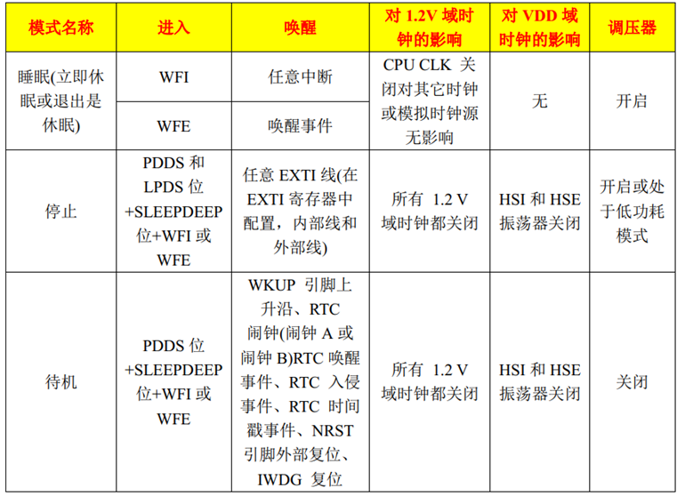


## **Tickless模式**

**如何降低功耗？**

Tickless低功耗模式的本质是通过调用指令 WFI 实现睡眠模式！


**Tickless模式的设计思想？**

* 在整个系统的运行过程中，其实大部分时间是在执行空闲任务
* 空闲任务：是在系统中的所有其它任务都阻塞或被挂起时才运行的
* 为了可以降低功耗，又不影响系统运行，该如何做？
  * 可以在本该空闲任务执行的期间，让MCU 进入相应的低功耗模式；当其他任务准备运行的时候，唤醒MCU退出低功耗模式

难点：

1. 进入低功耗之后，多久唤醒？也就是下一个要运行的任务如何被准确唤醒
2. 任何**中断**均可唤醒MCU，若滴答定时器频繁中断则会影响低功耗的效果？

将滴答定时器的中断周期修改为低功耗运行时间,退出低功耗后，需补上系统时钟节拍数（即：本该tick一次，而现在该成tick多次）

## 配置项

在FreeRTOSconfig中添加配置

`configUSE_TICKLESS_IDLE` 此宏用于使能低功耗 Tickless 模式

* 0:不开启低功耗
* 1：开启低功耗

`configEXPECTED_IDLE_TIME_BEFORE_SLEEP` 此宏用于定义系统进入相应低功耗模式的最短时长

*  默认为2tick，最低也是2tick  (如果是1tick就没必要使用低功耗了)

并且实现两个函数，并配置宏

`configPRE_SLEEP_PROCESSING(x) ` 此宏用于定义需要在系统进入低功耗模式前执行的事务，如：进入低功耗前关闭外设时钟，以达到降低功耗的目的

`configPOSR_SLEEP_PROCESSING(x) `此宏用于定义需要在系统退出低功耗模式后执行的事务，如：退出低功耗后开启之前关闭的外设时钟，以使系统能够正常运行


**例如**

在FreeRTOSconfig中添加配置

````C
#define configUSE_TICKLESS_IDLE                1                    // 使用低功耗
#define configEXPECTED_IDLE_TIME_BEFORE_SLEEP  5                    // 进入相应低功耗模式的最短时长为5tick
#define configPRE_SLEEP_PROCESSING             MyPreProcessing      // 配置函数
#define configPOSR_SLEEP_PROCESSING            MyPostProcessing
````

定义函数：

FreeRTOSconfig配置中应当引入此包含函数的头文件

````c
void MyPreProcessing(void){                                         // 在进入低功耗前执行的操作，关闭外部时钟等
	RCC_APB2PeriphClockCmd(RCC_APB2Periph_GPIOA,DISABLE);
	RCC_APB2PeriphClockCmd(RCC_APB2Periph_GPIOB,DISABLE);
	RCC_APB2PeriphClockCmd(RCC_APB2Periph_TIM1,DISABLE);
}
void MyPostProcessing(void){                                        // 在退出低功耗前执行的操作，恢复外部时钟等
	RCC_APB2PeriphClockCmd(RCC_APB2Periph_GPIOA,ENABLE);
	RCC_APB2PeriphClockCmd(RCC_APB2Periph_GPIOB,ENABLE);
	RCC_APB2PeriphClockCmd(RCC_APB2Periph_TIM1,ENABLE);
}
````


# 内存管理

**简介**

在使用 FreeRTOS 创建任务、队列、信号量等对象的时，一般都提供了两种方法：

* 动态方法创建：自动地从 FreeRTOS 管理的内存堆中申请创建对象所需的内存，并且在对象删除后，可将这块内存释放回FreeRTOS管理的内存堆 
* 静态方法创建：需用户提供各种内存空间，并且使用静态方式占用的内存空间一般固定下来了，即使任务、队列等被删除后，这些被占用的内存空间一般没有其他用途

总结：**动态方式管理内存**相比与静态方式，更加灵活。 


除了 FreeRTOS 提供的动态内存管理方法，标准的 C 库也提供了函数 `malloc()`和函数 `free()`来实现动态地申请和释放内存 。

标准 C 库的动态内存管理方法有如下几个缺点：

* 占用大量的代码空间 不适合用在资源紧缺的嵌入式系统中
* 没有线程安全的相关机制 
* 运行有不确定性，每次调用这些函数时花费的时间可能都不相同
* 内存碎片化

因此，FreeRTOS 提供了多种动态内存管理的算法，可针对不同的嵌入式系统！


## 内存管理算法

FreeRTOS提供了5种动态内存管理算法，分别为： heap_1、heap_2、heap_3、heap_4、heap_5 。 
如下所示：

| **算法** | **优点**                                | **缺点**                                     |
| -------- | --------------------------------------- | -------------------------------------------- |
| heap_1   | 分配简单，时间确定                      | 只允许申请内存，不允许释放内存               |
| heap_2   | 允许申请和释放内存                      | 不能合并相邻的空闲内存块会产生碎片、时间不定 |
|heap_3   | 直接调用C库函数malloc()和 free() ，简单 | 速度慢、时间不定                             |
|heap_4   | 相邻空闲内存可合并，减少内存碎片的产生  | 时间不定                                     |
| heap_5   | 能够管理多个非连续内存区域的 heap_4     | 时间不定                                     |

在我们FreeRTOS例程中，使用的均为**heap_4**内存管理算法


FreeRTOSconfig.h中的宏`configTOTAL_HEAP_SIZE`设置堆的大小

 ````c
 #define configTOTAL_HEAP_SIZE		( ( size_t ) ( 17 * 1024 ) )        
 ````

### **heap_1内存管理算法**

heap_1只实现了pvPortMalloc，没有实现vPortFree；也就是说，它只能申请内存，无法释放内存！

如果你的工程，创建好的任务、队列、信号量等都不需要被删除，那么可以使用heap_1内存管理算法

heap_1的实现最为简单，管理的内存堆是一个数组，在申请内存的时候， heap_1 内存管理算法只是简单地从数组中分出合适大小的内存，内存堆数组的定义如下所示 ：

````c
/* 定义一个大数组作为 FreeRTOS 管理的内存堆 */
static uint8_t ucHeap[ configTOTAL_HEAP_SIZE ];
````


   

### **heap_2内存管理算法**

* 相比于 heap_1 内存管理算法， heap_2 内存管理算法使用最适应算法，并且支持释放内存；
* lheap_2 内存管理算法并不能将相邻的空闲内存块合并成一个大的空闲内存块；因此 heap_2 内存管理算法不可避免地会产生内存碎片； 

**最适应算法：**

假设heap有3块空闲内存（按内存块大小由小到大排序）：5字节、25字节、50字节

现在新创建一个任务需要申请20字节的内存

第一步：找出最小的、能满足pvPortMalloc的内存：25字节

第二步：把它划分为20字节、5字节；返回这20字节的地址，剩下的5字节仍然是空闲状态，留给后续的pvPortMalloc使用


   

### **heap_4内存管理算法**

heap_4 内存管理算法使用了首次适应算法，也支持内存的申请与释放，并且能够将空闲且相邻的内存进行合并，从而减少内存碎片的现象。


**首次适应算法：**

假设heap有3块空闲内存（按内存块地址由低到高排序）：5字节、50字节、25字节

现在新创建一个任务需要申请20字节的内存

第一步：找出第一个能满足pvPortMalloc的内存：50字节

第二步：把它划分为20字节、30字节；返回这20字节的地址，剩下30字节仍然是空闲状态，留给后续的pvPortMalloc使用


​    

### **heap_5内存管理算法**

heap_5 内存管理算法是在 heap_4 内存管理算法的基础上实现的，但是 heap_5 内存管理算法在 heap_4 内存管理算法的基础上实现了管理多个非连续内存区域的能力 

heap_5 内存管理算法默认并没有定义内存堆 ，需要用户手动指定内存区域的信息，对其进行初始化。


问题：怎么指定一块内存？

使用如下结构体：

````c
typedef struct HeapRegion{	
    uint8_t * 	pucStartAddress; 	/* 内存区域的起始地址 */
    size_t 		xSizeInBytes; 	    /* 内存区域的大小，单位：字节 */
} HeapRegion_t; 
````

## 函数

| **函数**                                     | **描述**               |
| -------------------------------------------- | ---------------------- |
| void * pvPortMalloc( size_t   xWantedSize ); | 申请内存               |
| void   vPortFree( void * pv );               | 释放内存               |
| size_t   xPortGetFreeHeapSize( void );       | 获取当前空闲内存的大小 |

`void * pvPortMalloc( size_t xWantedSize );`

* `xWantedSize`：申请的内存大小，以字节为单位；
* 返回值：返回一个指针 ，指向已分配大小的内存。如果申请内存失败，则返回 NULL。

`void vPortFree( void * pv );`

* `*pv`：指针指向一个要释放内存的内存块；

`size_t xPortGetFreeHeapSize( void );`

* 返回值：返回当前剩余的空闲内存大小


````c
void vHeapTask(void * param){
	int keyNum = 0,i,size = 0;
	void* heapsit = NULL;
	
	while(1){
		keyNum = Key_GetNum();
		if(keyNum == 1){
            /**
            * 申请30字节，实际上会申请到40字节，因为需要30对齐32，再加8（next指针+size_t大小），于是40
            **/
			heapsit = pvPortMalloc(30);              
			if(heapsit != NULL){
				printf("successful……\r\n\n");
			}else{
				printf("failure……\r\n\n");
			}
		}else if(keyNum == 2){
			if(heapsit != NULL){
				vPortFree(heapsit);                  // 释放内存
				heapsit = NULL;
			}else{
				printf("free failure……\r\n\n");		
			}
		}	
		size = xPortGetFreeHeapSize();
		printf("heap:%d \n",size);	
		vTaskDelay(200);
	}
}
int main( void )
{
	prvSetupHardware();
	xTaskCreate(vHeapTask,"vHeapTask",100,NULL,1,NULL);
	vTaskStartScheduler();
	return 0;
}
````


# 内部实现

任务 = 函数 +……

当任务执行的时候，可能被打断，那我刚读的数据怎么办？


保护现场：将任务被打断瞬间的所有寄存器保存

保存到什么地方？ 保存到栈中


任务 = 函数 + 栈


保护现场

* 任务切换保护现场(保存所有寄存器)
* 中断保护现场(硬件保护一部分寄存器，软件保存一部分寄存器)
* 子函数保护现场(不需要保存寄存器)


每个任务都有自己的栈

栈：保存局部变量，保存一些寄存器


## 栈大小

**先前知识：** 在C语言中，使用`malloc`分配空间时，会在分配空间的地址前面保存分配空间的长度，当调用free时通过长度释放空间

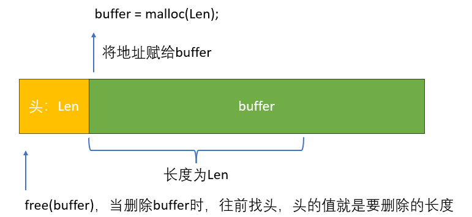

栈会从高地址往下增长


**创建任务的栈**


如果分配的栈地址不足，大量的局部变量会破坏头部TCB(栈从高地址往下增长),程序会崩溃


## 优先级与状态

* 优先级不同
  * 高优先级的任务，优先执行，可以抢占低优先级的任务
  * 高优先级的任务不停止，低优先级的任务永远无法执行
  * 同等优先级的任务，轮流执行：时间片轮转
* 状态
  * 运行态：running
  * 就绪态：ready
  * 阻塞：blocked，等待某件事(时间、事件)
  * 暂停：suspend，休息去了
* 怎么管理？
  * 怎么取出要运行的任务？
    * 找到最高优先级的运行态、就绪态任务，运行它
    * 如果大家平级，轮流执行：排队，链表前面的先运行，运行1个tick后乖乖地去链表尾部排队


任务控制块TCB结构体

````c
typedef struct tskTaskControlBlock{
    volatile StackType_t * pxTopOfStack; //栈顶指针，中断或任务切换时，会对任务压栈，恢复运行时，会出栈，栈顶指针就跟着变化
    ListItem_t xStateListItem;                  // 状态列表项，不同的状态会挂接在不同的状态链表下
    ListItem_t xEventListItem;                  // Event列表项，不同的event会挂接到不同事件链表下
    UBaseType_t uxPriority;                     // 优先级，0最底，数字越大优先级越高
    StackType_t * pxStack;                      // 堆栈起始地址
    char pcTaskName[ configMAX_TASK_NAME_LEN ]; // 任务名称存储区
    
    // 任务通知
    #if ( configUSE_TASK_NOTIFICATIONS == 1 )
        volatile uint32_t ulNotifiedValue[ configTASK_NOTIFICATION_ARRAY_ENTRIES ];
        volatile uint8_t ucNotifyState[ configTASK_NOTIFICATION_ARRAY_ENTRIES ];
    #endif
    // …………
} tskTCB;
typedef struct tskTaskControlBlock * TaskHandle_t;  // 别名
````

tasks.c

创建任务的过程，就是构造栈的过程。

````c
BaseType_t xTaskCreate( TaskFunction_t pxTaskCode,                   // 任务
                        const char * const pcName,                   // 任务名
                        const configSTACK_DEPTH_TYPE usStackDepth,   // 栈的深度
                        void * const pvParameters,                   // 函数的参数
                        UBaseType_t uxPriority,                      // 优先级
                        TaskHandle_t * const pxCreatedTask ){        // 句柄
    
    TCB_t * pxNewTCB;
    BaseType_t xReturn;

    #if ( portSTACK_GROWTH > 0 )
        {
            // 分配任务结构体
            pxNewTCB = ( TCB_t * ) pvPortMalloc( sizeof( TCB_t ) );  // 分配TCB

            if( pxNewTCB != NULL )
            {
                // TCB中pxStack，堆栈起始地址
                pxNewTCB->pxStack = ( StackType_t * ) pvPortMalloc( …… );
                ………
            }
        }
    #else{
            StackType_t * pxStack;

            /* Allocate space for the stack used by the task being created. */
            pxStack = pvPortMalloc( ( ( ( size_t ) usStackDepth ) * sizeof( StackType_t ) ) ); /*lint !e9079 All values returned by pvPortMalloc() have at least the alignment required by the MCU's stack and this allocation is the stack. */

            if( pxStack != NULL )
            {
                /* Allocate space for the TCB. */
                pxNewTCB = ( TCB_t * ) pvPortMalloc( sizeof( TCB_t ) ); /*lint !e9087 !e9079 All values returned by pvPortMalloc() have at least the alignment required by the MCU's stack, and the first member of TCB_t is always a pointer to the task's stack. */

                if( pxNewTCB != NULL )
                {
                    /* Store the stack location in the TCB. */
                    pxNewTCB->pxStack = pxStack;
                }
                else
                {
                    /* The stack cannot be used as the TCB was not created.  Free
                     * it again. */
                    vPortFree( pxStack );
                }
            }
            else
            {
                pxNewTCB = NULL;
            }
        }
    #endif /* portSTACK_GROWTH */

    if( pxNewTCB != NULL )
    {
        #if ( tskSTATIC_AND_DYNAMIC_ALLOCATION_POSSIBLE != 0 ) /*lint !e9029 !e731 Macro has been consolidated for readability reasons. */
            {
                /* Tasks can be created statically or dynamically, so note this
                 * task was created dynamically in case it is later deleted. */
                pxNewTCB->ucStaticallyAllocated = tskDYNAMICALLY_ALLOCATED_STACK_AND_TCB;
            }
        #endif /* tskSTATIC_AND_DYNAMIC_ALLOCATION_POSSIBLE */

        prvInitialiseNewTask( pxTaskCode, 
                             pcName, 
                             ( uint32_t ) usStackDepth, 
                             pvParameters, 
                             uxPriority, 
                             pxCreatedTask, 
                             pxNewTCB, 
                             NULL );
        
        prvAddNewTaskToReadyList( pxNewTCB );   // 将这个新创建的任务存入Ready链表中，这个函数在下方
        xReturn = pdPASS;
    }
    else{xReturn = errCOULD_NOT_ALLOCATE_REQUIRED_MEMORY;}

    return xReturn;
}

static void prvAddNewTaskToReadyList( TCB_t * pxNewTCB ){
    prvAddTaskToReadyList( pxNewTCB );       // 最终调用宏定义
}

#define prvAddTaskToReadyList( pxTCB )                                                                 \
    traceMOVED_TASK_TO_READY_STATE( pxTCB );                                                           \
    taskRECORD_READY_PRIORITY( ( pxTCB )->uxPriority );                                                \
    vListInsertEnd( &( pxReadyTasksLists[ ( pxTCB )->uxPriority ] ), &( ( pxTCB )->xStateListItem ) ); \
    tracePOST_MOVED_TASK_TO_READY_STATE( pxTCB )
/** 注意vListInsertEnd( &( pxReadyTasksLists[ ( pxTCB )->uxPriority ] ), &( ( pxTCB )->xStateListItem ) )
*   根据任务优先级pxReadyTasksLists中，放入链表尾部
**/     
#define configMAX_PRIORITIES		( 5 )       // 这个宏定义在了FreeRTOSconfig.h中
PRIVILEGED_DATA static List_t pxReadyTasksLists[ configMAX_PRIORITIES ]; /*< Prioritised ready tasks. */
// ……
````


## 任务调度

使用链表来管理任务

同等优先级的任务轮流执行1个Tick

每个优先级，都有一个就绪链表：pxReadyTasksLists[优先级]，

怎么运行下一个就绪的任务

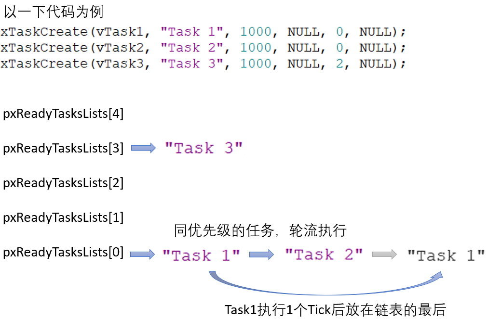


高优先级的任务一直运行，调用`vTaskDelay()`函数进入睡眠状态

* 任务从`pxReadyTasksLists[对应优先级]`中移出，进入`xDelayedTaskList`链表中,当延时的Tick过后，再次进入`pxReadyTasksLists[对应优先级]`链表中

````c
PRIVILEGED_DATA static List_t pxReadyTasksLists[ configMAX_PRIORITIES ]; /*< Prioritised ready tasks. */
PRIVILEGED_DATA static List_t xDelayedTaskList1;                         /*< Delayed tasks. */
PRIVILEGED_DATA static List_t xDelayedTaskList2;                         /*< Delayed tasks (two lists are used - one for delays that have overflowed the current tick count. */
PRIVILEGED_DATA static List_t * volatile pxDelayedTaskList;              /*< Points to the delayed task list currently being used. */
PRIVILEGED_DATA static List_t * volatile pxOverflowDelayedTaskList;      /*< Points to the delayed task list currently being used to hold tasks that have overflowed the current tick count. */
PRIVILEGED_DATA static List_t xPendingReadyList;                         /*< Tasks that have been readied while the scheduler was suspended.  They will be moved to the ready list when the scheduler is resumed. */
````

任务被创建时，要使用`prvAddNewTaskToReadyList()`来把它放入对应的就绪链表，调用过程为：

```c
xTaskCreate
    prvAddNewTaskToReadyList
    	listINSERT_END( &( pxReadyTasksLists[ ( pxTCB )->uxPriority ] ), &( ( pxTCB )->xStateListItem ) );
```

## 空闲任务

````h
#define configUSE_PREEMPTION		1               // 抢占式
#define configUSE_TIME_SLICING      1               // 时间片轮转
#define configIDLE_SHOULD_YIELD		1               // 空闲任务让步
````

````c
static portTASK_FUNCTION( prvIdleTask, pvParameters )
{
    ( void ) pvParameters;
    portALLOCATE_SECURE_CONTEXT( configMINIMAL_SECURE_STACK_SIZE );
    for( ; ; )
    {
        prvCheckTasksWaitingTermination();
        #if ( configUSE_PREEMPTION == 0 )               // 如果是非抢占式，空闲任务直接让步
            {
                taskYIELD();
            }
        #endif

        // 让步：抢占式 + 礼让
        #if ( ( configUSE_PREEMPTION == 1 ) && ( configIDLE_SHOULD_YIELD == 1 ) )  
            {
                // 当然任务数量 大于 1个：即至少有一个非空闲任务
                if( listCURRENT_LIST_LENGTH( &( pxReadyTasksLists[ tskIDLE_PRIORITY ] ) ) > ( UBaseType_t ) 1 )
                {
                    taskYIELD();   // 礼让
                }
                else
                {
                    mtCOVERAGE_TEST_MARKER();
                }
            }
        #endif

        #if ( configUSE_IDLE_HOOK == 1 )                     // 钩子任务
            {
                extern void vApplicationIdleHook( void );
                vApplicationIdleHook();
            }
        #endif
        #if ( configUSE_TICKLESS_IDLE != 0 )                
            {
                TickType_t xExpectedIdleTime;

                /* It is not desirable to suspend then resume the scheduler on
                 * each iteration of the idle task.  Therefore, a preliminary
                 * test of the expected idle time is performed without the
                 * scheduler suspended.  The result here is not necessarily
                 * valid. */
                xExpectedIdleTime = prvGetExpectedIdleTime();

                if( xExpectedIdleTime >= configEXPECTED_IDLE_TIME_BEFORE_SLEEP )
                {
                    vTaskSuspendAll();
                    {
                        /* Now the scheduler is suspended, the expected idle
                         * time can be sampled again, and this time its value can
                         * be used. */
                        configASSERT( xNextTaskUnblockTime >= xTickCount );
                        xExpectedIdleTime = prvGetExpectedIdleTime();

                        /* Define the following macro to set xExpectedIdleTime to 0
                         * if the application does not want
                         * portSUPPRESS_TICKS_AND_SLEEP() to be called. */
                        configPRE_SUPPRESS_TICKS_AND_SLEEP_PROCESSING( xExpectedIdleTime );

                        if( xExpectedIdleTime >= configEXPECTED_IDLE_TIME_BEFORE_SLEEP )
                        {
                            traceLOW_POWER_IDLE_BEGIN();
                            portSUPPRESS_TICKS_AND_SLEEP( xExpectedIdleTime );
                            traceLOW_POWER_IDLE_END();
                        }
                        else
                        {
                            mtCOVERAGE_TEST_MARKER();
                        }
                    }
                    ( void ) xTaskResumeAll();
                }
                else
                {
                    mtCOVERAGE_TEST_MARKER();
                }
            }
        #endif /* configUSE_TICKLESS_IDLE */
    }
}
````


## 队列

怎么互斥访问数据？关中断 (任务调度本质上也是中断，当关闭中断，任务调度器也无法工作)

核心：关中断 开中断、链表、环形缓冲区

创建队列：会创建一个头 + 一个Buffer(环形缓冲区)

**队列结构体**

````c
typedef struct QueueDefinition /* The old naming convention is used to prevent breaking kernel aware debuggers. */
{
    int8_t * pcHead;           /*< Points to the beginning of the queue storage area. */
    int8_t * pcWriteTo;        /*< Points to the free next place in the storage area. */

    union
    {
        QueuePointers_t xQueue;     /*< Data required exclusively when this structure is used as a queue. */
        SemaphoreData_t xSemaphore; /*< Data required exclusively when this structure is used as a semaphore. */
    } u;

    List_t xTasksWaitingToSend;             /*< List of tasks that are blocked waiting to post onto this queue.  Stored in priority order. */
    List_t xTasksWaitingToReceive;          /*< List of tasks that are blocked waiting to read from this queue.  Stored in priority order. */

    // 当前在队列中的个数
    // 在信号量中，这个就是count
    volatile UBaseType_t uxMessagesWaiting; /*< The number of items currently in the queue. */
    UBaseType_t uxLength;                   /*< The length of the queue defined as the number of items it will hold, not the number of bytes. */
    UBaseType_t uxItemSize;                 /*< The size of each items that the queue will hold. */

    volatile int8_t cRxLock;                /*< Stores the number of items received from the queue (removed from the queue) while the queue was locked.  Set to queueUNLOCKED when the queue is not locked. */
    volatile int8_t cTxLock;                /*< Stores the number of items transmitted to the queue (added to the queue) while the queue was locked.  Set to queueUNLOCKED when the queue is not locked. */

    #if ( ( configSUPPORT_STATIC_ALLOCATION == 1 ) && ( configSUPPORT_DYNAMIC_ALLOCATION == 1 ) )
        uint8_t ucStaticallyAllocated; /*< Set to pdTRUE if the memory used by the queue was statically allocated to ensure no attempt is made to free the memory. */
    #endif

    #if ( configUSE_QUEUE_SETS == 1 )
        struct QueueDefinition * pxQueueSetContainer;
    #endif

    #if ( configUSE_TRACE_FACILITY == 1 )
        UBaseType_t uxQueueNumber;
        uint8_t ucQueueType;
    #endif
} xQUEUE;
````

**怎么传递数据**

使用环形缓冲区传递数据。


**写数据**

1. 关中断
2. 如果队列没满，直接写入，并从xTasksWaitingToReceive唤醒等待读的任务，并将等待读的任务从Delay链表移动到ready链中
3. 如果队列满
   1. 等待：任务进入xTasksWaitingToSend等待写链表，并将任务从ready链表移动到Delay链表中(休眠)
   2. 不等待：直接返回错误

4. 开中断

**读数据**

1. 关中断
2. 如果队列中有数据，则直接读，并从xTasksWaitingToSend唤醒等待写的任务，并将等待写的任务从Delay链表移动到ready链中
3. 如果队列没数据
   1. 等待：任务进入xTasksWaitingToReceive等待读链表中，并将任务从ready链表移动到Delay链表中(休眠)
   2. 不等待：直接返回错误

4. 开中断


**读数据流程**

读数据类似

````c
BaseType_t xQueueReceive( QueueHandle_t xQueue,
                          void * const pvBuffer,
                          TickType_t xTicksToWait ){
    BaseType_t xEntryTimeSet = pdFALSE;
    TimeOut_t xTimeOut;
    Queue_t * const pxQueue = xQueue;
    // …… 
    for( ; ; )
    {
        taskENTER_CRITICAL();              // 关闭中断
        {
            const UBaseType_t uxMessagesWaiting = pxQueue->uxMessagesWaiting;   // 队列中数据个数
            if( uxMessagesWaiting > ( UBaseType_t ) 0 ) {                       // 队列中有数据
                prvCopyDataFromQueue( pxQueue, pvBuffer );                      // 将队列中的数据放入pvBuffer
                traceQUEUE_RECEIVE( pxQueue );
                pxQueue->uxMessagesWaiting = uxMessagesWaiting - ( UBaseType_t ) 1;  // 等待的个数减一

                // 如果队列的等待写链表中有等待的任务,唤醒等待写的任务
                if( listLIST_IS_EMPTY( &( pxQueue->xTasksWaitingToSend ) ) == pdFALSE )  {
                    /** xTaskRemoveFromEventList() 函数的功能
       				* 	1.将等待写的这个任务删除
                    *	2.并添加到ready队列：prvAddTaskToReadyList( pxUnblockedTCB );
                    **/
                    if( xTaskRemoveFromEventList( &( pxQueue->xTasksWaitingToSend ) ) != pdFALSE ) {
                        queueYIELD_IF_USING_PREEMPTION();
                    } else {
                        mtCOVERAGE_TEST_MARKER();
                    }
                } else {
                    mtCOVERAGE_TEST_MARKER();
                }

                taskEXIT_CRITICAL();
                return pdPASS;
            } else {          // 队列中没有数据
                // 队列中没数据 并且 不想等待，返回错误
                if( xTicksToWait == ( TickType_t ) 0 ) {
                    taskEXIT_CRITICAL();
                    traceQUEUE_RECEIVE_FAILED( pxQueue );
                    return errQUEUE_EMPTY;
                }else if( xEntryTimeSet == pdFALSE ){
                    vTaskInternalSetTimeOutState( &xTimeOut );
                    xEntryTimeSet = pdTRUE;
                } else{
                    mtCOVERAGE_TEST_MARKER();
                }
            }
        }
        taskEXIT_CRITICAL();            // 关闭中断

        vTaskSuspendAll();
        prvLockQueue( pxQueue );
		//队列中没数据 且 原意等待
        if( xTaskCheckForTimeOut( &xTimeOut, &xTicksToWait ) == pdFALSE ){
            if( prvIsQueueEmpty( pxQueue ) != pdFALSE ) {
                traceBLOCKING_ON_QUEUE_RECEIVE( pxQueue );
                // 将读的这个任务放入等待链表中
                vTaskPlaceOnEventList( &( pxQueue->xTasksWaitingToReceive ), xTicksToWait );
                prvUnlockQueue( pxQueue );

                if( xTaskResumeAll() == pdFALSE ){
                    portYIELD_WITHIN_API();
                }else{
                    mtCOVERAGE_TEST_MARKER();
                }
            }else{
                prvUnlockQueue( pxQueue );
                ( void ) xTaskResumeAll();
            }
        }
        else {
            prvUnlockQueue( pxQueue );
            ( void ) xTaskResumeAll();

            if( prvIsQueueEmpty( pxQueue ) != pdFALSE )
            {
                traceQUEUE_RECEIVE_FAILED( pxQueue );
                return errQUEUE_EMPTY;
            }
            else
            {
                mtCOVERAGE_TEST_MARKER();
            }
        }
    } 
}
````


一个任务写队列时，如果队列已经满了，它会被挂起，何时被唤醒？

* 超时：
  * 任务写队列不成功时，它会被挂起：从ready list移到delayed list中
  * 在delayed list中，按照"超时时间"排序
  * 系统Tick中断不断发生，在Tick中断里判断delayed list中的任务时间到没？时间到后就唤醒它


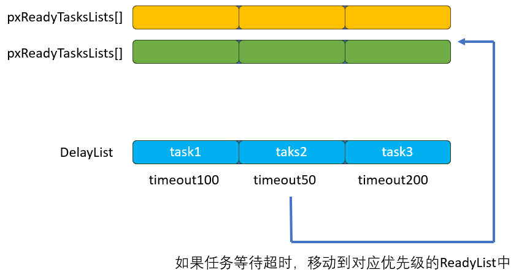

* 别的任务读队列:


## 信号量

分为计数型和二进制型

信号量的本质还是队列，创建信号量实际上是创建了一个队列，这是这个队列只有队列头没有Buffer

````c
xSemaphoreCreateBinary();  // 创建一个二进制信号量，实际上创建了一个队列
#define xSemaphoreCreateBinary()    xQueueGenericCreate( ( UBaseType_t ) 1, semSEMAPHORE_QUEUE_ITEM_LENGTH,queueQUEUE_TYPE_BINARY_SEMAPHORE )  // 队列长度为0

````

**Give**

对信号量写，实际上还是对队列进行写操作

信号量的读写和队列的读写流程一样

````c
xSemaphoreGive(……);      
#define xSemaphoreGive( xSemaphore )    xQueueGenericSend( ( QueueHandle_t ) ( xSemaphore ), NULL, semGIVE_BLOCK_TIME, queueSEND_TO_BACK )

BaseType_t xQueueGenericSend( QueueHandle_t xQueue,
                              const void * const pvItemToQueue,
                              TickType_t xTicksToWait,
                              const BaseType_t xCopyPosition )
{
    BaseType_t xEntryTimeSet = pdFALSE, xYieldRequired;
    TimeOut_t xTimeOut;
    Queue_t * const pxQueue = xQueue;
    //……
    for( ; ; )
    {
        taskENTER_CRITICAL();       // 关中断
        {
            // 当前二进制信号量小于1，即能写入一个1
            if( ( pxQueue->uxMessagesWaiting < pxQueue->uxLength ) || ( xCopyPosition == queueOVERWRITE ) )
            {
                traceQUEUE_SEND( pxQueue );
                // ……
            } else {
             	// ……
            }
        }
        taskEXIT_CRITICAL();   // 开启中断
        vTaskSuspendAll();
        prvLockQueue( pxQueue );

        // 等待，将等待写的任务放入等待写队列，并将任务休眠
        if( xTaskCheckForTimeOut( &xTimeOut, &xTicksToWait ) == pdFALSE )
        {
            if( prvIsQueueFull( pxQueue ) != pdFALSE )
            {
                traceBLOCKING_ON_QUEUE_SEND( pxQueue );
                vTaskPlaceOnEventList( &( pxQueue->xTasksWaitingToSend ), xTicksToWait );
                prvUnlockQueue( pxQueue );
                if( xTaskResumeAll() == pdFALSE )
                {
                    portYIELD_WITHIN_API();
                }
            }
            // ……
        }
  		// ……
    } 
}
````


## 互斥量

互斥量的本质也是队列

互斥量和信号量的异同

* 互斥量 和 二进制型信号量类似；只有0 和 1
* 互斥量 有优先级继承


**优先级反转**：假设有hTask，mTask，lTask三个任务，优先级从高到低

* 假设低优先级的lTask任务正在运行，并获取了信号量  (他应当释放信号量，但没办法执行释放)
* 高优先级的hTask任务获得了执行机会，他也获取信号量，但是信号量被lTask任务获取了，所以hTask任务阻塞
* 现在就由中等优先级的mTask任务执行，假设他一直执行(hTask阻塞，lTask优先级低)
* 高优先级的hTask任务和低优先级的lTask任务都没办法执行


**优先级继承**：解决了优先级反转，大致原理是让低优先级线程在获得同步资源的时候(如果有高优先级的线程也需要使用该同步资源时)，**临时**提升其优先级。以前其能更快的执行并释放同步资源。释放同步资源后再恢复其原来的优先级。

* 假设低优先级的lTask任务正在运行，并获取了互斥量  (他应当释放)
* 高优先级的hTask任务获得了执行机会，他也获取互斥量，但是互斥量被lTask任务获取了，所以hTask任务阻塞，并将优先级继承给lTask
* lTask继承了高优先级，开始执行，最终释放互斥量，并将优先级交还给hTask，唤醒hTask


**创建**

````c
xSemaphoreCreateMutex( );      // 实际上创建了一个特殊的队列
#define xSemaphoreCreateMutex()    xQueueCreateMutex( queueQUEUE_TYPE_MUTEX )
````


**take**

有互斥量，则读出互斥量，并唤醒等待Give的任务

没互斥量，则等待，并将优先级继承给拥有互斥量的任务

````c
#define xSemaphoreTake( xSemaphore, xBlockTime )    xQueueSemaphoreTake( ( xSemaphore ), ( xBlockTime ) )

BaseType_t xQueueSemaphoreTake( QueueHandle_t xQueue,
                                TickType_t xTicksToWait ){
    BaseType_t xEntryTimeSet = pdFALSE;
    TimeOut_t xTimeOut;
    Queue_t * const pxQueue = xQueue;
	// ……
    for( ; ; )
    {
        taskENTER_CRITICAL();    // 关中断
        {
            const UBaseType_t uxSemaphoreCount = pxQueue->uxMessagesWaiting;
            if( uxSemaphoreCount > ( UBaseType_t ) 0 )       // 队列中有值
            {
                traceQUEUE_RECEIVE( pxQueue );                                        // 获得
                pxQueue->uxMessagesWaiting = uxSemaphoreCount - ( UBaseType_t ) 1;    // 减一

                if( listLIST_IS_EMPTY( &( pxQueue->xTasksWaitingToSend ) ) == pdFALSE )  // 唤醒等待写的任务
                {
                }
				// ……
                taskEXIT_CRITICAL();
                return pdPASS;
            }
            else
            {
                // ……
            }
        }
        // ……
        // 队列中没值可读，即互斥量被别人获取了
        if( xTaskCheckForTimeOut( &xTimeOut, &xTicksToWait ) == pdFALSE )
        {
            if( prvIsQueueEmpty( pxQueue ) != pdFALSE )
            {
                traceBLOCKING_ON_QUEUE_RECEIVE( pxQueue );
                #if ( configUSE_MUTEXES == 1 )
                    {
                        if( pxQueue->uxQueueType == queueQUEUE_IS_MUTEX )
                        {
                            taskENTER_CRITICAL();
                            {
                                // 优先级继承
                                xInheritanceOccurred = xTaskPriorityInherit( pxQueue->u.xSemaphore.xMutexHolder );
                            }
                            taskEXIT_CRITICAL();
                        }
                        else
                        {
                            mtCOVERAGE_TEST_MARKER();
                        }
                    }
                
                // ……
    } 
````

**Give**

没互斥量，则写入互斥量，唤醒Task任务，并将优先级交还

````c
#define xSemaphoreGive( xSemaphore )    xQueueGenericSend( ( QueueHandle_t ) ( xSemaphore ), NULL, semGIVE_BLOCK_TIME, queueSEND_TO_BACK )

BaseType_t xQueueGenericSend( …… ){
    // ……
    for( ; ; ){
        taskENTER_CRITICAL();
        {
            if( ( pxQueue->uxMessagesWaiting < pxQueue->uxLength ) || ( xCopyPosition == queueOVERWRITE ) ){
                traceQUEUE_SEND( pxQueue );
                {
                    const UBaseType_t uxPreviousMessagesWaiting = pxQueue->uxMessagesWaiting;
                    // 在这个函数中将优先级交还
                    xYieldRequired = prvCopyDataToQueue( pxQueue, pvItemToQueue, xCopyPosition );  
                    // ……
                        
static BaseType_t prvCopyDataToQueue( Queue_t * const pxQueue,const void * pvItemToQueue,const BaseType_t xPosition ){
	// …… 交还优先级
	xTaskPriorityDisinherit( pxQueue->u.xSemaphore.xMutexHolder );
    pxQueue->u.xSemaphore.xMutexHolder = NULL;
````


## 事务组

核心是：关调度器、位操作、链表

````c
typedef struct EventGroupDef_t
{
    EventBits_t uxEventBits;        // 位操作
    List_t xTasksWaitingForBits;    // 等待事件的任务链表

    #if ( configUSE_TRACE_FACILITY == 1 )
        UBaseType_t uxEventGroupNumber;
    #endif

    #if ( ( configSUPPORT_STATIC_ALLOCATION == 1 ) && ( configSUPPORT_DYNAMIC_ALLOCATION == 1 ) )
        uint8_t ucStaticallyAllocated; /*< Set to pdTRUE if the event group is statically allocated to ensure no attempt is made to free the memory. */
    #endif
} EventGroup_t;
````


**设置事件**

设置事件步骤

* 关闭调度器
* 设置uxEventBits
* 唤醒xTasksWaitingForBits上**所有**满足条件的任务
* 开启调度器

````c
EventBits_t xEventGroupSetBits( EventGroupHandle_t xEventGroup,
                                const EventBits_t uxBitsToSet ){
    ListItem_t * pxListItem, * pxNext;
    ListItem_t const * pxListEnd;
    List_t const * pxList;
    EventBits_t uxBitsToClear = 0, uxBitsWaitedFor, uxControlBits;
    EventGroup_t * pxEventBits = xEventGroup;
    BaseType_t xMatchFound = pdFALSE;

    pxList = &( pxEventBits->xTasksWaitingForBits );
    pxListEnd = listGET_END_MARKER( pxList );
    vTaskSuspendAll();             // 关闭调度器
    {
        traceEVENT_GROUP_SET_BITS( xEventGroup, uxBitsToSet );
        pxListItem = listGET_HEAD_ENTRY( pxList );
        pxEventBits->uxEventBits |= uxBitsToSet;      // 设置位

        // 设置完位，查看是否有满足时间的任务
        while( pxListItem != pxListEnd ){
            // ……
            if( xMatchFound != pdFALSE ){
                // ……
                // 移除所有满足条件的任务，并添加到readyList中
                vTaskRemoveFromUnorderedEventList( pxListItem, pxEventBits->uxEventBits |
                                                  eventUNBLOCKED_DUE_TO_BIT_SET );
            }
            pxListItem = pxNext;
        }
        pxEventBits->uxEventBits &= ~uxBitsToClear;
    }
    ( void ) xTaskResumeAll();
    return pxEventBits->uxEventBits;
}
// 移除所有满足条件的任务，并添加到readyList中
void vTaskRemoveFromUnorderedEventList( ListItem_t * pxEventListItem, const TickType_t xItemValue ){
    // ……
    listREMOVE_ITEM( pxEventListItem );      // 移除所有满足条件的任务
	// ……
    prvAddTaskToReadyList( pxUnblockedTCB ); // 添加到readyList中
}
````


**等待事件**

等待事件步骤

* 关闭任务调度器
* 当前uxEventBits是否满足
  * 满足：返回OK (并执行是否清零)
  * 不满足：
    * 不等待：直接返回ERR
    * 等待：休眠，将放入xTasksWaitingForBits等待

````c
EventBits_t xEventGroupWaitBits( EventGroupHandle_t xEventGroup,
                                 const EventBits_t uxBitsToWaitFor,
                                 const BaseType_t xClearOnExit,
                                 const BaseType_t xWaitForAllBits,
                                 TickType_t xTicksToWait ){
    vTaskSuspendAll();       // 关闭任务调度器
    {
        const EventBits_t uxCurrentEventBits = pxEventBits->uxEventBits;
		// 等待事件是否被满足
        xWaitConditionMet = prvTestWaitCondition( uxCurrentEventBits, uxBitsToWaitFor, xWaitForAllBits );
		// 等待事件被满足
        if( xWaitConditionMet != pdFALSE ){
            uxReturn = uxCurrentEventBits;
            xTicksToWait = ( TickType_t ) 0;
			// 是否清除事件
            if( xClearOnExit != pdFALSE ){
                pxEventBits->uxEventBits &= ~uxBitsToWaitFor;
            }
            // ……
        }
        else if( xTicksToWait == ( TickType_t ) 0 ){   // 条件不满足，并且不想等待
            // …… 
        } else { // 条件不满足，并且可以等待
            // …… 
            // 将当前任务放入等待xTasksWaitingForBits，等待
            vTaskPlaceOnUnorderedEventList( &( pxEventBits->xTasksWaitingForBits ), ( uxBitsToWaitFor | uxControlBits ), xTicksToWait );
        }
    }
    // …… 
}
````


**为什么不需要关闭中断，只需要关闭任务**

* 在任务中，直接设置值
* 在中断中FromISR，因为事件组的中断实际上是找一个任务，在任务中进行设置事件
  * 为什么？因为如果在中断中进行设置值，他会唤醒所有满足条件的任务，这可能会非常浪费时间，而在中断中应当尽快执行


## 任务通知

````c
typedef struct tskTaskControlBlock{
    
    // 任务通知
    #if ( configUSE_TASK_NOTIFICATIONS == 1 )
        volatile uint32_t ulNotifiedValue[ configTASK_NOTIFICATION_ARRAY_ENTRIES ];    // 值
        volatile uint8_t ucNotifyState[ configTASK_NOTIFICATION_ARRAY_ENTRIES ];       // 状态
    #endif
    // …………
} tskTCB;
typedef struct tskTaskControlBlock * TaskHandle_t;  // 别名
````


**通知状态**

- `taskNOT_WAITING_NOTIFICATION`：任务没有在等待通知
- `taskWAITING_NOTIFICATION`：任务在等待通知，当调用ulTaskNotifyTake、xTaskNotifyWait时任务进入这个状态
- `taskNOTIFICATION_RECEIVED`：任务接收到了通知，也被称为pending(有数据了，待处理)，当调用xTaskNotifyGive、xTaskNotify时任务进入这个状态

````c
#define taskNOT_WAITING_NOTIFICATION              ( ( uint8_t ) 0 )  /* 也是初始状态 */
#define taskWAITING_NOTIFICATION                  ( ( uint8_t ) 1 )
#define taskNOTIFICATION_RECEIVED                 ( ( uint8_t ) 2 )
````

一个任务想等待别人发来通知，可以调用`ulTaskNotifyTake  `或`xTaskNotifyWait  `：

* 可能别人早就发来通知："通知状态"为taskNOTIFICATION_RECEIVED，那么函数立刻返回
* 可能别人还没发来通知：这些函数把"通知状态"从taskNOT_WAITING_NOTIFICATION改为taskWAITING_NOTIFICATION，然后休眠


别的任务可以使用`xTaskNotifyGive`或`xTaskNotify `给某个任务发通知：

* 会马上唤醒对方
* 无条件唤醒对方，不管对方期待什么数据


**发送通知**

1. 关中断
2. 写Val值，唤醒任务，使任务进入`taskNOTIFICATION_RECEIVED`状态
3. 开中断

**接收通知**

1. 关中断

2. 判断状态

   1. `taskWAITING_NOTIFICATION`状态,等待任务，休眠
   2. `taskNOTIFICATION_RECEIVED `状态,唤醒

3. 开中断

   

**情景1**

* 任务A的初始状态为taskNOT_WAITING_NOTIFICATION
* 当任务B通知任务A，会将任务A的状态设置为taskNOTIFICATION_RECEIVED 
* 任务A调用`ulTaskNotifyTake  `或`xTaskNotifyWait  `，恢复状态为taskNOT_WAITING_NOTIFICATION，成功返回

**情景2**

* 任务A的初始状态为taskNOT_WAITING_NOTIFICATION
* 任务A调用`ulTaskNotifyTake  `或`xTaskNotifyWait  `，状态进入taskWAITING_NOTIFICATION
* 当任务B通知任务A，会将任务A的状态设置为taskNOTIFICATION_RECEIVED ，唤醒任务A
* 任务A，恢复状态为taskNOT_WAITING_NOTIFICATION，成功返回


**接收通知**

````c
#define xTaskNotifyWait( ulBitsToClearOnEntry, ulBitsToClearOnExit, pulNotificationValue, xTicksToWait ) \
    xTaskGenericNotifyWait( tskDEFAULT_INDEX_TO_NOTIFY, ( ulBitsToClearOnEntry ), ( ulBitsToClearOnExit ), ( pulNotificationValue ), ( xTicksToWait ) 


BaseType_t xTaskGenericNotifyWait( UBaseType_t uxIndexToWait,
                                       uint32_t ulBitsToClearOnEntry,
                                       uint32_t ulBitsToClearOnExit,
                                       uint32_t * pulNotificationValue,
                                       TickType_t xTicksToWait ){
    taskENTER_CRITICAL();       // 关中断
    {
        // 如果当前状态不是taskNOTIFICATION_RECEIVED状态
        if( pxCurrentTCB->ucNotifyState[ uxIndexToWait ] != taskNOTIFICATION_RECEIVED )
        {
            
            pxCurrentTCB->ulNotifiedValue[ uxIndexToWait ] &= ~ulBitsToClearOnEntry;
            // 设置状态为taskWAITING_NOTIFICATION;
            pxCurrentTCB->ucNotifyState[ uxIndexToWait ] = taskWAITING_NOTIFICATION;
			// 等待时间 > 0，即可以等待
            if( xTicksToWait > ( TickType_t ) 0 )
            {
               	// 将当前任务移入DelayList中
                prvAddCurrentTaskToDelayedList( xTicksToWait, pdTRUE );
                traceTASK_NOTIFY_WAIT_BLOCK( uxIndexToWait );
                portYIELD_WITHIN_API();
            }
            else
            {
                mtCOVERAGE_TEST_MARKER();
            }
        }
        else
        {
            mtCOVERAGE_TEST_MARKER();
        }
    }
    taskEXIT_CRITICAL();     // 开中断
    taskENTER_CRITICAL();
    {
        traceTASK_NOTIFY_WAIT( uxIndexToWait );
        if( pulNotificationValue != NULL )
        {
            *pulNotificationValue = pxCurrentTCB->ulNotifiedValue[ uxIndexToWait ];
        }
		// 当前任务不是taskNOTIFICATION_RECEIVED状态返回False
        if( pxCurrentTCB->ucNotifyState[ uxIndexToWait ] != taskNOTIFICATION_RECEIVED ){
            xReturn = pdFALSE;
        } else { // 当前任务taskNOTIFICATION_RECEIVED状态，是否清零，并返回True
            pxCurrentTCB->ulNotifiedValue[ uxIndexToWait ] &= ~ulBitsToClearOnExit;
            xReturn = pdTRUE;
        }
        // 将当前状态设置为taskNOT_WAITING_NOTIFICATION
        pxCurrentTCB->ucNotifyState[ uxIndexToWait ] = taskNOT_WAITING_NOTIFICATION;
    }
    taskEXIT_CRITICAL();
    return xReturn;
}
````

**发送通知**

````c
#define xTaskNotify( xTaskToNotify, ulValue, eAction ) \
    xTaskGenericNotify( ( xTaskToNotify ), ( tskDEFAULT_INDEX_TO_NOTIFY ), ( ulValue ), ( eAction ), NULL )

BaseType_t xTaskGenericNotify( TaskHandle_t xTaskToNotify,
                                   UBaseType_t uxIndexToNotify,
                                   uint32_t ulValue,
                                   eNotifyAction eAction,
                                   uint32_t * pulPreviousNotificationValue ){
    TCB_t * pxTCB;
    BaseType_t xReturn = pdPASS;
    uint8_t ucOriginalNotifyState;
    pxTCB = xTaskToNotify;
    taskENTER_CRITICAL();
    {
        if( pulPreviousNotificationValue != NULL )
        {
            *pulPreviousNotificationValue = pxTCB->ulNotifiedValue[ uxIndexToNotify ];
        }

        ucOriginalNotifyState = pxTCB->ucNotifyState[ uxIndexToNotify ];
		// 将状态设置为taskNOTIFICATION_RECEIVED
        pxTCB->ucNotifyState[ uxIndexToNotify ] = taskNOTIFICATION_RECEIVED;   
		// 根据参数，设置value
        switch( eAction ){
            case eSetBits:  // 设置位
                pxTCB->ulNotifiedValue[ uxIndexToNotify ] |= ulValue;
                break;
            case eIncrement: // value++
                ( pxTCB->ulNotifiedValue[ uxIndexToNotify ] )++;
                break;
            case eSetValueWithOverwrite: // 不覆盖
                pxTCB->ulNotifiedValue[ uxIndexToNotify ] = ulValue;
                break;
            case eSetValueWithoutOverwrite: // 覆盖
                if( ucOriginalNotifyState != taskNOTIFICATION_RECEIVED ){
                    pxTCB->ulNotifiedValue[ uxIndexToNotify ] = ulValue;
                }else {
                    xReturn = pdFAIL;
                }
                break;
            case eNoAction:  // 只是通知任务，不设置value值
                break;
            default:
                configASSERT( xTickCount == ( TickType_t ) 0 );
                break;
        }
        traceTASK_NOTIFY( uxIndexToNotify );
		// 如果原始状态为taskWAITING_NOTIFICATION
        if( ucOriginalNotifyState == taskWAITING_NOTIFICATION ) {
            listREMOVE_ITEM( &( pxTCB->xStateListItem ) );
            prvAddTaskToReadyList( pxTCB );     // 将任务添加到ReadyList链表中，唤醒任务
            // ……
        }
    }
    taskEXIT_CRITICAL();
    return xReturn;
}
````


## 定时器

在一般的操作系统中实现软件定时器：都是在SysTick中断中直接处理软件定时器，并调用函数

在中断中调用函数，这个函数可能需要执行很长时间，照成阻塞

而在FreeRTOS中使用了更为复杂的执行过程：使用的是一个任务去执行定时器

1. 在SysTick中断中往一个Timer队列写数据
   1. 写的是创建定时器、启动定时器、删除定时器等操作，也就是将对定时器的操作写到一个队列中
2. 定时器任务去读取这个队列，并处理队列中存储的操作

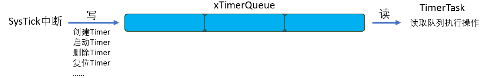


**定时器结构体**

````c
typedef    struct
{
    const char * 					pcTimerName		/* 软件定时器名字 */
    ListItem_t 					xTimerListItem		/* 软件定时器列表项 */
    TickType_t 					xTimerPeriodInTicks;        	/* 软件定时器的周期 */     
    void * 						pvTimerID			/* 软件定时器的ID */
    TimerCallbackFunction_t	 		pxCallbackFunction; 	/* 软件定时器的回调函数 */
    #if ( configUSE_TRACE_FACILITY == 1 )
     UBaseType_t 					uxTimerNumber		/*  软件定时器的编号，调试用  */
    #endif
    uint8_t 						ucStatus;                     		/*  软件定时器的状态  */
} xTIMER;
````

定时器结构体内部也有个链表，用来存放定时器任务，会根据任务的定时时间排序


只有当调用定时器(开始等操作)才会放入此链表


**创建定时器**

创建定时器并不会放入到定时器链表中，只有当调用定时器(开始等操作)才会放入

````c
TimerHandle_t xTimerCreate( const char * const pcTimerName, 
                                    const TickType_t xTimerPeriodInTicks,
                                    const UBaseType_t uxAutoReload,
                                    void * const pvTimerID,
                                    TimerCallbackFunction_t pxCallbackFunction ){
    Timer_t * pxNewTimer;
    pxNewTimer = ( Timer_t * ) pvPortMalloc( sizeof( Timer_t ) );
    if( pxNewTimer != NULL ){
        pxNewTimer->ucStatus = 0x00;
        prvInitialiseNewTimer( pcTimerName, xTimerPeriodInTicks, uxAutoReload, pvTimerID, pxCallbackFunction, pxNewTimer );
    }

    return pxNewTimer;
}
````


**启动定时器**

以启动定时器为例：启动定时器会构造一个xMessage，将这个xMessage放入定时器队列xTimerQueue中，并放入定时器链表

````c
// 对定时器的操作
#define tmrCOMMAND_START                        ( ( BaseType_t ) 1 )
#define tmrCOMMAND_RESET                        ( ( BaseType_t ) 2 )
#define tmrCOMMAND_STOP                         ( ( BaseType_t ) 3 )
#define tmrCOMMAND_CHANGE_PERIOD                ( ( BaseType_t ) 4 )
#define tmrCOMMAND_DELETE                       ( ( BaseType_t ) 5 )

// 可见开启定时器使用的是tmrCOMMAND_START 
#define xTimerStart( xTimer, xTicksToWait ) \
    xTimerGenericCommand( ( xTimer ), tmrCOMMAND_START, ( xTaskGetTickCount() ), NULL, ( xTicksToWait ) )

BaseType_t xTimerGenericCommand( TimerHandle_t xTimer,
                                     const BaseType_t xCommandID,
                                     const TickType_t xOptionalValue,
                                     BaseType_t * const pxHigherPriorityTaskWoken,
                                     const TickType_t xTicksToWait ){
    BaseType_t xReturn = pdFAIL;
    DaemonTaskMessage_t xMessage;

    if( xTimerQueue != NULL ){
        xMessage.xMessageID = xCommandID;
        xMessage.u.xTimerParameters.xMessageValue = xOptionalValue;
        xMessage.u.xTimerParameters.pxTimer = xTimer;

        if( xCommandID < tmrFIRST_FROM_ISR_COMMAND ) {
            // 将这个消息xMessage写入定时器队列xTimerQueue
            if( xTaskGetSchedulerState() == taskSCHEDULER_RUNNING ){
                xReturn = xQueueSendToBack( xTimerQueue, &xMessage, xTicksToWait );
            }
        }
        traceTIMER_COMMAND_SEND( xTimer, xCommandID, xOptionalValue, xReturn );
    }
}
// 对xTimerQueue的操作
static portTASK_FUNCTION( prvTimerTask, pvParameters ){
    TickType_t xNextExpireTime;
    BaseType_t xListWasEmpty;
    ( void ) pvParameters;
    for( ; ; ){
        xNextExpireTime = prvGetNextExpireTime( &xListWasEmpty );  // 下一次超时的时间

        prvProcessTimerOrBlockTask( xNextExpireTime, xListWasEmpty );  // 处理定时器
        prvProcessReceivedCommands();  // 根据操作的类型
    }
}
static void prvProcessTimerOrBlockTask( const TickType_t xNextExpireTime,
                                        BaseType_t xListWasEmpty ){
    TickType_t xTimeNow;
    BaseType_t xTimerListsWereSwitched;
    vTaskSuspendAll();  // 关闭任务调度
    {
        xTimeNow = prvSampleTimeNow( &xTimerListsWereSwitched );
        if( xTimerListsWereSwitched == pdFALSE ){
            if( ( xListWasEmpty == pdFALSE ) && ( xNextExpireTime <= xTimeNow ) ) {
                ( void ) xTaskResumeAll();  // 恢复任务调度
                prvProcessExpiredTimer( xNextExpireTime, xTimeNow );  // 处理定时器
            } else {
                // 等待定时器链表，或超时时间到
                vQueueWaitForMessageRestricted( xTimerQueue, ( xNextExpireTime - xTimeNow ), xListWasEmpty );
            }
        }
    }
}
static void prvProcessExpiredTimer( const TickType_t xNextExpireTime,
                                    const TickType_t xTimeNow ){
    // ……
    // 调用回调函数
    pxTimer->pxCallbackFunction( ( TimerHandle_t ) pxTimer );
}
````


## 中断

在任务函数中，我们可以调用各类API函数，比如队列操作函数：xQueueSendToBack。但是在ISR中使用这个函数会导致问题，应该使用另一个函数：xQueueSendToBackFromISR，它的函数名含有后缀"FromISR"，表示"从ISR中给队列发送数据"。


**以xQueueSendToBack和xQueueSendToBackFromISR为例**

xQueueSendToBack

* 可以休眠
* 可唤醒其他任务
  * DelayList -> ReaduList
  * 挑取出最高优先级的任务运行

xQueueSendToBackFromISR

* 不可以休眠
* 可唤醒其他任务
  * DelayList -> ReaduList
  * 不挑取出最高优先级的任务，他**只是记录下是否有更高优先级的任务被唤醒**


为什么只是记录下是否有更高优先级的任务被唤醒，而不是切换任务？

* 因为**这是在中断中执行的程序**，就算挑取出最高优先级的任务，这个任务也无法运行
* 况且在本次中断中可能会唤醒多个任务，来回切换任务(无法执行)，浪费时间
* 不如直接在中断结束前调用最高优先级的任务

````c
void EXTI0_IRQHandler(void)
{
	static int cnt = 0;
	BaseType_t xHigherPriorityTaskWoken  = pdTRUE;  // 标记是否有更高优先级的任务，默认为有
	if(EXTI_GetITStatus(EXTI_Line0) != RESET)
	{
		printf("EXTI0_IRQHandler cnt = %d\r\n", cnt++);
		/* 使用定时器消除抖动 */
        // 如果没有更高优先级的任务将要执行，将xHigherPriorityTaskWoken设为pdFALSE
		xTimerResetFromISR(xMyTimerHandle, &xHigherPriorityTaskWoken); 
		
        portYIELD_FROM_ISR(xHigherPriorityTaskWoken);   //是否进行任务切换 
		
		EXTI_ClearITPendingBit(EXTI_Line0);             //清除中断
	}     
}
````


**关于关闭中断**

在FreeRTOS中动不动就关闭中断，是关闭所有中断吗？

* 不会关闭所有中断，只关闭一部分中断
* 在整个系统中分为两类中断，一类为高优先级中断，一类为低优先级中断
  * 在高优先级中断中不能使用有关FreeRTOS的API
  * 只能在低优先级的中断中使用FreeRTOS的API
* 在FreeRTOS中关闭中断，只是关闭FreeRTOS使用的低优先级中断


**中断优先级**

任务有高低优先级

中断也有高低优先级，并且最低优先级的中断也可以打断最高优先级的任务


## 内存

**堆的概念**

很多人把"堆栈"相提并论，其实"堆"、"栈"是完全没有联系。

"堆"就是一块或者多块内存，我们可以从中申请一小块内存来使用，使用完毕后可以释放这一小块内存。

简单地说，一开始，"堆"是一些空闲内存，我们可以：

* 使用malloc函数从中申请、获得一小块内存
* 使用free函数释放这一小块内存
* 这些malloc、free函数就是用来管理这些内存的
* malloc、free函数可以有其他名称，比如FreeRTOS里是pvPortMalloc、vPortFree

**堆的内存来源**

一开始，"堆"是一些空闲内存，怎么得到这些空闲内存？

* 在汇编代码里指定一个AREA：在汇编代码里，使用SPACE命令可以分配一段空间
  /pic/18_heap_ram.png)

* 在C代码里，定义一个全局数组：
  

### heap1

heap_1.c里，只实现了pvPortMalloc函数，vPortFree函数并未实现。


**初始状态**


`pucAlignedHeap`是用来内存对齐的


**分配内存**

`void * pvPortMalloc( size_t xWantedSize )`的内部实现：


````c
void * pvPortMalloc( size_t xWantedSize ){
    void * pvReturn = NULL;
    static uint8_t * pucAlignedHeap = NULL;
	// 内存对齐的一些操作
    #if ( portBYTE_ALIGNMENT != 1 )
        {
            if( xWantedSize & portBYTE_ALIGNMENT_MASK )
            {
                /* Byte alignment required. Check for overflow. */
                if ( (xWantedSize + ( portBYTE_ALIGNMENT - ( xWantedSize & portBYTE_ALIGNMENT_MASK ) )) > xWantedSize )
                {
                    xWantedSize += ( portBYTE_ALIGNMENT - ( xWantedSize & portBYTE_ALIGNMENT_MASK ) );
                }
                else
                {
                    xWantedSize = 0;
                }
            }
        }
    #endif

    vTaskSuspendAll();     // 关闭任务调度
    {
        if( pucAlignedHeap == NULL ){
            /* Ensure the heap starts on a correctly aligned boundary. */
            // 内存对齐
            pucAlignedHeap = ( uint8_t * ) ( ( ( portPOINTER_SIZE_TYPE ) & ucHeap[ portBYTE_ALIGNMENT ] ) & ( ~( ( portPOINTER_SIZE_TYPE ) portBYTE_ALIGNMENT_MASK ) ) );
        }

        // 判断是否有足够的空间
        if( ( xWantedSize > 0 ) && /* valid size */
            ( ( xNextFreeByte + xWantedSize ) < configADJUSTED_HEAP_SIZE ) &&
            ( ( xNextFreeByte + xWantedSize ) > xNextFreeByte ) ) /* Check for overflow. */
        {
            /* Return the next free byte then increment the index past this
             * block. */
            pvReturn = pucAlignedHeap + xNextFreeByte;
            xNextFreeByte += xWantedSize;
        }

        traceMALLOC( pvReturn, xWantedSize );
    }
    ( void ) xTaskResumeAll();
    return pvReturn;
}
//heap1没有实现Free
void vPortFree( void * pv ){
    ( void ) pv;
    configASSERT( pv == NULL );
}
````


### heap2

heap2实现了释放内存的操作

会在申请地址的前面创建一个结构体，结构体中存放申请内存的大小，这样在释放内存的时候会向申请地址的前面找这个结构体，在结构体中获得要释放内存的大小，这个结构体会记录下一个结构体

heap_2.c里，使用链表来管理内存。链表结构体为：

使用了一个结构体，来保存申请内存的大小

````c
typedef struct A_BLOCK_LINK{
    struct A_BLOCK_LINK * pxNextFreeBlock; /*<< 指向下一个空闲块 */
    size_t xBlockSize;                     /*<< 当前空闲块的内存大小 */
} BlockLink_t;
````


这个结构体后面，紧跟着空闲内存，如下图所示：


**初始状态**

* 链表头：xStart，指向第1个FreeBlock
* 第1个FreeBlock：从pucAlignedHeap开始，它的xBlockSize等于configADJUSTED_HEAP_SIZE，表示整个堆的大小
* 链表尾：xEnd，它的xBlockSize也是configADJUSTED_HEAP_SIZE，xEnd并没有对应的空闲内存，这个值只是为了排序


**分配内存**

`void * pvPortMalloc( size_t xWantedSize )`的内部实现：

* 调整xWantedSize：加上sizeof(struct BlockLink_t)，向上对齐
* 从xStart开始寻找第1个大小合适FreeBlock：这个FreeBlock的xBlockSize >= xWantedSize
* 把这个FreeBlock从链表中删除
* 如果这个FreeBlock的xBlockSize 比较大，把它拆分成2个Block
  * 第1个Block被占用，大小为xWantedSize
  * 第2个Block是空闲的，还要放入链表：按照xBlockSize从小到大的顺序插入链表
* 返回的地址如下图所示：
  

分配结果如下图所示：


**释放内存**

`void vPortFree( void * pv )`函数：

* 根据pv往前移动，得到BlockLink_t结构体
* 把这个结构体放入xStart链表：按照xBlockSize从小到大的顺序插入链表

### heap4


# 从零写FreeRTOS

参数返回值怎么传递：通过CPU中的寄存器

**寄存器**：4个字节，有16个R0~R15，R13别名SP保存栈指针，R14别名LR保存返回地址，R15别名PC程序计数器

R0~R3传递参数，R0还传递返回值

C函数

* 随意使用R0、R1、R2、R3、R12无需保护
* R4~R11可用，先保存，用完要恢复


**处理中断**

分为

* 保护现场：将局部变量保存到自己的栈中，寄存器R0、R1、R2、R3、R12、LR、中断的返回地址 由硬件保存到栈中
* 处理中断：C函数保证不破坏R4~R11
* 恢复现场：恢复所有寄存器
