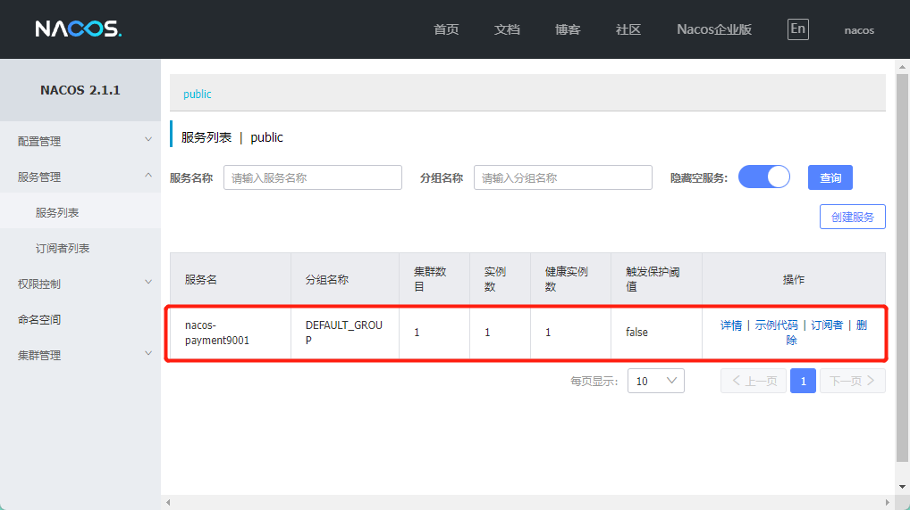
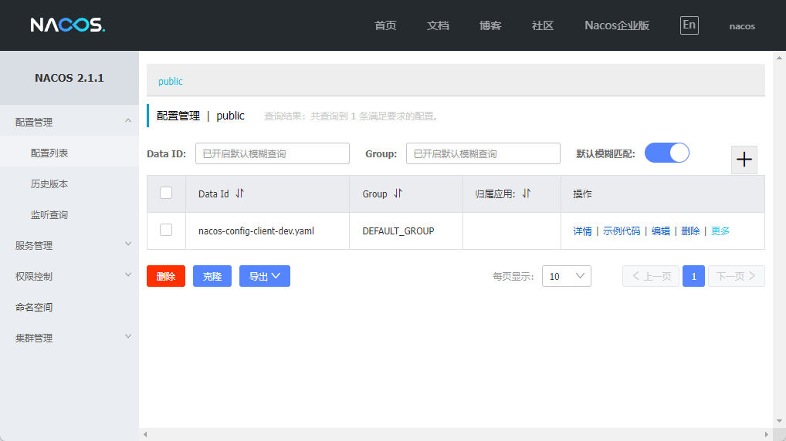
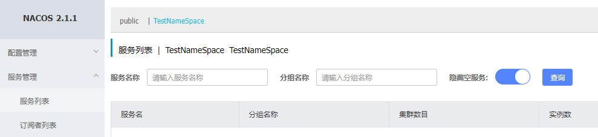
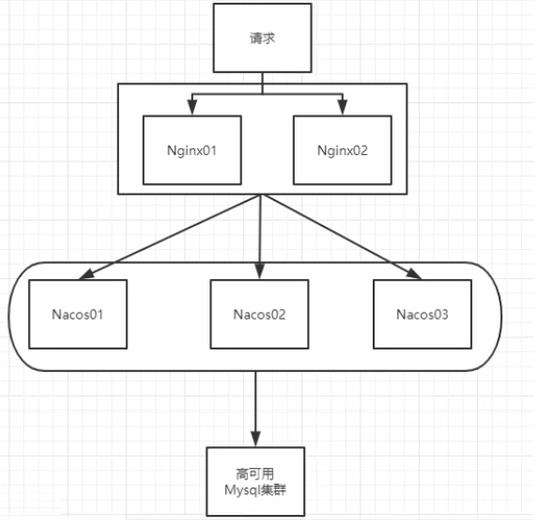
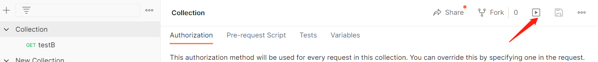
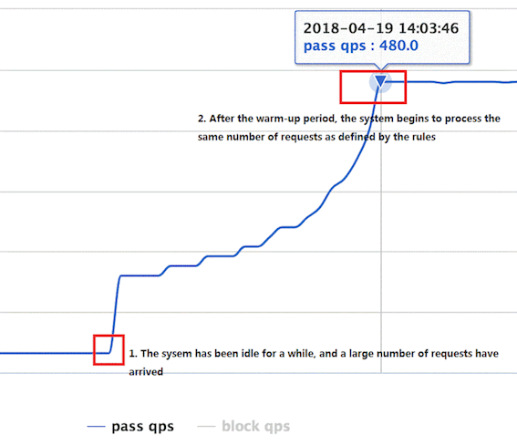
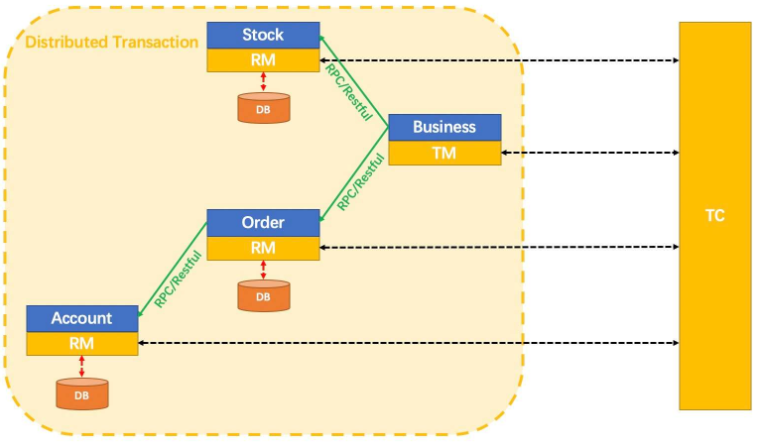
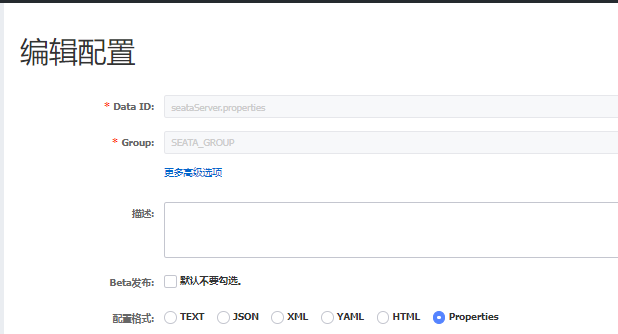
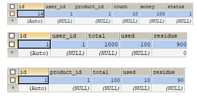
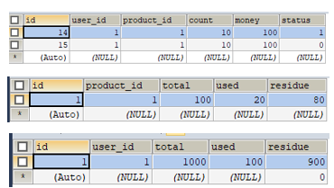

# 简介

[官网](https://github.com/alibaba/spring-cloud-alibaba)

[中文文档](https://github.com/alibaba/spring-cloud-alibaba/blob/2.2.x/README-zh.md)

**主要功能**

- **服务限流降级**：默认支持 WebServlet、WebFlux、OpenFeign、RestTemplate、Spring Cloud Gateway、Zuul、Dubbo 和 RocketMQ 限流降级功能的接入，可以在运行时通过控制台实时修改限流降级规则，还支持查看限流降级 Metrics 监控。
- **服务注册与发现**：适配 Spring Cloud 服务注册与发现标准，默认集成了 Ribbon 的支持。
- **分布式配置管理**：支持分布式系统中的外部化配置，配置更改时自动刷新。
- **消息驱动能力**：基于 Spring Cloud Stream 为微服务应用构建消息驱动能力。
- **分布式事务**：使用 @GlobalTransactional 注解， 高效并且对业务零侵入地解决分布式事务问题。
- **阿里云对象存储**：阿里云提供的海量、安全、低成本、高可靠的云存储服务。支持在任何应用、任何时间、任何地点存储和访问任意类型的数据。
- **分布式任务调度**：提供秒级、精准、高可靠、高可用的定时（基于 Cron 表达式）任务调度服务。同时提供分布式的任务执行模型，如网格任务。网格任务支持海量子任务均匀分配到所有 Worker（schedulerx-client）上执行。
- **阿里云短信服务**：覆盖全球的短信服务，友好、高效、智能的互联化通讯能力，帮助企业迅速搭建客户触达通道。

**组件**

* **Nacos**：一个更易于构建云原生应用的动态服务发现、配置管理和服务管理平台。

* **Sentinel**：把流量作为切入点，从流量控制、熔断降级、系统负载保护等多个维度保护服务的稳定性。
* **RocketMQ**：一款开源的分布式消息系统，基于高可用分布式集群技术，提供低延时的、高可靠的消息发布与订阅服务。
* **Seata**：阿里巴巴开源产品，一个易于使用的高性能微服务分布式事务解决方案。
* **Alibaba Cloud OSS**: 阿里云对象存储服务（Object Storage Service，简称 OSS），是阿里云提供的海量、安全、低成本、高可靠的云存储服务。您可以在任何应用、任何时间、任何地点存储和访问任意类型的数据。
* **Alibaba Cloud SchedulerX**: 阿里中间件团队开发的一款分布式任务调度产品，提供秒级、精准、高可靠、高可用的定时（基于 Cron 表达式）任务调度服务。
* **Alibaba Cloud SMS**: 覆盖全球的短信服务，友好、高效、智能的互联化通讯能力，帮助企业迅速搭建客户触达通道。


**依赖**

````xml
<dependencyManagement>
    <dependencies>
        <dependency>
            <groupId>com.alibaba.cloud</groupId>
            <artifactId>spring-cloud-alibaba-dependencies</artifactId>
            <version>2.2.8.RELEASE</version>
            <type>pom</type>
            <scope>import</scope>
        </dependency>
    </dependencies>
</dependencyManagement>
````


**官方案例**

为了演示如何使用，Spring Cloud Alibaba 项目包含了一个子模块`spring-cloud-alibaba-examples`。此模块中提供了演示用的 example ，您可以阅读对应的 example 工程下的 readme 文档，根据里面的步骤来体验。

* [Sentinel Example](https://github.com/alibaba/spring-cloud-alibaba/tree/master/spring-cloud-alibaba-examples/sentinel-example/sentinel-core-example/readme-zh.md)
* [Nacos Config Example](https://github.com/alibaba/spring-cloud-alibaba/blob/master/spring-cloud-alibaba-examples/nacos-example/nacos-config-example/readme-zh.md)
* [Nacos Discovery Example](https://github.com/alibaba/spring-cloud-alibaba/blob/master/spring-cloud-alibaba-examples/nacos-example/nacos-discovery-example/readme-zh.md)
* [RocketMQ Example](https://github.com/alibaba/spring-cloud-alibaba/blob/master/spring-cloud-alibaba-examples/rocketmq-example/readme-zh.md)
* [Seata Example](https://github.com/alibaba/spring-cloud-alibaba/blob/master/spring-cloud-alibaba-examples/seata-example/readme-zh.md)
* [Alibaba Cloud OSS Example](https://github.com/alibaba/aliyun-spring-boot/tree/master/aliyun-spring-boot-samples/aliyun-oss-spring-boot-sample)
* [Alibaba Cloud SMS Example](https://github.com/alibaba/aliyun-spring-boot/tree/master/aliyun-spring-boot-samples/aliyun-sms-spring-boot-sample)
* [Alibaba Cloud SchedulerX Example](https://github.com/alibaba/aliyun-spring-boot)


# Nacos

## 简介

[中文官网](https://nacos.io/zh-cn/)

[中文手册](https://nacos.io/zh-cn/docs/what-is-nacos.html)

Nacos 是 Dynamic Naming and Configuration Service的首字母简称，一个更易于构建云原生应用的动态服务发现、配置管理和服务管理平台。

**什么是 Nacos？**

- 一个更易于构建云原生应用的动态服务发现、配置管理和服务管理平台。
- Nacos就是注册中心＋配置中心的组合 -> **Nacos = Eureka+Config+Bus**

**作用：**

- 替代Eureka做服务注册中心
- 替代Config做服务配置中心

**依赖：**

````xml
<dependency>
    <groupId>com.alibaba.cloud</groupId>
    <artifactId>spring-cloud-starter-alibaba-nacos-discovery</artifactId>
</dependency>
````


**下载地址：**[Nacos下载](https://github.com/alibaba/nacos/releases)

**各中注册中心比较**

| 服务注册与发现框架 | CAP模型 | 控制台管理 | 社区活跃度      |
| ------------------ | ------- | ---------- | --------------- |
| Eureka             | AP      | 支持       | 低(2.x版本闭源) |
| Zookeeper          | CP      | 不支持     | 中              |
| consul             | CP      | 支持       | 高              |
| Nacos              | AP      | 支持       | 高              |


**Windows安装Nacos**

1. 所需环境：Java + Maven
2. [Nacos下载](https://github.com/alibaba/nacos/releases)

3. 解压安装包，进入nacos的bin目录，命令行`startup.cmd -m standalone`（standalone代表着单机模式运行，非集群模式）
4. 命令运行成功后直接访问`http://localhost:8848/nacos`，默认账号密码都是nacos

Nacos不同于Eureka需要要编写项目作为注册中心，Nacos只需要启动它提供的客户端即可开启注册中心


## 服务注册

`spring.cloud.nacos.discovery.server-addr`配置注册地址

### 服务提供者注册

在父文件的POM中引入依赖

````xml
<dependencyManagement>
    <dependencies>
        <dependency>
            <groupId>com.alibaba.cloud</groupId>
            <artifactId>spring-cloud-alibaba-dependencies</artifactId>
            <version>2.2.8.RELEASE</version>
            <type>pom</type>
            <scope>import</scope>
        </dependency>
    </dependencies>
</dependencyManagement>
````


创建`cloudalibaba-provider-payment9001`的maven项目

```xml
<dependencies>
    <!--SpringCloud ailibaba nacos -->
    <dependency>
        <groupId>com.alibaba.cloud</groupId>
        <artifactId>spring-cloud-starter-alibaba-nacos-discovery</artifactId>
    </dependency>
    <!-- SpringBoot整合Web组件 -->
    <dependency>
        <groupId>org.springframework.boot</groupId>
        <artifactId>spring-boot-starter-web</artifactId>
    </dependency>
    <dependency>
        <groupId>org.springframework.boot</groupId>
        <artifactId>spring-boot-starter-actuator</artifactId>
    </dependency>
</dependencies>
```

配置文件

```yaml
server:
  port: 9001

spring:
  application:
    name: nacos-payment9001
  cloud:     
    nacos:    # 配置nacos
      discovery:
        server-addr: localhost:8848

management:
  endpoints:
    web:
      exposure:
        include: "*"
```

controller

```java
@RestController
public class NacosPaymentController {
    @Value("${server.port}")
    private String serverPort;

    @GetMapping(value = "/payment/nacos/{id}")
    public String getPayment(@PathVariable("id") Integer id) {
        return "nacos registry, serverPort: "+ serverPort+"\t id"+id;
    }
}
```

主启动器

```java
@SpringBootApplication
@EnableDiscoveryClient   # 开启服务发现
public class NacosPayment9001Main {
    public static void main(String[] args) {
        SpringApplication.run(NacosPayment9001Main.class,args);
    }
}
```

**测试**

1. 启动程序
2. 进入`http://localhost:8848/nacos`的服务管理列表
3. 发现9001注册进入Nacos



参照9001项目，创建9002项目


### 服务消费者注册

创建`cloudalibaba-consumer-nacos-order83`的maven项目

依赖：`spring-cloud-starter-alibaba-nacos-discovery`内含`netflix-ribbon`包

```xml
<dependency>
    <groupId>com.alibaba.cloud</groupId>
    <artifactId>spring-cloud-starter-alibaba-nacos-discovery</artifactId>
</dependency>
```

配置文件

```yaml
server:
  port: 83

spring:
  application:
    name: consumer-nacos-order83
  cloud:
    nacos:
      discovery:
        server-addr: localhost:8848

# 指定服务提供者注册到Nacos的名字
service-url:
  nacos-user-service: http://nacos-payment
```

配置类

```java
@Configuration
public class SpringCloudConfig {
    @Bean
    @LoadBalanced   //开启负载均衡访问
    public RestTemplate getRestTemplate(){
        return new RestTemplate();
    }
}
```

controller

```java
@RestController
public class OrderController {
    @Autowired
    private RestTemplate restTemplate;

    //@Value("${service-url.nacos-user-service}")
    private String URL = "http://nacos-payment";   //可以从配置文件获取 也 可以直接写入程序
    @GetMapping(value = "/consumer/payment/nacos/{id}")
    public String getPayment(@PathVariable("id") Integer id) {
        return restTemplate.getForObject(URL +"/payment/nacos/" + id,String.class);
    }
}
```

主启动器

```java
@SpringBootApplication
@EnableDiscoveryClient
public class NacosConsumerOrder83Main {
    public static void main(String[] args) {
        SpringApplication.run(NacosConsumerOrder83Main.class,args);
    }
}
```

测试：

1. http://localhost:83/consumer/payment/nacos/1

2. 9001/9002轮询访问


**Nacos支持AP和CP模式的切换**

* C是所有节点在同一时间看到的数据是一致的;而A的定义是所有的请求都会收到响应。

* 一般来说，如果不需要存储服务级别的信息且服务实例是通过nacos-client注册，并能够保持心跳上报，那么就可以选择AP模式。当前主流的服务如Spring cloud和Dubbo服务，都适用于AP模式，AP模式为了服务的可能性而减弱了一致性，因此AP模式下只支持注册临时实例。
* 如果需要在服务级别编辑或者存储配置信息，那么CP是必须，K8S服务和DNS服务则适用于CP模式。CP模式下则支持注册持久化实例，此时则是以Raft协议为集群运行模式，该模式下注册实例之前必须先注册服务，如果服务不存在，则会返回错误。
* 切换命令：`curl -X PUT '$NACOS_SERVER:8848/nacos/v1/ns/operator/switches?entry=serverMode&value=CP`
  


## 配置中心

nacos与springcloud config不同，springcloud config是去远程仓库获取内容，nacos去自己的配置管理页面获取

创建`cloudalibaba-config-nacos-client3377`的maven项目

依赖

```xml
<!--nacos-config-->
<dependency>
    <groupId>org.springframework.cloud</groupId>
    <artifactId>spring-cloud-starter-alibaba-nacos-config</artifactId>
    <version>0.2.1.RELEASE</version>
</dependency>
<!--nacos-discovery-->
<dependency>
    <groupId>com.alibaba.cloud</groupId>
    <artifactId>spring-cloud-starter-alibaba-nacos-discovery</artifactId>
</dependency>
```

**配置文件**

Nacos同springcloud-config一样，在项目初始化时，要保证先从配置中心进行配置拉取，拉取配置之后，才能保证项目的正常启动。

springboot中配置文件的加载是存在优先级顺序的，bootstrap优先级高于application

bootstrap.yaml

```yaml
server:
  port: 3377

spring:
  application:
    name: nacos-config-client
  cloud:
    nacos:
      discovery:
        server-addr: localhost:8848 #Nacos服务注册中心地址
      config:
        server-addr: localhost:8848 #Nacos作为配置中心地址
        file-extension: yaml        #指定yaml格式的配置
        #group:                     #指定分组
        #namespace:                 #指定名称空间
```

application.yaml

````yaml
spring: 
  profiles:
    active: dev          #启动dev配置文件
````

controller

```java
@RestController
@RefreshScope
public class ConfigClientController {
    @Value("${config.info}")
    private String info;

    @GetMapping("/config/info")
    public String getConfigInfo() {
        return info;
    }
}
```

主启动器

```java
@SpringBootApplication
@EnableDiscoveryClient
public class NacosConfigClient {
    public static void main(String[] args) {
        SpringApplication.run(NacosConfigClient.class,args);
    }
}
```


**配置新增**




**配置规则总结**


**测试**

1. 启动前需要在nacos客户端-配置管理-配置管理栏目下有对应的yaml配置文件
2. 运行cloud-config-nacos-client3377的主启动类
3. 访问`http://localhost:3377/config/info`，获取配置

4. 修改配置文件，再次访问`http://localhost:3377/config/info`，获取最新配置(**自带自带刷新**)


### 配置文件命名规则

说明：之所以需要配置 `spring.application.name` ，是因为它是构成 Nacos 配置管理 `dataId`字段的一部分。

在 Nacos Spring Cloud 中，`dataId` 的完整格式如下：

```plain
${prefix}-${spring.profiles.active}.${file-extension}
```

- `prefix` 默认为 `spring.application.name` 的值，也可以通过配置项 `spring.cloud.nacos.config.prefix`来配置。
- `spring.profiles.active` 即为当前环境对应的 profile，详情可以参考 [Spring Boot文档](https://docs.spring.io/spring-boot/docs/current/reference/html/boot-features-profiles.html#boot-features-profiles)。 **注意：当 `spring.profiles.active` 为空时，对应的连接符 `-` 也将不存在，dataId 的拼接格式变成 `${prefix}.${file-extension}`**
- `file-exetension` 为配置内容的数据格式，可以通过配置项 `spring.cloud.nacos.config.file-extension` 来配置。目前只支持 `properties` 和 `yaml` 类型。

即：

````plain
${spring.application.name)}-${spring.profiles.active}.${spring.cloud.nacos.config.file-extension}
````

> **DataId**

指定spring.profile.active和配置文件的DataID来使不同环境下读取不同的配置


```yaml
spring:
  profiles:
    #active: dev
    active: test  # 使用test配置文件
```


> **分组**


在config下增加一条group的配置即可，可配置为DEV_GROUP或TEST_GROUP


> **命名空间**

命名空间是对 配置管理 和 服务管理 下面的细节进行分组

默认情况：Namespace=public，Group=DEFAULT_GROUP，默认Cluster是DEFAULT

* Nacos默认的Namespace是public，Namespace主要用来实现隔离。
  * 比方说我们现在有三个环境：开发、测试、生产环境，我们就可以创建三个Namespace，不同的Namespace之间是隔离的。
* Group默认是DEFAULT_GROUP，Group可以把不同的微服务划分到同一个分组里面去
* Service就是微服务:一个Service可以包含多个Cluster (集群)，Nacos默认Cluster是DEFAULT，Cluster是对指定微服务的一个虚拟划分。
  * 比方说为了容灾，将Service微服务分别部署在了杭州机房和广州机房，这时就可以给杭州机房的Service微服务起一个集群名称(HZ) ，给广州机房的Service微服务起一个集群名称(GZ)，还可以尽量让同一个机房的微服务互相调用，以提升性能。
* 最后是Instance，就是微服务的实例。

新建NameSpace


Nacos配置管理

Nacos服务管理



Java配置文件

 


## 持久化

默认Nacos使用嵌入式数据库实现数据的存储。所以，如果启动多个默认配置下的Nacos节点，数据存储是存在一致性问题的。为了解决这个问题，Nacos采用了集中式存储的方式来支持集群化部署，目前只支持MySQL的存储。

Nacos支持三种部署模式

* 单机模式:用于测试和单机试用。
* 集群模式:用于生产环境，确保高可用。

* 多集群模式:用于多数据中心场景。


**单机模式支持mysql:** 

在0.7版本之前，在单机模式时nacos使用嵌入式数据库实现数据的存储，不方便观察数据存储的基本情况。0.7版本增加了支持mysql数据源能力，具体的操作步骤:

* 安装数据库，版本要求:5.6.5+
* 利用`nacos/confnacos-mysql.sql`进行初始化数据库 (我创建的数据库名称为cloud)
* 修改`conf/application.properties`文件，增加支持mysql数据源配置（目前只支持mysql)，添加mysql数据源的url、用户名和密码。

````
spring.datasource.platform=mysql

db.num=1
db.url.0=jdbc:mysql://localhost:3306/cloud？characterEncoding=utf8&connectTimeout=1000&socketTimeout=3000&autoReconnect=true
db.user=root
db.password=YouNotKonw
````

再以单机模式启动nacos:`startup.cmd -m standalone`，nacos所有写嵌入式数据库的数据都写到了mysql。


## 集群

**集群部署架构图**

因此开源的时候推荐用户把所有服务列表放到一个vip下面，然后挂到一个域名下面

* http://ip1/:port/openAPI 直连ip模式，机器挂则需要修改ip才可以使用。
* http://slb/port/openAPI 挂载SLB模式(内网SLB，不可暴露到公网，以免带来安全风险)，直连SLB即可，下面挂server真实ip，可读性不好。
* http://nacos.com/port/openAPI 域名 + SLB模式(内网SLB，不可暴露到公网，以免带来安全风险)，可读性好，而且换ip方便，推荐模式


对官方部署架构图的解释




[官方操作手册-集群部署说明](https://nacos.io/zh-cn/docs/cluster-mode-quick-start.html)

[博客](https://blog.csdn.net/wsjzzcbq/article/details/123956116)


# Sentinel

## 简介

[Sentinel GitHub](https://github.com/alibaba/Sentinel)

[Sentinel 中文官网](https://sentinelguard.io/zh-cn/)

[Sentinel 中文文档](https://sentinelguard.io/zh-cn/docs/logs.html)


Sentinel 是面向分布式、多语言异构化服务架构的流量治理组件，主要以流量为切入点，从流量路由、流量控制、流量整形、熔断降级、系统自适应过载保护、热点流量防护等多个维度来帮助开发者保障微服务的稳定性。

**特征:**

* 丰富的应用场景：Sentinel 承接了阿里巴巴近 10 年的双十一大促流量的核心场景，例如秒杀（即突发流量控制在系统容量可以承受的范围）、消息削峰填谷、集群流量控制、实时熔断下游不可用应用等。
* 完备的实时监控：Sentinel 同时提供实时的监控功能。您可以在控制台中看到接入应用的单台机器秒级数据，甚至 500 台以下规模的集群的汇总运行情况。
* 广泛的开源生态：Sentinel 提供开箱即用的与其它开源框架/库的整合模块，例如与 Spring Cloud、Dubbo、gRPC 的整合。您只需要引入相应的依赖并进行简单的配置即可快速地接入 Sentinel。
* 完善的 SPI 扩展点：Sentinel 提供简单易用、完善的 SPI 扩展接口。您可以通过实现扩展接口来快速地定制逻辑。例如定制规则管理、适配动态数据源等。


**Sentinel 分为两个部分:**

- 核心库（Java 客户端）不依赖任何框架/库，能够运行于所有 Java 运行时环境，同时对 Dubbo / Spring Cloud 等框架也有较好的支持。
- 控制台（Dashboard）基于 Spring Boot 开发，打包后可以直接运行，不需要额外的 Tomcat 等应用容器。

**Hystrix与Sentinel比较：**

- Hystrix
  1. 需要我们程序员自己手工搭建监控平台
  2. 没有一套web界面可以给我们进行更加细粒度化得配置流控、速率控制、服务熔断、服务降级
- Sentinel
  1. 单独一个组件，可以独立出来。
  2. 直接界面化的细粒度统一配置。

**依赖**

````xml
<!--SpringCloud ailibaba sentinel -->
<dependency>
    <groupId>com.alibaba.cloud</groupId>
    <artifactId>spring-cloud-starter-alibaba-sentinel</artifactId>
</dependency>
<!--SpringCloud ailibaba sentinel-datasource-nacos -->
<!--持久化所需依赖-->
<dependency>
    <groupId>com.alibaba.csp</groupId>
    <artifactId>sentinel-datasource-nacos</artifactId>
</dependency>
````


**安装**

1. 下载SentinelJar包 [下载地址](https://github.com/alibaba/Sentinel/releases)

2. `java -jar *.jar`启动sentinel
   1. 8080端口不能被占用

​	

3. 访问 http://localhost:8080/
4. 账号密码默认均为 sentinel


## 监控微服务

创建`cloudalibaba-sentinel-service8401`的maven工程

POM

```xml
<dependencies>
    <!--SpringCloud ailibaba sentinel -->
    <dependency>
        <groupId>com.alibaba.cloud</groupId>
        <artifactId>spring-cloud-starter-alibaba-sentinel</artifactId>
    </dependency>
    <!--SpringCloud ailibaba sentinel-datasource-nacos -->
    <!--持久化所需依赖-->
    <dependency>
        <groupId>com.alibaba.csp</groupId>
        <artifactId>sentinel-datasource-nacos</artifactId>
    </dependency>
    <!--SpringCloud ailibaba sentinel -->
    <dependency>
        <groupId>com.alibaba.cloud</groupId>
        <artifactId>spring-cloud-starter-alibaba-sentinel</artifactId>
    </dependency>
    <!--openfeign-->
    <dependency>
        <groupId>org.springframework.cloud</groupId>
        <artifactId>spring-cloud-starter-openfeign</artifactId>
    </dependency>
    <!-- SpringBoot整合Web组件+actuator -->
    <dependency>
        <groupId>org.springframework.boot</groupId>
        <artifactId>spring-boot-starter-web</artifactId>
    </dependency>
    <dependency>
        <groupId>org.springframework.boot</groupId>
        <artifactId>spring-boot-starter-actuator</artifactId>
    </dependency>
</dependencies>
```

配置文件，`spring.cloud.sentinel.transport.dashboard`

```yml
server:
  port: 8401

spring:
  application:
    name: sentinel-service
  cloud:
    nacos:
      discovery:
        server-addr: localhost:8848   # Nacos服务注册中心地址
    sentinel:
      transport:
        dashboard: localhost:8080     # 注册进入sentinel

management:
  endpoints:
    web:
      exposure:
        include: '*'
        
# 激活Sentinel对Feign的支持
feign:
  hystrix:
    enabled: true
```

controller

```java
@RestController

public class FlowLimitController {
    @GetMapping("/testA")
    public String testA() {
        return "------testA";
    }
    @GetMapping("/testB")
    public String testB() {        
        return "------testB";
    }
}
```

主启动器

```java
@SpringBootApplication
@EnableDiscoveryClient
public class Sentinel8401Main {
    public static void main(String[] args) {
        SpringApplication.run(Sentinel8401Main.class,args);
    }
}
```

**测试**

1. 启动sentinel、nacos客户端，启动微服务8401

2. 访问 http://localhost:8080，发现sentinel中什么都没有
   * Sentinel采用的懒加载说明
   * 执行一次访问即可http://localhost:8401/testA
   * 效果 - sentinel8080正在监控微服务8401


## 流控规则


* 资源名：唯一名称，默认请求路径。
* 针对来源：Sentinel可以针对调用者进行限流，填写微服务名，默认default（不区分来源）。
* 阈值类型/单机阈值：
  * QPS(每秒钟的请求数量)︰当调用该API的QPS达到阈值的时候，进行限流。
  * 线程数：当调用该API的线程数达到阈值的时候，进行限流。
* 是否集群：不需要集群。
* 流控模式：
  * 直接：API达到限流条件时，直接限流。
  * 关联：当关联的资源达到阈值时，就限流自己。
  * 链路：只记录指定链路上的流量（指定资源从入口资源进来的流量，如果达到阈值，就进行限流)【API级别的针对来源】。
* 流控效果：
  * 快速失败：直接失败，抛异常。
  * Warm up：根据Code Factor（冷加载因子，默认3）的值，从阈值/codeFactor，经过预热时长，才达到设置的QPS阈值。
  * 排队等待：匀速排队，让请求以匀速的速度通过，阈值类型必须设置为QPS，否则无效。

### 快速失败

#### QPS-直接失败

直接失败是系统默认

**配置**

表示1秒钟内查询1次就是OK，若超过次数1，就直接->快速失败，报默认错误


**测试**

1. 快速连续访问：http://localhost:8401/testA

2. 出现`Blocked by Sentinel (flow limiting)`

**源码：** `com.alibaba.csp.sentinel.slots.block.flow.controller.DefaultController`

**思考：** 直接调用默认报错信息，技术方面OK，但是，是否应该有我们自己的后续处理？类似有个fallback的兜底方法?


#### 线程数-直接失败

线程数：当调用该API的线程数达到阈值的时候，进行限流。


#### 关联-快速失败

**说明：**

* 当自己关联的资源达到阈值时，就限流自己
* 当与A关联的资源B达到阀值后，就限流A自己

**设置testA**

当关联资源/testB的QPS阀值超过1时，就限流/testA的Rest访问地址，**当关联资源到阈值后限制配置好的资源名**。


**PostMan**





**测试**

1. Postman 高并发访问`/testB`

2. 浏览器访问`/testA`，出现`Blocked by Sentinel (flow limiting)`

3. Postman结束，`/testA`恢复访问


#### 链路-快速失败

只记录指定链路上的流量（指定资源从入口资源进来的流量，如果达到阈值，就进行限流)【API级别的针对来源】

例：

* `/testA` 与 `/testB`都调用 `/testC`

* 对从`/testA`调用`/testC`进行限制

  

* 高并发访问`/testA`无法进入`/testC`，而访问`/testB`则可以访问`/testC`(因为没对B进行限制)


### 预热WarmUp

Warm Up（RuleConstant.CONTROL_BEHAVIOR_WARM_UP）方式，即预热/冷启动方式。当系统长期处于低水位的情况下，当流量突然增加时，直接把系统拉升到高水位可能瞬间把系统压垮。通过"冷启动"，让通过的流量缓慢增加，在一定时间内逐渐增加到阈值上限，给冷系统一个预热的时间，避免冷系统被压垮。



默认coldFactor为**3**，即请求QPS 从 threshold / 3开始，经预热时长逐渐升至设定的QPS阈值。

即：刚开始如果有大量访问进入 则进行限制，慢慢的可以承受大量请求


**配置**

案例：最大可承受阈值为20，预热时长5秒钟(刚开始只能承受3次的访问，慢慢的开始可以承受20次的访问)

* 系统初始化的阀值： `20/ 3 = 3` ,即阀值刚开始为3
* 然后过了5秒后阀值才慢慢升高恢复到20
* 如果最终超过20，仍进行限制

**测试**

1. 快速访问http://localhost:8401/testB

2. 刚开始进行限制`Blocked by Sentinel (flow limiting)`

3. 慢慢可以访问

**应用场景**

如：秒杀系统


### 排队等待

**排队等待（匀速器）：**匀速排队，让请求以匀速的速度通过，阈值类型必须设置为QPS，否则无效

**概念：**匀速排队方式会严格控制请求通过的间隔时间，也即是让请求以均匀的速度通过，对应的是漏桶算法。

这种方式主要用于处理间隔性突发的流量，例如消息队列。想象一下这样的场景，在某一秒有大量的请求到来，而接下来的几秒则处于空闲状态，我们希望系统能够在接下来的空闲期间逐渐处理这些请求，而不是在第一秒直接拒绝多余的请求（削峰填谷）。


**匀速器**
它的中心思想是，以固定的间隔时间让请求通过。当请求到来的时候，如果当前请求距离上个通过的请求通过的时间间隔不小于预设值，则让当前请求通过。否则，计算当前请求的预期通过时间，如果该请求的预期通过时间小于规则预设的 timeout 时间，则该请求会等待直到预设时间到来通过（排队等待处理）；若预期的通过时间超出最大排队时长，则直接拒接这个请求。

注意：匀速排队模式暂时不支持 QPS > 1000 的场景。


**案例**

`/testA`资源以每秒1次的请求处理能力处理数据，如果QPS超过1，则排队等待，排队的请求最多只有2秒的预计处理时长。如果后面再来的请求计算预计等待时长超过2秒，则拒绝该请求。


## 熔断规则

除了流量控制以外，对调用链路中不稳定的资源进行熔断降级也是保障高可用的重要措施之一。一个服务常常会调用别的模块，可能是另外的一个远程服务、数据库，或者第三方 API 等。例如，支付的时候，可能需要远程调用银联提供的 API；查询某个商品的价格，可能需要进行数据库查询。然而，这个被依赖服务的稳定性是不能保证的。如果依赖的服务出现了不稳定的情况，请求的响应时间变长，那么调用服务的方法的响应时间也会变长，线程会产生堆积，最终可能耗尽业务自身的线程池，服务本身也变得不可用。

现代微服务架构都是分布式的，由非常多的服务组成。不同服务之间相互调用，组成复杂的调用链路。以上的问题在链路调用中会产生放大的效果。复杂链路上的某一环不稳定，就可能会层层级联，最终导致整个链路都不可用。因此我们需要对不稳定的弱依赖服务调用进行熔断降级，暂时切断不稳定调用，避免局部不稳定因素导致整体的雪崩。熔断降级作为保护自身的手段，通常在客户端（调用端）进行配置。


* RT（平均响应时间，秒级）
  * 平均响应时间 超出阈值 且 在时间窗口内通过的请求>=5，两个条件同时满足后触发降级。
  * 窗口期过后关闭断路器。
  * RT最大4900（更大的需要通过-Dcsp.sentinel.statistic.max.rt=XXXX才能生效）。
* 异常比列（秒级）
  * 当单位统计时长（statIntervalMs）内请求数目大于设置的最小请求数目，并且异常的比例大于阈值，则接下来的熔断时长内请求会自动被熔断。经过熔断时长后熔断器会进入探测恢复状态（HALF-OPEN 状态），若接下来的一个请求成功完成（没有错误）则结束熔断，否则会再次被熔断。异常比率的阈值范围是 [0.0, 1.0]，代表 0% - 100%。
* 异常数(分钟级)
  * 当单位统计时长内的异常数目超过阈值之后会自动进行熔断。经过熔断时长后熔断器会进入探测恢复状态（HALF-OPEN 状态），若接下来的一个请求成功完成（没有错误）则结束熔断，否则会再次被熔断。

Sentinel熔断降级会在调用链路中某个资源出现不稳定状态时（例如调用超时或异常比例升高)，对这个资源的调用进行限制，让请求快速失败，避免影响到其它的资源而导致级联错误。

当资源被降级后，在接下来的降级时间窗口之内，对该资源的调用都自动熔断（默认行为是抛出 DegradeException）。

Sentinei的断路器是没有类似Hystrix半开状态的。(Sentinei 1.8.0 已有半开状态)

半开的状态系统自动去检测是否请求有异常，没有异常就关闭断路器恢复使用，有异常则继续打开断路器不可用。


### 慢调用比利

**RT平均响应时间(DEGRADE_GRADE_RT)：**当1s内持续进入5个请求，对应时刻的平均响应时间（秒级）均超过阈值（ count，以ms为单位），那么在接下的时间窗口（DegradeRule中的timeWindow，以s为单位）之内，对这个方法的调用都会自动地熔断(抛出DegradeException )。注意Sentinel 默认统计的RT上限是4900 ms，超出此阈值的都会算作4900ms，若需要变更此上限可以通过启动配置项`-Dcsp.sentinel.statistic.max.rt=xxx`来配置。

**注意：**Sentinel 1.7.0才有平均响应时间（DEGRADE_GRADE_RT），Sentinel 1.8.0的没有这项，取而代之的是慢调用比例 (SLOW_REQUEST_RATIO)。

**慢调用比例 (SLOW_REQUEST_RATIO)：**选择以慢调用比例作为阈值，需要设置允许的慢调用 RT（即最大的响应时间），请求的响应时间大于该值则统计为慢调用。当单位统计时长（statIntervalMs）内请求数目大于设置的最小请求数目，并且慢调用的比例大于阈值，则接下来的熔断时长内请求会自动被熔断。经过熔断时长后熔断器会进入探测恢复状态（HALF-OPEN 状态），若接下来的一个请求响应时间小于设置的慢调用 RT 则结束熔断，若大于设置的慢调用 RT 则会再次被熔断。


**案例**

```java
@GetMapping("/testD")
public String testD() {
    try {
        Thread.sleep(1000);    //睡眠1秒
    } catch (InterruptedException e) {
        throw new RuntimeException(e);
    }
    log.info(Thread.currentThread().getName()+"\t"+"...testD");
    return "------testD";
}
```


对/testD进行熔断设置，统计在1000ms内如果有超过5个线程的访问，并且访问时长超过900ms则进行熔断

**测试**

* 快速访问/testD
* 


### 异常比例

**异常比例 (ERROR_RATIO)：**当单位统计时长（statIntervalMs）内请求数目大于设置的最小请求数目，并且异常的比例大于阈值，则接下来的熔断时长内请求会自动被熔断。经过熔断时长后熔断器会进入探测恢复状态（HALF-OPEN 状态），若接下来的一个请求成功完成（没有错误）则结束熔断，否则会再次被熔断。异常比率的阈值范围是 [0.0, 1.0]，代表 0% - 100%。

**案例**

```java
@GetMapping("/testE")
public String testE() {
    int i = 10 / 0;
    log.info(Thread.currentThread().getName()+"\t"+"...testD");
    return "------testE";
}
```


统计在5000ms内，最近5次访问/testE且出现异常的比例为100%，则进行熔断

**测试：** 当然`int i = 10/0`,访问必然出错

* 访问`/testE`，出现 `error`
  * 

* 快速访问`/testE`,出现 `Blocked by Sentinel (flow limiting)`
  * 

### 异常数

**异常数 (ERROR_COUNT)：**当单位统计时长内的异常数目超过阈值之后会自动进行熔断。经过熔断时长后熔断器会进入探测恢复状态（HALF-OPEN 状态），若接下来的一个请求成功完成（没有错误）则结束熔断，否则会再次被熔断。

**案例** 继续使用/testE


统计在1000ms内，最近5次访问/testE如果发生异常超过5次，则进行熔断5000s

**测试**

* 访问/testE,出现 `error`
* 快速连续访问/testE,出现 `Blocked by Sentinel (flow limiting)`


## 热点规则

[Github 文档](https://github.com/alibaba/Sentinel/wiki/%E7%83%AD%E7%82%B9%E5%8F%82%E6%95%B0%E9%99%90%E6%B5%81)

何为热点？热点即经常访问的数据。很多时候我们希望统计某个热点数据中访问频次最高的 Top K 数据，并对其访问进行限制。比如：

- 商品 ID 为参数，统计一段时间内最常购买的商品 ID 并进行限制
- 用户 ID 为参数，针对一段时间内频繁访问的用户 ID 进行限制

热点参数限流会统计传入参数中的热点参数，并根据配置的限流阈值与模式，对包含热点参数的资源调用进行限流。热点参数限流可以看做是一种特殊的流量控制，仅对包含热点参数的资源调用生效。


Sentinel 利用 LRU 策略统计最近最常访问的热点参数，结合令牌桶算法来进行参数级别的流控。热点参数限流支持集群模式。


使用`@SentinelResource`

**案例**

```java
@GetMapping("/testF")
// 注意这里必须使用@SentinelResource注解标注，否则热点规则不生效
@SentinelResource(value = "testF")    // 资源名添的是@SentinelResource中的value值
public String testF(String p1,String p2) {
    log.info(Thread.currentThread().getName()+"\t"+"...testF");
    return "------testF";
}
```


对参数1进行限制，在1秒内访问/testF时如果有参数1 的访问超过2次，则进行熔断

**测试**

* 访问`/testF`,成功
* 访问`/testF?p1=*`,成功
* 连续多次访问`/testF?p1=*`，出现`Blocked by Sentinel (flow limiting)`
* 连续多次访问`/testF?p1=*&p2=*`，出现`Blocked by Sentinel (flow limiting)`

* 连续多次访问`/testF?p2=*`，成功

​	可见仅对带有参数p1的访问进行限制


**参数例外项**


对`/testF?p1=rain`的访问进行500ms的限流


## 系统规则

Sentinel 系统自适应限流从整体维度对应用入口流量进行控制，结合应用的 Load、CPU 使用率、总体平均 RT、入口 QPS 和并发线程数等几个维度的监控指标，通过自适应的流控策略，让系统的入口流量和系统的负载达到一个平衡，让系统尽可能跑在最大吞吐量的同时保证系统整体的稳定性。

**系统规则**

系统保护规则是从应用级别的入口流量进行控制，从单台机器的 load、CPU 使用率、平均 RT、入口 QPS 和并发线程数等几个维度监控应用指标，让系统尽可能跑在最大吞吐量的同时保证系统整体的稳定性。

系统保护规则是应用整体维度的，而不是资源维度的，并且仅对入口流量生效。入口流量指的是进入应用的流量（EntryType.IN），比如 Web 服务或 Dubbo 服务端接收的请求，都属于入口流量。

系统规则支持以下的模式：

* Load 自适应（仅对 Linux/Unix-like 机器生效）：系统的 load1 作为启发指标，进行自适应系统保护。当系统 load1 超过设定的启发值，且系统当前的并发线程数超过估算的系统容量时才会触发系统保护（BBR 阶段）。系统容量由系统的 `maxQps * minRt` 估算得出。设定参考值一般是 `CPU cores * 2.5`。
* CPU usage（1.5.0+ 版本）：当系统 CPU 使用率超过阈值即触发系统保护（取值范围 0.0-1.0），比较灵敏。
* 平均 RT：当单台机器上所有入口流量的平均 RT 达到阈值即触发系统保护，单位是毫秒。
* 并发线程数：当单台机器上所有入口流量的并发线程数达到阈值即触发系统保护。
* 入口 QPS：当单台机器上所有入口流量的 QPS 达到阈值即触发系统保护。


## SentinelResource

**@SentinelResource 注解**

注意：注解方式埋点不支持 private 方法。

`@SentinelResource` 用于定义资源，并提供可选的异常处理和 fallback 配置项。 `@SentinelResource` 注解包含以下属性：

- `value`：资源名称，必需项（不能为空，在sentinel中指定资源名，进行限制）
- `entryType`：entry 类型，可选项（默认为 `EntryType.OUT`）
- `blockHandler` / `blockHandlerClass`: 用于在熔断或限流时使用兜底方法，`blockHandler` 对应处理 `BlockException` 的函数名称，可选项。blockHandler 函数访问范围需要是 `public`，返回类型需要与原方法相匹配，参数类型需要和原方法相匹配并且最后加一个额外的参数，类型为 `BlockException`。blockHandler 函数默认需要和原方法在同一个类中。若希望使用其他类的函数，则可以指定 `blockHandlerClass` 为对应的类的 `Class` 对象，注意对应的函数必需为 `static` 函数，否则无法解析。
- `fallback` / `fallbackClass`：fallback 函数名称，可选项，用于在**抛出异常**的时候提供 fallback 处理逻辑。fallback 函数可以针对所有类型的异常（除了`exceptionsToIgnore`里面排除掉的异常类型）进行处理。fallback 函数签名和位置要求：
  - 返回值类型必须与原函数返回值类型一致；
  - 方法参数列表需要和原函数一致，或者可以额外多一个 `Throwable` 类型的参数用于接收对应的异常。
  - fallback 函数默认需要和原方法在同一个类中。若希望使用其他类的函数，则可以指定 `fallbackClass` 为对应的类的 `Class` 对象，注意对应的函数必需为 static 函数，否则无法解析。
- `defaultFallback`（since 1.6.0）：默认的 fallback 函数名称，可选项，通常用于通用的 fallback 逻辑（即可以用于很多服务或方法）。默认 fallback 函数可以针对所有类型的异常（除了`exceptionsToIgnore`里面排除掉的异常类型）进行处理。若同时配置了 fallback 和 defaultFallback，则只有 fallback 会生效。defaultFallback 函数签名要求：
  - 返回值类型必须与原函数返回值类型一致；
  - 方法参数列表需要为空，或者可以额外多一个 `Throwable` 类型的参数用于接收对应的异常。
  - defaultFallback 函数默认需要和原方法在同一个类中。若希望使用其他类的函数，则可以指定 `fallbackClass` 为对应的类的 `Class` 对象，注意对应的函数必需为 static 函数，否则无法解析。
- `exceptionsToIgnore`（since 1.6.0）：用于指定哪些异常被排除掉，不会计入异常统计中，也不会进入 fallback 逻辑中，而是会原样抛出。

**注意**

- fallback管运行异常
- blockHandler管配置违规

* 1.8.0 版本开始，`defaultFallback` 支持在类级别进行配置。
* 1.6.0 之前的版本 fallback 函数只针对降级异常（`DegradeException`）进行处理，**不能针对业务异常进行处理**


### **blockHandler**

```java
@GetMapping("/testG")
@SentinelResource(value = "testG",blockHandler = "testBlock")
public String testG() {
    log.info(Thread.currentThread().getName()+"\t"+"...testG");
    return "------testG";
}
public String testBlock(BlockException ex){
    return "访问失败 :(,请稍后再试";
}
```


注意：资源名使用的是`@SentinelResource`中的value值

测试：多次连续访问`/testG`，使用兜底方法，`访问失败 :(,请稍后再试`


注意：资源名使用的是资源路径

测试：多次连续访问`/testG`，会返回Sentinel自带的限流处理结果 `Blocked by Sentinel (flow limiting)`

总结：要想使用自定义的兜底方法，必须使用的是`@SentinelResource`中的value值


### **blockHandlerClass**

`blockHandler`必须写在同一个类中，代码臃肿。使用`blockHandlerClass`避免代码臃肿

```java
public class testBlockHandler {
    public static String testBlock1(BlockException exception){
        return ":(";
    }

    public static String testBlock2(BlockException exception){
        return ":(";
    }
}
```

```java
@GetMapping("/testG")
@SentinelResource(value = "testG",
        blockHandlerClass = testBlockHandler.class,//<-------- 自定义限流处理类
        blockHandler = "testBlock1")
public String testG() {
    return "------testG";
}
```


### **fallback**

```java
@RequestMapping("/testZ/{id}")
@SentinelResource(value = "fallback", fallback = "handlerFallback") //fallback只负责业务异常
public String fallback(@PathVariable Long id) {
    if (id == 337) {
        throw new IllegalArgumentException ("IllegalArgumentException,非法参数异常....");
    }
    return "ZZZZZZZ";
}

public String handlerFallback(@PathVariable Long id, Throwable e) {
    return "错误 呜呜呜....";
}
```

访问：

* `/testZ/1`,成功
* `/testZ/337`,使用兜底方法，返回 错误 呜呜呜....

**fallbackClass** 与`blockHandlerClass`同理


### exceptionsToIgnore

`exceptionsToIgnore`，忽略指定异常，即这些异常不用兜底方法处理。

```java
@RequestMapping("/testZ/{id}")
@SentinelResource(value = "fallback", fallback = "handlerFallback",exceptionsToIgnore = {IllegalArgumentException.class}) //fallback只负责业务异常
public String fallback(@PathVariable Long id) {
    if (id == 337) {
        throw new IllegalArgumentException ("IllegalArgumentException,非法参数异常....");
    }
    return "ZZZZZZZ";
}
public String handlerFallback(@PathVariable Long id, Throwable e) {
    return "错误";
}
```

访问：`/testZ/337`，报错，不使用兜底方法


**熔断框架比较**

| -              | Sentinel                                                   | Hystrix                | resilience4j                     |
| -------------- | ---------------------------------------------------------- | ---------------------- | -------------------------------- |
| 隔离策略       | 信号量隔离（并发线程数限流）                               | 线程池隔商/信号量隔离  | 信号量隔离                       |
| 熔断降级策略   | 基于响应时间、异常比率、异常数                             | 基于异常比率           | 基于异常比率、响应时间           |
| 实时统计实现   | 滑动窗口（LeapArray）                                      | 滑动窗口（基于RxJava） | Ring Bit Buffer                  |
| 动态规则配置   | 支持多种数据源                                             | 支持多种数据源         | 有限支持                         |
| 扩展性         | 多个扩展点                                                 | 插件的形式             | 接口的形式                       |
| 基于注解的支持 | 支持                                                       | 支持                   | 支持                             |
| 限流           | 基于QPS，支持基于调用关系的限流                            | 有限的支持             | Rate Limiter                     |
| 流量整形       | 支持预热模式匀速器模式、预热排队模式                       | 不支持                 | 简单的Rate Limiter模式           |
| 系统自适应保护 | 支持                                                       | 不支持                 | 不支持                           |
| 控制台         | 提供开箱即用的控制台，可配置规则、查看秒级监控，机器发观等 | 简单的监控查看         | 不提供控制台，可对接其它监控系统 |


## 持久化

一旦我们重启应用，sentinel规则将消失，生产环境需要将配置规则进行持久化。

将限流配置规则持久化进Nacos保存，只要刷新8401某个rest地址，sentinel控制台的流控规则就能看到，只要Nacos里面的配置不删除，针对8401上sentinel上的流控规则持续有效。

sentinel的持久化靠的是Nacos，Nacos持久化靠的是MySql

**POM依赖**

````xml
<dependency>
    <groupId>com.alibaba.csp</groupId>
    <artifactId>sentinel-datasource-nacos</artifactId>
</dependency>
````

**在Nacos中添加配置**


````json
[{
    "resource": "/rateLimit/byUrl",
    "IimitApp": "default",
    "grade": 1,
    "count": 1, 
    "strategy": 0,
    "controlBehavior": 0,
    "clusterMode": false
}]
````

- resource：资源名称；
- limitApp：来源应用；
- grade：阈值类型，0表示线程数, 1表示QPS；
- count：单机阈值；
- strategy：流控模式，0表示直接，1表示关联，2表示链路；
- controlBehavior：流控效果，0表示快速失败，1表示Warm Up，2表示排队等待；
- clusterMode：是否集群。

**配置文件**

```yaml
server:
  port: 8401

spring:
  application:
    name: sentinel-service
  cloud:
    nacos:
      discovery:
        server-addr: localhost:8848
    sentinel:
      transport:
        dashboard: localhost:8080
      datasource: #<---------------------------关注点，添加Nacos数据源配置
        ds1:
          nacos:
            server-addr: localhost:8848
            dataId: cloudalibaba-sentinel-service  # 使用Nacos的cloudalibaba-sentinel-service配置
            groupId: DEFAULT_GROUP
            data-type: json
            rule-type: flow
```


**测试：**重启程序后，sentinel中仍然有流控规则配置

**注：**在sentinelWeb中修改配置不会同步到Nacos中


# Seata

## 简介

[Seata 官网](https://seata.io/zh-cn/)

[Seata 中文文档](https://seata.io/zh-cn/docs/overview/what-is-seata.html)

Seata是一款开源的分布式事务解决方案，致力于在微服务架构下提供高性能和简单易用的分布式事务服务。

一个典型的分布式事务过程

分布式事务处理过程的 —— ID+三组件模型：

- Transaction ID XID 全局唯一的事务ID
- 三组件概念
  - TC (Transaction Coordinator) - 事务协调者：维护全局和分支事务的状态，驱动全局事务提交或回滚。
  - TM (Transaction Manager) - 事务管理器：定义全局事务的范围：开始全局事务、提交或回滚全局事务。
  - RM (Resource Manager) - 资源管理器：管理分支事务处理的资源，与TC交谈以注册分支事务和报告分支事务的状态，并驱动分支事务提交或回滚。

处理过程：

1. TM向TC申请开启一个全局事务，全局事务创建成功并生成一个全局唯一的XID；
2. XID在微服务调用链路的上下文中传播；
3. RM向TC注册分支事务，将其纳入XID对应全局事务的管辖；
4. TM向TC发起针对XID的全局提交或回滚决议；
5. TC调度XID下管辖的全部分支事务完成提交或回滚请求。


**SEATA 的分布式交易解决方案**

本地`@Transactional`

全局`@GlobalTransactional`



我们只需要使用一个 `@GlobalTransactional` 注解在业务方法上


**安装**

1. 下载地址：https://github.com/seata/seata/releases，本次下载的是V1.5.2

2. 解压Seata压缩包

   

## 服务端

[官方文档](https://seata.io/zh-cn/docs/ops/deploy-guide-beginner.html)

seata分为服务端和客户端

* 服务端，是seata官方提供的程序，我们只需要简单的配置(如数据库，Nacos)
* 客户端，是需要事务回滚等操作的业务程序

**建表**

1. 在数据库中创建`seata`库
2. 进入`Seata解压位置\script\server\db`，执行mysql.sql文件，将创建3个表

3. 全局事务会话信息由3块内容构成，全局事务-->分支事务-->全局锁，对应表`global_table`、`branch_table`、`lock_table`


**配置**

使用了本地配置 + config

> 本地配置

进入`/conf`目录,编写配置文件`application.yml`，可参照`application.example.yml`

````yaml
server:
  port: 7091

spring:
  application:
    name: seata-server

logging:
  config: classpath:logback-spring.xml
  file:
    path: ${user.home}/logs/seata

# 1.5.0 版本开始提供了管理后台的web页面，此处配置web的用户名和密码
console:
  user:
    username: seata
    password: seata

seata:
  config:          # 配置config
    type: nacos    # 使用nacos，也就是等会启动时会去Nacos中获取其他配置
    nacos:
      server-addr: localhost:8848
      # nacos配置文件 data-id ，可以用yml（官方给的config.txt是properties）
      data-id: seataServer.properties
      group: SEATA_GROUP
      username: nacos
      password: nacos  
  registry:        # 注册进入nacos
    type: nacos
    preferred-networks: 30.240.*
    nacos:
      application: seata-server
      server-addr: localhost:8848
      group: SEATA_GROUP
      # 集群名称，注意需要和事务分组值保持一致
      cluster: default
      username: nacos
      password: nacos
      
  # 修改数据库，也可以在nacos提供的config的 seataServer.properties 中配置
  store:
    # support: file 、 db 、 redis (file代表使用本地文件，需要在/conf下有个file.conf)
    mode: db        # 修改为数据库
    db:
      datasource: druid
      db-type: mysql
      driver-class-name: com.mysql.cj.jdbc.Driver
      url: jdbc:mysql://127.0.0.1:3306/seata?rewriteBatchedStatements=true   # 刚刚创建的数据库
      user: root
      password: root
      min-conn: 5
      max-conn: 100
      global-table: global_table
      branch-table: branch_table
      lock-table: lock_table
      distributed-lock-table: distributed_lock
      query-limit: 100
      max-wait: 5000
````

> Nacos Config配置

在Nacos的配置管理中创建`seataServer.properties`，上面本地配置中的一些配置也可以在Config中配置




````properties
# 事务分组，可以配置多个
# 1. rainupup_group：事务组名称
# 2. default：集群名称，和 application.yml中 seata.registry.nacos.cluster=default 中 default 保持对应
service.vgroupMapping.rainupup_group=default
service.enableDegrade=false
service.disableGlobalTransaction=false

# application.yml 中如果配置了store，此处可以不配
store.mode=db
store.db.datasource=druid
store.db.dbType=mysql
# .....
# global_table、branch_table、distributed_lock、lock_table 四张表需要手动创建
store.db.globalTable=global_table
store.db.branchTable=branch_table
store.db.distributedLockTable=distributed_lock
store.db.queryLimit=100
store.db.lockTable=lock_table
store.db.maxWait=5000
````


**配置Mysql8**

由于Seata不支持mysql8，可以通过maven下载`mysql-connector-java-8.0.29.jar`的mysql8依赖

1. 解压jar文件， 在seata目录下`\target` 执行命令解压

   ````
   jar -xvf ./seata-server.jar
   ````

2. 增量方式增加MySQL8的驱动包,`jar -uvf0 [新增jar包绝对路径] [增加到那个目录]`

   ````
   jar -uvf0  D:\mysql-connector-java-8.0.29.jar BOOT-INF\lib
   ````

3. 打包为新jar，`jar cvfm0 [jar的名称] [主文件位置]`

   ````
   jar cvfm0 seata-server.jar .\META-INF\MANIFEST.MF *
   ````

4. 在application.yml或者在Config 中修改mysql8的驱动

   ````yaml
    driver-class-name: com.mysql.cj.jdbc.Driver
   ````


**启动**

* 执行`\bin下`的`seata-server.bat`
* 访问`http://localhost:7091/`进入web界面


## 数据库准备

以下演示都需要先启动Nacos后启动Seata,保证两个都OK。

分布式事务业务说明:

* 创建三个服务，一个订单服务，一个库存服务，一个账户服务。
* 当用户下单时,会在订单服务中创建一个订单, 然后通过远程调用库存服务来扣减下单商品的库存，再通过远程调用账户服务来扣减用户账户里面的余额，最后在订单服务中修改订单状态为已完成。
* 该操作跨越三个数据库，有两次远程调用，很明显会有分布式事务问题。
* 下订单—>扣库存—>减账户(余额)。

创建业务数据库

* seata_ order：存储订单的数据库;
* seata_ storage：存储库存的数据库;
* seata_ account：存储账户信息的数据库。

````sql
CREATE DATABASE seata_order;
CREATE DATABASE seata_storage;
CREATE DATABASE seata_account;
````

seata_order库下建t_order表

````sql
CREATE TABLE t_order (
    `id` BIGINT(11) NOT NULL AUTO_INCREMENT PRIMARY KEY,
    `user_id` BIGINT(11) DEFAULT NULL COMMENT '用户id',
    `product_id` BIGINT(11) DEFAULT NULL COMMENT '产品id',
    `count` INT(11) DEFAULT NULL COMMENT '数量',
    `money` DECIMAL(11,0) DEFAULT NULL COMMENT '金额',
    `status` INT(1) DEFAULT NULL COMMENT '订单状态: 0:创建中; 1:已完结'
) ENGINE=INNODB AUTO_INCREMENT=1 DEFAULT CHARSET=utf8;
````

seata_storage库下建t_storage表

````sql
CREATE TABLE t_storage (
`id` BIGINT(11) NOT NULL AUTO_INCREMENT PRIMARY KEY,
`product_id` BIGINT(11) DEFAULT NULL COMMENT '产品id',
`total` INT(11) DEFAULT NULL COMMENT '总库存',
`used` INT(11) DEFAULT NULL COMMENT '已用库存',
`residue` INT(11) DEFAULT NULL COMMENT '剩余库存'
) ENGINE=INNODB AUTO_INCREMENT=1 DEFAULT CHARSET=utf8;

INSERT INTO seata_storage.t_storage(`id`, `product_id`, `total`, `used`, `residue`)
VALUES ('1', '1', '100', '0','100');
````

seata_account库下建t_account表

````sql
CREATE TABLE t_account(
	`id` BIGINT(11) NOT NULL AUTO_INCREMENT PRIMARY KEY COMMENT 'id',
	`user_id` BIGINT(11) DEFAULT NULL COMMENT '用户id',
	`total` DECIMAL(10,0) DEFAULT NULL COMMENT '总额度',
	`used` DECIMAL(10,0) DEFAULT NULL COMMENT '已用余额',
	`residue` DECIMAL(10,0) DEFAULT '0' COMMENT '剩余可用额度'
) ENGINE=INNODB AUTO_INCREMENT=1 DEFAULT CHARSET=utf8;

INSERT INTO seata_account.t_account(`id`, `user_id`, `total`, `used`, `residue`)
VALUES ('1', '1', '1000', '0', '1000');
````

按照上述3库分别建对应的回滚日志表

- 订单-库存-账户3个库下**都需要建各自的回滚日志表**

- sql位置`https://seata.io/zh-cn/docs/user/quickstart.html`

- 建表SQL

  ````sql
  -- 注意此处0.3.0+ 增加唯一索引 ux_undo_log
  CREATE TABLE `undo_log` (
    `id` bigint(20) NOT NULL AUTO_INCREMENT,
    `branch_id` bigint(20) NOT NULL,
    `xid` varchar(100) NOT NULL,
    `context` varchar(128) NOT NULL,
    `rollback_info` longblob NOT NULL,
    `log_status` int(11) NOT NULL,
    `log_created` datetime NOT NULL,
    `log_modified` datetime NOT NULL,
    `ext` varchar(100) DEFAULT NULL,
    PRIMARY KEY (`id`),
    UNIQUE KEY `ux_undo_log` (`xid`,`branch_id`)
  ) ENGINE=InnoDB AUTO_INCREMENT=1 DEFAULT CHARSET=utf8;
  ````

  

## 客户端

**依赖:** 由于seata引入的io.seata较低，所以还需要我们自己引入高版本的io.seata

````xml
<!--seata-->
<dependency>
    <groupId>com.alibaba.cloud</groupId>
    <artifactId>spring-cloud-starter-alibaba-seata</artifactId>
    <exclusions>
        <exclusion>
            <artifactId>seata-all</artifactId>
            <groupId>io.seata</groupId>
        </exclusion>
    </exclusions>
</dependency>
<dependency>
    <groupId>io.seata</groupId>
    <artifactId>seata-all</artifactId>
    <version>1.5.2</version>
</dependency>
````

> seata-order-service2001

```xml
<dependencies>
    <!--nacos-->
    <dependency>
        <groupId>com.alibaba.cloud</groupId>
        <artifactId>spring-cloud-starter-alibaba-nacos-discovery</artifactId>
    </dependency>
    <!--seata-->
    <dependency>
        <groupId>com.alibaba.cloud</groupId>
        <artifactId>spring-cloud-starter-alibaba-seata</artifactId>
        <exclusions>
            <exclusion>
                <artifactId>seata-all</artifactId>
                <groupId>io.seata</groupId>
            </exclusion>
        </exclusions>
    </dependency>
    <dependency>
        <groupId>io.seata</groupId>
        <artifactId>seata-all</artifactId>
        <version>1.5.2</version>
    </dependency>
    <!--feign-->
    <dependency>
        <groupId>org.springframework.cloud</groupId>
        <artifactId>spring-cloud-starter-openfeign</artifactId>
    </dependency>
    <!--web-actuator-->
    <dependency>
        <groupId>org.springframework.boot</groupId>
        <artifactId>spring-boot-starter-web</artifactId>
    </dependency>
    <dependency>
        <groupId>org.springframework.boot</groupId>
        <artifactId>spring-boot-starter-actuator</artifactId>
    </dependency>
    <!--mysql-druid.....-->
</dependencies>
```

配置文件

```yaml
server:
  port: 2001
spring:
  application:
    name: order-service
  datasource:
    driver-class-name: com.mysql.jdbc.Driver
    url: jdbc:mysql://81.69.57.113:3306/seata_order?serverTimezone=UTC
    username: root
    password: 337337
  cloud:
    nacos:
      discovery:
        server-addr: localhost:8848
    alibaba:
      seata:
        tx-service-group: rainupup_group   
        # 与Nacos中seataServer.properties的 service.vgroupMapping.rainupup_group 对应

management:
  endpoints:
    web:
      exposure:
        include: "*"
feign:
  hystrix:
    enabled: true
mybatis:
  mapper-locations: classpath:mapper/*.xml
```

在resource添加file.conf

```json
transport {
  # tcp udt unix-domain-socket
  type = "TCP"
  #NIO NATIVE
  server = "NIO"
  #enable heartbeat
  heartbeat = true
  #thread factory for netty
  thread-factory {
    boss-thread-prefix = "NettyBoss"
    worker-thread-prefix = "NettyServerNIOWorker"
    server-executor-thread-prefix = "NettyServerBizHandler"
    share-boss-worker = false
    client-selector-thread-prefix = "NettyClientSelector"
    client-selector-thread-size = 1
    client-worker-thread-prefix = "NettyClientWorkerThread"
    # netty boss thread size,will not be used for UDT
    boss-thread-size = 1
    #auto default pin or 8
    worker-thread-size = 8
  }
  shutdown {
    # when destroy server, wait seconds
    wait = 3
  }
  serialization = "seata"
  compressor = "none"
}

service {
  #transaction service group mapping
  # 注意此处的vgroupMapping不是vgroup_mapping
  # 与对应 service.vgroupMapping.rainupup_group=default
  vgroupMapping.rainupup_group = "default"     
  #only support when registry.type=file, please don't set multiple addresses
  default.grouplist = "127.0.0.1:8091"
  #degrade, current not support
  enableDegrade = false
  #disable seata
  disableGlobalTransaction = false
}
client {
  async.commit.buffer.limit = 10000
  lock {
    retry.internal = 10
    retry.times = 30
  }
  report.retry.count = 5
  tm.commit.retry.count = 1
  tm.rollback.retry.count = 1
}
## transaction log store
store {
  ## store mode: file、db
  mode = "db"
  ## file store
  file {
    dir = "sessionStore"
    # branch session size , if exceeded first try compress lockkey, still exceeded throws exceptions
    max-branch-session-size = 16384
    # globe session size , if exceeded throws exceptions
    max-global-session-size = 512
    # file buffer size , if exceeded allocate new buffer
    file-write-buffer-cache-size = 16384
    # when recover batch read size
    session.reload.read_size = 100
    # async, sync
    flush-disk-mode = async
  }
  ## database store
  db {
    ## the implement of javax.sql.DataSource, such as DruidDataSource(druid)/BasicDataSource(dbcp) etc.
    datasource = "dbcp"
    ## mysql/oracle/h2/oceanbase etc.
    db-type = "mysql"
    driver-class-name = "com.mysql.cj.jdbc.Driver"
    url = "jdbc:mysql://127.0.0.1:3306/seata"
    user = "root"
    password = "337337"
    min-conn = 1
    max-conn = 3
    global.table = "global_table"
    branch.table = "branch_table"
    lock-table = "lock_table"
    query-limit = 100
  }
}
lock {
  ## the lock store mode: local、remote
  mode = "remote"

  local {
    ## store locks in user's database
  }
  remote {
    ## store locks in the seata's server
  }
}
recovery {
  #schedule committing retry period in milliseconds
  committing-retry-period = 1000
  #schedule asyn committing retry period in milliseconds
  asyn-committing-retry-period = 1000
  #schedule rollbacking retry period in milliseconds
  rollbacking-retry-period = 1000
  #schedule timeout retry period in milliseconds
  timeout-retry-period = 1000
}
transaction {
  undo.data.validation = true
  undo.log.serialization = "jackson"
  undo.log.save.days = 7
  #schedule delete expired undo_log in milliseconds
  undo.log.delete.period = 86400000
  undo.log.table = "undo_log"
}
## metrics settings
metrics {
  enabled = false
  registry-type = "compact"
  # multi exporters use comma divided
  exporter-list = "prometheus"
  exporter-prometheus-port = 9898
}
support {
  ## spring
  spring {
    # auto proxy the DataSource bean
    datasource.autoproxy = false
  }
}
```

在resources添加registry.conf

```json
registry {
  # file 、nacos 、eureka、redis、zk、consul、etcd3、sofa
  type = "nacos"
  nacos {
    serverAddr = "localhost:8848"
    namespace = ""
    group = "SEATA_GROUP"
    cluster = "default"
  }
  eureka {
    serviceUrl = "http://localhost:8761/eureka"
    application = "default"
    weight = "1"
  }
  redis {
    serverAddr = "localhost:6379"
    db = "0"
  }
  zk {
    cluster = "default"
    serverAddr = "127.0.0.1:2181"
    session.timeout = 6000
    connect.timeout = 2000
  }
  consul {
    cluster = "default"
    serverAddr = "127.0.0.1:8500"
  }
  etcd3 {
    cluster = "default"
    serverAddr = "http://localhost:2379"
  }
  sofa {
    serverAddr = "127.0.0.1:9603"
    application = "default"
    region = "DEFAULT_ZONE"
    datacenter = "DefaultDataCenter"
    cluster = "default"
    group = "SEATA_GROUP"
    addressWaitTime = "3000"
  }
  file {
    name = "file.conf"
  }
}
config {
  # file、nacos 、apollo、zk、consul、etcd3
  type = "file"

  nacos {
    serverAddr = "localhost"
    namespace = ""
  }
  consul {
    serverAddr = "127.0.0.1:8500"
  }
  apollo {
    app.id = "seata-server"
    apollo.meta = "http://192.168.1.204:8801"
  }
  zk {
    serverAddr = "127.0.0.1:2181"
    session.timeout = 6000
    connect.timeout = 2000
  }
  etcd3 {
    serverAddr = "http://localhost:2379"
  }
  file {
    name = "file.conf"
  }
}
```

domain

```java
@Data
@AllArgsConstructor
@NoArgsConstructor
public class Order{
    private Long id;
    private Long userId;
    private Long productId;
    private Integer count;
    private BigDecimal money;
    private Integer status; //订单状态：0：创建中；1：已完结
}
```

dao

```java
@Mapper
public interface OrderDao {
    //1 新建订单
    void create(Order order);
    //2 修改订单状态，从零改为1
    void update(@Param("userId") Long userId, @Param("status") Integer status);
}
```

映射文件

```xml
<?xml version="1.0" encoding="UTF-8"?>
<!DOCTYPE mapper PUBLIC "-//mybatis.org//DTD Mapper 3.0//EN" "http://mybatis.org/dtd/mybatis-3-mapper.dtd">
<mapper namespace="cn.rainupup.dao.OrderDao">
    <resultMap id="BaseResultMap" type="cn.rainupup.domain.Order">
        <id column="id" property="id" jdbcType="BIGINT"/>
        <result column="user_id" property="userId" jdbcType="BIGINT"/>
        <result column="product_id" property="productId" jdbcType="BIGINT"/>
        <result column="count" property="count" jdbcType="INTEGER"/>
        <result column="money" property="money" jdbcType="DECIMAL"/>
        <result column="status" property="status" jdbcType="INTEGER"/>
    </resultMap>
    <insert id="create">
        insert into t_order (id,user_id,product_id,count,money,status)
        values (null,#{userId},#{productId},#{count},#{money},0);
    </insert>
    <update id="update">
        update t_order set status = 1
        where user_id=#{userId} and status = #{status};
    </update>
</mapper>
```

service

```java
@FeignClient(value = "seata-account-service")
public interface AccountService
{
    @PostMapping(value = "/account/decrease")
    CommonResult decrease(@RequestParam("userId") Long userId, @RequestParam("money") BigDecimal money);
}
```

```java
public interface OrderService
{
    void create(Order order);
}
```

```java
@FeignClient(value = "seata-storage-service")
public interface StorageService{
    @PostMapping(value = "/storage/decrease")
    CommonResult decrease(@RequestParam("productId") Long productId, @RequestParam("count") Integer count);
}
```

```java
@Service
@Slf4j
public class OrderServiceImpl implements OrderService{
    @Resource
    private OrderDao orderDao;
    @Resource
    private StorageService storageService;
    @Resource
    private AccountService accountService;

    /**
     * 创建订单->调用库存服务扣减库存->调用账户服务扣减账户余额->修改订单状态
     * 简单说：下订单->扣库存->减余额->改状态
     */
    @Override
    //rollbackFor = Exception.class表示对任意异常都进行回滚
    @GlobalTransactional(name = "rainupup_group",rollbackFor = Exception.class)
    public void create(Order order){
        //1 新建订单
        orderDao.create(order);
        //2 扣减库存
        storageService.decrease(order.getProductId(),order.getCount());
        //3 扣减账户
        accountService.decrease(order.getUserId(),order.getMoney());
        //4 修改订单状态，从零到1,1代表已经完成
        orderDao.update(order.getUserId(),0);
    }
}
```

config

```java
@Configuration
@MapperScan({"cn.rainupup.dao"})
public class MyBatisConfig {
}
```

```java
/**
 * 使用Seata对数据源进行代理
 */
@Configuration
public class DataSourceProxyConfig {

    @Value("${mybatis.mapper-locations}")
    private String mapperLocations;
    @Bean
    @ConfigurationProperties(prefix = "spring.datasource")
    public DataSource druidDataSource(){
        return new DruidDataSource();
    }
    @Bean
    public DataSourceProxy dataSourceProxy(DataSource dataSource) {
        return new DataSourceProxy(dataSource);
    }
    @Bean
    public SqlSessionFactory sqlSessionFactoryBean(DataSourceProxy dataSourceProxy) throws Exception {
        SqlSessionFactoryBean sqlSessionFactoryBean = new SqlSessionFactoryBean();
        sqlSessionFactoryBean.setDataSource(dataSourceProxy);
        sqlSessionFactoryBean.setMapperLocations(new PathMatchingResourcePatternResolver().getResources(mapperLocations));
        sqlSessionFactoryBean.setTransactionFactory(new SpringManagedTransactionFactory());
        return sqlSessionFactoryBean.getObject();
    }
}
```

controller

```java
@RestController
public class OrderController {
    @Resource
    private OrderService orderService;
    @GetMapping("/order/create")
    public CommonResult create(Order order) {
        orderService.create(order);
        return new CommonResult(200,"订单创建成功");
    }
}
```

主启动器

```java
@EnableDiscoveryClient
@EnableFeignClients
//取消数据源的自动创建，而是使用自己定义的
@SpringBootApplication(exclude = DataSourceAutoConfiguration.class)
public class OrderServiceMain {
    public static void main(String[] args) {
        SpringApplication.run(OrderServiceMain.class,args);
    }
}
```

> seata-torage-service2002

dao

```java
@Mapper
public interface StorageDao {
    //扣减库存
    void decrease(@Param("productId") Long productId, @Param("count") Integer count);
}
```

service

```java
@Service
public class StorageServiceImpl implements StorageService {

    @Resource
    private StorageDao storageDao;
    //扣减库存
    @Override
    public void decrease(Long productId, Integer count) {
        storageDao.decrease(productId,count);
    }
}
```

映射文件

```xml
<?xml version="1.0" encoding="UTF-8"?>
<!DOCTYPE mapper PUBLIC "-//mybatis.org//DTD Mapper 3.0//EN" "http://mybatis.org/dtd/mybatis-3-mapper.dtd">
<mapper namespace="cn.rainupup.dao.StorageDao">
	......
    <update id="decrease">
        UPDATE
            t_storage
        SET
            used = used + #{count},residue = residue - #{count}
        WHERE
            product_id = #{productId}
    </update>
</mapper>
```

controller

```java
@RestController
public class StorageController {
    @Autowired
    private StorageService storageService;

    //扣减库存
    @RequestMapping("/storage/decrease")
    public CommonResult decrease(Long productId, Integer count) {
        storageService.decrease(productId, count);
        return new CommonResult(200, "扣减库存成功！");
    }
}
```

application.yaml/file.cong/registry.conf/和配置类与seata-order-service2001相同

> seata-account-service2003

dao

```java
@Mapper
public interface AccountDao {

    /**
     * 扣减账户余额
     */
    void decrease(@Param("userId") Long userId, @Param("money") BigDecimal money);
}
```

映射文件

```xml
<?xml version="1.0" encoding="UTF-8"?>
<!DOCTYPE mapper PUBLIC "-//mybatis.org//DTD Mapper 3.0//EN" "http://mybatis.org/dtd/mybatis-3-mapper.dtd">
<mapper namespace="cn.rainupup.dao.AccountDao">
	......
    <update id="decrease">
        UPDATE t_account
        SET
            residue = residue - #{money},used = used + #{money}
        WHERE
            user_id = #{userId};
    </update>
</mapper>
```

service

```java
@Service
public class AccountServiceImpl implements AccountService {
    @Resource
    AccountDao accountDao;
    //扣减账户余额
    @Override
    public void decrease(Long userId, BigDecimal money) {
        //模拟超时异常，全局事务回滚
        //暂停几秒钟线程
        try { TimeUnit.SECONDS.sleep(20); } catch (InterruptedException e) { e.printStackTrace(); }
        accountDao.decrease(userId,money);
    }
}
```

controller

```java
@RestController
public class AccountController {
    @Resource
    AccountService accountService;

    //扣减账户余额
    @RequestMapping("/account/decrease")
    public CommonResult decrease(@RequestParam("userId") Long userId, @RequestParam("money") BigDecimal money){
        accountService.decrease(userId,money);
        return new CommonResult(200,"扣减账户余额成功！");
    }
}
```

application.yaml/file.cong/registry.conf/和配置类与seata-order-service2001相同


> **测试**

`http://localhost:2001/order/create?userId=1&productId=1&count=10&money=100`，可正常下单



模拟异常，在`seata-account-service2003`下模拟超时异常

```java
@Service
public class AccountServiceImpl implements AccountService {
    @Resource
    AccountDao accountDao;

    @Override
    public void decrease(Long userId, BigDecimal money) {
        //模拟超时异常，全局事务回滚
        //暂停几秒钟线程
        try { TimeUnit.SECONDS.sleep(20); } catch (InterruptedException e) { e.printStackTrace(); }
        accountDao.decrease(userId,money);
    }
}
```

OpenFeign的调用默认时间是1s以内，所以最后会抛异常。



**故障情况**

- 当库存和账户金额扣减后，订单状态并没有设置为已经完成，没有从零改为1
- 而且由于feign的重试机制，账户余额还有可能被多次扣减


**加了@GlobalTransactional**

在`seata-order-service2001`用`@GlobalTransactional`标注`OrderServiceImpl`的`create()`方法。

```java
@Service
@Slf4j
public class OrderServiceImpl implements OrderService{
    @Resource
    private OrderDao orderDao;
    @Resource
    private StorageService storageService;
    @Resource
    private AccountService accountService;

    /**
     * 创建订单->调用库存服务扣减库存->调用账户服务扣减账户余额->修改订单状态
     * 简单说：下订单->扣库存->减余额->改状态
     */
    @Override
    //name指定事务分组
    //rollbackFor = Exception.class表示对任意异常都进行回滚
    @GlobalTransactional(name = "rainupup_group",rollbackFor = Exception.class)
    public void create(Order order){        
        //1 新建订单
        orderDao.create(order);
        //2 扣减库存
        storageService.decrease(order.getProductId(),order.getCount());
        //3 扣减账户
        accountService.decrease(order.getUserId(),order.getMoney());
        //4 修改订单状态，从零到1,1代表已经完成
        orderDao.update(order.getUserId(),0);
    }
}
```

还是模拟`AccountServiceImpl`添加超时，下单后数据库数据并没有任何改变，记录都添加不进来，**达到出异常，数据库回滚的效果**。


## 原理

