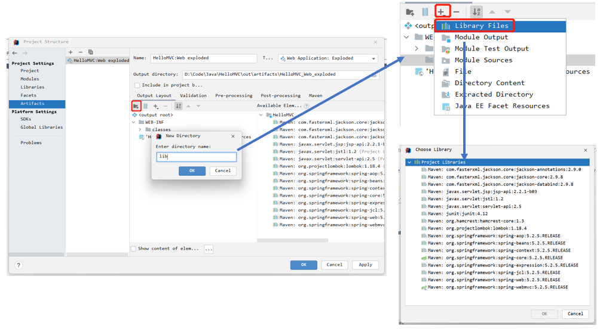
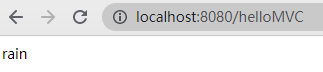
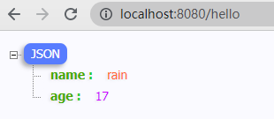
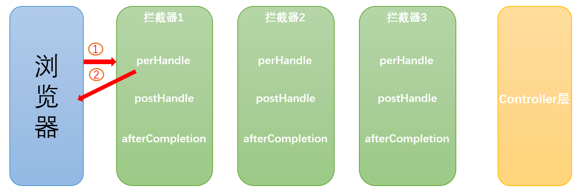
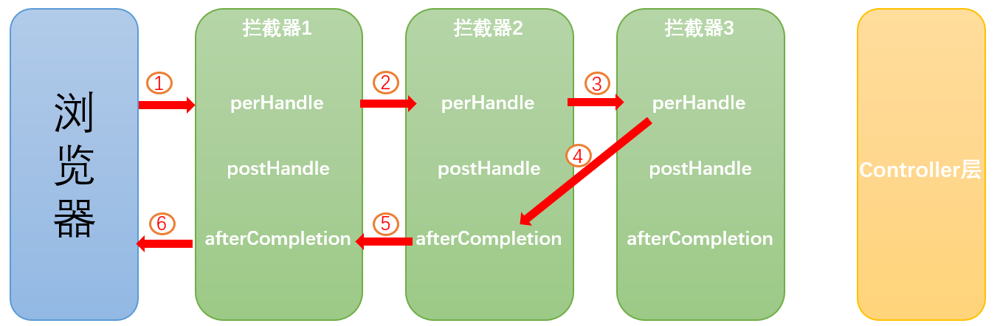

# 概述

## MVC

- MVC是模型(Model)、视图(View)、控制器(Controller)的简写，是一种软件设计规范。
- 是将业务逻辑、数据、显示分离的方法来组织代码。
- MVC主要作用是**降低了视图与业务逻辑间的双向偶合**。
- MVC不是一种设计模式，**MVC是一种架构模式**。当然不同的MVC存在差异。

**Model(模型)：**数据模型，提供要展示的数据，因此包含数据和行为，可以认为是领域模型或JavaBean组件(包含数据和行为)，不过现在一般都分离开来：Value Object(数据Dao) 和 服务层(行为Service)。也就是模型提供了模型数据查询和模型数据的状态更新等功能，包括数据和业务。

**View(视图)：**负责进行模型的展示，JSP、HTML等来进行数据展示

**Controller(控制器)：**接收用户请求，委托给模型进行处理(状态改变)，处理完毕后把返回的模型数据返回给视图，由视图负责展示。也就是说控制器做了个调度员的工作。将`Model` 与 `View`一一对应起来

最典型的MVC就是JSP + servlet + javabean的模式。


## SpringMVC

````xml
<!--springMVC-->
<dependency>
    <groupId>org.springframework</groupId>
    <artifactId>spring-webmvc</artifactId>
    <version>5.2.5.RELEASE</version>
</dependency>
<!--servlet - jsp - jstl-->
<dependency>
    <groupId>javax.servlet</groupId>
    <artifactId>servlet-api</artifactId>
    <version>2.5</version>
</dependency>
<dependency>
    <groupId>javax.servlet.jsp</groupId>
    <artifactId>jsp-api</artifactId>
    <version>2.2.1-b03</version>
</dependency>
<dependency>
    <groupId>javax.servlet</groupId>
    <artifactId>jstl</artifactId>
    <version>1.2</version>
</dependency>

<!--json-->
<dependency>
    <groupId>com.fasterxml.jackson.core</groupId>
    <artifactId>jackson-databind</artifactId>
    <version>2.9.8</version>
</dependency>
````

Spring MVC是Spring Framework的一部分，是基于Java实现MVC的轻量级Web框架。

**组件：**

1. 前端控制器`DispatcherServlet`(不需要程序员开发):Spring的web框架围绕`DispatcherServlet`设计。`DispatcherServlet`的作用是将请求分发到不同的处理器。以请求为驱动, 围绕一个中心Servlet分派请求及提供其他功能**，**`DispatcherServlet`是一个实际的Servlet(它继承自`HttpServlet`基类)。有了`DispatcherServlet`减少了其它组件之间的耦合度。

2. 处理器映射器`HandlerMapping`(不需要程序员开发):根据请求的url查找`Handler`

3. 处理器适配器`HandlerAdapter`:按照特定规则(HandlerAdapter要求的规则)去执行Handler

4. 处理器`Handler`(需要程序员开发)
   注意：编写Handler时按照HandlerAdapter的要求去做，这样适配器才可以去正确执行Handler

5. 视图解析器`View resolver`(不需要程序员开发):进行视图解析，根据逻辑视图名解析成真正的视图

6. 视图`View`(需要程序员开发jsp):一个接口，实现类支持不同的View类型（jsp、freemarker、pdf…）


**执行流程**


1. 用户发送请求至前端控制器DispatcherServlet。
2. DispatcherServlet收到请求调用HandlerMapping处理器映射器。
3. 处理器映射器根据请求url找到具体的处理器，生成处理器对象及处理器拦截器(如果有则生成)一并返回给DispatcherServlet。
4. DispatcherServlet通过HandlerAdapter处理器适配器调用处理器。
5. 执行处理器(Controller层，也叫后端控制器)。
6. Controller执行完成返回数据和视图(ModelAndView)。
7. HandlerAdapter将controller执行结果ModelAndView返回给DispatcherServlet。
8. DispatcherServlet将ModelAndView传给ViewReslover视图解析器。
9. ViewReslover解析后返回具体的View视图(JSP / HTML)。
10. DispatcherServlet对View进行渲染视图(即将模型数据填充至视图中)。
11. DispatcherServlet响应用户，用户看到界面和数据。
    

## 注意事项

在WEB-INF目录下载创建lib文件夹，将jar导入其中




# 案例

**1.web.xml配置**

```xml
<?xml version="1.0" encoding="UTF-8"?>
<web-app xmlns="http://xmlns.jcp.org/xml/ns/javaee"
         xmlns:xsi="http://www.w3.org/2001/XMLSchema-instance"
         xsi:schemaLocation="http://xmlns.jcp.org/xml/ns/javaee http://xmlns.jcp.org/xml/ns/javaee/web-app_4_0.xsd"
         version="4.0">

    <!--1.注册DispatcherServlet-->
    <servlet>
        <servlet-name>springmvc</servlet-name>
        <servlet-class>org.springframework.web.servlet.DispatcherServlet</servlet-class>
        <!--关联一个springmvc的配置文件:【servlet-name】-servlet.xml-->
        <init-param>
            <param-name>contextConfigLocation</param-name>
            <param-value>classpath:springmvc-servlet.xml</param-value>
        </init-param>
        <!--启动级别-1-->
        <load-on-startup>1</load-on-startup>
    </servlet>
    <!--/ 匹配所有的请求；（不包括.jsp）-->
    <!--/* 匹配所有的请求；（包括.jsp）-->
    <servlet-mapping>
        <servlet-name>springmvc</servlet-name>
        <url-pattern>/</url-pattern>
    </servlet-mapping>
</web-app>
```


**2.编写业务代码**

两种实现方式

1. 实现`org.springframework.web.servlet.mvc.Controller`类，并重写`handleRequest()`方法，返回一个`ModelAndView`类

2. 使用`@Controller`

```java
//实现Controller接口
public class HelloMVC implements Controller {
    //重写handleRequest方法
    @Override
    public ModelAndView handleRequest(HttpServletRequest request, HttpServletResponse response){
        //创建一个ModelAmdView方法
        ModelAndView modelAndView = new ModelAndView();
        //封装对象，放在ModelAndView中
        modelAndView.addObject("name","rain");
        //将要跳转的视图，放在ModelAndView中
        modelAndView.setViewName("hello");   //会根据springmvc配置的视图解析器进行拼接
        return modelAndView;   //返回
    }
}
```


**3.springMVC配置文件**

名称为:[springmvcname]-servlet.xml

```xml
<?xml version="1.0" encoding="UTF-8"?>
<beans xmlns="http://www.springframework.org/schema/beans"
       xmlns:xsi="http://www.w3.org/2001/XMLSchema-instance"
       xmlns:mvc="http://www.springframework.org/schema/mvc"
       xsi:schemaLocation="http://www.springframework.org/schema/beans
          http://www.springframework.org/schema/beans/spring-beans.xsd 
          http://www.springframework.org/schema/mvc 
          https://www.springframework.org/schema/mvc/spring-mvc.xsd">

    <!--处理映射器-->
    <bean class="org.springframework.web.servlet.handler.BeanNameUrlHandlerMapping"/>
    <!--处理器适配器-->
    <bean class="org.springframework.web.servlet.mvc.SimpleControllerHandlerAdapter"/>

    <!--视图解析器-->
    <bean class="org.springframework.web.servlet.view.InternalResourceViewResolver" id="internalResourceViewResolver">
        <!--前缀-->
        <property name="prefix" value="/WEB-INF/jsp/"/>
        <!--后缀-->
        <property name="suffix" value=".jsp"/>
    </bean>
    
    <!--将自己的类交给SpringIOC容器，注册bean-->
    <!--浏览器访问localhost/helloMVC会进入HelloMVC类
		必须以/开头
	-->
    <bean id="/helloMVC" class="com.rain.Controller.HelloMVC"/>
</beans>
```

**4.编写带跳转的jsp页面**

```jsp
<%@ page contentType="text/html;charset=UTF-8" language="java" %>
<html>
<head>
    <title>Title</title>
</head>
<body>
    ${name}
</body>
</html>
```

**5.测试**




**执行流程**


# MVC配置

## Web配置

web.xml

```xml
<?xml version="1.0" encoding="UTF-8"?>
<web-app xmlns="http://xmlns.jcp.org/xml/ns/javaee"
         xmlns:xsi="http://www.w3.org/2001/XMLSchema-instance"
         xsi:schemaLocation="http://xmlns.jcp.org/xml/ns/javaee http://xmlns.jcp.org/xml/ns/javaee/web-app_4_0.xsd"
         version="4.0">

    <!--1.注册DispatcherServlet-->
    <servlet>
        <servlet-name>springmvc</servlet-name>
        <servlet-class>org.springframework.web.servlet.DispatcherServlet</servlet-class>
        <!--关联一个springmvc的配置文件:【servlet-name】-servlet.xml-->
        <init-param>
            <param-name>contextConfigLocation</param-name>
            <param-value>classpath:springmvc-servlet.xml</param-value>
        </init-param>
        <!--启动级别-1-->
        <load-on-startup>1</load-on-startup>
    </servlet>
    <!--/ 匹配所有的请求；（不包括.jsp）-->
    <!--/* 匹配所有的请求；（包括.jsp）-->
    <servlet-mapping>
        <servlet-name>springmvc</servlet-name>
        <url-pattern>/</url-pattern>
    </servlet-mapping>
</web-app>
```

### SpringMVC乱码

SpringMVC给我们提供了一个过滤器,可以在web.xml中配置

````xml
<filter>
    <filter-name>encoding</filter-name>
    <filter-class>org.springframework.web.filter.CharacterEncodingFilter</filter-class>
    <init-param>
        <param-name>encoding</param-name>
        <param-value>utf-8</param-value>
    </init-param>
</filter>
<filter-mapping>
    <filter-name>encoding</filter-name>
    <url-pattern>/*</url-pattern>
</filter-mapping>
````


**自定义过滤器解决乱码**

````java
public class EncodingFilter implements Filter {
    @Override
    public void init(FilterConfig filterConfig) throws ServletException {
    }

    @Override
    public void doFilter(ServletRequest servletRequest, ServletResponse servletResponse, FilterChain filterChain) throws IOException, ServletException {
        System.out.println("开始拦截");
        servletRequest.setCharacterEncoding("UTF-8");
        servletResponse.setCharacterEncoding("UTF-8");
        filterChain.doFilter(servletRequest,servletResponse); //必须的一步，没有这一步将无法向下执行
    }

    @Override
    public void destroy() {
    }
}
````

web.xml配置

````xml
<filter>
    <filter-name>encodingfilter</filter-name>
    <filter-class>com.rain.Filter.EncodingFilter</filter-class>
</filter>
<filter-mapping>
    <filter-name>encodingfilter</filter-name>
    <!--<url-pattern>/*</url-pattern> 中的是/*，如果没有*，过滤器将不会生效-->
    <url-pattern>/*</url-pattern>
</filter-mapping>
````


## springMVC配置文件

放在resources目录下:名称为`[springmvcname]-servlet.xml`

````xml
<?xml version="1.0" encoding="UTF-8"?>
<beans xmlns="http://www.springframework.org/schema/beans"
       xmlns:xsi="http://www.w3.org/2001/XMLSchema-instance"
       xmlns:context="http://www.springframework.org/schema/context"
       xmlns:mvc="http://www.springframework.org/schema/mvc"
       xsi:schemaLocation="http://www.springframework.org/schema/beans
          http://www.springframework.org/schema/beans/spring-beans.xsd 
          http://www.springframework.org/schema/context 
          https://www.springframework.org/schema/context/spring-context.xsd 
          http://www.springframework.org/schema/mvc 
          https://www.springframework.org/schema/mvc/spring-mvc.xsd">

    <!--开启组件扫描-->
    <context:component-scan base-package="com.rain"/>
    <!--静态资源过滤-->
    <mvc:default-servlet-handler/>
    <!--
        支持mvc注解驱动
        在spring中一般采用@RequestMapping注解来完成映射关系
        要想使@RequestMapping注解生效
        必须向上下文中注册DefaultAnnotationHandlerMapping
        和一个AnnotationMethodHandlerAdapter实例
        这两个实例分别在类级别和方法级别处理。
        而annotation-driven配置帮助我们自动完成上述两个实例的注入。
    -->
    <mvc:annotation-driven/>
    
    <!--处理映射器-->
    <bean class="org.springframework.web.servlet.handler.BeanNameUrlHandlerMapping"/>
    <!--处理器适配器-->
    <bean class="org.springframework.web.servlet.mvc.SimpleControllerHandlerAdapter"/>

    <!--视图解析器-->
    <bean class="org.springframework.web.servlet.view.InternalResourceViewResolver" id="internalResourceViewResolver">
        <property name="prefix" value="/WEB-INF/jsp/"/>
        <property name="suffix" value=".jsp"/>
    </bean>
    <bean id="/helloMVC" class="com.rain.Controller.HelloMVC"/>


    <!--JSON乱码解析,需要导入jackson-->
    <mvc:annotation-driven>
        <mvc:message-converters register-defaults="true">
            <bean class="org.springframework.http.converter.StringHttpMessageConverter">
                <constructor-arg value="UTF-8"/>
            </bean>
            <bean class="org.springframework.http.converter.json.MappingJackson2HttpMessageConverter">
                <property name="objectMapper">
                    <bean class="org.springframework.http.converter.json.Jackson2ObjectMapperFactoryBean">
                        <property name="failOnEmptyBeans" value="false"/>
                    </bean>
                </property>
            </bean>
        </mvc:message-converters>
    </mvc:annotation-driven>
</beans>
````

### 常规配置

**开启包扫描**

````xml
<context:component-scan base-package="com.rain"/>
````

**处理器映射器与处理器适配器**

方式1(不推荐)

```xml
<bean class="org.springframework.web.servlet.handler.BeanNameUrlHandlerMapping"/>
```

```xml
<bean class="org.springframework.web.servlet.mvc.SimpleControllerHandlerAdapter"/>
```

方式2(推荐)

```xml
<mvc:annotation-driven/>
```

**视图解析器**

```xml
<bean class="org.springframework.web.servlet.view.InternalResourceViewResolver" id="internalResourceViewResolver">
    <property name="prefix" value="/WEB-INF/jsp/"/>    //前缀
    <property name="suffix" value=".jsp"/>             //后缀
</bean>
```


### 静态资源过滤

注意配置`DispatcherServlet`时`url-pattern`中的路径为/，表示所有的请求都要经`DispatcherServlet`截获，并且经处理器处理后在`Controller`中执行路径对应的方法；但是诸如媒体资源、JS文件、CSS文件等也带有路径的资源也会被当做请求路径处理，然而我们并没有在Controller中设置路径。因此我们需要将媒体资源、JS文件、CSS文件等静态资源过滤掉。

方式一：在springmvc-servlet.xml配置文件中添加

````xml
<mvc:default-servlet-handler/>
````

方法二：在web.xml中添加

````xml
<!--过滤静态资源 
	这里的uer-pattern可设置多个，每个对应一个格式的静态资源
-->                         
<servlet-mapping>                       
    <servlet-name>default</servlet-name>
    <url-pattern>*.jpg</url-pattern>    
</servlet-mapping> 
````


### Maven过滤问题

````xml
<!--在pom.xml中配置-->
<build>
   <resources>
       <resource>
           <directory>src/main/java</directory>
           <includes>
               <include>**/*.properties</include>
               <include>**/*.xml</include>
           </includes>
           <filtering>false</filtering>
       </resource>
       <resource>
           <directory>src/main/resources</directory>
           <includes>
               <include>**/*.properties</include>
               <include>**/*.xml</include>
           </includes>
           <filtering>false</filtering>
       </resource>
   </resources>
</build>
````


### JSON乱码

我们可以在springmvc的配置文件上添加一段消息`StringHttpMessageConverter`转换配置！可以解决GSON,JACKSON,FASTJSON的乱码，但**必须导入Jackson的包**

````xml
<mvc:annotation-driven>
    <mvc:message-converters register-defaults="true">
        <bean class="org.springframework.http.converter.StringHttpMessageConverter">
            <constructor-arg value="UTF-8"/>
        </bean>
        <bean class="org.springframework.http.converter.json.MappingJackson2HttpMessageConverter">
            <property name="objectMapper">
                <bean class="org.springframework.http.converter.json.Jackson2ObjectMapperFactoryBean">
                    <property name="failOnEmptyBeans" value="false"/>
                </bean>
            </property>
        </bean>
    </mvc:message-converters>
</mvc:annotation-driven>
````


**/ 和 /\* 的区别：**

`<url-pattern> / </url-pattern>` 不会匹配到.jsp，只针对我们编写的请求；即：.jsp不会进入spring的 DispatcherServlet类。

`<url-pattern> /* </url-pattern>` 会匹配*.jsp，会出现返回jsp视图时再次进入spring的DispatcherServlet 类，导致找不到对应的controller所以报404错。


# 创建MVC方法

**控制器Controller**

- 控制器复杂提供访问应用程序的行为，通常通过接口定义或注解定义两种方法实现。
- 控制器负责解析用户的请求并将其转换为一个模型。
- 在Spring MVC中，一个控制器类可以包含多个方法
- 在Spring MVC中，对于Controller的配置方式有很多种


## 通过Controller接口

`Controller`是一个接口，在`org.springframework.web.servlet.mvc`包下，接口中只有一个方法；

我们只需要实现`Controller`接口，并从写`handleReuquest`方法。

```java
public class HelloMVC implements Controller {
    @Override
    public ModelAndView handleRequest(HttpServletRequest request, HttpServletResponse response){
        ModelAndView modelAndView = new ModelAndView();
        modelAndView.addObject("name","rain");
        modelAndView.setViewName("hello");   //指向hello页面
        return modelAndView;
    }
}
```

配置bean

```xml
<bean id="/helloMVC" class="com.rain.Controller.HelloMVC"/>
```

**缺点**

- 一个控制器中只有一个方法，如果要多个方法则需要定义多个`Controller`；定义的方式比较麻烦；


## 通过注解

> **@Controller**

@Controller注解类型用于声明Spring类的实例是一个控制器(IOC中还有3个相同的注解)；

Spring可以使用扫描机制来找到应用程序中所有基于注解的控制器类，为了保证Spring能找到你的控制器，需要在配置文件中声明组件扫描。

````xml
<!-- 自动扫描指定的包，下面所有注解类交给IOC容器管理 -->
<context:component-scan base-package="包名"/>
````


> **@RequestMapping**

`@RequestMapping`注解用于映射url到控制器类或一个特定的处理程序方法。可用于类或方法上。用于类上，表示类中的所有响应请求的方法都是以该地址作为父路径。

可以使用method属性指定请求类型(GET,PUT,POST,DELETE以及PATCH)

```java
@RequestMapping(value = "/hello",method = {RequestMethod.GET})
```

可以指定多个url，访问同一个方法

````java
@RequestMapping(value = {"/hello","/test"})   //访问/hello和/test都能进入此方法
````


**@RequestMapping的变体**

@GetMapping:代替了`@RequestMapping(method = {RequestMethod.GET})`

@PostMapping

@PutMapping

@DeleteMapping

@PatchMapping

```java
@Controller
//@RequestMapping("/mvc")  父路径
public class hello {
    //当访问localhost/hello时，跳转到/WEB-INF/hello.jsp
    //映射访问路径
    @RequestMapping("/hello")
    public String hello(Model model) throws IOException {
        model.addAttribute("name","rain");
        //返回视图位置
        return "hello";
    }
}
```


> **@RequestParam**

接收前端URL中的Key=value的形式

作用：把请求中的指定名称的参数传递给控制器中的形参赋值。

属性：

* value：请求参数中的名称。
* required：请求参数中是否必须提供此参数，默认值是true，必须提供。

```java
@RequestMapping(value = "/hello")
public String test(@RequestParam("name") String name){
    System.out.println(name);
    return "hello";
}
//http://localhost:8080/hello?name=rain
```


> **@RequestBody**

[@RequestBody的使用](https://blog.csdn.net/justry_deng/article/details/80972817)、[报错1](https://blog.csdn.net/bobozai86/article/details/103830284)、[报错2](https://blog.csdn.net/qq_22339269/article/details/85795678)

`@RequestBody`主要用来接收前端传递给后端的json字符串中的数据(**请求体**中的数据)；所以大部分接收的是**POST**请求(GET请求没有请求体)

在后端的同一个接收方法里，`@RequestBody`与`@RequestParam()`可以同时使用，`@RequestBody`最多只能有一个，而`@RequestParam()`可以有多个。(`RequestBody`接收请求体里面的数据；而`RequestParam`接收`key-value`里面的参数)

* 前端以`Content-Type:application/json`(表明是json字符串)传入后台的话，那么后台要用`@RequestBody`才能接收到；
* 前端以`Contenttype:application/x-www-form-urlencoded`(以`url?key=value`的形式)，那么后台接收前台传过来的参数时，要用`@RequestParam`来接收，或则形参前什么也不写也能接收。

```java
public class User implements Serializable {
    public String name;
    private int password;
}
```

```jsp
<script src="http://code.jquery.com/jquery-latest.js"></script>
<script type="text/javascript">
    $(function (){
        $("button").click(function (){
            $.ajax({
                type:'POST',                           //post请求
                url:'http://localhost:8080/login',
                dataType:'json',                       //json格式
                contentType:'application/json',        //json字符串格式
                /*  当AJAX设置了application/json时(表明以json字符串格式发送)
                	则发送的json对象必须要使用JSON.stringify进行序列化成字符串才能和设定的类型匹配
                	data:{name:"rain",password:123456}这种格式不是json字符串，所以应当使用下面这种格式
                */
                data:'{"name":"rain","password":123456}', 
                success:function (data){
                    alert(data)
                }
            });
        })
    })
</script>
```

@RequestBody以String接收前端json数据

```java
@RequestMapping(value = "/login",method = RequestMethod.POST)
@ResponseBody
public String login(@RequestBody String user){
    System.out.println(user);
    return "登录成功";
}
```

@RequestBody以JavaBean接收前端json数据

```java
@PostMapping("/login")
public String login(@RequestBody User user){
    System.out.println(user.toString());
    return "登录成功";
}
```

@RequestBody与简单的@RequestParam()同时使用

```jsp
<script type="text/javascript">
    $(function (){
        $("button").click(function (){
            $.ajax({
                type:'POST',
                url:'http://localhost:8080/login?token=vip',   //模拟key-value参数
                dataType:'json',
                contentType:'application/json',
                data:'{"name":"rain","password":123456}',
                success:function (data){
                    alert(data)
                }
            });
        })
    })
</script>
```

```java
@PostMapping("/login")
@ResponseBody
//@RequestBody接收前端请求提中的参数，@RequestParam接收url中的参数
public String login(@RequestBody User user,@RequestParam("token") String token){
    System.out.println(user.toString());
    System.out.println(token);
    return "登录成功";
}
```


> **@ResponseBody注解**

被`@ResponseBody`注解后不经过视图解析器(不进行拼接，直接以json等类型响应给前端)，可以返回任何数据类型（Object）,多数返回的是string字符串（常用于json的传递）

```java
@RequestMapping(value = "/hello")
public @ResponseBody User test() {
    User rain = new User("rain", 17);
    return rain;
}
```



> **@RestController注解**

`@RestController`注解在类上相当于`@Controlle`r + `@ResponseBody`，所有返回都是json字符串


> **@PathVariable 注解**

get请求中使用，接收Key=value的形式

作用：用于绑定url中的占位符。例如：url中有/select/{id}，{id}就是占位符。

url支持占位符是springmvc支持rest风格URL的一个重要标志。

属性：

- `value`：指定url中的占位符名称。

```java
@RequestMapping(value = "/select/{id}")
public String selectById(Model model,@PathVariable int id) {
    if(id == 1){
        model.addAttribute("msg","用户名:rain");
    }else {
        model.addAttribute("msg","没有ID为1的用户");
    }
    return "select";
}
```


> **@RequestHeader**

作用：获取指定请求头的值.

属性：`value`：请求头的名称。

```java
//获取accept的请求头
@RequestMapping("/header")
@ResponseBody
public String header(@RequestHeader("accept") String header){
    return "accept：" + header;
}
```


> **@RequestAttribute**

作用：获取request请求域中的值


> **@CookieValue**

作用：用于获取指定cookie的名称的值。

```java
//获取名为JSESSIONID的cookie的值
@RequestMapping("/cookie")
@ResponseBody
public String cookie(@CookieValue("JSESSIONID") String cookie){
    return "JSESSIONID：" + cookie;
}
```


> **@SessionAttributes 和 @SessionAttribute**

**@SessionAttributes** 

@sessionattributes注解应用到Controller**类**上面，可以将Model中的属性同步到session当中；默认情况下Spring MVC将模型中的数据存储到request域中。当一个请求结束后，数据就失效了。如果要跨页面使用。那么需要使用到session。而@SessionAttributes注解就可以使得模型中的数据存储一份到session域中。
参数：

* names：里面应写需要存储到session中数据的名称
* types：根据指定参数的类型，将模型中对应类型的参数存储到session中
* value：与names相同

`@SessionAttributes(types={User.class, Account.class})` 会将model中所有类型为User和Account的属性添加到session作用域中。

`@SessionAttributes(value={"name", "age"})` 会将model中属性名为name和age的属性添加到session作用域中。

可以调用`SessionStatus.setComplete()`来清除使用`SessionAttributes`注解存储的session，不会清除原生`Session`中的参数。


**@SessionAttribute：**

SpringMVC为了方便读取session数据设置的注解。标注在方法的参数上，读取**session**中的数据。可以读取`@SessionAttributes`中存的数据，也可以读取`HttpSession.setAttribute()`存的数据。当然使用原生的`session.getAttribute`也可以读取session

```java
@Controller
//将名字为name和类型为User的内容存储到session域中
@SessionAttributes(names = {"name"},types = {User.class}) 
public class MySession {
    @RequestMapping("/session1")
    //@ResponseBody         //不能使用@ResponseBody注解
    public String session1(Model model,HttpSession session){
        model.addAttribute("name","rain");      //使用SessionAttributes注解存储
        session.setAttribute("age",25);         //使用原生Session
        
        model.addAttribute("user",new User("twistzz",21));
        return "success";
    }

    @RequestMapping("/session2")
    @ResponseBody
    public String session2(@SessionAttribute("name") String name,
    @SessionAttribute("age") String age,@SessionAttribute("user") User user){
        System.out.println(name);
        System.out.println(age);
        System.out.println(user.toString());
        return "success";
    }
    
    @RequestMapping("/delsession")
    @ResponseBody
    public String delSession(SessionStatus status){
        status.setComplete();        //删除使用SessionAttributes注解存储的session
        return "删除成功success";
    }
    
    @RequestMapping("/session3")
    @ResponseBody
    public String Session3(@SessionAttribute("age") int age){  //单独查询原生Session中的数据
        System.out.println(age);
        return age +"";
    }
}
```

先访问/session1存储session

再访问/session2查询成功

访问/delsession 删除使用SessionAttributes注解存储的session

再次访问/session2查询失败(因为没有name和User)

而访问/session3成功


<font color=red>注：</font>使用`@ResponseBody`注解，方法return之后是把json字符串响应到页面的，没有进行转发或者重定向，会导致springmvc无法创建session来存储model里面的数据(即没有存放进session)

解决办法：`public String session1(HttpSession session)`直接使用HttpSession


> **@ModelAttribute**

- 出现在方法上：表示当前方法会在控制器方法执行前先执行。
- 出现在参数上：获取指定的数据给参数赋值(没什么用)。
- 用途：当提交表单数据不是完整的实体数据时，保证没有提交的字段使用数据库原来的数据。
- 如果所在方法有返回值，那么直接返回，如果没有，需要提供一个map集合，先将数据存入map集合。

````java
public class User {
    public int id;
    public String name;
}
````

```jsp
<form action="selectUser" method="get">
    用户名:<input type="text" name="name"> <br>       <!--没有id属性-->
    <input type="submit">
</form>
```

```java
@ModelAttribute
public void ModelAttributeTest(Model model){
    System.out.println("ModelAttribute execute");
    User user = new User();
    user.setId(1);                        //添加id属性
    model.addAttribute("user",user);
}
@RequestMapping("/selectUser")
@ResponseBody
public String selectUser(User user){
    System.out.println(user.toString());
    return "";
}
```


# RestFul 

**概念**

Restful就是一个资源定位及资源操作的风格。不是标准也不是协议，只是一种风格。基于这个风格设计的软件可以更简洁，更有层次，更易于实现缓存等机制。

**功能**

资源：互联网所有的事物都可以被抽象为资源

资源操作：使用POST、DELETE、PUT、GET，使用不同方法对资源进行操作。

分别对应 添加、 删除、修改、查询。

| **http方法** | **资源操作** | **幂等** | **安全** |
| ------------ | ------------ | -------- | -------- |
| GET          | SELECT       | 是       | 是       |
| POST         | INSERT       | 否       | 否       |
| PUT          | UPDATE       | 是       | 否       |
| DELETE       | DELETE       | 是       | 否       |

**传统方式操作资源**：通过不同的参数来实现不同的效果！方法单一，post 和 get

````txt
http://127.0.0.1/item/queryItem.action?id=1 查询,GET
http://127.0.0.1/item/saveItem.action 新增,POST
http://127.0.0.1/item/updateItem.action 更新,POST
http://127.0.0.1/item/deleteItem.action?id=1 删除,GET或POST
````

**使用RESTful操作资源**：可以通过不同的请求方式来实现不同的效果！如下：请求地址一样，但是功能可以不同！

````txt
http://127.0.0.1/item/1 查询,GET
http://127.0.0.1/item 新增,POST
http://127.0.0.1/item 更新,PUT
http://127.0.0.1/item/1 删除,DELETE
````

```java
//当使用GET方式访问localhost/user/1时访问select方法
//当使用PUT方式访问localhost/user/1时访问delect方法
//当使用POST方式访问localhost/user?name=rain时访问save方法
@RequestMapping(value = "/user/{id}",method = RequestMethod.GET)
public String select(Model model,@PathVariable int id){
    if(id == 1){
        model.addAttribute("msg","用户名:rain");
    }else {
        model.addAttribute("msg","没有ID为1的用户");
    }
    return "user";
}

@RequestMapping(value = "/user/{id}",method = RequestMethod.PUT)
public String update(Model model,@PathVariable int id){
    model.addAttribute("msg",id + " 用户已更新");
    return "user";
}

@RequestMapping(value = "/user",method = RequestMethod.POST)
public String save(Model model,String name){
    model.addAttribute("msg",name + "用户以储存");
    return "user";
}

```


# 数据处理

## 参数绑定

> **基本数据类型**

提交的域名称和处理方法的参数名一致

```java
//http://localhost:8080/hello?name=rain
@RequestMapping(value = "/hello")
public String test(String name){
    System.out.println(name);
    return "hello";
}
```

提交的域名称和处理方法的参数名不一致，使用`@RequestParam`注解

`@RequestParam`参数

* value:指定名称
* reqyired：是否必须含有此参数，默认true(必须拥有)

```java
//http://localhost:8080/hello?username=rain
@RequestMapping(value = "/hello")
public String test(@RequestParam("username") String name){
    System.out.println(name);
    return "hello";
}
```


> **JavaBean类型**

前端提交的表单项必须与对象属性一致，SpringMVC自动封装

```java
public class User {
    public String name;
    public int age;
}
```

```java
//http://localhost:8080/hello?name=rain&age=2
@RequestMapping(value = "/hello")
public String test(User user){
    System.out.println(user);
    return "hello";
}
```

如果没有此属性将添加null


**对象中包含其他类型引用**

如果一个JavaBean类中包含其他的引用类型，那么表单的name属性需要编写成：`对象.属性`

```java
public class Account {
    private int id;
    private int money;
}

public class User {
    public String name;
    public int age;
    public Account account;     //Account类型
}

//http://localhost:8080/hello?name=rain&age=2&account.id=1&account.money=3000
@RequestMapping(value = "/hello")
public String test(User user){
    System.out.println(user);
    return "hello";
}
```


> **集合类型**

在jsp页面中的表单name里面写list[index].属性（index为集合下标）

```java
public class User {
    public String name;
    public int age;
    public List<String> list;
    //public Account account;
}

@RequestMapping(value = "/hello")
public String test(User user){
    System.out.println(user);
    return "hello";
}
```

```html
<form action="hello" method="post">
    <input type="text" name="name">
    <input type="text" name="age">
    <input type="text" name="list[0]">
    <input type="text" name="list[1]">
    <input type="submit">
</form>
```


## 回传数据

> 通过ModelAndView

```java
public class HelloMVC implements Controller {
    @Override
    public ModelAndView handleRequest(HttpServletRequest request, HttpServletResponse response){
        ModelAndView modelAndView = new ModelAndView();
        modelAndView.addObject("name","rain");
        modelAndView.setViewName("hello");
        return modelAndView;
    }
}
```

ModelAndView 可以在储存数据的同时，可以进行设置返回的逻辑视图，进行控制展示层的跳转。

> 通过ModelMap

````java
@RequestMapping("/hello")
public String hello(ModelMap model){
    //封装要显示到视图中的数据
    //相当于req.setAttribute("name","rain");
    model.addAttribute("name","rain";
    return "hello";
}
````

ModelMap 继承了 LinkedMap ，除了实现了自身的一些方法，同样的继承 LinkedMap 的方法和特性；


> 通过Model

```java
@RequestMapping("/hello")
public String hello(Model model) {
    model.addAttribute("name","rain");
    return "hello";
}
```

Model 只有寥寥几个方法只适合用于储存数据，简化了新手对于Model对象的操作和理解；


## 回传JSON

> **@ResponseBody注解**

被`@ResponseBody`注解后不经过视图解析器(直接响应给前端)，可以返回任何数据类型（Object）,多数返回的是string字符串（常用于json的传递）

```java
@RequestMapping(value = "/hello")
public @ResponseBody User test() {
    User rain = new User("rain", 17);
    return rain;
}
```


除了这种方法，我们还可以使用众多JSON解析器，将JavaBean转换为json字符串，并以string类型返回

常见的解析器：Jsonlib，Gson，fastjson，Jackson。


**以jackson为例**

引入maven依赖

```xml
<dependency>
    <groupId>com.fasterxml.jackson.core</groupId>
    <artifactId>jackson-databind</artifactId>
    <version>2.9.8</version>
</dependency>
```

```java
@RequestMapping(value = "/hello")
@ResponseBody
public String test() throws JsonProcessingException {
    User rain = new User("rain", 17);
    
    //ObjectMapper是Jackson的核心对象
    ObjectMapper mapper = new ObjectMapper();
    //JavaBean  ---> json字符串
    String json = mapper.writeValueAsString(rain);
    return json;   //输出到前端
}
```

详细使用方法，见JSON笔记

**json乱码解决：** 见SpringMVC配置 


# 转发与重定向

> **方式1.利用ServletAPI**

因为`DispatcherServlet`间接实现`Servlet`，所以同样可以使用`HttpServlet`

````java
@Controller
public class ResultGo {
    @RequestMapping("/result/t1")
    public void test1(HttpServletRequest req, HttpServletResponse rsp) throws IOException {
        rsp.getWriter().println("Hello,Spring BY servlet API");  //直接输出
    }

    @RequestMapping("/result/t2")
    public void test2(HttpServletRequest req, HttpServletResponse rsp) throws IOException {
        rsp.sendRedirect("/index.jsp");                          //重定想
    }

    @RequestMapping("/result/t3")
    public void test3(HttpServletRequest req, HttpServletResponse rsp) throws Exception {
        //转发
        req.setAttribute("msg","/result/t3");
        req.getRequestDispatcher("/WEB-INF/jsp/test.jsp").forward(req,rsp);
    }
}
````


> **方式2.使用ModelAndView**

设置ModelAndView对象,根据view的名称,和视图解析器跳到指定的页面

页面:{视图解析器前缀} + viewName + {视图解析器后缀}

````xml
<!--视图解析器-->
<bean class="org.springframework.web.servlet.view.InternalResourceViewResolver" id="internalResourceViewResolver">
    <property name="prefix" value="/WEB-INF/jsp/"/>
    <property name="suffix" value=".jsp"/>
</bean>
````

```java
public class HelloMVC implements Controller {
    @Override
    public ModelAndView handleRequest(HttpServletRequest request, HttpServletResponse response){
        ModelAndView modelAndView = new ModelAndView();
        modelAndView.addObject("name","rain");
        modelAndView.setViewName("hello");       //转发到/WEB-INF/hello.jsp
        return modelAndView;
    }
}
```


> **方式3.SpringMVC重定向与转发**

关键字

* forward  转发（不声明默认为转发）
* redirect 重定向

````java
@Controller
public class ResultSpringMVC {
    @RequestMapping("/rsm/t1")
    public String test1(){
        //转发
        return "/index.jsp";
    }

    @RequestMapping("/rsm/t2")
    public String test2(){
        //转发二
        return "forward:/WEB-INF/jsp/test.jsp";
    }

    @RequestMapping("/rsm/t3")
    public String test3(){
        //重定向
        return "redirect:/index.jsp";
    }
}
````


# 拦截器

SpringMVC的处理器拦截器(Interceptor)类似于Servlet开发中的过滤器Filter,用于对处理器进行预处理和后处理。开发者可以自己定义一些拦截器来实现特定的功能。

**过滤器与拦截器的区别：**

* 过滤器

  - servlet规范中的一部分，任何java web工程都可以使用

  - 在`url-pattern`中配置了`/*`之后，可以对所有要访问的资源进行拦截
  - 主要用于实现编码过滤，进行统一编码，防止乱码。

* 拦截器(AOP思想)

  - 拦截器是SpringMVC框架自己的，只有使用了SpringMVC框架的工程才能使用

  - 拦截器只会拦截访问`Controller`控制器的方法（如`RequestMapping`），一般用于拦截`Controller`层，满足条件才放行，如果访问的是jsp/html/css/image/js是不会进行拦截的（控制器中的return不会拦截）
  - 主要用于实现权限分配，不满足条件不能访问一些界面（比如登录才能进入）。

注意:一般请求都是先通过过滤器`filter`过滤，才会被拦截器`interceptor`处理，决定是否放行，两个过程有任何一个不放行，都不能访问到`Controller`层方法。


**创建拦截器**

1. 实现`HandlerInterceptor`接口，重写接口中的`preHandle`，`postHandleafter`，`afterCompletion`方法

- `preHandle`：在访问controller方法之前执行。可以使用request或者response跳转到指定的页面(主要做权限控制，有权限才放行)

  - `return true`放行，执行下一个拦截器，如果没有拦截器，执行controller中的方法。

  - `return false`不放行，不会执行controller中的方法

    

- `postHandle`：在执行controller方法之后，执行jsp页面之前执行该方法。可以向作用域中放入数据，影响jsp展示效果。可以使用request或者response跳转到指定的页面。如果指定了跳转的页面，那么controller方法跳转的页面将不会显示(可以在执行jsp之前做渲染)

- `postHandle`：在jsp页面渲染完成之后执行(主要用于记录日志，资源释放)


2. springMVC配置文件中添加拦截配置

   ````xml
   <mvc:interceptors>
       <mvc:interceptor>
           <!--/** 包括路径及其子路径-->
           <!--/admin/* 拦截的是/admin/add等等这种, /admin/add/user不会被拦截-->
           <!--/admin/** 拦截的是/admin/下的所有-->
           <!--/**/main 拦截的是所有main-->
           <mvc:mapping path="/**"/>
           <!--bean配置拦截器位置-->
           <bean class="com.rain.interceptor.MyInterceptor"/>
       </mvc:interceptor>
       <!--配置多个拦截器-->
   	<mvc:interceptor>
       </mvc:interceptor>
   </mvc:interceptors>
   ````


**测试**

```java
public class MyInterceptor implements HandlerInterceptor {
    @Override
    public boolean preHandle(HttpServletRequest request, HttpServletResponse response, Object handler) throws Exception {
        System.out.println("------------preHandle-----------");
        return true;
    }

    @Override
    public void postHandle(HttpServletRequest request, HttpServletResponse response, Object handler, ModelAndView modelAndView) throws Exception {
        System.out.println("------------postHandle-----------");
    }

    @Override
    public void afterCompletion(HttpServletRequest request, HttpServletResponse response, Object handler, Exception ex) throws Exception {
        System.out.println("------------afterCompletion-----------");
    }
}
```

```xml
<mvc:interceptors>
    <mvc:interceptor>
        <mvc:mapping path="/**"/>
        <bean class="com.rain.Interceptor.MyInterceptor"/>
    </mvc:interceptor>
</mvc:interceptors>
```


**多个拦截器执行顺序**

所有拦截器都通过,执行顺序：(preHandle`顺序执行，`postHandler`逆序执行，最后再`afterCompletion`逆序执行)


拦截器1拦截，那么后面的拦截器也不执行，直接原路打回。



拦截器3拦截，那么也不执行controller方法，大概是这样的。




# 文件上传

springMVC提供了很好的文件上传服务，但是SpringMVC上下文中默认没有装配`MultipartResolver`，因此默认情况下其不能处理文件上传工作。如果想使用Spring的文件上传功能，则需要在上下文中配置`MultipartResolver`。

前端表单要求：为了能上传文件，必须将表单的method设置为POST，并将enctype设置为`multipart/form-data`。只有在这样的情况下，浏览器才会把用户选择的文件以二进制数据发送给服务器；

**对表单中的 enctype 属性做个详细的说明：**

- `application/x-www=form-urlencoded`：默认方式，只处理表单域中的value属性值，采用这种编码方式的表单会将表单域中的值处理成URL编码方式。
- `multipart/form-data`：这种编码方式会以二进制流的方式来处理表单数据，这种编码方式会把文件域指定文件的内容也封装到请求参数中，不会对字符编码。
- `text/plain`：除了把空格转换为"+"号外，其他字符都不做编码处理，这种方式适用直接通过表单发送邮件。


**maven**

````xml
<!--文件上传-->
<dependency>
    <groupId>commons-fileupload</groupId>
    <artifactId>commons-fileupload</artifactId>
    <version>1.3.3</version>
</dependency>
````


**springMVC配置**

SpringMVC使用`MultipartFile`类来进行文件上传，所以我们首先要配置MultipartResolver:用于处理表单中的file

id固定为multipartResolver

````xml
<!--文件上传配置-->
<bean id="multipartResolver"  class="org.springframework.web.multipart.commons.CommonsMultipartResolver">
    <!-- 请求的编码格式，必须和jSP的pageEncoding属性一致，以便正确读取表单的内容，默认为ISO-8859-1 -->
    <property name="defaultEncoding" value="utf-8"/>
    <!-- 上传文件大小上限，单位为字节（10485760=10M） -->
    <property name="maxUploadSize" value="10485760"/>
    <property name="maxInMemorySize" value="40960"/>
</bean>
````

使用`MultipartFile.transferTo(new File(path))`保存文件

| 方法                  | 描述                                                         |
| --------------------- | ------------------------------------------------------------ |
| getName()             | 获取前后端约定的传入文件的参数的名称，在SpringBoot后台中则是通过@Param("uploadFile") 注解定义的内容。 |
| getOriginalFileName() | 获取文件的完整名称，包括文件名称+文件拓展名。                |
| getContentType()      | 获取文件的类型，注意是文件的类型，不是文件的拓展名。         |
| isEmpty()             | 判断传入的文件是否为空，如果为空则表示没有传入任何文件。     |
| getSize()             | 获取文件的大小，单位是字节。                                 |
| getBytes()            | 将文件转换成一种字节数组的方式进行传输，会抛出IOException异常。 |
| getInputStream()      | 将文件转换成输入流的形式来传输文件，会抛出IOException异常。  |
| transferTo()          | 用来将接收文件传输到给定目标路径，会抛出IOException、IllegalStateException异常。该方法在实际项目开发中使用较少。 |


## 单文件上传

```jsp
<body>
    <FORM method="post" action="fileUpload" enctype="multipart/form-data">
        选择文件：<input type="file" name="file">
        <input type="submit">
    </FORM>
</body>
```

```java
@PostMapping("/fileUpload")
@ResponseBody//返回字符串给前端
public String upload(@RequestParam("file") MultipartFile file, HttpServletRequest request){
    if(!file.isEmpty()){
        String path = request.getSession().getServletContext()
            .getRealPath("/") + file.getOriginalFilename();        //获得储存的路径
        try {
            file.transferTo(new File(path));  //储存
            System.out.println("上传成功");
        } catch (IOException e) {
            throw new RuntimeException(e);
        }
        return "上传成功";
    }
    return "上传失败";
}
```


## 多文件上传

```jsp
<FORM method="post" action="batchFileUpload" enctype="multipart/form-data">
    选择文件1：<input type="file" name="file"><br>
    选择文件2：<input type="file" name="file"><br>
    选择文件3：<input type="file" name="file"><br>
    选择文件4：<input type="file" name="file"><br>
    <input type="submit">
</FORM>
```

```java
@PostMapping("/batchFileUpload")
@ResponseBody//返回字符串给前端
public String batchUpload(@RequestParam("file") MultipartFile[] files, HttpServletRequest request){
    
    if (files.length > 0) {
        for (MultipartFile file:files){
            if(!file.isEmpty()){
                String path = request.getSession().getServletContext()
                    .getRealPath("/") + file.getOriginalFilename();
                try {
                    file.transferTo(new File(path));
                    System.out.println("上传成功");
                } catch (IOException e) {
                    throw new RuntimeException(e);
                }

            }
        }
        return "上传成功";
    }else {
        return "没有文件";
    }
}
```


# 异常

系统的 dao、service、controller出现异常都会通过 `throws Exception`向上抛出，最后由 Spring MVC前端控制器交由异常处理器进行异常处理。

springmvc提供一个`HandlerExceptionResolver`接口，用于处理异常

**自定义异常类**

```java
public class myException extends Exception{
    public String message;

    public myException(String message) {
        super(message);
        this.message = message;
    }
    public String getMessage(){
        return message;
    }
    public void setMessage(String message){
        this.message = message;
    }
}
```

**全局异常处理器**

```java
public class ResolverException implements HandlerExceptionResolver {
    @Override
    public ModelAndView resolveException(HttpServletRequest httpServletRequest, HttpServletResponse httpServletResponse, Object o, Exception e) {
        myException ex;
        if(e instanceof myException){
            ex = (myException)e;
        }else {
            ex = new myException("未知异常");
        }
        ModelAndView modelAndView = new ModelAndView();
        modelAndView.addObject("msg", ex.getMessage());

        modelAndView.setViewName("error");        //指向错误页面
        return modelAndView;
    }
}
```

**配置异常**

```xml
<bean class="com.rain.EX.ResolverException"></bean>
```

**错误页面**

```jsp
<%@ page contentType="text/html;charset=UTF-8" language="java" %>
<html>
<head>
    <title>错误</title>
</head>
<body>
    ${msg}
</body>
</html>
```

**异常测试**

```java
@RequestMapping("/ex")
@ResponseBody
public String ex() throws myException {
    try {
        int i = 1 / 0;
    }catch (Exception e){
        e.printStackTrace();
        throw new myException("出现异常");
    }
    return "success";
}
```
