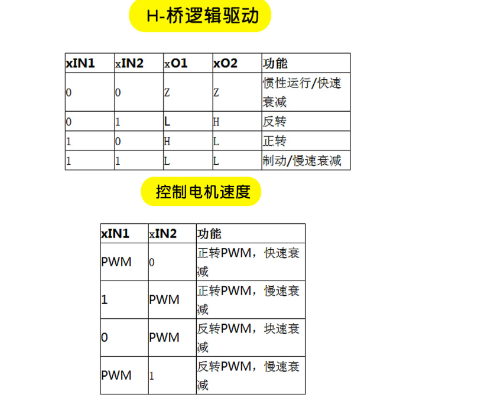

# 370电机

| 颜色 | 功能                            |
| ---- | ------------------------------- |
| 红色 | 电机电源+                       |
| 黑线 | 编码器 电源- GND                |
| 黄线 | 信号线 电机一圈11个脉冲         |
| 绿线 | 信号线 分辨率11*减速比 = 分辨率 |
| 蓝线 | 编码器 电源+ 3.3V               |
| 白线 | 电机电源-                       |

**6根线的作用**

* 红白线控制正反转和速度
* 中间四根线是控制编码器，用于测速，和直流电机本身没有联系。

一圈44个count值

|    引脚号    | 主功能     |              默认复用功能               |           重定义功能           |
| :----------: | :--------- | :-------------------------------------: | :----------------------------: |
|      1       | VBAT       |                                         |                                |
|      2       | PC13       |               TAMPER-RTC                |                                |
|      3       | PC14       |                OSC32_IN                 |                                |
|      4       | PC15       |                OSC32_OUT                |                                |
|      5       | OSC_IN     |                                         |                                |
|      6       | OSC_OUT    |                                         |                                |
|      7       | NRST       |                                         |                                |
|      8       | VSSA       |                                         |                                |
|      9       | VDDA       |                                         |                                |
| 电机1信号线  | PA0        | WKUP/USART2_CTS/ADC12_IN0/TIM2_CH1_ETR  |                                |
| 电机1信号线  | PA1        |      USART2_RTS/ADC12_IN1/TIM2_CH2      |                                |
| //改电机2PWM | PA2        |      USART2_TX/ADC12_IN2/TIM2_CH3       |                                |
| 软件电机1PWM | PA3        |      USART2_RX/ADC12_IN3/TIM2_CH4       |                                |
| 软件电机2PWM | PA4        |      SPI1_NSS/USART2_CK/ADC12_IN4       |                                |
|      15      | PA5        |           SPI1_SCK/ADC12_IN5            |                                |
| 硬件电机2PWM | PA6        |      SPI1_MISO/ADC12_IN6/TIM3_CH1       |           TIM1_BKIN            |
| 硬件电机1PWM | PA7        |      SPI1_MOSI/ADC12_IN7/TIM3_CH2       |           TIM1_CH1N            |
|      18      | PB0        |           ADC12_IN8/TIM3_CH3            |           TIM1_CH2N            |
|      19      | PB1        |           ADC12_IN9/TIM3_CH4            |           TIM1_CH3N            |
|      20      | PB2/BOOT1  |                                         |                                |
|   串口3TX    | PB10       |           I2C2_SCL/USART3_TX            |            TIM2_CH3            |
|   串口3RX    | PB11       |           I2C2_SDA/USART3_RX            |            TIM2_CH4            |
|      23      | VSS_1      |                                         |                                |
|      24      | VDD_1      |                                         |                                |
|      25      | PB12       | SPI2_NSS/I2C2_SMBAI/USART3_CK/TIM1_BKIN |                                |
|      26      | PB13       |      SPI2_SCK/USART3_CTS/TIM1_CH1N      |                                |
|      27      | PB14       |     SPI2_MISO/USART3_RTS/TIM1_CH2N      |                                |
|      28      | PB15       |           SPI2_MOSI/TIM1_CH3N           |                                |
|      29      | PA8        |         USART1_CK/TIM1_CH1/MCO          |                                |
|      30      | PA9        |           USART1_TX/TIM1_CH2            |                                |
|      31      | PA10       |           USART1_RX/TIM1_CH3            |                                |
|      32      | PA11       |    USART1_CTS/USBDM/CAN_RX/TIM1_CH4     |                                |
|      33      | PA12       |    USART1_RTS/USBDP/CAN_TX/TIM1_ETR     |                                |
|      34      | JTMS/SWDIO |                                         |              PA13              |
|      35      | VSS_2      |                                         |                                |
|      36      | VDD_2      |                                         |                                |
|      37      | JTCK/SWCLK |                                         |              PA14              |
|      38      | JTDI       |                                         |   TIM2_CH1_ETR/PA15/SPI1_NSS   |
|      39      | JTDO       |                                         | PB3/TRACESWO/TIM2_CH2/SPI1_SCK |
|      40      | NJTRST     |                                         |     PB4/TIM3_CH1/SPI1_MISO     |
|      41      | PB5        |               I2C1_SMBAI                |       TIM3_CH2/SPI1_MOSI       |
| 电机2信号线  | PB6        |            I2C1_SCL/TIM4_CH1            |           USART1_TX            |
| 电机2信号线  | PB7        |            I2C1_SDA/TIM4_CH2            |           USART1_RX            |
|      44      | BOOT0      |                                         |                                |
|    IIC线     | PB8        |                TIM4_CH3                 |        I2C1_SCL/CAN_RX         |
|    IIC线     | PB9        |                TIM4_CH4                 |        I2C1_SDA/CAN_TX         |
|      47      | VSS_3      |                                         |                                |
|      48      | VDD_3      |                                         |                                |

# DRV8833

所有都是用的TIM3进行输出PWM，

虽然有一路电动机使用PA3引脚最为引脚，但是并没有使用PA3的定时器TIM2_CH4

# 	TB6612

# MPU6050

