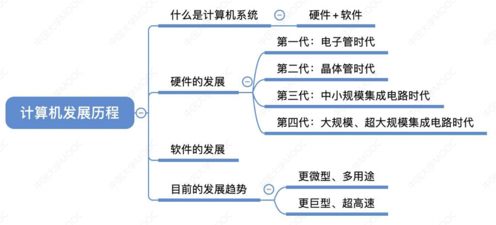
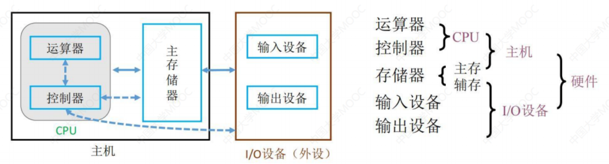
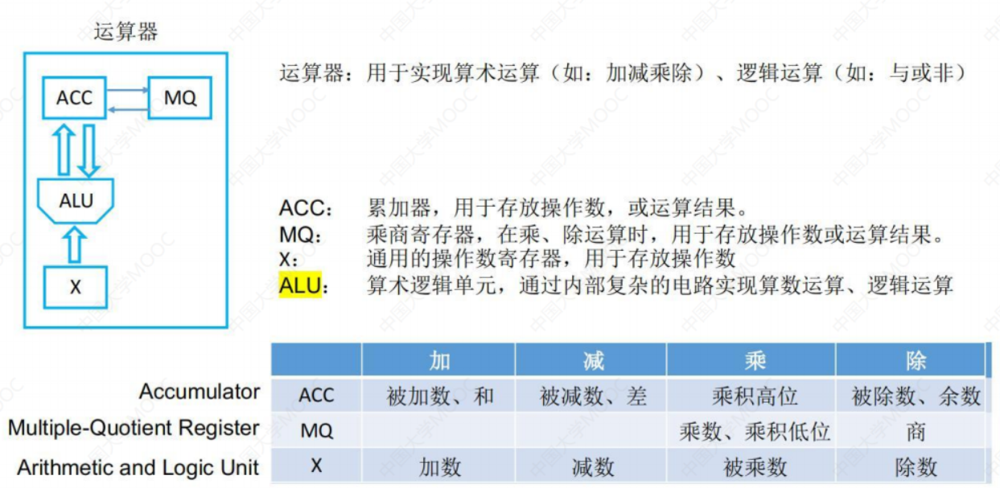
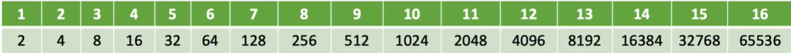

# 第一章：计算机系统概述


## 计算机发展历程



### 计算机硬件的发展

> 电子管时代：第一代计算机（1946-1957年）

**特点**

- 电子管作为开关器件
- **使用机器语言**
- 可以存储信息
- 输入、输出很慢
- 形成计算机基本体系，确立程序设计基本方法
- **数据处理机**开始应用

> 晶体管时代：第二代计算机（1958-1964年）

**特点**

- 晶体管代替电子管
- 采用磁心存储器
- **汇编语言**代替机器语言
- **工业控制机**开始应用

> 中小规模集成电路时代：第三代计算机（1965-1971年）

**特点**

- 中小规模集成电路代替晶体管
- **操作系统问世**

> 超大规模集成电路时代：第四代计算机（1927年-现在）

**特点**

- 采用集成度很高的电路
- **微处理器问世**

> 智能计算机

**特点**

- 具备人工智能
- 运算速度极快
- 软件系统能够处理知识信息
- 以**神经网络计算机**为代表

> 生物计算机和量子计算机

#### 计算机硬件的更新换代

**注意以下三点或概念即可**：

- **摩尔定律：** 每平方英寸电路板上的晶体管数量**每18个月**翻一番
- **微处理器的出现和发展**：1971年Intel公司开发第一个**微处理器Intel 4004**；它是把运算器和控制器合并到了一块芯片上；经历了**4位、8位、16位、32位和64位**几个发展阶段
- **半导体存储器的发展：** 1970年仙童公司生产出第一个较大容量的半导体存储器‘’经历了**1KB、4KB、16KB、64KB、256KB、1MB、4MB、16MB、64MB、1GB等阶段**


### 计算机软件的发展

**计算机语言的发展**： 机器语言-汇编语言-高级语言

**操作系统的发展**：例如DOS，Windows，MAC等等


### 计算机的分类与发展方向

#### 分类

**电子计算机**

- 电子模拟计算机
- 电子数字计算机

**数字计算机**

- 专用计算机
- 通用计算机

**通用计算机**

- 巨型机
- 大型机
- 中型机
- 小型机
- 微型机
- 单片机

**依照指令与数据流划分：**

- **单指令流与单数据流（SISD）**：冯诺依曼体系结构
- **单指令流与多数据流（SIMD）**：阵列存储器与向量存储器
- **多指令流与单数据流（MISD）**：不存在
- **多指令流与多数据流（MIMD）**：多处理器和计算机系统

#### 发展方向

**两极化发展方向**

- **微型计算机：微型化、网络化、高性能、多用途**
- **巨型计算机：巨型化、超高速、并行处理、智能化**


## 计算机硬件的基本组成


### 冯诺依曼机的特点

1. 计算机硬件系统由**运算器、存储器、控制器、输入和输出设备**5部分组成
2. **指令和数据**以**同等地位存储**在**存储器**(同等地位:将操作码与地址码一块存储)，并可按**地址**寻访
3. 指令由**操作码和地址码**组成，操作码用于表示这是一个**什么类型的操作**，地址码用于表示**操作数在存储器中的存放位置**
4. 指令在存储器内**按顺序存放**（一般情况下是这样的，但在特定条件下也可以进行设定）
5. **以运算器为中心**，输入输出设备通过运算器与存储器传送数据


**冯诺依曼机缺陷（早期）**

在控制器的指挥下，输入和输出设备输入一些数据交给运算器进行运算，如果产生中间结果，就会传送给存储器，计算完成后最终结果会给输出设备。**可以发现这种层次结构容易受到输入和输出设备的牵制，因为他们的速度相较于运算器太慢了（短板效应）**

### 现代计算机的结构

为了解决I/O设备的速度和CPU速度差异悬殊的问题，现如今的计算机则采用以**存储器为中心**的计算机组织结构，这种结果使I/O操作尽可能绕过CPU，直接**在I/O设备和存储器之间完成**，以提高系统的整体运行效率





## 各个硬件的工作原理


### 存储器

#### 存储器相关基本定义

**存储器相关基本定义：目前我们采用半导体器件来承担存储任务，一个半导体触发器由于有0和1两个状态，就可以记忆一个二进制代码，关于存储器有如下五个非常重要的概念**

- **存储元**：存储元件和存储基元，存放一位二进制信息(1bit)
- **存储单元**：由若干个存储元组成，存放多位二进制信息
- **存储体**：许多存储单元可组成存储体，也即**存储矩阵**
- **存储字**：每个存储单元中**二进制代码的组合**即为存储字，可代表数值、指令和地址等
- **存储字长**：存储单元中**二进制代码的位数**

**上述概念可以这样记忆**：主存储器由许多存储单元组成，每个存储单元包含多个存储元，每个存储元存储1位二进制代码0或1，故存储单元可存储一串二进制代码，称这串代码为存储字，而这串代码的位数称为存储字长，存储字长一般是一个字节（8位）或字节的偶数倍


#### 存储器的基本结构

**存储器基本结构：存储器主要分为**

- **主存（内存）**：CPU**可以直接访问**；主要存放**程序和数据**；是计算机实现“**存储程序**”控制的基础；外存中信息必须**加载进主存后**CPU才可以访问
- **辅存（外存）**：CPU**不可以直接访问**

**主存的基本构成**


- **存储体**：存放**二进制信息**
- **MAR（地址寄存器）**：存放的是**访存地址**（经过地址译码后找到所选存储单元）
- **MDR（数据寄存器）**：存放的是要从存储器中**读入或写入的信息**

内部原理图如下


#### 存储器相关考点

- 数据在存储体中是**按照地址存储的，每个地址对应一个存储单元**
- **存储单元数目=2^mar位数**（如果MAR为10位，则存储单元数目为2^10 = 1024）。它用于**寻址**，其长度和PC（程序计数器）长度一致
- **MDR的位数表示存储字长**（例如MDR为16，表示存储字长为16，也表示1个字(word)=16bit）
- 注意区分**字（word）和字节（Byte），1个字节等于8个bit**，而1个字的大小取决于机器
- **1B=1个字节，1b=1个bit**


### 运算器

**运算器：是计算机的执行部件，主要进行**

- **算数运算**：比如加减乘除
- **逻辑运算**：比如与、或、非、异或、比较等等

#### 运算器基本结构




#### 运算器过程伪代码描述（了解）

设M为主存中的某一个存储单元，`(M)`表示取M中的数据，`->`表示将内容送入寄存器

**加法实现**：假设ACC中已经存在一个数，那么首先取M的内容送入操作数寄存器X，即`(M)->X`；然后两者相加重新送入寄存器ACC中，即`(ACC)+(M)->(ACC)`

**乘法实现**：假设ACC中已经存在一个数，那么首先取M的内容送入乘商寄存器MQ作为乘数，即`(M)->MQ`，再取ACC寄存器的内容放入X寄存器作为被乘数，即`ACC->X`，接着将ACC清零，即`0->ACC`，然后乘数乘以被乘数，一个送入乘积高位，一个送入乘积低位，即`(X)×(MQ)->ACC//MQ`

**除法实现**：假设ACC中已经存在一个数，首先取M的内容送入X作为除数，即`(M)->X`，ACC中的内容作为被除数，结果一个放入MQ作为整数部分，即`(ACC)/(X)->MQ`，另一个放入ACC作为余数，即`(ACC)%(X)->ACC`


### 控制器

**控制器：是计算机的指挥中心，由其指挥各部件自动协调地进行工作**

#### 指令

**指令：是指指挥机器工作的指示和命令。程序本质就是一系列按照一定顺序排列的指令。人们用程序表达自己的意图，控制器则通过指令指挥机器工作。指令=操作码+地址码**

- **操作码**：指示计算机要干什么
- **地址码**：干这些事情需要的原材料在哪里


#### 控制器基本结构


**控制器基本结构：由以下三部分构成**

- **控制单元（CU）**：分析指令、发出信号、协调操作
- **指令寄存器（IR）**：存放**当前要执行的指令**。注意其内容来源于MDR，因为指令和数据本质是一样的，都被存放在存储器
- **程序计数器（PC）**：存放**当前要执行的指令地址**。注意其与MAR直接连通，并且可以自动+1

#### 控制器过程伪代码描述

完成一条指令的过程为：**取指令（PC）->分析指令（IR）->执行指令（CU）**

具体过程：首先取出指令，即`(IR)`，接着获取指令的操作码，即`OP(IR)`，然后获取指令的地址码，即`AD(IR)`，然后将操作码送入控制单元分析，即`OP(IR)->CU`，操作码表示需要干什么，但是干活需要原材料，所以再把指令的地址码送入MAR，`AD(IR)->MAR`,从MAR指示的存储体取出原材料即可。

结合前面的加法，我们可以写出完整的加法运算的过程的： 首要取加法指令，而指令存储在存储体中，想要取出指令必须要知道的指令的地址，而这个地址就存放在PC中，PC又和MAR直接相连，即`(PC)->MAR`，于是指令此时被放入了MDR中，那么接着将指令放入IR中，即`(MDR)->IR`,接着取指令的操作码送入控制单元，即`OP(IR)->CU`，然后再把原材料（就是一些操作数）的地址码送入MAR，即`AD(IR)->MAR`。接着就可以进行加法操作了，由于上一步已经将操作数的地址码送入了MDR中，所以现在送入操作数寄存器，即`(MDR)->X`，然后`(ACC)+(X)->ACC`，最后PC要自增，即`(PC)+1->PC`，表示下一条指令


### 计算机的工作过程

接下来以一段简单的C语言代码为例展示计算机在背后所做的工作

```c
//以下程序非常简单，声明了4个变量并赋值，然后在main函数内进行运算
int a=2,b=3,c=1,y=0;
void main(){
	y=a*b+c;
}
```

经过编译器编译后，这段程序在主存中就是这样的


下半部分是定义的变量，上半部分则是对应于高级语言对应的机器指令

**第一组**


1：程序开始运行，PC的值为0，保存的是第一条指令的地址。然后将PC的内容，也就是指令的地址送入到MAR中，即(PC)->MAR,MAR=0。也就是说控制器向存储器指明，我接下来要访问主存0号地址处的数据，同时告诉存储器进行读操作

2+3：主存储器会根据MAR记录的地址信息，到存储体中找出0号地址对应的二进制数据，并将其放入到MDR中，此时MDR中存放了第一条指令。即M(MAR)->MDR，此时MDR=000001 0000000101
4：接着将MDR中的指令放入IR中，于是控制器就存放了当前要执行的指令。即(MDR)->IR，(IR)=000001 0000000101
5：这条指令的前6个比特位是操作码，会被送入到控制单元CU中，CU分析后，得知这是一条取数命令。即OP(IR)->CU
6：取数指令会将变量a的内容放入寄存器ACC中。但是现在变量a不知道在哪里，所以现在会把指令的地址码送到MAR当中，即(MAR)=5
7+8：接着主存储器根据MAR指明的地址，也就是a的地址（5），去存储体中找出5号地址的数据，并将其放入MDR当中。即M(MAR)->MDR,(MDR)=0000000000000010，也即(MDR)=2
9：接着在控制单元的指挥下，MDR中的数据就被放入到了ACC中。至此第一条指令完成
10：最后PC自增1，进行下一条指令，即(PC)=1


## 计算机系统的多级层次结构

**计算机系统的多级层次结构：现代计算机是一个硬件与软件组成的综合体，自下而上依次为：**

- **第一级是微程序机器层**：这是一个实在的**硬件层**，它由机器硬件直接执行**微指令**
- **第二级是传统机器语言层**：它是一个实际的**机器层**，由**微程序**解释机器指令系统
- **第三级是操作系统层**：它由**操作系统**实现。操作系统程序是由机器指令和广义指令组成的，这些广义指令是为了扩展机器功能而设置的，是由操作系统定义和解释的软件指令，所以这一层也称为**混合层**
- **第四级是汇编语言层**：他为用户提供一种**符号化的语言**，借此可编写汇编语言源程序
- **第五级是高级语言层**：它是**面向用户的**，是为方便用户编写应用程序而设置的
- 在高级语言层之上，还可以**有应用层**，它由解决实际问题的程序组成（比如word，chrome等等。

**这样的分层结构，使得本层的使用者无需关心下一层的实现细节，**下层是上层的基础，上层是下层的扩展


- 注意：在很多情况下，计算机的某些功能既可以由硬件实现，也可以由软件来实现，**因此硬件和软件没有严格的界限**

> **计算机软件的分类**

**软件：软件是人们事先编制的具有各类特殊功能的程序，他们通常存放在计算机的主存或外存中，按其功能可以分为以下两类**

- **系统软件**：是一组**保证计算机系统高效，正确运行的基础软件**，通常作为系统资源提供给用户使用。**系统软件主要有操作系统（OS）、数据库管理系统（DBMS）、语言处理程序，分布式软件系统、网络软件系统、标准库程序、服务型程序等**
- **应用软件**：是指**用户为解决某个应用领域中的各类问题而编制的程序**、如各种**科学计算类程序，工程设计类程序，数据统计与处理程序等**

> **解释程序和编译程序**

- **解释程序**：它将源语言书写的源程序作为输入，**解释一句就提交给计算机执行一句**，并**不形成目标程序**；例如Python、JavaScript等都是解释型语言
- **编译程序**：把高级语言源程序作为输入，进行翻译转换，**产生出的机器语言作为目标程序**(如exe)，然后让计算机去执行这个目标程序，得到计算结果；例如C/C++、Java等都是编译型语言

对于编译程序来说，**其产生目标代码的执行速度要比解释程序的执行速度快**

> **机器语言、汇编语言和高级语言**

- **机器语言**：用 二进制“0”和“1” 描述不同指令，编程人员需要记忆每一条指令的二进制编码。其优点就是**计算机可以直接识别并执行**
- **汇编语言**：其实质和机器语言是相同的，都是直接对硬件操作，只不过指令**采用了英文缩写的标识符，更容易识别和记忆**。汇编语言的程序必须经过一个称为**汇编程序**的系统软件的翻译，将其转化为机器语言，才能在计算机的硬件系统上运行
- **高级语言**：需要经过**编译程序**编译成汇编语言程序，然后经过**汇编操作**得到机器语言程序。其优点在于**方便编程人员写出解决问题的方案和解题过程**

> **计算机体系结构和计算机组成原理概念区别**

- **计算机体系结构**：研究的是机器语言程序所见的计算机系统的属性概念性的结构与功能特性（指令系统、数据类型、寻址技术、I/O机理）。**也就是说是如何设计硬件与软件之间的接口**，举例：无乘法指令
- **计算机组成原理**：研究的是计算机体系结构体现出来的属性，对于程序员来说是“透明的”。**也就是说是如何使用硬件实现所定义的接口**，举例：如何实现乘法指令


## 计算机性能指标


### 主存容量指标

**主存容量指标：主要有两个**

- **MAR位数**：反映**存储单元**的个数
- **MDR位数**：它等于**存储字长**，等于**每个存储单元的大小**

**所以有：存储体总容量=存储单元个数×存储字长(bit)=存储单元个数×(存储字长/8)(Byte)**

- 例如MAR为32位，MDR为8位，则总容量为`2^32 * 8bit = 4G`




### 运算速度指标

> **CPU主频（时钟频率）**

**单位：Hz**

**CPU主频（时钟频率）**：例如2.8GHz，电脑的主频（Frequency/Clock Rate）。这个 2.8GHz，粗浅地表示：CPU 在 1 秒时间内，可以执行的简单指令的数量是 2.8G 条

如果想要更准确一点描述，这个 2.8GHz 就代表，CPU 的一个“钟表”能够识别出来的最小的时间间隔。就像我们挂在墙上的挂钟，都是“滴答滴答”一秒一秒地走，所以通过墙上的挂钟能够识别出来的最小时间单位就是秒

而在 CPU 内部，和我们平时戴的电子石英表类似，有一个叫晶体振荡（OscillatorCrystal）的东西，简称为晶振。我们把晶振当成 CPU 内部的电子表来使用。晶振带来的每一次“滴答”，就是时钟周期时间

> **CPU时钟周期**

**单位：us或ns**
**CPU时钟周期**：接上面，在我这个 2.8GHz 的 CPU 上，**这个时钟周期时间，就是 1/2.8G**。我们的 CPU，是按照这个“时钟”提示的时间来进行自己的操作。**主频越高，意味着这个表走得越快，我们的CPU 也就“被逼”着走得越快**。

如果你自己组装过台式机的话，可能听说过“**超频**”这个概念，**本质就是把买回来的 CPU 内部的钟给调快了，于是 CPU 的计算跟着这个时钟的节奏**，也就自然变快了。

**所以：CPU主频（时钟频率）=1/CPU时钟周期**

> **CPI**

**CPI(Clock cycle Per Instruction)**：执行一条指令所需的时钟周期数，`执行一条指令的耗时 = CPI*CPU时钟周期`

对于CPU时钟周期数，我们可以再做一个分解，**把它变成“指令数×每条指令的平均时钟周期数（Cycles Per Instruction，简称 CPI）”**。不同的指令需要的指令数是不同的

加法和乘法都对应着一条 CPU 指令，但是乘法需要的指令数就比加法要多，自然也就慢

> **CPU执行时间**

**CPU执行时间**：CPI会受到很多因素的影响，因此用它衡量CPU速度是不合理的，**所以我们把CPU执行时间定义为： CPU执行时间=指令数×CPI×时钟周期=(指令数×CPI)/主频**

- 例如：某CPU主频为1000Hz，某程序包含100条指令，平均来看指令的CPI=3，则该程序执行时间为`100 × 3 × 1/1000 = 0.3 s` 

总结一下：

- **时钟周期时间，就是计算机主频，这个取决于计算机硬件**：我们所熟知的摩尔定律就一直在不停地提高我们计算机的主频。比如说，我最早使用的 80386 主频只有 33MHz，现在手头的笔记本电脑就有 2.8GHz，在主频层面，就提升了将近 100 倍。
- **每条指令的平均时钟周期数 CPI，就是一条指令到底需要多少 CPU Cycle**：现代的 CPU 通过流水线技术（Pipeline），让一条指令需要的 CPU Cycle 尽可能地少。因此，对于 CPI 的优化，也是计算机组成和体系结构中的重要一环。
- **指令数，代表执行我们的程序到底需要多少条指令、用哪些指令**：这个很多时候就把挑战交给了编译器。同样的代码，编译成计算机指令时候，就有各种不同的表示方式。

* 我们可以把自己想象成一个 CPU，坐在那里写程序。计算机主频就好像是你的打字速度，打字越快，你自然可以多写一点程序。CPI 相当于你在写程序的时候，熟悉各种快捷键，越是打同样的内容，需要敲击键盘的次数就越少。指令数相当于你的程序设计得够合理，同样的程序要写的代码行数就少。如果三者皆能实现，你自然可以很快地写出一个优秀的程序，你的“性能”从外面来看就是好的

> **IPS和FLOPS**

- **IPS(Instructions Per Second)**：每秒可以执行**多少条指令**，IPS = 主频/平均CPI
- **FLOPS(Floating-point Operation Per Second)**：每秒执行**多少次浮点运算**

**IPS前面可以加入K或M**

- KIPS：每秒可以多少千条指令
- MIPS：每秒可以执行多少百万条指

**FLOPS前面加入M、G和T**

- MFLOPS：每秒执行多少百万次浮点运算(浮点操作次数/执行时间×10^6)
- GFLOPS：每秒执行多少十亿次浮点运算(浮点操作次数/执行时间×10^9)
- TFLOPS：每秒执行多少万亿次浮点运算(浮点操作次数/执行时间×10^12)

**最后需要注意**

- **在描述容量、文件大小时**，K、M、G、T通常用**2的幂次表示**。`如1Kb=2^10b`
- **在描述速率、频率时**，k、M、G、T通常用**10的幂次表示**,`K=千=10^3,M=百万=10^6,G=Giga=十亿=10^9,T=Tera=万亿=10^12`


### 系统整体性能指标

- **数据通路带宽**：是指数据总线一次所能并行传送信息的位数。这里所说的数据通路宽度是指外部数据总线的宽度，它与CPU内部的数据总线宽度有可能不同
- **吞吐量**：指信息流入、处理和流出系统的速率。它取决于CPU能够多快的取指令，数据能够多快地从内存取出或存入，以及所得结果能够多块地从内存送到输出设备。这些决定因素中的任何一步都与主存息息相关，**因此吞吐量主要取决于主存的存取周期**
- **响应时间**：指的是用户向计算机发送一个请求，到系统对该请求作出相应并获得所需结果的等待时间。通常包括CPU时间（运行程序花费）与等待时间（例如I/O操作）