JAVA基础

## IDEA快捷键

| 快捷键             | 作用                                                         |
| ------------------ | :----------------------------------------------------------- |
| Alt + Enter        | 引入类                                                       |
| Ctrl  + O          | 查看我们继承的类或者接口中的方法，以及我们要实现的方法       |
| Ctrl + Alt + b     | 查看接口实现类中方法（就是我们使用接口编程时，在调用实现类方法处直接Ctrl+鼠标左键方法，只能进入到接口中定义的方法处，但是使用该快捷键则直接到实现类的该方法中了） |
| Alt  + Insert      | set/get; 构造方法;   toString; 重写方法。。。                |
| Ctrl+Alt+T         | 将代码包在一个块中，例如try/catch   ;synchronized等          |
| Ctrl+E             | 最近使用的文件                                               |
| Ctrl+Shift+E       | 最近更改的文件                                               |
| Ctrl+F12           | 可以显示当前文件的结构                                       |
| Ctrl+N             | 可以快速打开类                                               |
| Ctrl+P             | 可以显示参数信息                                             |
| **ctrl+alt+L**     | **格式化代码（可能会有快捷键冲突，需要注意）**               |
| **Ctrl+Alt+O**     | **优化导入的类和包**                                         |
| Alt+Shift+C        | 最近的更改                                                   |
| **调试部分、编译** |                                                              |
| Ctrl+F2            | 停止                                                         |
| Alt+Shift+F9       | 选择 Debug                                                   |
| Alt+Shift+F10      | 选择 Run                                                     |
| Ctrl+Shift+F9      | 编译                                                         |
| Ctrl+Shift+F10     | 运行                                                         |
| Ctrl+Shift+F8      | 查看断点                                                     |
| F8                 | 步过                                                         |
| F7                 | 步入                                                         |
| Shift+F7           | 智能步入                                                     |
| Shift+F8           | 步出                                                         |
| Alt+Shift+F8       | 强制步过                                                     |
| Alt+Shift+F7       | 强制步入                                                     |
| Alt+F9             | 运行至光标处                                                 |
| Ctrl+Alt+F9        | 强制运行至光标处                                             |
| F9                 | 恢复程序                                                     |
| Alt+F10            | 定位到断点                                                   |
| Ctrl+F8            | 切换行断点                                                   |
| Ctrl+F9            | 生成项目                                                     |
| **重构**           |                                                              |
| Ctrl+Alt+Shift+T   | 弹出重构菜单                                                 |
| Shift+F6           | 重命名                                                       |
| F6                 | 移动                                                         |
| F5                 | 复制                                                         |
| Alt+Delete         | 安全删除                                                     |
| Ctrl+Alt+N         | 内联                                                         |
| **查找**           |                                                              |
| Ctrl+F             | 查找                                                         |
| Ctrl+R             | 替换                                                         |
| F3                 | 查找下一个                                                   |
| Shift+F3           | 查找上一个                                                   |
| Ctrl+Shift+F       | 在路径中查找                                                 |
| Ctrl+Shift+R       | 在路径中替换                                                 |
| Ctrl+Shift+S       | 搜索结构                                                     |
| Ctrl+Shift+M       | 替换结构                                                     |
| Alt+F7             | 查找用法                                                     |
| Ctrl+Alt+F7        | 显示用法                                                     |
| Ctrl+F7            | 在文件中查找用法                                             |
| Ctrl+Shift+F7      | 在文件中高亮显示用法                                         |
| **在上一行插入**   | **Ctrl + Alt + Enter**                                       |
| **在下一行插入**   | **Shift + Enter**                                            |

 

Ctrl

| 快捷键                     | 介绍                                                         |
| -------------------------- | ------------------------------------------------------------ |
| Ctrl + F                   | 在当前文件进行文本查找（必备）                               |
| Ctrl + R                   | 在当前文件进行文本替换（必备）                               |
| Ctrl + Z                   | 撤销（必备）                                                 |
| Ctrl + Y                   | 删除光标所在行 或 删除选中的行（必备）                       |
| Ctrl + X                   | 剪切光标所在行 或 剪切选择内容                               |
| Ctrl + C                   | 复制光标所在行 或 复制选择内容                               |
| Ctrl + D                   | 复制光标所在行 或 复制选择内容，并把复制内容插入光标位置下面（必备） |
| Ctrl + W                   | 递进式选择代码块。可选中光标所在的单词或段落，连续按会在原有选中的基础上再扩展选中范围（必备） |
| Ctrl + E                   | 显示最近打开的文件记录列表                                   |
| Ctrl + N                   | 根据输入的类名查找类文件                                     |
| Ctrl + G                   | 在当前文件跳转到指定行处                                     |
| Ctrl + J                   | 插入自定义动态代码模板                                       |
| Ctrl + P                   | 方法参数提示显示                                             |
| Ctrl + Q                   | 光标所在的变量 / 类名 / 方法名等上面（也可以在提示补充的时候按），显示文档内容 |
| Ctrl + U                   | 前往当前光标所在的方法的父类的方法 / 接口定义                |
| Ctrl + B                   | 进入光标所在的方法/变量的接口或是定义出，等效于Ctrl + 左键单击 |
| Ctrl + K                   | 版本控制提交项目，需要此项目有加入到版本控制才可用           |
| Ctrl + T                   | 版本控制更新项目，需要此项目有加入到版本控制才可用           |
| Ctrl + H                   | 显示当前类的层次结构                                         |
| Ctrl + O                   | 选择可重写的方法                                             |
| Ctrl + I                   | 选择可继承的方法                                             |
| Ctrl + +                   | 展开代码                                                     |
| Ctrl + -                   | 折叠代码                                                     |
| Ctrl + /                   | 注释光标所在行代码，会根据当前不同文件类型使用不同的注释符号（必备） |
| Ctrl + \[                  | 移动光标到当前所在代码的花括号开始位置                       |
| Ctrl + \]                  | 移动光标到当前所在代码的花括号结束位置                       |
| Ctrl + F1                  | 在光标所在的错误代码出显示错误信息                           |
| Ctrl + F3                  | 调转到所选中的词的下一个引用位置                             |
| Ctrl + F4                  | 关闭当前编辑文件                                             |
| Ctrl + F8                  | 在 Debug 模式下，设置光标当前行为断点，如果当前已经是断点则去掉断点 |
| Ctrl + F9                  | 执行 Make Project 操作                                       |
| Ctrl + F11                 | 选中文件 / 文件夹，使用助记符设定 / 取消书签                 |
| Ctrl + F12                 | 弹出当前文件结构层，可以在弹出的层上直接输入，进行筛选       |
| Ctrl + Tab                 | 编辑窗口切换，如果在切换的过程又加按上delete，则是关闭对应选中的窗口 |
| Ctrl + Enter               | 智能分隔行                                                   |
| Ctrl + End                 | 跳到文件尾                                                   |
| Ctrl + Home                | 跳到文件头                                                   |
| Ctrl + Space               | 基础代码补全，默认在 Windows 系统上被输入法占用，需要进行修改，建议修改为Ctrl + 逗号（必备） |
| Ctrl + Delete              | 删除光标后面的单词或是中文句                                 |
| Ctrl + BackSpace           | 删除光标前面的单词或是中文句                                 |
| Ctrl + 1,2,3...9           | 定位到对应数值的书签位置                                     |
| Ctrl + 左键单击            | 在打开的文件标题上，弹出该文件路径                           |
| Ctrl + 光标定位            | 按 Ctrl 不要松开，会显示光标所在的类信息摘要                 |
| Ctrl + 左方向键            | 光标跳转到当前单词 / 中文句的左侧开头位置                    |
| Ctrl + 右方向键            | 光标跳转到当前单词 / 中文句的右侧开头位置                    |
| Ctrl + 前方向键            | 等效于鼠标滚轮向前效果                                       |
| Ctrl + 后方向键            | 等效于鼠标滚轮向后效果                                       |
| Alt                        |                                                              |
| 快捷键                     | 介绍                                                         |
| -----------------          | ----------------------------------------------------------------------------------------------- |
| Alt + \`                   | 显示版本控制常用操作菜单弹出层                               |
| Alt + Q                    | 弹出一个提示，显示当前类的声明 / 上下文信息                  |
| Alt + F1                   | 显示当前文件选择目标弹出层，弹出层中有很多目标可以进行选择   |
| Alt + F2                   | 对于前面页面，显示各类浏览器打开目标选择弹出层               |
| Alt + F3                   | 选中文本，逐个往下查找相同文本，并高亮显示                   |
| Alt + F7                   | 查找光标所在的方法 / 变量 / 类被调用的地方                   |
| Alt + F8                   | 在 Debug 的状态下，选中对象，弹出可输入计算表达式调试框，查看该输入内容的调试结果 |
| Alt + Home                 | 定位 / 显示到当前文件的Navigation Bar                        |
| Alt + Enter                | IntelliJ IDEA 根据光标所在问题，提供快速修复选择，光标放在的位置不同提示的结果也不同（必备） |
| Alt + Insert               | 代码自动生成，如生成对象的 set / get 方法，构造函数，toString() 等 |
| Alt + 左方向键             | 按左方向切换当前已打开的文件视图                             |
| Alt + 右方向键             | 按右方向切换当前已打开的文件视图                             |
| Alt + 前方向键             | 当前光标跳转到当前文件的前一个方法名位置                     |
| Alt + 后方向键             | 当前光标跳转到当前文件的后一个方法名位置                     |
| Alt + 1,2,3...9            | 显示对应数值的选项卡，其中 1 是 Project 用得最多             |
| Shift                      |                                                              |
| 快捷键                     | 介绍                                                         |
| ----------------------     | --------------------------------------------------------------------------- |
| Shift + F1                 | 如果有外部文档可以连接外部文档                               |
| Shift + F2                 | 跳转到上一个高亮错误 或 警告位置                             |
| Shift + F3                 | 在查找模式下，查找匹配上一个                                 |
| Shift + F4                 | 对当前打开的文件，使用新Windows窗口打开，旧窗口保留          |
| Shift + F6                 | 对文件 / 文件夹 重命名                                       |
| Shift + F7                 | 在 Debug 模式下，智能步入。断点所在行上有多个方法调用，会弹出进入哪个方法 |
| Shift + F8                 | 在 Debug 模式下，跳出，表现出来的效果跟F9一样                |
| Shift + F9                 | 等效于点击工具栏的Debug按钮                                  |
| Shift + F10                | 等效于点击工具栏的Run按钮                                    |
| Shift + F11                | 弹出书签显示层                                               |
| Shift + Tab                | 取消缩进                                                     |
| Shift + ESC                | 隐藏当前 或 最后一个激活的工具窗口                           |
| Shift + End                | 选中光标到当前行尾位置                                       |
| Shift + Home               | 选中光标到当前行头位置                                       |
| Shift + Enter              | 开始新一行。光标所在行下空出一行，光标定位到新行位置         |
| Shift + 左键单击           | 在打开的文件名上按此快捷键，可以关闭当前打开文件             |
| Shift + 滚轮前后滚动       | 当前文件的横向滚动轴滚动                                     |
| Ctrl + Alt                 |                                                              |
| 快捷键                     | 介绍                                                         |
| -----------------------    | ------------------------------------------------------------------------ |
| Ctrl + Alt + L             | 格式化代码，可以对当前文件和整个包目录使用（必备）           |
| Ctrl + Alt + O             | 优化导入的类，可以对当前文件和整个包目录使用（必备）         |
| Ctrl + Alt + I             | 光标所在行 或 选中部分进行自动代码缩进，有点类似格式化       |
| Ctrl + Alt + T             | 对选中的代码弹出环绕选项弹出层                               |
| Ctrl + Alt + J             | 弹出模板选择窗口，讲选定的代码加入动态模板中                 |
| Ctrl + Alt + H             | 调用层次                                                     |
| Ctrl + Alt + B             | 在某个调用的方法名上使用会跳到具体的实现处，可以跳过接口     |
| Ctrl + Alt + V             | 快速引进变量                                                 |
| Ctrl + Alt + Y             | 同步、刷新                                                   |
| Ctrl + Alt + S             | 打开 IntelliJ IDEA 系统设置                                  |
| Ctrl + Alt + F7            | 显示使用的地方。寻找被该类或是变量被调用的地方，用弹出框的方式找出来 |
| Ctrl + Alt + F11           | 切换全屏模式                                                 |
| Ctrl + Alt + Enter         | 光标所在行上空出一行，光标定位到新行                         |
| Ctrl + Alt + Home          | 弹出跟当前文件有关联的文件弹出层                             |
| Ctrl + Alt + Space         | 类名自动完成                                                 |
| Ctrl + Alt + 左方向键      | 退回到上一个操作的地方（必备）<u>（注意与其他软件快捷键冲突）</u> |
| Ctrl + Alt + 右方向键      | 前进到上一个操作的地方（必备）<u>（注意与其他软件快捷键冲突）</u> |
| Ctrl + Alt + 前方向键      | 在查找模式下，跳到上个查找的文件                             |
| Ctrl + Alt + 后方向键      | 在查找模式下，跳到下个查找的文件                             |
| Ctrl + Shift               |                                                              |
| 快捷键                     | 介绍                                                         |
| -------------------------- | --------------------------------------------------------------------------------------------------------- |
| Ctrl + Shift + F           | 根据输入内容查找整个项目 或 指定目录内文件（必备）           |
| Ctrl + Shift + R           | 根据输入内容替换对应内容，范围为整个项目 或 指定目录内文件（必备） |
| Ctrl + Shift + J           | 自动将下一行合并到当前行末尾（必备）                         |
| Ctrl + Shift + Z           | 取消撤销（必备）                                             |
| Ctrl + Shift + W           | 递进式取消选择代码块。可选中光标所在的单词或段落，连续按会在原有选中的基础上再扩展取消选中范围（必备） |
| Ctrl + Shift + N           | 通过文件名定位 / 打开文件 / 目录，打开目录需要在输入的内容后面多加一个正斜杠（必备） |
| Ctrl + Shift + U           | 对选中的代码进行大 / 小写轮流转换（必备）                    |
| Ctrl + Shift + T           | 对当前类生成单元测试类，如果已经存在的单元测试类则可以进行选择 |
| Ctrl + Shift + C           | 复制当前文件磁盘路径到剪贴板                                 |
| Ctrl + Shift + V           | 弹出缓存的最近拷贝的内容管理器弹出层                         |
| Ctrl + Shift + E           | 显示最近修改的文件列表的弹出层                               |
| Ctrl + Shift + H           | 显示方法层次结构                                             |
| Ctrl + Shift + B           | 跳转到类型声明处                                             |
| Ctrl + Shift + I           | 快速查看光标所在的方法 或 类的定义                           |
| Ctrl + Shift + A           | 查找动作 / 设置                                              |
| Ctrl + Shift + /           | 代码块注释（必备）                                           |
| Ctrl + Shift + \[          | 选中从光标所在位置到它的顶部中括号位置                       |
| Ctrl + Shift + \]          | 选中从光标所在位置到它的底部中括号位置                       |
| Ctrl + Shift + +           | 展开所有代码                                                 |
| Ctrl + Shift + -           | 折叠所有代码                                                 |
| Ctrl + Shift + F7          | 高亮显示所有该选中文本，按Esc高亮消失                        |
| Ctrl + Shift + F8          | 在 Debug 模式下，指定断点进入条件                            |
| Ctrl + Shift + F9          | 编译选中的文件 / 包 / Module                                 |
| Ctrl + Shift + F12         | 编辑器最大化                                                 |
| Ctrl + Shift + Space       | 智能代码提示                                                 |
| Ctrl + Shift + Enter       | 自动结束代码，行末自动添加分号（必备）                       |
| Ctrl + Shift + Backspace   | 退回到上次修改的地方                                         |
| Ctrl + Shift + 1,2,3...9   | 快速添加指定数值的书签                                       |
| Ctrl + Shift + 左方向键    | 在代码文件上，光标跳转到当前单词 / 中文句的左侧开头位置，同时选中该单词 / 中文句 |
| Ctrl + Shift + 右方向键    | 在代码文件上，光标跳转到当前单词 / 中文句的右侧开头位置，同时选中该单词 / 中文句 |
| Ctrl + Shift + 左方向键    | 在光标焦点是在工具选项卡上，缩小选项卡区域                   |
| Ctrl + Shift + 右方向键    | 在光标焦点是在工具选项卡上，扩大选项卡区域                   |
| Ctrl + Shift + 前方向键    | 光标放在方法名上，将方法移动到上一个方法前面，调整方法排序   |
| Ctrl + Shift + 后方向键    | 光标放在方法名上，将方法移动到下一个方法前面，调整方法排序   |
| Alt + Shift                |                                                              |
| 快捷键                     | 介绍                                                         |
| ------------------------   | ----------------------------------------------------------------------------------------------------- |
| Alt + Shift + N            | 选择 / 添加 task                                             |
| Alt + Shift + F            | 显示添加到收藏夹弹出层                                       |
| Alt + Shift + C            | 查看最近操作项目的变化情况列表                               |
| Alt + Shift + F            | 添加到收藏夹                                                 |
| Alt + Shift + I            | 查看项目当前文件                                             |
| Alt + Shift + F7           | 在 Debug 模式下，下一步，进入当前方法体内，如果方法体还有方法，则会进入该内嵌的方法中，依此循环进入 |
| Alt + Shift + F9           | 弹出Debug的可选择菜单                                        |
| Alt + Shift + F10          | 弹出Run的可选择菜单                                          |
| Alt + Shift + 左键双击     | 选择被双击的单词 / 中文句，按住不放，可以同时选择其他单词 / 中文句 |
| Alt + Shift + 前方向键     | 移动光标所在行向上移动                                       |
| Alt + Shift + 后方向键     | 移动光标所在行向下移动                                       |
| Ctrl + Shift + Alt         |                                                              |
| 快捷键                     | 介绍                                                         |
| ------------------------   | -----------------------                                      |
| Ctrl + Shift + Alt + V     | 无格式黏贴                                                   |
| Ctrl + Shift + Alt + N     | 前往指定的变量 / 方法                                        |
| Ctrl + Shift + Alt + S     | 打开当前项目设置                                             |
| Ctrl + Shift + Alt + C     | 复制参考信息                                                 |
| 其他                       |                                                              |
| 快捷键                     | 介绍                                                         |
| ---------------            | --------------------------------------------------------------------------------------------------------------------------- |
| F2                         | 跳转到下一个高亮错误 或 警告位置（必备）                     |
| F3                         | 在查找模式下，定位到下一个匹配处                             |
| F4                         | 编辑源                                                       |
| F7                         | 在 Debug 模式下，进入下一步，如果当前行断点是一个方法，则进入当前方法体内，如果该方法体还有方法，则不会进入该内嵌的方法中 |
| F8                         | 在 Debug 模式下，进入下一步，如果当前行断点是一个方法，则不进入当前方法体内 |
| F9                         | 在 Debug 模式下，恢复程序运行，但是如果该断点下面代码还有断点则停在下一个断点上 |
| F11                        | 添加书签                                                     |
| F12                        | 回到前一个工具窗口                                           |
| Tab                        | 缩进                                                         |
| ESC                        | 从工具窗口进入代码文件窗口                                   |
| 连按两次Shift              | 弹出Search Everywhere弹出层                                  |

## IDEA模板

1.  main方法：psvm

2.  输出：sout
    sout的几种变形：

-   打印方法的参数：soutp
-   打印方法名称：soutm
-   就近打印变量：soutv
-   打印指定内容：xxx.sout

-   使用for循环遍历
    -   普通for循环遍历：fori
    -   增强for循环：iter
    -   有局部变量的普通for循环：itar

4.  遍历List
    -   增强for循环遍历：list.for
    -   普通for循环顺序遍历：list.fori
    -   普通for循环逆序遍历：list.forr

5.  条件判断
    -   判断是否为null：ifn
    -   判断是否不为空：inn
    -   判断指定内容是否为空：xxx.null
    -   判断指定内容是否非空：xxx.nn
6.  静态常量常量定义
    -   public static final：psf
    -   private static final：prsf
    -   public static final int：psfi
    -   public static final String：psfs
7.  自动生成返回值xxx.var
8.  强转：xxx.cast
9.  返回值：xxx.return


## 基本语法

**获取随机值函数：**

​	`` Math.random() ``获取\[0,1)之间的值

​	``(int)(Math.random() * (b - a + 1) + a)``获取\[a,b) 之间的值


### 变量

**变量按照数据类型分为：**

1. 基本数据类型：

   整数型：`byte，short，int，long`

   浮点型：`float，double`

   字符型：`char`

   布尔型：`boolean`

 2. 引用数据类型
    类(`class`)

​		接口(`interface`)

​		数组(\[\])

**基本数据类型介绍**

1. 整型：byte(1字节) \\ short(2字节) \\ int(4字节) \\ long(8字节)

2. 浮点型：float(4字节) \\ double(8字节)

3. 字符型：char (1字符=2字节)

   	byte范围：-128 ~ 127
   	声明long型变量，必须以"l"或"L"结尾
   	float表示数值的范围比long还大
   	定义float类型变量时，变量要以"f"或"F"结尾


**自动类型转换**

1. **自动类型提升：**

   结论：当容量小的数据类型的变量与容量大的数据类型的变量做运算时，结果自动提升为容量大的数据类型。

   `byte 、char 、short --> int --> long --> float --> double`

   特别的：当byte、char、short三种类型的变量做运算时，结果为int型

2. **强制类型转换：自动类型提升运算的逆运算。**
   需要使用强转符：()

   注意点：强制类型转换，可能导致精度损失。

````java
long l1 = 21332423235234123;    //错误
long l2 = 21332423235234123L;   //正确
        
        
float f1 = 12.3;                //编译失败
float f2 = 12.3F;               //正确
float f3 = (float)12.3;         //正确
        

byte b = 12;
byte b1 = b + i;                //编译失败
float f4 = b + 12.3;            //编译失败
````


**String类型变量的使用**

1.  `String`可以和8种基本数据类型变量做运算，且运算只能是连接运算：+
2.  运算的结果仍然是`String`类型

````java
char c = 'a';//97 A:65
int num = 10;
String str = "hello";
System.out.println(c + num + str);    //107hello
System.out.println(c + str + num);    //ahello10
System.out.println(c + (num + str));  //a10hello
System.out.println((c + num) + str);  //107hello
System.out.println(str + num + c);    //hello10a
````

### 运算符

| 比较运算符 |                    |
| ---------- | ------------------ |
| instanceof | 检查是否是类的对象 |

| 逻辑运算符 |                                                              |
| ---------- | ------------------------------------------------------------ |
| &          | 逻辑与，左右都参与运算                                       |
| &&         | 短路与，如果左边为真，右边参与运算，如果左边为假，那么右边不参与运算 |
| \|         | 逻辑或，左右都参与运算                                       |
| \|\|       | 短路或，当左边为真，右边不参与运算                           |
| ！         | 非                                                           |
| ^          | 异或                                                         |

| 位运算符       |            |                                                              |
| -------------- | ---------- | ------------------------------------------------------------ |
| <<             | 左移       | 空位补0，被移除的高位丢弃，空缺位补0。                       |
| >>             | 右移       | 被移位的二进制最高位是0，右移后，空缺位补0；最高位是1，空缺位补1。 |
| >>>            | 无符号右移 | 被移位二进制最高位无论是0或者是1，空缺位都用0补。            |
| &              | 与运算     | 二进制位进行&运算，只有1&1时结果是1，否则是0;                |
| \|             | 或运算     | 二进制位进行\| 运算，只有0 \| 0时结果是0，否则是1            |
| ^              | 异或运算   | 相同二进制位进行^ 运算，结果是0；1^1=0 , 0^0=0不相同二进制位^ 运算结果是1。1^0=1 , 0^1=1 |
| ~              | 取反运算   | 正数取反，各二进制码按补码各位取反负数取反，各二进制码按补码各位取反 |
| **三元运算符** |            |                                                              |

``(条件表达式)?表达式1：表达式2；``条件表达式为真：运算的结果为表达式1,条件表达式为假：运算的结果为表达式2


### 获取输入

具体实现步骤：
1.导包：``import java.util.Scanner;``
2.``Scanner``的实例化:``Scanner 变量 = new Scanner(System.in);``
3.调用``Scanner``类的相关方法（``next() / nextXxx()``），来获取指定类型的变量

注意：

1. 需要根据相应的方法，来输入指定类型的值。如果输入的数据类型与要求的类型不匹配时，会报异常：``InputMisMatchException``导致程序终止。

2. 对于`char`型的获取，`Scanner`没有提供相关的方法。只能获取一个字符串

   ````java
   Scanner scan = new Scanner(System.in);	//实例化定义变量scan
   int num = scan.nextInt();               //调用变量的Scanner类方法
   System.out.println(num);
   ````


### 流程控制

**if - else**

**switch - case (break,continue,default)**
① 根据`switch`表达式中的值，依次匹配各个`case`中的常量。一旦匹配成功，则进入相应`case`结构中，

MLML调用其执行语句。当调用完执行语句以后，则仍然继续向下执行其他`case`结构中的执行语句，直到遇到`break`关键字或此`switch-case`结构末尾结束为止。

② `break`,可以使用在`switch-case`结构中，表示一旦执行到此关键字，就跳出`switch-case`结构

③` switch`结构中的表达式，只能是如下的6种数据类型之一(没有浮点型)：

​	``byte 、short、char、int、枚举类型(JDK5.0新增)、String类型(JDK7.0新增)``

④ `case `之后只能声明常量。不能声明范围。(例：case 1 \~ 10 错误)

⑤` break`关键字是可选的。

⑥ `default`:相当于if-else结构中的else.default结构是可选的，而且位置是灵活的。

**for 和 while**

**break标签**

````java
int i =0;
int j = 0;
label:while(true){
    //我是第一层循环
    while(true){
        //我是第二层循环
        if(j*i == 81)
        break label; // continue label
        j++;
    }
    i++;
}
````

``label``:就是标签 要终止的位置

``break label`` ：终止结束到标签 结束语句

``continue label``: 终止本次循环 跳到标签位置进行接下来的循环


### 数组

遍历数组函数``Arrays.tostring(数组)``

#### 数组的概述

特点：

- 数组属于引用数据类型的变量。数组的元素，既可以是基本数据类型，也可以是引用数据类型

- 创建数组对象会在内存中开辟一整块连续的空间

- 数组的长度一旦确定，就不能修改。


#### 一维数组

1. 初始化

   ​	``静态：数据类型[]变量名 = new 数据类型[]{元素1，元素2……}；``

   ​	``动态：数据类型[]变量名 = new 数据类型[长度];``

   ​	注意：赋值不写长度，写长度不赋值

2. 默认值

   - 数组元素是整型：0

   - 数组元素是浮点型：0.0


   - 数组元素是`cha`r型：0或'\\u0000'，而非'0'


   - 数组元素是`boolean`型：`false`


   - 数组元素是引用数据类型：`null`


#### 二维数组

1. 概述：

​		数组属于引用数据类型

​		数组的元素也可以是引用数据类型

2. 初始化

​		``静态：数据类型[][] 变量 = new 数据类型[][]{{元素1，元素2……}，{元素1，元素2……}}``

​		``动态：数据类型[][] 变量 = new 数据类型[长度][长度];``

3. 默认值

   - 外层元素的初始化值为：地址值

   - 内层元素的初始化值为：与一维数组初始化情况相同

````java
int[][] arr = new int[4][3];
System.out.println(arr[0]);   //[I@15db9742 
System.out.println(arr[0][0]);//0
````


#### Arrays 工具类的使用

具体实现步骤：

导包：``import java.util.Arrays;``

常用方法：

| 方法                          | 作用                                             |
| ----------------------------- | ------------------------------------------------ |
| equals(int[] a,int[] b)       | 判断两个数组是否相等                             |
| toString(int[] a)             | 输出数组的信息                                   |
| fill(int[] a,int val)         | 将指定值填充到数组之中。                         |
| sort(int[] a)                 | 对数组进行排序。                                 |
| binarySearch(int[] a,int key) | 对排序后的数组进行二分法检索指定的值，返回下标。 |
| asList(T... a)                | 转为链表                                         |
| copyOf()                      | 拷贝                                             |

````java
int[] arr3 = new int[10];
Arrays.fill(arr3,3);             //不需要new
````


# 面向对象

## 类和对象

`Java`类及类的成员：属性、方法、构造器；代码块、内部类 

面向对象的大特征：封装性、继承性、多态性、(抽象性)

关键字：``this、super、static、final、abstract、interface、package、import``等


### 属性与局部变量

属性：可以在声明属性时，指明其权限，使用权限修饰符。

​	常用的权限修饰符：``private、public、缺省、protected`` --->封装性

局部变量：不可以使用权限修饰符。没默认初始化值。意味着，我们在调用局部变量之前，一定要显式赋值。

内存中加载的位置：

​         属性：加载到堆空间中  （非``static``）

​         局部变量：加载到栈空间

 

## 方法

**格式：**

````java
权限修饰符  返回值类型  方法名(形参列表){
         方法体                           
}
````

> 方法的重载

定义：在**同一个类**中，允许存在一个以上的同名方法，只要它们的参数个数或者参数类型不同即可。（与返回类型无关）


> 可变个数形参

**格式**

````java
//数据类型 ... 变量名
public void show(String ... strs){
    ……
}
````


## 代码块

**作用**：用来初始化类、对象的信息。如果使用修饰符，只能使用**static**

**格式：**

````java
{
    
}
static{
    
}
````

**分类**：静态代码块 vs 非静态代码块

* **静态代码块**：

  * 内部可以输出语句

  * 随着类的加载而执行,而且**只执行一次**

  * 作用：初始化类的信息

  * 如果一个类中定义了多个静态代码块，则按照声明的先后顺序执行

  * **静态代码块的执行要优先于非静态代码块的执行**

  * 静态代码块内只能调用静态的属性、静态的方法，不能调用非静态的结构

* **非静态代码块：**
  * 内部可以输出语句
  * 随着对象的创建而执行
  * 每创建一个对象，就执行一次非静态代码块
  * 作用：可以在创建对象时，对对象的属性等进行初始化
  * 如果一个类中定义了多个非静态代码块，则按照声明的先后顺序执行（先继承父类，再执行非静态代码块）
  * 非静态代码块内可以调用静态的属性、静态的方法，或非静态的属性、非静态的方法

 **执行顺序**:静态代码块-->构造代码块-->构造方法


## 封装性

四种权限修饰符

​	权限从小到大顺序为：`private < 缺省(default) < protected < public`

| 修饰符            | 类内部 | 同一个包 | 不同包的子类 | 同个工程 |
| ----------------- | ------ | -------- | ------------ | -------- |
| private(私有)     | yes    |          |              |          |
| 缺省(默认)        | yes    | yes      |              |          |
| protected(受保护) | yes    | yes      | yes          |          |
| public (公开)     | yes    | yes      | yes          | yes      |


4种权限都可以用来修饰类的内部结构：属性、方法、构造器、内部类

修饰类的话，只能使用：缺省、public


## 继承性

**格式**

````java
class 子类 extends 父类 {
	……
} 
````


> 方法的重写

子类重写方法的方法名和形参列表与父类相同，权限修饰符大于父类，不能重写父类中声明为private权限的方法

返回值类型：

- 父类返回值类型是void，则子类返回值类型只能是void
- 父类返回值类型是A类型，则子类返回值类型可以是A类或A类的子类
- 父类返回值类型是基本数据类型(比如：double)，则子类返回值类型必须是相同的基本数据类型(必须也是double)
- 子类重写的方法抛出的异常类型不大于父类被重写的方法抛出的异常类型
- 子类和父类中的同名同参数的方法要么都声明为非static的（考虑重写），要么都声明为static的（不是重写)。    


## 多态性

父类的引用指向子类的对象（或子类的对象赋给父类的引用）

有了对象的多态性以后，我们在编译期，只能调用父类中声明的方法，但在运行期，我们实际执行的是子类重写父类的方法。


对象的多态性，只适用于方法，不适用于属性（编译和运行都看左边）

原因：

  * 属性是静态绑定

- 方法是动态绑定


**instanceof的使用：**

​	格式：``变量名instanceof 类名``,判断变量是否是类名的实例；

````java
class Base {
    int count = 10;
    public void display() {
        System.out.println(this.count);
    }
}

class Sub extends Base {
    int count = 20;
    public void display() {
        System.out.println(this.count);
    }
}
public class FieldMethodTest {
    public static void main(String[] args) {
        Sub s = new Sub();
        System.out.println(s.count);   //20
        s.display();                   //20

        Base b = s;//多态性
        //==：对于引用数据类型来讲，比较的是两个引用数据类型变量的地址值是否相同
        System.out.println(b == s);    //true
        System.out.println(b.count);   //10 多态性不适用属性
        b.display();                   //20
    }
}
````


## 接口
使用`interface`来定义,使用`implements`来实现

````java
interface 接口名{
		……
}
class 类名 implements 接口{
		……
}
````

`Java`中，接口和类是并列的两个结构


> **如何定义接口**：定义接口中的成员

* JDK7及以前：只能定义全局常量和抽象方法
  * 全局常量：public static final的.  但是书写时，可以省略不写(默认添加)
  * 抽象方法：public abstract的.    但是书写时，可以省略不写(默认添加)
* JDK8：除了定义全局常量和抽象方法之外，还可以定义静态方法（只能通过接口自己调用）、默认方法（`default`）

````java
public default void 方法名（）{}
//通过实现类的对象，可以调用接口中的默认方法 
````


> 知识点

* 接口中定义的静态方法，只能通过接口来调用。
* 通过实现类的对象，可以调用接口中的默认方法。
* 如果实现类重写了接口中的默认方法，调用时，调用的是重写以后的方法
* 如果子类(或实现类)继承的父类和实现的接口中声明了同名同参数的默认方法，那么子类在没有重写此方法的情况下，默认调用的是父类中的同名同参数的方法。-->**类优先原则**
* 如果实现类实现了多个接口，而这多个接口中定义了同名同参数的默认方法，那么在实现类没有重写此方法的情况下，报错。-->**接口冲突**，这就需要我们必须在实现类中重写此方法
* **接口中不能定义构造器的！意味着接口不可以实例化**
* 如果实现类覆盖了接口中的所抽象方法，则此实现类就可以实例化
* 如果实现类没覆盖接口中所的抽象方法，则此实现类仍为一个抽象类
* Java类可以实现多个接口  --->弥补了Java单继承性的局限性

​			格式：`class AA extends BB implements CC,DD,EE`

* 接口与接口之间可以**继承**，而且可以多继承(因为没有构造器 )


## Object类

**java.lang.Object类**

Object类是所有Java类的根父类

如果在类的声明中未使用extends关键字指明其父类，则默认父类为java.lang.Object类 

方法：`equals() / toString() / getClass() /hashCode() / clone() / finalize() / wait() / notify() / notifyAll()`


**Object类方法如下：**

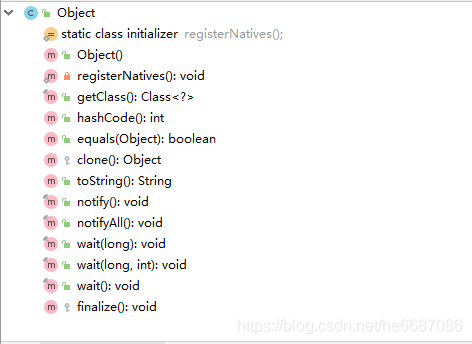


 **1.getClass方法**

获取运行时类型,返回值为`Class`对象

**2.hashCode方法**

返回该对象的哈希码值，是为了提高哈希表的性能（`HashTable`）

**3.equals方法**

判断两个对象是否相等，在`Object`源码中`equals`就是使用==去判断，所以在`Object`中`equals`是等价于==的，但是在`String`及某些类对`equals`进行了重写，实现不同的比较。

**4.clone方法**

主要是JAVA里除了8种基本类型传参数是值传递，其他的类对象传参数都是引用传递，我们有时候不希望在方法里将参数改变，这时就需要在类中复写`clone`方法。

如果在`clone`方法中调用`super.clone()`方法需要实现`Cloneable`接口,否则会抛出`CloneNotSupportedException`。

此方法只实现了一个浅层拷贝,对于基本类型字段成功拷贝,但是如果是嵌套对象,只做了赋值,也就是只把地址拷贝了,所以没有成功拷贝,需要自己重写`clone`方法进行深度拷贝。

**5.toString方法**

返回一个`String`字符串,用于描述当前对象的信息,可以重写返回对自己有用的信息，默认返回的是`当前对象的类名+hashCode`的16进制数字。

**6.wait方法**

多线程时用到的方法，作用是让当前线程进入等待状态，同时也会让当前线程释放它所持有的锁。直到其他线程调用此对象的 `notify() `方法或 `notifyAll() `方法，当前线程被唤醒

**7.notify方法**

多线程时用到的方法，唤醒该对象等待的某个线程

**8.notifyAll方法**

多线程时用到的方法，唤醒该对象等待的所有线程

**9.finalize**

对象在被GC释放之前一定会调用`finalize`方法，对象被释放前最后的挣扎,因为无法确定该方法什么时候被调用，很少使用。

 

## 包装类

为了使基本数据类型的变量具有类的特征，引入包装类。

| 基本数据类型 | 包装类    |
| ------------ | --------- |
| byte         | Byte      |
| shout        | Shout     |
| int          | Integer   |
| long         | Long      |
| float        | Floa      |
| double       | Double    |
| boolean      | Boolean   |
| char         | Character |


### 类型转换

> 基本数据类型<--->包装类，JDK 5.0 新特性：**自动装箱 与自动拆箱**


> 基本数据类型、包装类--->String

格式：``String 变量 = String.valueOf(数据或变量)；``


> String--->基本数据类型、包装类

格式：``数据类型 变量 = 数据类型包装类.parseXxx(String S)；``

````java
String S = "123456";
int in1 = Integer.parseInt(S);
````


**integer**

`Integer`内部定义了`IntegerCache`结构，`IntegerCache`中定义了`Integer[]`,保存了从-128~127范围的整数。如果我们使用自动装箱的方式，给`Integer`赋值的范围在

-128~127范围内时，可以直接使用数组中的元素，不用再去`new`了。目的：提高效率

````java
@Test
public void test3() {
    Integer m = 1;
    Integer n = 1;
    System.out.println(m == n);     //true,在-128~127范围内
    
    /*大于127*/
    Integer x = 128;                //相当于new了一个Integer对象
    Integer y = 128;                //相当于new了一个Integer对象
    System.out.println(x == y);     //false
}
````


## 关键字

### **this**


### **super**

> super调用构造器：

- 可以在子类的构造器中显式的使用"`super(形参列表)`"的方式，调用父类中声明的指定的构造器
- "`super(形参列表)`"的使用，必须声明在子类构造器的首行！
- 我在类的构造器中，针对于"`this(形参列表)`"或"`super(形参列表)`"只能二选一，不能同时出现
- 在构造器的首行，没显式的声明"`this(形参列表)`"或"`super(形参列表)`"，则默认调用的是父类中空参的构造器：`super()`
- 在类的多个构造器中，至少一个类的构造器中使用了"`super(形参列表)`"，调用父类中的构造器


### **package** 

包”，指：类所在的包


### **import**

“引入”，指：引入类中需要的类。

`import static`: 导入指定类或接口中的静态结构、属性或方法。 


### **Static**

可以用来修饰的结构：主要用来修饰类的内部结构

​	属性、方法、代码块、内部类（注意是内部类）

> **static修饰属性：静态变量（或类变量）**

**属性**，是否使用static修饰，又分为：静态属性 vs 非静态属性(实例变量

* 实例变量：我们创建了类的多个对象，每个对象都独立的拥一套类中的非静态属性。当修改其中一个对象中的非静态属性时，不会导致其他对象中同样的属性值的修改。

* 静态变量：我们创建了类的多个对象，多个对象共享同一个静态变量。当通过某一个对象修改静态变量时，会导致其他对象调用此静态变量时，是修改过了的。

**static修饰属性的其他说明：**

* 静态变量随着类的加载而加载。可以通过"类.静态变量"的方式进行调用

* 静态变量的加载要早于对象的创建。

* 由于类只会加载一次，则静态变量在内存中也只会存在一份：存在方法区的静态域中。

|      | 类变量 | 实例变量 |
| ---- | ------ | -------- |
| 类   | yes    | no       |
| 对象 | yes    | yes      |

 

> **static修饰方法：静态方法、类方法（静态方法不能被覆盖，重写）**

* 随着类的加载而加载，可以通过"类.静态方法"的方式进行调用    

|      | 静态方法 | 非静态方法 |
| ---- | -------- | ---------- |
| 类   | yes      | no         |
| 对象 | yes      | yes        |

* 静态方法中，只能调用静态的方法或属性
* 非静态方法中，既可以调用非静态的方法或属性，也可以调用静态的方法或属性

 

> **static的注意点：**

* 在静态的方法内，不能使用`this`关键字、`super`关键字

* 关于静态属性和静态方法的使用，从生命周期的角度去理解。


### final

* 修饰类:此类不能被其他类所继承。

* 修饰方法：表明此方法不可以被重写 
* 修饰变量：此时的"变量"就称为是一个常量
  * 修饰属性：可以考虑赋值的置：显式初始化、代码块中初始化、构造器中初始化 (注意：默认初始化不可以)
  * 修饰局部变量：
    * 尤其是使用`final`修饰形参时，表明此形参是一个常量。当我们调用此方法时，给常量形参赋一个实参。一旦赋值以后，就只能在方法体内使用此形参，但不能进行重新赋值。
  * final修饰的数组等类型(如`StringBuilder`)：数组的内容可以改变，但是数组不可以指向其他引用

* `static final` 用来修饰属性：全局常量


### abstract

**abstract修饰类：抽象类**

* 此类不能实例化
* 抽象类中一定有构造器，便于子类实例化时调用（涉及：子类对象实例化的全过程）
* 开发中，都会提供抽象类的子类，让子类对象实例化，完成相关的操作 --->抽象的使用前提：继承性


**abstract修饰方法：抽象方法**

* 抽象方法只有方法的声明，没方法体
* 包含抽象方法的类，一定是一个抽象类。反之，抽象类中可以没有抽象方法的。
* 若子类重写了父类中的所的抽象方法后，此子类方可实例化 
* 若子类没重写父类中的所的抽象方法，则此子类也是一个抽象类，需要使用**abstract**修饰


**注意点**：

* `abstract`不能用来修饰：属性、构造器等结构
* `abstract`不能用来修饰私方法（子类无法重写）、静态方法（静态方法不能被重写，随着类的加载而加载，但是`abstract`类不能声明对象）、final的方法、`final`的类


# 异常

## 常见异常

**RuntimeException子类**

| 序号 | 异常                                     | 异常描述                                                     |
| ---- | ---------------------------------------- | ------------------------------------------------------------ |
| 1    | java.lang.ArrayIndexOutOfBoundsException | 数组索引越界异常。当对数组的索引值为负数或大于等于数组大小时抛出。 |
| 2    | java.lang.ArithmeticException            | 算术条件异常。譬如：整数除零等。                             |
| 3    | java.lang.NullPointerException           | 空指针异常。当应用试图在要求使用对象的地方使用了null时，抛出该异常。  譬如：调用null对象的实例方法、访问null对象的属性、计算null对象的长度、使用throw语句抛出null等等 |
| 4    | java.lang.ClassNotFoundException         | 找不到类异常。当应用试图根据字符串形式的类名构造类，而在遍历CLASSPAH  之后找不到对应名称的class文件时，抛出该异常。 |
| 5    | java.lang.NegativeArraySizeException     | 数组长度为负异常                                             |
| 6    | java.lang.ArrayStoreException            | 数组中包含不兼容的值抛出的异常                               |
| 7    | java.lang.SecurityException              | 安全性异常                                                   |
| 8    | java.lang.IllegalArgumentException       | 非法参数异常                                                 |

**IOException**

| 序号 | 异常                  | 异常描述                             |
| ---- | --------------------- | ------------------------------------ |
| 1    | IOException           | 操作输入流和输出流时可能出现的异常。 |
| 2    | EOFException          | 文件已结束异常                       |
| 3    | FileNotFoundException | 文件未找到异常                       |

**其他**

| 序号 | 异常                            | 异常描述                                                     |
| ---- | ------------------------------- | ------------------------------------------------------------ |
| 1    | ClassCastException              | 类型转换异常类                                               |
| 2    | ArrayStoreException             | 数组中包含不兼容的值抛出的异常                               |
| 3    | SQLException                    | 操作数据库异常类                                             |
| 4    | NoSuchFieldException            | 字段未找到异常                                               |
| 5    | NoSuchMethodException           | 方法未找到抛出的异常                                         |
| 6    | NumberFormatException           | 字符串转换为数字抛出的异常                                   |
| 7    | StringIndexOutOfBoundsException | 字符串索引超出范围抛出的异常                                 |
| 8    | IllegalAccessException          | 不允许访问某类异常                                           |
| 9    | InstantiationException          | 当应用程序试图使用Class类中的newInstance()方法创建一个类的实例，而指定的类对象无法被实例化时，抛出该异常 |


##  JAVA异常

Java异常类层次结构图：

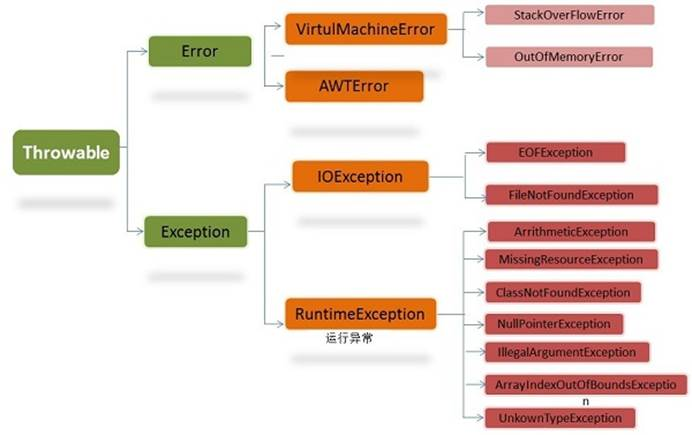


**Throwable**： 有两个重要的子类：`Exception`（异常）和 `Error`（错误），二者都是 `Java` 异常处理的重要子类，各自都包含大量子类。

**Error**（错误）:是程序无法处理的错误，表示运行应用程序中较严重问题。大多数错误与代码编写者执行的操作无关，而表示代码运行时 JVM（Java 虚拟机）出现的问题。

**Exception**（异常）:是程序本身可以处理的异常。


## 处理异常机制

在 `Java` 应用程序中，异常处理机制为：抛出异常，捕捉异常。

**捕获异常：try、catch和 finally**

````java
try{
    //可能出现异常的代码
}catch(异常类型 变量名){
    //处理异常的方式
}finally{
    //一定会执行的代码
}
````

**try 块：**用于捕获异常。其后可接零个或多个`catch`块，如果没有`catch`块，则必须跟一个`finally`块。

**catch块：**用于处理`try`捕获到的异常。

**finally 块：**无论是否捕获或处理异常，`finally`块里的语句都会被执行。当在`try`块或catch块中遇到`return`语句时，`finally`语句块将在方法返回之前被执行。

> **在以下4种特殊情况下，finally块不会被执行：**

* 在`finally`语句块中发生了异常
* 在前面的代码中用了`System.exit()`退出程序
* 程序所在的线程死亡
* 关闭CPU

 

**抛出异常：throws**

````java
权限修饰符 返回类型 方法名 throws 异常类型{
		
}
````

**手动抛出异常：throw**

​	格式：`throw new 异常类型`

````java
public void regist(int id) throws Exception {
	throw new MyException("自定义异常");
}

````


**Throwable类中的常用方法**

注意：`catch`关键字后面括号中的`Exception`类型的参数`e`。`Exception`就是`try`代码块传递给`catch`代码块的变量类型，`e`就是变量名。

| 序号 | 方法              | 描述                                                        |
| ---- | ----------------- | ----------------------------------------------------------- |
| 1    | getCause()        | 返回抛出异常的原因。如果 cause 不存在或未知，则返回 null。  |
| 2    | getMeage()        | 返回异常的消息信息。                                        |
| 3    | printStackTrace() | 对象的堆栈跟踪输出至错误输出流，作为字段  System.err 的值。 |

 ````java
 try {
     ……
 }catch (Exception e){
     e.getCause();
 }finally {
     ……
 }
 ````


## return

**try中有return语句和最后有return：**

````java
public class test {
    public static void main(String[] args) {
        test test = new test();
        System.out.println(test.returnTets());
    }

    public String returnTets(){
        try {
            return "返回的语句";
        }catch (Exception e){
            e.getCause();
        }finally {
            System.out.println("finally中的语句");
        }
        return "微笑";
    }
}

----------------------
输出：
    finally中的语句
    返回的语句
````

合理的解释是，在`try`中执行到`return`语句时，不会真正的`return`，即只是会计算`return`中的表达式，之后将结果保存在一个临时栈中，接着执行`finally`中的语句，最后才会从临时栈中取出之前的结果返回。


**try和finally都有return语句：**

````java
public class test {
    public static void main(String[] args) {
        test test = new test();
        System.out.println(test.returnTets());
    }

    public String returnTets(){
        try {
            return "try中返回的语句";
        }catch (Exception e){
            e.getCause();
        }finally {
            System.out.println("finally中的语句");
            return "finally中返回的语句";
        }
    }
}

----------------
输出：
    finally中的语句
    finally中返回的语句   
````

`finnaly`会覆盖`try`的`return`语句。


## 自定义异常

创建自定义异常类：一般会选择继承`Exception`和`RuntimeException`，如果不要求调用者一定要处理抛出的异常，就继承`RuntimeException`。

 ````java
 class MyException extends Exception { // 创建自定义异常类
     String message; // 定义String类型变量
     public MyException(String ErrorMessagr) { // 父类方法
         message = ErrorMessagr;
     }
  
     public String getMessage() { // 覆盖getMessage()方法
         return message;
     }
 }
 ````

````java
public void testException() throws Exception {
	throw new MyException("自定义异常");             //抛出自定义异常
}
````


 

# 多线程

## 理解

* 程序(programm)

​			概念：是为完成特定任务、用某种语言编写的一组指令的集合。即指一段静态的代码。

* 进程(process)

​			概念：程序的一次执行过程，或是正在运行的一个程序。

​			说明：进程作为资源分配的单位，系统在运行时会为每个进程分配不同的内存区域

* 线程(thread)

​			概念：进程可进一步细化为线程，是一个程序内部的一条执行路径。

​			说明：线程作为调度和执行的单位，每个线程拥有独立的运行栈和程序计数器(pc)，线程切换的开销小。

​			 分类：守护线程，用户线程。

 


**内存结构**：

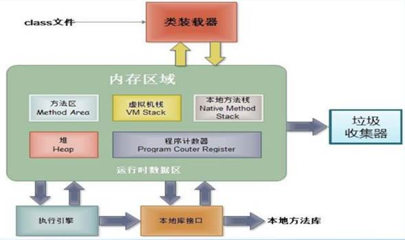

* 进程可以细化为多个线程。

* 每个线程，拥有自己独立的：栈、程序计数器

* 多个线程，共享同一个进程中的结构：方法区、堆。

 

**并行与并发的理解**

- 并行：多个CPU同时执行多个任务。
- 并发：一个CPU(采用时间片)同时执行多个任务。


 ## 创建多线程的方法

### 方法一：继承Thread类

**步骤**

* 创建一个继承于`Thread`类的子类
* 重写`Thread`类的`run()` --> 将此线程执行的操作声明在run()中
* 创建`Thread`类的子类的对象
* 通过此对象调用`start()`：①启动当前线程 ② 调用当前线程的run()

**格式：**

```java
class testThread extends Thread{         			//创建一个继承于Thread类的子类
    public void run(){         						//重写Thread类的run()
    	线程;
    }
}

public class Test{
    public static void main(String[] args){
        testThread testthread = new testThread();   //创建Thread类的子类的对象
        testthread.start()              			//通过此对象调用start()，start启动多线程并调用run方法
    }
}
```

**两个问题：**

问题一：我们启动一个线程，必须调用`start()`，不能调用`run()`的方式启动线程。

问题二：如果再启动一个线程，必须重新创建一个`Thread`子类的对象，调用此对象的`start().`


### 方式二：实现Runnable接口

**步骤**

* 创建一个实现了`Runnable`接口的类
* 实现`Runnable`中的抽象方法：`run()`
* 创建实现类的对象
* 将此对象作为参数传递到`Thread`类的构造器中，创建`Thread`类的对象
* 通过`Thread`类的对象调用`start()`
* 如果创建多个线程，则需要创建多个`Thread`类，并把`Runnable`传入`Thread`类的构造器中

**格式:**

```java
class testRunnable implements Runnable{      //创建一个实现了Runnable接口的类
    public void run(){          			 //重写Thread类的run()
    	线程;
    }
}
public class Test{
    public static void main(String[] args){
        testRunnable testrunnable = new testRunnable();       //创建实现类的对象
        Thread thread1 = new Thread(testrunnable);   //将此对象作为参数传递到Thread类的构造器中，创建Thread类的对象
        thread1.start();           					//通过Thread类的对象调用start()
        
        Thread thread2 = new Thread(testrunnable);
        thread2.start();
    }
}
```


### 方法三：实现Callable接口

**步骤**

* 创建一个实现`Callable`的实现类
* 实现`call`方法，将此线程需要执行的操作声明在`call()`中
* 创建`Callable`接口实现类的对象
* 将此`Callable`接口实现类的 对象作为传递到`FutureTask`构造器中，创建`FutureTask`的对象
* 将`FutureTask`的对象作为参数传递到`Thread`类的构造器中，创建`Thread`对象，并调用`start()`
* 使用`FutureTask.get()`获取`Callable`中call方法的返回值

````java
//1.创建一个实现Callable的实现类
class NumThread implements Callable{
    //2.实现call方法，将此线程需要执行的操作声明在call()中
    @Override
    public Object call() throws Exception {
        int sum = 0;
        for (int i = 1; i <= 100; i++) {
            if(i % 2 == 0){
                System.out.println(i);
                sum += i;
            }
        }
        return sum;
    }
}

public class ThreadNew {
    public static void main(String[] args) {
        //3.创建Callable接口实现类的对象
        NumThread numThread = new NumThread();
        //4.将此Callable接口实现类的 对象作为传递到FutureTask构造器中，创建FutureTask的对象
        FutureTask futureTask = new FutureTask(numThread);
        //5.将FutureTask的对象作为参数传递到Thread类的构造器中，创建Thread对象，并调用start()
        new Thread(futureTask).start();

        try {
            //6.获取Callable中call方法的返回值
            //get()返回值即为FutureTask构造器参数Callable实现类重写的call()的返回值。
            Object sum = futureTask.get();
            System.out.println("总和为：" + sum);
        } catch (InterruptedException e) {
            e.printStackTrace();
        } catch (ExecutionException e) {
            e.printStackTrace();
        }
    }
}
````


**对比实现Runnable接口的区别**

* call()可以返回值的。
* call()可以抛出异常，被外面的操作捕获，获取异常的信息
* Callable是支持泛型的

 

### 方式四：线程池

````java
class NumberThread implements Runnable{

    @Override
    public void run() {
        for(int i = 0;i <= 100;i++){
            if(i % 2 == 0){
                System.out.println(Thread.currentThread().getName() + ": " + i);
            }
        }
    }
}

class NumberThread1 implements Runnable{

    @Override
    public void run() {
        for(int i = 0;i <= 100;i++){
            if(i % 2 != 0){
                System.out.println(Thread.currentThread().getName() + ": " + i);
            }
        }
    }
}

public class ThreadPool {

    public static void main(String[] args) {
        //1. 提供指定线程数量的线程池
        ExecutorService service = Executors.newFixedThreadPool(10);
        ThreadPoolExecutor service1 = (ThreadPoolExecutor) service;
        //设置线程池的属性
//        System.out.println(service.getClass());
//        service1.setCorePoolSize(15);
//        service1.setKeepAliveTime();


        //2.执行指定的线程的操作。需要提供实现Runnable接口或Callable接口实现类的对象
        service.execute(new NumberThread());//适合适用于Runnable
        service.execute(new NumberThread1());//适合适用于Runnable

//        service.submit(Callable callable);//适合使用于Callable
        //3.关闭连接池
        service.shutdown();
    }

}

````

**说明：**

* `corePoolSize`：核心池的大小

* `maximumPoolSize`：最大线程数

* keepAliveTime：线程没任务时最多保持多长时间后会终止


## Thread类中的方法

**Thread类中的常用的方法:**

* `start():`启动当前线程；调用当前线程的`run()`
* `run():` 通常需要重写`Thread`类中的此方法，将创建的线程要执行的操作声明在此方法中
* `currentThread():`静态方法，返回执行当前代码的线程
* `getName():`获取当前线程的名字
* `setName():`设置当前线程的名字
* `yield():`释放当前`cpu`的执行权
* `join():`在线程a中调用线程b的join(),此时线程a就进入阻塞状态，直到线程b完全执行完以后，线程a才结束阻塞状态。
* `stop():`已过时。当执行此方法时，强制结束当前线程。
* `sleep(long millitime):`让当前线程“睡眠”指定的millitime毫秒。在指定的millitime毫秒时间内，当前线程是阻塞状态。格式sleep(参数);单位毫秒
* `isAlive():`判断当前线程是否存活

 

**线程的优先级：**

* MAX_PRIORITY：10
* MIN _PRIORITY：1
* NORM_PRIORITY：5 -->默认优先级

**获取和设置当前线程的优先级：**

* `getPriority():`获取线程的优先级

* `setPriority(int p):`设置线程的优先级

说明：高优先级的线程要抢占低优先级线程cpu的执行权。但是只是从概率上讲，高优先级的线程高概率的情况下被执行。

并不意味着只当高优先级的线程执行完以后，低优先级的线程才执行。


**线程通信**：`wait() / notify() / notifyAll()` 此三个方法定义在Object类中的。


## 生命周期

 

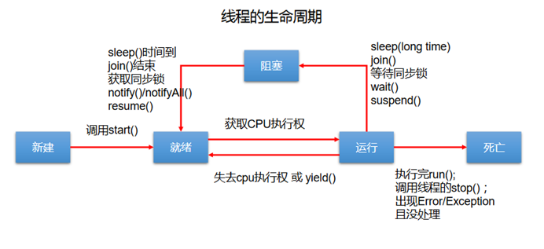

**阻塞：**临时状态，不可以作为最终状态

**死亡：**最终状态。

 

## 线程同步

### 方式一：同步代码块

````java
synchronized(同步监视器){
	//需要被同步的代码
}
````

 **说明：**

* 操作共享数据的代码，即为需要被同步的代码。 -->不能包含代码多了，也不能包含代码少了。
* 共享数据：多个线程共同操作的变量。
* 同步监视器，俗称：锁。任何一个类的对象，都可以充当锁。
  * 要求：**多个线程必须要共用同一把锁。**

* 补充：
  * 在实现`Runnable`接口创建多线程的方式中，我们可以考虑使用`this`充当同步监视器。
  * 在继承`Thread`类创建多线程的方式中，慎用`this`充当同步监视器，考虑使用当前类充当同步监视器。

**实现runnable接口**

````java
class Window1 implements Runnable{
    private int ticket = 100;
    @Override
    public void run() {
        while(true){
            synchronized (this){//此时的this:唯一的Window1的对象   //方式二：synchronized (dog) {
                if (ticket > 0) {
                    try {
                        Thread.sleep(100);
                    } catch (InterruptedException e) {
                        e.printStackTrace();
                    }
                    System.out.println(Thread.currentThread().getName() + ":卖票，票号为：" + ticket);
                    ticket--;
                } else {
                    break;
                }
            }
        }
    }
}
public class WindowTest1 {
    public static void main(String[] args) {
        Window1 w = new Window1();
        Thread t1 = new Thread(w);
        Thread t2 = new Thread(w);
        Thread t3 = new Thread(w);
        t1.setName("窗口1");
        t2.setName("窗口2");
        t3.setName("窗口3");
        t1.start();
        t2.start();
        t3.start();
    }
}
````

**继承thread类**

````java
class Window2 extends Thread{
    private static int ticket = 100;
    private static Object obj = new Object();
    @Override
    public void run() {
        while(true){
 
            synchronized (Window2.class){//Class clazz = Window2.class,Window2.class只会加载一次
                if(ticket > 0){
                    try {
                        Thread.sleep(100);
                    } catch (InterruptedException e) {
                        e.printStackTrace();
                    }
                    System.out.println(getName() + "：卖票，票号为：" + ticket);
                    ticket--;
                }else{
                    break;
                }
            }
        }
    }
}
public class WindowTest2 {
    public static void main(String[] args) {
        Window2 t1 = new Window2();
        Window2 t2 = new Window2();
        Window2 t3 = new Window2();
        t1.setName("窗口1");
        t2.setName("窗口2");
        t3.setName("窗口3")；
        t1.start();
        t2.start();
        t3.start();
    }
}

````

### 方式二：同步方法

 如果操作共享数据的代码完整的声明在一个方法中，我们不妨将此方法声明同步的。

````java
修饰符 synchronize 返回类型 方法名(){
	//方法体
}
````

 

**关于同步方法的总结：**

* 同步方法仍然涉及到同步监视器，只是不需要我们显式的声明。

* 非静态的同步方法，同步监视器是：this 
* 静态的同步方法，同步监视器是：当前类本身(类.class)


**实现runnable接口**

````java
class Window3 implements Runnable {
    private int ticket = 100;
    @Override
    public void run() {
        while (ticket > 0) {
            show();             //调用同步方法
        }
    }
    private synchronized void show(){//同步监视器：this
            if (ticket > 0) {
                try {
                    Thread.sleep(100);
                } catch (InterruptedException e) {
                    e.printStackTrace();
                }
                System.out.println(Thread.currentThread().getName() + ":卖票，票号为：" + ticket);
                ticket--;
            }
    }
}
````


**继承thread类**

````java
class Window4 extends Thread {
    private static int ticket = 100;
    @Override
    public void run() {
        while (ticket > 0) {
            show();
        }
    }
    private static synchronized void show(){//同步监视器：Window4.class//声明为静态方法
        //private synchronized void show(){ //同步监视器：t1,t2,t3。此种解决方式是错误的
        if (ticket > 0) {
            try {
                Thread.sleep(100);
            } catch (InterruptedException e) {
                e.printStackTrace();
            }
            System.out.println(Thread.currentThread().getName() + "：卖票，票号为：" + ticket);
            ticket--;
        }
    }
}
//static声明的方法只会被初始化一次
````


### 方式三：Lock锁

**使用的优先顺序：**Lock ---> 同步代码块（已经进入了方法体，分配了相应资源 ) ---> 同步方法（在方法体之外)

**步骤**

* 实例化`ReentrantLock()`
* 调用锁定方法`lock()`  (开启)
* 调用解锁方法：`unlock()` (关闭)

```java
class 类名 implements Runnable{
    private ReentrantLock 对象名 = new ReentrantLock();
    //private static ReentrantLock 对象名 = new ReentrantLock();     //如果继承Thread，则使用static
    对象名.lock();
    ……要同步的代码
    对象名.unlock()；
}
```

**实现runnable接口**

````java
class Window implements Runnable{
    private int ticket = 100;
    //1.实例化ReentrantLock
    private ReentrantLock lock = new ReentrantLock();
    @Override
    public void run() {
        while(true){
            try{
                //2.调用锁定方法lock()
                lock.lock();
                if(ticket > 0){
                    try {
                        Thread.sleep(100);
                    } catch (InterruptedException e) {
                        e.printStackTrace();
                    }
                    System.out.println(Thread.currentThread().getName() + "：售票，票号为：" + ticket);
                    ticket--;
                }else{
                    break;
                }
            }finally {
                //3.调用解锁方法：unlock()
                lock.unlock();
            }
        }
    }
}
````

**继承thread类**

````java
class myThread extends Thread{
    private static int t=100;
    private static ReentrantLock lock = new ReentrantLock();
   
    @Override
    publicvoid run(){
        while(true){
            try{
                lock.lock();
                if(t>0){
                    System.out.println(Thread.currentThread().getName()+"卖票,票号:"+t);
                    t--;
                }else{
                    break;
                }
            }finally{
                lock.unlock();
            }
        }
    }
}

````


## 线程死锁

**理解：**不同的线程分别占用对方需要的同步资源不放弃，都在等待对方放弃自己需要的同步资源，就形成了线程的死锁

 

**说明：**

* 出现死锁后，不会出现异常，不会出现提示，只是所的线程都处于阻塞状态，无法继续
* 我们使用同步时，要避免出现死锁。


## 线程通信

| 方法                | 作用                                                         |
| ------------------- | :----------------------------------------------------------- |
| wait()              | 线程进入waiting状态，释放锁，唤醒后从被暂停的位置开始运行    |
| wait(long  timeout) | 如果在timeout的时间内没被唤醒，则退出                        |
| notify()            | 随机（优先级高的先唤醒）唤醒一个waiting状态的线程 （同一个监视器） |
| notifyAll()         | 唤醒全部waiting状态的线程（同一个监视器）                    |

**说明**：

* `wait()，notify()，notifyAll()`三个方法必须使用在同步代码块或同步方法中，`LOCK`不行。

* `wait()，notify()，notifyAll()`三个方法的调用者必须是同步代码块或同步方法中的**同步监视器**。否则，会出现`IllegalMonitorStateException`异常

  

**释放锁的操作：**

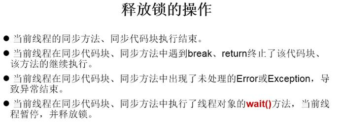

**不会释放锁的操作：**


# 常用类

## String

**概述**

* `String`声明为`final`的，不可被继承

* `String`实现了`Serializable`接口：表示字符串是支持序列化的。

  实现了`Comparable`接口：表示`String`可以比较大小

* `String`内部定义了`final char[] value`用于存储字符串数据

​			`String` 代表不可变的字符序列(`value`不可变，但是`String`的引用可变)

* 通过字面量的方式（区别于new给一个字符串赋值，此时的字符串值声明在字符串常量池中)。
* 字符串常量池中是不会储存相同内容(使用`String`类的`equals()`比较，返回`true`)的字符串的。

 

**`String`的不可变性**

1.当对字符串重新赋值时，需要重写指定内存区域赋值，不能使用原有的`value`进行赋值。

2.当对现有的字符串进行连接操作时，也需要重新指定内存区域赋值，不能使用原有的`value`进行赋值。

3.当调用`String`的`replace()`方法修改指定字符或字符串时，也需要重新指定内存区域赋值，不能使用原有的value进行赋值。


 

**String实例化的不同方式**

方式一：通过字面量定义的方式

方式二：通过new + 构造器的方式

````java
//通过字面量定义的方式：此时的s1和s2的数据javaEE声明在方法区中的字符串常量池中。

String s1 = "javaEE";

String s2 = "javaEE";

//通过new + 构造器的方式:此时的s3和s4保存的地址值，是数据在堆空间中开辟空间以后对应的地址值。

String s3 = new String("javaEE");

String s4 = new String("javaEE");

 

System.out.println(s1 == s2);//true

System.out.println(s1 == s3);//false

System.out.println(s1 == s4);//false

System.out.println(s3 == s4);//false
````

**面试题**

`String s = new String("abc");`方式创建对象，在内存中创建了几个对象？

两个:一个是堆空间中new结构，另一个是char[]对应的常量池中的数据："abc"

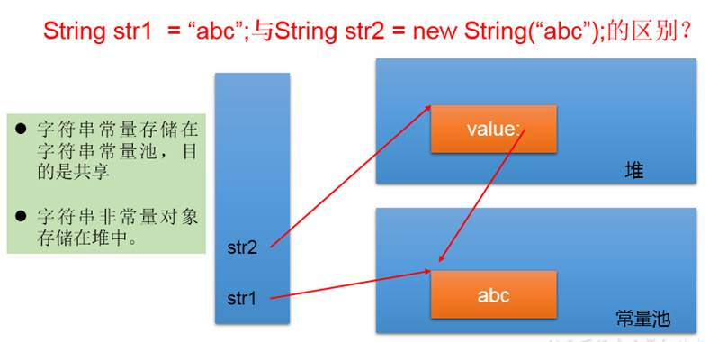

**字符串拼接方式赋值的对比**

* **常量**与**常量**的拼接结果在**常量池**。且常量池中不会存在相同内容的常量。
* 只要其中一个是**变量**，结果就在**堆**中(堆中可重复)。
* 如果拼接的结果调用`intern()`方法，返回值就在常量池中

````java
String s1 = "javaEE";
String s2 = "hadoop";

String s3 = "javaEEhadoop";
String s4 = "javaEE" + "hadoop";
String s5 = s1 + "hadoop";
String s6 = "javaEE" + s2;
String s7 = s1 + s2;


System.out.println(s3 == s4);//true
System.out.println(s3 == s5);//false
System.out.println(s3 == s6);//false
System.out.println(s3 == s7);//false
System.out.println(s5 == s6);//false
System.out.println(s5 == s7);//false
System.out.println(s6 == s7);//false


String s8 = s6.intern();//返回值得到的s8使用的常量值中已经存在的“javaEEhadoop”

System.out.println(s3 == s8);//true

****************************

String s1 = "javaEEhadoop";
String s2 = "javaEE";
String s3 = s2 + "hadoop";
System.out.println(s1 == s3);//false

final String s4 = "javaEE";//s4:常量
String s5 = s4 + "hadoop";
System.out.println(s1 == s5);//true
````


**常用方法：**

| 方法                                               | 作用                                                         |
| -------------------------------------------------- | ------------------------------------------------------------ |
| int length()：                                     | 返回字符串的长度： return  value.length                      |
| char charAt(int index)：                           | 返回某索引处的字符return  value[index]                       |
| boolean isEmpty()：                                | 判断是否是空字符串：return value.length  == 0                |
| String toLowerCase()：                             | 使用默认语言环境，将 String 中的所字符转换为小写(原字符不变，建立新字符串) |
| String toUpperCase()：                             | 使用默认语言环境，将 String 中的所字符转换为大写             |
| String trim()：                                    | 返回字符串的副本，忽略前导空白和尾部空白 (底层使用的还是substring做的切割) |
| boolean equals(Object obj)：                       | 比较字符串的内容是否相同                                     |
| boolean equalsIgnoreCase(String  anotherString)：  | 与equals方法类似，忽略大小写                                 |
| String concat(String str)：                        | 将指定字符串连接到此字符串的结尾。 等价于用“+”(String类型 变量.concat("字符串")) |
| int compareTo(String anotherString)：              | 比较两个字符串的大小                                         |
| String substring(int beginIndex)：                 | 返回一个新的字符串，它是此字符串的从beginIndex开始截取到最后  的一个子字符串。 |
| String substring(int beginIndex, int  endIndex) ： | 返回一个新字符串，它是此字符串从beginIndex开始截取到endIndex(不包含)的一个子字符串。左闭右开[ ) |
| boolean endsWith(String suffix)：                  | 测试此字符串是否以指定的后缀结束                             |
| boolean startsWith(String prefix)：                | 测试此字符串是否以指定的前缀开始                             |
| boolean startsWith(String prefix, int  toffset)：  | 测试此字符串从指定索引（位置）开始的子字符串是否以指定前缀开始 |
| boolean contains(Char Sequence s)：                | 当且仅当此字符串包含指定的 char 值序列时，返回 true          |
| int indexOf(String str)：                          | 返回指定子字符串在此字符串中第一次出现处的索引               |
| int indexOf(String str, int fromIndex)：           | 返回指定子字符串在此字符串中第一次出现处的索引，从指定的索引开始 |
| int lastIndexOf(String str)：                      | 返回指定子字符串在此字符串中最右边出现处的索引(从后往前找)   |
| int lastIndexOf(String str, int  fromIndex)：      | 返回指定子字符串在此字符串中最后一次出现处的索引，从指定的索引开始反向搜索；从fronIndex位置向左找str第一次出现的索引 |
|                                                    | 注：indexOf和lastIndexOf方法如果未找到都是返回-1             |

> **替换：**

| 方法                                                         | 作用                                                         |
| ------------------------------------------------------------ | ------------------------------------------------------------ |
| String replace(char oldChar, char  newChar)：                | 返回一个新的字符串，它是通过用 newChar  替换此字符串中出现的所 oldChar 得到的。(所有的oldChar 替换为 nerChar；原字符串不变，建立新的字符串) |
| String replace(CharSequence target,  CharSequence replacement)： | 使用指定的字面值替换序列替换此字符串所匹配字面值目标序列的子字符串。 |
| String replaceAll(String regex, String  replacement)：       | 使用给定的 replacement 替换此字符串所匹配给定的正则表达式的子字符串。 |
| String replaceFirst(String regex, String  replacement)：     | 使用给定的 replacement 替换此字符串匹配给定的正则表达式的第一个子字符串。 |

 

> **匹配:**

| 方法                             | 作用                                   |
| -------------------------------- | -------------------------------------- |
| boolean  matches(String regex)： | 告知此字符串是否匹配给定的正则表达式。 |

> **切片：**

| 方法                                      | 作用                                                         |
| ----------------------------------------- | ------------------------------------------------------------ |
| String[] split(String regex)：            | 根据给定正则表达式的匹配拆分此字符串。                       |
| String[] split(String regex, int limit)： | 根据匹配给定的正则表达式来拆分此字符串，最多不超过limit个，如果超过了，剩下的全部都放到最后一个元素中。 |

````java
String str = "sgs#jkc#eer"; 
String[] str1 = str.split("#"); 
for (int i = 0; i < str1.length; i++) {
 System.out.println(str1[i]);
 //输出结果是sgs jkc ee
}
````


**String与其它结构的转换**    

> **与基本数据类型、包装类之间的转换**

  `String --> 基本数据类型、包装类：调用包装类的静态方法：parseXxx(str)`

  `基本数据类型、包装类 --> String:调用String重载的valueOf(xxx)`


> **与字符数组之间的转换**

`String --> char[]:调用String的toCharArray()`

`char[] --> String:调用String的构造器`


> **与字节数组之间的转换**

编码：String --> byte[]:调用String的getBytes()

解码：`byte[] --> String:调用String的构造器`

说明：解码时，要求解码使用的字符集必须与编码时使用的字符集一致，否则会出现乱码。

 ````java
 
 public void test3() throws UnsupportedEncodingException {
   String str1 = "Java我爱你";
   byte[] bytes = str1.getBytes();//使用默认的字符集，进行编码。
   byte[] gbks = str1.getBytes("gbk");//使用gbk字符集进行编码。
 
   String str2 = new String(bytes);//使用默认的字符集，进行解码。
   String str4 = new String(gbks, "gbk"); //指定解码方式
 }
 ````


> **与StringBuffer、StringBuilder之间的转换**

`String -->StringBuffer、StringBuilder:调用StringBuffer、StringBuilder构造器`

`StringBuffer、StringBuilder -->String:①调用String构造器；②StringBuffer、StringBuilder的toString()`


**JVM中字符串常量池存放位置：**

jdk 1.6:字符串常量池存储在方法区（永久区）

jdk 1.7:字符串常量池存储在堆空间

jdk 1.8:字符串常量池存储在方法区（元空间）

 


## Stringbuffer/StringBuilder

**String、StringBuffer、StringBuilder三者的对比**

**String:**不可变的字符序列；底层使用char[]存储

**StringBuffer:**可变的字符序列；线程安全的，效率低；底层使用char[]存储

**StringBuilder:**可变的字符序列；jdk5.0新增的，线程不安全的，效率高；底层使用char[] 存储

 

**StringBuffer与StringBuilder的内存解析**

以StringBuffer为例：

````java
String str = new String();//char[] value = new char[0];

String str1 = new String("abc");//char[] value = new char[]{'a','b','c'};

StringBuffer sb1 = new StringBuffer();//char[] value = new char[16];底层创建了一个长度是16的数组。

System.out.println(sb1.length());//

sb1.append('a');//value[0] = 'a';

sb1.append('b');//value[1] = 'b';


StringBuffer sb2 = new StringBuffer("abc");//char[] value = new char["abc".length() + 16];
````

 **扩容问题:**

* 如果要添加的数据底层数组盛不下了，那就需要扩容底层的数组。
* 默认情况下，扩容为原来容量的2倍 + 2，同时将原数组中的元素复制到新的数组中。

**对比String、StringBuffer、StringBuilder三者的执行效率**

从高到低排列：`StringBuilder > StringBuffer > String`

 

**常用方法**

| 作用     | 方法                                                         |
| -------- | ------------------------------------------------------------ |
| 增：     | append(xxx)                                                  |
| 删：     | delete(int start,int end)                                    |
| 改：     | setCharAt(int n ,char ch) / replace(int  start, int end, String str) |
| 查：     | charAt(int n )                                               |
| 插：     | insert(int offset, xxx)                                      |
| 长度：   | length();                                                    |
| 遍历：   | for() + charAt() / toString()                                |
| 反转     | reverse()                                                    |
| 截取     | substring(int start,int  end):                               |
| 返回位置 | indexOf(String str):                                         |

 


## 时间

### JDK8之前：

**获取系统当前时间：**`System类中的currentTimeMillis()`

````java
long time = System.currentTimeMillis();
//返回当前时间与1970年1月1日0时0分0秒之间以毫秒为单位的时间差。
//称为时间戳
````


**java.util.Date类与java.sql.Date类**

  `java.util.Date类`

​      `|---java.sql.Date类    （子父类）`

 **使用**

​    构造器一：`Date()`创建一个对应当前时间的Date对象

​    构造器二：创建指定毫秒数的Date对象(相当于翻译时间戳)

​    `toString():`显示当前的年、月、日、时、分、秒

​    `getTime():`获取当前Date对象对应的毫秒数。（时间戳）

 

**java.sql.Date**对应着数据库中的日期类型的变量(一般数据库交互才使用)

````java
@Test
public void test2(){
    //构造器一：Date()：创建一个对应当前时间的Date对象
    Date date1 = new Date();
    System.out.println(date1.toString());//Sat Feb 16 16:35:31 GMT+08:00 2019

    System.out.println(date1.getTime());//1550306204104

    //构造器二：创建指定毫秒数的Date对象
    Date date2 = new Date(155030620410L);(相当于翻译时间戳)
    System.out.println(date2.toString());

    //创建java.sql.Date对象
    java.sql.Date date3 = new java.sql.Date(35235325345L);
    System.out.println(date3);//1971-02-13

    //如何将java.util.Date对象转换为java.sql.Date对象
    //情况一：
	//        Date date4 = new java.sql.Date(2343243242323L);(多态，sql.data是util.data的子类)
	//        java.sql.Date date5 = (java.sql.Date) date4;
    //情况二：
    Date date6 = new Date();
    java.sql.Date date7 = new java.sql.Date(date6.getTime());
}

````


**java.text.SimpleDataFormat类**

> **两个操作：**

* 格式化：日期 --->字符串,`实例化对象.format(Data类型)`
* 解析：格式化的逆过程，字符串 ---> 日期,`实例化对象.parse()` 

````java
SimpleDateFormat sdf = new SimpleDateFormat();
Date date = new Date();
System.out.println(date);
String sdf1 = sdf.format(date);
System.out.println(sdf1);


try {
  Date date1 = sdf.parse(sdf1);
  System.out.println(date1);

} catch (ParseException e) {
  e.printStackTrace();
}
````


> **照指定的方式格式化和解析：**调用带参的构造器

````java
//SimpleDateFormat sdf1 = new SimpleDateFormat("yyyyy.MMMMM.dd GGG hh:mm aaa");
SimpleDateFormat sdf1 = new SimpleDateFormat("yyyy-MM-dd hh:mm:ss");
//格式化
String format1 = sdf1.format(date);
System.out.println(format1);//2019-02-18 11:48:27

//解析:要求字符串必须是符合SimpleDateFormat识别的格式(通过构造器参数体现),
//否则，抛异常
Date date2 = sdf1.parse("2020-02-18 11:48:27");
System.out.println(date2);
格式：
yyyy MM dd  hh:mm:ss
y年 M月 d日 h时 m分 s秒
````


**Calendar类：**日历类、抽象类

> **实例化**

方式一：创建其子类（`GregorianCalendar`的对象)

方式二：调用其静态方法 `Calender.getInstance()`

`Calendar calendar = Calendar.getInstance();`    

 

> **常用方法**

````java
//get()
int days = calendar.get(Calendar.DAY_OF_MONTH);//当前日期是本月的第几天
System.out.println(days);
System.out.println(calendar.get(Calendar.DAY_OF_YEAR));//当前日期是本年的第几天

//set()//修改时间
//calendar可变性
calendar.set(Calendar.DAY_OF_MONTH,22);//修改为本月的22号
days = calendar.get(Calendar.DAY_OF_MONTH);
System.out.println(days);

//add()//在原有基础添加
calendar.add(Calendar.DAY_OF_MONTH,-3);
days = calendar.get(Calendar.DAY_OF_MONTH);
System.out.println(days);

//getTime():日历类---> Date
````


### JDK8之后

**涉及到的包**


**本地日期、本地时间、本地日期时间的使用：**`LocalDate / LocalTime / LocalDateTime`

> **常用方法：**


> **实例化**

`LocalDate localDate = LocalDate.now();`

`LocalTime localTime = LocalTime.now();`

`LocalDateTime localDateTime = LocalDateTime.now();`


**时间点：Instant** 

① 时间线上的一个瞬时点。 概念上讲，它只是简单的表示自1970年1月1日0时0分0秒（UTC开始的秒数。）

② 类似于 java.util.Date类

> **常用方法**：


> 实例化：

`Instant.now`

 

**日期时间格式化类：DateTimeFormatter**


> **常用方法**：

① 实例化方式：

预定义的标准格式。如：`ISO_LOCAL_DATE_TIME;ISO_LOCAL_DATE;ISO_LOCAL_TIME`

本地化相关的格式。如：`ofLocalizedDateTime(FormatStyle.LONG)`

自定义的格式。如：`ofPattern(“yyyy-MM-dd hh:mm:ss”)`

② 常用方法：

 


 

自定义的格式。如：`ofPattern(“yyyy-MM-dd hh:mm:ss”)`

````JAVA
DateTimeFormatter formatter3 = DateTimeFormatter.ofPattern("yyyy-MM-dd hh:mm:ss");
//格式化
String str4 = formatter3.format(LocalDateTime.now());
System.out.println(str4);//2019-02-18 03:52:09

//解析
TemporalAccessor accessor = formatter3.parse("2019-02-18 03:52:09");
System.out.println(accessor);
````


**其它API**

> **时间间隔：**Duration--用于计算两个“时间”间隔，以秒和纳秒为基准

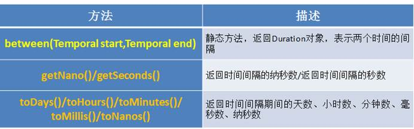

````JAVA
@Test
public void test3(){
        LocalTime localTime = LocalTime.now();
        LocalTime localTime1 = LocalTime.of(15, 23, 32);
        //between():静态方法，返回Duration对象，表示两个时间的间隔
        Duration duration = Duration.between(localTime1, localTime);
        System.out.println(duration);

        System.out.println(duration.getSeconds());
        System.out.println(duration.getNano());

        LocalDateTime localDateTime = LocalDateTime.of(2016, 6, 12, 15, 23, 32);
        LocalDateTime localDateTime1 = LocalDateTime.of(2017, 6, 12, 15, 23, 32);

        Duration duration1 = Duration.between(localDateTime1, localDateTime);
        System.out.println(duration1.toDays());
}
````


> **日期间隔**：Period --用于计算两个“日期”间隔，以年、月、日衡量


````JAVA
@Test
public void test4(){
        LocalDate localDate = LocalDate.now();
        LocalDate localDate1 = LocalDate.of(2028, 3, 18);

        Period period = Period.between(localDate, localDate1);
        System.out.println(period);

        System.out.println(period.getYears());
        System.out.println(period.getMonths());
        System.out.println(period.getDays());

        Period period1 = period.withYears(2);
        System.out.println(period1);
}
````


## Arrays

| 方法              | 作用             |
| ----------------- | ---------------- |
| String toString() | 数组转字符串     |
| void fill()       | 填充数组         |
| copyOf()          | 拷贝数组，并返回 |
| sort()            | 排序数组         |
| equals()          | 比较数组         |
| deepEquals()      | 多维数组比较     |
| binarySearch()    | 二分查找返回下标 |
| asList()          | 数组转链表       |

**数组转字符串**

````java
int[] array = new int[]{1, 2, 3};
out.println(Arrays.toString(array)); //[1, 2, 3]
````

如果是一维数组，`toString`方法可以很好的适用。但遇到多维数组时，需要使用`deepToString`把数组完全转成字符串。

````java
int[][] deepArray = new int[][]{{1, 3},{2, 4}};
out.println(Arrays.toString(deepArray)); //[[I@1540e19d, [I@677327b6]
out.println(Arrays.deepToString(deepArray)); //[[1, 3], [2, 4]]
````

**填充数组**

````java
array = new int[5];
Arrays.fill(array, 2);
out.println(Arrays.toString(array)); //[2, 2, 2, 2, 2]

array = new int[5];
Arrays.fill(array, 1, 4, 2); //部分填充
out.println(Arrays.toString(array));//[0, 2, 2, 2, 0]
````


**数组元素排序**

````java
array = new int[]{3, 10, 4, 0, 2};
Arrays.sort(array);
out.println(Arrays.toString(array)); //[0, 2, 3, 4, 10]

array = new int[]{3, 10, 4, 0, 2};
Arrays.parallelSort(array); //和sort相比是这个是并行的
out.println(Arrays.toString(array)); //[0, 2, 3, 4, 10]

array = new int[]{3, 10, 4, 0, 2};
Arrays.sort(array, 0, 4); //部分排序
out.println(Arrays.toString(array)); //[0, 3, 4, 10, 2]
````

**数组的比较**

````java
array = new int[]{1, 2, 3};
int[] array2 = new int[]{1, 2, 3};
out.println(Arrays.equals(array, array2)); //true
````

和`toString`方法一样，`equals`方法遇到多维数组时也会出现问题。

````java
int[][] deepArray1 = new int[][]{{1, 3},{2, 4}};
int[][] deepArray2 = new int[][]{{1, 3},{2, 4}};
out.println(Arrays.equals(deepArray1, deepArray2)); //false
out.println(Arrays.deepEquals(deepArray1, deepArray2)); //true
````


**数组复制**

````java
array = new int[]{3, 10, 4, 0, 2};
int[] arrayCopy = Arrays.copyOf(array, 3);
out.println(Arrays.toString(arrayCopy)); //[3, 10, 4]

arrayCopy = Arrays.copyOf(array, 7);
out.println(Arrays.toString(arrayCopy)); //[3, 10, 4, 0, 2, 0, 0], 多出的长度补0

arrayCopy = Arrays.copyOfRange(array, 1, 4);
out.println(Arrays.toString(arrayCopy)); //[10, 4, 0]
````


**二分查找返回下标**

````java
array = new int[]{0, 3, 4, 10, 20};
out.println(Arrays.binarySearch(array, 10)); //3, array必须是排序的，否则得到的是错误的结果
out.println(Arrays.binarySearch(array, 6)); //-4, 找不到的值，从-1开始，6如果存在下标是3， 所以返回-4
out.println(Arrays.binarySearch(array, 2, 5, 10)); //3, 返回的还是全局的下标值。
````


**数组转List**

````java
int array = new int[]{3, 10, 4, 0, 2};
out.println(Arrays.asList(array).contains(3)); //false

Integer arr[] = new Integer[]{3, 10, 4, 0, 2};
out.println(Arrays.asList(arr).contains(3)); //true
````


这里是比较有意思的地方，实际上拆开来看是这样的

````java
int array = new int[]{3, 10, 4, 0, 2};
List<int[]> ints = Arrays.asList(array);
````

````java
Integer arr[] = new Integer[]{3, 10, 4, 0, 2};
List<Integer> integers = Arrays.asList(arr);
````


现在就知道区别了，**原始数据类型int的数组调用asList之后得到的List只有一个元素，这个元素就是元素类型的数组**。**而封装类Integer数组调用asList是把数组中每个元素加到了List中**。


## 比较器

使用`Arrays.sort()、Collections.sort()`进行排序


> 两种排序方式对比

* Comparable接口的方式一旦一定，保证Comparable接口实现类的对象在任何位置都可以比较大小。

* Comparator接口属于临时性的比较。

  

### 自然排序：Comparable接口

**说明**

* 像`String、包装类等实现了Comparable`接口，重写了`compareTo(obj)`方法，给出了比较两个对象大小的方式。
* 像`String、包装类重写compareTo()`方法以后，进行了从小到大的排列
* 重写`compareTo(obj)`的规则：
  * 如果当前对象this大于形参对象obj，则返回正整数
  * 如果当前对象this小于形参对象obj，则返回负整数
  * 如果当前对象this等于形参对象obj，则返回零。

* 对于自定义类来说，如果需要排序，我们可以让自定义类实现`Comparable`接口，重写`compareTo(obj)`方法。

  ````java
  String[] arr = new String[]{"AA","CC","KK","MM","GG","JJ","DD"};
  Arrays.sort(arr)
  ````

````java
public class Goods implements  Comparable{

    private String name;
    private double price;

    //指明商品比较大小的方式:照价格从低到高排序,再照产品名称从高到低排序
    @Override
    public int compareTo(Object o) {
        if(o instanceof Goods){
            Goods goods = (Goods)o;
            //方式一：
            if(this.price > goods.price){
                return 1;
            }else if(this.price < goods.price){
                return -1;
            }else{
				//return 0;
               return this.name.compareTo(goods.name);//调用的是String下重写的compareTo，因为name是String类型，不属于自定义类产品名称从高到低排序
            }
            //方式二：
			//return Double.compare(this.price,goods.price);
        }
		//return 0;
        throw new RuntimeException("传入的数据类型不一致！");
    }
	// getter、setter、toString()、构造器：省略
}
````


### 定制排序：Comparator接口

**说明**

* 当元素的类型没实现`java.lang.Comparable`接口而又不方便修改代码，或者实现了`java.lang.Comparable`接口的排序规则不适合当前的操作，那么可以考虑使用 `Comparator` 的对象来排序

* 重写`compare(Object o1,Object o2)`方法，比较o1和o2的大小：
  * 如果方法返回正整数，则表示o1大于o2 ；
  * 如果返回0，表示相等；
  * 返回负整数，表示o1小于o2。

````java
Comparator com = new Comparator() {
    //指明商品比较大小的方式:照产品名称从低到高排序,再照价格从高到低排序
    @Override
    public int compare(Object o1, Object o2) {
        if(o1 instanceof Goods && o2 instanceof Goods){
            Goods g1 = (Goods)o1;
            Goods g2 = (Goods)o2;
            if(g1.getName().equals(g 2.getName())){
                return -Double.compare(g1.getPrice(),g2.getPrice());//相当于if else 比较大小
            }else{
                return g1.getName().compareTo(g2.getName());
            }
        }
        throw new RuntimeException("输入的数据类型不一致");
    }
}
````


**商品名从大到小排列，价格从大到小排列**

> 接口Comparable

````java
public class Goods implements Comparable{
    private String name;
    private int Price;
    public Goods(String name, int Price) {
        this.name = name;
        this.Price = Price;
    }
    @Override
    public String toString() {
        return "Goods{" +
                "name='" + name + '\'' +
                ", Price=" + Price +
                '}';
    }
    @Override
    public int compareTo(Object o) {
        if(o instanceof Goods){
            Goods comparableTest = (Goods)o;
            if(!this.name.equals(comparableTest.name)){
                return this.name.compareTo(comparableTest.name);
            }else{
                if(this.Price > comparableTest.Price){
                    return -1;
                }else if(this.Price < comparableTest.Price){
                    return 1;
                }else{
                    return 0;
                }
            }
        }
        throw new RuntimeException("类型不一致");
    }
}

public class ComparableTest {
    public static void main(String[] args) {
        List<Goods> list = new ArrayList<Goods>();
        list.add(new Goods("D",18));
        list.add(new Goods("A",20));
        list.add(new Goods("A",18));
        list.add(new Goods("B",18));
        list.add(new Goods("A",19));
        list.add(new Goods("C",18));

        System.out.println(list);
        Collections.sort(list);     //使用内部排序
        System.out.println(list);
    }
}
````


> 接口Comparator

````java
public class Goods {
    String name;
    int Price;
    public Goods(String name, int Price) {
        this.name = name;
        this.Price = Price;
    }
    @Override
    public String toString() {
        return "Goods{" +
                "name='" + name + '\'' +
                ", age=" + Price +
                '}';
    }
}

public class ComparatorTest {
    public static void main(String[] args) {
        List<Goods> list = new ArrayList<>();
        Comparator comparator = new Comparator() {
            @Override
            public int compare(Object o1, Object o2) {
                if(o1 instanceof Goods && o2 instanceof  Goods){
                    Goods g1 = (Goods) o1;
                    Goods g2 = (Goods) o2;
                    if(!g1.name.equals(g2.name)){
                        return g1.name.compareTo(g2.name);
                    }else{
                        if(g1.Price > g2.Price){
                            return -1;
                        }else if(g1.Price < g2.Price){
                            return 1;
                        }else{
                            return 0;
                        }
                    }
                }
                throw new RuntimeException("类型不一致");
            }
        };
        list.add(new Goods("D",18));
        list.add(new Goods("A",20));
        list.add(new Goods("A",18));
        list.add(new Goods("B",18));
        list.add(new Goods("A",19));
        list.add(new Goods("C",18));

        System.out.println(list);
        Collections.sort(list,comparator); //使用外部排序
        System.out.println(list);
    }
}
````

例二：

````java
import javax.imageio.plugins.tiff.ExifParentTIFFTagSet;
import java.util.Arrays;
import java.util.Comparator;

class Goods{
    private String name;
    private double price;

    public Goods(String name, double price) {
        this.name = name;
        this.price = price;
    }

    public Goods() {
    }

    public String getName() {
        return name;
    }

    public void setName(String name) {
        this.name = name;
    }

    public double getPrice() {
        return price;
    }

    public void setPrice(double price) {
        this.price = price;
    }

    @Override
    public String toString() {
        return "Goods{" +
                "name='" + name + '\'' +
                ", price=" + price +
                '}';
    }
}

public class test {
    public static void main(String[] args) {
        Goods[] goods = new Goods[5];

        goods[0] = new Goods("xiaomi", 239);
        goods[1] = new Goods("luoji", 369);
        goods[2] = new Goods("huawei", 29);
        goods[3] = new Goods("leishe", 129);
        goods[4] = new Goods("xiaomi", 239);


        Comparator comparator = new Comparator() {
            @Override
            public int compare(Object o1, Object o2) {
                if (o1 instanceof Goods && o2 instanceof Goods) {
                    Goods g1 = (Goods) o1;
                    Goods g2 = (Goods) o2;

                    if (g1.getPrice() > g2.getPrice()) {
                        return 1;
                    } else if (g1.getPrice() < g2.getPrice()) {
                        return -1;
                    } else {
                        return g1.getName().compareTo(g2.getName());
                    }
                }
                throw new RuntimeException("输入的数据类型不一致");
            }
        };
        Arrays.sort(goods,comparator);
        System.out.println(Arrays.toString(goods));
    }

    //Arrays.sort(goods, new Comparator() {
    //        //指明商品比较大小的方式:照产品名称从低到高排序,再照价格从高到低排序
    //        @Override
    //        public int compare(Object o1, Object o2) {
    //            if(o1 instanceof Goods && o2 instanceof Goods){
    //                Goods g1 = (Goods)o1;
    //                Goods g2 = (Goods)o2;
    //                if(g1.getName().equals(g2.getName())){
    //                    return -Double.compare(g1.getPrice(),g2.getPrice());
    //                }else{
    //                    return -g1.getName().compareTo(g2.getName());
    //                }
    //            }
    //            throw new RuntimeException("输入的数据类型不一致");
    //        }
    //    });
    //
    //    System.out.println(Arrays.toString(goods));
    //
    //}
}
````


## 其他类

**System**类

`System`类代表系统，系统级的很多属性和控制方法都放置在该类的内部。该类位于`java.lang`包。

由于该类的构造器是`private`的，所以无法创建该类的对象，也就是无法实例化该类。其内部的成员变量和成员方法都是`static`的，所以也可以很方便的进行调用。

> 方法：

| 方法                            | 作用                                                     |
| ------------------------------- | -------------------------------------------------------- |
| native long currentTimeMillis() | 返回但前系统时间                                         |
| void exit(int status)           | 退出程序,其中status的值为0代表正常退出，非零代表异常退出 |
| void gc()                       | 请求系统进行垃圾回收                                     |
| String getProperty(String key)  |                                                          |


**Math类**

`java.lang.Math`提供了一系列静态方法用于科学计算。其方法的参数和返回值类型一般为`double`型。

 

**BigInteger类、BigDecimal类**

* `java.math`包的`BigInteger`可以表示不可变的任意精度的整数。
* 要求数字精度比较高，用到`java.math.BigDecimal`类
* 代码举例：

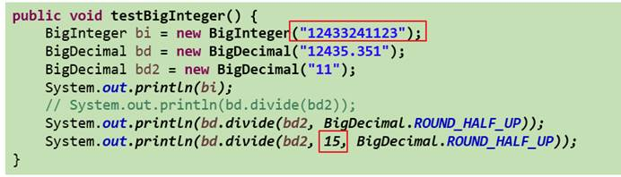

 


# 枚举类

**枚举博客：**

[Enum（枚举类）](https://blog.csdn.net/qq_31655965/article/details/55049192)

[深入理解Java枚举类型(enum)](https://blog.csdn.net/javazejian/article/details/71333103)


**实例方法**：由于枚举类的构造器是私有化的，所以不能通过`new`的形式实例化对象

* `枚举类.valueOf()` 方法：它的作用是传来一个字符串，然后将它转变为对应的枚举变量。前提是你传的字符串和定义枚举变量的字符串一模一样，区分大小写。如果你传了一个不存在的字符串，那么会抛出异常。 (根据字符串获取名称)
* `枚举类.values()方法`： 这个方法会返回包括所有枚举变量的数组。


**常用方法**

* `枚举变量.toString()`：该方法直接返回枚举定义枚举变量的字符串，比如MON就返回【”MON”】。
* `枚举变量.ordinal()`：枚举类会给所有的枚举变量一个默认的次序，该次序从0开始，类似于数组的下标。而.ordinal()方法就是获取这个次序（获取下标）
* `枚举变量.compareTo()`：该方法用来比较两个枚举变量的”大小”，实际上比较的是两个枚举变量的次序，返回两个次序相减后的结果，如果为负数，就证明变量1”小于”变量2 （变量1.compareTo(变量2)，返回【变量1.ordinal() - 变量2.ordinal()】）


* `枚举类.name()`：它和toString()方法的返回值一样，事实上，这两个方法本来就是一样的：

* `getDeclaringClass`：返回与此枚举常量的枚举类型相对应的 Class 对象

 

**自定义枚举类** 

````java
//自定义枚举类
class Season{
    //1.声明Season对象的属性:private final修饰
    private final String seasonName;
    private final String seasonDesc;

    //2.私有化的构造器,并给对象属性赋值;
    private Season(String seasonName,String seasonDesc){
        this.seasonName = seasonName;
        this.seasonDesc = seasonDesc;
    }

    //3.提供当前枚举类的多个对象：因为是public static final，不会陷入递归循环
    public static final Season SPRING = new Season("春天","春暖花开");
    public static final Season SUMMER = new Season("夏天","夏日炎炎");
    public static final Season AUTUMN = new Season("秋天","秋高气爽");
    public static final Season WINTER = new Season("冬天","冰天雪地");

    //4.其他诉求1：获取枚举类对象的属性
    public String getSeasonName() {
        return seasonName;
    }

    public String getSeasonDesc() {
        return seasonDesc;
    }
    //4.其他诉求1：提供toString()
    @Override
    public String toString() {
        return "Season{" +
                "seasonName='" + seasonName + '\'' +
                ", seasonDesc='" + seasonDesc + '\'' +
                '}';
    }
}
````


**jdk 5.0 新增使用enum定义枚举类。**

使用`enum`关键字枚举类

````java
enum Season1 {
    //1.当前枚举类的对象，多个对象之间用","隔开，末尾对象";"结束
    SPRING("春天","春暖花开"),
    SUMMER("夏天","夏日炎炎"),
    AUTUMN("秋天","秋高气爽"),
    WINTER("冬天","冰天雪地");

    //2.声明Season对象的属性:private final修饰
    private final String seasonName;
    private final String seasonDesc;

    //3.私化类的构造器,并给对象属性赋值
    private Season1(String seasonName,String seasonDesc){
        this.seasonName = seasonName;
        this.seasonDesc = seasonDesc;
    }

    //4.其他诉求1：获取枚举类对象的属性
    public String getSeasonName() {
        return seasonName;
    }

    public String getSeasonDesc() {
        return seasonDesc;
    }

}
````

**原理**

> 实际上在使用关键字`enum`创建枚举类型并编译后，编译器会为我们生成一个相关的类，这个类继承了Java API中的`java.lang.Enum`类

````java
//定义枚举类型
enum Day {
    MONDAY, TUESDAY, WEDNESDAY,
    THURSDAY, FRIDAY, SATURDAY, SUNDAY
}
````

````java
//反编译Day.class
final class Day extends Enum
{
    //编译器为我们添加的静态的values()方法
    public static Day[] values()
    {
        return (Day[])$VALUES.clone();
    }
    //编译器为我们添加的静态的valueOf()方法，注意间接调用了Enum也类的valueOf方法
    public static Day valueOf(String s)
    {
        return (Day)Enum.valueOf(com/zejian/enumdemo/Day, s);
    }
    //私有构造函数
    private Day(String s, int i)
    {
        super(s, i);
    }
     //前面定义的7种枚举实例
    public static final Day MONDAY;
    public static final Day TUESDAY;
    public static final Day WEDNESDAY;
    public static final Day THURSDAY;
    public static final Day FRIDAY;
    public static final Day SATURDAY;
    public static final Day SUNDAY;
    private static final Day $VALUES[];

    static 
    {    
        //实例化枚举实例
        MONDAY = new Day("MONDAY", 0);
        TUESDAY = new Day("TUESDAY", 1);
        WEDNESDAY = new Day("WEDNESDAY", 2);
        THURSDAY = new Day("THURSDAY", 3);
        FRIDAY = new Day("FRIDAY", 4);
        SATURDAY = new Day("SATURDAY", 5);
        SUNDAY = new Day("SUNDAY", 6);
        $VALUES = (new Day[] {
            MONDAY, TUESDAY, WEDNESDAY, THURSDAY, FRIDAY, SATURDAY, SUNDAY
        });
    }
}
````


**枚举类对象分别实现接口**

> 例一

````java
interface Info{
    void show();
}

//使用enum关键字枚举类
enum Season1 implements Info{
    //1.提供当前枚举类的对象，多个对象之间用","隔开，末尾对象";"结束
    SPRING("春天","春暖花开"){
        @Override
        public void show() {
            System.out.println("春天在哪里？");
        }
    },
    SUMMER("夏天","夏日炎炎"){
        @Override
        public void show() {
            System.out.println("宁夏");
        }
    },
    AUTUMN("秋天","秋高气爽"){
        @Override
        public void show() {
            System.out.println("秋天不回来");
        }
    },
    WINTER("冬天","冰天雪地"){
        @Override
        public void show() {
            System.out.println("大约在冬季");
        }
    };
}
````


> 例二

````java
//有时候，我们可能需要对一组数据进行分类，比如进行食物菜单分类而且希望这些菜单都属于food类型，appetizer(开胃菜)、mainCourse(主菜)、dessert(点心)、Coffee等，每种分类下有多种具体的菜式或食品，此时可以利用接口来组织，如下(代码引用自Thinking in Java)：
public interface Food {
  enum Appetizer implements Food {
    SALAD, SOUP, SPRING_ROLLS;
  }
  enum MainCourse implements Food {
    LASAGNE, BURRITO, PAD_THAI,
    LENTILS, HUMMOUS, VINDALOO;
  }
  enum Dessert implements Food {
    TIRAMISU, GELATO, BLACK_FOREST_CAKE,
    FRUIT, CREME_CARAMEL;
  }
  enum Coffee implements Food {
    BLACK_COFFEE, DECAF_COFFEE, ESPRESSO,
    LATTE, CAPPUCCINO, TEA, HERB_TEA;
  }
}
public class TypeOfFood {
  public static void main(String[] args) {
    Food food = Appetizer.SALAD;
    food = MainCourse.LASAGNE;
    food = Dessert.GELATO;
    food = Coffee.CAPPUCCINO;
  }
} 
//通过这种方式可以很方便组织上述的情景，同时确保每种具体类型的食物也属于Food，现在我们利用一个枚举嵌套枚举的方式，把前面定义的菜谱存放到一个Meal菜单中，通过这种方式就可以统一管理菜单的数据了。
public enum Meal{
  APPETIZER(Food.Appetizer.class),
  MAINCOURSE(Food.MainCourse.class),
  DESSERT(Food.Dessert.class),
  COFFEE(Food.Coffee.class);
  private Food[] values;
  private Meal(Class<? extends Food> kind) {
    //通过class对象获取枚举实例
    values = kind.getEnumConstants();
  }
  public interface Food {
    enum Appetizer implements Food {
      SALAD, SOUP, SPRING_ROLLS;
    }
    enum MainCourse implements Food {
      LASAGNE, BURRITO, PAD_THAI,
      LENTILS, HUMMOUS, VINDALOO;
    }
    enum Dessert implements Food {
      TIRAMISU, GELATO, BLACK_FOREST_CAKE,
      FRUIT, CREME_CARAMEL;
    }
    enum Coffee implements Food {
      BLACK_COFFEE, DECAF_COFFEE, ESPRESSO,
      LATTE, CAPPUCCINO, TEA, HERB_TEA;
    }
  }
} 
````


**enum类中定义抽象方法**

> 与常规抽象类一样，enum类允许我们为其定义抽象方法，然后使每个枚举实例都实现该方法，以便产生不同的行为方式

````java
public enum EnumDemo3 {
    FIRST{
        @Override
        public String getInfo() {
            return "FIRST TIME";
        }
    },
    SECOND{
        @Override
        public String getInfo() {
            return "SECOND TIME";
        }
    };
    
    /**
     * 定义抽象方法
     * @return
     */
    public abstract String getInfo();
    
    //测试
    public static void main(String[] args){
        System.out.println("F:"+EnumDemo3.FIRST.getInfo());
        System.out.println("S:"+EnumDemo3.SECOND.getInfo());
        /**
         输出结果:
         F:FIRST TIME
         S:SECOND TIME
         */
    }
}
````

通过这种方式就可以轻而易举地定义每个枚举实例的不同行为方式。enum类的实例似乎表现出了多态的特性，可惜的是枚举类型的实例终究不能作为类型传递使用，就像下面的使用方式，编译器是不可能答应的：

````java
//无法通过编译,毕竟EnumDemo3.FIRST是个实例对象
public void text(EnumDemo3.FIRST instance){ }
````


**枚举与switch**

使用`switch`进行条件判断时，条件参数一般只能是整型，字符型。而枚举型确实也被`switch`所支持，在java 1.7后`switch`也对字符串进行了支持。

````java
enum Color {
    GREEN,RED,BLUE
}

public class EnumDemo4 {

    public static void printName(Color color){
        switch (color){
            case BLUE: //无需使用Color进行引用
                System.out.println("蓝色");
                break;
            case RED:
                System.out.println("红色");
                break;
            case GREEN:
                System.out.println("绿色");
                break;
        }
    }
    public static void main(String[] args){
        printName(Color.BLUE);
        printName(Color.RED);
        printName(Color.GREEN);

        //蓝色
        //红色
        //绿色
    }
}
````


 ## EnumMap/EnumSet


# 注解

参考博客

[深入理解Java注解类型](https://blog.csdn.net/javazejian/article/details/71860633)

[java注解](https://blog.csdn.net/qq1404510094/article/details/80577555)


## **基本语法**                                                                                                                                                                                 

**声明注解**

注解通过 `@interface` 关键字进行定义。

````java
@Retention(RetentionPolicy.RUNTIME)  //保留期(生命周期)
@Target({ElementType.METHOD})        //使用的位置
public @interface Test {              
	……
}
````


**Java内置注解**

`@Override`：用于标明此方法覆盖了父类的方法

`@Deprecated`：用于标明已经过时的方法或类

`@SuppressWarnnings`:用于有选择的关闭编译器对类、方法、成员变量、变量初始化的警告，其实现源码如下：

````java
@Target({TYPE, FIELD, METHOD, PARAMETER, CONSTRUCTOR, LOCAL_VARIABLE})
@Retention(RetentionPolicy.SOURCE)
public @interface SuppressWarnings {
	String[] value();
}
````

其内部有一个String数组，主要接收值如下：

* `deprecation`：使用了不赞成使用的类或方法时的警告；
* `unchecked`：执行了未检查的转换时的警告，例如当使用集合时没有用泛型 (`Generics`) 来指定集合保存的类型; 
* `fallthrough`：当 `Switch` 程序块直接通往下一种情况而没有 `Break` 时的警告;
* `path`：在类路径、源文件路径等中有不存在的路径时的警告; 
* `serial`：当在可序列化的类上缺少 `serialVersionUID` 定义时的警告; 
* `finally`：任何 `finally` 子句不能正常完成时的警告; 
* `all`：关于以上所有情况的警告。

 


**元注解**

元注解是可以注解到注解上的注解

元标签有 `@Retention、@Documented、@Target、@Inherited、@Repeatable(JDK8引入)` 5 种。

>  **@Targer**

`@Target` 用来约束注解可以应用的地方（如方法、类或字段），传入`ElementType`类型的参数，其中`ElementType`是枚举类型，其定义如下，也代表可能的取值范围

````java
public enum ElementType {
    /**标明该注解可以用于类、接口（包括注解类型）或enum声明*/
    TYPE,

    /** 标明该注解可以用于字段(域)声明，包括enum实例 */
    FIELD,

    /** 标明该注解可以用于方法声明 */
    METHOD,

    /** 标明该注解可以用于参数声明 */
    PARAMETER,

    /** 标明注解可以用于构造函数声明 */
    CONSTRUCTOR,

    /** 标明注解可以用于局部变量声明 */
    LOCAL_VARIABLE,

    /** 标明注解可以用于注解声明(应用于另一个注解上)*/
    ANNOTATION_TYPE,

    /** 标明注解可以用于包声明 */
    PACKAGE,

    /**
    \* 标明注解可以用于类型参数声明（1.8新加入）
    \* @since 1.8
    */
    TYPE_PARAMETER,

    /**
    \* 类型使用声明（1.8新加入)
    \* @since 1.8
    */
    TYPE_USE
}
````

当注解未指定`Target`值时，则此注解可以用于任何元素之上，多个值使用{}包含并用逗号隔开，如下：

​	`@Target(value={CONSTRUCTOR, FIELD, LOCAL_VARIABLE, METHOD, PACKAGE, PARAMETER, TYPE})`

 

> **@Retention**

`@Retention`用来约束注解的生命周期，分别有三个值，源码级别（source），类文件级别（class）或者运行时级别（runtime），其含有如下：

````java
public enum RetentionPolicy {
  SOURCE,
  CLASS,
  RUNTIME
}
````
* `SOURCE：`注解将被编译器丢弃（该类型的注解信息只会保留在源码里，源码经过编译后，注解信息会被丢弃，不会保留在编译好的class文件里）

- `CLASS：`注解在`class`文件中可用，但会被VM丢弃（该类型的注解信息会保留在源码里和class文件里，在执行的时候，不会加载到虚拟机中），请注意，当注解未定义`Retention`值时，默认值是`CLASS`，如Java内置注解，`@Override、@Deprecated、@SuppressWarnning`等

- `RUNTIME：`注解信息将在运行期(JVM)也保留，因此可以通过反射机制读取注解的信息

 

> **@Inherited** 

`Inherited` 是继承的意思，但是它并不是说注解本身可以继承，而是说如果一个超类被 `@Inherited` 注解过的注解进行注解的话，那么如果它的子类没有被任何注解应用的话，那么这个子类就继承了超类的注解。

 

> **@Documented:**表示所修饰的注解在被javadoc解析时，保留下来。(javadoc就是生成Java文档)

> **@Repeatable：**JDK8引入的注解，可重复注解

 


**注解元素**：注解中的属性

以`@Test`为例，由于`@Test`内部没有定义其他元素，所以`@Test`也称为标记注解（marker annotation），但在自定义注解中，一般都会包含一些元素以表示某些值，方便处理器使用

例：

````java
@Target(ElementType.TYPE)//只能应用于类上
@Retention(RetentionPolicy.RUNTIME)//保存到运行时
public @interface DBTable {
	String name() default "";  //default默认赋值
}
````

String类型的name元素，其默认值为空字符，但是必须注意到对应任何元素的声明应采用方法的声明方式，同时可选择使用default提供默认值

````java
@DBTable使用方式如下：
//在类上使用该注解
@DBTable(name = "MEMBER")
public class Member {
	//.......
}
````


**快捷方式**

所谓的快捷方式就是注解中定义了名为value的元素，并且在使用该注解时，如果该元素是唯一需要赋值的一个元素，那么此时无需使用key=value的语法，而只需在括号内给出value元素所需的值即可。

````java
//定义注解
@Target(ElementType.FIELD)
@Retention(RetentionPolicy.RUNTIME)
@interface IntegerVaule{
	int value() default 0;
	String name() default "";
}

//使用注解
public class QuicklyWay {
    //当只想给value赋值时,可以使用以下快捷方式
    @IntegerVaule(20)
    public int age;

    //当name也需要赋值时必须采用key=value的方式赋值
	@IntegerVaule(value = 10000,name = "MONEY")
    public int money;
}
````


**数据类型**

关于注解支持的元素数据类型除了上述的String，还支持如下数据类型

- 所有基本类型（int,float,boolean,byte,double,char,long,short）
- String
- Class
- enum
- Annotation
- 上述类型的数组


倘若使用了其他数据类型，编译器将会丢出一个编译错误，注意，声明注解元素时可以使用基本类型但不允许使用包装类型，注意注解也可以作为元素的类型，也就是嵌套注解

 ````java
 @Target(ElementType.TYPE)
 @Retention(RetentionPolicy.RUNTIME)
 @interface Reference{
     boolean next() default false;
 }
 
 public @interface AnnotationElementDemo {
     //枚举类型
     enum Status {FIXED,NORMAL};
 
     //声明枚举
     Status status() default Status.FIXED;
 
     //布尔类型
     boolean showSupport() default false;
 
     //String类型
     String name()default "";
 
     //class类型
     Class<?> testCase() default Void.class;
 
     //注解嵌套
     Reference reference() default @Reference(next=true);
 
     //数组类型
     long[] value();
 }
 ````


**默认值**

- default默认赋值,如：`String name() default "";`

- 限制：元素不能有不确定的值。也就是说，元素必须要么具有默认值，要么在使用注解时提供元素的值。其次，对于非基本类型的元素，无论是在源代码中声明，还是在注解接口中定义默认值，都不能以null作为值，但造成一个元素的存在或缺失状态，因为每个注解的声明中，所有的元素都存在，并且都具有相应的值，为了绕开这个限制，只能定义一些特殊的值，例如空字符串或负数，表示某个元素不存在。

 

**注解不支持继承**

注解本身是不支持继承的，因此不能使用关键字`extends`来继承某个`@interface`，但注解在编译后，编译器会自动继承`java.lang.annotation.Annotation`接口，这里我们反编译前面定义的DBTable注解

````java
//反编译后的代码
public interface DBTable extends Annotation
{
	public abstract String name();
}
````

 

## **注解与反射机制**                                                                                                                                    

框架 = 注解 + 反射机制 + 设计模式

Java所有注解都继承了`Annotation`接口，同时为了运行时能准确获取到注解的相关信息，Java在`java.lang.reflect` 反射包下新增了`AnnotatedElement`接口，用于表示目前正在 VM 中运行的程序中已使用注解的元素，通过该接口提供的方法可以利用反射技术地读取注解的信息，如反射包的`Constructor`类、`Field`类、`Method`类、`Package`类和`Class`类都实现了`AnnotatedElement`接口

* Class：类的Class对象定义 　 
* Constructor：代表类的构造器定义 　 
* Field：代表类的成员变量定义 
* Method：代表类的方法定义 　 
* Package：代表类的包定义

AnnotatedElement中相关的API方法，以上5个类都实现以下的方法

| 返回值                  | 方法名称                                                     | 说明                                                         |
| ----------------------- | ------------------------------------------------------------ | ------------------------------------------------------------ |
| \<A extends Annotation> | getAnnotation(Class\<A> annotationClass)                     | 该元素如果存在指定类型的注解，则返回这些注解，否则返回 null。 |
| Annotation[]            | getAnnotations()                                             | 返回此元素上存在的所有注解，包括从父类继承的                 |
| boolean                 | isAnnotationPresent(Class<? extends Annotation> annotationClass) | 如果指定类型的注解存在于此元素上，则返回 true，否则返回 false。 |
| Annotation[]            | getDeclaredAnnotations()                                     | 返回直接存在于此元素上的所有注解，注意，不包括父类的注解，调用者可以随意修改返回的数组；这不会对其他调用者返回的数组产生任何影响，没有则返回长度为0的数组 |

````java
//类注解
@Target(ElementType.TYPE)
@Retention(RetentionPolicy.RUNTIME)
public @interface AnnoClass {
    String name() default "";
    int age() default 0;
}

//方法注解
@Target(ElementType.METHOD)
@Retention(RetentionPolicy.RUNTIME)
public @interface AnnoMethod {
}

//类
@AnnoClass(name = "张三",age = 20)
public class ClassA {
    @AnnoMethod()
    public void method1(){};
}

//测试类
public class TestAnno {

    public static void main(String[] args) throws ClassNotFoundException {
        Class<?> aClass = Class.forName("com.sofen.java.annotationDemo.ClassA");

        System.out.println("___________________类_______________________");
        //获取类上的所有注解
        Annotation[] classAnnotations = aClass.getAnnotations();
        System.out.println("类上的所有注解:" + Arrays.toString(classAnnotations));

        //获取类上指定的注解
        AnnoClass annotation = aClass.getAnnotation(AnnoClass.class);
        System.out.println("类上的指定注解:" + annotation);
        System.out.println("AnnoClass：name:" + annotation.name());
        System.out.println("AnnoClass：age:" + annotation.age());

        //判断类上是否有指定的注解
        boolean b = aClass.isAnnotationPresent(AnnoClass.class);
        System.out.println("类上是否有AnnoClass注解:" + b);
        boolean b1 = aClass.isAnnotationPresent(AnnoMethod.class);
        System.out.println("类上是否有AnnoMethod注解:" + b1);

        System.out.println("___________________方法_______________________");
        Method[] methods = aClass.getMethods();
        //获取方法的注解
        for (Method m : methods){
            Annotation[] methodAnnotations = m.getAnnotations();
            System.out.println(m.getName() + "方法上的所有注解:" + Arrays.toString(methodAnnotations));

            AnnoMethod methodAnnotation = m.getAnnotation(AnnoMethod.class);
            System.out.println("方法上指定的注解：" + methodAnnotation);

            boolean mb = m.isAnnotationPresent(AnnoMethod.class);
            System.out.println("方法上是否有AnnoMethod注解:" + mb);
        }
    }

    输出
    ___________________类_______________________
    类上的所有注解:[@com.sofen.java.annotationDemo.AnnoClass(name=张三, age=20)]
    类上的指定注解:@com.sofen.java.annotationDemo.AnnoClass(name=张三, age=20)
    AnnoClass：name:张三
    AnnoClass：age:20
    类上是否有AnnoClass注解:true
    类上是否有AnnoMethod注解:false
    ___________________方法_______________________
    method1方法上的所有注解:[@com.sofen.java.annotationDemo.AnnoMethod()]
    方法上指定的注解：@com.sofen.java.annotationDemo.AnnoMethod()
    方法上是否有AnnoMethod注解:true
````


## **Java 8中注解增强**                                                                                                              

**可重复注解@Repeatable**

表示在同一个位置重复相同的注解。在没有该注解前，一般是无法在同一个类型上使用相同的注解的

````java
//Java8前无法这样使用
@Name("李四")
@Name("张三")
public class A {}
````

Java8前如果是想实现类似的功能，我们需要在定义@FilterPath注解时定义一个数组元素接收多个值如下

````java
@Target(ElementType.TYPE)
@Retention(RetentionPolicy.RUNTIME)
public @interface Name {
	String [] value();
}

//使用
@Name({"张三","李四"})
public class A { }
````


Java8新增了`@Repeatable`注解后就可以采用如下的方式定义并使用了

````java
//使用Java8新增@Repeatable原注解
@Target(ElementType.TYPE)
@Retention(RetentionPolicy.RUNTIME)
@Repeatable(Names.class)    //参数指明接收的注解class
public @interface Name {
  String value();
}

@Target(ElementType.TYPE)
@Retention(RetentionPolicy.RUNTIME)
public @interface Names {
  Name[] value();       //此处的还是Name
}

//使用
@Name("李四2")
@Name("王五3")
@Name("秦六4")
public class AA
````

- 简单理解为通过使用`@Repeatable`后，将使用`@Names`注解作为接收同一个类型上重复注解的容器，而每个`@Name`则负责保存指定的内容。

- 为了处理`@Repeatable`，Java8还在`AnnotatedElement`接口新增了`getDeclaredAnnotationsByType()` 和`getAnnotationsByType()`两个方法并在接口给出了默认实现，在指定`@Repeatable`的注解时，可以通过这两个方法获取到注解相关信息。

- 注意，旧版API中的`getDeclaredAnnotation()`和`getAnnotation()`是不对`@Repeatable`注解的处理的

  除非

  - 该注解没有在同一个声明上重复出现

  - `@Name` 和`@Name` 都使用的`@Inherited`。


注意`getDeclaredAnnotationsByType`方法获取到的注解不包括父类，其实当 `getAnnotationsByType()`方法调用时，其内部先执行了`getDeclaredAnnotationsByType`方法，**只有当前类不存在指定注解时，`getAnnotationsByType()`才会继续从其父类寻找**，但请注意如果`@Name`和`@Names`没有使用了`@Inherited`的话，仍然无法获取。

> 例1：

````java
@Target(ElementType.TYPE)
@Retention(RetentionPolicy.RUNTIME)
@Repeatable(Names.class)
public @interface Name {
    String value();
}

@Target(ElementType.TYPE)
@Retention(RetentionPolicy.RUNTIME)
public @interface Names {
    Name[] value();
}

@Name("张三1")
public class BB {
}

@Name("李四2")
@Name("王五3")
@Name("秦六4")
public class AA extends BB{

    public static void main(String[] args) throws ClassNotFoundException {
        Class<?> AAclass = Class.forName("com.sofen.java.annotationDemo.repeatable.AA");
        //获取所有重复注解的注解
        Name[] annotationsByType = AAclass.getAnnotationsByType(Name.class);
        Name[] annotationsByType2 = AAclass.getDeclaredAnnotationsByType(Name.class);

        System.out.println(Arrays.toString(annotationsByType));
        System.out.println(Arrays.toString(annotationsByType2));

        Name annotation = AAclass.getAnnotation(Name.class);
        System.out.println("使用getAnnotat的结果：" + annotation);
     }
}

输出
[@com.sofen.java.annotationDemo.repeatable.Name(value=李四2), 
@com.sofen.java.annotationDemo.repeatable.Name(value=王五3), 
@com.sofen.java.annotationDemo.repeatable.Name(value=秦六4)]

[@com.sofen.java.annotationDemo.repeatable.Name(value=李四2), 
@com.sofen.java.annotationDemo.repeatable.Name(value=王五3), 
@com.sofen.java.annotationDemo.repeatable.Name(value=秦六4)]

使用getAnnotat的结果：null
````

从执行结果来看如果当前类拥有该注解@Name,则getAnnotationsByType方法不会从CC父类寻找


> 例2：当@Name 和@Names 添加了@@Inherited注解

````java
[@com.sofen.java.annotationDemo.repeatable.Name(value=李四2), 
@com.sofen.java.annotationDemo.repeatable.Name(value=王五3),
 @com.sofen.java.annotationDemo.repeatable.Name(value=秦六4)]

[@com.sofen.java.annotationDemo.repeatable.Name(value=李四2), 
@com.sofen.java.annotationDemo.repeatable.Name(value=王五3), 
@com.sofen.java.annotationDemo.repeatable.Name(value=秦六4)]

使用getAnnotat的结果：@com.sofen.java.annotationDemo.repeatable.Name(value=张三1)
````

可以看到`getDeclaredAnnotationsByType()` 和 `getAnnotationsByType()`方法仍然获取不到父类声明的@Name方法 (获取不到BB类的@Name("张三1")),但是旧版的getAnnotat可以获取


> 例3：当 AA类上没有@Name注解

````java
结果
[@com.sofen.java.annotationDemo.repeatable.Name(value=张三1)]
[]
使用getAnnotat的结果：@com.sofen.java.annotationDemo.repeatable.Name(value=张三1)
````

可以看到当前类没有`@Name`时，`getAnnotationByType`方法从父类BB中寻找

注意定义`@Name`和`@Names`时必须指明`@Inherited`，`getAnnotationsByType`方法否则依旧无法从父类获取`@Name`注解，这是为什么呢，不妨看看`getAnnotationsByType`方法的实现源码：

````java
//接口默认实现方法
default <T extends Annotation> T[] getAnnotationsByType(Class<T> annotationClass) {
    //先调用getDeclaredAnnotationsByType方法
    T[] result = getDeclaredAnnotationsByType(annotationClass);

    //判断当前类获取到的注解数组是否为0
    if (result.length == 0 && this instanceof Class && 
        //判断定义注解上是否使用了@Inherited元注解 
        AnnotationType.getInstance(annotationClass).isInherited()) { // Inheritable
        //从父类获取
        Class<?> superClass = ((Class<?>) this).getSuperclass();
        if (superClass != null) {
        result = superClass.getAnnotationsByType(annotationClass);
        }
    }
	return result;
}
````


**新增的两种ElementType**

在Java8中 `ElementType` 新增两个枚举成员，`TYPE_PARAMETER` 和 `TYPE_USE` ，在Java8前注解只能标注在一个声明(如字段、类、方法)上，Java8后，新增的`TYPE_PARAMETER`可以用于标注类型参数，而`TYPE_USE`则可以用于标注任意类型(不包括class)。

````java
//TYPE_PARAMETER 标注在类型参数上
class D<@Parameter T> { }

//TYPE_USE则可以用于标注任意类型(不包括class)
//用于父类或者接口
class Image implements @Rectangular Shape { }

//用于构造函数
new @Path String("/usr/bin")

//用于强制转换和instanceof检查,注意这些注解中用于外部工具，它们不会对类型转换或者instanceof的检查行为带来任何影响。
String path=(@Path String)input;
if(input instanceof @Path String)

//用于指定异常
public Person read() throws @Localized IOException.

//用于通配符绑定
List<@ReadOnly ? extends Person>
List<? extends @ReadOnly Person>

@NotNull String.class //非法，不能标注class
import java.lang.@NotNull String //非法，不能标注import
````


# 集合

**总结**

| 实现类        | 底层实现              | 是否同步 | null       | 是否有序 | 是否重复 | 默认长度 | 扩容  |
| ------------- | --------------------- | -------- | ---------- | -------- | -------- | -------- | ----- |
| ArrayList     | 动态数组              | 不同步   | 可以       | 是       | 是       | 10       | 1.5   |
| LinkedList    | 双向链表              | 不同步   | 可以       | 是       | 是       |          |       |
| Vector        | 动态数组              | 同步     | 可以       | 是       | 是       | 10       | 2     |
| HashSet       | HashMap               | 不同步   | 可以       | 否       | 否       | 16       | 2     |
| TreeSet       | TreeMap               | 不同步   | 不可以     | 是       | 否       |          |       |
| HashMap       | 数组+链表+红黑树 Node | 不同步   | 可以       | 否       | 否       | 16       | 2     |
| LinkedHashMap | 数组+双向链表+红黑树  | 不同步   | 可以       | 是       | 否       |          |       |
| TreeMap       | 红黑树                | 不同步   | 不可以     | 是       | 否       |          |       |
| Hashtable     | 数组+双向链表 Entry   | 同步     | kv都不可以 | 是       | 否       | 11       | 2 + 1 |

**Collection**

- ArrayList：线程不同步。默认初始容量为 10，当数组大小不足时容量扩大为 1.5 倍。为追求效率，ArrayList 没有实现同步（synchronized），如果需要多个线程并发访问，用户可以手动同步，也可使用 Vector 替代。

- LinkedList：线程不同步。双向链接实现。LinkedList 同时实现了 List 接口和 Deque 接口，也就是说它既可以看作一个顺序容器，又可以看作一个队列（Queue），同时又可以看作一个栈（Stack）。这样看来，LinkedList 简直就是个全能冠军。当你需要使用栈或者队列时，可以考虑使用 LinkedList，一方面是因为 Java 官方已经声明不建议使用 Stack 类，更遗憾的是，Java 里根本没有一个叫做 Queue 的类（它是个接口名字）。关于栈或队列，现在的首选是 ArrayDeque，它有着比 LinkedList（当作栈或队列使用时）有着更好的性能。

- Stack and Queue：Java 里有一个叫做 Stack 的类，却没有叫做 Queue 的类（它是个接口名字）。当需要使用栈时，Java 已不推荐使用 Stack，而是推荐使用更高效的 ArrayDeque；既然 Queue 只是一个接口，当需要使用队列时也就首选 ArrayDeque 了（次选是 LinkedList ）。

- Vector：线程同步。默认初始容量为 10，当数组大小不足时容量扩大为 2 倍。它的同步是通过 Iterator 方法加 synchronized 实现的。

- Stack：线程同步。继承自 Vector，添加了几个方法来完成栈的功能。现在已经不推荐使用 Stack，在栈和队列中有限使用 ArrayDeque，其次是 LinkedList。

- TreeSet：线程不同步，内部使用 NavigableMap 操作。默认元素 “自然顺序”     排列，可以通过 Comparator 改变排序。TreeSet 里面有一个 TreeMap（适配器模式）

- HashSet：线程不同步，内部使用 HashMap 进行数据存储，提供的方法基本都是调用 HashMap 的方法，所以两者本质是一样的。集合元素可以为 NULL。

- Set：Set 是一种不包含重复元素的 Collection，Set 最多只有一个 null 元素。Set 集合通常可以通过 Map 集合通过适配器模式得到。

- PriorityQueue：Java 中 PriorityQueue     实现了 Queue 接口，不允许放入 null 元素；其通过堆实现，具体说是通过完全二叉树（complete binary tree）实现的小顶堆（任意一个非叶子节点的权值，都不大于其左右子节点的权值），也就意味着可以通过数组来作为 PriorityQueue 的底层实现。

- - 优先队列的作用是能保证每次取出的元素都是队列中权值最小的（Java 的优先队列每次取最小元素，C++ 的优先队列每次取最大元素）。这里牵涉到了大小关系，元素大小的评判可以通过元素本身的自然顺序（natural ordering），也可以通过构造时传入的比较器（*Comparator*，类似于 C++ 的仿函数）。

- NavigableSet：添加了搜索功能，可以对给定元素进行搜索：小于、小于等于、大于、大于等于，放回一个符合条件的最接近给定元素的 key。

- EnumSet：线程不同步。内部使用 Enum 数组实现，速度比 HashSet 快。只能存储在构造函数传入的枚举类的枚举值。

 

**Map**

- TreeMap：线程不同步，基于 红黑树 （Red-Black tree）的 NavigableMap 实现，能够把它保存的记录根据键排序，默认是按键值的升序排序，也可以指定排序的比较器，当用 Iterator 遍历 TreeMap 时，得到的记录是排过序的。

- - TreeMap 底层通过红黑树（Red-Black tree）实现，也就意味着 containsKey(), get(), put(), remove() 都有着 log(n) 的时间复杂度。其具体算法实现参照了《算法导论》。

- Hashtable：线程安全，HashMap 的迭代器 (Iterator) 是 fail-fast 迭代器。Hashtable 不能存储 NULL 的 key 和 value。

- HashMap：线程不同步。根据 key 的 hashcode 进行存储，内部使用静态内部类 Node 的数组进行存储，默认初始大小为 16，每次扩大一倍。当发生 Hash 冲突时，采用拉链法（链表）。JDK 1.8中：当单个桶中元素个数大于等于8时，链表实现改为红黑树实现；当元素个数小于6时，变回链表实现。由此来防止hashCode攻击。

- - Java HashMap 采用的是冲突链表方式。
  - HashMap 是 Hashtable 的轻量级实现，可以接受为 null 的键值 (key) 和值 (value)，而 Hashtable 不允许。

- LinkedHashMap：保存了记录的插入顺序，在用 Iterator 遍历 LinkedHashMap 时，先得到的记录肯定是先插入的。也可以在构造时用带参数，按照应用次数排序。在遍历的时候会比 HashMap 慢，不过有种情况例外，当 HashMap 容量很大，实际数据较少时，遍历起来可能会比 LinkedHashMap 慢，因为 LinkedHashMap 的遍历速度只和实际数据有关，和容量无关，而 HashMap 的遍历速度和他的容量有关。

- WeakHashMap：从名字可以看出它是某种 Map。它的特殊之处在于 WeakHashMap 里的 entry 可能会被 GC 自动删除，即使程序员没有调用 remove() 或者 clear() 方法。 WeakHashMap 的存储结构类似于HashMap

- - 既然有 WeekHashMap，是否有 WeekHashSet 呢？答案是没有！不过 Java Collections 工具类给出了解决方案，Collections.newSetFromMap(Map<E,Boolean>      map) 方法可以将任何 Map包装成一个Set。

工具类

- Collections、Arrays：集合类的一个工具类帮助类，其中提供了一系列静态方法，用于对集合中元素进行排序、搜索以及线程安全等各种操作。

- Comparable、Comparator：一般是用于对象的比较来实现排序，两者略有区别。

- - 类设计者没有考虑到比较问题而没有实现 Comparable 接口。这是我们就可以通过使用 Comparator，这种情况下，我们是不需要改变对象的。
  - 一个集合中，我们可能需要有多重的排序标准，这时候如果使用 Comparable 就有些捉襟见肘了，可以自己继承 Comparator 提供多种标准的比较器进行排序。

说明：线程不同步的时候可以通过，Collections.synchronizedList() 方法来包装一个线程同步方法

 


## Collection接口

| 接口 | 实现       | 历史集合类 |
| ---- | ---------- | ---------- |
| Set  | HashSet    |            |
|      | Treeset    |            |
| List | ArrayList  | Vector     |
|      | LinkedList | Stack      |
| Map  | HashMap    | Hashtable  |
|      | TreeMap    | Properties |


**单列集合框架结构**

|----Collection接口：单列集合，用来存储一个一个的对象

​     |----List接口：存储有序的、可重复的数据。 -->“动态”数组

​       |----ArrayList、LinkedList、Vector

​     |----Set接口：存储无序的、不可重复的数据  -->高中讲的“集合”

​       |----HashSet、LinkedHashSet、TreeSet


 

**常用方法**

- 添加

- - add(Objectobj)
  - addAll(Collection  coll) 添加集合coll

- 获取效元素的个数

  - int size()

- 清空集合

- - void clear()

- 是否是空集合

- - boolean isEmpty()

- 是否包含某个元素

- - boolean  contains(Object obj)：判断集合中是否包含 obj；是通过元素的equals方法来判断是否是同一个对象
  - boolean  containsAll(Collection coll)：判断集合是否包含coll集合；也是调用元素的equals方法来比较的。拿两个集合的元素挨个比较。

- 删除

- - boolean remove(Object      obj) ：通过元素的equals方法判断是否是要删除的那个元素。只会删除找到的第一个元素
  - boolean removeAll(Collection coll)：取当前集合的差集，差集：从当前集合中移除coll1中所有的元素。

- 取两个集合的交集

- - boolean  retainAll(Collection c)：把交集的结果存在当前集合中，不影响c

- 集合是否相等

- - boolean equals(Object  obj)：判断当前集合是否和obj集和相等(分先后顺序)

- 转成对象数组

- - Object[] toArray()：返回Object类型

- 获取集合对象的哈希值

- - hashCode()

- 遍历

- - iterator()：返回迭代器对象，用于集合遍历

 

**集合与数组的转换**

> **集合 --->数组**：toArray()

````java
Object[] arr = coll.toArray();

for(int i = 0;i < arr.length;i++){
  System.out.println(arr[i]);
}
````

不过，这样做的结果是一个对象数组。

尽管你知道集合中包含一个特定类型的对象，但不能使用强制类型转换**,**方法返回的数组是一个`Object[]`数组，不能改变它的类型。

实际上，必须使用`toArray`方法的一个变体形式，提供一个所需类型而且长度为0的数组。

这样一来，返回的数组就会创建为相同的数组类型：`String[] values = staff.toArray(new String[O]);`

如果愿意，可以构造一个指定大小的 数组：

`staff.toArray(newString[staff.size()]);`

在这种情况下，不会创建新数组。

 

> **数组 --->集合:** 调用Arrays类的静态方法asList(T ... t)

````JAV
List<String> list = Arrays.asList(new String[]{"AA", "BB", "CC"});

List arr1 = Arrays.asList(new int[]{123, 456});

List arr2 = Arrays.asList(new Integer[]{123, 456});
````


**使用Collection集合存储对象，要求对象所属的类满足：**

向`Collection`接口的实现类的对象中添加数据obj时，要求obj所在类要重写`equals()`

 

**对比**

* Linked 改快读慢
* Array 读快改慢
* Hash 两都之间


Collection是集合接口

* Set子接口:无序，不允许重复。

* List子接口:有序，可以有重复元素。


**Set和List对比：**

  `Set`：检索元素效率低下，删除和插入效率高，插入和删除不会引起元素位置改变。

  `List`：和数组类似，List可以动态增长，查找元素效率高，插入删除元素效率低，因为会引起其他元素位置改变。

  Set和List具体子类：

  Set

   |————HashSet：以哈希表的形式存放元素，插入删除速度很快。

  List

   |————ArrayList：动态数组

   |————LinkedList：链表、队列、堆栈。

  

`Array`和`java.util.Vector`

  `Vector`是一种老的动态数组，是线程同步的，效率很低，一般不赞成使用。

 


## iterator与foreach

**遍历Collection的两种方式：**

* 使用迭代器`Iterator` 
* `foreach`循环

 

**Iterator**

`Iterator` 仅用于遍历集合，`Iterator`本身并不提供承装对象的能力。如果需要创建`Iterator` 对象，则必须一个被迭代的集合。

集合对象每次调用`iterator()`方法都得到一个全新的迭代器对象，默认游标都在集合的第一个元素之前。

> **Iteratorf常用方法：**

| 方法             | 作用                                     |
| ---------------- | ---------------------------------------- |
| 集合.iterator(); | 返回iterator对象                         |
| hasNext()        | 判断是否还有下一个元素                   |
| next()           | 指针下移，将下移以后集合位置上的元素返回 |
| remove()         | 移除                                     |

````java
Iterator iterator = 集合.iterator();
//hasNext():判断是否还下一个元素
while(iterator.hasNext()){
  //next():①指针下移 ②将下移以后集合位置上的元素返回
  System.out.println(iterator.next());
}
````

> **remove()的使用：**

* 如果还未调用`next()`或在上一次调用 `next` 方法之后已经调用了 `remove` 方法，再调用`remove`都会报`IllegalStateException`。(没调用next前默认游标在集合的第一个元素之前。)
* 内部定义了`remove(),`可以在遍历的时候，删除集合中的元素。此方法不同于集合直接调用`remove()`

````java
public void test2(){
    Collection coll = new ArrayList();
    coll.add(123);
    coll.add(456);
    coll.add(new Person("Jerry",20));
    coll.add(new String("Tom"));
    coll.add(false);

    //错误方式一：
    //        Iterator iterator = coll.iterator();
    //        while((iterator.next()) != null){
    //            System.out.println(iterator.next());
    //        }

    //错误方式二：
    //集合对象每次调用iterator()方法都得到一个全新的迭代器对象，默认游标都在集合的第一个元素之前。
    while (coll.iterator().hasNext()){
        System.out.println(coll.iterator().next());
    }
}
````

 

**foreach循环**

内部仍然调用了迭代器。

> **格式**：

````java
for(集合元素的类型 局部变量 : 集合对象名){
	System.out.println(局部变量);      //对元素的操作，局部变量是重新赋值的变量，改变它不会改变原有数组
}
````

举例：

````java
public void test1(){
  Collection coll = new ArrayList();
  coll.add(123);
  coll.add(456);

  //for(集合元素的类型 局部变量 : 集合对象)
  for(Object obj : coll){
	System.out.println(obj);
  }
}
````


## List

**常用方法**

| 方法                                       | 作用                                                         |
| ------------------------------------------ | ------------------------------------------------------------ |
| void add(int index, Object ele)            | 在index位置插入ele元素                                       |
| boolean addAll(int index, Collection eles) | 从index位置开始将eles中的所有元素添加进来                    |
| Object get(int index)                      | 获取指定index位置的元素                                      |
| int indexOf(Object obj)                    | 返回obj在集合中首次出现的位置                                |
| int lastIndexOf(Object obj)                | 返回obj在当前集合中末次出现的位置                            |
| Object remove(int index)                   | 移除指定index位置的元素，并返回此元素                        |
| Object removeAll(Object obj)               | 移除所有的Obj                                                |
| Object set(int index, Object ele)          | 设置指定index位置的元素为ele                                 |
| List subList(int fromIndex, int toIndex)   | 返回从fromIndex到toIndex位置的子集合                         |
| List asbList(int index1,int index2)        | 返回从index1到index2的视图**,**对返回的视图进行操作将影响原列表 |
| int size()                                 | 查询长度                                                     |

 

### 源码 

**Set**

- TreeSet：基于红黑树实现，支持有序性操作，例如根据一个范围查找元素的操作。但是查找效率不如 HashSet，HashSet 查找的时间复杂度为 O(1)，TreeSet 则为 O(logN)。
- HashSet：基于哈希表实现，支持快速查找，但不支持有序性操作。并且失去了元素的插入顺序信息，也就是说使用 Iterator 遍历 HashSet 得到的结果是不确定的。
- LinkedHashSet：具有 HashSet 的查找效率，并且内部使用双向链表维护元素的插入顺序。

**List**

- ArrayList：基于动态数组实现，支持随机访问。
- Vector：和 ArrayList 类似，但它是线程安全的。
- LinkedList：基于双向链表实现，只能顺序访问，但是可以快速地在链表中间插入和删除元素。不仅如此，LinkedList 还可以用作栈、队列和双向队列。

**Queue**

- LinkedList：可以用它来实现双向队列。
- PriorityQueue：基于堆结构实现，可以用它来实现优先队列。 


### **ArrayList**    

**jdk7与8的区别**

* jdk7
  * 底层创建了长度是10的`Object[]`数组`elementData`
  * 默认情况下，大约扩容为原来的容量的1.5倍，同时需要将原有数组中的数据复制到新的数组中。

* jdk8
  * 底层`Object[] elementData`初始化为{}.并没创建长度为10的数组
  * 第一次调用`add()`时，底层才创建了长度10的数组                                                                                                                                             

因为 `ArrayList` 是基于数组实现的，所以支持快速随机访问。`RandomAccess` 接口标识着该类支持快速随机访问。

`private static final int DEFAULT_CAPACITY = 10;`

**初始化空数组**

````java
private static final Object[] EMPTY_ELEMENTDATA = {};
private static final Object[] DEFAULTCAPACITY_EMPTY_ELEMENTDATA = {}; //jdk8,初始化创建空数组
elementData数组
transient Object[] elementData;       //实际存储的数组
````

**构造器**

````java
//空参构造器
public ArrayList() {
    this.elementData = DEFAULTCAPACITY_EMPTY_ELEMENTDATA;   //初始化空数组
}
//有参构造器
public ArrayList(int initialCapacity) {            //指定长度
    if (initialCapacity > 0) {                            
        this.elementData = new Object[initialCapacity];
    } else if (initialCapacity == 0) {                
        this.elementData = EMPTY_ELEMENTDATA;      //指定长度等于0，创建的还是空数组
    } else {
        throw new IllegalArgumentException("Illegal Capacity: "+initialCapacity);
    }
}
````


**扩容**

添加元素时使用 `ensureCapacityInternal()` 方法来保证容量足够，如果不够时，需要使用 `grow()` 方法进行扩容，新容量的大小为 `oldCapacity + (oldCapacity >> 1)`，即 `oldCapacity+oldCapacity/2`。其中 `oldCapacity >> 1` 需要取整，所以新容量大约是旧容量的 1.5 倍左右。（`oldCapacity` 为偶数就是 1.5 倍，为奇数就是 1.5 倍-0.5）

扩容操作需要调用 `Arrays.copyOf()` 把原数组整个复制到新数组中，这个操作代价很高，因此最好在创建 `ArrayList` 对象时就指定大概的容量大小，减少扩容操作的次数。

````java
public boolean add(E e) {
    ensureCapacityInternal(size + 1); // 判断是否足够Increments modCount!!
    elementData[size++] = e;
    return true;
}

private void ensureCapacityInternal(int minCapacity) {
    if (elementData == DEFAULTCAPACITY_EMPTY_ELEMENTDATA) {//如果是空数组，则创建长度为10的数组，jdk8在第一次调用add
     minCapacity = Math.max(DEFAULT_CAPACITY, minCapacity);//方法时才创建数组
    }
    ensureExplicitCapacity(minCapacity);
}

private void ensureExplicitCapacity(int minCapacity) {
    modCount++;       //操作数++
    // overflow-conscious code
    if (minCapacity - elementData.length > 0)     //判断是否需要扩容
     grow(minCapacity);
}

private void grow(int minCapacity) {
    // overflow-conscious code
    int oldCapacity = elementData.length;         //数组的实际长度
    int newCapacity = oldCapacity + (oldCapacity >> 1);  //扩容1.5倍；第一次创建newCapacity为0
    if (newCapacity - minCapacity < 0)           //如果扩容后的长度，小于最小容量
     newCapacity = minCapacity;
    if (newCapacity - MAX_ARRAY_SIZE > 0)         //大于最大的数0x7fffffff
     newCapacity = hugeCapacity(minCapacity);
    // minCapacity is usually close to size, so this is a win:
    elementData = Arrays.copyOf(elementData, newCapacity); //复制旧数组到新数组里，扩容的位置都是Null
}
````


**删除元素**

需要调用 `System.arraycopy()` 将 `index+1` 后面的元素都复制到 index 位置上，该操作的时间复杂度为 O(N)

````java
public E remove(int index) {
   rangeCheck(index);
   modCount++;
   E oldValue = elementData(index);
   int numMoved = size - index - 1;
   if (numMoved > 0)
     System.arraycopy(elementData, index+1, elementData, index, numMoved);
   elementData[--size] = null; // clear to let GC do its work
   return oldValue;
}
````

插入元素与此类似


**序列化**

`ArrayList` 基于数组实现，并且具有动态扩容特性，因此保存元素的数组不一定都会被使用，那么就没必要全部进行序列化。

保存元素的数组 `elementData` 使用 `transient` 修饰，该关键字声明数组默认不会被序列化。

`transient Object[] elementData; // non-private to simplify nested class access`

`ArrayList` 实现了 `writeObject()` 和 `readObject()` 来控制只序列化数组中有元素填充那部分内容。

````java
private void readObject(java.io.ObjectInputStream s) throws java.io.IOException, ClassNotFoundException {
    elementData = EMPTY_ELEMENTDATA;

    // Read in size, and any hidden stuff
    s.defaultReadObject();

    // Read in capacity
    s.readInt(); // ignored

    if (size > 0) {
        // be like clone(), allocate array based upon size not capacity
        ensureCapacityInternal(size);

        Object[] a = elementData;
        // Read in all elements in the proper order.
        for (int i=0; i<size; i++) {
            a[i] = s.readObject();
        }
    }
}
private void writeObject(java.io.ObjectOutputStream s) throws java.io.IOException{
    // Write out element count, and any hidden stuff
    int expectedModCount = modCount;
    s.defaultWriteObject();

    // Write out size as capacity for behavioural compatibility with clone()
    s.writeInt(size);

    // Write out all elements in the proper order.
    for (int i=0; i<size; i++) {
        s.writeObject(elementData[i]);
    }

    if (modCount != expectedModCount) {
        throw new ConcurrentModificationException();
    }
}
````

序列化时需要使用 `ObjectOutputStream` 的 `writeObject()` 将对象转换为字节流并输出。而 `writeObject()` 方法在传入的对象存在 `writeObject()` 的时候会去反射调用该对象的 `writeObject()` 来实现序列化。反序列化使用的是 `ObjectInputStream` 的 `readObject()` 方法，原理类似。


**Fail-fast**

`modCount` 用来记录 `ArrayList` 结构发生变化的次数。结构发生变化是指添加或者删除至少一个元素的所有操作，或者是调整内部数组的大小，仅仅只是设置元素的值不算结构发生变化。

在进行序列化或者迭代等操作时，需要比较操作前后 `modCount` 是否改变，如果改变了需要抛出 `ConcurrentModificationException`。代码参考上节序列化中的 `writeObject()` 方法。

 

**System.arraycopy() 和 Arrays.copyOf()**

`ArrayList` 中大量调用了这两个方法。比如：扩容操作以及add(int index, E element)、toArray() 等方法中都用到了该方法！

> **System.arraycopy() 方法,实现数组自己复制自己**

````java
System.arraycopy(elementData, index, elementData, index + 1, size - index);
elementData:源数组;index:源数组中的起始位置;elementData：目标数组；index + 1：目标数组中的起始位置； size - index：要复制的数组元素的数 
````


> **Arrays.copyOf()方法**

````java
Arrays.copyOf(elementData, size);
elementData：要复制的数组；size：要复制的长度
````

两者联系和区别

联系：`copyOf()`内部实际调用了 `System.arraycopy()` 方法

区别：

`arraycopy()` 需要目标数组，将原数组拷贝到你自己定义的数组里或者原数组，而且可以选择拷贝的起点和长度以及放入新数组中的位置 

`copyOf()` 是系统自动在内部新建一个数组，并返回该数组。

 

### Vector                                                                                                                                                                         

**同步**

它的实现与 `ArrayList` 类似，但是使用了 `synchronized` 进行同步。

````java
public synchronized boolean add(E e) {
   modCount++;
   ensureCapacityHelper(elementCount + 1);
   elementData[elementCount++] = e;
   return true;
}

public synchronized E get(int index) {
   if (index >= elementCount)
     throw new ArrayIndexOutOfBoundsException(index);
   return elementData(index);
}
````

**扩容**

`Vector` 的构造函数可以传入 `capacityIncrement` 参数，它的作用是在扩容时使容量 `capacity` 增长 `capacityIncrement`。如果这个参数的值小于等于 0，扩容时每次都令 `capacity` 为原来的两倍。

````java
public Vector(int initialCapacity, int capacityIncrement) {
   super();
   if (initialCapacity < 0)
     throw new IllegalArgumentException("Illegal Capacity: "+
                      initialCapacity);
   this.elementData = new Object[initialCapacity];
   this.capacityIncrement = capacityIncrement;
}

private void grow(int minCapacity) {
   // overflow-conscious code
   int oldCapacity = elementData.length;
   int newCapacity = oldCapacity + ((capacityIncrement > 0) ?
                   capacityIncrement : oldCapacity);
   if (newCapacity - minCapacity < 0)
     newCapacity = minCapacity;
   if (newCapacity - MAX_ARRAY_SIZE > 0)
     newCapacity = hugeCapacity(minCapacity);
   elementData = Arrays.copyOf(elementData, newCapacity);
}
````

调用没有 `capacityIncrement` 的构造函数时，`capacityIncrement` 值被设置为 0，也就是说默认情况下 `Vector` 每次扩容时容量都会翻倍。

````java
public Vector(int initialCapacity) {
   this(initialCapacity, 0);
}
 
public Vector() {
   this(10);
}
````


### **线程安全的ArrayList**

可以使用 `Collections.synchronizedList()`; 得到一个线程安全的 `ArrayList`。

````java
List<String> list = new ArrayList<>();
List<String> synList = Collections.synchronizedList(list);
````

也可以使用 `concurrent` 并发包下的 `CopyOnWriteArrayList` 类。

````java
List<String> list = new CopyOnWriteArrayList<>(); 
````


**CopyOnWriteArrayList**                                                                                                    

* 写操作在一个复制的数组上进行，读操作还是在原始数组中进行，读写分离，互不影响。

* 写操作需要加锁，防止并发写入时导致写入数据丢失。

* 写操作结束之后需要把原始数组指向新的复制数组。

* 缺陷

  - 内存占用：在写操作时需要复制一个新的数组，使得内存占用为原来的两倍左右；

  - 数据不一致：读操作不能读取实时性的数据，因为部分写操作的数据还未同步到读数组中。

````java
public boolean add(E e) {
   final ReentrantLock lock = this.lock;
   lock.lock();
   try {
     Object[] elements = getArray();
     int len = elements.length;
     Object[] newElements = Arrays.copyOf(elements, len + 1);
     newElements[len] = e;
     setArray(newElements);     //指向新的数组
     return true;
   } finally {
     lock.unlock();
   }
}

final void setArray(Object[] a) {
   array = a;
}

@SuppressWarnings("unchecked")
private E get(Object[] a, int index) {
   return (E) a[index];
}
````


### **LlinkedList**                                                                                                                                                                         

基于**双向链表**实现，使用 `Node` 存储链表节点信息。

````java
private static class Node<E> {
   E item;      //当前元素
   Node<E> next;   //下一个节点
   Node<E> prev;   //上一个节点
 }

//每个链表存储了 first 和 last 指针：
transient Node<E> first;  //头结点
transient Node<E> last;  //尾结
````

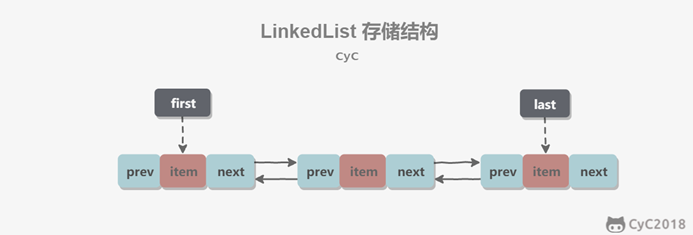

**添加**

````java
public boolean add(E e) {
    linkLast(e);
    return true;
}
void linkLast(E e) {
    final Node<E> l = last;                          //last：尾结点，I = 尾结点；第一次为null
    final Node<E> newNode = new Node<>(l, e, null);  //Node 的prev指向尾结点；完成prev指向前结点
    last = newNode;                                  //尾结点替换为新节点
    if (l == null)                                   //是否为空，第一次添加为空，所以first头结点也指向刚创建的结点
        first = newNode;
    else                                             //除了第一次添加之外都会执行
        l.next = newNode;                            //旧尾结点指向新的结点；完成next执行后面的结点
    size++;                                          //长度加1
    modCount++;                                      //操作数加1
}
````


**删除**

````java
public boolean remove(Object o) {
    if (o == null) {
        for (Node<E> x = first; x != null; x = x.next) {
            if (x.item == null) {
                unlink(x);
                return true;
            }
        }
    } else {
        for (Node<E> x = first; x != null; x = x.next) {
            if (o.equals(x.item)) {
                unlink(x);
                return true;
            }
        }
    }
    return false;
}
E unlink(Node<E> x) {
    // assert x != null;
    final E element = x.item;
    final Node<E> next = x.next;     //next等于要删除节点的下一个节点
    final Node<E> prev = x.prev;     //prev等于要删除节点的上一个节点

    if (prev == null) {              //前结点为空，相当于first头结点
        first = next;                //头结点等于要删除结点的下一个节点
    } else {                         //要删除结点不是头结点
        prev.next = next;            //要删除结点的前一个节点的 next 等于 要删除结点的后一个节点
        x.prev = null;                      
    }

    if (next == null) {              //当前节点为尾结点
        last = prev;                 //尾结点等于要删除结点的前结点
    } else {                         //要删除的节点不是尾结点
        next.prev = prev;            //要删除结点的后节点的prev 等于 要删除结点的前结点
        x.next = null;
    }

    x.item = null;
    size--;
    modCount++;
    return element;
}
````


**其他**

`LinkedList` 类的 `listIterator` 方法返回一个实现 `ListIterator` 接口的迭代器对象

`ListIterator` 接口继承了 `Iterator` 接口并扩展了两个方法，来反向遍历链表：

* `E previous()` 与 `next`相反 `remove`删除的是调用`next`之后左侧的元素，调用`previous`之后的右侧元素

* `boolean hasPrevious()` 与 `hasNext`相反


## Set

`Set`中没有重写`Collection中`的方法，直接使用`Collection`中的方法；


注：set不能使用索引查找，同样不能使用普通`for`循环遍历，**可以**使用`iterator`

* 无序性：不等于随机性。存储的数据在底层数组中并非照数组索引的顺序添加，而是根据数据的哈希值决定的。
* 不可重复性：保证添加的元素照`equals()`判断时，不能返回`true`.即：相同的元素只能添加一个。

 

 

**元素添加过程**：(以`HashSet`为例)

我们向`HashSet`中添加元素a,首先调用元素a所在类的`hashCode()`方法，计算元素a的哈希值，

此哈希值接着通过某种算法计算出在HashSet底层数组中的存放位置（即为：索引位置，判断

数组此位置上是否已经元素：

* 如果此位置上没其他元素，则元素a添加成功。 --->情况1
* 如果此位置上其他元素b(或以链表形式存在的多个元素，则比较元素a与元素b的hash值：
  * 如果`hash`值不相同，则元素a添加成功。--->情况2
  * 如果`hash`值相同，进而需要调用元素a所在类的equals()方法：
    * `equals()`返回`true`,元素a添加失败
    * `equals()`返回`false`,则元素a添加成功。--->情况3

对于添加成功的情况2和情况3而言：元素a 与已经存在指定索引位置上数据以链表的方式存储。

* jdk 7 :元素a放到数组中，指向原来的元素。
* jdk 8 :原来的元素在数组中，指向元素a
* 总结：七上八下

`HashSet`底层：数组+链表的结构。（前提：jdk7)

`Set`接口中没额外定义新的方法，使用的都是`Collection`中声明过的方法。

**常用实现类：**

|----Collection接口：单列集合，用来存储一个一个的对象

​     |----Set接口：存储无序的、不可重复的数据  -->高中讲的“集合”

​       |----HashSet：作为Set接口的主要实现类；线程不安全的；可以存储null值 (底层是HashMap)

​         |----LinkedHashSet：作为HashSet的子类；遍历其内部数据时，可以按照添加的顺序遍历 (底层是LinkedHashMap)

​         在添加数据的同时，每个数据还维护了两个引用，记录此数据前一个数据和后一个数据。   对于频繁的遍历操作，`LinkedHashSet`效率高于`HashSet`

​       |----TreeSet：可以照添加对象的指定属性，进行排序。(底层是TreeMap)


**存储对象所在类的要求：**

`HashSet/LinkedHashSet:`

要求：向Set(主要指：HashSet、LinkedHashSet)中添加的数据，其所在的类一定要重写`hashCode()`和`equals()`

要求：重写的hashCode()和equals()尽可能保持一致性：相等的对象必须具有相等的散列码


**源码实现**

`HashSet底`层是`HashMap`，`LinkedHashSet`底层是`LinkedHashMap`，`TreeSet`底层是`TreeMap`

> 成员变量

````java
private transient HashMap<E,Object> map;             //用于存放最终数据的
private static final Object PRESENT = new Object();  //是所有写入map的value值
````

> 构造函数

````java
public HashSet() {
	map = new HashMap<>();
}

public HashSet(int initialCapacity, float loadFactor) {
	map = new HashMap<>(initialCapacity, loadFactor);
}  
````

利用了 HashMap 初始化了 map 。


> add

````java
public boolean add(E e) {
	return map.put(e, PRESENT)==null;
}
````

比较关键的就是这个 `add()` 方法。 可以看出它是将存放的对象当做了 `HashMap` 的健，`value` 都是相同的 `PRESENT` 。

由于 `HashMap` 的 `key` 是不能重复的，所以每当有重复的值写入到 `HashSet` 时，`value` 会被覆盖，但 `key` 不会受到影响，

这样就保证了 `HashSet` 中只能存放不重复的元素。所以 HashMap 会出现的问题 HashSet 依然不能避免。

 

 **TreeSet:**

使用说明:

* 向TreeSet中添加的数据，要求是**相同**类的对象。
* 两种排序方式：自然排序（实现Comparable）接口 和 定制排序（Comparator）
  * 自然排序中，比较两个对象是否相同的标准为：`compareTo()`返回0.不再是`equals()`
  * 定制排序中，比较两个对象是否相同的标准为：`compare()`返回0.不再是`equals( )`


> 自然排序

````java
@Test
public void test1(){
    TreeSet set = new TreeSet();

        //失败：不能添加不同类的对象
        //        set.add(123);
        //        set.add("AA");
        //        set.add(new User("Tom",12));

        //举例一：
        //        set.add(34);
        //        set.add(-34);
        //        set.add(43);
        //        set.add(11);
        //        set.add(8);

    //举例二：
    set.add(new User("Tom",12));
    set.add(new User("Jerry",32));
}

public class User implements Comparable{
    private String name;
    private int age;
	
    ……
        
    @Override
    public boolean equals(Object o) {
        System.out.println("User equals()....");
        if (this == o) return true;
        if (o == null || getClass() != o.getClass()) return false;

        User user = (User) o;

        if (age != user.age) return false;
        return name != null ? name.equals(user.name) : user.name == null;
    }

    @Override
    public int hashCode() { //return name.hashCode() + age;
        int result = name != null ? name.hashCode() : 0;
        result = 31 * result + age;
        return result;
    }

    //按照姓名从大到小排列,年龄从小到大排列
    @Override
    public int compareTo(Object o) {
        if(o instanceof User){
            User user = (User)o;
//            return -this.name.compareTo(user.name);
            int compare = -this.name.compareTo(user.name);
            if(compare != 0){
                return compare;
            }else{
                return Integer.compare(this.age,user.age);
            }
        }else{
            throw new RuntimeException("输入的类型不匹配");
        }

    }
}
````

> 定制排序:将comparator直接传入TreeSet构造器


````java
@Test
public void test2(){
    Comparator com = new Comparator() {
        //照年龄从小到大排列
        @Override
        public int compare(Object o1, Object o2) {
            if(o1 instanceof User && o2 instanceof User){
                User u1 = (User)o1;
                User u2 = (User)o2;
                return Integer.compare(u1.getAge(),u2.getAge());
            }else{
                throw new RuntimeException("输入的数据类型不匹配");
            }
        }
    };
    TreeSet set = new TreeSet(com);
    set.add(new User("Tom",12));
    set.add(new User("Jerry",32));
}
````


## Map

双列集合框架：Map

* `Map`与`Collection`并列存在。用于保存具有映射关系的数据:`key-value`
* `Map` 中的`key` 和`value` 都可以是任何引用类型的数据
* `Map` 中的`key` 用`Set`来存放，不允许重复，即同一个`Map` 对象所对应的类，须重写 `hashCode()` 和 `equals()` 方法
* 常用`String`类作为`Map`的“键”
* `key` 和`value` 之间存在单向一对一关系，即通过指定的`key` 总能找到唯一的、确定的`value`
* `Map`接口的常用实现类：`HashMap`、`TreeMap`、`LinkedHashMap`和`Properties`。其中，

 

**常用实现类结构**

|----Map:双列数据，存储key-value对的数据

​	|----HashMap:作为Map的主要实现类；线程不安全的，效率高；存储null的key和value

​		|----LinkedHashMap:保证在遍历map元素时，可以照添加的顺序实现遍历。

​			原因：在原的HashMap底层结构基础上，添加了一对指针，指向前一个和后一个元素。

​			对于频繁的遍历操作，此类执行效率高于HashMap。

​	|----TreeMap:保证照添加的key-value对进行排序，实现排序遍历。此时考虑key的自然排序或定制排序底层使用红黑树

​	|----Hashtable:作为古老的实现类；线程安全的，效率低；不能存储null的key和value

​	|----Properties:常用来处理配置文件。key和value都是String类型

`HashMap`的底层：数组+链表 （jdk7及之前),数组+链表+红黑树 （jdk 8)


**存储结构的理解：**

* key:无序的、不可重复的，使用Set存储所的key，key所在的类要重写equals()和hashCode() 

* value:无序的、可重复的，使用Collection存储所的value，alue所在的类要重写equals()

* entry:key-value构成了一个Entry对象。无序的、不可重复的，使用Set存储所的entry


**常用方法**

| 方法                                              | 作用                                                         |
| ------------------------------------------------- | ------------------------------------------------------------ |
| Object put(Object key,Object value)               | 将指定key-value添加到(或修改)当前map对象中                   |
| void putAll(Map m)                                | 将m中的所有key-value对存放到当前map中                        |
| Object remove(Object key)                         | 移除指定key的key-value对，并返回value                        |
| void clear()                                      | 清空当前map中的所有数据                                      |
| Object get(Object key)                            | 获取指定key对应的value                                       |
| default V getOrDefault(Object key,V defaultValue) | 获得与键关联的值，返回与键关联的对象，如果为找到则返回defaultValue |
| boolean containsKey(Object key)                   | 是否包含指定的key                                            |
| boolean containsValue(Object value)               | 是否包含指定的value                                          |
| int size()                                        | 返回map中key-value对的个数                                   |
| boolean isEmpty()                                 | 判断当前map是否为空                                          |
| boolean equals(Object obj)                        | 判断当前map和参数对象obj是否相等                             |
| Set keySet()                                      | 返回所有key构成的Set集合                                     |
| Collection values()                               | 返回所有value构成的Collection集合                            |
| Set entrySet()                                    | 返回所有key-value对构成的Set集合                             |

遍历：`keySet() / values() / entrySet()`    键/值/键值对 或`forEach`

`映射对象变量.forEach( (k,v) -> System.out.println("name = " + name + ",age = " + age));`


4.4 LinkedHashMap的底层实现原理(了解)

LinkedHashMap底层使用的结构与HashMap相同，因为LinkedHashMap继承于HashMap.

区别就在于：LinkedHashMap内部提供了Entry，替换HashMap中的Node.

****

 

**TreeMap**

````java
public class TreeMapTest {
    //自然排序    
    @Test
    public void test1(){
        TreeMap map = new TreeMap();
        User u1 = new User("Tom",23);
        User u2 = new User("Jerry",32);
        map.put(u1,98);
        map.put(u2,89);
        Set entrySet = map.entrySet();
        Iterator iterator1 = entrySet.iterator();
        while (iterator1.hasNext()){
            Object obj = iterator1.next();
            Map.Entry entry = (Map.Entry) obj;
            System.out.println(entry.getKey() + "---->" + entry.getValue());
        }
    }
    //定制排序
    @Test
    public void test2(){
        TreeMap map = new TreeMap(new Comparator() {
            @Override
            public int compare(Object o1, Object o2) {
                if(o1 instanceof User && o2 instanceof User){
                    User u1 = (User)o1;
                    User u2 = (User)o2;
                    return Integer.compare(u1.getAge(),u2.getAge());
                }
                throw new RuntimeException("输入的类型不匹配！");
            }
        });
        User u1 = new User("Tom",23);
        User u2 = new User("Jerry",32);

        map.put(u1,98);
        map.put(u2,89);
    }
}

````


**Hashtable**

* 底层有Hashtable$Entry[] 初始化长度为11

* 临界值 threshold = 长度 * 加载因子 0.75
* 扩容容量大于等于临界值时进行扩容 2倍+1

|           | 版本 | 线程安全 | 效率 | 允许null键null值 |
| --------- | ---- | -------- | ---- | ---------------- |
| HashMap   | 1.2  | 不安全   | 高   | 允许             |
| Hashtable | 1.0  | 安全     | 低   | 不允许           |


**使用Properties读取配置文件**

````java
//Properties:常用来处理配置文件。key和value都是String类型
public static void main(String[] args)  {
    FileInputStream fis = null;
    try {
        Properties pros = new Properties();

        fis = new FileInputStream("jdbc.properties");
        pros.load(fis);//加载流对应的文件

        String name = pros.getProperty("name");
        String password = pros.getProperty("password");

        System.out.println("name = " + name + ", password = " + password);
    } catch (IOException e) {
        e.printStackTrace();
    } finally {
        if(fis != null){
            try {
                fis.close();
            } catch (IOException e) {
                e.printStackTrace();
            }
        }
}
````


### HashMap源码            

当数组长度大于 加载因子 * 容量时，扩容两倍

当链表中节点大于8 且数组长度大于64 时，树华              

> **JDK1.7**

`HashMap map = new HashMap()`在实例化以后，底层创建了长度是16的一维数组`Entry[] table`。

`map.put(key1,value1):`

* 首先，调用`key1`所在类的`hashCode()`计算`key1`哈希值，此哈希值经过某种算法计算以后，得到在`Entry`数组中的存放位置。
* 如果此位置上的数据为空，此时的`key1-value1`添加成功。                                 ----情况1
* 如果此位置上的数据不为空，(意味着此位置上存在一个或多个数据(以链表形式存在)),比较`key1`和已经存在的一个或多个数据的哈希值：
  * 如果`key1`的哈希值与已经存在的数据的哈希值都不相同，此时`key1-value1`添加成功。      ----情况2
  * 如果`key1`的哈希值和已经存在的某一个数据`(key2-value2)`的哈希值相同，继续比较：调用`key1`所在类的`equals(key2)`方法，比较：
    * 如果`equals()`返回`false`:此`时key1-value1`添加成功。                         ----情况3
    * 如果`equals()`返回`true`:使用`value1`替换`value2`。    //**掩盖**

​    补充：关于情况2和情况3：此时`key1-value1`和原来的数据以链表的方式存储。

​    在不断的添加过程中，会涉及到扩容问题，当超出临界值(且要存放的位置非空)时，扩容。默认的扩容方式：扩容为原来容量的**2倍**，并将原的数据复制过来。


`HashMap` 底层是 **数组和链表** 结合在一起使用也就是 **链表散列**。通过 `key` 的 `hashCode` 经过扰动函数处理过后得到 `hash `值，然后通过 `(n - 1) & hash` 判断当前元素存放的位置（这里的 n 指的是数组的长度），如果当前位置存在元素的话，就判断该元素与要存入的元素的 `hash` 值以及 `key` 是否相同，如果相同的话，直接覆盖，不相同就通过拉链法解决冲突。

所谓扰动函数指的就是 `HashMap` 的 `hash` 方法。使用 `hash` 方法也就是扰动函数是为了防止一些实现比较差的 `hashCode()` 方法 换句话说使用扰动函数之后可以减少碰撞。

 JDK 1.8 HashMap 的 hash 方法源码:JDK 1.8 的 hash 方法 相比于 JDK 1.7 hash 方法更加简化，但是原理不变。

````java
static final int hash(Object key) {

int h;
 // key.hashCode()：返回散列值也就是hashcode
 // ^ ：按位异或
 // >>>:无符号右移，忽略符号位，空位都以0补齐
 return (key == null) ? 0 : (h = key.hashCode()) ^ (h >>> 16);

}
````

对比一下 JDK1.7 的 HashMap 的 hash 方法源码.

````java
static int hash(int h) {
   // This function ensures that hashCodes that differ only by
   // constant multiples at each bit position have a bounded
   // number of collisions (approximately 8 at default load factor).
    h ^= (h >>> 20) ^ (h >>> 12);
    return h ^ (h >>> 7) ^ (h >>> 4);
}
````

相比于 JDK1.8 的 hash 方法 ，JDK 1.7 的 hash 方法的性能会稍差一点点，因为毕竟扰动了 4 次。

所谓 “**拉链法**” 就是：将链表和数组相结合。也就是说创建一个链表数组，数组中每一格就是一个链表。若遇到哈希冲突，则将冲突的值加到链表中即可。

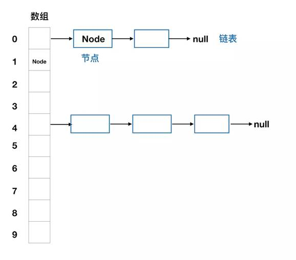

 

 

> **jdk8之后**

* `new HashMap()`:底层没创建一个长度为16的数组
* jdk 8底层的数组是：`Node[]`,而非`Entry[]`
* 首次调用`put()`方法时，底层创建长度为16的数组
* jdk7底层结构只：数组+链表。jdk8中底层结构：数组+链表+红黑树。
* 形成链表时，七上八下（jdk7:新的元素指向旧的元素(头插法)。jdk8：旧的元素指向新的元素(尾插法)）
* 当数组的某一个索引位置上的元素以链表形式存在的 **数据个数 > 8 且 当前数组的长度 > 64时**，此时此索引位置上的所数据改为使用红黑树存储。

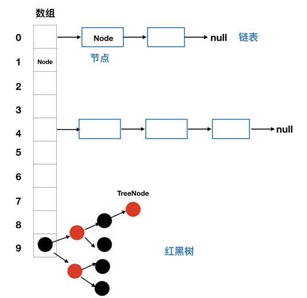

**HashMap为何从头插入改为尾插入**？链表死链

`HashMap`在jdk1.7中采用头插入法，在扩容时会改变链表中元素原本的顺序，以至于在并发场景下导致链表成环的问题(程序会卡死)。

而在jdk1.8中采用尾插入法，在扩容时会保持链表元素原本的顺序，就不会出现链表成环的问题了。[视频]( https://www.bilibili.com/video/BV16J411h7Rd?p=277)

 

**属性**               

````java
public class HashMap<K,V> extends AbstractMap<K,V> implements Map<K,V>, Cloneable, Serializable {
    // 序列号
    private static final long serialVersionUID = 362498820763181265L;
    // 默认的初始容量是16
    static final int DEFAULT_INITIAL_CAPACITY = 1 << 4;
    // 最大容量
    static final int MAXIMUM_CAPACITY = 1 << 30;
    // 默认的填充因子
    static final float DEFAULT_LOAD_FACTOR = 0.75f;
    // 当桶(bucket)上的结点数大于这个值时会转成红黑树
    static final int TREEIFY_THRESHOLD = 8;
    // 当桶(bucket)上的结点数小于这个值时树转链表
    static final int UNTREEIFY_THRESHOLD = 6;
    // 桶中结构转化为红黑树对应的table的最小大小
    static final int MIN_TREEIFY_CAPACITY = 64;
    // 存储元素的数组，总是2的幂次倍
    transient Node<k,v>[] table;
    // 存放具体元素的集
    transient Set<map.entry<k,v>> entrySet;
    // 存放元素的个数，注意这个不等于数组的长度。
    transient int size;
    // 每次扩容和更改map结构的计数器
    transient int modCount;
    // 临界值 当实际大小(容量*填充因子)超过临界值时，会进行扩容
    int threshold;
    // 加载因子
    final float loadFactor;
}
````


| 属性                     | 作用                                                         |
| ------------------------ | ------------------------------------------------------------ |
| DEFAULT_INITIAL_CAPACITY | HashMap的默认容量，16                                        |
| DEFAULT_LOAD_FACTOR      | HashMap的默认加载因子：0.75f                                 |
| threshold                | 扩容的临界值 = 容量*填充因子   16 * 0.75  => 12；当加入的元素大于扩容临界值就会扩容(不是数组占用的个数大于临界值) |
| TREEIFY_THRESHOLD        | Bucket中链表长度大于该默认值，转化为红黑树:8                 |
| MIN_TREEIFY_CAPACITY     | 桶中的Node被树化时最小的hash表容量:64                        |

 

**Node节点**                                      

````java
//Node是HashMap的内部类，实现了Map接口的Entry内部类
static class Node<K,V> implements Map.Entry<K,V> {
    final int hash;              //hash值，存放元素时与其他元素的hash值比较
    final K key;                 //键
    V value;                     //值
    Node<K,V> next;              //下一个节点

    Node(int hash, K key, V value, Node<K,V> next) {
        this.hash = hash;
        this.key = key;
        this.value = value;
        this.next = next;
    }

    public final K getKey()        { return key; }
    public final V getValue()      { return value; }
    public final String toString() { return key + "=" + value; }

    public final int hashCode() {……}

    public final V setValue(V newValue) {……}

    public final boolean equals(Object o) {……}
}
````


**树节点**             

````java
//当需要树化时，才使用TreeNode，实现了LinkedHashMap.Entry<K,V>;LinkedHashMap后面详讲
static final class TreeNode<K,V> extends LinkedHashMap.Entry<K,V> {
    TreeNode<K,V> parent;  // 父
    TreeNode<K,V> left;    // 左
    TreeNode<K,V> right;   // 右
    TreeNode<K,V> prev;    // needed to unlink next upon deletion
    boolean red;           // 判断颜色
    TreeNode(int hash, K key, V val, Node<K,V> next) {
        super(hash, key, val, next);
    }
    // 返回根节点
    final TreeNode<K,V> root() {
        for (TreeNode<K,V> r = this, p;;) {
            if ((p = r.parent) == null)
                return r;
            r = p;
}
````


**构造器**      

````java
// 默认构造函数。
public HashMap() {
	this.loadFactor = DEFAULT_LOAD_FACTOR;          //默认加载因子
}

// 包含另一个“Map”的构造函数
public HashMap(Map<? extends K, ? extends V> m) {
	this.loadFactor = DEFAULT_LOAD_FACTOR;
 	putMapEntries(m, false);//下面会分析到这个方法
}

// 指定“容量大小”的构造函数
public HashMap(int initialCapacity) {
 	this(initialCapacity, DEFAULT_LOAD_FACTOR);
}

// 指定“容量大小”和“加载因子”的构造函数
public HashMap(int initialCapacity, float loadFactor) {
     if (initialCapacity < 0)
         throw new IllegalArgumentException("Illegal initial capacity: " + initialCapacity);
     if (initialCapacity > MAXIMUM_CAPACITY)
         initialCapacity = MAXIMUM_CAPACITY;
     if (loadFactor <= 0 || Float.isNaN(loadFactor))
         throw new IllegalArgumentException("Illegal load factor: " + loadFactor);
     this.loadFactor = loadFactor;
     this.threshold = tableSizeFor(initialCapacity);
}
````

​                                  

**putMapEntries** **方法：将整个map添加到当期map中**

````java
final void putMapEntries(Map<? extends K, ? extends V> m, boolean evict) {
    int s = m.size();
    if (s > 0) {
        // 判断table是否已经初始化
        if (table == null) { // pre-size
            // 未初始化，s为m的实际元素个数
            float ft = ((float)s / loadFactor) + 1.0F;
            int t = ((ft < (float)MAXIMUM_CAPACITY) ?
                    (int)ft : MAXIMUM_CAPACITY);
            // 计算得到的t大于阈值，则初始化阈值
            if (t > threshold)
                threshold = tableSizeFor(t);
        }
        // 已初始化，并且m元素个数大于阈值，进行扩容处理
        else if (s > threshold)
            resize();
        // 将m中的所有元素添加至HashMap中
        for (Map.Entry<? extends K, ? extends V> e : m.entrySet()) {
            K key = e.getKey();
            V value = e.getValue();
            putVal(hash(key), key, value, false, evict);
        }
    }
}
````


**添加**                                        


①.判断键值对数组 table[i] 是否为空或为 null，否则执行 resize() 进行扩容；

②.根据键值 key 计算 hash 值得到插入的数组索引i，如果 table[i]==null，直接新建节点添加，转向 ⑥，如果table[i] 不为空，转向 ③；

③.判断 table[i] 的首个元素是否和 key 一样，如果相同直接覆盖 value，否则转向 ④，这里的相同指的是 hashCode 以及 equals；

④.判断table[i] 是否为 treeNode，即 table[i] 是否是红黑树，如果是红黑树，则直接在树中插入键值对，否则转向 ⑤；

⑤.遍历 table[i]，判断链表长度是否大于 8，大于 8 的话把链表转换为红黑树，在红黑树中执行插入操作，否则进行链表的插入操作；遍历过程中若发现 key 已经存在直接覆盖 value 即可；

⑥.插入成功后，判断实际存在的键值对数量 size 是否超多了最大容量 threshold，如果超过，进行扩容。

````java
public V put(K key, V value) {
    return putVal(hash(key), key, value, false, true);
}
final V putVal(int hash, K key, V value, boolean onlyIfAbsent,
                   boolean evict) {
    Node<K,V>[] tab; 
    Node<K,V> p; 
    int n, i;                  //辅助变量    

    // table未初始化或者长度为0，调用resize()进行扩容,创建长度为16的Node[]
    if ((tab = table) == null || (n = tab.length) == 0)
        n = (tab = resize()).length;

    // n是数组的长度，当hash是2的幂时，&相当于取模;
    // (n - 1) & hash 确定元素存放在哪个桶中，并为 p 赋值，当p为空(桶为空)，新生成结点放入桶中(此时，这个结点是放在数组中); 
    if ((p = tab[i = (n - 1) & hash]) == null)     //根据hash找到索引，如果为空，直接添加
        tab[i] = newNode(hash, key, value, null);

    // 索引位置(桶中)已经存在元素
    else {
        Node<K,V> e; 
        K k;
        // p 指的是数组中的元素(链表的第一个节点)，比较p的hash值是否和添加元素的hash值相等，
        // 并且比较p.key 和key的地址是否相同，或者p.key和key的值是否相等(equals()方法，也证明了添加的元素中需要重新equals()方法)
        if (p.hash == hash &&
            ((k = p.key) == key || (key != null && key.equals(k))))

            // 将第一个元素赋值给e，用e来记录
            e = p;                                                                 //①


        // 判断p是否是红黑树
        else if (p instanceof TreeNode)
            // 放入树中
            e = ((TreeNode<K,V>)p).putTreeVal(this, tab, hash, key, value);        //②        

        // 如果是链表
        else {
            // 在链表最末插入结点
            for (int binCount = 0; ; ++binCount) {
                // 到达链表的尾部,执行添加操作
                if ((e = p.next) == null) {                                       //③
                    // 在尾部插入新结点
                    p.next = newNode(hash, key, value, null);


                    // 结点数量达到阈值(默认为 8 )，执行 treeifyBin 方法(treeigyBin方法里面判断是否对当前链表进行树化)
                    // 这个方法会根据 HashMap 数组来决定是否转换为红黑树。
                    // 只有当数组长度大于或者等于 64 的情况下，才会执行转换红黑树操作，以减少搜索时间。否则，就是只是对数组扩容。
                    if (binCount >= TREEIFY_THRESHOLD - 1) // -1 for 1st
                        treeifyBin(tab, hash);     //此方法并不一定会对当前链表进行树化

                    // 跳出循环
                    break;
                }

                // 判断链表中结点的key值与插入的元素的key值是否相等
                if (e.hash == hash &&                                              //④
                    ((k = e.key) == key || (key != null && key.equals(k))))
                    // 相等，跳出循环
                    break;
                // 用于遍历桶中的链表，与前面的e = p.next组合，可以遍历链表
                p = e;
            }
        }


         // ①②④表示在桶中找到key值、hash值与插入元素相等的结点;③表示到链表的最后了,e为null，不会进入下面的if语句
        if (e != null) {
            // 记录e的value
            V oldValue = e.value;
            // onlyIfAbsent为false或者旧值为null
            if (!onlyIfAbsent || oldValue == null)
                //用新值替换旧值
                e.value = value;
            // 访问后回调
            afterNodeAccess(e);
            // 返回旧值
            return oldValue;
        }
    }

    // 结构性修改
    ++modCount;
    // 实际大小大于阈值则扩容
    if (++size > threshold) //每加入一个元素，size加1；(不是在数组中每加一个元素)
        resize();

    // 插入后回调
    afterNodeInsertion(evict); //此方法为空方法，为了让HashMap的子方法实现 (如LinkedHashMap就重写了此方法)
    return null;
}
````

 

**扩容**                                         

进行扩容，会伴随着一次重新 hash 分配，并且会遍历 hash 表中所有的元素，是非常耗时的。在编写程序中，要尽量避免 resize。

 ````java
 final Node<K,V>[] resize() {
     Node<K,V>[] oldTab = table;            //旧数组
     int oldCap = (oldTab == null) ? 0 : oldTab.length;     //旧数组的长度
     int oldThr = threshold;                      //旧扩容阈值
     int newCap, newThr = 0;
     if (oldCap > 0) {
         // 超过最大值就不再扩充了，就只好随你碰撞去吧
         if (oldCap >= MAXIMUM_CAPACITY) {
             threshold = Integer.MAX_VALUE;
             return oldTab;
         }
         // 没超过最大值，就扩充为原来的2倍
         else if ((newCap = oldCap << 1) < MAXIMUM_CAPACITY && oldCap >= DEFAULT_INITIAL_CAPACITY)
             newThr = oldThr << 1; // double threshold
     }
     else if (oldThr > 0) // initial capacity was placed in threshold
         newCap = oldThr;
     else {
         // signifies using defaults
         newCap = DEFAULT_INITIAL_CAPACITY;
         newThr = (int)(DEFAULT_LOAD_FACTOR * DEFAULT_INITIAL_CAPACITY);
     }
     // 计算新的resize上限
     if (newThr == 0) {
         float ft = (float)newCap * loadFactor;
         newThr = (newCap < MAXIMUM_CAPACITY && ft < (float)MAXIMUM_CAPACITY ? (int)ft : Integer.MAX_VALUE);
     }
     threshold = newThr;         //新扩容阈值
     @SuppressWarnings({"rawtypes","unchecked"})
         Node<K,V>[] newTab = (Node<K,V>[])new Node[newCap];         //创建扩容后的数组
     table = newTab;                           //table等于新数组
     if (oldTab != null) {
         // 把每个bucket都移动到新的buckets中
         for (int j = 0; j < oldCap; ++j) {
             Node<K,V> e;
             if ((e = oldTab[j]) != null) {
                 oldTab[j] = null;
                 if (e.next == null)
                     newTab[e.hash & (newCap - 1)] = e;
                 else if (e instanceof TreeNode)
                     ((TreeNode<K,V>)e).split(this, newTab, j, oldCap);
                 else {
                     Node<K,V> loHead = null, loTail = null;
                     Node<K,V> hiHead = null, hiTail = null;
                     Node<K,V> next;
                     do {
                         next = e.next;
                         // 原索引
                         if ((e.hash & oldCap) == 0) {
                             if (loTail == null)
                                 loHead = e;
                             else
                                 loTail.next = e;
                             loTail = e;
                         }
                         // 原索引+oldCap
                         else {
                             if (hiTail == null)
                                 hiHead = e;
                             else
                                 hiTail.next = e;
                             hiTail = e;
                         }
                     } while ((e = next) != null);
                     // 原索引放到bucket里
                     if (loTail != null) {
                         loTail.next = null;
                         newTab[j] = loHead;
                     }
                     // 原索引+oldCap放到bucket里
                     if (hiTail != null) {
                         hiTail.next = null;
                         newTab[j + oldCap] = hiHead;
                     }
                 }
             }
         }
     }
     return newTab;
 }
 ````


**树化**                 

````java
final void treeifyBin(Node<K,V>[] tab, int hash) {
    int n, index; Node<K,V> e;
    // 如果为初始化或者数组长度小于设置的阈值(默认64),则进行扩容操作，不进行树化
    if (tab == null || (n = tab.length) < MIN_TREEIFY_CAPACITY)    
        resize();

    else if ((e = tab[index = (n - 1) & hash]) != null) {
        TreeNode<K,V> hd = null, tl = null;
        do {
            TreeNode<K,V> p = replacementTreeNode(e, null);
            if (tl == null)
                hd = p;
            else {
                p.prev = tl;
                tl.next = p;
            }
            tl = p;
        } while ((e = e.next) != null);
        if ((tab[index] = hd) != null)
            hd.treeify(tab);
    }
}
````

 

**查询**        

````java
public V get(Object key) {
    Node<K,V> e;
    return (e = getNode(hash(key), key)) == null ? null : e.value;
}

final Node<K,V> getNode(int hash, Object key) {
    Node<K,V>[] tab; Node<K,V> first, e; int n; K k;
    if ((tab = table) != null && (n = tab.length) > 0 &&
        (first = tab[(n - 1) & hash]) != null) {
        // 数组元素相等
        if (first.hash == hash && // always check first node
            ((k = first.key) == key || (key != null && key.equals(k))))
            return first;
        // 桶中不止一个节点
        if ((e = first.next) != null) {
            // 在树中get
            if (first instanceof TreeNode)
                return ((TreeNode<K,V>)first).getTreeNode(hash, key);
            // 在链表中get
            do {
                if (e.hash == hash &&
                    ((k = e.key) == key || (key != null && key.equals(k))))
                    return e;
            } while ((e = e.next) != null);
        }
    }
    return null;
}
````


### LinkedHashMap源码                                                  


事实上 `LinkedHashMap` 是 `HashMap` 的直接子类，二者唯一的区别是 `LinkedHashMap` 在 `HashMap` 的基础上，采用双向链表（doubly-linked list）的形式将所有 `entry` 连接起来，这样是为保证元素的迭代顺序跟插入顺序相同。多了 `header` 指向双向链表的头部（是一个哑元），该双向链表的迭代顺序就是 `entry` 的插入顺序。

除了可以保迭代历顺序，这种结构还有一个好处：迭代 `LinkedHashMap` 时不需要像 `HashMap` 那样遍历整个`table`，而只需要直接遍历 `header` 指向的双向链表即可，也就是说 `LinkedHashMap` 的迭代时间就只跟`entry`的个数相关，而跟`table`的大小无关。

有两个参数可以影响 `LinkedHashMap` 的性能：初始容量（i`nital capacity`）和负载系数（`load factor`）。初始容量指定了初始`table`的大小，负载系数用来指定自动扩容的临界值。当`entry`的数量超过`capacity*load_factor`时，容器将自动扩容并重新哈希。对于插入元素较多的场景，将初始容量设大可以减少重新哈希的次数。

将对象放入到 `LinkedHashMap` 或 `LinkedHashSet` 中时，有两个方法需要特别关心：`hashCode`() 和 `equals()`。`hashCode()` 方法决定了对象会被放到哪个 `bucket` 里，当多个对象的哈希值冲突时，`equals()` 方法决定了这些对象是否是“同一个对象”。所以，如果要将自定义的对象放入到 `LinkedHashMap` 或 `LinkedHashSet` 中，需要重写`hashCode()` 和 `equals()` 方法。

出于性能原因，`LinkedHashMap` 是非同步的（not synchronized），如果需要在多线程环境使用，需要程序员手动同步；或者通过如下方式将 `LinkedHashMap` 包装成（wrapped）同步的：

`Map m = Collections.synchronizedMap(new LinkedHashMap(...));`

 

LinkedHashMap 的排序方式有两种：

- 根据写入顺序排序。
- 根据访问顺序排序。

 

**属性**         

````java
private transient Entry<K,V> header;//头结点
private final boolean accessOrder;  // 默认是 false，默认按照插入顺序排序，为 true 时按照访问顺序排序，调用构造器修改
````

 

**Entry节点**                    

`LinkedHashMap`底层是`Entry`节点，继承了`HashMap`类的`Node`内部类

主要维护了`before`、`after`指针

（一个有三个指向，除了before和after，还有Node节点中的next，他指向的是链表中的下一个节点）

````java
static class Entry<K,V> extends HashMap.Node<K,V> {
        Entry<K,V> before, after;
        Entry(int hash, K key, V value, Node<K,V> next) {
            super(hash, key, value, next);
        }
}
````

​                                                             

**Get/Put**                                                                           

​	实际使用的是`HashMap`中的`Get`/`Put

`put(K key, V value)` 方法是将指定的 `key, value` 对添加到 `map` 里。该方法首先会对 `map` 做一次查找，看是否包含该元组，如果已经包含则直接返回，查找过程类似于`get()`方法；如果没有找到，则会通过 `addEntry(int hash, K key, V value, int bucketIndex)` 方法插入新的 `entry`。

注意，这里的插入有两重含义：

a. 从 `table` 的角度看，新的 `entry` 需要插入到对应的 `bucket` 里，当有哈希冲突时，采用头插法将新的 `entry` 插入到冲突链表的头部。

b. 从 `header` 的角度看，新的 `entry` 需要插入到双向链表的尾部。


````java
public V put(K key, V value) {
    if (table == EMPTY_TABLE) {
        inflateTable(threshold);
    }
    if (key == null)
        return putForNullKey(value);
    int hash = hash(key);
    int i = indexFor(hash, table.length);
    for (Entry<K,V> e = table[i]; e != null; e = e.next) {
        Object k;
        if (e.hash == hash && ((k = e.key) == key || key.equals(k))) {
            V oldValue = e.value;
            e.value = value;
            //空实现，交给 LinkedHashMap 自己实现
            e.recordAccess(this);
            return oldValue;
        }
    }

    modCount++;
    // LinkedHashMap 对其重写
    addEntry(hash, key, value, i);
    return null;
}

// LinkedHashMap.addEntry()
//addBefore()方法将新 entry e插入到双向链表头引用 header 的前面，这样 e 就成为双向链表中的最后一个元素。
void addEntry(int hash, K key, V value, int bucketIndex) {
    if ((size >= threshold) && (null != table[bucketIndex])) {
        resize(2 * table.length);// 自动扩容，并重新哈希
        hash = (null != key) ? hash(key) : 0;
        bucketIndex = hash & (table.length-1);// hash%table.length
    }
    // 1.在冲突链表头部插入新的entry
    HashMap.Entry<K,V> old = table[bucketIndex];
    Entry<K,V> e = new Entry<>(hash, key, value, old);
    table[bucketIndex] = e;
    // 2.在双向链表的尾部插入新的entry
    e.addBefore(header);
    size++;
}

// LinkedHashMap.Entry.addBefor()，将this插入到existingEntry的前面
//只是简单修改相关 entry 的引用而已。
private void addBefore(Entry<K,V> existingEntry) {
    after  = existingEntry;
    before = existingEntry.before;
    before.after = this;
    after.before = this;
}
````


**remove()**                                                                                        

`remove(Object key)`的作用是删除`key`值对应的`entry`，该方法的具体逻辑是在`removeEntryForKey(Object key)`里实现的。`removeEntryForKey()`方法会首先找到`key`值对应的`entry`，然后删除该`entry`（修改链表的相应引用）。查找过程跟`get()`方法类似。

注意，这里的删除也有两重含义：

从`table`的角度看，需要将该`entry`从对应的`bucket`里删除，如果对应的冲突链表不空，需要修改冲突链表的相应引用。

从`header`的角度来看，需要将该`entry`从双向链表中删除，同时修改链表中前面以及后面元素的相应引用。

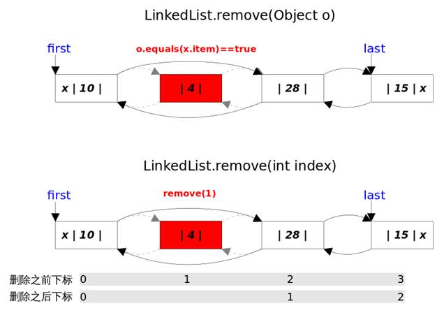

 

 ````java
 // LinkedHashMap.removeEntryForKey()，删除key值对应的entry
 final Entry<K,V> removeEntryForKey(Object key) {
     ......
     int hash = (key == null) ? 0 : hash(key);
     int i = indexFor(hash, table.length);// hash&(table.length-1)
     Entry<K,V> prev = table[i];// 得到冲突链表
     Entry<K,V> e = prev;
     while (e != null) {// 遍历冲突链表
         Entry<K,V> next = e.next;
         Object k;
         if (e.hash == hash &&
             ((k = e.key) == key || (key != null && key.equals(k)))) {// 找到要删除的entry
             modCount++; size--;
             // 1. 将e从对应bucket的冲突链表中删除
             if (prev == e) table[i] = next;
             else prev.next = next;
             // 2. 将e从双向链表中删除
             e.before.after = e.after;
             e.after.before = e.before;
             return e;
         }
         prev = e; e = next;
     }
     return e;
 }
 ````


### TreeMap                                                                                                 

* 一个有序的`key-value`集合，它是通过红黑树实现的。
* 继承于`AbstractMap`，所以它是一个`Map`，即一个`key-value`集合。
* 实现了`NavigableMap`接口，意味着它支持一系列的导航方法。比如返回有序的`key`集合。
* 实现了`Cloneable`接口，意味着它能被克隆。
* 实现了`java.io.Serializable`接口，意味着它支持序列化。
* 基于红黑树（Red-Black tree）实现。该映射根据其键的自然顺序进行排序，或者根据创建映射时提供的 `Comparator` 进行排序，具体取决于使用的构造方法。
* 基本操作 `containsKey、get、put` 和 `remove` 的时间复杂度是 log(n) 。
* TreeMap是非同步的。 它的`iterator` 方法返回的迭代器是`fail-fastl`的。

 

**TreeMap和HashMap的区别**                                  

* `HashMap`通过`hashcode`对其内容进行快速查找，而 `TreeMap`基于红黑树的一种访问的`Map`,所有的元素都保持着某种固定的顺序，如果你需要得到一个有序的结果你就应该使用`TreeMap`（`HashMap`中元素的排列顺序是不固定的）。存取的时间复杂度都是O(log(n))
* HashMap：适用于在Map中插入、删除和定位元素。
* Treemap：适用于按自然顺序或自定义顺序遍历键(key)。

 

**属性**               

````java
private final Comparator<? super K> comparator;        //定制排序，使用构造器传入
private transient Entry<K,V> root;                     //根节点
private transient int size = 0;                        //树的大小
private transient int modCount = 0;                    //操作数
````


**构造器**           

````java
public TreeMap() {
    comparator = null;
}
public TreeMap(Comparator<? super K> comparator) {       //传入定制排序
    this.comparator = comparator;
}
public TreeMap(Map<? extends K, ? extends V> m) {
    构造一个与给定映射具有相同映射关系的新的树映射，该映射根据其键的自然顺序 进行排序。
}
public TreeMap(SortedMap<K, ? extends V> m) {
    构造一个与指定有序映射具有相同映射关系和相同排序顺序的新的树映射。
}

````

 

**Put方法**                                                

````java
public V put(K key, V value) {
    Entry<K,V> t = root;                                      //指定根结点
    if (t == null) {                                          //根结点为空直接添加
        compare(key, key);                                    //2个key比较，主要检查是否为null

        root = new Entry<>(key, value, null);
        size = 1;
        modCount++;
        return null;
    }
    int cmp;
    Entry<K,V> parent;
    // split comparator and comparable paths
    Comparator<? super K> cpr = comparator;                   //赋值定制排序
    if (cpr != null) {                                        //有定制排序，使用定制排序
        do {
            parent = t;
            cmp = cpr.compare(key, t.key);
            if (cmp < 0)
                t = t.left;
            else if (cmp > 0)
                t = t.right;
            else
                return t.setValue(value);                     //相等则替换
        } while (t != null);
    }
    else {                                                    //使用自然排序
        if (key == null)                                      //不能为空
            throw new NullPointerException();
        @SuppressWarnings("unchecked")
            Comparable<? super K> k = (Comparable<? super K>) key;
        do {
            parent = t;
            cmp = k.compareTo(t.key);                         //调用key的自然排序
            if (cmp < 0)
                t = t.left;
            else if (cmp > 0)
                t = t.right;
            else
                return t.setValue(value);
        } while (t != null);
    }
    Entry<K,V> e = new Entry<>(key, value, parent);
    if (cmp < 0)
        parent.left = e;
    else
        parent.right = e;
    fixAfterInsertion(e);
    size++;
    modCount++;
    return null;
}
````


**总结**                                                    

1、`TreeMap`是根据`key`进行排序的，它的排序和定位需要依赖比较器或覆写`Comparable`接口，也因此不需要`key`覆写`hashCode`方法和`equals`方法，就可以排除掉重复的`key`，而`HashMap`的`key`则需要通过覆写`hashCode`方法和`equals`方法来确保没有重复的`key`。

2、`TreeMap`的查询、插入、删除效率均没有`HashMap`高，一般只有要对`key`排序时才使用`TreeMap`。

3、`TreeMap`的`key`不能为`null`，而`HashMap`的`key`可以为`null`。

4、`TreeMap`不是同步的。如果多个线程同时访问一个映射，并且其中至少一个线程从结构上修改了该映射，则其必须 外部同步。

 


## ConcurrentHashMap源码

 稍后


## Collections工具类

**作用：**操作Collection和Map的工具类，不需要实例化，直接使用

**常用方法：**

| 方法                                                        | 作用                                                       |
| ----------------------------------------------------------- | ---------------------------------------------------------- |
| reverse(List)                                               | 反转 List 中元素的顺序                                     |
| shuffle(List)                                               | 对 List 集合元素进行随机排序                               |
| sort(List)                                                  | 根据元素的自然顺序对指定 List 集合元素升序排序             |
| sort(List，Comparator)                                      | 根据指定的 Comparator 产生的顺序对 List 集合元素进行排序   |
| swap(List，int， int)                                       | 将指定 list 集合中的 i 处元素和 j 处元素进行交换           |
| Object max(Collection)                                      | 根据元素的自然顺序，返回给定集合中的最大元素               |
| Object max(Collection，Comparator)                          | 根据 Comparator 指定的顺序，返回给定集合中的最大元素       |
| Object min(Collection)                                      |                                                            |
| int frequency(Collection，Object)                           | 返回指定集合中指定元素的出现次数                           |
| void copy(List dest,List src)                               | 将src中的内容复制到dest中  注意：dest长度不可以小于src长度 |
| boolean replaceAll(List list，Object oldVal，Object newVal) | 使用新值替换 List 对象的所旧值                             |
| **synchronizedXxx()**                                       | 返回线程安全的集合                                         |


 


# 泛型

[博客1](https://blog.csdn.net/s10461/article/details/53941091)

[博客2](https://blog.csdn.net/sunxianghuang/article/details/51982979)

**概述**                                               

泛型，即“**参数化类型**”。参数化类型怎么理解呢？顾名思义，就是将类型由原来的具体的类型参数化，类似于方法中的变量参数，此时类型也定义成参数形式（可以称之为类型形参），然后在使用/调用时传入具体的类型（类型实参）。

泛型的本质是为了**参数化类型**（在不创建新的类型的情况下，通过泛型指定的不同类型来控制形参具体限制的类型）。也就是说在泛型使用过程中，操作的数据类型被指定为一个参数，这种参数类型可以用在类、接口和方法中，分别被称为泛型类、泛型接口、泛型方法。

编译器会自动帮我们检查，避免向集合中插入错误类型的对象，从而使得程序具有更好的**安全性**。

 

**泛型实现原理**                                           

**类型擦除**

````java
public static void main(String[] args) {
    ArrayList<String> strings = new ArrayList<>();
    ArrayList<Integer> integers = new ArrayList<>();

    System.out.println(strings.getClass());
    System.out.println(integers.getClass());
}
输出：
class java.util.ArrayList
class java.util.ArrayList
````

- 定义了两个ArrayList数组，一个是`ArrayList<String>`泛型类型，只能存储字符串。一个是`ArrayList<Integer>`泛型类型，只能存储整型。结果输出的类型相同

- 这是为什么呢，明明我们定义了两种不同的类型？因为，在编译期间，所有的泛型信息都会被擦除，`List<Integer>`和`List<String>`类型，在编译后都会变成`List`类型（原始类型）。Java中的泛型基本上都是在编译器这个层次来实现的，这也是Java的泛型被称为“伪泛型”的原因。

- 编译后

  ````java
  public static void main(String[] var0) {
      ArrayList var1 = new ArrayList();
      ArrayList var2 = new ArrayList();
      System.out.println(var1.getClass());
      System.out.println(var2.getClass());
  }
  ````

可以看到类型已经被擦除了

**对此总结成一句话：泛型类型在逻辑上看以看成是多个不同的类型，实际上都是相同的基本类型。**


**原始类型**                                                         

原始类型就是泛型类型擦除了泛型信息后，在字节码中真正的类型。无论何时定义一个泛型类型，相应的原始类型都会被自动提供。原始类型的名字就是删去类型参数后的泛型类型的类名。擦除 类型变量，并替换为 限定类型（T为无限定的 类型变量，用Object替换）。

````java
//泛型类型
class Pair<T> {  
    private T value;  
    public T getValue() {  
        return value;  
    }  
    public void setValue(T  value) {  
        this.value = value;  
    }  
}
//原始类型
class Pair {  
    private Object value;  
    public Object getValue() {  
        return value;  
    }  
    public void setValue(Object  value) {  
        this.value = value;  
    }  
}  
````

因为在`Pair<T>`中，T是一个无限定的类型变量，所以用`Object`替换。如果是`Pair<T extends Number>`，擦除后，类型变量用`Number`类型替换。

 

**突破泛型约束**                                                         

利用反射  

````java
public static void main(String[] args) throws Exception {
    ArrayList<Integer> integers = new ArrayList<>();
    // 这样调用add方法只能存储整形，因为泛型类型的实例为Integer
    integers.add(123);

    //integers.add("123");   //报错，需要的是integer 而传入的是String类型

    // 通过反射可以突破泛型类型约束
    integers.getClass().getMethod("add", Object.class).invoke(integers,"哈哈");

    System.out.println(integers);
}
输出：[123, 哈哈]
````

- 为什么呢？
  - 我们在程序中定义了一个`ArrayList<Integer>`泛型类型，如果直接调用`add`方法，那么只能存储整形的数据。
  - 不过当我们利用反射调用`add`方法的时候，却可以存储字符串。
  - 这说明`ArrayList<Integer>`泛型信息在编译之后被擦除了，只保留了原始类型，类型变量`（T）`被替换为`Object`，在运行时，我们可以行其中插入任意类型的对象。

- 再次应证：Java中的泛型基本上都是在编译器这个层次来实现的“伪泛型”。

- 但是，并不推荐以这种方式操作泛型类型，因为这违背了泛型的初衷（减少强制类型转换以及确保类型安全）。当我们从集合中获取元素时，默认会将对象强制转换成泛型参数指定的类型（这里是Integer），如果放入了非法的对象这个强制转换过程就会出现异常。

 

**泛型方法的类型推断**                                                    

* 在调用泛型方法的时候，可以指定泛型类型，也可以不指定。
* 在不指定泛型类型的情况下，泛型类型为该方法中的几种参数类型的共同父类的最小级，直到`Object`。
* 在指定泛型类型的时候，该方法中的所有参数类型必须是该泛型类型或者其子类。

````java
public class Test { 
    public static void main(String[] args) {  
        /**不指定泛型的时候*/  
        int i=Test.add(1, 2);           //这两个参数都是Integer，所以T替换为Integer类型  
        Number f=Test.add(1, 1.2);      //这两个参数一个是Integer，另一个是Float，所以取同一父类的最小级，为Number  
        Object o=Test.add(1, "asd");    //这两个参数一个是Integer，另一个是String，所以取同一父类的最小级，为Object

        /**指定泛型的时候*/  
        int a=Test.<Integer>add(1, 2);      //指定了Integer，所以只能为Integer类型或者其子类  
        int b=Test.<Integer>add(1, 2.2);    //编译错误，指定了Integer，不能为Float  
        Number c=Test.<Number>add(1, 2.2);  //指定为Number，所以可以为Integer和Float  
    }  

    //这是一个简单的泛型方法  
    public static <T> T add(T x,T y){  
        return y;  
    } 
}
````

 

**正确的运转**                                                      

既然说类型变量会在编译的时候擦除掉，那为什么定义了`ArrayList<Integer>`泛型类型，而不允许向其中插入String对象呢？不是说泛型变量`Integer`会在编译时候擦除变为原始类型`Object`吗，为什么不能存放别的类型呢？既然类型擦除了，如何保证我们只能使用泛型变量限定的类型呢？

java是如何解决这个问题的呢？java编译器是通过先检查代码中泛型的类型，然后再进行类型擦除，再进行编译的。以如下代码为例：

````java
Pair<Integer> pair=new Pair<Integer> ();
pair.setValue(3);
Integer integer=pair.getValue();
System.out.println(integer);
````

擦除`getValue()`的返回类型后将返回`Object`类型，编译器自动插入`Integer`的强制类型转换。也就是说，编译器把这个方法调用翻译为两条字节码指令：

* 对原始方法`Pair.getValue`的调用

* 将返回的`Object`类型强制转换为`Integer` 

  

## 泛型类                                                                                                             

格式：

````java
public class test<T,E>{

}
````

````java
//此处T可以随便写为任意标识，常见的如T、E、K、V等形式的参数常用于表示泛型
//在实例化泛型类时，必须指定T的具体类型
public class Generic<T>{ 
    //key这个成员变量的类型为T,T的类型由外部指定  
    private T key;

    public Generic(T key) {   //泛型构造方法形参key的类型也为T，T的类型由外部指定
        this.key = key;
    }

    public T getKey(){        //泛型方法getKey的返回值类型为T，T的类型由外部指定
        return key;
    }
}

````

在使用泛型的时候如果传入泛型实参，则会根据传入的泛型实参做相应的限制，此时泛型才会起到本应起到的限制作用。如果不传入泛型类型实参的话，在泛型类中使用泛型的方法或成员变量定义的类型可以为任何的类型。

*注意：*

- 泛型必须使用的是类，基本数据类型使用包装类

- 不能对确切的泛型类型使用`instanceof`操作。如下面的操作是非法的，编译时会出错。

  ````java
  if(ex_num instanceof Generic<Number>){  
  } 
  ````

  

## 泛型接口                                                         

泛型接口与泛型类的定义及使用基本相同。泛型接口常被用在各种类的生产器中，可以看一个例子：

````java
//定义一个泛型接口
public interface Generator<T> {
    public T next();
}
````

> **当实现泛型接口的类，未传入泛型实参时：**

````java
/**
 * 未传入泛型实参时，与泛型类的定义相同，在声明类的时候，需将泛型的声明也一起加到类中
 * 即：class FruitGenerator<T> implements Generator<T>{
 * 如果不声明泛型，如：class FruitGenerator implements Generator<T>，编译器会报错："Unknown class"
 */
class FruitGenerator<T> implements Generator<T>{
    @Override
    public T next() {
        return null;
    }
}
````

原因很简单，继承接口需要重写接口中的方法，类中重写泛型接口中的方法就需要指定泛型，

 

> **当实现泛型接口的类，传入泛型实参时：**

````java
/**
 * 传入泛型实参时：
 * 定义一个生产器实现这个接口,虽然我们只创建了一个泛型接口Generator<T>
 * 但是我们可以为T传入无数个实参，形成无数种类型的Generator接口。
 * 在实现类实现泛型接口时，如已将泛型类型传入实参类型，则所有使用泛型的地方都要替换成传入的实参类型
 * 即：Generator<T>，public T next();中的的T都要替换成传入的String类型。
 */
public class FruitGenerator implements Generator<String> {
    private String[] fruits = new String[]{"Apple", "Banana", "Pear"};
    @Override
    public String next() {
        Random rand = new Random();
        return fruits[rand.nextInt(3)];
    }
}
````

接口中的泛型已经被定义，类中就不需要定义泛型；

 

## 泛型通配符                                                   

我们知道`Ingeter`是`Number`的一个子类，`Generic<Ingeter>`与`Generic<Number>`实际上是相同的一种基本类型(`getClass`)。那么问题来了，在使用`Generic<Number>`作为形参的方法中，能否使用`Generic<Ingeter>`的实例传入呢？在逻辑上类似于`Generic<Number>`和`Generic<Ingeter>`是否可以看成具有父子关系的泛型类型呢？ (答案是**否定**的)

为了弄清楚这个问题，我们使用`Generic<T>`这个泛型类继续看下面的例子：

````java
public void showKeyValue1(Generic<Number> obj){         
    Log.d("泛型测试","key value is " + obj.getKey());
}

Generic<Integer> gInteger = new Generic<Integer>(123);
Generic<Number> gNumber = new Generic<Number>(456);

showKeyValue(gNumber);                  //ok

// showKeyValue这个方法编译器会为我们报错：Generic<java.lang.Integer> 
// cannot be applied to Generic<java.lang.Number>
// showKeyValue(gInteger);

````

通过提示信息我们可以看到`Generic<Integer>`不能被看作为`Generic<Number>`的子类。由此可以看出:同一种泛型可以对应多个版本（因为参数类型是不确定的），但不同版本的泛型类实例是不兼容的。

我们可以将上面的方法改一下：

````java
public void showKeyValue1(Generic<?> obj){
    Log.d("泛型测试","key value is " + obj.getKey());
}
````

类型通配符一般是使用 **？**代替具体的类型实参，注意了，此处`？`是类型**实参**，而不是类型形参 。此处的？和`Number、String、Integer`一样都是一种实际的类型，可以把？看成所有类型的父类。是一种真实的类型。

`List<Object>`与`List<?>`并不等同，`List<Object>`是`List<?>`的子类。还有不能往`List<?> list`里添加任意对象，除了`null`。

 

## 泛型方法                                                       

- 使用类泛型的方法不是泛型方法
- 泛型方法中的方法不一定是泛型方法
- 泛型方法不一定在泛型类中

- **泛型类，是在实例化类的时候指明泛型的具体类型；泛型方法，是在调用方法的时候指明泛型的具体类型** 。

 **格式**:只有定义了<>的方法才是泛型方法

````java
public <T,E,V> 返回类型 方法名(参数){
} 
````

````java
/**
 * 说明：
 *     1）public 与 返回值中间<T>非常重要，可以理解为声明此方法为泛型方法。
 *     2）只有声明了<T>的方法才是泛型方法，泛型类中的使用了泛型的成员方法并不是泛型方法。
 *     3）<T>表明该方法将使用泛型类型T，此时才可以在方法中使用泛型类型T。
 *     4）与泛型类的定义一样，此处T可以随便写为任意标识，常见的如T、E、K、V等形式的参数常用于表示泛型。
 */
public <T> T genericMethod(Class<T> tClass)throws InstantiationException ,
  IllegalAccessException{
        T instance = tClass.newInstance();
        return instance;
}
````

 

**泛型方法的使用**                                                     

````java
public class GenericTest {
   //这个类是个泛型类
   public class Generic<T>{     
        private T key;

        public Generic(T key) {
            this.key = key;
        }

        //虽然在方法中使用了泛型，但是这并不是一个泛型方法。
        //这只是类中一个普通的成员方法，只不过他的返回值是在声明泛型类已经声明过的泛型。
        //所以在这个方法中才可以继续使用 T 这个泛型。
        public T getKey(){
            return key;
        }

        /**
         * 这个方法显然是有问题的，在编译器会给我们提示这样的错误信息"cannot reslove symbol E"
         * 因为在类的声明中并未声明泛型E，所以在使用E做形参和返回值类型时，编译器会无法识别。
        public E setKey(E key){
             this.key = keu
        }
        */
    }

    /** 
     * 这才是一个真正的泛型方法。
     * 首先在public与返回值之间的<T>必不可少，这表明这是一个泛型方法，并且声明了一个泛型T
     * 这个T可以出现在这个泛型方法的任意位置.
     * 泛型的数量也可以为任意多个 
     *    如：public <T,K> K showKeyName(Generic<T> container){
     *        ...
     *        }
     */
    public <T> T showKeyName(Generic<T> container){
        System.out.println("container key :" + container.getKey());
        //当然这个例子举的不太合适，只是为了说明泛型方法的特性。
        T test = container.getKey();
        return test;
    }


    //这也不是泛型方法，这就是一个普通的方法，只是使用了Generic<Number>这个泛型类做形参而已。
    public void showKeyValue1(Generic<Number> obj){
        Log.d("泛型测试","key value is " + obj.getKey());
    }

    //这也不是泛型方法，这也是一个普通的方法，只不过使用了泛型通配符?
    //同时这也印证了泛型通配符章节所描述的，?是一种类型实参，可以看做为Number等所有类的父类
    public void showKeyValue2(Generic<?> obj){
        Log.d("泛型测试","key value is " + obj.getKey());
    }

     /**
     * 这个方法是有问题的，编译器会为我们提示错误信息："UnKnown class 'E' "
     * 虽然我们声明了<T>,也表明了这是一个可以处理泛型的类型的泛型方法。
     * 但是只声明了泛型类型T，并未声明泛型类型E，因此编译器并不知道该如何处理E这个类型。
    public <T> T showKeyName(Generic<E> container){
        ...
    }  
    */

    /**
     * 这个方法也是有问题的，编译器会为我们提示错误信息："UnKnown class 'T' "
     * 对于编译器来说T这个类型并未项目中声明过，因此编译也不知道该如何编译这个类。
     * 所以这也不是一个正确的泛型方法声明。
    public void showkey(T genericObj){

    }
    */

    public static void main(String[] args) {
    }
}
````


**类中的泛型方法**         

````java
public class GenericFruit {
    class Fruit{
        @Override
        public String toString() {
            return "fruit";
        }
    }

    class Apple extends Fruit{
        @Override
        public String toString() {
            return "apple";
        }
    }

    class Person{
        @Override
        public String toString() {
            return "Person";
        }
    }

    class GenerateTest<T>{
        public void show_1(T t){
            System.out.println(t.toString());
        }

        //在泛型类中声明了一个泛型方法，使用泛型E，这种泛型E可以为任意类型。可以类型与T相同，也可以不同。
        //由于泛型方法在声明的时候会声明泛型<E>，因此即使在泛型类中并未声明泛型，编译器也能够正确识别泛型方法中识别的泛型。
        public <E> void show_3(E t){
            System.out.println(t.toString());
        }

        //在泛型类中声明了一个泛型方法，使用泛型T，注意这个T是一种全新的类型，可以与泛型类中声明的T不是同一种类型。
        public <T> void show_2(T t){
            System.out.println(t.toString());
        }
    }

    public static void main(String[] args) {
        Apple apple = new Apple();
        Person person = new Person();

        GenerateTest<Fruit> generateTest = new GenerateTest<Fruit>();
        //apple是Fruit的子类，所以这里可以
        generateTest.show_1(apple);
        //编译器会报错，因为泛型类型实参指定的是Fruit，而传入的实参类是Person
        //generateTest.show_1(person);

        //使用这两个方法都可以成功
        generateTest.show_2(apple);
        generateTest.show_2(person);

        //使用这两个方法也都可以成功
        generateTest.show_3(apple);
        generateTest.show_3(person);
    }
}
````

**泛型方法与可变长参数**                                                                          

````java
public <T> void printMsg( T... args){
    for(T t : args){
        Log.d("泛型测试","t is " + t);
    }
}
````

 

**静态方法与泛型**                                                             

类中的静态方法使用泛型：**静态方法无法访问类上定义的泛型**；如果静态方法操作的引用数据类型不确定的时候，必须要将泛型定义在方法上。即：**如果静态方法要使用泛型的话，必须将静态方法也定义成泛型方法** 。

泛型类中的静态方法和静态变量不可以使用泛型类所声明的泛型类型参数

````java
//错误：因为泛型类中的泛型参数的实例化是在定义泛型类型对象（例如ArrayList<Integer>）的时候指定的，而静态变量和静态方法不需要使用对象来调用。对象都没有创建，如何确定这个泛型参数是何种类型，所以当然是错误的。(静态方法随着类的加载而加载)
public class Test2<T> {    
    public static T one;             //编译错误    
    public static  T show(T one){    //编译错误    
        return null;    
    }    
}  

//正确：因为这是一个泛型方法，在泛型方法中使用的T是自己在方法中定义的T，而不是泛型类中的T。
public class Test2<T> {    
    public static <T> T show(T one){//这是正确的    
        return null;    
    }    
}  
````

 

## 泛型上下边界                                                                                                                 

在使用泛型的时候，我们还可以为传入的泛型类型实参进行上下边界的限制，如：类型实参只准传入某种类型的父类或某种类型的子类。

| 格式                    | 作用                                             |
| ----------------------- | ------------------------------------------------ |
| <? extends  Number>     | 只允许泛型为Number及Number子类的引用调用         |
| <? super  Number>       | 只允许泛型为Number及Number父类的引用调用         |
| <? extends  Comparable> | 只允许泛型为实现Comparable接口的实现类的引用调用 |

> 泛型类上下边界

````java
public class Test<T extends Number>{
}
````

> 泛型方法上下边界

````java
//在泛型方法中添加上下边界限制的时候，必须在权限声明与返回值之间的<T>上添加上下边界，即在泛型声明的时候添加
//public <T> T Test(Generic<T extends Number> container)，编译器会报错："Unexpected bound"
public <T extends Number> T Test(Generic<T> container){
}
````

泛型的上下边界添加，必须与泛型的声明在一起 。

   

## 泛型数组                                                      

在java中是“不能创建一个**确切**的泛型类型的数组”的。

也就是说下面的这个例子是不可以的：`List<String>[] ls = new ArrayList<String>[10];` 

而使用通配符创建泛型数组是可以的，如下面这个例子：`List<?>[] ls = new ArrayList<?>[10];` 

这样也是可以的：`List<String>[] ls = new ArrayList[10];`

 


# IO流


## IO流概述

**初识Java IO**

流（Stream），是一个抽象的概念，是指一连串的数据（字符或字节），是以先进先出的方式发送信息的通道。

特性：

* 先进先出：最先写入输出流的数据最先被输入流读取到。
* 顺序存取：可以一个接一个地往流中写入一串字节，读出时也将按写入顺序读取一串字节，不能随机访问中间的数据。（`RandomAccessFile`除外）
* 只读或只写：每个流只能是输入流或输出流的一种，不能同时具备两个功能，输入流只能进行读操作，对输出流只能进行写操作。在一个数据传输通道中，如果既要写入数据，又要读取数据，则要分别提供两个流。

 

**IO流分类**

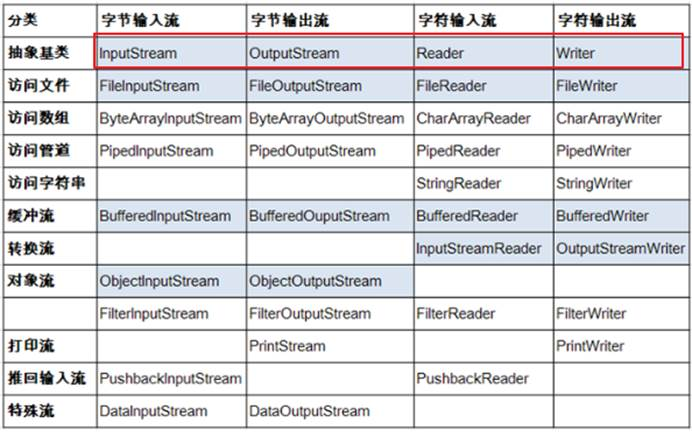

说明：红框对应的是IO流中的4个抽象基类。

| 抽象基类     | 节点流（或文件流）                           | 缓冲流（处理流的一种）                                       |
| ------------ | -------------------------------------------- | ------------------------------------------------------------ |
| InputStream  | FileInputStream  (read(byte[] buffer))       | BufferedInputStream (read(byte[]  buffer))                   |
| OutputStream | FileOutputStream (write(byte[] buffer,0,len) | BufferedOutputStream (write(byte[]  buffer,0,len) / flush()刷新 |
| Reader       | FileReader (read(char[] cbuf))               | BufferedReader (read(char[] cbuf) /  readLine()按行读取)     |
| Writer       | FileWriter (write(char[] cbuf,0,len)         | BufferedWriter (write(char[] cbuf,0,len)  / flush()刷新      |

 

IO流分类：

* 按数据流的方向：输入流、输出流
* 按处理数据单位：字节流、字符流
* 按功能：节点流、处理流

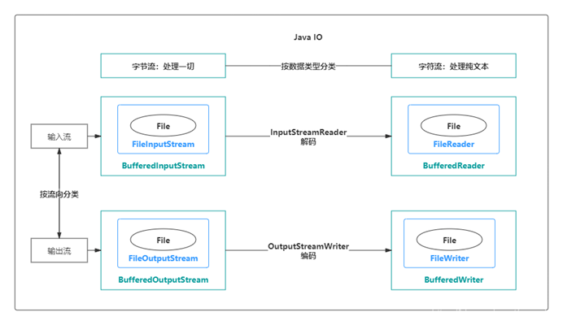

**输入流与输出流**

输入与输出是相对于应用程序而言的，比如文件读写，读取文件是输入流，写文件是输出流，这点很容易搞反。


**字节流与字符流**

字节流和字符流的用法几乎完成全一样，区别在于字节流和字符流所操作的数据单元不同，字节流操作的单元是数据单元是8位的字节(Byte)，字符流操作的是数据单元为16位的字符（char）。


**为什么要有字符流？**

Java中字符是采用`Unicode`标准，`Unicode` 编码中，一个英文为一个字节，一个中文为两个字节。


 

那么问题来了，如果使用字节流处理中文，如果一次读写一个字符对应的字节数就不会有问题，一旦将一个字符对应的字节分裂开来，就会出现乱码了。为了更方便地处理中文这些字符，Java就推出了字符流。


**字节流和字符流的其他区别：**

* 字节流一般用来处理图像、视频、音频、PPT、Word等类型的文件。字符流一般用于处理纯文本类型的文件，如TXT文件等，但不能处理图像视频等非文本文件。用一句话说就是：字节流可以处理一切文件，而字符流只能处理纯文本文件。
* 字节流本身没有缓冲区，缓冲字节流相对于字节流，效率提升非常高。而**字符流本身就带有缓冲区**，缓冲字符流相对于字符流效率提升就不是那么大了。详见文末效率对比。

 

**节点流和处理流**

**节点流**：直接操作数据读写的流类，比如`FileInputStream`

**处理流**：对一个已存在的流的链接和封装，通过对数据进行处理为程序提供功能强大、灵活的读写功能，例如`BufferedInputStream`

处理流和节点流应用了Java的装饰者设计模式。

节点流和处理流，处理流是对节点流的封装，最终的数据处理还是由节点流完成的。

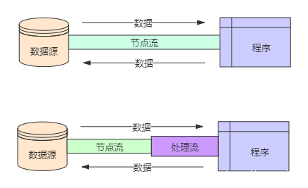


 在诸多处理流中，有一个非常重要，那就是**缓冲流**。

需要注意的是，缓冲流效率一定高吗？不一定，某些情形下，缓冲流效率反而更低。

(Java I/O 使用了装饰者模式来实现。以 `InputStream` 为例，`InputStream` 是抽象组件，`FileInputStream` 是 `InputStream` 的子类，属于具体组件，提供了字节流的输入操作。`FilterInputStream` 属于抽象装饰者，装饰者用于装饰组件，为组件提供额外的功能，例如 `BufferedInputStream` 为 `FileInputStream` 提供缓存的功能。)

 

**输入、输出的标准化过程**

> 输入过程

① 创建`File`类的对象，指明读取的数据的来源。（要求此文件一定要存在）

② 创建相应的输入流，将`File`类的对象作为参数，传入流的构造器中

③ 具体的读入过程：

  创建相应的`byte[]` 或 `char[]`。

④ 关闭流资源

说明：程序中出现的异常需要使用`try-catch-finally`处理。

> 输出过程

① 创建`File`类的对象，指明写出的数据的位置。（不要求此文件一定要存在）

② 创建相应的输出流，将`File`类的对象作为参数，传入流的构造器中

③ 具体的写出过程：

  `write(char[]/byte[] buffer,0,len)`

④ 关闭流资源

说明：程序中出现的异常需要使用`try-catch-finally`处理。


## File类

**File类的理解**

* File类的一个对象，代表一个文件或一个文件目录(俗称：文件夹)
* File类声明在`java.io`包下
* File类中涉及到关于文件或文件目录的创建、删除、重命名、修改时间、文件大小等方法，并未涉及到写入或读取文件内容的操作。如果需要读取或写入文件内容，必须使用IO流来完成。
* 后续File类的对象常会作为参数传递到流的构造器中，指明读取或写入的"终点".

 

**File的实例化**

| 常用构造器                               | 作用                                        |
| ---------------------------------------- | ------------------------------------------- |
| File(String filePath)                    | 指明路径                                    |
| File(String parentPath,String childPath) | 在parentPath路径下寻找childPath文件夹       |
| File(File parentFile,String childPath)   | 在另一个File类型的实例下寻找childPath文件夹 |

> 路径的分类

* 相对路径：相较于某个路径下，指明的路径。
* 绝对路径：包含盘符在内的文件或文件目录的路径

> 说明：

* IDEA中：
  * 如果大家开发使用`JUnit`中的单元测试方法测试，相对路径即为当前`Module`下。
  * 如果大家使用`main()`测试，相对路径即为当前的`Project`下。
* Eclipse中：
  * 不管使用单元测试方法还是使用`main()`测试，相对路径都是当前的`Project`下。

 

> 路径分隔符

* windows和DOS系统默认使用“\”来表示
* UNIX和URL使用“/”来表示

 

**常用方法**

> 获取功能

| 方法                            | 作用                                             |
| :------------------------------ | :----------------------------------------------- |
| public String getAbsolutePath() | 获取绝对路径                                     |
| public String getPath()         | 获取路径                                         |
| public String getName()         | 获取名称                                         |
| public String getParent()       | 获取上层文件目录路径。若无，返回null             |
| public long length()            | 获取文件长度（即：字节数）。不能获取目录的长度。 |
| public long lastModified()      | 获取最后一次的修改时间，毫秒值                   |
| public String[] list()          | 获取指定目录下的所有文件或者文件目录的名称数组   |
| public File[] listFiles()       | 获取指定目录下的所有文件或者文件目录的File数组   |

 

> 重命名功能

| 方法                              | 作用                         |
| --------------------------------- | ---------------------------- |
| public boolean renameTo(Filedest) | 把文件重命名为指定的文件路径 |

 

> 判断功能

| 方法                         | 作用               |
| ---------------------------- | ------------------ |
| public boolean isDirectory() | 判断是否是文件目录 |
| public boolean isFile()      | 判断是否是文件     |
| public boolean exists()      | 判断是否存在       |
| public boolean canRead()     | 判断是否可读       |
| public boolean canWrite()    | 判断是否可写       |
| public boolean isHidden()    | 判断是否隐藏       |

 

> 创建功能

| 方法            | 作用                                                         |
| --------------- | ------------------------------------------------------------ |
| createNewFile() | 创建文件。若文件存在，则不创建，返回false                    |
| mkdir()         | 创建文件目录。如果此文件目录存在，就不创建了。如果此文件目录的上层目录不存在，也不创建。 |
| mkdirs()        | 创建文件目录。如果上层文件目录不存在，一并创建注意事项：如果你创建文件或者文件目录没有写盘符路径，那么，默认在项目路径下。 |

> 删除功能

| 方法       | 作用                                                         |
| ---------- | ------------------------------------------------------------ |
| delete()： | 删除文件或者文件夹删除注意事项：Java中的删除不走回收站。要删除一个文件目录，请注意该文件目录内不能包含文件或者文件目录 |

 


## 节点流

### 字节流                                                        

`InputStream`与`OutputStream`是两个抽象类，是字节流的基类，所有具体的字节流实现类都是分别继承了这两个类。

以`InputStream`为例，它继承了`Object`，实现了`Closeable`

`public abstract class InputStream extends Object implements Closeable`


**字节流类**

> InputStream类

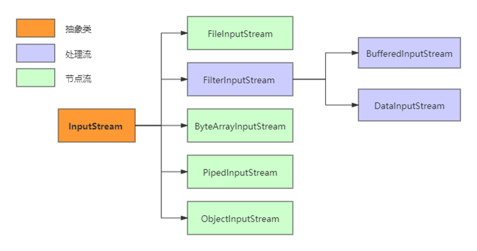

 

> OutputStream类

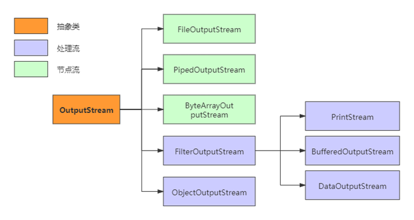

**字节流方法**

> InputStream主要方法：

| 方法                                 | 作用                                                         |
| ------------------------------------ | ------------------------------------------------------------ |
| int read()                           | 从此输入流中读取一个数据字节                                 |
| int read(byte[] b)                   | 从此输入流中读入到byte 数组中，并返回长度                    |
| int read(byte[] b, int off, int len) | 从此输入流中将最多len 个字节的数据读入一个 byte 数组中，并返回长度 |
| close()                              | 关闭此输入流并释放与该流关联的所有系统资源。                 |

 

> OutputStream主要方法：

| 方法                              | 作用                                                         |
| --------------------------------- | ------------------------------------------------------------ |
| write(byte[] b)                   | 将 b.length 个字节从指定 byte 数组写入此文件输出流中         |
| write(byte[] b, int off, int len) | 将指定     byte 数组中从偏移量     off 开始的 len 个字节写入此文件输出流 |
| write(int b)                      | 将指定字节写入此文件输出流                                   |
| close()                           | 关闭此输入流并释放与该流关联的所有系统资源                   |


 

### 字符流                                                                       

与字节流类似，字符流也有两个抽象基类，分别是`Reader`和`Writer`。其他的字符流实现类都是继承了这两个类。

**字符流类**

`Reader`为例，它的主要实现子类如下图：

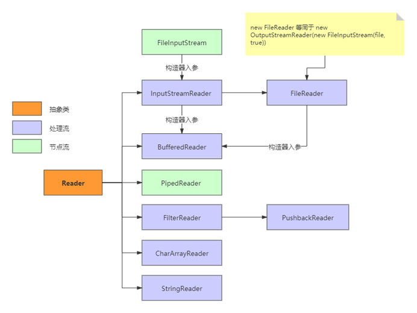


**字符流方法**

> Reader主要方法：

| 方法                                | 作用                           |
| ----------------------------------- | ------------------------------ |
| read()                              | 读取单个字符                   |
| read(char[] cbuf)                   | 将字符读入数组                 |
| read(char[] cbuf, int off, int len) | 将字符读入数组的某一部分       |
| read(CharBuffer target)             | 试图将字符读入指定的字符缓冲区 |
| flush()                             | 刷新该流的缓冲                 |
| close()                             | 关闭此流，但要先刷新它         |


> Writer主要方法：

| 方法                                 | 作用                   |
| ------------------------------------ | ---------------------- |
| write(char[] cbuf)                   | 写入字符数组           |
| write(char[] cbuf, int off, int len) | 写入字符数组的某一部分 |
| write(int c)                         | 写入单个字符           |
| write(String str)                    | 写入字符串             |
| write(String str, int off, int len)  | 写入字符串的某一部分   |
| flush()                              | 刷新该流的缓冲         |
| close()                              | 关闭此流，但要先刷新它 |

另外，字符缓冲流还有两个独特的方法：

- `BufferedWriter.newLine()` ：写入一个行分隔符。这个方法会自动适配所在系统的行分隔符。
- `BufferedReader.readLine()` ：读取一个文本行。


说明：

* 输出操作，对应的File可以不存在的。并不会报异常
* File对应的硬盘中的文件如果不存在，在输出的过程中，会自动创建此文件。
* File对应的硬盘中的文件如果存在：
  * 如果流使用的构造器是：`FileWriter(file,false) / FileWriter(file)`:对原文件的覆盖
  * 如果流使用的构造器是：`FileWriter(file,true)`:不会对原文件覆盖，而是在原文件基础上追加内容


**使用：**

> FileInputStream / FileOutputStream的使用：

````java
* 1. 对于文本文件(.txt,.java,.c,.cpp)，使用字符流处理
* 2. 对于非文本文件(.jpg,.mp3,.mp4,.avi,.doc,.ppt,...)，使用字节流处理
/*
实现对图片的复制操作
 */
@Test
public void testFileInputOutputStream()  {
    FileInputStream fis = null;
    FileOutputStream fos = null;
    try {
        //1.造文件
        File srcFile = new File("爱情与友情.jpg");
        File destFile = new File("爱情与友情2.jpg");
        //2.造流
        fis = new FileInputStream(srcFile);
        fos = new FileOutputStream(destFile);
        //3.复制的过程
        byte[] buffer = new byte[5];
        int len;
        while((len = fis.read(buffer)) != -1){
            fos.write(buffer,0,len);
        }
    } catch (IOException e) {
        e.printStackTrace();
    } finally {
        if(fos != null){
            //4.关闭流
            try {
                fos.close();
            } catch (IOException e) {
                e.printStackTrace();
            }
        }
        if(fis != null){
            try {
                fis.close();
            } catch (IOException e) {
                e.printStackTrace();
            }
        }
    }
}
````


> FileReader/FileWriter的使用：

````java
@Test
public void testFileReaderFileWriter() {
    FileReader fr = null;
    FileWriter fw = null;
    try {
        //1.创建File类的对象，指明读入和写出的文件
        File srcFile = new File("hello.txt");
        File destFile = new File("hello2.txt");

        //不能使用字符流来处理图片等字节数据
        //File srcFile = new File("爱情与友情.jpg");
        //File destFile = new File("爱情与友情1.jpg");

        //2.创建输入流和输出流的对象
         fr = new FileReader(srcFile);
        fw = new FileWriter(destFile);
        //3.数据的读入和写出操作
        char[] cbuf = new char[5];
        int len;//记录每次读入到cbuf数组中的字符的个数
        while((len = fr.read(cbuf)) != -1){
            //每次写出len个字符
            fw.write(cbuf,0,len);
        }
    } catch (IOException e) {
        e.printStackTrace();
    } finally {
        //4.关闭流资源
        //方式一：
//            try {
//                if(fw != null)
//                    fw.close();
//            } catch (IOException e) {
//                e.printStackTrace();
//            }finally{
//                try {
//                    if(fr != null)
//                        fr.close();
//                } catch (IOException e) {
//                    e.printStackTrace();
//                }
//            }
        //方式二：
        try {
            if(fw != null)
                fw.close();
        } catch (IOException e) {
            e.printStackTrace();
        }
        try {
            if(fr != null)
                fr.close();
        } catch (IOException e) {
            e.printStackTrace();
        }
    }
}
````


## 缓存流

**缓冲流涉及到的类**

`BufferedInputStream`

`BufferedOutputStream`

`BufferedReader`

`BufferedWriter`

在`BufferedWriter`中自带缓冲

`private char[] writeBuffer;`

`private static final int WRITE_BUFFER_SIZE = 1024;`

 

**作用：**提高读写速度，内部提供了一个缓冲区。默认情况下是**8kb**

`private static int DEFAULT_BUFFER_SIZE = 8192;`

**要求：**先关闭外层的流，再关闭内层的流


**使用**

> 使用BufferedInputStream和BufferedOutputStream:处理非文本文件

````java
//实现文件复制的方法
public void copyFileWithBuffered(String srcPath,String destPath){
    BufferedInputStream bis = null;
    BufferedOutputStream bos = null;
    try {
        //1.造文件
        File srcFile = new File(srcPath);
        File destFile = new File(destPath);
        //2.造流
        //2.1 造节点流
        FileInputStream fis = new FileInputStream((srcFile));
        FileOutputStream fos = new FileOutputStream(destFile);
        //2.2 造缓冲流
        bis = new BufferedInputStream(fis);
        bos = new BufferedOutputStream(fos);
        //3.复制的细节：读取、写入
        byte[] buffer = new byte[1024];
        int len;
        while((len = bis.read(buffer)) != -1){
            bos.write(buffer,0,len);
        }
    } catch (IOException e) {
        e.printStackTrace();
    } finally {
        //4.资源关闭
        //要求：先关闭外层的流，再关闭内层的流
        if(bos != null){
            try {
                bos.close();
            } catch (IOException e) {
                e.printStackTrace();
            }
        }
        if(bis != null){
            try {
                bis.close();
            } catch (IOException e) {
                e.printStackTrace();
            }
        }
        //说明：关闭外层流的同时，内层流也会自动的进行关闭。关于内层流的关闭，我们可以省略.
//        fos.close();
//        fis.close();
    }
}
````

> 使用BufferedReader和BufferedWriter：处理文本文件

````java
@Test
public void testBufferedReaderBufferedWriter(){
    BufferedReader br = null;
    BufferedWriter bw = null;
    try {
        //创建文件和相应的流
        br = new BufferedReader(new FileReader(new File("dbcp.txt")));
        bw = new BufferedWriter(new FileWriter(new File("dbcp1.txt")));
        //读写操作
        //方式一：使用char[]数组
//            char[] cbuf = new char[1024];
//            int len;
//            while((len = br.read(cbuf)) != -1){
//                bw.write(cbuf,0,len);
//    //            bw.flush();
//            }
        //方式二：使用String
        String data;
        while((data = br.readLine()) != null){//获取一行字符到data
            //方法一：
//                bw.write(data + "\n");//data中不包含换行符
            //方法二：
            bw.write(data);//data中不包含换行符
            bw.newLine();//提供换行的操作
        }
    } catch (IOException e) {
        e.printStackTrace();
    } finally {
        //关闭资源
        if(bw != null){

            try {
                bw.close();
            } catch (IOException e) {
                e.printStackTrace();
            }
        }
        if(br != null){
            try {
                br.close();
            } catch (IOException e) {
                e.printStackTrace();
            }
        }
    }
}
````


## 转换流

不管是磁盘还是网络传输，最小的存储单元都是**字节**，而不是字符。但是在程序中操作的通常是字符形式的数据，因此需要提供对字符进行操作的方法。

| 类                                                    | 作用                             |
| ----------------------------------------------------- | -------------------------------- |
| InputStreamReader                                     | 实现从字节流解码成字符流         |
| InputStreamReader(InputStream in, String charsetName) | 从字节流解码成字符流 ,并指定类型 |
| OutputStreamWriter                                    | 实现字符流编码成为字节流         |

转换流涉及到的类：属于字符流

![计算机生成了可选文字: 字符流 InputStreamReader u忏8．t OutputStreamWriter (gbk) gbk.txt](data:image/png;base64,iVBORw0KGgoAAAANSUhEUgAAApoAAAF1CAIAAADHlN1iAAAAAXNSR0IArs4c6QAAAARnQU1BAACxjwv8YQUAAAAJcEhZcwAAEnQAABJ0Ad5mH3gAAGMDSURBVHhe7Z0JfFTV2f8zk0ky2UMWCBAg7ERAUMGlYgsIVevSDVup2mKFVt+/7QutvmoVl6JFqxZafVsVqrRqtepbrWhFRXEBQcENkB0JhCVA9nWSzPL/3fucuVxmkhCSmUlm7u/7ebic7Z67nHue3z3n3rmx+Xy+OEIIIYREM3b1PyGEEEKiFso5IYQQEvVQzgkhhJCoh3JOCCGERD2Uc0IIISTqoZwTQgghUQ/lnBBCCIl6KOeEEEJI1EM5J4QQQqIeyjkhhBAS9VDOCSGEkKiHck4IIYREPZRzQgghJOqhnBNCCCFRD/9AKiHdDPtgSLDZbCpEiCWhnBPSbUjvw9JA0knHgYobSFTSCbEalHNCug30Pq/X6/F43G43lgizP54UouJ2uz0+Pt7hcGCJsMojxGJQzgnpHkTLIeQul2vxurkqlXQKW5xt7jmLnU4nRJ2KTqwJr3tCug3IeXNzc11dHcSd1kXDacTJxClVJ5cQi0E5J6QbwNAceDyepqammpoaLwbqtK4ZTiNOJk4pTqw6y4RYCco5Id2DKHpLS0t9fb0xxKR12nAacTLlrKpTTIiVoJwT0m3Ie3DNzc2+OC+ti4bTKK8TqpNLiMWgnBPSnYiiy5iSdAVqObE4lHNCuhlIkXnSmNY5008jIdaFck5I9xMwb0zrhKlTSYhVoZwT0v34MLikdc3UqSTEqlDOCel+fD4vrYumTiUhVoVyTkj3EzDQpHXC1KkkxKpQzgnpfgIeA9M6YepUEmJVKOeE9ATU69m0LhghloZyTkj3E/C90khaUe+J933rZRgCAVknNFnxgpFXBaR3i6lTSYhV4V9UI6QbQL/zer0ul6u8vLy4uPjV2gdURqSYNeH2U/qcJeEthz9atuGei0b9ZMrQGZISwP+8dqkKmTDKy+qS2F3Y4myXZNxUWFiYk5PjdDr5R9WIBaGcE9INBMj58tr7VUZkmTXhjtF9zvpS0+Pfju5z9qwJ85F402sXSy544OLXsJSU+dOeykjK1pNPwLINC748vE5FIgLk/NKMmynnxMrwoiek+4G6dwv+R84SUXf2ekRhTpHwO7uev/HVb7Vvm0vXyiqRRHaPEMtCOSekJwA16hYzCAgHFDCH4+6Y/vSDl/ynLfvWqFmm1SNphFgaTrYT0g2g35kn2/9dc6/KiBQ/nXjX6D7nqIjOl4fXBqQY/PrVC7C8c/qzGUnZ7+z652vbnkD0oUveMMJGLgJSOMLY4mzfzryNk+3EylDOCekGAuT85ZrueZXsrunPQYMh5H9df6dKahsp/Pau5yDhvz7vz/0zhyHxV69+E8trJ94ttwJPbLhrc+mHWunIAjn/TubtlHNiZSjnhHQDAXL+UvVvVUYEuaRo9vnDrpCwaPCY/K9JNADk/nX9HXdPfz7Dqcn5q1uXIlGiB6p3rdjx92snavuPMt2i5QBy/t2sOyjnxMrwoiek+zF/rDRiNrFgutq8LuRZyb3nLj8fBlWWRInClq6fj/LyfLq4cousfsdbl9e4yjFGFy1fuevZTaVrJKtbLK65ueK++1oOH9b3nRDLwdE5IWHB53ZXrFhRu2GDih8Pep3X52tyu6saGg653e9P/1JlRIpLi+ZMGz4TepzhzMGQemDWyI9L3ly+dQmyxuafO/vMBQj89ytT9bKKP172DpYo3NYg3mDpx/Mh7SoSETA6/94bo3x//nN8ZuaAm28eMG+e3elUeYRYA8o5IWGh/NVXN1/aytdXBBnqNsfFVcfFOf77v9+bulFlRIo5Z94DVRZtxnLJx7cbKh6MyLPIeYDG3/SNxwoyh0sNxi3C/DcvV9mRIsHlvfTaT+Lq6iSaPGzY4IUL82a0/lUcQmISTrYT0p0kDx2a8+1v4646wqzd+5/91TvlXl67t/D5Nh5a/ct/T4Et+eh2PTlOojBkXVI0GymQalndQEpKDWcO0F6L+6jkDcmKJC1JdtsDDzhPP132p3HXri2XX/7FlCl1n38uKYTEPJRzQsJC9oUXjlm+fNCddxqWNXmyyjMx6I47bPHxarQeQdt0aM3Ww+vVTgBzroEpsaj3RCTUNFWYEzUz8MXdvmLGL1+esvzLJccViJTZRo/u9/LLQ/7616SCAtmjqnff/XTixB1z5jSXlkoKITEM5ZyQsGBzOHIuuaTwrrtg+bNmNW7fDnVReX6ypkwRjVdjzMjyypePa++QBW1eJZqSx+Z/rSBzOFJwB6CS/MhvzUtrilW8+9B3OS7niismbN+Omyd5du5zuw8tXbq+qGjfffd5XS4pQ0hMwmfnhIQRSMi+e+8tefDBAC3Rep3DccqHH7r69CkuLn6+XL1MHmF+fva9Y/uei5H62r3/+dnZ7X3K5oaXJj/y3XexlOgtU5YUZGkCD/ZX7bxv1RwJdxe2ONsPcn9r/qFa0/79e2699fDTT6sSfKBOYh3KOSHhAloCRYGuSBTj9T5XXVWxYkVzaSl6Xf7Pfz7goYfkd+fPl2l/+yTy/Pyc34mcP7b2NyopOtHkPG9B8O/Oa9at2z1vHpYSBVmTJw9dtCht/HgVJyRWoJwTEnpqN2yAilSvXq3icXGZkyZBRZC+8/rrEY3PypqwbZsnLU3k/J9H1dtnpHNAzn/Y+562PiMTfF+VP2tW4YIFifn5kkJIDMBn54SEEoy8d8yZ8+nEiYaWJxUUjHrqqfEffJA8bFjxfDUKH/ib3yTk5kqYhJs+V1115s6dwQ/USx58EGEpQ0i0QzknJDRAGPbddx9EAlIhKRCPQbffDiGBnCBacv/9LWVlCEDXC+bO1YsotFe5SNdQp7IN0BaFd92Ftuh9hfqurbuq6qubbkJ7lb/6qqQQEtVQzgkJAZAECMOeW2+FSEgKZGPi1q2FCxbIiNBTV7d/8WLJGrpokc3hkLAAMaJ10TpCUkFB0bPPjv/gg/QJEySlcdeuzZdeunH69PrNmyWFkCiFck5Il2jYtm3TRRdBEiAMkpI2fvy4VasgG87CQkkBkHOR8OwLL8y55BJJNFADTNIF1KnsAJmTJp2+fv3IJ580np1Xrlz5yWmn7bz+epk+ISQaoZwT0kkwEN89b96GsWMrVqyQlITc3OF/+QukIviLMVCOMcuXY7B+ygsvqKTjgBrRumgnR/6sWdoD9dtvNx6oH3z00Y+HD+cDdRKl8M12Qk4aeZeqeP58YzCHkXe/666DWjuysiSlfdDvzH8g9ZlDt6oM0ilscbYr+y3s3B9IdRUX77n11iPPPafi+ssNQxctCp5EIaQnw9E5ISeHfDrUPDHba9q0CZs2DXv44Q5qeSsYT4BpnbbO4iwsDMcD9UmTJq1atUpFWmP37t02my2gDKJIRJaK6yxdunTevHkq4kdWDyhJrAzlnJCOgmHc1pkzzX/YA8O4McuXn/rWWymjRklK59Af/pIuoU5lZwn5A/VZs2ZNnTq1HUV/5JFHzj333ClTpqi4zvz58+fOnTt06FAV10GZxYsX4/5AxXVQBiWHDRum4sTyUM4JOTFel6t4/vz1RUXGlCwG4oMXLsSgPCRTsvLsl9YVCwmdfqAOrcVY2cycOdqHb6HoKu5HBB6jaij0mjVrVKoORuFIQbqK62BcDuXG/QqyUECl6qAkqlIRHRTQ9oZYEso5ISfg8NNPw6Hvvece47vrcPoTt24deMst4vRDQIA00TphISI+La1wwQLcqBlfd+/gL9TfeecdmSdoBwzHpbAMzZGCEfaSJUskd9myZYgigCyjtkWLFskqCM+ePVsSd+k/ozBWNEABKUwsCF+FI6RNgr/VmnH22UMXLcJSxTsL+p35Vbi/l/yPyiCdwhZn+/HA33fuVbh2qHr3XVwA5j+a3mvaNFwAqWPGqLgfjM4XLFgQMHMejBRDAKN2w/diVA153rdvX3AixuUYxw8bNszsqCUFWm6It1FYosSacHROSCsEf6s1MT9/1FNPnbZ2bde1PAD4YtMYk9ZJ009jiMmaPPn09etHLFlywgfqq1evhpbPmzcPu9Eq8i6bFJs/f74MrwVINZT4lVdewYhcJfkTJYwhO2qQWXosoeUoaR6II8qH6ISjc9IZ4FPgkuCbVLw1MBCZOHGiMVUowCuZRxUgePAhYPVZs2ZFfvLQ53aXPPhgyf33G993szudA268ccDNN8enpUlK18Hxyui8oqJi7969Txb/WmWQToHR+TWDHxo0aFB2dnYIR+cGuBhwSexfvNh44OLIyhp4220FENrjP/AXDK55LFsdPaMfQcUD+ggI7hRLly5dtmwZepzU1hb051aGo3PSGQYOHIglFFeiwcBPrVmz5oYbblBxHXlPJ1ihZfABF6biOgsWLJgzZ46MSCJG8Lda82bMmLBpU+GCBSHUcgMcNYTH4XDAC5MugtOIk9m+2nUa483Hk3qgLm+uIYDdC9ZyXPBTp05FAGUCkKG2hGVYj14jd89ysK2CfsRX4awMR+fkxEBTxe+ckHPPPVecDpQeci6JAnzN+vXrAxKBXIHis1otYGBUHg4atm3bPW+e8X03kDpmzNBFi3pNm6biIQVHjdF5c3NzTU1NaWlpSUkJlggjBemqEGkXSB30OzExMSMjIz8/f8CAAVgijJSQj87NBD9QX1VUdPfWrSpyIuQylvF3W5d08OjcPB+GA3/nnXemTJkiT+IRMFKkMLEmlHNyYsyupB2MYiL/8naPsSLGDRht43pD4MsvvwyeYDQj4/4TbjEkYJi19+67DzzyiPFLJAzFMBzvd911J5xH7TQ4D8DtdtfX11dUVBw9erSysrKhoaGlpYVy3kFEzhMSElJSUnr16pWXl5ednZ2amophOrJUofCAlitdtqx4/vzm0lJJwaXSd/ZsXDbG370NlmQD6SDQcoTlIsft7GWXXWbocfC6cr8rvQZHJ1P3lHNihnJOTszJyrnZucANjR49evbs2a0mImy4JK0KnQAtNxcOLXDKwd9qhVMevHBh57/v1mHQ9TweD4bjUPS6ujosEUYKu2QHwRUF4uPjMRyHiqelpWGJMFJUiTAjD9TNP0k3P1BvR87lmkfA6FZS2Oggwesa3Uey2pJzI6BWI1aCck46ivgRFQnCeNOn1QfkUPpWX/kBMmqfO3euMfIwwgbhcFId/w1SmEDXA9BvjMgh5FgaWi5L0g64JGQJoN8Yo0PIsURYsiJG465duJDMT9Dlk+9VRUVtybkQcJds7iMBco4s4zds6C/yThzCrcp5q+/cEStAOSddIkCMA4BzafUCCxiRGwOORx55RD501SqhUvRW/+QGRuTGW04RAycHeP20eq5I++AaA3Y/CKuMyFK5ciVE3fyN911nnjn744/badMAOTcTIOfz5s1bv349SoquG4Jt9CMJDBw4sP0bCBLjoO0J6RxyCQV/mko499xzIfNSph1U6RMBLUeFKtJZPI2Ne26//X2n8924OLEP0tKKFyxAuioRcZSSe70YmrvJyYPzps6gfj/UjXhbWg785S8PZ2aqKzsu7ia7fecNN7RUVqoSx9POJQ3Bxuoqonc09DJgTgRYHZUgYHQ0BCSLWBDKOTkx4ik6iPgXec0HXklqCMBwQwZGYfgjcUlwXhIwUrpI6VNPrS0oMIQctvWqq1wlJSq7u1GKRE4edQZ7BhDv3Tfe+J7DYVxmq7Oy9j/8MMRelfATLOdI0fuQRkiueWIp+LtzcmLUxXI8cDdQXBUxIQ/w1Jo6q1atkvdy2wIFsDQe+I0ePVoCoaJ2w4bPzztv29VXN+3fLynpEyactnbtqKeeSiookJRuR58zJp1BncGegSMra8gDD0zcutX42zzuqqpdv/jFhrFjzT+DBOgpATPtSFG9yPSpdkI6COWchJilS5dC6c1+Ck5q/fr17Sj6K6+8glUkjJISCAY1tH9bEEyr32od+eSTp69fH/JvtRJiYPzlXOPNyoZt2zZddBEMAUkhJLRQzkmImT17dvDAAurezjtuyLrssssQ2L1795o1ayD/kh5MxwfuPrd73333rS8qOuT/Tpbd6Rx4yy0YNuXPmiUphISVXtOmnfHZZ8P/8hfjx+gYoGOYjsG68dlBQkIF5Zx0knaG0a3ia+MZvMy0y1djh+l/JyrgZzaGhGOLHfwFTvC3WnMuuWTCpk2R+UE5IQY2h6PfddeduXNn/xtukK8S4UbzwCOPfDR4sPnLRYR0Hco5OTkmTZokDywxjA7Jp11eeeUVeW8Odb5z/N+JEiDhGL7LFtsZuAsypbn50ksb/X+xKmXUqLGvvz5m+fJk/skp0k3gJnLYww/jhjL7wgslpa0H6oR0Gv7unIQLCLDxA1kBKSrU9mC908A/Bn+rddCddxqjIkJ6AtDv3fPmmZ+gQ+OHLlqE+04VJ6RTUM5J1AP9bvVbreYPaBPSc8AVe/DRR3HFGg+DZE4eVywfBpFOQzkn0U3wt1qzJk/GWCdt/HgVJ6RHAi2HokPXzfNJ4f7bPySGoZyTaCX4W63OwsLBCxf2vuIKFSekxxP8l3lTRo3C/ajxlJ2QDkI5J9GH1+Xad++9JQ8+iICk2J3OATffPPCWWxCQFEKiCD5QJ12Hck6ijMNPP41BufF9N4Dh+JAHHug533cjpBP49B+w7b37bj5QJ52Dck6ihtoNGzCCMb7vBtInTMAIJlP/++iExAAtZWXF8+cfWrqUD9TJyUI5J1FAc2mp+DgV17/VCh+XP2sWfRyJPeo3b8ada+XKlSrOB+qkA1DOSY8GY5SSBx8suf9+8wxkwdy5A2+7jTOQJLYpf/VViLrxQSTAB+qkHSjnpOdCd0YsDm5n9y9evO/ee/lAnZwQyjnpiQT/eid52LBhDz/MyUZiQYIfqCfk5kLR+86ezYdNxIByTnoWGIUEf6t14G23FcydS89FrEzwA/XUMWOGLlrUa9o0FSfWhnJOegrQ7+BvtebPmoVRSGJ+vqQQYnGCn0DlXHIJRJ1/YYhQzkmPIPhbrZmTJsFJpU+YoOKEEB2+H0pahXJOupngb7UmFRQMXriwz1VXqTghJAj59WbpsmV8oE4EyjnpNlr/VuuNN2KQwW+1EtIR6j7/fPe8eVXvvqvifKBuYSjnpHto9VutGJQ7CwtVnBDSMY6++CJ6Ex+oWxzKOYk0wd9qTRs/Hq4na/JkFSeEnCRel2v/4sV8oG5lKOckcgR/q5VP+wgJIXygbmUo5yQStPouLj9uRUg44AN1a0I5J2En+JeycCvDHn6Y32olJHwcffHFr266yVVcrOJ8oB7rUM5JGGn1W61wKHArKk4ICRtel0tmxTx1dZLCB+oxDOWchIVWv9U64Oab4Ur4IzRCIklzaemeW28tXbZMxflAPUahnJMQA/0O+FYryJ81a/DChfxWKyHdRfAvSvhAPcagnJNQEvyt1oyzz4bLwFLFCSHdx5HnnsNInQ/UYxLKOQkNwd9qxVh8yAMP8FuthPQo+EA9VqGck67S1rdaB9x8c3xamqQQQnoUfKAee1DOSZcI/lZr3owZgxcu5NwdIT2fTjxQbykrw206X2jtgdjV/4ScJHAEn5933rarrza0HI7g1LfeOuWFF6jlhEQF6RMmjP/gg1FPPZVUUCAp9Zs3b5w+fcvll5s/FGFwaOnSD/PyPp040fyiK+khUM7JSdNcWrpjzhx0aeOm3pGVNezhh8/47DO+JUtI1NHnqqvO3Llz0J13GmPuoy++uGHs2D233mp8xlGofOMNLCH5yJIU0nPgZDs5CVr9Vmvf2bMHL1zIl2gIiXaa9u+HTh9++mkV119oLVywIH/WLHmgXvbyy19+97sIIHr6+vVp48frpUiPgHJOOkqr32odumhR6pgxKk4IiX5q1q1DT8dSxY//m4cbp0+vXLkSAUTHrVql55MeAeWcnJhWv9WKEXnejBkqTgiJLdp6y9Xrcn1y2mnytcdTXniBTqDnQDkn7RH8rdb4tLQBN9884MYb+WorIbGN9hvU++4ruf9+829QC+bOdRUXyxcmcFs/YdMmuoIeAuWctE6r32rtc9VVuD03XoIlhMQ8wQ/UcU9vfIIGDmHgLbdImHQvlHPSCsHfak2fMGHYww/zW62EWJPgB+qCIytr4tat/HMMPQFLyDlvWTqOq7i4+De/CfhWa+Hvfpc/a5aKWx6bzaZCxBpY3IG4q6qMX7Ic/tvfzHPvQt/Zs4c//riKkHYJq/eIcTmXo8PSQNJJMOiiB+6778Af/mB+Ttbvl7/sd+ON/BEaQD80kKikkxhGPIa4DkHSrUPJggUHHnggQL8DsDkcp65dmzpunIqTIMRvCBKV9NAS+3Lu9Xo9Ho/b7cYSYQt2yI7gLi/f8fWvtxw8qOJxcRkXXNDvd79LGjJExa0Nup/dbo+Pj3c4HFgiHKYOSXoUwd7Dag7ky5Ej3UeOqEjbpE2aNHT5chUhxxMx7xHLco5DQw9EV3S5XLYl16pU0gbFz3xc+XkJAs7e6f0vG5cxso+kEzO+OX91Op3ollT0mMfwHnGPw3tYdBhQtvaro6t3eVs8Kt42g344IW1onoqQ1vDNXuJMTgmf94hxOZfeWFNTk/7sL1UqaYOW6sbtD7/b+xvD884darNTqFqnduafMjIyRNEp57GN4T3S/gHvwVk90lVqr1ickZkVPu8Rs3KO4wLNzc11dXVHjx7t/+pvVAZpG5/XRyFvnwOX/C4vLy8tLS0xMREdkooeq5i9R7/l8B6Uc9JVDlx8T17vPuHzHrEs516vFx2yqqrqwIEDI99ZoDII6QLbp87v379/VlYWOiTn22MYs/cY8Ta8B+WcdJXtU27rXzAgfN4jxv+iGvqkx+NBt0SQRuu64VqSt6LUFUZiF3oPWmgt3N4j9v9AqvTJOJ+XRuu6UcstBb0HLYQWbu9hib93rj1QoNFCYbH6cIq0Bb0HLVQWbu9hCTnXCLpRotE6Y8SCBFwDNFrnLMxYRc5tcV4areumridiJQKuARqtc6aup7AR42+2u1yu8vLy4uLi01f/VmWEgsQpsxPPucJXV1H/px+opDDgGPG1pAvnBmwi7TcrVSguzvXiHe4dH6pIXJzzcu0YXS/cIdFIknLto/Y+w1TERPPa55pXLVWRLiNb8R7e1fDX61RSxPl00h2FhYU5OTlOp5NvtscwZu9x2gfoWaH0k+ZeDOp+N02FOkCoujmcmGPIBHNXgsNxzjjmJwP2Cr3P/dWGEHbnDhLc6w1vY3aAckoDXCIQX42AcTjd6Cc/Pff2wsFDwuc9ONneOZO+7QtKD5klTr5W71rHbSLAC6CAY/g5kpXy0784hn9N8zmm8hG01p0dOhIOJKhwp03fCpaB6RE0YkECroEuGLpDQC8GSNE6e1DhYAtVN8fmNJEzdSV4ErOWA20//bmpv/ynpqDd0fW81donZm2pvYwULazjOPVCSdGcjI57+2qjmN/8rkmPdrOfDDOWkXPTrwVCYYZ6BaSH0AI34bxc/XS+7t7JMF9dOcKJ5/3YX0DAWqp8ZE3DW7pT9k0MUSRiBHB8ya6YQUB6JI1YkIBroJPmGHFO4tdmatWZeorqJiO+hlxz4TZM6Ho3D3QvuieJg1eRvZI83edIAaEb3Iu3rBgbtqXlSBRnSQ9r2DPyJNGeOxBR3SUeW1GsedVj/iOSFKE7/WT4sMxk+/vzVUYoSJz6s8SvXYmrp37x9xwjJjl/cC8SXc/fJgHg3rHG9bz2HbqU2Uvt+cOlxyKApayFgHlF947V5sLemiOOEeciRZDanD/4HRKN1c37kDr3X8YlDlBh0rd+hRRUJRuVGmQVKWPsoWCuAWs1LJ2NgGzRvD+SJenmksaeS1QI2GGQdvt7EjAnAqNCoe6eb6iQacdQOZbmrRgnEJg3LVtBihx784fPNL8Tsr/e+OnXF3Cy3QocN9n+HrxHCPykdJOAix+Yu09bvQaXccKpF7bazdGX4/uNMrqJdASjsxu9SboSCtszekvXEKSDBHRho+8janRbARW22sXMvTig05lrMDyPbNG8P5Il6eaSxhkwtoLzI8crR2dUhbDkIoACCLRsXGGch2A/Ccfbqlc0fItxjIaX7gqfnnc3J9tDgM3nCampvo0wWlzChrQAXFJJU+bouVpJXBByTQBcT9pVZVoRAanW7zJ8tuN9B6LI9R3do4XTcnBxo/KWt/9Sv2BSw6Jv6ysGoGo2Nop1k39wr3HVAuxhyuwlst2AqxxrobCW5d95o5cijMLmqJQ8tufq/GgGF6MloeP5PBh8mLu0HIUUQw1GhYKcH5h5x7AtmB7UtoIzYD7hsmOylpEiAe/+zZIeEpM6iaUIuAY6b2nZqM17cGtAumf3R0jHFatF/X3fyPVHj/MJOqqbo/uYu4m/X7dRj1b/cVWhJHJ9NYcRxuromOitTf+8Ge6lcck1xooGRoq5i2Gj5l4MV6N8iM9j7vgAxcy+EVGjHoTRi81RKSnyHJ87CGF9RB7n/uJ1ScSuaon6KvBycvZwNuSE6M7n2HmQgAlvW17ROLfGzni2K3/VFZOqwod1JtvlIg6hCcfC3tId9QvOhUk0fuiZpmK4ubsFWS1rnkIYl1r8yElBlZgK//NmKYnLEWshimDzO3/BJqRAwrlXpc5fnTznCVmxYdFlkuXZsRrlPdvfl2JAdgnrxo/AFtVuwBC254/AbsCwP7IhmNRjy+h93P7oa0n/QeHjoqaSqBB7ZZj0qOb3tZ1M/Po1CMvuGVtx/vA+ZNn7FSEccH6QLjuGKBKRhQII+/E5xl2E/yQLpvXbtJzEqT83dsY4Iv1saGcpREYsSMA10EmT69mr3Zcfl+45sFk2o0cNjALCibs50hFGNwxY8fhoHERaSqI2rAXngFw4GenRwPmDhei/0j1hKCNZ0t2MqowuhqC+UbUb0lV1h+PTu+Qx3yj12PMKjUqAZEkYp8gclZKylrga2RDOGO6KEEgYf7HuSzX0A1HIruJITRtq5QS25RWNtYw911O6buGFr8J1ylTDyIshqpGa3/ur5MoVo6GV1ECKZ9t7iDa//WdfXRlSEsZdbHpHw/+CiYEWNm9CWePjP9GlXYErL2Xev1WucKwqbXXP9g8kKp0KOH9wX+r8NTCJxvc/BTtW/9tzGv5wCcogXXqLhraiVgl2WHbee2BLcFTD2PrxaD3ht+dIYakWnUe2LlGtf/q82LQUQ3rCuVfrq2p1aqdI3xxOGqIoYJxY1COeEeWlQonacwuNnXF/8ZoWDrkRCxJwDXTaFMEvlBmuwAibyij0FBVsvZu7nrtJ8s33taqkv7B/3aBcvSe2rPm7Std7WfKcJ1Wuqs3YrobRxaSrAumMcDISRQ3ovOjdcFzieaSfqn3Q0Tq1Xon07oColPTsXoegLS1b/Ji4IO/RrxC29xsFJyaJ+orafhpOQ7OA86DCWrXteEXj/BhePTQWZijnnbNWLxF/rvnS18O+6sNGrnELrOf6A2LmFQM24TfPtnfr7z4L5i3djkxbWm7i1Ou0LLWuv7yBWtGfezz23MHITb1jLSzhXO1dGD/H+pu2w6Y6A6L+klr92CXsmOFTtKlFKXms8HFIgeSfLZMdUKmCeRV/Jdpp1OPH5ZqwZWr3Byqi99jQG7EiQZdBp0yTHH+nM5sIkgaiBkYBFT3W0fTosSxN2CTq34ReOMiBGBwLB/aR5pX/K+5F7SqGqhi/GuWNPtVqNAgcl3YHr/fu+JHnqVRBW0vbw2O+sbWoBpxeySb8D18XP/QsBLwHtiIRuyqJ2vlEKfFLBlKJZgFnzBz1h49HNZAga4XKwoxlnp0f/3P+LppxTehRI+zz5yqMMGRGsjST+1OtcPsrmjehWcqvX0u98yPnFQ9I1PXYVarr6qvrARBQlRFVtTXcPdFsTc/9ChVKVtNzNyJF7hKAea2ASoKjEgAIe7e/27J6mRZOy03++d/9hTWQbt5640MXOUaeZ88fiSzP9veRIisCrZ6ju42wMqi1SlGbln02DOfE2JZx7KE1VTexEgHXQKdNbuXt/YsC0uOHnY10dD2EA3qZniK02c3teYMlqllarp6GStqvJzAXvgWWeP71EkXf9Bdoc7umqFYb3JG5M8Ja3n4kcbJ6QVVSTsZlCVoULsV/e6H5CngGKSPOSm4UPLvW6msFH/VxKRKWao0sY4fF4BWDnXNITOoMH9YZneu3q6EyVaderb/htYAqoGJGGFdh/MivI5pw/v+T/ub+7N/GivaCMchCAblY1Yo6WmFVp89Xq/kCqQdmVKXh35Ato4/k+uuWLF/LykcklnTFQ4iikpQ718MQ0FZBDzm0HeN+ZAXvgwqfIGoOa5tDhUgwDlyijnGXSIHkX72OrWNntGPXaXr2V0iPH3qORLVV9qtbchyplmU6P9hVX63WvRO+MUcqlMORkloZQc8KsRELEnANdNZa3tVe9sYljevfSHT+7Gm5sCFIWoqO0fG1DmugpWj/B3RzwycYhY3+DiQ30F3o2FJzZEWYdCijh5q2KwW0kD1viOTq6Tp6VPdmx7oqltIfEdY2od+sI6x5myCXpSF1thsV7ydoRyeJarpOQ3MXSBTwv6rEqOW4auUEtuMV9SoEfz0hsTDDyfbOmb9hjgujwfRcdSnoUf9lgSsm5a4NCZNmIew9tM2zdRVMadKkWcg6vv8cqxZZzp8/jZSWdx8zUoyqUEPLW38yNmTvO1LLQqdS+HfJ5/Vs194v1S5Z/7ZkN3w1pQjLijBtJQ3zzrd2XAHRgCyf1/Wo9vtakHjxrYjKztvSc2UrCCDa9I+53pKNeil1UNgNiWIV7Bv2EMFWz4/78+UImXfbdCp0jOYIrRELEnANdNZwSbd88CTqMzoCTK55dE+5et2fvqxvUvUIXVp05HrWO1pQNz+usNbT0eNQm47Z8+gcq0d2I2kmxEx1KGPHpCpxEXp5DfEegbsU1FVlW7IbMqqWFQNdnL4PKnyiqLgpoG1ICpjOFfDvp6yF/1UZw5GqqF7AOIFteUXTWv79CYmFGcp5pyzgojGHjSjwh3GJyOUuYddfrpCSjQ8c+4yiuQyyWt7647Eo0PrMOw13jFdRHRTQatCr0uo8RivXYtMz/62Nv/0Yu4F0Y0MIQGIRsPcdpa91/GG2EzVQWZq1fPAEEuAgkmb+ATsvNRtox6IflBQTkKhucabdgFzsoXnfjLBW+Vt/NK+ItYxToZL8jiDERixIwDXQBcN1G9CLAVLQDaVAQI8whbXrudVubkxWSdioytzjjpXRfQLKGKtICnYsoIdiFcNTNS+/R6UCpCiOdTFzVwXGbiDdvG9yOPZ+o49Vom/9hFH3Jy+phOpSVUA/V1K5tmmVGOCjUM9xKQEnEDuJvVIxk1fUV9SRcKgszNh8xvHHFjgu84cgJqy8QWVEFuf1z0Ma9askjF93JxFjw7RH+BkZK2D2HmfAe/RIP5l809u29DxNO//xS5VEejAbzv8TPyMTCrS7vO4wdW8YlE6LUiMWJOAa6DmmCEqn9UwLM5Z5sz3oAz2RMbX57tsBWmhNNSexEgHXQM8xtX90L1FiqrXChmVG59oouRus6X+/13h7EZYB6bSoNWJBAq6BnmKu+78O99L89H8FpNN6qoUXq8i5j5BQoK4nYiVU2xPSNdT1FDYo54ScBOp6IlZCtT0hXUNdT2HDOpPthBBCSMzC0XlMEV90furvtiff8JKKt0vS1X+GqYjPh7WwrphKMiE1BxdAOOXW1SpiAdT1RKyEansrgU5t7uZtIU6jVYdjeAwEVJIfWSs4PeZR11PYoJzHFInnaz+vb1r5sIq3TcovXnYUnR+n/XpCI/GCX9v7qb8D4as9KokG6HjOq/8suULawh2S5T24xZaeh9UlGvOo4ydWQrW9ZUB3Rqd2b3lbxdtGnaA2TlFbWe4dHyAdzkrFLYOckPBhGTnHRRXrFn/K+ZBkX+2Rli1vBWS1ZgojRQvXHqm5ZVjtvecYiWIJE2ZIYeTCJJx44a+R1bJD+6PLCWd811w+hk2OnViKgGsg5g3dGUfdvOGFgPTWTM5P66dIz2wly7VC+7NPcFZwWQFZsW1yQsKHZZ6d61dcbFvihMtxoN7aMomm/PixjPt2pd/2oVEAUVjShTciMV4fiztOOV/KJE2+DlFbem9EsaKxijIdz8EtEoXqIxrfezjCTa8/iDBWdBRNU4Vj24gFCbgGYtrQkdGdcdDuL1caiXAR4j3gHFJ/+QoCWGpZfiQRZnY4Cj0s7ggmUc2ZYEgAl2UUtoKFGY7OY8fiB4zFkXqrDhopAccu0RNilDfMc2Qn0nEHgDDuAKS3N69/XhUQdR80XkVj2rQTRCxGwDUQ25YwUZuKQ6c2UlL/+xXp8gDdX0YCAFkSQIqRiJLpt3+oZxmdxZf8k0exIkINf/u51Ak3hagtq69ELWL62QgjfHYeO0iX8xzeJVH/gR87diOlesHZngNfItyyZWXV/wxB1LXqUUS9NUcQrV/2M7WCn8b//B4lUSDz/t0pP9H+NhrKN3/5luR6a44ixTH8PInGNjhSYjVU21sDe2ZfHDI6tUQdp0wTqUaX15zD336unxJ1UjRvooN05IobgSNKuvAmo6skTLw84RTtb02ZnQbcFFK0EYKV0M9HGOFkewyZjmfvZwEpgVHQflZrFl9wqiqgkzDiPCPLW3VIpZrKx6wRCxJwDcS26WidWo/GDzxNi9Yccf3n94i2bH5LRgIa/sJIQTqiKIOSSInvPczIFS1HGalBTHNTgj/FEhZmONkeI+YYrf7WqpEiURCU0kqu9r8pmjF/XdYDX4mlznocZs/ojY5aedNgGALx/Ucj0b+uQqKxbepQiZUIuAZi22zpeeaj1oTZFIUZt+8ISwApRq6vVpurA0auAI8BH3WsmD/XnBLzJoccPjjZHiM0b34z8FCNDuNHonoHMvUlHeNKU1ETyIsfoA3N3SVfSC4CiNqz+ko0eEMxjBwpsRSq7S2CrseGZwju3ej4RooEjrkC7ZGfdjegreXPxbi8+cu3EEie/t+qkFarhZyGgRxy+OBkewyZjmPQ6eYoRtUSTbtmiUoC/tz4rH7mwhp6tOruMyt+XShW98Qc6eGOAeMkVwsIelSrBJ226qBEY9yIBQm4BmLbdAzP0Pzx84jCjaR862ZEE0dPxzhbyhwr3H800hFFGc3hxKm1hMY3F8OHIIBiUglMc1P6HL5ErWJhhpPtsWNu/ZmWvc8wiTb5e1T2Q8Uwrb/p+MtroIMhK/ni/0GKntD6iWre/h6y0FGlKumxDW8ully5H/cc3mmUj2HTzhGxGAHXQGybdHZ0aok2bX5THItz6vXo+xgVyNNxXZ5QQIF05KIMwiiAtYwsKSkD9MQJ35dq4aYQ9dYelahFTD8fYYST7bGD/PbDntVPok2b3mh8+9in3I6FtSvLV/XQRSoK9A6ngq1R/+p9NU/MViV0yn41EPVLrqh7S/GnEo1t5PCJpVBtbw3QkXHI6NQqrvsKkXAANwINljCyJAC9F8kHKFlx1wRZUVIkXPPXa5GFajFARxRuSitcdVByLYKckPBhi8A2ugUcl9frdblc5eXlxcXFp7x0lcqIXRLHfDPj2qVad7pzgkoKP92y0W5ky3efLiwszMnJcTqddrvdZrOpDBJbmL1HEbyHle7ksu/eAN2t+evs5s1vSgdHYvPmtyDJRq4R7RzmTagkC7DlO38vHDwkfN6Dk+2xY02b33Af2IxOkjhmekBW+Mx51g9xel3rO/I9yFgwuZyIpQi4BmLe0J1x1OjaCMOryNAcXiV30T4YPAyiro+eM69yUoaqUAmcFSoPyIpt0y6mcMLJ9piifsUiHGwS+mGkcAwch95et3yhisc6cjkRS6Ha3jKgO6NTo2tLtOyO00XRDar/eq3L/6ytE8BBoRI4KxW3DHL2wodVJttH/t9MlUFIF9j+/Wc52W4FzN5jBLwH7+RIl9n+vWc42U4IIYSQ9uBkOyEngbqeiJVQbU9I11DXU9iwhJzbbNozBUK6DmfXrQa9BwkV4fYesS/nOIPhPonEOvByshRsbhJCwn05xbic49zZ7XaHw6HujgjpGriW+AacRaD3OFla6j0qRFoj3N4jxt9sb25urqmpKS0tLSkpwRJhpCBdFSJ+EmprM/fsqTjlFK/DoZKIH/TAxMTEjIyM/Pz8AQMGYIkwUqjrMUw73iNWfWYX6ffBB4NWrtw2c2blqFEqiUTWe8SynAO3211fX19RUXH06NHKysqGhoaWlhbKuWCvqkraulXMcfCgu1+/ww88oPKICXS8hISElJSUXr165eXlZWdnp6am4kYbvZFyHqu04z2QpQoRP2krVmQ+9RQCnuzsI/ff701JkXQSSe8Rs3IOcGgejwc31OiTdXV1WCKMFCv3Rt+hQ55PPvF99pm2PKT+brHguPLKhF/+UkWICfS6+Ph43FCjH6alpWGJMFJC3htJj6It72FlB9ImjY2umTPFpTguuSRh/nxJJpH0HjEu5wA9EPfU6IpYGlouS+tQt2JF/RtvNK5d21JSopKC6P/ccynnnacixI/0OumTuMtGV8RSeqNkkVilVe8hrkOWxAzcy/4ZMyTc729/S502TcJWRlwElpHxHrEs50DvfdpDdCG2D7YtDj/66N5f/UpF2iA+Le20ffvsTqeKkyDQ/ex+wtQbSU8jwHtY04F0HPgZeBsEEvv3H7thQ3xmpqSTyHiPGJdzYByg3hmt2Bv33XnnvnvvlTAEO/2ss2wOR9Xbb0uK0OuCC0a/9pqKkNYwd8Iw9UbSA6ED6TieurrPxo93FRcjnPv974/65z8lnUTGe8S+nBtYtit6Xa4Djzzic7szzj4bVrthw+ZvfQsdT2XrDP3Tn/rfcIOKkDYIXz8kPR9qeUeoevfdjVOnSrjo+efz/NPvJALew0JyTsDRF1/cdvXVEHiEHVlZ7qoqST9z587kYcMkTAghnWbXL36B8QMCCbm5E7duxVLSSbjhn2CxENDyrTNnipYn5ucXLlgg6RByajkhJCQMXrjQWViIQEtZ2c7rr5dEEgEo51ZBtNzndiOcMmrUaWvXNh84IFnZF14oAUII6SLxaWkjn3xSwnA7MAmTcEM5twRHnnvOrOXjVq3C7XP5q69KbvbFF0uAEEK6Ttbkyca7OBigY5guYRJWKOexz/7FiwO0PDE/v2n//vrNm5FidzrR9/SChBASGjjlHnko5zEOtHz3vHkSTh0zRrQc4cZduyQRWs6fmxNCQgun3CMP5TyWMWt55qRJp61dK1oO0idMgLrbHI6Bt90mKYQQEkI45R5h+EO1mGXfffftufVWCUPLx77+Ou6XJUoIIRHAU1f3yWmnyVxg3owZp7zwgqSTcMDReWyCQTm1nBDSvcDtjHrqKZv+Z5c55R5uKOcxCLR8/+LFEs6+8EJqOSGku8g4++yCuXMlvGPOnKb9+yVMQg4n22MNs5bnzZhR9OyzcmtMCCHdgtfl+uS00xq2bUM455JLxixfLukktHB0Hjv43G7c/FLLCSE9CrvTOfLJJ8UXlb/6aumyZZJOQgvlPEaAlm+dOfPQ0qUSpZYTQnoO5in33fPmcco9HFDOYwHRcuM1k/433EAtJ4T0KAoXLEgZNQoBd1UVPywTDijnUU+AluMWeNjDD1PLCSE9Ck65hxvKeXTjqavbdNFFZi0fumiRhAkhpEfBKfewwjfboxjR8urVqyVKLSeE9HD4lnv44Og8WgnQcgg5tZwQ0sPhlHv4oJxHJcFabkxhEUJIT4ZT7mGCk+3RR3Np6RdTpshsFaCWE0KiC065hwOOzqMMs5bbHI5hDz9MLSeERBcBU+4HHnlE0klXoJxHEwFaXvTss8bfHySEkCgi4+yzB95yi4T33Hqrq7hYwqTTcLI9asDlvumii8xanjdjhmQRQkjU4XO7P504se7zzxHOmjx53KpVkk46B0fn0QFU/LNzzqGWE0JiBrgyY8q96t13OeXeRSjnUQBU/IspU5pLSxGOT0sbs3w5tZwQEgOkjR8/8LbbJMwp9y7CyfaeToCWj3399cxJkySLEEKiHU65hwqOzns0NevWUcsJITEMp9xDBeW851K9evXG6dOp5YSQ2IZT7iGBk+09FGj5posu8tTVIZyYn3/qW2+ljhkjWYQQEmNwyr3rcHTeEwnQclzZ1HJCSAzDKfeuQznvcZS9/HKAlsvf/CeEkB7F0qVL582bpyJts2rVqknHPyi02WxIVBEdRC+84QbzlHvjrl0IBJckbUE5Dwu4djtyCaInoD+oiH5B49rdcvnlouXOwkJo+W2PPWYuI0hJFSGEkO5gypQpixcv7oiin5CBAwdiOfjuu9PGj0cAPnDb1Vf73O4lS5ZMnTp19+7deinSLj4SBnAJ4ty+8847Kt4Gc+fORUkV8fn+deedWOtd3T4eNarp0CEkohIkoqSUMThXR0UIISTMiFvrCPBX8E4q0gEMN4i1HrnjDpXaBsHOkAiU8xDQ8Qu34/1B2LVrF+rHEuETrnvCuwdCCOk0cEEdkdLgYnBNAWOP9v3VnjvvlFENuOHHP1ap5ERwsj00dERKcUEPHTpURXRw0cttacmiRe85HIv0qoxxOUB5pMhas2fPlkQZrwdvccqUKXoFhBASZdhsNmNGfdDtt6dPmDA5Lm5GXNxPd+zwud1I7OATTCtDOe9+9i9evHvePLlkwbhVqxLz8yWMyzfgFRKkTJ06FVou4o0OwIfohJAIgBHFokWL5MWdtjCKySoCnNXq1atVRCdg+AE/hoHNsGHD5D2hr/buPWPDhv9JSLhB/5QWPCQS//a3v/Eh+gmQgR3pOhhqq3MaRDszVBiXy7QS7LNJk9y1tSpDZ9euXTKTL7PuMt8uYQMkBkxkEUJIJBHvJ3ONBprvOxFm3yXzjgiI02uLAAdIDCjn4SX4+pNL9oSYOwa6CkAlKq81qOiEkMhj+KXgx39m4KCCCyClHcflbWn59OyzZaiDAKJIhGOEM5QCJABOtoeLpUuXytQTzrI8AhemTJkip37X3Ln/0FOCx+W4XvUcxSKdgOfuAaAYHywRQsKEPNcLZtiwYVJg6tSpKkmnE7Pi5keHkyZN+uuyZSOffPJ/HY7X9Cn3M4cPh1MNnsknBpTzriKyHcycOXOkgIrrGA/Cd8+bJw+EQN6MGae+9VZ8WppEg8Em5JedcrlLP5GAkbJ69Wq+CkcICRNtDSdaHXYD8ximLeC4Jk6cqCL6gMQ8zY4aUkaNyjjnHIk27dsnf8CCtAXlvKsYL5ybkQkoFTEh74OYtRwUPfus3elUEZ3169ebO8OyZctGjx6tIvpVrkKEEBIrwNHNmjVLwmvWrJFA+mmnOYcMQcDn9ZY++aTP7cagSN6YIwFQziMKrsWd119vaHn2hRdiKZ8pbgvcwOLKlpH3vn37JDEYY5iu4oQQ0rMxD1TMjk6eG6rpRrs9/5prZMDj+uqrkgcfRIBDmlahnEcOaPnWmTMPPvqoRHtfccXQP/5RwmbkspZPHgKZgJLL95VXXgl4rB4Ar3JCSCQxhtEdZN68eRh4CIjOnj1b0kXC4cHgAOW3uJIOEvPzCxcskD9cUTx/vtk9EjOU87AQPIwWLT/64osSLZg7t+jZZ23x8RIF6gLXXy1ZsmSJIcy4gZXHS0uXLl28eHHAayBGMWzR/NiJEELCh/JWNhvczkm9tQMPph49+h8+CnB0GKtA1OEAd+3aFVCn5jCHDHkgLu4bbve41NQhgwapDGJGnVcSCsx3lOZfmnlbWr6cMUN+cQHb5f+hRVuP2A2kAKrFhY5uo1J1kI5cBAwVD/jRJyGE9BDgplp9Y67j1G/d+r7TKS50z513qlRiwoZ/IgYkTHjq6rZcfnnFihUSxW3mUP8Ie/fu3bgVZRMQQsgJKXnwwa9uugkBm8Nx+vr18rfXiAHlPLxAyzdddFG1f05p0J13Ft51l4QJIYR0HJ/b/fl559WsW4cwtByK3v57xFaDz87DSICWY1BOLSeEkM4B8R755JPylnvd55/vveceSScC5TxcBGt5QbsvpRNCCGmflFGjhjzwgIT33XsvRF3CBHCyPSw0l5ZunD69fvNmiVLLCSEkVHwxZUrVu+8iwCl3Mxydhx5oOa420XJcZ6OeeopaTgghoWLkk0/KV7E55W6Gch5iRMsbtm1DGFpe9Oyzfa66SrIIIYR0HWdh4eCFCyXMKXcDTraHkmAtz5sxQ7IIIYSEEPOU+2lr1wb85QsLwtF5yICKf3LaaaLluLCo5YQQEj7MU+7F8+dLopWhnIcGqDhuFeXv9+EKO/Wtt6jlhBASPsxT7vsXL5bfo1sZTraHgAAtH/v665n+v2tOCCEkfBhT7imjRp3x2WdWnnLn6Lyr1H3+ObWcEEK6BWPKHcMqi0+5U867RPXq1Z+fd55oeWJ+PrWcEEIiCafcDTjZ3nmg5ZsuushTV4cwtHzcqlUpo+Rv8hJCCIkcnHIHHJ13Emo5IYT0EDjlDijnnaH81Vep5YQQ0kPglDvgZPtJc/TFF7fOnOlzuxGGio99/XVcSZJFCCGku8Aoq2LFCgSsOeXO0fnJEaDlGJdTywkhpCcwYskSR1YWAtaccqecnwTBWp6Yny9ZhBBCupekgoKhixZJeP/ixfJynHXgZHtHOfDII7vnzaOWE0JIT2bzpZeWv/oqAs7CwgmbNskrclaAo/MOgRu9Xb/4hWh55qRJp69fTy0nhJAeyPC//EWm3F3FxXtuvVUSrQDl/MRAyzEulzC0fOzrr1vndo8QQqIL85T7gUcesc6UOyfbTwC1nBBCog4LTrlzdN4eEHJDy3tNm0YtJ4SQqKCdKXd3VVX95s0qEkNQztsEQo6huYTzZsyglhNCSLTQ1pS7p67u4+HDN4wdW7psmaTEDJTz1gnQ8qJnn7U5HBIlhBDS88mfNSvnkkskvP2aa+Q7nrUbNrSUlSFw5Jln9JzYgXIeiM/t3vWLX1DLCSEk2mlnyl1+qRRLUM6PAw28debMA488ItF+111HLSeEkCgleModKRJt2r9fAjED5fwYouVHX3xRogVz5+LOjlpOCCHRS8CUu9flkjBH5zFLsJYb93SEEEKii+bS0tJlyxp37UIYA7OE3FwEXMXFB/74Rz0/Bkfn/N25hqeubtvVV5e9/LJEqeWEEBLVfHbOOTXr1tkcjj5XXTXg5pvrN2/ecvnlKs/PN2JL/jg617R800UXGVo+5IEHqOWEEBLVyFw6lhijry8qOvLMMymjRkmWQYwN0K0u56Ll1atXSxRCPuDGGyVMCCEkSil69tnc73xHReLiMGBr2LZNRfzE2ONzS8t5sJYXzJ0rYUIIIdFL8rBho1966YzPPjOLegAcnccIzaWlX0yZIlpucziGPfwwtZwQQmKJtPHjRdR7X3FF8M+UODqPBUTLazdsQBhtXPTss/1vuEGyCCGERDU+Ha+flFNPHfnMM2d8+WXeT37iczi8cXFiDfv2eY5HrWBCqlL19mys+Ga7aLk8RxEtz5sxQ7IIIYREEWa5lXAw5tzGr74q+f3vj/zf/3ldruF//nOfK6+06aCAETDCARhZRgFJ6SFYTs6p5YQQEr2IKkvAGD0bI2mMsEtLffv3x+3da4PtPxBfWW2rrrZX10B6bTXVcbW1dqzdUGerRyDOlpLmTUvHQD0uI8OXkalVm5nhzcz0ZqT5Bg30DBzo69/fV1gYl58fFx8fb9cRITcCAGsZgW7EWnIOFd84fbq8/hCflgYtN74WRAghpMcCtZalaLYu314ENm3ybtgQ//nG+O07HIcOxR8+GG93+HLyPRm5Lc5e7pRezckZXrvdl5atHpMnpfqSUrSqAKoSDW5x2Rpr1aPnugqH12trqrc3ViXUlyXUVzoqDjsaam35/bz9C9zDhrhPHes580zvmDFxSUmQeE3jUYku9FoNEpWqIkwsyHkHD0HT8qlTMTpHGFo+5j//yZw0SbKEbr+3IoQQYkb02xBvt9u9b5/nk09sH65zfPJpwtYtiWmZnvxhrl4DXVn5LRm57ow8d4JTqbXQaY0zK0KLy15bEV9z1FF5MLGqxFm+L6n8cPyIke4zJzafOcENdR80KN7hcJhH8JHX9eiT84AdlmiriWYat2/fPG2aoeWnvPpqq1oecPYj3BiEEEIAfLgh4aLiH3zgfXOl46WXkusb4/oObe41qLH3kKY+Q5rMQ20JgJB7brOkiC5A4Et3JZXtS6zcm1K6OykpwTd9euN3Lms55xyb0wllP07aIyMlUSDn5j1EWKKyRGPL0hwFeilVDLh27Nh96aUthw8jxZ6aOuxf/0r/2tcQllMs59oAZz8gCwHBHCaEEBJyxJ9Dv6HidXUtq1Z5X3o58a2VzuRMT+EZdYPGNeQVNklJFJNAtzhm/8aVLlQdduxal35wc2rFIcc3p7u+dVHLhRfGpaVpug5QRnRdVgkTPVTOjb1CQMJYSjNjadDS4isp8e3daysujtu3L37vgfgWt+3ggXgUQ+BIqSbMjQ12R9WRxXFTBsZtq7Ln35O7oj6/KMWJQ4/r199jt/kKB3o0K4yTVx4SE/UbKj/mZsBSAhKWACGEkK4jXh0q3tLSUlLS/PgSxxNPpOcWNA84rXbwGQ0ZvVukGNx7D/S+kCkRhboKx+71qYc2px3cmXD55Q2//lXLgAGOhIQEiLqhKbJKyOlZcm7sDAKC0cBYNjV5Pv887uOP7Z985tj9lQOyffRwfE6+OyPXk5bTkpzdnJHrtsfHJad7EpK0YXp8oi810yMVJtcc/frffrHuB/eWpgxvcWky726xNVQ7vJ64mjJHU3ViXVlC1ZH48lJHbm9Pn3zP0CGesya2yPsOqananEnAzAmQmo0AIYSQTiB+HiNyEfIHH0p4/oXUUV9rGP3Nyqz8Hq3iwYiIQRcaquK/eL3X1vfSLr7UNfcXrqIiR2JiYlhFvafIueyGJuC6hIt+o3V37vStWxf3yWf2deuSdu9MyO3nzh/uyhrg6tVPE++MPNXSIaTmaEJdRXzFwcTy4uSyPUlH9icMGdZy5oSWMye6zz47btiwOLSH9jqj/4VGaZVwtA0hhMQ24vDh6pubm3fubL5nofPNN5JHTaodf3FlSpY2GEOBKHWu0DToQkN1/NZVmZvfzpw8ufGWmxpHj4amK1HX1SOUx9bNcm5sXbs3M731sGOH94UX4v+9PPnQofgBRS5566HvMFfAK4sRAEP5wxD1r5LKvkop2ZrUr6/3sksbL5/hHjlSvccoug6kfGibhxBCYhVx+xDyurrG//1z/OI/phdNrTn1gqqkVM3PR6+QmxFRb2qwb3oja8vbmT+bU/2reZ6MjOSEhARjTKiKdpluk3PZLpZAVLylpWX3bs8/no1/ZXny0XL7oHENgyfWFhQ12uO784bDjNdjO7jDWfJ5+q6PUnNyvN++1PWDy90jRthxtyW6joaRtpElIYSQVpHxW1NT0549DT+5JqOqxTfpx0cz9al1iEKMeVAR9ZqjCeuezXU0OJ5YWlVU5AShVfTukXPZqDSnTLN88oln8Z+ca9Y6h51VP+j0mn4jXVKyx1K6y1nyRdrOtemnjm7+zS0NZ5wRL1Mo0jwoQEUnhJBWgfOH53e5XO+80/Sz67KGfr12wmWVcbYYFHIzIuqbV2ZufLXXkscqzj8/MSkpCcP0UCl6pOXcEHJpTtyarV7t/sMfUz/5NHH8xZVjzq+OT+gpY/GOgPH6jjXpX7yaPXig+6Zf159/vibq0jwUdUIICUacf2Nj49tvu35yTe6kn5QNPatOz4km598FbAe3Od99LP/xP5dNm5aUnJxsPEpX+Z0lonIu2zJG5Dt2NN/wy7Q9+xynXlwx8tzanjOpfrJA1LevSd/4WvaA/u5H/lhXVJSAey4ZqSOXik4IIQJUQLR827bab16Yf/aVmpYj0VJuEkq497PU9//a5/XXSseOTRVFh1J0USwiJ+fYEMB9GYTc5XL94x/e2+Znj7u4cuw3q6JXyM1A1L98J/PTl3v95taqObPj0ELyskPXG4kQQmIDeV5eU1Nz1U9SqhK9Z/2wHLpgQQcJ4f3039kt+5z//ldVVlaGPEfvolKo97HDjWi5NOThw/Wzfpp4zwNZ37rpwLiLKmNDywEOZOz0qktuPfDw4+kzr3Tu31+Hg8V9KO5gcOyqECGEWBVjmn3NGtdnG1PO+G6F5hlt2iS71QxHPf7SqkNHEv/zHw/GtyFRikiMzjUl1ydYIG/79jVcfGl21hDXWTOPRv5XZ5HB02L7+IXco1tSXnmpfOjQVJl45xidEGJxMKKDdFVWVv78v1IqUnzjL6mCNFjWL0J7t76dZS9xLHuiNjs7Kzk5uYsD9LCPztFaWMoce3l5/ZVXZ+Se0jDpmsOxquUgPsF3zo+O9p9Y+53v5ZSWamN0XMRIl1NBCCHWBELQ0tLS0NCwcWNq/6JGjFI17YJftKTh2AvG1m/cmFZfX4/TgpMjZ6nTRGKy3WjCu36b2Oz0nnXFUehazNvpl1WkFjTdfmcSDhyHL4pOCCHWBOMZ0YLGxsbDBxNSsjwc4aRmu6sqHDghIuc4IV05J+GVc9k5t/77wk2bGl/+d+bZVx8x3Z3EuJ191ZEVb2R+9FETDh9yLmdDnRpCCLES4gAhB83NzR6PrdllN3tLa5qrXnveLW9ZyflRJ6tThH10jjsO7ChGqE897Rz6tVpnuoUGqUkp3pGTa5b9PQ2Hj5PQ9bkUQgiJXuADAUaicXG2o3u1b4xY3Cr2J2GJwZ6cGXWaOksk5Fxm2t9fk1kwth43H5aywRNq165Lr6+vxw1p11uLEEKiGl22NE+488N0SbEy297PgKrjhHRxXC6EUc5l6gA7Kg9LDpYkpue5VZ5lSM91lx5IcLlcIXk0QgghsUHl/sSDW5Oh7Mbgx2p2eFfSoa3JOBWhEoUIPTtvAi67x3PcPIMVzN2ivbkpPyuUsyFnhhBCrIm4wXN/cvT9v+Y1VMdb0ym2uGzvL+19zo/K9Jf7Q0MkJts9+l9LQ7jqUKKInHWs8lACDlwenAP9lBBCiNUpGNtQOKH+P/f1g6J7MVoNcp4xbM0u2xt/6NdvTGPhxLrQqXn45RyIoiOwe12apFiHXfrzIWo5IYQEcOYPywtObYCi1xxOsM4Yvb4i/rXf9c8e1HT2zFAOzUEk5NzgwJcpZXuT0GwWscqDicWfaHcwnGMnhBAzmk+0xZ05s3zMRVWvLuy/9/NUK4zRD3yZvPyegsFn1Z01s8wHLY9GORc9O+uKsveW9G5xRfQeorvAYb77WJ/xl1WoOCGEEANd3yBnI86rnf7LQxuez171v33qyhw+r1/6Yssaq+zvPd77gyfyzrv2yNiLqnACNClHVuiIqLIO/Vpt36LGFQ/1i/kPCHg8tlWP90nLbTllWrU6eEIIIX4MbwlZyxncdNld+7P6N790x4APnuxdVZoQSyP12jLHumdzXvzNoORMz3d+uz+/qBGJOGrJDSGRHiif/aOy3MGuV+/tX7k/USXFHDWHE15ZUJCQ5J1y/WGVRAghxISImZI0W5w9wTfu25XfW7gvNbvltd/1f/tP+WV7k6Jd1Mv3Jb63pPcrvy2Is9m+e8++My4vdyTjmI5puRYOHRGVc9n7s35UdurFlf/5ff8vV2YahxQztu29jOX3FoyaUv2Nnx+2WfQnGIQQcnLYbJo50z3jv115+YN7MYSFor++sP/2dzMaa6LMk7pq7bs/TFv5x/w3H+qX2bfle7/bN/GHZclZ2vvgcphhIrJy7n9HbPBZdZfO37/7w/Q3F/WtLtXeaYwBw4G8/Uj+lpWZ37rlwIiv1xjphBBCOoKoXXyC75Tp1d+/f1/R+VX7N6b865aBK+7vt/mNrLpyR0/2qPUV8dtWZbzxYN8Xbxq0Z3164YT6Gb/fi7FrYqr2s6awCrkQxr93jpq9Xq/L5SovLy8uLv7GN77+02W7VJ6O12Pb+FqvLW9l9hnuOu07FdkDm1RGtFG5P3HziqySL1KLzq9G4+FaVBk6T8wa9t577xcWFubk5DidTrvdzj98TgixGmY5mDz5vKuX7LK1O5w0pMnTYju4OXnvhrSSjalpOS0FpzbkFDblDXUlZ3q63ZW66uxHdzvL9yQd2pJSsS9xwGkNBePqC8Y1mP8CePs7+befDn3nnQ+GDAmBQERUzq85Xs4FNNW2VZmbXuuVO9g15sKq/FGNKiMaKNuT9MXybDQnhLxoWlViSis/Ln+Sck4IsTwBcn7VieTcwNAon9d2eLvzwCZNOMuLnY4kb+7gpuxBzZD2nEIX3G8EPGtzgw2bxg7A7cOaG+y9BjRjN/qe0ti3qCFe+1KaooM78/dYknMBor77w3SMcdFgg8+qLZxQ35MH6xX7koo3pO75KB27PfrCqlFTqgNG5GYo54QQ0mk5NwgQq6oDiZUl0PWksj2avsIJp+W603JbUrPdqTm6ZSPqTkrrzCAesl1XllBX5miodJgD0O+s/s25Q7TpAYgUwmoFPye7rWiV81lPtinnBlDKvbpSIgxdH9STdN28b4Mm1hWMq+8z3CVZ7bDsGso5IcTqBMj5lScv5wEEaBfktr7C0VAO0RXp1dQXAQgwxvHyt7kxgpc51AQtoKU0N8S3NGj7gWIwSZFV9JsDd3Ivd1qOO0W7M2hBNKVX4B8S66I7fyqG5dyg8kDivk/TSj5NrTmSgPug3EJX7lDthsiZFrm/mI5GPbwzuXxPEm4AEUjOdBdOqDvZOwzKOSGEhFzOA2hHynSpjvcHtK1CwvWADaIOaUeKofRIkUBbhNZ/R6uc/+Rk5NwAJ11716DYeXR30pGdyUlpntzBTRn5zTKvgmVqttumfZamq8iMitzQVR9KwEab6uK1O4khLmyx9/DG9tu4Lf5GOSeEWJ4AOf/R4yGW83bohMpFzEk/fW10yvmPOyXnAVQfSizb7aw9oumuLr3xWKb00mZFoO62eJ8zzetI0nQ3PsGXnBk4lHfV2d36V2Y9bltjdbzPoz0gCagkJdud3rsFQh78XKQT/J1yTgixPN0o5z0ZS8t5q+jSrj0vgTxDpD36Xxl3N9kh3lLAIFjsU/UhPlRczw89lHNCCAmQ85mUc51nolXOnwiXnPdk/v5TyjkhxOpQzlslhHIe0dOJGwcLGiGEkAAwkKTBQgjlPOxGCCEkgAA/aVkLIZzsIIQQQqKeyI7Og+YZrGCEEEJIuOFke9iNEEJIAAHDHstaCOFkOyGEkEhjHvNY2UIIR+dhN0IIISTcRHZ0HiB0FjFCCCHHE+AmLWshhKPzsBshhBASbvjsnBBCSKQJeCPMshZCODoPuxFCCCHhhqNzQgghkSZg2GNlCxWRHZ0HzTNYwQghhJBww8n2sBshhJAAfERHnY5QwMl2QgghscDN3+z3wpzhj185WMWPB+nIRRkVbxuU6Ugx8PvvDbxyYq6KdDeUc0IIIUQBhZ4wKFVF2gX3B4NzklSkBxDhZ+ehZMLAlMd+VKgiPt+PJuQ8P3uYGMJIMaIwFJZiwaCSdnLNoB4VOhnUwRNCCPGj/GNo8T/eVNHjUVkn2rLUccJiQK+vQyXbQSoJCdE6Or9yYu7/HD8Z8p3xvVQoLm7HkcYX5gxXER0UntjaDReK9UpxqEjbYN2ACgkhhHQLD3xv0Is/GwFD4OYL+iGw5KohKk9HEsVU0vFMLEyT3CvPPG6qHPUMztUG3BMHaQWMYqhQSzSthaVox3fHZyOsrdzdRPhVOO3OJ1QWUKdE73/z4IwlO4b3dpqjlQ1uhKeMzDAKGybF8F9AepApgtJPbGpNQgghXQbKKooLEIDuStgAKmtODNZaqLI8Gl+/t+6Zj8sksS1QBkup8GeTemO5p6zphGt1C5Edneuy2UHTbo7mjIBp51FPeeC7gxDFEi2BGyLUh2ZDypIrh2ApW0AWohKGiq8vrsOKVQ0eRHNTE6QeMalfSspaGPEjBSZbRKJEkS5tDxDFDpjrObERQgg5HjXXfPKIssK3f/+x7TCpDSDL8LcvfV6BrPvfOCBROHAtV9B9O/6HKt+34oBe5TFmP7Ub6ciV+j/eU4syMiA0huM3/l8xSiJX0mVbsnonQA2hIjZfhdtxxIWldo9WqDW83Mp9vr9ey2sb3HBJ8/zg9BysKBcNmkrPJIQQ0s2cqbt0cJ9fqrUx2/HAjT/90VEEPi6uE23OTUvQczREFABUWQIn5PEPDqtQz1aEnvsqnDZRffxqKoqGXHFAzimaDbdFuJ/CUrJwO4YobqmkgDbC1mda0ORoYFWRDsoErIVEaTbIv3H7hrVgxl0eVpFbs44jKxJCCDEwHkeelA3vox6kGiklVZpgS4oEqhrcRm5ZXYuepoX1wDFuuaC/UcxsWk06RspHxbUy0gNPfXTESJcUI9o5k0pCQmyOzsH4guNefBvmf5rePribM9/rdfz2jRBCyEkgutkJE/zRAVn+n4r5s7JSHEZubpr/TWd/LrhvxX4stWG6v9hxZuBPufWCAplmBw99v9BIVxjRzlno6NGvwgWs5T/0tnKPRa88K1cm2L/32DbYnjIXGuPB7w8yChtmXkvs7e1Vkoi1zOmSaE7poMmKhBBCuojMooNbLyyQgDF5bgBvf9VZeQicWZg2OFcbyH1WcuxJKwZs+iS89kD2oRmFkhjMsfsA/yZkpIcKpXKDAb389xPdTc99FU4zISAK2snVw6fpQ3OtwfSotKX5lu2YCaaUn5+XL2las52ZdyxLMKIdN0IIIccTMOzpuH1cXIvVIbH/um4UzJgGl1wJf++0HGTd4pd8mSGXsBR7boP2ajqcPOoxqpIsKYcspEC5H9QlH1v53YqSr/SbAFQuJfWCak+w9K9+ciaVhIQomGwf0ScZS+M+y4wxARJAWZ3WwEb50wac4BM/sgmAxpM65UYMzaYnH8N4EYMQQkjngZB1yha+vl9kFUDadx5plLCWqwPpFckXvvuXrWpdA1/cx3tqpcwPJ5h+d64X+/ULe1Q0Lm78gNQhuo48+n6pOeuhGYMR1RLNyFZO1kKHLXzvaqFmr9frcrnKy8uLi4u/8Y2vfwen9WR44setfOMFDfnrF/dcfVZvQ2sl5aXrihBeuGI/GunMwnRjKsbgX5+V4x4N6ciVVZAoawnffXSrRFED6pGwlDRXiGvlp3/fKeGO8PL1Re+9935hYWFOTo7T6bTb7TabTeURQog1MMvB5MnnXfqnrbZODSdfut7vmXVxfejywVBcIxp1vPz/Rq1654MhQ0IgED16sv2nfzummmgtmIr44p5ad+RYFKC8gX7npd2RmYA8Y5WAYjBovIrKDZeu1rj7M7JwoeDWwbiVU/j3sENGCCEkRIjnh2eGrsNk9Py56em4ZYns6PzPJzc6jw1e/i+OzgkhVidgdH7JH7d0bnQO/vCDIaLiwv99WqaN1qKTf99QFJWj84BXACxi6uAJIYSEgl89/9V3/rzFsOjV8tDSoyfbY8QIIYQcT8Cwx7KmTkcoiKycE0IIIcA85rGyhY7ITrZbEnXwhBBCSNjg6JwQQkikCZhztqyp0xEKKOeEEEIijjHbbHELHZGdbA+6MbGCqYMnhBBCwkZkR+fmWxLrGCGEkOMJGPZY1tTpCAUcnYfd1METQggxMAY8FrfQwWfnhBBCSNTDyfbwGyGEkOMJmMW0rKnTEQo42R52UwdPCCGEhA1OthNCCIk06jNblkedjlAQ2dG5JVEHTwghhIQNjs4JIYSQqIdyTgghJOL4aLqFjsjKecBhWMQIIYQcT8Arw5Y1dTpCQWSfnQcdiRVMHTwhhJC4OJvNZrfHtTQk+LymYY8lzedRJ0Q/MV0lQnKO3U1K9jbVJAQcTMybt0U7w6FqLUIIiWrgDEFe38bGKod52GNNw0nIyGpWp6bLRELO0Xh2u713fkP90cSAg4l5a6hIyMpplitYnQ5CCLEkogXx8fGDC4+W70hTqRambFvG4MGVCQkJOC1d14iwy7nRfmNOOVCxLVOlWoajmzPHjD2Mw9f0nIpOCLEw8IFwhlCviy/cdeTj3Div3crz7T5P3NH1edOn7kxIwFnRNEKdps4SdjmHljscjsTExG9O23Nofa+WhviAQ4ph87jsh9blXjhtBy5fnATKOSHEssABihw4nc5x4xr79q78amWfOBs8ZeCkpkVs7wd5qQ7XpElVOCEiEF3UiDDKueyc0X4jR/omnL57978HBBxSDNvu1/sVjdg/frxLWkumU4A6QYQQYhlEDjC2SUlJSU9Pv/YnHx5YnXtkUxZ8pQWp3JNavLLP7Gvez8xMxwnBiLfrk7jhHZ2b2y8jI+OqH33RWJKw961+Kjum2fdB77pdKbOuXo8DT01NDdXTEUIIiVLgA6FbkIOsrKwRIxKv+9nyXS/3r9ydYTVFh5ZvfGLIj374zujRtszMTJwQEQiV3Vni77rrLhUMJz6fz+Px+HxNw4d99taLp7qqk7OG1saqtPm8tuKV/Q5+kDPvly+PGpXRp08fXLtosJBMpxBCSLTj1cnIqOqVuXPlU2fZEuIyBtTrDyljn0Mbsne8MPCHM9644IK6vn3z8/Ly0tPTk5KSuj46D6+cGzsnS4i6w+EqGvXJxjUDd38wKGNIbUKqWy8YOzRWJG75+7DEatcN178yenRqfn5+bm6uubVUOUIIsRi6ICgkJSuratjQT9atGFfxVXbawPr4JE8M+8iW+vhdLxdWb0q9dta/Jk1y9+3bt3fv3hjsJScnh2T6NkKjc2k/2d2kJM/oUz5z1dZ9+MIZ8UnejAENqlD0c+iT7C+fGnr2+LWzfrxm8OAcaDlaKyMjI1RvOhBCSFQjbhBoL3PHx0MUUlNbTh2z7ui++E9eOtUXZ08vaIyz+WLMU3rdtv1ren/5zJBRBduvnbVi1Kg0aHmfPn169eqVmppqPDhXpTuLLQJ/8gub8Hq9zc3NjY2NVVVVZWVlR3S+/NL2zxcva4pL6T/1QO8xVap0dHJkc9aBd/oneF2Xf+/lU0/15uXloakwLpdpdrRW1++8CCEkBpBnr1CE+vr6yspKKMJRnW3b4l5/8/zi4oL+55YXnFsa73THgMt0N9oPbcgteS9/YMGBC6a9W1TkzsvLxTBP1CEtLS0pKUnUIWrkHEu0n9vtbmhoqK2traiokCYsLy//+OPea9Z9vaq+V7+vl/Y9o9xmj7LHJxDyg+/0d/iaJk968+yzS3NycqDlaKrs7GyMy2UWBXdeKEk5J4QQIIre0tICRaipqRFRBwh89ZV91fvn7dgxou+Eyv7nHU5Ia45Sxwkh3/9h/oE1eUMK93zjvNWjRjX26pUFgYA6YFCemZkJdQjJC+0GkZBzIFvBGB3t19TUVFdXV11djZaDnEPaMWTfuDH7w48nHy7r0/uM8pxTKtPyG2XFHktDWdLRjTkVG3ulJ1dDyMeOLcetFhoJrQXQVKmpqTLHTi0nhJAAIAqiCC6XC8N0EXUB6rBnT/yH6874/PPxvUc0pA6tzBtdlZAaHYN1qPjRrVm127JLt6YXFW2dMnn14MHurKxMCATGeFga6mA8Lw+VOkRIzoGh6DLN0tjYKKIOLRfQnLt3J3/6edGWreO9dkf++Mr04VWZg+pk9R5C7cGUyi+zK7Zk+Zq9RaM+Gzd22/Dh9RiFo5EENFV6ejqaSt59Q2thLWo5IYQEIIpuKAJEvba2FkIguoBlRUXzp58O2LF79O5dQ3IGNqWNqMwbW5mY0dQDHWpTdULF9szqLdnlxamDBu0tGrlxzJj9+fnxog7QBZGGtLQ0qAMG5fIlEqwYQnWInJwL2Jw0IW7K0IQNDQ3mJsQSYaTs2ZP5xcbh27ZPaPYk5BfV2/NqswbXYcge+al4n9dWV5pcvTfNfSStfGeq3ecuGvnp2DHbhgypwR0W2gathXbCUpoqOTkZQh7y2y5CCIlJIAfA7XZDETBSl5EehMCsCDU1zTt25G3eMu6rr0YmpnvSB7gcuXUZA+vT+zVAFLrFy/q8cZCGmpLUltL0mpLk+oqEESO2jRi2FSqekZEAdYAiAEgDgDSkpKSIkEMdoAsiEKquEBFpOQeyRbSfPE2X+zJD19GQAlLA3r3pO3f2339w4JGjAyrKMvoMbkztX+8sqEnObUru1eRI1v+8XEjxNNkbK5MajjhdBzPqS1KP7nWmZzT27VvcL79k+PADgwdXQ7DRVKLlIuHSVPIgRGbXOSgnhJAOoo/ytKfpUAR5ICsz8BACWUoAigCx2Lcvo7i4T+mRgQdLh5QfSc/q25RSUJfct86Zo4lCUma4nrVj/O2qTmwsS3KVpkMayktScvvU5PeGNOwdNOhoYWGV05kEXYAWQBFEIHSh0FIgDaIOkIbwqUM3yLkg7QfQhACiLk0oKg6k8bBEolBTYy8uzt2/P//g4SGVlblVlen2+Lh0rQndiVlNtjSXM7spIUX9kD05u0kCCanu+ERN9b1ue3NtgiQ2ViRJoKXB4apI8tYnuquTGsoTa8uTvJ64jMz6nJwj+XnFBQWlQ4YcycjwYsANtca9FRpGmkcCkohcQ8jRSILUTwghpCNADmSkDkWQ6VtDFGQqXlcGLSyKoM/vevfuzdu/v8+B0pFV1b2qq1IaahNTezWn57ZADhyZzfY0V1Jmkz1ek7n4JE9Cisdm08IJaW67wws/7XXbDF1ornd4mrRXnTDybqpOdNcke2qSXBWJjVWJ1UcTk5JbeuXUZ2aU9+vzFaQBEp6W5oPzb1UdJAVAGuRt6LAKudBtcg5k05qk+5+goAnNrYhmk5Yz2g/pAAUAStbUJFZWplZUZFRWZtbV96pt6FvfkII6G+qSmls0wa5Dk7RozSOgUTN6uRBITGhKSdP0PjWlITX5SEZaWa9e1VlZdTk5tRkZzTj70gZoJ7SH0VpYGo2kN6I2qS4qbgg56gxfaxFCSGxjVoQAUTCEQECKLEUOZOlyxZWVpUEXIAo1NRm1dbnVNdk+W3yczV5dkapJns1WXZ6CTajt6WTlumw+LzabldOgibnXk5lRkZZanpVVnZlZm5OjSYPTGQd/r42ydeD/RQiMpaiDJgx+aTDGeOEWcqE75dxA9gHtZ7SiW0eaR1oLSzNIkVwUk/J603tkdaMqLAXUr4mtH7lRAqLEQM47lmgGIE0ibWZGcoGURw1Sm9SvHQwhhJCuoRy37sYBvLquCdpUvDh/wdCCAFEQdE04JgpAKpSaATakC4KG4cyB+HZNGPzSoPy+Lg2GnBthpMtSFATlpR6pWbaiH1Z46RFyLsie6CdZQ84+mkFaBUu0kwGaTVKMXGMJZF2pRGqTTRinWAJ6Yx0TclkCrdH8zQMkxSgj6+rNpIFqZUkIISSEiOsWHw7gz8W9Gw5fEFEQVJKOlNEkwS8KQOoBsglguHQJAPh5w+HLUiQgQBSwlFwsZS0sdVnQkMqNQAToQXJuYOySnHHj7ANpGDMBiVJMwIqyrtQGjHMtATn7WBoERAUkClhFKpHaJEoIISSswJPL0ggYTt7w/BIA5rCgl9XQK9BAWK9YQ3y7oHt6DeX9df9vVmtJBFohP1gR9UgNUqcRiCQ9Uc4NzPumN8ExAhpGokbAjKyLpZxf/YQfw2gMIyCYw4K2EzrmMCGEkEgi/lwCAsJmzy9hXQ00JDEAWR1L8ee6jw9ERAFIWBIBwuZVEBbM4W6hR8u5GfN+mhvDCKDZJByQHoxx0vW20MJG8+jJKmBEgTlMCCGkJ2B28hIOWAYEJCyBAMz+X8LmgJ5zLMUgINq9RI2cB9DWbpvTT9hsoK3G6FGNRAghpCMEu/2AlI7oAmhVAnq4LkSrnLdPRw6Kgk0IIZbihNIQ1boQm3JOCCGEWAr1kjYhhBBCohfKOSGEEBL1UM4JIYSQqIdyTgghhEQ9lHNCCCEk6qGcE0IIIVEP5ZwQQgiJeijnhBBCSNRDOSeEEEKiHso5IYQQEuXExf1/7wQ/oC4y2S0AAAAASUVORK5CYII=)

 

````java
@Test
public void test1 () throws IOException {
    FileInputStream fis = new FileInputStream("dbcp.txt");
    //InputStreamReader isr = new InputStreamReader(fis);//使用系统默认的字符集
    //参数2指明了字符集，具体使用哪个字符集，取决于文件dbcp.txt保存时使用的字符集
    InputStreamReader isr = new InputStreamReader(fis, "UTF-8");//使用系统默认的字符集
    char[] cbuf = new char[20];
    int len;
    while ((len = isr.read(cbuf)) != -1) {
        String str = new String(cbuf, 0, len);
        System.out.print(str);
    }
    isr.close();
}
/*
此时处理异常的话，仍然应该使用try-catch-finally
综合使用InputStreamReader和OutputStreamWriter
 */
@Test
public void test2 () throws Exception {
    //1.造文件、造流
    File file1 = new File("dbcp.txt");
    File file2 = new File("dbcp_gbk.txt");
    FileInputStream fis = new FileInputStream(file1);
    FileOutputStream fos = new FileOutputStream(file2);
    InputStreamReader isr = new InputStreamReader(fis, "utf-8");
    OutputStreamWriter osw = new OutputStreamWriter(fos, "gbk");
    //2.读写过程
    char[] cbuf = new char[20];
    int len;
    while ((len = isr.read(cbuf)) != -1) {
        osw.write(cbuf, 0, len);
    }
    //3.关闭资源
    isr.close();
    osw.close();
}
````


## 对象流

| 流                 | 作用                                    | 代表         |
| ------------------ | --------------------------------------- | ------------ |
| ObjectOutputStream | 内存中的对象  ------->    文件/网络传输 | 序列化过程   |
| ObjectInputStream  | 文件/网络传输 ------->    内存中对象    | 反序列化过程 |

| 方法                             | 作用             |
| -------------------------------- | ---------------- |
| ObjectOutputStream.writeObject() | 序列化一个对象   |
| ObjectInputStream.readObject()   | 反序列化一个对象 |


**对象的序列化机制：**

对象序列化机制允许把内存中的Java对象转换成平台无关的二进制流，从而允许把这种二进制流持久地保存在磁盘上，或通过网络将这种二进制流传输到另一个网络节点


**实现序列化的对象所属的类需要满足：**

* 需要实现接口：`Serializable`
* 当前类提供一个全局常量：`serialVersionUID`
* 除了当前`Person`类需要实现`Serializable`接口之外，还必须保证其内部所属性也必须是可序列化的。（默认情况下，基本数据类型可序列化）
* `ObjectOutputStream`和`ObjectInputStream`不能序列化`static`和`transient`修饰的成员变量


**实现步骤**

> 序列化的步骤

* 创建一个对象输出流，它可以包装一个其它类型的目标输出流，如文件输出流：

  `ObjectOutputStream oos = new ObjectOutputStream(new FileOutputStream("D:\\object.out"));`

* 通过对象输出流的writeObject()方法写对象：

  `oos.writeObject(new User("xuliugen", "123456", "male"));`

 

> 反序列化的步骤

* 创建一个对象输入流，它可以包装一个其它类型输入流，如文件输入流：

  `ObjectInputStream ois= new ObjectInputStream(new FileInputStream("object.out"));`

* 通过对象输出流的readObject()方法读取对象：

  `User user = (User) ois.readObject();`

说明： 为了正确读取数据，完成反序列化，必须保证向对象输出流写对象的顺序与从对象输入流中读对象的顺序一致。序列化数据后，再次原数据，不会影响文件中的内容

例：

````java
//序列化
@Test
public void testObjectOutputStream(){
    ObjectOutputStream oos = null;

    try {
        //1.
        oos = new ObjectOutputStream(new FileOutputStream("object.dat"));
        //2.
        oos.writeObject(new String("我爱北京天安门"));
        oos.flush();//刷新操作

         oos.writeObject(new Person("王铭",23));//Person为自定义类
        oos.flush();

        oos.writeObject(new Person("张学良",23,1001,new Account(5000)));
        oos.flush();

    } catch (IOException e) {
        e.printStackTrace();
    } finally {
        if(oos != null){
            //3.
            try {
                oos.close();
            } catch (IOException e) {
                e.printStackTrace();
            }
        }
    }
}

//反序列化
@Test
public void testObjectInputStream(){
    ObjectInputStream ois = null;
    try {
        ois = new ObjectInputStream(new FileInputStream("object.dat"));
        Object obj = ois.readObject();
        String str = (String) obj;
        Person p = (Person) ois.readObject();
        Person p1 = (Person) ois.readObject();
        System.out.println(str);
        System.out.println(p);
        System.out.println(p1);
    } catch (IOException e) {
        e.printStackTrace();
    } catch (ClassNotFoundException e) {
        e.printStackTrace();
    } finally {
        if(ois != null){
            try {
                ois.close();
            } catch (IOException e) {
                e.printStackTrace();
            }
        }
    }
}
````


### 序列化

**序列化定义**

* Java序列化是指把Java对象转换为字节序列的过程，而Java反序列化是指把字节序列恢复为Java对象的过程；
* 序列化：对象序列化的最主要的用处就是在传递和保存对象的时候，保证对象的完整性和可传递性。序列化是把对象转换成有序字节流，以便在网络上传输或者保存在本地文件中。序列化后的字节流保存了Java对象的状态以及相关的描述信息。序列化机制的核心作用就是对象状态的保存与重建。
* 反序列化：客户端从文件中或网络上获得序列化后的对象字节流后，根据字节流中所保存的对象状态及描述信息，通过反序列化重建对象。
* 本质上讲，序列化就是把实体对象状态按照一定的格式写入到有序字节流，反序列化就是从有序字节流重建对象，恢复对象状态。

 

**如何实现序列化和反序列化，底层怎么实现**

> JDK类库中序列化和反序列化API

* `java.io.ObjectOutputStream`：表示对象输出流；它的`writeObject(Object obj)`方法可以对参数指定的obj对象进行序列化，把得到的字节序列写到一个目标输出流中；

* `java.io.ObjectInputStream`：表示对象输入流；它的`readObject()`方法源输入流中读取字节序列，再把它们反序列化成为一个对象，并将其返回；

  

> 实现序列化的要求

只有实现了 `Serializable` 或 `Externalizable` 接口的类的对象才能被序列化，否则抛出异常！


> 实现Java对象序列化与反序列化的方法

假定一个User类，它的对象需要序列化，可以有如下三种方法：

- 若 User 类仅仅实现了 `Serializable` 接口，则可以按照以下方式进行序列化和反序列化

- - `ObjectOutputStream` 采用默认的序列化方式，对 `User` 对象的非 `transient` 的实例变量进行序列化。
  - `ObjcetInputStream` 采用默认的反序列化方式，对对 `User` 对象的非 `transient` 的实例变量进行反序列化。

- 若User类仅仅实现了`Serializable`接口，并且还定义了 `readObject(ObjectInputStream in)` 和`writeObject(ObjectOutputSteam out)`，则采用以下方式进行序列化与反序列化。

- - `ObjectOutputStream` 调用 User 对象的 `writeObject(ObjectOutputStream out)` 的方法进行序列化。
  - `ObjectInputStream` 会调用 User 对象的`readObject(ObjectInputStream in)` 的方法进行反序列化。

- 若User类实现了 `Externalnalizabl`e 接口，且 User 类必须实现 `readExternal(ObjectInput in)` 和 `writeExternal(ObjectOutput out)` 方法，则按照以下方式进行序列化与反序列化。

- - `ObjectOutputStream` 调用 User 对象的`writeExternal(ObjectOutput out)` 的方法进行序列化。
  - `ObjectInputStream` 会调用User对象的`readExternal(ObjectInput in)` 的方法进行反序列化。

 

**相关注意事项**

* 序列化时，只对对象的状态进行保存，而不管对象的方法；
* 当一个父类实现序列化，子类自动实现序列化，不需要显式实现 Serializable 接口；
* 当一个对象的实例变量引用其他对象，序列化该对象时也把引用对象进行序列化；
* 并非所有的对象都可以序列化比如：
  * 安全方面的原因，比如一个对象拥有`private，public`等`field`，对于一个要传输的对象，比如写到文件，或者进行RMI传输等等，在序列化进行传输的过程中，这个对象的`private`等域是不受保护的；
  * 资源分配方面的原因，比如`socket，thread`类，如果可以序列化，进行传输或者保存，也无法对他们进行重新的资源分配，而且，也是没有必要这样实现；

* 声明为`static`和`transient`类型的成员数据不能被序列化。因为`static`代表类的状态，`transient`代表对象的临时数据。
* 序列化运行时使用一个称为 `serialVersionUID` 的版本号与每个可序列化类相关联，该序列号在反序列化过程中用于验证序列化对象的发送者和接收者是否为该对象加载了与序列化兼容的类。为它赋予明确的值。显式地定义`serialVersionUID`有两种用途：
  * 在某些场合，希望类的不同版本对序列化兼容，因此需要确保类的不同版本具有相同的`serialVersionUID`；
  * 在某些场合，不希望类的不同版本对序列化兼容，因此需要确保类的不同版本具有不同的`serialVersionUID`。

* 如果一个对象的成员变量是一个对象，那么这个对象的数据成员也会被保存！这是能用序列化解决深拷贝的重要原因；

`ArrayList` 序列化和反序列化的实现 ：`ArrayList` 中存储数据的数组是用 `transient` 修饰的，因为这个数组是动态扩展的，并不是所有的空间都被使用，因此就不需要所有的内容都被序列化。**通过重写序列化和反序列化方法**，使得可以只序列化数组中有内容的那部分数据。`private transient Object[] elementData;`


## RandomAccessFile

* RandomAccessFile直接继承于java.lang.Object类，实现了DataInput和DataOutput接口
* RandomAccessFile既可以作为一个输入流，又可以作为一个输出流
* 如果RandomAccessFile作为输出流时，写出到的文件如果不存在，则在执行过程中自动创建。如果写出到的文件存在，则会对原文件内容进行覆盖。（默认情况下，从头覆盖）
* 可以通过相关的操作，实现RandomAccessFile“插入”数据的效果。seek(int pos)

 

**构造器**

`public RandomAccessFile(File file, String mode)` 

`public RandomAccessFile(String name, String mode)` 创建`RandomAccessFile`类实例需要指定一个`mode` 参数，

该参数指定`RandomAccessFile`的访问模式：

* r: 以只读方式打开
* rw：打开以便读取和写入
* rwd:打开以便读取和写入；同步文件内容的更新
* rws:打开以便读取和写入；同步文件内容和元数据的更新

 

例：

````java
@Test
public void test1() {
    RandomAccessFile raf1 = null;
    RandomAccessFile raf2 = null;
    try {
        //1.
        raf1 = new RandomAccessFile(new File("爱情与友情.jpg"),"r");
        raf2 = new RandomAccessFile(new File("爱情与友情1.jpg"),"rw");
        //2.
        byte[] buffer = new byte[1024];
        int len;
        while((len = raf1.read(buffer)) != -1){
            raf2.write(buffer,0,len);
        }
    } catch (IOException e) {
        e.printStackTrace();
    } finally {
        //3.
        if(raf1 != null){
            try {
                raf1.close();
            } catch (IOException e) {
                e.printStackTrace();
            }
        }
        if(raf2 != null){
            try {
                raf2.close();
            } catch (IOException e) {
                e.printStackTrace();
            }
        }
    }
}
````

````java
//使用RandomAccessFile实现数据的插入效果
@Test
public void test3() throws IOException {

    RandomAccessFile raf1 = new RandomAccessFile("hello.txt","rw");

    raf1.seek(3);//将指针调到角标为3的位置
    //保存指针3后面的所数据到StringBuilder中
    StringBuilder builder = new StringBuilder((int) new File("hello.txt").length());
    byte[] buffer = new byte[20];
    int len;
    while((len = raf1.read(buffer)) != -1){
        builder.append(new String(buffer,0,len)) ;
    }
    //调回指针，写入“xyz”
    raf1.seek(3);
    raf1.write("xyz".getBytes());

    //将StringBuilder中的数据写入到文件中
    raf1.write(builder.toString().getBytes());

    raf1.close();

    //思考：将StringBuilder替换为ByteArrayOutputStream
}
````


## 其它流的使用

**标准的输入输出流：**

* `System.in`:标准的输入流，默认从键盘输入
* `System.out`:标准的输出流，默认从控制台输出

 

​	修改默认的输入和输出行为：

​	`System`类的`setIn(InputStream is) / setOut(PrintStream ps)`方式重新指定输入和输出的流。

 

**打印流：**

`PrintStream` 和`PrintWriter`

说明：

提供了一系列重载的`print()`和`println()`方法，用于多种数据类型的输出

`System.out`返回的是`PrintStream`的实例


**数据流：**

`DataInputStream` 和 `DataOutputStream`

作用：用于读取或写出基本数据类型的变量或字符串

示例代码：

 ````java
 /*
 练习：将内存中的字符串、基本数据类型的变量写出到文件中。
 注意：处理异常的话，仍然应该使用try-catch-finally.
  */
 @Test
 public void test3() throws IOException {
     //1.
     DataOutputStream dos = new DataOutputStream(new FileOutputStream("data.txt"));
     //2.
     dos.writeUTF("刘建辰");
     dos.flush();//刷新操作，将内存中的数据写入文件
     dos.writeInt(23);
     dos.flush();
     dos.writeBoolean(true);
     dos.flush();
     //3.
     dos.close();
 }
 /*
 将文件中存储的基本数据类型变量和字符串读取到内存中，保存在变量中。
 注意点：读取不同类型的数据的顺序要与当初写入文件时，保存的数据的顺序一致！
  */
 @Test
 public void test4() throws IOException {
     //1.
     DataInputStream dis = new DataInputStream(new FileInputStream("data.txt"));
     //2.
     String name = dis.readUTF();
     int age = dis.readInt();
     boolean isMale = dis.readBoolean();
 
     System.out.println("name = " + name);
     System.out.println("age = " + age);
     System.out.println("isMale = " + isMale);
 
     //3.
     dis.close();
 }
 ````


## Path、Paths、Files

**NIO中详细学习**

**NIO的使用说明：**

* `Java NIO (New IO，Non-Blocking IO)`是从Java 1.4版本开始引入的一套新的`IO API`，可以替代标准的`Java IO AP`。
* NIO与原来的IO同样的作用和目的，但是使用的方式完全不同，NIO支持面向缓冲区的(IO是面向流的)、基于通道的IO操作。
* NIO将以更加高效的方式进行文件的读写操作。

 

**Path的使用**

说明：`Path`替换原有的`File`类。

> 实例化：

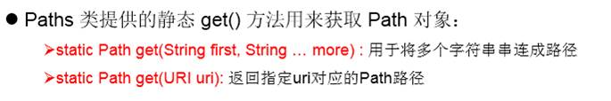

> 常用方法：

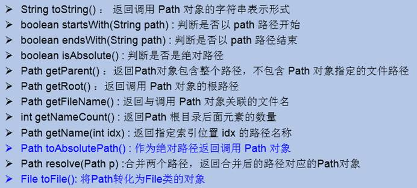

 


**Files工具类**

作用：操作文件或文件目录的工具类

> 常用方法：

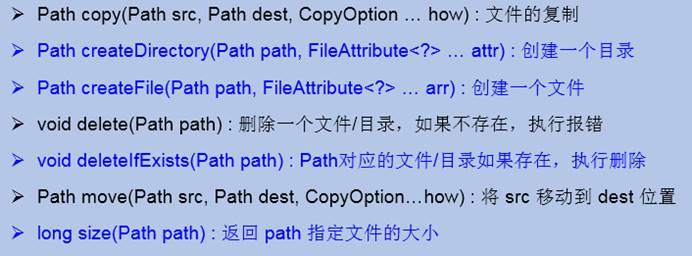


 


## properties配置文件

[Properties类简介](https://blog.csdn.net/ThinkWon/article/details/100667783?ops_request_misc=%257B%2522request%255Fid%2522%253A%2522161052784916780257417049%2522%252C%2522scm%2522%253A%252220140713.130102334.pc%255Fall.%2522%257D&request_id=161052784916780257417049&biz_id=0&utm_medium=distribute.pc_search_result.none-task-blog-2~all~first_rank_v2~rank_v29-13-100667783.first_rank_v2_pc_rank_v29&utm_term=properties)

[Java中的Properties类详解](https://blog.csdn.net/amosjob/article/details/82747733?utm_medium=distribute.pc_relevant.none-task-blog-BlogCommendFromMachineLearnPai2-5.control&depth_1-utm_source=distribute.pc_relevant.none-task-blog-BlogCommendFromMachineLearnPai2-5.control)


**概述**

* `Properties` 继承于 `Hashtable`。表示一个持久的属性集，属性列表以`key-value`的形式存在，`key`和`value`都是字符串。
* Java中有个比较重要的类`Java.util.Properties`，主要用于读取Java的配置文件，各种语言都有自己所支持的配置文件，配置文件中很多变量是经常改变的，这样做也是为了方便用户，让用户能够脱离程序本身去修改相关的变量设置。
* 文件的内容的格式是“键=值”的格式，文本注释信息可以用"#"来注释。


**常用方法**

除了从`Hashtable`中所定义的方法，`Properties`定义了以下方法：

> 加载

| 方法                            | 作用                                   |
| ------------------------------- | -------------------------------------- |
| void load(InputStream inStream) | 从输入字节流读取属性列表               |
| void load(Reader reader)        | 从输入字符流读取属性列表（键和元素对） |


> 储存

| 方法                                         | 作用                                                         |
| -------------------------------------------- | ------------------------------------------------------------ |
| void store(OutputStream out,String comments) | 储存，将 Properties 的内容写入到OutputStream out。参数2为备注 |
| void store(Writer writer, String comments)   | 储存，将 Properties 的内容写入到Writer writer                |
| storeToXML(OutputStream os, String comment)  | 发出代表所有包含此表中的属性的  XML 文档                     |

> 查询/添加/清除

| 方法                                         | 作用                                                       |
| -------------------------------------------- | ---------------------------------------------------------- |
| Object setPropeerty(String key,String value) | 设置集合的键和值，都是String类型，底层调用Hashtable方法put |
| String getProperty(String key)               | 使用此属性列表中指定的键搜索属性                           |
| void clear()                                 | 清除所有装载的 键 - 值对                                   |


**常用方法实践**

> 写入

`Properties`类调用`setProperty`方法将键值对保存到内存中，此时可以通过`getProperty`方法读取，`propertyNames`方法进行遍历，但是并没有将键值对持久化到属性文件中，

故需要调用`store`方法持久化键值对到属性文件中。

````java
public static void main(String[] args) throws IOException {
    Properties properties = new Properties();
    OutputStream output = null;
    try {
        output = new FileOutputStream("src/main/resources/config.properties");
        properties.setProperty("username", "root");
        properties.setProperty("password", "0604");
        // 保存键值对到文件中
        properties.store(output, "JourWon modify");
    } catch (IOException io) {
        io.printStackTrace();
    } finally {
        if (output != null) {
            try {
                output.close();
            } catch (IOException e) {
                e.printStackTrace();
            }
        }
    }
}
输出结果，在resources目录下多一个文件config.properties，内容如下
#JourWon modify
#Mon Sep 09 14:23:44 CST 2019
password=0604
username=root
````

> 读取

常见的六种读取`properties`文件的方式：

````java
//一、 使用java.util.Properties类的load(InputStream in)方法加载properties文件
//主要是需要加上src这个文件夹名。路径配置需要精确到绝对地址级别
public static void getPath1() throws IOException {
    InputStream in = new FileInputStream( new File("src/main/resources/prop.properties"));
    Properties properties = new Properties();
    properties.load(in);
}

//二、 使用java.util.ResourceBundle类的getBundle()方法
//注意：这个getBundle()方法的参数只能写成包路径+properties文件名，注意不需要带上后缀名。
public static void getPath2() {
    ResourceBundle rb = ResourceBundle.getBundle("prop");
    printKeyValueRb(rb);
}

//三、 使用java.util.PropertyResourceBundle类的构造函数
public static void getPath3() throws IOException {
    InputStream in = new BufferedInputStream(new FileInputStream("src/main/resources/prop.properties"));
    ResourceBundle rb = new PropertyResourceBundle(in);

    printKeyValueRb(rb);
}

//四、 使用class变量的getResourceAsStream()方法注意：getResourceAsStream()方法的参数按格式写到包路径+properties文件名+.后缀
public static void getPath4() throws IOException {
    InputStream in = PropertiesTest.class.getResourceAsStream("/prop.properties");

    printKeyValue(in);
}

//使用class.getClassLoader()所得到的java.lang.ClassLoader的getResourceAsStream()方法和getResourceAsStream(name)方法的参数必须是包路径+文件名+.后缀。否则会报空指针异常
public static void getPath5() throws IOException {
    InputStream in = PropertiesTest.class.getClassLoader().getResourceAsStream("./././prop.properties");

    printKeyValue(in);
}

//六、 使用java.lang.ClassLoader类的getSystemResourceAsStream()静态方法
//getSystemResourceAsStream()方法的参数格式也是有固定要求的
public static void getPath6() throws IOException {
    InputStream in = ClassLoader.getSystemResourceAsStream("./././prop.properties");

    printKeyValue(in);
}

//单独抽取的方法，用户检测能否正确操纵Properties
public static void printKeyValue(InputStream inputStream) throws IOException {
    Properties properties = new Properties();
    properties.load(inputStream);
    Set<Object> keys = properties.keySet();
    for (Object key : keys) {
        System.out.println(key + " = " + properties.get(key));
    }

    if (inputStream != null) {
        inputStream.close();
    }
}
public static void printKeyValueRb(ResourceBundle rb) {
    Set<String> keys = rb.keySet();
    for (String key : keys) {
        System.out.println(key + " = " + rb.getString(key));
    }
}
输出结果都是
password = 0604
username = root
````

 

**解决IDEA乱码**


 

 

 


# 网络编程

## InetAddress类

此类的一个对象就代表着一个具体的IP地址

`InetAddress`类没有提供公共的构造器，而是提供了如下几个**静态方法**来获取`InetAddress`实例

| 方法                               | 作用                                                        |
| ---------------------------------- | ----------------------------------------------------------- |
| InetAddress getByName(String host) | 指定IP地址或域名，如 iterAddress.getByName("www.baidu.cmo") |
| InetAddress getLocalHost()         | 获取本机地址                                                |

**常用的方法**

| 方法                             | 作用                                     |
| -------------------------------- | ---------------------------------------- |
| String getHostAddress()          | 返回IP 地址字符串（以文本表现形式）。    |
| String getHostName()             | 获取此IP 地址的主机名（域名）            |
| boolean isReachable(int timeout) | 测试是否可以达到该地址                   |
| byte[] getAddress()              | 返回此  InetAddress 对象的原始 IP 地址。 |

**案例演示**

````java
public class InetAddressTest {
    public static void main(String[] args) {
        try {
            //File file = new File("hello.txt");
            InetAddress inet1 = InetAddress.getByName("192.168.10.14");

            InetAddress inet2 = InetAddress.getByName("www.atguigu.com");

            //获取本地ip
            InetAddress inet4 = InetAddress.getLocalHost();
            System.out.println(inet4);

            //getHostName()
            System.out.println(inet2.getHostName());
            //getHostAddress()
            System.out.println(inet2.getHostAddress());
        } catch (UnknownHostException e) {
            e.printStackTrace();
        }
    }
}
````


 

## InetSocketAddress类

此类实现 IP 套接字地址（IP 地址 + 端口号）。

**构造方法**

| 方法                                            | 作用                                                       |
| ----------------------------------------------- | ---------------------------------------------------------- |
| InetSocketAddress(InetAddress  addr, int  port) | 根据 IP 地址和端口号创建套接字地址。                       |
| lnetSocketAddress(int port)                     | 创建套接字地址，其中 IP 地址为通配符地址，端口号为指定值。 |
| InetSocketAddress(String  hostname, int port)   | 根据主机名和端口号创建套接字地址。                         |

**常用方法**

| 方法                     | 作用               |
| ------------------------ | ------------------ |
| InetAddress getAddress() | 获取 InetAddress。 |
| String getHostName()     | 获取 hostname。    |
| int getPort()            | 获取端口号。       |

**案例演示**

````java
public class TestPort {
    public static void main(String[] args) {
        InetSocketAddress inetSocketAddress = new InetSocketAddress("127.0.0.1",8082);
        System.out.println(inetSocketAddress);
        //返回主机名
        System.out.println(inetSocketAddress.getHostName());
        //获得InetSocketAddress的端口
        System.out.println(inetSocketAddress.getPort());
        //返回一个InetAddress对象（IP对象）
        InetAddress address = inetSocketAddress.getAddress();
        System.out.println(address);
    }
}
````


## TCP 网络编程

**概述**                                                                                

TCP通信能实现两台计算机之间的数据交互，通信的两端，要严格区分为客户端（Client）与服务端（Server）。

**两端通信时步骤：**

* 服务端程序，需要事先启动，等待客户端的连接。
* 客户端主动连接服务器端，连接成功才能通信。服务端不可以主动连接客户端。

**在Java中，提供了两个类用于实现TCP通信程序：**

* 客户端：`java.net.Socket` 类表示。创建`Socket`对象，向服务端发出连接请求，服务端响应请求，两者建立连接开始通信。

* 服务端：`java.net.ServerSocket` 类表示。创建`ServerSocket`对象，相当于开启一个服务，并等待客户端的连接。

 

### **Socket类**                                          

- 利用套接字(`Socket`)开发网络应用程序早已被广泛的采用，以至于成为事实上的标准。

- 网络上具有唯一标识的IP地址和端口号组合在一起才能构成唯一能识别的标识符套接字。

- 通信的两端都要有`Socket`，是两台机器间通信的端点。

- 网络通信其实就是`Socket`间的通信。

- `Socket`允许程序把网络连接当成一个流，数据在两个`Socket`间通过IO传输。

- 一般主动发起通信的应用程序属客户端，等待通信请求的为服务端。

- `Socket`分类：

- - 流套接字（`stream socket`）：使用TCP提供可依赖的字节流服务
  - 数据报套接字（`datagram socket`）：使用UDP提供“尽力而为”的数据报服务

 

**Socket类的常用构造器：**

| 方法                                  | 作用                                                 |
| ------------------------------------- | ---------------------------------------------------- |
| Socket(InetAddress  address,int port) | 创建一个流套接字并将其连接到指定IP地址的指定端口号。 |
| Socket(String  host,int port)         | 创建一个流套接字并将其连接到指定主机上的指定端口号。 |

 

**Socket类的常用方法：**

| 方法                           | 作用                                                         |
| ------------------------------ | ------------------------------------------------------------ |
| InputStream getInputStream()   | 返回此套接字的输入流。可以用于接收网络消息                   |
| OutputStream getOutputStream() | 返回此套接字的输出流。可以用于发送网络消息                   |
| InetAddress getInetAddress()   | 此套接字连接到的远程IP地址；如果套接字是未连接的，则返回null。 |
| InetAddress getLocalAddress()  | 获取套接字绑定的本地地址。即本端的IP地址                     |
| int getPort()                  | 此套接字连接到的远程端口号；如果尚未连接套接字，则返回0。    |
| int getLocalPort()             | 返回此套接字绑定到的本地端口。如果尚未绑定套接字，则返回-1。即本端的端口号。 |
| void close()                   | 关闭此套接字。套接字被关闭后，便不可在以后的网络连接中使用（即无法重新连接或重新绑定）。需要创建新的套接字对象。关闭此套接字也将会关闭该套接字的InputStream和OutputStream。 |
| void shutdownInput()           | 如果在套接字上调用shutdownInput()后从套接字输入流读取内容，则流将返回EOF（文件结束符）。即不能在从此套接字的输入流中接收任何数据。 |
| void shutdownOutput()          | 禁用此套接字的输出流。对于TCP套接字，任何以前写入的数据都将被发送，并且后跟TCP的正常连接终止序列。如果在套接字上调用shutdownOutput()后写入套接字输出流，则该流将抛出IOException。即不能通过此套接字的输出流发送任何数据。 |

 

### ServerSocket类                                                                              

ServerSocket类：这个类实现了**服务器**套接字，该对象等待通过网络的请求。

 

**构造方法摘要**

| 方法                    | 作用                                                         |
| ----------------------- | ------------------------------------------------------------ |
| ServerSocket(int  port) | 使用该构造方法在创建ServerSocket对象时，就可以将其绑定到一个指定的端口号上，参数port就是端口号。 |

​	案例演示

​		`ServerSocket server = new ServerSocket(6666);            //绑定到6666端口`

 

**常用方法摘要**

| 方法               | 作用                                                         |
| ------------------ | ------------------------------------------------------------ |
| Socket accept() ： | 侦听并接受连接，返回一个新的Socket对象，用于和客户端实现通信。该方法会一直阻塞直到建立连接。 |


### 基于Socket的TCP编程                                                                     

> **客户端Socket的工作过程包含以下四个基本的步骤：**

* 创建`Socket`：根据指定服务端的IP 地址或端口号构造`Socket` 类对象。若服务器端响应，则建立客户端到服务器的通信线路。若连接失败，会出现异常。
* 打开连接到`Socket` 的输入/出流：使用`getInputStream()`方法获得输入流，使用`getOutputStream()`方法获得输出流，进行数据传输
* 按照一定的协议对`Socket` 进行读/写操作：通过输入流读取服务器放入线路的信息（但不能读取自己放入线路的信息），通过输出流将信息写入线程。
* 关闭`Socket`：断开客户端到服务器的连接，释放线路

 

> **服务器程序的工作过程包含以下四个基本的步骤：**

* 创建`ServerSocket(intport)` ：创建一个服务器端套接字，并绑定到指定端口上。用于监听客户端的请求。
* 调用`accept()`：监听连接请求，如果客户端请求连接，则接受连接，返回通信套接字对象。
* 调用该`Socket`类对象的`getOutputStream()` 和`getInputStream()`：获取输出流和输入流，开始网络数据的发送和接收。
* 关闭`ServerSocket`和`Socket`对象：客户端访问结束，关闭通信套接字。


**代码示例**

> 代码示例1：客户端发送信息给服务端，服务端将数据显示在控制台上

````java
//客户端
@Test
public void client()  {
    Socket socket = null;
    OutputStream os = null;
    try {
        //1.创建Socket对象，指明服务器端的ip和端口号
        InetAddress inet = InetAddress.getByName("192.168.14.100");
        socket = new Socket(inet,8899);   //向192.168.14.100 的8899端口发送
        //2.获取一个输出流，用于输出数据
        os = socket.getOutputStream();
        //3.写出数据的操作
        os.write("你好，我是客户端mm".getBytes());
    } catch (IOException e) {
        e.printStackTrace();
    } finally {
        //4.资源的关闭
        if(os != null){
            try {
                os.close();
            } catch (IOException e) {
                e.printStackTrace();
            }
        }
        if(socket != null){
            try {
                socket.close();
            } catch (IOException e) {
                e.printStackTrace();
            }
        }
    }
}
//服务端
@Test
public void server()  {
    ServerSocket ss = null;
    Socket socket = null;
    InputStream is = null;
    ByteArrayOutputStream baos = null;
    try {
        //1.创建服务器端的ServerSocket，指明自己的端口号
        ss = new ServerSocket(8899);
        //2.调用accept()表示接收来自于客户端的socket
        socket = ss.accept();
        //3.获取输入流
        is = socket.getInputStream();
        //不建议这样写，可能会乱码
    //        byte[] buffer = new byte[1024];
    //        int len;
    //        while((len = is.read(buffer)) != -1){
    //            String str = new String(buffer,0,len);
    //            System.out.print(str);
    //        }
        //4.读取输入流中的数据
        baos = new ByteArrayOutputStream();
        byte[] buffer = new byte[5];
        int len;
        while((len = is.read(buffer)) != -1){
            baos.write(buffer,0,len);
        }
        System.out.println(baos.toString());
        System.out.println("收到了来自于：" + socket.getInetAddress().getHostAddress() + "的数据");
    } catch (IOException e) {
        e.printStackTrace();
    } finally {
        if(baos != null){
            //5.关闭资源
            try {
                baos.close();
            } catch (IOException e) {
                e.printStackTrace();
            }
        }
        if(is != null){
            try {
                is.close();
            } catch (IOException e) {
                e.printStackTrace();
            }
        }
        if(socket != null){
            try {
                socket.close();
            } catch (IOException e) {
                e.printStackTrace();
            }
        }
        if(ss != null){
            try {
                ss.close();
            } catch (IOException e) {
                e.printStackTrace();
            }
        }
    }
}
````

> 代码示例2：客户端发送文件给服务端，服务端将文件保存在本地。

````java
@Test
public void client() throws IOException {
    //1.
    Socket socket = new Socket(InetAddress.getByName("127.0.0.1"),9090);
    //2.
    OutputStream os = socket.getOutputStream();
    //3.
    FileInputStream fis = new FileInputStream(new File("beauty.jpg"));
    //4.
    byte[] buffer = new byte[1024];
    int len;
    while((len = fis.read(buffer)) != -1){
        os.write(buffer,0,len);
    }
    //5.
    fis.close();
    os.close();
    socket.close();
}

@Test
public void server() throws IOException {
    //1.
    ServerSocket ss = new ServerSocket(9090);
    //2.
    Socket socket = ss.accept();
    //3.
    InputStream is = socket.getInputStream();
    //4.
    FileOutputStream fos = new FileOutputStream(new File("beauty1.jpg"));
    //5.
    byte[] buffer = new byte[1024];
    int len;
    while((len = is.read(buffer)) != -1){
        fos.write(buffer,0,len);
    }
    //6.
    fos.close();
    is.close();
    socket.close();
    ss.close();
}
````


 

> 代码示例3：从客户端发送文件给服务端，服务端保存到本地。并返回“发送成功”给客户端。并关闭相应的连接。

````java
@Test
public void client() throws IOException {
    //1.
    Socket socket = new Socket(InetAddress.getByName("127.0.0.1"),9090);
    //2.
    OutputStream os = socket.getOutputStream();
    //3.
    FileInputStream fis = new FileInputStream(new File("beauty.jpg"));
    //4.
    byte[] buffer = new byte[1024];
    int len;
    while((len = fis.read(buffer)) != -1){
        os.write(buffer,0,len);
    }
    //关闭数据的输出
    socket.shutdownOutput();
    //5.接收来自于服务器端的数据，并显示到控制台上
    InputStream is = socket.getInputStream();
    ByteArrayOutputStream baos = new ByteArrayOutputStream();
    byte[] bufferr = new byte[20];
    int len1;
    while((len1 = is.read(buffer)) != -1){
        baos.write(buffer,0,len1);
    }
    System.out.println(baos.toString());

    //6.
    fis.close();
    os.close();
    socket.close();
    baos.close();
}

@Test
public void server() throws IOException {
    //1.
    ServerSocket ss = new ServerSocket(9090);
    //2.
    Socket socket = ss.accept();
    //3.
    InputStream is = socket.getInputStream();
    //4.
    FileOutputStream fos = new FileOutputStream(new File("beauty2.jpg"));
    //5.
    byte[] buffer = new byte[1024];
    int len;
    while((len = is.read(buffer)) != -1){
        fos.write(buffer,0,len);
    }
    System.out.println("图片传输完成");
    //6.服务器端给予客户端反馈
    OutputStream os = socket.getOutputStream();
    os.write("你好，美女，照片我已收到，非常漂亮！".getBytes());
    //7.
    fos.close();
    is.close();
    socket.close();
    ss.close();
    os.close();
}
````


## UDP网络编程

从技术意义上来讲，只有`TCP`才会分`Server`和`Client`。对于`UDP`来说，从严格意义上来讲，并没有所谓的`Server`和`Client`。

`java.net`包给我们提供了两个类`DatagramSocket`（表示用于发送和接收数据报的套接字）和`DatagramPacket`（表示数据包 ）

- `DatagramSocket`是快递员，`DatagramPacket`是快递

- 类`DatagramSocket`和`DatagramPacket`实现了基于UDP 协议网络程序。
- UDP数据报通过数据报套接字`DatagramSocket`发送和接收，系统不保证UDP数据报一定能够安全送到目的地，也不能确定什么时候可以抵达。
- `DatagramPacket` 对象封装了UDP数据报，在数据报中包含了发送端的IP地址和端口号以及接收端的IP地址和端口号。
- UDP协议中每个数据报都给出了完整的地址信息，因此无须建立发送方和接收方的连接。如同发快递包裹一样。

 

**DatagramSocket 类**

| 构造器                                     | 作用                                                         |
| ------------------------------------------ | ------------------------------------------------------------ |
| DatagramSocket(int port)                   | 创建数据报套接字并将其绑定到本地主机上的指定端口。套接字将被绑定到通配符地址，IP地址由内核来选择。 |
| DatagramSocket(int port,InetAddress laddr) | 创建数据报套接字，将其绑定到指定的本地地址。本地端口必须在0到65535之间（包括两者）。  如果IP地址为0.0.0.0，套接字将被绑定到通配符地址，IP地址由内核选择。 |

 

| 方法                          | 作用                                                         |
| ----------------------------- | ------------------------------------------------------------ |
| send(DatagramPacket p)        | 从此套接字发送数据报包。DatagramPacket包含的信息指示：将要发送的数据、其长度、远程主机的IP地址和远程主机的端口号。 |
| receive(DatagramPacket p)     | 从此套接字接收数据报包。当此方法返回时，DatagramPacket的缓冲区填充了接收的数据。数据报包也包含发送方的IP地址和发送方机器上的端口号。此方法在接收到数据报前一直阻塞。数据报包对象的length字段包含所接收信息的长度。如果信息比包的长度长，该信息将被截短。 |
| void close()                  | 关闭此数据报套接字。                                         |
| InetAddress getLocalAddress() | 获取套接字绑定的本地地址。                                   |
| int getLocalPort()            | 返回此套接字绑定的本地主机上的端口号。                       |
| InetAddress getInetAddress()  | 返回此套接字连接的地址。如果套接字未连接，则返回null。       |
| int getPort()                 | 返回此套接字的端口。如果套接字未连接，则返回-1。             |

 

**DatagramPacket类**

| 构造器                                                       | 作用                                                         |
| ------------------------------------------------------------ | ------------------------------------------------------------ |
| DatagramPacket(byte[] buf,int length)                        | 构造器，用来接收长度为length的数据包。length参数必须小于等于buf.length。 |
| DatagramPacket(byte[] buf,int length,InetAddress address,int port) | 构造器，用来将长度为length的包发送到指定主机上的指定端口号。length参数必须小于等于buf.length。 |

 

| 方法                     | 作用                                                         |
| ------------------------ | ------------------------------------------------------------ |
| InetAddress getAddress() | 返回某台机器的IP地址，此数据报将要发往该机器或者是从该机器接收到的。 |
| int getPort()            | 返回某台远程主机的端口号，此数据报将要发往该主机或者是从该主机接收到的。 |
| byte[] getData()         | 返回数据缓冲区。接收到的或将要发送的数据从缓冲区中的偏移量offset处开始，持续length长度。 |
| int getLength()          | 返回将要发送或接收到的数据的长度。                           |

 

**演示**

````java
//发送端
@Test
public void sender() throws IOException {

    DatagramSocket socket = new DatagramSocket();

    String str = "我是UDP方式发送的导弹";
    byte[] data = str.getBytes();
    InetAddress inet = InetAddress.getLocalHost();
    DatagramPacket packet = new DatagramPacket(data,0,data.length,inet,9090);

    socket.send(packet);

    socket.close();

}
//接收端
@Test
public void receiver() throws IOException {

    DatagramSocket socket = new DatagramSocket(9090);

    byte[] buffer = new byte[100];
    DatagramPacket packet = new DatagramPacket(buffer,0,buffer.length);

    socket.receive(packet);

    System.out.println(new String(packet.getData(),0,packet.getLength()));

    socket.close();
}
````


````java
//发送端
public class Send extends Thread{

    private String ipAddress;               //IP地址
    private int port;                       //端口号

    DatagramSocket dgs = null;              //快递员
    DatagramPacket dgp = null;              //快递
    Scanner scanner = null;
    public Send(String ipAddress,int port){
        this.ipAddress = ipAddress;
        this.port = port;
        try {
            dgs = new DatagramSocket();
        } catch (SocketException e) {
            e.printStackTrace();
        }
        scanner = new Scanner(System.in);
    }

    @Override
    public void run() {
        while (true){                       //循环发送
            String massage = null;
            try {
                massage = scanner.next();   //键盘获取
                dgp = new DatagramPacket(massage.getBytes(),massage.getBytes().length,
                        InetAddress.getByName(ipAddress),port);      //将信息发送到 IPAddress：port
                dgs.send(dgp);              //发送
            } catch (IOException e) {
                if(dgs != null)             //异常结束资源
                    dgs.close();
                e.printStackTrace();
            }
            if(massage.equals("拜拜")){     //发送拜拜结束循环
                break;
            }
        }
        if(dgs != null)
            dgs.close();                    //关闭资源
    }
}

//接收端
public class Receive extends Thread{
    DatagramSocket dgs = null;                 //快递员
    DatagramPacket dgp = null;                 //快递
    
    private int port;                          //监听的端口
    private String form;                       //角色

    public Receive(int port,String form) {
        this.port = port;
        this.form = form;

        try {
            dgs = new DatagramSocket(port);
        } catch (SocketException e) {
            e.printStackTrace();
        }
    }

    @Override
    public void run() {
        while (true){                                             //循环输出
            byte[] bytes = new byte[1024 * 2];
            try {
                dgp = new DatagramPacket(bytes,0,bytes.length);   //接收数据
                dgs.receive(dgp);                                 //接收

                String message = new String(dgp.getData(), 0, dgp.getLength());  //dgp.getData获取接收的数据

                System.out.println(form + ": " + message);        //输出

                if(message.equals("拜拜")){                       //拜拜结束循环
                    break;
                }
            } catch (IOException e) {
                if (dgs != null)
                    dgs.close();
                e.printStackTrace();
            }
        }
        if (dgs != null)
            dgs.close();
    }
}

//学生端
public class XueSheng {
    public static void main(String[] args) throws UnknownHostException {
        //学生向指定的地址 ： 8888发送数据
        new Send(InetAddress.getLocalHost().getHostAddress(),8888).start();
        //监听7777端口的数据
        new Receive(7777,"老师").start();
    }
}

//老师端
public class LaoShi {
    public static void main(String[] args) throws UnknownHostException {
        //老师向指定的地址：7777发送数据
        new Send(InetAddress.getLocalHost().getHostAddress(),7777).start();
        //监听8888端口收到的数据
        new Receive(8888,"学生").start();
    }
}
````

测试

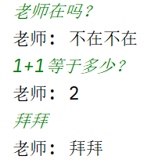

 


 

## URL编程

**概念**

* URL（Uniform Resource Locator）：统一资源定位符，它表示Internet上某一资源的地址。
* 通过URL我们可以访问Internet上的各种网络资源，比如最常见的www,ftp站点。浏览器通过解析给定的URL可以在网络上查找相应的文件或其他资源。
* URI=URL+URN
* URI：Uniform Resource Identifier ，统一资源标志符
* URL：Uniform Resource Locator，统一资源定位符。
* URN：Uniform Resource Name，统一资源命名。
* 网络三大基石：HTML，HTTP，URL

 

**格式**

URL的基本结构由5部分组成：

<传输协议>://<主机名>:<端口号>/<文件名>#片段名?参数列表

参数列表格式：参数名=参数值&参数名=参数值......

http://localhost:8080/examples/beauty.jpg?username=Tom

协议  主机名  端口号 资源地址      参数列表

 

**构造方法**

| 方法                                                      | 作用                                                  |
| --------------------------------------------------------- | ----------------------------------------------------- |
| URL(String spec)                                          | 根据 String 表示形式创建 URL 对象。                   |
| URL(String protocol, String host, int port, String  file) | 根据指定协议名、主机名、端口号和文件名创建 URL 对象。 |
| URL(String protocol, String host, String file)            | 根据指定的协议名、主机名和文件名创建 URL。            |

**常用方法**

| 方法                           | 作用                                                       |
| ------------------------------ | ---------------------------------------------------------- |
| String getProtocol()           | 获取此 URL的协议名称。                                     |
| String getHost()               | 获取此 URL 的主机名。                                      |
| int getPort()                  | 获取此 URL 的端口号。                                      |
| String getPath()               | 获取此 URL 的文件路径。                                    |
| String getFile()               | 获取此 URL 的文件名。                                      |
| String getQuery()              | 获取此 URL的查询部分。                                     |
| URLConnection openConnection() | 返回一个URLConnection实例，表示与URL引用的远程对象的URL 。 |

URLConnection类中又有一个方法：

| 方法                         | 作用                             |
| ---------------------------- | -------------------------------- |
| connect()                    | 开启连接                         |
| InputStream getInputStream() | 返回从此打开的连接读取的输入流。 |

 

**测试：**

````java
public static void main(String[] args) throws MalformedURLException {
        URL url = new URL("https://www.bilibili.com/video/BV1LJ411z7vY?from=search");

        System.out.println("协议：" + url.getProtocol());
        System.out.println("主机：" + url.getHost());
        System.out.println("端口：" + url.getPort());
        System.out.println("路径：" + url.getPath());
        System.out.println("文件：" + url.getFile());
        System.out.println("查询名：" + url.getQuery());

}
````

**可以读取、下载对应的url资源：**

````java
public static void main(String[] args) {

    HttpURLConnection urlConnection = null;
    InputStream is = null;
    FileOutputStream fos = null;
    try {
        URL url = new URL("http://localhost:8080/examples/beauty.jpg");

        urlConnection = (HttpURLConnection) url.openConnection();

        urlConnection.connect();

        is = urlConnection.getInputStream();
        fos = new FileOutputStream("day10\\beauty3.jpg");

        byte[] buffer = new byte[1024];
        int len;
        while((len = is.read(buffer)) != -1){
            fos.write(buffer,0,len);
        }

        System.out.println("下载完成");
    } catch (IOException e) {
        e.printStackTrace();
    } finally {
        //关闭资源
        if(is != null){
            try {
                is.close();
            } catch (IOException e) {
                e.printStackTrace();
            }
        }
        if(fos != null){
            try {
                fos.close();
            } catch (IOException e) {
                e.printStackTrace();
            }
        }
        if(urlConnection != null){
            urlConnection.disconnect();
        }
    }
}
````


# 反射

## 获取Class

**Class类的理解**

- 类的加载过程：

- - 程序经过`javac.exe`命令以后，会生成一个或多个字节码文件(.class结尾)。
  - 接着我们使用`java.exe`命令对某个字节码文件进行解释运行。相当于将某个字节码文件
  - 加载到内存中。此过程就称为类的加载。加载到内存中的类，我们就称为运行时类，此
  - 运行时类，就作为Class的一个实例。

- 换句话说，Class的实例就对应着一个运行时类。

- 加载到内存中的运行时类，会缓存一定的时间。在此时间之内，我们可以通过不同的方式来获取此运行时类。

 

**获取Class实例的四种方式**

| 获取方法                  |                                                              |
| ------------------------- | ------------------------------------------------------------ |
| 运行时类本身.class属性    | Class clazz =  String.class;                                 |
| 运行时类.getClass()       | Class clazz =  new Person().getClass();                      |
| Class.forName()           | Class clazz =  Class.forName("com.sofen.Person");            |
| 通过类的加载器的loadClass | ClassLoader  classLoader = this.getClass().getClassLoader();   //获得类加载器      Class clazz = classLoader.loadClass("com.sofen.Person");       //获得Class |


````java
//方式一：调用运行时类的属性：.class；获取Class实例
Class clazz1 = Person.class;
System.out.println(clazz1);
//方式二：通过运行时类的对象,调用getClass()
Person p1 = new Person();
Class clazz2 = p1.getClass();

//方式三：调用Class的静态方法：forName(String classPath) 使用次数最多
Class clazz3 = Class.forName("com.atguigu.java.Person");
//clazz3 = Class.forName("java.lang.String");

//方式四：使用类的加载器：ClassLoader
ClassLoader classLoader = ReflectionTest.class.getClassLoader();
Class clazz4 = classLoader.loadClass("com.atguigu.java.Person");
````


## 创建对象

**创建类的对象的方式?**

* new + 构造器
* 要创建Xxx类的对象，可以考虑：Xxx、Xxxs、XxxFactory、XxxBuilder类中查看是否有静态方法的存在。可以调用其静态方法，创建Xxx对象。
* 通过反射

 

**代码举例**

````java
Class<Person> clazz = Person.class;

Person obj = clazz.newInstance();//创建运行时类的对象
System.out.println(obj);
````


**说明**

`newInstance()`:调用此方法，创建对应的运行时类的对象。内部调用了运行时类的空参的构造器。

要想此方法正常的创建运行时类的对象，要求：

* 运行时类必须提供空参的构造器
* 空参的构造器的访问权限得够。通常，设置为public。

 

**拓展**：在javabean中要求提供一个public的空参构造器。原因：

* 便于通过反射，创建运行时类的对象
* 便于子类继承此运行时类时，默认调用super()时，保证父类此构造器


## 获取结构

### 字段Field

| 方法                                      | 作用                                             |
| ----------------------------------------- | ------------------------------------------------ |
| Field[]  getFields():                     | 批量获取所有的**公有**字段，包含父类             |
| Field[]  getDeclaredFields()              | 批量获取所有字段；包括：私有，不包含：继承       |
| Field  getField(String fieldName)         | 根据指定方法名获取**公有**字段；包含父类         |
| Field  getDeclaredField(String fieldName) | 根据指定方法名获取字段；包括：私有，不包含：继承 |

如果类中没有域，或者`Class`对象描述的是基本类型或数组类型，这些方法将返回一个长度为0的数组。

**在调用Field之前**：`Field.setAccessible(true)`设置当期Filed为可访问的

> **调用Field：**

| 方法                               | 作用                                           |
| ---------------------------------- | ---------------------------------------------- |
| Field.set(Object obj,Object value) | 设置字段的值；参数1：哪个对象，参数2：设置的值 |
| Field.get(Object obj)              | 返回obj对象中用Field对象表示的域值             |

> **调用数组**

| 方法                                                         | 作用                                             |
| ------------------------------------------------------------ | ------------------------------------------------ |
| Object get(Object array,int index) <br />xxx getXxx(Object array,int index) <br />xxx是boolean、byte、char、double、float、int、long、short之中的一种基本类 | 这些方法将返回存储在给定位置上的给定数组的内容。 |
| void set(Object array,int index,Object  newValue)  <br />setXxx(Object  array,int index,xxx newValue) | 这些方法将一个新值存储到给定位置上的给定数组中。 |
| int getLength(Object array)                                  | 返回数组的长度。                                 |
| Object newInstance(Class componentType,int length)  <br />Object newInstance(Class componentType,int[] lengths) | 返回一个具有给定类型、给定维数的新数组。         |


### 方法 Method

| 方法                                                         | 作用                                                         |
| ------------------------------------------------------------ | ------------------------------------------------------------ |
| Method[]  getMethods()                                       | 批量获取所有的**公有**方法，包含父类                         |
| Method[]  getDeclaredMethods()                               | 批量获取所有的方法；包括：私有，不包含：继承                 |
| Method  getMethod(String name,Class<?>...  parameterTypes)   | 获取指定的**公有**方法；参数1：方法名，参数2：形参的类型.Class |
| Method  getDeclaredMethod(String name,Class<?>... parameterTypes) | 获取指定的方法；包括：私有，不包含：继承                     |

**在调用Method之前**：`Method.setAccessible(true)`设置当期Method为可访问的

> **调用方法：**

| 方法                                     | 作用                                       |
| ---------------------------------------- | ------------------------------------------ |
| Method.invoke(Object obj,Object... args) | 方法调用；参数1：哪个类，参数2：传递的实参 |

 

### 构造器Construct

| 方法                                                         | 作用                                             |
| ------------------------------------------------------------ | ------------------------------------------------ |
| Constructor[]  getConstructors()                             | 获取所有"公有的"构造方法                         |
| Constructor[]  getDeclaredConstructors()                     | 获取所有的构造方法(包括私有、受保护、默认、公有) |
| Constructor  getConstructor(Class... parameterTypes)         | 获取单个的"公有的"构造方法                       |
| Constructor  getDeclaredConstructor(Class... parameterTypes) | 获取指定的构造器；包括：私有，不包含：继承       |

**在调用Construct之前**：`Construct.setAccessible(true)`设置当期Construct为可访问的

> **调用构造：**

| 方法                                         | 作用         |
| -------------------------------------------- | ------------ |
| Constructor.newInstance(Object... initargs） | 调用构造方法 |


### 其它

| 方法                              | 作用             |
| --------------------------------- | ---------------- |
| Class<?  super T> getSuperclass() | 获取父类         |
| Type getGenericSuperclass()       | 获取带泛型的父类 |
| Class<?>[] getInterfaces()        | 获取接口         |
| Package getPackage()              | 获取所在的包     |
| Annotation[]  getAnnotations()    | 获取类的注解     |

 

### Filed/Method/Constructor类

| 方法                         | 作用                                                         |
| ---------------------------- | ------------------------------------------------------------ |
| Class getDeclaringClass()    | 返冋一个用于描述类中定义的构造器、方法或域的Class对象。      |
| Class[] getExceptionTypes()  | (在Constructor和Method类中）返回异常类型的Class对象数组。    |
| int getModifiers()           | 返回权限修饰符的整型数值。使用Modifier类中的这个方法可以分析这个返回值。 |
| String getName()             | 返冋名称字符串。                                             |
| Class [] getParameterTypes() | (在Constructor和Method类中）返回参数类型的Class对象数组。    |

> **Modifier类**

`Filed、Method、Constructor`等类，都有这样一个方法：`getModifiers()`返回此类或接口以**整数编码**的 Java 语言修饰符。

如需要知道返回的值所代表的意思，则需要用到 `java.lang.reflect.Modifier` 这个类，这个类提供了 static 方法和常量，可以对类和成员访问修饰符进行解码。

 

**调用案例**

````java
@Test
public void testField1() throws Exception {
    Class clazz = Person.class;

    //创建运行时类的对象
    Person p = (Person) clazz.newInstance();

    //1. getDeclaredField(String fieldName):获取运行时类中指定变量名（fieldName）的属性
    Field name = clazz.getDeclaredField("name");

    //2.保证当前属性是可访问的
    name.setAccessible(true);
    //3.获取、设置指定对象的此属性值
    name.set(p, "Tom"); //参数一：方法的调用者 参数二：设置的属性值

    System.out.println(name.get(p));
}

//调用指定的方法：
@Test
public void testMethod() throws Exception {

    Class clazz = Person.class;

    //创建运行时类的对象
    Person p = (Person) clazz.newInstance();

    /*
    1.获取指定的某个方法
    getDeclaredMethod():参数1 ：指明获取的方法的名称  参数2：指明获取的方法的形参列表
     */
    Method show = clazz.getDeclaredMethod("show", String.class);
    //2.保证当前方法是可访问的
    show.setAccessible(true);
    /*
    3. 调用方法的invoke():参数1：方法的调用者  参数2：给方法形参赋值的实参
    invoke()的返回值即为对应类中调用的方法的返回值。
     */
    Object returnValue = show.invoke(p, "CHN"); //String nation = p.show("CHN");
    System.out.println(returnValue);
    System.out.println("*************如何调用静态方法*****************");
    // private static void showDesc()
    Method showDesc = clazz.getDeclaredMethod("showDesc");
    showDesc.setAccessible(true);
    //如果调用的运行时类中的方法没返回值，则此invoke()返回null
    //Object returnVal = showDesc.invoke(null);
    Object returnVal = showDesc.invoke(Person.class);
    System.out.println(returnVal);//null
}

//调用指定的构造器：
@Test
public void testConstructor() throws Exception {
    Class clazz = Person.class;

    //private Person(String name)
    /*
    1.获取指定的构造器
    getDeclaredConstructor():参数：指明构造器的参数列表
     */

    Constructor constructor = clazz.getDeclaredConstructor(String.class);

    //2.保证此构造器是可访问的
    constructor.setAccessible(true);

    //3.调用此构造器创建运行时类的对象
    Person per = (Person) constructor.newInstance("Tom");
    System.out.println(per);

}

//获取运行时类的父类
@Test
public void test2() {
    Class clazz = Person.class;

    Class superclass = clazz.getSuperclass();
    System.out.println(superclass);
}

//获取运行时类的带泛型的父类
@Test
public void test3() {
    Class clazz = Person.class;

    Type genericSuperclass = clazz.getGenericSuperclass();
    System.out.println(genericSuperclass);
}

//获取运行时类的带泛型的父类的泛型
//代码：逻辑性代码  vs 功能性代码
@Test
public void test4() {
    Class clazz = Person.class;

    Type genericSuperclass = clazz.getGenericSuperclass();
    ParameterizedType paramType = (ParameterizedType) genericSuperclass;
    //获取泛型类型
    Type[] actualTypeArguments = paramType.getActualTypeArguments();
    // System.out.println(actualTypeArguments[0].getTypeName());
    System.out.println(((Class) actualTypeArguments[0]).getName());
}

//获取运行时类实现的接口
@Test
public void test5() {
    Class clazz = Person.class;

    Class[] interfaces = clazz.getInterfaces();
    for (Class c : interfaces) {
        System.out.println(c);
    }

    System.out.println();
    //获取运行时类的父类实现的接口
    Class[] interfaces1 = clazz.getSuperclass().getInterfaces();
    for (Class c : interfaces1) {
        System.out.println(c);
    }

}

//获取运行时类所在的包
@Test
public void test6() {
    Class clazz = Person.class;

    Package pack = clazz.getPackage();
    System.out.println(pack);
}

//获取运行时类声明的注解
@Test
public void test7() {
    Class clazz = Person.class;

    Annotation[] annotations = clazz.getAnnotations();
    for (Annotation annos : annotations) {
        System.out.println(annos);
    }
}
//获取运行时类的权限修饰符
public void test7() throws ClassNotFoundException {
    Class<?> clazz = Test.class.getClassLoader().loadClass("com.sofen.UDP.Send");
    //clazz = Class.forName("com.sofen.UDP.Send");
    //Send send= (Send)clazz.newInstance();

    Field[] fields = clazz.getDeclaredFields();

    for (Field f: fields) {
        System.out.println(f.getName());
        System.out.println(Modifier.toString(f.getModifiers()));        //获取权限修饰符
    }
}
````


## 动态代理

**代理模式的原理：**

* 使用一个代理将对象包装起来, 然后用该代理对象取代原始对象。任何对原始对象的调用都要通过代理。
* 代理对象决定是否以及何时将方法调用转到原始对象上。 

 

### 静态代理

````java
实现Runnable接口的方法创建多线程。
Class MyThread implements Runnable{}  //相当于被代理类
Class Thread implements Runnable{}    //相当于代理类
main(){
    MyThread t = new MyThread();
    Thread thread = new Thread(t);
    thread.start();//启动线程；调用线程的run()
}
````

**静态代理的缺点**：

* 代理类和目标对象的类都是在编译期间确定下来，不利于程序的扩展。
* 每一个代理类只能为一个接口服务，这样一来程序开发中必然产生过多的代理。

 

### 动态代理

**特点**:动态代理是指客户通过代理类来调用其它对象的方法，并且是在程序运行时根据需要动态创建目标类的代理对象。

**实现**

* 需要解决的两个主要问题：
  * 问题一：如何根据加载到内存中的被代理类，动态的创建一个代理类及其对象。 （通过`Proxy.newProxyInstance()`实现）
  * 问题二：当通过代理类的对象调用方法a时，如何动态的去调用被代理类中的同名方法a。(通过`InvocationHandler`接口的实现类及其方法`invoke()`)

* java动态代理的实现分为两种
  * 基于JDK的动态代理（接口）:jdk动态代理必须有接口
  * 基于CGILB的动态代理（继承）

**三大类:**`invocationHandler、Method、Proxy`

 

> **invocationHandler接口**

* 代表代理要干什么：就一个`invoke()`方法 （只是和`method`的`invoke`重名而已）
* 当调用生成的代理类的方法时，最终会执行`invoke()`方法
* 因为JDK生成的最终真正的代理类，它继承自`Proxy`并实现了被代理类的接口，
* 在实现被代理类的接口方法的内部，通过反射调用了`InvocationHandlerImpl`的`invoke`方法。

**`public Object invoke(Object proxy, Method method, Object[] args) throws Throwable;`**

| 参数   | 含义                                     |
| ------ | ---------------------------------------- |
| proxy  | jdk创建的代理对象，无需赋值              |
| method | 要执行被代理类的方法，此参数是由系统提供 |
| args   | 执行方法的参数                           |

invocationHandler接口的使用：

* 创建一个实现`invocationHandler`接口的类
* 重写`invoke`方法，代理类要增强的方法写在其中

 

> **Method类:执行目标类的方法**

作用：通过`Method`，可以执行某个目标类的方法,`Method.invoke();`

说明: `method.invoke()`就是执行目标方法的，等同于静态代理类中的方法

 

> **proxy类**

`Proxy`是 `Java` 动态代理机制的主类，它提供了一组静态方法来为一组接口动态地生成代理类及其对象。（创建代理对象）

| 方法                                                         | 作用                                                         |
| ------------------------------------------------------------ | ------------------------------------------------------------ |
| getProxyClass(ClassLoader  loader, Class[] interfaces)       | 该方法用于获取关联于指定类装载器和一组接口的动态代理类的类对象 |
| newProxyInstance(ClassLoader loader,Class<?>[]  interfaces,  InvocationHandler h) | 创建代理对象                                                 |

**`public static Object newProxyInstance( ClassLoader loader,Class<?>[] interfaces,InvocationHandler h)  throws IllegalArgumentException`**

| 参数                  | 含义                                                         |
| --------------------- | ------------------------------------------------------------ |
| ClassLoader loader    | 类加载器,负责向内存中加载对象的,使用反射机制获取对象的classLoader<br />如何获取? 类 a, a.getCalss().getClassLoader(),目标对象的类加载器 |
| Class<?>[] interfaces | 接口,目标对象实现的接口,也是反射获取的<br />如何获取? 类 a, a.getCalss().getInterfaces(),目标对象的类加载器 |
| InvocationHandler h   | 我们自己写的实现invocationHandble接口的代理类,被代理的类传入此类 |


**主要步骤**

- 通过实现 `InvocationHandler` 接口创建自己的调用处理器；
- 通过为`Proxy`类的`newProxyInstance`方法指定代理类的`ClassLoader`  对象和代理要实现的`interface`以及调用处理器`InvocationHandler`对象 来创建动态代理类的对象；

 

 

**动态代理类优缺点**

> 优点

- 动态代理类的字节码在程序运行时由Java反射机制动态生成，无需程序员手工编写它的源代码。
- 动态代理类不仅简化了编程工作，而且提高了软件系统的可扩展性，因为Java 反射机制可以生成任意类型的动态代理类。

> 缺点

- JDK的动态代理机制只能代理实现了接口的类，而不能实现接口的类就不能实现JDK的动态代理，cglib是针对类来实现代理的，他的原理是对指定的目标类生成一个子类，并覆盖其中方法实现增强，但因为采用的是继承，所以不能对final修饰的类进行代理。

> 静态代理与动态代理比较

灵活性 ：动态代理更加灵活，不需要必须实现接口，可以直接代理实现类，并且可以不需要针对每个目标类都创建一个代理类。另外，静态代理中，接口一旦新增加方法，目标对象和代理对象都要进行修改，这是非常麻烦的！（CGLIB动态代理没学）

JVM 层面 ：静态代理在编译时就将接口、实现类、代理类这些都变成了一个个实际的 class 文件。而动态代理是在运行时动态生成类字节码，并加载到 JVM 中的。

 

 

**案例**

> 案例1


````java
//接口
public interface usbSell {
    public int sell(String name);
}
//优盘的厂家
public class usbKingFactory implements usbSell {
    @Override
    public int sell(String name) {
        int i = Integer.parseInt(name);
        System.out.println("您购买了"+i+"块U盘,每块20元");
        return i * 20;
    }
}

public class MyHandble implements InvocationHandler {
    //传入需要动态生成代理类对象的对象
    private usbSell usbSell;

    public MyHandble(com.sofen.service.usbSell usbSell) {
        this.usbSell = usbSell;
    }

    @Override
    public Object invoke(Object proxy, Method method, Object[] args) throws Throwable {
        //使用反射的method.invoke方法调用usbSell中的方法
        int price = (int) method.invoke(usbSell,args);  //args是usbSell中sell的参数

        //代理类的附加功能
        price += 10;
        System.out.println("中介收取10元中介费");
        System.out.println("您卖了块U盘,为您返回一个红包");

        return price;
    }
}

public class mainShop {
    public static void main(String[] args) {
        //要为优盘厂家生成代理类对象
        usbSell kingFactory = new usbKingFactory();
        //生成代理类对象
        usbSell proxy = (usbSell) Proxy.newProxyInstance(kingFactory.getClass().getClassLoader(),
                kingFactory.getClass().getInterfaces(),
                new MyHandble(kingFactory));
        //调用代理类对象的方法
        int price = proxy.sell("10");
        System.out.println(price);
    }
}
````

> 案例2

````java
//接口
public interface phone {

    public String getName();
    public String getFactoryName();
    public int getPrice();
}
//被代理类
public class xiaoMi implements phone{
    public String getName(){
        return "小米11";
    }
    public String getFactoryName(){
        return "小米技术有限公司";
    }
    public int getPrice(){
        return 3999;
    }
    public int get(){
        return 3999;
    }
}
//代理类
public class MyHandler implements InvocationHandler {
    private phone p;         //被代理的类
    public MyHandler(){}

    public MyHandler(phone p){
        this.p = p;
    }
	
    //增强的内容放在此方法中
    @Override
    public Object invoke(Object proxy, Method method, Object[] args) throws Throwable {
        Object o = method.invoke(p, args);           //反射中常见的Method方法；调用被代理的类的方法
        
        return o;         //返回的就是方法返回的结果
    }
}
//主方法
public class Test {

    public static void main(String[] args) {
        xiaoMi mi = new xiaoMi();

        //参数1：类加载器，参数2：类继承的接口，参数3：自己写的实现了InvocationHandler的方法,传入被代理的类
        phone p1 = (phone) Proxy.newProxyInstance(mi.getClass().getClassLoader(), mi.getClass().getInterfaces(),
                new MyHandler(mi));
        System.out.println(p1.getName());
        System.out.println(p1.getFactoryName());
        System.out.println(p1.getPrice());
    }
}
````


> 案例3

````java
interface Human{
    String getBelief();
    void eat(String food);
}
//被代理类
class SuperMan implements Human{
    @Override
    public String getBelief() {
        return "I believe I can fly!";
    }
    @Override
    public void eat(String food) {
        System.out.println("我喜欢吃" + food);
    }
}
class HumanUtil{
    public void method1(){
        System.out.println("====================通用方法一====================");
    }
    public void method2(){
        System.out.println("====================通用方法二====================");
    }
}
class ProxyFactory{
    //调用此方法，返回一个代理类的对象。解决问题一
    public static Object getProxyInstance(Object obj){//obj:被代理类的对象
        MyInvocationHandler handler = new MyInvocationHandler();
        handler.bind(obj);
        return Proxy.newProxyInstance(obj.getClass().getClassLoader(),obj.getClass().getInterfaces(),handler);
    }
}

class MyInvocationHandler implements InvocationHandler{
    private Object obj;//需要使用被代理类的对象进行赋值
    public void bind(Object obj){
        this.obj = obj;
    }
    //当我们通过代理类的对象，调用方法a时，就会自动的调用如下的方法：invoke()
    //将被代理类要执行的方法a的功能就声明在invoke()中
    @Override
    public Object invoke(Object proxy, Method method, Object[] args) throws Throwable {
        HumanUtil util = new HumanUtil();
        util.method1();
        //method:即为代理类对象调用的方法，此方法也就作为了被代理类对象要调用的方法
        //obj:被代理类的对象
        Object returnValue = method.invoke(obj,args);
        util.method2();
        //上述方法的返回值就作为当前类中的invoke()的返回值。
        return returnValue;
    }
}

public class ProxyTest {
    public static void main(String[] args) {
        SuperMan superMan = new SuperMan();
        //proxyInstance:代理类的对象
        Human proxyInstance = (Human) ProxyFactory.getProxyInstance(superMan);
        //当通过代理类对象调用方法时，会自动的调用被代理类中同名的方法
        String belief = proxyInstance.getBelief();
        System.out.println(belief);
        proxyInstance.eat("四川麻辣烫");
        System.out.println("*****************************");
        NikeClothFactory nikeClothFactory = new NikeClothFactory();
        ClothFactory proxyClothFactory = (ClothFactory) ProxyFactory.getProxyInstance(nikeClothFactory);
        proxyClothFactory.produceCloth();
    }
}
````


# JAVA8新特性

## Lambda表达式

**格式：**

|  符号  | 含义                                                |
| :----: | :-------------------------------------------------- |
|   ->   | lambda操作符 或 箭头操作符                          |
| ->左边 | lambda形参列表 （其实就是接口中的抽象方法的形参列表 |
| ->右边 | lambda体 （其实就是重写的抽象方法的方法体           |

格式一：无参，无返回值

````java
Runnable r1 = ()->{System.out.println("Hello Lambda")}；
````

格式二：一个参，无返回值

````java
Consumer<String> con = (String str)->{System.out.println(str)};
````

格式三：数据类型可以省略，类型推断

````java
Consumer<String> con = (str)->{System.out.println(str)};
````

格式四：一个参数，参数的小括号可以省略

````java
Consumer<String> con = str->{System.out.println(str)};
````

格式五：多条语句，并且可以有返回值

````java
Comparator<Integer> con = (x,y)->{
	System.out.println("Hello Lambda");
    return Integer.compare(x,y);
};
````

格式六：只有一条语句

	Comparator<Integer> con = (x,y)-> Integer.compare(x,y);
## 函数式接口

**使用说明**

* 如果一个接口中，只声明了一个抽象方法（可以包含多个`default`方法），则此接口就称为函数式接口。
* 我们可以在一个接口上使用 `@FunctionalInterface` 注解，这样做可以检查它是否是一个函数式接口。
* `Lambda`表达式的本质：作为函数式接口的实例


**Lambda表达式提供的4个基本的函数式接口：**

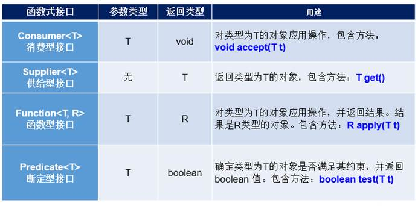


**总结**

* 何时使用lambda表达式？
  * 当需要对一个函数式接口实例化的时候，可以使用lambda表达式。

* 何时使用给定的函数式接口？
  * 如果我们开发中需要定义一个函数式接口，首先看看在已有的jdk提供的函数式接口是否提供了
  * 能满足需求的函数式接口。如果有，则直接调用即可，不需要自己再自定义了。

 

## 方法引用

**理解：**方法引用可以看做是Lambda表达式深层次的表达。换句话说，方法引用就是Lambda表达式，也就是函数式接口的一个实例，

通过方法的名字来指向一个方法。

 

**使用情境：**当要传递给Lambda体的操作，已经实现过，可以使用方法引用！


**格式：**类(或对象) :: 方法名

分为如下的三种情况：

* 情况1   对象 :: 非静态方法
* 情况2   类 :: 静态方法
* 情况3   类 :: 非静态方法

 

**要求**：

* 要求接口中的抽象方法的形参列表和返回值类型与方法引用的方法的形参列表和返回值类型相同！（针对于情况1和情况2）
* 当函数式接口方法的第一个参数是需要引用方法的调用者，并且第二个参数是需要引用方法的参数(或无参数)时：ClassName::methodName（针对于情况3）

 ````java
 / 情况一：对象 :: 实例方法
 //Consumer中的void accept(T t)
 //PrintStream中的void println(T t)
 @Test
 public void test1() {
     Consumer<String> con1 = str -> System.out.println(str);
     con1.accept("北京");
     System.out.println("*******************");
     PrintStream ps = System.out;
     Consumer<String> con2 = ps::println;
     con2.accept("beijing");
 }
 //Supplier中的T get()
 //Employee中的String getName()；Employee是自己写的类
 @Test
 public void test2() {
     Employee emp = new Employee(1001,"Tom",23,5600);
     Supplier<String> sup1 = () -> emp.getName();
     System.out.println(sup1.get());
     System.out.println("*******************");
     Supplier<String> sup2 = emp::getName;
     System.out.println(sup2.get());
 }
 // 情况二：类 :: 静态方法
 //Comparator中的int compare(T t1,T t2)
 //Integer中的int compare(T t1,T t2)
 @Test
 public void test3() {
     Comparator<Integer> com1 = (t1,t2) -> Integer.compare(t1,t2);
     System.out.println(com1.compare(12,21));
     System.out.println("*******************");
     Comparator<Integer> com2 = Integer::compare;
     System.out.println(com2.compare(12,3));
 }
 //Function中的R apply(T t)
 //Math中的Long round(Double d)
 @Test
 public void test4() {
     Function<Double,Long> func = new Function<Double, Long>() {
         @Override
         public Long apply(Double d) {
             return Math.round(d);
         }
     };
     System.out.println("*******************");
     Function<Double,Long> func1 = d -> Math.round(d);
     System.out.println(func1.apply(12.3));
     System.out.println("*******************");
     Function<Double,Long> func2 = Math::round;
     System.out.println(func2.apply(12.6));
 }
 // 情况：类 :: 实例方法  (难度)
 // Comparator中的int comapre(T t1,T t2)
 // String中的int t1.compareTo(t2)
 @Test
 public void test5() {
     Comparator<String> com1 = (s1,s2) -> s1.compareTo(s2);
     System.out.println(com1.compare("abc","abd"));
     System.out.println("*******************");
     Comparator<String> com2 = String :: compareTo;
     System.out.println(com2.compare("abd","abm"));
 }
 //BiPredicate中的boolean test(T t1, T t2);
 //String中的boolean t1.equals(t2)
 @Test
 public void test6() {
     BiPredicate<String,String> pre1 = (s1,s2) -> s1.equals(s2);
     System.out.println(pre1.test("abc","abc"));
     System.out.println("*******************");
     BiPredicate<String,String> pre2 = String :: equals;
     System.out.println(pre2.test("abc","abd"));
 }
 // Function中的R apply(T t)
 // Employee中的String getName();
 @Test
 public void test7() {
     Employee employee = new Employee(1001, "Jerry", 23, 6000);
     Function<Employee,String> func1 = e -> e.getName();
     System.out.println(func1.apply(employee));
     System.out.println("*******************");
     Function<Employee,String> func2 = Employee::getName;
     System.out.println(func2.apply(employee));
 }
 ````


## 构造器引用和数组引用

**构造器引用格式：**类名::new

**要求：**和方法引用类似，函数式接口的抽象方法的形参列表和构造器的形参列表一致。抽象方法的返回值类型即为构造器所属的类的类型

**举例：**

````java
//Supplier中的T get()
//Employee的空参构造器：Employee()
@Test
public void test1(){

   Supplier<Employee> sup = new Supplier<Employee>() {
       @Override
       public Employee get() {
           return new Employee();
       }
   };
   System.out.println("*******************");

   Supplier<Employee>  sup1 = () -> new Employee();  
   System.out.println(sup1.get());                    //返回一个Employee对象

   System.out.println("*******************");

   Supplier<Employee>  sup2 = Employee :: new;
   System.out.println(sup2.get());
}

//Function中的R apply(T t)
@Test
public void test2(){
   Function<Integer,Employee> func1 = id -> new Employee(id);
   Employee employee = func1.apply(1001);
   System.out.println(employee);

   System.out.println("*******************");

   Function<Integer,Employee> func2 = Employee :: new;
   Employee employee1 = func2.apply(1002);
   System.out.println(employee1);

}

//BiFunction中的R apply(T t,U u)
@Test
public void test3(){
   BiFunction<Integer,String,Employee> func1 = (id,name) -> new Employee(id,name);
   System.out.println(func1.apply(1001,"Tom"));

   System.out.println("*******************");

   BiFunction<Integer,String,Employee> func2 = Employee :: new;
   System.out.println(func2.apply(1002,"Tom"));

}

````


**数组引用格式：**数组类型[] :: new

**举例：**

````java
//Function中的R apply(T t)
@Test
public void test4(){
    Function<Integer,String[]> func1 = length -> new String[length];
    String[] arr1 = func1.apply(5);
    System.out.println(Arrays.toString(arr1));

    System.out.println("*******************");

    Function<Integer,String[]> func2 = String[] :: new;
    String[] arr2 = func2.apply(10);
    System.out.println(Arrays.toString(arr2));
}
````


## Stream API

 

## Optional类


# 其他

 

 
