# HTTP

**请求的HTTP协议格式**

* 客户端给服务器发送数据叫请求。
* 服务器给客户端回传数据叫响应。
* 请求又分为GET请求，和POST请求两种

 

**GET请求**

* 请求行
  * 请求的方式GET
  * 请求的资源路径[+?+请求参数]
  * 请求的协议的版本号HTTP/1.1
* 请求头
  * key:value组成不同的键值对，表示不同的含义。


 

**POST请求**

* 请求行
  * 请求的方式POST
  * 请求的资源路径[+?+请求参数]
  * 请求的协议的版本号HTTP/1.1
* 请求头
  * key:value不同的请求头，有不同的含义
* 请求体:发送给服务器的数据


 

**常用请求头的说明**

* Accept:表示客户端可以接收的数据类型
* Accpet-Languege:表示客户端可以接收的语言类型
* User-Agent:表示客户端浏览器的信息
* Host：表示请求时的服务器ip和端口号

 

**响应**

* 响应行
  * 响应的协议和版本号
  * 响应状态码
  * 响应状态描述符
* 响应头
  * key:value不同的响应头，有其不同含义
* 响应体:回传给客户端的数据


 

**常用的响应码**

| 响应码 | 描述                                                         |
| ------ | ------------------------------------------------------------ |
| 200    | 表示请求成功                                                 |
| 302    | 表示请求重定向                                               |
| 404    | 表示请求服务器已经收到了，但是你要的数据不存在（请求地址错误） |
| 500    | 表示服务器已经收到请求，但是服务器内部错误（代码错误）       |

 

**MIME类型**

MIME是HTTP协议中数据类型。MIME的英文全称是"MultipurposeInternetMailExtensions"多功能Internet邮件扩充服务。

MIME类型的格式是`大类型/小类型`，并与某一种文件的扩展名相对应。

| 文件               | MIME类型                | 对应类型   |
| ------------------ | ----------------------- | ---------- |
| 超文本标记语言文本 | text/html               | .html,.htm |
| 普通文本           | text/plain              | .txt       |
| RTF文本            | application/rtf         | .rtf       |
| GIF图形            | image/gif               | .gif       |
| JPEG图形           | image/jpeg              | .jpeg,.jpg |
| au声音文件         | audio/basic             | .au        |
| MIDI音乐文件       | audio/midi,audio/x-midi | mid,.midi  |
| RealAudio音乐文件  | audio/x-pn-realaudio    | .ra,.ram   |
| MPEG文件           | video/mpeg              | .mpg,.mpeg |
| AVI文件            | video/x-msvideo         | .avi       |
| GZIP文件           | application/x-gzip      | .gz        |
| TAR文件            | application/x-tar       | .tar       |

谷歌浏览器如何查看HTTP协议：


 

 


# HTML

**博客：**

[HTML标签](https://blog.csdn.net/weixin_44684272/article/details/111994869)

[HTML标签大全](https://blog.csdn.net/STILLxjy/article/details/105328369)

[HTML入门与进阶以及HTML5](https://blog.csdn.net/wuyxinu/article/details/103515157)


**互联网的三大基石:**

| 名称 | 名称           | 作用     |
| ---- | -------------- | -------- |
| URL  | 统一资源定位符 | 定位资源 |
| HTTP | 超文本传输协议 | 传输资源 |
| HTML | 超文本标记语言 | 显示资源 |


**HTML的结构:**

````html
<html>
     <head></head>
     <body></body>
</html>
````

注意:

head中一般存放和页面显示无关的内容

body中一般存放页面显示的内容

html语言是不区分大小写的语言。

html的属性写法,写在标签中 属性名=值 ，值是可以用双引号，也可以用单引号或者不写，注意如果不写后面一定要加一个空格。


**HTML书写规范**

````html
<!-- html文件开始, lang="zh_CN"表示中文 -->
<html lang="zh_CN">    
<head>    
    <!-- 表示当前页面使用UTF-8编码 -->
    <meta charset="UTF-8">
    <title>标题</title> 
</head> 
<body> 
    <!-- 页面主体信息 -->
    hello
</body>
</html>

Html的代码注释
<!--这是html注释，可以在页面右键查看源代码中看到-->
````


## head标签

| 标签      | 描述                                   |
| --------- | -------------------------------------- |
| \<title>  | 定义网页的标题                         |
| \<meta>   | 定义网页的基本信息（供搜索引擎）       |
| \<style>  | 定义CSS样式                            |
| \<link>   | 链接外部CSS文件或脚本文件              |
| \<script> | 定义脚本语言                           |
| \<base>   | 定义页面所有链接的基础定位（用得很少） |

````html
<!DOCTYPEhtml>
<html lang="zh_CN">
<head>
 <!--base标签设置页面相对路径的参照地址 href属性代表参照地址，可以省略最后面的文件，但不可以省略最后的/(/表示目录)-->
    <base href="http://localhost:8080/helloweb/a/b/">
</head>
<body>
    <!--跳转到http://localhost:8080/helloweb/index.html-->
    <a href="../../index.html">跳回首页</a><br/>
</body>
</html>
````


## 段落文字标签

| 标签       | 描述             | 语义            |
| ---------- | ---------------- | --------------- |
| \<h1>~<h6> | 标题             | header          |
| \<p>       | 段落             | paragraph       |
| \<br>      | 换行             | break           |
| \<hr>      | 水平线           | horizontal rule |
| \<div>     | 分割（块元素）   | division        |
| \<span>    | 区域（行内元素） | span            |

| 标签      | 描述 | 语义                  |
| --------- | ---- | --------------------- |
| \<strong> | 加粗 | strong（加强）        |
| \<em>     | 斜体 | emphasized（强调）    |
| \<cite>   | 斜体 | cite（引用）          |
| \<sup>    | 上标 | superscripted（上标） |
| \<sub>    | 下标 | subscripted（下标）   |


**font字体标签**

`<font color="red" face="宋体" size="7">我是font标签</font>`

| 属性  | 描述                 |
| ----- | -------------------- |
| color | 字体颜色             |
| face  | 字体种类             |
| size  | 字体大小 （最大为7） |

**特殊字符**

| 显示结果 | 描述   | 实体名称 |
| -------- | ------ | -------- |
|          | 空格   | \&nbsp;  |
| <        | 小于号 | \&lt;    |
| >        | 大于号 | \&gt;    |
| &        | 和号   | \&amp;   |
| "        | 引号   | \&quot;  |


## 超链接标签

`<a href="链接地址" target="目标窗口的打开方式">`

| 属性   | 描述                         |
| ------ | ---------------------------- |
| href   | 属性设置链接的地址           |
| target | 属性设置如何跳转（让谁跳转） |

| target属性值 | 描述                         |
| ------------ | ---------------------------- |
| _self        | 当前窗口打开链接             |
| _blank       | 表示新页面                   |
| _top         | 在顶层框架中打开链接         |
| _parent      | 在当前框架的上一层里打开链接 |


**锚点链接**

* 声明锚点:`<a name="锚点名" />` 或 `<div id="锚点名"></div>div>`

* 使用锚点:`<a href="锚点所在的页面路径 # 锚点名"></a>`

  

## 列表

列表标签，可用于做目录等

列表标签：`<dl>` (define list)

​	上层项目：`<dt>` (define title)

​		下层项目：`<dd>` (define data)

````html
<dl>
    <dt>标题1</dt>
        <dd>数据1</dd>
        <dd>数据2</dd>
    <dt>标题2</dt>
        <dd>数据1</dd>
        <dd>数据2</dd>
</dl>
````

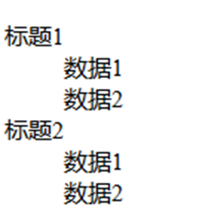


| 标签  | 描述         | 语义            |
| ----- | ------------ | --------------- |
| \<ol> | 有序列表     | ordered list    |
| \<ul> | 无序列表     | unordered list  |
| \<dl> | 定义列表     | definition list |
| \<li> | 列表的每一项 | list item       |

**无序列表**

| type属性 | 列表项的序号类型     |
| -------- | -------------------- |
| none     | 没有无序列表前面的点 |
| disc     | 默认值，实心圆“●”    |
| circle   | 空心圆“○”            |
| square   | 实心正方形“■”        |

````html
<ul type="none">
    <li>科比</li>
    <li>乔丹</li>
    <li>奥尼尔</li>
    <li>姚明</li>
</ul>
````

**有序列表**

````html
<ol>
    <li>科比</li>
    <li>乔丹</li>
    <li>奥尼尔</li>
    <li>姚明</li>
</ol>
````

 

## 图像

``标签是图片标签,用来显示图片

| 标签   | 描述                       |
| ------ | -------------------------- |
| src    | 属性可以设置图片的路径     |
| width  | 属性设置图片的宽度         |
| height | 属性设置图片的高度         |
| border | 属性设置图片边框大小       |
| alt    | 图片显示不出来时的提示文字 |
| title  | 鼠标移到图片上的提示文字   |


## 表格标签

| 标签    | 描述             | 语义                          |
| ------- | ---------------- | ----------------------------- |
| table   | 表格             | table                         |
| caption | 标题             | caption                       |
| thead   | 表头（语义划分） | table head                    |
| tbody   | 表身（语义划分） | table body                    |
| tfoot   | 表尾（语义划分） | table foot                    |
| tr      | 行               | table row（表格行）           |
| th      | 表头单元格       | table header                  |
| td      | 表格单元格       | table data cell（表格单元格） |

| 属性        | 描述                                           |
| ----------- | :--------------------------------------------- |
| border      | 设置表格边框                                   |
| align       | 设置表格相对于页面的对齐方式                   |
| bordercolor | 边框颜色                                       |
| cellpadding | 单元格内边距，单元格内部数据里单元格边框的距离 |
| cellspacing | 单元格之间的距离                               |

````html
<table>
    <tr>
        <td>单元格1</td>
        <td>单元格2</td>
    </tr>
    <tr>
        <td>单元格1</td>
        <td>单元格2</td>
    </tr>
</table>
````

````html
<table>
    <caption>表格标题</caption>
    <!--表头-->
    <thead>
        <tr>
            <th>表头单元格1</th>
            <th>表头单元格2</th>
        </tr>
    </thead>
    <!--表身-->
    <tbody>
        <tr>
            <td>标准单元格1</td>
            <td>标准单元格2</td>
        </tr>
        <tr>
            <td>标准单元格1</td>
            <td>标准单元格2</td>
        </tr>
    </tbody>
    <!--表脚-->
    <tfoot>
        <tr>
            <td>标准单元格1</td>
            <td>标准单元格2</td>
        </tr>
    </tfoot>
</table>
````


**表格跨行跨列**

在`<td>`标签添加属性`colspan`属性设置跨列，`rowspan`属性设置跨行

````html
<body>
    <!-- colspan表示跨列 rowspan表示跨行-->
    <table border="1" width="300" height="300" align="center" cellspacing="0">
            <thead> <!--  thhead表示表头 -->
                <th>第1列</th>
                <th>第2列</th><!--  th是字体加粗的td标签一般用在表头 -->
                <th>第3列</th>
            </thead>
        
    <tr><!-- 行 -->
        <td colspan="2">1-1</td><!-- 第一行的第一列跨2列 -->
        <td>1-3</td>
    </tr>
    
    <tr><!-- 行 -->
        <td rowspan="2">2-1</td><!-- 第二行的第一列跨2行 -->
        <td colspan="2" rowspan="2">2-2</td><!-- 第二行的第二列跨2行2列 -->
    </tr>
    <tr><!-- 行 --></tr>
    </table>
</body>
````

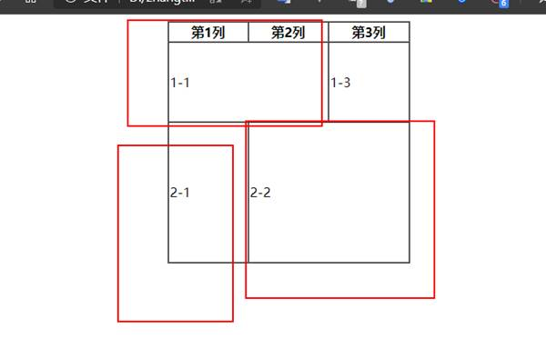

 

 

 

## iframe标签

`iframe`标签可以在html页面上打开一个小窗口在载入一个html页面

| 属性      | 描述                   |
| --------- | ---------------------- |
| src       | 默认打开的新页面       |
| width     | 宽带                   |
| height    | 高度                   |
| scrolling | 否显示滚动条：yes / no |


**iframe和a标签组合使用:**

* 在`iframe`标签中使用`name`属性定义一个名称
* 在`a`标签的`target`属性上设置`iframe`的`name`的属性值

**iframe和form也可以组合使用：**

* 在`iframe`标签中使用`name`属性定义一个名称
* 在`from`标签的`target`属性上设置`iframe`的`name`的属性值

 

````html
<body>
    <p>这是一个单独的页面</p>
    <h2>iframe载入表格跨行跨列的html页面</h2>
    
    <!-- iframe和a标签中使用那么属性定义一个名称a标签中的target协商iframe的name -->
    <iframe src="./09-表格跨行跨列.html" frameborder="0" name="a123" width="400" height="300"></iframe>
    
    <ul>
    	<li><a href="./08-表格标签.html" target="a123">08-表格标签.html</a></li>
    </ul>
</body>
````


 


## 表单

**表单标签：**`<input>`、`<textarea>`、`<select>`和`<option>`。其中`<select>`和`<option>`是配合使用的。


### form

**表单提交：**`<form action="访问服务器的地址" method="GET 或 POST">`

`<input>`、`<textarea>`、`<select>`和`<option>`放在`<form></form>`中

### input

`<input type="text" value="默认值"/>`

| 属性        | 解释说明                                                     |
| ----------- | ------------------------------------------------------------ |
| type        | 表单类型                                                     |
| value       | 默认情况下文本框显示的文字                                   |
| placeholder | 默认文本框显示的文字(默认值,非实体文字,有value时，此属性无效) |
| size        | 文本框的长度                                                 |
| maxlength   | 文本框中最多可以输入的字符数                                 |
| readonly    | 表示该框只能显示不能修改                                     |

**type属性值**

| type属性值 | 解释说明                                                     |
| ---------- | ------------------------------------------------------------ |
| text       | 单行文本框                                                   |
| password   | 密码文本框                                                   |
| radio      | 单选框name属性可以对其进行分组checked="checked"表示默认选中  |
| checkbox   | 复选框checked="checked"表示默认选中                          |
| reset      | 重置按钮value属性修改按钮上的文本                            |
| submit     | 提交按钮value属性修改按钮上的文本                            |
| button     | 按钮value属性修改按钮上的文本                                |
| image      | 图像形式的提交按钮                                           |
| file       | 文件上传域 添加multiple支持多文件上传                        |
| hidden     | 隐藏域当我们要发送某些信息，而这些信息，不需要用户参与，就可以使用隐藏域（提交的时候同时发送给服务器） |

HTML5新增

| type属性值 | 解释说明     |
| ---------- | ------------ |
| email      | 邮箱         |
| url        | URL地址      |
| date       | 日期         |
| time       | 时间         |
| month/week | 月/周        |
| number     | 数字         |
| tel        | 手机号       |
| search     | 搜索框       |
| color      | 颜色选择表单 |


### select和option

```html
<select name="nation">
    <option>--请选择国籍--</option>
    <option value="1" selected="selected">中国</option>
    <option value="2">美国</option>
</select><br>
```

| 属性   | 解释说明                                                |
| ------ | ------------------------------------------------------- |
| select | 标签是下拉列表框                                        |
| option | 标签是下拉列表框中的选项selected="selected"设置默认选中 |

 

### textarea      

表示多行文本输入框（起始标签和结束标签中的内容是默认值）

`<textarea rows="行数" cols="列数">多行文本框内容</textarea>`

| 属性 | 解释说明                         |
| ---- | -------------------------------- |
| rows | 属性设置可以显示几行的高度       |
| cols | 属性设置每行可以显示几个字符宽度 |

````html
<body>
<form action="http://localhost:8080" method="post">
    <h1 align="center"> 用户注册</h1>
    <table cellspacing="0" align="center">
        <tr>
            <td>用户名：</td>
            <td><input type="text" value="默认值"/><br></td>
        </tr>
        <tr>
            <td>密码：</td>
            <td><input type="password" value="密码"/><br></td>
        </tr>
        <tr>
            <td>确认密码：</td>
            <td><input type="password" value="密码"/><br></td>
        </tr>
        <tr>
            <td>性别：</td>
            <td>
                <input type="radio" name="sex" checked="checked">男
                <input type="radio" name="sex">女
                <br>
            </td>
        </tr>
        <tr>
            <td> 兴趣爱好：</td>
            <td>
                <input type="checkbox" name="hobby" checked="checked">java
                <input type="checkbox" name="hobby" checked="checked">python
                <input type="checkbox" name="hobby">c++
                <br>
            </td>
        </tr>
        <tr>
            <td> 国籍：</td>
            <td>
                <select name="nation">
                    <option>--请选择国籍--</option>
                    <option value="1" selected="selected">中国</option>
                    <option value="2">美国</option>
                    <option value="3">英国</option>
                </select><br>
            </td>
        </tr>
        <tr>
            <td>  自我评价：</td>
            <td><textarea cols="30" rows="10">这里写默认值 没有value属性</textarea><br></td>
        </tr>
        <tr>
            <td>
                <input type="reset" value="重置">
                <input type="submit" value="提交">
            </td>
            <td>
                <input type="button" value="普通按钮">
                <input type="file" value="提交文件">
            </td>
        </tr>
    </table>
    <input type="hidden" name="1111" value="隐藏域"><br>
</form>
</body>
````

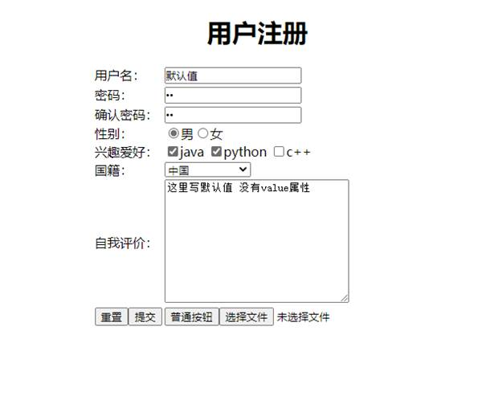


## 常用属性

**align：**为对齐属性

| align属性值 | 描述           |
| ----------- | -------------- |
| left        | 左对齐（默认） |
| center      | 居中           |
| right       | 右对齐         |


## HTML5

### 多媒体音频标签

#### audio 音频标签

| 属性     | 值       | 描述         |
| -------- | -------- | ------------ |
| autoplay | autoplay | 自动播放     |
| controls | controls | 添加显示控件 |
| loop     | loop     | 循环播放     |
| src      | url      | 音频路径     |

````html
<body>
  <!-- 注意：在 chrome 浏览器中已经禁用了 autoplay 属性 -->
  <!-- <audio src="./media/snow.mp3" controls autoplay></audio> -->
  <!-- 
    因为不同浏览器支持不同的格式，所以我们采取的方案是这个音频准备多个文件
   -->
  <audio controls="controls">
    <source src="./media/snow.mp3" type="audio/mpeg" />
  </audio>
</body>
````

#### video 视频标签

| 属性     | 值                              | 描述                                   |
| -------- | ------------------------------- | -------------------------------------- |
| autoplay | autoplay                        | 自动播放                               |
| controls | controls                        | 添加显示控件                           |
| width    | 像素                            | 宽                                     |
| heigh    | 像素                            | 高                                     |
| loop     | loop                            | 循环播放                               |
| preload  | auto：预先加载 none：不预先加载 | 是否加载视频(有autoplay自动忽略该属性) |
| src      | url                             | 视频地址                               |
| poster   | imgurl                          | 加载等待的画面图片                     |
| muted    | muted                           | 静音播放                               |

````html
<body>
  <!-- <video src="./media/video.mp4" controls="controls"></video> -->
  <!-- 谷歌浏览器禁用了自动播放功能，如果想自动播放，需要添加 muted 属性 -->
  <video controls="controls" autoplay muted loop poster="./media/pig.jpg">
    <source src="./media/video.mp4" type="video/mp4">
    <source src="./media/video.ogg" type="video/ogg">
  </video>
</body>
````


# CSS

**博客：**

[CSS-基础](https://blog.csdn.net/rfalcon/article/details/106136426)

css是页面的样式，决定一个网页的漂亮程度。


**内联样式：**也称行内或行间样式，是在html标签上添加style属性来实现的

**内部样式：**在`<style></style>`内添加CSS语法

**外部样式：**`<link rel="stylesheet" href="">`

* `rel`：指定资源跟页面的关系
* `href`：资源的地址

**CSS语法**

````html
对应标签 {
	key:value
	key:value
}

<!--例-->
div {
  font-size: 100px;
  color: red;
}
````

选择器：浏览器根据选择器决定哪些html元素受css样式的影响

属性：是你要改变的样式名，并且每个属性都有一个值。属性和值被冒号分开，并由花括号包围，这样组成了一个完整的样式声明

注意：每个属性用 `；`分开。


**CSS和HTML结合**

````html
<!DOCTYPE html>
<html lang="en">
<head>
    <meta charset="UTF-8">
    <meta name="viewport" content="width=device-width, initial-scale=1.0">
    
    <title>Document</title> 
    <!-- 方式二 -->
    <style> div {
        border: 2px solid green;
        font-size: 100px;
        color: green;
    } </style> 
    <!-- 方式三 -->
    <link rel="stylesheet" href="./14-CSS和HTML结合.css">

</head>
<body>
<!-- 方式一 -->
<div style="border: 1px solid red; color: red;font-size: 10px;">第一种方式在标签的style属性上设置key:value;的方式修改样式</div>
<div>第二种方式在head标签中style标签，使用标准的选择器样式定义样式</div>
<div>第三中方式在head标签引入外部css样式文件</div>
</body>
</html>
````

优先级：方式1 > 方式3 > 方式2


## CSS选择器

**标签选择器(元选择器):**`选择器{属性名:属性值;属性名2:属性值2;...}`

````html
对应标签 {
	key:value
	key:value
}
````


**id选择器:**`#id{属性名:属性值;属性名2:属性值2;...}`任何标签都可以添加id属性，并且一个页面的id应该保持**唯一**性

````html
#abc {
    border: 5px solid red;
    font-size: 20px;
    color: red;
}
````


**类选择器:** `.class值{属性名:属性值;属性名2:属性值2;...}`任何标签都可以添加class属性，并且class属性是**可以相同**

````html
.aaa {
  border: 10px solid green;
  font-size: 30px;
  color: green;
 }
````


**包含选择器:**`祖先选择器 子选择器{属性名:属性值;属性名2:属性值2;...}`

````html
#abc .ccc {  <!--id选择器 与 类选择器的结合-->
    border: 10px solid yellow;
    font-size: 30px;
    color: yellow;
}
````

HTML代码

````html
<!DOCTYPE html>
<html lang="en">
<head>
    <meta charset="UTF-8">
    <meta name="viewport" content="width=device-width, initial-scale=1.0">
    <title>Document</title>

    <!-- 方式三 -->
    <link rel="stylesheet" href="./15-CSS选择器.css">
</head>
<body>
<div>元素选择器</div>
<div id="abc">id选择器
    <div class="ccc">包含选择器</div>
</div>
<div class="aaa">类选择器</div>
</body>
</html>
````

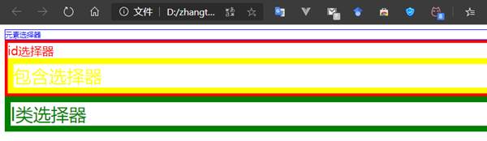


## CSS属性介绍

**CSS背景样式**

| 属性                  | 描述                                                         |
| --------------------- | ------------------------------------------------------------ |
| background-color      | 背景颜色                                                     |
| background-image      | 背景图片（URL背景地址，默认水平垂直都铺满背景图）            |
| background-repeat     | 背景图片的平铺方式（repeat-x、repeat-y、repeat、no-repeat）  |
| background-positon    | 背景图片位置（x y）=>（数字px 或者 单词[x:left/center/right],[y:top/center/bottom]) |
| background-attachment | 背景图随滚动条的移动方式（scroll默认值，背景位置是按当前元素进行偏移的；fixed背景位置是按照浏览器进行偏移的） |

复合样式：`background:red url() repeat 0 0;（颜色 背景图 平铺方式 位置）`

 

**CSS边框样式**

| 属性         | 描述                                           |
| ------------ | ---------------------------------------------- |
| border-style | 边框样式（solid实线、dashed虚线、dotted点线…） |
| border-width | 边框大小（px）                                 |
| border-color | 边框颜色                                       |


**CSS文字样式**

| 属性        | 描述                                                         |
| ----------- | ------------------------------------------------------------ |
| font-family | 字体类型（有的字体中间有空格，必须用引号引起来）             |
| font-size   | 字体大小（默认大小16px），字体大小一般为偶数                 |
| font-weight | 字体粗细（单词[normal正常、bold加粗]； 数字[100-500正常、600-900加粗]） |
| font-style  | 字体样式（normal正常、italic斜体[italic所有带有倾斜字体的可以设置；oblique没有倾斜属性的字体也可以设置倾斜]） |
| color       | 字体颜色                                                     |

复合样式：`font:weight style size family、font:style weight size family、font:weight style size/line-height family`

 

**CSS段落样式**

| 属性            | 描述                                                         |
| --------------- | ------------------------------------------------------------ |
| text-decoration | 文本修饰（underline下划线、line-through删除线、overline上划线、none不添加任何修饰），可添加多个修饰，用空格隔开 |
| text-transform  | 文本大小写（针对英文段落，lowercase小写、uppercase大写、capitalize首字母大写） |
| text-indent     | 文本缩进（首行缩进font-size的两倍，或2em[em相对单位，永远跟一个字体设置的大小相同） |
| text-align      | 文本对齐方式（left默认、right、center、justify[两端点对齐，中间自行调节]） |
| line-height     | 定义行高（不是固定值，根据当前字体的大小变化，用数字+px或scale[相对于原来字体的比例]表示） |
| letter-spacing  | 定义字间距                                                   |
| word-spacing    | 定义词间距（针对英文）                                       |

强制折行

* `word-break：break-all;` 非常强烈的折行

* `word-wrap：break-word;` 不是那么强烈的折行


# JavaScript


**博客：**[JavaScript基础知识全总结](https://blog.csdn.net/qq_39043923/article/details/89204263)


## **JS介绍**

JavaScript是弱类型脚本语言，平常用来执行页面的脚本，例如点击登录。

JS是弱类型，Java是强类型语言

* 交互性

* 安全性

* 跨平台（只要有浏览器与操作系统无关）

  

**JS使用**

现在需要使用`script`引入外部的js文件来执行

* src属性专门用来引入js文件路径（可以是相对路径，也可以是绝对路径）

* script标签可以用来定义js代码，也可以用来引入js文件
* 但是，两个功能二选一使用。不能同时使用两个功能

 

> 方式一（嵌入式）：直接使用script标签

````html
<!DOCTYPE html>
<html lang="en">
<head>
    <meta charset="UTF-8">
    <meta name="viewport" content="width=device-width, initial-scale=1.0">
    <title>Document</title>
    <script type="text/javascript">
        alert("hello javaScript!")
    </script>
</head>
<body>
</body>
</html>
````

 

> 方式二：外部引入标签（script没有单闭合标签）

使用script标签引入单独的JavaScript代码

````html
<head>
    <meta charset="UTF-8">

    <title>Title</title>
	<!---单独引入JavaScript代码-->
    <script type="text/javascript" src="1.js"></script>
	<!--错误-->
    <script type="text/javascript" src="1.js"/>
</head>
````

**常用于测试的两个方法:**

 `alert`(内容) 弹出警告框，显示内容

 `console.log`(内容) 在浏览器的控制台记录内容

 `document.write(内容)`; 往页面输出内容


**JS的语句**

> if-else语句

````js
var a = true
//if-else分支语句
if(a){
	console.log("a为真")
} else{
	console.log("a为假")
}
````

 

> switch语句

````js
//switch语句，不写break会下穿
var b = 1;
switch (b) {
    case 0:
    	console.log("b为0")
    	break;
    case 1:
    	console.log("b为1")
    	break;
    default:
    	console.log("b为默认值")
    	break;
}
````


> 普通for循环

````js
var c = [0,1,2,3]
var d = {"key1":"value1", "key2":"value2", "key3":"value3"}
//数组
for (let i = 0; i < c.length; i++) {
	console.log(c[i])
}
````


> 增强for循环

````js
for(var i in c){
    console.log(i)
}

for(var i in d){
    console.log(i)
}
````


## 变量和数据类型

| 变量类型 | 类型                                                         |
| :------- | :----------------------------------------------------------- |
| 数值     | number(整数，小数，NaN(非数字)，infinity(正无穷)，-infinity(负无穷)) |
| 字符串   | string                                                       |
| 对象     | object                                                       |
| 布尔     | boolean                                                      |
| 函数     | function                                                     |
| 未定义   | undefined,所有js变量未赋于初始值的时候，默认值都是undefined  |
| 空值     | null                                                         |
| NaN      | NotaNumber 非数字。非数值。                                  |


**JS中的定义变量格式：**

* `var 变量名;`

* `var 变量名=值;`

````html
<script type="text/javascript">
    var i
    console.log(i)             //undefined,只声明未初始化的i是undefined
    i = 12                     //此时i的类型是number
    console.log(typeof(i))     //typeof()是js语言提供的一个行数用来查看数据类型
    i = "abc"
    console.log(typeof(i))     //此时i的类型是string
    var a = 12
    var b = "abc"
    console.log(a * b)          //打印a * b 的值是NaN 非数字非数值 但是是number类型
    console.log(typeof(a * b))
</script>
````

查看数据类型可以使用`typeof()`

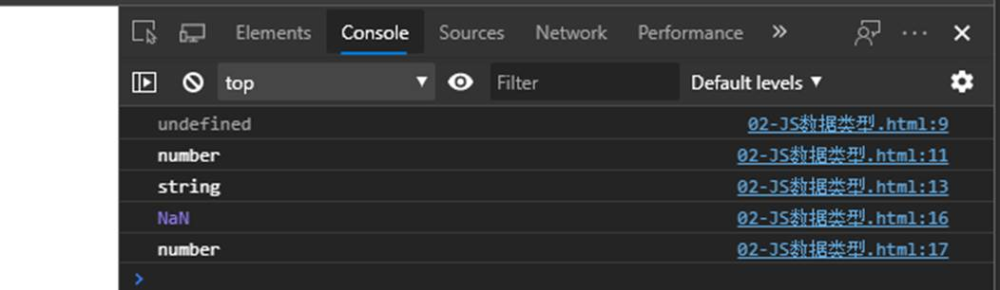


**JS的数据类型自动转化**

* 转化成字符串`String(内容)`:传什么出来什么的字符串格式，类似于java的对象.toString(),变量+"",String.valueOf(内容)

* 转化成布尔`Boolean(内容)`:只有六种情况转化成布尔是false，六种: undefined null "" 0 NaN false

* 转化成数字`Number(内容)`:
  * `undefined -->NaN`
  * `null --> 0`
  * `"123" --> 123`
  * `"00123" --> 123`
  * `123abc --> NaN`
  * `true --> 1`
  * `false -->0`

````js
<script type="text/javascript">
    var a = 12
    String(a)//传什么出来什么的字符串格式，类似于java的对象.toString(),变量+"",String.valueOf(内容)
    console.log(typeof(a))//string
    //转化成布尔
    console.log(Boolean(undefined))//转化undefined 是false
    console.log(Boolean(null))//转化null是false
    console.log(Boolean(""))//转化""是false
    console.log(Boolean(0))//转化数字0是false
    console.log(Boolean(NaN))//转化NaN是false
    console.log(Boolean(false))//转化false是false
    //除了以上6个是false其他都是true
    // 转化成数字
    console.log(Number(undefined))//转化undefined NaN
    console.log(Number(null))//转化null是0
    console.log(Number("123"))//转化"123"是123
    console.log(Number("00123"))//转化"00123"是123
    console.log(Number("123abc"))//转化"123abc"是NaN
    console.log(Number(true))//转化true是1
    console.log(Number(false))//转化false是0
</script>
````

补充：类型自动转化

| 值         | 字符串      | 数字                     | 布尔  | 对象         |
| ---------- | ----------- | ------------------------ | ----- | ------------ |
| 未定义     | 'undefined' | NaN                      | False | Error        |
| null       | 'null'      | 0                        | False | Error        |
| 非空字符串 | '不变'      | 字符串的数字值 或 NaN    | True  | String 对象  |
| 空字符串   | '不变'      | 0                        | Flase | String 对象  |
| 0          | '0'         | 不变                     | False | Number 对象  |
| NaN        | 'Nan'       | 不变                     | False | Number 对象  |
| 无穷       | 'infinity'  | 不变                     | True  | Number 对象  |
| 负无穷     | '-infinity' | 不变                     | True  | Number 对象  |
| True       | 'true'      | 1                        | 不变  | Boolean 对象 |
| False      | 'false'     | 0                        | 不变  | Boolean 对象 |
| 对象       | to String() | valueOf(),toString(),NaN | True  | 不变         |


**JS关系(比较)运算**

| 符号  | 描述                                                         |
| ----- | ------------------------------------------------------------ |
| > <   | 等于java用法相同                                             |
| = =   | 等于是简单的做字面值的比较（类型相同直接比较值，类型不同转化成相同类型再比较值） |
| = = = | 除了做字面值的比较之外，还会比较两个变量的数据类型（类型相同比较值，类型不同直接false） |

````js
<script type="text/javascript">
    console.log(12 == "12")               //true
    console.log(12 == "13")               //false 值不相等

    console.log(12 === "12")            //false 等同符类型不相等，值相等也不相等
    console.log(true=="true")           //如果是数字，布尔，字符串三者进行比较，转化成数字进行比较，所以是false
    console.log(NaN==NaN)               //NaN和所有包括自己都是不相等的
</script>
````

如果是数字，布尔，字符串三者进行比较，转化成数字进行比较。

如果出现了null或者undefined，则不进行类型的转化，null和undefined除了和自己相等就彼此相等。

注意：

````js
true=="true" //如果是数字，布尔，字符串三者进行比较，转化成数字进行比较，所以是false
NaN==NaN //NaN和所有包括自己都是不相等的
````


**逻辑运算**

> &&与运算

当表达式全为真。返回最后一个表达式的值

当表达式有一个为真。返回第一个为假的表达式的值

> ||或运算

当表达式全为假时，返回最后个表达式的值

当只有一个表达式为真。就返回第一个为真的表达式的值


&& 和 || 运算有短路，如果第一个表达式已经得到结果。后面的表达式就不在执行了

js 中 `undefined 、null、""、0、NaN、false`这六个是`false`其他都是`true`


## 数组

`var 数组名 = [];`           空数组

`var 数组名 = [值,……,值];`    定义数组同时赋值元素

javaScript语言中的数组，只要我们通过数组下标赋值，那么最大的下标值，就会自动的给数组做扩容操作。

````js
//第一种
var arr = new Array(ele1,ele2,ele3)

//第二种
var arr = new Array(数组长度)

//第三种
var arr = [ele1, ele2, ele3]
````

**特点**

1. 可以存放任意类型数据

2. 长度可以任意改变

**常用方法**

| 方法                                 | 描述                                                         |
| ------------------------------------ | ------------------------------------------------------------ |
| push()                               | 往数组的尾部添加一个或多个元素，并且返回新数组的长度         |
| pop()                                | 移除数组的最后一个元素并且返回该元素                         |
| unshift()                            | 往数组的前面添加一个或多个元素，并且返回新数组的长度         |
| shift()                              | 移除数组的第一个元素并且返回该元素                           |
| splice(start, deleteCount, value...) | 插入、删除或替换数组的元素 start 开始插入或者删除的数组元素下标deletecount表示删除的个数 value要插入的数据，一个或者多个 |


## 函数

> **定义**

第一种：`function 函数名 (形参列表){函数体}`

````js
function fun1(p) {          //函数中不需要指定类型
	console.log("第一种方式定义的形参是：" + p)
}
fun1("函数1") //需要调用
````

 

第二种：`var 函数名 = function(形参列表){函数体}`

````js
var fun2 = function(p) {
	console.log("第二种方式定义的形参是：" + p)
}
fun2("函数2")
````

 

第三种：`var 函数名 = new Function(形参列表，函数体);`

注意 参数全部必须用字符串格式。

````js
var fun3 = new Function("p", "console.log('第三种方式定义的形参是：' + p)")

fun3("函数3")
````

三种方式的共同点，都可以声明一个函数。

三种方式的区别在于加载的时机不同，

第一种会具备优先级，第二三种是顺序加载。

第一种无论代码在哪写直接就提到最前面加载了，

第二种第三种是代码执行到声明时候才会加载


> **带返回值的函数**

````js
function 函数名(参数列表){
	return;
}
````

直接在函数中写`return`语句


> **重载覆盖和加载顺序**

````js
var testSame = function () {
	console.log("我使用第二种定义函数的方式定义在前面")
}

function testSame() {
	console.log("我使用第一种定义函数的方式定义在后面")
}
testSame()
````

JS中**不允许**函数重载，JS中函数的重载会直接覆盖掉上一次的定义


> **隐形参数 arguments**

就是在`function`函数中不需要定义，但却可以直接用来获取所有参数的变量。

js中的隐形参数也跟java的可变长参数一样。操作类似数组

````js
function testArg() {
    console.log(arguments.length)
    for (let i = 0; i < arguments.length; i++) {
        console.log(arguments[i])
    }
}
testArg(1, "aa", false)
````


> **匿名自调用函数**

````js
(function (p) {
	console.log("匿名自调用函数:" + p)
})(1)
````

• 语法：`(function(形参列表){函数体})(实参列表)`

• 特点：加载完成之后立即会自己调用自己一次，并且只能调用一次

• 作用：可以用来初始化一些参数或者是配置


**特点**

1. js的函数没有重载的概念，直接覆盖上一次的函数定义

2. 写相同的函数名会按照加载的顺序进行覆盖，如果第一种定义方式和第二种第三种混用，第一种第一方式的函数一定会被覆盖掉

3. 形参的个数和实参的个数没有关系

### 内置函数和对话框

| 函数                     | 描述                                                         |
| ------------------------ | ------------------------------------------------------------ |
| eval(字符串形式的js代码) | 以js的方式解析字符串，可以简单的理解成去掉字符串的首尾引号。 常见用法: eval("var 变量名="+字符串格式的js对象); |
| parseInt(字符串)         | 将传入的字符串转化成整数，特殊用法: parseInt("100abc")-->100 可以用来操作像素px。 |
| parseFloat(字符串)       | 将传入的字符串转化成浮点数                                   |
| isNaN()                  | 判断是否是NaN                                                |
| isFinite ()              | 判断是否有限                                                 |

````js
//eval(字符串形式的js代码)：
eval("var a = {name: 'zzz', age: 18}")
console.log("a的姓名：" + a.name + "a的年龄：" + a.age)

//parseInt(字符串) parseInt("100px")-->100 可以用来操作像素px
console.log(parseInt("123"))
console.log(parseInt("123px"))
//parseFloat(字符串)
console.log(parseFloat("10.2"))

//isNaN
console.log("123是NaN:" + isNaN("123"))//false
console.log("123abc是NaN:" + isNaN("123abc"))//true

//isFinite
console.log(isFinite("123"))//true
var c = 1/0;
console.log(isFinite(c))//false
````

| 对话框        | 描述                                                         |
| ------------- | ------------------------------------------------------------ |
| alert(内容)   | 警告框，弹出警告框显示内容                                   |
| prompt(内容)  | 询问框，弹出询问框点击确定返回用户输入的内容，点击取消返回null |
| confirm(内容) | 确认框，弹出确认框显示内容，点击确定返回true,点击取消返回false |


## 对象

> **object形式的自定义对象**

````js
//对象的定义：
var 变量名 = new Object();      //对象实例（空对象）
变量名.属性名 = 值;              //定义一个属性
变量名.函数名 = function(){}     //定义一个函数

//对象的访问：
变量名.属性/函数名();
````

````js
var obj = new Object() //对象实例(空对象)
obj.name = "张三" //给对象定义一个name的属性并赋值为"张三"
obj.fun = function(){
	console.log("obj的姓名是：" + this.name)
}

//调用
obj.fun()
````


**对象的特性:**

* 动态的添加属性:`对象.属性名=值`
* 动态的添加函数:`对象.函数名=function(){}`
* 动态的删除属性或者函数 
  * `delete 对象.函数名`
  * `delete 对象.属性名`

 

> **json对象形式定义对象**

````js
//对象的定义：
var 变量名 = {             //为个属性或函数用逗号隔开
    属性名：值,            //定义一个属性  属性名 与 值 用冒号隔开
    属性名：值,            //定义一个属性
    函数名：function(){}   //定义一个函数  函数名 与 函数体 用冒号隔开
};

//对象的访问：
变量名.属性/函数名();
````

````js
var person = {
    name: "李四"
    age : 18  
    fun : function () {
        console.log("person的姓名是：" + this.name)
        console.log("person的年龄是：" + this.age)
	}
}
person.fun()
````


**json对象取值：**

* 通过.的方式取值 `json对象.x` 找json的x键所对应的值

* 通过中括号的方式取值 `json对象[x]` 注意中括号中如果没有加引号，则x代表变量，如果带上引号则代表的是键
  * `console.log(person.name)`//通过.的方式取值
  * `console.log(person["age"])`//通过中括号的方式取值

**添加删除值：**

````js
// 添加值:
json对象.属性名=值
json对象[属性名]=值

// 删除值:
delete json对象.属性名
delete json对象[属性名]
````

````js
person.sex = "男"
person['address'] = "成都"

delete person.sex
delete person['age']
````


**遍历json都对象：**

````js
for(var 变量名 in json对象){}

//变量名代表键
//json对象[变量名] 代表值
````

````js
for(var i in person){
	console.log("key:" + i + ", value:" + person[i])
}
````


**对象机制：**

* `Object`:js对象的祖先，所有定义在`Object`里面的方式、属性、特点其他对象都可以使用。
* `prototype`原型:可以给已经写好的模板添加自定义的属性或者是函数。


> **window对象**

**循环：**

| 方法                                    | 描述                         |
| --------------------------------------- | ---------------------------- |
| window.setInterval(函数\|字符串,毫秒数) | 设置循环，返回该轮询唯一的id |
| window.clearInterval(轮询的id)          | 清除循环                     |

`var id = setInterval(function(){ alert("Hello"); }, 3000)`每三秒弹一次警告框。

**延迟：**

| 方法                                    | 描述                         |
| --------------------------------------- | ---------------------------- |
| window.setTimeout(函数\|字符串,毫秒数); | 设置延时，返回该延时唯一的id |
| window.clearTimeout(延时的id)           | 清除延时                     |

`var id2 = window.setTimeout(function(){ alert("Hello"); }, 3000)`3 秒后弹出 "Hello"


> **其他内置对象**

history浏览器二点历史记录(前进后退)

* `history.go(整数)`
  * `history.go(-1)`后退到上一个页面
  * `history.go(1)`前进到下一个页面

location浏览器的地址栏:

* `window.location=新地址 控制跳转`
  * `window.location = "http://www.baidu.com"`

navigator获取浏览器的内核信息:

* `navigator.userAgent` 可以用来解决浏览器的差异性问题


## 事件

事件就是用来与页面进行交互的，例如点击登录按钮进行登录就有点击事件。

**事件指令**

| 时间        | 描述               |
| ----------- | ------------------ |
| onload      | 页面加载完成       |
| onclick     | 单击事件           |
| ondblclick  | 双击事件           |
| onfocus     | 成为焦点           |
| onblur      | 失去焦点           |
| onchange    | 改变值并且失去焦点 |
| onkeydown   | 键盘按键           |
| onmousemove | 鼠标移动           |
| onmouseover | 鼠标移入           |
| onmouseout  | 鼠标移出           |
| onsubmit    | 表单提交的时候触发 |
| onmousedown | 鼠标按键           |


**事件的注册（绑定）**

当事件响应后要执行那些代码，叫做事件的注册或绑定。

* 静态绑定事件
  * 通过html的标签的事件属性字节赋予事件响应后的代码，这种叫静态绑定。例如onload、onblur

* 动态绑定事件

  * 先通过js代码得到标签的dom对象，然后在通过`dom对象.事件名 = function(){}`这种形式赋予事件响应后的代码，叫动态注册。

  * 动态注册基本步骤：

    1. 获取标签对象

    2. `标签对象.事件名 = function(){}`

固定格式 

````js
window.onload = function (a, b) {         //代表页面加载完成，注意没有()
    //1.获取标签对象,document是js提供的一个文档对象
    var 标签对象 = document.getElementById(ID属性)    //注意是小写 且 没有括号
    //2.通过标签对象.事件名 = function(){}
    标签对象.事件名 = function{
    
    }
}
````

 

**onload**事件(页面加载完成)

````html
<!DOCTYPE html>
<html lang="en">
<head>
    <meta charset="UTF-8">
    <meta name="viewport" content="width=device-width, initial-scale=1.0">
    <title>Document</title>

    <script type="text/javascript">
        //onload事件调用的方法
        function onloadfun(a, b) {
            let c = a + b
            alert('静态注册onload事件,a+b='+ c)
        }
    </script>
</head>
<!-- 静态注册onload事件  onload事件是浏览器解析完页面之后就会自动触发的事件 -->
<body onload="onloadfun(1,2)">
</body>
</html>
````

 

**onclick点击事件**

````html
<!DOCTYPE html>
<html lang="en">
<head>
    <meta charset="UTF-8">
    <script type="text/javascript">
        //onload事件调用的方法
        function fun1(a, b) {
            let c = a + b
            alert('静态注册onclick事件,a+b='+ c)
        }
        //动态注册onclick事件
        window.onload = function (a, b) {
            //1.获取标签对象,document是js提供的一个文档对象
            var btn2 = document.getElementById("btn2")
            //2.通过标签对象.事件名 = function(){}
            btn2.onclick = function () {
                alert('动态注册onclick事件,a+b='+ 123)
            }
        }
    </script>
</head>
<body>
    <!-- 静态注册 -->
    <button onclick="fun1(1, 2)">静态注册按钮</button>
    <!-- 动态注册 -->
    <button id="btn2">动态注册按钮</button>
</body>
</html>
````


## DOM模型

DOM模型全称是Document Object Model 文档对象模型。

就是把html文档的标签、属性、文本都转化成为对象。

1. Document管理了所有的HTML文档内容

2. docment他是一种树结构的文档，层级关系

3. 可以将所有的标签对象化

4. 我们可以通过document访问所有的标签对象


节点就是标签对象，页面上的节点分为三种，元素节点，文本节点，属性节点。

* 元素节点：如`<a>` `<p>`
* 属性节点：属性节点是元素节点里的属性，如`<a href="" target="">` 中的`href` 和 `target`
* 文本节点：文本节点是元素节点内的文本,如`<p>我是文本节点<p>` 中的我是文本节点

 

> **元素节点**

**直接获取节点方式**

| 方法                                    | 描述                                                  |
| --------------------------------------- | ----------------------------------------------------- |
| document.getElementById()               | 根据标签id属性                                        |
| document.getElementsByName()            | 根据标签name属性（集合,因为多个标签可以为同一个name） |
| document.getElementsByClassName()       | 根据标签class属性                                     |
| document.getElementsByTagName("button") | 根据标签名                                            |

选择顺序: ID > Name > ClassName > TagName

**间接获取方式**

| 方法                     | 描述                       |
| ------------------------ | -------------------------- |
| 父节点.childNodes        | 获取该父节点下的子节点集合 |
| 父节点.firstChild        | 获取父节点的第一个子节点   |
| 父节点.lastChild         | 获取父节点的最后一个子节点 |
| 子节点.parentNode        | 获取该子节点所在的父节点   |
| 元素节点.nextSibling     | 获取下一个兄弟节点         |
| 元素节点.previousSibling | 获取上一个兄弟节点         |

 

> **属性节点**

每个属性结点都是元素结点的一个属性，可以通过(`元素结点.属性名称`)访问

| 方法                                                | 描述                                                         |
| --------------------------------------------------- | ------------------------------------------------------------ |
| 元素节点.setAttribute(attributeName,attributeValue) | 给元素结点添加属性。attributeName为属性的名称，attributeValue为属性的值 |
| 元素节点.getAttribute(attributeName);               | 获得属性值。attributeName为属性的名称                        |


> **文本节点**

处理标签中的文字内容，如`<p>我是文本节点<p>` 中的我是文本节点

| 方法               | 描述                                      |
| ------------------ | ----------------------------------------- |
| 元素节点.innerHTML | 获取/设置起始标签和结束标签中的HTML内容   |
| 元素节点.innerText | 获取/设置起始标签和结束标签中的纯文本内容 |

 

> **获得结点信息**

| 方法                 | 描述               | 结果                                                         |
| -------------------- | ------------------ | ------------------------------------------------------------ |
| 节点.nodeName()      | 获得结点名称       | 对于元素结点返回的是标记名称,如：`<a herf><a>`返回的是"a"。<br />对于属性结点返回的是属性名称,如：class="test" 返回的是test。<br />对于文本结点返回的是文本的内容 |
| 节点.nodeType()      | 返回结点的类型     | 元素结点返回1，属性结点返回2，文本结点返回3                  |
| 节点.nodeValue()     | 返回结点的值       | 元素结点返回null，属性结点返回undefined，文本结点返回文本内容 |
| 节点.hasChildNodes() | 判断是否有子结点   |                                                              |
| 节点.tagName()       | 返回元素的标记名称 | 这个属性只有元素结点才有，等同于元素结点的nodeName属性       |

 

> **改变文档的层次结构**

| 方法                                       | 描述                                                         |
| ------------------------------------------ | ------------------------------------------------------------ |
| document.createElement()                   | 创建元素结点。document.createElement("Span");                |
| document.createTextNode()                  | 创建文本结点。document.createTextNode("&nbsp;"); //注:他不会通过html编码，也就是说这里创建的不是空格，而是字符串 |
| 父节点.appendChild()                       | 添加子结点。parentElement.appendChild(childElement);         |
| 父节点.insertBefore(newNode,referenceNode) | 插入子节点。newNode为插入的节点，referenceNode为将插入的节点插入到这之前 |
| 父节点.replaceChild(newNode,oldNode);      | 取代子结点。oldNode必须是parentNode的子结点                  |
| 节点.cloneNode(bool)                       | 复制结点。true 深度克隆，克隆标签及其中间内容。false 浅层克隆，只克隆标签及其属性不克隆标签中间的内容 |
| 父节点.removeChild(childNode);             | 删除子结点                                                   |

 注意：如果追加、替换、插入的是已有的节点，则原来的节点会消失，解决方式可以使用克隆。

> **表格的操作**

注：ie中无法直接将一个完整的表格结点插入到文档中

`var _table=document.createElement("table");`  //创建表

| 方法                    | 描述                         |
| ----------------------- | ---------------------------- |
| table.insertRow(i);     | 在table的第i行插入行         |
| row.insertCell(i);      | 在row的第i个位置插入单元格   |
| table.rows[i].cells[j]; | 引用单元格对象               |
| table.deleteRow(index); | 删除行                       |
| row.deleteCell(index);  | 删除单元格                   |
| node1.swapNode(node2);  | 交换两行获得两个单元格的位置 |
| table.rows              | 获取该表格下的行集合         |
| row.cells               | 获取该行下的列集合           |
| row.rowIndex            | 获取该行的索引               |


## 正则

**声明正则表达式**

* 字面量创建:正则表达式声明在 `/ /`中
  * `var reg = /正则表达式/修饰符`
* 构造函数创建
  * `var reg = new RegExp('正则表达式','修饰符')`

| 修饰符 | 描述             |
| :----- | ---------------- |
| i      | 忽略大小写       |
| g      | 全局匹配         |
| ig     | 同时使用上面两种 |

  

**正则表达式的调用**

* `reg.test()`：测试待检测的字符串是或否能匹配到，匹配到返回true，否则返回false

* `reg.esec()`：
  * 匹配成功返回一个[数组]：`[匹配内容,index:匹配的起始位置,input:要匹配的字符串, group:undefined]`
  * 匹配失败：`null`

````js
var str = 'hello world hello';
var reg = /hello/;             //匹配hello
console.log(str.test(str))     //返回true

var str = 'hello world hello';
var reg = /hello/g;
console.log(reg.exec(str))     //返回[ 'hello', index: 0, input: 'hello world hello', groups: undefined ]
````


**元字符**

元字符，就是匹配单个字符，无论需要匹配的串中有多少个字符，只要有一个匹配元字符就算成功

| 字符 | 匹配       |
| ---- | ---------- |
| \o   | Null字符   |
| \t   | 制表符     |
| \n   | 换行符     |
| \v   | 垂直制表符 |
| \f   | 换页符     |
| \r   | 回车符     |

| 字符类 | 描述                                                         |
| ------ | ------------------------------------------------------------ |
| .      | 匹配除换行符\n 和 回车符之外的任何单个字符，等效于\[^\n\r]   |
| \d     | 匹配一个数字字符，等效于[0-9]                                |
| \D     | 匹配一个非数字字符，\[^0-9]                                  |
| \w     | 匹配包括下划线的任何单个字符，包括AZ，az，0~9和下划线，等效于[a-zA-Z0-9] |
| \W     | [^a-zA-Z0-9_]                                                |
| \s     | 匹配任何Unicode空白字符，包括空格、制表符、换页符等，等效于[\f\t\n\r] |
| \S     | [^\f\t\n\r]                                                  |


**特殊字符**

| 符号  | 描述                              |
| ----- | --------------------------------- |
| ^     | 匹配字符串的开始位置              |
| $     | 匹配字符串的结束                  |
| \|    | 匹配选择字符中的任何一个，如`x|y` |
| ()    | 分组                              |
| []    | 匹配方括号内的任意一个字符        |
| [^]   | 匹配不在方括号内的字符            |
| {x}   | 匹配前一项x次                     |
| {x,}  | 匹配前一项x次或者多次             |
| {x,y} | 匹配前一项至少x次，最多y次        |
| *     | 匹配\>=0次，等价于{0,}            |
| +     | ≥1 次，等价于{1,}                 |
| ？    | 0或1次，等价于{0,1}               |


````js
//[]的使用
var str = 'abc';
var reg = /[abc]/;   //匹配abc任意一个字符
var reg1 = /abcd/;    //匹配abcd
console.log(reg.test(str));//返回true
console.log(reg1.test(str));//返回false

//[^]的使用
var str1 = 'ab';
var reg1 = /[^abc]/;//匹配abc之外的字符
console.log(reg.test(str));//返回false
console.log(reg1.test(str1));//返回true

//^的使用
var str2 = 'ccabc'
var reg = /^abc/;//匹配以abc开头的字符
console.log(reg.test(str));//返回true
console.log(reg1.test(str2));//返回false

//$的使用
var reg = /abc$/;//匹配以abc结尾的字符
console.log(reg.test(str));//返回true
console.log(reg1.test(str2));//返回true

//{}的使用
var st3r = 'abc abcabc';
var reg = /abc{3}/;//匹配以abc出现三次
console.log(reg.test(str3));//返回true

// |的使用
var reg = /csgo|rain|upup/
console.log(reg.exec('aaarainccc')); // rain

// 分组的使用
var reg = /aaa/
var reg2 = /(a){3}/ //reg 和 reg2 效果相同

// 分组与 | 的使用
var reg = /I Like (csgo|lx|2022)/
console.log(reg.test('I Like csgo')); //true
console.log(reg.test('I Like ls')); //true
console.log(reg.test('I Like 2022')); //true
````


> **String方法在正则表达式中的使用**

字符串.方法()

**search：**有则返回第一次出现的索引，否则返回-1

````js
var str = 'hello';
var reg = /[hello]/;

// exec
console.log(reg.exec(str));
//返回 [ 'h', index: 0, input: 'hello', groups: undefined ]
// search 返回第一个索引
console.log(str.search(reg));// 0
````


**match:**不加全局匹配时和`exec`一样，加了之后返回查找的字符

````js
var str = 'hello world hello';
var reg1 = /hello/;
var reg2 = /hello/g;

console.log(str.match(reg1));
//[ 'hello', index: 0, input: 'hello world hello', groups: undefined ]
console.log(str.match(reg2));//[ 'hello', 'hello' ]
````


**split:**切割字符串

````js
//按照正则表达式切割字符串
var str = 'csog123rain456java789web'
var reg = /\d+/
console.log(str.split(reg));//[ 'csog', 'rain', 'java', 'web' ]
````


**replace：**替换满足正则表达式的内容,并返回新字符串

````js
var str = 'csgo and l337'
// 如果开启全局模式 则替换所有满足条件的字符
var reg = /l\b/g;
// replace(正则表达式, 要替换的内容)
var result = str.replace(reg, 'rainupup');
console.log(result); //csgo and rainupup
console.log(str);   //csgo and l337
````

 

## 补充

### **JS操作CSS**

> 操作css的单个属性

 `元素节点.style.属性名=值`

 注意:

 1.属性名如果本身有-，则会将-去掉并且将后面的那个字母转为大写。 例如: font-size background-color

 2.如果属性没有设置则属性默认的值是空字符串

> 操作整个style属性

 `元素节点.style.cssText="属性:值;属性:值....."`

> 操作class属性

 1.`元素节点.className="值"`

 2.`元素节点.setAttribute("class","值")`


### 表单

**获取表单的方式:**

| 方式                         | 描述                                                         |
| ---------------------------- | ------------------------------------------------------------ |
| document.forms([id \| name]) | 通过document.forms来取得页面中的所有表单元素，通过索引值’0‘，取得第一个表单元素 |
| document.getElementById(id)  | 通过id获取                                                   |

**获取值**

````js
//如果我们获得了一个<input>节点的引用，就可以直接调用value获得对应的用户输入值：
// <input type="text" id="email">
var input = document.getElementById('email');
input.value; // '用户输入的值'

//这种方式可以应用于text、password、hidden以及select。但是，对于单选框和复选框，value属性返回的永远是HTML预设的值，而我们需要获得的实际是用户是否“勾上了”选项，所以应该用checked判断：
// <label><input type="radio" name="weekday" id="monday" value="1"> Monday</label>
// <label><input type="radio" name="weekday" id="tuesday" value="2"> Tuesday</label>
var mon = document.getElementById('monday');
var tue = document.getElementById('tuesday');
mon.value; // '1'
tue.value; // '2'
mon.checked; // true或者false
tue.checked; // true或者false
````

**设置值**

````js
设置值和获取值类似，对于text、password、hidden以及select，直接设置value就可以：
// <input type="text" id="email">
var input = document.getElementById('email');
input.value = 'test@example.com'; // 文本框的内容已更新

//对于单选框和复选框，设置checked为true或false即可。
````


**表单的方法:**

| 方法              | 描述     |
| ----------------- | -------- |
| form对象.submit() | 提交表单 |
| form对象.reset()  | 重置表单 |

**表单的事件:**

| 事件     | 描述                 |
| -------- | -------------------- |
| onsubmit | 在表单提交的时候触发 |
| onreset  | 在表单重置的时候触发 |

**表单域元素:**

| 方法                          | 描述           |
| ----------------------------- | -------------- |
| form对象.elements[id \| name] | 获取表单域元素 |

````html
<body>
	<form action="" method="get" id="form1" name="form1">
		<fieldset name="fieldset1" style="width: 250px;">
			<legend align="center">账户信息</legend>
			账 户：	<input type="text" name="account" placeholder="请输入账户名"/><br />
			密 码：	<input type="password" name="password" placeholder="请输入密码"/><br />
		</fieldset>
		<br />
		<fieldset name="fieldset2" style="width: 250px;">
			<legend align="center">个人资料</legend>
			姓 名：	<input type="text" name="name" placeholder="请输入姓名"/><br />
			性 别：	<input type="radio" name="sex" value="男" checked="checked"/>男
					<input type="radio" name="sex" value="女"/>女<br />
			年 龄：	<input type="text" name="age" placeholder="请输入年龄"/><br />
			电 话：	<input type="text" name="tel" placeholder="请输入电话"/><br />
			邮 箱：	<input type="text" name="mail" placeholder="请输入邮箱"/><br />
		</fieldset><br />
		<button type="button" onclick="test()">提交</button>
		<button type="reset">重置</button>
	</form>
</body>
<script>
	function test(){
		var form = document.getElementById("form1");
		var elements = form.elements;
		for(var i = 0; i < elements.length; i++){
			console.log("elements元素有 = " + elements[i].name + "  元素value = " + elements[i].value +  "  元素type = " + elements[i].type)
		}
	}
</script>
````

**获取表单的属性**

| 方法          | 描述                        |
| ------------- | --------------------------- |
| form表单.属性 | 如 form.action、form.target |


# jQuery

## jQuery对象

**引入jQuery库**

* 本地

  * 导入本地库

  * `<script type="text/javascript" src="引入的jQuery类库"></script>`

* 使用EL表达式`<script type="text/javascript" src="${pageContext.request.contextPath}/……"></script>`

​		例：

​			

​		`<scriptsrc="${pageContext.request.contextPath}/script/jquery-1.7.2.js"></script>`

* 公网:`<script src="https://cdn.staticfile.org/jquery/1.10.2/jquery.min.js">`

* Maven

  ````xml
  <dependency>  
      <groupId>org.webjars</groupId>  
      <artifactId>jquery</artifactId>  
      <version>3.1.1</version>  
  </dependency>
  <script src="/webjars/jquery/3.1.1/jquery.min.js"></script>
  ````


**jQuery 核心函数**

`$ ` 是jQuery的核心函数，能完成jQuery的很多功能。`$()`就是调用 `$ `这个函数 

* 传入参数为 `[ 函数 ]` 时:表示页面加载完成之后。相当于 `window.onload = function(){}`

* 传入参数为 `[ HTML字符串 ]` 时:会对我们创建这个 html 标签对象.如：`$("<br/>")`

* 传入参数为 `[ 选择器字符串 ]` 时：
  * `$("#id 属性值")`;    id 选择器，根据 id 查询标签对象
  * `$("标签名")`；       标签名选择器，根据指定的标签名查询标签对象
  * `$(".class属性值")`； 类型选择器，可以根据class属性查询标签对象

* 传入参数为`[DOM对象]`时：会把这个dom对象转换为jQuery对象

 

> **jQuery对象与dom对象**

**Dom对象**

1. 通过`getElementByld()`查询出来的标签对象是Dom对象

2. 通过`getElementsByName()`查询出来的标签对象是Dom对象

3. 通过`getElementsByTagName()`查询出来的标签对象是Dom对象

4. 通过`createElement()`方法创建的对象，是Dom对象

DOM对象Alert出来的效果是：[object HTML标签名Element]


**jQuery 对象**

1. 通过JQuery提供的API创建的对象，是JQuery对象
2. 通过JQuery包装的Dom对象，也是JQuery对象
3. 通过JQuery提供的API查询到的对象，是JQuery对象

jQuery 对象 Alert 出来的效果是：[object Object] 

jQuery对象是dom对象的数组+ jQuery提供的一系列功能函数。


**jQuery 对象和 Dom 对象使用区别**

* jQuery对象不能使用DOM对象的属性和方法
* DOM对象也不能使用jQuery对象的属性和方法


**Dom对象和jQuery对象互转**

* dom对象转化为jQuery对象
  * 先有DOM对象
  * `$(DOM对象)`就可以转换成为jQuery对象

* jQuery对象转为dom对象
  * 先有jQuery对象
  * `jQuery对象[下标]`取出相应的DOM对象

 

## 选择器

### 基本选择器

| 选择器          | 描述                                                |
| --------------- | --------------------------------------------------- |
| #ID             | 根据id查找标签对象                                  |
| .class          | 根据class查找标签对象                               |
| 标签名          | 根据标签名查找标签对象                              |
| *               | 表示任意的，所有的元素                              |
| 选择器1,选择器2 | 群组选择器。合并选择器1,选择器2的结果并返回，取并集 |
| 选择器1.选择器2 | 复合选择器。多个选择器组合使用，取交集              |

````javascript
//#ID选择器
<div id="myDiv">id="myDiv"</div>
$("#myDiv"); //[ <div id="myDiv">id="myDiv"</div> ]


//.class选择器
<div class="myClass">div class="myClass"</div>
<span class="myClass">span class="myClass"</span>
$(".myClass");  //[ <div class="myClass">div class="myClass"</div>, <span class="myClass">span class="myClass"</span> ]

//标签选择器
<div>DIV1</div>
<div>DIV2</div>
$("div");     //[ <div>DIV1</div>, <div>DIV2</div> ]

// * 选择器
<div>DIV</div>
<span>SPAN</span>
$("*")     //[ <div>DIV</div>, <span>SPAN</span>, <p>P</p> ]

//群组选择器
<div>div</div>
<p class="myClass">p class="myClass"</p>
<span>span</span>
<p class="notMyClass">p class="notMyClass"</p>
$("div,span,p.myClass")  //[ <div>div</div>, <p class="myClass">p class="myClass"</p>, <span>span</span> ]
//p.myClass 表示标签名必须是p标签，而且class类型还要是myClass
````


### 层次选择器

| 选择器            | 描述                                                         |
| ----------------- | ------------------------------------------------------------ |
| 祖先元素 后代元素 | 后代选择器：两个选择器使用`空格`隔开，表示可以获取当前元素的子代以及孙子代等等后代元素。 |
| parent > child    | 子元素选择器：两个选择器使用`>`隔开，在给定的父元素下匹配所有的子元素 |
| prev + next       | 相邻元素选择器：两个选择器使用`+`隔开，获取当前元素的下一个符合 next 的兄弟元素 |
| prev ~ sibings    | 之后的兄弟元素选择器：两个选择器使用`~`隔开，获取当前元素之后的所有符合 sibings 的兄弟元素 |

````html
<!--以标签选择器为例-->
<form>
  <label>Name:</label>
  <input name="name"/>
  <fieldset>
      <label>Newsletter:</label>
      <input name="newsletter"/>
 </fieldset>
</form>
<input name="none"/>
````

````js
//后代选择器
$("form input")         //[ <input name="name" />, <input name="newsletter" /> ]

//子元素选择器
$("form > input")		//[ <input name="name" /> ]

//相邻(兄弟)元素选择器
$("label + input")      //[ <input name="name" />, <input name="newsletter" /> ]

//之后的兄弟元素选择器
$("form ~ input")       //[ <input name="none" /> ]
````


## 过滤器

### 基本过滤器

| 过滤器                   | 描述                                                     |
| ------------------------ | -------------------------------------------------------- |
| selector:first           | 获取所有已选择到的元素中的 第一个元素                    |
| selector:last            | 获取所有已选择到的元素中的 最后一个元素                  |
| selector:even            | 获取所有已选择到的元素中的 索引为偶数的元素              |
| selector:odd             | 获取所有已选择到的元素中的 索引为奇数的元素              |
| selector:eq(index)       | 获取所有已选择到的元素中的 索引为index的元素,从0开始计数 |
| selector:lt(num)         | 获取所有已选择到的元素中的 索引值小于num的元素           |
| selector:gt(num)         | 获取所有已选择到的元素中的 索引值大于num的元素           |
| selector1:not(selector2) | 获取所有已选择到的元素中的 除了selector2的元素           |
| selector:header          | 获取所有已选择到的元素中的 标题元素(h1~h6)               |
| selector:animated        | 匹配所有正在执行动画效果的元素                           |

````html
<ul>
    <li>list item 1</li>
    <li>list item 2</li>
    <li>list item 3</li>
</ul>
<input name="apple" />
<input name="flower" checked="checked" />
````

````js
//获取第一个元素
$('li:first');              //[ <li>list item 1</li> ]

//获取最后一个元素
$('li:last')                //[ <li>list item 3</li> ]

//去除所有与给定选择器匹配的元素
$("input:not(:checked)")    //[ <input name="apple" /> ]

//匹配一个给定索引值的元素
$("li:eq(1)")               //[ <li>list item 2</li> ]
````


### 内容过滤器

| 过滤器                   | 描述                                 |
| ------------------------ | ------------------------------------ |
| selector:contains(text)  | 匹配包含给定文本的元素               |
| selector:empty           | 匹配所有不包含子元素或者文本的空元素 |
| selector:parent          | 匹配含有子元素或者文本的元素         |
| selector1:has(selector2) | 匹配包含selector2的selector1元素     |

````html
<table>
  <tr>
      <td>csgo</td>
      <td></td>
  </tr>
  <tr>
      <td>l337</td>
      <td></td>
  </tr>
</table>
<div><p>Hello</p></div>
<div>Hello again!</div>
````

````js
//匹配包含给定文本的元素
$("td:contains(l337)")                  //[ <td>l337</td> ]

//匹配所有不包含子元素或者文本的空元素
$("td:empty")                           //[ <td></td>, <td></td> ]

//给所有包含 p 元素的 div 元素添加一个 text 类
$("div:has(p)").addClass("test");       //[ <div class="test"><p>Hello</p></div> ]
````


### 属性过滤器

| 过滤器                                  | 描述                                                   |
| --------------------------------------- | ------------------------------------------------------ |
| selector[attribute]                     | 匹配包含给定属性的元素。                               |
| selector[attribute = value]             | 匹配给定的属性是某个特定值的元素                       |
| selector[attribute != value]            | 匹配所有不含有指定的属性，或者属性不等于特定值的元素。 |
| selector[attribute ^= value]            | 匹配给定的属性是以某些值开始的元素                     |
| selector[attribute $= value]            | 匹配给定的属性是以某些值结尾的元素                     |
| selector[attribute *= value]            | 匹配给定的属性是以包含某些值的元素                     |
| selector[attrSel1]\[attrSel2][attrSelN] | 复合属性选择器，需要同时满足多个条件时使用。           |

````html
<div>
  <p>Hello!</p>
</div>
<div id="test2"></div>

<input name="man-news" />
<input name="milkman" />
<input name="letterman2" />
<input name="newmilk" />

<input id="man-news" name="man-news" />
<input name="milkman" />
<input id="letterman" name="new-letterman" />
<input name="newmilk" />
````

````js
//匹配有id属性的div元素
$("div[id]")                 //		[ <div id="test2"></div> ]

//匹配有name属性且值包含man的input元素
$("input[name *='man']")     //		[ <input name="man-news" />, <input name="milkman" />, <input name="letterman2" /> ]

//匹配有id元素且name元素值以man结尾的input元素
$("input[id][name$='man']")    //   [ <input id="letterman" name="new-letterman" /> ]
````


### 表单过滤器

| 过滤器    | 描述                                                         |
| --------- | ------------------------------------------------------------ |
| :input    | 匹配所有input,textarea,select和button元素<br />注意，$(":input")是选中可以让用户输入的标签元素；而$("input")是选择名字为input的标签元素。 |
| :text     | 匹配所有文本输入框                                           |
| :password | 匹配所有的密码输入框                                         |
| :radio    | 匹配所有的单选框                                             |
| :checkbox | 匹配所有的复选框                                             |
| :submit   | 匹配所有提交按钮                                             |
| :image    | 匹配所有img标签                                              |
| :reset    | 匹配所有重置按钮                                             |
| :button   | 匹配所有input type=button按钮                                |
| :file     | 匹配所有input type=file文件上传                              |
| :hidden   | 匹配所有不可见元素display:none或inputtype=hidden             |
| :enabled  | 匹配所有可用元素                                             |
| :disabled | 匹配所有不可用元素                                           |
| :checked  | 匹配所有选中的单选，复选，和下拉列表中选中的option标签对象   |
| :selected | 匹配所有选中的option                                         |

````html
<form>
  <input type="text" />
  <input type="checkbox" />
  <input type="radio" />
  <input type="image" />
    
  <input type="checkbox" name="newsletter" checked="checked" value="Daily" />
  <input type="checkbox" name="newsletter" value="Weekly" />
  <input type="checkbox" name="newsletter" checked="checked" value="Monthly" />
</form>
````

````js
$(":text")       //[ <input type="text" /> ]

$("input:checked")  //[ <input type="checkbox" name="newsletter" checked="checked" value="Daily" />, <input type="checkbox" name="newsletter" checked="checked" value="Monthly" /> ]
````


## 常用方法

使用方法和java的方法类似

| 方法          | 描述                                                         |
| ------------- | ------------------------------------------------------------ |
| eq()          | 获取给定索引的元素。功能跟:eq()一样                          |
| first()       | 获取第一个元素。功能跟:first一样                             |
| last()        | 获取最后一个元素。功能跟:last一样                            |
| filter(exp)   | 留下匹配的元素                                               |
| is(exp)       | 判断是否匹配给定的选择器，只要有一个匹配就返回，true         |
| has(exp)      | 返回包含有匹配选择器的元素的元素     功能跟:has一样          |
| not(exp)      | 删除匹配选择器的元素               功能跟:not一样            |
| children(exp) | 返回匹配给定选择器的子元素          功能跟parent > child一样 |
| find(exp)     | 返回匹配给定选择器的后代元素        功能跟ancestorde scendant一样 |
| next()        | 返回当前元素的下一个兄弟元素        功能跟prev + next功能一样 |
| nextAll()     | 返回当前元素后面所有的兄弟元素      功能跟prev ~ siblings功能一样 |
| nextUntil()   | 返回当前元素到指定匹配的元素为止的后面元素                   |
| parent()      | 返回父元素                                                   |
| prev()        | 返回当前元素的上一个兄弟元素                                 |
| prevAll()     | 返回当前元素前面所有的兄弟元素                               |
| prevUnit(exp) | 返回当前元素到指定匹配的元素为止的前面元素                   |
| siblings(exp) | 返回所有兄弟元素                                             |
| add()         | 把add匹配的选择器的元素添加到当前jquery对象中                |
| get()         | 以数组的形式返回DOM节点                                      |
| toArray()     | 返回一个包含jQuery对象结合中的所有DOM元素数组                |
| slice(x,y)    | 截取                                                         |

````js
//(1)eq()  选择索引值为等于 3 的 div 元素
$("#btn1").click(function(){
    $("div").eq(3).css("background-color","#bfa");
});
//(2)first()选择第一个 div 元素
 $("#btn2").click(function(){
     //first()   选取第一个元素
    $("div").first().css("background-color","#bfa");
});
//(3)last()选择最后一个 div 元素
$("#btn3").click(function(){
    //last()  选取最后一个元素
    $("div").last().css("background-color","#bfa");
});
//(4)filter()在div中选择索引为偶数的
$("#btn4").click(function(){
    //filter()  过滤   传入的是选择器字符串
    $("div").filter(":even").css("background-color","#bfa");
});
 //(5)is()判断#one是否为:empty或:parent
//is用来检测jq对象是否符合指定的选择器
$("#btn5").click(function(){
    alert( $("#one").is(":empty") );
});

//(6)has()选择div中包含.mini的
$("#btn6").click(function(){
    //has(selector)  选择器字符串    是否包含selector
    $("div").has(".mini").css("background-color","#bfa");
});
//(7)not()选择div中class不为one的
$("#btn7").click(function(){
    //not(selector)  选择不是selector的元素
    $("div").not('.one').css("background-color","#bfa");
});
//(8)children()在body中选择所有class为one的div子元素
$("#btn8").click(function(){
    //children()  选出所有的子元素
    $("body").children("div.one").css("background-color","#bfa");
});

//(9)find()在body中选择所有class为mini的div元素
$("#btn9").click(function(){
    //find()  选出所有的后代元素
    $("body").find("div.mini").css("background-color","#bfa");
});
//(10)next() #one的下一个div
$("#btn10").click(function(){
    //next()  选择下一个兄弟元素
    $("#one").next("div").css("background-color","#bfa");
});
//(11)nextAll() #one后面所有的span元素
$("#btn11").click(function(){
    //nextAll()   选出后面所有的元素
    $("#one").nextAll("span").css("background-color","#bfa");
});
//(12)nextUntil() #one和span之间的元素
$("#btn12").click(function(){
    //
    $("#one").nextUntil("span").css("background-color","#bfa")
});
//(13)parent() .mini的父元素
$("#btn13").click(function(){
    $(".mini").parent().css("background-color","#bfa");
});
//(14)prev() #two的上一个div
$("#btn14").click(function(){
    //prev()  
    $("#two").prev("div").css("background-color","#bfa")
});
//(15)prevAll() span前面所有的div
$("#btn15").click(function(){
    //prevAll()   选出前面所有的元素
    $("span").prevAll("div").css("background-color","#bfa")
});
//(16)prevUntil() span向前直到#one的元素
$("#btn16").click(function(){
    //prevUntil(exp)   找到之前所有的兄弟元素直到找到exp停止
    $("span").prevUntil("#one").css("background-color","#bfa")
});
//(17)siblings() #two的所有兄弟元素
$("#btn17").click(function(){
    //siblings()    找到所有的兄弟元素，包括前面的和后面的
    $("#two").siblings().css("background-color","#bfa")
});

//(18)add()选择所有的 span 元素和id为two的元素
$("#btn18").click(function(){
    //   $("span,#two,.mini,#one")
    $("span").add("#two").add("#one").css("background-color","#bfa");
});
````


## 操作属性

**jQuery属性操作**

| 方法                      | 描述                                                         |
| ------------------------- | ------------------------------------------------------------ |
| html()                    | 无参：获取html的值。有参数html：设置html的值                 |
| text()                    | 无参：获取文本值。有参数text：设置文本值                     |
| val()                     | 无参：获取value的值。 有参数value：设置value的值             |
| attr()                    | 一个参数为获取属性值，两个参数为设置属性值。不推荐操作checked、readOnly、selected、disabled等等(**推荐操作自定义属性**) |
| prop()                    | 一个参数为获取属性值，两个参数为设置属性值。只推荐操作checked、readOnly、selected、disabled等等(**推荐操作自带的属性**) |
| removeAttr(attributeName) | 删除属性                                                     |
| removeProp(propertyName)  | 删除属性                                                     |
| addClass(className)       | 添加标签中的类class属性                                      |
| hasClass(className)       | 判断有没有指定的类，有，返回true，否则返回false              |
| removeClass(className)    | 删除类                                                       |

````js
//返回p元素内容 与文本内容。
$('p').html();
$('p').text();
//设置所有 p 元素内容与文本内容
$("p").html("Hello <b>world</b>!");
$("p").text("Hello world!");

//使用函数来设置所有匹配元素的内容。
$("p").html(function(n){
    return "这个 p 元素的 index 是：" + n;
});
$("p").text(function(n){
    return "这个 p 元素的 index 是：" + n;
});

//获取文本框中的值
$("input").val();

//设定文本框的值
$("input").val("hello world!");

//设定文本框的值
$('input:text.items').val(function() {
  return this.value + ' ' + this.className;
});
		
//批量操作单选
$(":radio").val(["radio2"]);
//批量操作筛选框的选中状态
$(":checkbox").val(["checkbox3","checkbox2"]);
//批量操作多选的下拉框选中状态
$("#multiple").val(["mul2","mul3","mul4"]);
//操作单选的下拉框选中状态
$("#single").val(["sin2"]);

//返回文档中所有图像的src属性值。
$("img").attr("src");

//为所有图像设置src和alt属性。
$("img").attr({ src: "test.jpg", alt: "Test Image" });

//为所有图像设置src属性。
$("img").attr("src","test.jpg");

//把src属性的值设置为title属性的值。
$("img").attr("title", function() { return this.src });

//选中复选框为true，没选中为false
$("input[type='checkbox']").prop("checked");

//禁用页面上的所有复选框。
$("input[type='checkbox']").prop({
	disabled: true
});

//禁用和选中所有页面上的复选框。
$("input[type='checkbox']").prop("disabled", false);
$("input[type='checkbox']").prop("checked", true);

//通过函数来设置所有页面上的复选框被选中。
$("input[type='checkbox']").prop("checked", function( i, val ) {
	return !val;
});
````


## 增删改

### 创建节点

`var elements = $("标签")`

````js
  创建元素节点：var newTd = $("<td></td>")
  创建文本节点：var newTd = $("<td>文本内容</td>")
````


### 插入节点

| 插入               | 描述                                       |
| ------------------ | ------------------------------------------ |
| $A.append(B)       | 将B追加到A的末尾处，作为它的最后一个子元素 |
| $A.appendTo(B)     | 将A追加到B的末尾，作为它的最后一个子元素   |
| $A.prependTo(B)    | 将A追加到B的前面，作为它的第一个子元素     |
| $A.after(B)        | 在A之后追加B，作为它的兄弟元素             |
| $A.insertAfter(B)  | 在B之后追加A，作为它的兄弟元素             |
| $A.before(B)       | 在A之前追加B，作为它的兄弟元素             |
| $A.insertBefore(B) | 在B之前追加A，作为它的兄弟元素             |

````js
//向所有段落中追加一些HTML标记。
//HTML 代码:
<p>I would like to say: </p>
//jQuery 代码:
$("p").append("<b>Hello</b>");
//结果:[ <p>I would like to say: <b>Hello</b></p> ]


//把所有段落追加到ID值为foo的元素中。
//HTML 代码:
<p>I would like to say: </p>
<div></div><div></div>
//jQuery 代码:
$("p").appendTo("div");
//结果:<div><p>I would like to say: </p></div><div><p>I would like to say: </p></div>

//把所有段落追加到ID值为foo的元素中。
//HTML 代码:
<p>I would like to say: </p><div id="foo"></div>
//jQuery 代码:
$("p").prependTo("#foo");
//结果:<div id="foo"><p>I would like to say: </p></div>


//把所有段落插入到一个元素之后。与 $("#foo").after("p")相同
//HTML 代码:
<p>I would like to say: </p><div id="foo">Hello</div>
//jQuery 代码:
$("p").insertAfter("#foo");
//结果:<div id="foo">Hello</div><p>I would like to say: </p>
````


### 删除节点

| 删除节点   | 描述                          |
| ---------- | ----------------------------- |
| A.remove() | 删除A标签                     |
| A.empty()  | 清空a标签里的内容（清除后代） |

````js
//从DOM中把所有段落删除
//HTML 代码:
<p>Hello</p> 
how are 
<p>you?</p>
//jQuery 代码:
$("p").remove();
//结果:how are


//把所有段落的子元素（包括文本节点）删除
//HTML 代码:
<p>Hello, <span>Person</span> <a href="#">and person</a></p>
//jQuery 代码:
$("p").empty();
//结果:<p></p>
````

### 替换节点

| 替换节点         | 描述           |
| ---------------- | -------------- |
| A.replaceWith(B) | B节点替换A节点 |
| A.replaceAll(B)  | A节点替换B节点 |

````js
//把所有的段落标记替换成加粗的标记。
//HTML 代码:
<p>Hello</p><p>cruel</p><p>World</p>
//jQuery 代码:
$("p").replaceWith("<b>Paragraph. </b>");
//结果:<b>Paragraph. </b><b>Paragraph. </b><b>Paragraph. </b>

//把所有的段落标记替换成加粗标记
//HTML 代码:
<p>Hello</p><p>cruel</p><p>World</p>
//jQuery 代码:
$("<b>Paragraph. </b>").replaceAll("p");
//结果:<b>Paragraph. </b><b>Paragraph. </b><b>Paragraph. </b>
````


### CSS样式操作

| 操作          | 描述                                                         |
| ------------- | ------------------------------------------------------------ |
| addClass()    | 追加样式                                                     |
| removeClass() | 移除样式,从匹配的元素中删除全部或指定的 class                |
| toggleClass() | 切换样式,控制样式上的重复切换.如果类名存在则删除它, 如果类名不存在则添加它. |
| hasClass()    | 判断是否含有某个样式:判断元素中是否含有某个 class, 如果有, 则返回 true; 否则返回 false |
| offset()      | 获取和设置元素的坐标。                                       |


### JQuery遍历

`this`表示当前js对象，`${this}`表示当前jq对象

* js的遍历方式
  * `for(初始化值;循环结束条件;步长)`

* jq的遍历方式  
  * `jquery对象.each(function([index],[element]){});`
    * `index`:就是元素在集合中的索引
    * `element`：就是集合中的每一个元素js对象
    * `this`：集合中的每一个元素js对象
  * 回调函数返回值：
    * `true`:如果当前`function`返回为`true`，则结束本次循环,继续下次循环(`continue`)
    * `false`:如果当前`function`返回为`false`，则结束循环(`break`)。


## 事件

`$(function(){});`和`window.onload=function(){}`的区别？

他们分别是在什么时候触发？

1. jQuery的页面加载完成之后是浏览器的内核解析完页面的标签创建好DOM对象之后就会马上执行。

2. 原生js的页面加载完成之后，除了要等浏览器内核解析完标签创建好DOM对象，还要等标签显示时需要的内容加载完成。

他们触发的顺序？

1. jQuery页面加载完成之后先执行

2. 原生js的页面加载完成之后

他们执行的次数？

1. 原生js的页面加载完成之后，只会执行最后一次的赋值函数。

2. jQuery的页面加载完成之后是全部把注册的function函数，依次顺序全部执行。


### **事件绑定**

| 事件     | 描述                                                         |
| -------- | ------------------------------------------------------------ |
| on()     | 在选定的元素上绑定一个或多个事件处理函数                     |
| off()    | 移除一个事件处理函数                                         |
| bind()   | 可以给元素一次性绑定一个或多个事件                           |
| one()    | 使用上跟bind一样。但是one方法绑定的事件只会响应一次          |
| unbind() | 解除事件的绑定                                               |
| live()   | 用来绑定事件。可以用来绑定选择器匹配的所有元素的事件。哪怕这个元素是后面动态创建出来的也有效 |

````js
//当每个段落被点击的时候，弹出其文本。
$("p").bind("click", function(){
  alert( $(this).text() );
});
			
//同时绑定多个事件类型
$('#foo').bind('mouseenter mouseleave', function() {
  $(this).toggleClass('entered');
});		

//同时绑定多个事件类型/处理程序
//.bind({事件:函数,事件:函数……})
$("button").bind({
  click:function(){$("p").slideToggle();},
  mouseover:function(){$("body").css("background-color","red");},  
  mouseout:function(){$("body").css("background-color","#FFFFFF");}  
});

//你可以在事件处理之前传递一些附加的数据。
function handler(event) {
  alert(event.data.foo);
}
$("p").bind("click", {foo: "bar"}, handler)
			
//通过返回false来取消默认的行为并阻止事件起泡。
$("form").bind("submit", function() { return false; })

//通过使用 preventDefault() 方法只取消默认的行为。
$("form").bind("submit", function(event){
	event.preventDefault();
});

//通过使用 stopPropagation() 方法只阻止一个事件起泡。
$("form").bind("submit", function(event){
  event.stopPropagation();
});
````

### **鼠标事件**

| 鼠标事件     | 描述               |
| ------------ | ------------------ |
| click()      | 单击               |
| dblclick()   | 双击               |
| hover()      | 悬停               |
| mousedown()  | 按下               |
| mouseup()    | 抬起               |
| mouseenter() | 移入  不支持子元素 |
| mouseover()  | 进入  支持子元素   |
| mouseleave() | 离开  不支持子元素 |
| mouseout()   | 离开  支持子元素   |
| mousemove()  | 移动               |

````js
$("#btn").click(function(){
    console.log("btn被单击")；
})
````


### 键盘事件

| 键盘事件   | 描述     |
| ---------- | -------- |
| keypress() | 按键按下 |
| keyup()    | 按键抬起 |
| keydown()  | 按键按下 |

### 表单事件

| 表单事件 | 描述                                                      |
| -------- | --------------------------------------------------------- |
| focus()  | 聚焦事件                                                  |
| blur()   | 失去焦点事件                                              |
| change() | 当元素的值发生改变时激发的事件                            |
| select() | 当textarea或文本类型的input元素中的文本被选择时触发的事件 |
| submit() | 表单提交事件，绑定在form上                                |


### 事件的冒泡

* 事件的冒泡是指，父子元素同时监听同一个事件(如单击事件)。当触发子元素的事件的时候，同一个事件也被传递到了父元素的事件里去响应。不同的事件不会传导
* 那么如何阻止事件冒泡呢？
  * 在子元素事件函数体内，`return false;`可以阻止事件的冒泡传递。


### 事件对象

* 事件对象，是封装有触发的事件信息的一个javascript对象。

* 获取事件对象：在给元素绑定事件的时候，在事件的`function(event)`参数列表中添加一个参数，这个参数名，我们习惯取名为`event`。这个`event`就是javascript传递参事件处理函数的事件对象。

 ````js
 $("#btn").click(function(event){
     console.log(event)；
 })
 ````


## 动画

### 显示与隐藏

| 动画                                   | 描述                     |
| -------------------------------------- | ------------------------ |
| $element.show([speed],[easing],[fn]);  | 将隐藏的元素显示         |
| $element.hide([speed],[easing],[fn]);  | 将可见的元素隐藏         |
| $element.toggle([speed],[easing],[fn]) | 可见就隐藏，不可见就显示 |

* `speed`：动画的速度。三个预定义的值`slow`/`normal`/`fast`或表示动画时长的毫秒数值(如：1000，600, 200)，默认为0

* `easing`：用来指定切换效果，默认是`swing`，可用参数`linear`
  * `swing`：动画执行时效果是 先慢，中间快，最后又慢
  * `linear`：动画执行时速度是匀速的

* `fn`:在动画完成时执行的函数，每个元素执行一次。

````js
$(function(){
	$('#a').click(function(){
		$('img').show('slow')
	})
	$('#b').click(function(){
       $('img').hide(5000)
    })
})
````


### 合并与展开

| 动画                                        | 描述           |
| ------------------------------------------- | -------------- |
| $element.slidUp([speed],[easing],[fn])      | 合并           |
| $element.slideDown([speed],[easing],[fn])   | 展开           |
| $element.slideToggle([speed],[easing],[fn]) | 合并与展开切换 |


### 淡入与淡出

| 动画                                       | 描述                                                         |
| ------------------------------------------ | ------------------------------------------------------------ |
| $element.fadeIn([speed],[easing],[fn])     | 淡入（慢慢可见）                                             |
| $element.fadeOut([speed],[easing],[fn])    | 淡出（慢慢消失）                                             |
| $element.fadeTo([speed],[easing],[fn])     | 在指定时长内慢慢的将透明度修改到指定的值。0透明，1完成可见，0.5半透明 |
| $element.fadeToggle([speed],[easing],[fn]) | 淡入/淡出切换                                                |


### 停止动画

| 动画                                      | 描述     |
| ----------------------------------------- | -------- |
| $element.animate(\[clearQueue],[gotoEnd]) | 停止动画 |

`clearQueue`:`ture/false`代表是否清空未执行完的动画队列。

`gotoEnd`:`ture/false`代表是否直接将正在执行的动画跳转到末状态。


# XML

**XML内容：**

1. 文档声明 

2. 元素 

3. 属性 

4. 注释 

5. CDATA区、特殊字符 

6. 处理指令（processing instruction）


> **文档声明**

`<?xml version="1.0" encoding="utf-8" standalone="yes" ?>`

* XML声明放在XML文档的第一行 
* XML声明由以下几个部分组成：
  * `version` –文档符合XML1.0规范 
  * `encoding` –文档字符编码，比如”GB2312”或者”UTF-8” 
  * `standalone` –文档定义是否独立使用,yes代表是独立使用，而no代表不是独立使用(默认)

> **元素**

* 每个XML文档必须有且只有一个根元素
  * 根元素是一个完全包括文档中其他所有元素的元素
  * 根元素的起始标记要放在所有其他元素的起始标记之前
  * 跟元素的结束标记要放在所有其他元素的结束标记之后
* XML元素指的是XML文件中出现的标签，一个标签分为开始标签和结束标签，一个标签有如下几种书写方式，例如
  * 包含标签体：`<a>www.sohu.com</a>`
  * 不含标签体的：`<a></a>`,简写为:`<a/>`
* 一个标签中也可以嵌套若干子标签。但所有标签必须合理地嵌套，绝对不允许交叉嵌套
* 对于XML标签中出现的所有空格和换行，XML解析程序都会当做标签内容进行处理。例如下面两段内容的意义是不一样的。

* ````xml
  <stu>xiaoming</stu>
  和如下：
  <stu>
  	xiaoming
  </stu>
  ````

  * 由于在XML中，空格和换行都作为原始内容被处理，所以，在编写XML文件时，要特别注意。

* 命名规范：一个XML元素可以包含字母、数字以及其它一些可见字符，但必须遵守以下规范：

  * **区分大小写**，例如，元素P和元素p是两个不同的元素

  * 不能以数字或下划线开头
  * 元素内不能包含空格
  * 名称中间不能包含冒号（:）
  * 可以使用中文，但一般不这么用

> **属性**

````xml
<student id="100">
	<name>Tom</name>
</student>
````

* 属性值用双引号（”）或单引号（’）分隔，如果属性值中有单引号，则用双引号分隔；如果有双引号，则用单引号分隔。

* 如果属性值中既有单引号还有双引号,要使用实体（转义字符，类似于html中的空格符），XML有5个预定义的实体字符

   | 实体字符 | 符号 |
   | -------- | ---- |
   | \&lt;    | <    |
   | \&gt;    | >    |
   | \&amp;   | &    |
   | \&apos;  | ''   |
   | \&quot;  | ""   |


* 一个元素可以有多个属性，它的基本格式为：
  * `<元素名 属性名1="属性值1" 属性名2="属性值2">`

* 特定的属性名称在同一个元素标记中只能出现一次 

* 属性值不能包括`<`,`>`,`&`，如果一定要包含，也要使用实体


> **注释**

`<!--这是一个注释-->`

* 注释内容不要出现`--` 

* 不要把注释放在标记中间

* 注释不能嵌套 

* 可以在除标记以外的任何地方放注释

  

> **CDATA节**

`<![CDATA[......]]>`

CDATA节中可以输入任意字符（除`]]>`外），但是不能嵌套！

如下例，这种情况它不会报错，而如果不包含在CDATA节中，就会报错：

````xml
<stu id="001">
    <name>杨过</name> 
    <sex>男</sex>
    <age>20</age>
    <intro><![CDATA[ad<<&$^#*k]]></intro>
</stu>
````


> **处理指令**

处理指令，简称PI（processing instruction）。处理指令用来指示解析引擎如何解析XML文件，看下面一个例子：

比如我们也可以使用css样式表来修饰XML文件，编写my.css如下：

````css
name{
    font-size:80px;
    font-weight:bold;
    color:red;
}
sex{
    font-size:60px;
    font-weight:bold;
    color:blue;
}
sex{
    font-size:40px;
    font-weight:bold;
    color:green;
}
````

我们在xml文件中使用处理指令引入这个css文件，如下：

````xml
<?xml version="1.0" encoding="gb2312"?>
<?xml-stylesheet href="my.css" type="text/css"?>
<class>
    <stu id="001">
        <name>杨过</name> 
        <sex>男</sex>
        <age>20</age>
    </stu> 
    <stu id="002">
        <name>小龙女</name>  
        <sex>女</sex>
        <age>21</age>
    </stu>
</class>
````

这时候我们再用浏览器打开这个xml文件，会发现浏览器解析出一个带样式的视图，而不再是单纯的目录树了

但是XML的处理指令不要求掌握，因为用到的很少。


## Dom4j

**Maven引入**

````xml
<dependency>
    <groupId>dom4j</groupId>
    <artifactId>dom4j</artifactId>
    <version>1.6.1</version>
</dependency>
````

````
接口继承结构：
interface java.lang.Cloneable
    interface org.dom4j.Node                          //为dom4j中所有的XML节点定义了多态行为
           interface org.dom4j.Attribute              //定义了 XML 的属性
           interface org.dom4j.Branch                 //能够包含子节点的节点
                  interface org.dom4j.Document        //定义了XML 文档
                  interface org.dom4j.Element         //定义XML 元素
           interface org.dom4j.CharacterData          //是一个标识接口，标识基于字符的节点
                  interface org.dom4j.CDATA           //定义了 XML CDATA 区域
                  interface org.dom4j.Comment         //定义了 XML 注释的行为
                  interface org.dom4j.Text            //定义 XML 文本节点
           interface org.dom4j.DocumentType           //定义 XML DOCTYPE 声明
           interface org.dom4j.Entity                 //定义 XML entity
           interface org.dom4j.ProcessingInstruction  //定义 XML 处理指令
````

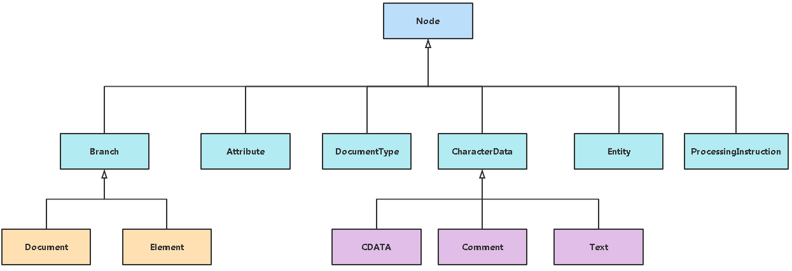


### 读取XML

`SAXReader`类：SAX的意思 stream API for XML 想溪流一样读取XML

`Document  document = new SAXReader().read(new File("input.xml"));`

`SAxReader`类为解析器，其中的`read()`方法可以解析`File`类文件，并返回`Document`

````java
SAXReader saxReader = new SAXReader();
Document document1 = saxReader.read(new File("D:\\dom4j\\dom.xml"));
````


### 创建XML

`DocumentHelper`类：可以创建一个xml文件

| 返回值           | 方法                                                     | 描述                             |
| ---------------- | -------------------------------------------------------- | -------------------------------- |
| static Document  | createDocument()                                         | 创建一个Document                 |
| static Document  | createDocument(Element rootElement)                      | 以给定元素作为根元素创建Document |
| static Document  | parseText(String  text)                                  | 将一段字符串转化为Document       |
| static Attribute | createAttribute(Element owner,QName qname, String value) | 创建一个Attribute                |
| static Element   | createElement(QName qname)                               | 以给定名称创建一个Element        |

````java
// 解析XML形式的字符串,得到document对象.
String xmlText = "<response><result>1</result><desc>保存成功</desc></response>";
Document document = DocumentHelper.parseText(xmlText);

//主动创建document对象
Document document1=DocumentHelper.createDocument();
document1.addElememt("books")  //添加根节点
````


### 写入XML

`XMLWriter`：可以指定文件地址，使用`write()`方法写入xml文件

1. `XMLWriter writer = new XMLWriter(new FileWriter("output.xml"),"编码");`   指定文件，创建写入流。编码可选

2. `writer.write(document);`                                               传入document写入文件

3. `writer.close();`                                                       关闭写入流


### 获取根节点

`Element root = document.getRootElement();`


### Node接口

| 返回值  | 方法                                | 描述                                                         |
| ------- | ----------------------------------- | ------------------------------------------------------------ |
| String  | getName()                           | 获取节点的名称，如果是元素则获取到元素名，如果是属性获取到属性名 |
| void    | setName(String name)                | 设置节点的名称，元素可以更改名称，属性则不可以，会抛出UnsupportedOperationException异常 |
| String  | getText()                           | 返回节点文本，如果是元素则返回标签体，如果是属性则返回属性值 |
| void    | setText(String text)                | 设置节点内容，如果是元素则设置标签体，如果是属性则设置属性的值 |
| void    | write(String writer)                | 将节点写出到一个输出流中，元素、属性均支持                   |
| String  | asXML()                             | 将一个节点转换为字符串                                       |
| Element | getParent()                         | 获取父节点，如果是根元素调用则返回null，如果是其他元素调用则返回父元素，如果是属性调用则返回属性所依附的元素。 |
| short   | getNodeType()                       | 获取节点类型,在Node接口上定义了一些静态short类型的常量用来表示各种类型 |
| List    | selectNodes(String xpathExpression) | 利用xpath表达式，选择节点                                    |


### Branch接口

| 返回值  | 方法                    | 描述                                                         |
| ------- | ----------------------- | ------------------------------------------------------------ |
| void    | add(Element element)    | 增加一个子节点                                               |
| Element | addElement(QName qname) | 增加一个给定名字的子节点，并且返回这个新创建的节点的引用     |
| int     | indexOf(Node node)      | 获取给定节点在所有直接点中的位置号，如果该节点不是此分支的子节点，则返回-1 |
| boolean | remove(Element element) | 删除给定子元素，返回布尔值表明是否删除成功。                 |

 

### Element接口(操作元素)

| 返回值    | 方法                                   | 描述                                                         |
| --------- | -------------------------------------- | ------------------------------------------------------------ |
| void      | add(Attribute attribute)               | 增加一个属性                                                 |
| Element   | addAttribute(String name,String value) | 为元素增加属性（设置属性）                                   |
| Element   | addAttribute(QName qName,String value) | 为元素增加属性，用给定的属性名和属性值，并返回该元素         |
| Attribute | attribute(int index)                   | 获取指定位置的属性                                           |
| Attribute | attribute(QName qName)                 | 获取指定名称的属性                                           |
| aiterator | attributeIterator()                    | 获取属性迭代器iterator                                       |
| List      | attributes()                           | 获取该元素的所有属性，以一个list返回                         |
| String    | attributeValue(QName qName)            | 获取指定名称属性的值，如果不存在该属性返回null，如果存在该属性但是属性值为空，则返回空字符串 |
| Element   | element(String name)                   | 获取指定名称的子元素，如果有多个该名称的子元素，则返回第一个 |
| Element   | addElement(QName qname)                | 增加一个给定名字的子节点，并且返回这个新创建的节点的引用     |
| List      | elements()                             | 获取所有子元素，并用一个list返回                             |
| List      | elements("元素名")                     | 获取所有指定名称的子元素，并用一个list返回                   |
| iterator  | elementIterator()                      | 获取子元素迭代器                                             |
| iterator  | elementIterator(QName qName)           | 获取指定名称的子元素的迭代器                                 |
| Element   | ddCDATA("")                            | 添加一个CDATA节点                                            |
| String    | getText()                              | 获取元素的内容                                               |
| boolean   | remove(Attribute attribute)            | 移除元素上的属性                                             |
| void      | setAttributes(List attributes)         | 将list中的所有属性设置到该元素上                             |

 

### Attribute接口

| 返回值 | 方法                    | 描述         |
| ------ | ----------------------- | ------------ |
| QName  | getQName()              | 获取属性名称 |
| String | getValue()              | 获取属性的值 |
| void   | setValue(String  value) | 设置属性的值 |


````java
//操作节点
public class HelloDom4j{
    @SuppressWarnings("unchecked")
    public static void main(String[] args) throws DocumentException, IOException{
        SAXReader saxReader = new SAXReader();
        Document document = saxReader.read("D:\\dom4j\\dom.xml");
        // 获取Document对象的根节点
        Element root = document.getRootElement();
        System.out.println(root.getName());
        // 取得根节点下的"assignIds"子节点
        Element assignIds = root.element("assignIds");
        System.out.println(assignIds.getName());
        // 取得"assignIds"节点下所有名为"assignId"的子节点，并进行遍历
        List<Element> elements = assignIds.elements("assignId");
        Iterator<Element> it = elements.iterator();
        while (it.hasNext()){
            Element element = it.next();
            // 打印节点的文本内容
            System.out.println(element.getText());
        }
        // 在"assignIds"节点下再添加一个"assignId"子节点
        Element element = assignIds.addElement("assignId");
        // 设置新节点的文本内容
        element.setText("TEST106608824");
        // 删除"assignIds"节点下第一个名为"assignId"的子节点
        Element firstAssingId = assignIds.element("assignId");
        assignIds.remove(firstAssingId);
        // 添加一个CDATA节点
        Element cddataElement = root.addElement("content");
        cddataElement.addCDATA("我是CDATA的内容!");
        // 将Document对象内容保存到XML文件
        XMLWriter xmlWriter = new XMLWriter(new FileWriter("D:\\dom4j.xml"), "UTF-8"));
        xmlWriter.write(document);
        xmlWriter.close();
    }
}
//操作属性
public class HelloDom4j{
    @SuppressWarnings("unchecked")
    public static void main(String[] args) throws DocumentException, IOException{
        SAXReader saxReader = new SAXReader();
        Document document = saxReader.read("D:\\dom4j\\attribute.xml");
        // 获取根节点
        Element root = document.getRootElement();
        System.out.println(root.getName()); // 打印结果：Request
        // 获取根节点的"service"属性
        Attribute attribute = root.attribute("service");
        // 获取并打印属性的值
        System.out.println(attribute.getText()); // 打印结果：OrderSearchService
        System.out.println(attribute.getData()); // 打印结果：OrderSearchService
        System.out.println(attribute.getValue()); // 打印结果：OrderSearchService
        // 删除根节点的"lang"属性
        Attribute lang = root.attribute("lang");
        System.out.println(lang.getData()); // 打印结果：zh-CN
        root.remove(attribute);
        // 为根节点添加"id"属性，并设置值为"request"
        root.addAttribute("id", "request");
        // 获取"Head"节点
        Element head = root.element("Head");
        // 修改"Head"节点的"name"属性值为"dom4j"
        Attribute nameAttr = head.attribute("name");
        System.out.println(nameAttr.getData());// 打印结果：head
        nameAttr.setValue("dom4j");
        System.out.println(nameAttr.getData());// 打印结果：dom4j
        // 获取"OrderSearch"节点
        Element orderSearch = root.element("Body").element("OrderSearch");
        // 遍历"OrderSearch"节点的所有属性
        Iterator<Attribute> it = orderSearch.attributeIterator();
        while (it.hasNext()){
            Attribute attr = it.next();
            System.out.println(attr.getText()); // 打印结果：orderSearch 2019586321
        }
        // 将Document对象内容保存到XML文件
        XMLWriter xmlWriter = new XMLWriter(new FileWriter("D:\\dom4j_attribute.xml"));
        xmlWriter.write(document);
        xmlWriter.close();
    }
}
````


## XPATH

**Maven引入**

````XML
<dependency>
    <groupId>jaxen</groupId>
    <artifactId>jaxen</artifactId>
    <version>1.1.6</version>
</dependency>
````

以下面的这个 XML 文档为例对XPath的语法进行示例。

````XML
<?xml version="1.0" encoding="ISO-8859-1"?>
<bookstore>
    <book>
        <title lang="eng">Harry Potter</title>
        <price>29.99</price>
    </book>
    <book>
        <title lang="eng">Learning XML</title>
        <price>39.95</price>
    </book>
</bookstore>
````

**通过xpath查找指定的节点**

````java
List<Node> list=document.selectNodes("/books/book/@show"); 
````


### 选取节点

XPath 使用路径表达式在 XML 文档中选取节点，节点是沿着路径或者 step 来选取的。

常见的路径表达式：

| 表达     | 描述                                                     |
| -------- | -------------------------------------------------------- |
| nodename | 选取当前节点的所有子节点                                 |
| /        | 从根节点开始选取                                         |
| //       | 从匹配选择的当前节点选择文档中的节点，而不考虑它们的位置 |
| .        | 选取当前节点                                             |
| ..       | 选取当前节点的父节点                                     |
| @        | 选取属性                                                 |
| text()   | 选取文本                                                 |

例:

| 路径表达式      | 结果                                                         |
| --------------- | ------------------------------------------------------------ |
| bookstore       | 选取 bookstore 元素的所有子节点                              |
| /bookstore      | 选取冲根元素开始的bookstore节点                              |
| bookstore/book  | 选取bookstore下名字为book的所有子元素。                      |
| //book          | 选取所有book子元素，而不管它们在文档中的位置。               |
| bookstore//book | 选取bookstore下名字为book的所有后代元素，而不管它们位于 bookstore 之下的什么位置。 |
| //**@**lang     | 选取所有名为 lang 的属性。                                   |
| //title/text()  | 选取所有 title 元素的文本                                    |

### 谓语

谓语用来查找某个特定的节点或者包含某个指定的值的节点。

谓语被嵌在方括号中。

| 路径表达式                         | 结果                                                         |
| ---------------------------------- | ------------------------------------------------------------ |
| /bookstore/book[1]                 | 选取属于 bookstore 子元素的第一个 book 元素。                |
| /bookstore/book[last()]            | 选取属于 bookstore 子元素的最后一个 book 元素。              |
| /bookstore/book[last()-1]          | 选取属于 bookstore 子元素的倒数第二个 book 元素。            |
| /bookstore/book[position()<3]      | 选取最前面的两个属于 bookstore 元素的子元素的 book 元素。    |
| //title[@lang]                     | 选取所有拥有名为 lang 的属性的 title 元素。                  |
| //title[@lang='eng']               | 选取所有 title 元素，要求这些元素拥有值为 eng 的 lang 属性。 |
| /bookstore/book[price>35.00]       | 选取所有 bookstore 元素的 book 元素，要求book元素的子元素 price 元素的值须大于 35.00。 |
| /bookstore/book[price>35.00]/title | 选取所有 bookstore 元素中的 book 元素的 title 元素，要求book元素的子元素 price 元素的值须大于 35.00 |

### 选取未知节点

XPath 通配符可用来选取未知的 XML 元素。

| 通配符 | 描述               |
| ------ | ------------------ |
| *      | 匹配任何元素节点   |
| @*     | 匹配任何属性节点   |
| node() | 匹配任何类型的节点 |

例

| 路径表达式   | 结果                            |
| ------------ | ------------------------------- |
| /bookstore/* | 选取 bookstore 元素的所有子节点 |
| //*          | 选取文档中的所有元素            |
| //title[@*]  | 选取所有带有属性的 title 元素。 |

### 选取若干路径

通过在路径表达式中使用`|`运算符，您可以选取若干个路径。

| 路径表达式                         | 结果                                                         |
| ---------------------------------- | ------------------------------------------------------------ |
| //book/title **\|** //book/price   | 选取所有 book 元素的 title 和 price 元素。                   |
| //title **\|** //price             | 选取所有文档中的 title 和 price 元素。                       |
| /bookstore/book/title**\|**//price | 选取所有属于 bookstore 元素的 book 元素的title 元素，以及文档中所有的 price 元素。 |

 

### XPath 轴

轴可定义某个相对于当前节点的节点集。

| 轴名称             | 结果                                                   |
| ------------------ | ------------------------------------------------------ |
| ancestor           | 选取当前节点的所有先辈（父、祖父等）                   |
| ancestor-or-self   | 选取当前节点的所有先辈（父、祖父等）以及当前节点本身   |
| attribute          | 选取当前节点的所有属性                                 |
| child              | 选取当前节点的所有子元素                               |
| descendant         | 选取当前节点的所有后代元素（子、孙等）                 |
| descendant-or-self | 选取当前节点的所有后代元素（子、孙等）以及当前节点本身 |
| following          | 选取文档中当前节点的结束标签之后的所有节点             |
| namespace          | 选取当前节点的所有命名空间节点                         |
| parent             | 选取当前节点的父节点                                   |
| preceding          | 选取文档中当前节点的开始标签之前的所有节点             |
| preceding-sibling  | 选取当前节点之前的所有同级节点                         |
| self               | 选取当前节点                                           |


### 步

**步的语法：**`轴名称::节点测试[谓语]`

* 轴:定义所选节点与当前节点之间的树关系

* 节点测试:识别某个轴内部的节点
* 零个或者更多谓语:更深入地提炼所选的节点集

实例

| 例子                   | 结果                                                         |
| ---------------------- | ------------------------------------------------------------ |
| child::book            | 选取所有属于当前节点的子元素的 book 节点                     |
| attribute::lang        | 选取当前节点的 lang 属性                                     |
| child::*               | 选取当前节点的所有子元素                                     |
| attribute::*           | 选取当前节点的所有属性                                       |
| child::text()          | 选取当前节点的所有文本子节点                                 |
| child::node()          | 选取当前节点的所有子节点                                     |
| descendant::book       | 选取当前节点的所有 book 后代                                 |
| ancestor::book         | 选择当前节点的所有 book 先辈                                 |
| ancestor-or-self::book | 选取当前节点的所有book先辈以及当前节点（假如此节点是book节点的话） |
| child::*/child::price  | 选取当前节点的所有 price 孙。                                |

 

### XPath 运算符

| 运算符 | 描述           | 实例                       | 返回值                                                       |
| ------ | -------------- | -------------------------- | ------------------------------------------------------------ |
| \|     | 计算两个节点集 | //book \| //cd             | 返回所有带有 book 和 ck 元素的节点集                         |
| +      | 加法           | 6 + 4                      | 10                                                           |
| -      | 减法           | 6 - 4                      | 2                                                            |
| *      | 乘法           | 6 * 4                      | 24                                                           |
| div    | 除法           | 8 div 4                    | 2                                                            |
| =      | 等于           | price=9.80                 | 如果 price 是 9.80，则返回 true。  如果 price 是 9.90，则返回 fasle。 |
| !=     | 不等于         | price!=9.80                | 如果 price 是 9.90，则返回 true。  如果 price 是 9.80，则返回 fasle。 |
| <      | 小于           | price<9.80                 | 如果 price 是 9.00，则返回 true。  如果 price 是 9.90，则返回 fasle。 |
| <=     | 小于或等于     | price<=9.80                | 如果 price 是 9.00，则返回 true。  如果 price 是 9.90，则返回 fasle。 |
| >      | 大于           | price>9.80                 | 如果 price 是 9.90，则返回 true。  如果 price 是 9.80，则返回 fasle。 |
| \>=    | 大于或等于     | price>=9.80                | 如果 price 是 9.90，则返回 true。  如果 price 是 9.70，则返回 fasle。 |
| or     | 或             | price=9.80 or  price=9.70  | 如果 price 是 9.80，则返回 true。  如果 price 是 9.50，则返回 fasle。 |
| and    | 与             | price>9.00 and  price<9.90 | 如果 price 是 9.80，则返回 true。  如果 price 是 8.50，则返回 fasle。 |
| mod    | 计算除法的余数 | 5 mod 2                    | 1                                                            |


### 函数

**starts-with函数:**获取以xxx开头的元素

````java
xpath(//div[stars-with(@class,”test”)])
````

**contains函数:**获取包含xxx的元素

````java
xpath(//div[contains(@id,”test”)])
````

**text()函数**

````java
xpath(//div[contains(text(),”test”)])
````


# TomCat

**博客：**[学习Tomcat这一篇就够了](https://blog.csdn.net/qq_38490457/article/details/108440922)

**应用场景**

* Tomcat是Apache的扩展，是Apache的一个子项目，它具备Web服务器的所有功能，不仅可以监听接受请求并响应静态资源，而且可以在后端运行特定规范的Java代码Servlet，同时将执行的结果以HTML代码的形式返回客户端。
* Tomcat虽然和Apache或者Nginx这些Web服务器一样，具有处理HTML页面的功能，然而由于其处理静态 HTML 的能力远不及 Apache 或者Nginx，所以Tomcat通常是作为一个Servlet和JSP容器，单独运行在后端。

**组件**

javaweb的三大组件分别是：[Servlet程序](#servlet)、[Filter过滤器](#filter)、[Listener监听器](#listener)

| 容器    | 功能                                                         |
| ------- | ------------------------------------------------------------ |
| Web     | 完成Web服务器的功能（如HTTP/HTTPS请求的接受和响应）          |
| Servlet | 由名称为catalina的脚本来处理Servlet代码（如从数据库中拿取数据给与前端） |
| JSP     | 用于将JSP动态网页翻译成Servlet代码（index.html index.php index.jsp） |

* Web 容器：负责WEB服务的TCP/IP、HTTP/HTTPS 等协议响应、处理(nginx 处理静态页面的应用交互)

* JSP 容器（JAVA Scripts page）
  * 一种动态网页开发技术
  * 它使用JSP标签在HTML网页中插入Java代码，通常以`<%`开头，以`%>`结束
  * JSP 是一种Java servlet，主要用于实现Java web应用程序的用户界面部分
  * JSP 通过网页表单获取用户输入数据、访问数据库及其他数据源，然后动态地创建网页

* Servlet 容器
  * 由名称为catalina.sh的脚本来处理Servlet代码（Servlet代码是由Java编写的）
  * Servlet容器调用API接口，找到对接的项目，对接的项目从 mysql 数据库中获得相应信息，处理完后会将这些数据返回给 jsp，通过 jsp 中的 index.jsp 展示出来，再把相应信息返回给客户
    

**目录**

| 目录    | 描述                                                         |
| ------- | ------------------------------------------------------------ |
| bin     | 存放启动和关闭的脚本文件                                     |
| conf    | 存放Tomcat的配置文件，其中最重要的是的是 **server.xml** 和 **web.xml** |
| lib     | 存放Tomcat服务器的jar包                                      |
| logs    | 存放Tomcat服务器运行时输出的日记信息                         |
| temp    | 存放Tomcdat运行时产生的临时数据                              |
| webapps | 存放部署的Web工程                                            |
| work    | Tomcat工作目录，存放jsp编译后产生的class文件，一般清除Tomcat缓存的时候会使用到 |


**配置文件**

`server.xml` 是tomcat 服务器的核心配置文件，包含了Tomcat的Servlet容器（Catalina）的所有配置


## **IDEA配置TOMCAT**


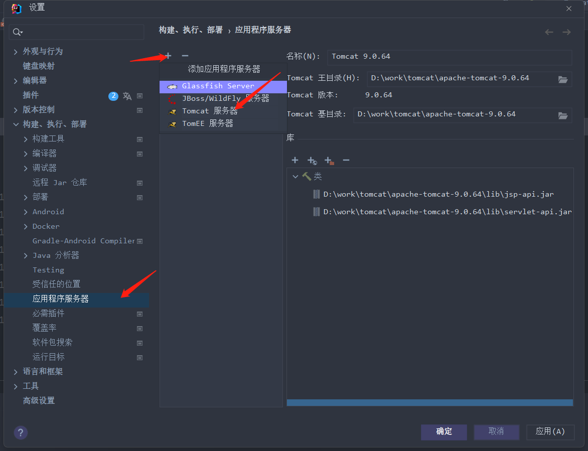

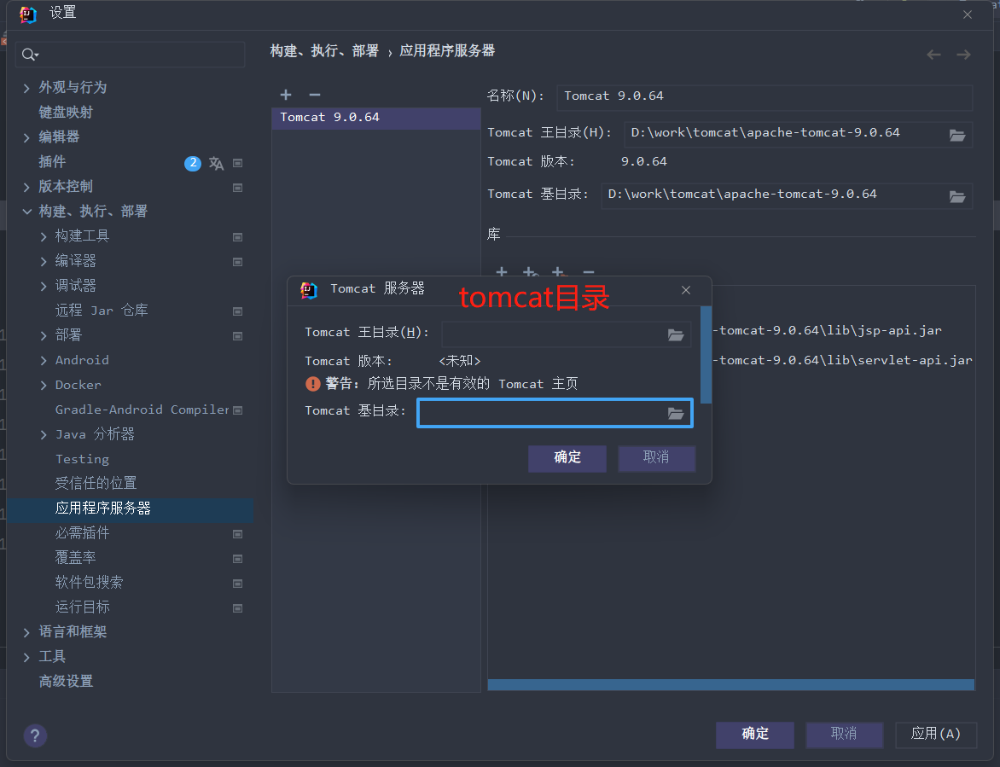

右键项目。Add Framework Support

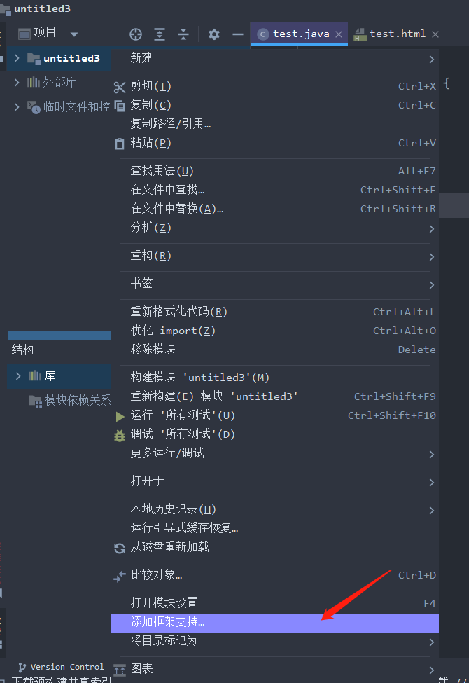

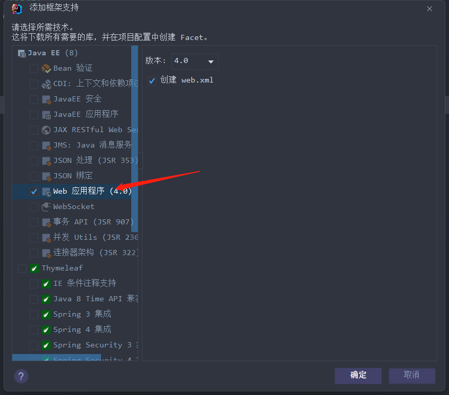

此时我们的项目增加了web目录


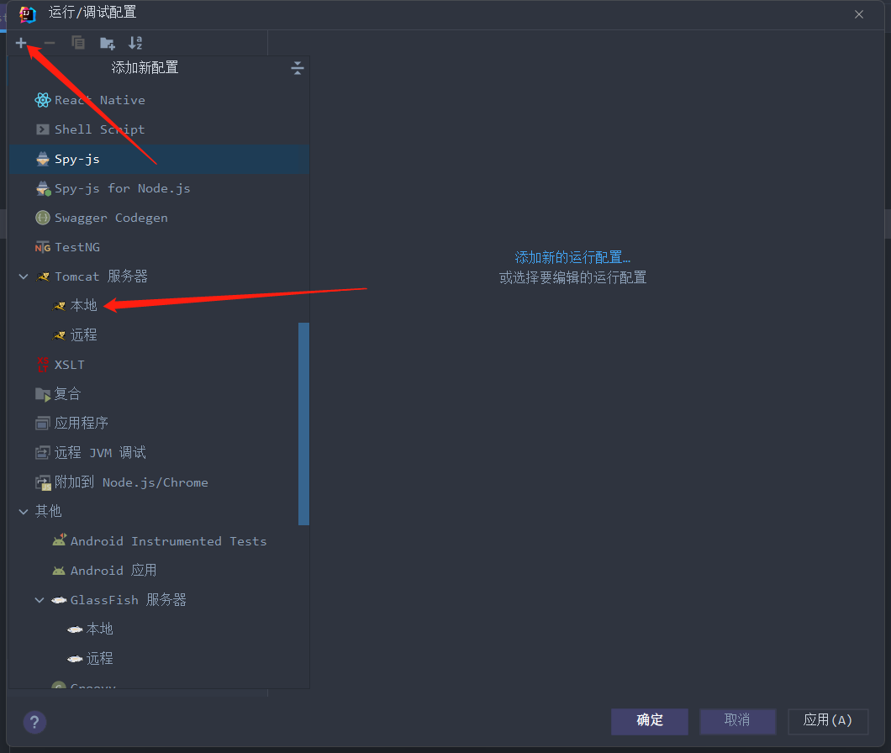

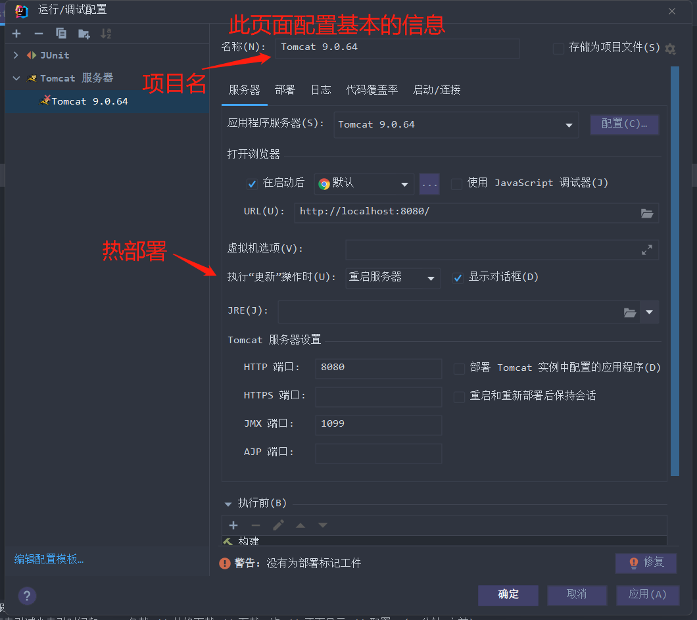

启动TOMCAT

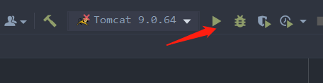

**修改默认URL**

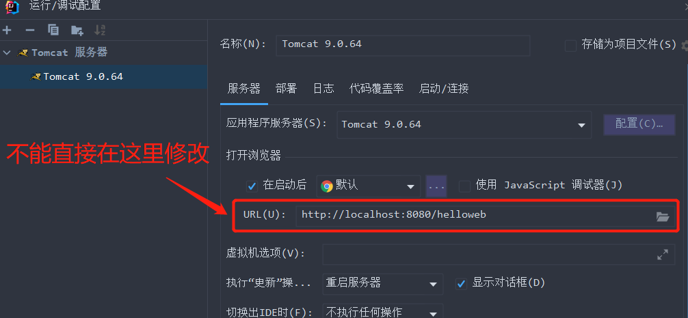

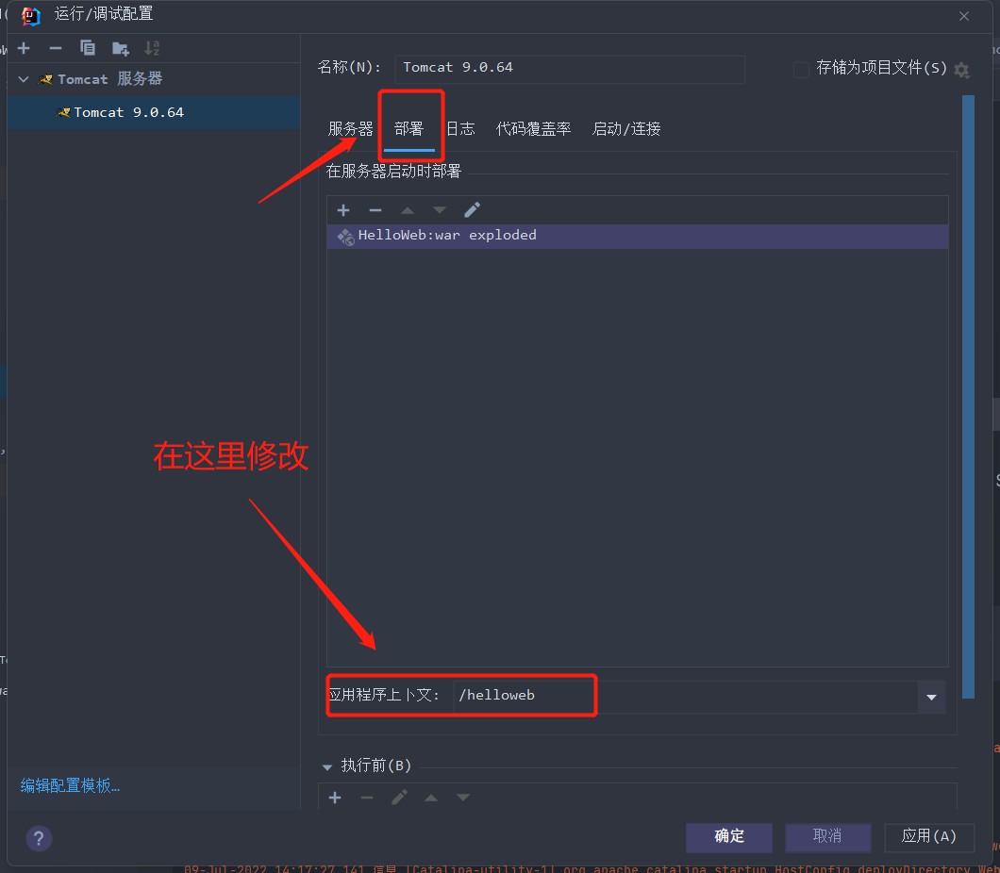


# <span id="servlet">Servlet</span>

**Maven引入**

````xml
<!--添加Servlet和JSP依赖-->
<dependency>
    <groupId>javax.servlet</groupId>
    <artifactId>javax.servlet-api</artifactId>
    <version>3.0.1</version>
    <scope>provided</scope>
</dependency>
<dependency>
    <groupId>javax.servlet.jsp</groupId>
    <artifactId>jsp-api</artifactId>
    <version>2.2</version>
    <scope>provided</scope>
</dependency>
````


**什么是Servlet**

* Servlet是JavaEE规范之一。规范就是接口

* javaweb的三大组件分别是：[Servlet程序](#servlet)、[Filter过滤器](#filter)、[Listener监听器](#listener)

* Servlet是运行在服务器上的一个java小程序
  * 客户端发送请求至服务器
  * 服务器启动并调用Servlet，Servlet根据客户端请求生成响应内容并将其传给服务器
  * 服务器将响应返回客户端


**Servlet API 包含以下4个Java包：**

| API                      | 描述                                                         |
| ------------------------ | ------------------------------------------------------------ |
| javax.servlet            | 包含定义servlet和servlet容器之间契约的类和接口               |
| javax.servlet.http       | 包含定义HTTPServlet和Servlet容器之间的关系                   |
| javax.servlet.annotation | 其中包含标注servlet，Filter,Listener的标注。它还为被标注元件定义元数据 |
| javax.servlet.descriptor | 其中包含提供程序化登录Web应用程序的配置信息的类型            |

## 实现Servlet程序

* 编写一个类去实现Servlet接口
* 实现service方法，处理请求，并响应数据
* 到`web.xml`中去配置servlet程序的访问地址

````java
//Servlet程序的示例代码：
public class HelloWeb implements Servlet {
    //service方法是专门用来处理请求和响应的
    @Override
    public void service(ServletRequest servletRequest, ServletResponse servletResponse) throws ServletException, IOException {
        System.out.println("HelloWeb被访问了");
    }
}
````

````xml
<?xml version="1.0" encoding="UTF-8"?>
<web-app xmlns="http://xmlns.jcp.org/xml/ns/javaee"
         xmlns:xsi="http://www.w3.org/2001/XMLSchema-instance"
         xsi:schemaLocation="http://xmlns.jcp.org/xml/ns/javaee http://xmlns.jcp.org/xml/ns/javaee/web-app_4_0.xsd"
         version="4.0">
    <!-- servlet 标签给Tomcat 配置Servlet 程序-->
    <servlet>
        <!--servlet-name标签Servlet程序起一个别名（一般是类名）-->
        <servlet-name>HelloWeb</servlet-name>
        <!--servLet-cLass 是Servlet 程序的全类名-->
        <servlet-class>com.rain.HelloWeb</servlet-class>
    </servlet>
    <!--servlet-mapping标签给servlet程序配置访问地址-->
    <servlet-mapping>
        <!--servlet-name标签的作用是告诉服务器，我当前配置的地址给哪个Servlet程序使用-->
        <servlet-name>HelloWeb</servlet-name>
        <!--url-pattern标签配置访问地址<br/>
            /斜杠在服务器解析的时候，表示地址为:       http://ip:port/工程路径
            /hello               表示地址为:       http://ip:port/工程路径/hello
        -->
        <url-pattern>/hello</url-pattern>
    </servlet-mapping>
</web-app>
````

**常见错误**

* `url-pattern`中配置的路径没有以斜杠打头
* `servlet-name`配置的值不存在
* `servlet-class`标签的全类名配置错误


**Servlet的生命周期**

1. 执行Servlet构造器方法(只调用一次)

2. 执行init初始化方法(只调用一次)

3. 执行service方法(每次访问都会调用)

4. 执行destroy销毁方法，在web工程停止的时候调用

**GET和POST请求的分发处理**

````java
//ServletRequest子类HttpServletRequest的getMethod获取提交的方式
public class javawebTest implements Servlet {
    @Override
    public void service(ServletRequest servletRequest, ServletResponse servletResponse) throws ServletException, IOException {
    	//类型转换（因为它有getMethod()方法）
        HttpServletRequest httpServletRequest = (HttpServletRequest) servletRequest;
    	//获取请求的方式
        String method = httpServletRequest.getMethod();

        if("GET".equals(method)){
            System.out.println("get");
        }else if("POST".equals(method)){
            System.out.println("post");
        }
    }
}
````


**通过继承HttpServlet实现Servlet程序**

一般在实际项目开发中，都是使用继承`HttpServlet`类的方式去实现`Servlet`程序。

1. 编写一个类去继承`HttpServlet`类

2. 根据业务需要重写`doGet`或`doPost`方法

3. 到`web.xml`中的配置`Servlet`程序的访问地址

````java
public class HelloWeb2 extends HttpServlet {
    @Override
    protected void doGet(HttpServletRequest req, HttpServletResponse resp) throws ServletException, IOException {
        System.out.println("Get");
    }

    @Override
    protected void doPost(HttpServletRequest req, HttpServletResponse resp) throws ServletException, IOException {
        System.out.println("Post");
    }
}
````

````xml
<servlet>
    <servlet-name>HelloWeb2</servlet-name>
    <servlet-class>com.rain.HelloWeb2</servlet-class>
</servlet>
<servlet-mapping>
    <servlet-name>HelloWeb2</servlet-name>
    <url-pattern>/hello2</url-pattern>
</servlet-mapping>
````


**使用IDEA创建Servlet程序**


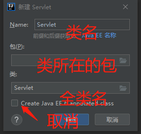

会自动创建一个类继承`HttpServlet`类，并重写`doGet`和`doPust`方法

在web.xml配置中添加

````xml
<servlet>
    <servlet-name>类名</servlet-name>
    <servlet-class>全类名</servlet-class>
</servlet>
<!--下面自己写-->
<servlet-mapping>
</servlet-mapping>
````


## Servlet有关类

### Servlet类

````java
public interface Servlet {
    void init(ServletConfig var1) throws ServletException;
    ServletConfig getServletConfig();
    void service(ServletRequest var1, ServletResponse var2) throws ServletException, IOException;
    String getServletInfo();
    void destroy();
}
````

* `init()`,当Servlet第一次被请求时，Servlet容器就会开始调用这个方法来初始化一个Servlet对象出来，但是这个方法在后续请求中不会在被Servlet容器调用。我们可以利用`init()`方法来执行相应的初始化工作。调用这个方法时，Servlet容器会传入一个`ServletConfig`对象进来从而对`Servlet`对象进行初始化。

* `service()`方法，每当请求`Servlet`时，Servlet容器就会调用这个方法。第一次请求时，Servlet容器会先调用`init()`方法初始化一个Servlet对象出来，然后会调用它的`service()`方法进行工作，但在后续的请求中，Servlet容器只会调用`service`方法了。

* `destory()`,当要销毁Servlet时，Servlet容器就会调用这个方法。在卸载应用程序或者关闭Servlet容器时，就会发生这种情况，一般在这个方法中会写一些清除代码。
* `getServletInfo()`，这个方法会返回`Servlet`的一段描述，可以返回一段字符串。
* `getServletConfig()`，这个方法会返回由`Servlet`容器传给`init()`方法的`ServletConfig`对象。

 

**ServletRequset接口**

Servlet容器对于接受到的每一个Http请求，都会创建一个`ServletRequest`对象，并把这个对象传递给Servlet的`Sevice( )`方法。其中，`ServletRequest`对象内封装了关于这个请求的许多详细信息

````java
public interface ServletRequest {
    int getContentLength();//返回请求主体的字节数
    String getContentType();//返回主体的MIME类型
    String getParameter(String var1);//返回请求参数的值
}
````

**ServletResponse接口**

`ServletResponse`接口表示一个Servlet响应，在调用Servlet的`Service()`方法前，Servlet容器会先创建一个`ServletResponse`对象，并把它作为第二个参数传给`Service()`方法。`ServletResponse`隐藏了向浏览器发送响应的复杂过程。

````java
public interface ServletResponse {
    String getCharacterEncoding();
    String getContentType();
    ServletOutputStream getOutputStream() throws IOException;
    PrintWriter getWriter() throws IOException;
    void setCharacterEncoding(String var1);
    void setContentLength(int var1);
    void setContentType(String var1);
    void setBufferSize(int var1);
    int getBufferSize();
    void flushBuffer() throws IOException;
    void resetBuffer();
    boolean isCommitted();
    void reset();
    void setLocale(Locale var1);
    Locale getLocale();
}
````

`getWriter()`:返回了一个可以向客户端发送文本的的`Java.io.PrintWriter`对象。默认情况下，`PrintWriter`对象使用ISO-8859-1编码（该编码在输入中文时会发生乱码）。在向客户端发送响应时，大多数都是使用该对象向客户端发送HTML。

`getOutputStream()`:用来发送二进制数据的。

在发送任何HTML之前，应该先调用`setContentType()`方法，设置响应的内容类型，并将`“text/html”`作为一个参数传入，这是在告诉浏览器响应的内容类型为HTML，需要以HTML的方法解释响应内容而不是普通的文本，或者也可以加上`“charset=UTF-8”`改变响应的编码方式以防止发生中文乱码现象。


### ServletConfig类

* `ServletConfig`类是Servlet程序的配置信息类。
* Servlet程序和`ServletConfig`对象都是由Tomcat负责创建，我们负责使用。
* Servlet程序默认是第一次访问的时候创建，`ServletConfig`是每个Servlet程序创建时，就创建一个对应的`ServletConfig`对象。

**作用**

* 可以获取Servlet程序的别名`servlet-name`的值
* 获取初始化参数`init-param`
* 获取`ServletContext`对象

**创建**

* 直接使用`ServletConfig config = this.getServletConfig();`
* 在继承了`HttpServlet`的类中直接`getServletConfig()`也可以获得 

**方法**

| 方法                                 | 描述                  |
| ------------------------------------ | --------------------- |
| String getInitParameter(String name) | 根据参数名获取参数值  |
| Enumeration getInitParameterNames()  | 获取所有参数          |
| String getServletName()              | 得到servlet的名称     |
| ServletContext getServletContext()   | 得到servlet上下文对象 |

```xml
<!--web.xml中的配置：-->
<?xml version="1.0" encoding="UTF-8"?>
<web-app xmlns="http://xmlns.jcp.org/xml/ns/javaee"
         xmlns:xsi="http://www.w3.org/2001/XMLSchema-instance"
         xsi:schemaLocation="http://xmlns.jcp.org/xml/ns/javaee http://xmlns.jcp.org/xml/ns/javaee/web-app_4_0.xsd"
         version="4.0">
    <servlet>
        <servlet-name>ServletTest</servlet-name>
        <servlet-class>com.rain.ServletTest</servlet-class>
        
        <!--init-param是初始化参数-->
        <init-param>
            <param-name>username</param-name>
            <param-value>rain</param-value>
        </init-param>
        <init-param>
            <param-name>password</param-name>
            <param-value>337337</param-value>
        </init-param>
    </servlet>
    <servlet-mapping>
        <servlet-name>ServletTest</servlet-name>
        <url-pattern>/helloservlet</url-pattern>
    </servlet-mapping>
</web-app>
```

````java
public class ServletTest implements Servlet {
    @Override
    public void init(ServletConfig servletConfig) throws ServletException {
        System.out.println("Servlet别名：" + servletConfig.getServletName());

        String username = servletConfig.getInitParameter("username");
        System.out.println("用户名：" + username);
        String password = servletConfig.getInitParameter("password");
        System.out.println("用户密码：" + password);

    }
}
````


### ServletContext类

* `ServletContext`是一个接口，它表示Servlet上下文对象
* 一个web工程，只有一个`ServletContext`对象实例。
* `ServletContext`对象是一个**域**对象。
* `ServletContext`是在web工程部署启动的时候创建。在web工程停止的时候销毁。
* 域对象，是可以像Map一样存取数据的对象，叫域对象。这里的域指的是存取数据的操作范围，整个web工程。
* `ServletContext`对象，可以**共享**从应用程序中的所有资料处访问到的信息，并且可以动态注册Web对象。前者将对象保存在`ServletContext`中的一个内部Map中。保存在ServletContext中的对象被称作属性。

**作用**

* 获取web.xml中配置的上下文参数`context-param`，达到多个Servlet程序**共享数据**的目的
* 获取当前的工程路径，格式:/工程路径
* 获取工程部署后在服务器硬盘上的绝对路径
* 像Map一样添加数据

**创建**

1. `ServletContext context = ServletConfig.getServletContext();`
2. 在继承了`HttpServlet`的类中直接`getServletContext()`也可以获得

**方法**

| 方法                                          | 描述                                            |
| --------------------------------------------- | ----------------------------------------------- |
| String getContextPath()                       | 得到当前web应用的路径                           |
| String getRealPath(String path)               | 根据一个资源的相对web根的路径，获取它的绝对路径 |
| String getInitParameter(String name)          | 得到Web.xml中\<context-param>标签的初始化参数   |
| Enumeration getInitParameterNames()           |                                                 |
| void setAttribute(String name, Object object) | 往域对象里添加键值对                            |
| Object getAttribute(String name)              | 查看域对象里的键值对                            |
| void removeAttribute(String name)             | 删除域对象里的键值对                            |

注意：

* `getInitParameter(String name)`是获得Web.xml中的参数

* `getAttribute(String name)`是获得域对象中的参数，不会写入到xml中，存活在整个工程的执行期间。

````xml
<?xml version="1.0" encoding="UTF-8"?>
<web-app xmlns="http://xmlns.jcp.org/xml/ns/javaee"
         xmlns:xsi="http://www.w3.org/2001/XMLSchema-instance"
         xsi:schemaLocation="http://xmlns.jcp.org/xml/ns/javaee http://xmlns.jcp.org/xml/ns/javaee/web-app_4_0.xsd"
         version="4.0">

    <servlet>
        <servlet-name>helloweb</servlet-name>
        <servlet-class>com.rain.HelloWeb</servlet-class>
    </servlet>
    <servlet-mapping>
        <servlet-name>helloweb</servlet-name>
        <url-pattern>/hello</url-pattern>
    </servlet-mapping>
	<!--context-param是上下文参数(它属于整个web工程)-->
    <context-param>
        <param-name>username</param-name>
        <param-value>rainupup</param-value>
    </context-param>
    <context-param>
        <param-name>password</param-name>
        <param-value>123456</param-value>
    </context-param>
</web-app>
````

````java
@Override
protected void doGet(HttpServletRequest req, HttpServletResponse resp) throws ServletException, IOException {
    ServletContext context = getServletContext();
    System.out.println(context.getContextPath());                    //获取项目路径

    System.out.println(context.getInitParameter("username"));        //获取xml文件中的值
    System.out.println(context.getInitParameter("password"));

    System.out.println(context.getRealPath("/index.jsp"));           //获取index在计算机中的绝对路径

    context.setAttribute("A","B");                                   //往域对象中添加key-value
    System.out.println(context.getAttribute("A"));   
}
````


## HttpStrvlet类

`HttpServlet`抽象类是继承于`GenericServlet`抽象类而来的。还需要借助`HttpServletRequest`和`HttpServletResponse`对象。

`HttpServletRequest`接口扩展于`javax.servlet.ServletRequest`接口，`HttpServletResponse`接口扩展于`javax.servlet.servletResponse`接口。

`HttpServlet`抽象类覆盖了`GenericServlet`抽象类中的`Service()`方法，并且添加了一个自己独有的`Service(HttpServletRequest request，HttpServletResponse)`方法。

````java
public void service(ServletRequest req, ServletResponse res) throws ServletException, IOException {
    if (req instanceof HttpServletRequest && res instanceof HttpServletResponse) {
        HttpServletRequest request = (HttpServletRequest)req;       //类型转换
        HttpServletResponse response = (HttpServletResponse)res;
        this.service(request, response);                           //调用下面的service方法
    } else {
        throw new ServletException("non-HTTP request or response");
    }
}

protected void service(HttpServletRequest req, HttpServletResponse resp) throws ServletException, IOException {
    String method = req.getMethod();
    long lastModified;
    if (method.equals("GET")) {
        lastModified = this.getLastModified(req);
        if (lastModified == -1L) {
            this.doGet(req, resp);
        } else {
            long ifModifiedSince = req.getDateHeader("If-Modified-Since");
            if (ifModifiedSince < lastModified) {
                this.maybeSetLastModified(resp, lastModified);
                this.doGet(req, resp);
            } else {
                resp.setStatus(304);
            }
        }
    }  else if (method.equals("POST")) {
        this.doPost(req, resp);
    } 
    //其他判断......
    else {
        String errMsg = lStrings.getString("http.method_not_implemented");
        Object[] errArgs = new Object[]{method};
        errMsg = MessageFormat.format(errMsg, errArgs);
        resp.sendError(501, errMsg);
    }
}
````

创建Servlet程序时，只需要基础`HttpServlet`类，并覆盖`doGet`/`doPost`等方法就行了


### HttpServletRequest类

**博客：**

[HttpServletRequest详解](https://blog.csdn.net/wwq0813/article/details/90256058)

[HttpServletRequest参数获取，HttpServletRequest详解](https://blog.csdn.net/weixin_41547486/article/details/81266712)


**介绍**

* `HttpServletRequest`接口扩展于`javax.servlet.ServletRequest`接口

* 当客户端通过HTTP协议访问服务器时，HTTP请求头中的所有信息都封装在这个对象中，通过这个对象提供的方法，可以获得客户端请求的所有信息


**方法**

| 方法                                  | 描述                                                         |
| ------------------------------------- | ------------------------------------------------------------ |
| getMethod()                           | 获取请求的方式GET或POST                                      |
| getParameter(String)                  | 获取请求的参数value，前端标签内必须有name属性                |
| getParameterValues(String)            | 获取请求的参数value（前端多个name值相同的时候使用）          |
| getParameterNames()                   | 获得表单中的所有的name(在不知道前端name时，可以获取name的值) |
| getParameterMap()                     | 返回的是一个Map类型的值，获取请求中的key-value映射关系(编写框架时常用) |
| getCookies()                          | 获取cookies数组                                              |
| getAttribute(key)                     | 获取域数据(是request的域对象，只存活在本次请求中)            |
| setAttribute(key,value)               | 设置域数据(是request的域对象，只存活在本次请求中)            |
| getRequestDispatcher("/网页本地地址") | 获取请求转发对象                                             |
| getRequestURI()                       | 获取请求的资源路径                                           |
| getRequestURL()                       | 获取请求的统一资源定位符（绝对路径）                         |
| getHeader(String)                     | 获取请求头                                                   |
| getHeaders(String  name)              | 以String对象的Enumeration的形式返回指定请求头的所有值        |
| setCharacterEncoding(String)          | 设置编码形式                                                 |
| getQueryString()                      | 返回请求行中的参数部分（参数名+值）                          |
| getRemoteHost()                       | 获取客户端的ip地址                                           |
| getRemoteAddr()                       | 获取客户机的IP地址                                           |
| getPathInfo()                         | 返回请求URL中的额外路径信息。额外路径信息是请求URL中的位于Servlet的路径之后和查询参数之前的内容，它以"/"开头 |
| getRemotePort()                       | 返回客户机所使用的网络端口号                                 |
| getLocalAddr()                        | 返回WEB服务器的IP地址                                        |
| getLocalName()                        | 返回WEB服务器的主机名                                        |

````html
<body>
<form  action="hello" method="post">
    用户名：<input type="text" name="username">              <!--必须有name属性--->
    密码：<input type="password" name="password">
    爱好：<input type="checkbox" name="hobbt" value="唱"> 唱
    <input type="checkbox" name="hobbt" value="跳"> 跳
    <input type="checkbox" name="hobbt" value="rap"> rap
    <input type="checkbox" name="hobbt" value="篮球"> 篮球
    <input type="submit">
</form>
</body>
````

````java
@Override
protected void doPost(HttpServletRequest req, HttpServletResponse resp) throws ServletException, IOException {
    System.out.println("方式：" + req.getMethod());
    System.out.println("用户名：" + req.getParameter("username"));
    System.out.println("密码："+ req.getParameter("password"));

    String[] hobbts = req.getParameterValues("hobbt");
    for (String h:hobbts)
        System.out.println("爱好：" + h);
}
````


**乱码**

GET请求

````java
String username = req.getParameter("username");
//1先以iso8859-1进行编码
//2再以utf-8进行解码
username = new String(username.getBytes("iso-8859-1"),"UTF-8");
````

POST请求

````java
//在开头设置
req.setCharacterEncoding("UTF-8");
````


**请求转发**

* 请求转发是指，服务器收到请求后，从一次资源跳转到另一个资源的操作叫请求转发。

* 请求类型和上级请求类型一致 (同get或同post)
* 无法访问工程外的地址
* 浏览器地址栏没有变化
* 共享request域中的数据
* 可以访问WEN-INF目录


````java
Servlet1代码：
public class Servlet1 extends HttpServlet {

    @Override
    protected void doGet(HttpServletRequest req, HttpServletResponse resp) throws ServletException, IOException {
        //获取请求的参数（办事的材料）查看
        String test = req.getParameter("Test");//假定有数据
        System.out.println("在Servlet1（柜台1）中查看参数（材料）："+test);

        //给材料盖一个章，并传递到Servlet2（柜台2）去查看
        req.setAttribute("key","柜台1盖章");
        System.out.println("请求方法:" + req.getMethod()); 

        //问路：Servlet2（柜台2）怎么走
        /**
         * 请求转发必须要以斜杠打头，
         * /斜杠表示地址为：http://ip:port/工程名/,映射到IDEA代码的web目录
         */
        RequestDispatcher requestDispatcher = req.getRequestDispatcher("/servlet2");
        //getRequestDispatcher("http://www.baidu.com"); 错误无法访问工程外的地址
        //走向Sevlet2（柜台2）
        requestDispatcher.forward(req,resp);
    }
}
Servlet2代码：
public class Servlet2 extends HttpServlet {
    @Override
    protected void doGet(HttpServletRequest req, HttpServletResponse resp) throws ServletException, IOException {
        //获取请求的参数（办事的材料）查看
        String test = req.getParameter("test");
        System.out.println("在Servlet2（柜台2）中查看参数（材料）："+test);
        // 查看柜台1是否有盖章
        Object key = req.getAttribute("key");
        System.out.println("柜台1是否有章："+key);
        // 处理自己的业务
        System.out.println("Servlet2处理自己的业务");
        System.out.println("请求方法:" + req.getMethod()); //请求方法和上级一致 
    }
}
````


**web中/斜杠的不同意义**

> 浏览器解析：得到的地址是：http://ip:port/

`<a href="/">斜杠</a>`，由于是浏览器解析的，所以指向的是http://ip:port/

如果我们在IDEA TOMCAT的设置是http://localhost:8080/helloweb

`<form action = "/hello">`,指向的是http://localhost:8080/hello，访问失败

`<form action = "hello">`,指向的是http://localhost:8080/helloweb/hello，访问成功


> 服务器解析，得到的地址是：http://ip:port/工程路径

````xml
<!--指向http://ip:port/工程/servlet1-->
<url-pattern>/servlet1</url-pattern>
````

````java
servletContext.getRealPath(“/”);
request.getRequestDispatcher(“/”);
````

特殊情况(重定向):`response.sendRediect(“/”);`把斜杠发送给浏览器解析。得到http://ip:port/


### HttpServletResponse类

**博客：**

[HttpServletResponse详解](https://blog.csdn.net/weixin_41547486/article/details/81266768)

[SpringMVC中HttpServletHttpRequest与HttpServletResponse详解](https://blog.csdn.net/lee18254290736/article/details/809487829)


**介绍**

* `HttpServletResponse`接口扩展于`javax.servlet.servletResponse`接口。

* `HttpServletResponse`响应返回的是整个HTTP页面 （客户端解析返回的HTTP页面并显示）

* Servlet如果需要给客户端返回数据，比如Servlet内部需要这样写输出语句：

  * `response.getWriter().write("<h1>下面是获得的字符串</h1>");`

  * `response.getWriter().write("<h1>method(HTTP方法):<h1>");`

* Servlet的局限性：即一行一行的把HTML语句给用`Writer`输出。JAVA的开发者Sun公司为了解决这个问题，也开发出了自己的动态网页生成技术，使得同样可以在HTML文件里内嵌JAVA代码，这就是现在的JSP技术；

 

**方法**

| 方法                                 | 描述                           |
| ------------------------------------ | ------------------------------ |
| setHeader(String name,String value)  | 设置响应头信息                 |
| addHeader(String name,String value)  | 增加相应头信息                 |
| addCookie(Cookie cookie)             | 添加Cookie                     |
| setContentType(String type)          | 设置响应类型(用于解决乱码问题) |
| sendRedirect(String location)        | 请求重定向                     |
| setStatus(int sc)                    | 设置响应状态码                 |
| setCharacterEncoding(String charset) | 告知服务器使用什么编码         |

 

**两个输出流**

| 类型   | 方法              | 描述                         |
| ------ | ----------------- | ---------------------------- |
| 字节流 | getOutputStream() | 常用于下载（传递二进制数据） |
| 字符流 | getWriter()       | 常用于回传字符串（常用）     |

两个流同时只能使用一个。使用了字节流，就不能再使用字符流，反之亦然，否则就会报错。


**回传数据**

1. `PrintWriter writer = HttpServletResponse.getWriter()`获得输出流
2. `writer.write(String)`写出数据

````java
public class ResponseIOServlet extends HttpServlet{
    @Override
    protected void doGet(HttpServletRequest req,HttpServletResponse resp) throws ServletException,IOException{
        //要求：往客户端回传字符串数据。
        PrintWriter writer = resp.getWriter();
        writer.write("response'scontent!!!");
    }
}
````


**乱码**

解决响应中文乱码方案一（不推荐使用）：

````java
//设置服务器字符集为UTF-8
resp.setCharacterEncoding("UTF-8");
//通过响应头，设置浏览器也使用UTF-8字符集
resp.setHeader("Content-Type","text/html;charset=UTF-8");
````

解决响应中文乱码方案二（推荐）：

````java
//它会同时设置服务器和客户端都使用UTF-8字符集，还设置了响应头
//此方法一定要在获取流对象之前调用才有效
resp.setContentType("text/html;charset=UTF-8");
````

 

**请求重定向**

* 请求重定向，是指客户端给服务器发请求，然后服务器告诉客户端说。我给你一些地址。你去新地址访问。叫请求重定向（因为之前的地址可能已经被废弃）

* 浏览器地址栏发生变化
* 两次请求
* 不共享Request中的数据
* 不能访问WEB-INF下的资源
* 可以访问工程外的文件


请求重定向的第一种方案：

````java
//设置响应状态码302，表示重定向，（已搬迁）
resp.setStatus(302);
//设置响应头，说明新的地址在哪里
resp.setHeader("Location","新地址");
````

请求重定向的第二种方案（推荐使用）

````java
resp.sendRedirect("新地址");
````


# <span id="listener">Listener监听器</span>

**什么是Listener监听器？**

* Listener监听器它是javaweb的三大组件之一
* Listener它是JavaEE的规范，就是接口
* Listener用于监听servlet中的事件，例如context、request、session对象的创建、修改、删除，并触发响应事件。Listener是观察者模式的实现，在servlet中主要用于对context、request、session对象的生命周期进行监控。在servlet2.5规范中共定义了8中Listener。在启动时，`ServletContextListener` 的执行顺序与web.xml中的**配置顺序一致**，停止时执行顺序相反。

**servletContextListener监听器**

* `ServletContextListener`它可以监听`ServletContext`对象的创建和销毁。
* `ServletContext`对象在web工程启动的时候创建，在web工程停止的时候销毁。监听到创建和销毁之后都会分别调用`ServletContextListener`监听器的方法反馈。

**方法**

| 方法                                        | 描述                                           |
| ------------------------------------------- | ---------------------------------------------- |
| contextInitialized(ServletContextEvent sce) | 在ServletContext对象创建之后马上调用，做初始化 |
| contextDestroyed(ServletContextEvent sce)   | 在ServletContext对象销毁之后调用               |


**使用**

1. 编写一个类去实现`ServletContextListener`

2. 实现其两个回调方法

3. 到web.xml中去配置监听器

````java
//监听器实现类
public class MyServletContextListenerImpl implements ServletContextListener{
    @Override
    public void contextInitialized(ServletContextEvent sce){
        System.out.println("ServletContext对象被创建了");
    }
    @Override
    public void contextDestroyed(ServletContextEvent sce){
        System.out.println("ServletContext对象被销毁了");
    }
}
````

````xml
<!--配置监听器-->
<listener>
    <listener-class>com.rain.listener.MyServletContextListenerImpl</listener-class>
</listener>
````


# JSP

**博客：**

[JSP](https://blog.csdn.net/yeiweilan/article/details/69948491)

[什么是JSP](https://blog.csdn.net/q5706503/article/details/83549051)

[JSP的原理、JSP的执行过程](https://blog.csdn.net/weixin_42529699/article/details/81303861)

**Maven引入**

````xml
<dependency>
    <groupId>javax.servlet</groupId>
    <artifactId>javax.servlet-api</artifactId>
    <version>3.0.1</version>
    <scope>provided</scope>
</dependency>
<dependency>
    <groupId>javax.servlet.jsp</groupId>
    <artifactId>jsp-api</artifactId>
    <version>2.2</version>
    <scope>provided</scope>
</dependency>
````

 

**JSP介绍**

* JSP的全称是java server pages
* JSP的主要作用是代替Servlet程序回传html页面的数据
* JSP是简化Servlet编写的一种技术，它将Java代码和HTML语句混合在同一个文件中编写，只对网页中的要动态产生的内容采用Java代码来编写，而对固定不变的静态内容采用普通静态HTML页面的方式编写
* 后端查询到的数据添加到某个域中，然后重定向到jsp页面，jsp页面再读取域中的数据
* JSP本质上也是一个servlet！！！！！！
* JSP就是在HTML页面中嵌入了java代码
* jsp = html + java脚本 + jsp标签(指令)
* jsp中可直接使用的对象一共有9个，被称之为9大内置对象


**JSP本质**

jsp页面本质上是一个Servlet程序。

当我们第一次访问jsp页面的时候。Tomcat服务器会帮我们把jsp页面翻译成为一个java源文件。并且对它进行编译成为`.class`字节码程序。

打开java源文件


可见jsp源文件继承了`HttpJspBase`类，`HttpJspBase`类直接继承了`HttpServlet`类。

JSP源文件将被翻译成为一个Servlet程序的JAVA文件。


**过程**

* jsp其实是一种特殊的Servlet

* 当jsp页面第一次被访问时，服务器会把jsp编译成java文件
* 然后再把java编译成.class
* 然后创建该类对象
* 最后调用它的`service()`方法
* 第二次请求同一jsp时，直接调用`service()`方法。


## JSP语法

### **page指令**

jsp的page指令可以修改jsp页面中一些重要的属性与行为。

`<%@ page contentType="text/html;charset=UTF-8" language = "java" %>`

| 属性             | 描述                                                         |
| ---------------- | ------------------------------------------------------------ |
| language属性     | 表示jsp翻译后是什么语言文件。暂时只支持java                  |
| contentType属性  | 表示jsp返回的数据类型是什么。也是源码中response.setContentType()参数值 |
| pageEncoding属性 | 表示当前jsp页面文件本身的字符集                              |
| import属性       | 跟java源代码中一样。用于导包，导类                           |
| autoFlush属性   | 设置当out输出流缓冲区满了之后，是否自动刷新冲级区。默认值是true |
| buffer属性      | 设置out缓冲区的大小。默认是8kb                               |
| errorPage属性   | 设置当jsp页面运行时出错，自动跳转去的错误页面路径          |
| isErrorPage属性 | 设置当前jsp页面是否是错误信息页面。默认是false。如果是true可以获取异常信息 |
| session属性     | 设置访问当前jsp页面，是否会创建HttpSession对象。默认是true |
| extends属性     | 设置jsp翻译出来的java类默认继承谁                          |

`<%@ page import="com.bean.person" %>`:导入`com.bean.person`类，使其可以在JSP中使用`person`类


errorPage表示错误后自动跳转去的路径,一般都是以斜杠打头，它表示请求地址为`http://ip:port/工程路径/`

`<error-page>`有两种使用方式：

* `<error-code>`和`<location>`子元素；其中`<error-code>`是指定响应码,`<location>`指定转发的页面；

* `<exception-type>`和`<location>`子元素；`<exception-type>`是指定抛出的异常类型,`<location>`指定转发的页面；

````jsp
 <error-page>
    <error-code>404</error-code>
    <location>/error/errorPage.jsp</location>
 </error-page>
 <error-page>
      <exception-type>java.lang.RuntimeException</exception-type>
      <location>/index.jsp</location>
</error-page>
````


### JSP常用脚本

> 声明脚本(极少使用)

**格式：**`<%! 声明java代码 %>`

**作用：**可以给jsp翻译出来的java类定义属性和方法甚至是静态代码块、内部类等。

翻译成为JAVA对应源文件的属性、方法等

````jsp
<!--1、声明类属性-->
<%!
    private Integer id;
    private String name = "rainupup";
%>
<!--2、声明static静态代码块-->
<%!
    static{
    	map = new HashMap<String,Object>();
        map.put("key1","value1");
        map.put("key2","value2");
    }
%>
<!--3、声明类方法-->
<%!
    public int abc(){
        return 12;
    }
%>
````


> 表达式脚本（常用）

**格式：**`<%= 表达式%>`

**作用：**在jsp页面上输出数据

**特点：**

* 所有的表达式脚本都会被翻译到对应java源文件的`jspService()`方法中
* 表达式脚本都会被翻译成为`out.print()`输出到页面上
* 由于表达式脚本翻译的内容都在`jspService()`方法中,所以`jspService()`方法中的对象都可以直接使用
* 表达式脚本中的表达式不能以分号结束

````jsp
<%= "rain"%>
<!--<%! %>标签中定义的name属性--!>
<%= name%>        
<%= 337337%>
<%= request.getParameter("username")%>
````


> 代码脚本

**格式：**`<% java语句 %>`

**作用：**可以在jsp页面中，编写我们自己需要的功能(写的是java语句)

**特点：**

* 代码脚本翻译之后都在`jspService`方法中
* 代码脚本由于翻译到`jspService()`方法中，所以在`jspService()`方法中的现有对象都可以直接使用
* 还可以由多个代码脚本块组合完成一个完整的java语句
* 代码脚本还可以和表达式脚本一起组合使用，在jsp页面上输出数据

````jsp
<!--代码脚本for循环语句-->
<!--与html标签结合-->
<table border="1" cellspacing="0">
<%
    for(intj=0;j<10;j++){
%>
    <tr>
    	<td>第<%= j+1%>行</td>
    </tr>
<%
    }
%>
</table>
````

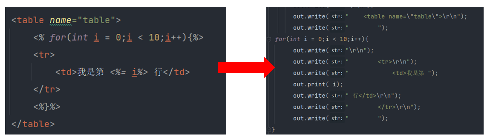

HTML标签或文本内容翻译为java源文件后将会被`out.write`语句输出

`<% %>`中的java代码被原封不动地搬移进了`jspService()`方法中的相应位置处

位于`<%= %>`之中的内容则是被转换成以其中的变量或表达式作为参数的`out.print`语句


### 三种注释

**HTML注释**

`<!--这是html注释-->`

HTML注释会被翻译到java源代码中。`在jspService`方法里，以`out.writer`输出到客户端


**java注释**

`//单行java注释`

`/*多行java注释*/`

java注释会被翻译到java源代码中


**jsp注释**

`<%--这是jsp注释--%>`

jsp注释可以注掉，jsp页面中所有代码


## 内置内容

`_jspService()`方法是JSP翻译为java文件中的一个方法，九大对象在`_jspService()`方法中，而`<%= %>`和`<% %>`的内容也被翻译到了`_jspService()`方法中，所以在`<%= %>`和`<% %>`中可以直接使用九大对象

### 九大对象


| 内置对象    | 描述               |
| ----------- | ------------------ |
| request     | 请求对象           |
| response    | 相应对象           |
| pageContext | JSP上下文对象      |
| session     | 回话对象           |
| application | ServletContext对象 |
| config      | ServletConfig对象  |
| out         | JSP输出流对象      |
| page        | 指向当前JSP对象    |
| exception   | 异常对象           |


**out输出和response.getWriter输出的区别**

`out.write()`和`response.getWriter().write()`都可以为客户端输出内容

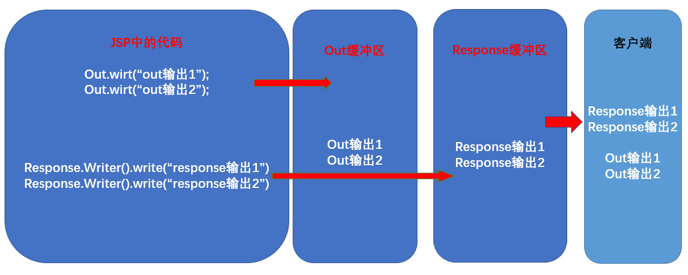

当JSP页面中的所以代码执性完毕后，JSP会自动完成两个操作：

1. 执性`out.flush()`，把out缓冲区的数据追加到response缓冲区的末尾
2. 执性response的刷新操作，把数据返回给客户端

由于jsp翻译之后，底层源代码都是使用out来进行输出，所以一般情况下。我们在jsp页面中统一使用out来进行输出。避免打乱页面输出内容的顺序。

| 方法        | 描述                                                        |
| ----------- | ----------------------------------------------------------- |
| out.write() | 输出字符串没有问题                                          |
| out.print() | 输出任意数据都没有问题（都转换成为字符串后调用的write输出） |

结论：在jsp页面中，可以统一使用`out.print()`来进行输出


### 四大域对象

九大对象其中有四个域对象

| 域对象      | 所属类               | 描述                                                       |
| ----------- | -------------------- | ---------------------------------------------------------- |
| pageContext | PageContextImpl类    | 当前jsp页面范围内有效                                      |
| request     | HttpServletRequest类 | 一次请求内有效                                             |
| session     | HttpSession类        | 一个会话范围内有效（打开浏览器访问服务器，直到关闭浏览器） |
| application | ServletContext类     | 整个web工程范围内都有效（只要web工程不停止，数据都在）     |

域对象是可以像Map一样存取数据的对象。四个域对象功能一样。不同的是它们对数据的存取范围。

从小到大的范围的顺序：`pageContext====>>>request====>>>session====>>>application`

````jsp
<%@ page language="java" contentType="text/html; charset=UTF-8"
pageEncoding="UTF-8"%>
<!DOCTYPE html PUBLIC "-//W3C//DTD HTML 4.01 Transitional//EN" "http://www.w3.org/TR/html4/loose.dtd">
<html>
<head>
    <meta http-equiv="Content-Type" content="text/html; charset=UTF-8">
    <title>Insert title here</title>
</head>
<body>
    <% request.setAttribute("name","tom"); %>
    <%= request.getAttribute("name")==null ? "" : request.getAttribute("name") %><br>
	${requestScope.name}
</body>
</html>
````


## 常用标签

### 静态包含

**语法：**`<%@ include file=""%>`

* file属性指定被包含的jsp页面的路径，地址中第一个斜杠`/`表示为`http://ip:port/工程路径/`映射到代码的web目录

**特点：**

* 静态包含不会翻译被包含的jsp页面(由被包含的jsp自己翻译)
* 静态包含其实是把被包含的jsp页面的代码拷贝到包含的位置执行输出

````jsp
a.jsp的内容
<body>
    头部信息<br/>
    主体内容<br/>
    <%@include file="/b.jsp"%>  //只需要引入b.jsp文件即可,可以在不同的jsp页面引入同一个jsp页面,方便后期维护
</body>

b.jsp的内容
<body>
    尾部信息<br/>
</body>
````


### 动态包含

**语法：**`<jsp:include page=""></jsp:include>`

* page属性是指定被包含的jsp页面的路径

​    动态包含也可以像静态包含一样。把被包含的内容执行输出到包含位置

**特点：**

* 动态包含会把包含的jsp页面也翻译成为java代码
* 动态包含底层代码使用如下代码去调用被包含的jsp页面执行输出
  * `JspRuntimeLibrary.include(request,response,"/include/**.jsp",out,false);`

* 动态包含，还可以在两个jsp文件中传递参数
  * `<jsp:param>`用来向其他页面(`<jsp:include page="">`中的page界面)传递参数。

````jsp
<jsp:include page="/B.jsp">
    <jsp:param name="username" value="bbj"/>
    <jsp:param name="password" value="root"/>
</jsp:include>
````

 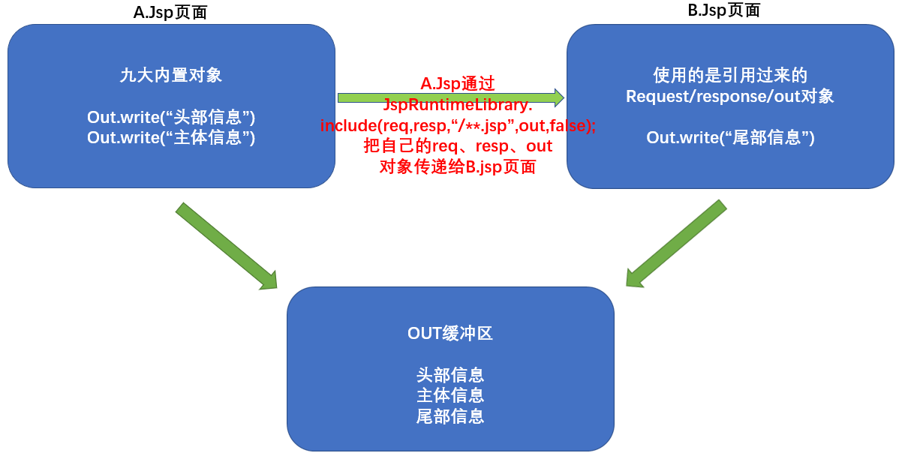


所以，当子页面的代码发生变化后，通过静态包含命令引入该子页面的主页面需要重新编译。而通过动态命令包含该子页面的主页面就不需要重新编译。

举个例子，现在有三个页面，分别为A.jsp，B.jsp和C.jsp

在A.jsp中，静态包含<%@include file="C.jsp" %>

在B.jsp中，动态包含<jsp:include page="C.jsp">

那么，当C.jsp被修改之后，就需要重新编译C.jsp和A.jsp，而B.jsp不需要重新编译

因此，对于内容会经常发生变化的子页面，通常使用动态包含命令来引用


### 转发

**语法：**`<jsp:forward page=""></jsp:forward>`

* page属性设置请求转发的路径

````jsp
<!--请求转发到Web.jsp页面-->
<jsp:forward page="/Web.jsp"></jsp:forward>
````


> JSP练习:输出一个表格，里面有10个学生信息。

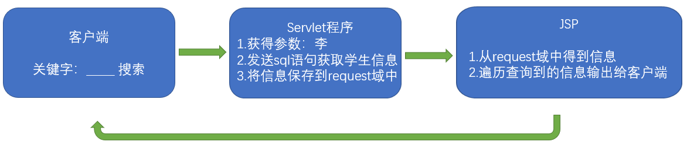

````java
//Student类
public class Student{
    private Integer id;
    private String name;
    private Integ erage;
    private String phone;
}

//SearchStudentServlet程序：
public class SearchStudentServlet extends HttpServlet{
    @Override
    protected void doGet(HttpServletRequest req,HttpServletResponse resp) throws ServletException,IOException{
        //获取请求的参数
        //发sql语句查询学生的信息
        //使用for循环生成查询到的数据做模拟
        List<Student> studentList = new ArrayList<Student>();
        for(int i=0;i<10;i++){
            int t=i+1;
            studentList.add(newStudent(t,"name"+t,18+t,"phone"+t));
        }
        //保存查询到的结果（学生信息）到request域中
        req.setAttribute("stuList",studentList);
        //请求转发到showStudent.jsp页面
        req.getRequestDispatcher("/test/showStudent.jsp").forward(req,resp);
    }
}
````

````jsp
<%@pageimport="java.util.List"%>
<%@pageimport="com.atguigu.pojo.Student"%>
<%@pageimport="java.util.ArrayList"%>
<%@pagecontentType="text/html;charset=UTF-8"language="java"%>
<html>
<head>
    <title>Title</title>
    <style>
        table{
            border:1pxblue solid;
            width:600px;
            border-collapse:collapse;
        }
        td,th{
            border:1px blue solid;
        }
    </style>
</head>
<body>
<%--练习二：jsp输出一个表格，里面有10个学生信息。--%>
    <%
        List<Student> studentList = (List<Student>)request.getAttribute("stuList");
    %>
    <table>
        <tr>
            <td>编号</td>
            <td>姓名</td>
            <td>年龄</td>
            <td>电话</td>
            <td>操作</td>
        </tr>
        <%for(Student student:studentList){%>
        <tr>
            <td><%=student.getId()%></td>
            <td><%=student.getName()%></td>
            <td><%=student.getAge()%></td>
            <td><%=student.getPhone()%></td>
            <td>删除、修改</td>
        </tr>
        <%}%>
    </table>
</body>
</html>
````


# EL/JSTL

**介绍**

* 属于是JSP的高级内容

* 为了简化JSP的使用

* EL表达式简化了JSP中的输出步骤(表达式脚本`<%= %>`)

* JSTL标签库替换了JSP中的代码脚本(`<% %>`)

**maven引入**

````xml
<dependency>
  <groupId>javax.servlet.jsp.jstl</groupId>
  <artifactId>jstl-api</artifactId>
  <version>1.2-rev-1</version>
</dependency>
<dependency>
  <groupId>taglibs</groupId>
  <artifactId>standard</artifactId>
  <version>1.1.2</version>
</dependency>
````

````xml
<!--由于JSTL也会引入自身一套的jsp-api和javax.servlet-api引用，而我们一般会自己引入这俩引用，所以会产生冲突-->
<dependency>
    <groupId>javax.servlet.jsp.jstl</groupId>
    <artifactId>jstl-api</artifactId>
    <version>1.2</version>
    <exclusions>
        <exclusion>
            <groupId>javax.servlet</groupId>
            <artifactId>servlet-api</artifactId>
        </exclusion>
        <exclusion>
            <groupId>javax.servlet.jsp</groupId>
            <artifactId>jsp-api</artifactId>
        </exclusion>
    </exclusions>
</dependency>
<dependency>
    <groupId>org.glassfish.web</groupId>
    <artifactId>jstl-impl</artifactId>
    <version>1.2</version>
    <exclusions>
        <exclusion>
            <groupId>javax.servlet</groupId>
            <artifactId>servlet-api</artifactId>
        </exclusion>
        <exclusion>
            <groupId>javax.servlet.jsp</groupId>
            <artifactId>jsp-api</artifactId>
        </exclusion>
        <exclusion>
            <groupId>javax.servlet.jsp.jstl</groupId>
            <artifactId>jstl-api</artifactId>
        </exclusion>
    </exclusions>
</dependency>
````


## EL表达式

Expression Language 表达式语言

**作用：**EL表达式简化了JSP中的输出步骤(表达式脚本`<%= %>`)，**EL输出的是域中的值**

````jsp
<body>
    <%
        request.setAttribute("key","值");
    %>
    <!--表达式脚本输出key的值是：-->
    <%=request.getAttribute("key1")==null ? "": request.getAttribute("key1")%><br/>
    <!--EL表达式输出key的值是：-->
    ${key1}
</body>
````

**格式：**`${表达式}` 

* EL表达式在输出null值的时候，输出的是空串。jsp表达式脚本输出null值的时候，输出的是null字符串。


**EL表达式搜索域数据的顺序**

EL表达式主要是输出域对象中的数据

当四个域中都有相同的key的数据的时候，EL表达式会按照四个域的从小到大的顺序去进行搜索，找到就输出。

输出顺序：`pageContext====>>>request====>>>session====>>>application`

````jsp
<body>
    <%
        //往四个域中都保存了相同的key的数据。
        request.setAttribute("key","request");
        session.setAttribute("key","session");
        application.setAttribute("key","application");
        pageContext.setAttribute("key","pageContext");
    %>
    ${key}
</body>
````

 

**EL表达式输出**

* **获取的属性必须有getXXX方法**

````java
public class person {
    public String name;
    public int age;
    public String[] hobby;
    public List<String> list;
    public Map<String,Object> map;

    public String getName() {
        return name;
    }

    public void setName(String name) {
        this.name = name;
    }
    //......
}
````

````jsp
<body>
    <%
        person person = new person();
        person.setName("rain");
        person.setAge(18);


        person.setHobby(new String[]{"java","javawen"});
        ArrayList<Object> list = new ArrayList<>();
        list.add("list1");
        list.add("list2");
        person.setList((List)list);

        Map<String, Object> map = new HashMap<>();
        map.put("key1","value1");
        map.put("key2","value2");
        person.setMap(map);

        pageContext.setAttribute("p",person);   //添加到pageContext域中
    %>

    ${p}
    ${p.name}
    ${p.age}
    ${p.hobby[1]}

    ${p.list}
    ${p.list[1]}

    ${p.map}
    ${p.map.key2}
</body>
````


### EL运算

**语法：**`${运算表达式}`

> **普通运算符**

普通运算符与Java一致，例`${5 == 5}`,`${1 + 2}`,`${1 == 1 && 2 == 2}`


>**empty运算**

**语法：**`${ empty 元素 }`

**作用：**判断一个数据是否为空，如果为空，则输出true,不为空输出false。

**几种为空的情况：**

1. 值为null值的时候，为空

2. 值为空串的时候，为空

3. 值是Object类型数组，长度为零的时候

4. list集合，元素个数为零

5. map集合，元素个数为零

````jsp
<body>
    <%
		//1、值为null值的时候，为空
        request.setAttribute("emptyNull", null);
		//2、值为空串的时候，为空
        request.setAttribute("emptyStr", "");
		//3、值是Object类型数组，长度为零的时候
        request.setAttribute("emptyArr", new Object[]{});
		//4、list集合，元素个数为零
        List<String> list = new ArrayList<>();
	    request.setAttribute("emptyList", list);
    
		//5、map集合，元素个数为零
    	Map<String,Object> map = new HashMap<String, Object>();
        request.setAttribute("emptyMap", map);
    %>
    ${ empty emptyNull } <br/>
    ${ empty emptyStr } <br/>
    ${ empty emptyArr } <br/>
    ${ empty emptyList } <br/>
    ${ empty emptyMap } <br/>
</body>
````


> **三目运算**

**语法：**`${表达式 ? 真 ： 假}`


> **.点运算符与[]运算符**

`.`点运算，可以输出Bean对象中某个属性的值

`[]`中括号运算，可以输出有序集合中某个元素的值。并且[]中括号运算，还可以输出map集合中key里含有特殊字符的key的值


`${sessionScope.user.sex}`等于`${sessionScope.user["sex"]}`


`.` 和 `[ ]` 也可以同时混合使用，如下：

`${sessionScope.shoppingCart[0].price}`回传结果为shoppingCart中第一项物品的价格。


**不过，以下两种情况，两者会有差异：**

* 当要存取的属性名称中包含一些特殊字符，如. 或 – 等并非字母或数字的符号，就一定要使用 [ ]
  * 错误：`${user.My-Name }`
  * 正确：`${user["My-Name"] }`

* 我们来考虑下列情况：`${sessionScope.user[data]}`
  * 此时，data 是一个变量，假若data的值为"sex"时，那上述的例子等于`${sessionScope.user.sex}；`
  * 假若data 的值为"name"时，它就等于`${sessionScope.user.name}`
  * 因此，如果要动态取值时，就可以用上述的方法来做，但无法做到动态取值。


### 隐含对象

EL表达式中有11个隐含对象，是EL表达式中自己定义的，**可以直接使用**。变量类型作用`pageContext`，`PageContextImpl`它可以获取jsp中的九大内置对象

| 对象             | 类型                 | 作用                                                         |
| ---------------- | -------------------- | ------------------------------------------------------------ |
| pageContext      | PageContextImpl      | 获取jsp中的九大内置对象（一个顶9个）                         |
| pageScope        | Map<String,Object>   | 获取pageContext域中的数据                                    |
| requestScope     | Map<String,Object>   | 获取Request域中的数据 （requestScope.后端设置的session名.value） |
| sessionScope     | Map<String,Object>   | 获取Session域中的数据（sessionScope.后端设置的session名）    |
| applicationScope | Map<String,Object>   | 获取ServletContext域中的数据                                 |
| param            | Map<String,String>   | 获取请求参数的值                                             |
| paramValues      | Map<String,String>   | 获取请求参数的值，获取前端有多个相同参数的值                 |
| header           | Map<String,String>   | 获取请求头的信息                                             |
| headerValues     | Map<String,String[]> | 获取请求头的信息，它可以获取多个值的情况                     |
| cookie           | Map<String,Cookie>   | 获取当前请求的Cookie信息                                     |
| initParam        | Map<String,String>   | 获取在web.xml中配置的\<context-param>上下文参数              |


> **获取四大域的数据**

| EL域对象         | 对应域对象     |
| ---------------- | -------------- |
| pageScope        | pageContext    |
| requestScope     | Request        |
| sessionScope     | Session        |
| applicationScope | ServletContext |

````jsp
<body>
    <%
        pageContext.setAttribute("key1", "pageContext1");
        pageContext.setAttribute("key2", "pageContext2");
        request.setAttribute("key2", "request");
        session.setAttribute("key2", "session");
        application.setAttribute("key2", "application");
    %>
    ${ applicationScope.key2 }  <!--指定获取ServletContext域中的对象-->
</body>
````


> **pageContext对象**

`pageContext`对象可以获取JSP中的九大对象，注意与JSP中的`pageContext`区分

| Expression                               | 说明                                                         |
| ---------------------------------------- | ------------------------------------------------------------ |
| ${pageContext.request.queryString}       | 取得请求的参数字符串                                         |
| ${pageContext.request.requestURL}        | 取得请求的URL，但不包括请求之参数字符串,即servlet的HTTP地址  |
| ${pageContext.request.contextPath}       | 服务的web application的名称                                  |
| ${pageContext.request.method}            | 取得HTTP的方法(GET、POST)                                    |
| ${pageContext.request.protocol}          | 取得使用的协议(HTTP/1.1、HTTP/1.0)                           |
| ${pageContext.request.remoteUser}        | 取得用户名称                                                 |
| ${pageContext.request.remoteAddr}        | 取得用户的IP地址                                             |
| ${pageContext.session.new}               | 判断session是否为新的，所谓新的session，表示刚由server产生而client尚未使用 |
| ${pageContext.session.id}                | 取得session的ID                                              |
| ${pageContext.servletContext.serverInfo} | 取得主机端的服务信息                                         |

````jsp
<body>
    <!--
    request.getScheme() 它可以获取请求的协议
    request.getServerName() 获取请求的服务器ip或域名
    request.getServerPort() 获取请求的服务器端口号
    getContextPath() 获取当前工程路径
    request.getMethod() 获取请求的方式（GET或POST）
    request.getRemoteHost()  获取客户端的ip 地址
    session.getId() 获取会话的唯一标识
    -->
    <%
        pageContext.setAttribute("req", request);
    %>
    <%=request.getScheme() %> <br>
    
    1.协议： ${ req.scheme }<br>
    2.服务器ip：${ pageContext.request.serverName }<br>
    3.服务器端口：${ pageContext.request.serverPort }<br>
    4.获取工程路径：${ pageContext.request.contextPath }<br>
    5.获取请求方法：${ pageContext.request.method }<br>
    6.获取客户端ip地址：${ pageContext.request.remoteHost }<br>
    7.获取会话的id编号：${ pageContext.session.id }<br>
</body>
````


> **其他对象**

````jsp
<!--获取请求参数的值-->
<!--http://localhost:8080/helloweb/ElTest.jsp?username=rain&password=337337&hobby=java&hobby=cpp-->
<body>
    输出请求参数username的值：${param.username}<br>
    输出请求参数password的值：${param.password}<br>
    输出请求参数username的值：${paramValues.username[0]}<br>
    输出请求参数hobby的值：${paramValues.hobby[0]}<br>
    输出请求参数hobby的值：${paramValues.hobby[1]}<br>
</body>

<!--获取请求头-->
<body>
	输出请求头【User-Agent】的值：${header['User-Agent']}<br>
	输出请求头【Connection】的值：${header.Connection}<br>
	输出请求头【User-Agent】的值：${headerValues['User-Agent'][0]}<br>
</body>

<!--获取cookie-->
<body>
	获取Cookie的名称：${cookie.JSESSIONID.name}<br>
	获取Cookie的值：${cookie.JSESSIONID.value}<br>
</body>

<!--获取web.xml中context-param标签中的值-->
<context-param>
    <param-name>username</param-name>
    <param-value>root</param-value>
</context-param>
<context-param>
    <param-name>hobby</param-name>
    <param-value>java</param-value>
</context-param>
<body>
	获取username的值：${initParam.username}
    获取hobby的值：${initParam.hobby}
</body>
````


## JSTL标签库

博客：[菜鸟教程](https://www.runoob.com/jsp/jsp-jstl.html)


JSTL全称是指JSP Standard Tag Library（JSP标准标签库）是一个不断完善的开放源代码的JSP标签库。

JSTL替换了JSP中的代码脚本(`<% %>`)


**JSTL由五个不同功能的标签库组成**

| 功能范围         | 前缀 | URI                                    |
| ---------------- | ---- | -------------------------------------- |
| 核心标签库--重点 | c    | http://java.sun.com/jsp/jstl/core      |
| 格式化           | fmt  | http://java.sun.com/jsp/jstl/fmt       |
| 函数             | fn   | http://java.sun.com/jsp/jstl/functions |
| 数据库(不使用)   | sql  | http://java.sun.com/jsp/jstl/sql       |
| XML(不使用)      | x    | http://java.sun.com/jsp/jstl/xml       |

**引入：**

1. 先导入jstl标签库的jar包 或 使用maven
   1. taglibs-standard-impl-1.2.1.jar
   2. taglibs-standard-spec-1.2.1.jar

2. 在jsp中使用`taglib`指令引入标签库

````jsp
<!--核心标签库-->
<%@ taglib prefix="c" uri="http://java.sun.com/jsp/jstl/core" %>

<!--FMT标签库-->
<%@ taglib prefix="fmt" uri="http://java.sun.com/jsp/jstl/fmt" %>

<!--FUNCTIONS标签库-->
<%@ taglib prefix="fn" uri="http://java.sun.com/jsp/jstl/functions" %>

<!--XML标签库-->
<%@ taglib prefix="x" uri="http://java.sun.com/jsp/jstl/xml" %>

<!--SQL标签库-->
<%@ taglib prefix="sql" uri="http://java.sun.com/jsp/jstl/sql" %>
````


### 核心库的使用

| 标签           | 描述                                                         |
| :------------- | :----------------------------------------------------------- |
| \<c:out>       | 用于在JSP中显示数据，就像<%= ... >                           |
| \<c:set>       | 用于保存数据                                                 |
| \<c:remove>    | 用于删除数据                                                 |
| \<c:if>        | 与我们在一般程序中用的if一样                                 |
| \<c:choose>    | 本身只当做\<c:when>和\<c:otherwise>的父标签                  |
| \<c:when>      | \<c:choose>的子标签，用来判断条件是否成立                    |
| \<c:otherwise> | \<c:choose>的子标签，接在\<c:when>标签后，当\<c:when>标签判断为false时被执行 |
| \<c:forEach>   | 基础迭代标签，接受多种集合类型                               |
| \<c:forTokens> | 根据指定的分隔符来分隔内容并迭代输出                         |
| \<c:redirect>  | 重定向至一个新的URL.                                         |
| \<c:import>    | 检索一个绝对或相对 URL，然后将其内容暴露给页面               |
| \<c:catch>     | 用来处理产生错误的异常状况，并且将错误信息储存起来           |
| \<c:param>     | 用来给包含或重定向的页面传递参数                             |
| \<c:url>       | 使用可选的查询参数来创造一个URL                              |


> **\<c:out>标签**

**作用：**`<c:out>`标签用来显示一个表达式的结果，与`<%= %>`作用相似，它们的区别就是`\<c:out>`标签可以直接通过"."操作符来访问属性。

举例来说，如果想要访问customer.address.street，只需要这样写：`<c:out value="customer.address.street">`

**格式：**`<c:out value="<string>" default="<string>" escapeXml="<true|false>"/>`

| 属性      | 描述                | 是否必要 | 默认值       |
| :-------- | :------------------ | :------- | :----------- |
| value     | 要输出的内容        | 是       | 无           |
| default   | 输出的默认值        | 否       | 主体中的内容 |
| escapeXml | 是否忽略XML特殊字符 | 否       | **true**     |

````jsp
<%@ page language="java" contentType="text/html; charset=UTF-8" pageEncoding="UTF-8"%>
<%@ taglib uri="http://java.sun.com/jsp/jstl/core" prefix="c" %>
<html>
<head>
<title>c:out 标签实例</title>
</head>
<body>
    <c:out value="&lt要显示的数据对象（未使用转义字符）&gt" escapeXml="true" default="默认值"></c:out><br/>
    <c:out value="&lt要显示的数据对象（使用转义字符）&gt" escapeXml="false" default="默认值"></c:out><br/>
    <c:out value="${null}" escapeXml="false">使用的表达式结果为null，则输出该默认值</c:out><br/>
</body>
</html>

<!--
&lt要显示的数据对象（未使用转义字符）&gt
<要显示的数据对象（使用转义字符）>
使用的表达式结果为null，则输出该默认值-->
````


> **\<c:set>标签**

**作用：**可以往域中保存数据(添加、修改)

**格式：**`<c:set var="<string>" value="<string>" target="<string>" property="<string>" scope="<string>"/>`

| **属性** | **描述**                                             | **是否必要** | **默认值** |
| :------- | :--------------------------------------------------- | :----------- | :--------- |
| scope    | var属性的作用域。page、request、session、application | 否           | Page       |
| var      | key                                                  | 否           | 无         |
| value    | value                                                | 否           | 主体的内容 |
| target   | 要修改的属性所属的对象                               | 否           | 无         |
| property | 要修改的属性                                         | 否           | 无         |

````jsp
<!--为session中的name设置值-->
保存之前：${ sessionScope.name }<br>
<c:set scope="session" var="name" value="rain"/>
保存之后：${ sessionScope.name }<br>
````


> **\<c:remove>标签**

**格式：**`<c:remove var="<string>" scope="<string>"/>`

| **属性** | **描述**         | **是否必要** | **默认值** |
| :------- | :--------------- | :----------- | :--------- |
| scope    | 变量所属的作用域 | 否           | 所有作用域 |
| var      | 要移除的变量名称 | 是           | 无         |

````jsp
<!--移除session中的name值-->
<c:remove scope="session" var="name">
````


> **\<c:if>标签**

**格式：**`<c:if test="<boolean>" var="<string>" scope="<string>">...</c:if>`

| **属性** | **描述**               | **是否必要** | **默认值** |
| :------- | :--------------------- | :----------- | :--------- |
| test     | 条件(使用EL表达式)     | 是           | 无         |
| var      | 用于存储条件结果的变量 | 否           | 无         |
| scope    | var属性的作用域        | 否           | page       |

````jsp
<c:if test="${ 12==12 }">
    <h1>12等于12</h1>
</c:if>
<c:if test="${ 12!=12 }">
    <h1>12不等于12</h1>
</c:if>
````


> **\<c:choose>, \<c:when>, \<c:otherwise> 标签**

**作用：**`<c:choose>`标签与Java switch语句的功能一样，可以嵌套使用

* `<c:when>`为switch语句中有case，`<c:otherwise>`为switch语句中有default

**格式：**

````jsp
<c:choose>
    <c:when test="<boolean>">
        ...
    </c:when>
    <c:when test="<boolean>">
        ...
    </c:when>
    ...
    ...
    <c:otherwise>
    ...
    </c:otherwise>
</c:choose>
````

只有`<c:when>`标签有属性

| **属性** | **描述**           | **是否必要** | **默认值** |
| :------- | :----------------- | :----------- | :--------- |
| test     | 条件(使用EL表达式) | 是           | 无         |

````jsp
<%
    request.setAttribute("height",180);
%>
<c:choose>
    <c:when test="${ requestScope.height > 190 }"><h2>一般</h2></c:when>
    <c:when test="${ requestScope.height > 180 }"><h2>还行</h2></c:when>
    <c:when test="${ requestScope.height > 170 }"><h2>废的</h2></c:when>
    <c:otherwise>
        <c:choose>
            <c:when test="${ requestScope.height > 160 }">
                <h3>大于160</h3>
            </c:when>
            <c:when test="${ requestScope.height > 150 }">
                <h3>大于150</h3>
            </c:when>
            <c:otherwise>
                <h3>潘长江？</h3>
            </c:otherwise>
        </c:choose>
    </c:otherwise>
</c:choose>
````


> **\<c:forEach/>**标签

**格式：**`<c:forEach items="<object>" begin="<int>" end="<int>" step="<int>" var="<string>" varStatus="<string>">`

| **属性**  | **描述**                                   | **是否必要** | **默认值**   |
| :-------- | :----------------------------------------- | :----------- | :----------- |
| begin     | 开始的元素（0=第一个元素，1=第二个元素）   | 否           | 0            |
| end       | 最后一个元素（0=第一个元素，1=第二个元素） | 否           | Last element |
| var       | 表示循环的变量(也是当前正在遍历到的数据)   | 否           | 无           |
| step      | 每一次迭代的步长                           | 否           | 1            |
| items     | 表示遍历的数据源（遍历的集合）             | 否           | 无           |
| varStatus | 代表循环状态的变量名称                     | 否           | 无           |

````jsp
<!--遍历1到10，输出-->
<c:forEach begin="1" end="10" var="i">
    <tr>
        <td>第${i}行</td>
    </tr>
</c:forEach>

<!--遍历Object数组-->
<%
    request.setAttribute("arr", new String[]{"18610541354","18688886666","18699998888"});
%>
<c:forEach items="${ requestScope.arr }" var="item">
    ${ item } <br>
</c:forEach>

<!--遍历Map集合-->
<%
    Map<String,Object> map = new HashMap<String, Object>();
    map.put("key1", "value1");
    map.put("key2", "value2");
    map.put("key3", "value3");

    request.setAttribute("map", map);
%>
<c:forEach items="${ requestScope.map }" var="entry">
	<h1>${entry.key} = ${entry.value}</h1>
</c:forEach>


<!--迭代标签 用于迭代集合-->
<%
	List<Student> users = new ArrayList<User>();
	users.add(new User("rain",28));
	users.add(new User("ropz",21));
	request.setAttrivute("users",users);
%>
<c:forEach items="${users}" var="user" begin="2" end="6" step="2" varStatus="userStatus">
    <span>${user.name}</span>:<span>${user.age}</span><br>

    计数：${userStatus.count} <br>
    步长：${userStatus.step} <br>
    开始位置： ${userStatus.begin} <br>
    结束位置：${userStatus.end} <br>
    下标：${userStatus.index} <br>
    是否是第一个：${userStatus.first} <br>
    是否是最后一个：${userStatus.last}<br>
</c:forEach>
````


> **\<c:redirect> 标签**

**作用：**重定向至一个新的URL

**格式：**`<c:redirect url="<string>" context="<string>"/>`

| **属性** | **描述**                         | **是否必要** | **默认值**   |
| :------- | :------------------------------- | :----------- | :----------- |
| url      | 目标URL                          | 是           | 无           |
| context  | 紧接着一个本地网络应用程序的名称 | 否           | 当前应用程序 |

````jsp
<c:redirect url="http://www.rainupup.cn"/>
````


# 文件上传&下载

**maven引入**

````xml
<dependency>
    <groupId>commons-io</groupId>
    <artifactId>commons-io</artifactId>
    <version>2.6</version>
</dependency>
<dependency>
    <groupId>commons-fileupload</groupId>
    <artifactId>commons-fileupload</artifactId>
    <version>1.4</version>
</dependency>
````


## 文件上传

**要求：**

* 要有一个form标签，`method=post`请求
* form标签的`encType`属性值必须为`multipart/form-data`值
* 在form标签中使用`input type=file`添加上传的文件
* 编写服务器代码（Servlet程序）接收，处理上传的数据。
* `encType=multipart/form-data`表示提交的数据，以多段（每一个表单项一个数据段）的形式进行拼接，然后以二进制流的形式发送给服务器


**常用类**

> ServletFileUpload类，用于解析上传的数据。

| 方法                                                         | 描述                                   |
| ------------------------------------------------------------ | -------------------------------------- |
| boolean ServletFileUpload.isMultipartContent(HttpServletRequest req) | 判断当前上传的数据格式是否是多段的格式 |
| List<FileItem> parseRequest(HttpServletRequest req)          | 解析上传的数据,泛型为FileItem类        |

> FileItem类，表示每一个表单项。是ServletFileUpload.parseRequest的返回结果

| 方法                    | 描述                                                         |
| ----------------------- | ------------------------------------------------------------ |
| FileItem.isFormField()  | 判断当前这个表单项，是否是普通的表单项。还是上传的文件类型。 |
| FileItem.getFieldName() | 获取表单项的name属性值，注意与getName()区分                  |
| FileItem.getString()    | 获取当前表单项的值                                           |
| FileItem.getName()      | 获取上传的文件名                                             |
| FileItem.write(file)    | 将上传的文件写到参数file所指向抽硬盘位置                     |


````html
<form action="uploadServlet" method="post" enctype="multipart/form-data">
    用户名：<input type="text" name="username"/><br>
    头像：<input type="file" name="photo"><br>
    <input type="submit" value="上传">
</form>
````

````java
public class UploadServlet extends HttpServlet {
    @Override
    protected void doPost(HttpServletRequest req, HttpServletResponse resp) throws ServletException, IOException {
        //1 先判断上传的数据是否多段数据（只有是多段的数据，才是文件上传的）
        if (ServletFileUpload.isMultipartContent(req)) {
			// 创建FileItemFactory工厂实现类
            FileItemFactory fileItemFactory = new DiskFileItemFactory();
            // 创建用于解析上传数据的工具类ServletFileUpload类
            ServletFileUpload servletFileUpload = new ServletFileUpload(fileItemFactory);
            try {
                // 解析上传的数据，得到每一个表单项FileItem
                List<FileItem> list = servletFileUpload.parseRequest(req);
                // 循环判断，每一个表单项，是普通类型，还是上传的文件
                for (FileItem fileItem : list) {

                    if (fileItem.isFormField()) {
                        // 普通表单项
                        System.out.println("表单项的name属性值：" + fileItem.getFieldName());
                        // 参数UTF-8.解决乱码问题
                        System.out.println("表单项的value属性值：" + fileItem.getString("UTF-8"));
                    } else {
                        // 上传的文件
                        System.out.println("表单项的name属性值：" + fileItem.getFieldName());
                        System.out.println("上传的文件名：" + fileItem.getName());
                        fileItem.write(new File("e:\\" + fileItem.getName()));
                    }
                }
            } catch (Exception e) {
                e.printStackTrace();
            }
        }
    }
}
````

## 文件下载

| 方法                                                         | 描述                                                         |
| ------------------------------------------------------------ | ------------------------------------------------------------ |
| response.getOutputStream()                                   | 获得一个对前端响应的输出流                                   |
| response.setHeader("Content-Disposition","attachment;fileName=1.jpg") | 这个响应头告诉浏览器。这是需要下载的。而attachment表示附件，也就是下载的一个文件。fileName=后面，表示下载的文件名。 |


**乱码问题**

> 方案一：URLEncoder解决IE和谷歌浏览器的附件中文名问题。

如果客户端浏览器是IE浏览器或者是谷歌浏览器。我们需要使用URLEncoder类先对中文名进行UTF-8的编码操作。

因为IE浏览器和谷歌浏览器收到含有编码后的字符串后会以UTF-8字符集进行解码显示。

````java
//把中文名进行UTF-8编码操作。
String str="attachment;fileName=" + URLEncoder.encode("中文.jpg","UTF-8");

//然后把编码后的字符串设置到响应头中
response.setHeader("Content-Disposition",str);
````


> 方案二：BASE64编解码解决火狐浏览器的附件中文名问题

如果客户端浏览器是火狐浏览器。那么我们需要对中文名进行BASE64的编码操作。

这时候需要把请求头Content-Disposition:attachment;filename=中文名

编码成为：

````https
Content-Disposition:attachment;filename==?charset?B?xxxxx?=
=?charset?B?xxxxx?=现在我们对这段内容进行一下说明。
=?
charset
B
xxxx
?=
````

 

**BASE64编解码操作：**因为火狐使用的是BASE64的编解码方式还原响应中的汉字。所以需要使用BASE64Encoder类进行编码操作。

````java
String ua=request.getHeader("User-Agent");
//判断是否是火狐浏览器
if(ua.contains("Firefox")){
    //使用下面的格式进行BASE64编码后
    String str="attachment;fileName=" + "=?utf-8?B?" + new BASE64Encoder().encode("中文.jpg".getBytes("utf-8")) + "?=";
    //设置到响应头中
    response.setHeader("Content-Disposition",str);
}else{
    //把中文名进行UTF-8编码操作。
    String str="attachment;fileName=" + URLEncoder.encode("中文.jpg","UTF-8");
    //然后把编码后的字符串设置到响应头中
    response.setHeader("Content-Disposition",str);
}
````


> 代码：(不知为什么火狐浏览器不会乱码)

````java
protected void doGet(HttpServletRequest req, HttpServletResponse resp) throws ServletException, IOException {
    String src = URLEncoder.encode("图片.jsp","UTF-8");
    resp.setHeader("content-disposition","attachment;filename=" + src);

    InputStream in = new FileInputStream(new File("D:\\Java\\java基础\\javaweb\\upload_download\\web\\tupian.jpg"));
    OutputStream op = resp.getOutputStream();

    byte[] buf = new byte[1024];
    int len = 0;
    while ((len = in.read(buf)) != -1) {
        op.write(buf,0,len);
    }
    in.close();
    op.close();
}
````


# Cookie/Session

## Cookie

**Cookie介绍**

1. Cookie翻译过来是饼干的意思。

2. Cookie是服务器通知客户端保存键值对的一种技术。

3. 客户端有了Cookie后，每次请求都发送给服务器。

4. 每个Cookie的大小不能超过4kb

**Cookie常用方法**

| 方法名称                    | 说明                               |
| --------------------------- | ---------------------------------- |
| void setMaxAge(int expiry)  | 设置cookie的有效期，以秒为单位     |
| void setValue(String value) | 在cookie创建后，为cookie赋予新的值 |
| String getName()            | 获取cookie的名称                   |
| String getValue()           | 获取cookie的值                     |
| int getMaxAge()             | 获取cookie的有效时间，以秒为单位   |
| void setPath(String uri)    | 设置cookie从客户端发送的路径       |

 

**创建Cookie**

````java
Cookie cookie = new Cookie("键", "值");  //创建Cookie
resp.addCookie(cookie);                 //通知客户端
````

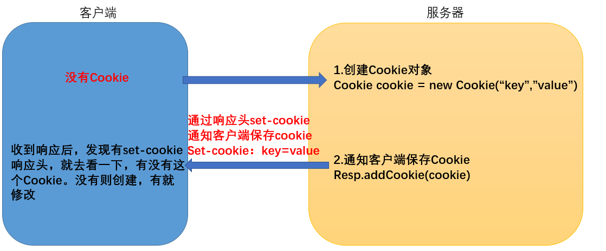

````java
protected void createCookie(HttpServletRequest req, HttpServletResponse resp) throws ServletException, IOException {
    //1 创建Cookie对象
    Cookie cookie = new Cookie("key4", "value4");
    //2 通知客户端保存Cookie  记住一定要通知
    resp.addCookie(cookie);
    //1 创建Cookie对象
    Cookie cookie1 = new Cookie("key5", "value5");
    //2 通知客户端保存Cookie
    resp.addCookie(cookie1);

    resp.getWriter().write("Cookie创建成功");
}
````


**获取Cookie**

````java
Cookie[] cookies = req.getCookies();
````

**修改Cookie**

````java

// 方案一:直接覆盖
Cookie cookie = new Cookie("key","value");
Cookie cookie = new Cookie("key","value被修改");

// 方案二：找到cookie，再使用setValue()设置
Cookie[] cookies = req.getCookies();
//通过遍历cookies找到cookie
cookie.setValue("key","value被修改");
````


**浏览器查看Cookie**


**Cookie生命控制：**Cookie的生命控制指的是如何管理Cookie什么时候被销毁（删除）

* setMaxAge()
  * 正数，表示在指定的秒数后过期
  * 负数，表示浏览器一关，Cookie就会被删除（默认值是-1）
  * 零，表示马上删除Cookie

````java
//设置存活1个小时的Cooie
protected void life3600(HttpServletRequest req, HttpServletResponse resp) throws ServletException, IOException {
    Cookie cookie = new Cookie("life3600", "life3600");
    cookie.setMaxAge(60 * 60); // 设置Cookie一小时之后被删除。无效
    resp.addCookie(cookie);
    resp.getWriter().write("已经创建了一个存活一小时的Cookie");
}
````

注意：修改、删除Cookie时，新建的Cookie除value、maxAge之外的所有属性，例如name、path、domain等，都要与原Cookie完全一样。否则，浏览器将视为两个不同的Cookie不予覆盖，导致修改、删除失败。


**Cookie的有效路径**

Cookie的path属性可以有效的过滤哪些Cookie可以发送给服务器。哪些不发。path属性是通过请求的地址来进行有效的过滤。

````
例：
CookieA      path=/工程路径
CookieB      path=/工程路径/abc

请求地址如下：
http://ip:port/工程路径/a.html 
CookieA      发送
CookieB      不发送
 
http://ip:port/工程路径/abc/a.html
CookieA     发送
CookieB     发送
结论：Cookie的发送必须被请求地址包含
````

````java
protected void testPath(HttpServletRequest req, HttpServletResponse resp) throws ServletException, IOException {
        Cookie cookie = new Cookie("path1", "path1");
        // getContextPath() ===>>>>  得到工程路径
        cookie.setPath(req.getContextPath() + "/abc"); // ===>>>>  /工程路径/abc
        resp.addCookie(cookie);
        resp.getWriter().write("创建了一个带有Path路径的Cookie");
}
````


**练习：**免用户名登录

````jsp
<form action="loginServlet" method="get">
    用户名:<input type="text" name="username" value="${cookie.username.value}"> <br/>
    密 码:<input type="password" name="password"><br/>                                     
    <input type="submit" value="登录">
</form>
````

````java
public class LoginServlet extends HttpServlet {
    @Override
    protected void doGet(HttpServletRequest req, HttpServletResponse resp) throws ServletException, IOException {
        String username = req.getParameter("username");
        String password = req.getParameter("password");

        if("rain".equals(username) && "123123".equals(password)){
            System.out.println("登录成功");
            Cookie nameCookie = new Cookie("username", username);

            nameCookie.setMaxAge(60 * 60 * 24 * 7);
            resp.addCookie(nameCookie);
        }else{
            System.out.println("登录失败");
        }
    }
}
````


## Session

**作用：**暂时存储，访问期间各个页面间共享的数据放在session中

 

**HttpSession的常用方法**

| 方法名                                       | 描述                                                         |
| -------------------------------------------- | ------------------------------------------------------------ |
| setAttribute(String attribute, Object value) | 设置Session属性。value参数可以为任何Java Object，value信息不宜过大 |
| getAttribute(String attribute)               | 返回Session属性                                              |
| getAttributeNames()                          | 返回Session中存在的属性名                                    |
| removeAttribute(String attribute)            | 移除Session属性                                              |
| getId()                                      | 返回Session的ID。该ID由服务器自动创建，不会重复              |
| getCreationTime()                            | 返回Session的创建日期。返回类型为long，常被转化为Date类型，例如：Date  createTime = new Date(session.getCreationTime()) |
| getLastAccessedTime()                        | 返回Session的最后活跃时间。返回类型为long                    |
| getMaxInactiveInterval()                     | 返回Session的超时时间。单位为秒。超过该时间没有访问，服务器认为该Session失效 |
| setMaxInactiveInterval(int second)           | 设置Session的超时时间。单位为秒                              |
| putValue(String attribute,Object value)      | 不推荐的方法。已经被setAttribute(String  attribute, Object Value)替代 |
| getValue(String attribute)                   | 不被推荐的方法。已经被getAttribute(String  attr)替代         |
| isNew()                                      | 返回该Session是否是新创建的                                  |
| invalidate()                                 | 使该Session失效                                              |

 

**什么是Session会话?**

1. Session就一个接口（HttpSession）。

2. Session就是会话。它是用来维护一个客户端和服务器之间关联的一种技术。

3. 每个客户端都有自己的一个Session会话(不同的浏览器)。

4. Session会话中，经常用来保存用户登录之后的信息。

 

**创建/获取Session**

| 方法                 | 描述                                                         |
| -------------------- | ------------------------------------------------------------ |
| request.getSession() | 第一次调用是：创建Session会话<br>之后调用都是：获取前面创建好的Session会话对象 |

````java
protected void createOrGetSession(HttpServletRequest req, HttpServletResponse resp) throws ServletException, IOException {
        // 创建和获取Session会话对象
        HttpSession session = req.getSession();
        // 判断 当前Session会话，是否是新创建出来的
        boolean isNew = session.isNew();
        // 获取Session会话的唯一标识 id
        String id = session.getId();

        resp.getWriter().write("得到的Session，它的id是：" + id + " <br /> ");
        resp.getWriter().write("这个Session是否是新创建的：" + isNew + " <br /> ");
}
````


**Session域数据的存取**

````java
//往Session中保存数据
protected void setAttribute(HttpServletRequest req, HttpServletResponse resp) throws ServletException, IOException {
    req.getSession().setAttribute("key1", "value1");
    resp.getWriter().write("已经往Session中保存了数据");
}

//获取Session域中的数据
protected void getAttribute(HttpServletRequest req, HttpServletResponse resp) throws ServletException, IOException {
    Object attribute = req.getSession().getAttribute("key1");
    resp.getWriter().write("从Session中获取出key1的数据是：" + attribute);
}
````


**Session生命周期控制**

Session默认的超时时间长为30分钟:因为在Tomcat服务器的配置文件web.xml中默认有以下的配置，它就表示配置了当前Tomcat服务器下所有的Session超时配置默认时长为：30分钟。

````xml
<session-config>
	<session-timeout>30</session-timeout>
</session-config>

<!--如果说。你希望你的web工程，默认的Session的超时时长为其他时长。你可以在你自己的web.xml配置文件中做以上相同的配置。
就可以修改你的web工程所有Seession的默认超时时长-->
<!--表示当前web工程。创建出来的所有Session默认是20分钟超时时长-->
<session-config>
	<session-timeout>20</session-timeout>
</session-config
````


如果只修改个别Session的超时时长,可以使用下面的API

| 方法                                 | 描述                                                         |
| ------------------------------------ | ------------------------------------------------------------ |
| setMaxInactiveInterval(int interval) | 设置Session的超时时间（以秒为单位），超过指定的时长，Session就会被销毁<br>    值为正数的时候，设定Session的超时时长<br>    负数表示永不超时（极少使用） |
| getMaxInactiveInterval()             | 获取Session的超时时间                                        |
| invalidate()                         | 让当前Session会话马上超时无效                                |

注意：

* `<session-timeout>`参数的单位为分钟，而`setMaxInactiveInterval(int s)`单位为秒。

* session超时指的是，客户端两次请求的最大间隔时长
  * 在session存活的情况下，刷新页面会重置session的时长


**Session原理**

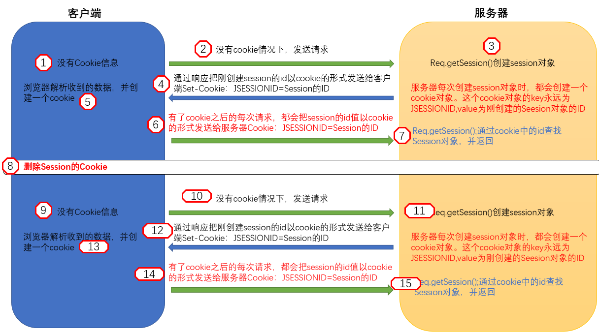

每个Servlet中只有一个Session对象，像Map一样储存着多个Key-value

````jsp
<!--1.jsp   （设置session）-->
<body>
    <%
        HttpSessionsession1=request.getSession();//获取session
        session1.setAttribute("username","zhangsan");//设置username
        session1.setAttribute("password","123123");//设置password
    %>
</body>
<!--2.jsp    (修改session)-->
<body>
    <%
        HttpSession session1=request.getSession();

        session1.setAttribute("username","lishi");//修改session中的username
        session1.setAttribute("password","456456");//修改session中的password
    %>
</body>
<!--3.jsp    (输出session)-->
<body>
    ${sessionScope.username}<!--输出session中的username-->
    ${sessionScope.password}<!--输出session中的password-->
</body>
````

````
①. 执行1.jsp 设置session
执行3.jsp 输出为   ：zhangsan 123123 

②. 执行2.jsp 修改session
执行3.jsp 输出为   ：lishi 456456

③. 再次执行1.jsp 设置session
执行3.jsp 输出为   ：zhangsan 123123 

④. 再次执行2.jsp 修改session
执行3.jsp 输出为   ：lishi 456456

⑤. 重新开启浏览器或重启tomcat
执行3.jsp 输出为   ：空
````


# <span id="filter">Filter 过滤器</span>

**介绍**

* javaweb的三大组件分别是：[Servlet程序](#servlet)、[Filter过滤器](#filter)、Listener监听器

* Filter过滤器它是JavaEE的规范。也就是接口
* Filter过滤器它的作用是：拦截请求，过滤响应
* 拦截请求常见的应用场景有：
  * 权限检查
  * 日记操作
  * 事务管理
  * …

**使用步骤：**

1. 编写一个类去实现`Filter`接口

2. 实现过滤方法`doFilter()`

3. 到web.xml中去配置Filter的拦截路径

4. 往下执行：`filterChain.doFilter(servletRequest,servletResponse);`
   1. 如果还有Filter，则执行下一个过滤器
   2. 没有，则执行目标资源


**生命周期**

1. 构造器方法

2. init 初始化方法

3. doFilter 过滤方法

4. destroy 销毁


**拦截路径**

````xml
<!--filter 标签用于配置一个 Filter 过滤器-->
<filter>
    <!--给 filter 起一个别名-->
    <filter-name>AdminFilter</filter-name>
    <!--配置 filter 的全类名-->
    <filter-clas>com.rain.filter.AdminFilter</filter-clas>
</filter>
<!--filter-maping配置 Filter过滤器的拦截路径-->
<filter-maping>
    <!--filter-name表示当前的拦截路径给哪个 filter使用-->
    <filter-name>AdminFilter</filter-name>
    <!--url-patern配置拦截路径-->
    <url-patern>/helloFilter</url-patern>
</filter-maping>
````

* 精确匹配

````xml
<url-patern>/target.jsp</url-patern>
<!--以上配置的路径，表示请求地址必须为：http:/ip:ort/工程路径/target.jsp-->
````

* 目录匹配

````xml
<url-patern>/admin/*</url-patern>
<!--以上配置的路径，表示请求地址必须为：htp:/ip:ort/工程路径/admin/*-->
````

* 后缀名匹配

````xml
<url-patern>*.html</url-patern>
<!--以上配置的路径，表示请求地址必须以.html 结尾才会拦截到-->

<url-patern>*.do</url-patern>
<!--以上配置的路径，表示请求地址必须以.do 结尾才会拦截到-->

<url-patern>*.action</url-patern>
<!--以上配置的路径，表示请求地址必须以.action 结尾才会拦截到-->
````

Filter 过滤器它只关心请求的地址是否匹配，不关心请求的资源是否存在！！


**特点**

* 所有Filter和目标资源默认都执性在同一个线程中
* 多个Filter共同执的时候，它们都使用一个Request对象
* 在多个Filter过滤器执性的时候，执性顺序由web.xml中的上下顺序决定

**多个Filter的执行顺序**

* 在web.xml中，filter执行顺序跟`<filter-mapping>`的顺序有关，先声明的先执行,执行顺序跟`<filter>`的顺序无关,`<filter-mapping>`的顺序才决定执行顺序
* 使用注解配置的话，filter的执行顺序跟名称的字母顺序有关，例如AFilter会比BFilter先执行
* 如果既有在web.xml中声明的Filter，也有通过注解配置的Filter，那么会优先执行web.xml中配置的Filter


## Filter初体验

要求：在你的web 工程下，有一个admin目录。这个admin目录下的所有资源（html 页面、jpg 图片、jsp 文件、等）都必须是用户登录之后才允许访问。直接访问/admin下的文件会跳转到login.jsp页面，只有登录后，才可以正常访问/admin下的文件

web.xml配置

```xml
<servlet>
    <servlet-name>login</servlet-name>
    <servlet-class>com.rain.LoginTest</servlet-class>
</servlet>
<servlet-mapping>
    <servlet-name>login</servlet-name>
    <url-pattern>/login</url-pattern>
</servlet-mapping>

<filter>
    <filter-name>filterTest</filter-name>
    <filter-class>com.rain.FilterTest</filter-class>
</filter>
<filter-mapping>
    <filter-name>filterTest</filter-name>
    <url-pattern>/admin/*</url-pattern>
</filter-mapping>
```

拦截代码

```java
public class FilterTest implements Filter {
    @Override
    public void doFilter(ServletRequest servletRequest, ServletResponse servletResponse, FilterChain filterChain) throws IOException, ServletException {
        HttpServletRequest req = (HttpServletRequest) servletRequest;
        HttpSession session = req.getSession();
        Object user = session.getAttribute("user");
		// 如果等于 null，说明还没有登录
        if(user == null){
            req.getRequestDispatcher("/login.jsp").forward(servletRequest,servletResponse);
        }else{
            // 让程序继续往下访问用户的目标资源 放行,必须要有，否则不往下执行
            filterChain.doFilter(servletRequest,servletResponse);
        }
    }
}
```

login.jsp

```jsp
<%@ page contentType="text/html;charset=UTF-8" language="java" %>
<html>
<head>
    <title>登录</title>
</head>
<body>
    <form action="login" method="post">
        用户名:<input type="text" name="username"><br>
        密码:<input type="password" name="password"><br>
        <input type="submit">
    </form>
</body>
</html>
```

登录程序

```java
public class LoginTest extends HttpServlet {
    @Override
    protected void doPost(HttpServletRequest req, HttpServletResponse resp) throws ServletException, IOException {
        String username = req.getParameter("username");
        String password = req.getParameter("password");

        System.out.println(username);
        System.out.println(password);
        if("rain".equals(username) && "337337".equals(password)){
            HttpSession session = req.getSession();
            session.setAttribute("user",username);
            resp.getWriter().write("登录成功");
        }else {
            resp.getWriter().write("登录失败");
            req.getRequestDispatcher("/login.jsp").forward(req,resp);
        }
    }
}
```


## FilterConfig

* `FilterConfig`类与`ServletConfig`类相似

* `FilterConfig`类是Filter过滤器的配置文件类

* Tomcat每次创建Filter的时候，也会同时创建一个`FilterConfig`类，这里包含了Filter配置文件的配置信息

* 在实现了`Filter`类的`init(FilterConfig filterConfig)`中使用

**作用**

* 获取Filter的名称`filter-name`的内容
* 获取在Filter中配置的`init-parm`初始化参数
* 获取`ServletContext`对象

**方法**

| 方法                                | 描述                                     |
| ----------------------------------- | ---------------------------------------- |
| filterConfig.getFilterName()        | 获取Filter的名称filter-name的内容        |
| filterConfig.getInitParmetr(String) | 获取在web.xml中配置的init-parm初始化参数 |
| filterConfig.getServletContext      | 获取ServletContext对象                   |

```java
public class FilterTest implements Filter {
    @Override
    public void init(FilterConfig filterConfig) throws ServletException {
        // 1、获取 Filter 的名称 filter-name 的内容
        System.out.println(filterConfig.getFilterName());
		// 2、获取在 web.xml 中配置的 int-parm 初始化参数
        System.out.println(filterConfig.getInitParameter("username"));
        System.out.println(filterConfig.getInitParameter("password"));
        // 3、获取 ServletContext 对象
        System.out.println(filterConfig.getServletContext());
    }
    @Override
    public void doFilter(ServletRequest servletRequest, ServletResponse servletResponse, FilterChain filterChain) throws IOException, ServletException {
    }
}
```

```xml
<filter>
    <filter-name>filterTest</filter-name>
    <filter-class>com.rain.FilterTest</filter-class>
    <init-param>
        <param-name>username</param-name>
        <param-value>rain</param-value>
    </init-param>
    <init-param>
        <param-name>password</param-name>
        <param-value>337337</param-value>
    </init-param>
</filter>
```

 

# JSON

**maven引入**

````xml
<!--引入Gson-->
<dependency>
    <groupId>com.google.code.gson</groupId>
    <artifactId>gson</artifactId>
    <version>2.8.2</version>
</dependency>
<!--json-->
<dependency>
    <groupId>net.sf.json-lib</groupId>
    <artifactId>json-lib</artifactId>
    <version>2.4</version>
    <classifier>jdk15</classifier>
</dependency>
````

* JSON(JavaScript Object Notation)是一种轻量级的数据交换格式。易于人阅读和编写。同时也易于机器解析和生成。JSON采用完全独立于语言的文本格式，而且很多语言都提供了对json的支持（包括C,C++,C#,Java,JavaScript,Perl,Python 等）。这样就使得JSON成为理想的数据交换格式。 
* json是一种轻量级的数据交换格式(与XML相比)。 
* 数据交换指的是客户端和服务器之间业务数据的传递格式。


## Json与JavaScript

**定义:**json是由键值对组成，并且由`{ }`花括号包围。每个键由`""`引号包括，键和值之间使用`:`冒号进行分隔，多组键值对之间由`,`逗号进行分隔

````json
var jsonObj = { 
    "key1":12, 
    "key2":"abc",
    "key3":true,
    "key4":[11,"arr",false],
    "key5":{
        "key5_1":551,
        "key5_2":"key5_2_value"
    },
    "key6":[{
        "key6_1_1":6611, 
        "key6_1_2":"key6_1_2_value"
        },{
            "key6_21":621,
            "key6_2":key6_2_value"
    }]
};
````


**访问**

* json本身是一个对象
* json中的key我们可以理解为是对象中的一个属性
* json中的key访问就跟访问对象的属性一样:`json 对象.key`

````js
alert(typeof(jsonObj);// object json 就是一个对象
alert(jsonObj.key1); //12
alert(jsonObj.key2); // abc
alert(jsonObj.key3); // true
alert(jsonObj.key4);// 得到数组[1,"ar",false]
//json 中 数组值的遍历
for(var i = 0; i < jsonObj.key4.length; i++) {
    alert(jsonObj.key4[i]);
}
alert(jsonObj.key5.key5_1);//51
alert(jsonObj.key5.key5_2);//key5_2value
alert(jsonObj.key6 );// 得到 json 数组
// 取出来每一个元素都是 json 对象
var jsonItem = jsonObj.key6[0];
// alert( jsonItem.key6_1 ); /61
alert( jsonItem.key6_12 ); /key6_12_value
````


**常用方法(前端自带，不需要导包)**

一般有两种存在形式

| 形式       | 作用                                                     |
| ---------- | -------------------------------------------------------- |
| json对象   | 要操作json中的数据的时候，需要json对象的格式             |
| json字符串 | 要在客户端和服务器之间进行数据交换的时候，使用json字符串 |

| 方法                     | 描述                 |
| ------------------------ | -------------------- |
| JSON.stringify(JSON对象) | json对象转json字符串 |
| JSON.parse(JSON字符串)   | json字符串转json对象 |

````js
//把json对象转换成为json字符串
var jsonObjString = JSON.stringify(jsonObj); //特别像Java中对象的toString
alert(jsonObjString)

//把json字符串。转换成为json对象
var jsonObj2 = JSON.parse(jsonObjString);
alert(jsonObj2.key1);    //12
alert(jsonObj2.key2);    //abc
````


## Json与Java

JSON在java中的使用需要导入谷歌提供的GSON.jar包

````xml
<!--引入Gson-->
<dependency>
    <groupId>com.google.code.gson</groupId>
    <artifactId>gson</artifactId>
    <version>2.8.2</version>
</dependency>
<!--引入json-->
<dependency>
    <groupId>net.sf.json-lib</groupId>
    <artifactId>json-lib</artifactId>
    <version>2.4</version>
    <classifier>jdk15</classifier>
</dependency>
````


**JavaBean和Json字符串的互转**

| 方法                               | 描述                 |
| ---------------------------------- | -------------------- |
| json Gson.toJson(javaBean)         | JavaBean转Json字符串 |
| Gson.fromJson(json,javaBean.class) | Json字符串转JavaBean |

````java
@Test
public void Test1(){
    person person = new person();
    person.setName("rain");
    person.setAge(18);
    
    // 创建Gson对象实例
    Gson gson = new Gson();
    // JavaBean --> Json字符串
    String JsonPerson = gson.toJson(person);
    System.out.println(JsonPerson);
    // Json字符串 --> JavaBean 
    person personBean = gson.fromJson(JsonPerson, person.class);
    System.out.println(personBean);
}
````


**List和Json字符串的互转**

```java
public void Test2(){
    List<Object> personList = new ArrayList<>();
    personList.add(new person("rain",18));
    personList.add(new person("ropz",15));

    // 创建Gson对象实例
    Gson gson = new Gson();
    
    // List --> Json字符串
    String personListJson = gson.toJson(personList);
    System.out.println(personListJson);
    //Json字符串 --> List
    List<person> list = gson.fromJson(personListJson, new PersonListJson().getType());
    System.out.println(list.get(0).name);
    System.out.println(list.get(0).age);
}
```

需要编写一个类继承`TypeToken`类，泛型类写具体的类型,其中`getTyep()`方法就是第二个参数

```java
public class PersonListJson extends TypeToken<ArrayList<person>> {
}
```

 

**MAP和Json的互转**

```java
@Test
public void Test3(){
    HashMap<Integer, person> PersonMap = new HashMap<>();
    PersonMap.put(1,new person("rain",18));
    PersonMap.put(2,new person("ropz",18));

    Gson gson = new Gson();

    String PersonMapJson = gson.toJson(PersonMap);
    System.out.println(PersonMapJson);
	
    //使用匿名内部类，简化代码
    HashMap PersonMapBean = gson.fromJson(PersonMapJson, new TypeToken<HashMap<Integer, person>>(){}.getType());
    person person =(person) PersonMapBean.get(1);
    System.out.println(person.name);
}
```


# AJAX请求

**介绍**

* Asynchronous Javscript And XML(异步 JavScript 和 XML)，一种创建交互式网页应用的网页开发技术。
* 浏览器通过JavaScript异步发起请求，局部更新页面的技术。Ajax请求的局部更新，浏览器地址栏不会发生变化,不会舍弃原来页面的内容
* AJAX 不是新的编程语言，而是一种使用现有标准的新方法(由下列技术组合而成)

  * 使用CSS和XHTML来表示
  * 使用DOM模型来交互和动态显示
  * 使用`XMLHttpRequest`来和服务器进行异步通信
  * 使用javascript来绑定和调用

* AJAX 的核心是 `XMLHttpRequest` 对象(不同的浏览器创建 XMLHttpRequest 对象的方法是有差异的)
  * IE 浏览器使用`ActiveXObject`，而其他的浏览器使用名为`XMLHttpRequest`的 JavaScript 内建对象

**原理**

Ajax的工作原理相当于在用户和服务器之间加了一个中间层(AJAX引擎)，使用户操作与服务器响应异步化。并不是所有的用户请求都提交给服务器。一些数据验证和数据处理等都交给Ajax引擎自己来做，只有确定需要从服务器读取新数据时再由Ajax引擎代为向服务器提交请求。

1. 网页中发生一个事件（页面加载、按钮点击）
2. 由 JavaScript 创建 `XMLHttpRequest` 对象
3. `XMLHttpRequest` 对象向 web 服务器发送请求
4. 服务器处理该请求
5. 服务器将响应发送回网页
6. 由 JavaScript 读取响应
7. 由 JavaScript 执行正确的动作（比如更新页面）


## XMLHttpRequest对象

`XMLHttpRequest`对象是AJAX的核心,用于同服务器交换数据。这意味着可以更新网页的部分，而不需要重新加载整个页面。

**创建XMLHttpRequest**

几乎所有浏览器(除IE5/6)都内建了`XMLHttpRequest`对象(在js中直接使用，不需要导入)

````js
var xmlHttpRequest = new XMLHttpRequest();

//IE
var xmlHttpRequest= new ActiveXObject("Microsoft.XMLHTTP");
````


**方法**

| 方法                     | 描述                                                         |
| ------------------------ | ------------------------------------------------------------ |
| new XMLHttpRequest()     | 创建 XMLHttpRequest 对象                                     |
| open(method, url, async) | 规定请求<br>method：请求类型 GET 或 POST<br/>url：服务器端脚本的URL<br/>async：true（异步）或 false（同步） |
| send()                   | 将请求发送到服务器，用于 GET 请求                            |
| send(*string*)           | 将请求发送到服务器，用于 POST 请求<br>参数的示例:name=myName&value=myValue |
| setRequestHeader()       | 向要发送的报头添加标签/值对                                  |
| getResponseHeader()      | 返回请求头信息                                               |
| getAllResponseHeaders()  | 返回所有的请求头信息                                         |


**属性**

> onreadystatechange属性

定义当`readyState`属性发生变化时被调用的函数

````js
xmlHttpRequest.onreadystatechange = function() {
//我们需要在这写一些代码
}
````


>readyState属性

readyState属性存有服务器响应的状态信息。**每当`readyState`改变时，`onreadystatechange`函数就会被执行。**

| 状态 | 描述                                                         |
| ---- | ------------------------------------------------------------ |
| 0    | 请求未初始化（在调用open()之前）                             |
| 1    | 请求已提出（调用send()之前）                                 |
| 2    | 请求已发送（这里通常可以从响应得到内容头部）                 |
| 3    | 请求处理中（响应中通常有部分数据可用，但是服务器还没有完成响应） |
| 4    | 请求已完成（可以访问服务器响应并使用它）                     |

向这个`onreadystatechange`函数添加一条If语句，测试响应是否已完成(意味着可获得数据)：

````js
xmlHttpRequest.onreadystatechange = function() {
    if (xmlHttp.readyState == 4) {
        //从服务器的response获得数据
    }
}
````


> responseText属性

通过`responseText`属性来取回由服务器返回的数据。

````js
document.getElementById("span").innerText = xmlRequest.responseText;
````


> status属性

返回请求的状态号

* 200: "OK"
* 403: "Forbidden"
* 404: "Not Found"


**回调函数**

回调函数`xmlHttpRequest.onreadystatechange=function{}`,`function{}`内部就是回调函数的内容。所谓回调函数，就是请求在后台处理完，再返回到前台所实现的功能。

````js
xmlHttpRequest.onreadystatechange = function (){
    if(xmlHttpRequest.readyState == 4 && xmlHttpRequest.status == 200){
        // 把响应的数据显示在页面上
        document.getElementById("span").innerText = xmlHttpRequest.responseText;
    }
}
````


**状态值与状态码**

* AJAX状态值：运行AJAX所经历过的几种状态，无论访问是否成功都将响应的步骤，可以理解成为AJAX运行步骤。
  * 如：正在发送，正在响应等，由AJAX对象与服务器交互时所得；使用`ajax.readyState`获得。（由数字1~4单位数字组成）
* AJAX状态码，无论AJAX访问是否成功，由HTTP协议根据所提交的信息，服务器所返回的HTTP头信息代码，该信息使用`ajax.status`所获得；
  * `1XX`：请求收到，继续处理
  * `2XX`：操作成功收到，分析、接受
  * `3XX`：完成此请求必须进一步处理
  * `4XX`：请求包含一个错误语法或不能完成
  * `5XX`：服务器执行一个完全有效请求失败

**请求**

* GET 比 POST 更简单更快，可用于大多数情况下。

* 不过，请在以下情况始终使用 POST：

  * 缓存文件不是选项（更新服务器上的文件或数据库）

  * 向服务器发送大量数据（POST 无大小限制）

  * 发送用户输入（可包含未知字符），POST 比 GET 更强大更安全

````js
//GET
xmlHttpRequest.open("GET", "http://localhost:8080/helloweb/ajax?username=" + document.getElementById("username").value, true);
xmlHttpRequest.send();

//POST
//增加time随机参数，防止读取缓存 
var params = "userName="+document.getElementsByName("userName")[0].value+"&userPass="+document.getElementsByName("userPass")[0].value+"&time="+Math.random();
// 向请求添加 HTTP 头，POST如果有数据一定加加！！！！
xmlHttp.setRequestHeader("Content-type", "application/x-www-form-urlencoded;charset=UTF-8");         
xmlHttp.send(params);
````


> **案例：判断用户名是否可用**


```jsp
<%@ page contentType="text/html;charset=UTF-8" language="java" %>
<html>
<head>
    <title>ajax</title>
    <script type="text/javascript">
        // 在这里使用javaScript语言发起Ajax请求，访问服务器AjaxServlet中javaScriptAjax
        window.onload = function (){
            document.getElementById("username").onmouseout = function (){
                //1、我们首先要创建XMLHttpRequest 
                var xmlRequest = new XMLHttpRequest();
                //2、调用open方法设置请求参数
                xmlRequest.open("get","http://localhost:8080/helloweb/ajax?username=" + document.getElementById("username").value,true);
                //4、在send方法前绑定onreadystatechange事件，处理请求完成后的操作。
                xmlRequest.onreadystatechange = function (){
                    if(xmlRequest.readyState == 4 && xmlRequest.status == 200){
                        var text = xmlRequest.responseText;
                        // 把响应的数据显示在页面上
                        document.getElementById("span").innerText = text;
                    }
                }
                //3、调用send方法发送请求
                xmlRequest.send();
            }
        }
    </script>
</head>
<body>
<form action="login" method="post">
    用户名:<input type="text" id="username"><span id="span"></span><br>
    密码:<input type="password" id="password"><br>
    <input type="submit">
</form>
</body>
</html>
```

```java
public class Ajax extends HttpServlet {
    @Override
    protected void doGet(HttpServletRequest req, HttpServletResponse resp) throws ServletException, IOException {
        req.setCharacterEncoding("UTF-8");
        resp.setContentType("text/html;charset=UTF-8");
        String username = req.getParameter("username");
        System.out.println(username);
        if("rain".equals(username)){
            resp.getWriter().write("userExist");
        }else{
            resp.getWriter().write("userNotExist");
        }
    }
}
```


## JQuery与AJAX

补充：jQuery需要引入自己的库

| 参数        | 描述                                                         |
| ----------- | ------------------------------------------------------------ |
| url         | 请求的地址                                                   |
| type        | 请求的类型GET或POST请求                                      |
| data        | 发送给服务器的数据 格式有两种：①name=value&name=value ②{key:value} |
| success     | 请求成功，响应的回调函数                                     |
| dataType    | 响应的数据类型text、xml、json                                |
| error       | 请求失败函数内容                                             |
| timeout     | 请求超时时间，单位为毫秒，数值表示                           |
| cache       | 是否缓存请求结果，bool表示                                   |
| contentType | 内容类型，默认为"application/x-www-form-urlencoded"          |
| complete    | 请求完成后调用的函数，无论请求是成功还是失败，都会调用该函数；如果设置了success与error函数，则该函数在它们之后被调用 |
| async       | 是否异步处理，bool表示，默认为true；设置该值为false后，JS不会向下执行，而是原地等待服务器返回数据，并完成相应的回调函数后，再向下执行 |
| username    | 访问认证请求中携带的用户名，字符串表示                       |
| password    | 返回认证请求中携带的密码，字符串表示                         |

````js
$.ajax({
    //请求方式
    type:'POST/GET',
    //发送请求的地址
    url:'地址',
    //服务器返回的数据类型
    dataType:'json',
    //发送到服务器的数据，对象必须为key/value的格式，jquery会自动转换为字符串格式
    data:{name:xxx,age:xxx},
    success:function(data){
        //请求成功函数内容
    },
    error:function(jqXHR){
        //请求失败函数内容
    }
});
````

**简化**

| 参数     | 描述           |
| -------- | -------------- |
| url      | 请求的url地址  |
| data     | 发送的数据     |
| callback | 成功的回调函数 |
| type     | 返回的数据类型 |

````js
$.get('地址',{
    //发送至服务器的数据，格式为key/value
    number:xxx  
},function(data){
    //请求成功时的callback
},'json');//json为返回内容的格式
````

````js
$.post('地址',{
    //发送至服务器的数据，格式为key/value
    number:xxx
},function(data){
    //请求成功时的callback
},'json');//json为返回内容的格式
````

````js
//如果确定服务器返回的是Json形式，则可以进一步简化
$.getJSON(
    "地址",
    {name: 'jenny'},
    function(data) {
       //请求成功函数内容
    }
);
````


**表单序列化** serialze()

* `serialze()`可以把表单中所有表单项的内容都获取到，并以`name=value&name=value`的形式进行拼接
* `serialize()`方法通过序列化表单值，创建URL编码文本字符串
* `serialize()`作用于一个jQuery对象，能够将DOM元素内容序列化为字符串,用于Ajax请求


```jsp
<!DOCTYPE html PUBLIC "-//W3C//DTD HTML 4.01 Transitional//EN" "http://www.w3.org/TR/html4/loose.dtd">
<html>
<head>
    <meta http-equiv="pragma" content="no-cache" />
    <meta http-equiv="cache-control" content="no-cache" />
    <meta http-equiv="Expires" content="0" />
    <meta http-equiv="Content-Type" content="text/html; charset=UTF-8">
    <title>Insert title here</title>
    <script type="text/javascript" src="script/jquery-1.7.2.js"></script>
    <script type="text/javascript">
        $(function(){
            // ajax请求
            $("#ajaxBtn").click(function(){
                $.ajax({
                    url:"http://www.rainupup.cn/ajax",
                    // data:"action=jQueryAjax",
                    data:{action:"jQueryAjax"},
                    type:"GET",
                    success:function (data) {
                        // alert("服务器返回的数据是：" + data);
                        // var jsonObj = JSON.parse(data);
                        $("#msg").html(" ajax 编号：" + data.id + " , 姓名：" + data.name);
                    },
                    dataType : "json"
                });
            });

            // ajax--get请求
            $("#getBtn").click(function(){
                $.get("http://www.rainupup.cn/ajax","action=jQueryGet",function (data) {
                    $("#msg").html(" get 编号：" + data.id + " , 姓名：" + data.name);
                },"json");
            });

            // ajax--post请求
            $("#postBtn").click(function(){
                // post请求
                $.post("http://www.rainupup.cn/ajax","action=jQueryPost",function (data) {
                    $("#msg").html(" post 编号：" + data.id + " , 姓名：" + data.name);
                },"json");
            });

            // ajax--getJson请求
            $("#getJSONBtn").click(function(){
                $.getJSON("http://www.rainupup.cn/ajax","action=jQueryGetJSON",function (data) {
                    $("#msg").html(" getJSON 编号：" + data.id + " , 姓名：" + data.name);
                });
            });

            // ajax请求
            $("#submit").click(function(){
                // 把参数序列化
                $.getJSON("http://www.rainupup.cn/ajax","action=jQuerySerialize&" + $("#form01").serialize(),function (data) {
                    $("#msg").html(" Serialize 编号：" + data.id + " , 姓名：" + data.name);
                });
            });
        });
    </script>
</head>
<body>
<div>
    <button id="ajaxBtn">$.ajax请求</button>
    <button id="getBtn">$.get请求</button>
    <button id="postBtn">$.post请求</button>
    <button id="getJSONBtn">$.getJSON请求</button>
</div>
<div id="msg"></div>

<br/><br/>
<form id="form01" >
    用户名：<input name="username" type="text" /><br/>
    密码：<input name="password" type="password" /><br/>
    下拉单选：<select name="single">
    <option value="Single">Single</option>
    <option value="Single2">Single2</option>
</select><br/>
    下拉多选：
    <select name="multiple" multiple="multiple">
        <option selected="selected" value="Multiple">Multiple</option>
        <option value="Multiple2">Multiple2</option>
        <option selected="selected" value="Multiple3">Multiple3</option>
    </select><br/>
    复选：
    <input type="checkbox" name="check" value="check1"/> check1
    <input type="checkbox" name="check" value="check2" checked="checked"/> check2<br/>
    单选：
    <input type="radio" name="radio" value="radio1" checked="checked"/> radio1
    <input type="radio" name="radio" value="radio2"/> radio2<br/>
</form>
<button id="submit">提交--serialize()</button>
</body>
</html>
```

