# Maven

**作用：**

* maven可以管理jar文件
* 自动下载jar及其文档，源代码
* 管理jar直接的依赖，a.jar需要b.jar，maven会自动下载b.jar
* 管理需要的jar版本
* 编译程序，把java编译为class
* 测试代码是否正确
* 打包文件，形成jar文件，或者war文件
* 部署项目


**构建：**

1. 清理，把之前项目编译的东西删除掉，为新的编译代码做准备。

2. 编译，把程序源代码编译为执行代码(java--->class文件)
   1. 批量的，maven可以同时把成千上百的文件编译为class。
   2. javac不一样，javac一次编译一个文件。

3. 测试，maven可以执行测试程序代码，验证你的功能是否正确。(maven可以同时执行多个测试代码，同时测试很多功能)

4. 报告，生成测试结果的文件

5. 打包，将项目中所有的class，配置文件等所有资源放到一个压缩文件中。
   1. 这个压缩文件就是项目的结果文件，通常java程序的压缩文件是jar扩展名
   2. 对于web应用，压缩文件扩展名是.war

6. 安装，将5中生成的文件jar，war安装到本机仓库

7. 部署，将程序安装好可以执行。


**maven核心概念:**

* POM：文件名称是pom.xml,pom翻译过来叫做项目对象模型。 
  * maven把一个项目当做一个模型使用。控制maven构建项目的过程，管理jar依赖。 
* 约定的目录结构：maven项目的目录和文件的位置都是规定的。
* 坐标：一个唯一的字符串，用来表示资源的。
* 依赖管理：管理项目可以使用jar文件
* 仓库管理：资源存放的位置
* 生命周期：maven工具构建项目的过程，就是生命周期。
* 插件和目标：执行maven构建的时候用的工具是插件
* 继承
* 聚合


**目录**

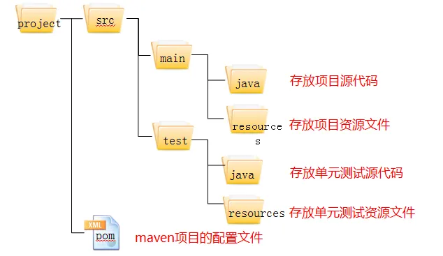


**基本命令：**

| 命令    | 描述                                                         |
| ------- | ------------------------------------------------------------ |
| -v      | 查询Maven版本                                                |
| compile | 编译主程序(main下的java)会在当前目录下生成一个 target,里边存放编译主程序之后生成的字节码文件 |
| test    | 执行test目录下的测试用例                                     |
| package | 将项目打成jar包                                              |
| clean   | 删除target文件夹                                             |
| install | 将当前项目放到Maven的本地仓库中                              |


**仓库：**存放maven使用的jar和项目使用的jar

* 本地仓库：设置本地仓库，在maven安装目录/conf/settings.xml修改`<localRepository>`指定仓库目录（不要使用中文目录）

* 远程仓库: Maven官方提供的远程仓库

当项目编译时，Maven首先从本地仓库中寻找项目所需的Jar包，若本地仓库没有，再到Maven的中央仓库下载所需Jar包。


## 坐标

坐标是Jar包的唯一标识，Maven通过坐标在仓库中找到项目所需的Jar包。

````xml
<groupId>公司域名的倒写</groupId>
<artifactId>自定义项目名称</artifactId>
<version>自定版本号</version>
````

* `groupId `     所需Jar包的项目名
* `artifactId`  所需Jar包的模块名
* `version `     所需Jar包的版本号

[maven源]( https://mvnrepository.com/)：使用`groupId` 或者 `artifactId`作为搜索条件，搜索使用的中央仓库


## 依赖

传递依赖：如果我们的项目引用了一个Jar包，而该Jar包又引用了其他Jar包，那么在默认情况下项目编译时，Maven会把直接引用和间接引用的Jar包都下载到本地。

使用`<dependencies>` 和`<dependency>`定义依赖

````xml
<dependencies>
    <dependency>
        <groupId>mysql</groupId>
        <artifactId>mysql-connector-java</artifactId>
        <version>5.1.9</version>
    </dependency>
</dependencies>
````

排除依赖：使用`<exclusions>`和`<exclusion>`排除依赖

````xml
<dependency>
    <groupId></groupId>
    <artifactId></artifactId>
    <version></version>
    <exclusions>
        <exclusion>
            <groupId></groupId>
            <artifactId></artifactId>
            <version></version>
        </exclusion>
    </exclusions>
</dependency>

````


## 依赖范围

````xml
<dependencies>
    <dependency>
        <scope></scope>
    </dependency>
</dependencies>
````

| 范围       | 描述                                                       |
| ---------- | ---------------------------------------------------------- |
| compile    | 默认范围，用于编译                                         |
| provided   | 在运行主程序和测试程序时起作用的属性，在打包和部署时不参与 |
| runtime    | 在执行时需要使用                                           |
| test       | 测试过程中使用的jar包，以test范围依赖进来。比如junit。     |
| system     | 需要外在提供相应的元素。通过systemPath来取得               |
| systemPath | 仅用于范围为system。提供相应的路径                         |
| optional   | 当项目自身被依赖时，标注依赖是否传递。用于连续依赖时使用   |

| 范围     | main目录 | test目录 | 开发过程 | 部署到服务器 |
| -------- | -------- | -------- | -------- | ------------ |
| compile  | 有效     | 有效     | 有效     | 有效         |
| test     | 无效     | 有效     | 有效     | 无效         |
| provided | 有效     | 有效     | 有效     | 无效         |

provided理解:别人提供所以不需要

````xml
<!--例：-->
<dependency>
   <groupId>javax.servlet</groupId>
   <artifactId>javax.servlet-api</artifactId>
   <version>3.1.0</version> 
   <scope>provided</scope> 提供者
</dependency>
<!--因为servlet是tomcat自带的，所以在打包或部署时不需要提供，只需要在运行或测试时提供-->
````


## 属性

`properties`标签设置属性

**常用属性**

````xml
<properties>
    <!--maven构建项目使用的编码-->
    <project.build.sourceEncoding>UTF-8</project.build.sourceEncoding>
    <!--编译代码使用的jdk版本-->
    <maven.compiler.source>8</maven.compiler.source>
    <!--运行程序使用的版本-->
    <maven.compiler.target>8</maven.compiler.target>
</properties>
````

**全局变量**

1. 在`<properties>`通过自定义标签声明变量
2. 在pom.xml文件中的其它位置，使用`${标签名}`使用变量的值

````xml
<properties>
    <rain-junit>4.11</rain-junit>
</properties>

<dependencies>
    <dependency>
      <groupId>junit</groupId>
      <artifactId>junit</artifactId>
      <version>${rain-junit}</version>
      <scope>test</scope>
    </dependency>
</dependencies>
````


## 插件

`build` 设置maven在进行项目的构建时，配置信息。例如指定编译java代码使用的jdk的版本等

**插件配置**

```xml
<!--控制配置maven构建项目的参数配置,设置jdk的版本-->
<build>
	<!--配置插件-->
    <plugins>
    	<!--配置具体的插件-->
        <plugin>
            <groupId>org.apache.maven.plugins</groupId>
			<!--插件的名字-->
            <artifactId>maven-compiler-plugin</artifactId>
			<!--插件的版本-->
            <version>3.8.1</version>
			<!--配置插件的信息-->
            <configuration>
				<!--告诉maven我们写的代码是在jdk1.8上编译的-->
                <source>1.8</source>
				<!--我们的程序应该运行在1.8的jdk上-->
                <target>1.8</target>
            </configuration>
        </plugin>
    </plugins>
</build>
<!--或者-->
<properties>
    <project.build.sourceEncoding>UTF-8</project.build.sourceEncoding>
    <maven.compiler.source>8</maven.compiler.source>
    <maven.compiler.target>8</maven.compiler.target>
</properties>
```


## 聚合

使用一个总工程将各个模块工程汇集起来，作为一个整体对应完整的项目。

* 一键执行Maven命令：很多构建命令都可以在“总工程”中一键执行。

  以 mvn install 命令为例：Maven 要求有父工程时先安装父工程；有依赖的工程时，先安装被依赖的工程。我们自己考虑这些规则会很麻烦。但是工程聚合之后，在总工程执行 mvn install 可以一键完成安装，而且会自动按照正确的顺序执行。

* 配置聚合之后，各个模块工程会在总工程中展示一个列表，让项目中的各个模块一目了然。

```xml
<modules>  
    <module>java01-maven-module</module>
    <module>java02-maven-module</module>
</modules>
```


## 继承

**作用：**在父工程中统一管理项目中的依赖信息

* 对一个比较大型的项目进行了模块拆分。
* 一个project下面，创建了很多个module。
* 每一个module都需要配置自己的依赖信息。


**要求：**

* 父类中的`packaging`标签的文本内容必须设置为`pom`
* 把src目录删除掉

* 在父类中使用`dependencyManagement`标签包裹`dependencyManagement`标签

**父类**

```xml
<project>
    <modelVersion>4.0.0</modelVersion>

    <!--定义父类的名称-->
    <groupId>com.bjpowernode.maven</groupId>
    <artifactId>001-maven-parent</artifactId>
    <version>1.0.0</version>

    <!--如果继承方式是子类在父类文件夹下-->
    <!--包含的子工程-->
    <modules>
        <module>javaweb_maven02</module>
        <module>java_maven01</module>
    </modules>

    <!--父管理依赖的版本号-->
    <properties>
        <!--通常管理依赖版本号的标签名称由 = 项目名称+字段version-->
        <junit-version>4.10</junit-version>
        <mysql-connector-java-version>8.0.19</mysql-connector-java-version>
        <dubbo.version>2.6.2</dubbo.version>
        <spring-webmvc-version>4.3.16.RELEASE</spring-webmvc-version>
    </properties>


    <!--父工程要加强管理子模块的所有依赖-->
    <dependencyManagement>
        <!--父工程添加的依赖,所有子模块会无条件的云继承-->
        <dependencies>
            <dependency>
                <groupId>junit</groupId>
                <artifactId>junit</artifactId>
                <version>${junit-version}</version>
            </dependency>
        </dependencies>
    </dependencyManagement>
    
    <build>
        <plugins>
            <!--JDK1.8编译插件-->
            <plugin>
                <artifactId>maven-compiler-plugin</artifactId>
                <version>3.1</version>
                <configuration>
                    <source>1.8</source>
                    <target>1.8</target>
                </configuration>
            </plugin>
        </plugins>
    </build>
</project>
```

**子类**

````xml
<project>
    <!--定义自己的名称-->
    <modelVersion>4.0.0</modelVersion>
    <artifactId>004-maven-java-1</artifactId>
    
    <!--如果继承方式是子类不在父类文件夹下-->
    <parent>
        <artifactId>002-maven-java</artifactId>
        <groupId>com.bjpowernode.maven</groupId>
        <version>1.0.0</version>
        <relativePath>../002-maven-java/pom.xml</relativePath>
    </parent>

    <!--如果继承方式是子类在父类文件夹下-->
    <parent>
            <artifactId>父类的名字</artifactId>
            <groupId>父类的组ID</groupId>
            <version>父类的版本号</version>
    </parent>

    <dependencies>
        <dependency>
            <groupId>mysql</groupId>
            <artifactId>mysql-connector-java</artifactId>
        </dependency>
    </dependencies>
</project>
````


# 标签总结

```xml
<?xml version="1.0" encoding="UTF-8"?>
<project xmlns="http://maven.apache.org/POM/4.0.0"
         xmlns:xsi="http://www.w3.org/2001/XMLSchema-instance"
         xsi:schemaLocation="http://maven.apache.org/POM/4.0.0 http://maven.apache.org/xsd/maven-4.0.0.xsd">
    <!--遵循哪一个POM模型版本-->
    <modelVersion>4.0.0</modelVersion>

    <!--工程的基础信息-->
    <groupId>org.example</groupId>
    <artifactId>SpringTest</artifactId>
    <packaging>pom</packaging>
    <version>1.0-SNAPSHOT</version>

    <!--项目产生的构件类型，例如jar、war、ear、pom。-->
    <packaging>war</packaging>

    <!--子工程-->
    <modules>
        <module>子工程</module>
    </modules>

    <!--父工程-->
    <parent>
        <artifactId/>
        <groupId/>
        <version/>
    </parent>

    <!--项目构建环境中的前提条件-->
    <properties>
        <java.version>1.8</java.version>
        <maven.compiler.source>1.8</maven.compiler.source>
        <maven.compiler.target>1.8</maven.compiler.target>
        <!--自定义标签-->
        <sofen.name>小聂</sofen.name>
    </properties>

	<!--dependencyManagement 子项目继承父项目，不需要写版本号-->
    <dependencyManagement>
        <dependencies>
            <dependency>
                <groupId></groupId>
                <artifactId></artifactId>
                <version></version>
                <type></type>
                <scope></scope>
                <!--排除依赖-->
                <exclusions>
                    <exclusion>
                        <artifactId></artifactId>
                        <groupId></groupId>
                    </exclusion>
                </exclusions>
            </dependency>
        </dependencies>
    </dependencyManagement>


    <build>
        <!--插件-->
        <plugins>
            <plugin>
                <groupId>org.apache.maven.plugins</groupId>
                <artifactId>maven-compiler-plugin</artifactId>
                <version>3.5.1</version>
                <configuration>
                    <source>1.8</source>
                    <target>1.8</target>
                </configuration>
            </plugin>
        </plugins>
        
        <resources>                   //引入资源
            <resource>
                <directory>src/main/java</directory><!--所在的目录-->
                <includes><!--包括目录下的.properties,.xml 文件都会扫描到-->
                    <include>**/*.properties</include>
                    <include>**/*.xml</include>
                </includes>
                <!--filtering 选项 false 不启用过滤器， *.property 已经起到过滤的作用了 -->
                <filtering>false</filtering>
            </resource>
        </resources>
    </build>
</project>
```


# IDEA

## 配置

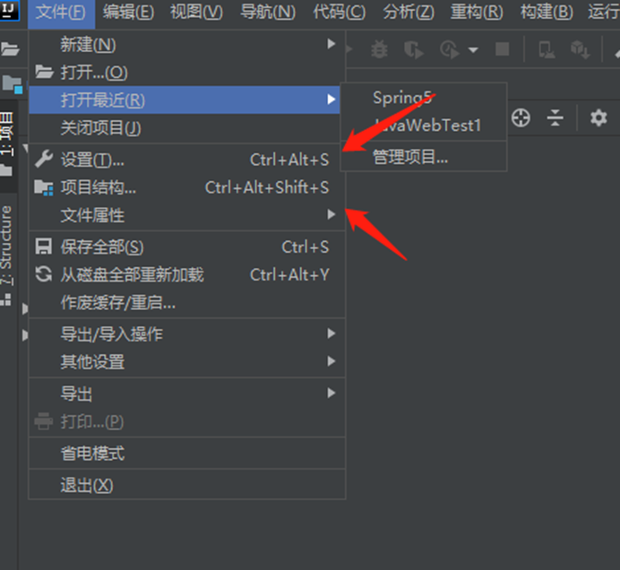


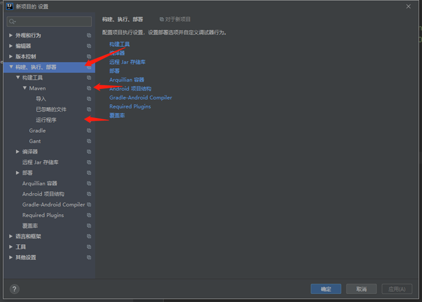

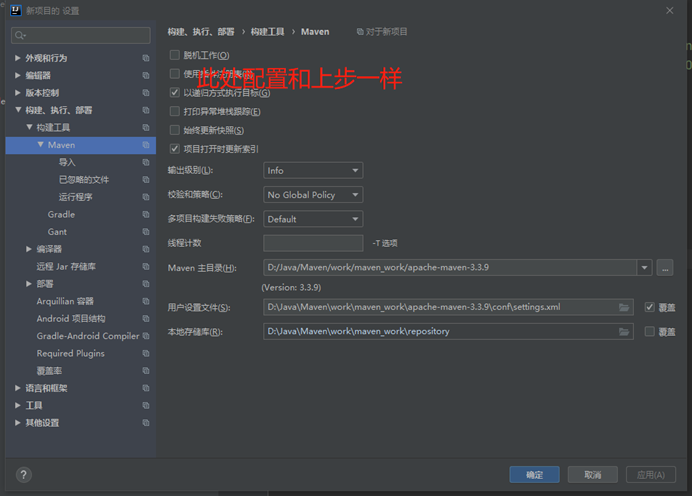


刷新

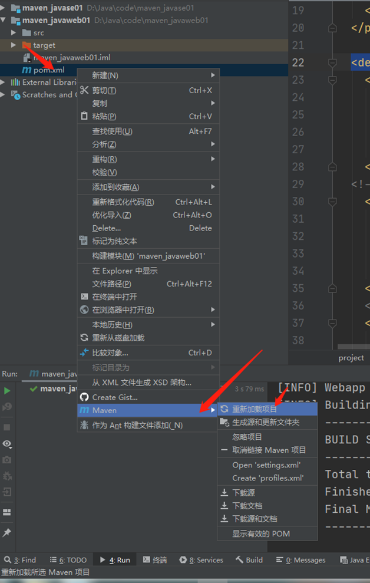

或者


 

maven工具


 

**导包**

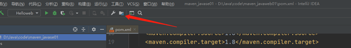

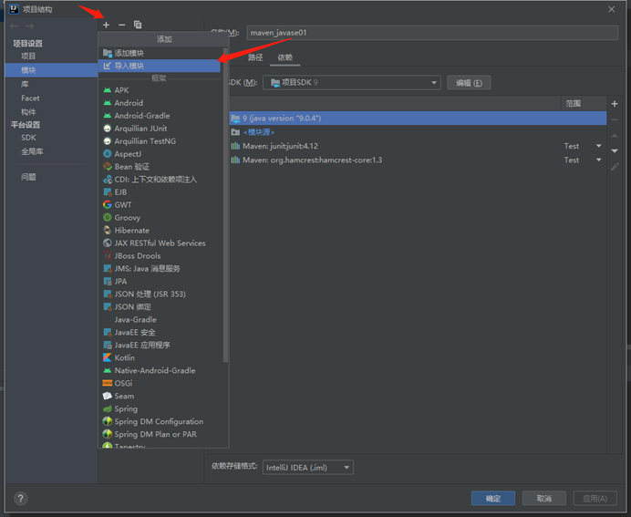


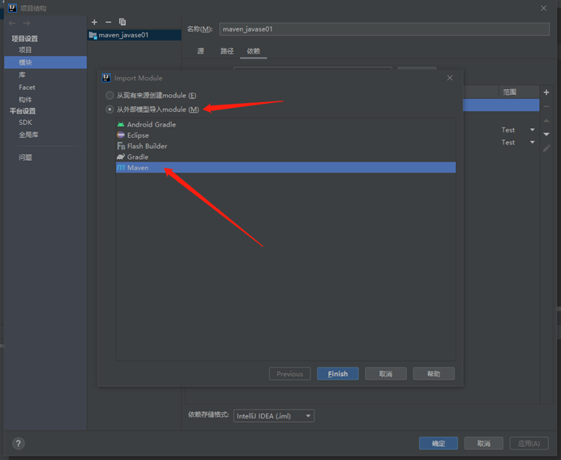

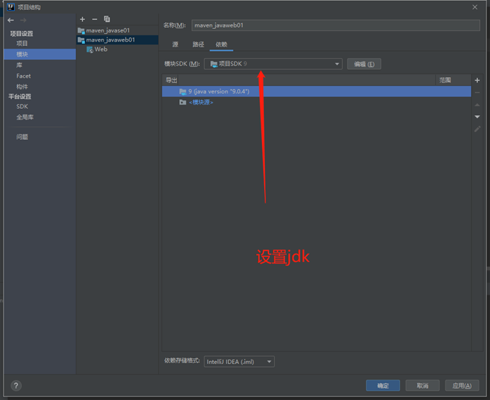

 

## 普通项目

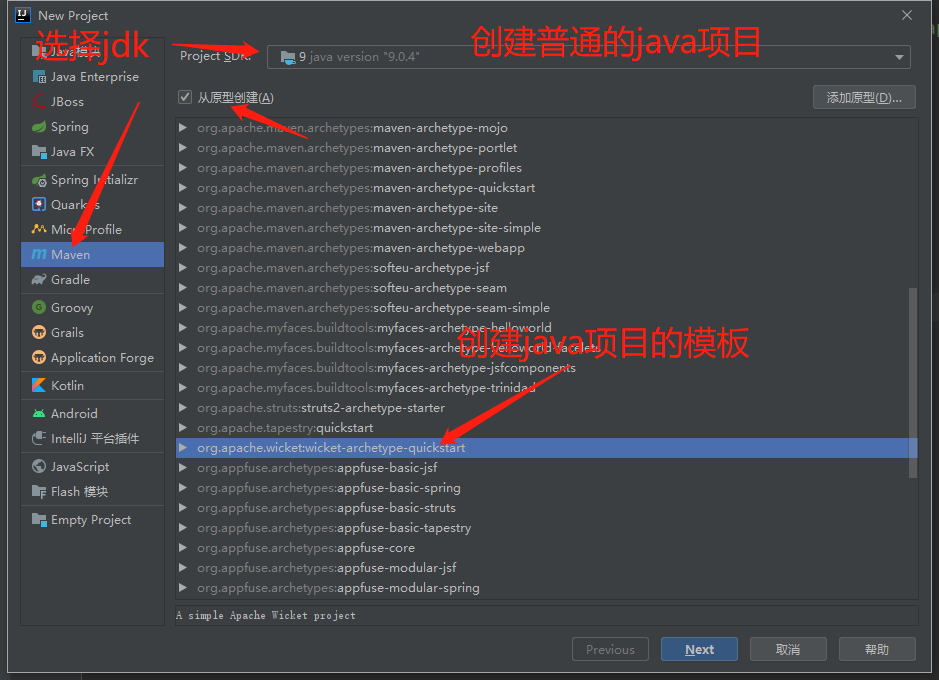


## WEB项目


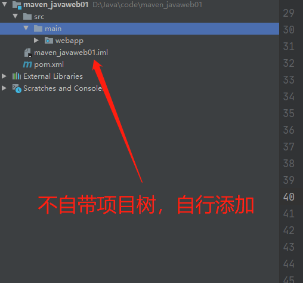