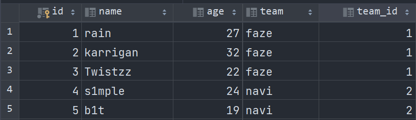
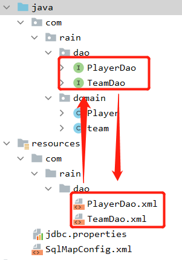
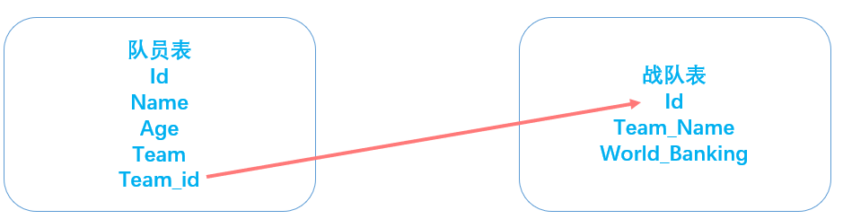

# 简介

mybatis是一款半自动的ORM持久层框架，具有较高的SQL灵活性，支持高级映射(一对一，一对多)，动态SQL，延迟加载和缓存等特性，但它的数据库无关性较低

ORM：Object Relation Mapping，对象关系映射。对象指的是Java对象，关系指的是数据库中的关系模型，对象关系映射，指的就是在Java对象和数据库的关系模型之间建立一种对应关系

**maven**

````xml
<dependency>
    <groupId>org.mybatis</groupId>
    <artifactId>mybatis</artifactId>
    <version>3.5.7</version>
</dependency>
````


**步骤**

1. 编写全局配置文件
2. 编写mapper映射文件
3. 加载全局配置文件，生成SqlSessionFactory
4. 创建SqlSession，调用mapper映射文件中的SQL语句来执行CRUD操作


# 核心API

**Resources：** 获取数据源

通过`InputStream resource = Resources.getResourceAsStream("配置文件");`获得数据源


**SqlSessionFactoryBuilder**

读取全局配置文件，得到数据源信息，创建连接工厂`SqlSessionFactory`。它的特点是，当创建了`SqlSessionFactory`对象之后，这个类就不需要了。因此，它的最佳范围是存在于方法体内，也就是局部变量。

通过`sqlSessionFactory = new SqlSessionFactoryBuilder().build(resource);`获得`SqlSessionFactory`类

**SqlSessionFactory**

连接工厂；创建`SqlSession`实例的工厂。它的特点是，SqlSessionFactory对象一旦被创建，就无法销毁或者再创建，也不建议多次创建SqlSessionFactory对象。因此，它的最佳范围是应用（Application）范围内。

通过`SqlSession sqlSession = sqlSessionFactory.openSession();`获得`SqlSession`类

自动提交：`sqlSessionFactory.openSession(ture)`


**SqlSession**

会话对象类，SqlSession 完全包含了面向数据库执行SQL命令所需的所有方法。可以通过SqlSession实例来直接执行已映射的 SQL语句。

| 方法                     | 描述                   |
| ------------------------ | ---------------------- |
| select(String var1)      | 执性查询语句           |
| selectList(String var1)  | 执性查询语句，返回集合 |
| insert(String var1)      | 执性插入语句           |
| getMapper(Class<T> var1) | 获取代理实现类         |
| commit()                 | 提交sql                |
| close()                  | 关闭                   |

```java
//1.读取配置文件
resource = Resources.getResourceAsStream("SqlMapConfig.xml");
//2.创建SqlSessionFactory工厂
sqlSessionFactory = new SqlSessionFactoryBuilder().build(resource);
//3.使用工厂生产SqlSession对象
sqlSession = sqlSessionFactory.openSession();
```


# 入门案例


## 基于原生Dao

原生Dao构建起来麻烦，不常用。一般使用基于Mapper代理

**数据库**



**对应Java类**

```java
public class Player implements Serializable {
    private int id;
    private String name;
    private String team;
    private int age;
    private int team_id;
}
```

**核心配置文件**

```xml
<?xml version="1.0" encoding="UTF-8"?>
<!DOCTYPE configuration PUBLIC "-//mybatis.org//DTD Config 3.0//EN" "http://mybatis.org/dtd/mybatis-3-config.dtd">
<configuration>
    <properties resource="jdbc.properties"/>

    <environments default="mysql">
        <environment id="mysql">
            <transactionManager type="JDBC"></transactionManager>
            <dataSource type="POOLED">
                <property name="driver" value="${jdbc.driver}"/>
                <property name="url" value="${jdbc.url}"/>
                <property name="username" value="${jdbc.username}"/>
                <property name="password" value="${jdbc.password}"/>
            </dataSource>
        </environment>
    </environments>
    <mappers>
        <package name="com.rain.dao"/>
    </mappers>
</configuration>
```

**映射文件**

```xml
<?xml version="1.0" encoding="UTF-8"?>
<!DOCTYPE mapper PUBLIC "-//mybatis.org//DTD Mapper 3.0//EN" "http://mybatis.org/dtd/mybatis-3-mapper.dtd">
<mapper namespace="com.rain.dao.PlayerDao">
	<!--查找所有-->
    <select id="findAllPlayer" resultType="com.rain.domain.Player">
        select * from player;
    </select>
	<!--插入-->
    <insert id="insert" parameterType="com.rain.domain.Player">
        <selectKey keyProperty="id" keyColumn="id" resultType="int" order="AFTER">
            select last_insert_id();
        </selectKey>
        insert into player(name,age,team,team_id) values (#{name},#{age},#{team},#{team_id});
    </insert>
	<!--删除-->
    <delete id="delete" parameterType="Integer">
        delete from player where id = #{value};
    </delete>
	<!--更新-->
    <update id="update" parameterType="com.rain.domain.Player">
        update player set name=#{name},age=#{age},team=#{team} where id = #{id};
    </update>
</mapper>
```

**Dao类**

```java
public class PlayersDao {
    private SqlSessionFactory sqlSessionFactory;
    public PlayersDao() throws IOException {
        InputStream resource = Resources.getResourceAsStream("SqlMapConfig.xml");
        sqlSessionFactory = new SqlSessionFactoryBuilder().build(resource);
    }

    public List<Player> findAllPlayer(){
        SqlSession sqlSession = sqlSessionFactory.openSession();
        List<Player> playerAll = sqlSession.selectList("findAllPlayer");   //指定mapper.xml的哪个方法
        return playerAll;
    }

    public Integer insert(Player player){
        SqlSession sqlSession = sqlSessionFactory.openSession();
        return sqlSession.insert("insert", player);
    }
    public void update(Player player){
        SqlSession sqlSession = sqlSessionFactory.openSession();
        sqlSession.update("update",player);
    }
    public void delete(Integer id){
        SqlSession sqlSession = sqlSessionFactory.openSession();
        sqlSession.delete("delete",id);
    }
}
```

**测试**

```java
public class Test1 {

    @Test
    public void test1() throws IOException {
        PlayersDao playersDao = new PlayersDao();
        List<Player> player = playersDao.findAllPlayer();
        System.out.println(player.toString());
    }
    @Test
    public void test2() throws IOException {
        PlayersDao playersDao = new PlayersDao();
        Integer insert = playersDao.insert(new Player(4, "ropz", "faze", 22, 1));
        System.out.println(insert);
    }
}
```


## 基于Mapper代理


**基于Mapper代理的示例**

相较于原生Dao的写法，基于Mapper代理可以省略dao类，只需要创建一个接口。全局配置文件和mapper.xml文件是最基本的配置，仍然需要

```java
public interface PlayerDao {
    public Player findPlayerById(Integer id);
    public int findTotal();
    public List<Player> findPlayerByName(String name);
    public List<Player> findAllPlayer();

    public Integer insert(Player player);
    public void update(Player player);
    public void delete(Integer id);
}
```

**映射文件**

```xml
<?xml version="1.0" encoding="UTF-8"?>
<!DOCTYPE mapper PUBLIC "-//mybatis.org//DTD Mapper 3.0//EN" "http://mybatis.org/dtd/mybatis-3-mapper.dtd">
<mapper namespace="com.rain.dao.PlayerDao">
    <select id="findPlayerById" parameterType="int" resultType="com.rain.domain.Player">
        select * from player where id = #{id};
    </select>

    <select id="findPlayerByName" parameterType="String" resultType="com.rain.domain.Player">
        select * from player where name like '%${value}%';
        <!--select * from player where name like #{value};-->
    </select>

    <select id="findAllPlayer" resultType="com.rain.domain.Player">
        select * from player;
    </select>

    <insert id="insert" parameterType="com.rain.domain.Player">
        <selectKey keyProperty="id" keyColumn="id" resultType="int" order="AFTER">
            select last_insert_id();
        </selectKey>
        insert into player(name,age,team,team_id) values (#{name},#{age},#{team},#{team_id});

    </insert>

    <delete id="delete" parameterType="Integer">
        delete from player where id = #{value};
    </delete>

    <update id="update" parameterType="com.rain.domain.Player">
        update player set name=#{name},age=#{age},team=#{team} where id = #{id};
    </update>

    <select id="findTotal" resultType="Integer">
        select count(*) from player;
    </select>
</mapper>
```

**测试**

```java
public class Test {
    InputStream resource;
    SqlSessionFactory sqlSessionFactory;
    SqlSession sqlSession;
    @Before
    public void init() throws IOException {
        resource = Resources.getResourceAsStream("SqlMapConfig.xml");
        sqlSessionFactory = new SqlSessionFactoryBuilder().build(resource);
        sqlSession = sqlSessionFactory.openSession(true);
    }
    @After
    public void close() throws IOException {
        //sqlSession.commit();  //提交
        sqlSession.close();
        resource.close();
    }

    //测试查询
    @org.junit.Test
    public void test1() throws IOException {
        PlayerDao playerDao = sqlSession.getMapper(PlayerDao.class);
        Player player = playerDao.findPlayerById(1);
        System.out.println(player);
    }
    //查询全部
    @org.junit.Test
    public void test2() throws IOException {
        PlayerDao playerDao = sqlSession.getMapper(PlayerDao.class);
        List<Player> allPlayer = playerDao.findAllPlayer();
        System.out.println(allPlayer.toString());
    }
    //测试插入
    @org.junit.Test
    public void test3(){
        PlayerDao playerDao = sqlSession.getMapper(PlayerDao.class);
        Integer insert = playerDao.insert(new Player(4, "ropz", "faze", 22, 1));
        System.out.println(insert);
    }
    //测试删除
    @org.junit.Test
    public void test4(){
        PlayerDao playerDao = sqlSession.getMapper(PlayerDao.class);
        playerDao.delete(7);
    }
    //更新
    @org.junit.Test
    public void test5(){
        PlayerDao playerDao = sqlSession.getMapper(PlayerDao.class);
        playerDao.update(new Player(5,"b1t","navi",19,2));
    }
    //模糊查询
    @org.junit.Test
    public void test6(){
        PlayerDao playerDao = sqlSession.getMapper(PlayerDao.class);
        //List<Player> player = playerDao.findPlayerByName("%r%");  //使用 #{} 时，两边加% %
        List<Player> player = playerDao.findPlayerByName("r");    //使用 ${} 时
        System.out.println(player.toString());
    }
    //查询总条数
    @org.junit.Test
    public void test7(){
        PlayerDao playerDao = sqlSession.getMapper(PlayerDao.class);
        System.out.println(playerDao.findTotal());
    }
}
```


## Log4j日志

**maven**

````xml
<dependency>
    <groupId>log4j</groupId>
    <artifactId>log4j</artifactId>
    <version>1.2.17</version>
</dependency>
````

**加入log4j的配置文件**

- log4j的配置文件名为`log4j.xml`，存放的位置是src/main/resources目录下
- 日志的级别：FATAL(致命)>ERROR(错误)>WARN(警告)>INFO(信息)>DEBUG(调试) 从左到右打印的内容越来越详细

````xml
<?xml version="1.0" encoding="UTF-8" ?>
<!DOCTYPE log4j:configuration SYSTEM "log4j.dtd">
<log4j:configuration xmlns:log4j="http://jakarta.apache.org/log4j/">
    <appender name="STDOUT" class="org.apache.log4j.ConsoleAppender">
        <param name="Encoding" value="UTF-8" />
        <layout class="org.apache.log4j.PatternLayout">
			<param name="ConversionPattern" value="%-5p %d{MM-dd HH:mm:ss,SSS} %m (%F:%L) \n" />
        </layout>
    </appender>
    <logger name="java.sql">
        <level value="debug" />
    </logger>
    <logger name="org.apache.ibatis">
        <level value="info" />
    </logger>
    <root>
        <level value="debug" />
        <appender-ref ref="STDOUT" />
    </root>
</log4j:configuration>
````


# 核心配置

核心配置文件，是mybatis的全局配置文件，名称不固定(一般`SqlMapConfig`)，放在resource文件夹下

配置文档的顶层结构：

* configuration（配置）

  - properties（属性）

  - settings（设置）

  - typeAliases（类型别名）

  - typeHandlers（类型处理器）

  - objectFactory（对象工厂）

  - plugins（插件）
    - environments（环境配置）
      - environment（环境变量）
        - transactionManager（事务管理器）
        - dataSource（数据源）

  - databaseIdProvider（数据库厂商标识）

  - mappers（映射器）

```xml
<?xml version="1.0" encoding="UTF-8"?>
<!DOCTYPE configuration PUBLIC "-//mybatis.org//DTD Config 3.0//EN" "http://mybatis.org/dtd/mybatis-3-config.dtd">
<configuration>
	<!-- 配置顺序如下
     properties  
     settings
     typeAliases
     typeHandlers
     objectFactory
     plugins
     environments
        environment
            transactionManager
            dataSource
     mappers
     -->
</configuration>
```


> **properties标签**

一般将数据源的信息单独放在一个properties文件中,然后用这个标签引入,在下面environment标签中，就可以用`${}`占位符快速获取数据源的信息

```xml
<properties resource="jdbc.properties"/>
```


> **setting标签**

用来开启或关闭mybatis的一些特性，比如可以用`<setting name="lazyLoadingEnabled" value="true"/>`来开启延迟加载，可以用`<settings name="cacheEnabled" value="true"/>`来开启二级缓存

详细属性[mybatis中文文档](https://mybatis.org/mybatis-3/zh/configuration.html#%E8%AE%BE%E7%BD%AE%EF%BC%88settings%EF%BC%89)


> **typeAliases标签**

类型别名可为 Java 类型设置一个缩写名字。 它仅用于 XML 配置，意在降低冗余的全限定类名书写。

在核心配置文件中设置类别名，在映射文件(mapper)中可以使用类别名

```xml
<typeAliases>
    <typeAlias type="com.rain.domain.Player" alias="p"/>
</typeAliases>

<!--为指定目录下的所有类，设置别名-->
<typeAliases>
    <package name="com.rain.domain"/>
</typeAliases>
```


> **typeHandlers标签**

用于处理Java类型和Jdbc类型之间的转换，mybatis有许多内置的TypeHandler，比如StringTypeHandler，会处理Java类型String和Jdbc类型CHAR和VARCHAR。这个标签用的不多

> **objectFactory标签**

mybatis会根据resultType或resultMap的属性来将查询得到的结果封装成对应的Java类，它有一个默认的DefaultObjectFactory，用于创建对象实例，这个标签用的也不多

> **plugins标签**

可以用来配置mybatis的插件，比如在开发中经常需要对查询结果进行分页，就需要用到pageHelper分页插件，这些插件就是通过这个标签进行配置的。在mybatis底层，运用了责任链模式+动态代理去实现插件的功能

````xml
<!-- PageHelper 分页插件 -->
<plugins>
  <plugin interceptor="com.github.pagehelper.PageInterceptor">
     <property name="helperDialect" value="mysql"/>
  </plugin>
</plugins>
````


> **environments标签**

配置环境。MyBatis 可以配置成适应多种环境，这种机制有助于将 SQL 映射应用于多种数据库之中

**不过要记住：尽管可以配置多个环境，但每个 SqlSessionFactory 实例只能选择一种环境。**

所以，如果你想连接两个数据库，就需要创建两个 SqlSessionFactory 实例，每个数据库对应一个。

````xml
<environments default="rain">           <!--默认使用的环境id-->
 	<environment id="rain">             <!--设置环境id-->
        <transactionManager type="JDBC"></transactionManager>   <!--设置事务管理器，一般就使用JDBC-->
        <dataSource type="POOLED">								<!--设置数据源-->
            <property name="driver" value="${jdbc.driver}"/>
            <property name="url" value="${jdbc.url}"/>
            <property name="username" value="${jdbc.username}"/>
            <property name="password" value="${jdbc.password}"/>
        </dataSource>
	</environment>
	<environment id="2">
      ....
	</environment>
</environments>
````

- 默认使用的环境 ID（比如：default="development"）。
- 每个 environment 元素定义的环境 ID（比如：id="development"）。
- 事务管理器的配置（比如：type="JDBC"）。
- 数据源的配置（比如：type="POOLED"）。

默认环境和环境 ID 顾名思义。 环境可以随意命名，但务必保证默认的环境 ID 要匹配其中一个环境 ID。

`数据源dataSource`:有三种内建的数据源类型`type="[UNPOOLED|POOLED|JNDI]"`

* 一般使用POOLED，池技术
* 还可以通过`<property name="" value=""/>`标签设置其他属性 [详细规则](https://mybatis.org/mybatis-3/zh/configuration.html#%E7%8E%AF%E5%A2%83%E9%85%8D%E7%BD%AE%EF%BC%88environments%EF%BC%89)
  * `defaultTransactionIsolationLevel` – 默认的连接事务隔离级别。
  * `defaultNetworkTimeout` – 等待数据库操作完成的默认网络超时时间（单位：毫秒）
  * `poolMaximumActiveConnections` – 在任意时间可存在的活动（正在使用）连接数量，默认值：10
  * `poolMaximumIdleConnections` – 任意时间可能存在的空闲连接数。


> **databaseIdProvider标签**

MyBatis 可以根据不同的数据库厂商执行不同的语句


> **mappers标签**

mybatis的行为已经由上述标签配置完成，`mappers`标签告诉mybatis去哪里寻找 SQL映射语句的配置文件

````xml
<!-- 相对于类路径的资源引用,resource目录下-->
<mappers>
    <mapper resource="Player.xml"/>
</mappers>

<!-- 使用完全限定资源定位符（URL） -->
<mappers>
    <mapper url="file:D:\Code\Java\HelloMybatis\src\main\resources\com\rain\dao\PlayerDao.xml"/>
</mappers>

<!-- 使用映射器接口实现类的完全限定类名 
规范：需要将mapper接口类名和mapper.xml映射文件名称保持一致，且在一个目录中
-->
<mappers>
	<mapper class="com.rain.dao.PlayerDao"/>
</mappers>

<!-- 将包内的映射器接口实现全部注册为映射器 
规范：需要将mapper接口类名和mapper.xml映射文件名称保持一致，且在一个目录中
-->
<mappers>
	<package name="com.rain.dao"/>
</mappers>
````

这些配置会告诉 MyBatis 去哪里找映射文件，剩下的细节就应该是每个SQL映射文件了


**核心配置文件**

```xml
<?xml version="1.0" encoding="UTF-8"?>
<!DOCTYPE configuration PUBLIC "-//mybatis.org//DTD Config 3.0//EN" "http://mybatis.org/dtd/mybatis-3-config.dtd">
<configuration>
    <properties resource="jdbc.properties"/>

    <settings>
        <setting name="lazyLoadingEnabled" value="true"/>
    </settings>

    <typeAliases>
        <typeAlias type="com.rain.domain.Player" alias="p"/>
    </typeAliases>

    <environments default="mysql">
        <environment id="mysql">
            <transactionManager type="JDBC"></transactionManager>
            <dataSource type="POOLED">
                <property name="driver" value="${jdbc.driver}"/>
                <property name="url" value="${jdbc.url}"/>
                <property name="username" value="${jdbc.username}"/>
                <property name="password" value="${jdbc.password}"/>
            </dataSource>
        </environment>
    </environments>
    <mappers>
<!--<mapper url="file:D:\Code\Java\HelloMybatis\src\main\resources\com\rain\dao\PlayerDao.xml"/>-->
<!--<package name="com.rain.dao"/>-->
        <mapper class="com.rain.dao.PlayerDao"/>
    </mappers>
</configuration>
```


# 映射文件

**要求**

* mybatis的映射配置文件(mapper)位置必须和dao接口的包结构相同

​		


* mapper接口的全限定名要和映射文件的namespace属性一致
* mapper接口中的方法名要和映射文件中的SQL标签的id一致
* mapper接口中的方法入参类型，要和映射文件中SQL语句的入参类型一致
* mapper接口中的方法出参类型，要和映射文件中SQL语句的返回值类型一致
  


映射配置文件

```xml
<?xml version="1.0" encoding="UTF-8"?>
<!DOCTYPE mapper PUBLIC "-//mybatis.org//DTD Mapper 3.0//EN" "http://mybatis.org/dtd/mybatis-3-mapper.dtd">
<mapper namespace="">
</mapper>
```

SQL 映射文件只有很少的几个顶级元素（按照应被定义的顺序列出）：

- `cache` – 该命名空间的缓存配置。
- `cache-ref` – 引用其它命名空间的缓存配置。
- `resultMap` – 描述如何从数据库结果集中加载对象，是最复杂也是最强大的元素。
- `sql` – 可被其它语句引用的可重用语句块。
- `insert` – 映射插入语句。
- `update` – 映射更新语句。
- `delete` – 映射删除语句。
- `select` – 映射查询语句。

> **站位符**

`#{}`

* `#{}`表示一个占位符号，`#{}`接收输入参数，类型可以是简单类型，pojo、hashmap。
* 如果接收简单类型，`#{}`中可以写成`value`或其它名称。(随便写)
* `#{}`接收pojo对象值，通过OGNL读取对象中的属性值，通过`属性.属性.属性…`的方式获取对象属性值。

`${}`

* `${}`表示一个拼接符号，会引用sql注入，不建议使用
* `${}`接收输入参数，类型可以是简单类型，pojo、hashmap。
* 如果接收简单类型，`${}`中**只能**写成`value`。
* `${}`接收pojo对象值，通过OGNL读取对象中的属性值，通过`属性.属性.属性…`的方式获取对象属性值。


`${}`仅仅是做了字符串的拼接，一般会用在模糊查询的情景。设`value`值为`张`，则执行`select * from player where name like '%${value}%';`会被翻译为`select * from player where name like '%张%';`

如果使用`#{}`执行`select * from player where name like '%#{value}%';`被翻译为`select * from player where name like '%?%'`错误


> **mapper标签**

`<mapper>`元素是映射文件的根元素，其他标签都是其子元素。

````xml
<mapper namespace="全限定Dao接口">
</mapper>
````


> **select标签**

用于映射查询语句，从数据库中读出数据，并组装数据给业务开发人员。

````xml
<select id="唯一ID" parameterType="输入" resultType="封装">
    select语句
</select>
````

| 属性            | 描述                                                         |
| :-------------- | :----------------------------------------------------------- |
| id             | 在命名空间中唯一的标识符，可以被用来引用这条语句。           |
| parameterType | 将会传入这条语句的参数的类全限定名或别名。 |
| resultType   | 期望从这条语句中返回结果的类全限定名或别名。 注意，如果返回的是集合，那应该设置为集合包含的类型，而不是集合本身的类型。 |
| resultMap     | 对外部 resultMap 的命名引用。 |
| flushCache   | 将其设置为 true 后，只要语句被调用，都会导致本地缓存和二级缓存被清空，默认值：false。 |
| useCache     | 将其设置为 true 后，将会导致本条语句的结果被二级缓存缓存起来，默认值：对 select 元素为 true。 |
| timeout       | 这个设置是在抛出异常之前，驱动程序等待数据库返回请求结果的秒数。默认值为未设置（unset）（依赖数据库驱动）。 |
| fetchSize   | 这是一个给驱动的建议值，尝试让驱动程序每次批量返回的结果行数等于这个设置值。 默认值为未设置（unset）（依赖驱动）。 |
| statementType | 可选 STATEMENT，PREPARED 或 CALLABLE。这会让 MyBatis 分别使用 Statement，PreparedStatement 或 CallableStatement，默认值：PREPARED。 |
| resultSetType | FORWARD_ONLY，SCROLL_SENSITIVE, SCROLL_INSENSITIVE 或 DEFAULT（等价于 unset） 中的一个，默认值为 unset （依赖数据库驱动）。 |
| databaseId   | 如果配置了数据库厂商标识（databaseIdProvider），MyBatis 会加载所有不带 databaseId 或匹配当前 databaseId 的语句；如果带和不带的语句都有，则不带的会被忽略。 |
| resultOrdered | 这个设置仅针对嵌套结果 select 语句：如果为 true，则假设结果集以正确顺序（排序后）执行映射，当返回新的主结果行时，将不再发生对以前结果行的引用。 这样可以减少内存消耗。默认值：false。 |
| resultSets    | 这个设置仅适用于多结果集的情况。它将列出语句执行后返回的结果集并赋予每个结果集一个名称，多个名称之间以逗号分隔。 |


> **insert标签、update、delete标签**

用于映射插入语句，在执行完语句后，返回一个表示插入记录数的整数。

````xml
<insert id="唯一ID" parameterType="输入">
    insert语句
</insert>

<delete  id="唯一ID" parameterType="输入">
    delete语句
</delete>

<update  id="唯一ID" parameterType="输入">
    update语句
</update>
````

| 属性               | 描述                                                         |
| :----------------- | :----------------------------------------------------------- |
| id               | 在命名空间中唯一的标识符，可以被用来引用这条语句。           |
| parameterType    | 将会传入这条语句的参数的类全限定名或别名。 |
| flushCache      | 将其设置为 true 后，只要语句被调用，都会导致本地缓存和二级缓存被清空，默认值：（对 insert、update 和 delete 语句）true。 |
| timeout          | 这个设置是在抛出异常之前，驱动程序等待数据库返回请求结果的秒数。默认值为未设置（unset）（依赖数据库驱动）。 |
| statementType    | 可选 STATEMENT，PREPARED 或 CALLABLE。这会让 MyBatis 分别使用 Statement，PreparedStatement 或 CallableStatement，默认值：PREPARED。 |
| useGeneratedKeys | （仅适用于 insert 和 update）这会令 MyBatis 使用 JDBC 的 getGeneratedKeys 方法来取出由数据库内部生成的主键（比如：像 MySQL 和 SQL Server 这样的关系型数据库管理系统的自动递增字段），默认值：false。 |
| keyProperty      | （仅适用于 insert 和 update）指定能够唯一识别对象的属性，MyBatis 会使用 getGeneratedKeys 的返回值或 insert 语句的 selectKey 子元素设置它的值，默认值：未设置（unset）。如果生成列不止一个，可以用逗号分隔多个属性名称。 |
| keyColumn        | （仅适用于 insert 和 update）设置生成键值在表中的列名，在某些数据库（像 PostgreSQL）中，当主键列不是表中的第一列的时候，是必须设置的。如果生成列不止一个，可以用逗号分隔多个属性名称。 |
| databaseId       | 如果配置了数据库厂商标识（databaseIdProvider），MyBatis 会加载所有不带 databaseId 或匹配当前 databaseId 的语句；如果带和不带的语句都有，则不带的会被忽略。 |


> **sql标签**

用来定义可重用的 SQL 代码片段，以便在其它语句中使用`<include>`引用。

```xml
<sql id="findPlayer">
    select * from player
</sql>
<select id="findPlayerById" parameterType="int" resultType="com.rain.domain.Player">
    <include refid="findPlayer"></include> where id = #{id};
</select>
```


> **resultMap标签**

传统的`resultType`标签

- 使用`resultType`进行输出映射，只有查询出来的列名和实体类中的属性名一致，该列才可以映射成功。
- 如果查询出来的列名和实体类中的属性名全部不一致，没有创建实体类对象。
- 只要查询出来的列名和实体类中的属性有一个一致，就会创建实体类对象。

```xml
<select id="selectUsers" resultType="map">
  select id, username, hashedPassword
  from some_table
  where id = #{id}
</select>
```

上述语句只是简单地将所有的列映射到 `HashMap` 的键上，这由 `resultType` 属性指定。虽然在大部分情况下都够用，但是 HashMap 并不是一个很好的领域模型。


`resultMap`标签

- mybatis中使用resultMap完成高级输出结果映射。(一对多，多对多)
- 如果查询出来的列名和实体类的属性名不一致，通过定义一个resultMap对列名和实体类属性名之间作一个映射关系。

```xml
<!--
    id:对resultMap的唯一标识
    type：resultMap最终映射的java对象类型,可以使用别名
-->
<resultMap id="playerMap" type="com.rain.domain.Player">
    <!--id表示查询结果集中唯一标识
        column：查询出来的列名（sql数据库中的列名）
        property：type指定的pojo类型中的属性名（类中的属性名）
    -->
    <id property="id" column="id"/>
    <!-- result：对普通名映射定义
        column：查询出来的列名
        property：type指定的pojo类型中的属性名
    -->
    <result property="age" column="age"/>
    <result property="name" column="name"/>
    <result property="team" column="team"/>
    <result property="team_id" column="team_id"/>
</resultMap>

<!--resultMap：指定定义的resultMap的id，如果这个resultMap在其它的mapper文件，前边需要加namespace
-->
<select id="findPlayerById" parameterType="int" resultMap="playerMap">
    <include refid="findPlayer"></include> where id = #{id};
</select>
```

`<resultMap>`标签中还包含了`<association>`、`<collection>`等标签，用于更复杂映射的使用。


> **特别：**

* 输出List：resultType="集合的泛型"
* 输出map:resultType="map"

````xml
<!--List<User> getUserList();-->
<select id="getUserList" resultType="User">
	select * from t_user
</select>

<!--Map<String, Object> getUserToMap(@Param("id") int id);-->
<select id="getUserToMap" resultType="map">
	select * from t_user where id = #{id}
</select>
````


> **传递POJO包装对象**

开发中通过pojo传递查询条件，查询条件是综合的查询条件，不仅包括用户查询条件还包括其它的查询条件（比如将用户购买商品信息也作为查询条件），这时可以使用包装对象传递输入参数。Pojo 类中包含 pojo。

```java
public class Player implements Serializable {
    private int id;
    private String name;
    private String team;
    private int age;
    private int team_id;
}
public class Team implements Serializable {
    private int id;
    private String team_Name;
    private String world_Ranking;
}

//创建POJO类
@Getter
@Setter
public class QueryVO {
    private Player player;
    private Team team;
}
```

```xml
<!--根据POJO类作为条件-->
<select id="findPlayerAndTeam" parameterType="com.rain.domain.QueryVO" resultType="int">
    select count(*) from player,team where player.name = #{player.name} and team.team_Name = #{team.team_Name};
</select>
```

```java
//查询队友名为rain，团队为faze的个数
@org.junit.Test
public void test8(){
    PlayerDao playerDao = sqlSession.getMapper(PlayerDao.class);
    Player player = new Player();
    player.setName("rain");
    
    Team team = new Team();
    team.setTeam_Name("faze");
    
    QueryVO vo = new QueryVO();
    vo.setPlayer(player);
    vo.setTeam(team);
    int count = playerDao.findPlayerAndTeam(vo);
    System.out.println(count);
}
```


# 动态SQL

mybatis核心,对sql语句进行灵活操作，通过表达式进行判断，对sql进行灵活拼接、组装。


## IF判断

```xml
<select id="findPlayerByIdAndName" parameterType="com.rain.domain.Player" resultType="com.rain.domain.Player">
    select * from player where '1' = '1'
    <if test="id != null">
        and id = #{id}
    </if>
    <if test="name != null and name != ''">
        and name = #{name};
    </if>
</select>
```

```java
public Player findPlayerByIdAndName(Player player);

@org.junit.Test
public void test9(){
    PlayerDao playerDao = sqlSession.getMapper(PlayerDao.class);
    Player player = playerDao.findPlayerByIdAndName(new Player(1, "rain", "faze",0,1 ));
    System.out.println(player);
}
```

还可以使用`<sql>`标签提取重复的sql语句

```xml
<sql id="idAndNameNotNull">
    <if test="id != null">
        and id = #{id}
    </if>
    <if test="name != null and name != ''">
        and name = #{name};
    </if>
</sql>

<select id="findPlayerByIdAndName" parameterType="com.rain.domain.Player" resultType="com.rain.domain.Player">
    select * from player where '1' = '1'
    <include refid="idAndNameNotNull"></include>
</select>
```


## foreach标签

foreach的主要用在构建`in`条件中，它可以在SQL语句中进行迭代一个集合。

**foreach元素的属性主要有item，index，collection，open，separator，close。**

- item表示集合中每一个元素进行迭代时的别名；
- index指定一个名字，用于表示在迭代过程中，每次迭代到的位置；
- open表示该语句以什么开始；
- separator表示在每次进行迭代之间以什么符号作为分隔符(两个对象中需要拼接的串)；
- close表示以什么结束；

- collection 属性，该属性是必须指定的，在不同情况下，该属性的值是不一样的，主要有一下3种情况： 

- - 如果传入的是单参数且参数类型是一个List的时候，`collection`属性值为`list`
  - 如果传入的是单参数且参数类型是一个array数组的时候，`collection`的属性值为`array`
  - 如果传入的参数是多个的时候，我们就需要把它们封装成一个Map了，单参数也可以封装成map，实际上如果传入参数的时候，在MyBatis里面也是会把它封装成一个Map的，map的key就是参数名，所以这个时候collection属性值就是传入的List或array对象在自己封装的map里面的key

批量查询

```xml
<select id="batchFind" parameterType="List" resultType="com.rain.domain.Player">
    select * from player where
    <foreach collection="list" item="i"  open="id in(" separator="," close=")">
        #{i}
    </foreach>
</select>
被翻译为：select * from player where id in( ? , ? )
```

```java
public List<Player> batchFind(List<Integer> list);

@org.junit.Test
public void test11(){
    PlayerDao playerDao = sqlSession.getMapper(PlayerDao.class);
    List<Integer> integers = Arrays.asList(1, 2);
    List<Player> players = playerDao.batchFind(integers);
    System.out.println(players.toString());
}
```

批量添加

```xml
<select id="batchInsert" parameterType="List">
    insert into player(name,age,team,team_id) values
    <foreach collection="list" item="p" separator=",">
        (#{p.name},#{p.age},#{p.team},#{p.team_id})
    </foreach>
</select>
被翻译为：insert into player(name,age,team,team_id) values (?,?,?,?) , (?,?,?,?) , (?,?,?,?)
```

```java
public void batchInsert(List<Player> list);

@org.junit.Test
public void test10(){
    PlayerDao playerDao = sqlSession.getMapper(PlayerDao.class);

    List<Player> players = new ArrayList<>();
    players.add(new Player(0, "HObbit", "Cloud9",28,3));
    players.add(new Player(0, "sh1ro", "Cloud9",21,3));
    players.add(new Player(0, "Ax1Le", "Cloud9",21,3));

    playerDao.batchInsert(players);
}
```


## choose、when、otherwise标签

类似于java中的switch

注意：如果满足任意`<when>`,将不会再往下执行

```xml
<select id="findPlayerNotNull" parameterType="com.rain.domain.Player" resultType="com.rain.domain.Player">
    select * from player where '1' = '1'
    <choose>
        <when test="id != null">  
            and id = #{id}
        </when>
        <when test="name != null">
            and name = #{name}
        </when>
        <otherwise>
            and team_name = #{team_name}
        </otherwise>
    </choose>
</select>
```


## where

````xml
<select id="findPlayerByIdAndName" parameterType="com.rain.domain.Player" resultType="com.rain.domain.Player">
    select * from player where
    <if test="id != null">
        and id = #{id}
    </if>
</select>
````

传统where语句的问题，如果if语句不满足条件，则被翻译为`select * from player where`，错误。

MyBatis 有一个简单且适合大多数场景的解决办法，`<where>`标签

一般`where`与`if`结合使用：

- 若`where`标签中的`if`条件都不满足，则`where`标签没有任何功能，即不会添加`where`关键字
- 若`where`标签中的`if`条件满足，则`where`标签会自动添加`where`关键字，并将条件最前方多余的`and/or`去掉

```xml
<select id="findPlayerByIdAndName" parameterType="com.rain.domain.Player" resultType="com.rain.domain.Player">
    select * from player
    <where>
        <if test="id != null">
            and id = #{id}              <!--会自动将多余的and去除-->
        </if>
        <if test="name != null and name != ''">
            and name = #{name};
        </if>
    </where>
</select>
```


## set

与where语句相同，同样会出现问题。

用于动态更新语句的类似解决方案叫做set。set 元素可以用于动态包含需要更新的列，忽略其它不更新的列。

```xml
<update id="update" parameterType="com.rain.domain.Player">
    update player
    <set>
        <if test="name != null">name=#{name},</if>
        <if test="age != null">age=#{age},</if>
        <if test="team != null">team=#{team}</if>
    </set>
    <where>
        <if test="id != null">
            id = #{id};
        </if>
    </where>
</update>
```

## trim

trim用于去掉或添加标签中的内容
常用属性

* prefix：在trim标签中的内容的前面添加某些内容
* suffix：在trim标签中的内容的后面添加某些内容
* prefixOverrides：在trim标签中的内容的前面去掉某些内容
* suffixOverrides：在trim标签中的内容的后面去掉某些内容

```xml
<!--相当于<where>标签-->
<trim prefix="WHERE" prefixOverrides="AND |OR ">
  ...
</trim>
<!--相当于<set>标签-->
<trim prefix="SET" suffixOverrides=",">
  ...
</trim>
```


# 一对一查询

本次案例以队员和团队来模拟分析Mybatis多表关系。队员为Player表，团队为Team表。一个队员只有一个团队(一对一)，一个团队有多个队员(一对多)



两种实现方法：

* resultType：使用resultType实现较为简单，如果pojo中没有包括查询出来的列名，需要增加列名对应的属性，即可完成映射。如果没有查询结果的特殊要求建议使用resultType。
* resultMap：需要单独定义resultMap，实现有点麻烦，如果对查询结果有特殊的要求，使用resultMap可以完成将关联查询映射pojo的属性中。resultMap可以实现延迟加载，resultType无法实现延迟加载。


## resultType实现

定义专门的 po 类作为输出类型，其中定义了 sql 查询结果集所有的字段。此方法较为简单，企业中使用普遍。

为了能够封装Player和Team表，创建一个专门存放Player和Team的类

```java
public class PlayerTeam extends Player{     //继承Player则拥有了Player的属性
    private int id;
    private String team_Name;
    private String world_Ranking;
    
    @Override
    public String toString(){
        return super.toString() +"Team(id=" + id +     //调用Player的tostring
                ", team_Name=" + team_Name +
                ",world_Ranking=" + world_Ranking + ")";
	}
}
```

定义Dao接口

```java
public interface PlayerTeamDao {
    public List<PlayerTeam> findAllPlayerTeam();
}
```

mapper配置文件

```xml
<?xml version="1.0" encoding="UTF-8"?>
<!DOCTYPE mapper PUBLIC "-//mybatis.org//DTD Mapper 3.0//EN" "http://mybatis.org/dtd/mybatis-3-mapper.dtd">
<mapper namespace="com.rain.dao.PlayerTeamDao">
    <select id="findAllPlayerTeam" resultType="com.rain.domain.PlayerTeam">
        select p.id,p.name,p.age,p.team,p.team_id,t.id,t.team_Name,t.world_Ranking from player p,team t where p.team_id = t.id;
    </select>
</mapper>
```

注意：因为上面查询的结果中包含了队员信息同时还包含了团队信息，所以我们的返回值类型 returnType的值设置为 PlayerTeam 类型，这样就可以接收队员信息和团队信息了。

```java
@Test
public void test1(){
    PlayerTeamDao playerTeamDao = sqlSession.getMapper(PlayerTeamDao.class);
    for (PlayerTeam playerTeam : playerTeamDao.findAllPlayerTeam()) {
        System.out.println(playerTeam.toString());
    }
}
```


## resultMap实现

使用resultMap，定义专门的resultMap用于映射一对一查询结果。

修改Player类

```java
public class Player implements Serializable {
    public int id;
    public String name;
    public String teamname;
    public int age;
    public int team_id;

    private Team team;         //包含Team类
}
```

Dao接口

```java
public List<Player> findAllPlayerTeam();
```

mapper配置文件

```xml
<resultMap id="PlayerTeam" type="com.rain.domain.Player">
    <id property="id" column="id"/>
    <result property="age" column="age"/>
    <result property="name" column="name"/>
    <result property="teamname" column="team"/>
    <result property="team_id" column="team_id"/>
    <association property="team" javaType="com.rain.domain.Team" column="id">
        <id column="id" property="id"/>
        <result column="team_Name" property="team_Name"/>
        <result column="world_ranking" property="world_Ranking"/>
    </association>
</resultMap>
<select id="findAllPlayerTeam" resultMap="PlayerTeam">
    select p.*,t.id,t.team_Name,t.world_Ranking from player p,team t where p.team_id = t.id;
</select>
```

`<association>`标签

* property：要将关联查询的团队表映射到Player中哪个属性
* javaType：映射的类型
* column：指定唯一标识用户信息的列


# 一对多查询

查询团队中的队员

Team类加入`List<Player>`

```java
public class Team implements Serializable {
    private int id;
    private String team_Name;
    private String world_Ranking;

    List<Player> playerList;  //因为是多条Player，所以是List
}
```

Dao接口

```java
public interface TeamDao {
    public List<Team> findAllPlayerByTeam();
}
```

mapper配置文件

```xml
<?xml version="1.0" encoding="UTF-8"?>
<!DOCTYPE mapper PUBLIC "-//mybatis.org//DTD Mapper 3.0//EN" "http://mybatis.org/dtd/mybatis-3-mapper.dtd">
<mapper namespace="com.rain.dao.TeamDao">

    <resultMap id="teamPlayer" type="com.rain.domain.Team">
        <id column="id" property="id"/>
        <result column="team_Name" property="team_Name"/>
        <result column="world_ranking" property="world_Ranking"/>
        <collection property="playerList" ofType="com.rain.domain.Player">
            <id property="id" column="aid"/>
            <result property="name" column="name"/>
            <result property="team" column="team"/>
            <result property="age" column="age"/>
            <result property="team_id" column="team_id"/>
        </collection>
    </resultMap>

    <select id="findAllPlayerByTeam" resultMap="teamPlayer">
        select t.*,p.id aid,p.name,p.age,p.team,p.team_id from team t,player p where t.id = p.team_id and t.id = 1;
    </select>
</mapper>
```

仔细看，会发现在`p.id aid`和 `<id property="id" column="aid"/>`中都使用了别名。原因：两张表都有`id`字段，mybatis将主表的`id`值同时存到子表的`id`字段，如果不区分开来，会造成List中只有一条数据(实际上应该有多条数据)。因为不确定后面是否还有这个id的行返回，mybatis会将第一行存在Cahce类中，在读取第二行时，mybatis判断子表id值时发现值是一样的，会认为是同一条数据。

`<collection>`标签

* property：关联查询的结果集存储在Team对象的上哪个属性。
* ofType：指定关联查询的结果集中的对象类型即List中的对象类型。此处可以使用别名，也可以使用全限定名。


# 多对多查询


一个团队有多个成员，一个成员有多个成就(一个成有多个获得者)。成员和成就之间没有直接关系，通过连接表连接成员和成就。

* 团队表(id,team_Name,world_Ranking)
* 成员表(id,name,age,team,team_id)
* 成就表(achievement_id,achievement_name,placement,achievement_date)
* 成员_成就表(id,player_id,achievement_id)，此表仅用于连接，不映射到java类中


Team类中添加成员信息`public List<Player> playerList;`,Player类中添加成就信息`List<Achievements> achievementsList;`

```java
public class Team implements Serializable {
    private int id;
    private String team_Name;
    private String world_Ranking;
    public List<Player> playerList;
}

public class Player implements Serializable {
    public int id;
    public String name;
    public String team;
    public int age;
    public int team_id;

    List<Achievements> achievementsList;
}

public class Achievements {
    private int AchievementId;        //成就ID
    private String AchievementName;   //成就名
    private String Placement;         //排名
    private String AchievementDate;   //时间
}
```

Dao接口

```java
public interface InfoDao {
    List<Team> findAllInfo();
}
```

mapper配置文件

```xml
<?xml version="1.0" encoding="UTF-8"?>
<!DOCTYPE mapper PUBLIC "-//mybatis.org//DTD Mapper 3.0//EN" "http://mybatis.org/dtd/mybatis-3-mapper.dtd">
<mapper namespace="com.rain.dao.InfoDao">
    <resultMap id="infoAll" type="com.rain.domain.Team">
        <id column="id" property="id"/>
        <result column="team_Name" property="team_Name"/>
        <result column="world_ranking" property="world_Ranking"/>
        <collection property="playerList" ofType="com.rain.domain.Player">
            <id property="id" column="aid"/>
            <result property="name" column="name"/>
            <result property="team" column="team"/>
            <result property="age" column="age"/>
            <result property="team_id" column="team_id"/>
            <collection property="achievementsList" ofType="com.rain.domain.Achievements">
                <id property="AchievementId" column="achievement_id"/>
                <result property="AchievementName" column="achievement_name"/>
                <result property="Placement" column="Placement"/>
                <result property="AchievementDate" column="achievement_date"/>
            </collection>
        </collection>
    </resultMap>

    <select id="findAllInfo" resultMap="infoAll">
        SELECT t.*,p.*,a.* FROM team t
          LEFT JOIN player p ON t.`id` = p.team_id
          LEFT JOIN player_achievements pa ON p.`id` = pa.player_id
          LEFT JOIN achievements a ON pa.achievement_id = a.achievement_id;
    </select>
</mapper>
```


# 延时加载

延迟加载是结合关联查询进行应用的。也就是说，只在`<association>`和`<collection>` 标签上起作用

设：团队表和成员表是一对多的关系，我们只想获得id为1的团队表(不需要成员表)，设置延时加载后，成员表查询将不会被执行，当用到成员表时再去查询

好处：先从单表查询，需要时再从关联表去关联查询，大大提高数据库性能，因为查询单表要比关联查询多张表速度要快。

坏处：因为只有当需要用到数据时，才会进行数据库查询，这样在大批量数据查询时，因为查询工作也要消耗时间，所以可能造成用户等待时间变长，造成用户体验下降。


通过全局配置文件中的`<setting name="lazyLoadingEnabled" value="true"/>`来开启，开启后，所有的SELECT查询，若有关联对象，都会采用延迟加载的策略。也可以对指定的某个CRUD标签单独禁用延迟加载策略，通过设置SELECT标签中的`fetchType=eager`，则可以关闭该标签的延迟加载。


当开启了懒加载时，主要区别是 select 和 column 属性

* select：指定用于懒加载的sql语句的位置
* column：懒加载sql语句按什么查询


团队类

```java
public class Team implements Serializable {
    private int id;
    private String team_Name;
    private String world_Ranking;
    public List<Player> playerList;   //Player类
}
```

Dao接口

```java
public interface TeamDao {
    public List<Team> findAll();
}

public interface PlayerDao {
    public Player findPlayerById(Integer id);
}
```

核心配置文件

```xml
<settings>
    <setting name="lazyLoadingEnabled" value="true"/>
</settings>
```

mapper配置文件

com.rain.dao.TeamDao.xml

```xml

<?xml version="1.0" encoding="UTF-8"?>
<!DOCTYPE mapper PUBLIC "-//mybatis.org//DTD Mapper 3.0//EN" "http://mybatis.org/dtd/mybatis-3-mapper.dtd">
<mapper namespace="com.rain.dao.TeamDao">
    <resultMap id="teamPlayer" type="com.rain.domain.Team">
        <id column="id" property="id"/>
        <result column="team_Name" property="team_Name"/>
        <result column="world_ranking" property="world_Ranking"/>
        <!--
			property：关联查询的结果集存储在Team对象的上哪个属性。
 			ofType：指定关联查询的结果集中的对象类型即List中的对象类型。此处可以使用别名，也可以使用全限定名。
			column：指定用于关联查询的列(com.rain.dao.PlayerDao.findPlayerById以id查询)
			select：用于指定关联查询时,调用的是哪一个DQL(com.rain.dao.PlayerDao配置文件下的findPlayerById)
		-->
        <collection property="playerList" ofType="com.rain.domain.Player" column="id"
                    select="com.rain.dao.PlayerDao.findPlayerById" fetchType="lazy">
        </collection>
    </resultMap>

    <select id="findAll" resultMap="teamPlayer">
            select * from team;
    </select>
</mapper>
```

com.rain.dao.PlayerDao.xml

```xml
<?xml version="1.0" encoding="UTF-8"?>
<!DOCTYPE mapper PUBLIC "-//mybatis.org//DTD Mapper 3.0//EN" "http://mybatis.org/dtd/mybatis-3-mapper.dtd">
<mapper namespace="com.rain.dao.PlayerDao">
    <select id="findPlayerById" parameterType="int" resultType="com.rain.domain.Player">
        select * from player where id = #{id};
    </select>
</mapper>
```

相当于先执行`select * from team;`语句，当需要Player时，再执行`select * from player where id = #{id};`语句


# 缓存

开启缓存必须**实现序列化** implements Serializable

**一级缓存：** 默认开启，一级缓存是`SqlSession`级别的，通过同一个`SqlSession`查询的数据会被缓存，下次查询相同的数据，就会从缓存中直接获取，不会从数据库重新访问
一级缓存失效的四种情况：

* 不同的SqlSession对应不同的一级缓存

* 同一个SqlSession但是查询条件不同

* SqlSession提交或关闭时（关闭时会自动提交），会清除一级缓存

* 同一个SqlSession两次查询期间执行了任何一次**增删改**操作，会清除一级缓存

* 同一个SqlSession两次查询期间手动清空了缓存

* 对mapper映射配置文件中的某个CRUD标签，设置属性`flushCache=true`，这样会导致该MappedStatement的一级缓存，二级缓存都失效（一个CRUD标签在mybatis中会被封装成一个MappedStatement）

* 在全局配置文件中设置 `<setting name="localCacheScope" value="STATEMENT"/>`，这样会使一级缓存失效，二级缓存不受影响

  

**二级缓存：** 二级缓存是`SqlSessionFactory`级别，通过同一个`SqlSessionFactory`创建的`SqlSession`查询的结果会被缓存；此后若再次执行相同的查询语句，结果就会从缓存中获取
二级缓存开启的条件

* 在核心配置文件中，设置全局配置属性`<settings name="cacheEnabled" value="true"/>`，默认为true，不需要设置
* 在映射文件中设置`<cache />`标签，开启缓存
* 二级缓存必须在SqlSession**关闭**或**提交**之后有效
* 查询的数据所转换的实体类类型必须实现序列化的接口

二级缓存失效的情况：

* 两次查询之间执行了任意的**增删改**，会使一级和二级缓存同时失效
* 再`<select>`标签中设置`useCache=false`，关闭缓存
* 对mapper映射配置文件中的某个CRUD标签，设置属性`flushCache=true`，会清空缓存
* 上一个SqlSession没有执行commit或close操作


核心配置文件

```xml
<settings>
    <setting name="cacheEnabled" value="true"/>
</settings>
```

mapper配置文件

```xml
<?xml version="1.0" encoding="UTF-8"?>
<!DOCTYPE mapper PUBLIC "-//mybatis.org//DTD Mapper 3.0//EN" "http://mybatis.org/dtd/mybatis-3-mapper.dtd">
<mapper namespace="com.rain.dao.PlayerDao">
	<!--开启缓存-->
    <cache/>
    <select id="findPlayerById" parameterType="int" resultType="com.rain.domain.Player" useCache="true">
        select * from player where id = #{id};
    </select>
</mapper>
```

测试

```java
public class Test {
    InputStream resource;
    SqlSessionFactory sqlSessionFactory;
    SqlSession sqlSession;
    SqlSession sqlSession1;
    @Before
    public void init() throws IOException {
        resource = Resources.getResourceAsStream("SqlMapConfig.xml");
        sqlSessionFactory = new SqlSessionFactoryBuilder().build(resource);
        sqlSession = sqlSessionFactory.openSession(true);
        sqlSession1 = sqlSessionFactory.openSession(true);
    }


    //测试查询
    @org.junit.Test
    public void test1() throws IOException {
        PlayerDao playerDao = sqlSession.getMapper(PlayerDao.class);
        Player player = playerDao.findPlayerById(1);
        sqlSession.close();  //一级缓存失效
        //sqlSession.commit();
        
        PlayerDao playerDao1 = sqlSession1.getMapper(PlayerDao.class);
        Player player1 = playerDao1.findPlayerById(1);

        System.out.println(player);
        System.out.println(player1);
    }
}
```

经过上面的测试，我们发现执行了两次查询，并且在执行第一次查询后，我们关闭了一级缓存，再去执行第二次查询时，我们发现并没有对数据库发出 sql 语句，所以此时的数据就只能是来自于我们所说的二级缓存。


# 注解

注解开发省去了映射文件的配置，但SqlMapConfig.xml不会省去

* @Insert:新增
* @Update:更新
* @Delete:删除
* @Select:查询
* @Result:结果集封装
* @Results:可以与@Result一起使用，封装多个结果集
* @ResultMap:实现引用@Results定义的封装
* @One:一对一结果集封装
* @Many:一对多结果集封装
* @SelectProvider: 实现动态 SQL 映射
* @CacheNamespace:实现注解二级缓存的使用
* @Alias 别名

 

使用 Mybatis 注解实现基本 CRUD  

````java
public interface IUserDao {
    @Select("select * from user")
    List<User> findAll();

    @Insert("insert into user(username,address,sex,birthday)values(#{username},#{address},#{sex},#{birthday})")
    void saveUser(User user);

    @Update("update user set username=#{username},sex=#{sex},birthday=#{birthday},address=#{address} where id=#{id}")
    void updateUser(User user);

    @Delete("delete from user where id=#{id} ")
    void deleteUser(Integer userId);

    @Select("select * from user  where id=#{id} ")
    User findById(Integer userId);

	//@Select("select * from user where username like #{username} ")
    @Select("select * from user where username like '%${value}%' ")
    List<User> findUserByName(String username);

    @Select("select count(*) from user ")
    int findTotalUser();
}
````


> **@Results 注解**

代替`<resultMap>`标签

该注解中可以使用单个`@Result`注解，也可以使用`@Result`集合

`@Results({@Result()，@Result()}）或 @Results(@Result())`

 ````java
 @Results(id="userMap",value={     //id属性定义唯一识别码,可使用ResultMap(value={"唯一识别码"})进行引用
             @Result(id=true,column="id",property = "userid"),          //id属性定义是否是id字段
 	        ……..
             @Result(column="username",property = "userName"),
         }
 ````


> > **@Resutl注解**

代替了`<id>`标签和`<result>`标签

@Result中属性介绍：

* id 是否是主键字段
* column 数据库的列名
* property 需要装配的属性名
* one 需要使用的@One 注解(@Result(one=@One)())
* many 需要使用的@Many 注解( @Result(many=@many)()) )

 

> > @ResultMap(value={""})注解

引用Results

````java
@Select(value = "select * from user")
@Results(id="userMap",value={
        @Result(id=true,column="id",property = "userid"),
        @Result(column="username",property = "userName"),
        @Result(column="address",property = "useraddress"),
        @Result(column="sex",property = "usersex"),
        @Result(column="birthday",property = "usersirthday"),
    }
)
List<User> findAll();

@Select("select * from user where id = #{id}")
@ResultMap(value = {"userMap"})             //引用
User findById(Integer id);

@Select("select * from user where username like #{username}")
@ResultMap(value = {"userMap"})
List<User> findByName(String name);
````


> > @One注解（一对一）

代替了`<assocation>`标签，是多表查询的关键，在注解中用来指定子查询返回单一对象。

@One注解属性介绍：

* select 指定用来多表查询的 sqlmapper
* fetchType 会覆盖全局的配置参数 lazyLoadingEnabled。。
* LAZY ：延迟执行
* EAGER:马上执行
* DEFAULT;

使用格式：`@Result(column=" ",property="",one=@One(select=""))`

````java
@Select(value = "select * from account")
    @Results(id="accountMap",value = {
            @Result(id=true,column = "id",property = "id"),
            @Result(column = "uid",property = "uid"),
            @Result(column = "money",property = "money"),
            @Result(property = "user",column = "uid",one=@One(
                    select="com.sofen.dao.IUserDao.findById",fetchType= FetchType.EAGER)
            )
    })
List<Account> findAll();
````


> > @Many 注解（多对一）

代替了`<Collection>`标签,是是多表查询的关键，在注解中用来指定子查询返回对象集合。

注意：聚集元素用来处理“一对多”的关系。需要指定映射的 Java 实体类的属性，属性的 javaType（一般为 ArrayList）但是注解中可以不定义；

使用格式：`@Result(property="",column="",many=@Many(select=""))`

````java
@Select(value = "select * from user")
@Results(id="userMap",value={
        @Result(id=true,column="id",property = "userid"),
        @Result(column="username",property = "userName"),
        @Result(column="address",property = "useraddress"),
        @Result(column="sex",property = "usersex"),
        @Result(column="birthday",property = "usersirthday"),
        //user表的id与account表的uid对应，封装到user类的accounts集合属性
        @Result(column = "id",property = "accounts",many=@Many(
            //调用com.sofen.dao.IAccountDao类的findByUid,延迟执行
            select = "com.sofen.dao.IAccountDao.findByUid",fetchType = FetchType.LAZY    
        ))
    }
)
List<User> findAll();
````

 

**注解的二级缓存**

在持久层接口中使用注解配置二级缓存

````java
@CacheNamespace(blocking=true)//mybatis 基于注解方式实现配置二级缓存
public interface IUserDao {}
````

**补充：**

如果使用注解开发，在同一个Dao下就不能使用XML，在Dao路径下不能存在XML文件，不管用不用XML文件开发都会报错

![SO 《 巳 n  使 用 注 解 开 发 在 此 处 、 能 存 在 同  一 个 的 XML 配 置  就 算 在 中 没 吏 用 × m 丨  也 会 籀 皓 ` mappéés  sofen  dao  accountUserDao.xml  dbc.propertes ](data:image/png;base64,iVBORw0KGgoAAAANSUhEUgAAAa8AAAD+CAIAAAACrB2wAAAAAXNSR0IArs4c6QAAAARnQU1BAACxjwv8YQUAAAAJcEhZcwAADsMAAA7DAcdvqGQAAHScSURBVHhe7Z0JXBTn/f+fBeRSULwPRGABkcNEgwfGRA1qitFUWy097C81pqRJtBVrYv+JJk1MbG2N2KJNJVF/9meTUk200UiDQY1RSIzxAhXBBcT7RO575/99jpmdnZlddpdrwef9esSZZ2Znj5n5zPf7HN+vThAExOFw2oAzZ84EBQWxFXMqDVnZhVWCoHPvOSA4PMzf191Fp4P6O+cOnLjeK2riqMEeeFUwVhZ+nWVwG/74mABPskOHU1JSEhkZyVZkfJTDFjovLux/DofTjngOHDFq1MMjI4J6N97M+/b0pWpmlPgNHuLVdOfC6fxrpeWV5XdKck8XV+r8BvZ3Eins2nA1VLIr40upfH746+Ir19mG1qQgeYIOeD6drXMeNNy6+/Xt22+gvz76kch+LvcLDbeaiJfm0lM/cnh/17JLZ49/k/XN2evVTcZuA4YN9qSv4rQpXdlTzs7OvnnzJluRMWDAgNjYWLaiAkSQLYlEhAYNDwpgK60BaGFY3kphUzxb53RRrHjKEoLQdP1UZm5l0PiJIb6iAdhUV1Fe2eDqUlFwMr8paMLYoO603hngnnKnJCoqCuwvtiICNVDPVmzjXEGR3GCUCttsPxfzsmPDQ9gK50FCEBrvXcrLu3SvwWSFCEZYNL9OXT18evXuXllceLfb0LAAb1bLaWO6shr6+PgEBgayFRGogXq2wuG0Lzqdm672VsnFi9fEhkKh9vr1e6hbr14K86/+5oX822hgaHAvV95i2E508XbD8PBwNzc3toIQLEMNW2kOVxeXwCGDoMACq7IKawvESO2B6c+zGoBVQtWMVJS9NEysMe0zIblA3GVCcjKrFis5XYRew8L6u97PP3787MWioovnjh/LK9X5her7usr8GKH+9oULNxp76UMHdGNVnLani6uhh4fH8OHD2QpCsAw1bKU5YkaOGBUZBiUm2gYBLUh+Zmn0PoFCWwSx7uWsy2d1+9AMIn/xm4R9iSgW18NusM+qcLZL/rwdYaKOZi/Nm03q1qGlz3A97EroPAdGjx0V2AuVXi00XLrd4BMQPW60v5dMCoXGuwXnb9T1GBY+xIt3JbcjXVwNgeDgYG9v3PICf2GZVtpC/z5+bKFvb7pgjdDwaJQ6Q27Jpe9OjV23LSmUrcYvWxebuls0GhmwDzUTMWFLs1FOHn197LplRFFDZ86z2N/D6ay4evcLfWjsxElxU+MmPTp6+KAermwDAbzpvpGPT58+IdTXrJ7T1nR9NXR1daVdYPAXlmmlLdy6c0+xYBWw+YBt6Bkr3q1W3wmxEiWyJPXkcDjtS9dXQ2DIkCEhISHwl63bxrc5eSfOXoACC6zKCgXJydjuC03Kyl8Xm513EeRxdmK2zMtNX7sUzZup0Dqyz1rRYEx/Xmpw5HA47c0DoYaAvaNqAKPReOnqDSiwwKqsEJoUvlt0eKP3kYZD3EIYLbrBuhlon4bhF78pf13ODLbL7tl8CCKH02HwecpKbB9IOGf6JLbE4Whhy+jrTkcXHn3N1ZDDaSu4GnYuHhRPmcPhcKzD1ZDD4XAwnUQNUxej1Ay2rKBoA1oGWw1stR0oau69MjegmYvZsi3gb7cBFbE1JwV+55lxyrMAP4XdH9tAzpeFs2k79Lxnmp+LzMX4Qy6z7eBwmuBjWDyb5HMu28DW2o8i94QA74RUt2K2LqPIfcVM74SXTZOrbMYNXrjiZa1jOsDl1jmDzkenaDc0oJkxKHc+Kk5hFXLgBnh2O5qXhtZOZzWWyGzB+YsTD54ah9450czbLfNDOxCKXoX2LmI11shAgQkIqb+dAaWuR/lsRYvh6KVFqI1apZbFIRSBXkoxHZ/+zmZfin7y0WhzKorTs7pmARWbslLr+9oJ/TyvHUeJsre2/WIA6GlSHMGEpfNiBw60G7psndn93TMockVVWqJqKAMI5SSPcwk1OX9uZDWE4iK3g4XGBXGWhz5kekUvcEMj6/bsrVdO3Lebkuw/RSbCQ0L5yzTXbmjoeczQky07gL5krM3XmKN0BjWk989cC5e4rTcAkVTHGnp1o9HBTKYLRRloSgKC38ya2JEbCfaxeKfJYPK6CsWHsRqkJ+LS3AeWfyp6kJYg/6iagqX5GIAff+F2/E3h86+1Rfpte5zYQkvVUPx5t5QiUH4NmlNDuBI27mHLFii7d697MyFCQhueS2yUFKo41XvW265I0rsit0OFjZOlz6dWwyK3FYvd/3PGVUBNv/2yegG+GlyKVeb6wb91fzcNK+yaaaymWQKDLGnrzXVPhmw5r/6Rm1PDjImzEoY6LDYhq/atX1TGVtqKzqCG9P7ZchxfwWoMa/BW0KYkSU1kBE8XrRtqYI5Gry4HtTEnHy2Emx9snOWswkQ+Sl6JXyXpDiYDzUzAN5JuPjoos57k0NuyefNQ1E05cFh6BzInLp09DF6Sfe6NMWhnm6mhpmBRS0qtHSAKi+mvof6V1rBFOTnkc8LONg4AfTpV+4nSUjVs1vRrVg3JM6OFd49Obq8RC05AjRtKaibDKijdJK/dJpmDGpMagj34AdNBoGn21trn4oxwnEMv+yxKIzu3CPKmhV4Jyepp0q5nz+D/VGewvIYtKCh7PPXID+AcETVEo8+uXH6fbbGR/OhVK331XA0xkps8S0M4msV0t4hqaHbHUqxc95ZeJdZvzkRoA0q/wKrl5J1D4RFsWU7YLJQo3qtMYo4jOn96/3r0jupm1jSN4YVyNVRAXxJlQYup2Cl0xITmV7by6wFka7hCg7SE3gEsfU671DB1A0o0/yma181m5RJ+52ZakEtWxQTABaJLqNnzoiVTyxhIf1C19gEKD5eq4cimCEmSRjZ9P6n2bZmPXJzq9YFiWuh5t91nYM/G749gFTbQNPXF+smFVJ1bSPmzxz8zqeH8o3tSStgWGyEv5GqIkV+1mhdf4Xq2g9x0kgiSKq3czw6oIWBARXpcaa9dJhmMyhvSwsfQEC/6qSzfqC1RQ/qp4EOmyOfFEPsUPtvBJazCOqafXQ752NacU6soPjb9nM2rofimCjudPoc0TNQItJf+qjaooXWKNtROWelpsvWsQGTuLEKzt1a8Lf40xUW4i/PgYtyMCHqKvWNxNyByZOMLKXWTmT/rcijVDU1rFFflsIZI+ZEdR/wAWmfQJk+Zq2GLsG4EARo3gCatroYSuF8186tjbA0hT0/3sOL1/TbmWtBooqFS25ykL+D87kDpvi9FfLpgGKwyQaGfTfEBmrtRW66GLUTz4JLOKj4VPOQKDSgYfhatzyPhgBrKvXizrh7yA2pe+FIzRUvVUFRh7f4QcyT3NnIkokafGixnwdQ2rNuTUs8sSobbigCwK7VktzX7T9jnDF2EvljFaijkDB5t1JcMtnIGTWpY9sniaBsVMWDJkR8Y2k0NHeisb0fgrt4J/0WYhMCKb6LeZP3uskBWVlZ0dLSF+NikLSxJ0YWK1a284ApbA9cAodqbtezZaekzFF4gd+N2NNlMeuLLN6LJG/ESfvzCHUV7Y1JRkGTjjGZNb/Nm4b+tTvBwNG8+W5bI207eej6yMVSuxpfOwP0tQJJKoCXrfq0D50s+xMf85aCMtIcHPnaKefNu5h5Sr9BlKn9qMlAm7deyh2XkZOnC69ZYk0Kh9tqprNzy/rHTdWnu8JHOoSYQRGNQZb+Kmrr6+9Fja7v36jekduDy1a7/SXZ/juryCNG5Nge8ZpXeuWxNxq7u7KR6lOm+4r+2RXAKrXtb8zNnei3Gkl3+0x/70goJcgYfnZpWssSmX6lnyfahX7DlZpjaNhe5BZxbDTeSVmpTQ64BLSYXmZodCdjxkQPmwEGVQSecQJNZ1EIV29EwfLtOoGtypA8Ad1HuCfRsjA2mKOFqzq4MZXBZNrs5LgUdmoUtl3BiPxam456cORMfPfLQh38sGwbqkC7dzKuY+QNKBN8dpBC+2tzlNn0ABwhahNayRREQ4u34TRWaYhepa9h3abm7JuedBPQOW8Rm3Wa6lI+WrUE7yDPjtTRTK61EOtHlp81DZBSR0UxRptjAhHP4u8PPbuMZp4AQk6uxdsHKBssWmSA03rlYcFvXLzpkWl3OD+poZdO9vKzjlxt9B/oP8HGtK7t21VDnM3LRyODLSY2B9HY971KMkNlhi1xwUyGoJF2VyPRYh1sM656DHz3V7T9ptMulGXQJDW8jLY+bCGvkilvjkFIN7aRkyfGyH7HlZsDGZvsNbHTi0dfMMFQBt+WWNFN5bTSuhNtMXhlN9tQEbCtlYVvoasXQIFYCgurCzLtBQMIOrsLiCOI7c3FLx0tLZiMssCi0Plnd+tTTxXjyVISbULJf1h7HX+1QKSrObCsp1KQoHeWCTMxxXArhVK4mIp6i5bm3BLD7wJKlZa4oZDtWYimETfBbqaUQ7i7N64pa6+GKkQkRKMnOMw5fllrBCHlu+Zn3VouvMZYZ8q41+OmHD/KENyhyO5QJBX2SJhzPe7imYvTVwtCSq2Nr70XkHi4LerNi1RNGFGQMBb0847H8ZXeyMympXgmLcVteRKhCwtxWkD6Q7ydhHzkwsTqnpCLXYqnakNBEnvpN3/+e2WBGSnGqJxXWNYlUtVuGvmywbYXt3044sRpSw1CDCDwWWip6IlhwEcsrLTl0+IbMRHsVJQ1f7mBZkNXMZa+z8tvX01/6uQG34TGBwoDpdJCobc52tF/jqUWzqQz2dWfrzfMtToASvvwiQhe3yezbq2cnXLqve/epv/j73fgxeSNQpYUJNx7pRsN/tV825v27iEyAqQE+o9Wi3Y4BFj05lWDPOqynlnh6CVqbIhZRauEsg0m414IlS61U4FPz389wDv8NU/l6cYtQ8XF2xsGxsD7ribbYwvHh8TyP1QFuKwJ8EsymggjGyuK8klrf4BH+Xni9eL/74gVeixb4vvmHcZvX6l9ZCMu4LPntiPf/GrMzr5a8qvG5FY2RCJ1N86BbcXnb7ewZFJmgdMkPvey1G34Kahhap8htxczui9Jc0cjGDV9Wa3S2FLkvfxvblVRYuy7O6ilTXwMsI5Sg/SRvLxrxJVZ1Kz+nf5BoQwZNR3uP47tCw+7A2VQG9++LjtqcDnzH2jcnPrGp5wnsjvl6Fdz+IGDhNai+uAttE4RQencdSElH0+NR3g0Q5vj/Cv8k1yvOLvX8PmFTPO1eUJOzEg1byZbVvBNj8jEp2v0qGdisA7DBRSqsgN1J1RFSE0kL2mj0Evm5ijJQIamXoDKUl48yyaoceLA5AMiu1qkhiF8HyDUfF5VPrNdp6l8A0OMzviwRm5zwu+Vb8JpNUghP1kVomfjjF6e6/wf0L81rZhoeGEgGxNRcOV9U7jVs7LAeLsQko8zeevnxG3llg0aOGWYsPnGhyn+k95nuv37HA+Eko5jAxJq0RNbdbCJI7SPTNr7mKc70Wr7ADUzLyISaNX82jQOX4bKV2J6isHpczUI3rtJNDHoGi/MDTF2JjLKx0y3ZdwHr/R610no4Ne2jJQ6d/RbgrGoIvy+9f0iPghK1DQL+jZUOlhbghq+77v3DFL63XiYcBrhPph4rpys9fH3gwsHNi0DW21OvKmL/D0PyqIjkSultmq/Ul/2PUMiipILkCY+uyj3q43rR/cqoZYvRlX0D4Z4o242WwUMfqCkY/vGH6W0cIJZ1OIzG3yhqPkqy0KqdTLpu1YYVPNUUSr1R1cJLAe1+li0y4AI4KA2ebyWk5sund+GhnZkpYjsmdZ9l/XVK9GhtJoonjbk792iooSSF2Mkw74bGXuo0txWLvXafcd29oHtBQt0v5550LXMfMjq4p9I5qx80sNxzSMOwoeV3DHebfMuCkCyzaJH7isVuBSPq08xn5ikpck+wbZyg2JctabQGh17GA3RkeKS9gjRV7OLKR99iiwzd6LObpp8ZzNa0CRnN7hwTJ3zBUeoInFUNp81BKF770hSU/bAYeWs6RfbEdQw3N7ewsJBg3GLcnNubd8LnEltU4HPJ/MTqsONthtePL+19j9mAc8aHfjMmf1Vh6LPbv5qjW/7mF1kT5oLKhLgWox2ilwX+GugOIUTXLwbENj4TJbIaBj2ag6Ov5RhQMu0ITkXpMWjnORSs5X7C2+US8VIYVlAvtqCZWHscvcQWGVZGjLauFAK4XeUE7tcORthITM9g5idVyWa76XHDMeyjkkJ5/7VCChlBjW/vrZqa6rn4bVfwc5ekjRr3+r2/TXPT6YSm66cyc2q86qbCXgXJA/7uO76uR++MHr53rves795r8A0Pua4VnHE9pxpETe27UDaiUDLlmiJgZ7qHNczHe5tTnOqtsjHLl36EVpgHcadncGravh8pz2CZdSkEuXwlUymX1zY89fzKFnbUOIazqmHQIuUdjtGjJJX9n056D19LMxtfAaYK3J9qhBNoozq6DL1kzuHIHAiNvVQMSurdw8enVy/XQ67axwFB+TQCJS0hAy/AjSqVIma7uLgMHdTfc+eCiC3n0YQVuxbE0HoJkHkTYBVe2LI2/b1NpKHz3hc7kM8YsgFVhqzbNvs8+gtCI/x1n0/AHnHRohtT/ln/6M4AyVNeFZ7fpkmlMtdj5cUdwfA156Md29HGDA2ziLbw4mFArAIj2UrK5g4y3FKO5Dg7NCLKPkDOtsBZg6V4FLUS7VyD/Y8gA/qUuMnUl7dOkGofqaXCohQyjJOxkejyyi+778v3+eYtn5jddSkpdY/JGlXOnukB7gVZ9EI2dN1iHUzG7YbAuWT35+IaD5Kx1gg1pqQ0vTeJDKmRjdnWwvXdST7vsmUTs7dWPGfAk6bhDM7eWoMWeIGzzxiqPFPiGSyzNt6wE+DEvSiawJMcnurgE9PeEvxgJxeiXtaFAiUlDU86NrvrDEzX4JZWlhP4pgWhJKuDjx0Z/M2RXpnprh9/hGvkT2aJ/BPYRtNyzWk2levlDWy9WZ6Ynju726MP4V4UNPJ7ExruUkM0FC1dO24lPLm3950g5hANHwhmavr3WCeKdqIVgnb3qL1IhiExMEFH5pGuVUXrHm3hBfdQYWnSvhdQ0vbs/rYFNnIQnqzzydMxg4m+I53mBjTTT5RCsMRtGacddG/h6/ufm1oHvotwxmPRpO4fFJpc1NlbDR9t/fhv+6/kFJd88uGn27Ju7X0N76nCBXclB/jMXIClUId7P6py8Phq45Snm3QIVs2GYYeObIrUKvTIYEUq6qHAWxz8FEth5IqqVpjE0jnobGoI199icIqle9KA8oiPpsiTDA9wLJQq4KY9dFxVxD5lZT0UzcE6pI1J7Rg6RvaRowN7HPVzDxFQ7yNHjt7aiAcbghf8Z2HTreNo88752zdlsXT1mIF/zBMYllsMLXWP2gXt/cCGIatAa8kPtTDONNCEeojwUxxUCUFiKg5so+mqtz9gvgXGKYMhxi3BJxf0nfzgGsPCrQPfPVAc/fracbu+aUXkTz77f7+56g9X0aPfBVffk6WQd3HVoaamRqTzC5s45RF/T/Y0lnW1CGleUQHdcVcynrsCwleRs7dGmpMXmFi7B6RQrutB9W/vrU7TKil4tHnT0hRlPZS344wLUupm2zCRpgvR6dRQj1LI+C96T9o+FE4aWwtGvrKQHQBlPSlqaMeC+ZvOmT5JXuKGEy9nSLSiHgrZXQY4kiC7W8iXAn8fL9OpIAa0bD1K30NijpKykVhbn6431UBR3OEY4vcB+haoIfi5tO/VTCOmo83EnppCfnypsWyz5rRFva0xvtoH+NjKn4qYhxQ4Cw4YQPDd4UmARzXa8VN7D454CJj689p/7Lr8j7/0iQ7wlWbH7l4Q8Nqq6WteHDhvlnfCTCjdX16N2w27eSnGKDTNXlGzt6QiDesgXpf1MmvPVHEEkNE2lkLhRGSi309mmpfElb7i79HOdDo1hHO0yHRP0oFsikkFmrBBcy10HgmaMxkcQXTeQXOZbSvXXwPaKXfnoRB5Ag9dXqkWQ/qEAFPXcf9GHCGo1gjc7kZ+/Ml+2KSCfbYcb8EbtRJFGdaiowP5zT0e8qyF1dUG/xRpeCS8neLj7tO3P+ORXqP69+tnPja1m6ebi7Ghqqqutr6hrrauilT28HWV7EddQk1uSfXbsqiIcBsfXNw9KsDrEFvtRJRPnX9ZswS04FnuKJ1QDQHpngQ/xUaPld4P8S1vw2o9N5maqxb92enooLnbLrcfpaK0SqShzi2Y4Mnm2M7XbvILniWbvaOa0dw+FBlYa8A7MWiYH5qcgIfLfGpJ0Sw0p0hd3vB1clY6MrlIszWmJczeWv3v9LqPPylc88eDv3klfdGKL19MxO2G3UQptICLwUKsBydHN/ryj1KOLNEqOAhYe9M51RBsAdrAD1A7ZZnVvCJw3VMJU9wPDsA87hZMU5Og5qoVg0Xy1mmR249SMUOM7GBJyGwhNY70img1BeJ8L0R64C3wZLjR2FB9NgbriIbDrsagnLtCi2n0tWoTFHpa4YxTrWPyF2MaxggfFUQZHhIp8TjkBOiG0tATbXA5Upc3bvI7zr6L2YWkR5vT0GYxwlCboXMdNGr69AlDTfPZXb36Bo8c9/gTU6dOnTwxqr8Nwz7IPGWtqA2tTZHLoUzfb7KU58g0+jpDo+DJBBqULCn9aE9mM6MR2xdnHWFjCTAKNiainaQXGO6BlCU4Qupq8BlX4gI3xtw5KB7uCiIlEnQIyDz7Z4bB2yluJHooyeOmYfIsoY4lQcFj/RAZ1SHzZ6PIhGuHAalaSD6bppDZiDRYRN4UCEq0UQyCAMDPzoYWga29AccGx5pI+lLoj28x3IsBLbQc/1U9+poCvxX8WJL2UeAzPD0c6dXvRc4LHCpwlylwIQ35Ey17gEktnvPSmHEtjaymFxIQDacjAs9HpPP3wmaBPCLDHibK8eIv0NYUFyhDLQhp3Q69aD75ZL8bliN11IZmcCk6z5ZspdBj8QKL0fzVo68J5c8eL2mJoXctvwXZVOxDJ3SC+IYkxhzc7fjGI5Vw470qn31FEiqBJqq/Cg4rTSKVwiYbM2CoBQ4PnqAdAmJcPOlQy+KwF2YvT6civRTGSvwW8AVpDO2dYPZqBeCh5syrKu8Y1GrxGvGeV0WvUkMlT3v0NfmC9C3kh6XQx4/SICWfXDo1AJwdEFP5Ty0FqYQzZS/wdviL7yJSGyZL7WABSenkmH4WPHGIKbv8x5fA32WX2bfWxJaAteRCsja2WQ7NiPJ9NoKaxiuUkA7CQrdqooznSoYZ4mCI8siGONyhLmIkWT7jSgYh2hCMlnye/5BDoaKb16+FhGqM7NpnqaGCBV+wOdorHX2tOIPtMlGvE6khCeSp1EFzwJTbn44+3YWnkcHXYipG/EdlnHo5NIOHGPRYso8oZvpC7qWdEY5GAJVB73C55NEvCODvqJUMxJIaAlTBwVu0OD9XhjU1NIceFqykp63M/BWR1FOtFJIa2iALrYN8mqZcvvGHJJ5+81+fRE4s1JRv28IdtkANQfU8/0s3IOF7SXWyfHg4zPUXBeaRCkMbpuLA12yNoamGypHYTbO3aoVpUGJSw0BUUlISGRnJNshovdjXGROXrDGzBwPnHFnS5qFeAadXQ7h8C8WLDy5xtWFiE3BNO/ZCJ8PiLyCmJWhl2uiwHUt7famijJIDRf3G/lQzFEJ7QIbdtN6AG4ajatgJcHo15HA6LQ7kU3Z+urAads4+ZedjV8aXUvn88NfFV66zDXaR/rxuQrIi41krUJA8oU2Oy+F0KbgaKsnOzt6tBdSzPZqjurbu5Ln8C0V2pgbjcDgdCveUlVRUVBw4cEDxs+h0uieeeMJC6iiMFMOmWTQm50nQsDSWYjFwOhvcU+5ccNtQCUheYKCy3RtqrEghh8PpAnA11CA8PNzNzTQuHZahhq00B82LAgUWWFUz4Ij+jBmprA4jqzelQCEti+nJE6RacS9TuyBuJWSwl+Eaukhenqx6CYfD4WqoiYeHx/DhpkySsAw1bKU5YkaOGBUZBiUm2hYBBXmagfaBX47ZZwpwi+tz1uWLG9AMkyBmL12FU6bA3qkzdLrds/EO+evQ0rVkh4LktWQrgHeQXiWRvTRPeskzXA85HAmuhoABj+MrYiuU4OBgb29vWIC/sEwrbaF/H5avuX/f3nTBGum7U2PXLROj4cTPFuWQ1G+T2g/jl62LTd3NhE3cgPcWXxwaHo1y8kDaUv+a9EikO7UOzSxNIAMtS53tM/of7CUz54lRZDkcDsDVkMxUmRyDFm9gFQRXV1faVAx/YZlW2sKtO/cUC61EbLgi35SaKxvw9MTVc78qJdZh/jozucvcg3YcivetZKudEfzQaq7g3cxjCsiLnMwNZpEi7So2RangdDIeeDWkEZ6BnJWKVLlDhgwJCQmBv2xdIjUOh1GRl8C4qW8vm7o1ZcTpa9/m5J04ewEKLLD9rQD2XTZzcbGTu0q05ki9yY9NX7sUzZvZXE9z3ywSFMfzZ+PewrsW7N0hHxM0iIRlvFHd4w5d1yADBdKvo04dI5K5mH1lKR+A9GtYeZUc6QiK/elxZpo9k8yAF8JDq9myLAPtX4OeTdAoC9eYeQCGXThApJy8c7hGft7UNYjUcDHsijzYalgkRnieR+L0rU5U+MtRUVIgFKsIJ3wuXfTJygzf8OL3n1s6cMve0qs3jEZbwgbHb6LNf5hn0Dyp4TB+k7AvemkY3WAtBYqJurBDJ5Au4hufv9OXPZMXLbMNrw3EMc2CT1ZZaQAloa0BYTvWFA0yxICAsvQAEvAqdUJkJWKuFQcIXoKjq9Ly2nwcuWveKhbzET6PtOklPU5CIA8BSctrWiGCdKPRS1Jy+hSUFIErk6zWvDQHv2MrIdReO3kg48vc242yEV2CYKy5k//NwYz9+/efufHgxOHveB5gNQR/SkrqBlc53C04nrZtBg4Ad6DpZks7tugXeRNCKuA+ES4O3vl23Nu7bU2BCLrHyEpK2gR/pMZCaYMsBQpUSnuIy8vi0My1m54qHJcP735u3IAnhKdwybp6Meu30fiFoUlZm6pxLmahMH6aV1IS7A/lV0m9xWVJ+2gqKGCnuRlFoWk2QUFSLIT4T7Zs2VFoXG7HCNKbsoBNI31cYfEojoTwCg8zbcLzuMXgj/LifAhC452LBbd1/cJC+rqJoa0Fof5+0cljJ4qrXD1d+Vjg9uWBVUOQQhKbC0SNxrYBgyIaLsbt1pw1BaabbfrYl5PDP/rWp1i0QS79b9xfc+TpUKRCXtm6nMCRY6Sxr3hZLMzFEzOlAPKtUpHzErG24MFg3pBqsqNfNc8USokejV+Vu0tDQ+XQ6JA4dKBzQEMFU88dCo0h9KzVmsnkK7QGxjJD3rUGP/3wQZ4ya/N+0RlDpXfgQ+MfGtxcGm9OK/NAqiFYhTRMoW6+LNWZHu0lOeFoUHgHATctk6V5guNo+5ttw5ZSdElWDhFRo0hpkeU70KL2H4MWoVdJJXx+k+crJhiAg2gGwgqfg6OrgrhstPyVQU9pBPKnifvpAFL3yH4SCDI/HWWSoHryuNl2EIF12WTgywp2xs0zLpjKqlZRc8FYWZxXUusbPMLfi1VR3HuHjBn/SGh/L5lCctqHB08NcZRAUQqVYQqno2IqiNtxwknrZo4VrPmbBpS6gTiqtFjvnTSQfk/ZzlYSIVnEPC2yLVAzGZA8X6qngKWDgBFK88/t3EPWtaCZD+YuF9P524/UPfIOiee6YyV6lmg0CLdmP4kVigxo2hKUohiEJGJYg1avMaW9NyMev2oaHIGtO0bNlfNF5V7Dwof1kCUHBXTd+w3p5eEiyynKaTceMDXMXMzaCqPVUkghgohdZuJDOaI+BMnf3C8TO9ydGoPeWSnzUmleES3fHFQ7MAbf7TtkO7+ToJEX2DqSYWglpqcyU5WYppX1s4udJ+oUenLiZpGvvF3RNS+SwRztFibqAtNyizxhFnl6wQcDq02zn0SbDDRF1RktL++cwOcOTo2iXl5sb2JWIdRdv2AodR8SHtzzAW64dz4enJNhwEbWs8SmAGmgYa4p1PgyebXTcdogahyB+tiaAsmcoHiWlyNf9lrDOXwzz5N1v8wTfVKFgmADVlRtuPnpziABVKbhLm2+91YGvKm9qdPBX55LFlavFztPms08NZ252PASNfQg1kXZRoLlCbPoAmnDNaGVjsosTr0qH6GigLBS2VXUy4ujyWcEofFuQf5tNCAspI+bTic0XT+ZkZFl6MzjQLsKzqqGqarxro4VqjJglIGdRbNhgEFhaiukEMvLDD3aW8qGcTDzzU6LTEKev02/HKffXbvI1P2yNpP51J/KZ9DJGulAtePEneMWmWS62d5bCXDb4U2DiXtul4auJWYX2Ho0L8JmG27+xOXsJco3ErtxWiEJtQyL6QZJOirqO0tFynJFkU6BA7DXsjV7IZ0njX1CwwZ6wI/FcSKcVQ3zZQnUW1LANEsVTUL6tLclcwglMQUdJF4zkEtMEjvQ43RrCuK03jqM2FO5pFuAQn1b+LQaA1n0rHnOrIvDNnJPoIV2NYaKth5gq003nVmUCrFm32h+85lYbGT/LpxIy/qESfjM0iBEKNQMV2LBZbbiKU9RDkq1l4qbN6tdeg/ojWoItTX1fEihk+Csahg2n2TsbXEJI2NxQdHmpWETyd6sj0HgNZfiPuJX7c0+SjKaWwFPIwMPbgP6lFWYIJNGLKZsps1zgMHcVpWPAlEPBKE9xXCH29HaJbb0AbaLL20wNRtqI3bjvNpauYmppRlBfh89bpHYuUblC5sPQoSyNhUd1BobBNBmR1uKHU2T1tAJd84fPcLIzr/H+0ycA2dVQ7DLpNH/LSnYGCFubzNtXlYBZ9N2i5IhJmKWMi9jDNhnn0nVCgwN8OBIjwrhwq3q/7tY9tdz9z6/T9YDA2qa5HomQe5/QN4iCYAtGS0vrNqEvQMql4njMakvv9A2GaUNpiC70lAbOuIaPt601jIMiaU5dxZZ0aOnicqrfWEllv3ivHycG8+WohBch/AeHPGQnOgAXz7K2jl4cHpR2pci8b4xdaGS8BDgs1MvGOzW16grRzxfVHfxVs2t2sYGY1GvYlJRU//BhdL8snqyYgObM9FeWaGdwmbIBlRKnTb5REHUDXCg2jSpdNIiUwOiTcMnRV9eGl1ER1zPtT+1vyU+JYlkXxJ/2MRMi2MnbQR+EHkLo5XSjODahLtP3/4y+vXzlY+ybii/cZlw5WZ5I0LVd6+QtZsV2o9GTmvC1bBtoBKgm29qbqPhIeA2PlRK+lLA3lwEHlx+FW01kq71wDvDyP+XCn2Nwt4rFRYFUTksxhbEmchmnTZqFENqxAbEHQk2+ctxS4gRSkcXZeAR10ALB9bISTlu0ed1DPia0nB066WVPGUrNNy9lEcpvtug01VcuwCL589fug/SyGljuBq2AZJhZWopEztVzU2k6kbjd6eUE3fvBBAv92JBX5AUAX1+tRJ2I1soog9usUfVKiBVW46retXNoT6yfEiNNB574f/sE+NoW4Z4rwBobisOrKFgH3w9LorBA1Ck2YeWwA21WgMD8tYoD2WpNPsW9qNzHTRq+vQJ+h501Tto3DQV06ePHco7oNseroati9iFDYAEqLtQzQ26k/fOBx8+Q5eNxqaCQ+kHkn+//UTTNeyZ7oz9GPvM9Ubh5L1aug9GGv3noL6IqfotoSHlgOj/CnvGV5hyJFiEDrUBD5SOzrF3tKN1FMMGpAKmt3UK9+BuYvXg8JwTOHKXLUX55OJ0KbgatgApwijtIE4loxrp/Q9SaGZ/iQNuzEYmG4wrXhwnxjC8dei/5TeuTnhuydQ3/n0oBtf03jL16WNYEAvLG/A6AFJF+3l/2VNKfrLlCtmEEZOk6HQTttIwhnlvsQopC4ppH53u+VOkCl2VEqfIYnYl5pslUTnza9qd0rvCK2J2s0lVZKNz7BVus19VLBK0qUHhwNLisBsLnrK8ydVKkb4UpyvC1dBRwPCRD0ObLE6ehdv1NS1XNJ7aVttxhzJ2u+JAOh/LQN88S0foofunj0XOmOvp08vN3fP677/4hoTtCn1z6m9nznnqjy+T/UlIFXiLeeuSS/pIyU++OUBeb55KJWsB+NkIndpaKNXg4F+KdCsVX/6LfOCh5AAA85H9LrKhjuZJVJ6i0w1dfzM2RRZ5zALTxDiAdg2sUf6qYtGe7WcnBjI/Wt3CsCNBnAneXJGGHHG6IlwNWwnQlGgyi644U3uMcVwK7j6mAoE9uxMoav63qbuOSEqEASmiBB5Z/8Vnz869h9Unp/f+HXh/KrXwFmsXJG1KQorkJ8/+dFNAr6z1Y83GG3o99aZctZTpVqY9Jfd6JR+5OrKANW5KeVdIEhX/RehVEn6mRDWVUA2d29eKI64lClWWIy0K5LOAKPkn8A+oHrMdPRqFR9hU6NgmThdFBw9+tvjAsswPqwC4Sy0Zk2g7cN8WkpktQej/LpbdqmWdhRcO7K24cTVq5o9cu3ncvJDTo0//XkOJJl0tDrtVMmviSOxuU5EqSJ4QthStI2noC5LfevSt172IQdfNK2D4QHG4xgncjuY+7VLBv2kfNfbl/53y6M6HPvz3AlJjQIsTSDf3fLQ/eEJY3koaUxYfnC6DISnluofaZ9A2WDZt7gBS41hDhCVA7A5moiAymAm+2mtppkGO+9dj4x2+rFm0DhLbba7Npx4+wGpE3oJVWIdnl+9ccDVsdzWUcfRW9de3augy7UW5eupYQ21N3+CwiPgfevVkWffG9/d6tD9O4MeQyRSI09o/nN8Earjlw+en4mSkRKfSk1//Jukff0GN9W+9X/U6qfm/n7398yMaobQqtpT6BIDE7ZjH1BWUNpocxinVEMTo1eXwXNAgfQ0ezUOlCuxc2pelACzrOD1udmAzhcgzAwDz0BZyiYUu7fx0qnXLl6th54KrYUeqYXWjcXP+/XqjtVPg7qJbGNbL203epkEki6SAik1M/N6u/UvHBvVIykRY1Gh14r7C6PjFu9DgPr94f8c2eQ26f+NUAYuXUj+q8pstD5MZGtIR4YAoFVm2DcU9Y6lp2r5YN80UW7ENbu4+B09nm1IXt8qsEhS/xHoHPahh5Ah/ttJVyMu/Hh42iK3I+HeeDSlznRuuhoABz5pwLJxJi8kvq997pcLSSdDp0Ex/n7CePCZ8p4SrYeeC96IAlmewtj2gdKB3YACydRlQyaWQw2k3uBp2PKB3zw33G9/fq7+nWzcXHRRYgFWo5FLI4bQb3FPmcNoK7il3LrhtyOFwOBiuhhwOh4PhasjhcDgYroYcToch1N34Ov3gf0/daRCb7wVBqC+7kfvNsf/u+3Lv59mHjhVcruChDduJTqKGmRtwJs8itmYOSQ26zLbo9kU0s7vlnVPJ5Hy7YwTAZ3As9TunzUhdbN+pVM90bl0++J3L7N+5fEAjm2MEofHm+cIbur6RI/p0E1OjGCtKso+cL6pwH6QPCg/s7Xb/6ndHzpbUCvBy3QcH6T5Kije7LDc7MscxOkmfMp1opT1dhExKRWIErUyDtekBdNrJllLtGFM0izGylHjeMg6/UKSmSThxt6awvKG0vglW/dxdg327je7j5eWqMQ7ReQEB+hShlBQbp/G2LfBge+cEjidkS9gIuMAWbteesAwnd6Mso6GCsFlWcubI+pSLdbPjXHKR8L7BOIVUINR072Lmkave0WMnBnnRGkEwXjvx1bd3+oyZEjnEHZ96Y9Wlw5mFdcF9v7ditsvZeU0Ff6R7mnHwd66/3IF++EHTGvHQljhoQU9tYQo7ePv2KRtGLomJvIjKnz3+2Q/afFBwZxlhQyQvl87JZ1UiMjWkN4AytqCINHdVY1JqBM5cTLUS0Jy1mpRpMU4ffV9H5/bll9V/frVSPT/P3UX35JAenWbIIX0kwJew9Pu3M3apYVEGmiJmxVJ8eEtTnilWv6xJDcF8m7Zah0xyJghVF7769gIKfOKxYT6iYQhe8u2iy7dd+4YH+LqSSkEoy91/wlBz+gfLUnQ/sKB3tqohU2RH0I007t8lBOJFrobtjvqBnHcOa5ZZkuLh6KVFKIiEIYmiF6UYvCR6vtJCMd2ro5Vz7zERKAnhi143mkRtIpP5FZqI1TADzVzDVuXQvHfstTYgm+3fmWfmyScyA+REwBfpiBnfGtilhhg4uTSoj/lDl6qhPBwOw4AFlF14EmZXSG1NtYcnOXdnz+jIKRaiRuL/wOirr6quFrr5dPfQNP9nJhufw9ojCLe/+yy37uS6x7edE97PNGq2Fhn+6vrHMyjq1abfaGWYDpqCiIoxNTw7Ulj+a6PyJyl0SQSxHmlM/bXqSix0+ctq3Vmuhh2I9QcyhV21cjUkqC1E5smK4Z6WxaCdo3GSOcnWM9vBiq0n3vAtRLxFHY3a0Nrs+BBdKWHLzXDv680pdya9MTMEli/uffPLvosXjoe7wD8APf1DVPK3X/wUvfZtu0dz0MRuNQTEpykNdUNhaqg+jurCw7TOFSL8LpOqYeP1c59/ez4m9ZXBF8CufNIl9DmqqrYjHUpSQ0nXZBzER5aZrjKUr+Jq2BHY0qqN5xdrXZSZG1CcSgpN8kdeIm/mgyt+4Xa0WdaeaOu9JN0/FtoiraKI6GU4nHH55Df1VeW9A/SRM+Z27zuAbmIRvezQLHvY+VHrHNa3J3p+8uR/Rr2fvay91BAebPLMCubkkUwp4CWY+RNyhqO1ciGjGHBeQHnTs8UrQVMNzWCe8nK968cmVcKdJ6ePfX3DFzcOeuiEppvffHauevjYJ4Z3p6+SEBrunzl86tLZHXP++l/mCBdrdZUU/Z15yi9otdcGSsrH1bAZOku7oRWavSiJ85IC13gG2riH1Wn43Spgn/AI9JLVPgFqOKgbj2g4KRzS1dopNI/2+lnlreuRT8118/C8U5gPgujuzW6P2C93T/g4FRlaJQpV21Lp4nnr2Ongfv1NQcdQIgu6iD1rFqpbjAeG98pbuQ/NmJHqSIiwlhliysivmtAHp2aDtW1qeGMDliqdSWia7l08cORa95FjJgTizhNLaig0VRUfP3X6jmds5o8G79GUMBG72g25GlrGmdXQgFLXW4xDFzYLoT3oUxA1KwE7Sd+IhGQk2ti6R5sXrRl94t2o3oeqZDMtaIbP31oTfEm49+ivjowNHPCbmZMa7vatwK1INdHfuzykVzVCZQOGjP1oY+8bbWASthnVcxd5/6q3GBNWPInxo56f+kH4gd8nfbYG5dXeu5BT/8jqgX94MvlnoJmSXIrAs2T/enJygQiURMIIgr2ffsG8D5dK1Xx0UCv1yv5EYtOp2/sA0uRncg7I81IjdKto+GufR/HszyMZb4CwJYojnDmzKfrp34Fviw3DqayyrODkd5e9RowP9KMNhsb7F74urgt6aGywl2THCY0VhuNncu920w86+VDCn8x0Sm0eWrENTYYh0BpqWLy56o+nfXp6C9/7o2Cuvf8+8OHEf18Ai7vkR4tKBkOFIeCT9QElqHzCkjNj9T2vZQz795qh5LOX/TQ1Z6y+DC8idM0Q8PX66MPkXAfOyWGvleBqyBCvRU3AHHt6F77craB4+FM1fNXmhiSqaFbUUN1AKWGbGn47NWZMASp9Jt1l95yeZbI0oZ0Zo36Cy6xBe9/853fI/8nFPxj/31R0C6ERIVtO5T/roWj97HfP63JWHG2FFClKR/9hWVVNRL2Bvr9H9WuLaqhp4llr6zB/IW0ngfvArK05w5QpwZIJSd9CQvVeJc/6BdiSj1+EetNCfem5r3MLKr1CxkRHrY0AL1tmWhJtsrFfWNYRTLDntQpMhyq+Fx/XrwDOyKtNuxfSjYTivO/FgWyhqWkfLaHXvEnIjqDEGVvMb9WQVfvWLyo7tvipVdt9zRXo8uulR8ayZa6GEkQNpYGEJhT15Mqem4Zeym9G7KgaRllpSDIHPOWcE80NTtT0oWxVw5xpMdH5qGqAf/ebpjSgHGu0hRoC9GxiQRRHI7BHnWpwghISKpiiaBURtVKImoeG0yqMsaGuvlF20wn1FXcqhftHBxRgNWz4iffpr8+VNPaMHBsdWrYNj8uBfRVqCJaavPNXq09Z95fnVGagqIZRI1X3/BkdVUmNTUiXe8ZshM3B5IjEDczgZf0zCH0wB38G3fyje1JER0YUspDRvgZ0eWVqDh5rZBj2pwQsmgiVT12FMlf66ucffWUJthOvpE9ctRIro+ZB2kUNO//MvCI7W9NyVSnDLRXwlC1iQIvJzTN3udVbpRl6ueK/XAo7nqBF6GAaikYoZzvaSOYUJWaiLWm4paWZ80uahmmRA49DyWz8zR+Na0wFrUt2/+t6qXRb/0bBTxYUPkYyjQh1RSfOllS7D/Dv61Z24/afiRRiQD/lMjVcmDIFD4emRU+0dniwqWbKFEGmv2aArq3fZdytKB8I4LaD5irroSQbFS1LQ35sXI7HCenW/J1WYEd7DTbnL6+UVMyE78UTl1dmHgHXeDCU6WfWHz9LXAHfL0AKwUJMKcH1+rKxiz5bybLsBhzD/7c/XWWecpjNz41XU5Upwy2VzWJ7kJrUROJDjUYvEdMPvKpM80JT9+blK+uhyBhI1BC59yH/cawi96bbgqDpaO9xNG+VyZw3rGHpWK2XwMVsfwnqGTiCYBSQDtXfKjSc+ejVgZ8jNPY3x7DbWOdcc5Wf+zVWT2EHmw64nIz7mZom83BlhKzKMavXX3qcNfFf/uki1npIGTvrMmlL7XmljWdJWsDp1TB3F8nFLi/rkbzto/ACttFs59P1qgNaKMm0FV+F/LFP2ZiAnjUvdIeclcr6hWvk42e70Xb0+rvkP46KhS+gJctx2bYTJWhNEGpl9OZjbiJY/msgerRWYRvNkKTwteMltI3lL7/D84gtFNdXkycc/Xz8sbN4T51n2ONTvj9rMi79KrAdt/rXj+CM2z6e4nwVRnGxqRCEUI3KNmOKMXUe/Kdbk6Q7uNnlE2xXHl2i3ShU/ni8meQhVOZPsnLrRpcrI+Hqy9vcG7ZGZ+5Foe1HtHVmSykKbq6TpFXaDaUGJsA0aUHWeEQpXM/aDV9SfRiTSyV+QTcP1FjH6jgAiKCPLxo1Bk2W/fSsIU/dbjgazSV3lwJr4w3PoZ3wuLLcPWKCvIWlYTT0I8lbh8W2Qtpe6VgvClsp3uzyRRxeXa53/aT1elFa2KeMHR5xhA0ZR0kR3jf8a5BihI3lJr9ji3/yFs5tLWsfpKhfwntRGGRwBppFRkiQVOhoFUohIzH2k3o60mKZH55YchAuOtvUsCV9ypIUwg2AEtj7arYr0dc214vC1PBXOxs9vr1e3VBaZ6xpMsIGr+uZIw+AsTASLVHkLS5FH5Iu2scS0SN+ZjWYQSiiH+rTB/Xug/btQg04AETnQz8NHfg3W5ZjSQ0dvn7VncVw1haew/ma5YEY6Ox1jd4YUYvl14D5NUbVUB6pwSKkF8JMDSXM1BCESxl5Qfffv7p8DK/9QD7fzkovivBDbNaZcwF9ckaHRgo/0Gpu/GQHnrSnVsODv3NJ3CF18qjGG3Y+NXRmT1mPElOwFMqbqOGyAymcliJerxk4oXjUnOaaumWsTiRBvWwoC1VNP/t34XsPbkhrGmc/fQLdlv5u6IqVI1e9MW71m1BGzh+F63UjUdLvzEsiovNTHk9kNd2PYykEK/VQKbp0DqV/ibZ/gv76PnrzKbIf6CnxNHFJRP2hxtzhckICJ7EFGwFRO3Rco7xGPOvX0pT1uKRp/wzp25EAlp35XffSKrzzatWkl2VEiBXdaLg3xubHrWNMmQLv6GIgC7TDBJEBSXpTFwquXP9BU+qvzW3AIh11xz/eoSpkGrVwRlVPivbzplj3F3GTsMN1eQui4zgNzt1uiJ+0MWiZvOfBgFZvR1PEduvMPfiKDA9jq2ZYaIiNisAzTGwpUaqGqsRU3Mqu6TR1DAb0KfHL1F3bVaSf2kxPqZIKKGIu00cPT7yPc6FDmf9GyX/EZceHqE5qQBC/qRl6NHc+mjucPS8VhaGqp4W+0AzyZIXnimK0Ngjcq6ORsN0sLCYYqmAwaj4X4eBtS7FuyXO6Pz7nwvSnWHcBn2hBcQEEEllUA3bcF5mqIvYpK+uhfKDsU6Z8kEQG67za9MWr+LUfPzexgzqCWxHnVsONZEAf7bdlTMddvXBpUomEhzkQr2WpFaWjQD+zCKxB8WhzGh4+thb8o+1o5zk86w6WlWUWbjFEw1FKKh5jYRYWRNHK7jQou9Q1tUPkvCfTx90ZzieI8HA7g9avwWXZSyhmOLpNWgHgbGo0lsHpgPPlwBnReiF9smr6GfAUxINvVrKrjvrsoJspNr217pd615Dmyh9VA84tEiisxwKkS5yjKwYxzMQWX+RMVVOgiuJC/DcyFE9QURayA6Csh6Lldh38HRldONK4fiEKXGj8Aa4bumpxANnYeXFiNQTDUNMLjluCL82da/BULfwwn29xrghGj4oM4ugWYi0WkuU8spEuK0s+HmmYdwFPNJbv09axkR1Bz7oIzPw4A1pGBgBZgpo5RQhFRKP0w9hI/D4LM8XMxoUvsNUOp7wMW4g4+KDYc9V20EFRTysaail6PPgGrrodCXhIDZXCgxaajFUIUfOEHzZXbJwtSgEBSp0Hjq3LtDkuS/CYRGGmtXuA8cVe7NgO14r6ZR9ZLokkDugPRE98DTEthe2PrjcbQNbpcGI1BMMQTl6S+vGrRynH8bWYTnZ4VWuOKiCNvMHduwnKAmIhnFBWskIOm7NdWb/RCdUQ7GI2YBXfpXhgUBwKjMEPidcsD5acNx/lrkST/XByhfd+hf6yhs2EA78v/X1sM76+Gh04JrYzgkSKWtkhfPwmmkx6dWk7YFtBrGm1m2xCj56W/aSvptoohUDTr96tfLOZUv0k/pGNDW7Vtd0UhURDd6lX1Me+W7UhAbf0gcmsG1k/MdRsq1apz8NnuXHKdEU9Ka6kx031Lri4NZD7qEGs8V33ClZVsELW/dC1W29Sfqijg3O/SOjU/rKzqmHmYtwuMy9N2+7DTTOiYWipxZo+6vV6FJeibESnSgEHV9SzQprYQRoU9do9J5LhaV6sjL6GohiO0xLg222Zz/oEdmxHO07gIUTwqLB0UwNhS9DBVcT1I/vTZwb8GvL2UH2oqcdmzhZ0iOzfLPRqeiyRtUviIkqqWaXVTb+YwuopF+GztX1bbeZ6Yk1HaGscTssDJiFplokmovxODH6WUG+jQyjOdHsvjS0LZzxmBnivSHWzMsqwONX9P1g3m5p1qK1z6OWhX5CFzebd8XFL6AyTTu0vO/EIG1CN4Oni1akY9iUOrVAPf4F98CgcMiJHM3MAHkUBl7UVT8fqEDMJNrJnOYsgbxeq4RqtkBcFxxBDJIYYq1AhDuiR3r2ZsGMW9n81Cd24RnawwItJWNQ8PNiqY6g/Gx3pYjbCxiq0dU9jZIwW9ODKEVFkjNdqEtABiJ5viqaTvJK1RYA5OXcOeile8zekI2waN5TUTGY1FihyWzHJazdq+u2X1QuU589tRYDXfxJqcv7MpqMUF7l9sNj9P2dc4VNFJtSseREd/Jv7ujS8CoDeff/pxqnTGgORUdbkhw+yG6HZWyve1rQvMr2iF7gh2btIFGd6zYJNI+v27K0nSlpSUhIZSeYRmvMR/UE6M8483hAwH1DGLlbxLlVeu+Y7A/I7pygD7d+DPiUjcuEKlge+VmKXGmbiz2Mv5ndOe+VFUalbM1jYH1xyS/QbgPr1R+dycIvkhs3YwGw17P3wdqmh4uFKRJBeKhSwB5NSzbOPgU+wnkW+kVC9lxU1ZPIkR2dSHDmSGhoPpXq897YbGSUDOzcuTapbEIeHp2KK3LbKNFFG44YvawL3e896GzZZ1mUzNdT4bJErqtIS6Xt1YTV07j5l8PfmirOg5BNIw+FqmK9yXafjiffz5rOy5biZnG1MwJ4OnDA4zkErUmg/IG32Fhk0L4pmMgCohE2wA1t3fsAeTD+MLpWiN1aj7CO4D6S1YJ4safpodYoQvsxM3XHwFufY28HVcgguJLhgFO9LWmCKS3G7yjziO8Oz2UaZJhinJjRFjpSXupQUtRTKMaICLIWgg7/dWpWzt8YkhUBQ44I/V+eUVOz9sua3KxrhgNSpiFxRNzkIBU5rjMCGoTUTNWJkkzijx6g3bymOTKhbw6Swa+PktqElDKgIZIWt2IYqwrsVcPexvcd3hPbNi9IatuHtWyjGUnQUwu79aFQMW7YbEtlfHWwcPNOFpGvLdjcZAG8ANx1IjS12AteA+XPLAc6c2afX+cs9VgdwKc50KQ42Tg4CPXIpLnL0aEUuCB+h5XDb0NlwQKrgYW7zxY0tOLbYppy8VytJodHYVHAo/UDy7//79tJj/9hYdecmrYcdYDe63PHUNfdJMvaxBcfI2447uwPjcB8F6yL3Y7380fPtkEIgaDqKc1QKgRZLIaGlUggYA+MaiRSSZce/z4Ng3LWQTqqGXYTC8ga2hFDBof+W37g64bklU19ZHTD2sW7ePdgG890wBckTdM+nq5bxIkPcilORMCYksx7Heynhz6eT+gnJBbTKduhY6H4sfZUGOz5kC46gR0+Dx0oGP+H+brHLWzeadHk3G2GBw2kRXA07kvukB5ly9fSxyBlzPX16ubl7DgwfKaWIAuS7WaQg+Zml0fsEipSVaVV4Pq3Jn7dj6vMvlaJLx7b5NKbO2D0b6prJyqRHe2H/UjO3GmxDD088iUWvORsS5PIm+voIW3aAxEzcGAdvKi/Fmao24i6CUHvt5IGML3NvS8Fcq4u+2a/izE22ldOmcDV0Klpw0YeGR6PUGXJ7L313KspeGkZNQ5zALiePbUvcZ56VyXbKytD8BTh78rsbWY2aPbvYAscqgtB452LBbV2/sJC+bmL4wm59hoXL0A/ycRV0Lvw2bRf4z9yR9HKnwa8xQx4ak7v337XlpQ011VdOfXP/smmItnw3y8RvwjbgNvSMzAeOXcdMQ4LdGTrV1NWhF8jkn1ExFifwff4ZW+BYxVhmyLvW4KcfPsjTNKq0m+/AoQR//yF93Suu36juETQqrC/bymlTuBp2JMG+3dgS2HaT430GDsn6IPlA8hs38854+PZkG8x3E2F2XsHeHTRpMXjKybixMDQpK39dbHbeRZDH2YnZS9eaWhClxsQW8ORTeEQhZfkb2EhUA87yIXtinD6QCMbK4rySWt/gEf44q7ICQTDW3jx7POe2V0jMIyG93RWBrzltA1fDjmRUb093F3ahu7i4Dn9i5hNL33ry1T8/8uNfevVksTNhB9iNLjNCk7atQ9QFfiYvOlasDN+Na7BTHE094fhN+etyZtBK3e7ZjnrHcuQzTGDZkr+89xO2wLFAzZXzReVew8KH9RAvADkNd85/m3Ove9joh4b5uHIpbC866XjDViWTpEDRSC5uP3AobIANtz3MVH5ZXunSd3sHPJn1wyl3WJ0JuBFm+vvYOh0ldTF+62mLVMNKaIp3809Fk7WrB/fZy2u/Rdu3sGXSH4z/B8P2+IWWTs7r/Jw5cyYoSOP3Fequn8rKqeg/ekJEH6nFUE6lISu7sEoQdO49BwSHh/n7wjPRWTSRjzfs6uRYjgZoO0Ub8FStHdvRzgusxgbCepZEZO4M/crUSoiuFocfOwgl6tihnxi+Djt+yCzig7yYYcCTyVZf0FY32KT4VIZd+KOSkHctYvnrsgE34pO1vAwdopP7OUoEofFuQf5tNCAsBEuh0HT9ZEZGlqGSbSZ4DhwxatTDIyOCejfezPv29KVq3qfcHnA1bCWkGHzRqjjJzeED/zy9Hurv1d/TrZuLrtvVTU+9+UsoT7753KDF85WBxaRinn6PxUONsjpRpC0AM3Ctlr+8l/csa0M6Txr7hIYN9LBo7rl19+vbt99Af330I5H9XO4XGm41cR+u7Xmg1DADT2ywR6dsBqSQTPvHg4Qz0TwSJ9nON3q4v/fPQ3r+OqL3r4cRB1M7oQctJA+6IvwUzdmiDFZqwDPM8ERDAl2W10g7yIXVXibHoXk/ZcsSn38mi+PPMVFx82a1S+8BvVENobam3tosEY/+A/xQU1lFFVvntCHcNrQKWHzyXAKawD40AooUU2ctiZNsvyCaQ+I7WCpKxND/78SwlOdQUg1oWQyaDIVGt91OlsXyDtn/WXF1ccseEsvfUE5QqavlQ20soRPunD96hJGdf09sEwQn+t6lvLxL9xpMliDON8/iV3LaGK6GMsBEygT5W4wT5oEVCYICOrJ6D9uqCQ6qaC6FGD3aS8w3LIiLtc2uTPIuuJCX4z3JqllKLEsYlE4xdZNxpB8xhA8U0MwwcRluJzy/TbaVRm+NFleftjC3xEb69ccRsxW0qGdZDKOrhp6mZiOtst3sSeEADzZbjizHnpe4FBe5HcrsVdhjTN+HTEQH+Irap9O56WpvlVy8eI01FBbp8o+V30PdevUyzUwSjwMFFlgVpzXQPUh9yqrAhXCfFBpQ+ho8H1YNljP4hSznIKeBY5VSKJGBlQ4fYTTarIiOR177rCpDKQCHit+DN5kix2SgZUSRw2ZhgUP5LNSo/E1pLD9FInwTJBpNrvkXaeYlDrH4OfSpmG8c8PBEx/Nww2LziPFy8JfS47wu8jOCg7mRUwbPnsVimFWKxi9P0sLsFGN6Syj3lL/jdPwIlKK6UjSPbOdLpD5ll0Mvey42Dz6IA7X+uTEQCU3XT2Xm1OgnTNDfdk+Y5HEWofG//uTnoWM/3uh/gKTvGfpM4Sdv9fOCB1qR29bF7utInFcZNkSTbU14n3IXIncXjowyk5p+Mbg7QrrxaBTFLaTB7lIptu8seihwy8VhzYLrEmRLedtQprPUQjgBSwxaRhIzScSliPNwxcQDdFXjUHoc2WXHdvQO7T8hcgA2nWnPDLT6hCw8X8cB5qFc+xxxlvOx4sAZgS8Ip4OygySro7HN8Xcn8S7ZpgSlNZ1KlBTOC7OUSRgIQL2nBJxKHOUfDit/0wRrDR32vMRtxczui4gU6kY2zU5ojCTRA8+mec2a6a4Zu79v8Ki0xUwKge7+A4gUglZ6vUtDXo9shOPMFoMYclqJB8A2hGf4p+dwGjzFFwWTLSoCPQ3+5i4LQZItBMGWwu1pGn1q5EYEqO1LivGAqnehZqP88zBfj8T6B3FUhPunVh7cljR/HiVsCX659EKcF2E+OijLqLU/kdiGx00pUjWaI+1nx4c486fE5KloG8mv1gyi2QWArB+URkHK6gGzTZLprbJ58+eY/8ik/RQ+BZyvg1L6B/Mjw+9gOo/i/oDZVWH3S8A21B9a3P1dnJ7JPMo/ljZsBspiSssqRzadO4OWbq0l8VxZTMNDL/sswolQcCzryabvhhOkoDiwMdsNbht2as7h4YQgRlJLGTX9ijNxkKjERUgvxvxtliK4A8EkFMPtvRqBjT6p18JSWX0O53Gm7w5mzmQ/2xoHZbDOExKwD+5A2b2AmTYHm5ZPnyMhsMSSb8CqSntIbOlFgZJqT3uZJeb9FCugxKEvWBAw29ksHxCuRymrmHGHtUy+aTpKEvMFyucBJmZit9rsJ9Kjl8hBwEjXHF8J+mX2SNOzfjDgUwuzGW19SbbHOpKPcPZW84QnQfVrVmDL7uzbHodYlYmzIIUgnSy0NY1p6FJ0Hq/oEhrkUggEtqsUdm06hxruyvhSKp8f/rr4ynW2wRampZp7vsMdN4IK92BhhdvyNRJuDw5DvTbrBSzQYPCaS1lyO7BltD1rc1Ynit0slgtVgaBFOM15YirLsQk2C3xfeIvgJdjrt71YTJ5pJ2s3miWtt8tZBllX+PtBYveOOrN28HAmlM0iHcSgUnw4HUqfACCRFoHcXRqdYLa/5NvDbtiHGFn3nKoVI1BPvQVdkeoNdAn1qlxRIuddrCTG47SM9vaUs7Ozb95kUZ3lDBgwIDaWzbhVAyLIlkQiQoOGB9mbqtCS56vyTClSEj75/uD2TmvJbDaDKocB/VTg557Dbf9zxV4UW1D0gbRFx4hjbN+KXlvKlmMnon9Z7ZfHmHdQmEF+H7hIrWxSnzsADPnCfDz7MO8cQieYh2vaU3xHS9kFpG4u0+9p90toliicV+SF76kGFRq60ZRPpjx2mu6zSHEqzfQENM3eWvtcnLGDTELuKbcaUVFROtWMS6iBerZiG+cKiuQGo1TY5lYk3HzoSWJLpBCQSyE4sxvQzDX4fpZSG4eJdzXct5eI8yV1sJgKqQcTVWryswIdZWK92D4GxUbmL8AiSMk+YrezrIn0yzQD6eAaRkZHPbsSNxqAOW/lRlWcXwkrhqe9Lzmb5rFogZeyiNnv1ITqVdIJtmRidUoC7TZx3b2g+8wA74SX3fgIm1alvdXQx8cnMFD5UIMaqGcrzkPhBSxPbQTYccNiSAcxab+TWjPNbBzifKmdNTYJT/QcwVyljvNqcqiFcj/agJJpT7TVsrG11RCQ+8stSg9gF2Atki5pQBoecAieH1aGB1jAgbNv6SU62gVsoehteaYRJv+5OufLGrEr2fVsmtfMSd4rMh+8cSFtRQf8kuHh4W5ubmwFIViGGrbSytCkIeY5QE4tfxQHuDJVFOzGftzF34XrdLMu4sxEi1HqO+m9e1zESehReurHrFWcHOzUMlUnib2FdKFc+vIc0jVdrKl//sbIG/jittCaOW0O9vI2mve6bCTdOElazpomYEXSxkR12SL2UbQ6/gE4xzyl3SalpBJDG74vKODaRSRLlKrTyS5sNMDlqF8S8XTd23+usVQsNhFqEtT49t7qnJKqDSsaibcKdqLnVm4htg4doIYeHh7Dh5vmUcAy1LCVNkCWA+TbU7A+Ys1RWMV5QsJw+NOC5Ge24XTpIX/ME4T1IWxk39p4n24hcF9Fr4pPQzNMSZcA0jESNrikya8Sd5JE3HNvuthkSrh+o6mppH+ErBcl+EaT570wuox3vnEFv+lPPnw6vbg85FbVprrXBrKXahEUj6IQ2ikL0FC0Ae2EW042uhCc972ZuLxKWvE3k2WcAphspeBBOVrF3lvdLl5cgkaNwQunjqMrJaSqTRGnJ85drlTAony2oCbPwqZ02nRrPhmcYvNLaoeRx/y5T91au+vDODmxJu3LOiqI/93PzcNWoWN+xuDgYG9vb1iAv7BMKx1gzvRJisI2yDDlAEn/GndFn6e2oZgnBKcTwUbivdvwR4+S0tCLE5/v8+Mb2MkqxY3l8cv+EfXRqB9vQKBiCF1fS4Tmb8/9+Oq0r7Do/O+2fhV/fv/vzMJ68UeDAt6s+/Yo0yMoL8UMunqjzxcHdJ9ByepzseIH44I0cphYBD7SfDw0hJmHBjwZA2R6cydJIPeu6C//6//IegdBQ1pokrPSbIAOhT5ygLmzyH/m2PyS2nFPYK9WOOPxgfoFLSfI2OLMDhw5HaOGrq6utFsK/sIyrXSM/O1TFYVtsMTD1DbEkDwh8Zt2LcD1/wJPeUJywHQ0cnCqZ1iFWSre7gOzV6Ksu2xNidvs1WLPJpllwIDbg47g00hOIs9h8tuLZHeLxC3BfSY7EnD8iGVin6bc7msWENPJKoedlslEW9sOfSh64Td44cNtZL1N0bPx53JTGshczAZXWmJhnNlE4yIxOBv4vC9ZGAtl40sGJ9R/nyzsXuC9VdHAV+S29WXvFbaqpMvWl70OKTzizG7/If9r9rpw7KfDTOwhQ4aEhITAX7ZuDcOIt2fP+eXscafZupyw+V8oCtugJn78IPhbRlfEPCEFycnH8Wrvxf+VpxN5RjLb0tceaSAp1Yf2AatAmY0EPP17PeLBC5yXhjtATKlIiBH3TgzKDNBITmKWwyTfLM6nBiQGBJgY7ySQCRW2JFkn/arSjQa36Guq0YW0vEaGQLYpLyahsBHo7m103lIfaushjbIG9Z8Zh38EnJx+O3rNcvPovFUoikydxCntoZDOaPqE2CxNXDHHnpc0vr2VNfC9u6B7VIB3wkyvFTO9EwJ8oiZ5vZtmjyFw3m3RJB92hJfhr0/UAouDGTkO0ZENDjaPqjH4gtzo4q48xNblKAxDKGyDBmMehj9FrBeF5QkJTQov3KArua97fqopnYiwL1rMvKmbUfFyCBGUx7SykaT+YkYNQgGrxKFwUiqSEN3+iTfgDtyxdtMvf1WnSE5ilsPkdfypmkGP5rIlbd/NDDIsbscJs5HG0+g8FlWZ1vbRYT080F82IVc39Ne1rKbtCFqENov6nnOCdC7Dk+A4SrQwJgYThqeTzxuNNVQai4O7+K0M27TrJXE1abgjmK64nj3jtvuMK3kuNM1eUWO7kAWNELuS4Qhp8BeW8RH27K3nc1FaCR04bGzRaaGDWies2LUghtWIaDYUWoYM1oXb46CFZ74mdAw20opkwyYIWxiLC2AHytLIYQk6+lp2EMVocPgANHBL9Gg22xpuvBStYY/081DYy4ky5lr+yvTbzbXy8VqJ/3yMtm7CaenbBxqdiPYdaaMe723Azm+rvkSRF8WluMiluBAFBhtRkINjp+EIqNClGBnhIGTGXvvThUdfdwY1pDe5pA7mqI1By86yeDWDoTfXtrnJeWSOM6CQM5C5jWIcsHlktiye8CCijhABWBJNqkfaaohMsa3AO1u7CL/vYjLpGMCauMTsPlzmpwocIH5lUFJtiGljTay7Kmppaxa7X2IpS1SnhqthB0IuQSvWjV3I1cR21Fe/NAdLE0l6wkXN3akKg0hFUPrt5ZvowUFk6atAuxWRcuRBcUzCJ8Z0MXtscDW0BFdDB+Fq2IGoHElz7LENReyaiKbtBBmw1RY2B+nDsKOEAXeJ/K+J2gCk34v+9mDl7ZW54cw2TEOfJqBwdQQwCvkAaLnZbQnvsj/e3IJu7lnSbp6y0+EUaijUXjuVlVvef9SjkX3VqUStb+0ouBp2ILRpRj7epXMCEmyxQcoc1ubVSl85kzTVxVm6e5ttLOuqdLwaCkLjnbNHT972jY59eJCnSgqtbu1AeNSGDkSP7+TOLoWA7XIDe7biV6Z9xxah7/WgSaFTQFKJNvjph2uKnfWtnLbA+dWQw2kLyLyjLWnoJdufBA68xCKCsbI4r6TWN3iEvxerkmF9K6eN4GrIeVChVrNddrEDL7FAzZXzReVew8KH9XDRMP2sb+W0EVwNOZz2Rqi7fsFQ6j4kPLinxg1ofSun7eA/N4fTrghC492C/NtoQFhIHzedTmi6fjIjI8vA5mda38ppU7qyGspjYtudTYXDaRtI90hjn9CwgR6WOk8sbuW0KZ1DDbOzs3drAfVsj+aorq07eS7/QlE7RNnjcKxRcfNmtUvvAb1RDaG2pl4egcb6Vk6b0hlm5sElUlFx4MABxUfV6XRPPPGElRQCtqdJsXO+M4djE5rjDe9fOPxtSR1bEekeHDtB3wMWrG91Bvh4ww6mM2VT4XCs4j044iE50QG+sse89a2cNqXTtBu2YzYVgKRSIYjxqU01OlNiAKickJyePEGqFfeyJao158HE3advfxn9+vm6sy0Y61s5bUqnUcN2zKYCkjYjR4xXTUJVm9UI++SZUrKXrkLbcGVi6gwcvxDvkL8OmQK8croyRVZhO3E6CZ2pT7m1sqk0Q/ru1Nh127AIiihq4peti03dzdRO3BA/OxGWl5EULDjtCYuSzenydLMA29wcOtdBo6ZPt9QsaH0rp3XpTGrYitlUWkxseAhb4nA4XYPOpIaAPdlUHMWU2wRIT04uUGdKWYrmzZTZjhwOpwvQydQQsDmbisNIuU2A3eEsxZ08UwraR1oTORxOV6JzjDd0DD7ekNPWFBUVWWoibGhoqKio4LGvOxFdWQ05nLamtdTQJQ+n0TOGa6iMs8FHX3M4nNYE5K/b7h0ea970fjbBJyqg+9z47vPneC1eyDZzOgJuG3I4jmO7bQjy55p3zuXCOVcox8T59S54aITQt1/TI2MbH53UNDbWONifbnFauKfM4XA0sKKGLqdPNF04P+DebTP5o7i4GIf4N42d0DjtqcYx43EC/s4DV0MOh6OBXA3dz57plp/nbsjHf8+eppUEEpurm5txSEDTmPH1P0gwRj9M6jslXVkNz57FzbccDsdevPLO1p043vPa5e7Fhb6GC6yWAgIoIMHNXQjWN8aMb/jpL4yBXaRzmashh8NB3XNOupdc8iy66Gko8MrLZbUMGpxVMHbrVjtg8L2ohy898aTPiEg+wqYTwdWQw7EIyJ/HxXwqf56Flmae6wQXXfUg/7ujx94ZP7EygMlfQ0NDv379uBp2IrgacjgmmpM/ZgASR1hXP2To9YceKRsVcz9cY34UV8NOB1dDJacvXmZLCLm7ufb38+3Ts5UjiAhC8T/mP/WnU2jue7lvPk5vME7HYJv1B5CGQIRAASvHTqiKergyZrzg7n79+nUrI2y6nhpWV1ffuXPH39+/Z8+erEqEq6FTc/Xq1aqqKrYio3v37lbiPsjVkDKwT88Bfr5spTUo3vazpwqfP/vm42yd017o6uu9L5z1On8W5A9E0OPKJbZBiWgDEhFs7Nu/clRM5ehx1Q+NbvTrTTYxWqiGQu21U1m55f1HPRrZ102H37Tp+ukDubfoVom+kU+MGtyxQZsw5eXlcEMNHDjwxo0bfn5+8O3YBgJXQ6emvr6+uLiYrcgIDAx0d7cYUVithpZ4KGQoW7KTw29Ebgr+7J/PKHMbcFodm+WPokM6gZiAqKl7j6oxsWADggLW+QeQrRq0RA0FofHO2aMnb/tGxz48yJO5CE3XTmXmlg8ICeotO6pX78F9u3ekGgqCUFpa2tTUFBAQ4Obm1tjYCP4y3ERgVeiIiANcDZ2dW7du3b9/n60QevXq1b9/f7aiBVfDTo098mdmAJJlBP5vdfSoyphxtcE2RSlqiRo23b+QdeyyZ/iEMQE4hjGl8drJA7kNwx8bM8yLqUyHAyJ49+5dDw8PufaBPoLvBQYH1Ueo4Wro7MCJLCoqMhpZFkYXFxe4Oq1HinVYDbH/+6dTZHHue7m/f1ynE4TDv496YSepkipBCsUqXPMY+kra5+FXsESSV20KfiXkT3/C1bSSbOdo4FpV6VlY4H36BG3763bTatZspnsm+QNqwqOqRo6qihlXFT2KVdmMw2ooGCsLj2UXIn3s2KAeLibha7h64uDZxvDHxwSI1mLHAmbg7du31X4xBTaBzQiC6OnpydWwEwBnC84ZXYYzCueVLlvCMTUUirfNf6rweaJ3rIZI4UVRy4TDb0S9gCRBpLYhE77Ptj8TCNKJu1bwIR4j+jj3vbNvPk4OmzGd7EAPy7FP/rQMQKDOfxi4wJWjx8JfcIpZrf04rIbVJd9m5dUFjI0N62X2bK6/8t2hc00jJo3x72ZsaGhy7dbNVaaV7QwYgJcvXx46dKivr8V28/LycthnxIgRaWc7fQiYrh/DpmfPnvR6hb/qjrBWY1hQCNr5QtT8bcXiLfdV5s6HX3nnf4ax1ccWvPLwzsyv2BoD9kGn/vRUVGRkZFQUtiwvFlHP7uFXFjyG/x82aXonnsTVOoD8dc852W/75qGr/l/oL+YOn/vksFcW9fvnFp+sw1alUNJBekaERr8+96fNuLb0tfwP9xje//D6omUVEx5viRQ6jFB3/YKh1H1IeHBP5Q1Imi11DaWG418d/PLwlwcOfnWi4E6t0aTj7Qn1i61IIUC3gtdFVzs1XV8N4Tz17dsXFuBv250zne7xN8+ezc19B70G0vYzkyaa8XCwujkePOHcXLDQKdwpBtxK7/U4/g3IX8DK39omf3DTEu3Df6gIAvgUgNiB5N1I/LXh/Y/yP/wUpBAEUdEv3M4IQuPdgvzbaEBYSB83nU5oun4yIyPLUMm2YuErKymp7qOPjI4MC+gp3C06dfZaLd3KaVO6vhoCPj4+4CC3aSp6cGm3HRZ0usD/2f7ZKw+fKiwBYzBu7qk/vfYPsRX/q61/QtMniZYig+yzVTQYD7/xxuEHMoiGXP7Cfvp02E9nBaxcCvLX4/jX1qw/k/bBj0Z+N/wH/6saOerWgheKklMv7Pz88so/3JuTYKVfuJ0xlhnyrjX2CQ0b6CEJt4luA0aMHz923CPRwf6DBg4eFjbqoaGexrvXbtV29IXBHtfmsG1dhQdCDQHNNuBWRBf4TFCm6PCGvPfm4+BkPP773PdC/vQUVOL6F9B72/8nUGxVpOB9Pnvl4gv4hUBmnKnZsWtjRf7cSu+ynZpF1D5KbXDonR/9vGTVunPpRy+t2XDnR/NrnDKUdMXNm9UuvQf0RjWE2pp61sdHcPXoAb6nl6t4Gbj49uqlg1073Dikl6gCtq2r0PV7UeylHUbYODmuVZWt3poGJh6d7OGdc9LjcokdkmcV2hlSFfVw1ZjxHdIC6EAvyv0Lh78tqWMrIt2DYzWTJgtC043TmTllAWMfH96rI56UlubhyQENgX14nzKnq9Fr/z5dfX3pU7PZuqPI5Q8WQGHZhhbT6NeHdgeDO9wwYBCr7SAcUMP6ijv3a2TmoLG06MylJv0EqoblRSfO3/YcNnLEQDLCRmi8k3v0xI3uEY8/MsSDq2Ebw9WQYwKkcPC6d4qSUx3wMdtO/gDB3aMyZhydGWLjuOj2oSWjrylC0/VTmTk1ohoaK4q+PVZQ4d53yGA/T1192Y0rt6o8A8eMVwzEaTe4GnIeRKgUwsKFnZ/b4nV6XCmhkz3aQv4oNeFRlY+MrYwZ75wtgECrqyFQX3al0HD5Vnl1vdDN26fPEH3I0F7uLh3UoMzVkPPAIUkh+KH5H35KKxVQ+fMsuuiVl+udd05Xr2z8ahXA9COO8DhwhAXL08mdhJaroZMDasiWrMLVkNNFkKQQAEOsZNW7dLl95A9oGDAItE8zSIyT0+XVUI0la7ErqCHPEvWgs+NDtOwltgxERKPJU9HJb9GJ46iuLcd1+PbEbzTuUTQ5DjnNYEB7aa3s8p0IroacLopCCtsaD08UOxE9/gT+C7Lb+eFqKNEF1PBBGX3N0aDdpHDUGPRiEkrbg/Kvo2070MIXuoYUcroYXA0fVNpaCvVhWPVSt6P8G2h3Blr+Oho/kW3icJwS7im3DrsyvmRLCHl7egwPHhbob//A4PTndavC87OS2nxAXRtJoX8AdoFxU+BU1M9aSN0uA/eUJXi7YRckOzv75s2bbEXGgAEDYmNj2YoKuRpSIkKDhgfZ2TnQPmrYulLo25M0Bcbhv3onGhfdPnA1lOgUavgTqy00XA2VwBV84MABxc+i0+meeOIJK1Fw1GpoiTnTJ7ElNe2ghq0lhbQ7GBRwVAyreSDhaijRBdSQtxsqAckLDFQGGYSaNg0I1k60UAojonFnyLad6FIp7gx5cckDLoWcLgZXQw3Cw8Np4hsKLEMNW2l9wCAUmZHK6oCC5AmsVvd8Oqsz21lebQvnctD6NWzZdvRhaP6zuDMkpxilH8adIZPj2CYOp2vB1VADDw+P4cOHsxWEYBlq2EorA+o2A+0DvxyzL5HVYi1ci7aJtakzqPDhnXPW5dNqYR+aYZcggmV39DQu76xDT/8Qt/dZAXZeuxHvfOAb9M676Mmnmtmfw+n8cDXUJjg42Nsb53WEv7BMK1uf9N2pseuWxbO1+NmSHIYmbUpC1DqUDEay8zapUTF+2brY1N322Yek23f+ApTyAbP1Xl+NWwA9PNlWCTAkgU47RYTDcQCuhtq4urrSpmL4az3jaJtA3ORnqHWYv85iTzaKDQ9hS44ABuDCF3ALYP51PDR6yXI8TFpi2Uu4nZHD6VQ0Vd0qLa1odKhvmKuhRYYMGRISEgJ/2XpbANZg9tK1zL4rSF4lmoEX87JFM7Bg745sWkl2fia5gK6h9LVL0byZrdX9PH4iSvodHiadfwO3EtLpIlwQOeZUV1fD37KyMrrqhNzfN/+3T/Z/fuqolE377spzLNgAV0NrREVFsaW2In4TbhYknSJgC84TPWXwgtHSMFqbFy3ahvGbhH3RrBo8aLSvLcbieHjgVkLwoMGPPn4BO9Hlznvpd3aE2msnD2R8mXu7UTXQTai/cfpgxv5sQ0UHpQ9VU15eDjo4dOjQmzdvSjnKnY0eE99JWrf9p9N6nP3gp//Ye5XV2gYfb9g6tM54Q05noyXjDQWh8c7Zoydv+0bHPjyIxP2XEISm+xeyvi3RBY6LDevZMVGv5YBKlJaWNjU1BQQEuLm5NTY2lpSUuLu7g+cEz2W6j1ONNxSM+/934qxjsz977xWzIRB89DWH01a0RA2x4B277Bk+YUwA7q+TY6wqOpZVUO8/+tHwPq4dnUYRRPDu3bseHh5y7QPduHr1an19PdVHqHEyNUzfEjsn5ydfrF9iNjuej77mcJwOwVhZnFdS6xs8wt+LVYkIQt31C4Xl7gPD9R0vhWAG3rp1y9fX19/fX5JCAJahxsfHp7CwsLbW+ZLfV5VXGVEPH/uGhXE15HA6gJor54vKvYaFD+vhotQ7493Ci3dc+oeG9hbqGps60nUDA/DatWsDBw7sZyEdOdTDVoPBYDTa2WHR1jTUN+JwmsonjXW4GnI47Q02/gyl7kPCg3sqb0BBqC4pvNLYo2dTUdbBw18dPJR9pqS8oYOas6gxCIYhXdWEbnVxcTIl6TU6JMzl6uEPc/ML7966WnrrWlU922IFroYcTrsiCI13C/JvowFhIX3cdDqh6frJjIwsA8s4KNy/fPk+7IJ8AyKiI0OG+NTfyPvu/M0GupVjIzqXyBnJn8b33LXxZxEvzwxZ+tT4vefYJitwNeRw2hVjmSHvWmOf0LCBHkofGTzTsps3al16hcaMCh06aODgoBGPPDTUs+HGpavVHd3beVYLts35EISK/I9e+ex80JOv/+vXf9mzNOUfj9kQS4irIYfTrlTcvFnt0ntAb1RDqK2plzW51VdU1CHffv3F9i6dq1//fu6ovKKKVXQYkVqwbU5I7ReH/3VuwA9WzZ41++HYqdHjJw+2oUOFqyGH097ohDvnjx5hZOffk/XVYhPQ3ArEY+BcVF0tHOtUl1c0IkuDnyzB1dCJOG8ohr+7Mr6UF7qJ02XwHhzxkJzoAF/RC9bpPHr18kLlN65VMHtRqL917VaDS+/e1joyOGq8eoB5XV1VwVZtg6uhswBSmGe4xFY4HUb68/YGjrQTd5++/WX06+frzrZgfAPDB7lXGL779kxBUVFh3slvcm409dSHDnTv6IGHnQyvHt5uqLKynK3aBldDp6BzSiEIxwQpiASmIHmCeYWdyCLcYtpWlZwTnXu/iHGPhPbR3b9SaCi8Ues9JGrcI0E9+H1qL45EnuK/csfTqaQQC1abqlSiGPuWhLPt+oqocx00avr0CfoebB3uY88+QSPHPT4lburUyRMeCR/cwxSGvUNg/ceWYfs5B01Vt+5dO3f+n38/UeehDwtjtbbB1bDjGaEPnDN9Ei2sigPEbxLy1+WwuN+cjiFABVSyHmUZdGdn4P6++ctmP/Lnvxz2nbHhx9+zLxwfV8OOx5Fuk+aypogOq7Ua00vlBp9pmTjCyWx38nKoCVuajXAIsgnJ+WR3S2h9QPWHoW9G6jUPGDpznhTfu7mvrLYjyStYJd4PL8L/E5LT2aFYBUH8SJzOTY+J7/z271+t2pP/xu9/Psi+LmWuhp2S5rOmkMiHzdTYkFkle2nebLxn/jqE48wSay2WOLNZSdackILkZ5ZGiy7vJpLpAN56VTh75/x5O8KkN06dsRu/h/UD2vCV1V8nNCkL9l0FMpf+PN6PfhD4UqvIoWhkSfLm5AuKUXc5nRmPQWMiR8f4D+zlZn+3E1fDjkdykzUL28kMG7KmAM3WNJ9ZRUzagm00UmEjoeHR2IKU2Vvw1iBDLFItNjBz8ti2xH1MpSxAsx04mCgmfhOJjwtaaNpPfA1OQyN9QfjA0ifiPKBwNexIajb80vbCXgMQD9CGrCm20JLMKiHhsdl5F9kK5mIeS1qA2/yAbegZUC9RE2MlKw5jU9xuKduBrV+5ZYliOA82XA2dgor6xi3fsm5lWIBVuqyN5awporOXngwKZKHGQmYVZhmZDtg8pFXP1MsB7mhqLD1eQXIyrgVXFaSLKKbZh4FdrXvoBOoH0+9pV6IYLJ1MgqmLzBx9shenjRh870vnL9bhsa87Emrxnbxauuf8zZnhA0b7+8HqiSule/NuzhoxYNQQvCrhteh9toRvd+xsArGJiSgVraRtc6bqxH2WaojGiK6mVGnaUXZA2tJHbTjYDpYZXmZ7gqEntUSKhxPrMKZ66U1MH8bs8+WxT89W2R6A/HCyTWZfWfPr4H13zMvPCl9LmhWlTx0N25HsS8m/oLQMC7tnS5+oOVoS+7qTUlJS4lSdyK0IV8OOhKrhkv+cXjYpzL+XKTLllfs1a7/MX//9h9g6QaaGHGeBq2FXgnvKHc8zMQFbjl8Ck5CuwgKsQiVd5XA47QNXw44HPOKkx0NOXWdzKmEBVhVuMofDaWu4GjoFPu5uz44ZRpdhAVbpMofDaTd4uyGH4zi83bArwW1DDofDwXA15HA4HAz3lDkcx2mhpyzUXjuVlVvef9SjkX1x/jyh6drJzHN3VdmjuvnHTArv7RwBXzuBp1yTm5+dciH/wP3yUsE9oKf/zOGxSeG0W/JW8s4tr1do/ZKC7hdcDTkcx2mJGgpC452zR0/e9o2OfXiQJ74/qRqereynD+orBcSuuWUorhww5vFwP66GtlB18Mj/zcuvCBwU+aMhfXsaqw038rZfK/cfMW9/bFBPVH364rlTNLVyw5X3vsu7PnDMW4E0gZQumKuhE3HeUDxCH6gI6mUhcAPHKWiJGjbdv5B17LJn+IQxAd60hqlhfejEcYHeRPuEpnt5R47f8Hvo8ej+rlwNm6f2yr6HM3KDRz+z8+EB7FdFjedPbJ90Cr017xe/8mFVmOoT8/6VcTbq5+fGilEQebuhs/AA50VJb+tUJE6IYKwsziup9Q0e4W+agwT2Sc+AyMjgPpJhaLxz5Vqdx8AhfZ1ECp0dY5bh/NXuo38fzaRQaKwta3QdERY5Dt08ftvq7H+Aq6FT0HFSWECjZIk8cKrUUdRcOV9U7jUsfFgPWXJQnc6lR98hQ/r7ulHDUKi/fvVWk9fAwb35fWob5RfvN7j0HfwQzonSWHB+56jt6/0/fP+3t4VBSChvaKA7WYT/yh1Ph1uFiQ9YKpIOR6i7fsFQ6j4kPLin1Ruw9trVO8Yeg4f05IahjdRXN6L+3Xt4wGJt3h+OXawcMH7rozHdDaez4VdXJKpWw9Ww43GivCg8FUnbIwiNdwvyb6MBYSF9cD9y0/WTGRlZhkq2WUbFlatlqNeQwd3ZOqd5SDcIeXbcvXq4qdfCMZPn6ke/NSq8F65qDq6GHY88KYqiC0Ub7N2KgiVbljm9kpyl81QkzoaxzJB3rbFPaNhAD2sWn2AsvXqtyqXP4IGerIZjD0111TdRj0G0+dDXz6bkeVwNuwo8FUknoeLmzWqX3gN6oxpCbU29kW0xw3jnyo06l/5DBnhwN9lx2E+n09kkdFwNOx7JTdYsbKdm4alIOg864c75o0cY2fn3VHonCA03r95s6DZgcD8ev8MxXN09/FBNKR1aWF15lfzfDFwNOxIp54kthb3GIjwVSefAe3DEQ3KiA3zVY35rr1+5Y/QcOIR3JtuJ6cHSq//D6O6HuedzS6/8O6foni3tDfzHdgrsy4uCUaUx4alIOgnuPn37y+jXz1caXShRde3KfcF70BA/F+4m24V7927oVlVFDSz2iHxluF9xwacTdv3r/e7DZ9piY3M17HhOXi1NPnzx4UG+dBUWYBUq6aoGoUnbQGuIC/xMXjSz2kKTwnfjGuwUR1NPOH4T7iCmlbrdsy16x7gtj4KbGUULErxg9iayd8EWKHGEKTPQPnODU5JT9hltUGCOAsFYdvVqJfIZPFg+c4JjC77D/dyNt4qP4ZGFXhMfXXBm1k/2P/38nodH/OTRH/6/IXjgjTX4zLyOhPq/PC9K54XHN3Qy6m98MW7fd57Df/BJbOgge209bht2PDwvCofTSrgPfPyDkQMuX/h4/O5Pfn/ym63nju+7S3tSbICrYcfD86JwOK2G+yMxP/0q7rEfet37OPdw0tdfvHezjm1pFu4pdyQ29BSb4J6yE8I95a4EV0MOx3G4GnYluKfM4XA4GK6GHA6Hg+FqyOFwOBiuhhwOh4N5gHpReNYRTqvDe1G6Eg+KbWhHfGnZlFsz0nGYPjo5GPbolFPOLH01DofzgKjhA5yAicPh2ErXV0O7pTA0Kcu22FedBJkl29W+GseM4rLLW0+nvXrwj8/vW/7KgXf+fuL/zt3hjoAddH01dKKsIxxO22AUjDvPf/aHoxu+vnribg2e8F5WW37yRu5fjn3wwamPGpqaSxbHIXR9NZSnHFF0oWhj1iqYbsoBIsV/Zpg2ydoQTZXm7XP0oOqXyOql8IB0D4x0YEsvB9TvKNs5NjGBRL3GMbsmJOdb+GrSR8XbGbJ34Dg9H+ft2190mK2Y8+21U5tP/4utcKzyoPSiWGHhvqlQ2IoZoBczkJhqZF8iq6Ww1CJkg2bOELVHqvUSjJSlJNT8CIqsIxbe0Wrmk+zUNBK3GucINcuCovVCjcwqnLZFqL128kDGl7m3G2VDO4y194pyjh0+mPnFF19mfZd3rbwZyw4c5MyiI2xFxvA++keHjoEFMBKPXz9NKzlWeEDV0CbfmeQAoTk8AJzSQ4YptYiUG0SRM0SFxksIpnqrWUe039GxzCeaL1RnVuG0JYLQeOdiwW1dv7CQvjSdPK5sul/w3XcFt5t6+Qfrg/t7VF3J/fbUlRprw+AOFmepUwWDFC4as+Dn0T+M6hcOqweKs2i9vZSogMqzKujOnZ0H1zas2v04FLbivDSXdcSBzCcUjRdqZVbhtBkklWiDn374IE9TuP/664aSqm6Do8eMDA0KCh4xekxoL2OpofgenBi2h4r8e4XwN6DnkNlhT9IaKoXuLt0ulV29XX23j5dfRX1lk7GJbrWXyOZg+3V+Hiw1tMkklDDLK1KQvMqs3VCy2bB/mZ04Gywxs/3Tk0FOcDucSVY0XqLAUtYRQnPvCN6vya1uBs0XqjOrcNoMwVhZnFdS6xs8wt8U8xyoqwE7sEevnq5s3dPPzxMqazWzjFIq6iq93Dx/PWZhfMgTCRFPS1IIOhjY0/+tSctWT/ndqkkvu7qIx+zS3N6VpRt9ZMu1io/XZo2K+8xn0hff+0Px2Sq2Faj6/JhudMbvc9gqcOPjo7rRmX82PHi2YUWiHgpbaYb4TTT/L+YZNM/cU0ayLCSslU2eh2R3uMpM03qJAmtZR5p7R0uZT0i6eNqLwmoArRdqZFbhtBU1V84XlXsNCx/Ww8UsD5Snl7cOVVdJrnFjVWUd8vT2crWcLsrb3bumsfbj85+B/fhE4KNLxj4HUphz6/yHubtg67fXTjcJVrS0SyKc3HJqQ0WvXywIWTLO9diOnClvXL7NNlmD96JYhfqOmKykpE2iI4qH7W3aJG2S6QbeIqtUjO+brX4JOZSZ7pjeUtmVofFy+TtKtcpjsl2yksLkWzReKHtv+es5rY1Qd/2CodR9SHhwT+UN2G1QUED3hstnz1+9V15Zfrs4p+C2a+/godYCoet7DYO/2Ve/23ZmB5w6F50LSOGmE9upCH5RdPhPWX+7VXWH7Ptg4FJ21C/q8zcjfjN/+Ko/PbYrwfP2gcJ/X2EbrcDVUAnOlslTBHPaDEFovFuQfxsNCAvp46bTCU3XT2ZkZBkq6Vadq1/YIw8FuN0+99032d+culjZI2z0Q/7dreURfSxgHF2ggnj65jmQwgajKQltcdnlVUfWHy75mq13eYzdZkz0E/Oyuk2c2Lc7qrxwyVpPFAah/w/TE0Ou2CoBOwAAAABJRU5ErkJggg==)

 


# 其他


## 分页插件

**maven**

````xml
<dependency>
	<groupId>com.github.pagehelper</groupId>
	<artifactId>pagehelper</artifactId>
	<version>5.1.6</version>
</dependency>
````

mybatis全局配置文件中配置`<plugin>`标签

````xml
<plugins>
    <plugin interceptor="com.github.pagehelper.PageInterceptor"></plugin>
</plugins>
````

在查询功能之前使用`PageHelper.startPage(int pageNum, int pageSize)`开启分页功能

- `pageNum`：当前页的页码
- `pageSize`：每页显示的条数


## 逆向工厂

mybatis官方提供了mapper自动生成工具mybatis-generator-core来针对单表，生成PO类，以及Mapper接口和mapper.xml映射文件。


## 学习期间的目录

