# 初识数据库

**MySQL服务的启动和停止**

* windows
  * `net start 服务名（启动服务）`
  * `net stop 服务名（停止服务）`

* Linux
  * `service mysql start`
  * `service mysql stop`

**登录**

* `mysql 【-h主机名 -P端口号 】-u用户名 -p密码`


**MySQL的常见命令** 

| 命令                   | 描述                 |
| ---------------------- | -------------------- |
| show databases;        | 查看当前所有的数据库 |
| use 库名               | 打开指定的库         |
| show tables;           | 查看当前库的所有表   |
| show tables from 库名; | 查看其它库的所有表   |
| desc 表名;             | 查看表结构           |
| select version();      | 查看服务器的版本     |

 

**语法规范**

* 不区分大小写,但建议关键字大写，表名、列名小写
* 每条命令最好用分号结尾
* 每条命令根据需要，可以进行缩进 或换行
* 注释
  * 单行注释：`#注释文字`
  * 单行注释：`-- 注释文字`
  * 多行注释：`/* 注释文字 */`     

**SQL的语言分类**

| 分类                                | 描述         | 常见命令                |
| ----------------------------------- | ------------ | ----------------------- |
| DQL（Data Query Language）          | 数据查询语言 | select                  |
| DML(Data Manipulate Language)       | 数据操作语言 | insert 、update、delete |
| DDL（Data Define Languge）          | 数据定义语言 | create、drop、alter     |
| TCL（Transaction Control Language） | 事务控制语言 | commit、rollback        |

# DQL语言

## 基础查询

**查询表中字段**

`SELECT 字段名 FROM 表名;`

**查询常量值**

`select 常量值;`

注意：字符型和日期型的常量值必须用单引号引起来，数值型不需要


**查询表达式**

例：

````mysql
SELECT 100/1234;
````


**查询函数**

`SELECT 函数名(实参列表);`

例：

````mysql
SELECT VERSION();
````

**别名**

例：

````mysql
SELECT name AS 名 FROM employees;
//或
SELECT name 名 FROM employees；
````

**去重**

`SELECT DISTINCT 字段名 FROM 表名;`

**+号的作用**

作用：做加法运算

`SELECT 数值+数值; 直接运算`

`SELECT 字符+数值; 先试图将字符转换成数值，如果转换成功，则继续运算；否则转换成0，再做运算`

`SELECT null+值; 结果都为null,任何值与null相加都为null`


## 条件查询

**语法：**

````mysql
select 
        查询列表
from
        表名
where
        筛选条件;
````

**分类：**

* 按条件表达式筛选

​    	简单条件运算符：> 、< 、= 、!=（<>同为不等于）、 >= 、<=

* 按逻辑表达式筛选

​    	`&& 和 and`：两个条件都为true，结果为true，反之为false

​    	`|| 或 or`： 只要有一个条件为true，结果为true，反之为false

​    	`! 或 not`： 如果连接的条件本身为false，结果为true，反之为false

* 模糊查询

​        `like、between and、in、is null`

  

#案例：查询部门编号不是在90到110之间，或者工资高于15000的员工信息

````mysql
SELECT * FROM employees
WHERE NOT(department_id>=90 AND  department_id<=110) OR salary>15000;
````


**模糊查询**

> like：一般与通配符搭配使用

| 通配符 | 作用                     |
| ------ | ------------------------ |
| %      | 任意多个字符,包含0个字符 |
| _      | 任意单个字符             |

```mysql
# 案例1：查询员工名中包含字符a的员工信息
select * from employees
where last_name like '%a%';#abc
```

 


> between and

`BETWEEN 数值1 AND 数值2` : 大约等于数值1小于等于数值2则为true（包含临界值） 


> in

含义：判断某字段的值是否属于in列表中的某一项

特点：

​    ②in列表的值类型必须一致或兼容

​    ③in列表中不支持通配符

````mysql
#案例：查询员工的工种编号是 IT_PROG、AD_VP、AD_PRES中的一个员工名和工种编号
SELECT last_name,job_id
FROM
    employees
WHERE
    job_id IN( 'IT_PROT' ,'AD_VP','AD_PRES');
````


> is null

* `is null` 如果为null则为true
* `is not null` 如果不为null则为true
* =或<>不能用于判断null值

````mysql
#案例1：查询没有奖金的员工名和奖金率
SELECT last_name,commission_pct
FROM employees
WHERE commission_pct IS NULL;
````


> 安全等于 <=> 

````mysql
#案例1：查询没有奖金的员工名和奖金率
SELECT last_name,commission_pct
FROM employees
WHERE commission_pct <=>NULL;
````

is null 与 <=> 的区别

* IS NULL:仅仅可以判断NULL值，可读性较高，建议使用
* <=>  :既可以判断NULL值，又可以判断普通的数值，可读性较低

 

## 排序查询

**语法：**

````mysql
select   查询列表
from     表名
[where   筛选条件]
order by   排序的字段或表达式; 
````

**特点：**

* `asc`代表的是升序，可以省略
* `desc`代表的是降序
* `order by`子句可以支持 单个字段、别名、表达式、函数、多个字段
* `order by`子句在查询语句的最后面，除了`limit`子句

 

## 常见函数

**概念：**类似于java的方法，将一组逻辑语句封装在方法体中，对外暴露方法名

**好处：**隐藏了实现细节提高代码的重用性 

### **字符函数**

| 函数                      | 描述                                        |
| ------------------------- | ------------------------------------------- |
| concat(str1,str2,str3,……) | 连接                                        |
| substr(st1,n)             | 在str中截取第n个位置之后的字符串            |
| substr(str,n1,n2)         | 在str中截取的从n1开始之后的n2个长度的字符串 |
| upper(str)                | 变大写                                      |
| lower(str)                | 变小写                                      |
| replace(str1,str2,str3)   | 在str1中的str2替换为str3                    |
| length(str)               | 获取字节长度(字符型占3位)                   |
| trim(str)                 | 去前后空格                                  |
| trim(str1 FROM str2)      | 去除str2前后的str1                          |
| lpad(str1,n,str2)         | 在str1的左侧添加str2，总长度为n；           |
| rpad(str1,n,str2)         | 在str1的右侧添加str2，总长度为n；           |
| instr(str1,str2)          | 取str2在str1中第一次出现的位置              |

### **数学函数**    

| 函数            | 描述                          |
| --------------- | ----------------------------- |
| round(n)        | 对n进行四舍五入               |
| round(n1,n2)    | 对n1小数点后n2进行四舍五入    |
| rand()          | 获取随机数，返回0-1之间的小数 |
| mod(n1,n2)      | 取模                          |
| ceil(n)         | 向上取整                      |
| floor(n)        | 向下取整                      |
| truncate(n1,n2) | 对n1进行截断，保留小数点n2位  |

### **日期函数**

| 函数                                  | 描述                       |
| :------------------------------------ | -------------------------- |
| now()                                 | 返回当前日期+时间          |
| curdate()                             | 返回当前日期               |
| curtime()                             | 返回当前时间               |
| year(时间)                            | 返回指定时间的年           |
| month()                               | 返回指定时间的月           |
| monthname()                           | 以英文形式返回月           |
| week()                                | 返回周                     |
| day()                                 | 返回指定时间的日           |
| hour()                                | 返回指定时间的小时         |
| minute()                              | 返回指定时间的分钟         |
| second()                              | 返回指定时间的秒           |
| date_format(日期,格式)                | 将日期按照格式转换成字符串 |
| str_to_date(字符，当前字符的时间格式) | 将时间转换成日期           |
| datediff(日期1，日期2)                | 返回日期1 - 日期2的天数    |

| 格式符 |       功能       |
| :----: | :--------------: |
|   %Y   |    四位的年份    |
|   %y   |    2位的年份     |
|   %m   | 月份(01,02,03……) |
|   %c   |  月份(1,2,3……)   |
|   %d   |   日(01,02……)    |
|   %H   |   小时(24小时)   |
|   %h   |   小时(12小时)   |
|   %i   |       分钟       |
|   %s   |        秒        |

````mysql
SELECT YEAR(NOW()) 年;
SELECT YEAR('1998-1-1') 年;

#str_to_date 将字符通过指定的格式转换成日期
SELECT STR_TO_DATE('1998-3-2','%Y-%c-%d');
	
#date_format 将日期转换成字符
SELECT DATE_FORMAT(NOW(),'%y年%m月%d日');

````


### **分组函数**

分类：`sum` 求和、`avg` 平均值、`max` 最大值 、`min` 最小值 、`count` 计算个数

特点：

* `sum、avg`一般用于处理数值型
* `max、min、count`可以处理任何类型
* 以上分组函数都忽略`null`值
* 以和`distinct`搭配实现去重的运算 

​        例：`select sum(distinct salary) from employees;`

* 一般使用`count(*)`用作统计行数
* 和分组函数一同查询的字段要求是`group by`后的字段

 

### **其他函数**

| 函数                 | 描述                                                         |
| -------------------- | ------------------------------------------------------------ |
| ifnull(字段，返回值) | 判断某字段或表达式是否为null，如果为null 返回指定的值，否则返回原本的值 |
| isnull               | 判断某字段或表达式是否为null，如果是，则返回1，否则返回0     |
| version()            | 返回当前版本号                                               |
| database()           | 返回当前数据库名                                             |
| user()               | 返回用户名                                                   |

````mysql
SELECT IFNULL(commission_pct,0) FROM employees;
````

 

### **控制函数**

`if(字段1,字段2，字段3)`：如果字段1成立，返回字段2，否则返回字段3

`case`：

* 与java中的switch相同

  ````mysql
  case 要判断的字段或表达式
  when 常量1 then 要显示的值1或语句1
  when 常量2 then 要显示的值2或语句2
  ...
  else 要显示的值n或语句n;
  end
  ````

* 与java中的if else相同

  ````mysql
  case                              # 注意与上面的不同，此处的case后面没有字段或表达式
  when 条件1 then 要显示的值1或语句1
  when 条件2 then 要显示的值2或语句2
  ...
  else 要显示的值n或语句n
  end
  ````

````mysql
/*案例：查询员工的工资，要求
部门号=30，显示的工资为1.1倍
部门号=40，显示的工资为1.2倍
部门号=50，显示的工资为1.3倍
其他部门，显示的工资为原工资
*/
SELECT salary 原始工资,department_id,
CASE department_id
WHEN 30 THEN salary*1.1
WHEN 40 THEN salary*1.2
WHEN 50 THEN salary*1.3
ELSE salary
END AS 新工资
FROM employees;

/* 案例：查询员工的工资的情况
如果工资>20000,显示A级别
如果工资>15000,显示B级别
如果工资>10000，显示C级别
否则，显示D级别 */
SELECT salary,
CASE 
WHEN salary>20000 THEN 'A'
WHEN salary>15000 THEN 'B'
WHEN salary>10000 THEN 'C'
ELSE 'D'
END AS 工资级别
FROM employees;
````


## 分组查询

**语法：**

````mysql
select 查询列表
from 表
[where 筛选条件]
group by 分组的字段
[having 分组后查询]
[order by 排序的字段]
````

**特点：**

* 和分组函数一同查询的字段必须是`group by`后出现的字段
* 筛选分为两类：分组前筛选和分组后筛选

|            | 针对的表           | 位置       | 连接的关键字 |
| ---------- | ------------------ | ---------- | ------------ |
| 分组前筛选 | 原始表             | group by前 | where        |
| 分组后筛选 | group by后的结果集 | group by后 | having       |

​	问题1：分组函数做筛选能不能放在where后面

​    	答：不能

​    问题2：where——group by——having

​    	一般来讲，能用分组前筛选的，尽量使用分组前筛选，提高效率

* 分组可以按单个字段也可以按多个字段
* 可以搭配着排序使用


## 连接查询

**分类：**

* sql92标准:仅仅支持内连接
* sql99标准：支持内连接+外连接（左外和右外）+交叉连接

### 92标准

**等值连接**

````mysql
select 查询列表
from 表1 别名,表2 别名
where 表1.key=表2.key
[and 筛选条件]
````

**非等值连接**

````mysql
select 查询列表
from 表1 别名,表2 别名
where 非等值的连接条件
[and 筛选条件]
````

**自连接**

````mysql
select 查询列表      
from 表 别名1,表 别名2
where 等值的连接条件
[and 筛选条件]
````


### 99标准

**语法：**

      ````mysql
      select 查询列表
      from 表1 [内联、左外、右外] join 表2
      on 连接条件
      [where 筛选条件]
      ````

**分类：**

| 连接方法           | 描述   |
| ------------------ | ------ |
| inner join         | 内连接 |
| left [outer] join  | 左外   |
| right [outer] join | 右外   |
| full [outer] join  | 全外   |

**应用场景**：用于查询一个表中有，另一个表没有的记录  

- 内连接（`inner join`）：取出两张表中匹配到的数据，匹配不到的不保留
- 外连接（`outer join`）：取出连接表中匹配到的数据，匹配不到的也会保留，其值为`NULL`

**特点：**

* 外连接的查询结果为主表中的所有记录
  * 如果从表中有和它匹配的，则显示匹配的值
  * 如果从表中没有和它匹配的，则显示`null`
  * 外连接查询结果=内连接结果+主表中有而从表没有的记录

* 左外连接，`left join`左边的是主表
* 右外连接，`right join`右边的是主表
* 左外和右外交换两个表的顺序，可以实现同样的效果
* 全外连接=内连接的结果+表1中有但表2没有的+表2中有但表1没有的          

**交叉连接：**`cross` 


## 子查询

**含义：**

* 出现在其他语句中的select语句，称为子查询或内查询
* 外部的查询语句，称为主查询或外查询

**分类：**

按子查询出现的位置：

````mysql
select后面：
    仅仅支持标量子查询
from后面：
    支持表子查询，将子查询结果充当一张表，要求必须起别名
where或having后面：★
    标量子查询（单行）
    列子查询 （多行） 
    行子查询 （多列多行）
````

特点：

* 子查询放在小括号内
* 子查询一般放在条件的右侧
* 标量子查询，一般搭配着单行操作符使用 > < >= <= = <>
* 列子查询，一般搭配着多行操作符使用`in、any/some、all`

| 操作符    | 含义                       |
| --------- | -------------------------- |
| IN/NOT IN | 等于列表中的任意一个       |
| ANY/SOME  | 和子查询返回的某一个值比较 |
| ALL       | 和子查询返回的所有值比较   |

* 子查询的执行优先于主查询执行，主查询的条件用到了子查询的结果  

**exists后面**（相关子查询）表子查询`exists(完整的查询语句)`,如果完整的查询语句有内容`exists`为1，否则为0


**按结果集的行列数不同：**

* 标量子查询（结果集只有一行一列）
* 列子查询（结果集只有一列多行）
* 行子查询（结果集有一行多列）
* 表子查询（结果集一般为多行多列）


**where或having后面**

标量子查询（单行子查询）、列子查询（多行子查询）、行子查询（多列多行）

````mysql
#1.标量子查询★
#案例1：谁的工资比 Abel 高?
    #①查询Abel的工资
    SELECT salary
    FROM employees
    WHERE last_name = 'Abel'

    #②查询员工的信息，满足 salary>①结果
    SELECT *
    FROM employees
    WHERE salary>(
        SELECT salary
        FROM employees
        WHERE last_name = 'Abel'
    );

#案例2：返回job_id与141号员工相同，salary比143号员工多的员工 姓名，job_id 和工资
    #①查询141号员工的job_id
    SELECT job_id
    FROM employees
    WHERE employee_id = 141

    #②查询143号员工的salary
    SELECT salary
    FROM employees
    WHERE employee_id = 143

    #③查询员工的姓名，job_id 和工资，要求job_id=①并且salary>②
    SELECT last_name,job_id,salary
    FROM employees
    WHERE job_id = (
        SELECT job_id
        FROM employees
        WHERE employee_id = 141
    ) AND salary>(
        SELECT salary
        FROM employees
        WHERE employee_id = 143
    );

#案例3：返回公司工资最少的员工的last_name,job_id和salary
    #①查询公司的 最低工资
    SELECT MIN(salary)
    FROM employees

    #②查询last_name,job_id和salary，要求salary=①
    SELECT last_name,job_id,salary
    FROM employees
    WHERE salary=(
        SELECT MIN(salary)
        FROM employees
    );
#案例4：查询最低工资大于50号部门最低工资的部门id和其最低工资

    #①查询50号部门的最低工资
    SELECT  MIN(salary)
    FROM employees
    WHERE department_id = 50

    #②查询每个部门的最低工资
    SELECT MIN(salary),department_id
    FROM employees
    GROUP BY department_id

    #③ 在②基础上筛选，满足min(salary)>①
    SELECT MIN(salary),department_id
    FROM employees
    GROUP BY department_id
    HAVING MIN(salary)>(
        SELECT  MIN(salary)
        FROM employees
        WHERE department_id = 50

    );

#非法使用标量子查询
    SELECT MIN(salary),department_id
    FROM employees
    GROUP BY department_id
    HAVING MIN(salary)>(
        SELECT  salary
        FROM employees
        WHERE department_id = 250
    );
    
#2.列子查询（多行子查询）★
#案例1：返回location_id是1400或1700的部门中的所有员工姓名
    #①查询location_id是1400或1700的部门编号
    SELECT DISTINCT department_id
    FROM departments
    WHERE location_id IN(1400,1700)

    #②查询员工姓名，要求部门号是①列表中的某一个
    SELECT last_name
    FROM employees
    WHERE department_id  <>ALL(
        SELECT DISTINCT department_id
        FROM departments
        WHERE location_id IN(1400,1700)
    );


#案例2：返回其它工种中比job_id为‘IT_PROG’工种任一工资低的员工的员工号、姓名、job_id 以及salary
    #①查询job_id为‘IT_PROG’部门任一工资
    SELECT DISTINCT salary
    FROM employees
    WHERE job_id = 'IT_PROG'

    #②查询员工号、姓名、job_id 以及salary，salary<(①)的任意一个
    SELECT last_name,employee_id,job_id,salary
    FROM employees
    WHERE salary<ANY(
        SELECT DISTINCT salary
        FROM employees
        WHERE job_id = 'IT_PROG'
    ) AND job_id<>'IT_PROG';
#或
    SELECT last_name,employee_id,job_id,salary
    FROM employees
    WHERE salary<(
        SELECT MAX(salary)
        FROM employees
        WHERE job_id = 'IT_PROG'
    ) AND job_id<>'IT_PROG';

#案例3：返回其它部门中比job_id为‘IT_PROG’部门所有工资都低的员工   的员工号、姓名、job_id 以及salary
    SELECT last_name,employee_id,job_id,salary
    FROM employees
    WHERE salary<ALL(
        SELECT DISTINCT salary
        FROM employees
        WHERE job_id = 'IT_PROG'
    ) AND job_id<>'IT_PROG';
#或
    SELECT last_name,employee_id,job_id,salary
    FROM employees
    WHERE salary<(
        SELECT MIN( salary)
        FROM employees
        WHERE job_id = 'IT_PROG'

    ) AND job_id<>'IT_PROG';

#3、行子查询（结果集一行多列或多行多列）
#案例：查询员工编号最小并且工资最高的员工信息
SELECT * 
FROM employees
WHERE (employee_id,salary)=(
    SELECT MIN(employee_id),MAX(salary)
    FROM employees
);
#①查询最小的员工编号
SELECT MIN(employee_id)
FROM employees

#②查询最高工资
SELECT MAX(salary)
FROM employees


#③查询员工信息
SELECT *
FROM employees
WHERE employee_id=(
    SELECT MIN(employee_id)
    FROM employees

)AND salary=(
    SELECT MAX(salary)
    FROM employees

);
````

**select后面**

仅仅支持标量子查询

````mysql
#案例：查询每个部门的员工个数
SELECT d.*,(
    SELECT COUNT(*)
    FROM employees e
    WHERE e.department_id = d.`department_id`
) 个数
FROM departments d;


#案例2：查询员工号=102的部门名
SELECT (
    SELECT department_name,e.department_id
    FROM departments d
    INNER JOIN employees e
    ON d.department_id=e.department_id
    WHERE e.employee_id=102
) 部门名;
````


**from后面**

将子查询结果充当一张表，要求**必须起别名**

````mysql
#案例：查询每个部门的平均工资的工资等级
#①查询每个部门的平均工资
SELECT AVG(salary),department_id
FROM employees
GROUP BY department_id

SELECT * FROM job_grades;

#②连接①的结果集和job_grades表，筛选条件平均工资 between lowest_sal and highest_sal
SELECT  ag_dep.*,g.`grade_level`
FROM (
    SELECT AVG(salary) ag,department_id
    FROM employees
    GROUP BY department_id
) ag_dep
INNER JOIN job_grades g
ON ag_dep.ag BETWEEN lowest_sal AND highest_sal;
````

**exists后面（相关子查询）**

语法：exists(完整的查询语句)结果：1或0

`SELECT EXISTS(SELECT employee_id FROM employees WHERE salary=300000);`

````mysql
#案例1：查询有员工的部门名
#in
SELECT department_name
FROM departments d
WHERE d.`department_id` IN(
    SELECT department_id
    FROM employees
)
#exists
SELECT department_name
FROM departments d
WHERE EXISTS(
    SELECT *
    FROM employees e
    WHERE d.`department_id`=e.`department_id`
);


#案例2：查询没有女朋友的男神信息
#in
SELECT bo.*
FROM boys bo
WHERE bo.id NOT IN(
    SELECT boyfriend_id
    FROM beauty
)
#exists
SELECT bo.*
FROM boys bo
WHERE NOT EXISTS(
    SELECT boyfriend_id
    FROM beauty b
    WHERE bo.`id`=b.`boyfriend_id`
);
````


## 分页查询

**应用场景：**当要显示的数据，一页显示不全，需要分页提交`sql`请求

**执行顺序**

````mysql
select 查询列表        ⑦
from 表               ①
连接条件 join 表2      ②
on 连接条件            ③
where 筛选条件         ④
group by 分组列表      ⑤
having 分组后的筛选     ⑥
order by 排序列表      ⑧
limit 偏移，条目数      ⑨
````

**语法：**

`limit 【offset,】size;`

​    `offset`要显示条目的起始索引（起始索引从0开始）

​    `size` 要显示的条目个数

````mysql
#案例1：查询前五条员工信息
SELECT * FROM  employees LIMIT 0,5;
SELECT * FROM  employees LIMIT 5;

#案例2：查询第11条——第25条
SELECT * FROM  employees LIMIT 10,15;

#案例3：有奖金的员工信息，并且工资较高的前10名显示出来
SELECT * FROM employees 
WHERE commission_pct IS NOT NULL 
ORDER BY salary DESC 
LIMIT 10 ;
````


**技巧**：要显示的页数 page，每页的条目数size

````mysql
select 查询列表 from 表
limit (page-1)*size,size;
````


## union联合查询

union 联合：将多条查询语句的结果合并成一个结果，按行添加数据 

**应用场景：**要查询的结果来自于多个表，且多个表没有直接的连接关系，但查询的信息一致时

**语法：**

````mysql
查询语句1
union
查询语句2
union
...
````

**特点：**

* 要求多条查询语句的查询列数是一致的！
* 要求多条查询语句的查询的每一列的类型和顺序最好一致
* `union`关键字**默认去重**，如果使用`union all`可以包含重复项

* `union`组合完只能使用一条`order by`语句，放在最后一个`select`语句后面 


````mysql
#引入的案例：查询部门编号>90或邮箱包含a的员工信息
SELECT * FROM employees WHERE email LIKE '%a%' OR department_id>90;;

SELECT * FROM employees  WHERE email LIKE '%a%'
UNION
SELECT * FROM employees  WHERE department_id>90;

#案例：查询中国用户中男性的信息以及外国用户中年男性的用户信息
SELECT id,cname FROM t_ca WHERE csex='男'
UNION ALL
SELECT t_id,tname FROM t_ua WHERE tGender='male';
````


## 全文本搜索

为了进行全文本搜索启用全文本搜索支持在创建表时应添加表约束符

````mysql
CREATE TABLE 表名（
    列名 类型 约束符 
    FULLTEXT(要全文本搜索的列，要全文本搜索的列，要全文本搜索的列)
）
````

或者之后添加全文本搜索:alter table 表名 add 【constraint 约束名】 FULLTEXT(字段名); 


**语法**

`MATCH(指定被搜索的列) AGAINST('指定搜索字符')`

**查询扩展**: `WITH QUERY EXPANSION`

`MATCH(指定被搜索的列) AGAINST('指定搜索字符' WITH QUERY EXPANSION)`  


**布尔搜索：**`IN BOOLEAN MODE`

`MATCH(指定被搜索的列) AGAINST('指定搜索表达式' IN BOOLEAN MODE)`

全文本布尔操作符

| 布尔操作符 | 说明                                                         |
| ---------- | ------------------------------------------------------------ |
| +          | 包含，词必须存在                                             |
| -          | 排除，词必须不出现                                           |
| >          | 包含，而且增加等级值                                         |
| <          | 包含，且减少等级值                                           |
| ()         | 把词组成子表达式（允许这些表达式作为一个组被包含、排除、排列等） |
| ~          | 取消一个词的排序值                                           |
| *          | 词尾的通配符                                                 |
| ""         | 定义一个短语（与单个词的列表不一样，它匹配整个短语一边包含或排除这个短语） |

````mysql
# Match() 指定被搜索的列，against()指定要使用的搜索表达式 
select note_text from productnotes where match(note_text) against('rabbit');

# 如果用like语句 
select note_text from productnotes where note_text like '%rabbit%';

# 演示排序如何工作 
/*  注意：RANK (R)在mysql 8.0.2 (reserved)版本中为keyword保留字
当字段名与MySQL保留字冲突时,可以用字符‘’将字段名括起来
或者改为其他名字，比如as rank1等
*/
select note_text, match(note_text) against('rabbit') as 'rank' from productnotes; 


-- 使用查询扩展 关键字：with query expansion
# 进行一个简单的全文本搜索，没有查询扩展
select note_text from productnotes where match(note_text) against('anvils');
# 相同的搜索，这次使用查询扩展
select note_text from productnotes where match(note_text) against('anvils' with query expansion);


-- 布尔文本搜索
# 全文本搜索检索包含词heavy的所有行
# 关键字IN BOOLEAN MODE，实际上没有指定布尔操作符，其结果与没有指定布尔方式的结果相同
select note_text from productnotes where match(note_text) against('heavy' in boolean mode);
# -rope* 排除包含rope*（任何以rope开始的词，包括ropes）的行
select note_text from productnotes where match(note_text) against('heavy -rope*' in boolean mode);

# 匹配包含词rabbit和bait的行
select note_text from productnotes where match(note_text) against('+rabbit +bait' in boolean mode);

# 不指定操作符，搜索匹配包含rabbit和bait中的至少一个词的行
select note_text from productnotes where match(note_text) against('rabbit bait' in boolean mode);

# 搜索匹配短语rabbit bait而不是匹配两个词rabbit和bait。 
select note_text from productnotes where match(note_text) against('"rabbit bait"' in boolean mode);

# 匹配rabbit和carrot，增加前者的等级，降低后者的等级
select note_text from productnotes where match(note_text) against('>rabbit <carrot' in boolean mode);

# 必须匹配词safe和combination，降低后者的等级
select note_text from productnotes where match(note_text) against('+safe +(<combination)' in boolean mode);
````

​      

​    

# DML语言的学习

**插入：**`insert into`

````mysql
insert into 表
values ()
````

**修改：**`update`

````mysql
update 表名
set   列=新值,列=新值,...
where  筛选条件;
````

**删除：**`delete`

````mysql
delete 
from 表名 
where 筛选条件;
````


## 插入语句

**语法：**

````mysql
一、支持插入多行、子查询
INSERT INTO 表名(列明1，……)
values(值1，……)，（值1，……）……
二、
INSERT INTO 表名
SET 列名1 = 值1，列名2 = 值2 ……
````

## 修改语句

**修改单表的记录**

````mysql
update 表名
set    列=新值,列=新值,...
where  筛选条件;
````


**修改多表的记录**

````mysql
# sql92语法：
update 表1 别名,表2 别名
set    列=值,...
where  连接条件
and    筛选条件; 

#sql99语法：
update  表1 别名
inner|left|right join 表2 别名
on      连接条件
set     列=值,...
where   筛选条件;
````


**注意：**`update`语句可以使用子查询

​	如`update`更新多行，并且在更新时发生错误，则回滚数据，如发生错误也更新数据则可以使用 `UPDATA IGNORE 表名`


## 删除语句

**方式一：delete**

> 单表的删除

````mysql
delete 
from 表名 
where 筛选条件
````

> 多表的删除

````mysql
# sql92语法：
delete 表1的别名,表2的别名
from   表1 别名,表2 别名
where  连接条件
and    筛选条件;

# sql99语法：
delete 表1的别名,表2的别名
from   表1 别名
inner|left|right join 表2 别名 on 连接条件
where  筛选条件;
````


**方式二：truncate**

````mysql
truncate table 表名;
````


**delete与truncate**

* `delete` 可以加`where` 条件，`truncate`不能加
* `truncate`删除，效率高一丢丢
* 假如要删除的表中有自增长列
  * 如果用`delete`删除后，再插入数据，自增长列的值从断点开始
  * 而`truncate`删除后，再插入数据，自增长列的值从1开始

* `truncate`删除没有返回值，`delete`删除有返回值
* `truncate`删除不能回滚，`delete`删除可以回滚


# DDL语句的学习

## 库的管理

**创建库**

````mysql 
create database [if not exists] 库名 [character set 字符集名];
````

**修改库**

````mysql
alter database 库名 character set 字符集名;
````

**删除库**

````mysql
drop database [if exists] 库名;
````


## 表的管理

**创建表**

````mysql
create table [if not exists] 表名(
    列名 字段类型 [(长度)约束],
    列名 字段类型 [(长度)约束],
    ......
    列名 字段类型 [(长度)约束] 
)
````


**修改表**

````mysql
alter table 表名 add|drop|modify|change column 列名 [列类型 约束];
````

> 添加列

````mysql
alter table 表名 add column 列名 类型 [first(把添加到表的开头)|after 字段名(把列添加到字段名的后面)]; 
````

> 修改列的类型或约束

````mysql
alter table 表名 modify column 列名 新类型 [新约束];
````

> 修改列名

````mysql
alter table 表名 change column 旧列名 新列名 类型;
````

> 删除列

````mysql
alter table 表名 drop column 列名;
````

> 修改表名

````mysql
alter table 表名 rename [to] 新表名;
# 或者 
rename table 旧表名1 to 新表名1，旧表名2 to 新表名2；
````

 

**删除表**

````mysql
drop table [if exists] 表名;
````


**复制表**

> 复制表的结构

````mysql
create table 表名 like 旧表;
````

> 复制表的结构+数据

````mysql
create table 表名 
select 查询列表 from 旧表[where 筛选];
````

​    

**设置引擎**

````mysql
create table 表(
    ......
)ENGINE=引擎
````

> 常见引擎：

* `innoDB`不支持全局搜索
* `MEMORY`同于`MyISAM`，但数据储存在内存中，速度快，适合临时表
* `MyISAM`性能极高的引擎，支持全局搜索


## 常见数据类型的介绍

### 数值型

**整形**

| 整数类型     | 字节 | 范围                                                         |
| ------------ | ---- | ------------------------------------------------------------ |
| Tinyint      | 1    | 有符号：-128~127无符号：0~255                                |
| Smallint     | 2    | 有符号：-32768~32767无符号：0~65535                          |
| Mediumin     | 3    | 有符号：-8388608~8388607无符号：0~1677215                    |
| Int、integer | 4    | 有符号：-2147483648~2147483647无符号：0~4294967295           |
| Bigint       | 8    | 有符号：-9223372036854775808~9223372036854775807无符号：0~9223372036854775807*2+1 |

> 特点：

​    ① 如果不设置无符号还是有符号，默认是有符号，如果想设置无符号，需要添加`unsigned`关键字

​    ② 如果插入的数值超出了整型的范围,会报`out of range`异常，并且插入临界值

​    ③ 如果不设置长度，会有默认的长度

​    长度代表了显示的最大宽度，如果不够会用0在左边填充，但必须搭配`zerofill`使用！

​    

**小数**

| 浮点数类型 | 字节 | 范围                                              |
| ---------- | ---- | ------------------------------------------------- |
| float      | 4    | ±1.75494351E-38~±3.402823466E+38                  |
| double     | 8    | ±2.2250738585072014E-308~±1.7976931348623157E+308 |

| 定点数类型            | 字节 | 范围                                                         |
| --------------------- | ---- | ------------------------------------------------------------ |
| DEC(M,D)DECIMAL(M,D） | M+2  | 最大取值范围与double相同，给定decimal的有效取值范围由M和D决定 |

> 特点：

​    ①M代表整数部位+小数部位的个数，D代表小数部位

​    ②如果超出范围，则报`out or range`异常，并且插入临界值

​    ③M和D都可以省略，但对于定点数，M默认为10，D默认为0

​    ④如果精度要求较高，则优先考虑使用定点数

​    

### 字符型

| 字符串类型 | 最多字符数 | 描述及储存需求       |
| ---------- | ---------- | -------------------- |
| char(M)    | M          | M为0~255之间的整数   |
| varchar(M) | M          | M为0~65535之间的整数 |

**较短的文本：**`char、varchar`

`char`：固定长度的字符，写法为`char(M)`，最大长度不能超过M，其中M可以省略，默认为1

`varchar`：可变长度的字符，写法为`varchar(M)`，最大长度不能超过M，其中M不可以省略

**较长的文本：**`text、blob（较长的二进制数据）`


`Enum`类型说明:又称为枚举类型，要求插入的值必须属于列表中指定的值之一。

`Set`类型说明：和`Enum`类型类似，里面可以保存0~64个成员。和`Enum`类型最大的区别是：`SET`类型一次可以选取多个成员，而`Enum`只能选一个根据成员个数不同，存储所占的字节也不同

 

### 日期型

| 日期和时间类型 | 字节 | 最小值             | 最大值             |
| -------------- | ---- | ------------------ | ------------------ |
| date           | 4    | 1000-01-01         | 9999-12-31         |
| datetime       | 8    | 1000-01-0100:00:00 | 9999-12-3123:59:59 |
| timestamp      | 4    | 1970010108000      | 2038年的某个时刻   |
| time           | 3    | -838:59:59         | 838:59:59          |
| year           | 1    | 1901               | 2155               |

`timestamp` 日期+时间，比较容易受时区、语法模式、版本的影响，更能反映当前时区的真实时间


## 常见约束

**含义：**一种限制，用于限制表中的数据，为了保证表中的数据的准确和可靠性

**语法：**

> 创建表时添加约束

````mysql
CREATE TABLE 表名(
    字段名 字段类型 列级约束 列级约束 ……,
    字段名 字段类型 列级约束 列级约束 ……,
    表级约束
)
````

 1.直接在字段名和类型后面追加 约束类型即可
 2.在各个字段的最下面 `constraint 约束名 约束类型(字段名)` 

> 修改表时添加约束

````mysql
# 添加列级约束
    alter table 表名 modify column 字段名 字段类型 新约束;

# 添加表级约束
    alter table 表名 add [constraint 约束名] 约束类型(字段名) [外键的引用];
````

> 删除约束

````mysql
# 删除列级约束
    alter table 表名 modify column 字段名 字段类型 ;
    
# 删除表级
    alter table 表名 drop column 约束;
````


**六大约束**

| 约束        | 描述                                                         |
| ----------- | ------------------------------------------------------------ |
| NOT NULL    | 非空，用于保证该字段的值不能为空                             |
| DEFAULT 值  | 默认，用于保证该字段有默认值                                 |
| UNIQUE      | 唯一，用于保证该字段的值具有唯一性，可以为空                 |
| CHECK       | 检查约束[mysql中不支持]                                      |
| PRIMARY KEY | 主键，用于保证该字段的值具有唯一性，并且非空（不会自增长）(一个表只有一个主键) |
| FOREIGN KEY | 外键，用于限制两个表的关系， 用于保证该字段的值必须来自于主表的关联列的值在从表添加外键约束，用于引用主表中某列的值(一张表可以有多个外键) |
| REFERENCES  | 搭配FOREIGN KEY使用,FOREIGN KEY设置为外键，REFERENCES引用其他表的主键 |

> 外键

​    1、要求在从表设置外键关系

​    2、从表的外键列的类型和主表的关联列的类型要求一致或兼容，名称无要求

​    3、主表的关联列必须是一个key（一般是主键或唯一）

​    4、插入数据时，先插入主表，再插入从表。删除数据时，先删除从表，再删除主表

**约束的添加分类**

* 列级约束：六大约束语法上都支持，但外键约束没有效果
* 表级约束：除了非空、默认，其他的都支持

 

**标识列** 又称为自增长列

* 不用手动插入值，可以自动提供序列值，默认从1开始，步长为1`auto_increment`
* 如果要更改起始值：手动插入值
* 如果要更改步长：更改系统变量 `set auto_increment_increment=值;`
* 一个表至多有一个自增长列
* 自增长列只能支持数值型
* 自增长列必须为一个key
* 查看自增长最后的值`select last_insert_id()` 此语句返回最后一个`AUTO_INCREMENT`的值

````mysql
# 创建表时设置自增长列
    create table 表(
        字段名 字段类型 约束 auto_increment
    )

# 修改表时设置自增长列
	alter table 表 modify column 字段名 字段类型 约束 auto_increment;

# 删除自增长列
	alter table 表 modify column 字段名 字段类型 约束;
````


**创建表时添加约束案例**

 ````mysql
 # 添加列级约束
     CREATE TABLE stuinfo(
         id INT PRIMARY KEY,                               #主键
         stuName VARCHAR(20) NOT NULL UNIQUE,              #非空
         gender CHAR(1) CHECK(gender='男' OR gender ='女'), #检查
         seat INT UNIQUE,                                  #唯一
         age INT DEFAULT  18,                              #默认约束
         majorId INT REFERENCES major(id)                  #外键 majorId引用major表中的id
 
     );
 
     CREATE TABLE major(
         id INT PRIMARY KEY,
         majorName VARCHAR(20)
     );
 
     #查看stuinfo中的所有索引，包括主键、外键、唯一
     SHOW INDEX FROM stuinfo;
 
 
 # 添加表级约束
     CREATE TABLE stuinfo(
         id INT,
         stuname VARCHAR(20),
         gender CHAR(1),
         seat INT,
         age INT,
         majorid INT,
 
         CONSTRAINT pk PRIMARY KEY(id),                                          #主键
         CONSTRAINT uq UNIQUE(seat),                                             #唯一键
         CONSTRAINT ck CHECK(gender ='男' OR gender  = '女'),                     #检查
         CONSTRAINT fk_stuinfo_major FOREIGN KEY(majorid) REFERENCES major(id)   #外键
     );
     SHOW INDEX FROM stuinfo;	
 ````


**修改表时添加约束案例**

````mysql
#1.添加非空约束
    ALTER TABLE stuinfo MODIFY COLUMN stuname VARCHAR(20)  NOT NULL;
#2.添加默认约束
    ALTER TABLE stuinfo MODIFY COLUMN age INT DEFAULT 18;
#3.添加主键
    #①列级约束
    ALTER TABLE stuinfo MODIFY COLUMN id INT PRIMARY KEY;
    #②表级约束
    ALTER TABLE stuinfo ADD PRIMARY KEY(id);

#4.添加唯一
    #①列级约束
    ALTER TABLE stuinfo MODIFY COLUMN seat INT UNIQUE;
    #②表级约束
    ALTER TABLE stuinfo ADD UNIQUE(seat);

#5.添加外键
    ALTER TABLE stuinfo ADD CONSTRAINT fk_stuinfo_major FOREIGN KEY(majorid) REFERENCES major(id); 
````


**修改表时删除约束案例**

````mysql
#1.删除非空约束
    ALTER TABLE stuinfo MODIFY COLUMN stuname VARCHAR(20) NULL;

#2.删除默认约束
    ALTER TABLE stuinfo MODIFY COLUMN age INT ;

#3.删除主键
    ALTER TABLE stuinfo DROP PRIMARY KEY;

#4.删除唯一
    ALTER TABLE stuinfo DROP INDEX seat;

#5.删除外键
    ALTER TABLE stuinfo DROP FOREIGN KEY fk_stuinfo_major;
````


   

#  TCL语言的学习 

**事务：**一个或一组sql语句组成一个执行单元，这个执行单元要么全部执行，要么全部不执行。


**特性：**ACID

| 特性                  | 描述                                                         |
| --------------------- | ------------------------------------------------------------ |
| 原子性（Atomicity）   | 一个事务不可再分割，要么都执行要么都不执行                   |
| 一致性（Consistency） | 一个事务执行会使数据从一个一致状态切换到另外一个一致状态     |
| 隔离性（Isolation）   | 一个事务的执行不能被其他事务干扰，即一个事务内部的操作及使用的数据对并发的其他事务是隔离的，并发执行的各个事务之间不能互相干扰。 |
| 持久性（Durability）  | 一个事务一旦被提交，它对数据库中数据的改变就是永久性的，接下来的其他操作和数据库故障不应该对其有任何影响 |


**事务的创建**

* 隐式事务：事务没有明显的开启和结束的标记(比如`insert、update、delete`)

* 显式事务：事务具有明显的开启和结束的标记

  * 前提：必须先设置自动提交功能为禁用`set autocommit=0;`

  * 步骤1：开启事务

    * `set autocommit=0;`
    * `start transaction;`（可选的，设置完`set autocommit=0`后自动开启事务）

  * 步骤2：编写事务中的sql语句(`select insert update delete`)

  * 步骤3：结束事务；

    * `commit`;    提交事务

    * `rollback`;  回滚事务  

      

**回滚点**

`savepoint 节点名`;设置保存点，搭配`rollback`使用

````mysql
savepoint 回滚点
sql  语句
rollback to 回滚点(自动回到savepoint 节点名之前，相当于sql语句没执行)
````


**并发事务**

1、事务的并发问题是如何发生的？

​	多个事务 同时 操作 同一个数据库的相同数据时

2、并发问题都有哪些？

​	对于同时运行的多个事务, 当这些事务访问数据库中相同的数据时, 如果没有采取必要的隔离机制, 就会导致各种并发问题:

| 问题       | 描述                                                         | 案例                                                         |
| ---------- | ------------------------------------------------------------ | ------------------------------------------------------------ |
| 脏读       | 一个事务读取了其他事务还没有提交的数据，读到的是其他事务“更新”的数据 | 对于两个事务T1,T2。T1读取了已经被T2更新但还没有被提交的字段。之后, 若T2回滚,T1读取的内容就是临时且无效的。 |
| 不可重复读 | 一个事务多次读取，结果不一样                                 | 对于两个事务T1,T2。T1读取了一个字段,然后T2更新了该字段之后,T1再次读取同一个字段,值就不同了。 |
| 幻读       | 一个事务读取了其他事务还没有提交的数据，只是读到的是 其他事务“插入”的数据 | 对于两个事务T1,T2。T1从一个表中读取了一个字段,然后T2在该表中插入了一些新的行。之后, 如果T1再次读取同一个表,就会多出几行。 |

3、事务的隔离级别：数据库提供的4种事务隔离级别

| 隔离级别                             | 描述                                                         |
| ------------------------------------ | ------------------------------------------------------------ |
| READ UNCOMMITTED<br />(读未提交数据) | 允许事务读取未被其他事物提交的变更，脏读、不可重复读和幻读的问题都会出现 |
| READ COMMITED<br />(读己提交数据)    | 只允许事务读取己经被其它事务提交的变更可以避免脏读，但不可重复读和幻读问题仍然可能出现 |
| REPEATABLE READ<br />(可重复读)      | 确保事务可以多次从一个字段中读取相同的值在这个事务持续期问，禁止其他事对这个字段进行更新可以避免 读和不可重复读，但幻读的问题仍然存在 |
| SERIALIZABLE<br />(串行化）          | 确保事务可以从一个表中读取柜同的行在这个事务持续期禁止其他事务对该表执行插入，更新和删除操作．所有并发问题都可以避免，但性能十分低下 |

|                            | 脏读 | 不可重复读 | 幻读 |
| :------------------------: | :--: | :--------: | :--: |
| read uncommitted  读未提交 |  √   |     √      |  √   |
| read committed   读已提交  |  ×   |     √      |  √   |
| repeatable read  可重复读  |  ×   |     ×      |  √   |
|   serializable    串行化   |  ×   |     ×      |  ×   |

mysql中默认第三个隔离级别 `repeatable read`

oracle中默认第二个隔离级别 `read committed`

**查看隔离级别**

````mysql
select @@tx_isolation;
````

**设置隔离级别**

````mysql
set session | global transaction isolation level 隔离级别;
````


**案例**

````mysql
# 1.演示事务的使用步骤
    #开启事务
            SET autocommit=0;
            START TRANSACTION;
    #编写一组事务的语句
            UPDATE account SET balance = 1000 WHERE username='张无忌';
            UPDATE account SET balance = 1000 WHERE username='赵敏';
    #结束事务
            ROLLBACK;
            commit;


# 2.演示事务对于delete和truncate的处理的区别
    SET autocommit=0;
    START TRANSACTION;

    DELETE FROM account;
    ROLLBACK;

# 3.演示savepoint 的使用
    SET autocommit=0;
    START TRANSACTION;
    DELETE FROM account WHERE id=25;
    SAVEPOINT a;#设置保存点
    DELETE FROM account WHERE id=28;
    ROLLBACK TO a;#回滚到保存点
````


# 视图

> 视图是指计算机数据库中的视图，是一个虚拟表，其内容由查询定义。同真实的表一样，视图包含一系列带有名称的列和行数据。但是，**视图并不在数据库中以存储的数据值集形式存在**。行和列数据来自由定义视图的查询所引用的表，并且在引用视图时动态生成。

**视图的作用**

* 提高了重用性，就像一个函数。
* 对数据库重构，却不影响程序的运行。
* 提高了安全性能。可以对不同的用户
* 让数据更加清晰。

**含义：**虚拟表，和普通表一样使用

​    mysql5.1版本出现的新特性，是通过表动态生成的数据

| 对比 |     操作     |       描述        |                              |
| :--: | :----------: | :---------------: | :--------------------------: |
| 视图 | create view  | 只是保存了sql逻辑 | 增删改查，只是一般不能增删改 |
|  表  | create table |    保存了数据     |           增删改查           |

**创建**

````mysql
create view 视图名
as
查询语句;
````

**修改**

````mysql
# 方式一：
    create or replace view 视图名
    as
    查询语句;

# 方式二：
    alter view 视图名
    as
    查询语句;
````

**删除**

````mysql
drop view 视图1，视图2,...;
````

**查看**

````mysql
desc 视图名;
# 或
show create view  视图名;
# 查询有哪些视图
show tables；
````

**使用** 

* 修改视图中的数据，会同步修改原表中的数据。

* 与表的使用一致`insert、update、delete、select`
* 视图一般用于查询的，而不是更新的，所以具备以下特点的视图都不允许更新
  * 包含`分组函数、group by、distinct、having、union、join`
  * 常量视图
  * `where`后的子查询用到了`from`中的表
  * 用到了不可更新的视图 

````mysql
# 视图的创建与使用
# ①创建
		CREATE VIEW myv1
		AS
		SELECT last_name,department_name,job_title
		FROM employees e
		JOIN departments d ON e.department_id  = d.department_id
		JOIN jobs j ON j.job_id  = e.job_id;
	
# ②使用
		SELECT * FROM myv1 WHERE last_name LIKE '%a%';

# 视图的修改
	# 方式一：
		CREATE OR REPLACE VIEW myv3
		AS
		SELECT AVG(salary),job_id
		FROM employees
		GROUP BY job_id;
	# 方式二：
		ALTER VIEW myv3
		AS
		SELECT * FROM employees;
# 删除视图
	DROP VIEW emp_v1,emp_v2,myv3;
````


# 变量

### 系统变量：@@

| 变量类型         | 作用域                                       | 描述                                                |
| ---------------- | -------------------------------------------- | --------------------------------------------------- |
| 全局变量 global  | 整个服务器，也就是针对于所有连接（会话）有效 | 服务器层面上的，必须拥有super权限才能为系统变量赋值 |
| 会话变量 session | 针对当前的连接（会话）                       | 服务器为每一个连接的客户端都提供了系统变量          |

**说明：**变量由系统定义，不是用户定义，属于服务器层面

**注意：**全局变量需要添加`global`关键字，会话变量需要添加`session`关键字，默认为会话`session`级别

**使用步骤：**

````mysql
# 查看系统变量
show [global | session] variables; # 如果没有显式声明global还是session，则默认是session

# 查看满足条件的部分系统变量
show [global | session] variables like ' 指定信息 ';

# 查看指定的系统变量的值
select @@ [global | session].变量名; # 如果没有显式声明global还是session，则默认是session

# 为系统变量赋值
# 方式一：
set [global | session] 变量名 = 值;  # 如果没有显式声明global还是session，则默认是session
# 方式二：
set @@global.变量名=值;
set @@变量名=值；   
````


​    

### 自定义变量：

| 变量类型   | 作用域                        | 位置                                        | 语法                     |
| ---------- | ----------------------------- | ------------------------------------------- | ------------------------ |
| 用户变量:@ | 针对于当前连接（会话）生效    | begin end里面，也可以放在外面               | 加@符号，不用指定类型    |
| 局部变量:  | 仅仅在定义它的begin end中有效 | 只能放在begin end中，**而且只能放在第一句** | 一般不用加@,需要指定类型 |


**用户变量:@**

````mysql
# 声明并赋值：
    set @变量名=值;
    # 或
    set @变量名:=值;
    # 或
    select @变量名:=值;

# 更新值
    # 方式一：
        set @变量名=值;
    # 或
        set @变量名:=值;
    # 或
        select @变量名:=值;
    # 方式二：
        select xx into @变量名 from 表;                   # (xx查询的值赋值给@变量名)
        select xx，nn…… into @变量名1，@变量名2……          #（xx，nn查询的值分别赋值为变量1变量2）

# 使用（查看）
    select @变量名;
````


**局部变量**

````mysql
# 声明
	declare 变量名 类型 [default 值];
# 赋值或更新
    # 方式一：
        set 变量名=值;
    # 或
        set 变量名:=值;
    # 或
        select @变量名:=值;
    # 方式二：
        select xx into 变量名 from 表;
        select xx，nn…… into 变量名1，变量名2……

# 使用
    select 变量名;
````

​                  


# 存储过程和函数

## 储存过程

**含义：**一组预先编译好的SQL语句的集合，理解成批处理语句

* 提高代码的重用性
* 简化操作
* 减少了编译次数并且减少了和数据库服务器的连接次数，提高了效率 

**关键字：**`delimiter`、`procedure`、`call`

**创建** 

````mysql
DELIMITER 结束标记
CREATE PROCEDURE 存储过程名(参数列表)
BEGIN
    存储过程体（一组合法的SQL语句）
END 结束标记
````

1. 参数列表包含：`参数模式 参数名 参数类型`

| 参数模式 | 描述                                                         |
| :------: | :----------------------------------------------------------- |
|    in    | 该参数可以作为输入，也就是该参数需要调用方传入值。可以省略   |
|   out    | 该参数可以作为输出，也就是该参数可以作为返回值               |
|  inout   | 该参数既可以作为输入又可以作为输出，也就是该参数既需要传入值，又可以返回值 |

2. 存储过程体的每一条sql语句都需要用**分号结尾**

3. 设置结束标记：`delimiter 结束标记`

````MYSQL
delimiter #
create procedure p_test1(inout name int)
begin
    set name:= 4;                       //存储过程中的变量不需要@
end #;
````

**调用**

````mysql
call 存储过程名(实参列表)
````

````mysql
# 举例：
	# 调用in模式的参数：call sp1（‘值’）;
	# 调用out模式的参数：set @name; call sp1(@name);select @name;
	# 调用inout模式的参数：set @name=值; call sp1(@name); select @name;

    delimiter #
    create procedure p_test1(inout name int)
    begin
        set name:= 4;                       //存储过程中的变量不需要@
    end #;

    set @name:=2;
    call p_test3(@name);
    select @name; 
````

**查看**

````MYSQL
show create procedure 存储过程名;
````

**删除**

````MYSQL
drop procedure 存储过程名;
````


## 函数

|          |                           区别                            |
| :------: | :-------------------------------------------------------: |
| 存储过程 | 可以有0个返回，也可以有多个返回，适合做批量插入、批量更新 |
|   函数   |      有且仅有1 个返回，适合做处理数据后返回一个结果       |

**关键字：**`function`、`delimiter`

**创建**

````MYSQL
DELIMITER 结束标记
CREATE FUNCTION 函数名(参数列表) RETURNS 返回类型
BEGIN
    函数体;
    return；
END 结束标记
````

1. 参数列表包含两部分：`参数名 参数类型`

2. 函数体：
   1. 必须有`return`语句，如果没有会报错
   2. 如果`return`语句没有放在函数体的最后也不报错，但不建议`return 值;`

3. 函数体中仅有一句话，则可以省略`begin end`

4. 使用`delimiter`语句设置结束标记


**调用**

````mysql
SELECT 函数名(参数列表)
````

**查看**

````mysql
SHOW CREATE FUNCTION 函数名;
````

**删除**

````mysql
DROP FUNCTION 函数名;
````


**案例**

````mysql
#1.无参有返回
#案例：返回公司的员工个数
CREATE FUNCTION myf1() RETURNS INT
BEGIN
	DECLARE c INT DEFAULT 0;#定义局部变量
	SELECT COUNT(*) INTO c#赋值
	FROM employees;
	RETURN c;
END $
SELECT myf1()$


#2.有参有返回
#案例1：根据员工名，返回它的工资
CREATE FUNCTION myf2(empName VARCHAR(20)) RETURNS DOUBLE
BEGIN
	SET @sal=0;#定义用户变量 
	SELECT salary INTO @sal   #赋值
	FROM employees
	WHERE last_name = empName;
	RETURN @sal;
END $
SELECT myf2('k_ing') $


#案例2：根据部门名，返回该部门的平均工资
CREATE FUNCTION myf3(deptName VARCHAR(20)) RETURNS DOUBLE
BEGIN
	DECLARE sal DOUBLE ;
	SELECT AVG(salary) INTO sal
	FROM employees e
	JOIN departments d ON e.department_id = d.department_id
	WHERE d.department_name=deptName;
	RETURN sal;
END $
SELECT myf3('IT')$


#案例
#一、创建函数，实现传入两个float，返回二者之和
CREATE FUNCTION test_fun1(num1 FLOAT,num2 FLOAT) RETURNS FLOAT
BEGIN
	DECLARE SUM FLOAT DEFAULT 0;
	SET SUM=num1+num2;
	RETURN SUM;
END $
SELECT test_fun1(1,2)$


#案例
#传入id 返回国家名
drop function byid;
delimiter $$$
create function byid(id int) returns varchar(20)
begin
	DECLARE str VARCHAR(50) DEFAULT '';
	select s.name into str
	from state as s
	where s.id = id;
	
	return str;
end $$$
select byid(2);
````


# 流程控制结构

## 分支结构

**if函数（三目运算）**

````mysql
if(条件,值1，值2)
````

​    功能：实现双分支

​    应用在begin end中或外面

**case结构**

````mysql
# 情况1：类似于switch
    case 变量或表达式
    when 值1 then 语句1;
    when 值2 then 语句2;
    ...
    else 语句n;
    end 

# 情况2：
    case 
    when 条件1 then 语句1;
    when 条件2 then 语句2;
    ...
    else 语句n;
    end 
````

​    位置：可以放在任何位置，

​    如果放在`begin end`外面，作为表达式结合着其他语句使用

​    如果放在`begin end`里面，一般作为独立的语句使用


**if结构**

````mysql
if 条件1 then 语句1;
elseif 条件2 then 语句2;
....
else 语句n;
end if;
````

​	功能：类似于多重`if`

​	只能应用在`begin end`中

````mysql
#案例1：创建函数，实现传入成绩，如果成绩>90,返回A，如果成绩>80,返回B，如果成绩>60,返回C，否则返回D
	CREATE FUNCTION test_if(score FLOAT) RETURNS CHAR
	BEGIN
		DECLARE ch CHAR DEFAULT 'A';
		IF score>90 THEN SET ch='A';
		ELSEIF score>80 THEN SET ch='B';
		ELSEIF score>60 THEN SET ch='C';
		ELSE SET ch='D';
		END IF;
		RETURN ch;
	END $

#案例2：创建存储过程，如果工资<2000,则删除，如果5000>工资>2000,则涨工资1000，否则涨工资500
	CREATE PROCEDURE test_if_pro(IN sal DOUBLE)
	BEGIN
		IF sal<2000 THEN DELETE FROM employees WHERE employees.salary=sal;
		ELSEIF sal>=2000 AND sal<5000 THEN UPDATE employees SET salary=salary+1000 WHERE employees.`salary`=sal;
		ELSE UPDATE employees SET salary=salary+500 WHERE employees.`salary`=sal;
		END IF;
		
	END $
	CALL test_if_pro(2100)$
````


## 循环结构

**分类：**`while、loop、repeat`

**循环控制：**

| 语句    | 描述                                            |
| ------- | ----------------------------------------------- |
| iterate | 类似于 continue，继续，结束本次循环，继续下一次 |
| leave   | 类似于 break，跳出，结束当前所在的循环          |

**位置：**只能放在`begin end`中

**特点：**都能实现循环结构

**对比：**

* 这三种循环都可以省略名称，但如果循环中添加了循环控制语句（`leave或iterate`）则必须添加名称
* `loop` 一般用于实现简单的死循环
* `while` 先判断后执行
* `repeat` 先执行后判断，无条件至少执行一次


**while**

````mysql
[标签:]while 循环条件 do
    循环体;
end while [标签];

# 联想：
while(循环条件){
	循环体;
}
````

**loop**

````mysql
[标签:]loop
	循环体;
end loop [标签];
# 可以用来模拟简单的死循环  
````

**repeat**

````mysql
[标签：]repeat
    循环体;
until 结束循环的条件
end repeat [标签];
````


````mysql
#1.没有添加循环控制语句
#案例：批量插入，根据次数插入到admin表中多条记录
    DROP PROCEDURE pro_while1$
    CREATE PROCEDURE pro_while1(IN insertCount INT)
    BEGIN
        DECLARE i INT DEFAULT 1;
        WHILE i<=insertCount DO
            INSERT INTO admin(username,`password`) VALUES(CONCAT('Rose',i),'666');
            SET i=i+1;
        END WHILE;
    END $
    CALL pro_while1(100)$


#2.添加leave语句
#案例：批量插入，根据次数插入到admin表中多条记录，如果次数>20则停止
CREATE PROCEDURE test_while1(IN insertCount INT)
BEGIN
    DECLARE i INT DEFAULT 1;
    a:WHILE i<=insertCount DO
        INSERT INTO admin(username,`password`) VALUES(CONCAT('xiaohua',i),'0000');
        IF i>=20 THEN LEAVE a;
        END IF;
        SET i=i+1;
    END WHILE a;
END $
CALL test_while1(100)$

# 3.添加iterate语句
#案例：批量插入，根据次数插入到admin表中多条记录，只插入偶数次
CREATE PROCEDURE test_while1(IN insertCount INT)
BEGIN
    DECLARE i INT DEFAULT 0;
    a:WHILE i<=insertCount DO
        SET i=i+1;
        IF MOD(i,2)!=0 THEN ITERATE a;
        END IF;
        INSERT INTO admin(username,`password`) VALUES(CONCAT('xiaohua',i),'0000');
    END WHILE a;
END $
CALL test_while1(100)$
````


# 高级篇

# 逻辑架构

**架构**

[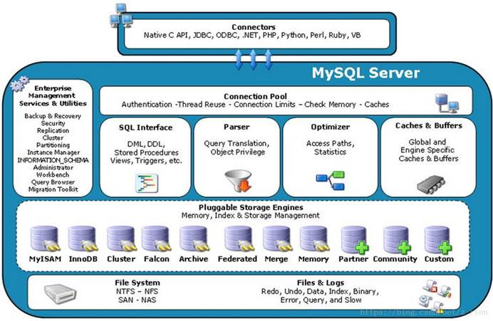](https://camo.githubusercontent.com/93724a49f5bba4e13c129caecaa62929be096861cf63edc807c8f1bc5db86699/68747470733a2f2f696d672d626c6f672e6373646e2e6e65742f32303138303833313137333931313939373f77617465726d61726b2f322f746578742f6148523063484d364c7939696247396e4c6d4e7a5a473475626d56304c337066636e6c6862673d3d2f666f6e742f3561364c354c32542f666f6e7473697a652f3430302f66696c6c2f49304a42516b46434d413d3d2f646973736f6c76652f3730)

|                                  | 描述                                                         |
| -------------------------------- | ------------------------------------------------------------ |
| Connectors                       | 指的是不同语言中与SQL的交互                                  |
| Connection Pool                  | 管理缓冲用户连接，线程处理等需要缓存的需求。MySQL数据库的连接层。 |
| Management Serveices & Utilities | 系统管理和控制工具。备份、安全、复制、集群等等               |
| SQL Interface                    | 接受用户的SQL命令，并且返回用户需要查询的结果。              |
| Parser                           | QL语句解析器                                                 |
| Optimizer                        | 查询优化器，SQL语句在查询之前会使用查询优化器对查询进行优化。就是优化客户端请求query，根据客户端请求的 query 语句，和数据库中的一些统计信息，在一系列算法的基础上进行分析，得出一个最优的策略，告诉后面的程序如何取得这个 query 语句的结果。For Example： select uid,name from user where gender = 1;这个select 查询先根据where 语句进行选取，而不是先将表全部查询出来以后再进行gender过滤；然后根据uid和name进行属性投影，而不是将属性全部取出以后再进行过滤。最后将这两个查询条件联接起来生成最终查询结果 |
| Caches & Buffers                 | 查询缓存                                                     |
| Pluggable Storage Engines        | 存储引擎接口。MySQL区别于其他数据库的最重要的特点就是其插件式的表存储引擎(注意：存储引擎是基于表的，而不是数据库) |
| File System                      | 数据落地到磁盘上，就是文件的存储                             |

 

MySQL数据库和其他数据库相比，MySQL有点与众不同，主要体现在存储引擎的架构上，插件式的存储引擎架构将查询处理和其他的系统任务以及数据的存储提取相分离。这种架构可以根据业务的需求和实际需求选择合适的存储引擎。

**逻辑架构分层**

[](https://camo.githubusercontent.com/6c2ee2b60cb88f90523e81023b59dfbb550b13dfa3f0472c89228e85e038fc73/68747470733a2f2f696d672d626c6f672e6373646e696d672e636e2f32303230303830313136353235323531302e706e673f782d6f73732d70726f636573733d696d6167652f77617465726d61726b2c747970655f5a6d46755a33706f5a57356e6147567064476b2c736861646f775f31302c746578745f6148523063484d364c7939696247396e4c6d4e7a5a473475626d56304c314a796157356e6231383d2c73697a655f31362c636f6c6f725f4646464646462c745f3730)

|  分层  |                             描述                             |
| :----: | :----------------------------------------------------------: |
| 连接层 | 最上层是一些客户端和连接服务，包含本地sock通信和大多数基于客户端/服务端工具实现的类似于tcp/ip的通信。主要完成一些类似于连接处理、授权认证、及相关的安全方案。在该层上引入了线程池的概念，为通过认证安全接入的客户端提供线程。同样在该层上可以实现基于SSL的安全链接。服务器也会为安全接入的每个客户端验证它所具有的操作权限 |
| 服务层 | MySQL的核心服务功能层，该层是MySQL的核心，包括查询缓存，解析器，解析树，预处理器，查询优化器。主要进行查询解析、分析、查询缓存、内置函数、存储过程、触发器、视图等，select操作会先检查是否命中查询缓存，命中则直接返回缓存数据，否则解析查询并创建对应的解析树 |
| 引擎层 | 存储引擎层，存储引擎真正的负责了MySQL中数据的存储和提取，服务器通过API与存储引擎进行通信。不同的存储引擎具有的功能不同，这样我们可以根据自己的实际需要进行选取 |
| 存储层 | 数据存储层，主要是将数据存储在运行于裸设备的文件系统之上，并完成与存储引擎的交互 |

 

**引擎**

默认是`innoDb`

`show engines;`命令查看MySQL5.7支持的存储引擎。

[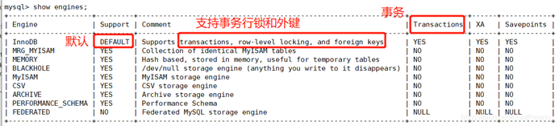](https://camo.githubusercontent.com/1c5a3b84879ec1a2e71d71f98ba620f9cc241d7ac21cede9c4ff8d380b178161/68747470733a2f2f696d672d626c6f672e6373646e696d672e636e2f32303230303830313137303434323432382e706e673f782d6f73732d70726f636573733d696d6167652f77617465726d61726b2c747970655f5a6d46755a33706f5a57356e6147567064476b2c736861646f775f31302c746578745f6148523063484d364c7939696247396e4c6d4e7a5a473475626d56304c314a796157356e6231383d2c73697a655f31362c636f6c6f725f4646464646462c745f3730)

 

`show variables like 'default_storage_engine%';`查看当前数据库正在使用的存储引擎。
 +------------------------+--------+
 | Variable_name     | Value |
 +------------------------+--------+
 | default_storage_engine | InnoDB |
 +------------------------+--------+
 1 row in set (0.01 sec)

 

**InnoDB和MyISAM对比**

| 对比项   | MyISAM                                                 | InnoDB                                                       |
| -------- | ------------------------------------------------------ | ------------------------------------------------------------ |
| 主外键   | 不支持                                                 | 支持                                                         |
| 事务     | 不支持                                                 | 支持                                                         |
| 行表锁   | 表锁，即使操作一条记录也会锁住整张表，不适合高并发操作 | 行锁，操作时只锁某一行，不对其他行有影响，适合高并发操作     |
| 缓存     | 只缓存索引，不缓存真实数据                             | 不仅缓存索引还要缓存真实数据，对内存要求较高，而且内存大小対性能有决定性影响 |
| 表空间   | 小                                                     | 大                                                           |
| 关注点   | 性能(读有优势)                                         | 事务(写有优势)                                               |
| 默认安装 | Yes                                                    | Yes                                                          |

 

# 索引优化分析

**Sql性能下降的原因**

- 查询语句写的差

- 索引失效：索引建了，但是没有用上

- 关联 查询太多join（设计缺陷或者不得已的需求）

- 服务器调优以及各个参数的设置（缓冲、线程数等）

  

## 7种join

**内联**

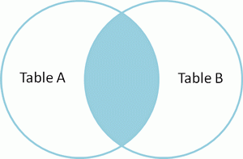

````mysql
SELECT <select_list> FROM TableA A INNER JOIN TableB B ON A.Key = B.Key;
````


**左外**


````mysql
SELECT <select_list> FROM TableA A LEFT JOIN TableB B ON A.Key = B.Key;
````

**右外**


````mysql
SELECT <select_list> FROM TableA A RIGHT JOIN TableB B ON A.Key = B.Key;
````


**左独有**

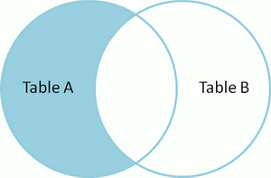

````mysql
SELECT <select_list> FROM TableA A LEFT JOIN TableB B ON A.Key = B.Key WHERE B.Key IS NULL;
````


**右独有**


````mysql
SELECT <select_list> FROM TableA A RIGHT JOIN TableB B ON A.Key = B.Key WHERE A.Key IS NULL;
````


**全连接**

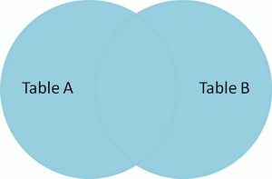

````mysql
SELECT <select_list> FROM TableA A FULL OUTER JOIN TableB B ON A.Key = B.Key;

/* MySQL不支持FULL OUTER JOIN这种语法 可以改成 1+2 */
SELECT <select_list> FROM TableA A LEFT JOIN TableB B ON A.Key = B.Key
UNION
SELECT <select_list> FROM TableA A RIGHT JOIN TableB B ON A.Key = B.Key;
````


**并集去表**

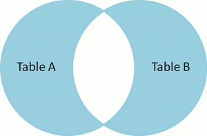

````mysql
SELECT <select_list> FROM TableA A FULL OUTER JOIN TableB B ON A.Key = B.Key WHERE A.Key IS NULL OR B.Key IS NULL;

/* MySQL不支持FULL OUTER JOIN这种语法 可以改成 4+5 */
SELECT <select_list> FROM TableA A LEFT JOIN TableB B ON A.Key = B.Key WHERE B.Key IS NULL;
UNION
SELECT <select_list> FROM TableA A RIGHT JOIN TableB B ON A.Key = B.Key WHERE A.Key IS NULL;
````

 

## 索引

**索引简介**

* MySQL官方对索引的定义为：索引（INDEX）是帮助MySQL**高效获取数据的数据结构**。
* 从而可以获得索引的本质：**索引是排好序的快速查找数据结构。**
* 索引的目的在于提高查询效率，可以类比字典的目录。如果要查mysql这个这个单词，我们肯定要先定位到m字母，然后从上往下找y字母，再找剩下的sql。如果没有索引，那么可能需要a---z，这样全字典扫描
* 重点：索引会影响到MySQL查找(`WHERE`的查询条件)和排序(`ORDER BY`)两大功能！
* 除了数据本身之外，数据库还维护着一个满足特定查找算法的数据结构，这些数据结构以某种方式指向数据，这样就可以在这些数据结构的基础上实现高级查找算法，这种数据结构就是索引（B树）
* 一般来说，索引本身也很大，不可能全部存储在内存中，因此索引往往以索引文件的形式存储在磁盘上。

* 我们平时所说的索引，如果没有特别指明，都是指B树(多路搜索树，并不一定是二叉的)结构组织的索引。其中聚集索引，次要索引，覆盖索引，复合索引，前缀索引，唯一索引默认都是使用B+树索引，统称索引。当然，除了B+树这种数据结构的索引之外，还有哈希索引(Hash Index)等。


**索引的优势和劣势**

* 优势：
  * 查找：类似大学图书馆的书目索引，提高数据检索的效率，降低数据库的IO成本。
  * 排序：通过索引対数据进行排序，降低数据排序的成本，降低了CPU的消耗。
* 劣势：
  * 实际上索引也是一张表，该表保存了主键与索引字段，并指向实体表的记录，所以索引列也是要占用空间的。
  * **虽然索引大大提高了查询速度，但是同时会降低表的更新速度**，例如对表频繁的进行`INSERT、UPDATE`和`DELETE`。因为更新表的时候，MySQL不仅要保存数据，还要保存一下索引文件每次更新添加的索引列的字段，都会调整因为更新所带来的键值变化后的索引信息。
  * 索引只是提高效率的一个因素，如果MySQL有大数据量的表，就需要花时间研究建立最优秀的索引。

 

**Mysql 索引分类**

| 索引分类 | 描述                                           |
| :------- | :--------------------------------------------- |
| 单值索引 | 一个索引只包含单个列，一个表可以有多个单列索引 |
| 唯一索引 | 索引列的值必须唯一，但是允许空值               |
| 复合索引 | 一个索引包含多个字段                           |

建议：一张表建的索引最好**不要超过5个！**

 

### 索引的创建与删除

**关键字：**`index`

**直接创建**

````mysql
CREATE [UNIQUE] INDEX 索引名 ON 表(列名(length));    #[UNIQUE] 创建唯一索引
# 如果只写一个字段就是单值索引，写多个字段就是复合索引
````

**修改表结构时添加索引**

````mysql
ALTER TABLE 表名 ADD [UNIQUE] INDEX 索引名(列名(lenght));       #[UNIQUE] 创建唯一索引
````

**创建表时添加索引**

````mysql
CREATE TABLE 表名(
    列名 类型 约束，
    INDEX [索引名](列名(length)),
    INDEX [索引名](列名(length),列名(length)）  #复合索引
)
````

**删除索引**

````mysql
DROP INDEX [索引名] ON 表；
````

**查看索引**

````mysql
SHOW INDEX FROM tabName \G;   #加上\G就可以 以列的形式查看了 不加\G就是以表的形式查看
````

**使用ALTER 命令添加和删除索引**

````mysql
# 1、该语句添加一个主键，这意味着索引值必须是唯一的，并且不能为NULL
ALTER TABLE tabName ADD PRIMARY KEY(column_list);

# 2、该语句创建索引的键值必须是唯一的(除了NULL之外，NULL可能会出现多次)
ALTER TABLE tabName ADD UNIQUE indexName(column_list);

# 3、该语句创建普通索引，索引值可以出现多次
ALTER TABLE tabName ADD INDEX indexName(column_list);

# 4、该语句指定了索引为FULLTEXT，用于全文检索 
ALTER TABLE tabName ADD FULLTEXT indexName(column_list);
````


### 索引数据结构

* `BTree` 索引
* `Hash` 索引
* `Full-text` 全文索引
* `R-Tree` 索引

**BTree索引检索原理：**


* 初始化介绍

  * 一颗b+树， 浅蓝色的块我们称之为一个磁盘块，可以看到每个磁盘块包含几个数据项(深蓝色所示)和指针(黄色所示) ,如磁盘块1包含数据项17和35，包含指针P1、P2、P3,P1表示小于17的磁盘块，P2表示在17和35之间的磁盘块，P3表示大于35的磁盘块。真实的数据存在于叶子节点即3、5、9、10、13、15、28、29、 36、60、75、79、90、99。

  * **非叶子节点只不存储真实的数据**，只存储指引搜索方向的数据项，如17、35并不真实存在于数据表中。

* 查找过程

  * 如果要查找数据项29，那么首先会把磁盘块1由磁盘加载到内存，此时发生一次IO，在内存中用二分查找确定29在17和35之间，锁定磁盘块1的P2指针，内存时间因为非常短(相比磁盘的IO)可以忽略不计，通过磁盘块1的P2指针的磁盘地址把磁盘块3由磁盘加载到内存，发生第二次I0，29在26和30之间， 锁定磁盘块3的P2指针，通过指针加载磁盘块8到内存，发生第三次IO，同时内存中做二分查找找到29，结束查询，总计三次IO。

  * 真实的情况是，3层的b+树可以表示上百万的数据，如果上百万的数据查找只需要三次IO，性能提高将是巨大的，如果没有索引，每个数据项都要发生一次IO，那么总共需要百万次的IO，显然成本非常非常高。


**哪些情况需要建索引**

* **主键自动建立主键索引**（唯一 + 非空）。(主键就是索引)
* 频繁作为查询条件的字段应该创建索引。
* 查询中与其他表关联的字段，外键关系建立索引。
* 查询中排序的字段，排序字段若通过索引去访问将大大提高排序速度。
* 查询中统计或者分组字段（`group by`也和索引有关）。

 

**那些情况不要建索引**

* 记录太少的表。
* 经常增删改的表。
* 频繁更新的字段不适合创建索引。
* `Where`条件里用不到的字段不创建索引。
* 假如一个表有10万行记录，有一个字段A只有`true`和`false`两种值，并且每个值的分布概率大约为50%，那么对A字段建索引一般不会提高数据库的查询速度。索引的选择性是指索引列中不同值的数目与表中记录数的比。如果一个表中有2000条记录，表索引列有1980个不同的值，那么这个索引的选择性就是1980/2000=0.99。一个索引的选择性越接近于1，这个索引的效率就越高。

 

## 性能分析

**Mysql query Optimizer（查询优化器）**

1. Mysq|中有专门负责优化`SELECT`语句的优化器模块，主要功能:通过计算分析系统中收集到的统计信息，为客户端请求的`Query`提供他认为最优的执行计划(他认为最优的数据检索方式，但不见得是DBA认为是最优的，这部分最耗费时间)

2. 当客户端向MySQL请求一条`Query`，命令解析器模块完成请求分类，区别出是SELECT并转发给`MySQL Query Optimizer`时，`MySQL Query Optimizer`首先会对整条`Query`进行优化，处理掉一些常量表达式的预算,直接换算成常量值。并对`Query`中的查询条件进行简化和转换，如去掉一些无用或显而易见的条件、结构调整等。然后分析`Query`中的`Hint`信息(如果有)，看显示`Hint`信息是否可以完全确定该`Query`的执行计划。如果没有`Hint`或`Hint`信息还不足以完全确定执行计划，则会读取所涉及对象的统计信息，根据`Query`进行写相应的计算分析，然后再得出最后的执行计划。

**Mysql 常见瓶颈**

* CPU:CPU在饱和的时候一般发生在数据装入内存或从磁盘上读取数据时候
* IO:磁盘I/O瓶颈发生在装入数据远大于内存容量的时候
* 服务器硬件的性能瓶颈:`top,free,iostat`和`vmstat`来查看系统的性能状态.

 

 

### EXPLAIN

SQL的执行计划，使用`EXPLAIN`关键字可以模拟优化器执行SQL查询语句，从而知道MySQL是如何处理SQL语句的。分析你的查询语句或是表结构的性能瓶颈

 

**使用**

语法：`explain + SQL语句`

````mysql
mysql> explain select * from tbl_emp\G;

*************************** 1. row ***************************
           id: 1
  select_type: SIMPLE
        table: tbl_emp
   partitions: NULL
         type: ALL
possible_keys: NULL
          key: NULL
      key_len: NULL
          ref: NULL
         rows: 8
     filtered: 100.00
        Extra: NULL
1 row in set, 1 warning (0.00 sec)
````

可以查看以下信息：

| 字段          | 描述                       |
| ------------- | -------------------------- |
| id            | 表的读取顺序               |
| select_type   | 数据读取操作的操作类型     |
| possible_keys | 哪些索引可以使用           |
| key           | 哪些索引被实际使用         |
| ref           | 表之间的引用               |
| rows          | 每张表有多少行被优化器查询 |


**EXPLAIN字段**

> id：表的读取和加载顺序。

| 类型       | 描述                                                         |
| ---------- | ------------------------------------------------------------ |
| id相同     | 执行顺序由上至下                                             |
| id不同     | 如果是子查询，id的序号会递增，id值越大优先级越高，越先被执行 |
| id相同不同 | 同时存在。永远是id大的优先级最高，id相等的时候顺序执行       |

 

> select_type

`select_type`：数据查询的类型，主要是用于区别，普通查询、联合查询、子查询等的复杂查询。

| 类型            | 描述                                                         |
| --------------- | ------------------------------------------------------------ |
| SIMPLE：        | 简单的SELECT查询，查询中不包含子查询或者UNION 。             |
| PRIMARY：       | 查询中如果包含任何复杂的子部分，最外层查询则被标记为PRIMARY。 |
| SUBQUERY：      | 在SELECT或者WHERE子句中包含了子查询。                        |
| DERIVED：       | 在FROM子句中包含的子查询被标记为DERIVED(衍生)，MySQL会递归执行这些子查询，把结果放在临时表中。 |
| UNION：         | 如果第二个SELECT出现在UNION之后，则被标记为UNION；若UNION包含在FROM子句的子查询中，外层SELECT将被标记为DERIVED。 |
| UNION  RESULT： | 从UNION表获取结果的SELECT。                                  |

 

> type

`type`：访问类型排列。查询这条语句 所需要扫描表的范围(全扫描、扫描范围……)

**从最好到最差依次是：**`system`>`const`>`eq_ref`>`ref`>`range`>`index`>`ALL`。除了`ALL`没有用到索引，其他级别都用到索引了。

一般来说，得保证查询至少达到range级别，最好达到ref。

| 类型   | 描述                                                         |
| ------ | ------------------------------------------------------------ |
| system | 表只有一行记录(等于系统表)，这是const类型的特例，平时不会出现，这个也可以忽略不计。 |
| const  | 表示通过索引一次就找到了，const用于比较primary key或者unique索引。因为只匹配一行数据，所以很快。如将主键置于where列表中，MySQL就能将该查询转化为一个常量。 |
| eq_ref | 唯一性索引扫描，读取本表中和关联表表中的每行组合成的一行，查出来只有一条记录。除了system和const类型之外,  这是最好的联接类型。 |
| ref    | 非唯一性索引扫描，返回本表和关联表某个值匹配的所有行，查出来有多条记录。 |
| range  | 只检索给定范围的行，一般就是在WHERE语句中出现了BETWEEN、< >、in等的查询。这种范围扫描索引比全表扫描要好，因为它只需要开始于索引树的某一点，而结束于另一点，不用扫描全部索引 |
| index  | Full Index Scan，全索引扫描，index和ALL的区别为index类型只遍历索引树。也就是说虽然ALL和index都是读全表，但是index是从索引中读的，ALL是从磁盘中读取的 |
| ALL    | Full Table Scan，没有用到索引，全表扫描                      |


> possible_keys 和 key

| 类型          | 描述                                                         |
| ------------- | ------------------------------------------------------------ |
| possible_keys | 显示可能应用在这张表中的索引，一个或者多个。查询涉及到的字段上若存在索引，则该索引将被列出，但不一定被查询实际使用。 |
| key           | 实际使用的索引。如果为NULL，则没有使用索引。查询中如果使用了覆盖索引，则该索引仅仅出现在key列表中。 |

 

> key_len

`key_len`:表示索引中使用的字节数，可通过该列计算查询中使用的索引的长度。key_len显示的值为索引字段的最大可能长度，并非实际使用长度，即key_len是根据表定义计算而得，不是通过表内检索出的。在不损失精度的情况下，长度越短越好

`key_len`的计算规则[CSDN](https://blog.csdn.net/qq_34930488/article/details/102931490)

> ref

`ref`:显示索引的哪一列被使用了(显示的是列名)，如果可能的话，是一个常数。哪些列或常量被用于查找索引列上的值。  

> rows

`rows`: 根据表统计信息及索引选用情况，大致估算出找到所需的记录需要读取的行数。  

> Extra

`Extra`:包含不适合在其他列中显示但十分重要的额外信息。 

| 类型              | 描述                                                         |
| ----------------- | ------------------------------------------------------------ |
| Using filesort    | 说明MySQL会对数据使用一个外部的索引排序，而不是按照表内的索引顺序进行读取。MySQL中无法利用索引完成的排序操作成为"文件内排序"。(查找用到了索引，排序没有用到) |
| Using temporary   | 使用了临时表保存中间结果，MySQL在对查询结果排序时使用了临时表。常见于排序order by和分组查询group by。临时表对系统性能损耗很大 |
| Using index       | 表示相应的SELECT操作中使用了覆盖索引，避免访问了表的数据行，效率不错！如果同时出现Using where，表示索引被用来执行索引键值的查找；如果没有同时出现Using where：表明索引用来读取数据而非执行查找动作 |
| Using where       | 表明使用了where过滤                                          |
| Using join buffer | 使用了连接缓存                                               |
| Impossible where  | where子句的值总是false,不能用来获取任何元组(例：select * from table where bool = false and bool = ture) |

覆盖索引
就是`select`的数据列只用从索引中就能够取得，不必从数据表中读取，换句话说查询列要被所使用的索引覆盖。注意：如果要使用覆盖索引，一定不能写`SELECT`，要写出具体的字段。

**案例**:[BiliBIli](https://www.bilibili.com/video/BV1KW411u7vy?p=30)

 

## 索引分析案例

> **单表索引分析**

````mysql
# 数据准备
DROP TABLE IF EXISTS `article`;
CREATE TABLE IF NOT EXISTS `article`(
`id` INT(10) UNSIGNED NOT NULL PRIMARY KEY AUTO_INCREMENT COMMENT '主键',
`author_id` INT(10) UNSIGNED NOT NULL COMMENT '作者id',
`category_id` INT(10) UNSIGNED NOT NULL COMMENT '分类id',
`views` INT(10) UNSIGNED NOT NULL COMMENT '被查看的次数',
`comments` INT(10) UNSIGNED NOT NULL COMMENT '回帖的备注',
`title` VARCHAR(255) NOT NULL COMMENT '标题',
`content` VARCHAR(255) NOT NULL COMMENT '正文内容'
) COMMENT '文章';

INSERT INTO `article`(`author_id`, `category_id`, `views`, `comments`, `title`, `content`) VALUES(1,1,1,1,'1','1');
INSERT INTO `article`(`author_id`, `category_id`, `views`, `comments`, `title`, `content`) VALUES(2,2,2,2,'2','2');
INSERT INTO `article`(`author_id`, `category_id`, `views`, `comments`, `title`, `content`) VALUES(3,3,3,3,'3','3');
INSERT INTO `article`(`author_id`, `category_id`, `views`, `comments`, `title`, `content`) VALUES(1,1,3,3,'3','3');
INSERT INTO `article`(`author_id`, `category_id`, `views`, `comments`, `title`, `content`) VALUES(1,1,4,4,'4','4');
````

案例：查询category_id为1且comments大于1的情况下，views最多的article_id。

1. 编写SQL语句并查看SQL执行计划。

````mysql
SELECT id,author_id FROM article WHERE category_id = 1 AND comments > 1 ORDER BY views DESC LIMIT 1;
````

2. explain sql执行计划


结论:很显然,`type`是`ALL`,即最坏的情况。`Extra` 里还出现了`Using filesort`,也是最坏的情况。优化是必须的。

3. 创建索引idx_article_ccv。

````mysql
CREATE INDEX idx_article_ccv ON article(category_id,comments,views);
````

4. 查看当前索引。

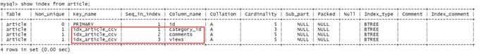

5. 查看现在SQL语句的执行计划。

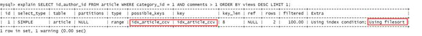

我们发现，创建符合索引idx_article_ccv之后，虽然解决了全表扫描的问题，但是在`order by`排序的时候没有用到索引，MySQL居然还是用的`Using filesort`，为什么？

6. 我们试试修改SQL。

````mysql
SELECT id,author_id FROM article WHERE category_id = 1 AND comments = 1 ORDER BY views DESC LIMIT 1;
````

再看SQL的执行计划


推论：当`comments > 1`的时候`order by`排序`views`字段索引就用不上，但是当`comments = 1`的时候`order by`排序`views`字段索引就可以用上！！！所以，范围之后的索引会失效。

7. 我们现在知道范围之后的索引会失效，原来的索引idx_article_ccv最后一个字段views会失效，那么我们如果删除这个索引，创建idx_article_cv索引呢？？？？

````mysql
# 创建索引 idx_article_cv
CREATE INDEX idx_article_cv ON article(category_id,views);
````

查看当前的索引


8. 当前索引是idx_article_cv，来看一下SQL执行计划。

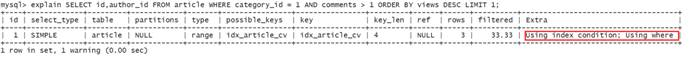

 

> **两表数据分析**

````mysql
# 数据准备

DROP TABLE IF EXISTS `class`;
DROP TABLE IF EXISTS `book`;
CREATE TABLE IF NOT EXISTS `class`(
`id` INT(10) UNSIGNED NOT NULL PRIMARY KEY AUTO_INCREMENT COMMENT '主键',
`card` INT(10) UNSIGNED NOT NULL COMMENT '分类' 
) COMMENT '商品类别';
CREATE TABLE IF NOT EXISTS `book`(
`bookid` INT(10) UNSIGNED NOT NULL PRIMARY KEY AUTO_INCREMENT COMMENT '主键',
`card` INT(10) UNSIGNED NOT NULL COMMENT '分类'
) COMMENT '书籍';
# card是两张表都有的
````

1. 不创建索引的情况下，SQL的执行计划。


book和class两张表都是没有使用索引，全表扫描，那么如果进行优化，索引是创建在book表还是创建在class表呢？下面进行大胆的尝试！

2. 右表(book表)创建索引

````mysql
CREATE INDEX idx_book_card ON book(card);
````

在book表中有idx_book_card索引的情况下，查看SQL执行计划

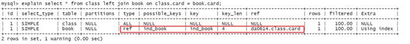

3. 删除book表的索引，左表(class表)创建索引。

````mysql
CREATE INDEX idx_class_card ON class(card);
````

在class表中有idx_class_card索引的情况下，查看SQL执行计划

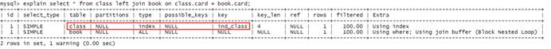

由此可见，**左连接将索引创建在右表上更合适，右连接将索引创建在左表上更合适**。(**从表更需要加索引**)

原因：以左连接为例：由左连接特性决定的。`LEFT JOIN`条件用于确定如何从右表搜索行，左边全有(不关心左表)，所以右边是我们的关键点,一定需要建立索引。

如果索引建反了，可以在查询的时候把左连改为右连，把右连改为左连

 

> **三表索引分析**

````mysql
# 数据准备
DROP TABLE IF EXISTS `phone`;
CREATE TABLE IF NOT EXISTS `phone`(
`phone_id` INT(10) UNSIGNED NOT NULL PRIMARY KEY AUTO_INCREMENT COMMENT '主键',
`card` INT(10) UNSIGNED NOT NULL COMMENT '分类' 
) COMMENT '手机';
````

1. 不加任何索引，查看SQL执行计划。

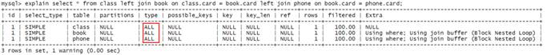

全表搜索

2. 根据两表查询优化的经验，左连接需要在右表上添加索引，所以尝试在book表和phone表上添加索引。

````mysql
# 在book表创建索引
CREATE INDEX idx_book_card ON book(card);

# 在phone表上创建索引
CREATE INDEX idx_phone_card ON phone(card);
````

再次执行SQL的执行计划


 

**结论**

JOIN语句的优化：

* 尽可能减少`JOIN`语句中的`NestedLoop`（嵌套循环）的总次数：永远都是小的结果集驱动大的结果集。
* 优先优化`NestedLoop`的内层循环。
* 保证`JOIN`语句中被驱动表上JOIN`条件字段已经被索引`。
* 当无法保证被驱动表的`JOIN`条件字段被索引且内存资源充足的前提下，不要太吝惜`Join Buffer`的设置。

 

## 索引失效案例

````mysql
# 数据准备
CREATE TABLE `staffs`(
`id` INT(10) PRIMARY KEY AUTO_INCREMENT,
`name` VARCHAR(24) NOT NULL DEFAULT '' COMMENT '姓名',
`age` INT(10) NOT NULL DEFAULT 0 COMMENT '年龄',
`pos` VARCHAR(20) NOT NULL DEFAULT '' COMMENT '职位',
`add_time` TIMESTAMP NOT NULL DEFAULT CURRENT_TIMESTAMP COMMENT '入职时间'
)COMMENT '员工记录表';

INSERT INTO `staffs`(`name`,`age`,`pos`) VALUES('Ringo', 18, 'manager');
INSERT INTO `staffs`(`name`,`age`,`pos`) VALUES('张三', 20, 'dev');
INSERT INTO `staffs`(`name`,`age`,`pos`) VALUES('李四', 21, 'dev');

# 创建索引
CREATE INDEX idx_staffs_name_age_pos ON `staffs`(`name`,`age`,`pos`);
````

 

**索引失效的情况**

* 全值匹配我最爱。
* 最佳左前缀法则。
* 在索引列上做任何操作(计算、函数、(自动or手动)类型转换)，会导致索引失效而转向全表扫描。
* 索引中范围条件之后的字段会全部失效。
* 尽量使用覆盖索引(只访问索引的查询，索引列和查询列一致)，减少SELECT *。
* MySQL在使用!=或者<>的时候无法使用索引会导致全表扫描。
* `is null`、`is not null`也无法使用索引。
* `like`以通配符开头 `%abc` 索引失效会变成全表扫描。
* 字符串不加单引号索引失效。
* 少用`or`，用它来连接时会索引失效。

 

> **最佳左前缀法**

查询 `name + age + pos` 用到了索引

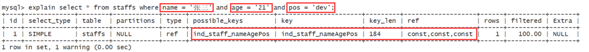

查询 `name + age` 用到了索引

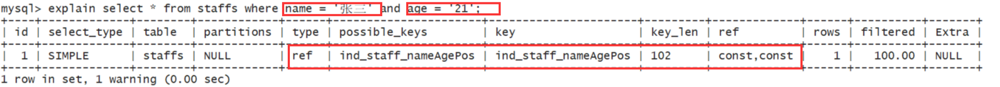

查询 `name` 用到了索引


跳过 `name` 未使用索引

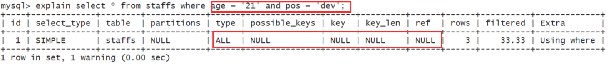

跳过 `name + age` 也未使用索引

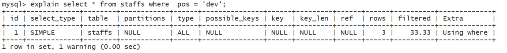

跳过中间的`age` 部分使用了索引


最佳左前缀法则：如果索引是多字段的复合索引，要遵守最佳左前缀法则。指的是查询从索引的最左前列开始并且不跳过索引中的字段。(开头必然不能少，中间的断了只有前面的使用了索引，后面的没有)

 

> **索引列上不计算**

````mysql
# 案例
# 现在要查询`name` = '张三'的记录下面有两种方式来查询！
# 1、直接使用 字段 = 值的方式来计算
select * from staffs where name = '张三';

# 2、使用MySQL内置的函数
select * from staffs where left(name,4) = '张三';
````

我们发现以上两条SQL的执行结果都是一样的，但是执行效率有没有差距呢？？？

通过分析两条SQL的执行计划来分析性能。


由此可见，在索引列上进行计算，会使索引失效。

 

> **范围之后全失效**

````mysql
#  用到了idx_staffs_name_age_pos索引中的name，age，pos字段 这是属于全值匹配的情况
explain select * from staffs where name = '张三' and age = '21' and pos = 'dev';

#  用到了idx_staffs_name_age_pos索引中的name，age字段，pos字段索引失效
explain select * from staffs where name = '张三' and age > '20' and pos = 'dev'; 
````

查看上述SQL的执行计划

 

由此可知，查询范围的字段使用到了索引，但是范围之后的索引字段会失效。

 

> **覆盖索引尽量用**

````mysql
# 在写SQL的不要使用SELECT *，用什么字段就查询什么字段。
# 没有用到覆盖索引
explain select * from staffs where name = '张三' and age = '20' and pos = 'dev';

# 用到了覆盖索引
explain select name,age,pos from staffs where name = '张三' and age = '20' and pos = 'dev';
````


 

> **不等有时会失效**

！= 、 <> 、 is null 、is not null 都会使索引失效

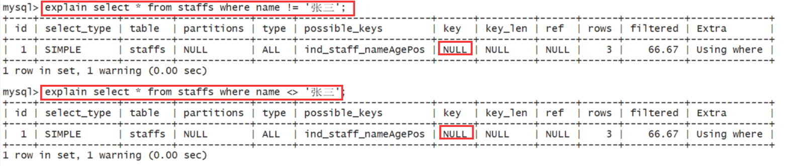

但是 如果是覆盖索引 则不失效


 

> **Like百分加右边**

%号 加前面(全盘扫苗)


%号 不加前面(使用索引)


如果一定要使用%like，而且还要保证索引不失效，那么使用覆盖索引来编写SQL。

````mysql
# 使用到了覆盖索引
EXPLAIN SELECT `id`,`name`, `age`, `pos` FROM `staffs` WHERE `name` LIKE '%in';

# 使用到了覆盖索引
EXPLAIN SELECT `id`, `name` FROM `staffs` WHERE `pos` LIKE '%na';

# 索引失效 全表扫描(没有使用覆盖索引，add_time没有索引)
EXPLAIN SELECT `name`, `age`, `pos`, `add_time` FROM `staffs` WHERE `name` LIKE '%in';
````

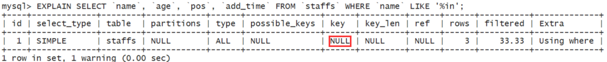

 

> **字符要加单引号**

````mysql
/* 使用到了索引 */
EXPLAIN SELECT * FROM `staffs` WHERE `name` = '2000';

/* 使用到了覆盖索引 */
EXPLAIN SELECT `id`, `name` FROM `staffs` WHERE `name` = 2000;

/* 索引失效 全表扫描 */
EXPLAIN SELECT * FROM `staffs` WHERE `name` = 2000;
````


这里name = 2000在MySQL中会发生强制类型转换，将数字转成字符串。索引列上发生了类型转换

**字符串类型一定要加单引号**(覆盖索引可以不加单引号)

 

> **少用 or**

````mysql
explain select * from staffs where name = '张三' or name = '李四';
````

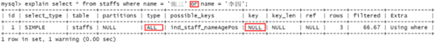

使用覆盖索引可以解决


**索引相关题目**

假设index(a,b,c)

| Where语句                                               | 索引是否被使用                             |
| ------------------------------------------------------- | ------------------------------------------ |
| where a = 3                                             | Y，使用到a                                 |
| where a = 3 and b = 5                                   | Y，使用到a，b                              |
| where a = 3 and b = 5 and c = 6                         | Y，使用到a，b，c                           |
| where b = 3 或者 where b = 3 and c = 4 或者 where c = 4 | N，没有用到a字段                           |
| where a = 3 and c = 5                                   | 使用到a，但是没有用到c，因为b断了          |
| where a = 3 and b > 4 and c = 5                         | 使用到a，b，但是没有用到c，因为c在范围之后 |
| where a = 3 and b like 'kk%' and c =  4                 | Y，使用到a，b，c                           |
| where a = 3 and b like '%kk' and c =  4                 | 只用到a                                    |
| where a = 3 and b like '%kk%' and c  = 4                | 只用到a                                    |
| where a = 3 and b like 'k%kk%' and c  = 4               | Y，使用到a，b，c                           |

 

 

**面试题分析**

````mysql
# 数据准备
/* 创建表 */
CREATE TABLE `test03`(
`id` INT PRIMARY KEY NOT NULL AUTO_INCREMENT,
`c1` CHAR(10),
`c2` CHAR(10),
`c3` CHAR(10),
`c4` CHAR(10),
`c5` CHAR(10)
);
/* 插入数据 */
INSERT INTO `test03`(`c1`,`c2`,`c3`,`c4`,`c5`) VALUES('a1','a2','a3','a4','a5');
INSERT INTO `test03`(`c1`,`c2`,`c3`,`c4`,`c5`) VALUES('b1','b22','b3','b4','b5');
INSERT INTO `test03`(`c1`,`c2`,`c3`,`c4`,`c5`) VALUES('c1','c2','c3','c4','c5');
INSERT INTO `test03`(`c1`,`c2`,`c3`,`c4`,`c5`) VALUES('d1','d2','d3','d4','d5');
INSERT INTO `test03`(`c1`,`c2`,`c3`,`c4`,`c5`) VALUES('e1','e2','e3','e4','e5');

/* 创建复合索引 */
CREATE INDEX idx_test03_c1234 ON `test03`(`c1`,`c2`,`c3`,`c4`);
````

````mysql
# 题目
# 最好索引怎么创建的，就怎么用，按照顺序使用，避免让MySQL再自己去翻译一次

# 1.全值匹配 用到索引c1 c2 c3 c4全字段
EXPLAIN SELECT * FROM `test03` WHERE `c1` = 'a1' AND `c2` = 'a2' AND `c3` = 'a3' AND `c4` = 'a4';

# 2.用到索引c1 c2 c3 c4全字段 MySQL的查询优化器会优化SQL语句的顺序
EXPLAIN SELECT * FROM `test03` WHERE `c1` = 'a1' AND `c2` = 'a2' AND `c4` = 'a4' AND `c3` = 'a3';

# 3.用到索引c1 c2 c3 c4全字段 MySQL的查询优化器会优化SQL语句的顺序
EXPLAIN SELECT * FROM `test03` WHERE `c4` = 'a4' AND `c3` = 'a3' AND `c2` = 'a2' AND `c1` = 'a1';

# 4.用到索引c1 c2 c3字段，c4字段失效，范围之后全失效
EXPLAIN SELECT * FROM `test03` WHERE `c1` = 'a1' AND `c2` = 'a2' AND `c3` > 'a3' AND `c4` = 'a4';

# 5.用到索引c1 c2 c3 c4全字段 MySQL的查询优化器会优化SQL语句的顺序(优化之后，范围查询再最火)(先优化)
EXPLAIN SELECT * FROM `test03` WHERE `c1` = 'a1' AND `c2` = 'a2' AND `c4` > 'a4' AND `c3` = 'a3';

# 6.用到了索引c1 c2 c3三个字段, c1和c2两个字段用于查找, c3字段用于排序了但是没有统计到key_len中，c4字段失效
EXPLAIN SELECT * FROM `test03` WHERE `c1` = 'a1' AND `c2` = 'a2' AND `c4` = 'a4' ORDER BY `c3`;

# 7.用到了索引c1 c2 c3三个字段，c1和c2两个字段用于查找, c3字段用于排序了但是没有统计到key_len中
EXPLAIN SELECT * FROM `test03` WHERE `c1` = 'a1' AND `c2` = 'a2' ORDER BY `c3`;

# 8.用到了索引c1 c2两个字段，c4失效，c1和c2两个字段用于查找，c4字段排序产生了Using filesort说明排序没有用到c4字段 
EXPLAIN SELECT * FROM `test03` WHERE `c1` = 'a1' AND `c2` = 'a2' ORDER BY `c4`;

# 9.用到了索引c1 c2 c3三个字段，c1用于查找，c2和c3用于排序
EXPLAIN SELECT * FROM `test03` WHERE `c1` = 'a1' AND `c5` = 'a5' ORDER BY `c2`, `c3`;

# 10.用到了c1一个字段，c1用于查找，c3和c2两个字段索引失效，产生了Using filesort
EXPLAIN SELECT * FROM `test03` WHERE `c1` = 'a1' AND `c5` = 'a5' ORDER BY `c3`, `c2`;

# 11.用到了c1 c2 c3三个字段，c1 c2用于查找，c2 c3用于排序
EXPLAIN SELECT * FROM `test03` WHERE `c1` = 'a1' AND `c2` = 'a2' ORDER BY c2, c3;

# 12.用到了c1 c2 c3三个字段，c1 c2用于查找，c2 c3用于排序
EXPLAIN SELECT * FROM `test03` WHERE `c1` = 'a1' AND `c2` = 'a2' AND `c5` = 'a5' ORDER BY c2, c3;

# 13.用到了c1 c2 c3三个字段，c1 c2用于查找，c2 c3用于排序 没有产生Using filesort 
# 因为之前c2这个字段已经确定了是'a2'了，这是一个常量，再去ORDER BY c3,c2 这时候c2已经不用排序了！
# 所以没有产生Using filesort 和(10)进行对比学习！

EXPLAIN SELECT * FROM `test03` WHERE `c1` = 'a1' AND `c2` = 'a2' AND `c5` = 'a5' ORDER BY c3, c2;

# GROUP BY 表面上是叫做分组，但是分组之前必定排序。

# 14.用到c1 c2 c3三个字段，c1用于查找，c2 c3用于排序，c4失效
EXPLAIN SELECT * FROM `test03` WHERE `c1` = 'a1' AND `c4` = 'a4' GROUP BY `c2`,`c3`;

# 15.用到c1这一个字段，c4失效，c2和c3排序失效产生了Using filesort
EXPLAIN SELECT * FROM `test03` WHERE `c1` = 'a1' AND `c4` = 'a4' GROUP BY `c3`,`c2`;

# GROUP BY基本上都需要进行排序，索引优化几乎和ORDER BY一致，但是GROUP BY会有临时表的产生。
````


**总结**

索引优化的一般性建议：

* 对于单值索引，尽量选择针对当前`query`过滤性更好的索引。
* 在选择复合索引的时候，当前`query`中过滤性最好的字段在索引字段顺序中，位置越靠前越好。
* 在选择复合索引的时候，尽量选择可以能够包含当前`query`中的`where`子句中更多字段的索引。
* 尽可能通过分析统计信息和调整`query`的写法来达到选择合适索引的目的。


# 查询截取分析

## 查询优化

### **小表驱动大表**

优化原则：对于MySQL数据库而言，永远都是小表驱动大表。

````mysql
/**
* 举个例子：可以使用嵌套的for循环来理解小表驱动大表。
* 以下两个循环结果都是一样的，但是对于MySQL来说不一样，
* 第一种可以理解为，和MySQL建立5次连接每次查询1000次。
* 第一种可以理解为，和MySQL建立1000次连接每次查询5次。
*/
for(int i = 1; i <= 5; i ++){
    for(int j = 1; j <= 1000; j++){
        
    }
}
// ~ ~ ~ ~ ~ ~ ~ ~ ~ ~ ~ ~ ~ ~ ~ ~ ~ ~ ~ ~
for(int i = 1; i <= 1000; i ++){
    for(int j = 1; j <= 5; j++){
        
    }
}
````

**IN和EXISTS**

````mysql
/* 优化原则：小表驱动大表，即小的数据集驱动大的数据集 */
/* IN适合B表比A表数据小的情况 原因：先执行in里的，后执行主语句 */
SELECT * FROM `A` WHERE `id` IN (SELECT `id` FROM `B`)
/* EXISTS适合B表比A表数据大的情况   原因：先执行主语句，再执行子语句 */
SELECT * FROM `A` WHERE EXISTS (SELECT 1 FROM `B` WHERE `B`.id = `A`.id);
````

**EXISTS**：

- 语法：`SELECT....FROM table WHERE EXISTS(subquery);`该语法可以理解为：
- 该语法可以理解为：将主查询的数据，放到子查询中做条件验证，根据验证结果（true或是false）来决定主查询的数据结果是否得以保留。

**提示：**

- EXISTS(subquery)子查询只返回true或者false，因此子查询中的`SELECT *`可以是`SELECT 1 OR SELECT X`，它们并没有区别。EXISTS(subquery)子查询的实际执行过程可能经过了优化而不是我们理解上的逐条对比，如果担心效率问题，可进行实际检验以确定是否有效率问题。
- EXISTS(subquery)子查询往往也可以用条件表达式，其他子查询或者JOIN替代，何种最优需要具体问题具体分析。

 

### ORDER BY 优化

````mysql
# 数据准备
CREATE TABLE `talA`(
 `age` INT,
 `birth` TIMESTAMP NOT NULL DEFAULT CURRENT_TIMESTAMP
 );
 
 INSERT INTO `talA`(`age`) VALUES(18);
 INSERT INTO `talA`(`age`) VALUES(19);
 INSERT INTO `talA`(`age`) VALUES(20);
 INSERT INTO `talA`(`age`) VALUES(21);
 INSERT INTO `talA`(`age`) VALUES(22);
 INSERT INTO `talA`(`age`) VALUES(23);
 INSERT INTO `talA`(`age`) VALUES(24);
 INSERT INTO `talA`(`age`) VALUES(25);
 
 /* 创建索引 */
 CREATE INDEX idx_talA_age_birth ON `talA`(`age`, `birth`);

# 案例

1.使用索引进行排序了 不会产生Using filesort
 EXPLAIN SELECT * FROM `talA` WHERE `age` > 20 ORDER BY `age`;
 
2.使用索引进行排序了 不会产生Using filesort
EXPLAIN SELECT * FROM `talA` WHERE `age` > 20 ORDER BY `age`,`birth`;

3.没有使用索引进行排序 产生了Using filesort
EXPLAIN SELECT * FROM `talA` WHERE `age` > 20 ORDER BY `birth`;

4.没有使用索引进行排序 产生了Using filesort
EXPLAIN SELECT * FROM `talA` WHERE `age` > 20 ORDER BY `birth`,`age`;

5.没有使用索引进行排序 产生了Using filesort
EXPLAIN SELECT * FROM `talA` ORDER BY `birth`;

6.没有使用索引进行排序 产生了Using filesort
EXPLAIN SELECT * FROM `talA` WHERE `birth` > '2020-08-04 07:42:21' ORDER BY `birth`;

7.使用索引进行排序了 不会产生Using filesort
EXPLAIN SELECT * FROM `talA` WHERE `birth` > '2020-08-04 07:42:21' ORDER BY `age`;

8.没有使用索引进行排序 产生了Using filesort
EXPLAIN SELECT * FROM `talA` ORDER BY `age` ASC, `birth` DESC;
````

**结论**

- `ORDER BY`子句，尽量使用索引排序，避免使用`Using filesort`排序。

- MySQL支持两种方式的排序，`FileSort`和`Index`，`Index`的效率高，它指MySQL扫描索引本身完成排序。`FileSort`方式效率较低。

- `ORDER BY`满足两情况，会使用`Index`方式排序：

  - `ORDER BY`语句使用索引最左前列。

  - 使用`WHERE`子句与`ORDER BY`子句条件列组合满足索引最左前列。

  - **结论：尽可能在索引列上完成排序操作，遵照索引建的最佳左前缀原则。**

- 如果不在索引列上，`File Sort`有两种算法：MySQL就要启动双路排序算法和单路排序算法

  - 双路排序算法：MySQL4.1之前使用双路排序，字面意思就是两次扫描磁盘，最终得到数据，读取行指针和`ORDER BY`列，对他们进行排序，然后扫描已经排序好的列表，按照列表中的值重新从列表中读取对应的数据输出。①从磁盘取排序字段，在`buffer`中进行排序，②再从排序好的表中取对应数据。

    - 取一批数据，要对磁盘进行两次扫描，众所周知，IO是很耗时的，所以在MySQL4.1之后，出现了改进的算法，就是单路排序算法。

  - 单路排序算法：从磁盘读取查询需要的所有列，按照`ORDER BY`列在`buffer`对它们进行排序，然后扫描排序后的列表进行输出，它的效率更快一些，避免了第二次读取数据。并且把随机IO变成了顺序IO，但是它会使用更多的空间，因为它把每一行都保存在内存中了。

    - 由于单路排序算法是后出的，总体而言效率好过双路排序算法。
    - 但是单路排序算法有问题：如果`SortBuffer`缓冲区太小，导致从磁盘中读取所有的列不能完全保存在`SortBuffer`缓冲区中(需要再次读取)，这时候单路复用算法就会出现问题，反而性能不如双路复用算法。
    - **单路复用算法的优化策略：**
      - 增大`sort_buffer_size`参数的设置。
      - 增大`max_length_for_sort_data`参数的设置。

总结：提高`ORDER BY`排序的速度：

- 尽量使用索引排序
- `ORDER BY`时使用`SELECT *`是大忌，查什么字段就写什么字段，这点非常重要。在这里的影响是：
  - 当查询的字段大小总和小于`max_length_for_sort_data`而且排序字段不是`TEXT|BLOB`类型时，会使用单路排序算法，否则使用多路排序算法。
  - 两种排序算法的数据都有可能超出`sort_buffer`缓冲区的容量，超出之后，会创建tmp临时文件进行合并排序，导致多次IO，但是单路排序算法的风险会更大一些，所以要增大`sort_buffer_size`参数的设置。

- 尝试提高`sort_buffer_size`：不管使用哪种算法，提高这个参数都会提高效率，当然，要根据系统的能力去提高，因为这个参数是针对每个进程的。
- 尝试提高`max_length_for_sort_data`：提高这个参数，会增加用单路排序算法的概率。但是如果设置的太高，数据总容量`sort_buffer_size`的概率就增大，明显症状是高的磁盘IO活动和低的处理器使用率。


**Gorub By 优化**

- `GROUP BY`实质是先排序后进行分组，遵照索引建的最佳左前缀。
- 当无法使用索引列时，会使用`Using filesort`进行排序，增大`max_length_for_sort_data`参数的设置和增大`sort_buffer_size`参数的设置，会提高性能。
- `WHERE`执行顺序高于`HAVING`，能写在`WHERE`限定条件里的就不要写在`HAVING`中了。

**总结:为排序使用索引**

- MySQL两种排序方式：`Using filesort`和`Index`扫描有序索引排序。
- MySQL能为排序与查询使用相同的索引，创建的索引既可以用于排序也可以用于查询。

````mysql
# 创建a b c三个字段的索引idx_table_a_b_c(a, b, c)

# 1.ORDER BY 能使用索引最左前缀
ORDER BY a;
 ORDER BY a, b;
 ORDER BY a, b, c;
 ORDER BY a DESC, b DESC, c DESC;

# 2.如果WHERE子句中使用索引的最左前缀定义为常量，则ORDER BY能使用索引
WHERE a = 'Ringo' ORDER BY b, c;
 WHERE a = 'Ringo' AND b = 'Tangs' ORDER BY c;
 WHERE a = 'Ringo' AND b > 2000 ORDER BY b, c;


# 3.不能使用索引进行排序
ORDER BY a ASC, b DESC, c DESC; /* 排序不一致 */
 WHERE g = const ORDER BY b, c;  /* 丢失a字段索引 */
 WHERE a = const ORDER BY c;   /* 丢失b字段索引 */
 WHERE a = const ORDER BY a, d;  /* d字段不是索引的一部分 */
 WHERE a IN (...) ORDER BY b, c; /* 对于排序来说，多个相等条件(a=1 or a=2)也是范围查询 */
````


## 慢查询日志

**慢查询日志是什么？**

* MySQL的慢查询日志是MySQL提供的一种日志记录，它用来记录在MySQL中响应时间超过阈值的语句，具体指运行时间超过`long_query_time`值的SQL，则会被记录到慢查询日志中。
* `long_query_time`的默认值为10，意思是运行10秒以上的语句。
* 由慢查询日志来查看哪些SQL超出了我们的最大忍耐时间值，比如一条SQL执行超过5秒钟，我们就算慢SQL，希望能收集超过5秒钟的SQL，结合之前`explain`进行全面分析。


**开启慢日志查询**

默认情况下，MySQL数据库没有开启慢查询日志，需要我们手动来设置这个参数。

如果不是调优需要的话，一般不建议启动该参数，因为开启慢查询日志会或多或少带来一定的性能影响。慢查询日志支持将日志记录写入文件。

查看慢查询日志是否开以及如何开启

* 查看慢查询日志是否开启：`SHOW VARIABLES LIKE '%slow_query_log%';`
* 开启慢查询日志：`SET GLOBAL slow_query_log = 1;`使用该方法开启MySQL的慢查询日志只对当前数据库生效，MySQL重启后则会失效。(就是设置[变量](onenote:#变量&section-id={6AC24F20-8EDD-4F59-A63E-25998306A774}&page-id={DE5FAA16-9D9F-41E0-844C-C3C19AA32623}&end&base-path=https://d.docs.live.net/409c6fec697f305e/文档/MySQL/尚硅谷.one))
* 如果要使慢查询日志永久开启，需要修改**my.cnf**文件，在[mysqld]下增加修改参数。
   \# 1.这个是开启慢查询。注意ON需要大写
   `slow_query_log=ON` 
   \# 2.这个是存储慢查询的日志文件。这个文件不存在的话，需要自己创建
   `slow_query_log_file=/var/lib/mysql/slow.log`


**设置时间**

开启了慢查询日志后，什么样的SQL才会被记录到慢查询日志里面呢？

* 这个是由参数`long_query_time`控制的，默认情况下`long_query_time`的值为10秒。
* MySQL中查看`long_query_time`的时间：`SHOW VARIABLES LIKE 'long_query_time%';`
* 修改时间：`SET GLOBAL long_query_time = 秒;`需要**重写连接** 或 **新开会话** 或 `show global variables like '%long_query_time%'`才能看到修改的时间;
* 使用配置文件修改：需要在**my.cnf**修改配置文件
   \# 这个是设置慢查询的时间，我设置的为1秒
   `long_query_time=1`

* 查询超过设置阈值的个数：`show global status like '%slow_queries%';`

````mysql
# 测试：

mysql> SET GLOBAL long_query_time=3;  #设置3s
Query OK, 0 rows affected (0.00 sec)

mysql> select sleep(4);               #睡4s
+----------+
| sleep(4) |
+----------+
|        0 |
+----------+
1 row in set (4.00 sec)
````

由于我的 mysql 数据都存储在/data/mysql文件夹下


超过3s的查询命令都在 `/data/mysql/**-slow.log` 文件中

````log
[root@VM-4-7-centos mysql]# cat VM-4-7-centos-slow.log      #打开-slow.log文件
……
Time         Id Command  Argument
\# Time: 2021-06-15T11:43:54.124964Z
\# User@Host: root[root] @ localhost [] Id:  40
\# Query_time: 4.002892 Lock_time: 0.000000 Rows_sent: 1 Rows_examined: 0
SET timestamp=1623757434;
select sleep(4);
````


### 日志分析工具

日志分析工具`mysqldumpslow`(在/mysql/bin文件夹下)：在生产环境中，如果要手工分析日志，查找、分析SQL，显然是个体力活，MySQL提供了日志分析工具mysqldumpslow。在/mysql/bin文件下使用

````linux
# 1、mysqldumpslow --help 来查看mysqldumpslow的帮助信息
 ……
  -v      verbose
  -d      debug
  -s ORDER   what to sort by (al, at, ar, c, l, r, t), 'at' is default   # 按照何种方式排序
         al: average lock time                     # 平均锁定时间
         ar: average rows sent                     # 平均返回记录数
         at: average query time                    # 平均查询时间
         c: count                           # 访问次数
         l: lock time                         # 锁定时间
         r: rows sent                         # 返回记录
         t: query time                         # 查询时间 
  -r      reverse the sort order (largest last instead of first)
  -t NUM    just show the top n queries                  # 返回前面多少条记录
  -a      don't abstract all numbers to N and strings to 'S'
  -n NUM    abstract numbers with at least n digits within names
  -g PATTERN  grep: only consider stmts that include this string 
  -h HOSTNAME hostname of db server for *-slow.log filename (can be wildcard),
        default is '*', i.e. match all
  -i NAME   name of server instance (if using mysql.server startup script)
  -l      don't subtract lock time from total time

# 2、 案例
 # 2.1、得到返回记录集最多的10个SQL
 mysqldumpslow -s r -t 10 /data/mysql/slow.log
 
 # 2.2、得到访问次数最多的10个SQL
 mysqldumpslow -s c -t 10 /data/mysql/slow.log
 
 # 2.3、得到按照时间排序的前10条里面含有左连接的查询语句
 mysqldumpslow -s t -t 10 -g "left join" /data/mysql/slow.log
 
 # 2.4、另外建议使用这些命令时结合|和more使用，否则出现爆屏的情况
 mysqldumpslow -s r -t 10 /data/mysql/slow.log | more
````


## 批量数据脚本

**环境准备**

````mysql
# 1、建表SQL。
/* 1.dept表 */
CREATE TABLE `dept` (
    `id` int(10) unsigned NOT NULL AUTO_INCREMENT COMMENT '主键',
    `deptno` int(10) unsigned NOT NULL DEFAULT '0' COMMENT '部门id',
    `dname` varchar(20) NOT NULL DEFAULT '' COMMENT '部门名字',
    `loc` varchar(13) NOT NULL DEFAULT '' COMMENT '部门地址',
    PRIMARY KEY (`id`)
) ENGINE=InnoDB DEFAULT CHARSET=utf8 COMMENT='部门表'

/* 2.emp表 */
CREATE TABLE `emp` (
    `id` int(10) unsigned NOT NULL AUTO_INCREMENT COMMENT '主键',
    `empno` int(10) unsigned NOT NULL DEFAULT '0' COMMENT '员工编号',
    `ename` varchar(20) NOT NULL DEFAULT '' COMMENT '员工名字',
    `job` varchar(9) NOT NULL DEFAULT '' COMMENT '职位',
    `mgr` int(10) unsigned NOT NULL DEFAULT '0' COMMENT '上级编号',
    `hiredata` date NOT NULL COMMENT '入职时间',
    `sal` decimal(7,2) NOT NULL COMMENT '薪水',
    `comm` decimal(7,2) NOT NULL COMMENT '分红',
    `deptno` int(10) unsigned NOT NULL DEFAULT '0' COMMENT '部门id',
    PRIMARY KEY (`id`)
) ENGINE=InnoDB DEFAULT CHARSET=utf8 COMMENT='员工表'

#2、由于开启过慢查询日志，开启了bin-log，我们就必须为function指定一个参数，否则使用函数会报错。
# 在mysql中设置 
# log_bin_trust_function_creators 默认是关闭的 需要手动开启
mysql> SHOW VARIABLES LIKE 'log_bin_trust_function_creators';
+---------------------------------+-------+
| Variable_name                   | Value |
+---------------------------------+-------+
| log_bin_trust_function_creators | OFF   |
+---------------------------------+-------+
1 row in set (0.00 sec)


mysql> SET GLOBAL log_bin_trust_function_creators=1;
Query OK, 0 rows affected (0.00 sec)


#上述修改方式MySQL重启后会失败，在my.cnf配置文件下修改永久有效。
[mysqld]
log_bin_trust_function_creators=ON
````


**创建函数**

````mysql
	# 1、函数：随机产生字符串
DELIMITER $$
CREATE FUNCTION rand_string(n INT) RETURNS VARCHAR(255)
BEGIN
    DECLARE chars_str VARCHAR(100) DEFAULT 'abcdefghijklmnopqrstuvwsyzABCDEFGHIJKLMNOPQRSTUVWXYZ';
    DECLARE return_str VARCHAR(255) DEFAULT '';
    DECLARE i INT DEFAULT 0;
	
    WHILE i < n DO
        SET return_str = CONCAT(return_str,SUBSTRING(chars_str,FLOOR(1+RAND()*52),1));
        SET i = i + 1;
    END WHILE;
	
    RETURN return_str;
END $$

# 2、函数：随机产生部门编号
DELIMITER $$
CREATE FUNCTION rand_num() RETURNS INT(5)
BEGIN
    DECLARE i INT DEFAULT 0;
	
    SET i = FLOOR(100 + RAND() * 10);
	
    RETURN i;
END $$
````

**创建存储过程**

````mysql
	# 1、函数：向dept表批量插入
DELIMITER $$
CREATE PROCEDURE insert_dept(IN START INT(10),IN max_num INT(10))
BEGIN
    DECLARE i INT DEFAULT 0;
    SET autocommit = 0;
    
	    REPEAT
        SET i = i + 1;
        INSERT INTO dept(deptno,dname,loc) VALUES((START + i),rand_string(10),rand_string(8));
    UNTIL i = max_num
    END REPEAT;
    
	    COMMIT;
END $$

# 2、函数：向emp表批量插入
DELIMITER $$
CREATE PROCEDURE insert_emp(IN START INT(10),IN max_num INT(10))
BEGIN
    DECLARE i INT DEFAULT 0;
    SET autocommit = 0;
    
	    REPEAT
        SET i = i + 1;
        INSERT INTO emp(empno,ename,job,mgr,hiredata,sal,comm,deptno) VALUES((START + i),rand_string(6),'SALESMAN',0001,CURDATE(),2000,400,rand_num());
    UNTIL i = max_num
    END REPEAT;
    
	    COMMIT;
END $$
````

**调用存储过程**

````mysql
# 1、调用存储过程向dept表插入10个部门。
DELIMITER ;
CALL insert_dept(100,10);

# 2、调用存储过程向emp表插入50万条数据。
DELIMITER ;
CALL insert_emp(100001,500000);
````


## Show Profile

`Show Profile`：MySQL提供可以用来分析当前会话中语句执行的资源消耗情况。可以用于SQL的调优的测量。默认情况下，参数处于关闭状态，并保存最近15次的运行结果。

1. 是否支持，看看当前的MySQL版本是否支持。`SHOW VARIABLES LIKE 'profiling';`

2. 开启`Show Profile`功能，默认是关闭的，使用前需要开启。`SET profiling=ON;`

3. 运行SQL
   1. `SELECT * FROM emp GROUP BY id%10 LIMIT 150000;    #运行刚才插入的500w的表`
   2. `SELECT * FROM emp GROUP BY id%20 ORDER BY 5;`

4. 查看结果，执行`SHOW PROFILES;`

````mysql
mysql> SHOW PROFILES;
+----------+------------+---------------------------------------------------+
| Query_ID | Duration   | Query                                             |
+----------+------------+---------------------------------------------------+
|        1 | 0.00156100 | SHOW VARIABLES LIKE 'profiling'                   |
|        2 | 0.56296725 | SELECT * FROM `emp` GROUP BY `id`%10 LIMIT 150000 |
|        3 | 0.52105825 | SELECT * FROM `emp` GROUP BY `id`%10 LIMIT 150000 |
|        4 | 0.51279775 | SELECT * FROM `emp` GROUP BY `id`%20 ORDER BY 5   |
+----------+------------+---------------------------------------------------+
4 rows in set, 1 warning (0.00 sec)
````

5. 诊断SQL，`SHOW PROFILE cpu,block io FOR QUERY Query_ID;`

````mysql
# 这里的3是第四步中的Query_ID。
# 可以在SHOW PROFILE中看到一条SQL中完整的生命周期。
mysql> SHOW PROFILE cpu,block io FOR QUERY 3;
+----------------------+----------+----------+------------+--------------+---------------+
| Status               | Duration | CPU_user | CPU_system | Block_ops_in | Block_ops_out |
+----------------------+----------+----------+------------+--------------+---------------+
| starting             | 0.000097 | 0.000090 |   0.000002 |            0 |             0 |
| checking permissions | 0.000010 | 0.000009 |   0.000000 |            0 |             0 |
| Opening tables       | 0.000039 | 0.000058 |   0.000000 |            0 |             0 |
| init                 | 0.000046 | 0.000046 |   0.000000 |            0 |             0 |
| System lock          | 0.000011 | 0.000000 |   0.000000 |            0 |             0 |
| optimizing           | 0.000005 | 0.000000 |   0.000000 |            0 |             0 |
| statistics           | 0.000023 | 0.000037 |   0.000000 |            0 |             0 |
| preparing            | 0.000014 | 0.000000 |   0.000000 |            0 |             0 |
| Creating tmp table   | 0.000041 | 0.000053 |   0.000000 |            0 |             0 |
| Sorting result       | 0.000005 | 0.000000 |   0.000000 |            0 |             0 |
| executing            | 0.000003 | 0.000000 |   0.000000 |            0 |             0 |
| Sending data         | 0.520620 | 0.516267 |   0.000000 |            0 |             0 |
| Creating sort index  | 0.000060 | 0.000051 |   0.000000 |            0 |             0 |
| end                  | 0.000006 | 0.000000 |   0.000000 |            0 |             0 |
| query end            | 0.000011 | 0.000000 |   0.000000 |            0 |             0 |
| removing tmp table   | 0.000006 | 0.000000 |   0.000000 |            0 |             0 |
| query end            | 0.000004 | 0.000000 |   0.000000 |            0 |             0 |
| closing tables       | 0.000009 | 0.000000 |   0.000000 |            0 |             0 |
| freeing items        | 0.000032 | 0.000064 |   0.000000 |            0 |             0 |
| cleaning up          | 0.000019 | 0.000000 |   0.000000 |            0 |             0 |
+----------------------+----------+----------+------------+--------------+---------------+
20 rows in set, 1 warning (0.00 sec)
````

**Show Profile查询参数备注：**

| 参数             | 描述                        |
| ---------------- | --------------------------- |
| ALL              | 显示所有的开销信息。        |
| BLOCK IO         | 显示块IO相关开销（通用）    |
| CONTEXT SWITCHES | 上下文切换相关开销          |
| CPU              | 显示CPU相关开销信息（通用） |
| IPC              | 显示发送和接收相关开销信息  |
| MEMORY           | 显示内存相关开销信息        |
| PAGE FAULTS      | 显示页面错误相关开销信息    |
| SOURCE           | 显示和Source_function       |
| SWAPS            | 显示交换次数相关开销的信息  |


6. Show Profile查询列表，日常开发需要注意的结论：

- `converting HEAP to MyISAM`：查询结果太大，内存都不够用了，往磁盘上搬了
- `Creating tmp table`：创建临时表（拷贝数据到临时表，用完再删除），非常耗费数据库性能
- `Copying to tmp table on disk`：把内存中的临时表复制到磁盘，危险！！！
- `locked`：死锁

## 全局查询日志

[bilibili](https://www.bilibili.com/video/BV1KW411u7vy?p=52)

# 锁机制

## 表锁

**特点**：表锁偏向MyISAM存储引擎，开销小，加锁快，无死锁，锁定粒度大，发生锁冲突的概率最高，并发度最低。

**命令：**

* 查询：`SHOW OPEN TABLES；`

* 加锁：`LOCK TABLE 表1 READ/WRITE,表2 READ/WRITE……;`

* 解锁：`UNLOCK TABLES;`

 

**环境准备**

````mysql
# 1、创建表
CREATE TABLE `mylock`(
`id` INT NOT NULL PRIMARY KEY AUTO_INCREMENT,
`name` VARCHAR(20)
)ENGINE=MYISAM DEFAULT CHARSET=utf8 COMMENT='测试表锁';

# 2、插入数据
INSERT INTO `mylock`(`name`) VALUES('ZhangSan');
INSERT INTO `mylock`(`name`) VALUES('LiSi');
INSERT INTO `mylock`(`name`) VALUES('WangWu');
INSERT INTO `mylock`(`name`) VALUES('ZhaoLiu');
````

 

**锁表的命令**

1. 查看数据库表锁：`SHOW OPEN TABLES;`

2. 上锁：`LOCK TABLE 表1 READ/WRITE,表2 READ/WRITE……;`

   ````mysql
   # 给mylock表上读锁，给book表上写锁
   LOCK TABLE `mylock` READ, `book` WRITE;
   
   # 查看当前表的状态
   mysql> SHOW OPEN TABLES;
   +--------------------+------------------------------------------------------+--------+-------------+
   | Database           | Table                                                | In_use | Name_locked |
   +--------------------+------------------------------------------------------+--------+-------------+
   | da0614             | mylock                                               |      1 |           0 |
   | da0614             | book                                                 |      1 |           0 |
   +--------------------+------------------------------------------------------+--------+-------------+
   ````

3. 释放表锁：`UNLOCK TABLES;`

   ````mysql
   # 释放给表添加的锁
   UNLOCK TABLES;
   
   # 查看当前表的状态
   mysql> SHOW OPEN TABLES;
   +--------------------+------------------------------------------------------+--------+-------------+
   | Database           | Table                                                | In_use | Name_locked |
   +--------------------+------------------------------------------------------+--------+-------------+
   | da0614             | mylock                                               |      0 |           0 |
   | da0614             | book                                                 |      0 |           0 |
   +--------------------+------------------------------------------------------+--------+-------------+
   ````

   

**读锁案例**

1. 开两个会话，**会话1**为mylock表加读锁

   `LOCK TABLE mylock READ;`

2. 验证：会话1是否可以读自己锁的表？是否可以修改自己锁的表？是否可以读其他的表？会话2呢？

|          | 会话1  | 会话2               |
| -------- | ------ | ------------------- |
| 读表     | 可以   | 可以                |
| 写操作   | 不可以 | 等待 会话1 释放锁； |
| 读其他表 | 不可以 | 可以                |


**写锁案例**

1. 打开两个会话，会话1为mylock表添加写锁。

   **LOCK TABLE `mylock` WRITE;**

2. 验证：会话1是否可以读自己锁的表？是否可以修改自己锁的表？是否可以读其他的表？那么会话2呢？

|          | 会话1  | 会话2               |
| -------- | ------ | ------------------- |
| 读表     | 可以   | 等待 会话1 释放锁； |
| 写操作   | 可以   | 等待 会话1 释放锁； |
| 读其他表 | 不可以 | 可以                |

**案例结论**

MyISAM引擎在执行查询语句`SELECT`之前，会自动给涉及到的所有表加读锁，在执行增删改之前，会自动给涉及的表加写锁。

MySQL的表级锁有两种模式：

* 表共享读锁（Table Read Lock）。
* 表独占写锁（Table Write Lock）。

对MyISAM表进行操作，会有以下情况：

* 对MyISAM表的读操作（加读锁），不会阻塞其他线程对同一表的读操作，但是会阻塞其他线程对同一表的写操作。只有当读锁释放之后，才会执行其他线程的写操作。
* 对MyISAM表的写操作（加写锁），会阻塞其他线程对同一表的读和写操作，只有当写锁释放之后，才会执行其他线程的读写操作。

读锁会阻塞自己的写 和 其他线程的写，写锁会阻塞其他线程的读写

 

**表锁分析**

````mysql
mysql> SHOW STATUS LIKE 'table%';
+---------------------- ------+-------+
| Variable_name              | Value |
+----------------------------+-------+
| Table_locks_immediate      | 173   |
| Table_locks_waited         | 0     |
| Table_open_cache_hits      | 5     |
| Table_open_cache_misses    | 8     |
| Table_open_cache_overflows | 0     |
+----------------------------+-------+
5 rows in set (0.00 sec)
````

可以通过`Table_locks_immediate`和`Table_locks_waited`状态变量来分析系统上的表锁定。具体说明如下：

* `Table_locks_immediate`：产生表级锁定的次数，表示可以立即获取锁的查询次数，每立即获取锁值加1。
* `Table_locks_waited`：出现表级锁定争用而发生等待的次数（不能立即获取锁的次数，每等待一次锁值加1），此值高则说明存在较严重的表级锁争用情况。
* 此外，MyISAM的读写锁调度是写优先，这也是MyISAM不适合作为主表的引擎。因为写锁后，其他线程不能进行任何操作，大量的写操作会使查询很难得到锁，从而造成永远阻塞。

 

## 行锁

**特点：**

* 偏向InnoDB存储引擎，开销大，加锁慢；会出现死锁；锁定粒度最小，发生锁冲突的概率最低，并发度最高。
* InnoDB存储引擎和MyISAM存储引擎最大不同有两点：支持事务、采用行锁。(默认就有行锁)
* 被锁定字段不是主键，也没有针对它建立索引的话(或者索引失效)。行锁会变成表锁。(操作的数据必须是索引 才使用行锁)

* **索引失效行锁变表锁**：如果操作的字段不是 索引 或 索引失效 都会使行锁变为表锁;

 

**行锁案例(操作的都是索引字段)**

0. 建立索引，修改/添加等操作 操作的**必须是索引字段**

1. 开两会话，都关闭自动提交

​	`SET autocommit = 0；`     # 关闭自动提交，只要不手动提交 其它线程操作此行都会阻塞；

2. 读及知所写

​		当会话1 对表进行了写操作，但是没有commit，再次执行查询语句 发现数据已经修改了(不提交 也可以查询自己修改的数据)

​		当会话2 执行查询语句 还是原来的数据(会话1没有提交)(解决了读未提交)

3. 两个会话对同一行进行操作

​		会话1 对表进行操作，但是没有commit；

​		会话2 再对表进行操作，阻塞 直到会话1 执行commit；

4. 两个会话对不同行进行操作

​		会话1 对 行1 进行操作，没有执行commit；

​		会话2 对 行2 进行操作，不不发生阻塞；(不同行，是不同的行锁) 


**间隙锁的危害**

* 什么是间隙锁？
  * 当我们用范围条件而不是相等条件检索数据，并请求共享或者排他锁时，InnoDB会给符合条件的已有数据记录的索引项加锁，对于键值在条件范文内但并不存在的记录，叫做"间隙(GAP)"。
  * InnoDB也会对这个"间隙"加锁，这种锁的机制就是所谓的"间隙锁"。

* 间隙锁的危害
  * 因为Query执行过程中通过范围查找的话，他会锁定整个范围内所有的索引键值，即使这个键值不存在。
  * 间隙锁有一个比较致命的缺点，就是当锁定一个范围的键值后，即使某些不存在的键值也会被无辜的锁定，而造成在锁定的时候无法插入锁定键值范围内的任何数据。在某些场景下这可能会对性能造成很大的危害。

* 例：一张表有1 ~ 10 行的数据，但是没有第5行(为空),当会话1操作的是 `where 行 >1 and 行<9` 的数据时(没有提交)，其它会话向 行5 添加数据时，会发生阻塞

 

**如何锁定一行**

1. `BEGIN`

2. `SELECT 语句 + FOR UPDATE;`

3. `COMMIT;`       #解锁


4. `SELECT .....FOR UPDATE`在锁定某一行后，其他写操作会被阻塞，直到锁定的行被COMMIT。


mysql InnoDB引擎默认的修改数据语句，`update,delete,insert`都会**自动给涉及到的数据加上排他锁**，`select`语句默认不会加任何锁类型，如果加排他锁可以使用`select ...for update`语句，加共享锁可以使用`select ... lock in share mode`语句。所以加过排他锁的数据行在其他事务种是不能修改数据的，也不能通过`for update`和`lock in share mode`锁的方式查询数据，但可以直接通过`select ...from...`查询数据，因为普通查询没有任何锁机制。

[](https://camo.githubusercontent.com/7b784887655321a852a95fdc0742c733faba6ff46ffebeecf4a200f7431b28c6/68747470733a2f2f696d672d626c6f672e6373646e696d672e636e2f32303231303432313132323931393939342e706e673f782d6f73732d70726f636573733d696d6167652f77617465726d61726b2c747970655f5a6d46755a33706f5a57356e6147567064476b2c736861646f775f31302c746578745f6148523063484d364c7939696247396e4c6d4e7a5a473475626d56304c314a796157356e6231383d2c73697a655f31362c636f6c6f725f4646464646462c745f3730)

 

 

**案例结论**

* InnoDB存储引擎由于实现了行级锁定，虽然在锁定机制的实现方面所带来的性能损耗可能比表级锁定会要更高一些，但是在整体并发处理能力方面要远远优于MyISAM的表级锁定的。当系统并发量较高的时候，InnoDB的整体性能和MyISAM相比就会有比较明显的优势了。
* 但是，InnoDB的行级锁定同样也有其脆弱的一面，当我们使用不当的时候，可能会让InnoDB的整体性能表现不仅不能比MyISAM高，甚至可能会更差。

**行锁分析**

````mysql
	mysql> SHOW STATUS LIKE 'innodb_row_lock%';
+-------------------------------+--------+
| Variable_name                 | Value  |
+-------------------------------+--------+
| Innodb_row_lock_current_waits | 0      |
| Innodb_row_lock_time          | 124150 |
| Innodb_row_lock_time_avg      | 31037  |
| Innodb_row_lock_time_max      | 51004  |
| Innodb_row_lock_waits         | 4      |
+-------------------------------+--------+
5 rows in set (0.00 sec)
````

| 状态量                        | 描述                                     |
| ----------------------------- | ---------------------------------------- |
| Innodb_row_lock_current_waits | 当前正在等待锁定的数量                   |
| Innodb_row_lock_time          | 从系统启动到现在锁定总时间长度（重要）   |
| Innodb_row_lock_time_avg      | 每次等待所花的平均时间（重要）           |
| Innodb_row_lock_time_max      | 从系统启动到现在等待最长的一次所花的时间 |
| Innodb_row_lock_waits         | 系统启动后到现在总共等待的次数（重要）   |

尤其是当等待次数很高，而且每次等待时长也不小的时候，我们就需要分析系统中为什么会有如此多的等待，然后根据分析结果着手制定优化策略。


**优化建议：**

* 尽可能让所有数据检索都通过索引来完成，避免无索引行锁升级为表锁。
* 合理设计索引，尽量缩小锁的范围
* 尽可能较少检索条件，避免间隙锁
* 尽量控制事务大小，减少锁定资源量和时间长度
* 尽可能低级别事务隔离

 

# 主从复制

> **复制基本原理**

`slave`会从`master` 读取 二进制日志bin-log 来进行数据的同步

Linux配置文件my.cnf：`log-bin=mysql-bin`开启mysql binlog功能


**MySQL复制过程分为三步：**

* Master将 改变 记录到二进制日志(Binary Log)。这些记录过程叫做二进制日志事件，Binary Log Events；
* Slave将Master的Binary Log Events拷贝到它的中继日志(Replay Log);
* Slave重做中继日志中的事件，将改变应用到自己的数据库中。MySQL复制是异步且串行化的。

 

> **复制基本原则**

* 每个Slave只有一个Master。
* 每个Slave只能有一个唯一的服务器ID。
* 每个Master可以有多个Salve。 

 

> **一主一从配置**

1. 基本要求：Master和Slave的MySQL服务器版本一致且后台以服务运行。

2. 修改配置文件:主从配置都是配在[mysqld]节点下，都是小写(我的是在 /etc/my.cnf)

   ````mysql
   # 主机配置文件
   [mysqld]
   server-id=1                          # 必须：服务器唯一ID
   log-bin=自己的路径/mysql-bin          # 必须：二进制日志
   log-err=自己的路径/mysql-err          # 可选：启用错误日志
   basedir=自己的路径                    # 可选:安装目录(根目录)
   datadir=自己的路径                    # 可选:数据库 库的目录
   tmpdir=自己的路径                     # 可选:临时目录
   read-only=0                          # 主机，读写都可以
   binlog-ignore-db=mysql               # 可选 设置不要复制的数据库
   binlog-do-db = 需要复制的主数据库的名   # 可选 设置需要复制的数据库
    
   
   # 从机配置文件
   [mysqld]
   server-id=2                     # 必须：代表从机
   log-bin=自己的路径/mysql-bin     # 可选：启用二进制日志
   
    
   # 重启MySQL | 关闭防火墙
   ````

   

3. Master 主机配置

   ````mysql
   # 1
   GRANT REPLICATION SLAVE ON *.* TO 'username'@'从机IP地址' IDENTIFIED BY 'password'; //告诉主机 从机的IP地址，MySql的用户名和密码
   
   mysql> GRANT REPLICATION SLAVE ON *.* TO 'root'@'192.168.60.133 ' IDENTIFIED BY '337337';
   Query OK, 0 rows affected, 1 warning (0.01 sec)
   
   # 2.刷新命令
   mysql> FLUSH PRIVILEGES;
   Query OK, 0 rows affected (0.00 sec)
   
   # 3.记录下File和Position 			
   # 每次配从机的时候都要SHOW MASTER STATUS; 告诉从机在哪个文件 什么位置 中复制 
   mysql> SHOW MASTER STATUS;
   +------------------+----------+--------------+------------------+-------------------+
   | File             | Position | Binlog_Do_DB | Binlog_Ignore_DB | Executed_Gtid_Set |
   +------------------+----------+--------------+------------------+-------------------+
   | mysql-bin.000004 |      602 |              | mysql            |                   |
   +------------------+----------+--------------+------------------+-------------------+
   1 row in set (0.00 sec)
   # File：二进制配置文件 
   # Position ：位置
   # Binlog_Do_DB： 需要复制的数据库
   # Binlog_Ignore_DB：不需要复制的数据库
   ````

 

4. Slave 从机配置

   ````mysql
   CHANGE MASTER TO MASTER_HOST='IP地址',           # 主机IP地址
   MASTER_USER='用户名',                            # 主机MySQL用户名
   MASTER_PASSWORD='密码',                          # 主机MySQL密码
   MASTER_LOG_FILE='mysql-bin.File的编号',          # 上一步SHOW MASTER STATUS获得的File
   MASTER_LOG_POS=Position的最新值;                 # 上一步SHOW MASTER STATUS获得的Position
   		
   # 1.使用用户名密码登录进Master
   mysql> CHANGE MASTER TO MASTER_HOST='192.168.60.128',
       -> MASTER_USER='root',
       -> MASTER_PASSWORD='337337',
       -> MASTER_LOG_FILE='mysql-bin.000004',
       -> MASTER_LOG_POS=602;
   Query OK, 0 rows affected, 2 warnings (0.02 sec)
   
   
   # 2.开启Slave从机的复制
   mysql> START SLAVE;
   Query OK, 0 rows affected (0.00 sec)
   
   		
   # 3.查看Slave状态
   # Slave_IO_Running 和 Slave_SQL_Running 必须同时为Yes 说明主从复制配置成功！
   
   mysql> SHOW SLAVE STATUS\G
   *************************** 1. row ***************************
   					……
               Slave_IO_Running: Yes  
               Slave_SQL_Running: Yes
   					……             
   ````

   

5. 测试主从复制

   ````mysql
   # Master创建数据库
   mysql> create database test_replication;
   Query OK, 1 row affected (0.01 sec)
   
   # Slave查询数据库
   mysql> show databases;
   +--------------------+
   | Database           |
   +--------------------+
   | information_schema |
   | mysql              |
   | performance_schema |
   | sys                |
   | test_replication   |
   +--------------------+
   5 rows in set (0.00 sec)
   ````

6. 停止主从复制功能

   ````mysql
   # 1.停止Slave
   mysql> STOP SLAVE;
   Query OK, 0 rows affected (0.00 sec)
   
   		
   # 2.重新配置主从
   # MASTER_LOG_FILE 和 MASTER_LOG_POS一定要根据最新的数据来配
   
   mysql> CHANGE MASTER TO MASTER_HOST='172.18.0.4',
       -> MASTER_USER='zhangsan',
       -> MASTER_PASSWORD='123456',
       -> MASTER_LOG_FILE='mysql-bin.000001',
       -> MASTER_LOG_POS=797;
   Query OK, 0 rows affected, 2 warnings (0.01 sec)
   
   mysql> START SLAVE;
   Query OK, 0 rows affected (0.00 sec)
   
   mysql> SHOW SLAVE STATUS\G
   *************************** 1. row ***************************
   					……
   			Slave_IO_Running: Yes  
   			Slave_SQL_Running: Yes
   					……    
   ````

   