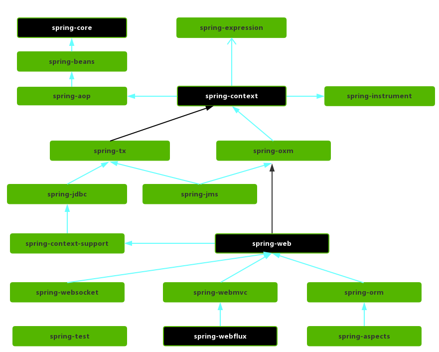
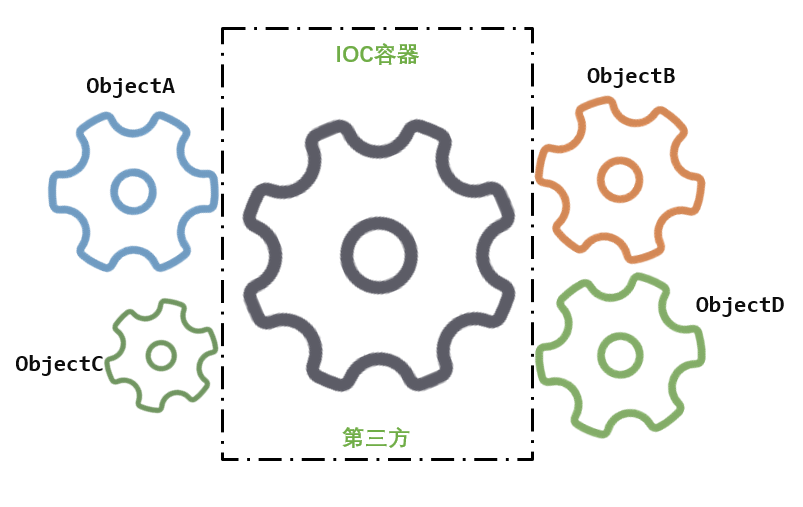
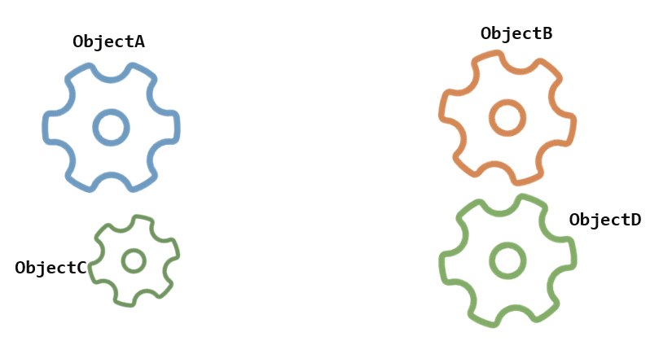
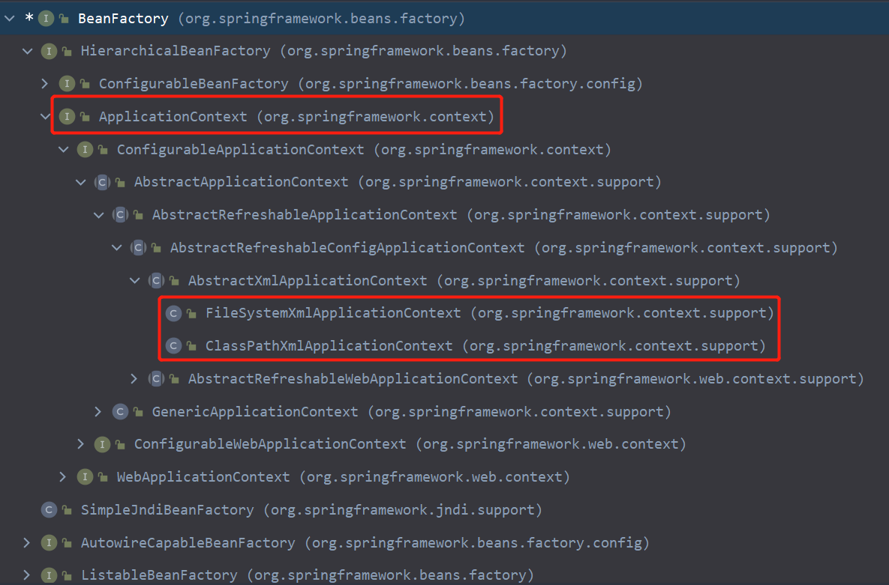
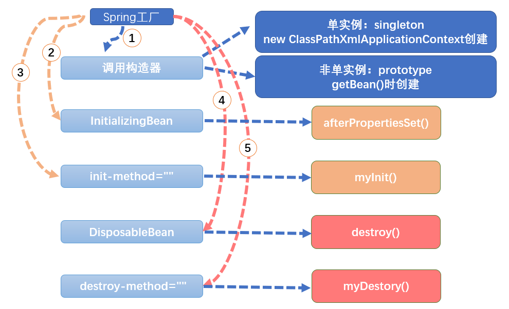
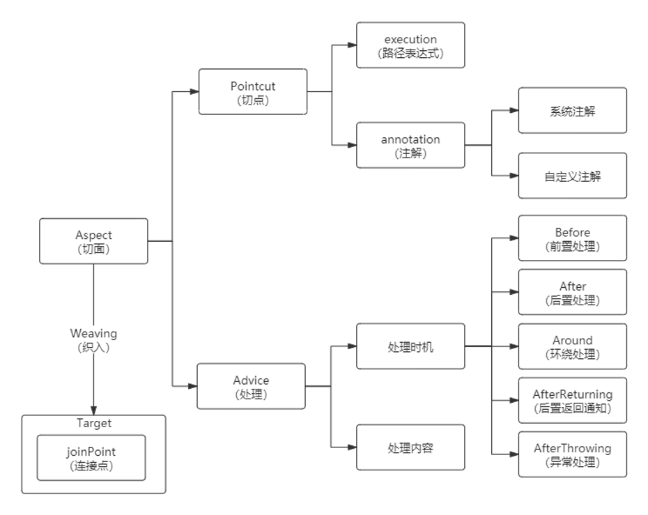
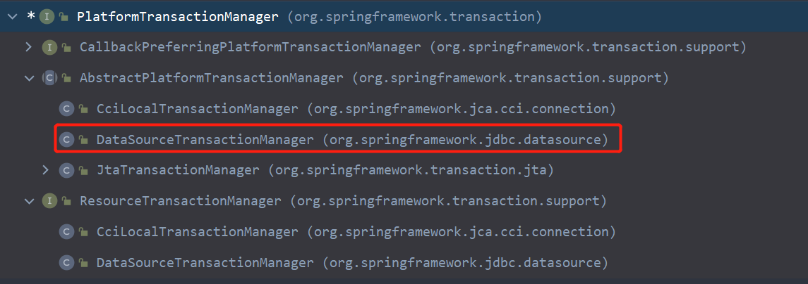
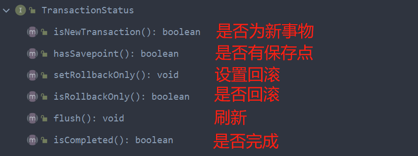

# 整体架构

**框架概述**

1. Spring 是轻量级的开源的 JavaEE 框架
2. Spring 可以解决企业应用开发的复杂性
3. Spring 有两个核心部分：IOC 和 Aop
   1. `IOC`：控制反转，把创建对象过程交给 Spring 进行管理(Inversion of Control)
   2. `Aop`：面向切面，不修改源代码进行功能增强（Aspect Oriented Programming）

**特点**

* 方便解耦，简化开发
* Aop 编程支持
* 方便程序测试
* 方便和其他框架进行整合
* 方便进行事务操作
* 降低 API 开发难度


**Maven依赖**

```xml
<!--Spring核心依赖 -->
<dependency>
    <groupId>org.springframework</groupId>
    <artifactId>spring-core</artifactId>
    <version>4.3.7.RELEASE</version>
</dependency>
<dependency>
    <groupId>org.springframework</groupId>
    <artifactId>spring-beans</artifactId>
    <version>4.3.7.RELEASE</version>
</dependency>
<dependency>
    <groupId>org.springframework</groupId>
    <artifactId>spring-context</artifactId>
    <version>4.3.7.RELEASE</version>
</dependency>
<!--spring aop-->
<dependency>
    <groupId>org.springframework</groupId>
    <artifactId>spring-aspects</artifactId>
    <version>4.3.12.RELEASE</version>
</dependency>
<dependency>
    <groupId>org.springframework</groupId>
    <artifactId>spring-aop</artifactId>
    <version>4.3.12.RELEASE</version>
</dependency>
<!--Spring dao依赖 -->
<dependency>
    <groupId>org.springframework</groupId>
    <artifactId>spring-jdbc</artifactId>
    <version>4.3.7.RELEASE</version>
</dependency>
<dependency>
    <groupId>org.springframework</groupId>
    <artifactId>spring-tx</artifactId>
    <version>4.3.7.RELEASE</version>
</dependency>

<!--Spring web依赖 -->
<dependency>
    <groupId>org.springframework</groupId>
    <artifactId>spring-web</artifactId>
    <version>4.3.7.RELEASE</version>
</dependency>
<dependency>
    <groupId>org.springframework</groupId>
    <artifactId>spring-webmvc</artifactId>
    <version>4.3.7.RELEASE</version>
</dependency>

<!--Spring test依赖：方便做单元测试和集成测试 -->
<dependency>
    <groupId>org.springframework</groupId>
    <artifactId>spring-test</artifactId>
    <version>4.3.7.RELEASE</version>
</dependency>

<!--druid-->
<dependency>
    <groupId>com.alibaba</groupId>
    <artifactId>druid</artifactId>
    <version>1.1.23</version>
</dependency>

<!--mysql-->
<dependency>
    <groupId>mysql</groupId>
    <artifactId>mysql-connector-java</artifactId>
    <version>5.1.43</version>
</dependency>

<dependency>
    <groupId>junit</groupId>
    <artifactId>junit</artifactId>
    <version>4.13.1</version>
    <scope>test</scope>
</dependency>
<dependency>
    <groupId>org.projectlombok</groupId>
    <artifactId>lombok</artifactId>
    <version>1.18.18</version>
</dependency>
```


> **核心容器（Core Containe）：核心容器提供了Spring框架的基本功能，由`spring-core`、`spring-beans`、`spring-context`、`spring-context-support`和`spring-expression`（Expression Language、SpEL）组成。`spring-beans`和`spring-core`是spring框架的核心模块。**

**spring-core:** 提供了框架的基本组成部分，包括 `IOC` (控制翻转 Inversion of Control) 和 `DI` (依赖注入Dependency Injection)

**spring-beans:** 提供了`BeanFactory`接口(spring核心接口)，是工厂模式的一个经典实现，Spring将管理对象称为`Bean`。`BeanFactory`使用控制翻转对应用程序的配置和依赖性规范与实际的应用程序代码进行了分离。但`BeanFactory`容器实例化后并不会自动创建实例化`Bean`，只有当`Bean`被使用的时候`BeanFactory`容器才会对该`Bean`进行实例化与依赖关系的装配。

**spring-context：**建立在`spring-core`和`spring-beans`模块的基础之上，提供一个框架式的对象访问方式，是访问定义和配置的任何对象的媒介。扩展了`BeanFactory`，为其添加了 `Bean` 生命周期控制、框架事件体系以及资源加载透明化等功能。`ApplicationContext`是该模块的核心接口，是`BeanFactory`的超类，与`BeanFactory`不同，`ApplicationContext`容器实例化后会自动对所有的单实例`Bean`进行实例化与依赖关系的装配，使之处于待用状态。

**spring-context-support：**支持整合第三方库到Spring应用程序上下文，特别是用于高速缓存（EhCache、JCache）和任务调度（CommonJ、Quartz）的支持。

**spring-expression：**提供了强大的表达式语言去支持运行时查询和操作对象图。对JSP2.1规范中规定的统一表达式语言(EL)的扩展，可以查询、管理运行中的对象，同时也方便的可以调用对象方法、操作数组、集合等。


> **AOP和设备支持：由`spring-aop`、`spring-aspects`和 `spring-instrument` 3个模块组成**

**spring-aop:** 是spring的另一个核心模块，提供了一个符合AOP要求的面相切面的编程实现。以动态代理为基础，设计出了一系列的`AOP`横切实现，如：前置通知、返回通知和异常通知等。同时使用 `Pointcut` 接口匹配切入点，可以使用现有的切入点设计横切面；也可以扩展相关方法根据需求进行切入，将代码按照功能进行分离，以便干净的解耦。

**spring-aspects:** 模块集成自`AspectJ`框架，为`AOP`提供了多种实现方法。

**spring-instrument:** 该模块是`spring-aop`的一个支援模块，基于JAVA SE中的`java.lang.instrument`进行设计。提供了类植入支持和类加载器的实现。主要作用在JVM启动时，生成一个代理类，程序员通过代理类在运行时修改类的字节，从而改变一个类的功能，实现`AOP`的功能。


> **DAO(Data Access Object 数据访问对象)与集成(Integration):由`spring-jdbc`、`spring-orm`、`spring-oxm`、`spring-jms`和`spring-tx`组成**

**spring-jdbc:**`JDBC`抽象框架的主要实现模块，用于简化`Spring JDBC`。主要是提供`JDBC`模板方式、关系数据库对象化方式、`SimpleJdbc`方式、事务管理来简化`JDBC`编程，主要实现类是`JdbcTemplate`、`SimpleJdbcTemplate`、`NamedParameterJdbcTemplate`

**spring-orm：**`ORM`框架支持模块，主要集成`Hibernate`，`Java Persistence API (JPA)` 和`Java Data Objects (JDO)` 用于资源管理、数据访问对象(`DAO`)的实现和事务策略。

**spring-oxm：**主要提供一个抽象层以支撑`OXM`(Object-to-XML-Mapping，它是一个O/M-mapper，将java对象映射成XML数据，或者将XML数据映射成java对象)

**spring-jms:**(Java Messaging Service)能够发送和接受信息，自Spring Framework 4.1以后，他还提供了对`spring-messaging`模块的支撑。

**spring-tx:**`Spring JDBC`事务控制实现模块。


> **Web:由`spring-websocket`、`spring-webmvc`、`spring-web`和`spring-webflux`组成**

**spring-web:** 为`Spring`提供了最基础`Web`支持，主要建立于核心容器之上，包含通过`Servlet`或者`Listeners`初始化一个`IOC`容器以及`Web`应用上下文，自动载入`WebApplicationContext`特性的类，`Struts`集成类、文件上传的支持类、`Filter`类和大量辅助工具类。

**spring-webmvc：**`Web-Servlet`模块，实现了`Spring MVC`(model-view-Controller)的`Web`应用。`Spring MVC`框架提供了领域模型代码和`Web`表单之间的清晰分离，并与`Spring Framework`的所有其他功能集成。

**spring-websocket:**`Spring4.0`以后新增的模块，实现双工异步通讯协议，实现了`WebSocket`和`SocketJS`，提供`Socket`通信和`Web`端的推送功能。

**spring-webflux:** 是一个新的非堵塞函数式`Reactive Web`框架，可以用来建立异步的，非阻塞，事件驱动的服务，并且扩展性非常好。


> **报文(Messaging):**

**spring-messaging:** 是从`Spring4.0`开始新加入的一个模块，主要职责是为`Spring`框架集成一些基础的报文传送应用。


> **Test:**

**spring-test:** 主要为测试提供支持的，毕竟在不需要发布（程序）到你的应用服务器或者连接到其他企业设施的情况下能够执行一些集成测试或者其他测试对于任何企业都是非常重要的。


**模块之间的关系**




# IOC

## 什么是IOC

IOC(Inversion of Control)控制反转,简单来说就是把复杂系统分解成相互合作的对象，这些对象类通过封装以后，内部实现对外部是透明的，从而降低了解决问题的复杂度，而且可以灵活地被重用和扩展。

IOC理论提出的观点：借助于“第三方”实现具有依赖关系的对象之间的解耦。



由于引进了中间位置的“第三方”，也就是`IOC`容器，使得A、B、C、D这4个对象没有了耦合关系，全部对象的控制权全部上缴给IOC容器，所以，IOC容器成了整个系统的关键核心，它起到了一种类似“粘合剂”的作用。



拿掉IOC容器，这时候A、B、C、D这4个对象之间已经没有了耦合关系，彼此毫无联系，当你在实现A的时候，根本无须再去考虑B、C和D了，对象之间的依赖关系已经降低到了最低程度。


**控制反转(IOC)到底为什么要起这么个名字？**

* 软件系统在没有引入IOC容器之前，对象A依赖于对象B，那么对象A在初始化或者运行到某一点的时候，自己必须主动去创建对象B或者使用已经创建的对象B。无论是创建还是使用对象B，控制权都在自己手上。
* 引入IOC容器之后，这种情形就完全改变了，由于IOC容器的加入，对象A与对象B之间失去了直接联系，所以，当对象A运行到需要对象B的时候，IOC容器会主动创建一个对象B注入到对象A需要的地方。
* 对象A获得依赖对象B的过程,由主动行为变为了被动行为，控制权颠倒过来了，这就是“控制反转”这个名称的由来。


**DI(依赖注入)**

* 控制反转(获得依赖对象的过程被反转了)。控制被反转之后，获得依赖对象的过程由自身管理变为了由IOC容器主动注入。
* 依赖注入（Dependency Injection）是 控制反转 的一个更合适的名字。所谓依赖注入，就是由IOC容器在运行期间，动态地将某种依赖关系注入到对象之中。
* 依赖注入(DI)和控制反转(IOC)是从不同的角度的描述的同一件事情，就是指通过引入IOC容器，利用依赖关系注入的方式，实现对象之间的解耦。


**IOC的优缺点**

1. 软件系统中由于引入了第三方IOC容器，生成对象的步骤变得有些复杂，本来是两者之间的事情，又凭空多出一道手续
2. 由于IOC容器生成对象是通过反射方式，在运行效率上有一定的损耗。如果你要追求运行效率的话，就必须对此进行权衡。
3. 具体到IOC框架产品(比如：Spring)来讲，需要进行大量的配制工作，比较繁琐，可能加大一些工作成本。


**IOC技术剖析**

* 反射，通俗来讲就是根据给出的类名（字符串方式）来动态地生成对象。这种编程方式可以让对象在生成时才决定到底是哪一种对象。
* xml解析
* 工厂模式，IOC思想基于IOC容器完成，IOC容器底层就是对象工厂


## 核心API

Spring提供IOC容器实现两种方式：（两个接口）

* `BeanFactory`：
  * IOC容器基本实现，是Spring内部核心接口，不提供开发人员进行使用。
  * 加载配置文件时候不会创建对象，在获取对象(使用)才去创建对象
  * `getBean()`等方法都来源于此接口
* `ApplicationContext`：
  * `BeanFactory`接口的子接口，提供更多更强大的功能，一般由开发人员进行使用。
  * 加载配置文件时候就会把在配置文件对象进行创建


**ApplicationContext接口：**

作⽤：负责实例化、配置和组装bean。

`ApplicationContext`接口的两个实现`ClassPathXMLApplicationContext`和`FileSystemXMLApplicationContext`



| 核心类                                     | 描述                                     |
| ------------------------------------------ | ---------------------------------------- |
| ClassPathXmlApplicationContext("xml路径")  | xml路径写的是xml文件在工程src/resoutces/ |
| FileSystemXmlApplicationContext("xml路径") | xml路径写的是xml文件在系统盘中的绝对路径 |


## 第一个Spring程序

1.创建实验类：Books.java

```java
public class Books {
    private String name;
    private int price;
    
    public Books(){
        
    }
    public Books(String name, int price) {
        this.name = name;
        this.price = price;
    }

    public void setName(String name) {
        this.name = name;
    }
    public void setPrice(int price) {
        this.price = price;
    }
}
```

2.spring配置文件：

````xml
<?xml version="1.0" encoding="UTF-8"?>
<beans xmlns="http://www.springframework.org/schema/beans"
       xmlns:xsi="http://www.w3.org/2001/XMLSchema-instance"
       xsi:schemaLocation="http://www.springframework.org/schema/beans http://www.springframework.org/schema/beans/spring-beans.xsd">

    <bean id="books" class="com.rain.spring.Books"></bean>

</beans>
````

3.通过工厂类，获得对象实例

```java
@Test
public void test1(){
    // 1、获取spring的工厂
    ApplicationContext applicationContext = new ClassPathXmlApplicationContext("BeanTest.xml");
    // 2、通过工厂类获得对象
    Object books = applicationContext.getBean("books");

    System.out.println(books);
}
```


## 工厂相关的方法

`BeanFacroty`接口及其子类的方法

| 方法                                | 描述                                     |
| ----------------------------------- | ---------------------------------------- |
| Object getBean(id)                  | 通过id获得对象实例                       |
| Object getBean(id,class)            | 通过id 与 类名.class 获得对象实例        |
| Object getBean(class)               | 通过类名.class 获得对象实例              |
| String[] getBeanDefinitionNames()   | 获取Spring配置文件中所有的bean标签的id值 |
| String[] getBeanNamesForType(Class) | 根据类型获得Spring配置文件中对应的id值   |
| boolean containsBean(id/name)       | 判断是否存在指定id/name值的bean          |

```java
ApplicationContext applicationContext = new ClassPathXmlApplicationContext("BeanTest.xml");

Object books1 = applicationContext.getBean("books");
Object books2 = applicationContext.getBean(Books.class);
Object books3 = applicationContext.getBean("books", Books.class);

String[] names = applicationContext.getBeanDefinitionNames();
for (String n: names){
    System.out.println(n);
}

if (applicationContext.containsBean("books")) {
    System.out.println("存在");
}
```


## 依赖注入

`<bean id="唯一标识" name="别名" class="类全路径" scope="单例/多例"></bean>`标签

* 在 spring 配置文件中，使用 bean 标签，标签里面添加对应属性，就可以实现对象创建
  * `id`属性：唯一标识
  * `class`属性：类全路径
  * `name`属性：为 bean 对象定义别名
  * `scope`属性：
    * `singleton` 单例(默认)
    * `prototype` 多例
* 创建对象时候，默认也是执行无参数构造方法完成对象创建


### 注入方式

> **Set方法注入**

```xml
<bean id="books" class="com.rain.spring.Books">
    <!--使用 property 完成属性注入
        name：类里面属性名称
        value：向属性注入的值
	-->
    <property name="name" value="杀死一只知更鸟"></property>
    <property name="price" value="33"></property>
</bean>
```


> **有参构造器注入**

必须拥有有参构造器

```xml
<bean id="books" class="com.rain.spring.Books">
	<!--根据属性名称-->
    <constructor-arg name="name" value="杀死一只知更鸟"></constructor-arg>
    <constructor-arg name="price" value="33"></constructor-arg>
	<!--根据下标位置-->
    <constructor-arg index="0" value="杀死一只知更鸟"></constructor-arg>
    <constructor-arg index="1" value="33"></constructor-arg>
	<!--根据类型，不建议 有冲突-->
    <constructor-arg type="java.lang.String" value="杀死一只知更鸟"></constructor-arg>
    <constructor-arg type="java.lang.Integer" value="33"></constructor-arg>
</bean>
```


> **p名称空间注入**

1. 添加 p 名称空间在配置文件中
2. 进行属性注入，在bean标签里面进行操作

```xml
<?xml version="1.0" encoding="UTF-8"?>
<beans xmlns="http://www.springframework.org/schema/beans"
       xmlns:xsi="http://www.w3.org/2001/XMLSchema-instance"
       xmlns:p="http://www.springframework.org/schema/p"
       xsi:schemaLocation="http://www.springframework.org/schema/beans http://www.springframework.org/schema/beans/spring-beans.xsd">

    <bean id="books" class="com.rain.spring.Books" p:name="杀死一只知更鸟" p:price="33"></bean>
</beans>
```


### 注入字面量

````xml
<!--null 值-->
<property name="address">
    <null/>
</property>

<!--属性值包含特殊符号

1 把<>进行转义 &lt; &gt;
2 把带特殊符号内容写到 CDATA
-->
<property name="address">
	<value><![CDATA[<<南京>>]]></value>
</property>
````


### 注入对象属性

> **外部Bean**

```java
public class Person {
    private String username;
    private Books books;             // Person的books属性是Books类
    private Properties info;         // 配置文件类型
}
```

```xml
<bean id="books" class="com.rain.spring.Books" p:name="杀死一只知更鸟" p:price="33"></bean>

<bean id="person" class="com.rain.spring.Person">
    <!--ref属性：引入外部Bean-->
    <property name="books" ref="books"></property>
    
    <!--或者-->
    <property name="books">
    	<ref bean="books"></ref>
    </property>
</bean>
```


> **内部Bean**

```xml
<!--不知道有何意义-->
<!--外部Bean对象-->
<bean id="books" class="com.rain.spring.Books">
    <property name="name" value="杀死一只知更鸟"></property>
    <property name="price" value="33"></property>
</bean>

<bean id="person" class="com.rain.spring.Person">
	<!--设置普通属性-->
    <property name="username" value="rain"></property>
    <!--设置对象类型属性-->
    <property name="books">
        <!--外部必须有此类的bean对象-->
        <bean id="books" class="com.rain.spring.Books">
            <property name="name" value="杀死一只知更鸟"></property>
            <property name="price" value="33"></property>
        </bean>
    </property>
</bean>
```


### 注入配置

`<props>`与`<prop>`标签注入 properties配置文件类型

* `key`相当于properties中 =号 左边的值
* `> <`中的数据相当于 =号 右边的值

```xml
<bean id="person" class="com.rain.spring.Person">
    
    <property name="info">
        <props>
            <prop key="班级">三年二班</prop>
            <prop key="级部">一级部</prop>
        </props>
    </property>
</bean>
```

```java
Person person = applicationContext.getBean(Person.class);
Properties info = person.getInfo();
System.out.println(info.getProperty("班级"));
```


### 注入集合类型

创建类(数组、List、map、set)

```java
public class Stu {
    //1 数组类型属性
    private String[] courses;
    //2 list 集合类型属性
    private List<Object> list;
    //3 map 集合类型属性
    private Map<String,String> maps;
    //4 set 集合类型属性
    private Set<String> sets;

    //get set方法
}
```

> **注入数组、List、Map、Set**

数组：`<property>`、`<array>`、`<value>`

List：`<property>`、`<List>`、`<value>`

Map：`<property>`、`<map>`、`<entry key="k" value="v">`

Set:`<property>`、`<Set>`、`<value>`

```xml
<!--集合类型属性注入-->
<bean id="stu" class="com.rain.spring.Stu">
    <!--数组类型属性注入-->
    <property name="courses">
        <array>
            <value>操作系统</value>
            <value>数据结构</value>
        </array>
    </property>
	<!--list 类型属性注入-->
    <property name="list">
        <list>
            <value>list1</value>
            <value>list2</value>
        </list>
    </property>
    <!--map 类型属性注入-->
    <property name="maps">
        <map>
            <entry key="key1" value="value1"></entry>
            <entry key="key2" value="value2"></entry>
        </map>
    </property>
    <!--set 类型属性注入-->
    <property name="sets">
        <set>
            <value>set1</value>
            <value>set2</value>
        </set>
    </property>
</bean>
```


> **注入集合对象类型**

`<ref>`引入Bean对象

```xml
<bean id="book1" class="com.rain.spring.Books">
    <property name="name" value="白夜行"></property>
    <property name="price" value="35"></property>
</bean>

<bean id="book2" class="com.rain.spring.Books">
    <property name="name" value="恶意"></property>
    <property name="price" value="32"></property>
</bean>
<bean id="stu" class="com.rain.spring.Stu">
    <property name="list">
        <list>
            <ref bean="book1"></ref>
            <ref bean="book2"></ref>
        </list>
    </property>
</bean>
```


> **util名称空间注入**

1. spring配置文件添加util名称空间

   ```xml
   <?xml version="1.0" encoding="UTF-8"?>
   <beans xmlns="http://www.springframework.org/schema/beans"
          xmlns:xsi="http://www.w3.org/2001/XMLSchema-instance"
          xmlns:util="http://www.springframework.org/schema/util"
          xsi:schemaLocation="http://www.springframework.org/schema/beans
          http://www.springframework.org/schema/beans/spring-beans.xsd
          
          http://www.springframework.org/schema/util
          http://www.springframework.org/schema/util/spring-util.xsd">
   ```

2. 使用util标签完成集合注入

   `<util:list>`、`<util:map>`等标签

   ```xml
   <util:list id="BookList">
       <ref bean="book1"></ref>
       <value>一只特立独行的猪</value>
       <value>丰乳肥臀</value>
   </util:list>
   <util:map id="map">
       <entry key="key1" value="value1"></entry>
       <entry key="key2" value="value2"></entry>
   </util:map>
   <bean id="stu" class="com.rain.spring.Stu">
   
       <property name="list" ref="BookList"></property>
       <property name="maps" ref="map"></property>
   
   </bean>
   ```


### 自动装配

`autowiring`属性，根据指定装配规则（属性名称或者属性类型），Spring 自动将匹配的属性值进行注入

| 模式        | 说明                                                         |
| ----------- | ------------------------------------------------------------ |
| no          | 无自动装载（默认）。bean必须引用由ref定义的元素              |
| byName      | 按属性名称自动装载。Spring寻找与需要自动装载的属性同名的bean |
| byType      | 如果容器中只有一个属性类型的bean，则允许自动装载属性。如果存在多个，则会引发一个致命的异常。如果没有匹配的bean，则不会发生任何事情（未设置属性） |
| constructor | 类似于byType，但适用于构造函数参数。如果容器中不只有一个构造函数参数类型的bean，则会引发致命错误 |

**从自动装载中排除Bean:** 使用`autowire-candidate`属性设置为`false`，可以防止bean被自动注入。该属性只会影响按类型入的方式。如果按name注入，则不受影响。

````xml
<!--实现自动装配
    bean 标签属性 autowire，配置自动装配
    autowire 属性常用两个值：
    byName 根据属性名称注入 ，注入值 bean 的 id 值和类属性名称一样
    byType 根据属性类型注入
-->
<bean id="person" class="com.rain.spring.Person" autowire="byName">
	<!--<property name="books" ref="books"></property>-->
</bean>
<bean id="person" class="com.rain.spring.Person" autowire="byType"></bean>

<bean id="books" class="com.rain.spring.Books">
    <property name="name" value="白夜行"></property>
    <property name="price" value="35"></property>
</bean>

<!--此Bean不会被自动注入到person类中-->
<bean id="books" class="com.rain.spring.Books" autowire-candidate="false">
    <property name="name" value="活着"></property>
    <property name="price" value="35"></property>
</bean>
````


### 外部属性文件

例：引入外部属性文件配置数据库连接池

1. 创建外部属性文件，`properties`格式文件，写数据库信息

   ````properties
   # jdbc.properties
   prop.driverClass=com.mysql.jdbc.Driver
   prop.url=jdbc:mysql://localhost:3306/userDb
   prop.userName=rain
   prop.password=123456
   ````

2. spring配置文件引入`context`名称空间

   ```xml
   <beans xmlns="http://www.springframework.org/schema/beans"
          xmlns:xsi="http://www.w3.org/2001/XMLSchema-instance"
          xmlns:context="http://www.springframework.org/schema/context"
          xsi:schemaLocation="http://www.springframework.org/schema/beans
          http://www.springframework.org/schema/beans/spring-beans.xsd
   
          http://www.springframework.org/schema/context
          http://www.springframework.org/schema/context/spring-context.xsd">
   ```

3. spring配置文件使用标签引入外部属性文件

   ````xml
   <!--引入外部属性文件-->
   <!--resources 下的文件在整个程序编译完后会被放到 classpath 目录下，src.main.java中的文件也是-->
   <context:property-placeholder location="classpath:jdbc.properties"/>
   
   <!--配置连接池-->
   <bean id="dataSource" class="com.alibaba.druid.pool.DruidDataSource">
       <property name="driverClassName" value="${prop.driverClass}"></property>
       <property name="url" value="${prop.url}"></property>
       <property name="username" value="${prop.userName}"></property>
       <property name="password" value="${prop.password}"></property>
   </bean>
   ````

   


## Bean生命周期

（1）通过构造器创建 bean 实例（无参数构造）

（2）为 bean 的属性设置值和对其他 bean 引用（调用 set 方法）

（3）调用 bean 的初始化的方法（需要进行配置初始化的方法）

（4）bean 可以使用了（对象获取到了）

（5）当容器关闭时候，调用 bean 的销毁的方法（需要进行配置销毁的方法）


**Spring 工厂何时创建对象？**

* `scope="prototype"`：Spring 工厂在获取对象 `ctx.getBean("xxx")` 的同时，创建对象。
* `scope="singleton"`：Spring 工厂（IoC 容器）创建的同时，创建对象。
  通过配置 `<bean lazy-init="true"/>` 也可以实现工厂获取对象的同时，创建对象。

### 初始化

Spring 工厂在创建完对象后，调用对象的初始化方法，完成对应的初始化操作。

**spring 提供初始化方法的两种方式：**

> 一、继承接口

继承`InitializingBean`接口，并实现接口的`afterPropertiesSet`方法

```java
public class Product implements InitializingBean {
    @Override
    public void afterPropertiesSet() throws Exception {
        System.out.println("初始化");
    }
}
```

> 二、配置文件指定初始化

`<bean init-method="初始化方法">`

```java
public class Product {
    public void myInit(){
        System.out.println("配置文件指定初始化");
    }
}
```

```xml
<!--配置文件Bean标签中的init-method指定初始化的方法-->
<bean id="product" class="com.rain.spring.Product" init-method="myInit"></bean>
```


**两种方式分析**

如果一个Bean同时继承`InitializingBean`接口，又使用配置文件指定初始化方法，会先执行`InitializingBean`，再执行配置文件指定的方法


### 销毁

Spring 销毁对象前(`ClassPathXmlApplicationContext.close()`)，会调用对象的销毁方法，完成销毁操作。

**同样提供了两种执行销毁的方法：**

> 一、继承销毁接口

继承`DisposableBean` 接口，并实现`destroy`方法

```java
public class Product implements  DisposableBean {
    @Override
    public void destroy() throws Exception {
        System.out.println("继承接口的销毁方法");
    }
}
```

> 二、配置文件指定销毁

`<bean destroy-method="销毁方法">`

````java
public class Product {
    public void myDestory(){
        System.out.println("配置文件指定销毁方法");
    }
}
````

```xml
<bean id="product" class="com.rain.spring.Product" destroy-method="myDestory"></bean>
```

````java
ClassPathXmlApplicationContext aC = new ClassPathXmlApplicationContext("BeanTest.xml");
Product product = aC.getBean("product", Product.class);
aC.close();
````


**注意：**销毁方法的操作只适用于 `scope="singleton"`，多实例时不适用


### 总结

```java
public class Product implements InitializingBean, DisposableBean {
    private String ProductName;

    public String getProductName() {
        return ProductName;
    }

    public void setProductName(String productName) {
        ProductName = productName;
    }

    public void myInit(){
        System.out.println("配置文件指定初始化方法");
    }
    public void myDestory(){
        System.out.println("配置文件指定销毁方法");
    }

    @Override
    public void afterPropertiesSet() throws Exception {
        System.out.println("继承接口的初始化方法");
    }

    @Override
    public void destroy() throws Exception {
        System.out.println("继承接口的销毁方法");
    }
}
```

```xml
<bean id="product" class="com.rain.spring.Product" init-method="myInit" destroy-method="myDestory">
    <property name="productName" value="程序1"></property>
</bean>
```

```java
ClassPathXmlApplicationContext cpac = new ClassPathXmlApplicationContext("BeanTest.xml");
Product product = cpac.getBean("product", Product.class);
System.out.println(product.getProductName());
cpac.close();
```

输出：

````txt
继承接口的初始化方法
配置文件指定初始化方法
程序1

继承接口的销毁方法
配置文件指定销毁方法
````




## 后置Bean

作用：对Spring工厂所创建的**每个**Bean对象，执行初始化(`init()`)方法之前或者之后，执行我们指定的一些代码逻辑。属于容器级别，Bean的初始化是针对自身进行操作，而后置Bean针对的是在Spring容器中的**每一个**Bean进行操作(定义了一个后置处理器，那么所有的Bean在初始化前后都会执行后置处理器)

Spring框架中提供了后置处理器接口`BeanPostProcessor`，这个接口中定义两个方法：

* `postProcessBeforeInitialization`：这个方法在调用始化方法之前执行。
* `postProcessAfterInitialization`：这个方法在调用初始化方法之后执行。


Bean

```java
// bean1
public class Bean1 implements InitializingBean, DisposableBean {

    @Override
    public void afterPropertiesSet() throws Exception {
        System.out.println("Bean1的初始化程序");
    }
    @Override
    public void destroy() throws Exception {
        System.out.println("Bean1的销毁程序");
    }
}
// bean2
public class Bean2 implements InitializingBean, DisposableBean {

    @Override
    public void afterPropertiesSet() throws Exception {
        System.out.println("Bean1的初始化程序");
    }
    @Override
    public void destroy() throws Exception {
        System.out.println("Bean1的销毁程序");
    }
}
```

后置处理器

```java
public class MyBeanPostProcessor implements BeanPostProcessor {
    @Override
    public Object postProcessBeforeInitialization(Object o, String s) throws BeansException {
        System.out.println("Bean后置处理器的Before方法");
        return o;
    }

    @Override
    public Object postProcessAfterInitialization(Object o, String s) throws BeansException {
        System.out.println("Bean后置处理器的After方法");
        return o;
    }
}
```

配置

```xml
<!--后置处理器，由于是spring自动调用，可以省略id属性-->
<bean class="com.rain.spring.MyBeanPostProcessor"></bean>

<bean id="bean1" class="com.rain.spring.Bean1"></bean>
<bean id="bean2" class="com.rain.spring.Bean2"></bean>
```

输出

````txt
Bean后置处理器的Before方法
Bean1的初始化程序
Bean后置处理器的After方法

Bean后置处理器的Before方法
Bean1的初始化程序
Bean后置处理器的After方法
````


### 指定后置处理器的执性顺序

如果存在多个后置处理器会发生的情况：

* 不指定顺序，spring会按照配置顺序执性(默认)

* 指定顺序，每个后置处理器都实现 `Ordered` 接口，并重写`getOrder()`方法
  * getOrder()的返回值越大，执性顺序越靠后

```java
// 后置处理器1
public class MyBeanPostProcessor1 implements BeanPostProcessor, Ordered {
    @Override
    public Object postProcessBeforeInitialization(Object o, String s) throws BeansException {
        System.out.println("Bean后置处理器1的Before方法");
        return o;
    }

    @Override
    public Object postProcessAfterInitialization(Object o, String s) throws BeansException {
        System.out.println("Bean后置处理器1的After方法");
        return o;
    }

    @Override
    public int getOrder() {
        return 0;
    }
}
// 后置处理器2
public class MyBeanPostProcessor2 implements BeanPostProcessor, Ordered {
    @Override
    public Object postProcessBeforeInitialization(Object o, String s) throws BeansException {
        System.out.println("Bean后置处理器2的Before方法");
        return o;
    }

    @Override
    public Object postProcessAfterInitialization(Object o, String s) throws BeansException {
        System.out.println("Bean后置处理器2的After方法");
        return o;
    }

    @Override
    public int getOrder() {
        return 1;
    }
}
```

```xml
<bean class="com.rain.spring.MyBeanPostProcessor1"></bean>
<bean class="com.rain.spring.MyBeanPostProcessor2"></bean>
<bean id="bean1" class="com.rain.spring.Bean1"></bean>
```

输出：

````txt
Bean后置处理器1的Before方法
Bean后置处理器2的Before方法
Bean1的初始化程序
Bean后置处理器1的After方法
Bean后置处理器2的After方法
````


## 工厂创建复杂对象

### FactoryBean 接口

Spring有两种类型bean，一种普通`bean`，另外一种工厂`bean`（FactoryBean）

* 普通`bean`：在配置文件中定义`bean`类型就是返回类型
* 工厂`bean`：在配置文件中定义`bean`类型可以和返回类型不一样

**创建工厂Bean步骤：**

* 第一步 创建类，让这个类作为工厂bean，实现接口`FactoryBean`
* 第二步 实现接口里面的方法，在实现的方法中定义返回的bean类型
  * `getObject()`：用于书写创建复杂对象时的代码。
  * `getObjectType()`：返回创建的复杂对象的类型。
  * `isSingleton`：用于决定是否单例。`true`单例，`flash`多例

```java
public class MyBean implements FactoryBean<Books> {
    @Override
    public Books getObject() throws Exception {
        return new Books("活着",55);
    }

    @Override
    public Class<?> getObjectType() {
        return null;
    }

    @Override
    public boolean isSingleton() {
        return false;
    }
}
```

```xml
<bean id="booksBean" class="com.rain.spring.MyBean"></bean>
```

```java
public void test1(){
    ApplicationContext applicationContext = new ClassPathXmlApplicationContext("BeanTest.xml");
    //返回了Books类型
    Books booksBean = applicationContext.getBean("booksBean",Books.class);
    System.out.println(booksBean);
}
```


实际用途：可以在继承了FactoryBean的类中添加其他操作步骤

````java
@Getter
@Setter // 提供 get set 方法
public class ConnectionFactoryBean implements FactoryBean<Connection> {
	// 将依赖的字符串信息变为成员变量, 利用配置文件进行注入。
    private String driverClassName;
    private String url;
    private String username;
    private String password;
    @Override
    public Connection getObject() throws Exception {
        Class.forName(driverClassName);
        Connection conn = DriverManager.getConnection(url, username, password);
        return conn;
    }
    @Override
    public Class<Connection> getObjectType() {
        return Connection.class;
    }
    @Override
    public boolean isSingleton() {
  		return false;
    }
}
````

````xml
<!--体会依赖注入, 好处: 解耦合, 今后要修改连接数据库的信息只需要修改配置文件, 无需改动代码-->
<bean id="conn" class="com.yusael.factorybean.ConnectionFactoryBean">
    <property name="driverClassName" value="com.mysql.jdbc.Driver"/>
    <property name="url" value="jdbc:mysql://localhost:3306/spring?useSSL=false"/>
    <property name="username" value="rain"/>
    <property name="password" value="333333"/>
</bean>
````


## 其他配置

**别名**：`alias` 设置别名,为bean设置别名,可以设置多个别名

````xml
<!--设置别名：在获取Bean的时候可以使用别名获取-->
<alias name="userT" alias="userNew"/>
````


**导入：**团队的合作通过`import`来实现`<import resource="{path}/beans.xml"/>`


**单实例/多实例:** 在Spring里面，默认情况下，bean是单实例对象（修改其中一个，所有的都会发生改变）

`<bean id="唯一标识" name="别名" class="类全路径" scope="单例/多例"></bean>`

* `scope`设置 单实例/多实例
  * `singleton`，表示是单实例对象(spring默认为单实例)
  * `prototype`，表示是多实例对象

区别：

* `scope`为`singleton`时，加载spring配置文件时候就会创建单实例对象
* `scope`为`prototype`时，不是在加载spring配置文件时候创建对象，在调用getBean方法时创建多实例对象


# 注解IOC

maven依赖

````xml
<!--spring-aop-->
<dependency>
    <groupId>org.springframework</groupId>
    <artifactId>spring-aop</artifactId>
    <version>5.2.12.RELEASE</version>
</dependency>

<!--@Resource注解-->
<dependency>
    <groupId>javax.annotation</groupId>
    <artifactId>javax.annotation-api</artifactId>
    <version>1.3.2</version>
</dependency>
````


## **组件扫描**

如果扫描多个包，多个包使用逗号隔开

````xml
<context:component-scan base-package="com.rain"></context:component-scan>
````

component-scan会扫描类路径里面的注解注解，包括@Component,@Repository,@Service,@Controller....

默认包含了annotation-config。`<context:annotation-config/>` 也可以开启组件扫描(开启注解驱动)

````xml
<!--示例 1
use-default-filters="false" 表示现在不使用默认filter，自己配置 filter
context:include-filter ，设置扫描哪些内容
context:exclude-filter： 设置哪些内容不进行扫描
-->
<!--扫描Component注解-->
<context:component-scan base-package="com.rain" use-default-filters="false">
   <context:include-filter type="annotation" expression="org.springframework.stereotype.Component"/>
</context:component-scan>
<!--不扫描controller注解-->
<context:component-scan base-package="com.rain" use-default-filters="false">
   <context:exclude-filter type="annotation" expression="org.springframework.stereotype.Controller"/>
</context:component-scan>
````


## Bean对象注解

* `@Component` 组件通用注解，常用于Model类
* `@Service` 一般会注解到Service层。
* `@Controller` 一般会注解到Controller层。
* `@Repository` 一般会注解到Dao层。

上面四个注解功能是一样的，标注在类上，都可以用来创建bean实例

@Component表示该bean是一个组件，@Component是任何Spring管理的组件的通用原型。@Repository、@Service和@Controller是@Component针对更具体的用例（分别在持久性、服务和表示层中）的特殊注解。

使用方法：

1. 标注在类上，相当于`<bean id="userService" class=".."/>`
2. `@Component("name")` 等于 `@Component(value="name")`
3. `@Component` 相当于 `@Component("类名称")` 首字母小写


## 属性注解

> **@Value：**注入普通类型属性

```java
@Component("book")
public class Book {
    @Value("杀死一只知更鸟")
    private String name;
    @Value("33")
    private int price;
}
```


> **@Autowired：**根据属性类型进行自动装配

@Autowired(required=false)说明：false，对象可以为null；true，对象必须存对象，不能为null。

````java
@Component
public class Person {
    @Autowired
    private Book book;
    
    @Autowired(required=false)    //可以为null
    private Course course;
}
````


> **@Qualifier：**根据名称进行注入

与@Autowired配合使用，根据名称注入

```java
@Component
public class Person {
    @Autowired
    @Qualifier("book")
    private Book book;
}
```


> **@Primary：**设置Bean的优先级

标注在类上，当按类型注入的时候，可能会有多个候选项，通过@Primary注解表示优先的对象


> **@Resource：**

可以根据类型注入，可以根据名称注入 （由J2EE提供，需导入Package: javax.annotation.Resource）

@Resource有两个中重要的属性：name和type。

* 如果未显式指定属性，则从字段名或setter方法派生默认名称

* 如有指定的name属性，先按该属性进行byName方式查找装配
* 其次再进行默认的byName方式进行装配；
* 如果以上都不成功，则按byType的方式自动装配。
* 都不成功，则报异常。

```java
@Component
public class Person {
    @Resource(name = "book")
    private Book book;
}
```


>@Autowired 和 @Resource的异同

* 相同点 @Resource的作用相当于@Autowired，均可标注在字段或属性的setter方法上。 
* 不同点
  * 提供方 @Autowired是Spring的注解，@Resource是javax.annotation注解，而是来自于JSR-250，J2EE提供，需要JDK1.6及以上。
  * 注入方式 @Autowired只按照Type 注入；@Resource默认按Name自动注入，也提供按照Type 注入；
  * 属性
    * @Autowired注解可用于为类的属性、构造器、方法进行注值。默认情况下，其依赖的对象必须存在（bean可用），如果需要改变这种默认方式，可以设置其required属性为false。还有一个比较重要的点就是，@Autowired注解默认按照类型装配，如果容器中包含多个同一类型的Bean，则按照名字装配，如果启动容器时会报找不到指定类型bean的异常，解决办法是结合 @Qualifier 注解进行限定，指定注入的bean名称，或@Primary。
    * @Resource有两个中重要的属性：name和type。name属性指定byName，如果没有指定name属性，当注解标注在字段上，即默认取字段的名称作为bean名称寻找依赖对象，当注解标注在属性的setter方法上，即默认取属性名作为bean名称寻找依赖对象。需要注意的是，@Resource如果没有指定name属性，并且按照默认的名称仍然找不到依赖对象时， @Resource注解会回退到按类型装配。但一旦指定了name属性，就只能按名称装配了。不支持@Qualifier 和 @Primary注解


> **@Inject注解：**与@autowired一致，但是不支持required

@Inject注解也是Java规范里面的，也可以说它是JSR330规范里面定义的一个注解。该注解默认是根据参数名去寻找bean注入，支持Spring的@Primary注解优先注入，@Inject注解还可以增加@Named注解指定要注入的bean。

````xml
<dependency>
    <groupId>javax.inject</groupId>
    <artifactId>javax.inject</artifactId>
    <version>1</version>
</dependency>
````


> **@Scope:**

* singleton：默认的，Spring会采用单例模式创建这个对象。关闭工厂，所有的对象都会销毁。
* prototype：多例模式。关闭工厂，所有的对象不会销毁。内部的垃圾回收机制会回收

````java
@Scope("prototype")  //多实例
public class Person {
}
````


> **@PostConstruct和@PreDestroy**

代表后置Bean

```java
@Component
public class MyBeanPostProcessor {
    @PostConstruct
    public void Init(){
        System.out.println("Bean后置处理器的前置方法");
    }
    @PreDestroy
    public void destory(){
        System.out.println("Bean后置处理器的后置方法");
    }
}
```


> **@PropertySource：**引入配置文件

````properties
# book.properties
book.name=c primer plus
````

```java
@Component("book")
@PropertySource(value = "book.properties")
public class Book {
    @Value(value = "${book.name}")
    private String name;
    @Value("22")
    private int price;
}
```


## 完全注解开发

注：

* 不是完全注解开发,没有摆脱xml配置,还是使用`classPathXmlApplicationContext`来获取`Context`
* 使用完全注解开发,使用javaBean代替了xml配置,使用`AnnotationConfigApplicationContext`来获取`Context`

**@Configuration:** 标注在类上，代表这是个配置类,代替了bean.xml配置文件

**@ComponentScan：**启动组件扫描，代替了context:component-scan标签

**@Import：**引入其他配置类

```java
@Configuration
@ComponentScan(basePackages = "com.rain")  //开启扫描包
@Import(anntationConfig1.class)            //引入其他配置类
public class AnnotationConfig {
	//注册一个bean，就相当于bean标签
	//方法的名字，就相当于bean标签中的id属性
    //方法的返回值相当于bean标签中的class属性
    @Bean
    @Scope
    public Person getPerson(){
        return new Person();
    }
}
```

```java
AnnotationConfigApplicationContext ctx=new AnnotationConfigApplicationContext(AnnotationConfig.class);
Person person = ctx.getBean("person", Person.class);
```


# AOP

**maven**

````xml
<dependency>
   <groupId>org.aspectj</groupId>
   <artifactId>aspectjweaver</artifactId>
   <version>1.9.4</version>
</dependency>
<!--spring-aop-->
<dependency>
    <groupId>org.springframework</groupId>
    <artifactId>spring-aop</artifactId>
    <version>5.2.12.RELEASE</version>
</dependency>

<!--@Resource注解-->
<dependency>
    <groupId>javax.annotation</groupId>
    <artifactId>javax.annotation-api</artifactId>
    <version>1.3.2</version>
</dependency>
````


## 前言

`POP：`procedure oriented Programming 指面向过程编程

`OOP：`Object-Oriented Programing 面向对象编程，引入封装、继承和多态性等概念来建立一种对象层次结构，用以模拟公共行为的一个集合。

`AOP：`Aspect-OrientedProgramming 面向切面编程。OOP的补充和完善。OOP当我们需要为分散的对象引入公共行为的时候，OOP则显得无能为力。也就是说，OOP允许你定义从上到下的关系，但并不适合定义从左到右的关系。例如日志功能。日志代码往往水平地散布在所有对象层次中，而与它所散布到的对象的核心功能毫无关系。对于其他类型的代码，如安全性、异常处理和透明的持续性也是如此。它利用一种称为“横切”的技术，剖解开封装的对象内部，并将那些影响了多个类的公共行为封装到一个可重用模块，并将其名为“Aspect”，即方面。简单地说，就是将那些与业务无关，却为业务模块所共同调用的逻辑或责任封装起来，便于减少系统的重复代码，降低模块间的耦合度，并有利于未来的可操作性和可维护性。

* `AspectJ` 就是一种AOP技术，采用静态织入的方式(编译期织入)。
* `Spring AOP` 采用动态代理技术的实现原理来构建Spring AOP的内部机制（动态织入）,注重与IOC容器的结合




| 术语               | 描述                                                         | 理解                             |
| ------------------ | ------------------------------------------------------------ | -------------------------------- |
| Aspect(切面)       | 通常是一个类，里面可以定义切入点Pointcut和通知Advice         | 把要增强的内容添加到被增强的内容 |
| JointPoint(连接点) | 程序执行过程中明确的点，一般是方法的调用                     | 哪些方法可以被增强               |
| Advice(通知)       | AOP在特定的切入点上执行的增强处理，有before,after,afterReturning,afterThrowing,around | 要增强的内容                     |
| Pointcut(切入点)   | 就是带有通知的连接点，在程序中主要体现为书写切入点表达式，切点分为execution方式和annotation方式。前者可以用路径表达式指定哪些类织入切面，后者可以指定被哪些注解修饰的代码织入切面。 | 被增强的内容                     |
| Weaving(织入)      | 织入，就是通过动态代理，在目标对象方法中执行处理内容的过程。 |                                  |


## 启动AOP

> 方法一：XML

引入context、aop名称空间

```xml
<?xml version="1.0" encoding="UTF-8"?>
<beans xmlns="http://www.springframework.org/schema/beans"
       xmlns:xsi="http://www.w3.org/2001/XMLSchema-instance"
       xmlns:context="http://www.springframework.org/schema/context"
       xmlns:aop="http://www.springframework.org/schema/aop"
       xsi:schemaLocation="http://www.springframework.org/schema/beans
                           http://www.springframework.org/schema/beans/spring-beans.xsd
                           http://www.springframework.org/schema/context
                           http://www.springframework.org/schema/context/spring-context.xsd
                           http://www.springframework.org/schema/aop  
                           http://www.springframework.org/schema/aop/spring-aop.xsd">
    
	<!-- 开启注解扫描 -->
    <context:component-scan base-package="com.rain.aop"></context:component-scan>
    <!-- 开启 Aspect 生成代理对象-->
    <aop:aspectj-autoproxy></aop:aspectj-autoproxy>
</beans>
```

> 方法二：配置类

@Configuration表明配置类、@ComponentScan扫描包、@EnableAspectJAutoProxy开启AOP

```java
@Configuration
@ComponentScan(basePackages={"com.rain"})
@EnableAspectJAutoProxy
public class AopConfig {
}
```


## 切面Aspect

`@Aspect`代表此类为切面，在此类中定义切入点 + 通知

```java
@Component
@Aspect
public class UserProxy {
    //切入点 + 通知
}
```

**优先级**

在增强类上面添加注解 `@Order(数字类型值)`，数字类型值越小优先级越高

```java
Component
@Aspect
@Order(1)
public class UserProxy {
}
```


## 切入点Pointcut

> **通配符**

`..`:匹配方法定义中的任意数量的参数，此外还匹配类定义中的任意数量包

`+`：匹配给定类的任意子类

`*`:匹配任意数量的字符


> **方法签名表达式(主要)**

`execution([权限修饰符] [返回类型] [类全路径].[方法名称]([参数列表]) )`

作用：按照方法指定对哪个类的哪个方法进行增强

````java
//对 com.rain.dao.BookDao 类里面的 add 进行增强
execution(* com.atguigu.dao.BookDao.add(..))
//对 com.rain.dao.BookDao 类里面的所有的方法进行增强
execution(* com.rain.dao.BookDao.* (..))
//对 com.rain.dao 包里面所有类，类里面所有方法进行增强
execution(* com.rain.dao.*.*(..))
//对 com.rain.dao.BookDao类中的所有公共方法并且返回值为int类型的方法进行增强
execution(public int com.rain.dao.BookDao.*(..))
//对 com.rain.dao.BookDao 类中的以set开头的方法
execution(* com.rain.dao.BookDao.set*(..))
````


> **类型签名表达式**

`within([类全路径])`

作用：按照类型(接口、类名、包名)指定争强方法

````java
//匹配com.rain.dao包及其子包中所有类中的所有方法
within(com.rain.dao..*)

//匹配com.rain.dao包下BookDao类中所有方法
within(com.rain.dao.BookDao)

//匹配com.rain.dao包下BookDao类及其子类中所有方法
within(com.rain.dao.BookDao+)

//匹配所有实现UserDao接口的类的所有方法
within(com.rain.dao.UserDao+)
````


> **其他切入点指示符**

`bean`：按照Bean对象名称进行匹配

````java
// 匹配名称中带有后缀Service的Bean
bean(*Service)
````

`this`：用于匹配当前AOP代理对象类型的执行方法；请注意是AOP代理对象的类型匹配

```java
//匹配实现了UserDao接口的类的所以方法
this(com.rain.aop.UserDao)
```

`target`：用于匹配当前目标对象类型的执行方法；

```java
// 任何实现了UserDao接口的目标对象连接点
target(com.rain.aop.UserDao)
```

`args`：按参数类型匹配

```java
// 匹配拥有int类型参数的方法
args(int)
```

`@within`：匹配所有持有指定注解的**类**的任意方法；请注意与within是有区别的，within是用于匹配指定类型内的方法执行；

```java
// 匹配用有注解MyAnnotation的类 的任意方法 (注意：是类)
@within(com.rain.aop.MyAnnotation)
```

`@annotation`: 匹配所有持有指定注解的方法

```java
// 匹配被MyAnnotation注解的方法
@annotation(com.rain.aop.MyAnnotation)
```


> **切入点组合**

使用 and、or、not或者 &&、||、！进行组合切入点

```java
// 匹配com.rain.aop.User.add类中拥有MyAnnotation注解的方法
@Before(value = "@annotation(com.rain.aop.MyAnnotation) && execution(* com.rain.aop.User.add(..))")
```


> **切入点抽取**

`@Ponitcut`标注在方法或类上，通知直接引用方法或类名，可以简化工作

```java
@Pointcut("execution(* com.rain.aop.*.*(..))")
public void point(){}

@Before(value = "point()")
public void before(){
    System.out.println("before");
}
```


## 通知Advice

| 通知            | 描述                                                         |
| --------------- | ------------------------------------------------------------ |
| @Before         | 前置通知，执行目标方法之前运行                               |
| @AfterReturning | 后置通知，目标方法正常运行结束之后                           |
| @AfterThrowing  | 异常通知，目标方法出现异常后运行                             |
| @Around         | 环绕通知，需要手动执行joinPoint.procced()(其实就是执行我们的目标方法执行之前相当于前置通知, 执行之后就相当于我们后置通知 |
| @After          | 最终通知，无论什么情况下都会执行的方法                       |


> **@Before**

```java
@Before(value = "execution(* com.rain.aop.*.*(..))")
public void before(){
    System.out.println("before");
}
```


> **@AfterReturning**

```java
@AfterReturning(value = "execution(* com.rain.aop.*.*(..))")
public void afterReturning(){
    System.out.println("afterReturning");
}
```

如果需要获取返回值，可以使用`returning`属性指定返回值。当目标函数没有返回值时，将返回null，必须通过`returning = "retVal"`注明参数的名称而且必须与通知函数的参数名称相同

```java
@AfterReturning(value = "execution(* com.rain.aop.*.*(..))",returning = "retVal")
public void afterReturning(String retVal){
    System.out.println("afterReturning" + retVal);
}
```


> **@AfterThrowing**

当匹配的方法抛出异常退出时会触发该通知

```java
@AfterThrowing(value = "execution(* com.rain.aop.*.*(..))")
public void throwing(){
    System.out.println("throw");
}
```

需要访问通知正文中抛出的异常。可以使用`throwing`属性来限制匹配

```java
@AfterThrowing(value = "execution(* com.rain.aop.*.*(..))",throwing = "e")
public void throwing(Exception e){
    System.out.println(e.getMessage());
}
```


> **@After**

该通知有点类似于`finally`代码块，只要应用了无论什么情况下都会执行。

```java
@After(value = "execution(* com.rain.aop.*.*(..))")
public void after(){
    System.out.println("after");
}
```


> **@Around**

环绕通知，参数必须是`ProceedingJoinPoint`，通过该对象的`proceed()`方法来执行目标函数，`proceed()`的返回值就是环绕通知的返回值。

```java
@Around(value = "execution(* com.rain.aop.*.*(..))")
public void around(ProceedingJoinPoint joinPoint) throws Throwable{
    System.out.println("环绕前");
    joinPoint.proceed();
    System.out.println("环绕后");
}
```


**访问JoinPoint**

`JoinPoint`，是Spring提供的静态变量，通过`joinPoint`参数，可以获取目标对象的信息,如类名称,方法参数,方法名称等，任何通知都可以将`org.aspectj.lang.joinpoint`类型的参数声明为其第一个参数

* `getArgs()`: 返回方法参数
* `getThis()`: 返回代理对象
* `getTarget()`: 返回目标对象
* `getSignature()`: 返回被advice的方法描述
* `toString()`:打印被advice方法的有用描述

```java
@Pointcut("execution(* com.rain.aop.*.*(..))")
public void point() {}

@Before(value = "point()")
public void before(JoinPoint joinPoint) {
    System.out.println(joinPoint.getTarget());
    System.out.println("before");
}
```


**传递参数**

如果想在通知主题中使用参数，可以使用参数绑定的形式。

在`args`表达式中使用参数名代替类型名，则在调用通知时，相应参数的值将作为参数值传递。

获取到匹配的方法参数后通过`argNames`属性指定参数名(可选)

需要注意的是`args(指示符)`、`argNames`的参数名与`before()`方法中参数名 必须保持一致

```java
//匹配aop包下 一个拥有String类型参数的方法
@Before(value = "execution(* com.rain.aop.*.*(..)) && args(username)" ,argNames = "username")
public void before(String username){
    System.out.println("before" + username);
}
```


## 完整的程序

### 基于XML配置文件

被增强类

```java
public class User implements UserDao{
    public Object getName(String name){
        System.out.println("被增强的方法");
        return name + "337";
    }
}
```

增强类

```java
public class UserProxyXml {
    public void before(JoinPoint joinPoint) {
        System.out.println("前置执性");
        System.out.println(joinPoint.getTarget()); //查询被代理对象
    }
    public void afterReturning(Object retVal) {
        System.out.println("后置执性" + retVal);
    }
    public void after() {
        System.out.println("最终执性");
    }
    public void throwing(Exception e) {
        System.out.println(e.getMessage());
    }
    public void around(ProceedingJoinPoint joinPoint) throws Throwable {
        System.out.println("环绕前");
        joinPoint.proceed();
        System.out.println("环绕后");
    }
}
```

配置文件

```xml
<?xml version="1.0" encoding="UTF-8"?>
<beans xmlns="http://www.springframework.org/schema/beans"
       xmlns:xsi="http://www.w3.org/2001/XMLSchema-instance"
       xmlns:aop="http://www.springframework.org/schema/aop"
       xsi:schemaLocation="http://www.springframework.org/schema/beans
                           http://www.springframework.org/schema/beans/spring-beans.xsd
                           http://www.springframework.org/schema/aop
                           http://www.springframework.org/schema/aop/spring-aop.xsd">
<!--没有使用注解，不需要包扫描-->
<!--<context:component-scan base-package="com.rain.aop"></context:component-scan>-->
    <aop:aspectj-autoproxy></aop:aspectj-autoproxy>

    <!-- 被增强类 -->
    <bean id="user" class="com.rain.aop.User"></bean>
    <!-- 增强类 -->
    <bean id="userProxyXml" class="com.rain.aop.UserProxyXml"></bean>
	<!-- 配置AOP 切面 -->
    <aop:config>
        <!-- 切入点 -->
        <aop:pointcut id="userPointcut" expression="execution(* com.rain.aop.User.*(..))"/>
        <!--配置切面-->  
        <aop:aspect ref="userProxyXml" order="0">
            <!--增强作用在具体的方法上-->
            <aop:after method="after" pointcut-ref="userPointcut"></aop:after>
            <aop:before method="before" pointcut-ref="userPointcut"></aop:before>
            <aop:around method="around" pointcut-ref="userPointcut"></aop:around>
            <aop:after-returning method="afterReturning" pointcut-ref="userPointcut" returning="retVal"/>
        </aop:aspect>
    </aop:config>
</beans>
```

测试

```java
@Test
public void test1(){
    ClassPathXmlApplicationContext ctx = new ClassPathXmlApplicationContext("Aop.xml");
    User bean = ctx.getBean(User.class);
    Object rain = bean.getName("rain");
}
```


### 基于注解

配置类

```java
@Configuration
@ComponentScan(basePackages={"com.rain"})
@EnableAspectJAutoProxy                  //启动aop
public class AopConfig {
}
```

被增强的类

```java
@Component
public class User implements UserDao{
    public String getName(String name){
        System.out.println("用户getName方法");
        return name + "337";
    }
}
```

增强类

```java
@Component
@Aspect
@Order(1)
public class UserProxy {
	@Pointcut("execution(* com.rain.aop.*.*(..))")
    public void point() { }


    @Before(value = "point()")
    public void before(JoinPoint joinPoint) {
        System.out.println("前置执性");
        System.out.println(joinPoint.getTarget()); //查询被代理对象
    }

    @AfterReturning(value = "execution(* com.rain.aop.*.*(..))", returning = "retVal")
    public void afterReturning(Object retVal) {
        System.out.println("后置执性" + retVal);
    }

    @After(value = "execution(* com.rain.aop.*.*(..))")
    public void after() {
        System.out.println("最终执性");
    }

    @AfterThrowing(value = "execution(* com.rain.aop.*.*(..))", throwing = "e")
    public void throwing(Exception e) {
        System.out.println(e.getMessage());
    }

    @Around(value = "execution(* com.rain.aop.*.*(..))")
    public void around(ProceedingJoinPoint joinPoint) throws Throwable {
        System.out.println("环绕前");
        joinPoint.proceed();
        System.out.println("环绕后");
    }

}
```

测试

```java
@Test
public void test1(){
    AnnotationConfigApplicationContext ctx = new AnnotationConfigApplicationContext(AopConfig.class);
    User bean = ctx.getBean(User.class);
    bean.getName("rain");
}
```


# JdbcTemplate

**maven**

````xml
<dependency>
    <groupId>org.springframework</groupId>
    <artifactId>spring-jdbc</artifactId>
    <version>5.2.5.RELEASE</version>
</dependency>
<dependency>
    <groupId>springframework</groupId>
    <artifactId>spring-orm</artifactId>
    <version>1.2.6</version>
</dependency>
<dependency>
    <groupId>org.springframework</groupId>
    <artifactId>spring-tx</artifactId>
    <version>5.3.3</version>
</dependency>
````


概述

JdbcTemplate是Spring对JDBC的封装，目的是使JDBC更加易于使用。JdbcTemplate是Spring的一部分。JdbcTemplate处理了资源的建立和释放。`org.springframework.jdbc.core.JdbcTemplate`


在JdbcTemplate中执行SQL语句的方法大致分为3类：

1. `execute`：可以执行所有SQL语句，一般用于执行DDL语句。

2. `update`：用于执行`INSERT`、`UPDATE`、`DELETE`等DML语句。

3. `queryXxx`：用于DQL数据查询语句。

   

```properties
prop.driverClass=com.mysql.jdbc.Driver
prop.url=jdbc:mysql://localhost:3306/test01?useSSL=false
prop.userName=root
prop.password=337337
```

```XML
<?xml version="1.0" encoding="UTF-8"?>
<beans xmlns="http://www.springframework.org/schema/beans"
       xmlns:xsi="http://www.w3.org/2001/XMLSchema-instance"
       xmlns:context="http://www.springframework.org/schema/context"
       xsi:schemaLocation="http://www.springframework.org/schema/beans http://www.springframework.org/schema/beans/spring-beans.xsd
http://www.springframework.org/schema/context  http://www.springframework.org/schema/context/spring-context.xsd">

    <!--开启包扫描-->
    <context:component-scan base-package="com.jdbc"></context:component-scan>
    <!--引入配置文件-->
    <context:property-placeholder location="jdbc.properties"/>

    <!--配置druid连接池，可以使用其他连接池技术-->
    <bean id="dataSource" class="com.alibaba.druid.pool.DruidDataSource">
        <property name="url" value="${prop.url}"></property>
        <property name="username" value="${prop.userName}"/>
        <property name="password" value="${prop.password}"/>
        <property name="driverClassName" value="${prop.driverClass}"/>
    </bean>
	<!--配置JdbcTemplate-->
    <bean id="jdbcTemplate" class="org.springframework.jdbc.core.JdbcTemplate">
        <property name="dataSource" ref="dataSource"></property>
    </bean>
</beans>
```

```java
@Setter
@Getter
public class User {
    private int id;
    private String name;
    private int age;
}
```


## 执行

`execute`：一般执行DDL语句

```java
@Component
public class UserDaoImpl implements UserDao{

    @Autowired
    private JdbcTemplate jdbcTemplate;   //自动获取Bean
    
    public void create(){
        String sql = "CREATE TABLE product("
                + "pid INT PRIMARY KEY AUTO_INCREMENT,"
                + "pname VARCHAR(20),"
                + "price DOUBLE"
                + ");";

        jdbcTemplate.execute(sql);
    }
}
```


## 增删改

`JdbcTemplate`的`update()`方法用于执行`INSERT`、`UPDATE`、`DELETE`等DML语句。

* 第一个参数：sql语句
* 第二个参数：可变参数，设置 sql 语句值

```java
@Component
public class UserDaoImpl implements UserDao{

    @Autowired
    private JdbcTemplate jdbcTemplate;   //自动获取Bean

    @Override
    public void add(Object... args) {
        String sql = "insert into user_db(id,name,age) values(?,?,?)";
        int i = jdbcTemplate.update(sql, args[0], args[1], args[2]);
        System.out.println(i + "行");
    }

    @Override
    public void delete(Object... args) {
        String sql = "delete from user_db where id = ?";
        jdbcTemplate.update(sql,args[0]);
    }

    @Override
    public void update(Object... args) {
        String sql = "update user_db set age=? where id = ?";
        jdbcTemplate.update(sql,args[1],args[0]);
    }
}

//测试
@Test
public void test1(){
    ClassPathXmlApplicationContext context = new ClassPathXmlApplicationContext("jdbcTest.xml");
    UserDaoImpl userDaoImpl = context.getBean("userDaoImpl", UserDaoImpl.class);
    userDaoImpl.add(3,"rop",21);
}
```


## 查询

### 查询返回某个值

如返回值为String、int等类型，使用`JdbcTemplate`的`queryForObject(String sql，Class<T> requiredType)`方法

* 参数一：sql语句
* 参数二：返回的类型.class

```java
@Component
public class UserDaoImpl implements UserDao{

    @Autowired
    private JdbcTemplate jdbcTemplate;

    @Override
    public void query(Object... args) {
        String sqlInt = "select count(*) from user_db"；
        Integer integer = jdbcTemplate.queryForObject(sqlInt, Integer.class);
        System.out.println(integer);
        
        String sqlString = "select name from user_db where id = 1"；
        String name = jdbcTemplate.queryForObject(sqlString, String.class);
        System.out.println(name);
    }
```


### 查询返回对象

查询返回自定义对象(如User对象)，使用`queryForObject(String sql, RowMapper<T> rowMapper, Object... args)` 

* 参数一：sql语句
* 参数二：使用`BeanPropertyRowMapper`类指定返回类型
* 参数三：sql语句值

`RowMapper`是接口，针对返回不同类型数据，使用这个接口里面实现类完成数据封装从数据库中获取一条记录，实际是得到对应的一个对象 RowMapper:行的映射 

Spring2.5为了简化步骤，提供了一个便利的RowMapper实现-----`BeanPropertyRowMapper` ：它自动将一行数据映射到指定类的实例中，它首先将这个类实例化，然后通过名称匹配的方式，映射到属性中去。泛型填返回的对象类型，此类必须有无参构造器


```java
public void query(Object ... args) {
    String sql = "select * from user_db where id = ?";
    User user = jdbcTemplate.queryForObject(sql, new BeanPropertyRowMapper<User>(User.class), args);
    System.out.println(user);
}
```


### 查询返回集合

使用`query(String sql,RowMapper<T> rowMapper,Object ... args)`

* 参数一：sql语句
* 参数二：使用`BeanPropertyRowMapper`类指定返回类型
* 参数三：sql 语句值

```java
public void findAll() {
    String sql = "select * from user_db";
    List<User> query = jdbcTemplate.query(sql, new BeanPropertyRowMapper<User>(User.class));
    for (User u :query){
        System.out.println(u.getId());
        System.out.println(u.getName());
        System.out.println(u.getAge());
    }
}
```


## 批量

`batchUpdate(String sql,List<Object[]> batchArgs)`

* 参数一：sql语句
* 参数二：List集合，添加多条记录数据

```java
public void batchchadd() {
    String sql = "insert into user_db(id,name,age) values(?,?,?)";
    ArrayList<Object[]> list = new ArrayList<>();
    list.add(new Object[]{4,"broky",21});
    list.add(new Object[]{5,"karrigan",32});
    
    jdbcTemplate.batchUpdate(sql,list);
}
```


## 完整代码

````xml
<?xml version="1.0" encoding="UTF-8"?>
<beans xmlns="http://www.springframework.org/schema/beans"
       xmlns:xsi="http://www.w3.org/2001/XMLSchema-instance"
       xmlns:context="http://www.springframework.org/schema/context"
       xsi:schemaLocation="http://www.springframework.org/schema/beans http://www.springframework.org/schema/beans/spring-beans.xsd
http://www.springframework.org/schema/context  http://www.springframework.org/schema/context/spring-context.xsd">

    <!--开启包扫描-->
    <context:component-scan base-package="com.jdbc"></context:component-scan>
    <!--引入配置文件-->
    <context:property-placeholder location="jdbc.properties"/>

    <!--配置druid连接池，可以使用其他连接池技术-->
    <bean id="dataSource" class="com.alibaba.druid.pool.DruidDataSource">
        <property name="url" value="${prop.url}"></property>
        <property name="username" value="${prop.userName}"/>
        <property name="password" value="${prop.password}"/>
        <property name="driverClassName" value="${prop.driverClass}"/>
    </bean>
	<!--配置JdbcTemplate-->
    <bean id="jdbcTemplate" class="org.springframework.jdbc.core.JdbcTemplate">
        <property name="dataSource" ref="dataSource"></property>
    </bean>
</beans>
````

```java
@Setter
@Getter
public class User {
    private int id;
    private String name;
    private int age;
}
```

```java
public interface UserDao {
    public void add(Object ... args);
    public void delete(Object ... args);
    public void update(Object ... args);
    public void query(Object ... args);
    public void batchchadd(List<Object[]> args);
    public void findAll();
}
```

```java
@Component
public class UserDaoImpl implements UserDao{

    @Autowired
    private JdbcTemplate jdbcTemplate;

    public void create(){
        String sql = "CREATE TABLE product("
                + "pid INT PRIMARY KEY AUTO_INCREMENT,"
                + "pname VARCHAR(20),"
                + "price DOUBLE"
                + ");";

        jdbcTemplate.execute(sql);
    }
    @Override
    public void add(Object... args) {
        String sql = "insert into user_db(id,name,age) values(?,?,?)";
        int i = jdbcTemplate.update(sql, args[0], args[1], args[2]);
        System.out.println(i + "行");
    }

    @Override
    public void delete(Object... args) {
        String sql = "delete from user_db where id = ?";
        jdbcTemplate.update(sql,args[0]);
    }

    @Override
    public void update(Object... args) {
        String sql = "update user_db set age=? where id = ?";
        jdbcTemplate.update(sql,args[1],args[0]);
    }

    @Override
    public void query(Object... args) {
        String sql1 = "select * from user_db where id = ?";
        User user = jdbcTemplate.queryForObject(sql, new BeanPropertyRowMapper<>(User.class), args);
        
        String sql2 = "select count(*) from user_db";
        Integer integer = jdbcTemplate.queryForObject(sql2, Integer.class);
        
        String sql3 = "select name from user_db where id = 1"；
        String s = jdbcTemplate.queryForObject(sql3, String.class);
        
        String sql4 = "select * from user_db";
        List<User> query = jdbcTemplate.query(sql4, new BeanPropertyRowMapper<>(User.class));
    }

    @Override
    public void batchchadd(List<Object[]> args) {
        String sql = "insert into user_db(id,name,age) values(?,?,?)";
        ArrayList<Object[]> list = new ArrayList<>();
        list.add(new Object[]{4,"broky",21});
        list.add(new Object[]{5,"karrigan",32});
        jdbcTemplate.batchUpdate(sql,list);
    }

    @Override
    public void findAll() {
        String sql = "select * from user_db";
        List<User> query = jdbcTemplate.query(sql, new BeanPropertyRowMapper<User>(User.class));
        for (User u :query){
            System.out.println(u.getId());
            System.out.println(u.getName());
            System.out.println(u.getAge());
        }
    }
}
```


# 事务

Spring事务是由spring提供的，不关乎数据库。spring的事务管理是通过**Aop**的方式来实现

**maven**

```xml
<dependency>
    <groupId>org.springframework</groupId>
    <artifactId>spring-tx</artifactId>
    <version>4.3.7.RELEASE</version>
</dependency>
<dependency>
    <groupId>org.springframework</groupId>
    <artifactId>spring-aop</artifactId>
    <version>4.3.12.RELEASE</version>
</dependency>
```


## API

**PlatformTransactionManager：平台事务管理器**
Spring进行事务操作时候，主要使用一个`PlatformTransactionManager`接口，它表示事务管理器，即真正管理事务的对象。
Spring并不直接管理事务，通过这个接口，Spring为各个平台如JDBC、Hibernate等都提供了对应的事务管理器，也就是将事务管理的职责委托给Hibernate或者JTA等持久化机制所提供的相关平台框架的事务来实现。

Spring针对不同的持久化框架，提供了不同`PlatformTransactionManager`接口的实现类

* `org.springframework.jdbc.datasource.DataSourceTransactionManager` ：使用 Spring JDBC或iBatis 进行持久化数据时使用
* `org.springframework.orm.hibernate3.HibernateTransactionManager` ：使用 Hibernate版本进行持久化数据时使用





**TransactionStatus：事务的状态**
`PlatformTransactionManager` 接口有一个方法`getTransaction()`，这个方法返回的是 `TransactionStatus`对象，平台事务管理器根据事务定义的信息进行事务的管理，事务管理的过程中产生一些状态，将这些状态记录到`TrancactionStatus`里面。
TransactionStatus 接口内容：



## @Transactional

`@Transactional` 注解是用来指定接口、类或方法必须拥有事务语义的元数据。 

````java
@Transactional(isolation=, propagation=, readOnly=,timeout=,rollbackFor,noRollbackFor=,)
````

默认设置：

* 事务传播设置是 `PROPAGATION_REQUIRED`
* 事务隔离级别是 `ISOLATION_DEFAULT`
* 事务是 `读/写`
* 事务超时默认是依赖于事务系统的，或者事务超时没有被支持。

任何 `RuntimeException` 将触发事务回滚，但是任何 `checked Exception` 将不触发事务回滚

**属性**

| 属性                   | 类型                | 描述                                                         |
| ---------------------- | ------------------- | ------------------------------------------------------------ |
| propagation            | 枚举型：Propagation | 可选的传播性设置                                             |
| isolation              | 枚举型：Isolation   | 可选的隔离性级别（默认值：ISOLATION_DEFAULT）                |
| readOnly               | 布尔型              | 读写型事务 vs 只读型事务                                     |
| timeout                | int型(秒)           | 事务超时                                                     |
| rollbackFor            | Throwable子类       | 一组异常类，遇到时必须进行回滚。默认情况下checked exceptions不进行回滚，仅unchecked exceptions（即RuntimeException的子类）才进行事务回滚 |
| rollbackForClassname   | Throwable子类       | 一组异常类名，遇到时必须进行回滚                             |
| noRollbackFor          | Throwable子类       | 一组异常类，遇到时必须不回滚                                 |
| noRollbackForClassname | Throwable子类       | 一组异常类，遇到时必须不回滚                                 |


### propagation:事务传播行为

**事务的嵌套**：指的是一个大的事务中，包含了若干个小的事务。

**事务嵌套产生的问题**：大事务中融入了很多小的事务，他们彼此影响，最终就导致外部大的事务丧失了事务的原子性。

| 事务传播行为类型          | 说明                                                         | 备注       |
| ------------------------- | ------------------------------------------------------------ | ---------- |
| PROPAGATION_REQUIRED      | 如果当前没有事务，就新建一个事务，如果已经存在一个事务中，加入到这个事务中。这是最常见的选择 | 增、删、改 |
| PROPAGATION_SUPPORTS      | 支持当前事务，如果当前没有事务，就以非事务方式执行           | 查询       |
| PROPAGATION_MANDATORY     | 使用当前的事务，如果当前没有事务，就抛出异常                 |            |
| PROPAGATION_REQUIRES_NEW  | 新建事务，如果当前存在事务，把当前事务挂起                   | 日志记录   |
| PROPAGATION_NOT_SUPPORTED | 以非事务方式执行操作，如果当前存在事务，就把当前事务挂起     | 极其不常用 |
| PROPAGATION_NEVER         | 以非事务方式执行，如果当前存在事务，则抛出异常               | 极其不常用 |
| PROPAGATION_NESTED        | 如果当前存在事务，则在嵌套事务内执行。如果当前没有事务，则执行与PROPAGATION_REQUIRED类似的操作 | 极其不常用 |

推荐传播属性的使用方式：

* 增删改方法：使用默认值 `REQUIRED`
* 查询方法：显示指定传播属性的值为 `SUPPORTS`


### **isolation:事务隔离级别**

| 常量                       | 解释                                                         |
| -------------------------- | ------------------------------------------------------------ |
| ISOLATION_DEFAULT          | 常用。这是个PlatfromTransactionManager默认的隔离级别，使用数据库默认的事务隔离级别。另外四个与JDBC的隔离级别相对应 |
| ISOLATION_READ_UNCOMMITTED | 这是事务最低的隔离级别，它允许另外一个事务可以看到这个事务未提交的数据。这种隔离级别会产生脏读，不可重复读和幻像读 |
| ISOLATION_READ_COMMITTED   | 保证一个事务修改的数据提交后才能被另外一个事务读取。另外一个事务不能读取该事务未提交的数据 |
| ISOLATION_REPEATABLE_READ  | 这种事务隔离级别可以防止脏读，不可重复读。但是可能出现幻像读 |
| ISOLATION_SERIALIZABLE     | 这是花费最高代价但是最可靠的事务隔离级别。事务被处理为顺序执行 |

| 隔离级别                  | 隔离级别值 | 脏读 | 不可重复读 | 幻读 |
| ------------------------- | ---------- | ---- | ---------- | ---- |
| 未提交读 Read-Uncommitted | 0          | 是   | 是         | 是   |
| 不可重复读 Read-committed | 1          | 否   | 是         | 否   |
| 可重复读 repeatable-read  | 2          | 否   | 否         | 是   |
| 串行化 serializable       | 3          | 否   | 否         | 否   |


### timeout:超时属性

* 事务需要在一定时间内进行提交，如果不提交进行回滚
* 为什么事务会进行等待？当前事务访问数据时，有可能访问的数据被别的事务进行加锁的处理，那么此时本事务就必须进行等待。
* 默认值-1，表示超时属性由对应的数据库来指定（一般不会主动指定，-1即可）
* 设置时间以秒单位进行计算


### readOnly:是否只读

默认值：`false`

针对于只进行查询操作的业务方法，可以加入只读属性，提高运行效率

设置为`true`后，只能查询


### 异常属性

Spring 事务处理过程中：

* 默认对于 `RuntimeException` 及其子类，采用 **回滚** 的策略。
* 默认对于 `Exception` 及其子类，采用 **提交** 的策略。

`rollbackFor`：回滚，设置出现哪些异常进行事务回滚

`noRollbackFor`：不回滚，设置出现哪些异常不进行事务回滚

````java
@Transactional(rollbackFor = java.lang.Exception.class, xxx, xxx)
@Transactional(noRollbackFor = java.lang.RuntimeException, xxx, xxx)
````


## 环境搭建

**模拟转账**


**数据库**


**spring配置**

```xml
<?xml version="1.0" encoding="UTF-8"?>
<beans xmlns="http://www.springframework.org/schema/beans"
       xmlns:xsi="http://www.w3.org/2001/XMLSchema-instance"
       xmlns:context="http://www.springframework.org/schema/context"
       xmlns:tx="http://www.springframework.org/schema/tx"
       xsi:schemaLocation="http://www.springframework.org/schema/beans
       http://www.springframework.org/schema/beans/spring-beans.xsd
       http://www.springframework.org/schema/context
       http://www.springframework.org/schema/context/spring-context.xsd
       http://www.springframework.org/schema/tx
       http://www.springframework.org/schema/tx/spring-tx.xsd">
	<!--包扫描-->
    <context:component-scan base-package="com.tx"/>
    <context:property-placeholder location="jdbc.properties"/>

	<!--配置jdbc-->
    <bean id="dataSource" class="com.alibaba.druid.pool.DruidDataSource">
        <property name="url" value="${prop.url}"></property>
        <property name="username" value="${prop.userName}"/>
        <property name="password" value="${prop.password}"/>
        <property name="driverClassName" value="${prop.driverClass}"/>
    </bean>
    <bean id="jdbcTemplate" class="org.springframework.jdbc.core.JdbcTemplate">
        <property name="dataSource" ref="dataSource"/>
    </bean>
</beans>
```

**Dao层**

```java
@Repository
public interface UserDao {
    public void reduceMoney(String username,int money);
    public void addMoney(String username,int money);
}
```

```java
@Repository
public class UserDaoImpl implements UserDao{
    @Autowired
    private JdbcTemplate jdbcTemplate;
    
    //模拟减钱操作
    @Override
    public void reduceMoney(String username,int money){
        String sql = "update account set money=money-? where username=?";
        jdbcTemplate.update(sql,money,username);
    }
	//模拟加钱操作
    @Override
    public void addMoney(String username,int money){
        String sql = "update account set money=money+? where username=?";
        jdbcTemplate.update(sql,money,username);
    }
}
```

**Service层**

```java
@Service
public class UserService {
    @Autowired
    private UserDao userDao;
	//调用Dao层的减钱，加钱操作
    public void accountMoney(String reduceUsername,int reduceMoney,String addUsername,int addMoney){
        userDao.reduceMoney(reduceUsername,reduceMoney);
        
        //模拟异常
        int i = 10/0;
        
        userDao.addMoney(addUsername,addMoney);
    }
}
```

**测试**

```java
@Test
public void test(){
    ClassPathXmlApplicationContext ctx = new ClassPathXmlApplicationContext("tx.xml");

    UserService Us = ctx.getBean(UserService.class);
    Us.accountMoney("rain",100,"twistzz",100);
}
```


## 注解声明式事务

**引入tx名称空间**

```xml
<?xml version="1.0" encoding="UTF-8"?>
<beans xmlns="http://www.springframework.org/schema/beans"
       xmlns:xsi="http://www.w3.org/2001/XMLSchema-instance"
       xmlns:context="http://www.springframework.org/schema/context"
       xmlns:tx="http://www.springframework.org/schema/tx"
       xsi:schemaLocation="http://www.springframework.org/schema/beans http://www.springframework.org/schema/beans/spring-beans.xsd
       http://www.springframework.org/schema/context
       http://www.springframework.org/schema/context/spring-context.xsd
       http://www.springframework.org/schema/tx
       http://www.springframework.org/schema/tx/spring-tx.xsd">
```

**配置事务管理器**

```xml
<!--创建事务管理器-->
<bean id="transactionManager" class="org.springframework.jdbc.datasource.DataSourceTransactionManager">
    <!--注入数据源-->
    <property name="dataSource" ref="dataSource"/>
</bean>
```

**开启事务注解**

```xml
<tx:annotation-driven transaction-manager="transactionManager"/>
```

**完整配置文件**

```xml
<?xml version="1.0" encoding="UTF-8"?>
<beans xmlns="http://www.springframework.org/schema/beans"
       xmlns:xsi="http://www.w3.org/2001/XMLSchema-instance"
       xmlns:context="http://www.springframework.org/schema/context"
       xmlns:tx="http://www.springframework.org/schema/tx"
       xsi:schemaLocation="http://www.springframework.org/schema/beans http://www.springframework.org/schema/beans/spring-beans.xsd
       http://www.springframework.org/schema/context
       http://www.springframework.org/schema/context/spring-context.xsd
       http://www.springframework.org/schema/tx
       http://www.springframework.org/schema/tx/spring-tx.xsd">
	<!--包扫描-->
    <context:component-scan base-package="com.tx"/>
    <context:property-placeholder location="jdbc.properties"/>
	<!--开启事务注解-->
    <tx:annotation-driven transaction-manager="transactionManager"/>

    <bean id="dataSource" class="com.alibaba.druid.pool.DruidDataSource">
        <property name="url" value="${prop.url}"></property>
        <property name="username" value="${prop.userName}"/>
        <property name="password" value="${prop.password}"/>
        <property name="driverClassName" value="${prop.driverClass}"/>
    </bean>
    <bean id="jdbcTemplate" class="org.springframework.jdbc.core.JdbcTemplate">
        <property name="dataSource" ref="dataSource"/>
    </bean>
    <!--配置事务-->
    <bean id="transactionManager" class="org.springframework.jdbc.datasource.DataSourceTransactionManager">
        <property name="dataSource" ref="dataSource"/>
    </bean>

</beans>
```

**添加事务**

1. `@Transactional`，这个注解添加到类上面，也可以添加方法上面
2. 如果把这个注解添加类上面，这个类里面所有的方法都添加事务
3. 如果把这个注解添加方法上面，为这个方法添加事务
4. 在大多数情况下，方法上的事务会首先执行

```java
@Service
@Transactional  //添加事务
public class UserService {
    @Autowired
    private UserDao userDao;

    public void accountMoney(String reduceUsername,int reduceMoney,String addUsername,int addMoney){
        userDao.reduceMoney(reduceUsername,reduceMoney);
        int i = 10/0;
        userDao.addMoney(addUsername,addMoney);
    }
}
```


## XML声明式事务

**配置事务管理器**

```xml
<bean id="transactionManager" class="org.springframework.jdbc.datasource.DataSourceTransactionManager">
    <property name="dataSource" ref="dataSource"/>
</bean>
```

**配置通知**

```xml
<!--tx:advice,spring为我们提供了事物的封装，这个就是封装在了<tx:advice/>中 -->
<!--事务的通知(所增强的方法)-->
<!--transaction-manager:指定我们的事物由谁来管理-->
<tx:advice id="txAdvice" transaction-manager="transactionManager">
    <!-- 配置这个事务建议的属性 -->
    <tx:attributes>
        <!--指定name方法上添加事务 -->
        <!--propagation属性:事务传播方式-->
        <!--isolation属性:传播级别-->
        <!--timeout属性:超时时间-->
        <tx:method name="*" isolation="DEFAULT" propagation="REQUIRED"/>
    </tx:attributes>
</tx:advice>
```

**设置切点**

```xml
<!--设置切入点和切面-->
<aop:config>
    <!--设置切入点-->
    <aop:pointcut id="pointcut" expression="execution(* com.tx.service.*.*(..))"/>
    <!--设置切面;把事务的通知(advice-ref) 添加到 切入点(pointcut-ref)-->
    <aop:advisor advice-ref="txAdvice" pointcut-ref="pointcut"/>
</aop:config>
```


## 完全注解式声明事务

```java
@Configuration
@ComponentScan("com.tx")
@EnableTransactionManagement     //开启事务支持
public class TxConfig {
    @Bean
    public DruidDataSource druidDataSource(){
        DruidDataSource dataSource = new DruidDataSource();
        dataSource.setUsername("root");
        dataSource.setPassword("337337");
        dataSource.setUrl("jdbc:mysql://localhost:3306/test01?useSSL=false");
        dataSource.setDriverClassName("com.mysql.jdbc.Driver");
        return dataSource;
    }

    @Bean
    public JdbcTemplate jdbcTemplate(DruidDataSource druidDataSource){
        JdbcTemplate jdbcTemplate = new JdbcTemplate();
        jdbcTemplate.setDataSource(druidDataSource);
        return jdbcTemplate;
    }
    
    //配置事务管理器
    @Bean
    public DataSourceTransactionManager getDataSourceTransactionManager(DruidDataSource druidDataSource){
        DataSourceTransactionManager transactionManager = new DataSourceTransactionManager();
        transactionManager.setDataSource(druidDataSource);
        return transactionManager;
    }
}
```

```java
@Service
@Transactional   //开启事务
public class UserService {
    @Autowired
    private UserDao userDao;

    public void accountMoney(String reduceUsername,int reduceMoney,String addUsername,int addMoney){
        userDao.reduceMoney(reduceUsername,reduceMoney);
        //int i = 10/0;
        userDao.addMoney(addUsername,addMoney);
    }
}
```


