# 创建SpringBoot

> 方法一：使用spring提供的网站创建

1. 进入https://start.spring.io/

2. 填写项目信息

3. 点击”Generate Project“按钮生成项目；下载此项目

4. 解压项目包，并用IDEA以Maven项目导入，一路下一步即可，直到项目导入完毕。

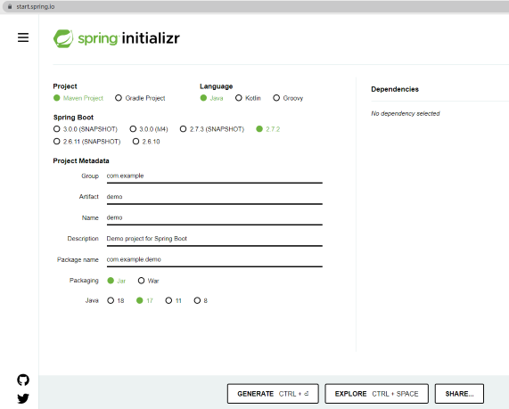


> 方法二：IDEA创建

1. 新建项目
2. 选择Spring Initializer
3. 填写项目信息
4. 选择组件(web等)

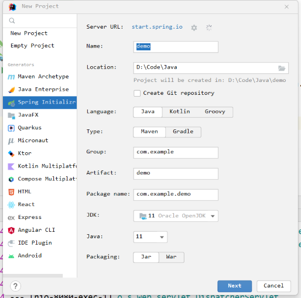

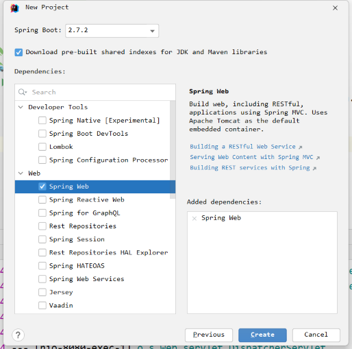


**项目结构**

通过上面步骤完成了基础项目的创建。就会自动生成以下文件。

1. 程序的主启动类(主程序需要和其他包平级)

2. 一个 application.properties 配置文件

3. 一个 测试类

4. 一个 pom.xml

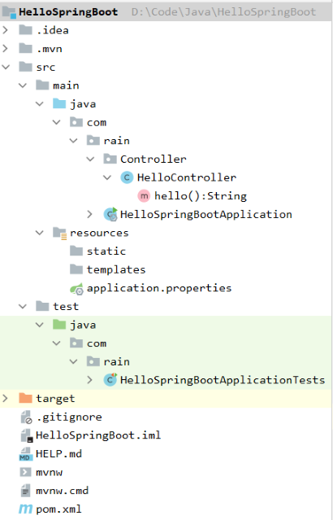

```java
//主启动类
@SpringBootApplication
public class HelloSpringBootApplication {
    public static void main(String[] args) {
        SpringApplication.run(HelloSpringBootApplication.class, args);
    }
}
```

```xml
<!-- 父依赖 -->
<parent>
    <groupId>org.springframework.boot</groupId>
    <artifactId>spring-boot-starter-parent</artifactId>
    <version>2.7.2</version>
    <relativePath/> <!-- lookup parent from repository -->
</parent>

<dependencies>
    <!-- web场景启动器 -->
    <dependency>
        <groupId>org.springframework.boot</groupId>
        <artifactId>spring-boot-starter-web</artifactId>
    </dependency>

    <!-- springboot单元测试 -->
    <dependency>
        <groupId>org.springframework.boot</groupId>
        <artifactId>spring-boot-starter-test</artifactId>
        <scope>test</scope>
    </dependency>
</dependencies>
```


**编写http接口**

```java
@RestController
public class HelloController {
    @RequestMapping("/hello")
    public String hello(){
        return "hello SpringBoot";
    }
}
```

启动主启动类，访问localhost:8080/hello


**打包部署**

pom.xml添加插件

````xml
<build>
	<plugins>
		<plugin>
			<groupId>org.springframework.boot</groupId>
			<artifactId>spring-boot-maven-plugin</artifactId>
		</plugin>
	</plugins>
</build>
````

在IDEA的Maven插件上点击运行 clean 、package，把工程项目的打包成jar包，打包好的jar包被生成在工程项目的target文件夹内。

用cmd运行`java -jar 项目.jar`，既可以运行工程项目。将jar包直接在目标服务器执行即可。


# 自动配置原理

## 依赖管理

在我们项目的pom.xml中，依赖`spring-boot-starter-parent`，它主要是管理项目的资源过滤及插件！

```xml
<parent>
    <groupId>org.springframework.boot</groupId>
    <artifactId>spring-boot-starter-parent</artifactId>
    <version>2.7.2</version>
    <relativePath/>
</parent>
```

在`spring-boot-starter-parent`依赖中，又依赖了`spring-boot-dependencies`，这个依赖才是真正管理SpringBoot依赖版本的地方，它几乎声明了所有开发中常用的依赖的版本号，自动版本仲裁机制

```xml
<parent>
  <groupId>org.springframework.boot</groupId>
  <artifactId>spring-boot-dependencies</artifactId>
  <version>2.7.2</version>
</parent>
```


**开发导入starter场景启动器**

1. 在我们项目的pom.xml中见到很多`spring-boot-starter-*`：*就某种场景

2. 只要引入starter，这个场景的所有常规需要的依赖都自动引入

3. 更多[SpringBoot所有支持的场景](https://docs.spring.io/spring-boot/docs/current/reference/html/using-spring-boot.html#using-boot-starter)

4. `*-spring-boot-starter`： 第三方为我们提供的简化开发的场景启动器。

5. 所有场景启动器最底层的依赖

   ````xml
   <dependency>
     <groupId>org.springframework.boot</groupId>
     <artifactId>spring-boot-starter</artifactId>
     <version>2.7.2</version>
     <scope>compile</scope>
   </dependency>
   ````

   

**无需关注版本号，自动版本仲裁**

1. 引入依赖默认都可以不写版本(在`spring-boot-dependencies`中已经定义好了)
2. 引入非版本仲裁的jar，要写版本号。

**修改默认版本号**

1. 进入`spring-boot-dependencies`maven配置文件，在`<properties>`标签下查看所要更改版本的key(比如mysql的key是`<mysql.version>`)

2. 在我们springboot项目的pom.xml中重写配置，如下面的代码。

   ````xml
   <properties>
   	<mysql.version>5.1.43</mysql.version>
   </properties>
   ````

   


## 自动配置特性

**例：自动配好Tomcat**

* 引入Tomcat依赖。

* 配置Tomcat

  ````xml
  <dependency>
  	<groupId>org.springframework.boot</groupId>
  	<artifactId>spring-boot-starter-tomcat</artifactId>
  	<version>2.3.4.RELEASE</version>
  	<scope>compile</scope>
  </dependency>
  ````


**自动配置SpringMVC**

* 引入SpringMVC全套组件
* 自动配好SpringMVC常用组件（功能）

**自动配好Web常见功能**，如：字符编码问题

* SpringBoot帮我们配置好了所有web开发的常见场景

  ````java
  public static void main(String[] args) {
      //1、返回我们IOC容器
      ConfigurableApplicationContext run = SpringApplication.run(MainApplication.class, args);
  
      //2、查看容器里面的组件
      String[] names = run.getBeanDefinitionNames();
      for (String name : names) {
          System.out.println(name);
      }
  }
  ````


**默认的包结构**

* 主程序所在包及其下面的所有子包里面的组件都会被默认扫描进来（**所以要让主程序和其它包平级**）

* 无需以前的包扫描配置

* 想要改变扫描路径`@SpringBootApplication(scanBasePackages="com.rain")`  //scanBasePackages="要扫描的包"

  或者

  ````java
  @ComponentScan 指定扫描路径
  @SpringBootApplication
  //等同于(因为SpringBootApplication是合成注解)
  @SpringBootConfiguration
  @EnableAutoConfiguration
  @ComponentScan("com.rain")
  ````

  

**各种配置拥有默认值**

* 默认配置最终都是映射到某个类上，如：MultipartProperties
* 配置文件的值最终会绑定每个类上，这个类会在容器中创建对象

**按需加载所有自动配置项**

* 非常多的starter
* 引入了哪些场景这个场景的自动配置才会开启
* SpringBoot所有的自动配置功能都在 `spring-boot-autoconfigure` 包里面
* …


## 容器功能

### @Configuration

* 包含Full模式与Lite模式

* 配置类里面使用`@Bean`标注在方法上给容器注册组件，默认单实例。配置类本身也是组件

* `proxyBeanMethods`：代理bean的方法

  * `Full(proxyBeanMethods = true)`保证每个`@Bean`方法被调用多少次返回的组件都是单实例

  * `Lite(proxyBeanMethods = false)`每个`@Bean`方法被调用多少次返回的组件都是新创建

* 组件依赖必须使用Full模式默认。其他默认是否Lite模式

```java
@Configuration(proxyBeanMethods = false)
public class MyConfig {
    /**
     * Full:外部无论对配置类中的这个组件注册方法调用多少次获取的都是之前注册容器中的单实例对象
     * @return
     */
    @Bean //给容器中添加组件。以方法名作为组件的id。返回类型就是组件类型。返回的值，就是组件在容器中的实例
    public User user(){
        User rain = new User("rain", 28);
        rain.setPet(tomcatPet());

        return rain;
    }

    @Bean("tom")
    public Pet tomcatPet(){
        return new Pet("tomcat");
    }
}

//测试代码如下
@SpringBootConfiguration
@EnableAutoConfiguration
@ComponentScan("com.rain")
public class MainApplication {
    public static void main(String[] args) {
        //1、返回我们IOC容器
        ConfigurableApplicationContext run = SpringApplication.run(MainApplication.class, args);

        //2、查看容器里面的组件
        String[] names = run.getBeanDefinitionNames();
        for (String name : names) {
            System.out.println(name);
        }

        //3、从容器中获取组件
        Pet tom01 = run.getBean("tom", Pet.class);
        Pet tom02 = run.getBean("tom", Pet.class);
        System.out.println("组件："+(tom01 == tom02));      //组件：true

        //4、com.rain.config.MyConfig@13ef7fa1
        MyConfig bean = run.getBean(MyConfig.class);
        System.out.println(bean);

        //如果@Configuration(proxyBeanMethods = true)代理对象调用方法。SpringBoot总会检查这个组件是否在容器中有。
        User user = bean.user();
        User user1 = bean.user();
        System.out.println(user == user1);  //false

        User user01 = run.getBean("user", User.class);
        Pet tom = run.getBean("tom", Pet.class);

        System.out.println("用户的宠物："+(user01.getPet() == tom));  //用户的宠物：false
    }
}
```

最佳实战

- 配置类组件之间**无依赖关系**用Lite模式加速容器启动过程，减少判断
- 配置类组件之间**有依赖关系**，方法会被调用得到之前单实例组件，用Full模式（默认）


### @Import

`@Import(javaBean.class)`会为容器中自动创建指定javaBean类型的组件，默认组件名就是全类名

```java
@Configuration(proxyBeanMethods = true)
@Import(Person.class)        //自动创建Person的bean组件，简化了使用@Bean注解的开发
public class MyConfig {
}

//测试
@SpringBootConfiguration
@EnableAutoConfiguration
@ComponentScan("com.rain")
public class MainApplication {
    public static void main(String[] args) {
        //返回我们IOC容器
        ConfigurableApplicationContext run = SpringApplication.run(MainApplication.class, args);
        System.out.println(run.getBean(Person.class));  //com.rain.Person@2b44605c
    }
}
```

@Import 高级用法： https://www.bilibili.com/video/BV1gW411W7wy?p=8


### @Conditional

条件装配，满足`@Conditional`指定条件，则进行组件注入


| @Conditional扩展注解            | 作用（判断是否满足当前指定条件）                 |
| ------------------------------- | ------------------------------------------------ |
| @ConditionalOnJava              | 系统的java版本是否符合要求                       |
| @ConditionalOnBean              | 容器中存在指定Bean；                             |
| @ConditionalOnMissingBean       | 容器中不存在指定Bean；                           |
| @ConditionalOnExpression        | 满足SpEL表达式指定                               |
| @ConditionalOnClass             | 系统中有指定的类                                 |
| @ConditionalOnMissingClass      | 系统中没有指定的类                               |
| @ConditionalOnSingleCandidate   | 容器中只有一个指定的Bean，或者这个Bean是首选Bean |
| @ConditionalOnProperty          | 系统中指定的属性是否有指定的值                   |
| @ConditionalOnResource          | 路径下是否存在指定资源文件                       |
| @ConditionalOnWebApplication    | 当前是web环境                                    |
| @ConditionalOnNotWebApplication | 当前不是web环境                                  |
| @ConditionalOnJndi              | JNDI存在指定项                                   |

```java
@ConditionalOnMissingBean(name = "tom")   //当容器中没有tom时，MyConfig生效，也可以注解在方法上
@ConditionalOnBean(name = "tom")          //当容器中有tom时，MyConfig生效，也可以注解在方法上
@Configuration(proxyBeanMethods = false) 
public class MyConfig {
}
```


​	

### @ImportResource

`@ImportResource`注解：和impotrt相似，引入的是xml文件，在xml文件中的Bean都注册到容器中

```xml
<!--bean.xml-->
<?xml version="1.0" encoding="UTF-8"?>
<beans xmlns="http://www.springframework.org/schema/beans"
       xmlns:xsi="http://www.w3.org/2001/XMLSchema-instance"
       xsi:schemaLocation="http://www.springframework.org/schema/beans http://www.springframework.org/schema/beans/spring-beans.xsd">
    <bean id="person" class="com.rain.Person">
        <property name="name" value="rain"/>
    </bean>
</beans>
```

```java
@Configuration(proxyBeanMethods = false)
@ImportResource("classpath:bean.xml")   //引入bean.xml的bean组件
public class MyConfig {
}

//测试
@SpringBootConfiguration
@EnableAutoConfiguration
@ComponentScan("com.rain")
public class MainApplication {
    public static void main(String[] args) {
        //返回我们IOC容器
        ConfigurableApplicationContext run = SpringApplication.run(MainApplication.class, args);
        System.out.println(run.getBean(Person.class));  //com.rain.Person@2b44605c
    }
}
```


### @ConfigurationProperties

读取properties文件中的内容

```properties
# application.properties
team.id=1
team.name=faze
```

> 传统方法：

```java
@org.junit.jupiter.api.Test
public void test1() throws IOException {
    Properties properties = new Properties();

    properties.load(new FileInputStream("application.properties"));
    Enumeration names = properties.propertyNames();
    
    while (names.hasMoreElements()) {
        String key = (String) names.nextElement();
        String value = properties.getProperty(key);
        System.out.println("key: " + key + " value: " + value);
    }
}
```


> 使用@ConfigurationProperties

`@ConfigurationProperties(prefix = "指定前缀")`读取的是application.properties配置文件中的内容

**方法一：@Component + @ConfigurationProperties**

```java
@Component
@ConfigurationProperties(prefix = "team")   //在application.properties中的team前缀
public class Team {
    private int id;                         //自动绑定team.id
    private String name;                    //自动绑定team.nama
}

//测试
@SpringBootConfiguration
@EnableAutoConfiguration
@ComponentScan("com.rain")
public class MainApplication {
    public static void main(String[] args) {
        ConfigurableApplicationContext run = SpringApplication.run(MainApplication.class, args);
        Team team = run.getBean(Team.class);
        System.out.println(team);
    }
}
```

**方法二：@EnableConfigurationProperties + @ConfigurationProperties**

`@EnableConfigurationProperties(xxx.class)`注解在配置类中，相当于开启xxx这个类的配置绑定功并且把这个类注册到容器中，省去了在这个类上面添加`@Component`

```java
@ConfigurationProperties(prefix = "team") //在application.properties中的team前缀
public class Team {
    private int id;
    private String name;
}
//配置类
@Configuration(proxyBeanMethods = false)
@EnableConfigurationProperties(Team.class)       //远程开启Team类
public class MyConfig {
}
//测试
@SpringBootConfiguration
@EnableAutoConfiguration
@ComponentScan("com.rain")
public class MainApplication {
    public static void main(String[] args) {
        ConfigurableApplicationContext run = SpringApplication.run(MainApplication.class, args);
        Team team = run.getBean(Team.class);
        System.out.println(team);
    }
}
```


## 自动配置原理入门

默认的主启动类，`@SpringBootApplication`标注一个主启动器类

```java
@SpringBootApplication
public class HelloSpringBootApplication {
    public static void main(String[] args) {
        //启动整个服务
        SpringApplication.run(HelloSpringBootApplication.class, args);
    }
}
```


### @SpringBootApplication

作用：标注在某个类上说明这个类是SpringBoot的主配置类，SpringBoot就应该运行这个类的main方法来启动SpringBoot应用；

```java
@Target({ElementType.TYPE})
@Retention(RetentionPolicy.RUNTIME)
@Documented
@Inherited
@SpringBootConfiguration
@EnableAutoConfiguration       //重点
@ComponentScan(excludeFilters = {@Filter(type = FilterType.CUSTOM,classes = {TypeExcludeFilter.class})
 , @Filter(type = FilterType.CUSTOM,classes ={AutoConfigurationExcludeFilter.class})})
public @interface SpringBootApplication {
}
```


#### @SpringBootConfiguration

作用：SpringBoot的配置类 ，标注在某个类上，表示这是一个SpringBoot的配置类；

```java
@Target({ElementType.TYPE})
@Retention(RetentionPolicy.RUNTIME)
@Documented
@Configuration   //说明这是一个配置类 ，配置类就是对应Spring的xml 配置文件；
@Indexed
public @interface SpringBootConfiguration {
    @AliasFor(
        annotation = Configuration.class
    )
    boolean proxyBeanMethods() default true;
}
```

继续往下看看`@Configuration`注解

```java
@Target({ElementType.TYPE})
@Retention(RetentionPolicy.RUNTIME)
@Documented
@Component   //看到了熟悉的Component注解，说明启动类本身也是Spring中的一个组件而已，负责启动应用！
public @interface Configuration {
    ......
}
```

下面回到`@SpringBootApplication`注解中，继续研究其他注解


#### @EnableAutoConfiguration

以前我们需要自己配置的东西，现在SpringBoot可以自动帮我们配置；`@EnableAutoConfiguration`告诉SpringBoot开启自动配置功能，这样自动配置才能生效；

```java
@Target({ElementType.TYPE})
@Retention(RetentionPolicy.RUNTIME)
@Documented
@Inherited
@AutoConfigurationPackage
@Import({AutoConfigurationImportSelector.class})   //重点
public @interface EnableAutoConfiguration {
	......
}
```

##### @AutoConfigurationPackage

```java
@Target({ElementType.TYPE})
@Retention(RetentionPolicy.RUNTIME)
@Documented
@Inherited
@Import({AutoConfigurationPackages.Registrar.class})  //给容器中导入一个组件
public @interface AutoConfigurationPackage {
    String[] basePackages() default {};

    Class<?>[] basePackageClasses() default {};
}
```

1. 利用Registrar给容器中导入一系列组件
2. 将指定的一个包下的所有组件导入到主启动器所在的包下(主启动类所在的包及包下面所有子包里面的所有组件扫描到Spring容器)


##### @Import({AutoConfigurationImportSelector.class})

导入`AutoConfigurationImportSelector`类，类中有以下的方法

* 利用`getAutoConfigurationEntry(annotationMetadata)`方法给容器中批量导入一些组件
* 调用`List<String> configurations = getCandidateConfigurations(annotationMetadata, attributes)`获取到所有需要导入到容器中的配置类
* 利用工厂加载 `Map<String, List<String>> loadSpringFactories(@Nullable ClassLoader classLoader)`得到所有的组件，内部调用`SpringFactoriesLoader.loadFactoryNames()`方法，他的内部又调用了`(List)loadSpringFactories(classLoaderToUse)`方法。在`loadSpringFactories(classLoaderToUse)`内部发现`classLoader.getResources("META-INF/spring.factories")`
  * 从META-INF/spring.factories位置来加载一个文件。
    * 默认扫描我们当前系统里面所有`META-INF/spring.factories`位置的文件
    * spring-boot-autoconfigure-2.3.4.RELEASE.jar包里面也有`META-INF/spring.factories`

**spring.factories文件**

看到了很多自动配置的文件；这就是自动配置根源所在！

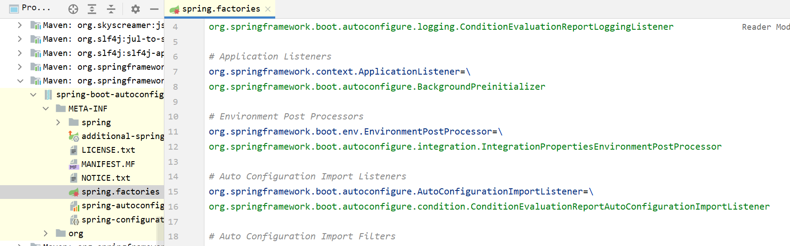

所以，自动配置真正实现是从classpath中搜寻所有的META-INF/spring.factories配置文件，并将其中对应的 org.springframework.boot.autoconfigure包下的配置项，通过反射实例化为对应标注了@Configuration的JavaConfig形式的IOC容器配置类，然后将这些都汇总成为一个实例并加载到IOC容器中。


结论：

* SpringBoot在启动的时候从类路径下的META-INF/spring.factories中获取EnableAutoConfiguration指定的值
* 将这些值作为自动配置类导入容器，自动配置类就生效，帮我们进行自动配置工作；
* 整个J2EE的整体解决方案和自动配置都在springboot-autoconfigure的jar包中；
* 它会给容器中导入非常多的自动配置类(xxxAutoConfiguration),就是给容器中导入这个场景需要的所有组件，并配置好这些组件；
* 有了自动配置类，免去了我们手动编写配置注入功能组件等的工作；
  

### 按需加载

1. 场景的所有自动配置启动的时候默认全部加载。xxxxAutoConfiguration
2. 最终是按照条件装配规则(`@Conditional`)来进行按需加载


### 修改默认配置

以`DispatcherServletAutoConfiguration`的内部类`DispatcherServletConfiguration`为例子:

````java
@Bean
@ConditionalOnBean(MultipartResolver.class)  //容器中有这个类型组件
@ConditionalOnMissingBean(name = DispatcherServlet.MULTIPART_RESOLVER_BEAN_NAME) //容器中没有这个名字 multipartResolver 的组件
public MultipartResolver multipartResolver(MultipartResolver resolver) {
	//给@Bean标注的方法传入了对象参数，这个参数的值就会从容器中找。
	//SpringMVC multipartResolver。防止有些用户配置的文件上传解析器不符合规范
	// Detect if the user has created a MultipartResolver but named it incorrectly
	return resolver;//给容器中加入了文件上传解析器；
}
````

SpringBoot默认会在底层配好所有的组件，但是**如果用户自己配置了以用户的优先**。

**总结：**

* SpringBoot先加载所有的自动配置类 xxxxxAutoConfiguration
* 每个自动配置类按照条件进行生效，默认都会绑定配置文件指定的值。（xxxxProperties里面读取，xxxProperties和配置文件进行了绑定）
* 生效的配置类就会给容器中装配很多组件
* 只要容器中有这些组件，相当于这些功能就有了
* 定制化配置
  * 用户直接自己`@Bean`替换底层的组件
  * 用户去看这个组件是获取的配置文件什么值就去修改。
* xxxxxAutoConfiguration —> 组件 —> xxxxProperties里面拿值 ----> application.properties


# 配置文件

**配置文件**

SpringBoot使用一个全局的配置文件，配置文件名称是固定的

- application.properties

- - 语法结构：`key=value`

- application.yml

- - 语法结构：`key：value`

**作用：**修改SpringBoot自动配置的默认值，因为SpringBoot在底层都给我们自动配置好了；

比如我们可以在配置文件中修改Tomcat默认启动的端口号！`server.port=8081`


**加载指定的配置文件**

`@PropertySource(value = "classpath:文件位置")`加载指定的配置文件

如果只需要获取配置文件中的某个值，可以使用`@value`；

```properties
# team
id=1
name=faze
```

```java
@PropertySource(value = "classpath:team.properties")
@Component
public class Team {
    @Value("${id}")
    private int id;
    @Value("${name}")
    private String name;
}
```

  

## yaml

YAML是"YAML Ain't a Markup Language" （YAML不是一种标记语言）的递归缩写。在开发的这种语言时，YAML的意思其实是："Yet Another Markup Language"（仍是一种标记语言）

**基本语法**

- `key: value`；kv之间有空格
- 大小写敏感
- 使用缩进表示层级关系
- 缩进不允许使用tab，只允许空格
- 缩进的空格数不重要，只要相同层级的元素左对齐即可
- `#`表示注释
- 字符串无需加引号，如果要加，单引号''、双引号""表示字符串内容会被 转义/不转义
  - `'rain \n upup'`   --> `rain \n upup`
  - `"rain \n upup"`   --> `rain 换行 upup`


**数据类型**

> 字面量：单个的、不可再分的值。date、boolean、string、number、null

````yaml
k: v
````

> 对象：键值对的集合。map、hash、set、object

````yaml
#行内写法
k: {k1:v1,k2:v2,k3:v3}

#或者
k: 
	k1: v1
	k2: v2
	k3: v3
````

> 数组：一组按次序排列的值。array、list、queue

````yaml
#行内写法
k: [v1,v2,v3]

#或
k: 
	- v1
	- v2
	- v3
````

**实例**

````java
@Data
@Component     //注入Bean
@ConfigurationProperties(prefix = "person")  //指定前缀
public class Person {
    private String userName;
    private Boolean boss;
    private Date birth;
    private Integer age;
    private Pet pet;
    private String[] interests;
    private List<String> animal;
    private Map<String, Object> score;
    private Set<Double> salarys;
    private Map<String, List<Pet>> allPets;
}

@Data
public class Pet {
    private String name;
    private Double weight;
}
````

````yaml
person:
  userName: zhangsan
  boss: false
  birth: 2019/12/12 20:12:33
  age: 18
  pet: 
    name: tomcat
    weight: 23.4
  interests: [篮球,游泳]
  animal: 
    - jerry
    - mario
  score:
    english: 
      first: 30
      second: 40
      third: 50
    math: [131,140,148]
    chinese: {first: 128,second: 136}
  salarys: [3999,4999.98,5999.99]
  allPets:
    sick:
      - {name: tom}
      - {name: jerry,weight: 47}
    health: [{name: mario,weight: 47}]
````


**配置文件占位符**

配置文件还可以编写占位符生成随机数

```yaml
user:
  username: rain${random.int}       #生成随机数
  age: 22
  pet:
    name: ${user.username:other}_tomcat #类似三目运算，user.username如果存在，则为username的值，不存在则为other
```


**配置提醒**

自定义的类和配置文件绑定一般没有提示。 (引入依赖)

```xml
<dependency>
    <groupId>org.springframework.boot</groupId>
    <artifactId>spring-boot-configuration-processor</artifactId>
    <optional>true</optional>
</dependency>
<plugin>
    <groupId>org.springframework.boot</groupId>
    <artifactId>spring-boot-maven-plugin</artifactId>
    <configuration>
        <excludes>
            <exclude>
                <groupId>org.springframework.boot</groupId>
                <artifactId>spring-boot-configuration-processor</artifactId>
            </exclude>
        </excludes>
    </configuration>
</plugin>
```


## 多配置文件

在不同的环境下，启动不同的配置文件；测试环境启动测试配置文件，发布环境启动发布配置文件

- 默认配置文件application.yaml/properties任何时候都会加载

- 指定环境配置文件application-{env}.yaml

- 激活指定环境

- - 方式一：在主配置文件application.yaml/properties中激活`spring.profiles.active=prod`
  - 方式二：命令行激活`java -jar xxx.jar   --spring.profiles.active=prod --person.name=haha`（修改配置文件的任意值，命令行优先）

- 默认配置与环境配置同时生效

- 同名配置项，profile配置优先


**测试**

```yaml
# application-test.yaml
team:
  name: faze
  
# application-prod.yaml
team:
  name: navi
```

```properties
# application.properties
# 启动test环境
spring.profiles.active=test
```

```java
@ConfigurationProperties(prefix = "team")  //team前缀
@Component
public class Team {
    private String name;
}
```


## yaml多文档块

可以把多个配置文件写在同一个yaml文档中，不需要创建多个配置文件

* `---`： 设置多个模块
* `spring:prolies:active`: 选择激活的模块
* `spring:prolies`: 为配置文件取名

```yaml
spring:
  profiles:
    active: test       #选择test环境
---
spring:
  profiles: test
team:
  name: faze
---
spring:
  profiles: dev
team:
  name: navi
```

````java
@ConfigurationProperties(prefix = "team")  //team前缀
@Component
public class Team {
    private String name;
}
````

注意：如果yml和properties同时都配置了端口，并且没有激活其他环境，默认会使用properties配置文件的！


**激活多组**

````properties
#激活mytest组
spring.profiles.active=mytest        

#myprod组
spring.profiles.group.myprod[0]=proddb    # application-proddb.properties
spring.profiles.group.myprod[1]=prodmq    # application-prodmq.properties
#mytest组
spring.profiles.group.mytest[0]=test    # application-test.properties
````


## 配置文件加载优先级

springboot 启动会扫描以下位置的application.properties或者application.yml文件作为Spring boot的默认配置文件：

* 优先级1：项目路径下的config文件夹配置文件
* 优先级2：项目路径下配置文件
* 优先级3：资源路径下的config文件夹配置文件
* 优先级4：资源路径下配置文件

优先级由高到底，高优先级的配置会覆盖低优先级的配置；

SpringBoot会从这四个位置全部加载主配置文件；互补配置；

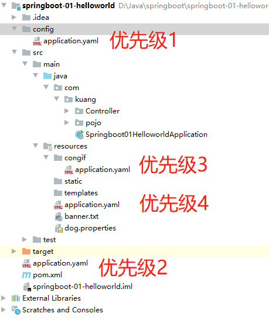

**指定位置加载配置文件**

可以通过`spring.config.location`来改变默认的配置文件位置

**使用命令行：**项目打包好以后，可以使用命令行参数的形式，启动项目的时候来指定配置文件的新位置；相同配置，**外部指定的配置文件优先级最高**`java -jar 项目.jar --spring.config.location=D:/application.properties`

例：

* 在/spingboot目录下创建application.properties
* 在/spingboot/config目录下创建application.properties
  * `java -jar 项目.jar --spring.config.location=D:/springboot/application.properties`
* /spingboot/config目录下的application.properties会覆盖/spingboot录下的application.properties


# Web开发

## web开发简介

Spring Boot provides auto-configuration for Spring MVC that works well with most applications.(大多场景我们都无需自定义配置)

The auto-configuration adds the following features on top of Spring’s defaults:

* Inclusion of `ContentNegotiatingViewResolver` and `BeanNameViewResolver` beans.

  * 内容协商视图解析器和BeanName视图解析器

* Support for serving static resources, including support for WebJars (covered later in this document)).

  * 静态资源(包括webjars)

* Automatic registration of `Converter`, `GenericConverter`, and `Formatter` beans.

  * 自动注册 `Converter`，`GenericConverter`，`Formatter`

* Support for `HttpMessageConverters` (covered later in this document).

  * 支持 `HttpMessageConverters` (后来我们配合内容协商理解原理)

* Automatic registration of `MessageCodesResolver` (covered later in this document).

  * 自动注册 `MessageCodesResolver` (国际化用)

* Static `index.html` support.

  * 静态`index.html` 页支持

* Custom `Favicon` support (covered later in this document).

  * 自定义 `Favicon`

* Automatic use of a `ConfigurableWebBindingInitializer` bean (covered later in this document).

  * 自动使用 `ConfigurableWebBindingInitializer`，(DataBinder负责将请求数据绑定到JavaBean上)

  

> If you want to keep those Spring Boot MVC customizations and make more MVC customizations (interceptors, formatters, view controllers, and other features), you can add your own @Configuration class of type WebMvcConfigurer but without @EnableWebMvc.
>
> 不用@EnableWebMvc注解。使用 @Configuration + WebMvcConfigurer 自定义规则

> If you want to provide custom instances of RequestMappingHandlerMapping, RequestMappingHandlerAdapter, or ExceptionHandlerExceptionResolver, and still keep the Spring Boot MVC customizations, you can declare a bean of type WebMvcRegistrations and use it to provide custom instances of those components.
>
> 声明 WebMvcRegistrations 改变默认底层组件

> If you want to take complete control of Spring MVC, you can add your own @Configuration annotated with @EnableWebMvc, or alternatively add your own @Configuration-annotated DelegatingWebMvcConfiguration as described in the Javadoc of @EnableWebMvc.
>
> 使用 @EnableWebMvc+@Configuration+DelegatingWebMvcConfiguration 全面接管SpringMVC
> 


## 静态资源

### 静态资源目录

静态资源目录：/resources、/static、/public、/META-INT/resource

只需要访问`项目路径/+静态资源名` 即可

原理：静态映射`/**`。请求进来，先去找Controller看能不能处理。不能处理的所有请求又都交给静态资源处理器。静态资源也找不到则响应404页面。

**访问优先级**

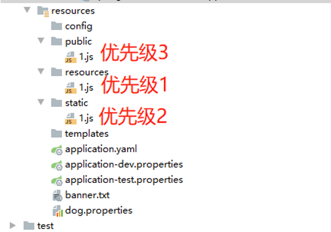


**改变默认的静态资源路径**

使用：`spring.web.resources.static-locations` 更静态资源路径，更改后/static、/public、/resources、/META-INT/resource 路径失效

注意：只是更改了资源路径

```yaml
spring:
  web:
    resources:
      static-locations: classpath:/rain/,classpath:/hehe/ # 更改静态资源路径
```

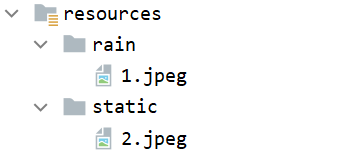

访问：`localhost:8080/1.jpeg`可以访问，访问`localhost:8080/2.jpeg` 失效


**静态资源访问前缀**

使用：`spring.mvc.static-path-pattern`更改静态资源访问前缀

```yaml
spring:
  mvc:
    static-path-pattern: /rain/**
```

注解：访问时必须添加前缀

访问 `项目路径 + static-path-pattern + 静态资源名`即：`localhost:8080/rain/1.jpeg`


### **webjars**

WebJars是将web前端资源（js，css等）打成jar包文件，然后借助Maven工具，以jar包形式对web前端资源进行统一依赖管理，保证这些Web资源版本唯一性。WebJars的jar包部署在Maven中央仓库上。

个人理解：主要是让前端使用后端maven导入的包

````xml
<!--需要jQuery依赖-->
<dependency>
    <groupId>org.webjars</groupId>
    <artifactId>jquery</artifactId>
    <version>3.5.1</version>
</dependency>
````

前端可以使用`<script src="/webjars/jquery/3.5.1/包名"></script>`  来导入后端引入的包

**例：**添加js或者css库

````xml
<dependency>  
    <groupId>org.webjars</groupId>  
    <artifactId>bootstrap</artifactId>  
    <version>3.3.7-1</version>  
</dependency>  
<dependency>  
    <groupId>org.webjars</groupId>  
    <artifactId>jquery</artifactId>  
    <version>3.1.1</version>  
</dependency>  
````

````html
<head>  
    <script src="/webjars/jquery/3.1.1/jquery.min.js"></script>  
    <script src="/webjars/bootstrap/3.3.7-1/js/bootstrap.min.js"></script>
    <link rel="stylesheet" href="/webjars/bootstrap/3.3.7-1/css/bootstrap.min.css" />  
</head>  
````

**取消版本号**

````xml
<dependency>  
    <groupId>org.webjars</groupId>  
    <artifactId>webjars-locator</artifactId>  
    <version>0.31</version>  
</dependency>  
````

上面的代码变为

````html
<head>  
    <script src="/webjars/jquery/jquery.min.js"></script>  
    <script src="/webjars/bootstrap/js/bootstrap.min.js"></script>
    <link rel="stylesheet" href="/webjars/bootstrap/css/bootstrap.min.css" />  
</head>  
````


### 欢迎页面

静态资源路径下 index.html

* 可以配置静态资源路径
* 但是不可以配置静态资源的访问前缀。否则导致index.html不能被默认访问

````yaml
spring:
#  mvc:
#    static-path-pattern: /rain/**   这个会导致welcome page功能失效
  web:
    resources:
      static-locations: classpath:/rain/,classpath:/hehe/ # 更改静态资源路径
````

直接访问`http://localhost:8080/`即可访问index.html


### 自定义 Favicon

只需要将favicon.ico放在任意静态目录下即可

同样不可以设置静态资源前缀


### 静态资源配置原理

`org.springframework.boot.autoconfigure.web.servlet.WebMvcAutoConfiguration`

* SpringBoot启动默认加载 xxxAutoConfiguration 类（自动配置类）

* SpringMVC功能的自动配置类`WebMvcAutoConfiguration`，生效

```java
@AutoConfiguration(
    after = {DispatcherServletAutoConfiguration.class, TaskExecutionAutoConfiguration.class, ValidationAutoConfiguration.class}
)
@ConditionalOnWebApplication(
    type = Type.SERVLET
)
@ConditionalOnClass({Servlet.class, DispatcherServlet.class, WebMvcConfigurer.class})
@ConditionalOnMissingBean({WebMvcConfigurationSupport.class})
@AutoConfigureOrder(-2147483638)
public class WebMvcAutoConfiguration {
}
```

`WebMvcAutoConfiguration` 下的静态内部类 `WebMvcAutoConfigurationAdapter`

```java
@Configuration(proxyBeanMethods = false)
@Import({EnableWebMvcConfiguration.class})
@EnableConfigurationProperties({WebMvcProperties.class, WebProperties.class})
@Order(0)
public static class WebMvcAutoConfigurationAdapter implements WebMvcConfigurer, ServletContextAware {
}
```

可以发现远程开启了`WebMvcProperties.class`, `WebProperties.class`的配置绑定功能，并把它们加入容器中

```java
@ConfigurationProperties(prefix = "spring.mvc")
public class WebMvcProperties {}

@ConfigurationProperties("spring.web")
public class WebProperties {}
```

配置文件的相关属性和xxx进行了绑定。`WebMvcProperties`代表`spring.mvc`、`ResourceProperties`代表`spring.resources`

`WebMvcAutoConfigurationAdapter`的有参构造器

```java
//有参构造器所有参数的值都会从容器中确定
//WebProperties 获取和spring.web绑定的所有的值的对象
//WebMvcProperties 获取和spring.mvc绑定的所有的值的对象
//ListableBeanFactory Spring的beanFactory
//HttpMessageConverters 找到所有的HttpMessageConverters
//ResourceHandlerRegistrationCustomizer 找到 资源处理器的自定义器。=========
//DispatcherServletPath  
//ServletRegistrationBean 给应用注册Servlet、Filter....
public WebMvcAutoConfigurationAdapter(WebProperties webProperties, 
                                      WebMvcProperties mvcProperties, 
                                      ListableBeanFactory beanFactory,
                                      ObjectProvider<HttpMessageConverters> messageConvertersProvider,
                                      ObjectProvider<ResourceHandlerRegistrationCustomizer>
                                      resourceHandlerRegistrationCustomizerProvider,
                                      ObjectProvider<DispatcherServletPath> dispatcherServletPath,
                                      ObjectProvider<ServletRegistrationBean<?>> servletRegistrations) {
    this.resourceProperties = webProperties.getResources();
    this.mvcProperties = mvcProperties;
    this.beanFactory = beanFactory;
    this.messageConvertersProvider = messageConvertersProvider;
    this.resourceHandlerRegistrationCustomizer = (ResourceHandlerRegistrationCustomizer)resourceHandlerRegistrationCustomizerProvider.getIfAvailable();
    this.dispatcherServletPath = dispatcherServletPath;
    this.servletRegistrations = servletRegistrations;
    this.mvcProperties.checkConfiguration();
}
```

> **资源处理的默认规则：** 

`WebMvcAutoConfigurationAdapter`的`addResourceHandlers()`方法

```java
public void addResourceHandlers(ResourceHandlerRegistry registry) {
    if (!this.resourceProperties.isAddMappings()) {
        logger.debug("Default resource handling disabled");
    } else {
        this.addResourceHandler(registry, "/webjars/**", "classpath:/META-INF/resources/webjars/");
        this.addResourceHandler(registry, this.mvcProperties.getStaticPathPattern(), (registration) -> {
            registration.addResourceLocations(this.resourceProperties.getStaticLocations());
            if (this.servletContext != null) {
                ServletContextResource resource = new ServletContextResource(this.servletContext, "/");
                registration.addResourceLocations(new Resource[]{resource});
            }

        });
    }
}
```

进入`this.resourceProperties.getStaticLocations()`内，发现又来到`WebProperties`类内。在其内部静态类`Resources`中定义了一下内容。这就是默认的静态资源路径

```java
private static final String[] CLASSPATH_RESOURCE_LOCATIONS = new String[]{
    "classpath:/META-INF/resources/",
    "classpath:/resources/", 
    "classpath:/static/", 
    "classpath:/public/"};
```

```yaml
# 禁用所有静态资源规则
spring:
  web:
    resources:
      add-mappings: false  
```


> **欢迎页的处理规则**

`WebMvcAutoConfiguration`下静态内部类`EnableWebMvcConfiguration`的`WelcomePageHandlerMapping()`方法

```java
@Bean
public WelcomePageHandlerMapping welcomePageHandlerMapping(ApplicationContext applicationContext, FormattingConversionService mvcConversionService, ResourceUrlProvider mvcResourceUrlProvider) {
    //调用了WelcomePageHandlerMapping类
    WelcomePageHandlerMapping welcomePageHandlerMapping = new WelcomePageHandlerMapping(new TemplateAvailabilityProviders(applicationContext), applicationContext, this.getWelcomePage(), this.mvcProperties.getStaticPathPattern());
    welcomePageHandlerMapping.setInterceptors(this.getInterceptors(mvcConversionService, mvcResourceUrlProvider));
    welcomePageHandlerMapping.setCorsConfigurations(this.getCorsConfigurations());
    return welcomePageHandlerMapping;
}
//下面是WelcomePageHandlerMapping的构造器
WelcomePageHandlerMapping(TemplateAvailabilityProviders templateAvailabilityProviders, ApplicationContext applicationContext, Resource welcomePage, String staticPathPattern) {
    if (welcomePage != null && "/**".equals(staticPathPattern)) {
        // 要用欢迎页功能，必须是/**
        logger.info("Adding welcome page: " + welcomePage);
        this.setRootViewName("forward:index.html");
    } else if (this.welcomeTemplateExists(templateAvailabilityProviders, applicationContext)) {
        // 调用Controller  /index
        logger.info("Adding welcome page template: index");
        this.setRootViewName("index");
    }
}
```


## 请求处理

### 请求映射

**@xxxMapping;**

* @GetMapping、@PostMapping、@PutMapping、@DeleteMapping


> **Rest风格支持**（使用HTTP请求方式动词来表示对资源的操作）          

|         以前          |       现在        |
| :-------------------: | :---------------: |
|  /getUser  获取用户   | user GET-获取用户 |
|  /saveUser 保存用户   |   POST-保存用户   |
| /deleteUser 删除用户  |  DELETE-删除用户  |
| /updateUser  修改用户 |   PUT-修改用户    |

核心Filter；HiddenHttpMethodFilter

**用法**

- 开启页面表单的Rest功能`spring.mvc.hiddenmethod.filter.enabled=true`
- GetMapping、PostMapping自带，不要特殊编写，但是Put和Delect需要编写
  *  在`<form method="post">`标签下添加`<input type="hidden" name="_method" value="put/delete">`

开启页面表单的Rest功能:`spring.mvc.hiddenmethod.filter.enabled=true`

````yaml
spring:
  mvc:
    hiddenmethod:
      filter:
        enabled: true   #开启页面表单的Rest功能
````

```html
<form action="user" method="get">
    <input type="submit">
</form>
<form action="user" method="post">
    <input type="submit">
</form>
<form action="user" method="post">
    <input type="hidden" name="_method" value="PUT">
    <input type="submit">
</form>
<form action="user" method="post">
    <input type="hidden" name="_method" value="DELETE">
    <input type="submit">
</form>
```

```java
@RestController
public class HelloController {
    @GetMapping("/user")
    public String getUser(){
        return "get请求";
    }
    @PostMapping("/user")
    public String saveUser(){
        return "post请求";
    }
    @PutMapping("/user")
    public String updateUser(){
        return "put请求";
    }
    @DeleteMapping("/user")
    public String deleteUser(){
        return "delete请求";
    }
}
```

**Rest原理**（表单提交要使用REST的时候）

* 表单提交会带上`_method=PUT`
* 请求过来被`HiddenHttpMethodFilter`拦截
  * 请求是否正常，并且是POST
    * 获取到\_method的值。
    * 兼容以下请求；PUT/DELETE/PATCH
    * 原生request(post)，包装模式`requesWrapper`重写了`getMethod`方法，返回的是传入的值。
    * 过滤器链放行的时候用`wrapper`。以后的方法调用`getMethod`是调用`requesWrapper`的。

**修改默认的_method**

```java
//在配置文件中添加
@Configuration(proxyBeanMethods = false)
public class MyConfig {
    @Bean
    public HiddenHttpMethodFilter hiddenHttpMethodFilter(){
        HiddenHttpMethodFilter methodFilter = new HiddenHttpMethodFilter();
        methodFilter.setMethodParam("_rain");
        return methodFilter;
    }
}
```


#### 请求映射原理

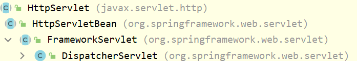

SpringMVC功能分析都从 `org.springframework.web.servlet.DispatcherServlet`的`doDispatch()`方法

```java
protected void doDispatch(HttpServletRequest request, HttpServletResponse response) throws Exception {
   HttpServletRequest processedRequest = request;
   HandlerExecutionChain mappedHandler = null;
   boolean multipartRequestParsed = false;

   WebAsyncManager asyncManager = WebAsyncUtils.getAsyncManager(request);

   try {
      ModelAndView mv = null;
      Exception dispatchException = null;

      try {
         processedRequest = checkMultipart(request);
         multipartRequestParsed = (processedRequest != request);

		 // 找到当前请求使用哪个Handler（Controller的方法）处理
         // HandlerMapping：处理器映射 /xxx->>xxxx
         mappedHandler = getHandler(processedRequest);
         
         ......
             
// getHandler方法如下     
@Nullable
protected HandlerExecutionChain getHandler(HttpServletRequest request) throws Exception {
    if (this.handlerMappings != null) {
        for (HandlerMapping mapping : this.handlerMappings) {
            HandlerExecutionChain handler = mapping.getHandler(request);
            if (handler != null) {
                return handler;
            }
        }
    }
    return null;
}
```


`RequestMappingHandlerMapping`：保存了所有`@RequestMapping`和`handler`的映射规则。到目前为止已经知道哪个方法可以处理我们的请求了

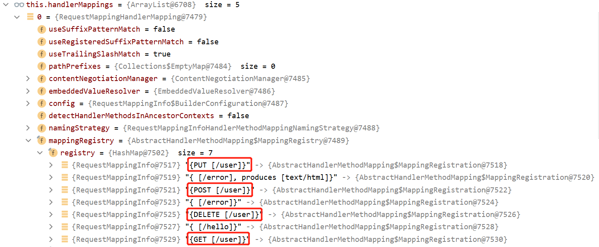


所有的请求映射都在`HandlerMapping`中。

- SpringBoot自动配置欢迎页的`WelcomePageHandlerMapping`访问`/`能访问到index.html；

- SpringBoot自动配置了默认的`RequestMappingHandlerMapping`

- 请求进来，挨个尝试所有的`HandlerMapping`看是否有请求信息。

- - 如果有就找到这个请求对应的`handler`
  - 如果没有就是下一个`HandlerMapping`


### 参数注解

| 注解              | 描述                                                         |
| ----------------- | ------------------------------------------------------------ |
| @PathVariable     | 路径变量                                                     |
| @RequestHeader    | 获取请求头                                                   |
| @RequestParam     | 获取请求参数 (指问号后的参数，url?a=1&b=2)                   |
| @CookieValue      | 获取Cookie值                                                 |
| @RequestAttribute | 获取request域属性 (可以添加required = false属性 表示请求中不是必须有value=""的值) |
| @RequestBody      | 获取请求体[POST]                                             |
| @MatrixVariable   | 矩阵变量 (添加pathVer = "url地址变量" 指定属于哪个地址变量)  |
| @ModelAttribute   |                                                              |

详细见springMVC篇

**@MatrixVariable与UrlPathHelper**

1. 请求路径：`/cars/sell;low=34;brand=byd,audi,yd` 第一个`;`前是请求地址(sell随便填)`;`后是kv键值对

2. SpringBoot默认是禁用了矩阵变量的功能

   手动开启：对于路径的处理。`UrlPathHelper`的`removeSemicolonContent`设置为`false`，让其支持矩阵变量的。

3. 矩阵变量必须有url路径变量才能被解析

开启矩阵：

```java
//方式一：实现WebMvcConfigurer接口
@Configuration(proxyBeanMethods = false)
public class WebConfig implements WebMvcConfigurer {
    @Override
    public void configurePathMatch(PathMatchConfigurer configurer) {

        UrlPathHelper urlPathHelper = new UrlPathHelper();
        // 不移除；后面的内容。矩阵变量功能就可以生效
        urlPathHelper.setRemoveSemicolonContent(false);
        configurer.setUrlPathHelper(urlPathHelper);
    }
}

//方式二：创建返回WebMvcConfigurerBean：
@Configuration(proxyBeanMethods = false)
public class MyConfig {
    @Bean
    public WebMvcConfigurer webMvcConfigurer(){
        return new WebMvcConfigurer(){
            @Override
            public void configurePathMatch(PathMatchConfigurer configurer) {
                UrlPathHelper urlPathHelper = new UrlPathHelper();
                urlPathHelper.setRemoveSemicolonContent(false);
                configurer.setUrlPathHelper(urlPathHelper);
            }
        };
    }
}
```

```java
//http://localhost:8080/team/dawdaw;name=faze;id=12
@RequestMapping("/team/{path}")
public String team(@MatrixVariable("name") String name,
                   @MatrixVariable("id") int id){
    System.out.println(name + id);
    return ":)";
}
//http://localhost:8080/team/wadad;name=faze/dawda;name=navi
@RequestMapping("/team/{team1}/{team2}")
public String team(@MatrixVariable(value = "name",pathVar = "team1") String name1,
                   @MatrixVariable(value = "name",pathVar = "team2") String name2){
    System.out.println(name1 + name2);
    return ":)";
}
```

 

#### 参数注解原理

[bilibili](https://www.bilibili.com/video/BV19K4y1L7MT)

阅读顺序：`DispatcherServlet` --> `HandlerAdapter` --> `执行目标方法` --> `参数解析器` --> `返回值处理器` --> `真正执行目标方法` --> `获取目标方法参数值` --> `判断解析器是否支持当前参数类型` --> `获取目标方法参数值` --> `如何解析这个参数的值` --> `获取目标方法参数值` --> `真正执行目标方法` --> `执行目标方法` --> `HandlerAdapter` --> `DispatcherServlet`


##### DispatcherServlet

还是从`org.springframework.web.servlet.DispatcherServlet`的`doDispatch()`方法中分析

```java
protected void doDispatch(HttpServletRequest request, HttpServletResponse response) throws Exception {
   HttpServletRequest processedRequest = request;
   HandlerExecutionChain mappedHandler = null;
   boolean multipartRequestParsed = false;

   WebAsyncManager asyncManager = WebAsyncUtils.getAsyncManager(request);

   try {
      ModelAndView mv = null;
      Exception dispatchException = null;

      try {
         processedRequest = checkMultipart(request);
         multipartRequestParsed = (processedRequest != request);

         // 找到当前请求使用哪个Handler（Controller的方法）处理
         // HandlerMapping：处理器映射 /xxx->>xxxx
         mappedHandler = getHandler(processedRequest);
         if (mappedHandler == null) {
            noHandlerFound(processedRequest, response);
            return;
         }
		 //以上的代码已经分析过了，执行完上面的代码，springBoot已经知道用哪个方法执行请求了
         
         // Determine handler adapter for the current request.  为当前请求确定一个处理器适配器
         HandlerAdapter ha = getHandlerAdapter(mappedHandler.getHandler()); //此次分析源码的重点
          
         ......
         if (!mappedHandler.applyPreHandle(processedRequest, response)) {  //拦截器
             return;
         }
          
         //执行目标方法，稍后介绍
         mv = ha.handle(processedRequest, response, mappedHandler.getHandler());
```

通过`mappedHandler.getHandler()`找到一个能处理当前请求的Handler(处理器)，`getHandlerAdapter()`得到这个处理器，并为其找到`HandlerAdapter`(处理器适配器)。`HandlerAdapter`是一个大型的反射工具，执行目标方法并确定方法参数的每一个值

##### HandlerAdapter

```java
protected HandlerAdapter getHandlerAdapter(Object handler) throws ServletException {
    if (this.handlerAdapters != null) {
        for (HandlerAdapter adapter : this.handlerAdapters) {  //遍历所有的handlerAdapter
            if (adapter.supports(handler)) {                   //查看是否支持当前这个adapter
                return adapter;                                //支持，就返回出去
            }
        }
    }
}
//===========adapter.supports(handler)调用的supports()方法===================
@Override
public final boolean supports(Object handler) {
    return (handler instanceof HandlerMethod && supportsInternal((HandlerMethod) handler));
}
```


经过上面的步骤，`getHandlerAdapter()`方法返回一个`RequestMappingHandlerMapping`赋给`HandlerAdapter ha`


##### 执行目标方法

`org.springframework.web.servlet.DispatcherServlet`的`doDispatch()`方法继续向下执行

```java
//Actually invoke the handler. 真正执行
mv = ha.handle(processedRequest, response, mappedHandler.getHandler());   //主要

//调用AbstractHandlerMethodAdapter类的handle()方法
public final ModelAndView handle(HttpServletRequest request, HttpServletResponse response, Object handler) throws Exception {
    return handleInternal(request, response, (HandlerMethod) handler);    //主要
}

//调用RequestMappingHandlerAdapter类的handleInternal()方法
protected ModelAndView handleInternal(HttpServletRequest request,
        HttpServletResponse response, HandlerMethod handlerMethod) throws Exception {
    ModelAndView mav;
    checkRequest(request);
    ......
    // No HttpSession available -> no mutex necessary
    mav = invokeHandlerMethod(request, response, handlerMethod);   //核心,执行目标方法
	......
    return mav;
}
```


##### 参数解析器

`HandlerMethodArgumentResolver`功能确定将要执行的目标方法的每一个参数的值是什么;

SpringMVC目标方法能写多少种参数类型，取决于参数解析器。(目前有26-27个参数解析器)

```java
//上面的代码调用了自身类的invokeHandlerMethod()方法
@Nullable
protected ModelAndView invokeHandlerMethod(HttpServletRequest request,
      HttpServletResponse response, HandlerMethod handlerMethod) throws Exception {
	  ......
      ServletInvocableHandlerMethod invocableMethod = createInvocableHandlerMethod(handlerMethod);
      //参数解析器，包含了对我们熟悉的@RequestHeader、@RequestParam等注解的解析
      if (this.argumentResolvers != null) {  
         invocableMethod.setHandlerMethodArgumentResolvers(this.argumentResolvers);
      }
      //返回值处理器,等会介绍
      if (this.returnValueHandlers != null) {
         invocableMethod.setHandlerMethodReturnValueHandlers(this.returnValueHandlers);
      }
    
    //真正执行目标方法，下面 真正执行目标方法 中介绍
    invocableMethod.invokeAndHandle(webRequest, mavContainer);          //主要
```

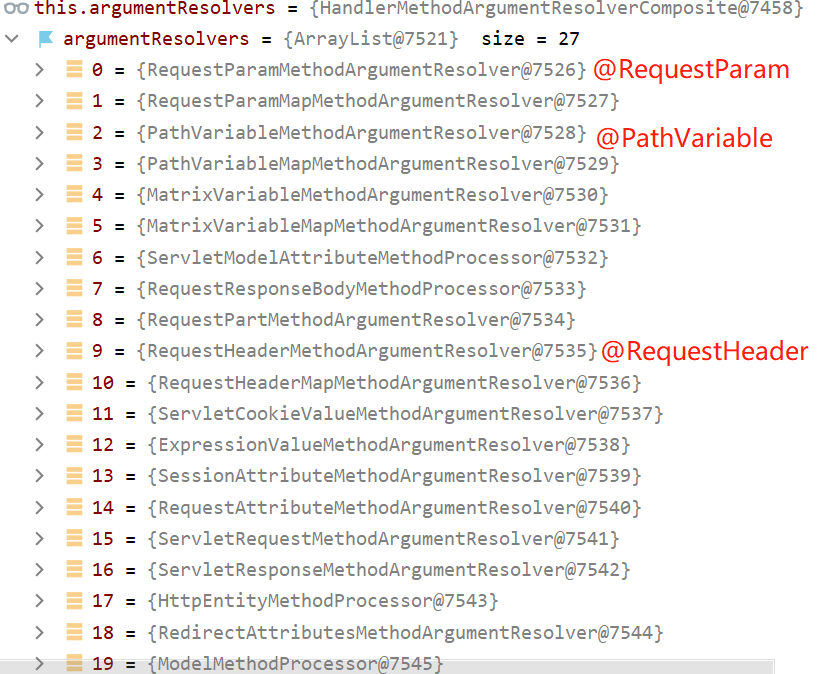

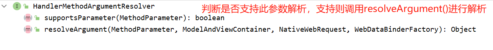

`HandleMethodArgumentResolver`是个接口，这27个参数处理器都实现了他

- 当前解析器是否支持解析这种参数
- 支持就调用 `resolveArgument()`


##### 返回值处理器

一共15种返回值处理器

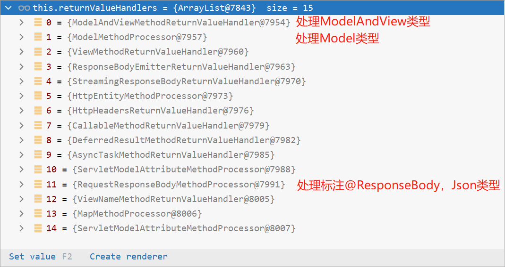

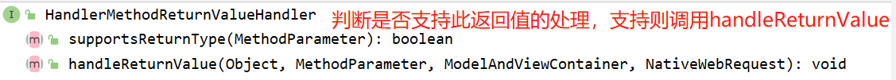

`HandleMethodReturnValueHandler`是个接口，这15个返回值处理器都实现了他


##### 真正执行目标方法

还是在`RequestMappingHandlerAdapter`类`invokeHandlerMethod()`方法中

````java
invocableMethod.invokeAndHandle(webRequest, mavContainer);    //主要

//调用了ServletInvocableHandlerMethod类的invokeAndHandle()方法
public void invokeAndHandle(ServletWebRequest webRequest, ModelAndViewContainer mavContainer,
        Object... providedArgs) throws Exception {
    //真真真正执行了目标方法(我们controller内的方法)，并返回目标方法的返回值
    Object returnValue = invokeForRequest(webRequest, mavContainer, providedArgs);    //主要
    .......
} 
    
//调用InvocableHandlerMethod类的invokeForRequest()方法
@Nullable
public Object invokeForRequest(NativeWebRequest request, @Nullable ModelAndViewContainer mavContainer, Object... providedArgs) throws Exception {
    //获取目标方法的所有参数值(@PathVariable/@RequestParam等)
    Object[] args = this.getMethodArgumentValues(request, mavContainer, providedArgs);  //主要

    return this.doInvoke(args);  //利用反射调用目标方法，不需要了解
}
````


##### 获取目标方法参数值

```java
//上面的方法调用了InvocableHandlerMethod类的getMethodArgumentValues()方法
//这个方法的作用是返回目标方法的所有参数
protected Object[] getMethodArgumentValues(NativeWebRequest request, @Nullable ModelAndViewContainer mavContainer, Object... providedArgs) throws Exception {
    //获得方法所有的参数声明
    //比如第一个参数标注了什么注解,索引位置是多少，参数类型是什么
    MethodParameter[] parameters = this.getMethodParameters();
    
    if (ObjectUtils.isEmpty(parameters)) {                //参数是否为空
        return EMPTY_ARGS;                                //为空，说明没有参数，直接返回
    } else {
        //创建一个数组，这里面真正存放了目标方法的参数。最后返回的也是这个数组
        Object[] args = new Object[parameters.length];  

        for(int i = 0; i < parameters.length; ++i) {      //循环遍历
            MethodParameter parameter = parameters[i];    //获取当前下标参数
            
            args[i] = findProvidedArgument(parameter, providedArgs); //为当前下标赋值

            //判断解析器是否支持当前参数类型
            //以下代码的分析跳转到 判断解析器是否支持当前参数类型 目录
            if (!this.resolvers.supportsParameter(parameter)) {      
                throw new IllegalStateException(formatArgumentError(parameter, "No suitable resolver"));
            }
            //经过了 判断解析器是否支持当前参数类型 的代码后，我们确定当前参数可以被解析

            try {
                //下面代码的分析跳转到 如何解析这个参数值 目录
                args[i] = this.resolvers.resolveArgument(parameter, mavContainer, 
                                                         request, this.dataBinderFactory);
                //经过上面的步骤，终于得到了参数的值
            } 
        }
        //循环得到参数值
        return args;   //返回参数值数组，层层返回，直到运行结束
    }
}
```


##### 判断解析器是否支持当前参数类型

下方代码，在后期源码学习中经常出现。包括如何解析ServletAPI类型参数、复杂类型参数、自定义类型参数中都会出现。因为无论什么参数，都必须使用参数解析器

重点：`resolver.supportsParameter(parameter)`调用的是26个不同类中的`supportsParameter()`方法(这26个类对应不同的参数解析器，随着springboot的发展，可能会出现更多的参数解析器)

```java
//上面的代码调用了HandlerMethodArgumentResolverComposite的supportsParameter()方法
public boolean supportsParameter(MethodParameter parameter) {
    return this.getArgumentResolver(parameter) != null;
}

//调用了自身的getArgumentResolver()方法
@Nullable
private HandlerMethodArgumentResolver getArgumentResolver(MethodParameter parameter) {
    HandlerMethodArgumentResolver result = this.argumentResolverCache.get(parameter);
   
    if (result == null) {
        Iterator var3 = this.argumentResolvers.iterator();  //获得springboot的所有参数解析器

        while(var3.hasNext()) {                             //遍历这些参数解析器,直到找到适合的解析器
            HandlerMethodArgumentResolver resolver = (HandlerMethodArgumentResolver)var3.next();
            //判断当前参数解析器是否支持当前参数,他所调用的不是同一个类的supportsParameter()方法
            if (resolver.supportsParameter(parameter)) {    //主要
                result = resolver;
                //放到缓存中，下一次就不用这么麻烦的找解析器了
                this.argumentResolverCache.put(parameter, resolver);  
                break;
            }
        }
    }
    return result;                                          //返回解析器
}

//第一次resolver.supportsParameter()调用RequestParamMethodArgumentResolver类的supportsParameter()方法
//作用判断是否支持对当前参数的解析
public boolean supportsParameter(MethodParameter parameter) {
    //判断当前参数是不是标了@RequestParam注解，
    //	没标则返回false，继续上面代码的遍历
    //  标了则返回true,说明就是当前这个解析器负责解析此参数
    if (parameter.hasParameterAnnotation(RequestParam.class)) {    
		......
    }
}
//假设第一次返回false
//第二次resolver.supportsParameter()调用RequestParamMapMethodArgumentResolver的supportsParameter()方法
public boolean supportsParameter(MethodParameter parameter) {
    //判断当前参数是不是标了@RequestParam注解
    //	没标则返回false，继续上面代码的遍历
    //  标了则返回true,说明就是当前这个解析器负责解析此参数
    RequestParam requestParam = (RequestParam)parameter.getParameterAnnotation(RequestParam.class);
    return requestParam != null && Map.class.isAssignableFrom(parameter.getParameterType()) 
        && !StringUtils.hasText(requestParam.name());
}
//循环测试，直到找到为止
......
```

执行完当前部分的代码后，返回到 `获取目标方法参数值` 目录，继续分析剩下的代码


##### 如何解析这个参数的值

```java
//调用了HandlerMethodArgumentResolverComposite类的resolveArgument()方法
@Nullable
public Object resolveArgument(MethodParameter parameter, @Nullable ModelAndViewContainer mavContainer, NativeWebRequest webRequest, @Nullable WebDataBinderFactory binderFactory) throws Exception {
    //获得解析当前参数的解析器
    HandlerMethodArgumentResolver resolver = this.getArgumentResolver(parameter);
    if (resolver == null) {
        //抛出错误
    } else {
        //执行当前方法解析器的resolveArgument()方法
        return resolver.resolveArgument(parameter, mavContainer, webRequest, binderFactory);
    }
}

//调用AbstractNamedValueMethodArgumentResolver类的resolveArgument()方法
public final Object resolveArgument(......) throws Exception {
    NamedValueInfo namedValueInfo = this.getNamedValueInfo(parameter);
    MethodParameter nestedParameter = parameter.nestedIfOptional();
    
    //解析当前参数的名(只是获取参数名)，namedValueInfo.name代表当前参数的名字。不继续向下看源码了
    Object resolvedName = this.resolveEmbeddedValuesAndExpressions(namedValueInfo.name);
   
        
    //得到参数的名之后，最终使用此步确定参数的值
    Object arg = this.resolveName(resolvedName.toString(), nestedParameter, webRequest);

    ......

    return arg;  //终于获得参数的值了
}
```

执行完当前部分的代码后，返回到 `获取目标方法参数值` 目录，继续分析剩下的代码


### 原生ServletAPI参数

在我们的方法中也可以放置一些原生的ServletAPI参数

`WebRequest`/`ServletRequest`/`MultipartRequest`/`HttpSession`/`PushBuilder`/`Principal`/`InputStream`/`Reader`/`HttpMethod`/`Locale`/`TimeZone`/`ZoneId`


#### 原生ServletAPI参数解析原理

看看源码如何解析`HttpServletRequest`等参数。同样沿用了以上源码的分析。

下面源码是 `判断解析器是否支持当前参数类型` 的拓展

```java
@RequestMapping("/goto")
public String test(HttpServletRequest request){
    return ":)";
}
```

```java
//解析方法和上方的代码一样
//resolver.supportsParameter()调用了ServletRequestMethodArgumentResolver的supportsParameter()方法
public boolean supportsParameter(MethodParameter parameter) {
   Class<?> paramType = parameter.getParameterType();
   //支持一下原生ServletAPI解析
   return (WebRequest.class.isAssignableFrom(paramType) ||             //是不是Request
         ServletRequest.class.isAssignableFrom(paramType) ||           //是不是ServletRequest
         MultipartRequest.class.isAssignableFrom(paramType) ||
         HttpSession.class.isAssignableFrom(paramType) ||              //HTTPSession
         (pushBuilder != null && pushBuilder.isAssignableFrom(paramType)) ||
         (Principal.class.isAssignableFrom(paramType) && !parameter.hasParameterAnnotations()) ||
         InputStream.class.isAssignableFrom(paramType) ||
         Reader.class.isAssignableFrom(paramType) ||
         HttpMethod.class == paramType ||
         Locale.class == paramType ||
         TimeZone.class == paramType ||
         ZoneId.class == paramType);
}
```

完成此步就获得了对应的参数解析器。下面就是如何解析参数了，跳转 `如何解析这个参数的值` 目录


### 复杂参数

`Map`/`Model`/`RedirectAttributes`（重定向携带数据）/`ServletResponse`（response）/`Errors`/`BindingResult`/`SessionStatus`/`UriComponentsBuilder`/`ServletUriComponentsBuilder`

`map`、`model`里面的数据会被放在`request`的请求域,通过`request.setAttribute`


#### 复杂参数解析原理

**测试代码**

```java
@GetMapping("/params")
public String testParam(Map<String,Object> map,
                        Model model,
                        HttpServletRequest request,
                        HttpServletResponse response) throws ServletException, IOException {

    //下面三位都是可以给request域中放数据
    map.put("team1","faze");
    model.addAttribute("team2","navi");
    request.setAttribute("team3","Cloud9");

    return "forward:/success";     //请求转发
}

@ResponseBody
@GetMapping("/success")
public Map success(HttpServletRequest request){
    Map<String,Object> map = new HashMap<>();
    Object team1 = request.getAttribute("team1");  //获取testParam方法存放的team1
    Object team2 = request.getAttribute("team2");
    Object team3 = request.getAttribute("team3");

    map.put("team1",team1);
    map.put("team2",team2);
    map.put("team3",team3);
    return map;
}
```

- `Map<String,Object> map`
- `Model model`
- `HttpServletRequest request`

三个存放的值，都会放入Request域中，可以使用`request.getAttribute()`取出


--------------------------------

下面主要研究`Map`、`Model`使用什么参数解析器

前期同样执行的是 `判断解析器是否支持当前参数类型` 目录的源码，定位到`resolver.supportsParameter(parameter)`

`mavContainer`是本次源码分析的重点

**Map参数**使用的是`MapMethodProcessor`处理器

```java
public class MapMethodProcessor implements HandlerMethodArgumentResolver, HandlerMethodReturnValueHandler {
    //resolver.supportsParameter()调用了MapMethodProcessor类的supportsParameter()方法
    public boolean supportsParameter(MethodParameter parameter) {
        return Map.class.isAssignableFrom(parameter.getParameterType()) &&
            parameter.getParameterAnnotations().length == 0;
    }
    //阅读 如何解析这个参数的值 目录
    //得到解析器后，最终返回到InvocableHandlerMethod的getMethodArgumentValues()方法
    //执行args[i] = this.resolvers.resolveArgument()方法，而这个方法调用的是不同参数解析器的resolveArgument()方法
    //也就是下方方法
    
    //最终执行此方法，进行解析
    @Nullable
    public Object resolveArgument(MethodParameter parameter, 
                                  @Nullable ModelAndViewContainer mavContainer, 
                                  NativeWebRequest webRequest, 
                                  @Nullable WebDataBinderFactory binderFactory) throws Exception {
        Assert.state(mavContainer != null, "ModelAndViewContainer is required for model exposure");
        //模型和视图集合器，会返回一个BindingAwareModelMap
        return mavContainer.getModel();  
    }
	......
}
```

**Model参数**使用的是`ModelMethodProcessor`处理器

```java
public class ModelMethodProcessor implements HandlerMethodArgumentResolver, HandlerMethodReturnValueHandler {
    public ModelMethodProcessor() {
    }
    //resolver.supportsParameter()调用了 ModelMethodProcessor类的supportsParameter()方法
    public boolean supportsParameter(MethodParameter parameter) {
        return Model.class.isAssignableFrom(parameter.getParameterType());
    }
    //阅读 如何解析这个参数的值 目录
    //得到解析器后，最终返回到InvocableHandlerMethod的getMethodArgumentValues()方法
    //执行args[i] = this.resolvers.resolveArgument()方法，而这个方法调用的是不同参数解析器的resolveArgument()方法
    //也就是下方方法
    
    //最终执行此方法，进行解析
    @Nullable
    public Object resolveArgument(MethodParameter parameter,
                                  @Nullable ModelAndViewContainer mavContainer, 
                                  NativeWebRequest webRequest, 
                                  @Nullable WebDataBinderFactory binderFactory) throws Exception {
        Assert.state(mavContainer != null, "ModelAndViewContainer is required for model exposure");
        
        //模型和视图集合器，会返回一个BindingAwareModelMap
        return mavContainer.getModel();      //与Map返回的相同
    }
	......
}
```

`Map` 与 `Model`类型都会调用`mavContainer.getModel()`，并会返回一个`BindingAwareModelMap`，`BindingAwareModelMap`中存放了Map、Model的内容


-----------

下面研究怎么把Map、Model中的数据添加到Request域中，并处理目标方法的结果

跳转到执行目标方法

```java
//ServletInvocableHandlerMethod类的invokeAndHandle()方法
public void invokeAndHandle(ServletWebRequest webRequest, ModelAndViewContainer mavContainer,
      Object... providedArgs) throws Exception {
   //执行目标方法，并返回return的内容，也就是forward:/success
   //参数2：mavContainer中存放了Map、Model的内容
   Object returnValue = invokeForRequest(webRequest, mavContainer, providedArgs);  
  
   setResponseStatus(webRequest);     //设置响应状态

   ......
   //处理返回结果
   //寻找返回值处理器等工作，并把返回结果(forward:/success)也存放到mavContainer中
   this.returnValueHandlers.handleReturnValue(returnValue, getReturnValueType(returnValue), 
                                              mavContainer, webRequest);
   ......
}
//目标方法执行完成，将所有的数据都放在ModelAndViewContainer中，包含要去的页面地址View和Model数据
//执行完返回值处理后，会返回到RequestMappingHandlerAdapter类的invokeHandlerMethod()方法。并执行下方语句
return getModelAndView(mavContainer, modelFactory, webRequest);

//他又调用了RequestMappingHandlerAdapter类的getModelAndView()方法
@Nullable
private ModelAndView getModelAndView(ModelAndViewContainer mavContainer,
        ModelFactory modelFactory, NativeWebRequest webRequest) throws Exception {

    modelFactory.updateModel(webRequest, mavContainer);  //调用了ModelFactory类的updateModel()方法
	
    ......
        
    ModelMap model = mavContainer.getModel();
    ModelAndView mav = new ModelAndView(mavContainer.getViewName(), model, mavContainer.getStatus());
    if (!mavContainer.isViewReference()) {
        mav.setView((View) mavContainer.getView());
    }
    if (model instanceof RedirectAttributes) {
        Map<String, ?> flashAttributes = ((RedirectAttributes) model).getFlashAttributes();
        HttpServletRequest request = webRequest.getNativeRequest(HttpServletRequest.class);
        if (request != null) {
            RequestContextUtils.getOutputFlashMap(request).putAll(flashAttributes);
        }
    }
    return mav;
}
//调用了ModelFactory类的updateModel()方法
public void updateModel(NativeWebRequest request, ModelAndViewContainer container) throws Exception {
    ModelMap defaultModel = container.getDefaultModel(); //获取BindingAwareModelMap，其中存放了Map、Model内容
    
    .......
        
    this.updateBindingResult(request, defaultModel);
}
//调用了ModelFactory类的updateBindingResult()方法
private void updateBindingResult(NativeWebRequest request, ModelMap model) throws Exception {
    List<String> keyNames = new ArrayList(model.keySet());  //获得Map、Model的key
	......
}
//返回到RequestMappingHandlerAdapter类的getModelAndView()方法
@Nullable
private ModelAndView getModelAndView(ModelAndViewContainer mavContainer,
        ModelFactory modelFactory, NativeWebRequest webRequest) throws Exception {

    modelFactory.updateModel(webRequest, mavContainer);  //此方法分析完了
	
    ......
        
    ModelMap model = mavContainer.getModel();            
    
    //改执行此方法了
    //将mavContainer封装成ModelAndView
    ModelAndView mav = new ModelAndView(mavContainer.getViewName(), model, mavContainer.getStatus());

    ......
        
    return mav;  //返回
}
//最终返回到DispatcgerServlet的doDispatch()方法
```

```JAVA
public class DispatcherServlet extends FrameworkServlet {
    protected void doDispatch(HttpServletRequest request, HttpServletResponse response) {
       HttpServletRequest processedRequest = request;
       HandlerExecutionChain mappedHandler = null;
       boolean multipartRequestParsed = false;

       ......

       HandlerAdapter ha = getHandlerAdapter(mappedHandler.getHandler());    
       ......
       mv = ha.handle(processedRequest, response, mappedHandler.getHandler());

       //上方代码分析完成，目标方法已经执行了；

       //处理最终结果，调用下方代码
       processDispatchResult(processedRequest, response, mappedHandler, mv, dispatchException);
    }
    
    private void processDispatchResult(HttpServletRequest request, 
                                       HttpServletResponse response,
                                       @Nullable HandlerExecutionChain mappedHandler,
                                       @Nullable ModelAndView mv,  //存放Map、Model、View内容
                                       @Nullable Exception exception) throws Exception {
	   ......
       if (mv != null && !mv.wasCleared()) {
          //去哪个页面，调用下方代码
          render(mv, request, response);
       }
       ......
    }
    
    protected void render(ModelAndView mv, HttpServletRequest request, HttpServletResponse response) {
		.......
            
		View view;
		String viewName = mv.getViewName();     //获得视图名，forward：/success
		.......
        //解析视图，得到视图名，调用下面的resolveViewName()方法
		view = resolveViewName(viewName, mv.getModelInternal(), locale, request);
		......
		//渲染页面，获取数据，调用用AbstractView类的render()方法
		view.render(mv.getModelInternal(), request, response);

	}
    
    protected View resolveViewName(String viewName, @Nullable Map<String, Object> model,
        Locale locale, HttpServletRequest request) throws Exception {
		.......
        for (ViewResolver viewResolver : this.viewResolvers) {
            //获取视图名，调用ContentNegotiatingViewResolver类的resolveViewName()方法
            View view = viewResolver.resolveViewName(viewName, locale);       
            if (view != null) {
                return view;
            }
        }
		......
	}
    
}
public abstract class AbstractView extends WebApplicationObjectSupport implements View, BeanNameAware {
	@Override
	public void render(@Nullable Map<String, ?> model, HttpServletRequest request,
			HttpServletResponse response) throws Exception {
		......
		
        //创建一个合并输出模型，调用下方createMergedOutputModel()方法
		Map<String, Object> mergedModel = createMergedOutputModel(model, request, response);
        
        .......
        //渲染合并模型输出数据，调用下方InternalResourceView类的renderMergedOutputModel()方法
		renderMergedOutputModel(mergedModel, getRequestToExpose(request), response);
	}
    
    protected Map<String, Object> createMergedOutputModel(@Nullable Map<String, ?> model,
			HttpServletRequest request, HttpServletResponse response) {
		......
        Map<String, Object> mergedModel = CollectionUtils.newLinkedHashMap(size);
		if (model != null) {
			mergedModel.putAll(model);  //将model中的数据放入LinkedHashMap
		}
		return mergedModel;             //返回到上分的render()方法
	}
}
```

```java
public class InternalResourceView extends AbstractUrlBasedView {
	protected void renderMergedOutputModel(Map<String, Object> model, 
                                           HttpServletRequest request,
                                           HttpServletResponse response) throws Exception {

        //暴露model作为请求域的属性，调用下方AbstractView类的exposeModelAsRequestAttributes()方法
		exposeModelAsRequestAttributes(model, request);
	}
}
```

```java
//核心
public abstract class AbstractView extends WebApplicationObjectSupport implements View, BeanNameAware {
    protected void exposeModelAsRequestAttributes(Map<String, Object> model,
          HttpServletRequest request) throws Exception {

       //将model中的内容遍历
       model.forEach((name, value) -> {
          if (value != null) {
             request.setAttribute(name, value);      //存放到request中
          }
          else {
             request.removeAttribute(name);
          }
       });
    }
}
//源码分析完成
```


### 自定义参数绑定原理

**测试代码**

```java
/*  <form action="saveteam" method="post">
      <input name="id" value="1">
      <input name="name" value="faze">
      <input name="person.name" value="rain">
      <input name="person.age" value="22">
      <input type="submit">
  </form>*/
public class Team {

    private Integer id;
    private String name;

    private Person person;
}

public class Person {
    private String name;
    private Integer age;
}

@Controller
public class HelloController {
    @PostMapping("/saveteam")
    @ResponseBody
    public String saveTeam(Team team){
        return team.toString();
    }
}
```

前期同样执行的是 `判断解析器是否支持当前参数类型` 目录的源码，定位到`resolver.supportsParameter(parameter)`

**自定义参数**使用的是`ServletModelAttributeMethodProcessor`处理器，`WebDataBinder`是重点

```java
public class ServletModelAttributeMethodProcessor extends ModelAttributeMethodProcessor {
    //resolver.supportsParameter(parameter)调用此方法
    //此方法在 父类ModelAttributeMethodProcessor中 
    public boolean supportsParameter(MethodParameter parameter) {
    return parameter.hasParameterAnnotation(ModelAttribute.class) || 
        this.annotationNotRequired && !BeanUtils.isSimpleProperty(parameter.getParameterType());
	}
    //阅读 如何解析这个参数的值 目录
    //得到解析器后，最终返回到InvocableHandlerMethod的getMethodArgumentValues()方法
    //执行args[i] = this.resolvers.resolveArgument()方法，而这个方法调用的是不同参数解析器的resolveArgument()方法
    //也就是下方方法
    
    //此方法在 父类ModelAttributeMethodProcessor中 
    @Nullable
    public final Object resolveArgument(MethodParameter parameter, 
                                        @Nullable ModelAndViewContainer mavContainer, 
                                        NativeWebRequest webRequest, 
                                        @Nullable WebDataBinderFactory binderFactory) throws Exception {
    
		......
        //获得参数名，本次案例中为team
        String name = ModelFactory.getNameForParameter(parameter);  
        
        ModelAttribute ann = (ModelAttribute)parameter.getParameterAnnotation(ModelAttribute.class);


        Object attribute = null;
        //创建一个空对象，本次案例创建Team对象。准备将前端页面的数据封装到这个空对象中
        attribute = this.createAttribute(name, parameter, binderFactory, webRequest);
          
		......

        /* Web数据绑定器：将请求参数绑定到指定的JavaBean中
            参数1：请求参数
            参数2：指定的JavaBean，刚刚创建的空对象
         WebDataBinder 利用它里面的 Converters 转换器将请求数据转成指定的数据类型(如String--->Short)。
         再利用反射封装到JavaBean中
        */
        WebDataBinder binder = binderFactory.createBinder(webRequest, attribute, name);
        
        //真正绑定数据，利用了反射。使用类型转换器进行转换(前端的String--->int 类型等)
        this.bindRequestParameters(binder, webRequest);  //源码太复杂
 
        ......
        return attribute;   //将JavaBean返回
    }
}
```


#### 自定义Converter

[自定义Converter原理](https://www.bilibili.com/video/BV19K4y1L7MT?p=36)

WebDataBinder:web数据绑定器，将请求参数的值绑定到指定的JavaBean里面

WebDataBinder利用它里面的 Converters 将请求数据转成指定的数据类型。再次封装到JavaBean中

我们还可以自定义类型转换器Converter

```html
<input name="person" value="rain,22">
```

```java
//将rain，22转为person对象
@Configuration(proxyBeanMethods = false)
public class MyConfig {
    @Bean
    public WebMvcConfigurer webMvcConfigurer(){
        return new WebMvcConfigurer(){
            @Override
            public void addFormatters(FormatterRegistry registry){
                registry.addConverter(new Converter<String, Person>() {
                    @Override
                    public Person convert(String source){       //前端的数据
                        if(!source.isEmpty()){
                            String[] split = source.split(",");

                            Person person = new Person();
                            person.setName(split[0]);
                            person.setAge(Integer.parseInt(split[1]));
                            return person;
                        }
                        return null;
                    }
                });
            }
        };
    }
}
```


## 数据响应

数据响应分为：

* 响应页面(解析视图时再分析)

* 响应数据

  * JSON
  * XML
  * 图片、视频.....
  * ....

  

**响应Json**:jackson.jar

```xml
<dependency>
    <groupId>org.springframework.boot</groupId>
    <artifactId>spring-boot-starter-web</artifactId>
</dependency>
<!-- web场景自动引入了一下json场景，无需手动引入-->
<dependency>
  <groupId>org.springframework.boot</groupId>
  <artifactId>spring-boot-starter-json</artifactId>
  <version>2.7.2</version>
  <scope>compile</scope>
</dependency>
```

方法一：在controller类上标注`@RestController`注解，在这个类中的所有方法都响应Json字符串

方法二：在controller类似标注`@Controller`注解，在方法上标注`@ResponseBody`，此方法响应Json字符串


### 返回值处理

在 `参数注解原理` 中讨论过`returnValueHandlers`

#### 返回值处理器

一共15种返回值处理器


`HandleMethodReturnValueHandler`是个接口，这15个返回值处理器都实现了他


#### 返回值处理原理

下面以响应Json为案例

**测试案例**

```java
//返回Json类型
@PostMapping("/saveteam")
@ResponseBody
public Team saveTeam(Team team){
    return team;
}
```

```java
public class RequestMappingHandlerAdapter extends AbstractHandlerMethodAdapter
		implements BeanFactoryAware, InitializingBean {
    ......
    @Nullable
    protected ModelAndView invokeHandlerMethod(HttpServletRequest request,
          HttpServletResponse response, HandlerMethod handlerMethod) throws Exception {
   	   ......
       ServletWebRequest webRequest = new ServletWebRequest(request, response);

          ServletInvocableHandlerMethod invocableMethod = createInvocableHandlerMethod(handlerMethod);
        
          if (this.argumentResolvers != null) {    //参数解析
             invocableMethod.setHandlerMethodArgumentResolvers(this.argumentResolvers);
          }
          if (this.returnValueHandlers != null) {  //源码分析重点，返回值处理器
              //注入返回值处理器
             invocableMethod.setHandlerMethodReturnValueHandlers(this.returnValueHandlers);  
          }
        
          //执行目标方法,调用下方ServletInvocableHandlerMethod的invokeAndHandle()方法
          invocableMethod.invokeAndHandle(webRequest, mavContainer);  
          
          .......
    }
}
```

```java
public class ServletInvocableHandlerMethod extends InvocableHandlerMethod {
    public void invokeAndHandle(ServletWebRequest webRequest, ModelAndViewContainer mavContainer,
          Object... providedArgs) throws Exception {
        
	   //执行目标方法(我们controller内的方法)，并返回目标方法的返回值
       Object returnValue = invokeForRequest(webRequest, mavContainer, providedArgs);  //分析过了

       if (returnValue == null) {   //如果没有返回值
           ......
       }
       
       ......
           
       try {
          /* 处理返回值
          		参数1：返回值
          		参数2：返回值类型
          */
          this.returnValueHandlers.handleReturnValue(
                returnValue, getReturnValueType(returnValue), mavContainer, webRequest);
       }
       ......
    }
}
```

```java
public class HandlerMethodReturnValueHandlerComposite implements HandlerMethodReturnValueHandler {

    public void handleReturnValue(@Nullable Object returnValue, 
                                  MethodParameter returnType, ModelAndViewContainer mavContainer,
                                  NativeWebRequest webRequest) throws Exception {
        //选择处理器,调用下方代码
        HandlerMethodReturnValueHandler handler = this.selectHandler(returnValue, returnType);
        
        ......
        //开始处理返回值，调用RequestResponseBodyMethodProcessor类的handleReturnValue()方法
        handler.handleReturnValue(returnValue, returnType, mavContainer, webRequest);
    }
    
    private HandlerMethodReturnValueHandler selectHandler(@Nullable Object value, 
                                                          MethodParameter returnType) {
        //判断是否为异步返回值处理器
        //内部原理 就是遍历返回值处理器 看是否支持
        boolean isAsyncValue = this.isAsyncReturnValue(value, returnType);
        Iterator var4 = this.returnValueHandlers.iterator();

        //寻找支持的返回值处理器
        //和参数处理 判断解析器是否支持当前参数类型 的方式相同
        //遍历判断哪个返回值处理器支持当前返回值类型
        HandlerMethodReturnValueHandler handler;
        do {
            do {
                if (!var4.hasNext()) {
                    return null;
                }
                handler = (HandlerMethodReturnValueHandler)var4.next();
            } while(isAsyncValue && !(handler instanceof AsyncHandlerMethodReturnValueHandler));
        } while(!handler.supportsReturnType(returnType)); //调用不同返回值处理器的supportsReturnType()方法

        return handler;  //返回 返回值处理器，回到上方的handleReturnValue()方法 继续执行
    }
}
```

返回值类型为Json，使用的是`RequestResponseBodyMethodProcessor`作为返回值处理器

````java
public class RequestResponseBodyMethodProcessor extends AbstractMessageConverterMethodProcessor {

	@Override
	public boolean supportsReturnType(MethodParameter returnType) {
		return (AnnotatedElementUtils.hasAnnotation(returnType.getContainingClass(), ResponseBody.class) 
                || returnType.hasMethodAnnotation(ResponseBody.class));
	}
    
    @Override
	public Object resolveArgument(MethodParameter parameter, 
                                  @Nullable ModelAndViewContainer mavContainer,
                                  NativeWebRequest webRequest, 
                                  @Nullable WebDataBinderFactory binderFactory) throws Exception {
		......
	}
    
    @Override
	public void handleReturnValue(@Nullable Object returnValue, MethodParameter returnType,
			ModelAndViewContainer mavContainer, NativeWebRequest webRequest)
			throws IOException, HttpMediaTypeNotAcceptableException, HttpMessageNotWritableException {

		mavContainer.setRequestHandled(true);
		ServletServerHttpRequest inputMessage = createInputMessage(webRequest);
		ServletServerHttpResponse outputMessage = createOutputMessage(webRequest);

        // 使用消息转换器进行写出操作，本方法下一章节介绍：
		// Try even with null return value. ResponseBodyAdvice could get involved.
		writeWithMessageConverters(returnValue, returnType, inputMessage, outputMessage);  //重点
	}
}
````

下一章继续探究原理


### HTTPMessageConverter原理

[HTTPMessageConverter原理](https://www.bilibili.com/video/BV19K4y1L7MT?p=38)

承接上一章，同样是以响应Json为案例

```java
public abstract class AbstractMessageConverterMethodProcessor 
    extends AbstractMessageConverterMethodArgumentResolver 
    implements HandlerMethodReturnValueHandler {
    
    //承接上一章
    protected <T> void writeWithMessageConverters(@Nullable T value, MethodParameter returnType,
          ServletServerHttpRequest inputMessage, ServletServerHttpResponse outputMessage)
          throws IOException, HttpMediaTypeNotAcceptableException, HttpMessageNotWritableException {

       Object body;
       Class<?> valueType;
       Type targetType;
       
       ......
        
       //内容协商（浏览器默认会以请求头(参数Accept)的方式告诉服务器他能接受什么样的内容类型）
       MediaType selectedMediaType = null;
      
       MediaType contentType = outputMessage.getHeaders().getContentType();
       boolean isContentTypePreset = contentType != null && contentType.isConcrete();
       
       //这个if-else语句 查看最终的响应类型
       if (isContentTypePreset) {
          if (logger.isDebugEnabled()) {
             logger.debug("Found 'Content-Type:" + contentType + "' in response");
          }
          selectedMediaType = contentType;
       }
       else {
          //获得原生request对象
          HttpServletRequest request = inputMessage.getServletRequest();
          
          /* 利用原生request对象，获取前端支持的响应类型(原理是：获取请求头的accept字段)
          		前端一般可以接收
          		text/html
          		application/xhtml+xml
          		application/xml;q=0.9
          		application/signed-exchange;v=b3;q=0.9
          		image/avif
          		image/webp
          		image/apng
          		*\*;q=0.8           //任意类型
          */
          List<MediaType> acceptableTypes = getAcceptableMediaTypes(request);   
          
          //获取当前服务器能响应的类型 
          List<MediaType> producibleTypes = getProducibleMediaTypes(request, valueType, targetType);
           
          List<MediaType> mediaTypesToUse = new ArrayList<>();  //存放最终能响应的数据类型
          //前端支持的响应类型 与 服务器可以响应的类型 进行匹配
          for (MediaType requestedType : acceptableTypes) {
             for (MediaType producibleType : producibleTypes) {
                if (requestedType.isCompatibleWith(producibleType)) {
                   //将匹配的类型存入mediaTypesToUse
                   mediaTypesToUse.add(getMostSpecificMediaType(requestedType, producibleType));
                }
             }
          }
          ......

          //选择一个MediaType媒体类型
          for (MediaType mediaType : mediaTypesToUse) {
             if (mediaType.isConcrete()) {
                selectedMediaType = mediaType;   //最终得到响应类型，案例为Json类型
                break;
             } 
             ......
          }
          ......
       }
		
        //这个if-else语句 根据最终的响应类型，查找合适的消息转换器
       if (selectedMediaType != null) {
          selectedMediaType = selectedMediaType.removeQualityValue();
           
          //this.messageConverters消息转换器 
          //本次重点 HttpMessageConverter 
          //循环遍历 使用哪个消息转换器
          for (HttpMessageConverter<?> converter : this.messageConverters) {
             //强制转换
             GenericHttpMessageConverter genericConverter =  
                 (converter instanceof GenericHttpMessageConverter ? 
                  (GenericHttpMessageConverter<?>) converter : null);
              
             //调用各个消息转换器的canWrite()方法，判断是否可以写出
             if (genericConverter != null ?
                   ((GenericHttpMessageConverter) converter).canWrite(targetType, valueType, selectedMediaType) : converter.canWrite(valueType, selectedMediaType)) {
                
                //响应的内容
                body = getAdvice().beforeBodyWrite(body, returnType, selectedMediaType,
                      (Class<? extends HttpMessageConverter<?>>) converter.getClass(),
                      inputMessage, outputMessage);
                 
                if (body != null) {
                   ......
                   //调用消息转换器的write()方法，开始写出
                   if (genericConverter != null) {
                      genericConverter.write(body, targetType, selectedMediaType, outputMessage);
                   } else {
                      ((HttpMessageConverter) converter).write(body, selectedMediaType, outputMessage);
                   }
                }
                ......
                return;
             }
          }
       }
       ......
    }
}
```


#### 消息转换器

功能：以什么样的格式响应客户端

消息转换器接口`HttpMessageConverter`

```java
public interface HttpMessageConverter<T> {
    //判断当前消息转换器 是否支持将Clazz类型对象以MediaType读入
    //例:判断是否支持以Json类型将Person类读入
    boolean canRead(Class<?> clazz, @Nullable MediaType mediaType);  
	//判断当前消息转换器 是否支持将Clazz类型对象以MediaType写出
    //例:判断是否支持以Json类型将Person类写出
    boolean canWrite(Class<?> clazz, @Nullable MediaType mediaType);

    List<MediaType> getSupportedMediaTypes();
	
	//真正的读入操作
    T read(Class<? extends T> clazz, HttpInputMessage inputMessage) 
        throws IOException, HttpMessageNotReadableException;

    //真正的写出操作
    void write(T t, @Nullable MediaType contentType, HttpOutputMessage outputMessage) 
        throws IOException, HttpMessageNotWritableException;
}
```

一个有9个消息转换器

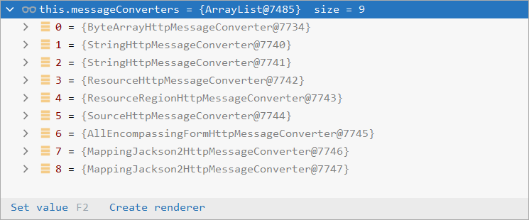

例：将`Person`对象转为JSON，或者 JSON转为`Person`，这将用到`MappingJackson2HttpMessageConverter`转换器。用他来完成最终的转换操作(利用底层的jackson的objectMapper转换)


**原理总结**

返回值处理器`ReturnValueHandler`原理：

1. 返回值处理器判断是否支持这种类型返回值 `supportsReturnType`
2. 返回值处理器调用 `handleReturnValue` 进行处理
3. `RequestResponseBodyMethodProcessor` 可以处理返回值标了`@ResponseBody` 注解的方法
   1. 利用 `MessageConverters` 进行处理 将数据写为json
      1. 内容协商（浏览器默认会以请求头的方式告诉服务器他能接受什么样的内容类型）
      2. 服务器最终根据自己自身的能力，决定服务器能生产出什么样内容类型的数据，
      3. SpringMVC会挨个遍历所有容器底层的 `HttpMessageConverter` ，看谁能处理？
         1. 得到`MappingJackson2HttpMessageConverter`可以将对象写为json
         2. 利用`MappingJackson2HttpMessageConverter`将对象转为json再写出去。
            

#### 内容协商

[内容协商]((https://www.bilibili.com/video/BV19K4y1L7MT?p=39))

根据客户端接收能力不同，返回不同媒体类型的数据。

浏览器接收的类型：Http协议中规定的，Accept字段告诉服务器本客户端可以接收的数据类型。越靠前权重越高(如：浏览器可以接收xml和json类型，则优先接受xml类型)，`*/*`指接收任意类型(如json类型)

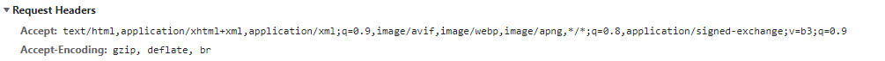

**响应XML内容**

````xml
 <dependency>
     <groupId>com.fasterxml.jackson.dataformat</groupId>
     <artifactId>jackson-dataformat-xml</artifactId>
</dependency>
````

利用Postman软件设置返回xml：只需要改变请求头中Accept字段（application/xml）。

**内容协商原理：**

1. 判断当前响应头中是否已经有确定的媒体类型MediaType。
2. 获取客户端（PostMan、浏览器）支持接收的内容类型。（获取客户端Accept请求头字段application/xml）（这一步在下一节有详细介绍）
   1. `contentNegotiationManager` 内容协商管理器 默认使用基于请求头的策略
   2. `HeaderContentNegotiationStrategy` 确定客户端可以接收的内容类型
3. 遍历循环所有当前系统的 `MessageConverter`，看谁支持操作这个对象（Person）
4. 找到支持操作`Person`的converter，把converter支持的媒体类型统计出来。
5. 客户端需要application/xml，服务端有10种MediaType。
6. 进行内容协商的最佳匹配媒体类型
7. 用支持将对象转为 最佳匹配媒体类型 的converter。调用它进行转化 。


#### 开启浏览器参数方式内容协商功能

因为浏览器不支持修改请求头的accept字段，只能通过postman等工具修改。springboot为浏览器提供了一种以请求参数来调整响应内容的功能。`format=json`或`format=xml`

```yaml
#开启请求参数内容协商模式
spring:
  mvc:
    contentnegotiation:
      favor-parameter: true 
```

````txt
浏览器访问
localhost:8080/test?format=json   响应json内容
localhost:8080/test?format=xml    响应xml内容
后端会根据参数format的值，返回对应json或xml格式的数据。
````

默认只有json和xml两种响应格式


#### 自定义消息转换器

1. `@ResponseBody` 响应数据出去 调用 `RequestResponseBodyMethodProcessor` 处理
2. `Processor` 处理方法返回值。通过 `MessageConverter`处理
3. 所有 `MessageConverter` 合起来可以支持各种媒体类型数据的操作（读、写）
4. 内容协商找到最终的 `messageConverter`


下面自定义一个消息转换器，类型为`x-rain`，响应格式以`；`分割

```java
//自定义消息转换器
//实现 HttpMessageConverter<Team> 并指定泛型为Team
public class RainMessageConverter implements HttpMessageConverter<Team> {
    @Override
    public boolean canRead(Class<?> clazz, MediaType mediaType) {
        return false;                                            //不能读，为了方便演示
    }
    @Override
    public boolean canWrite(Class<?> clazz, MediaType mediaType) {
        return clazz.isAssignableFrom(Team.class);               //如果写出类型为Team则可以写
    }
    /**
     * 服务器要统计所有MessageConverter都能写出哪些内容类型
     *
     * 添加自定义的响应类型 application/x-rain
     */
    @Override
    public List<MediaType> getSupportedMediaTypes() {
        return MediaType.parseMediaTypes("application/x-rain");
    }

    @Override
    public Team read(Class<? extends Team> clazz, HttpInputMessage inputMessage) 
        throws IOException, HttpMessageNotReadableException {
        return null;
    }

    @Override
    public void write(Team team, MediaType contentType, HttpOutputMessage outputMessage) 
        throws IOException, HttpMessageNotWritableException {
        String Data = team.getId() + ";" + team.getName() + ";";   //自定义类型，以；分割
        OutputStream body = outputMessage.getBody();               //获得输出流
        body.write(Data.getBytes());                               //写出
    }
}
```

```java
@Configuration(proxyBeanMethods = false)
public class MyConfig {
    @Bean
    public WebMvcConfigurer webMvcConfigurer(){
        return new WebMvcConfigurer(){
            @Override
            public void extendMessageConverters(List<HttpMessageConverter<?>> converters) {
                converters.add(new RainMessageConverter());   //添加自定义消息转换器
            }
        }
    }
}
```

```java
@Controller
public class HelloController {
    @RequestMapping("/team")
    @ResponseBody
    public Team TestTeam(){
        Team team = new Team();
        team.setId(1);
        team.setName("faze");
        return team;
    }
}
```

**测试**

用Postman发送`/team`（请求头`Accept:application/x-rain`)，将返回自定义协议数据的写出。

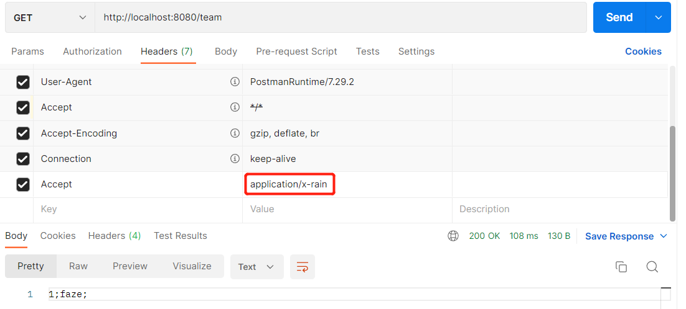


#### 浏览器与PostMan内容协商完全适配

上方的自定义消息转换器必须指定请求头才能实现，下面添加浏览器参数自定义内容协商功能

即：浏览器访问`http://localhost:8080/team?format=xrain`与`http://localhost:8080/team`+请求头`Accept:application/x-rain`返回的数据一致

同样需要开启请求参数内容协商模式

````yaml
#开启请求参数内容协商模式
spring:
  mvc:
    contentnegotiation:
      favor-parameter: true 
````

```java
@Bean
public WebMvcConfigurer webMvcConfigurer(){
    return new WebMvcConfigurer(){
        //自定义内容协商策略
        @Override
        public void configureContentNegotiation(ContentNegotiationConfigurer configurer) {
            HashMap<String, MediaType> mediaTypes = new HashMap<>();
            mediaTypes.put("json", MediaType.APPLICATION_JSON);
            mediaTypes.put("xml",MediaType.APPLICATION_XML);
            //添加自定义类型，'format=xrain'  == 'application/x-rain'
            mediaTypes.put("xrain",MediaType.parseMediaType("application/x-rain"));
            //指定支持解析哪些参数对应的哪些媒体类型
            ParameterContentNegotiationStrategy parameteStrategy = 
                new ParameterContentNegotiationStrategy(mediaTypes);

            //还需添加请求头处理策略，否则accept:application/json、application/xml则会失效
            HeaderContentNegotiationStrategy headerStrategy = new HeaderContentNegotiationStrategy();
            configurer.strategies(Arrays.asList(parameteStrategy,headerStrategy));
        }

        @Override
        public void extendMessageConverters(List<HttpMessageConverter<?>> converters) {
            converters.add(new RainMessageConverter());
        }
    }
}
```


## 异步请求

前端需要等待后端处理完，才能得到结果。使用了异步请求后，前端直接响应(当然它是得不到后端处理的数据)，后端继续处理。

比如我们在网站上发送邮件，后台会去发送邮件，此时前台会造成响应不动，直到邮件发送完毕，响应才会成功，所以我们一般会采用多线程的方式去处理这些任务。

* 使用注解`@Async`,标注在方法上代表此方法是异步方法，标注在类上代表此类的所有方法都是异步
* 在主启动器类上添加`@EnableAsync`，开启异步处理

```java
@Component
@Async
public class accessUser {

    public String getUser() {
        try {
            Thread.sleep(2000);
            System.out.println("程序正在执行......");
        } catch (InterruptedException e) {
            throw new RuntimeException(e);
        }
        return "用户名:rain";
    }
}
@Service
public class myService {
    @Autowired
    accessUser accessUser;
    public String getUser() {
        return accessUser.getUser();
    }
}
@RestController
public class myController {
    @Autowired
    myService myService;

    @RequestMapping("/getUser")
    public String getUser(){
        String user = myService.getUser();
        return user;
    }
}
@SpringBootApplication
@EnableAsync
public class TestRainupupApplication {
    public static void main(String[] args) {
        SpringApplication.run(TestRainupupApplication.class, args);
    }
}
```

访问`http://localhost:8080/getUser`，前端直接响应为空页面(不会得到后端return的结果)，后端继续执行


## 视图解析

### Thymeleaf

前端页面(模板)获取后端内容(数据)，模板引擎按照表达式解析，将数据填充到指定的位置，然后把这个数据最终生成一个我们想要的内容给我们写出去。用法与jsp相似

优点：简单 缺点：效率低

**maven**

````xml
<dependency>
    <groupId>org.springframework.boot</groupId>
    <artifactId>spring-boot-starter-thymeleaf</artifactId>
</dependency>
````

**原理**

按照SpringBoot的自动配置原理看一下Thymeleaf的自动配置规则，在按照那个规则，我们进行使用。

````java
@Configuration(proxyBeanMethods = false)
@EnableConfigurationProperties(ThymeleafProperties.class)  //引入自动配置类
@ConditionalOnClass({ TemplateMode.class, SpringTemplateEngine.class })
@AutoConfigureAfter({ WebMvcAutoConfiguration.class, WebFluxAutoConfiguration.class })
public class ThymeleafAutoConfiguration {
    ...
}

````

Thymeleaf的自动配置类：`ThymeleafProperties`

```java
@ConfigurationProperties(
    prefix = "spring.thymeleaf"
)
public class ThymeleafProperties {
    public static final String DEFAULT_PREFIX = "classpath:/templates/";  //模板放置处
    public static final String DEFAULT_SUFFIX = ".html";                  //文件的后缀名
	......
}
```

* 默认前缀：资源目录下的`templates`；无法直接访问，只有通过模板引擎才能进入templates目录
* 默认后缀: `.html`
* 只需要把html页面放在类路径下的templates下，thymeleaf就可以帮我们自动渲染。

**测试**

```java
@Controller
public class HelloController {
    @RequestMapping("/thello")
    public String Thymeleaf(Model model){
        model.addAttribute("msg","rainupup");
        return "thymeleaf";         //跳转到/templates/thymeleaf.html
    }
}
```

```html
<!--位置:/templates/thymeleaf.html-->
<!DOCTYPE html>
<html lang="en" xmlns:th="http://www.thymeleaf.org">   <!--导入命名空间-->
<head>
    <meta charset="UTF-8">
    <title>模板引擎</title>
</head>
<body>
    <h1 th:text="${msg}">默认值</h1>
</body>
</html>
```


#### **语法**

[官方文档](https://www.thymeleaf.org/doc/tutorials/3.0/usingthymeleaf.html#setting-attribute-values)

| 表达式名字 | 语法 | 用途                               |
| ---------- | ---- | ---------------------------------- |
| 变量取值   | ${…} | 获取请求域、session域、对象等值    |
| 选择变量   | *{…} | 获取上下文对象值                   |
| 消息       | #{…} | 获取国际化等值                     |
| 链接       | @{…} | 生成链接                           |
| 片段表达式 | ~{…} | jsp:include 作用，引入公共页面片段 |

**条件运算**

- `If-then`: (if) ? (then)
- `If-then-else`: (if) ? (then) : (else)    三目运算
- `Default`: (value) ?: (defaultvalue)      

**特殊操作**

- 无操作： _

**设置属性值：** `th:attr`

````html
<form action="subscribe.html" th:attr="action=@{/subscribe}">
  <fieldset>
    <input type="text" name="email" />
    <input type="submit" value="Subscribe!" th:attr="value=#{subscribe.submit}"/>
  </fieldset>
</form>


<!--设置多个值-->


<!--简化 使用th:xxxx-->
<input type="submit" value="Subscribe!" th:value="#{subscribe.submit}"/>
<form action="subscribe.html" th:action="@{/subscribe}">
````

**迭代**

````html
<tr th:each="prod : ${prods}">
        <td th:text="${prod.name}">Onions</td>
        <td th:text="${prod.price}">2.41</td>
        <td th:text="${prod.inStock}? #{true} : #{false}">yes</td>
</tr>
````


### 视图解析原理

[视图解析器与视图解析原理](https://www.bilibili.com/video/BV19K4y1L7MT?p=47)


## 拦截器

使用的还是SpringMVC中的拦截器，注册拦截器使用的是`WebMvcCongifurer`配置文件。

而不是springmvc中的配置文件`<mvc:interceptors>`


**Filter、Interceptor 的区别**

- `Filter`是Servlet定义的原生组件，它的好处是脱离Spring应用也能使用。
- `Interceptor`是Spring定义的接口，可以使用Spring的自动装配等功能。


**步骤：**

1. 编写一个拦截器实现`HandlerInterceptor`接口
2. 拦截器注册到容器中（实现`WebMvcConfigurer`的`addInterceptors()`）
3. 指定拦截规则（注意，如果是拦截所有，静态资源也会被拦截】

```java
public class LoginHandlerInterceptor implements HandlerInterceptor {
    @Override
    public boolean preHandle(HttpServletRequest request, HttpServletResponse response, Object handler) throws Exception {
        String loginUser = (String)request.getSession().getAttribute("LoginUser");
        System.out.println(loginUser);
        if(loginUser != null){
            return true;
        }else {
            return false;
        }
    }

    @Override
    public void postHandle(HttpServletRequest request, HttpServletResponse response, Object handler, ModelAndView modelAndView) throws Exception {
    }

    @Override
    public void afterCompletion(HttpServletRequest request, HttpServletResponse response, Object handler, Exception ex) throws Exception {
    }
}
```

```java
@Configuration(proxyBeanMethods = false)
public class MyConfig {
    @Bean
    public WebMvcConfigurer webMvcConfigurer(){
        return new WebMvcConfigurer(){
            @Override
            public void addInterceptors(InterceptorRegistry registry) {
                registry.addInterceptor(new LoginHandlerInterceptor())   //拦截器注册到容器中
                        .addPathPatterns("/**")                          //所有请求都被拦截包括静态资源
                        .excludePathPatterns("/","/css/**","/login");    //排除拦截的请求
            }
        }
    }
}
```


### 拦截器原理

1. 根据当前请求，找到`HandlerExecutionChain`（可以处理请求的handler以及handler的所有拦截器）
2. 先来顺序执行 所有拦截器的 `preHandle()`方法。
   1. 如果当前拦截器`preHandle()`返回为true。则执行下一个拦截器的`preHandle()`
   2. 如果当前拦截器返回为`false`。直接倒序执行所有已经执行了的拦截器的 `afterCompletion()`。
3. 如果任何一个拦截器返回false，直接跳出不执行目标方法。
4. 所有拦截器都返回true，才执行目标方法。
5. 倒序执行所有拦截器的`postHandle()`方法。
6. 前面的步骤有任何异常都会直接倒序触发 `afterCompletion()`
7. 页面成功渲染完成以后，也会倒序触发 `afterCompletion()`

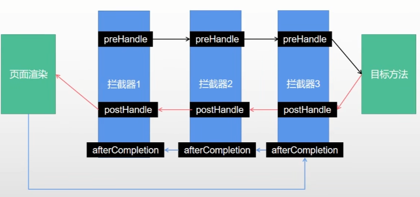

同样在`DispatcherServlet`的`doDispatch()`方法中

```java
public class DispatcherServlet extends FrameworkServlet {
    protected void doDispatch(HttpServletRequest request, HttpServletResponse response) 
        throws Exception {
       ......
       try {
          ......
          /* 调用HandlerExecutionChain的applyPreHandle()方法,循环执行每个拦截器的PreHandle()方法
          看看是否被拦截,此时目标方法没执行
          */
          if (!mappedHandler.applyPreHandle(processedRequest, response)) {  
             return;
          }

          mv = ha.handle(processedRequest, response, mappedHandler.getHandler());
          //目标方法已经执行了
          ......
          //调用HandlerExecutionChain的PostHandle()方法。循环执行每个拦截器的PostHandle()方法
          mappedHandler.applyPostHandle(processedRequest, response, mv);
          processDispatchResult(processedRequest, response, mappedHandler, mv, dispatchException);
       }
       catch (Exception ex) {
          /* 如果发生异常，调用方法内部的triggerAfterCompletion()方法
          间接调用HandlerExecutionChain的triggerAfterCompletion()方法
          逆序执行每个拦截器的AfterCompletion()方法 */
          triggerAfterCompletion(processedRequest, response, mappedHandler, ex);
       }
       catch (Throwable err) {
           //同上
           triggerAfterCompletion(processedRequest, response, mappedHandler,
                new NestedServletException("Handler processing failed", err));
       }
    }
    private void triggerAfterCompletion(HttpServletRequest request, HttpServletResponse response,
			@Nullable HandlerExecutionChain mappedHandler, Exception ex) throws Exception {

		if (mappedHandler != null) {
			mappedHandler.triggerAfterCompletion(request, response, ex);
		}
		throw ex;
	}
    private void processDispatchResult(HttpServletRequest request, HttpServletResponse response,
        @Nullable HandlerExecutionChain mappedHandler, @Nullable ModelAndView mv,
        @Nullable Exception exception) throws Exception {
        
        ......

		if (mappedHandler != null) {
			// Exception (if any) is already handled..
            //调用HandlerExecutionChain的triggerAfterCompletion()方法
			mappedHandler.triggerAfterCompletion(request, response, null);
		}
	}
}
```

```java
public class HandlerExecutionChain {
    boolean applyPreHandle(HttpServletRequest request, HttpServletResponse response) throws Exception {
       for (int i = 0; i < this.interceptorList.size(); i++) {   //正序遍历所有拦截器
          HandlerInterceptor interceptor = this.interceptorList.get(i);
          /* 执行拦截器的preHandle()方法
          		如果返回false则进入if语句。被拦截了
          */
          if (!interceptor.preHandle(request, response, this.handler)) {  
             //调用下方的triggerAfterCompletion()方法，执行拦截器的AfterCompletion()方法
             triggerAfterCompletion(request, response, null);   
             return false;
          }
          this.interceptorIndex = i;
       }
       return true;
    }
    //逆序执行所有拦截器的postHandle()方法
    void applyPostHandle(HttpServletRequest request, HttpServletResponse response, 
                         @Nullable ModelAndView mv) throws Exception {
        for (int i = this.interceptorList.size() - 1; i >= 0; i--) {
            HandlerInterceptor interceptor = this.interceptorList.get(i);
            interceptor.postHandle(request, response, this.handler, mv);
    	}
	}
    //逆序执行所有拦截器的afterCompletion()方法
    void triggerAfterCompletion(HttpServletRequest request, HttpServletResponse response, 
                                @Nullable Exception ex) {
        for (int i = this.interceptorIndex; i >= 0; i--) {  //注意是逆序执行
            HandlerInterceptor interceptor = this.interceptorList.get(i);
            interceptor.afterCompletion(request, response, this.handler, ex);
        }
	}
}
```


## 文件上传

文件上传与springmvc一致

相关配置

````properties
# 单个文件最大大小
spring.servlet.multipart.max-file-size=10MB
# 整体文件最大大小
spring.servlet.multipart.max-request-size=100MB
````

### 文件上传原理原理

文件上传相关的配置类：

`org.springframework.boot.autoconfigure.web.servlet.MultipartAutoConfiguration`
`org.springframework.boot.autoconfigure.web.servlet.MultipartProperties`

```java
@AutoConfiguration
@ConditionalOnClass({Servlet.class, StandardServletMultipartResolver.class, MultipartConfigElement.class}) 
@ConditionalOnProperty(prefix = "spring.servlet.multipart",name = {"enabled"},matchIfMissing = true)
@ConditionalOnWebApplication(type = Type.SERVLET)
@EnableConfigurationProperties({MultipartProperties.class})
public class MultipartAutoConfiguration {}
```

```java
@ConfigurationProperties(prefix = "spring.servlet.multipart",ignoreUnknownFields = false)
public class MultipartProperties {}
```

同样在`DispatcherServlet`的`doDispatch()`方法中

```java
public class DispatcherServlet extends FrameworkServlet {
    protected void doDispatch(HttpServletRequest request, HttpServletResponse response) 
        throws Exception {
       ......
       boolean multipartRequestParsed = false;

       try {
          ......
          try {
             //做预处理,如果有上传文件 就new StandardMultipartHttpServletRequest包装类
             processedRequest = checkMultipart(request);
             multipartRequestParsed = (processedRequest != request);

             // Determine handler for the current request.
             mappedHandler = getHandler(processedRequest);
             ......

             // Determine handler adapter for the current request.
             HandlerAdapter ha = getHandlerAdapter(mappedHandler.getHandler());
             ......
             //其他步骤与之前的分析一致
             mv = ha.handle(processedRequest, response, mappedHandler.getHandler());  
             ......
          }
          .......
       }......
       finally {
         // Clean up any resources used by a multipart request.
         if (multipartRequestParsed) {
            cleanupMultipart(processedRequest);
         }
       }
    }
    
    protected HttpServletRequest checkMultipart(HttpServletRequest request) throws MultipartException {
		if (this.multipartResolver != null && this.multipartResolver.isMultipart(request)) {
            ...
			return this.multipartResolver.resolveMultipart(request);
            ...
		}
    }

	protected void cleanupMultipart(HttpServletRequest request) {
        ......
	}
}
```

文件上传，用的是`RequestPartMethodArgumentResolver`作为参数解析器

```java
public class RequestPartMethodArgumentResolver extends AbstractMessageConverterMethodArgumentResolver {
   @Override
   public boolean supportsParameter(MethodParameter parameter) {
      //标注@RequestPart的参数
      if (parameter.hasParameterAnnotation(RequestPart.class)) {
         return true;
      }
      else {
         if (parameter.hasParameterAnnotation(RequestParam.class)) {
            return false;
         }
         return MultipartResolutionDelegate.isMultipartArgument(parameter.nestedIfOptional());
      }
   }
    
   //参数解析
   @Override
   @Nullable
   public Object resolveArgument(MethodParameter parameter, @Nullable ModelAndViewContainer mavContainer,
         NativeWebRequest request, @Nullable WebDataBinderFactory binderFactory) throws Exception {

      HttpServletRequest servletRequest = request.getNativeRequest(HttpServletRequest.class);
      Assert.state(servletRequest != null, "No HttpServletRequest");

      RequestPart requestPart = parameter.getParameterAnnotation(RequestPart.class);
      boolean isRequired = ((requestPart == null || requestPart.required()) && !parameter.isOptional());

      String name = getPartName(parameter, requestPart);
      parameter = parameter.nestedIfOptional();
      Object arg = null;
      //封装成MultipartFile类型的对象作参数
      Object mpArg = MultipartResolutionDelegate
          .resolveMultipartArgument(name, parameter, servletRequest);
       
      ......
          
      return adaptArgumentIfNecessary(arg, parameter);
   }
}
```


## 错误处理

**默认规则：**

发生错误或者页面不存在，Spring Boot提供`/error`处理所有错误的映射

机器客户端，它将生成JSON响应，其中包含错误，HTTP状态和异常消息的详细信息


对于浏览器客户端，响应一个`whitelabel`错误视图，以HTML格式呈现相同的数据

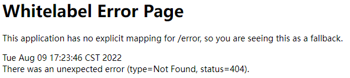


**自定义错误页面：**

只需要将错误页面(4xx.html/5xx.html)放置在`静态资源目录/error/`或`/templates/error/`下就会被自动解析

404.html只响应404错误，4xx.html响应所有4xx的错误


### 底层组件功能分析

* `ErrorMvcAutoConfiguration` 自动配置异常处理规则
* 向容器中添加组件：类型：`DefaultErrorAttributes` --> id：errorAttributes
  * `public class DefaultErrorAttributes implements ErrorAttributes, HandlerExceptionResolver`
  * `DefaultErrorAttributes`：定义错误页面中可以包含数据（异常明细，堆栈信息等）。
* 向容器中添加组件：类型：`BasicErrorController` --> id：`basicErrorController`（json+白页 适配响应）
  * 处理默认 `/error` 路径的请求，页面响应 `new ModelAndView("error", model);`
  * 容器中有组件 `View`->id是`error`；（响应默认错误页）
  * 容器中放组件 `BeanNameViewResolver`（视图解析器）；按照返回的视图名作为组件的id去容器中找View对象。
* 向容器中添加组件：类型：`DefaultErrorViewResolver` -> id：`conventionErrorViewResolver`
  * 如果发生异常错误，会以HTTP的状态码 作为视图页地址（viewName），找到真正的页面（主要作用）。
  * `error/404、5xx.html`
  * 如果想要返回页面，就会找error视图（StaticView默认是一个白页）。

错误处理自动配置类`ErrorMvcAutoConfiguration`

```java
package org.springframework.boot.autoconfigure.web.servlet.error;
@AutoConfiguration(before = WebMvcAutoConfiguration.class)
@ConditionalOnWebApplication(type = Type.SERVLET)
@ConditionalOnClass({ Servlet.class, DispatcherServlet.class })
@EnableConfigurationProperties({ ServerProperties.class, WebMvcProperties.class })
public class ErrorMvcAutoConfiguration {
   ......
   
   //向容器中添加DefaultErrorAttributes，功能：定义错误页面中可以包含数据（异常明细，堆栈信息等）
   @Bean
   @ConditionalOnMissingBean(value = ErrorAttributes.class, search = SearchStrategy.CURRENT)
   public DefaultErrorAttributes errorAttributes() {
      return new DefaultErrorAttributes();
   }
    
   //向容器中添加BasicErrorController，功能：响应白页、Json功能
   @Bean
   @ConditionalOnMissingBean(value = ErrorController.class, search = SearchStrategy.CURRENT)
   public BasicErrorController basicErrorController(ErrorAttributes errorAttributes,
         ObjectProvider<ErrorViewResolver> errorViewResolvers) {
      return new BasicErrorController(errorAttributes, this.serverProperties.getError(),
            errorViewResolvers.orderedStream().collect(Collectors.toList()));
   }

   ......
   //向容器中添加DefaultErrorViewResolver，功能：跳转到error/4xx/5xx的功能
   @Configuration(proxyBeanMethods = false)
   @EnableConfigurationProperties({ WebProperties.class, WebMvcProperties.class })
   static class DefaultErrorViewResolverConfiguration {
      ......
      @Bean
      @ConditionalOnBean(DispatcherServlet.class)
      @ConditionalOnMissingBean(ErrorViewResolver.class)
      DefaultErrorViewResolver conventionErrorViewResolver() {
         return new DefaultErrorViewResolver(this.applicationContext, this.resources);
      }
   }
    
   private static class StaticView implements View {
       ......
       @Override
       public void render(Map<String, ?> model, HttpServletRequest request, HttpServletResponse response)
           throws Exception {
           //系统默认异常页面html代码
           builder.append("<html><body><h1>Whitelabel Error Page</h1>")
               .append("<p>This application has no explicit mapping for /error, so you are seeing this as a fallback.</p>")
               .append("<div id='created'>").append(timestamp)
               .append("</div>")
               .append("<div>There was an unexpected error(type=")
               .append(htmlEscape(model.get("error")))
               .append(", status=").append(htmlEscape(model.get("status")))
               .append(").</div>");
    	}
	}
}
```

```java
@Order(Integer.MIN_VALUE)
public class DefaultErrorAttributes implements ErrorAttributes, HandlerExceptionResolver, Ordered {}
```

<span id="BasicErrorController">`BasicErrorController`类</span>

```java
@Controller
//动态判断server.error.path中是否有值，没有值动态取出error.path:/error
@RequestMapping("${server.error.path:${error.path:/error}}")
public class BasicErrorController extends AbstractErrorController {

   private final ErrorProperties errorProperties;

   ......

   //浏览器响应HTML
   @RequestMapping(produces = MediaType.TEXT_HTML_VALUE)
   public ModelAndView errorHtml(HttpServletRequest request, HttpServletResponse response) {
      HttpStatus status = getStatus(request);
      Map<String, Object> model = Collections
            .unmodifiableMap(getErrorAttributes(request, getErrorAttributeOptions(request, MediaType.TEXT_HTML)));
      response.setStatus(status.value());
      //底层调用了下方的DefaultErrorViewResolver类
      ModelAndView modelAndView = resolveErrorView(request, response, status, model); 
      return (modelAndView != null) ? modelAndView : new ModelAndView("error", model);  //响应ModelAndView
   }
    
   //机器客户端响应json
   @RequestMapping
   public ResponseEntity<Map<String, Object>> error(HttpServletRequest request) {
      HttpStatus status = getStatus(request);
      if (status == HttpStatus.NO_CONTENT) {
         return new ResponseEntity<>(status);
      }
      Map<String, Object> body = getErrorAttributes(request, getErrorAttributeOptions(request, MediaType.ALL));
      return new ResponseEntity<>(body, status);
   }

   ......
}
```

<span id="DefaultErrorViewResolver">`DefaultErrorViewResolver`类</span>

```java
//功能：跳转到error/4XX/5XX.html视图
package org.springframework.boot.autoconfigure.web.servlet.error;
public class DefaultErrorViewResolver implements ErrorViewResolver, Ordered {

   private static final Map<Series, String> SERIES_VIEWS;

   static {
      Map<Series, String> views = new EnumMap<>(Series.class);
      views.put(Series.CLIENT_ERROR, "4xx");
      views.put(Series.SERVER_ERROR, "5xx");
      SERIES_VIEWS = Collections.unmodifiableMap(views);
   }
   
   ......

   @Override
   public ModelAndView resolveErrorView(HttpServletRequest request, HttpStatus status, Map<String, Object> model) {
      ModelAndView modelAndView = resolve(String.valueOf(status.value()), model);
      if (modelAndView == null && SERIES_VIEWS.containsKey(status.series())) {
         /* 调用下方的resolve()方法
          		参数1：状态码，4xx/5xx
         */
         modelAndView = resolve(SERIES_VIEWS.get(status.series()), model);  
      }
      return modelAndView;
   }

   private ModelAndView resolve(String viewName, Map<String, Object> model) {
      //响应：error/ + 上面方法传过来的状态码4xx/5xx
      String errorViewName = "error/" + viewName;
      TemplateAvailabilityProvider provider =
          this.templateAvailabilityProviders.getProvider(errorViewName,this.applicationContext);
      if (provider != null) {
         return new ModelAndView(errorViewName, model);
      }
      return resolveResource(errorViewName, model);
   }

   private ModelAndView resolveResource(String viewName, Map<String, Object> model) {
      for (String location : this.resources.getStaticLocations()) {
         try {
            Resource resource = this.applicationContext.getResource(location);
            resource = resource.createRelative(viewName + ".html");
            if (resource.exists()) {
               return new ModelAndView(new HtmlResourceView(resource), model);
            }
         }
         catch (Exception ex) {
         }
      }
      return null;
   }
}
```

### 异常处理流程

```java
@RequestMapping("/errortest")
@ResponseBody
public String error(){
    int j = 1 / 0;
    return "错误";
}
```

```java
//处理localhost:8080/errortest请求
public class DispatcherServlet extends FrameworkServlet {
    protected void doDispatch(HttpServletRequest request, HttpServletResponse response) 
        throws Exception {
       //注意是try嵌套
       try {
          ......
          try {
             ......
             //执行目标方法
             mv = ha.handle(processedRequest, response, mappedHandler.getHandler());
             //执行目标方法时，如果发生错误被下面两个catch捕获
             ......
          }
          catch (Exception ex) {
             //捕获异常
             dispatchException = ex;
          }
          catch (Throwable err) {
             dispatchException = new NestedServletException("Handler dispatch failed", err);
          }
          
          /* 视图解析，调用下方的processDispatchResult()方法
          	参数3：如果执行方法时发生错误，mv将为null
          	参数4：被捕获的异常
          */
          processDispatchResult(processedRequest, response, mappedHandler, mv, dispatchException);
          //视图解析时发生错误被下面的catch捕获
       }
       catch (Exception ex) {
          triggerAfterCompletion(processedRequest, response, mappedHandler, ex);  //拦截器
       }
       catch (Throwable err) {
          triggerAfterCompletion(processedRequest, response, mappedHandler,
                new NestedServletException("Handler processing failed", err));
       }
       finally {
           ......
       }
    }
    //视图解析流程
    private void processDispatchResult(HttpServletRequest request, HttpServletResponse response,
			@Nullable HandlerExecutionChain mappedHandler, @Nullable ModelAndView mv,
			@Nullable Exception exception) throws Exception {

		boolean errorView = false;

		if (exception != null) {  //发生异常时执行
			if (exception instanceof ModelAndViewDefiningException) {
				logger.debug("ModelAndViewDefiningException encountered", exception);
				mv = ((ModelAndViewDefiningException) exception).getModelAndView();
			}
			else {
				Object handler = (mappedHandler != null ? mappedHandler.getHandler() : null);
				//调用下方的processHandlerException()方法，处理异常。无法解析异常，则抛出异常
                mv = processHandlerException(request, response, handler, exception);
				errorView = (mv != null);
			}
		}

		......
	}
    @Nullable
	protected ModelAndView processHandlerException(HttpServletRequest request, 
                                                   HttpServletResponse response,
			@Nullable Object handler, Exception ex) throws Exception {

		request.removeAttribute(HandlerMapping.PRODUCIBLE_MEDIA_TYPES_ATTRIBUTE);

		ModelAndView exMv = null;
        
		if (this.handlerExceptionResolvers != null) {
            //遍历所有的handlerExceptionResolver异常解析器，查看哪些个能解析当前异常
			for (HandlerExceptionResolver resolver : this.handlerExceptionResolvers) {
                //调用对应异常解析器的resolveException()
				exMv = resolver.resolveException(request, response, handler, ex);
				if (exMv != null) {
					break;
				}
			}
		}
        //若只有系统自带的异常解析器（没有自定义的），异常还是会抛出
        ......
		throw ex;
	}
}
```

**系统自带的异常解析器：**`HandlerExceptionResolver`


由于没有自定义异常解析器，没有异常解析器处理异常，向上抛出。springboot会再发送一次`/error`请求，重新进入`doDispatch()`方法，而`/error`请求会被底层的[`BasicErrorController`](#BasicErrorController)处理(上方简单介绍过)

````java
@Controller
//动态判断server.error.path中是否有值，没有值动态取出error.path:/error
@RequestMapping("${server.error.path:${error.path:/error}}")
public class BasicErrorController extends AbstractErrorController {
   ...... 

   //浏览器响应HTML
   @RequestMapping(produces = MediaType.TEXT_HTML_VALUE)
   public ModelAndView errorHtml(HttpServletRequest request, HttpServletResponse response) {
      HttpStatus status = getStatus(request);
      Map<String, Object> model = Collections
            .unmodifiableMap(getErrorAttributes(request, getErrorAttributeOptions(request, MediaType.TEXT_HTML)));
      response.setStatus(status.value());
      /* 调用下方AbstractErrorController类的resolveErrorView()方法,最终找到DefaultErrorViewResolver类。
      		跳转到error/4XX/5XX.html视图
      */
      ModelAndView modelAndView = resolveErrorView(request, response, status, model);
      
      //如果/error内没有4XX/5XX.html，
      //modelAndView为空，最终还是返回viewName为error的modelAndView，即响应白页
      return (modelAndView != null) ? modelAndView : new ModelAndView("error", model);
   }
    
   //机器客户端响应json
   @RequestMapping
   public ResponseEntity<Map<String, Object>> error(HttpServletRequest request) {
       ......
   }

   ......
}

public abstract class AbstractErrorController implements ErrorController {
    protected ModelAndView resolveErrorView(HttpServletRequest request, 
                                            HttpServletResponse response, HttpStatus status,
                                            Map<String, Object> model) {
		//遍历所有的ErrorViewResolver。目前只有一个DefaultErrorViewResolver
        for (ErrorViewResolver resolver : this.errorViewResolvers) {
			ModelAndView modelAndView = resolver.resolveErrorView(request, status, model);
			if (modelAndView != null) {
				return modelAndView;
			}
		}
		return null;
	}
}
````

[`DefaultErrorViewResolver`](#DefaultErrorViewResolver)在 `底层组件功能分析` 中详细介绍过，主要功能是跳转到error/4XX/5XX.html视图


### 集中异常处理

> **方法一：自定义错误页**

`error/4xx/5xx.html`；有精确的错误状态码页面就匹配精确，没有就找4xx.html；如果都没有就触发白页


> **方法二：@ControllerAdvice`+`@ExceptionHandler**

创建一个标注`@ControllerAdvice`的类，方法上标注 `@ExceptionHandler`并指定处理异常的类型。如果遇到指定的异常，springboot会自动执行此方法。底层是 `ExceptionHandlerExceptionResolver` 支持的。

```java
@ControllerAdvice
public class myException {
    @ExceptionHandler(value = {ArithmeticException.class,NullPointerException.class})
    //@ResponseBody 也可以响应json
    public String handleArithAndNullPointerException(){
        System.out.println("发生数学运算或空指针异常");
        return "myError";               //跳转的地址，在/templates目录下
    }
}
```


> 方法三：**@ResponseStatus + 自定义异常**

底层是 `ResponseStatusExceptionResolver`，把`responseStatus`注解的信息组装成ModelAndView返回

底层调用`response.sendError(statusCode, resolvedReason)`，最终由tomcat发送的`/error`(上面分析过)

```java
//响应一个状态码。value是一个枚举类，HttpStatus.FORBIDDEN代表403
//跳转至/error/4xx.html页面
@ResponseStatus(value = HttpStatus.FORBIDDEN,reason = "出发了异常")
public class myException2 extends RuntimeException{

    public myException2() {
    }

    public myException2(String message) {
        super(message);
    }
}
```

```java
//@RestController
@Controller
public class HelloController {
    @RequestMapping("/errortest")
    @ResponseBody
    public String error(){
        if(2 < 3){
            throw new myException2();  //抛出自定义异常
        }
        return "错误";
    }
}
```


> **方法四：自定义错误解析器**

自定义实现 `HandlerExceptionResolver` 处理异常；可以作为默认的全局异常处理规则

```java
@Order(Ordered.HIGHEST_PRECEDENCE)  //设置最高优先级，也可以用数字，数字越小优先级越高
@Component  //作为组件
public class CustomerHandlerExceptionResolver implements HandlerExceptionResolver {
    @Override
    public ModelAndView resolveException(HttpServletRequest request, HttpServletResponse response, Object handler, Exception ex) {
        try {
            response.sendError(337,"自定义异常"); //发生错误，错误码337
        } catch (IOException e) {
            e.printStackTrace();
        }
        return new ModelAndView();
    }
}
```

注意：

1. 使用`@Order`指定最高优先级，否则可能被其他异常解析器处理
2. 无论设置状态码为多少，最终转到`/error/5xx.html`界面

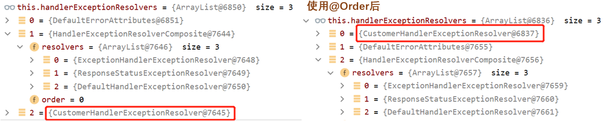


## 原生组件注入

注入`Servlet`、`Filter`、`Listener`。

注意：springboot中配置的拦截器无法拦截原始的`servlet`

> **原始方法**：**web.xml配置**

javaweb中介绍了


> **使用原生的注解**

主启动器添加`@ServletComponentScan` + 对应组件注解`@WebServlet`/`@WebListener`/`@WebFilter`

```java
@SpringBootApplication
@ServletComponentScan("com.rain")          //扫描原始组件
public class HelloSpringBootApplication {
    public static void main(String[] args) {
        SpringApplication.run(HelloSpringBootApplication.class, args);
    }
}

@WebServlet("/servlet1")
public class servlet extends HttpServlet {
    @Override
    protected void doGet(HttpServletRequest req, HttpServletResponse resp) throws ServletException, IOException {
        resp.getWriter().write("我是原生servlet");
    }
}

@WebListener
public class myListener implements ServletContextListener {
    @Override
    public void contextInitialized(ServletContextEvent sce) {
        System.out.println("监听器初始化");
    }

    @Override
    public void contextDestroyed(ServletContextEvent sce) {
        System.out.println("监听器销毁");
    }
}

@WebFilter(urlPatterns = {"/css/*","/images/*"})
public class myFilter implements Filter {
    @Override
    public void init(FilterConfig filterConfig) throws ServletException {
        System.out.println("filter初始化");
    }

    @Override
    public void destroy() {
        System.out.println("filter销毁");
    }

    @Override
    public void doFilter(ServletRequest request, ServletResponse response, FilterChain chain) throws IOException, ServletException {
        System.out.println("filter开始工作");
        chain.doFilter(request,response);
    }
}
```


> **配置类注入**

在springboot配置类中注入 `ServletRegistrationBean`、`FilterRegistrationBean`、`ServletListenerRegistrationBean`

```java
@Configuration(proxyBeanMethods = true)  //配置类，单例
public class MyConfig {
    
    @Bean
    public ServletRegistrationBean myServlet() {
        myServlet myServlet = new myServlet();
        ServletRegistrationBean registrationBean = 
            new ServletRegistrationBean(myServlet, "/testservlet", "/ts");
        
        //相当于xml配置文件<init-param>的内容
        //registrationBean.addInitParameter("username","rain");  

        return registrationBean;
    }

    @Bean
    public ServletListenerRegistrationBean myListener(){
        myListener myListener = new myListener();
        return new ServletListenerRegistrationBean(myListener);
    }

    @Bean
    public FilterRegistrationBean myFilter(){
        myFilter myFilter = new myFilter();

        FilterRegistrationBean filter = new FilterRegistrationBean(myFilter);
        filter.setUrlPatterns(Arrays.asList("/css/*"));
        return filter;
    }
}

public class servlet extends HttpServlet {
    @Override
    protected void doGet(HttpServletRequest req, HttpServletResponse resp) throws ServletException, IOException {
        resp.getWriter().write("我是原生servlet");
    }
}

public class myListener implements ServletContextListener {
    @Override
    public void contextInitialized(ServletContextEvent sce) {
        System.out.println("监听器初始化");
    }

    @Override
    public void contextDestroyed(ServletContextEvent sce) {
        System.out.println("监听器销毁");
    }
}

public class myFilter implements Filter {
    @Override
    public void init(FilterConfig filterConfig) throws ServletException {
        System.out.println("filter初始化");
    }

    @Override
    public void destroy() {
        System.out.println("filter销毁");
    }

    @Override
    public void doFilter(ServletRequest request, ServletResponse response, FilterChain chain) throws IOException, ServletException {
        System.out.println("filter开始工作");
        chain.doFilter(request,response);
    }
}
```


### DispatcherServlet注入原理

```java
@AutoConfigureOrder(Ordered.HIGHEST_PRECEDENCE)
@AutoConfiguration(after = ServletWebServerFactoryAutoConfiguration.class)
@ConditionalOnWebApplication(type = Type.SERVLET)
@ConditionalOnClass(DispatcherServlet.class)
public class DispatcherServletAutoConfiguration {
   ......

   @Configuration(proxyBeanMethods = false)
   @Conditional(DefaultDispatcherServletCondition.class)
   @ConditionalOnClass(ServletRegistration.class)
   @EnableConfigurationProperties(WebMvcProperties.class)  //spring.mvc
   protected static class DispatcherServletConfiguration {
      //创建DispatcherServlet的bean组件(就是我们属性的DispatcherServlet)
      @Bean(name = DEFAULT_DISPATCHER_SERVLET_BEAN_NAME)
      public DispatcherServlet dispatcherServlet(WebMvcProperties webMvcProperties) {
         DispatcherServlet dispatcherServlet = new DispatcherServlet();
         .....
         return dispatcherServlet;
      }
      ......
   }

   @Configuration(proxyBeanMethods = false)
   @Conditional(DispatcherServletRegistrationCondition.class)
   @ConditionalOnClass(ServletRegistration.class)
   @EnableConfigurationProperties(WebMvcProperties.class)
   @Import(DispatcherServletConfiguration.class)
   protected static class DispatcherServletRegistrationConfiguration {
      
      //底层利用ServletRegistrationBean<DispatcherServlet>注册DispatcherServlet
      @Bean(name = DEFAULT_DISPATCHER_SERVLET_REGISTRATION_BEAN_NAME)
      @ConditionalOnBean(value = DispatcherServlet.class, name = DEFAULT_DISPATCHER_SERVLET_BEAN_NAME)
      public DispatcherServletRegistrationBean dispatcherServletRegistration(
          DispatcherServlet dispatcherServlet,    //自动获取上方已经创建的DispatcherServlet的bean
          WebMvcProperties webMvcProperties,
          ObjectProvider<MultipartConfigElement> multipartConfig) {
          
         DispatcherServletRegistrationBean registration = 
             new DispatcherServletRegistrationBean(dispatcherServlet,
                                                   webMvcProperties.getServlet().getPath());
         registration.setName(DEFAULT_DISPATCHER_SERVLET_BEAN_NAME);
         ......
         return registration;
      }
   }
}
```

```java
public class DispatcherServletRegistrationBean extends ServletRegistrationBean<DispatcherServlet>
      implements DispatcherServletPath {}
```

可以看到`DispatcherServletRegistrationBean`实现了`ServletRegistrationBean`

`DispatcherServlet`默认映射的是 `/` 路径，可以通过在配置文件`spring.mvc.servlet.path`修改

原生的Servlet的映射路径是`/xx`，使用精确优先原则，如果能匹配到原生的Servlet，则用原生。否则使用`DispatcherServlet`，所以Springboot的拦截器无法拦截原生Servlet


 

## 切换Web服务器

springboot默认支持`Tomcat`, `Jetty`, `Undertow`服务器(默认使用的是Tomcat)

切换Web服务器，只需要修改pom.xml文件

```xml
<dependency>
    <groupId>org.springframework.boot</groupId>
    <artifactId>spring-boot-starter-web</artifactId>
    <exclusions>
        <exclusion>
            <groupId>org.springframework.boot</groupId>
            <artifactId>spring-boot-starter-tomcat</artifactId>
        </exclusion>
    </exclusions>
</dependency>
<dependency>
    <groupId>org.springframework.boot</groupId>
    <artifactId>spring-boot-starter-jetty</artifactId>
</dependency>
```


### Web服务器注入原理

1. SpringBoot应用启动发现当前是Web应用，web应用会创建一个web版的IOC容器 `ServletWebServerApplicationContext` ，`ServletWebServerApplicationContext` 启动的时候寻找 `ServletWebServerFactory`

   * 比如：`TomcatServletWebServerFactory`、`JettyServletWebServerFactory`、`UndertowServletWebServerFactory`

   

2. 自动配置类`ServletWebServerFactoryAutoConfiguration`。导入了`ServletWebServerFactoryConfiguration`（配置类）。`ServletWebServerFactoryConfiguration` 根据动态判断系统中到底导入了那个Web服务器的包(默认web-starter导入tomcat)，容器中就会添加 `TomcatServletWebServerFactory`。`TomcatServletWebServerFactory` 创建出Tomcat服务器并启动(底层原理是`TomcatWebServer` 的构造器拥有初始化方法`initialize`——>`this.tomcat.start()`)

**以Tocmat为例**

`ServletWebServerFactoryAutoConfiguration`完成导入配置类的工作

```java
package org.springframework.boot.autoconfigure.web.servlet;
@AutoConfiguration
@AutoConfigureOrder(Ordered.HIGHEST_PRECEDENCE)
@ConditionalOnClass(ServletRequest.class)
@ConditionalOnWebApplication(type = Type.SERVLET)
@EnableConfigurationProperties(ServerProperties.class)
//导入ServletWebServerFactoryConfiguration配置类
@Import({ ServletWebServerFactoryAutoConfiguration.BeanPostProcessorsRegistrar.class,
      ServletWebServerFactoryConfiguration.EmbeddedTomcat.class,
      ServletWebServerFactoryConfiguration.EmbeddedJetty.class,
      ServletWebServerFactoryConfiguration.EmbeddedUndertow.class })
public class ServletWebServerFactoryAutoConfiguration {
	......
}
```

`ServletWebServerFactoryConfiguration`类的功能：根据条件注入WebServerBean

- `TomcatServletWebServerFactory`：往容器中注入Tocmat工厂
- `JettyServletWebServerFactory`
- `UndertowServletWebServerFactory`

```java
package org.springframework.boot.autoconfigure.web.servlet;
@Configuration(proxyBeanMethods = false)
class ServletWebServerFactoryConfiguration {

   /*
   		条件：只要有Tomcat的依赖.....
   		往容器中注入一个TomcatServlet
   */
   @Configuration(proxyBeanMethods = false)
   @ConditionalOnClass({ Servlet.class, Tomcat.class, UpgradeProtocol.class })
   @ConditionalOnMissingBean(value = ServletWebServerFactory.class, search = SearchStrategy.CURRENT)
   static class EmbeddedTomcat {
      @Bean
      TomcatServletWebServerFactory tomcatServletWebServerFactory(
            ObjectProvider<TomcatConnectorCustomizer> connectorCustomizers,
            ObjectProvider<TomcatContextCustomizer> contextCustomizers,
            ObjectProvider<TomcatProtocolHandlerCustomizer<?>> protocolHandlerCustomizers) {
         ......
         return factory;
      }
   }

   //注入Jetty
   @Configuration(proxyBeanMethods = false)
   @ConditionalOnClass({ Servlet.class, Server.class, Loader.class, WebAppContext.class })
   @ConditionalOnMissingBean(value = ServletWebServerFactory.class, search = SearchStrategy.CURRENT)
   static class EmbeddedJetty {
      @Bean
      JettyServletWebServerFactory JettyServletWebServerFactory(
            ObjectProvider<JettyServerCustomizer> serverCustomizers) {
          ......
      }
   }

   //注入Undertow
   @Configuration(proxyBeanMethods = false)
   @ConditionalOnClass({ Servlet.class, Undertow.class, SslClientAuthMode.class })
   @ConditionalOnMissingBean(value = ServletWebServerFactory.class, search = SearchStrategy.CURRENT)
   static class EmbeddedUndertow {
      @Bean
      UndertowServletWebServerFactory undertowServletWebServerFactory(
            ObjectProvider<UndertowDeploymentInfoCustomizer> deploymentInfoCustomizers,
            ObjectProvider<UndertowBuilderCustomizer> builderCustomizers) {
          ......
      }
      ......
   }
}
```


`ServletWebServerFactoryAutoConfiguration`完成注入`TomcatServletWebServerFactory`的工作

`ServletWebServerApplicationContext`完成调用`TomcatServletWebServerFactory`的工作

```java
public class TomcatServletWebServerFactory extends AbstractServletWebServerFactory implements ConfigurableTomcatWebServerFactory, ResourceLoaderAware {
	......
    public WebServer getWebServer(ServletContextInitializer... initializers) {
		......

        Tomcat tomcat = new Tomcat();        //创建一个tomcat
        ......
		//调用下方getTomcatWebServer()方法，底层启动tomcat，并将TomcatWebServer返回
        return this.getTomcatWebServer(tomcat);  
    }
    protected TomcatWebServer getTomcatWebServer(Tomcat tomcat) {
        return new TomcatWebServer(tomcat, this.getPort() >= 0, this.getShutdown());
    }
}
```

```java
public class TomcatWebServer implements WebServer {
    //TomcatWebServer的构造器，内部直接初始化
    public TomcatWebServer(Tomcat tomcat, boolean autoStart, Shutdown shutdown) {
		......
        this.initialize();
    }

    private void initialize() throws WebServerException {
        ......
    	this.tomcat.start();  //启动tomcat
        ......
    }
}
```

`ServletWebServerApplicationContext`是最主要的类，寻找`ServletWebServerFactoryAutoConfiguration`自动配置类导入的`WebServerFactory`，最终找到`Tomcat`, `Jetty`,或者`Undertow`。

```java
public class ServletWebServerApplicationContext extends GenericWebApplicationContext implements ConfigurableWebServerApplicationContext {
	......
    protected void onRefresh() {    //启动springboot会自动执行此方法
        super.onRefresh();
        this.createWebServer();     //调用下方方法
    }
    ......

    private void createWebServer() {
        WebServer webServer = this.webServer;
        ServletContext servletContext = this.getServletContext();
        if (webServer == null && servletContext == null) {
            ......
            
            //调用下方的getWebServerFactory()方法,获得TomcatServletWebServerFactory
            ServletWebServerFactory factory = this.getWebServerFactory();

            ......
            //执行TomcatServletWebServerFactory的getWebServer()方法，完成tomcat的创建与启动
            //执行完此方法，就获得了tomcat，并启动了tomcat
            this.webServer = factory
                .getWebServer(new ServletContextInitializer[]{this.getSelfInitializer()});
            ......
        }
        ......
        this.initPropertySources();
    }
    protected ServletWebServerFactory getWebServerFactory() {
        /* 在容器中查找一个实现了ServletWebServerFactory接口的类
        	TomcatServletWebServerFactory
        	JettyServletWebServerFactory 
        	UndertowServletWebServerFactory
        	本次案例找到的是TomcatServletWebServerFactory
        	注意：返回的是一个数组
        */
        String[] beanNames = this.getBeanFactory().getBeanNamesForType(ServletWebServerFactory.class);
        //ServletWebServerFactory等0或大于1都报错
        if (beanNames.length == 0) {
			//报错
        } else if (beanNames.length > 1) {
            //报错
        } else {
            //返回找到的TomcatServletWebServerFactory
            return (ServletWebServerFactory)this.getBeanFactory()
                .getBean(beanNames[0], ServletWebServerFactory.class);  
        }
    }
    ......
}
```


### 定制Servlet容器

修改application.properties配置文件：server.xxx

其他方式：[web定制化](https://www.bilibili.com/video/BV19K4y1L7MT?p=58)、[定制化组件的几种方式](https://www.bilibili.com/video/BV19K4y1L7MT?p=59)

Web应用 编写一个配置类实现 `WebMvcConfigurer` 即可定制化web功能 + `@Bean`给容器中再扩展一些组件

`@EnableWebMvc` + `WebMvcConfigurer` 可以全面接管SpringMVC，所有规则全部自己重新配置；实现定制和扩展功能

````java
@EnableWebMvc
@Configuration
public class AdminWebConfig implements WebMvcConfigurer{
}
````

原理：

* `WebMvcAutoConfiguration`默认的SpringMVC的自动配置功能类，如静态资源、欢迎页等
* 一旦使用 `@EnableWebMvc` ，会`@Import(DelegatingWebMvcConfiguration.class)`
* `DelegatingWebMvcConfiguration`的作用，只保证SpringMVC最基本的使用
  * 把所有系统中的`WebMvcConfigurer`拿过来，所有功能的定制都是这些`WebMvcConfigurer`合起来一起生效
  * 自动配置了一些非常底层的组件，如`RequestMappingHandlerMapping`，这些组件依赖的组件都是从容器中获取如
  * `public class DelegatingWebMvcConfiguration extends WebMvcConfigurationSupport`
* `WebMvcAutoConfiguration`里面的配置要能生效必`@ConditionalOnMissingBean(WebMvcConfigurationSupport.class)`
* `@EnableWebMvc` 导致了`WebMvcAutoConfiguration` 没有生效


# 数据访问

## JDBC

**导入JDBC场景**

```xml
<dependency>
    <groupId>org.springframework.boot</groupId>
    <artifactId>spring-boot-starter-data-jdbc</artifactId>
</dependency>
```

**导入数据库**

```xml
<dependency>
    <groupId>mysql</groupId>
    <artifactId>mysql-connector-java</artifactId>
</dependency>
<!--默认使用的是8.x，要想修改默认版本-->
<properties>
	<mysql.version>5.1.49</mysql.version>
</properties>
```


**相关配置类**

`DataSourceAutoConfiguration`：数据源的自动配置

```java
@AutoConfiguration(before = SqlInitializationAutoConfiguration.class)
@ConditionalOnClass({ DataSource.class, EmbeddedDatabaseType.class })
@ConditionalOnMissingBean(type = "io.r2dbc.spi.ConnectionFactory")
@EnableConfigurationProperties(DataSourceProperties.class)
@Import(DataSourcePoolMetadataProvidersConfiguration.class)
public class DataSourceAutoConfiguration {
}
@ConfigurationProperties(prefix = "spring.datasource")
public class DataSourceProperties implements BeanClassLoaderAware, InitializingBean {
}
```

* 修改数据源相关的配置：`spring.datasource`

* 数据库连接池的配置，自己容器中没有`DataSource`才自动配置的

* 底层配置好的连接池是：`HikariDataSource`，号称 Java WEB 当前速度最快的数据源，相比于传统的 C3P0 、DBCP、Tomcat jdbc 等连接池更加优秀；

  

`DataSourceTransactionManagerAutoConfiguration`：事务管理器的自动配置

```java
@AutoConfiguration
@ConditionalOnClass({ JdbcTemplate.class, TransactionManager.class })
@AutoConfigureOrder(Ordered.LOWEST_PRECEDENCE)
@EnableConfigurationProperties(DataSourceProperties.class)
public class DataSourceTransactionManagerAutoConfiguration {}
```


`JdbcTemplateAutoConfiguration`：JdbcTemplate的自动配置，可以来对数据库进行CRUD

```java
@AutoConfiguration(after = DataSourceAutoConfiguration.class)
@ConditionalOnClass({ DataSource.class, JdbcTemplate.class })
@ConditionalOnSingleCandidate(DataSource.class)
@EnableConfigurationProperties(JdbcProperties.class)
@Import({ DatabaseInitializationDependencyConfigurer.class, JdbcTemplateConfiguration.class,
      NamedParameterJdbcTemplateConfiguration.class })
public class JdbcTemplateAutoConfiguration {
}
@ConfigurationProperties(prefix = "spring.jdbc")
public class JdbcProperties {
}
```

* 可以修改前缀为`spring.jdbc`的配置项来修改JdbcTemplate。


`JndiDataSourceAutoConfiguration`：JNDI的自动配置。

`XADataSourceAutoConfiguration`：分布式事务相关的。


**测试**

```yaml
spring:
  datasource:
    url: jdbc:mysql://localhost:3306/test01?useSSL=false&serverTimezone=UTC
    username: root
    password: 337337
    driver-class-name: com.mysql.jdbc.Driver
```

```java
@SpringBootTest
class HelloSpringBootApplicationTests {

    @Autowired
    JdbcTemplate jdbcTemplate;      //自动注入JdbcTemplate
    @Autowired
    DataSource dataSource;          //自动注入DataSource
    
    @Test
    void contextLoads() {
        String sql = "select count(*) from team";
        Long aLong = jdbcTemplate.queryForObject(sql, Long.class);
        System.out.println(aLong);
        
		//输出HikariDataSource (HikariPool-1)，可以确定默认使用的是Hikari
        System.out.println(dataSource);      
    }
}
```


## Druid

[Druid官网](https://github.com/alibaba/druid)

注意：Druid只是数据源

**导入Druid**

```xml
<dependency>
    <groupId>com.alibaba</groupId>
    <artifactId>druid</artifactId>
    <version>1.2.11</version>
</dependency>
```


**基本配置**

| 配置                          | 缺省  | 说明                                                         |
| ----------------------------- | :---: | ------------------------------------------------------------ |
| name                          |       | 如果存在多个数据源，监控的时候可以通过名字来区分开来。如果没有配置，将会生成一个名字，格式是：”DataSource-” + System.identityHashCode(this) |
| url                           |       | 连接数据库的url，不同数据库不一样                            |
| username                      |       | 连接数据库的用户名                                           |
| passwor                       |       | 连接数据库的密码。                                           |
| driverClassName               |       | 根据url自动识别 这一项可配可不配，如果不配置druid会根据url自动识别dbType，然后选择相应的driverClassName(建议配置下) |
| initialSize                   |   0   | 初始化时建立物理连接的个数。初始化发生在显示调用init方法，或者第一次getConnection时 |
| maxActive                     |   8   | 最大连接池数量                                               |
| ~~maxIdle~~                   |   8   | 已经不再使用，配置了也没效果                                 |
| minIdle                       |       | 最小连接池数量                                               |
| maxWait                       |       | 获取连接时最大等待时间，单位毫秒。配置了maxWait之后，缺省启用公平锁，并发效率会有所下降，如果需要可以通过配置useUnfairLock属性为true使用非公平锁。 |
| poolPreparedStatements        | false | 是否缓存preparedStatement，也就是PSCache。PSCache对支持游标的数据库性能提升巨大，比如说oracle。在mysql下建议关闭。 |
| maxOpenPreparedStatements     |  -1   | 要启用PSCache，必须配置大于0，当大于0时，poolPreparedStatements自动触发修改为true。在Druid中，不会存在Oracle下PSCache占用内存过多的问题，可以把这个数值配置大一些，比如说100 |
| validationQuery               |       | 用来检测连接是否有效的sql，要求是一个查询语句。如果validationQuery为null，testOnBorrow、testOnReturn、testWhileIdle都不会其作用。 |
| testOnBorrow                  | true  | 申请连接时执行validationQuery检测连接是否有效，做了这个配置会降低性能。 |
| testOnReturn                  | false | 归还连接时执行validationQuery检测连接是否有效，做了这个配置会降低性能 |
| testWhileIdle                 | false | 建议配置为true，不影响性能，并且保证安全性。申请连接的时候检测，如果空闲时间大于timeBetweenEvictionRunsMillis，执行validationQuery检测连接是否有效。 |
| timeBetweenEvictionRunsMillis |       | 有两个含义：1)Destroy线程会检测连接的间隔时间2)testWhileIdle的判断依据，详细看testWhileIdle属性的说明 |
| numTestsPerEvictionRun        |       | 不再使用，一个DruidDataSource只支持一个EvictionRun           |
| minEvictableIdleTimeMillis    |       |                                                              |
| connectionInitSqls            |       | 物理连接初始化的时候执行的sql                                |
| exceptionSorter               |       | 根据dbType自动识别  当数据库抛出一些不可恢复的异常时，抛弃连接 |
| filters                       |       | 属性类型是字符串，通过别名的方式配置扩展插件，常用的插件有：  监控统计用的filter:stat日志用的filter:log4j防御sql注入的filter:wall |
| proxyFilters                  |       | 类型是List，如果同时配置了filters和proxyFilters，是组合关系，并非替换关系 |


**配置Druid数据源**

> 方法一：使用配置文件

```yaml
spring:
  datasource:
    url: jdbc:mysql://localhost:3306/test01?useSSL=false&serverTimezone=UTC
    username: root
    password: 337337
    driver-class-name: com.mysql.jdbc.Driver
    type: com.alibaba.druid.pool.DruidDataSource
    
    #druid 数据源专有配置
    initialSize: 5
    maxActive: 20
    filters: stat,wall  #添加监控和防火墙功能功能
```

> 方法二：使用配置类

```java
@Configuration
public class myDataSource {
    @Bean
    @ConfigurationProperties(prefix = "spring.datasource")     //绑定配置文件的spring.datasource
    public DataSource getDatasource(){
        DruidDataSource druidDataSource = new DruidDataSource();
		//druidDataSource.setUrl();
		//druidDataSource.setUsername();
		// druidDataSource.setPassword();
        return druidDataSource;
    }
}
```


**测试：**

```java
@SpringBootTest
class HelloSpringBootApplicationTests {

    @Autowired
    JdbcTemplate jdbcTemplate;
    @Autowired
    DataSource dataSource;
    @Test
    void contextLoads() {
        String sql = "select count(*) from team";
        Long aLong = jdbcTemplate.queryForObject(sql, Long.class);
        System.out.println(aLong);

        System.out.println(dataSource);  //输出Druid数据源
    }
}
```


**配置Druid的监控页功能**：

Druid 数据源具有监控的功能，并提供了一个 web 界面方便用户查看。

* `StatViewServlet`用于展示Druid的统计信息。[官方文档：配置_StatViewServlet配置](https://github.com/alibaba/druid/wiki/%E9%85%8D%E7%BD%AE_StatViewServlet%E9%85%8D%E7%BD%AE)。
* `StatFilter`用于统计监控信息。[官方文档：配置_StatFilter](https://github.com/alibaba/druid/wiki/%E9%85%8D%E7%BD%AE_StatFilter)

* `WebStatFilter`用于采集web-jdbc关联监控的数据，如SQL监控、URI监控。[官方文档：配置_配置WebStatFilter](https://github.com/alibaba/druid/wiki/%E9%85%8D%E7%BD%AE_%E9%85%8D%E7%BD%AEWebStatFilter)

* `WallFilter`它是基于SQL语义分析来实现防御SQL注入攻击。[官方文档：配置 wallfilter](https://github.com/alibaba/druid/wiki/%E9%85%8D%E7%BD%AE-wallfilter)

```java
@Configuration(proxyBeanMethods = false)
public class MyConfig {
    @Bean
    @ConfigurationProperties(prefix = "spring.datasource")
    public DataSource getDatasource() throws SQLException {
        DruidDataSource dataSource = new DruidDataSource();
        //添加监控和防火墙功能功能
        dataSource.setFilters("stat,wall"); //也可以通过yaml的filters:stat,wall配置
        return dataSource;
    }

    //配置 druid的监控页功能
    @Bean
    public ServletRegistrationBean StatViewServlet(){
        StatViewServlet servlet = new StatViewServlet();
        ServletRegistrationBean<StatViewServlet> registrationBean = 
            new ServletRegistrationBean<>(servlet,"/druid/*");

        //开启监控页账号密码
        registrationBean.addInitParameter("loginUsername","rain");
        registrationBean.addInitParameter("loginPassword","123456");

        return registrationBean;
    }

	@Bean
    public FilterRegistrationBean WebStatFilter(){
        WebStatFilter webStatFilter = new WebStatFilter();
        FilterRegistrationBean<WebStatFilter> registrationBean = 
            new FilterRegistrationBean<>(webStatFilter);

        registrationBean.setUrlPatterns(Arrays.asList("/*")); 
        registrationBean.addInitParameter("exclusions","*.js,*.gif,*.jpg,*.png,*.css,*.ico,/druid/*");
        return registrationBean;
    }
}
```

只需要访问：`http://localhost:8080/druid`

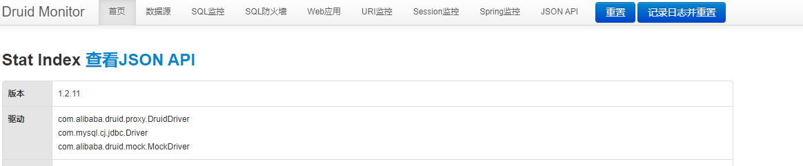


### druid数据源starter整合方式

简化上方的复杂配置

```xml
<dependency>
    <groupId>com.alibaba</groupId>
    <artifactId>druid-spring-boot-starter</artifactId>
    <version>1.2.11</version>
</dependency>
```

`DruidDataSourceAutoConfigure`是他的自动配置类

```java
@Configuration
@ConditionalOnClass({DruidDataSource.class})
@AutoConfigureBefore({DataSourceAutoConfiguration.class})
@EnableConfigurationProperties({DruidStatProperties.class, DataSourceProperties.class})
@Import({DruidSpringAopConfiguration.class, 
         DruidStatViewServletConfiguration.class, 
         DruidWebStatFilterConfiguration.class, 
         DruidFilterConfiguration.class})
public class DruidDataSourceAutoConfigure {
}
```

配置示例：

````yaml
spring:
  datasource:
    url: jdbc:mysql://localhost:3306/test01?useSSL=false&serverTimezone=UTC
    username: root
    password: 337337
    driver-class-name: com.mysql.jdbc.Driver
    type: com.alibaba.druid.pool.DruidDataSource  

    druid:
      aop-patterns: com.rain.*   # 开启springBean监控
      filters: stat,wall         # 开启监控防火墙功能，stat（sql监控），wall（防火墙）

      stat-view-servlet:         # 配置监控页功能
        enabled: true            # 开启监控页
        login-username: rain     # 账号
        login-password: 123456   # 密码
        resetEnable: false       # 重置按钮

      web-stat-filter:           # 监控web
        enabled: true            # 开启web监控
        urlPattern: /*
        exclusions: '*.js,*.gif,*.jpg,*.png,*.css,*.ico,/druid/*'


      filter:
        stat:                     # 对filters里stat的详细配置
          slow-sql-millis: 1000
          logSlowSql: true
          enabled: true
        wall:                     # 对filters里wall的详细配置
          enabled: true
          config:
            drop-table-allow: false
````


## 整合Mybatis

```xml
<dependency>
    <groupId>org.mybatis.spring.boot</groupId>
    <artifactId>mybatis-spring-boot-starter</artifactId>
    <version>2.2.2</version>
</dependency>
```

**配置模式**

`SqlSessionFactory`：自动配置好了

`SqlSession`：自动配置了`SqlSessionTemplate`组合了`SqlSession`

`@Import(AutoConfiguredMapperScannerRegistrar.class)`：

* Mapper：操作MyBatis的接口标注了`@Mapper`就会被自动扫描进来

```java
@Configuration
@ConditionalOnClass({SqlSessionFactory.class, SqlSessionFactoryBean.class})
@ConditionalOnSingleCandidate(DataSource.class)                         //使用了我们自己的数据源
@EnableConfigurationProperties({MybatisProperties.class})               //mybatis配置文件
@AutoConfigureAfter({DataSourceAutoConfiguration.class, MybatisLanguageDriverAutoConfiguration.class})
public class MybatisAutoConfiguration implements InitializingBean {
    @Bean                      //注入了SqlSessionFactory
    @ConditionalOnMissingBean
    public SqlSessionFactory sqlSessionFactory(DataSource dataSource) throws Exception {
    }

    @Bean                     //注入了SqlSessionTemplate
    @ConditionalOnMissingBean
    public SqlSessionTemplate sqlSessionTemplate(SqlSessionFactory sqlSessionFactory) {
    }

    @Configuration             
    @Import({AutoConfiguredMapperScannerRegistrar.class})
    @ConditionalOnMissingBean({MapperFactoryBean.class, MapperScannerConfigurer.class})
    public static class MapperScannerRegistrarNotFoundConfiguration implements InitializingBean {
    }
}
```

```java
@ConfigurationProperties(prefix = "mybatis")   //绑定配置文件前缀
public class MybatisProperties {
    @NestedConfigurationProperty
    private Configuration configuration;       //绑定mybatis.configuration前缀，简化mybatis核心配置文件
}
```


**测试**

springboot配置文件:application.yaml

```yaml
spring:
  datasource:
    url: jdbc:mysql://localhost:3306/test01?useSSL=false&serverTimezone=UTC
    username: root
    password: 337337
    driver-class-name: com.mysql.jdbc.Driver
mybatis:
  config-location: classpath:/mybatisConfig.xml          # mybatis核心配置文件
  mapper-locations: classpath:/mybatisMapper.xml         # sql映射文件位置
```

mybatis核心配置文件:mybatisConfig.xml

```xml
<?xml version="1.0" encoding="UTF-8"?>
<!DOCTYPE configuration PUBLIC "-//mybatis.org//DTD Config 3.0//EN" "http://mybatis.org/dtd/mybatis-3-config.dtd">
<configuration>
    <!--springboot已经自动配置了所需的内容，在此处无需配置-->
</configuration>
```

mybatisMapper.xml

```xml
<?xml version="1.0" encoding="UTF-8"?>
<!DOCTYPE mapper PUBLIC "-//mybatis.org//DTD Mapper 3.0//EN" "http://mybatis.org/dtd/mybatis-3-mapper.dtd">
<mapper namespace="com.rain.Mapper.TeamMapper">
    <select id="getTeam" parameterType="Integer" resultType="com.rain.Team">
        select * from team where id = #{id};
    </select>
</mapper>
```

Mapper接口

```java
package com.rain.Mapper;

@Mapper                       //组件
public interface TeamMapper {
    public Team getTeam(Integer id);
}
```

Service层

```java
@Service
public class TeamService {

    @Autowired
    TeamMapper teamMapper;

    public Team getTeam(Integer id){
        return teamMapper.getTeam(id);
    }

}
```

Controller层

```java
@Controller
public class MybatisController {
    @Autowired
    TeamService teamService;
   
    @RequestMapping("/getTeam")
    @ResponseBody
    public Team getTeam(@PathParam("id")Integer id){
        return teamService.getTeam(id);
    }
}
```


**使用SpringBoot配置文件简化mybatis核心配置文件**

springboot配置文件中使用`mybatis.configuration:` 可以简化mybatis核心配置文件的开发。就不需要mybatis的核心配置文件了，都在`mybatis.configuration`中配置

```yaml
mybatis:
#  可以不写全局配置文件，所有全局配置文件的配置都放在configuration下
#  config-location: classpath:/mybatisConfig.xml         
  mapper-locations: classpath:/mybatisMapper.xml
  configuration:
    cache-enabled: true          #开启缓存
    lazy-loading-enabled: true   #开启懒加载
    
```


**使用注解开发**

简化Sql映射文件,如果sql语句复杂还是推荐使用配置文件的方式

```java
//@Mapper      可以省略，只需要在主启动器类标注@MapperScan
public interface TeamMapper {
    @Select("select * from team where id = #{id}")
    public Team getTeam(Integer id);
}
@SpringBootApplication
@ServletComponentScan("com.rain")
@MapperScan("com.rain.Mapper")     //扫描Mapper
public class HelloSpringBootApplication {
    public static void main(String[] args) {
        SpringApplication.run(HelloSpringBootApplication.class, args);
    }
}
```


**总结：**

1. 导入Mybatis的官方starter
2. 编写Mapper接口，使用`@Mapper`注解(或者在主起动器`@MapperScan`)
3. 编写Sql映射文件(或者使用注解)
4. 在springboot核心配置文件中，绑定Sql映射文件 和 全局配置文件信息(`mybatis.configuration`)


### Mybatis-Plus

推荐Idea插件：MybatisX

[MybatisPlus官网](https://baomidou.com/)

[视频：整合Mybatis-Plus](https://www.bilibili.com/video/BV19K4y1L7MT?p=65)

[视频：CRUD操作](https://www.bilibili.com/video/BV19K4y1L7MT?p=66)

[视频：分页](https://www.bilibili.com/video/BV19K4y1L7MT?p=67)

[视频：删除用户](https://www.bilibili.com/video/BV19K4y1L7MT?p=68)

```xml
<dependency>
    <groupId>com.baomidou</groupId>
    <artifactId>mybatis-plus-boot-starter</artifactId>
    <version>3.4.1</version>
</dependency>
```

**配置模式**

* `MybatisPlusAutoConfiguration`配置类，`MybatisPlusProperties`配置项绑定。
* `SqlSessionFactory`自动配置好，底层是容器中默认的数据源。
* `mapperLocations`自动配置好的，有默认值`classpath*:/mapper/**/*.xml`，这表示任意包的类路径下的所有mapper文件夹下任意路径下的所有xml都是sql映射文件。 建议以后sql映射文件放在 mapper下。
* 容器中也自动配置好了`SqlSessionTemplate`。
* `@Mapper` 标注的接口也会被自动扫描，建议直接 `@MapperScan("")`批量扫描。
* MyBatisPlus优点之一：只需要我们的Mapper继承MyBatisPlus的`BaseMapper`就可以拥有CRUD能力，减轻开发工作。

```java
@Data
@TableName("team")
public class Team {

    private Integer id;
    private String teamName;          //mybatis-plus翻译成team_Name
    
    //private String team_Name;       //mybatis-plus翻译成team__Name
    private String worldRanking;
}
```

```java
@Mapper
public interface PlusTeamMapper extends BaseMapper<Team> {   //泛型表明处理的类
    //自动添加了简单的CRUD
}
```

```java
@Controller
public class MybatisController {
    @Autowired
    PlusTeamMapper plusTeamMapper;
    @RequestMapping("/getTeamPlus")
    @ResponseBody
    public Team getTeamPlus(@PathParam("id")Integer id){
        Team team = plusTeamMapper.selectById(id);

        return team;
    }
}
```


## 整合Redis

[视频：整合Redis](https://www.bilibili.com/video/BV19K4y1L7MT?p=69)

[视频：操作Redis](https://www.bilibili.com/video/BV19K4y1L7MT?p=70)

````xml
<dependency>
    <groupId>org.springframework.boot</groupId>
    <artifactId>spring-boot-starter-data-redis</artifactId>
</dependency>
````

* `RedisAutoConfiguration`自动配置类，导入自动配置文件`RedisProperties`，`spring.redis.xxx`是对redis的配置
* 准备了连接工厂`LettuceConnectionConfiguration`、`JedisConnectionConfiguration`
* 自动注入了`RedisTemplate<Object, Object>`
* 自动注入了`StringRedisTemplate`，操作`key-value`
* 我们使用`StringRedisTemplate`、`RedisTemplate`就可以操作Redis

```java
@AutoConfiguration
@ConditionalOnClass(RedisOperations.class)
@EnableConfigurationProperties(RedisProperties.class)
@Import({ LettuceConnectionConfiguration.class, JedisConnectionConfiguration.class })
public class RedisAutoConfiguration {
    Bean
	@ConditionalOnMissingBean(name = "redisTemplate")
	@ConditionalOnSingleCandidate(RedisConnectionFactory.class)
	public RedisTemplate<Object, Object> redisTemplate(RedisConnectionFactory redisConnectionFactory) {
		RedisTemplate<Object, Object> template = new RedisTemplate<>();
		template.setConnectionFactory(redisConnectionFactory);
		return template;
	}

	@Bean
	@ConditionalOnMissingBean
	@ConditionalOnSingleCandidate(RedisConnectionFactory.class)
	public StringRedisTemplate stringRedisTemplate(RedisConnectionFactory redisConnectionFactory) {
		return new StringRedisTemplate(redisConnectionFactory);
	}
}
```

```java
@ConfigurationProperties(prefix = "spring.redis")
public class RedisProperties {
}
```


**测试**

配置文件

````yaml
spring:
  redis:
    host: xxxxxxx                      #redis地址
    port: 6379                         #redis默认端口
    password: rain:rain123456          #账号:密码
    # 其他配置......
````

````java
@SpringBootTest
public class Boot05WebAdminApplicationTests {
    @Autowired
    StringRedisTemplate redisTemplate;

    @Test
    void testRedis(){
        ValueOperations<String, String> operations = redisTemplate.opsForValue();  //获取redis操作

        operations.set("rain","upup");               //添加Redis kv
        String rain = operations.get("rain");        //获取添加的
        System.out.println(rain);                    //输出upup
    }
}
````


# 单元测试

## JUnit5介绍

[JUnit 5官方文档](https://junit.org/junit5/docs/current/user-guide)

Spring Boot 2.2.0 版本开始引入 JUnit 5 作为单元测试默认库

作为最新版本的JUnit框架，JUnit5与之前版本的JUnit框架有很大的不同。由三个不同子项目的几个不同模块组成。


**JUnit 5 = JUnit Platform + JUnit Jupiter + JUnit Vintage**

* **JUnit Platform:** Junit Platform是在JVM上启动测试框架的基础，不仅支持Junit自制的测试引擎，其他测试引擎也都可以接入
* **JUnit Jupiter:** JUnit Jupiter提供了JUnit5的新的编程模型，是JUnit5新特性的核心。内部包含了一个测试引擎，用于在Junit Platform上运行。Jupiter:木星的意思
* **JUnit Vintage:** 由于JUint已经发展多年，为了照顾老的项目，JUnit Vintage提供了兼容JUnit4.x，JUnit3.x的测试引擎

**引入Junit5**

```xml
<dependency>
    <groupId>org.springframework.boot</groupId>
    <artifactId>spring-boot-starter-test</artifactId>
    <scope>test</scope>
</dependency>
```

**注意：**SpringBoot2.4以上版本移除了默认对Vintage的依赖。如果需要兼容JUnit4需要自行引入（不能使用JUnit4的功能 `@Test`）

````xml
<dependency>
    <groupId>org.junit.vintage</groupId>
    <artifactId>junit-vintage-engine</artifactId>
    <scope>test</scope>
    <exclusions>
        <exclusion>
            <groupId>org.hamcrest</groupId>
            <artifactId>hamcrest-core</artifactId>
        </exclusion>
    </exclusions>
</dependency>
````


**springboot对JUnit5的使用：** `@SpringBootTest + @Test`

```java
package com.rain;

import org.junit.jupiter.api.Test;    //使用了junit5的jupiter引擎

@SpringBootTest
class HelloSpringBootApplicationTests {
    @Autowired
    JdbcTemplate jdbcTemplate;
    @Test
    void contextLoads() {
        String sql = "select count(*) from team";
        Long aLong = jdbcTemplate.queryForObject(sql, Long.class);
        System.out.println(aLong);
    }
}
```

我们可以发现在测试环境中，使用了`@Autowired`注解，在运行测试方法时，控制台也会输出springboot的相关内容，这表明了JUnit具有Spring的功能。

我们还可以在类上标注`@Transactional`注解，表示执行完测试方法后，进行回滚


## 常用注解

[官方文档-常用注解](https://junit.org/junit5/docs/current/user-guide/#writing-tests-annotations)

| 注解               | 描述                                                         |
| ------------------ | ------------------------------------------------------------ |
| @Test              | 表示方法是测试方法。但是与JUnit4的@Test不同，他的职责非常单一不能声明任何属性，拓展的测试将会由Jupiter提供额外测试 |
| @ParameterizedTest | 表示方法是参数化测试                                         |
| @RepeatedTest      | 表示方法可重复执行                                           |
| @DisplayName       | 为测试类或者测试方法设置展示名称                             |
| @BeforeEach        | 表示在每个单元测试之前执行                                   |
| @AfterEach         | 表示在每个单元测试之后执行                                   |
| @BeforeAll         | 表示在所有单元测试之前执行，方法必须是static                 |
| @AfterAll          | 表示在所有单元测试之后执行，方法必须是static                 |
| @Tag               | 表示单元测试类别，类似于JUnit4中的@Categories                |
| @Timeout           | 表示测试方法运行如果超过了指定时间将会返回错误               |
| @Disabled          | 表示测试类或测试方法不执行(不进行测试)，类似于JUnit4中的@Ignore |
| @ExtendWith        | 为测试类或测试方法提供扩展类引用                             |

```java
@SpringBootTest
@DisplayName("springBoot测试类")
public class JUnit5Test {
    @BeforeEach
    public void beforeEach(){          
        System.out.println("测试开始执行");
    }
    @AfterEach
    public void afterEach(){
        System.out.println("测试执行结束");
    }
    @BeforeAll
    static void BeforeAll(){                  //必须是static
        System.out.println("所有测试开始执行");
    }
    @AfterAll
    static void afterAll(){
        System.out.println("所有测试执行结束");
    }

    @RepeatedTest(value = 2)             //重复2此执行此测试方法
    @Test
    public void repeatedTest(){
        System.out.println("重复执行测试");
    }
    
    @Test
    public void test1(){
        System.out.println("测试1执行");
    }
    @DisplayName("springboot测试方法")
    @Test
    public void DisplayName(){
    }

    @Disabled
    @Test
    public void disabled(){
        System.out.println("此测试不会执行");     //不会执行此测试方法
    }

    @Timeout(value = 300,unit = TimeUnit.MILLISECONDS)
    @Test
    public void timeout() throws InterruptedException {
        Thread.sleep(200);        //超哥300毫秒则抛出异常
    }
}
```

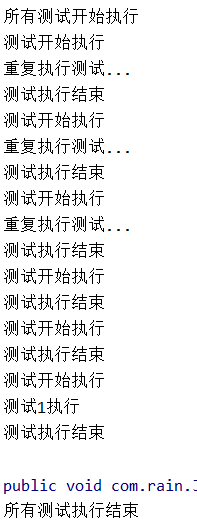


## 断言

断言(Assertion)是测试方法中的核心部分，用来对测试需要满足的条件进行验证。这些断言方法都是`org.junit.jupiter.api.Assertions`的静态方法。检查业务逻辑返回的数据是否合理。所有的测试运行结束以后，会有一个详细的测试报告。

**简单断言**

| 方法            | 说明                                 |
| --------------- | ------------------------------------ |
| assertEquals    | 判断两个对象或两个原始类型是否相等   |
| assertNotEquals | 判断两个对象或两个原始类型是否不相等 |
| assertSame      | 判断两个对象引用是否指向同一个对象   |
| assertNotSame   | 判断两个对象引用是否指向不同的对象   |
| assertTrue      | 判断给定的布尔值是否为 true          |
| assertFalse     | 判断给定的布尔值是否为 false         |
| assertNull      | 判断给定的对象引用是否为 null        |
| assertNotNull   | 判断给定的对象引用是否不为 null      |

**数组断言：** 通过 `Assertions.assertArrayEquals` 方法来判断两个对象或原始类型的数组是否相等。

**组合断言：**`Assertions.assertAll()`方法接受多个 `org.junit.jupiter.api.Executable` 函数式接口的实例作为要验证的断言，可以通过 lambda 表达式很容易的提供这些断言。只有所有断言都通过，组合断言才通过

**异常断言：** `Assertions.assertThrows()`，配合函数式编程就可以进行使用。断定一定出现异常，不出现异常则报错

**超时断言：** `Assertions.assertTimeout()`

**快速失败：** `Assertions.fail()`

**测试**

```java
import org.junit.jupiter.api.Assertions;

@SpringBootTest
public class AssertionTest {

    @Test
    public void simpleAsertTest(){
        Assertions.assertEquals(2,3,"与预期不符");   //参数1：期望的值，参数2：传入的值，参数3：失败，报错的消息
		//如果出现错误，下面的断言将不执行
        Assertions.assertTrue(2 > 5,"与预期不符");

        Assertions.assertSame(new Team(),new Team(),"不是同一对象");
    }

    @Test
    public void array() {
        Assertions.assertArrayEquals(new int[]{2, 2}, new int[] {1, 2},"不是同一数组");
    }

    @Test
    public void all() {
        Assertions.assertAll("Math",
                () -> Assertions.assertEquals(5, 2+3,"不相等"),
                () -> Assertions.assertTrue(1 > 0,"错误")
        );
    }
    @Test
    public void exceptionTest() {
        //不抛出异常，则报错
        //参数1：预计抛出的异常
        //参数2：执行的语句
        ArithmeticException exception = Assertions.assertThrows(
            ArithmeticException.class, () -> System.out.println(1 % 0),"竟然没抛出异常");
    }
    @Test
    public void timeoutTest() {
        //如果测试方法时间超过1s将会异常
        Assertions.assertTimeout(Duration.ofMillis(1000), () -> Thread.sleep(500));
    }

    @Test
    public void shouldFail() {
        Assertions.fail("快速失败");   //直接失败
    }
}
```


## 前置条件

前置条件assumptions(假设)，与断言类似，不同之处在于不满足的断言assertions会使得测试方法失败，而不满足的前置条件只会使得测试方法终止。前置条件可以看成是测试方法执行的前提，当该前提不满足时，就没有继续执行的必要(跳过)。

````java
public class AssumptionsTest {
	private final String environment = "DEV";
 
    @Test
    public void simpleAssume() {
       assumeTrue(Objects.equals(this.environment, "DEV"));
       assumeFalse(() -> Objects.equals(this.environment, "PROD"));
    }

    @Test
    public void assumeThenDo() {
       assumingThat(
          Objects.equals(this.environment, "DEV"),
          () -> System.out.println("In DEV")
       );
    }
}
````

`assumeTrue` 和 `assumFalse` 确保给定的条件为 `true` 或 `false`，不满足条件会使得测试执行终止。

`assumingThat` 的参数是表示条件的布尔值和对应的 `Executable` 接口的实现对象。只有条件满足时，`Executable` 对象才会被执行；当条件不满足时，测试执行并不会终止。


## 嵌套测试

JUnit 5 可以通过 Java 中的内部类和`@Nested`注解实现嵌套测试，从而可以更好的把相关的测试方法组织在一起。在内部类中可以使用`@BeforeEach` 和`@AfterEach`注解，而且嵌套的层次没有限制。外层的测试不会触发内部的`@BeforeEach` 和`@AfterEach`注解，内层的参数会触发外层的`@BeforeEach` 和`@AfterEach`注解

```java
public class TestingAStackDemo {

    Integer[] array;
    @BeforeEach
    public void beforeEach(){
        System.out.println("外层BeforeEach");
        array = new Integer[]{};
    }
    @AfterEach
    public void afterEach(){
        System.out.println("外层AfterEach");
    }
    @Test
    public void test1(){
        System.out.println(array.length);
    }

    @Nested
    class WhenNew{
        Integer[] array = new Integer[]{1,2};
        @BeforeEach
        public void beforeEach(){
            System.out.println("内层BeforeEach");
        }
        @Test
        public void test1(){
            System.out.println(array.length);
        }
        @AfterEach
        public void afterEach(){
            System.out.println("内层AfterEach");
        }
    }
}

//=======输出=======
/*
外层BeforeEach
0
外层AfterEach
外层BeforeEach
内层BeforeEach
2
内层AfterEach
外层AfterEach
*/
```


## 参数化测试

参数化测试是JUnit5很重要的一个新特性，它使得用不同的参数**多次运行**测试成为了可能，也为我们的单元测试带来许多便利。

`@ParameterizedTest`代表此方法是一个支持参数化测试的测试方法

利用`@ValueSource`等注解，指定入参，我们将可以使用不同的参数进行多次单元测试，而不需要每新增一个参数就新增一个单元测试，省去了很多冗余代码。

| 注解           | 描述                                                         |
| -------------- | ------------------------------------------------------------ |
| @ValueSource   | 为参数化测试指定入参来源，支持八大基础类以及String类型,Class类型 |
| @NullSource    | 表示为参数化测试提供一个null的入参                           |
| @EnumSource    | 表示为参数化测试提供一个枚举入参                             |
| @CsvFileSource | 表示读取指定CSV文件内容作为参数化测试入参                    |
| @MethodSource  | 表示读取指定方法的返回值作为参数化测试入参(注意方法返回需要是一个流) |


当然如果参数化测试仅仅只能做到指定普通的入参还达不到让我觉得惊艳的地步。让我真正感到他的强大之处的地方在于他可以支持外部的各类入参。如:CSV,YML,JSON 文件甚至方法的返回值也可以作为入参。只需要去实现**ArgumentsProvider**接口，任何外部文件都可以作为它的入参。

```java
public class ParaTest{
	@ParameterizedTest
    //@ValueSource(strings = {"rain","up","up"})
    @ValueSource(ints = {1,2,3,4})
    @Test
    public void parameterizedTest(int i){
        System.out.println(i);                
    }

    /* 控制台输出
    	1
    	2
    	3
    	4
    */
    @ParameterizedTest
    @MethodSource("source")
    @Test
    public void MethodSourceTest(String s){
        System.out.println(s);
    }
    static Stream<String> source(){
        return Stream.of("one","two","three");
    }
    /* 控制台输出
        one
        two
        three
    */
}
```


## 迁移指南

从JUnit4迁移到JUnit5

* 首先是导入Junit5的包

- 注解在 `org.junit.jupiter.api` 包中，断言在 `org.junit.jupiter.api.Assertions` 类中，前置条件在 `org.junit.jupiter.api.Assumptions` 类中。
- 把`@Before` 和`@After` 替换成`@BeforeEach` 和`@AfterEach`
- 把`@BeforeClass` 和`@AfterClass` 替换成`@BeforeAll` 和`@AfterAll`。
- 把`@Ignore` 替换成`@Disabled`。
- 把`@Category` 替换成`@Tag`。
- 把`@RunWith`、`@Rule` 和`@ClassRule` 替换成`@ExtendWith`。


# 指标监控

## Actuator

[官方文档](https://docs.spring.io/spring-boot/docs/2.4.2/reference/htmlsingle/#production-ready)

未来每一个微服务在云上部署以后，我们都需要对其进行监控、追踪、审计、控制等。SpringBoot就抽取了Actuator场景，使得我们每个微服务快速引用即可获得生产级别的应用监控、审计等功能。

````xml
<dependency>
    <groupId>org.springframework.boot</groupId>
    <artifactId>spring-boot-starter-actuator</artifactId>
</dependency>
````

引入后就可以访问：`http://localhost:8080/actuator`

默认在web端只暴露了：`health`、`info`端口

* `http://localhost:8080/actuator/health`
* `http://localhost:8080/actuator/info`


**以Web方式暴露所有监控信息**

使用`management.xxx` 进行配置

````yaml
management:
  endpoints:
    enabled-by-default: true #暴露所有端点信息
    web:
      exposure:
        include: '*'  #以web方式暴露所有的端点
````

例：

* `http://localhost:8080/actuator/beans`
* `http://localhost:8080/actuator/metrics`
* `http://localhost:8080/actuator/metrics/http.server.requests`

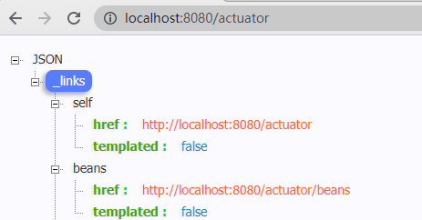


## 监控端点

**常用监控端点**

| ID                 | 描述                                                         |
| ------------------ | ------------------------------------------------------------ |
| `auditevents`      | 暴露当前应用程序的审核事件信息。需要一个`AuditEventRepository组件`。 |
| `beans`            | 显示应用程序中所有Spring Bean的完整列表。                    |
| `caches`           | 暴露可用的缓存。                                             |
| `conditions`       | 显示自动配置的所有条件信息，包括匹配或不匹配的原因。         |
| `configprops`      | 显示所有`@ConfigurationProperties`。                         |
| `env`              | 暴露Spring的属性`ConfigurableEnvironment`                    |
| `flyway`           | 显示已应用的所有Flyway数据库迁移。 需要一个或多个`Flyway`组件。 |
| `health`           | 显示应用程序运行状况信息。                                   |
| `httptrace`        | 显示HTTP跟踪信息（默认情况下，最近100个HTTP请求-响应）。需要一个`HttpTraceRepository`组件。 |
| `info`             | 显示应用程序信息。                                           |
| `integrationgraph` | 显示Spring `integrationgraph` 。需要依赖`spring-integration-core`。 |
| `loggers`          | 显示和修改应用程序中日志的配置。                             |
| `liquibase`        | 显示已应用的所有Liquibase数据库迁移。需要一个或多个`Liquibase`组件。 |
| `metrics`          | 显示当前应用程序的“指标”信息。                               |
| `mappings`         | 显示所有`@RequestMapping`路径列表。                          |
| `scheduledtasks`   | 显示应用程序中的计划任务。                                   |
| `sessions`         | 允许从Spring Session支持的会话存储中检索和删除用户会话。需要使用Spring Session的基于Servlet的Web应用程序。 |
| `shutdown`         | 使应用程序正常关闭。默认禁用。                               |
| `startup`          | 显示由`ApplicationStartup`收集的启动步骤数据。需要使用`SpringApplication`进行配置`BufferingApplicationStartup`。 |
| `threaddump`       | 执行线程转储。                                               |


**最常用的监控端点**

- **Health：监控状况**
- **Metrics：运行时指标**
- **Loggers：日志记录**


### Health Endpoint

健康检查端点，我们一般用于在云平台，平台会定时的检查应用的健康状况，我们就需要Health Endpoint可以为平台返回当前应用的一系列组件健康状况的集合。

重要的几点：

- health endpoint返回的结果，应该是一系列健康检查后的一个汇总报告
- 很多的健康检查默认已经自动配置好了，比如：数据库、redis等
- 可以很容易的添加自定义的健康检查机制

```yaml
management:
  endpoints:
    enabled-by-default: true
    web:
      exposure:
        include: '*'
  endpoint:           # 对端点配置详细的信息
    health:           # 对health端点配置详细的信息
      show-details: always  # 开启详细信息
```

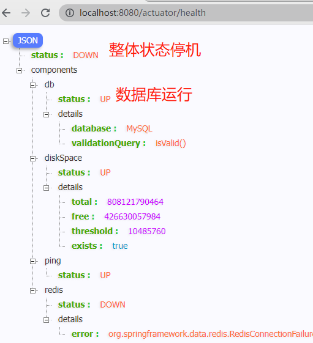


### Metrics Endpoint

提供详细的、层级的、空间指标信息，这些信息可以被pull（主动推送）或者push（被动获取）方式得到；

- 通过Metrics对接多种监控系统
- 简化核心Metrics开发
- 添加自定义Metrics或者扩展已有Metrics

访问：`http://localhost:8080/actuator/metrics`得到空间指标

再次发生二次请求：`http://localhost:8080/actuator/metrics/executor.pool.max`得到详细信息

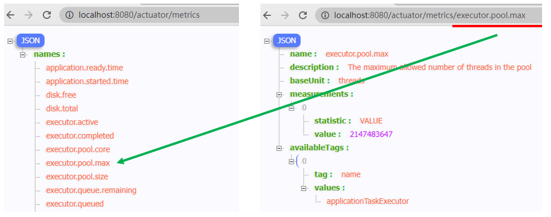


### 开启与禁用Endpoint

- 默认所有的Endpoint除过shutdown都是开启的。
- 需要开启或者禁用某个Endpoint。配置模式为`management.endpoint.端点名.enabled = true`

```yaml
management:
  endpoints:
    enabled-by-default: false   # 关闭所有端点
    web:
      exposure:
        include: '*'
  endpoint:
    health:
      show-details: always
      enabled: true             # 手动开启端点
    metrics:
      enabled: true
    beans:
      enabled: true
```


### 定制EndPoint

[视频：定制EndPoint](https://www.bilibili.com/video/BV19K4y1L7MT?p=79)


## 可视化工具

[GitHub](https://github.com/codecentric/spring-boot-admin)

[官方文档](https://codecentric.github.io/spring-boot-admin/2.3.1/#getting-started)

[视频：Boot Admin Server](https://www.bilibili.com/video/BV19K4y1L7MT?p=80)


# 原理解析

## 自定义starter

**starter启动原理**

我们的项目引入xxx-starter，他会自动引入xxx-autoconfigurer包。autoconfigurer进行了配置，使用`META-INF/spring.factories`中`EnableAutoConfiguration`的值，使得项目启动加载指定的自动配置类


设想：将常用的程序抽取出来，包装成starter，在我们的程序中就可以引入此starter，简化开发

创建两个工程：

* `rainupup-springboot-starter` 此工程是一个普通的maven，作用：仅为了引入`rainupup-springboot-starter-autoconfigure`工程
* `rainupup-springboot-starter-autoconfigure` 此工程是一个springboot，作用：抽取出常用的程序，并配置好它们

> rainupup-springboot-starter工程

在这个工程中不需要任何代码，他的作用只是为了引入`rainupup-springboot-starter-autoconfigure`工程

```xml
<?xml version="1.0" encoding="UTF-8"?>
<project xmlns="http://maven.apache.org/POM/4.0.0"
         xmlns:xsi="http://www.w3.org/2001/XMLSchema-instance"
         xsi:schemaLocation="http://maven.apache.org/POM/4.0.0 http://maven.apache.org/maven-v4_0_0.xsd">

    <modelVersion>4.0.0</modelVersion>
    <groupId>cn.rainupup</groupId>
    <artifactId>rainupup-springboot-starter</artifactId>
    <version>1.0-SNAPSHOT</version>

    <dependencies>
        <dependency>
            <groupId>cn.rainupup</groupId>
            <artifactId>rainupup-springboot-starter-autoconfigure</artifactId>
            <version>0.0.1-SNAPSHOT</version>
        </dependency>
    </dependencies>
</project>
```


> rainupup-springboot-starter-autoconfigure工程

工程架构：

​	pom.xml：为了引入所需依赖

​	resources/

​		application.properties:配置文件

​		/META-INF/spring.factories:使得项目启动时加载指定的自动配置类

​	java/

​		cn/

​			rainupup/

​				Auto/rainupupAutoConfiguration:自动配置类

​				Bean/rainupupProperties       :绑定配置文件

​				Service/rainupupService       :抽取的程序

```xml
<?xml version="1.0" encoding="UTF-8"?>
<project xmlns="http://maven.apache.org/POM/4.0.0" xmlns:xsi="http://www.w3.org/2001/XMLSchema-instance"
         xsi:schemaLocation="http://maven.apache.org/POM/4.0.0 https://maven.apache.org/xsd/maven-4.0.0.xsd">
    <modelVersion>4.0.0</modelVersion>
    <parent>
        <groupId>org.springframework.boot</groupId>
        <artifactId>spring-boot-starter-parent</artifactId>
        <version>2.7.2</version>
        <relativePath/> <!-- lookup parent from repository -->
    </parent>

    <groupId>cn.rainupup</groupId>
    <artifactId>rainupup-springboot-starter-autoconfigure</artifactId>
    <version>0.0.1-SNAPSHOT</version>

    <name>rainupup-springboot-starter-autoconfigure</name>
    <description>rainupup-springboot-starter-autoconfigure</description>
    <properties>
        <java.version>11</java.version>
    </properties>
    <dependencies>
        <dependency>
            <groupId>org.springframework.boot</groupId>
            <artifactId>spring-boot-starter</artifactId>
        </dependency>
    </dependencies>
</project>
```

```java
package cn.rainupup.Auto;
@Configuration
@EnableConfigurationProperties(rainupupProperties.class)  //开启xx类的配置文件绑定，并注入容器
public class rainupupAutoConfiguration {
    @ConditionalOnMissingBean(rainupupService.class)      //按照条件添加Bean
    @Bean
    public rainupupService rainupupService(){
        return new rainupupService();
    }
}
```

```properties
rainupup.prefix=welcome come to
rainupup.suffix=  Website
```

```java
package cn.rainupup.Bean;

@ConfigurationProperties("rainupup")  //绑定配置文件rainupup前缀
public class rainupupProperties {
    private String prefix;
    private String suffix;
	//Get Set方法
}
```

```java
package cn.rainupup.Service;

public class rainupupService {
    @Autowired
    rainupupProperties rainupupProperties;   //引入配置文件类

    public String getSite(String site){
        String helloSite = rainupupProperties.getPrefix() + site + rainupupProperties.getSuffix();
        return helloSite;
    }
}
```

spring.factories

```properties
org.springframework.boot.autoconfigure.EnableAutoConfiguration=\
  cn.rainupup.Auto.rainupupAutoConfiguration
```


使用maven插件的 `clean` + `install` 功能，将两个工程安装到本地

到目前为止，已经自定义好了starter。下面创建工程测试

```xml
<dependency>
    <groupId>cn.rainupup</groupId>
    <artifactId>rainupup-springboot-starter</artifactId>
    <version>1.0-SNAPSHOT</version>
</dependency>
```

```java
@RestController
public class TestController {

    @Autowired
    private rainupupService rainupupService;
    @RequestMapping("/site")
    public String helloSite(@PathParam("site") String site){
        return rainupupService.getSite(site);
    }
}
```

```properties
rainupup.prefix=welcome come to
rainupup.suffix= Website
```

访问：`http://localhost:8080/site?site=www.rainupup.cn` 输出：welcome come to www.rainupup.cn Website


## SpringApplication原理

```java
@SpringBootApplication
public class TestRainupupApplication {
    public static void main(String[] args) {
        //分析此类，参数1：主启动器
        SpringApplication.run(TestRainupupApplication.class, args);  
    }
}
```

```java
public class SpringApplication {
    public static ConfigurableApplicationContext run(Class<?> primarySource, String... args) {
        return run(new Class[]{primarySource}, args); //调用下方run方法
    }
    public static ConfigurableApplicationContext run(Class<?>[] primarySources, String[] args) {
        //先调用下方构造器，创建SpringApplication,参数primarySources：主配置类
        //再调用下方run()方法启动
        return (new SpringApplication(primarySources)).run(args);   
    }
    
    public SpringApplication(ResourceLoader resourceLoader, Class<?>... primarySources) {
		......
        this.primarySources = new LinkedHashSet(Arrays.asList(primarySources));
        this.webApplicationType = WebApplicationType.deduceFromClasspath();
        /* 重要，使用getSpringFactoriesInstances方法，
        	去所有的spring.factories中找 ApplicationContextInitializer 初始化器
        */
        this.setInitializers(this.getSpringFactoriesInstances(ApplicationContextInitializer.class));
        /* 重要，使用getSpringFactoriesInstances方法，
        	去所有的spring.factories中找 ApplicationListener 程序监听器
        */
        this.setListeners(this.getSpringFactoriesInstances(ApplicationListener.class));
        this.mainApplicationClass = this.deduceMainApplicationClass();
    }
    
	//去所有的spring.factories中找一个Class<T> type类型的东西。此方法大量出现
    private <T> Collection<T> getSpringFactoriesInstances(Class<T> type, 
                                                          Class<?>[] parameterTypes, Object... args) {
        ClassLoader classLoader = this.getClassLoader();
        Set<String> names = new LinkedHashSet(SpringFactoriesLoader.loadFactoryNames(type, classLoader));
        List<T> instances = 
            this.createSpringFactoriesInstances(type, parameterTypes, classLoader, args, names);
        AnnotationAwareOrderComparator.sort(instances);
        return instances;
    }
    
    public ConfigurableApplicationContext run(String... args) {
        StopWatch stopWatch = new StopWatch();
        //与下面的stopWatch.stop()配合，记录应用的启动时间
        stopWatch.start();     
        ConfigurableApplicationContext context = null;
        Collection<SpringBootExceptionReporter> exceptionReporters = new ArrayList();
        //进入headless模式(自力更生，不依赖其他)，java.awt.headless
        this.configureHeadlessProperty();   
        //获取所有运行监听器，还是使用getSpringFactoriesInstances()方法，为了方便所有Listener进行事件感知
        SpringApplicationRunListeners listeners = this.getRunListeners(args);  
        //调用所有运行监听器的.starting方法。告诉其他组件我正在启动
        listeners.starting();  

        Collection exceptionReporters;
        try {
            //获取命令行参数，args就是我们主启动器的String[] args
            ApplicationArguments applicationArguments = new DefaultApplicationArguments(args);
            /* 准备运行环境，调用下方的prepareEnvironment()方法
            	参数1：运行监听器
            	参赛2：命令行参数
            */
            ConfigurableEnvironment environment = 
                this.prepareEnvironment(listeners, applicationArguments);
            
            this.configureIgnoreBeanInfo(environment);  //忽略一些信息
            //打印banner，就是在控制台输出由 符号组成spring。我们还可以自定义banner
            Banner printedBanner = this.printBanner(environment);  
            
            /* 创建IOC容器
            	根据当前项目类型 创建容器
            		SERVLET、REACTIVE响应式
            	当前是servlet，创建AnnotationConfigServletWebServerApplicationContext
            */
            context = this.createApplicationContext();
            
            exceptionReporters = this.
                getSpringFactoriesInstances(SpringBootExceptionReporter.class, 
                                            new Class[]{ConfigurableApplicationContext.class}, context);
            
            // 准备 IOC容器的基本信息
            this.prepareContext(context, environment, listeners, applicationArguments, printedBanner);
            /* 刷新IOC容器，最终调用spring的底层AbstractApplicationContext.java，
            	创建容器中的所有组件。在spring注解驱动笔记中有详细记录
            */
            this.refreshContext(context);
            this.afterRefresh(context, applicationArguments);
            //与上方的stopWatch.start()配合，记录应用启动所需的时间
            stopWatch.stop();    
            ......
			//又调用所有监听器的started()，通知某些工作完成
            listeners.started(context);
            /*
            	获取容器中的 ApplicationRunner 、CommandLineRunner
            	合并所有runner并且按照@Order进行排序
            	遍历所有的runner，调用 run 方法
            */
            this.callRunners(context, applicationArguments);
        } catch (Throwable var10) {
            //如果发生错误，底层调用listeners.failed()通知异常
            this.handleRunFailure(context, var10, exceptionReporters, listeners);
            throw new IllegalStateException(var10);
        }

        try {
            //调用所有监听器的 running 方法  listeners.running(context); 通知所有的监听器 running
            listeners.running(context);
            /* 返回IOC容器，至此启动结束，回到我们的主启动器类。
            	可以看出使用SpringApplication.run(TestRainupupApplication.class, args); 可以获得IOC容器
            */
            return context;         
        } catch (Throwable var9) {
			//如果发生错误，底层调用listeners.failed()通知异常
        }
    }
    
    //准备环境信息
    private ConfigurableEnvironment prepareEnvironment(SpringApplicationRunListeners listeners,
                                                       ApplicationArguments applicationArguments) {
        //获得 或 创建一个环境
        ConfigurableEnvironment environment = this.getOrCreateEnvironment(); 
        //配置环境信息，读取所有配置源的属性值
        //包括配置源的key-value 和 环境变量的
        this.configureEnvironment((ConfigurableEnvironment)environment,
                                  applicationArguments.getSourceArgs());
        //绑定环境信息
        ConfigurationPropertySources.attach((Environment)environment);
        
        //调用监听器，通知所有监听器当前环境准备完成
        listeners.environmentPrepared((ConfigurableEnvironment)environment);
        //同样是执行一些绑定工作
        this.bindToSpringApplication((ConfigurableEnvironment)environment);
        
        ......

		//还是绑定
        ConfigurationPropertySources.attach((Environment)environment);
        //将环境返回，所有的环境信息准备完成，回到run()方法
        return (ConfigurableEnvironment)environment;
    }
    //准备IOC容器信息
    private void prepareContext(ConfigurableApplicationContext context, 
                                ConfigurableEnvironment environment, 
                                SpringApplicationRunListeners listeners, 
                                ApplicationArguments applicationArguments, Banner printedBanner) {
        context.setEnvironment(environment);         //将环境信息保存到IOC容器
        this.postProcessApplicationContext(context); //IO的后置处理流程
        
        /* 应用初始化器(SpringApplication()中得到的Initializers)
        	底层调用Initializer.initialize()方法对IOC容器进行初始化扩展工作
        */
        this.applyInitializers(context);
        /* 调用所有listener.contextLoaded
        */
        listeners.contextPrepared(context);
        if (this.logStartupInfo) {//日志
        }

        //获得Bean工程
        ConfigurableListableBeanFactory beanFactory = context.getBeanFactory();
        //将命令行参数也注册为组件
        beanFactory.registerSingleton("springApplicationArguments", applicationArguments);
		.......
        this.load(context, sources.toArray(new Object[0]));
        //又双叒叕调用了监听器，调用所有监听器的contextLoaded()，加载
        listeners.contextLoaded(context);  
        
        //IOC容器准备完成，回到run()方法
    }
}
```

```properties
# Application Context Initializers
org.springframework.context.ApplicationContextInitializer=\
org.springframework.boot.context.ConfigurationWarningsApplicationContextInitializer,\
......

# Application Listeners
org.springframework.context.ApplicationListener=\
org.springframework.boot.ClearCachesApplicationListener,\
......
```

上方代码的关键组件：`ApplicationContextInitializer`、`ApplicationListener`、`SpringApplicationRunListener`、`ApplicationRunner`、`CommandLineRunner`

监听器可以在控制台输出内容，通知信息


## 自定义监听器

实现`ApplicationContextInitializer`、`ApplicationListener`、`SpringApplicationRunListener`、`ApplicationRunner`、`CommandLineRunner`类

* `ApplicationContextInitializer`、`ApplicationListener`、`SpringApplicationRunListener`需要使用`META-INF/spring.factories`注册

* `ApplicationRunner`、`CommandLineRunner`需要注入到容器`@Component`


```java
public class MyApplicationContextInitializer implements ApplicationContextInitializer {
    @Override
    public void initialize(ConfigurableApplicationContext applicationContext) {
        System.out.println("执行自定义ApplicationContextInitializer的initialize方法");
    }
}
```

```java
public class MyApplicationListener implements ApplicationListener {
    @Override
    public void onApplicationEvent(ApplicationEvent event) {
        System.out.println("执行自定义ApplicationListener的onApplicationEvent方法");
    }
}
```

```java
public class MySpringApplicationRunListener implements SpringApplicationRunListener {
    private SpringApplication application;  //可以对application添加操作
    
    //此类需要一个有参构造器，否则报错
    public MySpringApplicationRunListener(SpringApplication application, String[] args){
        this.application = application;
    }

    @Override
    public void starting() {
        System.out.println("执行自定义SpringApplicationRunListener的starting方法");
    }

    @Override
    public void environmentPrepared(ConfigurableEnvironment environment) {
        System.out.println("执行自定义SpringApplicationRunListener的environmentPrepared方法");
    }

    @Override
    public void contextPrepared(ConfigurableApplicationContext context) {
        System.out.println("执行自定义SpringApplicationRunListener的contextPrepared方法");
    }

    @Override
    public void contextLoaded(ConfigurableApplicationContext context) {
        System.out.println("执行自定义SpringApplicationRunListener的contextLoaded方法");
    }

    @Override
    public void started(ConfigurableApplicationContext context) {
        System.out.println("执行自定义SpringApplicationRunListener的started方法");
    }

    @Override
    public void running(ConfigurableApplicationContext context) {
        System.out.println("执行自定义SpringApplicationRunListener的running方法");
    }

    @Override
    public void failed(ConfigurableApplicationContext context, Throwable exception) {
        System.out.println("执行自定义SpringApplicationRunListener的failed方法");
    }
}
```

META-INF/spring.factories

```properties
# 注册初始化器、监听器、运行时监听器
org.springframework.boot.SpringApplicationRunListener=\
  com.example.Listener.MySpringApplicationRunListener

org.springframework.context.ApplicationListener=\
  com.example.Listener.MyApplicationListener
org.springframework.context.ApplicationContextInitializer=\
  com.example.Listener.MyApplicationContextInitializer
```

```JAVA
//@Order(1)  //可以指定加载顺序
@Component //注入容器，因为是从容器中查找ApplicationRunner
public class MyApplicationRunner implements ApplicationRunner {
    @Override
    public void run(ApplicationArguments args) throws Exception {
        System.out.println("执行自定义ApplicationRunner的run方法");
    }
}
```

```JAVA
//@Order(2)
@Component //注入容器，因为是从容器中查找CommandLineRunner
public class MyCommandLineRunner implements CommandLineRunner {
    @Override
    public void run(String... args) throws Exception {
        System.out.println("执行自定义MyCommandLineRunner的run()方法");
    }
}
```

启动项目，可以在控制台看到输出

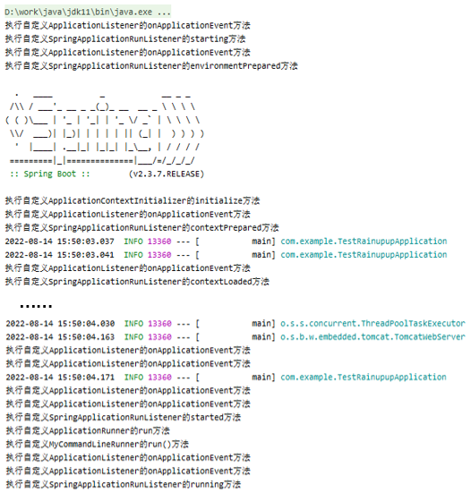


# 安全

Spring Security 

Shiro
