# 概念

## 什么是微服务？

- 微服务是一种架构风格
- 一个应用拆分为一组小型服务
- 每个服务运行在自己的进程内，也就是可独立部署和升级
- 服务之间使用轻量级HTTP交互
- 服务围绕业务功能拆分
- 可以由全自动部署机制独立部署
- 去中心化，服务自治。服务可以使用不同的语言、不同的存储技术

再来从技术维度角度理解下：

- 微服务化的核心就是将传统的一站式应用，根据业务拆分成一个一个的服务，彻底地去耦合，每一个微服务提供单个业务功能的服务，一个服务做一件事情，从技术角度看就是一种小而独立的处理过程，类似进程的概念，能够自行单独启动或销毁，拥有自己独立的数据库。

 

## 微服务与微服务架构

> 微服务

强调的是服务的大小，它关注的是某一个点，是具体解决某一个问题/提供落地对应服务的一个服务应用，狭义的看，可以看作是IDEA中的一个个微服务工程，或者Moudel。IDEA 工具里面使用Maven开发的一个个独立的小Moudel，它具体是使SpringBoot开发的一个小模块，专业的事情交给专业的模块来做，一个模块就做着一件事情。强调的是一个个的个体，每个个体完成一个具体的任务或者功能。

 

> 微服务架构

微服务架构是一种架构模式，它提倡将单一应用程序划分成一组小的服务，服务之间相互协调，互相配合，为用户提供最终价值。每个服务运行在其独立的进程中，服务与服务之间采用轻量级的通信机制(如HTTP)互相协作，每个服务都围绕着具体的业务进行构建，并且能够被独立的部署到生产环境中，另外，应尽量避免统一的，集中式的服务管理机制，对具体的一个服务而言，应根据业务上下文，选择合适的语言、工具(如Maven)对其进行构建。

 

## 微服务优缺点

> 优点

- 单一职责原则；
- 每个服务足够内聚，足够小，代码容易理解，这样能聚焦一个指定的业务功能或业务需求；
- 开发简单，开发效率高，一个服务可能就是专一的只干一件事；
- 微服务能够被小团队单独开发，这个团队只需2-5个开发人员组成；
- 微服务是松耦合的，是有功能意义的服务，无论是在开发阶段或部署阶段都是独立的；
- 微服务能使用不同的语言开发；
- 易于和第三方集成，微服务允许容易且灵活的方式集成自动部署，通过持续集成工具，如jenkins，Hudson，bamboo；
- 微服务易于被一个开发人员理解，修改和维护，这样小团队能够更关注自己的工作成果，无需通过合作才能体现价值；
- 微服务允许利用和融合最新技术；
- 微服务只是业务逻辑的代码，不会和HTML，CSS，或其他的界面混合;
- 每个微服务都有自己的存储能力，可以有自己的数据库，也可以有统一的数据库；

 

> 缺点

- 开发人员要处理分布式系统的复杂性；
- 多服务运维难度，随着服务的增加，运维的压力也在增大；
- 系统部署依赖问题；
- 服务间通信成本问题；
- 数据一致性问题；
- 系统集成测试问题；
- 性能和监控问题；

 

## 微服务技术栈

| 微服务技术条目                         | 落地技术                                                     |
| -------------------------------------- | ------------------------------------------------------------ |
| 服务开发                               | SpringBoot、Spring、SpringMVC等                              |
| 服务配置与管理                         | Netfix公司的Archaius、阿里的Diamond等                        |
| 服务注册与发现                         | Eureka、Consul、Zookeeper等                                  |
| 服务调用                               | Rest、PRC、gRPC                                              |
| 服务熔断器                             | Hystrix、Envoy等                                             |
| 负载均衡                               | Ribbon、Nginx等                                              |
| 服务接口调用(客户端调用服务的简化工具) | Fegin等                                                      |
| 消息队列                               | Kafka、RabbitMQ、ActiveMQ等                                  |
| 服务配置中心管理                       | SpringCloudConfig、Chef等                                    |
| 服务路由(API网关)                      | Zuul等                                                       |
| 服务监控                               | Zabbix、Nagios、Metrics、Specatator等                        |
| 全链路追踪                             | Zipkin、Brave、Dapper等                                      |
| 数据流操作开发包                       | SpringCloud Stream(封装与Redis，Rabbit，Kafka等发送接收消息) |
| 时间消息总栈                           | SpringCloud Bus                                              |
| 服务部署                               | Docker、OpenStack、Kubernetes等                              |

 


[spring官网](https://spring.io/)

[springcloud官方文档](https://cloud.spring.io/spring-cloud-static/Hoxton.SR1/reference/htmlsingle/)

[springcloud中文文档](https://www.bookstack.cn/read/spring-cloud-docs/docs-index.md)

## 版本选择

[springboot版本](https://spring.io/projects/spring-boot#learn)

[springcloud版本](https://spring.io/projects/spring-cloud#learn)

SpringCloud没有采用数字编号的方式命名版本号，而是采用了伦敦地铁站的名称，同时根据字母表的顺序来对应版本时间顺序，比如最早的Realse版本：Angel，第二个Realse版本：Brixton，然后是Camden、Dalston、Edgware，目前最新的是Hoxton SR4 CURRENT GA通用稳定版。


通过访问 https://start.spring.io/actuator/info 可以获得 springboot 与 springcloud 的对应关系


例：当选用`Hoxton.SR12`版本的springcloud时，springboot的版本应选择`2.2.0.RELEASE` 到 `2.4.0.M1`版本


**SpringCloudAlibaba**

通常我们需要结合Alibaba使用，相关版本依赖https://github.com/alibaba/spring-cloud-alibaba/wiki/


# 构建一个项目

## 创建父工程

创建一个Maven项目，作为父工程文件

```xml
<?xml version="1.0" encoding="UTF-8"?>
<project xmlns="http://maven.apache.org/POM/4.0.0"
         xmlns:xsi="http://www.w3.org/2001/XMLSchema-instance"
         xsi:schemaLocation="http://maven.apache.org/POM/4.0.0 http://maven.apache.org/xsd/maven-4.0.0.xsd">
    <modelVersion>4.0.0</modelVersion>

    <groupId>cn.rainupup</groupId>
    <artifactId>myCloudParent</artifactId>
    <version>1.0-SNAPSHOT</version>
    <packaging>pom</packaging>

    <!-- 统一管理jar包版本 -->
    <properties>
        <project.build.sourceEncoding>UTF-8</project.build.sourceEncoding>
        <maven.compiler.source>1.8</maven.compiler.source>
        <maven.compiler.target>1.8</maven.compiler.target>
        <junit.version>4.12</junit.version>
        <log4j.version>1.2.17</log4j.version>
        <lombok.version>1.18.24</lombok.version>
        <mysql.version>8.0.29</mysql.version>
        <druid.version>1.2.11</druid.version>
        <mybatis.spring.boot.version>2.2.2</mybatis.spring.boot.version>
    </properties>

    <!-- 1、只是声明依赖，并不实际引入，子项目按需声明使用的依赖 -->
    <!-- 2、子项目可以继承父项目的 version 和 scope -->
    <!-- 3、子项目若指定了 version 和 scope，以子项目为准 -->
    <dependencyManagement>
        <dependencies>
            <!--spring boot 2.2.2-->
            <dependency>
                <groupId>org.springframework.boot</groupId>
                <artifactId>spring-boot-dependencies</artifactId>
                <version>2.2.2.RELEASE</version>
                <type>pom</type>
                <scope>import</scope>
            </dependency>
            <!--spring cloud Hoxton.SR1-->
            <dependency>
                <groupId>org.springframework.cloud</groupId>
                <artifactId>spring-cloud-dependencies</artifactId>
                <version>Hoxton.SR1</version>
                <type>pom</type>
                <scope>import</scope>
            </dependency>
            <!--spring cloud alibaba 2.1.0.RELEASE-->
            <dependency>
                <groupId>com.alibaba.cloud</groupId>
                <artifactId>spring-cloud-alibaba-dependencies</artifactId>
                <version>2.1.0.RELEASE</version>
                <type>pom</type>
                <scope>import</scope>
            </dependency>

            <dependency>
                <groupId>mysql</groupId>
                <artifactId>mysql-connector-java</artifactId>
                <version>${mysql.version}</version>
            </dependency>
            <dependency>
                <groupId>com.alibaba</groupId>
                <artifactId>druid</artifactId>
                <version>${druid.version}</version>
            </dependency>
            <dependency>
                <groupId>org.mybatis.spring.boot</groupId>
                <artifactId>mybatis-spring-boot-starter</artifactId>
                <version>${mybatis.spring.boot.version}</version>
            </dependency>
            <dependency>
                <groupId>junit</groupId>
                <artifactId>junit</artifactId>
                <version>${junit.version}</version>
            </dependency>
            <dependency>
                <groupId>log4j</groupId>
                <artifactId>log4j</artifactId>
                <version>${log4j.version}</version>
            </dependency>
            <dependency>
                <groupId>org.projectlombok</groupId>
                <artifactId>lombok</artifactId>
                <version>${lombok.version}</version>
                <optional>true</optional>
            </dependency>
        </dependencies>
    </dependencyManagement>

    <build>
        <plugins>
            <plugin>
                <groupId>org.springframework.boot</groupId>
                <artifactId>spring-boot-maven-plugin</artifactId>
                <configuration>
                    <fork>true</fork>
                    <addResources>true</addResources>
                </configuration>
            </plugin>
        </plugins>
    </build>
</project>
```

使用`install`将父工程发布到仓库方便子工程继承


## 构建支付模块

创建数据库

````sql
CREATE TABLE `payment`(
	`id` bigint(20) NOT NULL AUTO_INCREMENT COMMENT 'ID',
    `serial` varchar(200) DEFAULT '',
	PRIMARY KEY (id)
)ENGINE=InnoDB AUTO_INCREMENT=1 DEFAULT CHARSET=utf8mb4
````


直接在父项目下创建新项目

创建`cloud-provider-payment8001`微服务提供者支付Module模块：

```xml
<?xml version="1.0" encoding="UTF-8"?>
<project xmlns="http://maven.apache.org/POM/4.0.0" xmlns:xsi="http://www.w3.org/2001/XMLSchema-instance"
         xsi:schemaLocation="http://maven.apache.org/POM/4.0.0 https://maven.apache.org/xsd/maven-4.0.0.xsd">
    <modelVersion>4.0.0</modelVersion>
    <parent>
        <artifactId>myCloudParent</artifactId>
        <groupId>cn.rainupup</groupId>
        <version>1.0-SNAPSHOT</version>
    </parent>

    <groupId>cn.rainupup</groupId>
    <artifactId>cloud-provider-payment8001</artifactId>
    <version>0.0.1-SNAPSHOT</version>

    <dependencies>
        <!-- 服务注册中心的客户端端 eureka-client -->
        <!-- https://mvnrepository.com/artifact/org.springframework.cloud/spring-cloud-starter-eureka-server -->
        <dependency>
            <groupId>org.springframework.cloud</groupId>
            <artifactId>spring-cloud-starter-netflix-eureka-client</artifactId>
        </dependency>


        <!-- https://mvnrepository.com/artifact/org.springframework.boot/spring-boot-starter-web -->
        <dependency>
            <groupId>org.springframework.boot</groupId>
            <artifactId>spring-boot-starter-web</artifactId>
        </dependency>

        <!-- https://mvnrepository.com/artifact/org.springframework.boot/spring-boot-starter-web -->
        <dependency>
            <groupId>org.springframework.boot</groupId>
            <artifactId>spring-boot-starter-actuator</artifactId>
        </dependency>

        <!-- https://mvnrepository.com/artifact/org.springframework.boot/spring-boot-starter-web -->
        <dependency>
            <groupId>org.mybatis.spring.boot</groupId>
            <artifactId>mybatis-spring-boot-starter</artifactId>
        </dependency>

        <!-- https://mvnrepository.com/artifact/com.alibaba/druid -->
        <dependency>
            <groupId>com.alibaba</groupId>
            <artifactId>druid-spring-boot-starter</artifactId>
            <version>1.2.8</version>
        </dependency>
        <!-- https://mvnrepository.com/artifact/mysql/mysql-connector-java -->
        <dependency>
            <groupId>mysql</groupId>
            <artifactId>mysql-connector-java</artifactId>
        </dependency>

        <!-- https://mvnrepository.com/artifact/org.springframework.boot/spring-boot-starter-jdbc -->
        <dependency>
            <groupId>org.springframework.boot</groupId>
            <artifactId>spring-boot-starter-jdbc</artifactId>
        </dependency>

        <!-- https://mvnrepository.com/artifact/org.springframework.boot/spring-boot-devtools -->
        <!--        <dependency>-->
        <!--            <groupId>org.springframework.boot</groupId>-->
        <!--            <artifactId>spring-boot-devtools</artifactId>-->
        <!--            <scope>runtime</scope>-->
        <!--            <optional>true</optional>-->
        <!--        </dependency>-->

        <!-- https://mvnrepository.com/artifact/org.projectlombok/lombok -->
        <dependency>
            <groupId>org.projectlombok</groupId>
            <artifactId>lombok</artifactId>
            <optional>true</optional>
        </dependency>

        <!-- https://mvnrepository.com/artifact/org.springframework.boot/spring-boot-starter-test -->
        <dependency>
            <groupId>org.springframework.boot</groupId>
            <artifactId>spring-boot-starter-test</artifactId>
            <scope>test</scope>
        </dependency>

        <!--包含了sleuth+zipkin-->
        <dependency>
            <groupId>org.springframework.cloud</groupId>
            <artifactId>spring-cloud-starter-zipkin</artifactId>
        </dependency>
    </dependencies>
</project>
```

applicaton.yaml

```yaml
server:
  port: 8001

spring:
  datasource:
    username: root
    password: 337337
    url: jdbc:mysql://localhost:3306/cloud?useUnicode=true&characterEncoding=utf-8&useSSL=false
    type: com.alibaba.druid.pool.DruidDataSource
mybatis:
  mapperLocations: classpath:mapper/*.xml
```

实体类

```java
package cn.rainupup.emtities;

@Data
@NoArgsConstructor
@AllArgsConstructor
public class Payment implements Serializable {
    private Long id;
    private String serial;
}
```

对前端的响应类型：对前端的友好提醒

```java
@Data
@AllArgsConstructor
@NoArgsConstructor
public class CommonResult<T> {
    private Integer code;
    private String message;
    private T data;

    public CommonResult(Integer code, String message){
        this(code, message, null);
    }
}
```

Dao包

```java
package cn.rainupup.dao;

@Mapper
public interface PaymentDao {
    public int create(Payment payment);
    public Payment getById(Long i);
}
```

mybatis映射

```xml
<?xml version="1.0" encoding="UTF-8"?>
<!DOCTYPE mapper PUBLIC "-//mybatis.org//DTD Mapper 3.0//EN" "http://mybatis.org/dtd/mybatis-3-mapper.dtd">
<mapper namespace="cn.rainupup.dao.PaymentDao">
    <insert id="create" parameterType="cn.rainupup.dao.PaymentDao" 
            useGeneratedKeys="true" keyProperty="id">
        insert into payment(serial) values (#{serial});
    </insert>

    <select id="getById" parameterType="Long" resultType="cn.rainupup.emtities.Payment">
        select * from payment where id = #{id};
    </select>
</mapper>
```

service包

```java
@Service
public interface PaymentService {
    public int create(Payment payment);
    public Payment getById(Long i);
}
```

```java
@Service
public class PaymentServiceImp implements PaymentService{
    @Resource
    PaymentDao paymentDao;
    @Override
    public int create(Payment payment) {
        return paymentDao.create(payment);
    }

    @Override
    public Payment getById(Long i) {
        return paymentDao.getById(i);

    }
}
```

Controller

```java
package cn.rainupup.controller;
@RestController
@RequestMapping("/payment")
public class PaymentController {

    @Autowired
    PaymentService paymentService;
    @Value("${server.port}")
    private String serverPort;      //获取端口号

    @PostMapping("create")
    public CommonResult<Integer> create(@RequestBody Payment payment) {
        int i = this.paymentService.create(payment);
        return new CommonResult<>(200, "insert success， serverPort：" + serverPort, i);
    }

    @GetMapping("get/{id}")
    public CommonResult<Payment> selectOne(@PathVariable("id") Long id) {
        Payment payment = this.paymentService.getById(id);
        return new CommonResult<Payment>(200, "select success， serverPort：" + serverPort, payment);
    }
}
```

主启动器

```java
@SpringBootApplication
public class CloudProviderPayment8001Application {
    public static void main(String[] args) {
        SpringApplication.run(CloudProviderPayment8001Application.class, args);
    }
}
```

访问：

* postman -http://localhost:8001/payment/create?serial=rain

* 浏览器 -http://localhost:8001/payment/get/1


## 消费者订单模块

创建cloud-consumer-order80的maven工程

```xml
<?xml version="1.0" encoding="UTF-8"?>
<project xmlns="http://maven.apache.org/POM/4.0.0"
         xmlns:xsi="http://www.w3.org/2001/XMLSchema-instance"
         xsi:schemaLocation="http://maven.apache.org/POM/4.0.0 http://maven.apache.org/xsd/maven-4.0.0.xsd">
    <parent>
        <artifactId>myCloudParent</artifactId>
        <groupId>cn.rainupup</groupId>
        <version>1.0-SNAPSHOT</version>
    </parent>
    <modelVersion>4.0.0</modelVersion>

    <artifactId>cloud-consumer-order80</artifactId>

    <properties>
        <maven.compiler.source>8</maven.compiler.source>
        <maven.compiler.target>8</maven.compiler.target>
    </properties>

    <dependencies>
        <dependency>
            <groupId>org.springframework.boot</groupId>
            <artifactId>spring-boot-starter-web</artifactId>
        </dependency>
        <dependency>
            <groupId>org.springframework.boot</groupId>
            <artifactId>spring-boot-starter-actuator</artifactId>
        </dependency>

        <dependency>
            <groupId>org.springframework.boot</groupId>
            <artifactId>spring-boot-devtools</artifactId>
            <scope>runtime</scope>
            <optional>true</optional>
        </dependency>
        <dependency>
            <groupId>org.projectlombok</groupId>
            <artifactId>lombok</artifactId>
            <optional>true</optional>
        </dependency>
        <dependency>
            <groupId>org.springframework.boot</groupId>
            <artifactId>spring-boot-starter-test</artifactId>
            <scope>test</scope>
        </dependency>
    </dependencies>
</project>
```

yaml

```yaml
server:
  port: 80
```

实体类

```java
@Data
@NoArgsConstructor
@AllArgsConstructor
public class Payment implements Serializable {
    private Long id;
    private String serial;
}
```

```java
@Data
@AllArgsConstructor
@NoArgsConstructor
public class CommonResult<T> {
    private Integer code;
    private String message;
    private T data;

    public CommonResult(Integer code, String message){
        this(code, message, null);
    }
}
```

配置类

```java
@Configuration
public class ApplicationContextConfig {
    @Bean  //注册RestTemplate
    public RestTemplate getRestTemplate(){
        return new RestTemplate();
    }
}
```

controller

```java
@Slf4j
@RestController
public class OrderController {

    public static final String PAYMENT_URL = "http://localhost:8001";

    @Resource
    private RestTemplate restTemplate;

    @GetMapping("/consumer/payment/create")
    public CommonResult<Payment> create(Payment payment) {

        return restTemplate.postForObject(PAYMENT_URL + "/payment/create", payment, CommonResult.class);
    }

    @GetMapping("/consumer/payment/get/{id}")
    public CommonResult<Payment> getPayment(@PathVariable("id") Long id) {
        return restTemplate.getForObject(PAYMENT_URL + "/payment/get/" + id, CommonResult.class);
    }
}
```

主启动器

```java
@SpringBootApplication
public class OrderMain {
    public static void main(String[] args) {
        SpringApplication.run(OrderMain.class,args);
    }
}
```

访问：

* http://localhost/consumer/payment/create?serial=200
* http://localhost/consumer/payment/get/1


浏览器 - http://localhost/consumer/payment/create?serial=rain

虽然，返回成功，但是观测数据库中，并没有创建`serial`为`rain`的行。

解决之道：在loud-provider-payment8001工程的`PaymentController`中添加`@RequestBody`注解。

```java
@PostMapping("create")
public CommonResult<Integer> create(@RequestBody Payment payment) {
    System.out.println("aaa");
    int i = this.paymentService.create(payment);

    return new CommonResult<>(200, "insert success， serverPort：" + serverPort, i);
}
```


## RestTemplate

RestTemplate提供了多种便捷访问远程Http服务的方法，是一种简单便捷的访问restful服务模板类，是Spring提供的用于访问Rest服务的客户端模板工具集

[官网地址](https://docs.spring.io/spring-framework/docs/5.2.2.RELEASE/javadoc-api/org/springframework/web/client/RestTemplate.html)

使用：

- 使用restTemplate访问restful接口非常的简单。
- `(url, requestMap, ResponseBean.class)`这三个参数分别代表 REST请求地址、请求参数、HTTP响应转换被转换成的对象类型。


## 工程简化

在我们的`cloud-consumer-order80`与`cloud-provider-payment8001`两工程中有重复的代码(实体类下的payment、CommonResult)，下面重构我们的代码

1. 创建一个`cloud-api-commons`的maven工程

```xml
<?xml version="1.0" encoding="UTF-8"?>
<project xmlns="http://maven.apache.org/POM/4.0.0"
         xmlns:xsi="http://www.w3.org/2001/XMLSchema-instance"
         xsi:schemaLocation="http://maven.apache.org/POM/4.0.0 http://maven.apache.org/xsd/maven-4.0.0.xsd">
    <parent>
        <artifactId>myCloudParent</artifactId>
        <groupId>cn.rainupup</groupId>
        <version>1.0-SNAPSHOT</version>
    </parent>
    <modelVersion>4.0.0</modelVersion>

    <artifactId>clound-api-commons</artifactId>

    <dependencies>
        <dependency>
            <groupId>org.springframework.boot</groupId>
            <artifactId>spring-boot-devtools</artifactId>
            <scope>runtime</scope>
            <optional>true</optional>
        </dependency>
        <dependency>
            <groupId>org.projectlombok</groupId>
            <artifactId>lombok</artifactId>
            <optional>true</optional>
        </dependency>
        <dependency>
            <groupId>cn.hutool</groupId>
            <artifactId>hutool-all</artifactId>
            <version>5.1.0</version>
        </dependency>
    </dependencies>
</project>
```

2. 将`cloud-consumer-order80`与`cloud-provider-payment8001`的entities包移至`cloud-api-commons`工程下

3. maven clean、install cloud-api-commons工程，以供给`cloud-consumer-order80`与`cloud-provider-payment8001`两工程调用。

4. 将`cloud-consumer-order80`与`cloud-provider-payment8001`的entities包移除，并引入cloud-api-commons依赖

```xml
<dependency>
    <groupId>cn.rainupup</groupId>
    <artifactId>clound-api-commons</artifactId>
    <version>1.0-SNAPSHOT</version>
</dependency>
```


# 服务注册中心

## ~~Eureka(尤里卡)~~

### 概述

**什么是服务治理**

* Spring Cloud封装了Netflix 公司开发的Eureka模块来实现服务治理
* 在传统的RPC远程调用框架中，管理每个服务与服务之间依赖关系比较复杂，管理比较复杂，所以需要使用服务治理，管理服务于服务之间依赖关系，可以实现服务调用、负载均衡、容错等，实现服务发现与注册。

**什么是服务注册与发现**

* Eureka采用了CS的设计架构，Eureka Sever作为服务注册功能的服务器，它是服务注册中心。而系统中的其他微服务，使用Eureka的客户端连接到 Eureka Server并维持心跳连接。这样系统的维护人员就可以通过Eureka Server来监控系统中各个微服务是否正常运行。
* 在服务注册与发现中，有一个注册中心。当服务器启动的时候，会把当前自己服务器的信息(比如服务地址通讯地址等)以别名方式注册到注册中心上。另一方(消费者服务提供者)，以该别名的方式去注册中心上获取到实际的服务通讯地址，然后再实现本地RPC调用RPC远程调用框架核心设计思想:在于注册中心，因为使用注册中心管理每个服务与服务之间的一个依赖关系(服务治理概念)。在任何RPC远程框架中，都会有一个注册中心存放服务地址相关信息(接口地址)

**Eureka架构图**

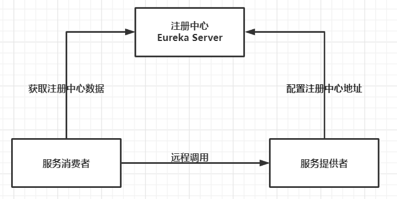

**Dubbo架构图**

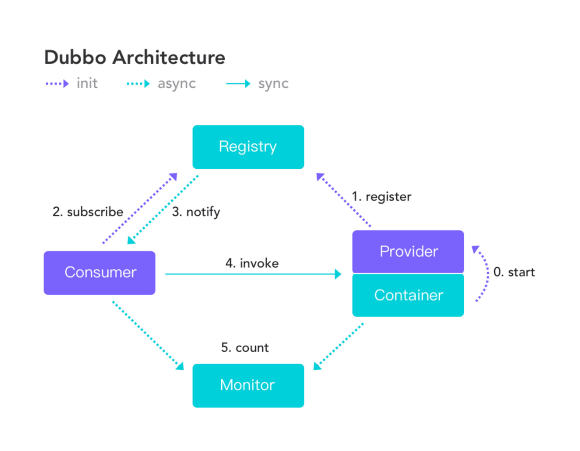


> **Eureka包含两个组件**:`Eureka Server`和`Eureka Client`

* **Eureka Server** 提供服务注册服务
  * 各个微服务节点通过配置启动后，会在EurekaServer中进行注册，这样EurekaServer中的服务注册表中将会存储所有可用服务节点的信息，服务节点的信息可以在界面中直观看到。
* **Eureka Client **通过注册中心进行访问
  * 它是一个Java客户端，用于简化Eureka Server的交互，客户端同时也具备一个内置的、使用轮询(round-robin)负载算法的负载均衡器。在应用启动后，将会向Eureka Server发送心跳(默认周期为30秒)。如果Eureka Server在多个心跳周期内没有接收到某个节点的心跳，Eureka Server将会从服务注册表中把这个服务节点移除（默认90秒)


### 构建Eureka

服务者：`spring-cloud-starter-netflix-eureka-client` 

Eureka注册中心：`spring-cloud-starter-netflix-eureka-server`   


#### 构建EurekaServer注册中心

创建`cloud-eureka-server7001`的maven工程

```xml
<?xml version="1.0" encoding="UTF-8"?>
<project xmlns="http://maven.apache.org/POM/4.0.0"
         xmlns:xsi="http://www.w3.org/2001/XMLSchema-instance"
         xsi:schemaLocation="http://maven.apache.org/POM/4.0.0 http://maven.apache.org/xsd/maven-4.0.0.xsd">
    <parent>
        <artifactId>myCloudParent</artifactId>
        <groupId>cn.rainupup</groupId>
        <version>1.0-SNAPSHOT</version>
    </parent>
    <modelVersion>4.0.0</modelVersion>
    <artifactId>cloud-eureka-server7001</artifactId>
    <dependencies>
        <!--eureka-server-->
        <dependency>
            <groupId>org.springframework.cloud</groupId>
            <artifactId>spring-cloud-starter-netflix-eureka-server</artifactId>
        </dependency>
        
        <dependency>
            <groupId>org.springframework.boot</groupId>
            <artifactId>spring-boot-starter-web</artifactId>
        </dependency>
        <dependency>
            <groupId>org.springframework.boot</groupId>
            <artifactId>spring-boot-starter-actuator</artifactId>
        </dependency>
    </dependencies>
</project>
```

yaml

```yaml
server:
  port: 7001

eureka:
  instance:
    hostname: locathost            # eureka服务端的实例名称
  client:
    register-with-eureka: false    # 表示是否向Eureka注册自己 (这个模块本身是服务者 所有不需要注册)
    fetch-registry: false          # fetch-registry如果为false,则表示自己为注册中心,客户端的化为 ture
    service-url:                   # 设置erueka监控页面
      # 设置与Eureka server交互的地址查询服务和注册服务都需要依赖这个地址。
      defaultZone: http://${eureka.instance.hostname}:${server.port}/eureka/
```

主启动器

```java
@SpringBootApplication
@EnableEurekaServer      //启动Eureka服务
public class EurekaMain {
    public static void main(String[] args) {
        SpringApplication.run(EurekaMain.class,args);
    }
}
```

访问：http://localhost:7001/ 进入SpringEureka页面


#### 支付微服务8001注册进入Eureka

EurekaClient端`cloud-provider-payment8001`将注册进EurekaServer成为服务提供者provider

在`cloud-provider-payment8001`中添加EurekaClient的maven依赖

````xml
<dependency>
    <groupId>org.springframework.cloud</groupId>
    <artifactId>spring-cloud-starter-netflix-eureka-client</artifactId>
</dependency>
````

yaml

```yaml
spring:
  application:
    name: payment8001            # 设置应用名

eureka:
  client:
    register-with-eureka: true   # 将自己注册进入EurekaServer
    #是否从EurekaServer抓取已有的注册信息，默认为true。单节点无所谓，集群必须设置为true才能配合ribbon使用负载均衡
    fetchRegistry: true
    service-url:
      defaultZone: http://localhost:7001/eureka   # 注册进入7001项目
```

主启动器

```java
@SpringBootApplication
@EnableEurekaClient      //开启EurekaClient
public class CloudProviderPayment8001Application {
    public static void main(String[] args) {
        SpringApplication.run(CloudProviderPayment8001Application.class, args);
    }
}
```

启动8001、7001项目，访问http://localhost:7001/

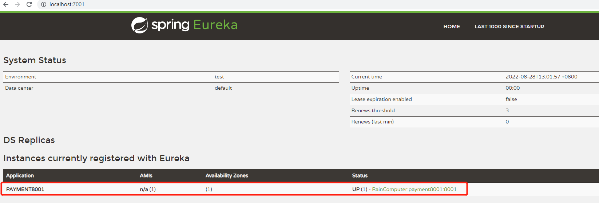

以同样的步骤将 服务消费者80项目 注册进入Eureka服务


### 注册中心集群

**概述**

* 服务注册：将服务信息注册进注册中心
* 服务发现：从注册中心上获取服务信息
* 实质：存key服务命取value闭用地址
  1. 先启动eureka注主册中心
  2. 启动服务提供者payment支付服务
  3. 支付服务启动后会把自身信息(比服务地址L以别名方式注册进eureka)
  4. 消费者order服务在需要调用接口时，使用服务别名去注册中心获取实际的RPC远程调用地址
  5. 消去者导调用地址后，底屋实际是利用HttpClient技术实现远程调用
  6. 消费者实际导服务地址后会缓存在本地jvm内存中，默认每间隔30秒更新一次服务调用地址


**问题:** 微服务RPC远程服务调用最核心的是什么

* 高可用，试想你的注册中心只有一个only one，万一它出故障了，会导致整个为服务环境不可用。

**解决办法:** 搭建Eureka注册中心集群，实现负载均衡+故障容错。


**总结:** 集群为的是安全，一个注册中心坏了还有其他注册中心

1. 在注册中心的配置文件 使用`eureka.client.service-url.defaultZone` 互相绑定其他注册中心的监控页面，以`,`号分隔

2. 在服务者的配置文件 使用`eureka.client.service-url.defaultZone` 绑定注册中心的监控页面，以`,` 号分隔


**构建集群**

修改7001，新建7002,7003注册中心项目

```yaml
server:
  port: 7001

eureka:
  instance:
    hostname: localhost1   #eureka服务端的实例名称

  client:
    #false表示不向注册中心注册自己,因为自己就是注册中心
    register-with-eureka: false
    #false表示自己端就是注册中心，职责就是维护服务实例，并不需要去检索服务
    fetch-registry: false
    service-url:
	  # 重写Eureka的默认端口以及访问路径 --->http://localhost:7001/eureka/
	  # 单机： defaultZone: http://${eureka.instance.hostname}:${server.port}/eureka/
      # 集群（关联）：7001关联7002、7003
      defaultZone: http://localhost:7002/eureka/,http://localhost:7003/eureka/
```

```yaml
server:
  port: 7002

eureka:
  instance:
    hostname: localhost2

  client:
    register-with-eureka: false
    fetch-registry: false
    service-url:
      defaultZone: http://localhost:7001/eureka/,http://localhost:7003/eureka/
```

7003同理

支付微服务8001 注册进入Eureka集群

```yaml
eureka:
  instance:
    lease-renewal-interval-in-seconds: 5
    lease-expiration-duration-in-seconds: 10
  client:
    register-with-eureka: true
    fetchRegistry: true
    service-url:
      defaultZone: http://localhost:7001/eureka,http://localhost:7002/eureka/,
      http://localhost:7003/eureka/
```

现在，就可以把一个项目挂载到三个服务器上了

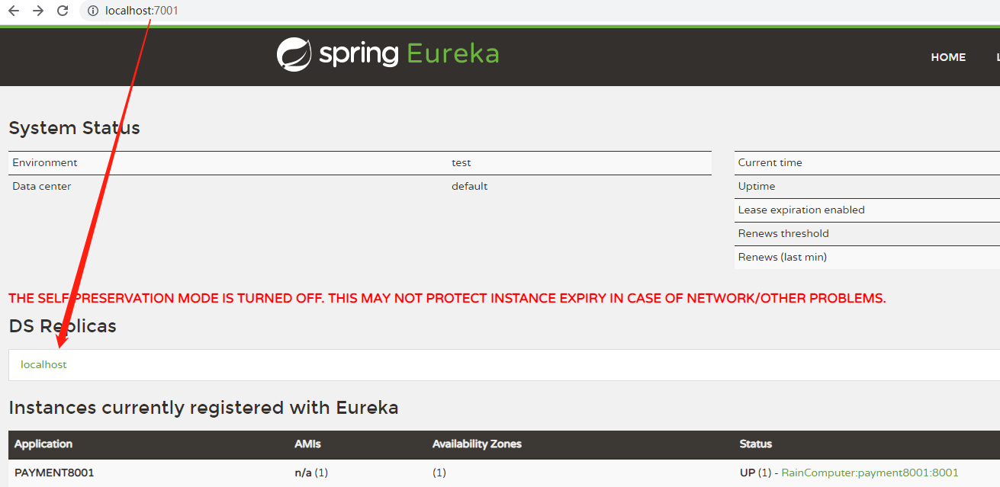

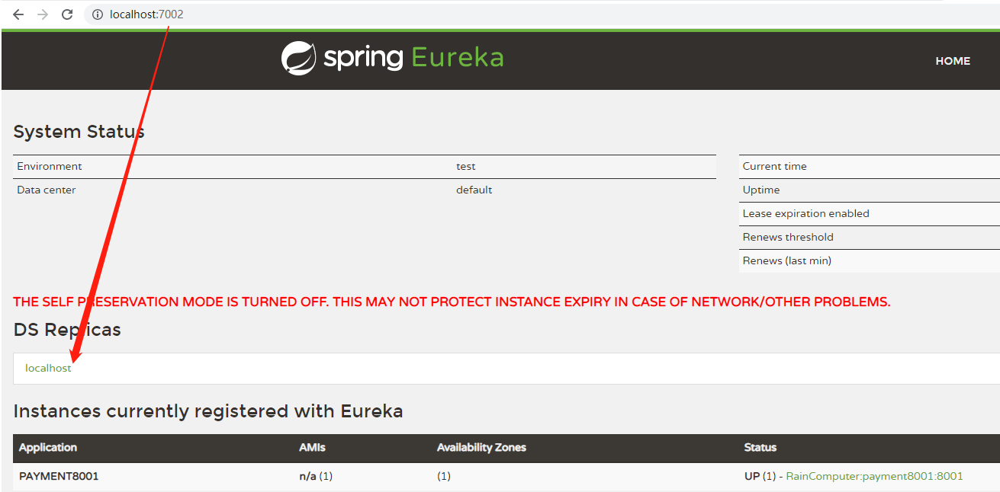


### 支付模块集群

目的：两个支付模块，一个挂了，还有另一个

仿照`cloud-provider-payment8001`，创建`cloud-provider-payment8002`

> **注意**

将8001/8002的程序名称统一设置为`cloud-payment-service`

原因：名字相当于key，order80项目需要按照key来得到8001/8002的地址，也就是value

```yaml
spring:
  application:
    name: cloud-payment-service
```


可以看到同个微服务名称，有多个微服务


**负载均衡**

在order80项目中，订单服务访问地址不能写死

```java
@Slf4j
@RestController
public class OrderController {

    //public static final String PAYMENT_URL = "http://localhost8001";
    //这个就是spring.application.name 设置的名字，通过他来获得8001/8002的地址
    public static final String PAYMENT_URL = "http://CLOUD-PAYMENT-SERVICE"; 
	......
}
```

使用`@LoadBalanced`注解赋予RestTemplate负载均衡的能力

```java
@Configuration
public class ApplicationContextConfig {
    @Bean
    @LoadBalanced
    public RestTemplate getRestTemplate(){
        return new RestTemplate();
    }
}
```

测试：启动7001/7002/7003/8001/8002/80，访问http://localhost/consumer/payment/get/12，会发现8001/8002交替调用

原理：服务消费者Order 通过`public static final String PAYMENT_URL = "http://CLOUD-PAYMENT-SERVICE";` 在注册中心中寻找名为`CLOUD-PAYMENT-SERVICE`的微服务集群，并获取他们的地址，再使用RestTemplate去访问这些微服务

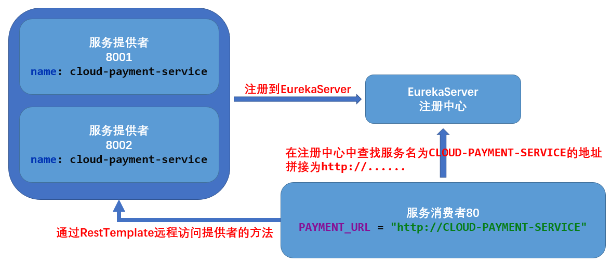


### 服务发现Discovery

对于注册进eureka里面的微服务，可以通过服务发现来获得该服务的信息

在`cloud-provider-payment8001`的Controller中添加`org.springframework.cloud.client.discovery.DiscoveryClient`

```java
importimport org.springframework.cloud.client.discovery.DiscoveryClient;;
@RestController
@RequestMapping("/payment")
public class PaymentController {

    @Resource
    private DiscoveryClient discoveryClient;

    .......
        
    @GetMapping("discovery")
    public Object discovery() {
        List<String> services = discoveryClient.getServices();   //获取服务
        services.forEach(System.out::println);

        //获取名称为CLOUD-PAYMENT-SERVICE的基本信息
        List<ServiceInstance> instances = discoveryClient.getInstances("CLOUD-PAYMENT-SERVICE");
        instances.forEach(instance -> {
            System.out.println(instance.getServiceId() + "\t" + instance.getHost() + "\t" + 
                               instance.getPort() + "\t" + instance.getUri());
        });

        return this.discoveryClient;
    }
}
```

主启动器

```java
@SpringBootApplication
@EnableEurekaClient 
@EnableDiscoveryClient       //服务发现
public class CloudProviderPayment8001Application {
    public static void main(String[] args) {
        SpringApplication.run(CloudProviderPayment8001Application.class, args);
    }
}
```

访问：http://localhost:8001/payment/discovery


### 自我保护                                                                          

**概述**

* 保护模式主要用于一组客户端和Eureka Server之间存在网络分区场景下的保护。一旦进入保护模式，Eureka Server将会尝试保护其服务注册表中的信息，不再删除服务注册表中的数据，也就是不会注销任何微服务。
* 如果在Eureka Server的首页看到以下这段提示，则说明Eureka进入了保护模式:`EMERGENCY! EUREKA MAY BE INCORRECTLY CLAIMING INSTANCES ARE UP WHEN THEY’RE NOT. RENEWALS ARE LESSER THANTHRESHOLD AND HENCE THE INSTANCES ARE NOT BEING EXPIRED JUSTTO BE SAFE`

**导致原因**

* 某时刻某一个微服务不可用了，Eureka不会立刻清理，依旧会对该微服务的信息进行保存。属于CAP里面的AP分支。

**为什么会产生Eureka自我保护机制?**

* 为了EurekaClient可以正常运行，防止与EurekaServer网络不通情况下，EurekaServer不会立刻将EurekaClient服务剔除

**什么是自我保护模式?**

* 默认情况下，如果EurekaServer在一定时间内没有接收到某个微服务实例的心跳，EurekaServer将会注销该实例(默认90秒)。但是当网络分区故障发生(延时、卡顿、拥挤)时，微服务与EurekaServer之间无法正常通信，以上行为可能变得非常危险了——因为微服务本身其实是健康的，此时本不应该注销这个微服务。Eureka通过“自我保护模式”来解决这个问题——当EurekaServer节点在短时间内丢失过多客户端时(可能发生了网络分区故障)，那么这个节点就会进入自我保护模式。

* 自我保护机制∶默认情况下EurekaClient定时向EurekaServer端发送心跳包
* 如果Eureka在server端在一定时间内(默认90秒)没有收到EurekaClient发送心跳包，便会直接从服务注册列表中剔除该服务，但是在短时间( 90秒中)内丢失了大量的服务实例心跳，这时候Eurekaserver会开启自我保护机制，不会剔除该服务（该现象可能出现在如果网络不通但是EurekaClient为出现宕机，此时如果换做别的注册中心如果一定时间内没有收到心跳会将剔除该服务，这样就出现了严重失误，因为客户端还能正常发送心跳，只是网络延迟问题，而保护机制是为了解决此问题而产生的)。


**禁止自我保护**

在EurekaServer(注册中心)项目中使用`eureka.server.enable-self-preservation = false`可以禁用自我保护模式

spring-eureka主页会显示出一句：`THE SELF PRESERVATION MODE IS TURNED OFF. THIS MAY NOT PROTECT INSTANCE EXPIRY IN CASE OF NETWORK/OTHER PROBLEMS.`

```yaml
# 7001项目中添加
eureka:
    server:
          enable-self-preservation: false
```


**设置剔除时间**

在Client项目中添加

```yaml
eureka:
  instance:
    #心跳检测与续约时间
    #开发时设置小些，保证服务关闭后注册中心能即使剔除服务
    #Eureka客户端向服务端发送心跳的时间间隔，单位为秒(默认是30秒)
    lease-renewal-interval-in-seconds: 5
    #Eureka服务端在收到最后一次心跳后等待时间上限，单位为秒(默认是90秒)，超时将剔除服务
    lease-expiration-duration-in-seconds: 10
```


### actuator微服务信息完善

**主机名称：**服务名称修改

```yaml
eureka:
  instance:
    instance-id: payment8001
```

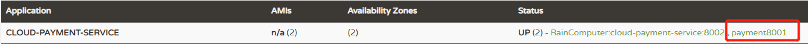

`spring.application.name`修改的是Application的内容

`eureka.instance.instance-id`修改的是Status的内容

**显示IP地址：**当鼠标移动到payment8001时，下方会显示IP地址

```yaml
eureka:
  instance:
    instance-id: payment8001
    prefer-ip-address: true    # 显示IP地址
```


**配置监控**

````xml
<!--actuator完善监控信息-->
<dependency>
    <groupId>org.springframework.boot</groupId>
    <artifactId>spring-boot-starter-actuator</artifactId>
</dependency>
````

application.yml中添加配置

````yaml
info: #json 键值对 随便写
    app.name: payment8001
    username: rain
````

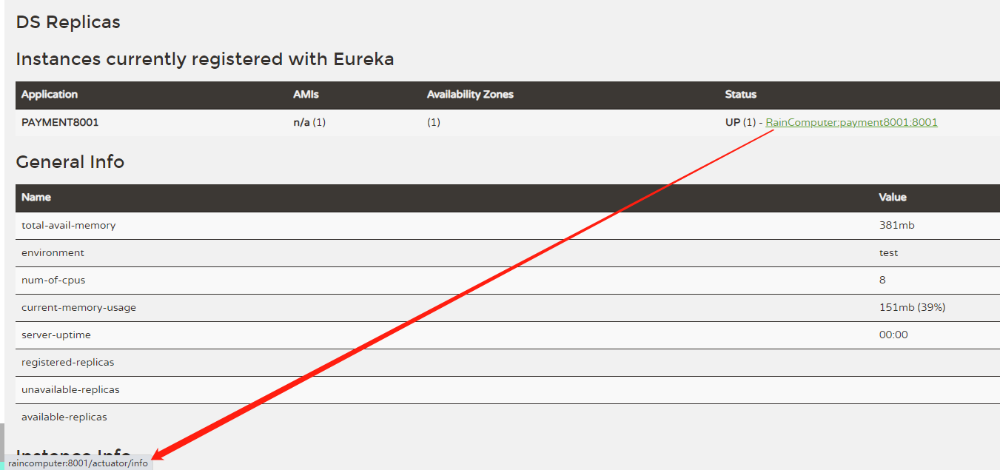

点击应用名，进入下面界面

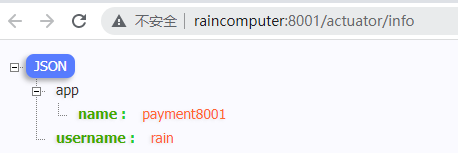


## zookeeper

使用zookeeper替换Eureka

后期学习：https://www.bilibili.com/video/BV1to4y1C7gw


## Consul

[Consul官网](https://www.consul.io/)

[Consul下载地址](https://www.consul.io/downloads)

Consul是一套开源的分布式服务发现和配置管理系统，由HashiCorp 公司用Go语言开发。

提供了微服务系统中的服务治理、配置中心、控制总线等功能。这些功能中的每一个都可以根据需要单独使用，也可以一起使用以构建全方位的服务网格，总之Consul提供了一种完整的服务网格解决方案。

它具有很多优点。包括：基于raft协议，比较简洁；支持健康检查，同时支持HTTP和DNS协议支持跨数据中心的WAN集群提供图形界面跨平台，支持Linux、Mac、Windows。

**功能**

- 服务发现：提供HTTP和DNS两种发现方式。
- 健康监测：支持多种方式，HTTP、TCP、Docker、Shell脚本定制化
- KV存储：Key、Value的存储方式
- 多数据中心：Consul支持多数据中心
- 可视化Web界面


### 启动Consul

Windows 进入官网下载Consul，解压得到consul.exe,进入cmd

* `consul -v` 显示版本号
* `consul agent -dev` 启动consul
* 访问 http://localhost:8500 即可以进入Consul的界面

可以发现，Consul是一个程序，不需要像Eureka那样编写一个项目

```xml
<dependency>
    <groupId>org.springframework.cloud</groupId>
    <artifactId>spring-cloud-starter-consul-discovery</artifactId>
</dependency>
```


### 服务提供者注册进入Consul

创建`cloud-providerconsul-payment8006`的maven文件，简单的模拟一下

```xml
<?xml version="1.0" encoding="UTF-8"?>
<project xmlns="http://maven.apache.org/POM/4.0.0"
         xmlns:xsi="http://www.w3.org/2001/XMLSchema-instance"
         xsi:schemaLocation="http://maven.apache.org/POM/4.0.0 http://maven.apache.org/xsd/maven-4.0.0.xsd">
    <parent>
        <artifactId>myCloudParent</artifactId>
        <groupId>cn.rainupup</groupId>
        <version>1.0-SNAPSHOT</version>
    </parent>
    <modelVersion>4.0.0</modelVersion>

    <artifactId>cloud-providerconsul-payment8006</artifactId>

    <properties>
        <maven.compiler.source>8</maven.compiler.source>
        <maven.compiler.target>8</maven.compiler.target>
    </properties>
    <dependencies>
        <!--Consul依赖-->
        <!--SpringCloud consul-server -->
        <dependency>
            <groupId>org.springframework.cloud</groupId>
            <artifactId>spring-cloud-starter-consul-discovery</artifactId>
        </dependency>
        
        <!-- SpringBoot整合Web组件 -->
        <dependency>
            <groupId>org.springframework.boot</groupId>
            <artifactId>spring-boot-starter-web</artifactId>
        </dependency>
        <dependency>
            <groupId>org.springframework.boot</groupId>
            <artifactId>spring-boot-starter-actuator</artifactId>
        </dependency>
        ......
    </dependencies>
</project>
```

yaml

```yaml
server:
  port: 8006

spring:
  application:
    name: consul-provider-payment    # 设置应用名，消费者通过他来获取提供者的地址
  cloud:
    consul:               # 注册进入consul
      host: localhost
      port: 8500
      discovery:
        service-name: ${spring.application.name}
```

controller

```java
@RestController
public class PaymentController {
    
    @Value("${server.port}")
    private String serverPort;

    @RequestMapping("/payment/consul")
    public String paymentConsul(){
        return "consul: " + serverPort;
    }
}
```

主启动器

```java
@SpringBootApplication
@EnableDiscoveryClient
public class PaymentMain8006 {
    public static void main(String[] args) {
        SpringApplication.run(PaymentMain8006.class,args);
    }
}
```


### 服务消费者注册进入Consul

创建`cloud-consumerConsul-order80`的maven项目

```xml
<?xml version="1.0" encoding="UTF-8"?>
<project xmlns="http://maven.apache.org/POM/4.0.0"
         xmlns:xsi="http://www.w3.org/2001/XMLSchema-instance"
         xsi:schemaLocation="http://maven.apache.org/POM/4.0.0 http://maven.apache.org/xsd/maven-4.0.0.xsd">
    <parent>
        <artifactId>myCloudParent</artifactId>
        <groupId>cn.rainupup</groupId>
        <version>1.0-SNAPSHOT</version>
    </parent>
    <modelVersion>4.0.0</modelVersion>

    <artifactId>cloud-consumerConsul-order80</artifactId>

    <properties>
        <maven.compiler.source>8</maven.compiler.source>
        <maven.compiler.target>8</maven.compiler.target>
    </properties>
    <dependencies>
        <!--SpringCloud consul-server -->
        <dependency>
            <groupId>org.springframework.cloud</groupId>
            <artifactId>spring-cloud-starter-consul-discovery</artifactId>
        </dependency>
        
        <!-- SpringBoot整合Web组件 -->
        <dependency>
            <groupId>org.springframework.boot</groupId>
            <artifactId>spring-boot-starter-web</artifactId>
        </dependency>
        <dependency>
            <groupId>org.springframework.boot</groupId>
            <artifactId>spring-boot-starter-actuator</artifactId>
        </dependency>
        ......
    </dependencies>
</project>
```

yaml

```yaml
server:
  port: 80

spring:
  application:
    name: cloud-consumer-order       # 设置应用名，消费者通过他来获取提供者的地址
  cloud:
    consul:
      host: localhost
      port: 8500
      discovery:
        service-name: ${spring.application.name}
```

配置类

```java
@Configuration
public class ApplicationContextConfig {
    @Bean
    @LoadBalanced
    public RestTemplate getRestTemplate(){
        return new RestTemplate();
    }
}
```

controller

```java
@RestController
public class OrderController {
    public static final String INVOKE_URL = "http://consul-provider-payment";   // 根据key获得微服务地址

    @Resource
    private RestTemplate restTemplate;

    @RequestMapping("/consumer/payment/consul")
    public String paymentInfo(){
        //访问 http://..../payment/consul
        return restTemplate.getForObject(INVOKE_URL + "/payment/consul", String.class);
    }
}
```

主启动器

```java
@SpringBootApplication
@EnableDiscoveryClient
public class OrderConsulMain80 {
    public static void main(String[] args) {
        SpringApplication.run(OrderConsulMain80.class,args);
    }
}
```


访问：

* http://localhost:8500/

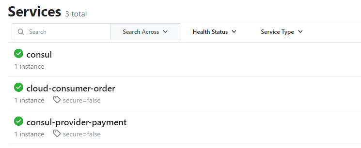

* http://localhost/consumer/payment/consul

​	


## 三个注册中心异同点

| 组件名    | 语言CAP | 服务健康检查 | 对外暴露接口 | Spring Cloud集成 |
| --------- | ------- | ------------ | ------------ | ---------------- |
| Eureka    | Java    | AP           | 可配支持     | HTTP             |
| Zookeeper | Java    | CP           | 支持客户端   | 已集成           |
| Consul    | Go      | CP           | 支持         | HTTP/DNS         |

**ACID**

| 类型            | 描述   |
| --------------- | ------ |
| A (Atomicity)   | 原子性 |
| C (Consistency) | 一致性 |
| I (Isolation    | 隔离性 |
| D (Durability)  | 持久性 |

**CAP**

| 类型                    | 描述       |
| ----------------------- | ---------- |
| C (Consistency)         | 强一致性   |
| A (Availability)        | 可用性     |
| P (Partition tolerance) | 分区容错性 |


> **CAP理论的核心**

* 一个分布式系统不可能同时很好的满足一致性，可用性和分区容错性这三个需求

- 根据CAP原理，将NoSQL数据库分成了满足CA原则，满足CP原则和满足AP原则三大类

- - CA：单点集群，满足一致性，可用性的系统，通常可扩展性较差
  - CP：满足一致性，分区容错的系统，通常性能不是特别高
  - AP：满足可用性，分区容错的系统，通常可能对一致性要求低一些

**AP架构（Eureka）**

当网络分区出现后，为了保证可用性，系统B可以返回旧值，保证系统的可用性。

结论：违背了一致性C的要求，只满足可用性和分区容错，即AP


**CP架构（ZooKeeper/Consul）**

当网络分区出现后，为了保证一致性，就必须拒接请求，否则无法保证一致性。

结论：违背了可用性A的要求，只满足一致性和分区容错，即CP。

 

> **Zookeeper保证的是CP**

当向注册中心查询服务列表时，我们可以容忍注册中心返回的是几分钟以前的注册信息，但不能接收服务直接down掉不可用。也就是说，服务注册功能对可用性的要求要高于一致性。但zookeeper会出现这样一种情况，当master节点因为网络故障与其他节点失去联系时，剩余节点会重新进行leader选举。问题在于，选举leader的时间太长，30-120s，且选举期间整个zookeeper集群是不可用的，这就导致在选举期间注册服务瘫痪。在云部署的环境下，因为网络问题使得zookeeper集群失去master节点是较大概率发生的事件，虽然服务最终能够恢复，但是，漫长的选举时间导致注册长期不可用，是不可容忍的。

 

> **Eureka保证的是AP**

Eureka看明白了这一点，因此在设计时就优先保证可用性。Eureka各个节点都是平等的，几个节点挂掉不会影响正常节点的工作，剩余的节点依然可以提供注册和查询服务。而Eureka的客户端在向某个Eureka注册时，如果发现连接失败，则会自动切换至其他节点，只要有一台Eureka还在，就能保住注册服务的可用性，只不过查到的信息可能不是最新的，除此之外，Eureka还有之中自我保护机制，如果在15分钟内超过85%的节点都没有正常的心跳，那么Eureka就认为客户端与注册中心出现了网络故障，此时会出现以下几种情况：

- Eureka不在从注册列表中移除因为长时间没收到心跳而应该过期的服务
- Eureka仍然能够接受新服务的注册和查询请求，但是不会被同步到其他节点上(即保证当前节点依然可用)
- 当网络稳定时，当前实例新的注册信息会被同步到其他节点中

因此，Eureka可以很好的应对因网络故障导致部分节点失去联系的情况，而不会像zookeeper那样使整个注册服务瘫痪


## Nacos

# 服务调用

## Ribbon

[Ribbon Github](https://github.com/Netflix/ribbon)

Spring Cloud Ribbon是基于Netflix Ribbon实现的一套客户端负载均衡的工具，主要功能是提供客户端的软件负载均衡算法和服务调用。在配置文件中列出Load Balancer后面所有的机器，Ribbon会自动的基于某种规则(如简单轮询，随机连接等）去连接这些机器。很容易的使用Ribbon实现自定义的负载均衡算法。


**LB负载均衡(Load Balance)是什么**

简单的说就是将用户的请求平摊的分配到多个服务上，从而达到系统的HA (高可用)。

常见的负载均衡有软件Nginx，LVS，硬件F5等。


**Ribbon本地负载均衡客户端VS Nginx服务端负载均衡区别**

* Nginx是服务器负载均衡，客户端所有请求都会交给nginx，然后由nginx实现转发请求。即负载均衡是由服务端实现的。
* Ribbon本地负载均衡，在调用微服务接口时候，会在注册中心上获取注册信息服务列表之后缓存到JVM本地，从而在本地实现RPC远程服务调用技术。


**集中式LB**

即在服务的消费方和提供方之间使用独立的LB设施(可以是硬件，如F5, 也可以是软件，如nginx)，由该设施负责把访问请求通过某种策略转发至服务的提供方;


**进程内LB**

将LB逻辑集成到消费方，消费方从服务注册中心获知有哪些地址可用，然后自己再从这些地址中选择出一个合适的服务器。

Ribbon就属于进程内LB，它只是一个类库，集成于消费方进程，消费方通过它来获取到服务提供方的地址。


**总结：**@RestTemplate + Ribbon

1. 消费者模块添加Ribbon和Eureka依赖

2. 配置文件配置Eureka

3. 在主启动类添加`@EnableEurekaClient`注解，开启Eureka

4. 在Configuration注册RestTemplate方法上添加`@LoadBalanced`，配置负载均衡


### 负载均衡

**架构说明**

Ribbon其实就是一个软负载均衡的客户端组件，它可以和其他所需请求的客户端结合使用，和Eureka结合只是其中的一个实例。

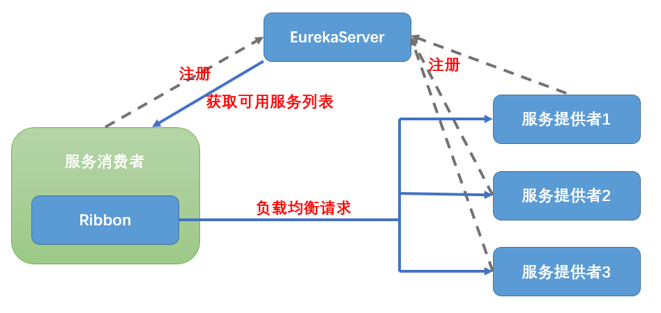

**工作步骤**

1. 选择EurekaServer,优先选择同一个区域内负载较少的server
2. 再根据指定的策略,在从server取到的服务注册列表中选择其中一个地址


**引入依赖**

```xml
<dependency>
    <groupId>org.springframework.cloud</groupId>
    <artifactId>spring-cloud-starter-netflix-ribbon</artifactId>
</dependency>
```

其中`spring-cloud-starter-netflix-eureka-client`也会引入ribbon依赖，所以如果有了eureka可以省略ribbon依赖，也就是说Eureka本身就已经有了负载均衡


### 负载均衡规则

| 策略类                    | 规则描述                                                     |
| ------------------------- | ------------------------------------------------------------ |
| RoundRobinRule            | 按顺序循环选择服务器，默认规则                               |
| RandomRule                | 随机选择一个可用的服务器                                     |
| RetryRule                 | 重试机制的选择逻辑，如果选择不成功，一直尝试选择可用的Server |
| BestAvailableRule         | 忽略哪些短路的服务器，并选择并发数较低的服务器。             |
| AvailabilityFilteringRule | 先过滤掉故障实例，再选择并发较小的实例                       |
| WeightedResponseTimeRule  | 为每一个服务器赋予一个权重值。服务器响应时间越长，这个服务器的权重就越小。这个规则会随机选择服务器，这个权重值会影响服务器的选择 |
| ZoneAvoidanceRule         | 以区域可用的服务器为基础进行服务器的选择。使用Zone对服务器进行分类，这个Zone可以理解为一个机房、一个机架等 |

这些策略类都间接的实现了IRule接口


**替换负载均衡规则**

注意：Ribbon的配置类不能放在`@ComponentScan`所扫描的包下。否则我们自定义的这个配置类就会被所有的Ribbon客户端所共享，达不到特殊化定制的目的

下面修改`cloud-consumer-order80`项目

创建Ribbon配置类，注意要放在`@ComponentScan`扫描以外的包下

```java
@Configuration
public class MyRibbonConfig {
    @Bean
    public IRule getRule(){
        return new RandomRule();      //随机访问，也可以返回其他策略类
    }
}
```

主启动器添加`@RibbonClient`注解

```java
@SpringBootApplication
@EnableEurekaClient
@RibbonClient(name = "CLOUD-PAYMENT-SERVICE",configuration = MyRibbonConfig.class)
public class OrderMain {
    public static void main(String[] args) {
        SpringApplication.run(OrderMain.class,args);
    }
}
```

访问发现，order80随机访问payment8001/8002项目


### 负载均衡算法

以默认规则`RoundRobinRule`为例

#### RoundRobinRule原理

默认负载轮训算法: `rest接口第几次请求数 % 服务器集群总数量 = 实际调用服务器位置下标`，每次服务重启动后rest接口计数从1开始。

例：

`List<Servicelnstance> instances = discoveryClient.getInstances("CLOUD-PAYMENT-SERVICE");`获得名为CLOUD-PAYMENT-SERVICE的微服务集群

* `List [0] instances = 127.0.0.1:8002`
* `List [1] instances = 127.0.0.1:8001`

8001+ 8002组合成为集群，按照轮询算法原理：

* 当总请求数为1时:1%2=1对应下标位置为1，则获得服务地址为127.0.0.1:8001
* 当总请求数位2时:2%2=О对应下标位置为0，则获得服务地址为127.0.0.1:8002
* 当总请求数位3时:3%2=1对应下标位置为1，则获得服务地址为127.0.0.1:8001
* 当总请求数位4时:4%2=О对应下标位置为0，则获得服务地址为127.0.0.1:8002
* 如此类推…
  

#### RoundRobinRule源码分析

`IRule`是`RoundRobinRule`顶层接口

```java
public interface IRule{
    public Server choose(Object key); 
    public void setLoadBalancer(ILoadBalancer lb);
    public ILoadBalancer getLoadBalancer();    
}
```

```java
public class RoundRobinRule extends AbstractLoadBalancerRule {
	......
    public Server choose(ILoadBalancer lb, Object key) {
        Server server = null;
        int count = 0;
        while (server == null && count++ < 10) {
            List<Server> reachableServers = lb.getReachableServers();   //获得活着的服务
            List<Server> allServers = lb.getAllServers();               //获得所有服务
            int upCount = reachableServers.size();                      //获得活着服务的数量
            int serverCount = allServers.size();						//获得服务的数量
            ......

            int nextServerIndex = incrementAndGetModulo(serverCount);   //调用下方方法，获得脚标
            server = allServers.get(nextServerIndex);                   //按照脚标获得服务
            ......

            if (server.isAlive() && (server.isReadyToServe())) {
                return (server);
            }

            // Next.
            server = null;
        }
        return server;
    }

    //自旋锁
    private int incrementAndGetModulo(int modulo) {
        for (;;) {
            int current = nextServerCyclicCounter.get();
            int next = (current + 1) % modulo;
            if (nextServerCyclicCounter.compareAndSet(current, next))
                return next;
        }
    }
    ......
}
```


#### 自定义轮训算法

​	学完JUC


## Feign

### 概述

* Feign是一个声明式WebService客户端。使用Feign能让编写Web Service客户端更加简单。它的使用方法是定义一个服务接口然后在上面添加注解。Feign也支持可拔插式的编码器和解码器。Spring Cloud对Feign进行了封装，使其支持了Spring MVC标准注解和HttpMessageConverters。Feign可以与Eureka和Ribbon组合使用以支持负载均衡。
* Feign旨在使编写Java Http客户端变得更容易。
* 前面在使用Ribbon+RestTemplate时，利用RestTemplate对http请求的封装处理，形成了一套模版化的调用方法。但是在实际开发中，由于对服务依赖的调用可能不止一处，往往一个接口会被多处调用，所以通常都会针对每个微服务自行封装一些客户端类来包装这些依赖服务的调用。所以，Feign在此基础上做了进一步封装，由他来帮助我们定义和实现依赖服务接口的定义。在Feign的实现下，我们只需创建一个接口并使用注解的方式来配置它(以前是Dao接口上面标注Mapper注解,现在是一个微服务接口上面标注一个Feign注解即可)，即可完成对服务提供方的接口绑定，简化了使用Spring cloud Ribbon时，自动封装服务调用客户端的开发量。


**Feign集成了Ribbon**

利用Ribbon维护了Payment的服务列表信息，并且通过轮询实现了客户端的负载均衡。而与Ribbon不同的是，通过feign只需要定义服务绑定接口且以声明式的方法，优雅而简单的实现了服务调用。


> Feign 与 OpenFeign

**Feign** 是Spring Cloud组件中的一个轻量级RESTful的HTTP服务客户端Feign内置了Ribbon，用来做客户端负载均衡，去调用服务注册中心的服务。Feign的使用方式是:使用Feign的注解定义接口，调用这个接口，就可以调用服务注册中心的服务。

````xml
<dependency>
    <groupId>org.springframework.cloud</groupId>
    <artifactId>spring-cloud-starter-feign</artifactId>
</dependency>
````

**OpenFeign** 是Spring Cloud在Feign的基础上支持了SpringMVC的注解，如`@RequesMapping`等等。OpenFeign的`@Feignclient`可以解析SpringMVC的`@RequestMapping`注解下的接口，并通过动态代理的方式产生实现类，实现类中做负载均衡并调用其他服务。

````xml
<dependency>
    <groupId>org.springframework.cloud</groupId>
    <artifactId>spring-cloud-starter-openfeign</artifactId>
</dependency>
````


### 使用Feign

* 之前的服务调用者通过 RestTemplate 来访问服务提供者
* 使用Feign后，服务调用者可以通过一个注解了`@FeignClient`的接口 调用服务提供者


新建`cloud-consumer-feign-order80`的maven项目

application.yaml、POM文件与`cloud-consumer-order80`一致，并添加OpenFeign依赖

主启动器

```java
@SpringBootApplication
//@EnableFeignClients      二选一
@EnableFeignClients(basePackages = {"cn.rainupup.service"})  //开启Feign,并配置扫描的包(Feign接口所在的包)
public class FeignOrderMain {
    public static void main(String[] args) {
        SpringApplication.run(FeignOrderMain.class,args);
    }
}
```

新建Feign接口，并使用`@FeignClient`注解指定服务提供者在Eureka中的名字,接口中的方法最好与服务提供者方法相同

```java
@Service
//微服务客户端注解,value:指定微服务的名字,这样就可以使Feign客户端直接找到对应的微服务
@FeignClient(value = "CLOUD-PAYMENT-SERVICE")
public interface PaymentFeignService {
    @PostMapping("/payment/create")            //访问的是服务提供者的/payment/create
    public CommonResult<Payment> create(@RequestBody Payment payment);

    @GetMapping("/payment/get/{id}")           //访问的是服务提供者的/payment/get/{id}
    public CommonResult<Payment> selectOne(@PathVariable("id") Long id);

	/* 下面是服务提供者8001的方法
        @PostMapping("/payment/create")
        public CommonResult<Integer> create(@RequestBody Payment payment) {
        }

        @GetMapping("/payment/get/{id}")
        public CommonResult<Payment> selectOne(@PathVariable("id") Long id) {
        }
    */
}
```

controller

```java
@RestController
public class OrderFeignController {
    @Resource
    PaymentFeignService service;              //注入Feign接口
  
    @GetMapping("/consumer/payment/create")   //为了体现和Feign接口区别 添加/consumer地址
    public CommonResult<Payment> create(Payment payment) {
        return service.create(payment);       //调用接口中的方法
    }

    @GetMapping("/consumer/payment/get/{id}")
    public CommonResult<Payment> getPayment(@PathVariable("id") Long id) {
        return service.selectOne(id);
    }
}
```

当访问http://localhost:80/consumer/payment/get/1时，会调用http://localhost:8001/payment/get/1


**与Ribbon对比**


Feign和Ribbon二者对比，前者显现出面向接口编程特点，代码看起来更清爽，而且Feign调用方式更符合我们之前在做SSM或者SprngBoot项目时，Controller层调用Service层的编程习惯！

Feign 本质上也是实现了 Ribbon，只不过后者是在调用方式上，为了满足一些开发者习惯的接口调用习惯！


### 超时控制

OpenFeign默认等待1秒钟，超时报错

**测试**

在服务提供者8001添加一下代码

```java
@GetMapping("/payment/timeout")
public String paymentFeignTimeout(){
    try {
        Thread.sleep(3000);            //睡眠3秒
    } catch (InterruptedException e) {
        throw new RuntimeException(e);
    }
    return "服务提供者TimeOut";
}
```

在服务消费者80添加方法，远程调用服务提供者8001的`paymentFeignTimeout()`

```java
@Service
@FeignClient(value = "CLOUD-PAYMENT-SERVICE")
public interface PaymentFeignService {
    @GetMapping("/payment/timeout")
    public String paymentFeignTimeout();
}
```

```java
@RestController
public class OrderFeignController {
    @Resource
    PaymentFeignService service;

    @GetMapping("/consumer/payment/timeout")
    public String paymentFeignTimeout(){
        return service.paymentFeignTimeout();
    }
}
```

访问http://localhost/consumer/payment/timeout，出现错误页面

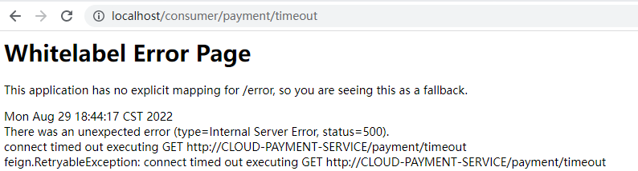


**设置超时等待时间**

````yaml
#设置feign客户端超时时间(OpenFeign默认支持ribbon)(单位：毫秒)
ribbon:
  #指的是建立连接所用的时间，适用于网络状况正常的情况下,两端连接所用的时间
  ReadTimeout: 5000
  #指的是建立连接后从服务器读取到可用资源所用的时间
  ConnectTimeout: 5000
````


### Feign日志

日志对Feign接口的调用情况进行监控和输出

**日志级别**

| 日志级别 | 描述                                                        |
| -------- | ----------------------------------------------------------- |
| NONE     | 默认的，不显示任何日志;                                     |
| BASIC    | 仅记录请求方法、URL、响应状态码及执行时间;                  |
| HEADERS  | 除了BASIC中定义的信息之外，还有请求和响应的头信息;          |
| FULL     | 除了HEADERS中定义的信息之外，还有请求和响应的正文及元数据。 |

**配置日志Bean**

```java
@Configuration
public class FeignConfig {
    @Bean
    public Logger.Level FeignLoggerLevel(){ 
        return Logger.Level.FULL;       //监控所有内容
    }
}
```

**YML文件里需要开启日志的Feign客户端**

```yaml
# feign日志以什么级别监控哪个接口
logging:
  level:
    cn.rainupup.service.PaymentFeignService: debug  
    #以debug的方式监控cn.rainupup.service.PaymentFeignService的所有内容
```

在IDEA后台就可以查看详细的日志了


# 服务降级

## 概述

分布式系统面临的问题，复杂分布式体系结构中的应用程序有数十个依赖关系，每个依赖关系在某些时候将不可避免地失败。

**服务雪崩**

* 多个微服务之间调用的时候，假设微服务A调用微服务B和微服务C，微服务B和微服务C又调用其它的微服务，这就是所谓的“扇出”。如果扇出的链路上某个微服务的调用响应时间过长或者不可用，对微服务A的调用就会占用越来越多的系统资源，进而引起系统崩溃，所谓的“雪崩效应”.
* 对于高流量的应用来说，单一的后避依赖可能会导致所有服务器上的所有资源都在几秒钟内饱和。比失败更糟糕的是，这些应用程序还可能导致服务之间的延迟增加，备份队列，线程和其他系统资源紧张，导致整个系统发生更多的级联故障。这些都表示需要对故障和延迟进行隔离和管理，以便单个依赖关系的失败，不能取消整个应用程序或系统。

* 所以，通常当你发现一个模块下的某个实例失败后，这时候这个模块依然还会接收流量，然后这个有问题的模块还调用了其他的模块，这样就会发生级联故障，或者叫雪崩。
  

## Hystrix

[Hystrix Github](https://github.com/Netflix/Hystrix)

[Hystrix 文档](https://github.com/Netflix/Hystrix/wiki/How-To-Use)

 Hystrix：豪猪

* Hystrix是一个用于处理分布式系统的延迟和容错的开源库，在分布式系统里，许多依赖不可避免的会调用失败，比如超时、异常等，Hystrix能够保证在一个依赖出问题的情况下，不会导致整体服务失败，避免级联故障，以提高分布式系统的弹性。
* "断路器"本身是一种开关装置，当某个服务单元发生故障之后，通过断路器的故障监控（类似熔断保险丝)，向调用方返回一个符合预期的、可处理的备选响应（FallBack)，而不是长时间的等待或者抛出调用方无法处理的异常，这样就保证了服务调用方的线程不会被长时间、不必要地占用，从而避免了故障在分布式系统中的蔓延，乃至雪崩。


**服务降级:** 当服务器繁忙时，立刻返回一个友好提示，避免客户端等待，fallback

**触发服务降级的情况**

- 程序运行导常
- 超时
- 服务熔断触发服务降级
- 线程池/信号量打满也会导致服务降级


**服务熔断：**

类比保险丝达到最大服务访问后，直接拒绝访问，拉闸限电，然后调用服务降级的方法并返回友好提示。

服务的降级 -> 进而熔断 -> 恢复调用链路


**服务限流：**

秒杀高并发等操作，严禁一窝蜂的过来拥挤，大家排队，一秒钟N个，有序进行。


### 项目传统构建

#### 服务提供者

创建`cloud-provider-hygtrix-payment8001`的maven项目

POM文件与`cloud-provider-payment8001`项目相同，添加hystrix依赖

```xml
<dependency>
    <groupId>org.springframework.cloud</groupId>
    <artifactId>spring-cloud-starter-netflix-hystrix</artifactId>
</dependency>
```

服务名

```yaml
spring:
  application:
    name: cloud-provider-hystrix-payment  # 服务消费者需要
```

Service

```java
@Service
public class PaymentService {

    public String paymentInfo_OK(Integer id) {
        return "线程池:  " + Thread.currentThread().getName() + "  paymentInfo_OK,id:  " + id;
    }

    public String paymentInfo_TimeOut(Integer id) {
        try {
            TimeUnit.MILLISECONDS.sleep(3000);
        } catch (InterruptedException e) {
            e.printStackTrace();
        }
        return "线程池:  " + Thread.currentThread().getName() + " id:  " + id;
    }
}
```

Controller

```java
@Slf4j
@RestController
public class PaymentController {
    @Resource
    private PaymentService paymentService;

    @Value("${server.port}")
    private String serverPort;

    @GetMapping("/payment/hystrix/ok/{id}")
    public String paymentInfo_OK(@PathVariable("id") Integer id) {       //直接响应
        String result = paymentService.paymentInfo_OK(id);
        return result;
    }

    @GetMapping("/payment/hystrix/timeout/{id}")
    public String paymentInfo_TimeOut(@PathVariable("id") Integer id) {  //睡眠3秒，响应
        String result = paymentService.paymentInfo_TimeOut(id);
        return result;
    }
}
```

访问http://localhost:8001/payment/hystrix/ok/1直接成功

访问http://localhost:8001/payment/hystrix/timeout/1耗时3秒


#### JMeter并发测试

[JMeter的基本使用](https://blog.csdn.net/weixin_45014379/article/details/124190381)

上面并非高并发，可以完美的完成请求响应。

下面使用JMeter工具进行高并发测试，创建2W个请求去访问http://localhost:8001/payment/hystrix/timeout/1

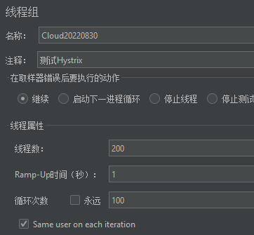

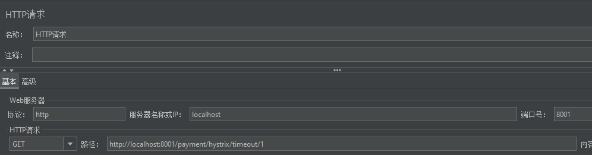

浏览器访问：http://localhost:8001/payment/hystrix/ok/1，发现本该直接响应的请求需要转圈圈，需要等待线程去处理当前请求

原因：tomcat的默认的工作线程数被打满了，没有多余的线程来分解压力和处理。

目前还只是服务提供者8001调用直接测试，如果外部服务消费者80也访问，那么消费者只能等待


#### 服务消费者

目前8001项目自身的请求已经出现卡顿，再创建一个服务消费者80调用8001项目(看热闹不嫌事大)

创建`cloud-consumer-feign-hystrix-order80`的maven项目

基础配置与以前相同

service

```java
@FeignClient(value = "cloud-provider-hystrix-payment")   //服务提供者的程序名
public interface PaymentFeignHystrixService {
    @GetMapping("/payment/hystrix/ok/{id}")
    public String paymentInfo_OK(@PathVariable("id") Integer id);

    @GetMapping("/payment/hystrix/timeout/{id}")
    public String paymentInfo_TimeOut(@PathVariable("id") Integer id);
}
```

controller

```java
@RestController
public class PaymentController {
    @Resource
    private PaymentService paymentService;
    @Value("${server.port}")
    private String serverPort;

    @GetMapping("/payment/hystrix/ok/{id}")
    public String paymentInfo_OK(@PathVariable("id") Integer id) {
        String result = paymentService.paymentInfo_OK(id);
        return result;
    }
    @GetMapping("/payment/hystrix/timeout/{id}")
    public String paymentInfo_TimeOut(@PathVariable("id") Integer id) {
        String result = paymentService.paymentInfo_TimeOut(id);
        return result;
    }
}
```

2W个请求访问8001，消费端80微服务再去访问正常的Ok微服务8001地址http://localhost/consumer/payment/hystrix/ok/1，消费者80被拖慢

原因：8001同一层次的其它接口服务被困死，因为tomcat线程池里面的工作线程已经被挤占完毕。

解决方法：降级/容错/限流等


### 服务降级

解决：

* 对方服务(8001)超时了，调用者(80)不能一直卡死等待，必须有服务降级。
* 对方服务(8001)down机了，调用者(80)不能一直卡死等待，必须有服务降级。
* 对方服务(8001)OK，调用者(80)自己出故障或有自我要求(自己的等待时间小于服务提供者)，自己处理降级。
  

#### 服务提供者降级

8001项目自身解决问题，设置自身调用超时时间的峰值，峰值内可以正常运行，超过了需要有兜底的方法处埋，作服务降级fallback

`@HystrixCommand` 

`@EnableCircuitBreaker`


业务类启用 - `@HystrixCommand`报异常后如何处理

一旦调用服务方法失败并抛出了错误信息后，会自动调用@HystrixCommand标注好的fallbackMethod调用类中的指定方法

注意:兜底方法参数需要和请求方法相同

service

```java
@Service
public class PaymentService {

    //fallbackMethod指定出现异常执行的方法
    @HystrixCommand(fallbackMethod = "paymentInfo_TimeOutHandler",commandProperties = {
            @HystrixProperty(name="execution.isolation.thread.timeoutInMilliseconds",value="3000")
    }) //出现超时3时调用paymentInfo_TimeOutHandler
    public String paymentInfo_TimeOut(Integer id) {
        try {
            TimeUnit.MILLISECONDS.sleep(5000);
        } catch (InterruptedException e) {
            e.printStackTrace();
        }
        return "线程池:  " + Thread.currentThread().getName() + " id:  " + id;
    }
    //兜底方法
    public String paymentInfo_TimeOutHandler(Integer id) {
        return "线程池:  "+Thread.currentThread().getName()+"  8001系统繁忙或者运行报错，请稍后再试,id:  "+id;
    }
}
```

主启动器

```java
@SpringBootApplication
@EnableEurekaClient
@EnableCircuitBreaker        //开启Hystrix熔断 不是EnableHystrix
public class CloudProviderHystrixPayment {
    public static void main(String[] args) {
        SpringApplication.run(CloudProviderHystrixPayment.class,args);
    }
}
```

访问：http://localhost:8001/payment/hystrix/timeout/1


#### 服务使用者降级

服务提供者已经有了降级操作，服务使用者也可以添加降级操作

注意：必须依赖feign

开启服务降级

```yaml
feign:
  hystrix:
    enabled: true
```

controller

```java
@RestController
public class PaymentFeignHystrixController {
    @Resource
    PaymentFeignHystrixService service;

    @GetMapping("/consumer/payment/hystrix/timeout/{id}")
    @HystrixCommand(fallbackMethod = "paymentTimeOutFallbackMethod",commandProperties = {
            @HystrixProperty(name="execution.isolation.thread.timeoutInMilliseconds",value="1500")
    })
    public String paymentInfo_TimeOut(@PathVariable("id") Integer id) {
        return service.paymentInfo_TimeOut(id);
    }
    private String paymentTimeOutFallbackMethod(@PathVariable("id") Integer id){
        return "服务消费者服务降级,请稍后重试";
    }
}
```

主启动器

```java
@SpringBootApplication
@EnableEurekaClient
@EnableFeignClients(basePackages = {"cn.rainupup.service"})
@EnableHystrix   //
public class HystrixOrder {
    public static void main(String[] args) {
        SpringApplication.run(HystrixOrder.class,args);
    }
}
```

访问：http://localhost/consumer/payment/hystrix/timeout/1


#### 全局服务降价

每个方法都需要指定兜底方法，代码繁琐

在类上添加`@DefaultProperties(defaultFallback = "")`，defaultFallback指定兜底方法，在方法上添加`@HystrixCommand`

* 如果使用`@HystrixCommand(fallbackMethod = "")`指定了兜底方法，则按就近原则，使用自身的兜底方法，忽略全局兜底方法

注意：全局兜底方法没有参数

```java
@RestController
@DefaultProperties(defaultFallback = "GlobalFallbackMethod")
public class PaymentFeignHystrixController {
    @Resource
    PaymentFeignHystrixService service;


    @GetMapping("/consumer/payment/hystrix/timeout/{id}")
    @HystrixCommand(fallbackMethod = "paymentTimeOutFallbackMethod",commandProperties = {
            @HystrixProperty(name="execution.isolation.thread.timeoutInMilliseconds",value="1500")
    })
    public String paymentInfo_TimeOut(@PathVariable("id") Integer id) {
        return service.paymentInfo_TimeOut(id);
    }
    private String paymentTimeOutFallbackMethod(@PathVariable("id") Integer id){
        return "服务消费者服务降级,请稍后重试";
    }
    
    
    //全局兜底方法
    @GetMapping("/consumer/payment/hystrix/ok/{id}")
    //@HystrixCommand                     出现异常则使用兜底方法
    @HystrixCommand(commandProperties = {        //设定出现什么异常时，执行兜底方法
        @HystrixProperty(name="execution.isolation.thread.timeoutInMilliseconds",value="1500")
    })
    public String paymentInfo_OK(@PathVariable("id") Integer id) {
        //int i = 10 / 0;               //发生异常
        try {
            Thread.sleep(3000);
        } catch (InterruptedException e) {
            throw new RuntimeException(e);
        }
        return service.paymentInfo_OK(id);
    }
    public String GlobalFallbackMethod(){
        return "全局服务降价";
    }
}
```

访问http://localhost/consumer/payment/hystrix/ok/1，执行兜底方法

访问http://localhost/consumer/payment/hystrix/timeout/1，执行自身指定的兜底方法


#### 服务使用者降级新方法

前面的代码，出现的问题是代码混乱

可以发现Controller使用Feign调用了Service接口，我们可以在这个接口上作文章

舍弃`@EnableHystrix`、`@HystrixCommand`等注解

创建一个类继承我们的service接口，重写其中的方法，在这些方法中编写服务降级的提醒。在service接口的`@FeignClient`使用fallback属性指定服务降级提醒类

```java
@Component   //注入IOC
public class PaymentFallbackHystrixService implements PaymentFeignHystrixService{
    @Override
    public String paymentInfo_OK(Integer id) {
        return "访问错误，请稍后再试";
    }
    @Override
    public String paymentInfo_TimeOut(Integer id) {
        return "访问错误，请稍后再试";
    }
}
```

```java
@FeignClient(value = "cloud-provider-hystrix-payment",fallback = PaymentFallbackHystrixService.class)
public interface PaymentFeignHystrixService {
    @GetMapping("/payment/hystrix/ok/{id}")
    public String paymentInfo_OK(@PathVariable("id") Integer id);

    @GetMapping("/payment/hystrix/timeout/{id}")
    public String paymentInfo_TimeOut(@PathVariable("id") Integer id);
}
```

controller

```java
@RestController
public class PaymentFeignHystrixController {
    @Resource
    PaymentFeignHystrixService service;

    @GetMapping("/consumer/payment/hystrix/ok/{id}")
    public String paymentInfo_OK(@PathVariable("id") Integer id) {
        return service.paymentInfo_OK(id);
    }

    @GetMapping("/consumer/payment/hystrix/timeout/{id}")
    public String paymentInfo_TimeOut(@PathVariable("id") Integer id) {
        return service.paymentInfo_TimeOut(id);
    }
}
```

开启7001/8001/80，访问http://localhost/consumer/payment/hystrix/ok/1，发现可以访问

停止服务提供者8001，再次访问，发现出现了服务降级


客户端自己调用提示，此时服务端已经宕机了，但是我们做了服务降级处理，让客户端在服务端不可用时也会获得提示信息而不会挂起耗死服务器


### 服务熔断

熔断机制是应对雪崩效应的一种微服务链路保护机制。当扇出链路的某个微服务出错不可用或者响应时间太长时，会进行服务的降级，进而熔断该节点微服务的调用，快速返回错误的响应信息。当检测到该节点微服务调用响应正常后，恢复调用链路。

在Spring Cloud框架里，熔断机制通过Hystrix实现。Hystrix会监控微服务间调用的状况，当失败的调用到一定阈值，缺省是5秒内20次调用失败，就会启动熔断机制。熔断机制的注解是`@HystrixCommand`。

即：短时间大量请求访问了某个服务，如果该服务出现多次错误，则屏蔽该服务(使用兜底方法进行响应)，就算正确访问该服务，也会报错(对本服务进行了保护)，经过一段时间后，服务开始慢慢生效

#### 概述

**熔断类型**

- 熔断打开：请求不再进行调用当前服务，内部设置时钟一般为MTTR(平均故障处理时间)，当打开时长达到所设时钟则进入半熔断状态。
- 熔断关闭：熔断关闭不会对服务进行熔断。
- 熔断半开：部分请求根据规则调用当前服务，如果请求成功且符合规则则认为当前服务恢复正常，关闭熔断。

**涉及到断路器的三个重要参数**

* 快照时间窗：断路器确定是否打开需要统计一些请求和错误数据，而统计的时间范围就是快照时间窗，默认为最近的10秒。
* 请求总数阀值：在快照时间窗内，必须满足请求总数阀值才有资格熔断。默认为20，意味着在10秒内，如果该hystrix命令的调用次数不足20次7,即使所有的请求都超时或其他原因失败，断路器都不会打开。
* 错误百分比阀值：当请求总数在快照时间窗内超过了阀值，比如发生了30次调用，如果在这30次调用中，有15次发生了超时异常，也就是超过50%的错误百分比，在默认设定50%阀值情况下，这时候就会将断路器打开。


**断路器开启或者关闭的条件**

* 到达以下阀值，断路器将会开启：
  * 当满足一定的阀值的时候（默认10秒内超过20个请求次数)
  * 当失败率达到一定的时候（默认10秒内超过50%的请求失败)
* 当开启的时候，所有请求都不会进行转发
* 一段时间之后（默认是5秒)，这个时候断路器是半开状态，会让其中一个请求进行转发。如果成功，断路器会关闭，若失败，继续开启。

**断路器打开之后**

* 再有请求调用的时候，将不会调用主逻辑，而是直接调用降级fallback。通过断路器，实现了自动地发现错误并将降级逻辑切换为主逻辑，减少响应延迟的效果。
* 原来的主逻辑要如何恢复呢？
  * 对于这一问题，hystrix也为我们实现了自动恢复功能。
  * 当断路器打开，对主逻辑进行熔断之后，hystrix会启动一个休眠时间窗，在这个时间窗内，降级逻辑是临时的成为主逻辑，当休眠时间窗到期，断路器将进入半开状态，释放一次请求到原来的主逻辑上，如果此次请求正常返回，那么断路器将继续闭合，主逻辑恢复，如果这次请求依然有问题，断路器继续进入打开状态，休眠时间窗重新计时。

**所有配置**

````java
@HystrixCommand(fallbackMethod = "fallbackMethod", 
groupKey = "strGroupCommand", 
commandKey = "strCommand", 
threadPoolKey = "strThreadPool",

commandProperties = {
    // 设置隔离策略，THREAD 表示线程池 SEMAPHORE：信号池隔离
    @HystrixProperty(name = "execution.isolation.strategy", value = "THREAD"),
    // 当隔离策略选择信号池隔离的时候，用来设置信号池的大小（最大并发数）
    @HystrixProperty(name = "execution.isolation.semaphore.maxConcurrentRequests", value = "10"),
    // 配置命令执行的超时时间
    @HystrixProperty(name = "execution.isolation.thread.timeoutinMilliseconds", value = "10"),
    // 是否启用超时时间
    @HystrixProperty(name = "execution.timeout.enabled", value = "true"),
    // 执行超时的时候是否中断
    @HystrixProperty(name = "execution.isolation.thread.interruptOnTimeout", value = "true"),

    // 执行被取消的时候是否中断
    @HystrixProperty(name = "execution.isolation.thread.interruptOnCancel", value = "true"),
    // 允许回调方法执行的最大并发数
    @HystrixProperty(name = "fallback.isolation.semaphore.maxConcurrentRequests", value = "10"),
    // 服务降级是否启用，是否执行回调函数
    @HystrixProperty(name = "fallback.enabled", value = "true"),
    // 是否启用断路器
    @HystrixProperty(name = "circuitBreaker.enabled", value = "true"),
    // 该属性用来设置在滚动时间窗中，断路器熔断的最小请求数。例如，默认该值为 20 的时候，如果滚动时间窗（默认10秒）内仅收到了19个请求， 即使这19个请求都失败了，断路器也不会打开。
    @HystrixProperty(name = "circuitBreaker.requestVolumeThreshold", value = "20"),

    // 该属性用来设置在滚动时间窗中，表示在滚动时间窗中，在请求数量超过 circuitBreaker.requestVolumeThreshold 的情况下，如果错误请求数的百分比超过50, 就把断路器设置为 "打开" 状态，否则就设置为 "关闭" 状态。
    @HystrixProperty(name = "circuitBreaker.errorThresholdPercentage", value = "50"),
    // 该属性用来设置当断路器打开之后的休眠时间窗。 休眠时间窗结束之后，会将断路器置为 "半开" 状态，尝试熔断的请求命令，如果依然失败就将断路器继续设置为 "打开" 状态，如果成功就设置为 "关闭" 状态。
    @HystrixProperty(name = "circuitBreaker.sleepWindowinMilliseconds", value = "5000"),
    // 断路器强制打开
    @HystrixProperty(name = "circuitBreaker.forceOpen", value = "false"),
    // 断路器强制关闭
    @HystrixProperty(name = "circuitBreaker.forceClosed", value = "false"),
    // 滚动时间窗设置，该时间用于断路器判断健康度时需要收集信息的持续时间
    @HystrixProperty(name = "metrics.rollingStats.timeinMilliseconds", value = "10000"),

    // 该属性用来设置滚动时间窗统计指标信息时划分"桶"的数量，断路器在收集指标信息的时候会根据设置的时间窗长度拆分成多个 "桶" 来累计各度量值，每个"桶"记录了一段时间内的采集指标。
    // 比如 10 秒内拆分成 10 个"桶"收集这样，所以 timeinMilliseconds 必须能被 numBuckets 整除。否则会抛异常
    @HystrixProperty(name = "metrics.rollingStats.numBuckets", value = "10"),
    // 该属性用来设置对命令执行的延迟是否使用百分位数来跟踪和计算。如果设置为 false, 那么所有的概要统计都将返回 -1。
    @HystrixProperty(name = "metrics.rollingPercentile.enabled", value = "false"),
    // 该属性用来设置百分位统计的滚动窗口的持续时间，单位为毫秒。
    @HystrixProperty(name = "metrics.rollingPercentile.timeInMilliseconds", value = "60000"),
    // 该属性用来设置百分位统计滚动窗口中使用 “ 桶 ”的数量。
    @HystrixProperty(name = "metrics.rollingPercentile.numBuckets", value = "60000"),
    // 该属性用来设置在执行过程中每个 “桶” 中保留的最大执行次数。如果在滚动时间窗内发生超过该设定值的执行次数，
    // 就从最初的位置开始重写。例如，将该值设置为100, 滚动窗口为10秒，若在10秒内一个 “桶 ”中发生了500次执行，
    // 那么该 “桶” 中只保留 最后的100次执行的统计。另外，增加该值的大小将会增加内存量的消耗，并增加排序百分位数所需的计算时间。
    @HystrixProperty(name = "metrics.rollingPercentile.bucketSize", value = "100"),

    // 该属性用来设置采集影响断路器状态的健康快照（请求的成功、 错误百分比）的间隔等待时间。
    @HystrixProperty(name = "metrics.healthSnapshot.intervalinMilliseconds", value = "500"),
    // 是否开启请求缓存
    @HystrixProperty(name = "requestCache.enabled", value = "true"),
    // HystrixCommand的执行和事件是否打印日志到 HystrixRequestLog 中
    @HystrixProperty(name = "requestLog.enabled", value = "true"),

},
threadPoolProperties = {
    // 该参数用来设置执行命令线程池的核心线程数，该值也就是命令执行的最大并发量
    @HystrixProperty(name = "coreSize", value = "10"),
    // 该参数用来设置线程池的最大队列大小。当设置为 -1 时，线程池将使用 SynchronousQueue 实现的队列，否则将使用 LinkedBlockingQueue 实现的队列。
    @HystrixProperty(name = "maxQueueSize", value = "-1"),
    // 该参数用来为队列设置拒绝阈值。 通过该参数， 即使队列没有达到最大值也能拒绝请求。
    // 该参数主要是对 LinkedBlockingQueue 队列的补充,因为 LinkedBlockingQueue 队列不能动态修改它的对象大小，而通过该属性就可以调整拒绝请求的队列大小了。
    @HystrixProperty(name = "queueSizeRejectionThreshold", value = "5"),
}
)
````


#### 开启服务熔断

在服务提供者8001，`cloud-provider-hygtrix-payment8001`

service

```java
@Service
public class PaymentService {
    @HystrixCommand(fallbackMethod = "paymentCircuitBreaker_fallback",//兜底方法
                    commandProperties = {
            // 是否开启断路器
            @HystrixProperty(name = "circuitBreaker.enabled",value = "true"),
            // 请求次数
            @HystrixProperty(name = "circuitBreaker.requestVolumeThreshold",value = "10"),
            // 时间窗口期
            @HystrixProperty(name = "circuitBreaker.sleepWindowInMilliseconds",value = "10000"), 
            // 失败率达到多少后跳闸
            @HystrixProperty(name = "circuitBreaker.errorThresholdPercentage",value = "60"),
    })
    public String paymentCircuitBreaker(@PathVariable("id") Integer id) {
        if(id < 0) {
            throw new RuntimeException("id不能为负");    //当id为负时，报错
        }
        String serialNumber = IdUtil.simpleUUID();
        return Thread.currentThread().getName()+"\t"+"调用成功，流水号: " + serialNumber;
    }
    //兜底方法
    public String paymentCircuitBreaker_fallback(@PathVariable("id") Integer id) {
        return "id 不能负数，请稍后再试，/(ㄒoㄒ)/~~   id: " +id;
    }
}
```

controller

```java
@Slf4j
@RestController
public class PaymentController {
    @Resource
    private PaymentService paymentService;

    @GetMapping("/payment/circuit/{id}")
    public String paymentCircuitBreaker(@PathVariable("id") Integer id) {
        String result = paymentService.paymentCircuitBreaker(id);
        return result;
    }
}
```

主启动器

```java
@SpringBootApplication
@EnableEurekaClient
@EnableCircuitBreaker   //开启断路器
public class CloudProviderHystrixPayment {
    public static void main(String[] args) {
        SpringApplication.run(CloudProviderHystrixPayment.class,args);
    }
}
```

1. 访问：http://localhost:8001/payment/circuit/1 成功访问
2. 访问：http://localhost:8001/payment/circuit/-1 报错，使用兜底方法
3. 短时间多次访问错误请求，再访问正确请求，发现正确请求也不能访问了(同样使用了兜底方法)
4. 经过一段时间后，正确请求开始可以访问


### 图形化Dashboard

**依赖**

```xml
<dependency>
    <groupId>org.springframework.cloud</groupId>
    <artifactId>spring-cloud-starter-netflix-hystrix-dashboard</artifactId>
    <version>2.2.3.RELEASE</version>
</dependency>
<dependency>
    <groupId>org.springframework.boot</groupId>
    <artifactId>spring-boot-starter-actuator</artifactId>
</dependency>
```

**概述**

除了隔离依赖服务的调用以外，Hystrix还提供了准实时的调用监控(Hystrix Dashboard)，Hystrix会持续地记录所有通过Hystrix发起的请求的执行信息，并以统计报表和图形的形式展示给用户，包括每秒执行多少请求多少成功，多少失败等。

Netflix通过`hystrix-metrics-event-stream`项目实现了对以上指标的监控。Spring Cloud也提供了Hystrix Dashboard的整合，对监控内容转化成可视化界面。


新建`cloud-consumer-hystrix-dashboard9001`项目

POM引入依赖、yaml

```yaml
server:
  port: 9001
```

主启动器，`@EnableHystrixDashboard`

```java
@SpringBootApplication
@EnableHystrixDashboard            //开启监控
public class DashBoardMain {
    public static void main(String[] args) {
        SpringApplication.run(DashBoardMain.class,args);
    }
}
```

注意所有被监控的项目必须是hystrix，并且拥有监控依赖配置

````xml
<dependency>
    <groupId>org.springframework.boot</groupId>
    <artifactId>spring-boot-starter-actuator</artifactId>
</dependency>
<dependency>
    <groupId>org.springframework.cloud</groupId>
    <artifactId>spring-cloud-starter-netflix-hystrix</artifactId>
</dependency>
````


修改`cloud-provider-hygtrix-payment8001`项目

* 要想在dashboard里监控某个服务，这个服务本身的主启动类上@EnableCircuitBreaker 开启熔断开关 
* 同时被监控的控制器里面的接口必须有`@HystrixCommand`的注解，用来标识要把哪些接口方法展示在dashboard上

```java
@SpringBootApplication
@EnableEurekaClient
@EnableCircuitBreaker
public class CloudProviderHystrixPayment {
    public static void main(String[] args) {
        SpringApplication.run(CloudProviderHystrixPayment.class,args);
    }

     /**
     * 此配置是为了服务监控而配置，与服务容错本身无关，springcloud升级后的坑
     * ServletRegistrationBean因为springboot的默认路径不是"/hystrix.stream"，
     * 只要在自己的项目里配置上下面的servlet就可以了
     * 否则，Unable to connect to Command Metric Stream 404
     */
    @Bean
    public ServletRegistrationBean getServlet() {
        HystrixMetricsStreamServlet streamServlet = new HystrixMetricsStreamServlet();
        ServletRegistrationBean registrationBean = new ServletRegistrationBean(streamServlet);
        registrationBean.setLoadOnStartup(1);
        registrationBean.addUrlMappings("/hystrix.stream");
        registrationBean.setName("HystrixMetricsStreamServlet");
        return registrationBean;
    }
}
```

访问：http://localhost:9001/hystrix，将http://localhost:8001/hystrix.stream 填入输入框

* 访问http://localhost:8001/payment/circuit/1
* 访问http://localhost:8001/payment/circuit/-1

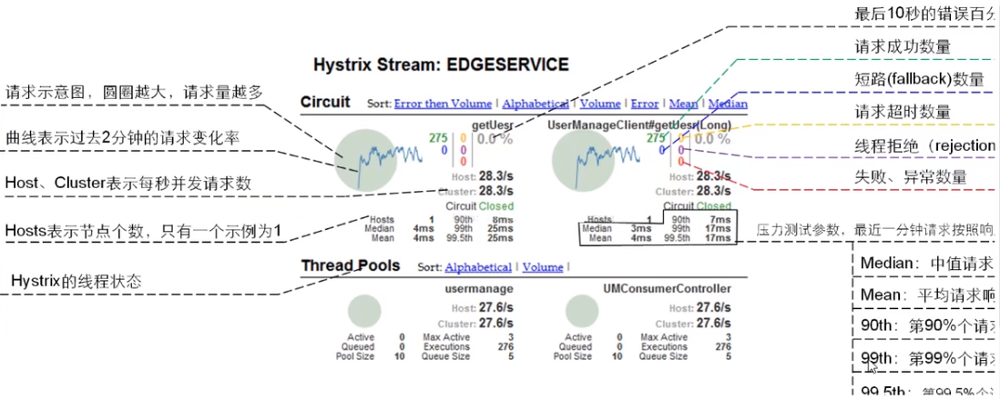


# 服务网关

注意：服务网关也需要注册到注册中心(Eureka等)

## 概述

Gateway是在Spring生态系统之上构建的API网关服务，基于Spring 5，Spring Boot 2和Project Reactor等技术。

Gateway旨在提供一种简单而有效的方式来对API进行路由，以及提供一些强大的过滤器功能，例如:熔断、限流、重试等。

SpringCloud Gateway作为Spring Cloud 生态系统中的网关，目标是替代Zuul，在Spring Cloud 2.0以上版本中，没有对新版本的Zul 2.0以上最新高性能版本进行集成，仍然还是使用的Zuul 1.x非Reactor模式的老版本。而为了提升网关的性能，SpringCloud Gateway是基于WebFlux框架实现的，而WebFlux框架底层则使用了高性能的Reactor模式通信框架Netty。

**作用**

* 方向代理
* 鉴权
* 流量控制
* 熔断
* 日志监控
* …

**网关在微服务架构中的位置**

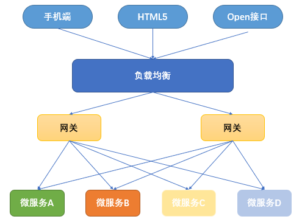


**SpringCloud Gateway具有如下特性**

* 基于Spring Framework 5，Project Reactor和Spring Boot 2.0进行构建；

* 动态路由：能够匹配任何请求属性；

* 可以对路由指定Predicate (断言)和Filter(过滤器)；

* 集成Hystrix的断路器功能；

* 集成Spring Cloud 服务发现功能；

* 易于编写的Predicate (断言)和Filter (过滤器)；

* 请求限流功能；

* 支持路径重写。

  

**SpringCloud Gateway与Zuul的区别**

* 在SpringCloud Finchley正式版之前，Spring Cloud推荐的网关是Netflix提供的Zuul。
* Zuul 1.x，是一个基于阻塞I/O的API Gateway。
* Zuul 1.x基于Servlet 2.5使用阻塞架构它不支持任何长连接(如WebSocket)Zuul的设计模式和Nginx较像，每次I/О操作都是从工作线程中选择一个执行，请求线程被阻塞到工作线程完成，但是差别是Nginx用C++实现，Zuul用Java实现，而JVM本身会有第-次加载较慢的情况，使得Zuul的性能相对较差。
* Zuul 2.x理念更先进，想基于Netty非阻塞和支持长连接，但SpringCloud目前还没有整合。Zuul .x的性能较Zuul 1.x有较大提升。在性能方面，根据官方提供的基准测试,Spring Cloud Gateway的RPS(每秒请求数)是Zuul的1.6倍。
* Spring Cloud Gateway建立在Spring Framework 5、Project Reactor和Spring Boot2之上，使用非阻塞API。
* Spring Cloud Gateway还支持WebSocket，并且与Spring紧密集成拥有更好的开发体验
  


## ~~Zuul~~

[官方文档](https://github.com/Netflix/zuul/)

Zull包含了对请求的**路由**(用来跳转的)和**过滤**两个最主要功能：

* 其中**路由功能负责将外部请求转发到具体的微服务实例上，是实现外部访问统一入口的基础，**而过滤器功能则负责对请求的处理过程进行干预，是实现请求校验，服务聚合等功能的基础。Zuul和Eureka进行整合，将Zuul自身注册为Eureka服务治理下的应用，同时从Eureka中获得其他服务的消息，也即以后的访问微服务都是通过Zuul跳转后获得。

**注意**：Zuul 服务最终还是会注册进 Eureka

**提供：**代理 + 路由 + 过滤 三大功能！

**Zuul 能干嘛？**

- 路由
- 过滤


**项目创建**

创建`springcloud-zuul`的maven项目

引入依赖

```xml
<!--导入zuul依赖-->
<dependency>
    <groupId>org.springframework.cloud</groupId>
    <artifactId>spring-cloud-starter-netflix-zuul</artifactId>
    <version>2.2.5.RELEASE</version>
</dependency>
<dependency>
    <groupId>org.springframework.cloud</groupId>
    <artifactId>spring-cloud-starter-netflix-eureka-client</artifactId>
    <version>2.2.5.RELEASE</version>
</dependency>
```

配置文件

```yaml
server:
  port: 9527

spring:
  application:
    name: springcloudZull

eureka:
  client:
    #表示是否将自己注册进Eurekaserver默认为true。
    register-with-eureka: true
    #是否从EurekaServer抓取已有的注册信息，默认为true。单节点无所谓，集群必须设置为true才能配合ribbon使用负载均衡
    fetchRegistry: true
    service-url:
      defaultZone: http://localhost:7001/eureka
```

主启动器，`@EnableZuulProxy`开启Zull代理

```java
@SpringBootApplication
@EnableZuulProxy
public class ZullMain {
    public static void main(String[] args) {
        SpringApplication.run(ZullMain.class,args);
    }
}
```

开启7001/8001/9527项目

可以看见Zuul注册进入Eureka

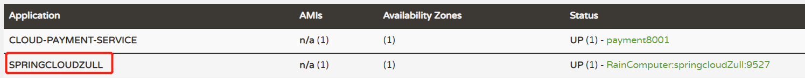

访问 http://localhost:9527//cloud-payment-service/payment/get/1


上图是没有经过Zull路由网关配置时，服务接口访问的路由，可以看出直接用微服务(服务提供方)名称去访问，这样不安全，不能将微服务名称暴露！

配置文件添加Zuul配置

````yaml
zuul:
  # 路由相关配置
  # 原来访问路由 :http://localhost:9527//cloud-payment-service/payment/get/1
  # zull路由配置后访问路由 :http://localhost:9527//myzull/payment/get/1
  routes:
    mydept.serviceId: cloud-payment-service      # eureka注册中心的服务提供方路由名称
    mydept.path: /myzull/**                      # 将eureka注册中心的服务提供方路由名称 改为自定义路由名称

  # 隐藏cloud-payment-service 使用http://localhost:9527//cloud-payment-service/payment/get/1无法访问
  ignored-services: "cloud-payment-service"
  # ignored-services: "*"  隐藏全部

  # 配置前缀，使用http://localhost:9527/myzull/payment/get/1无法访问
  # 应访问 http://localhost:9527/rain//myzull/payment/get/1
  # prefix: /rain
````

访问http://localhost:9527//myzull/payment/get/1

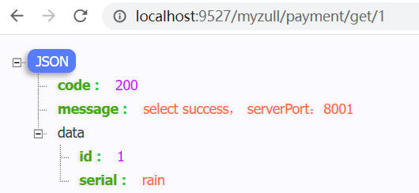


## GateWay

[官方文档](https://cloud.spring.io/spring-cloud-static/spring-cloud-gateway/2.2.1.RELEASE/reference/html/#gateway-starter)

### 工作流程

**三大核心概念**

* Route(路由)：路由是构建网关的基本模块,它由ID,目标URI,一系列的断言和过滤器组成,如断言为true则匹配该路由；
* Predicate(断言)：参考的是Java8的`java.util.function.Predicate`，开发人员可以匹配HTTP请求中的所有内容(例如请求头或请求参数),如果请求与断言相匹配则进行路由；
* Filter(过滤)：指的是Spring框架中Gateway Filter的实例,使用过滤器,可以在请求被路由前或者之后对请求进行修改。


**工作流程**

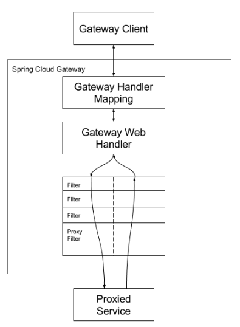

1. 客户端向Spring Cloud Gateway发出请求。然后在Gateway Handler Mapping 中找到与请求相匹配的路由，将其发送到GatewayWeb Handler。

2. Handler再通过指定的过滤器链来将请求发送到我们实际的服务执行业务逻辑，然后返回。

3. 过滤器之间用虚线分开是因为过滤器可能会在发送代理请求之前("pre")或之后("post"）执行业务逻辑。

4. Filter在"pre"类型的过滤器可以做参数校验、权限校验、流量监控、日志输出、协议转换等，在"post"类型的过滤器中可以做响应内容、响应头的修改，日志的输出，流量监控等有着非常重要的作用。

   

   核心逻辑：路由转发 + 执行过滤器链。
   


### 项目构建

创建名为`Module-cloud-gateway-gateway9527`的maven项目

**添加依赖**

```xml
<!--gateway-->
<dependency>
    <groupId>org.springframework.cloud</groupId>
    <artifactId>spring-cloud-starter-gateway</artifactId>
</dependency>
<!--eureka-client-->
<dependency>
    <groupId>org.springframework.cloud</groupId>
    <artifactId>spring-cloud-starter-netflix-eureka-client</artifactId>
</dependency>
```

主启动器

```java
@SpringBootApplication
@EnableEurekaClient
public class GateWayMain {
    public static void main(String[] args) {
        SpringApplication.run(GateWayMain.class,args);
    }
}
```

**gateway提供了两种配置方式**

* 方式一 使用配置文件
* 方式二 使用配置类

**方式一：使用配置文件**

```yaml
server:
  port: 9527

spring:
  application:
    name: cloud-gateway9527
  cloud:
  	# 配置GateWay
    gateway:
      routes:
        - id: payment_routh          # 路由的ID，没有固定规则但要求唯一，建议配合服务名
          uri: http://localhost:8001 # 匹配后提供服务的路由地址
          predicates:
            - Path=/payment/get/**   # 断言，路径相匹配的进行路由，访问http:localhost:9527/payment/get/**
            #- Path=/payment/**   # 断言，路径相匹配的进行路由

# 注册进入注册中心(动态路由需要)
eureka:
  client:
    service-url:
      register-with-eureka: true
      fetch-registry: true
      defaultZone: http://localhost:7001/eureka
```

**方式二：使用配置类**

```java
@Configuration
public class GatewayConfig {
    @Bean
    public RouteLocator customRouteLocator(RouteLocatorBuilder routeLocatorBuilder) {
        RouteLocatorBuilder.Builder routes = routeLocatorBuilder.routes();
        routes.route("path_route",                /*对应配置文件中的id*/
                r -> r.path("/payment/get/**")    /*对应配置文件中的predicates.Path*/
                        .uri("http://localhost:8001")).build();  /*对应配置文件中的uri*/
        return routes.build();
    }
}
```

两种方法任选其一


启动7001/8001/9527

访问：http://localhost:8001/payment/get/1

访问：http://localhost:9527/payment/get/1

返回内容相同，路由生效

> predicates断言，路径必须相匹配，如果服务提供者没有该地址则访问失败


**动态路由**

默认情况下Gateway会根据注册中心注册的服务列表，以注册中心上微服务名为路径创建**动态路由进行转发，从而实现动态路由的功能**（不写死一个地址）。

配置文件

```yaml
server:
  port: 9527

spring:
  application:
    name: cloud-gateway9527
  cloud:
    gateway:
      discovery:
        locator:
          enabled: true        #开启从注册中心动态创建路由的功能，利用微服务名进行路由
      routes:
        - id: payment_routh
          uri: lb://CLOUD-PAYMENT-SERVICE    #注意是lb
          predicates:
            - Path=/payment/get/**

# 一定要注册进入注册中心
eureka:
  client:
    service-url:
      register-with-eureka: true
      fetch-registry: true
      defaultZone: http://localhost:7001/eureka
```

开启7001/8001/8002/9527

访问http://localhost:9527/payment/get/1，发现8001/8002依次调用


### 常用断言

Spring Cloud Gateway将路由匹配作为Spring WebFlux HandlerMapping基础架构的一部分。

Spring Cloud Gateway包括许多内置的Route Predicate工厂。所有这些Predicate都与HTTP请求的不同属性匹配。多个RoutePredicate工厂可以进行组合。

Spring Cloud Gateway创建Route 对象时，使用RoutePredicateFactory 创建 Predicate对象，Predicate 对象可以赋值给Route。Spring Cloud Gateway包含许多内置的Route Predicate Factories。
所有这些谓词都匹配HTTP请求的不同属性。多种谓词工厂可以组合，并通过逻辑and。

[官方文档](https://cloud.spring.io/spring-cloud-static/spring-cloud-gateway/2.2.1.RELEASE/reference/html/#gateway-request-predicates-factories)


**常用的Route Predicate Factory**

* The After Route Predicate Factory
* The Before Route Predicate Factory
* The Between Route Predicate Factory
* The Cookie Route Predicate Factory
* The Header Route Predicate Factory
* The Host Route Predicate Factory
* The Method Route Predicate Factory
* The Path Route Predicate Factory
* The Query Route Predicate Factory
* The RemoteAddr Route Predicate Factory
* The weight Route Predicate Factory

* 可以组合使用


> **After：**在某个时间段之后才可以访问

```yaml
spring:
  cloud:
    gateway:
      routes:
        - id: payment_routh
          uri: lb://CLOUD-PAYMENT-SERVICE
          predicates:
            - Path=/payment/get/**
            - After=2022-08-31T18:46:20.202+08:00[Asia/Shanghai]
            # 必须在2022-08-31T18:46:20.202+08:00[Asia/Shanghai]之后才能访问
```

使用下面的程序可以获得上述格式的时间戳

```java
public class test {
    public static void main(String[] args) {
        ZonedDateTime zbj = ZonedDateTime.now(); // 默认时区
        System.out.println(zbj);
    }
}
```

> **Between：**在两个时间段内才能访问

```yaml
routes:
  - id: payment_routh
    uri: lb://CLOUD-PAYMENT-SERVICE
    predicates:
      - Path=/payment/get/**
      - Between=2022-08-31T18:46:20.202+08:00[Asia/Shanghai],2022-08-31T18:55:20.202+08:00[Asia/Shanghai]
```

> **Cookie：**必须拥有指定的cookie才能访问   `,`前面的是key `,`后面的是value(可以使用正则表达式)

```yaml
spring:
  cloud:
    gateway:
      routes:
        - id: payment_routh
          uri: lb://CLOUD-PAYMENT-SERVICE
          predicates:
            - Path=/payment/get/**
            - Cookie=user,rain    # 必须携带key为user，value为rain的cookie才能访问
```

使用curl命令测试：`curl http://localhost:9527/payment/get/1 --cookie "user=rain"`，可以访问

> **请求头Header：**必须拥有指定的请求头才能访问   `,`前面的是key `,`后面的是value(可以使用正则表达式)

````yaml
spring:
  cloud:
    gateway:
      routes:
      - id: header_route
        uri: https://example.org
        predicates:
        - Header=X-Request-Id, \d+          # 必须拥有 请求头X-Request-Id 且为正整数
````

使用curl命令测试：`curl http://localhost:9527/payment/get/1 -H "X-Request-Id:123"`，可以访问

> **Host：**必须拥有指定主机

```yaml
spring:
  cloud:
    gateway:
      routes:
        - id: payment_routh
          uri: lb://CLOUD-PAYMENT-SERVICE
          predicates:
            - Path=/payment/get/**
            - Host=**.rainupup.cn
```

使用curl命令测试：`curl http://localhost:9527/payment/get/1 -H "Host: www.rainupup.cn"`

> **Method：**指定请求方式(Get/Post..)

````yaml
spring:
  cloud:
    gateway:
      routes:
        - id: payment_routh
          uri: lb://CLOUD-PAYMENT-SERVICE
          predicates:
            - Path=/payment/get/**
            - Method=Get
````

> **Path：**指定请求路径

> **Query：**指定请求参数    `,`前面的是key `,`后面的是value(可以使用正则表达式)

````yaml
spring:
  cloud:
    gateway:
      routes:
        - id: payment_routh
          uri: lb://CLOUD-PAYMENT-SERVICE
          predicates:
            - Path=/payment/get/**
            - Query=username, rain   # 必须有请求参数username 且为rain
````

使用curl命令测试：`http://localhost:9527/payment/get/1?username=rain`


### Filter

路由过滤器可用于修改进入的HTTP请求和返回的HTTP响应，路由过滤器只能指定路由进行使用。Spring Cloud Gateway内置了多种路由过滤器，他们都由GatewayFilter的工厂类来产生。

Spring Cloud Gateway的Filter:

* 生命周期：
  * pre
  * post
* 种类（具体看官方文档）：
  * GatewayFilter - 有31种
  * GlobalFilter - 有10种

常用的GatewayFilter：`AddRequestParameter` `GatewayFilter`

**自定义全局GlobalFilter：**

* 两个主要接口介绍：
  * GlobalFilter
  * Ordered

**作用：**

* 全局日志记录
* 统一网关鉴权
* …

在`Module-cloud-gateway-gateway9527`添加一下代码

```java
@Component
public class MyLogGateWayFilte implements GlobalFilter, Ordered {
    @Override
    public Mono<Void> filter(ServerWebExchange exchange, GatewayFilterChain chain) {
        String name = exchange.getRequest().getQueryParams().getFirst("name");
        if(name == null) {
            exchange.getResponse().setStatusCode(HttpStatus.NOT_ACCEPTABLE);
            return exchange.getResponse().setComplete();
        }
        return chain.filter(exchange);
    }

    @Override
    public int getOrder() {
        return 0;
    }
}
```

访问：http://localhost:9527/payment/get/1?name=awdawd 成功

访问：http://localhost:9527/payment/get/1 错误


# 服务配置

## Config

[官方文档](https://cloud.spring.io/spring-cloud-static/spring-cloud-config/2.2.1.RELEASE/reference/html/)

**分布式系统面临的配置问题**

微服务意味着要将单体应用中的业务拆分成一个个子服务，每个服务的粒度相对较小，因此系统中会出现大量的服务。由于每个服务都需要必要的配置信息才能运行，所以一套集中式的、动态的配置管理设施是必不可少的。SpringCloud提供了ConfigServer来解决这个问题

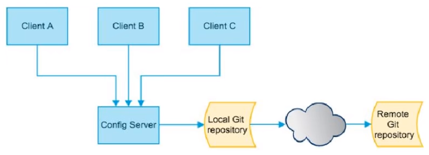

SpringCloud Config为微服务架构中的微服务提供集中化的外部配置支持，配置服务器为各个不同微服务应用的所有环境提供了一个中心化的外部配置。


**使用：**SpringCloud Config分为服务端和客户端两部分。

* 服务端也称为分布式配置中心，它是一个独立的微服务应用，用来连接配置服务器并为客户端提供获取配置信息，加密/解密信息等访问接口。
* 客户端则是通过指定的配置中心来管理应用资源，以及与业务相关的配置内容，并在启动的时候从配置中心获取和加载配置信息配置服务器默认采用git来存储配置信息，这样就有助于对环境配置进行版本管理，并且可以通过git客户端工具来方便的管理和访问配置内容。

**功能：**

* 集中管理配置文件
* 不同环境不同配置，动态化的配置更新，分环境部署比如dev/test/prod/beta/release
* 运行期间动态调整配置，不再需要在每个服务部署的机器上编写配置文件，服务会向配置中心统一拉取配置自己的信息
* 当配置发生变动时，服务不需要重启即可感知到配置的变化并应用新的配置
* 将配置信息以REST接口的形式暴露 - post/crul访问刷新即可…
* 与GitHub整合配置，由于SpringCloud Config默认使用Git来存储配置文件(也有其它方式,比如支持SVN和本地文件)，但最推荐的还是Git，而且使用的是http/https访问的形式。
  


### 构建Git仓库

在github创建一个`springcloud-config`仓库

使用`git clone git@github.com:rainupup/springcloud-config.git`将仓库克隆到本地

创建3个文件，config为配置文件名 dev、prod、test为详细名称

* config-dev.yml

````yaml
config:
  info: "springcloud-config-dev.yaml"
````

* config-prod.yml

````yaml
config:
  info: "springcloud-config-prod.yaml"
````

* config-test.yml

````yaml
config:
  info: "springcloud-config-test.yaml"
````

或者使用yaml的多文档模块


### Config服务端

服务端：负责连接Git仓库

创建`cloud-config-center-3344`的maven项目

添加依赖

````xml
<dependency>
    <groupId>org.springframework.cloud</groupId>
    <artifactId>spring-cloud-config-server</artifactId>
    <version>2.2.5.RELEASE</version>
</dependency>
````

配置文件

```yaml
server:
  port: 3344

spring:
  application:
    name:  cloud-config-center #注册进Eureka服务器的微服务名
  cloud:
    config:
      server:
        git:
          #uri: git@github.com:rainupup/springcloud-config.git #GitHub上面的git仓库名字
          uri: https://github.com/rainupup/springcloud-config.git
          #访问的仓库，可以不填
          search-paths:          
            - springcloud-config     
          
      #访问的分支，可以不填
      label: main

#服务注册到eureka地址
eureka:
  client:
    service-url:
      defaultZone: http://localhost:7001/eureka
```

主启动器，添加`@EnableConfigServer`注解 开启服务

```java
@SpringBootApplication
@EnableEurekaClient
@EnableConfigServer
public class ConfigMain {
    public static void main(String[] args) {
        SpringApplication.run(ConfigMain.class,args);
    }
}
```

访问：读取git仓库的配置文件

* http://localhost:3344/main/config-test.yaml
* http://localhost:3344/main/config-dev.yaml


**HTTP服务具有以下格式的资源：**

* `/{application}/{profile}[/{label}]`
* `/{application}-{profile}.yml`
* `/{label}/{application}-{profile}.yml`
* `/{application}-{profile}.properties`
* `/{label}/{application}-{profile}.properties`

其中`application`作为`SpringApplication`中的`spring.config.name`注入（即常规的Spring Boot应用程序中通常是“应用程序”），`profile`是活动配置文件（或逗号分隔列表的属性），`label`是可选的git标签（默认为`master`，现为`main`）。


### Config客户端

客户端：连接服务端，获取远程仓库的文件

创建`cloud-config-client-3355`的maven项目

**添加依赖**

```xml
<dependency>
    <groupId>org.springframework.cloud</groupId>
    <artifactId>spring-cloud-starter-config</artifactId>
</dependency>
```

resources下创建application.yml(用户级别)和bootstrap.yml(系统级别)配置文件

**配置文件**

* `applicaiton.yml`是用户级的资源配置项

* `bootstrap.yml`是系统级的，优先级更加高

创建bootstrap.yml配置文件

```yaml
server:
  port: 3355

spring:
  application:
    name: config-client

  cloud:
    #Config客户端配置
    config:
      label: main  #分支名称
      uri: http://localhost:3344 #配置中心地址
      name: config #配置文件名称
      profile: dev #读取后缀名称   
      # 上述3个综合：读取服务端的http://localhost:3344/main/config-dev.yml

#服务注册到eureka地址
eureka:
  client:
    service-url:
      defaultZone: http://localhost:7001/eureka
```

主启动器

```java
@SpringBootApplication
@EnableEurekaClient
public class CondigClientMain {
    public static void main(String[] args) {
        SpringApplication.run(CondigClientMain.class,args);
    }
}
```

controller

```java
@RestController
public class configClientController {
    @Value("${config.info}")
    private String info;

    @GetMapping("/get")
    public String getInfo(){
        return info;
    }
}
```

访问：`http://localhost:3355/get`，发现返回了`springcloud-config-dev.yaml`


**分布式配置的动态刷新问题**

* 修改GitHub中配置文件的内容

* 刷新3344，发现ConfigServer配置中心立刻响应

* 刷新3355，发现ConfigClient客户端没有任何响应

* 3355没有变化除非自己重启或者重新加载

  

### 动态刷新

添加Springboot监控依赖

```xml
<dependency>
    <groupId>org.springframework.boot</groupId>
    <artifactId>spring-boot-starter-actuator</artifactId>
</dependency>
```

配置文件，暴露端点

```yaml
# 暴露监控端点
management:
  endpoints:
    web:
      exposure:
        include: "*"
```

controller，添加@RefreshScope 注解开启动态刷新

```java
@RestController
@RefreshScope      //开启动态刷新
public class configClientController {
    @Value("${config.info}")
    private String info;

    @GetMapping("/get")
    public String getInfo(){
        return info;
    }
}
```

修改Git仓库中的配置文件，访问：`http://localhost:3355/get`，发现还是没有改变

命令行 `curl -X POST "http://localhost:3355/actuator/refresh"` 激活刷新，再次访问，发现改变了


**现在所存在的问题**

- 假如有多个微服务客户端3355/3366/3377
- 每个微服务都要执行一次post请求，手动刷新?
- 可否广播，一次通知，处处生效?
- 我们想大范围的自动刷新，求方法 (Bus消息总线)


# 服务总线

## Bus

序接上一章

Spring Cloud Bus配合Spring Cloud Config使用可以实现配置的动态刷新。


Spring Cloud Bus是用来将分布式系统的节点与轻量级消息系统链接起来的框架，它整合了Java的事件处理机制和消息中间件的功能。Spring Clud Bus目前支持RabbitMQ和Kafka。

Spring Cloud Bus能管理和传播分布式系统间的消息，就像一个分布式执行器，可用于广播状态更改、事件推送等，也可以当作微服务间的通信通道。

**消息总线**

在微服务架构的系统中，通常会使用轻量级的消息代理来构建一个共用的消息主题，并让系统中所有微服务实例都连接上来。由于该主题中产生的消息会被所有实例监听和消费，所以称它为消息总线。在总线上的各个实例，都可以方便地广播一些需要让其他连接在该主题上的实例都知道的消息。

**基本原理**

ConfigClient实例都监听MQ中同一个topic(默认是Spring Cloud Bus)。当一个服务刷新数据的时候，它会把这个信息放入到Topic中，这样其它监听同一Topic的服务就能得到通知，然后去更新自身的配置。


**安装RabbitMQ**

[Windows安装RabbitMQ详细教程](https://blog.csdn.net/tirster/article/details/121938987)


**依赖**

```xml
<dependency>
    <groupId>org.springframework.cloud</groupId>
    <artifactId>spring-cloud-starter-bus-amqp</artifactId>
</dependency>
```
### 项目构建

现在已经有了 `3344Config服务端` 和 `3355Config客户端`

**修改3355项目：**在3355中添加以下依赖 与 配置

```xml
<!--添加消息总线RabbitMQ支持-->
<dependency>
    <groupId>org.springframework.cloud</groupId>
    <artifactId>spring-cloud-starter-bus-amqp</artifactId>
</dependency>
```

```yaml
spring:
  application:
    name: config-client

  cloud:
    #Config客户端配置
    config:
      label: main  #分支名称
      uri: http://localhost:3344 #配置中心地址
      name: config #配置文件名称
      profile: dev #读取后缀名称 
  rabbitmq: # 配置rabbit
    host: localhost
    port: 5672     # rabbitmq的默认端口
    username: guest
    password: guest
```

**仿照3355 构建3366项目**

**修改3344项目**

```xml
<!--添加消息总线RabbitMQ支持-->
<dependency>
    <groupId>org.springframework.cloud</groupId>
    <artifactId>spring-cloud-starter-bus-amqp</artifactId>
</dependency>
```

```yaml
rabbitmq:
  host: localhost
  port: 5672
  username: guest
  password: guest
  
management:
endpoints: #暴露bus刷新配置的端点
web:
  exposure:
    include: 'bus-refresh'
```


**测试**

1. 开启7001/3344/3355/3366

2. 修改GitHub仓库

3. 发送Post请求，`curl -X POST "http://localhost:3344/actuator/bus-refresh"`

4. 访问

   1. http://localhost:3344/main/config-dev.yaml
   2. http://localhost:3355/get
   3. http://localhost:3366/get/

   发现配置都已经修改了


### 定点通知

只需要通知某几个项目进行刷新

**公式：**`http://localhost:3344/actuator/bus-refresh/{destination}`  其中`destination`为`spring.application.name`标注的名字

**测试：** `curl -X POST "http://localhost:3344/actuator/bus-refresh/config-client:3355"`仅通知3355项目，不通知3366


## Steam

常见MQ(消息中间件)：ActiveMQ、RabbitMQ、RocketMQ、Kafka

作用：屏蔽底层消息中间件的差异，降低切换成本，统一消息的编程模型。让我们不再关注具体MQ的细节，我们只需要用一种适配绑定的方式，自动的给我们在各种MQ内切换。


- [ ] ### 学完MQ再来研究


# 其他

## 链路监控Sleuth

* 在微服务框架中，一个由客户端发起的请求在后端系统中会经过多个不同的的服务节点调用来协同产生最后的请求结果，每一个前段请求都会形成一条复杂的分布式服务调用链路，链路中的任何一环出现高延时或错误都会引起整个请求最后的失败。

- Spring Cloud Sleuth提供了一套完整的服务跟踪的解决方案
- 在分布式系统中提供追踪解决方案并且兼容支持了zipkin

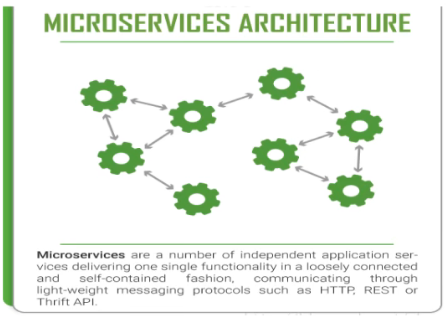


**下载Zipkin**

*  SpringCloud从F版起已不需要自己构建Zipkin Server了，只需调用jar包即可[下载地址](https://repo1.maven.org/maven2/io/zipkin/zipkin-server/)

**运行Zipkin**

* `java -jar zipkin-server-2.23.9-exec.jar`

在服务提供者8001、服务消费者80项目中添加

````xml
<!--包含了sleuth+zipkin-->
<dependency>
    <groupId>org.springframework.cloud</groupId>
    <artifactId>spring-cloud-starter-zipkin</artifactId>
</dependency>
````

```yaml
spring:
  application:
    name: cloud-order-service
  zipkin:
    base-url: http://localhost:9411
  sleuth:
    sampler:
      #采样率值介于 0 到 1 之间，1 则表示全部采集
      probability: 1
```


**测试：**

1. 访问几次`http://localhost/consumer/payment/get/1`

2. 打开`http://localhost:9411/zipkin/`
