# 基础知识

## 关键字typedef

**typedef** —— 数据类型重命名

`typedef <数据类型> <别名>`

````c
typedef int rainInt      //rainInt 即代表int类型
typedef int* rainpointer //rainprinter 即即代表int*类型
````

````c
struct LNode{
    ElemType data;
    sturct LNode *next;
}
struct LNode *p = (struct LNode*)malloc(sizeof(struct LNode));

typedef struct LNode LNode; //LNode即代表struct LNode
LNode * p = (LNode*)malloc(sizeof(LNode))；
    
//简化写法
typedef struct LNode{
    ElemType data;
    struct LNode *next;
}LNode,*LinkList;   //LNode,LinkList 即代表struct LNode
````


# 绪论

## 基本概念

1. **数据**：数据是信息的载体，是描述客观事物属性的数、字符以及所有能输入到计算机中并被程序识别和处理的符号的集合。

2. **数据元素**：数据元素是数据的基本单位，通常作为一个整体进行考虑和处理。一个数据元素可由若干**数据项**组成，数据项是构成数据元素的不可分割的最小单位。例如，学生记录就是一个数据元素，它由学号、姓名、性别等数据项组成。
3. **数据对象**:数据对象是具有**相同性质**的数据元素的集合，是数据的一个子集。
4. **数据结构**:数据结构是相互之间存在一种或多种**特定关系**的数据元素的集合。


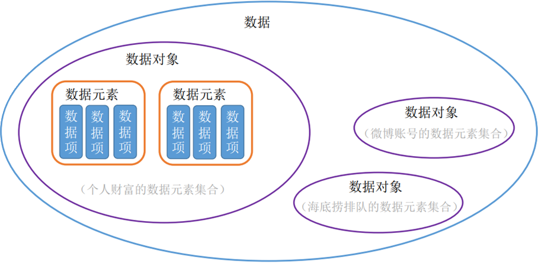


## 数据结构的三要素

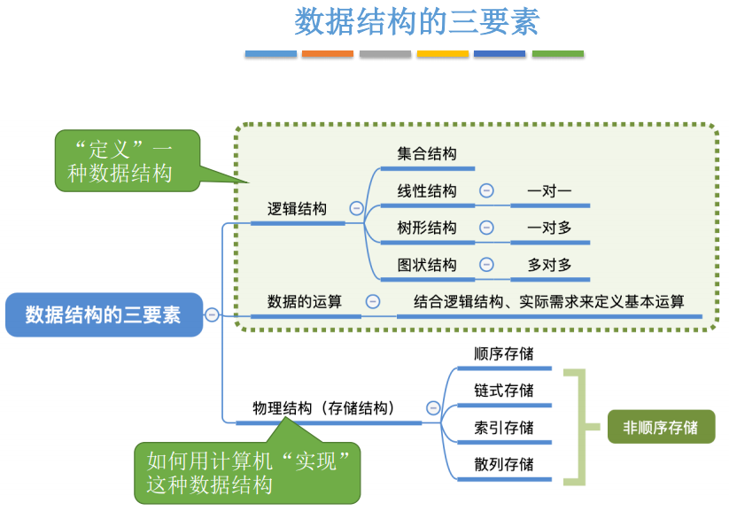

1. **逻辑结构**：逻辑结构是指数据元素之间的逻辑关系，即从逻辑关系上描述数据。
   1. 集合结构：数据元素之间除“同属一个集合”外，别无其它关系。(408不考)
   2. 线性结构：数据元素之间只存在一对一的关系，除第一个元素，所有元素都有唯一前驱；除最后一个元素，所有元素都有唯一后继。
   3. 树形结构：数据元素之间存在一对多的关系。
   4. 图状结构：数据元素之间是多对多的关系。

2. **数据的运算**：施加在数据上的运算包括运算的定义何实现。运算的定义是针对逻辑结构的，指出运算的功能；运算的实现是针对存储结构的，指出运算的具体操作步骤。

3. **物理结构(存储结构)**：存储结构是指数据结构在计算机中的表示（又称映像），也称物理结构
   1. 顺序存储：把逻辑上相邻的元素存储在物理位置也相邻的存储单元中，元素之间的关系由存储单元的邻接关系来体现。
   2. 链式存储：逻辑上相邻的元素在物理位置上可以不相邻，借助指示元素存储地址的指针来表示元素之间的逻辑关系。
   3. 索引存储：在存储元素信息的同时，还建立附加的索引表，索引表中的每项称为索引项，索引项的一般形式是（关键字，地址）
   4. 散列存储：根据元素的关键字直接计算出该元素的存储地址，又称哈希（Hash）存储。 

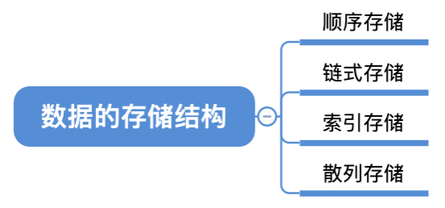

* 运算的定义是针对逻辑结构的，指出运算的功能；
* 运算的实现是针对存储结构的，指出运算的具体操作步骤。


**数据类型、抽象数据类型:**数据类型是一个值的集合和定义再此集合上的一组操作的总称

* 原子类型：其值不可再分的数据类型。如`bool`和`int`类型
* 结构类型：其值可以再分解为若干成分（分量）的数据类型。 如`struct`结构体
* 抽象数据类型(ADT)：抽象数据组织及与之相关的操作


## 算法

算法(algorithm)是对特定问题求解步骤的一种描述，它是指令的有限序列，其中的每条指令表示一个或多个操作。

**重要概念：**`程序=数据结构+算法`

**算法的特性：**

1. 有穷性：一个算法必须总在执行有穷步之后结束，且每一步都可在有穷时间内完成。
2. 确定性：算法中每条指令必须有确定的含义，对于相同的输入只能得到相同的输出。
3. 可行性：算法中描述的操作都可以通过已经实现的基本运算执行有限次来实现。
4. 输入：一个算法有零个或多个输入，这些输入取自于某个特定的对象的集合。
5. 输出：一个算法有一个或多个输出，这些输出是与输入有着某种特定关系的量。

**好算法的特质：**

1. 正确性：算法应能够正确的求接问题。
2. 可读性：算法应具有良好的可读性，以帮助人们理解。
3. 健壮性：输入非法数据时，算法能适当地做出反应或进行处理，而不会产生莫名奇妙地输出结果。
4. 高效率与低存储：效率是指算法执行的时间，存储量需求是指算法执行过程中所需要的最大存储空间，这两者都与问题的规模有关。


### 算法的复杂度

**时间复杂度：**`T(n)=O(n)`

常用技巧：

1. 加法规则：

$$
O ( f ( n ) ) + O ( g ( n ) ) = O ( m a x ( f ( n ) , g ( n ) ) )
$$

2. 乘法规则：

$$
O ( f ( n ) ) × O ( g ( n ) ) = O ( f ( n ) × g ( n ) ) 
$$

3. 常对幂指阶

$$
O(1) < O(log_2⁡n) < O(n) < O(nlog_2⁡n) < O(n^2) < O(n^3) < O(2^n) < O(n!) < O(n^n)
$$
三种复杂度：

1. 最坏时间复杂度：考虑输入数据“最坏”的情况。

2. 平均时间复杂度：考虑所有输入数据都等概率出现的情况。

3. 最好时间复杂度：考虑输入数据“最好”的情况。

   

**空间复杂度：**`S(n)=O(n)` 所需的存储大小

* 无论问题规模怎么变，算法运行所需的内存空间都是固定的常量
* 算法所需内存空间为常量时称为算法原地工作


# 线性表

## 定义与基本操作

**定义：**线性表是具有**相同数据**类型的n(n≥0)个数据元素的**有限**序列，其中n为表长，当n=0时线性表是一个空表。

**特点：**

* 存在惟一的第一个元素。
* 存在惟一的最后一个元素。
* 除第一个元素之外，每个元素均只有一个直接前驱。
* 除最后一个元素之外，每个元素均只有一个直接后继。

**基本操作：**

| 函数               | 描述                                                |
| ------------------ | --------------------------------------------------- |
| InitList(&L)       | 初始化表。构造一个空的线性表L，并分配内存空间       |
| DestroyList(&L)    | 销毁操作。销毁线性表，并释放线性表L所占用的内存空间 |
| ListInsert(&L,i,e) | 插入操作。在表L中的第i个位置上插入指定元素e         |
| LocateElem(L,e)    | 按值查找操作。在表L中查找具有给定关键字值的元素     |
| GetElem(L,i)       | 按位查找操作。获取表L中第i个位置的元素的值          |
| Length(L)          | 求表长。返回线性表L的长度，即L中数据元素的个数      |
| PrintList(L)       | 输出操作。按前后顺序输出线性表L的所有元素值         |
| Empty(L)           | 判空操作。若L为空表，则返回true，否则返回false      |

`&`的作用：对参数的修改结果需要“带回来”


## 顺序表

**定义：**用**顺序存储**的方式实现线性表。顺序存储，将逻辑上相邻的元素存储在相邻的物理位置上。

**特点：**

* 随机访问，即可以在 O(1) 时间内找到第 i 个元素。
* 存储密度高，每个节点只存储数据元素
* 拓展容量不方便（即便采用动态分配的方式实现，拓展长度的时间复杂度也比较高）
* 插入、删除操作不方便，需要移动大量元素


### 静态顺序表

顺序表的表长刚开始确定后就无法更改

````c
#include <stdio.h>
#define MaxSize 10         // 定义最大长度 

typedef struct {
	int data[MaxSize];     // 使用静态的数组存放数据元素 
	int length;            // 顺序表的当前长度 
}SqList;

// 初始化顺序表 
void InitList(SqList &L) {
    for(int i=0;i < MaxSize; i++)
        L.data[i] = 0;     // 设置默认值，不设置可能出现脏数据
	L.length = 0;          // 顺序表初始长度为0 
}

int main() {
	SqList L;              // 声明一个顺序表 
	InitList(L);           // 初始化顺序表 
	return 0;
}
````


### 动态顺序表

`stdlib.h`:malloc/free需要

| 函数         | 描述                                           |
| ------------ | ---------------------------------------------- |
| sizeOf(Type) | 获取指定类型的内存大小                         |
| malloc()     | 动态申请存储空间，返回存储空间第一个位置的地址 |
| free()       | 释放内存                                       |

````c
#define InitSize 10 // 默认的长度
typedef struct {
	int *data;      // 声明动态分配数组的指针 
	int MaxSize;    // 顺序表的最大容量
	int length;     // 顺序表的当前长度 
}SeqList;

// 初始化顺序表 
void InitList(SqList &L) {
	L.data = (int *)malloc(InitSize * sizeof(int));
	L.length = 0;
	L.MaxSize = InitSize;
}

// 增加动态数组的长度 
void IncreaseSize(SqList &L, int len) {
	int *p = L.data;                     // 临时存储
	L.data = (int *)malloc((L.MaxSize+len) * sizeof(int));     //重新分配内存
	for (int i = 0; i < L.length; i++)
		L.data[i] = p[i];                // 将数据复制到新区域 
	L.MaxSize = L.MaxSize + len;         // 顺序表最大长度增加len 
	free(p);                             // 释放原内存空间 
}

int main() {
	SeqList L;           // 声明一个顺序表
	InitList(L);         // 初始化顺序表
    ...
	IncreaseSize(L, 5);  // 增加动态数组的长度 
	return 0;
}
````


### 操作

> **插入**

````c
#define MaxSize 10       // 定义最大长度 

typedef struct {
	int data[MaxSize];  // 用静态的数组存放数据元素 
	int length;         // 顺序表的当前长度 
}SqList;

// 在顺序表i位置插入e
bool ListInsert(SqList &L, int i, int e) {
	if (i < 1 || i > L.length+1)        // 判断i的范围是否有效 
		return false;  
	if (L.length >= MaxSize)            // 判断存储空间是否已满 
		return false; 
    
	for (int j = L.length; j >= i; j--) // 将第i个元素之后的元素后移 
		L.data[j] = L.data[j-1];
	L.data[i-1] = e;                    // 在位置i处放入e 
	L.length++;                         // 长度+1 
	return true;
} 

int main() {
	SqList L;
	InitList(L);
	ListInsert(L, 3, 3);
	return 0; 
} 
````

分析：
* 最好时间复杂度：O(1)
* 最坏时间复杂度：O(n)
* 平均时间复杂度：O(n)


> **删除**

````c
bool LisDelete(SqList &L, int i, int &e){ // e引用型参数,因为需要回代结果 
    //判断i的范围是否有效
    if(i<1||i>L.length) 
        return false;

    e = L.data[i-1]                       //将被删除的元素赋值给e

    for(int j=L.length; j>i; j--){        //将第i个后的元素前移
        L.data[j-1]=L.data[j];
    }
    L.length--;                           //长度减1
    return true;
}
````

分析：

* 最好时间复杂度：O(1)
* 最坏时间复杂度：O(n)
* 平均时间复杂度：O(n)


> **查找**

> > 按位查找

````c
// 静态
#define MaxSize 10            //定义最大长度 
typedef struct{
    ElemType data[MaxSize];  //用静态的“数组”存放数据元素 
    int Length;              //顺序表的当前长度
}SqList;

ElemType GetElem(SqList L, int i){
    // ...判断i的值是否合法
    return L.data[i-1];
}
````

````c
// 动态分配的按位查找
#define InitSize 10
typedef struct {
	ElemType *data;
	int MaxSize;
	int length;
}SeqList;

ElemType GetElem(SeqList L, int i) {
	return L.data[i-1];
}
````


分析：O(1)

> >**按值查找**

````c
#define InitSize 10          //定义最大长度 
typedef struct{
    ElemTyp *data;           //用静态的“数组”存放数据元素 
    int Length;              //顺序表的当前长度
}SqList;   

//在顺序表L中查找第一个元素值等于e的元素，并返回其位序
int LocateElem(SqList L, ElemType e){
    for(int i=0; i<L.lengthl i++)
        if(L.data[i] == e)  
            return i+1;
    return 0;
}
````

分析：

* 最好时间复杂度：O(1)
* 最坏时间复杂度：O(n)
* 平均时间复杂度：O(n)


## 单链表

````c
typedef struct LNode{    //定义单链表结点类型
    ElemType data;       //数据域
    struct LNode *next;  //指针域
}LNode, *LinkList;
````

单链表的表示方法：带头结点、不带头结点


### 表示方法

#### 不带头结点

````c
typedef struct LNode{
    ElemType data;
    struct LNode *next;
}LNode, *LinkList;

//初始化一个空的单链表
bool InitList(LinkList &L){  //注意用引用 &
    L = NULL; //空表，暂时还没有任何结点；
    return true;
}
//判断单链表是否为空
bool Empty(LinkList L){
    if (L == NULL)
        return true;
    else
        return false;
}
void test(){
    LinkList L;  //声明一个指向单链表的指针: 头指针
    //初始化一个空表
    InitList(L);
    //...
}
````

头结点：代表链表上头指针指向的第一个结点，不带有任何数据。

#### 带头结点

````c
typedef struct LNode{
    ElemType data;
    struct LNode *next;
}LNode, *LinkList;
//初始化一个单链表（带头结点）
bool InitList(LinkList &L){  
    L = (LNode*) malloc(sizeof(LNode));   //头指针指向的结点——分配一个头结点（不存储数据）
    if (L == NULL)                        //内存不足，分配失败
        return false;
    L -> next = NULL;                     //头结点之后暂时还没有结点
    return true;
}
//判断单链表是否为空（带头结点）
bool Empty(LinkList L){
    if (L->next == NULL)
        return true;
    else
        return false;
}
void test(){
    LinkList L;  //声明一个指向单链表的指针: 头指针
    //初始化一个空表
    InitList(L);
    //...
}
````

**带头结点和不带头结点的比较：**
不带头结点：写代码麻烦！对第一个数据节点和后续数据节点的处理需要用不同的代码逻辑，对空表和非空表的处理也需要用不同的代码逻辑; 头指针指向的结点用于存放实际数据;
带头结点：头指针指向的头结点不存放实际数据,头结点指向的下一个结点才存放实际数据;


### 按位序插入

#### 带头结点

`ListInsert(&L, i, e)`: 在表L中的第i个位置上插入指定元素e,找到第i-1个结点(前驱结点)，将新结点插入其后；其中头结点可以看作第0个结点，故i=1时也适用。

````c
typedef struct LNode{
    ElemType data;
    struct LNode *next;
}LNode, *LinkList;

//在第i个位置插入元素e（带头结点）
bool ListInsert(LinkList &L, int i, ElemType e){  
    //判断i的合法性, i是位序号(从1开始)
    if(i<1)
        return False;
    
    LNode *p;       //指针p指向当前扫描到的结点 
    int j=0;        //当前p指向的是第几个结点
    p = L;          //L指向头结点，头结点是第0个结点（不存数据）

    //循环找到第i-1个结点
    while(p!=NULL && j<i-1){     //如果i>lengh, p最后会等于NULL
        p = p->next;             //p指向下一个结点
        j++;
    }

    if (p==NULL)                 //i值不合法
        return false;
    
    //在第i-1个结点后插入新结点
    LNode *s = (LNode *)malloc(sizeof(LNode)); //申请一个结点
    s->data = e;
    s->next = p->next;
    p->next = s;                 //将结点s连到p后,后两步千万不能颠倒qwq

    return true;
}
````

平均时间复杂度：O(n)

#### 不带头结点

`ListInsert(&L, i, e)`: 在表L中的第i个位置上插入指定元素e,找到第i-1个结点(前驱结点)，将新结点插入其后; 因为不带头结点，所以不存在“第0个”结点，因此！i=1 时，需要特殊处理——插入(删除)第1个元素时，需要更改头指针L;

````c
typedef struct LNode{
    ElemType data;
    struct LNode *next;
}LNode, *LinkList;

bool ListInsert(LinkList &L, int i, ElemType e){
    if(i<1)
        return false;
    //插入到第1个位置时的操作有所不同！
    if(i==1){
        LNode *s = (LNode *)malloc(size of(LNode));
        s->data =e;
        s->next =L;
        L=s;          //头指针指向新结点
        return true;
    }

    //i>1的情况与带头结点一样！唯一区别是j的初始值为1
    LNode *p;       //指针p指向当前扫描到的结点 
    int j=1;        //当前p指向的是第几个结点
    p = L;          //L指向头结点，头结点是第0个结点（不存数据）

    //循环找到第i-1个结点
    while(p!=NULL && j<i-1){     //如果i>lengh, p最后会等于NULL
        p = p->next;             //p指向下一个结点
        j++;
    }

    if (p==NULL)                 //i值不合法
        return false;
    
    //在第i-1个结点后插入新结点
    LNode *s = (LNode *)malloc(sizeof(LNode)); //申请一个结点
    s->data = e;
    s->next = p->next;
    p->next = s;          
    return true;
}
````


### 指定结点后插入

`InsertNextNode(LNode *p, ElemType e)`: 给定一个结点p，在其之后插入元素e; 根据单链表的链接指针只能往后查找，故给定一个结点p，那么p之后的结点我们都可知，但是p结点之前的结点无法得知;

````c
typedef struct LNode{
    ElemType data;
    struct LNode *next;
}LNode, *LinkList;
bool InsertNextNode(LNode *p, ElemType e){
    if(p==NULL){
        return false;
    }
    LNode *s = (LNode *)malloc(sizeof(LNode));
    //某些情况下分配失败，比如内存不足
    if(s==NULL)
        return false;
    s->data = e;          //用结点s保存数据元素e 
    s->next = p->next;
    p->next = s;          //将结点s连到p之后

    return true;
}                         //平均时间复杂度 = O(1)

//有了后插操作，那么在第i个位置上插入指定元素e的代码可以改成：
bool ListInsert(LinkList &L, int i, ElemType e){  
    if(i<1)
        return False;
    
    LNode *p;       //指针p指向当前扫描到的结点 
    int j=0;        //当前p指向的是第几个结点
    p = L;          //L指向头结点，头结点是第0个结点（不存数据）

    //循环找到第i-1个结点
    while(p!=NULL && j<i-1){     //如果i>lengh, p最后4鸟会等于NULL
        p = p->next;             //p指向下一个结点
        j++;
    }

    return InsertNextNode(p, e)
}
````


### 指定结点前插入

单链表无法查看节点前的内容，如果要在节点前插入数据，可以在本节点后插入节点，再将本节点的内容设置为要插入的内容，将插入的节点内容设置为本节点的内容(偷天换日)。

````c
//前插操作：在p结点之前插入元素e
bool InsertPriorNode(LNode *p, ElenType e){
    if(p==NULL)
        return false;
    LNode *s = (LNode *)malloc(sizeof(LNode));
    if(s==NULL) //内存分配失败
        return false;

    //重点来了！
    s->next = p->next;
    p->next = s;       //新结点s连到p之后
    s->data = p->data; //将p中元素复制到s
    p->data = e;       //p中元素覆盖为e

    return true；
}  //时间复杂度为O(1)
````


### 按位序删除（带头结点）

`ListDelete(&L, i, &e)`: 删除操作，删除表L中第i个位置的元素，并用e返回删除元素的值;头结点视为“第0个”结点；

````c
typedef struct LNode{
    ElemType data;
    struct LNode *next;
}LNode, *LinkList;

bool ListDelete(LinkList &L, int i, ElenType &e){
    if(i<1) return false;
    LNode *p;       //指针p指向当前扫描到的结点 
    int j=0;        //当前p指向的是第几个结点
    p = L;          //L指向头结点，头结点是第0个结点（不存数据）

    //循环找到第i-1个结点
    while(p!=NULL && j<i-1){     //如果i>lengh, p最后会等于NULL
        p = p->next;             //p指向下一个结点
        j++;
    }

    if(p==NULL) 
        return false;
    if(p->next == NULL) //第i-1个结点之后已无其他结点
        return false;

    LNode *q = p->next;         //令q指向被删除的结点
    e = q->data;                //用e返回被删除元素的值
    p->next = q->next;          //将*q结点从链中“断开”
    free(q)                     //释放结点的存储空间

    return true;
}
````

时间复杂度分析：
最坏，平均时间复杂度：O(n)

最好时间复杂度：删除第一个结点 O(1)


### 指定结点的删除

将指定节点P的下一个节点的data和next赋值给指定节点P，再将指定节点P的下一个节点删除

````c
bool DeleteNode(LNode *p){
    if(p==NULL)
        return false;
    
    LNode *q = p->next;      //令q指向*p的后继结点
    p->data = p->next->data; //让p和后继结点交换数据域
    p->next = q->next;       //将*q结点从链中“断开”
    free(q);
    return true;
} //时间复杂度 = O(1)
````


### 查找

#### 按位查找

`GetElem(L, i)`: 按位查找操作，获取表L中第i个位置的元素的值;

````c
LNode * GetElem(LinkList L, int i){
    if(i<0) return NULL;
    
    LNode *p;               //指针p指向当前扫描到的结点
    int j=0;                //当前p指向的是第几个结点
    p = L;                  //L指向头结点,头结点是第0个结点(不存数据)
    while(p!=NULL && j<i){  //循环找到第i个结点
        p = p->next;
        j++;
    }
    return p;               //返回p指针指向的值
}
````

平均时间复杂度O（n）

#### 按值查找

`LocateElem(L, e)`:按值查找操作，在表L中查找具有给定关键字值的元素;

````c
LNode * LocateElem(LinkList L, ElemType e){
    LNode *P = L->next;    //p指向第一个结点
    //从第一个结点开始查找数据域为e的结点
    while(p!=NULL && p->data != e){
        p = p->next;
    }
    return p;           //找到后返回该结点指针，否则返回NULL
}
````


### 单链表的长度

`Length(LinkList L)`：计算单链表中数据结点（不含头结点）的个数，需要从第一个结点看是顺序依次访问表中的每个结点。算法的时间复杂度为O（n）。

````c
int Length(LinkList L){
    int len=0;       //统计表长
    LNode *p = L;
    while(p->next != NULL){
        p = p->next;
        len++;
    }
    return len;
}
````


### 创建

#### 头插法

平均时间复杂度O(n)

````c
LinkList List_headInsert(LinkList &L){
    int x;
    LNode *s;
    L = (LinkList)malloc(sizeof(LNode));            //建立头结点
    L->next = NULL;                                 //初始化空链表，必须
    sacnf("%d",&x);                                 //输入
    
    while(x != 9999){                               //x不等于9999 则继续
        s = (LNode*)malloc(sizeof(LNode));          //创建新节点
        s->data = x;                               
        
        s->next = L->next;
        L->next = s;
        scanf("%d",&x);        
    }
    return L;
}
````

#### 尾插法

时间复杂度O(n)

````c
LinkList List_TailInsert(LinkList &L){
    int x;
    L = (LinkList)malloc(sizeof(LNode));      //建立头结点(初始化空表)
    LNode *s,*r = L;                          //r代表最后一个节点
    
    scanf("%d",&x);
    
    while(x != 9999){
        s = (LNode)malloc(sizeof(LNode));     //创建新节点
        
        s->data = x;             
        r->next = s;                          
        r=s;                                  //r重写指向尾节点
       	scanf("%d",&x);     
    }
    return L;
}
````


## 双链表

**定义：** 双链表也是链表的一种。双链表的每个数据节点中都有两个指针，分别指向前驱节点和后继结点。

````c
typedef struct DNode{ 
    ElemType data; 
    struct DNode *prior, *next;  //前驱和后继指针
}DNode, *DLinklist;
````


### 初始化(带头结点)

````c
typedef struct DNode{ 
    ElemType data;  
    struct DNode *prior, *next;
}DNode, *DLinklist;

//初始化双链表
bool InitDLinkList(Dlinklist &L){
    L = (DNode *)malloc(sizeof(DNode));      //分配一个头结点
    if(L==NULL)                              //内存不足，分配失败
        return false;
    
    L->prior = NULL;   //头结点的prior指针永远指向NULL
    L->next = NULL;    //头结点之后暂时还没有结点
    return true;
}

//判断双链表是否为空
bool Empty(DLinklist L){
    if(L->next == NULL)    //判断头结点的next指针是否为空
        return true;
    else
        return false;
}
````


### 后插

`InsertNextDNode(p, s)`:在p结点后插入s结点

````c
bool InsertNextDNode(DNode *p, DNode *s){ //将结点*s 插入到结点*p之后
    if(p==NULL || s==NULL) //非法参数
        return false;
    
    s->next = p->next;
    if (p->next != NULL)   //p不是最后一个结点=p有后继结点  
        p->next->prior = s;
    s->prior = p;
    p->next = s;
    return true;
}
````


### 删除

````c
//删除p结点的后继结点
bool DeletNextDNode(DNode *p){
    if(p==NULL) return false;
    DNode *q =p->next;            //找到p的后继结点q
    if(q==NULL) return false;     //p没有后继结点;
    p->next = q->next;
    if(q->next != NULL)           //q结点不是最后一个结点
        q->next->prior=p;
    free(q);

    return true;
}
//销毁一个双链表
bool DestoryList(DLinklist &L){
    //循环释放各个数据结点
    while(L->next != NULL){
        DeletNextDNode(L);  //删除头结点的后继结点
    	free(L); //释放头结点
    	L=NULL;  //头指针指向NULL
    }
}
````


### 遍历

````c
//向前遍历
while(p!=NULL){
    p = p->prior;
}
//向后遍历
while(p!=NULL){
    p = p->next;
}
````

双链表不可随机存取，按位查找、按值查找操作都只能用遍历的方式实现。


## 循环链表

循环链表：

* 单链表：尾节点指向头结点

* 双链表：尾节点指向头结点，头结点的前置节点指向尾节点


### 循环单链表

````c
typedef struct LNode{           
    ElemType data;                  
    struct LNode *next; 
}DNode, *Linklist;

// 初始化循环单链表
bool InitList(LinkList &L){    
    L = (LNode *)malloc(sizeof(LNode));  
    if(L==NULL)             
        return false;    
    // 最后一个结点的next指针指向头结点    
    L->next = L;       
    return true;
}

// 判断循环单链表是否为空
bool Empty(LinkList L){    
    if(L->next == L)       
        return true;    
    else             
        return false;
}

// 判断结点p是否为循环单链表的表尾结点
bool isTail(LinkList L, LNode *p){ 
    if(p->next == L)          
        return true;      
    else            
        return false;
}
````

### 循环双链表

````c
typedef struct DNode{            
    ElemType data;           
    struct DNode *prior, *next;  
}DNode, *DLinklist;

// 初始循环双链表
bool InitDLinkList(DLinklist &L){  
    L = (DNode *) malloc(sizeof(DNode));  
    if(L==NULL)            
        return false;    
    // 头结点的prior指针指向最后一个结点，最后一个结点的next指针指向头结点 
    L->prior = L;      
    L->next = L;
}

// 判断循环双链表是否为空
bool Empty(DLinklist L){   
    if(L->next == L)       
        return true;      
    else           
        return false;
}
// 判断结点p是否为循环双链表的表尾结点
bool isTail(DLinklist L, DNode *p){   
    if(p->next == L)        
        return true;     
    else            
        return false;
}
````

### 循环双链表的插入与删除

````c
// 将结点s插入到结点p之后
bool InsertNextDNode(DNode *p, DNode *s){  
    s->next = p->next;   
    //循环双链表不用担心p结点的下一个结点为空   
    p->next->prior = s;  
    s->prior = p;     
    p->next = s;
}

// 删除p结点的后继结点
bool DeletNextDNode(DNode *p){  
    // 找到p的后继结点q       
    DNode *q =p->next;        
    //循环双链表不用担心q结点的下一个结点为空  
    p->next = q->next;    
    q->next->prior=p;    
    free(q);      
    return true;
}
````


## 静态链表

**定义：**用数组的方式实现的链表。分配一整片连续的内存空间，各个结点集中安置，每个结点包括了数据元素和下一个结点的数组下标。

**特点：**

- 优点：增、删操作不需要大量移动元素。
- 缺点：不能随机存取，只能从头结点开始依次往后查找，容量固定不变！

````c
#define MaxSize 10        //静态链表的最大长度
struct Node{              //静态链表结构类型的定义  
    ElemType data;        //存储数据元素    
    int next;             //下一个元素的数组下标
};

// 用数组定义多个连续存放的结点
void testSLinkList(){    
    struct Node a[MaxSize];  //数组a作为静态链表, 每一个数组元素的类型都是struct Node    
    ...
}

//----------或者---------
#define MaxSize 10        //静态链表的最大长度
typedef struct{           //静态链表结构类型的定义       
    ELemType data;        //存储数据元素     
    int next;             //下一个元素的数组下标
}SLinkList[MaxSize];

void testSLinkList(){      
    SLinkList a;
}
````

**注意：**

* 初始化静态链表时，需要把a[0]的next设为-1，并将空闲结点的next设置为某个特殊值，比如-2。
* 按位序查找结点时，从头结点出发挨个往后遍历结点，时间复杂度 O = ( n ) O=(n)O=(n)。
* 按位序插入结点的步骤：①找到一个空的结点，存入数据元素；②从头结点出发找到位序为 i-1 的结点；③修改新结点的next 为 -1；④修改 i-1 号结点的next为新结点的下标；


## 顺序表和链表的比较

**逻辑结构：**顺序表和链表都属于线性表，都是线性结构。

**存储结构：**

* 顺序表：顺序存储

  * 优点：支持随机存取，存储密度高。
  * 缺点：大片连续空间分配不方便，改变容量不方便。

* 链表：链式存储

  * 优点：离散的小空间分配方便，改变容量方便。

  * 缺点：不可随机存取，存储密度低。

    

**创建：**

* 顺序表：需要预分配大片连续空间。若分配空间过小，则之后不方便拓展容量；若分配空间过大，则浪费内存资源。
  * 静态分配：静态数组，容量不可改变。
  * 动态分配：动态数组，容量可以改变，但是需要移动大量元素，时间代价高（使用`malloc()`、`free()`）。
* 链表：只需要分配一个头结点或者只声明一个头指针。


**销毁：**

* 顺序表：修改 `Length = 0`
  * 静态分配：静态数组——系统自动回收空间。
  * 动态分配：动态数组——需要手动`free()`。
* 链表：依次删除各个结点 `free()`。


**增/删：**

* 顺序表：插入 / 删除元素要将后续元素后移 / 前移；时间复杂度：`O(n)`，时间开销主要来自于移动元素。
* 链表：插入 / 删除元素只需要修改指针；时间复杂度：`O(n)`，时间开销主要来自查找目标元素。

**查找：**

* 顺序表
  * 按位查找：`O(1)`
  * 按值查找：`O(n)`，若表内元素有序，可在`O(log2n)`时间内找到（二分法）
* 链表：
  * 按位查找：`O(n)`
  * 按值查找：`O(n)`


# 栈和队列

## 栈(stack)

栈是特殊的线性表：只允许在一端进行插入或删除操作，其逻辑结构与普通线性表相同；

栈顶（Top）：允许进行插入和删除的一端 （最上面的为栈顶元素）；
栈底（Bottom）：固定的，不允许进行插入和删除的一端 （最下面的为栈底元素）；
空栈：不含任何元素的空表；
特点：后进先出（后进栈的元素先出栈）LIFO（Last In First Out）；
缺点：栈的大小不可变，解决方法 —— 共享栈；

**基本操作**

| 函数             | 描述                                                         |
| ---------------- | ------------------------------------------------------------ |
| InitStack(&S)    | 初始化栈。构造一个空栈 S，分配内存空间                       |
| DestroyStack(&S) | 销毁栈。销毁并释放栈 S 所占用的内存空间                      |
| Push(&S, x)      | 进栈。若栈 S 未满，则将 x 加入使其成为新的栈顶元素           |
| Pop(&S, &x)      | 出栈。若栈 S 非空，则弹出（删除）栈顶元素，并用 x 返回       |
| GetTop(S, &x)    | 读取栈顶元素。若栈 S 非空，则用 x 返回栈顶元素               |
| StackEmpty(S)    | 判空。断一个栈 S 是否为空，若 S 为空，则返回 true，否则返回 false |


### 栈的顺序存储

**定义**

````c
#define MaxSize 10         //定义栈中元素的最大个数
typedef struct{    
    ElemType data[MaxSize];       //静态数组存放栈中元素    
    int top;                      //栈顶元素
}SqStack;

void testStack(){    
    SqStack S;       //声明一个顺序栈(分配空间)
}
````

**操作**

````c
#define MaxSize 10         //定义栈中元素的最大个数

typedef struct{
    ElemType data[MaxSize];       //静态数组存放栈中元素
    int top;                      //栈顶元素
}SqStack;

//初始化栈
void InitStack(SqStack &S){
    S.top = -1;                   //初始化栈顶指针
}

//判栈空
bool StackEmpty(SqStack S){
    if(S.top == -1)      //栈空
        return true;
    else                 //栈不空
        return false;
}

//新元素进栈
bool Push(SqStack &S, ElemType x){
    if(S.top == MaxSize - 1)        //栈满
        return false;
    
    S.top = S.top + 1;    //指针先加1
    S.data[S.top] = x;    //新元素入栈
    /*
    S.data[++S.top] = x;
    */
    return true;
}

//出栈
bool Pop(SqStack &x, ElemType &x){
    if(S.top == -1)          //栈空
        return false;
    
    x = S.data[S.top];       //先出栈
    S.top = S.top - 1;       //栈顶指针减1
    /*
    x = S.data[S.top--];
    */
    return true;
    //只是逻辑上的删除，数据依然残留在内存里
}

//读栈顶元素
bool GetTop(SqStack S, ElemType &x){
    if(S.top == -1)
        return false;
    
    x = S.data[S.top];      //x记录栈顶元素
    return true; 
}

void testStack(){
    SqStack S;       //声明一个顺序栈(分配空间)
    InitStack(S);
    //...
}
````


**共享栈**

定义：利用栈底位置相对不变的特性，可以让两个顺序栈共享一个一维数组空间，将两个栈的栈底分别设置在共享空间的两端，两个栈顶向共享空间的中间延伸。

- 存取数据的时间复杂度均为O（1）

````c
#define MaxSize 10         //定义栈中元素的最大个数

typedef struct{
    ElemType data[MaxSize];       //静态数组存放栈中元素
    int top0;                     //0号栈栈顶指针
    int top1;                     //1号栈栈顶指针
}ShStack;

//初始化栈
void InitSqStack(ShStack &S){
    S.top0 = -1;        //初始化栈顶指针
    S.top1 = MaxSize;   
}
````


### 栈的链式存储

定义：采用链式存储的栈称为链栈。
优点：链栈的优点是便于多个栈共享存储空间和提高其效率，且不存在栈满上溢的情况。
特点：

1. 进栈和出栈都只能在栈顶一端进行(链头作为栈顶)

2. 链表的头部作为栈顶，意味着：

​		在实现数据"入栈"操作时，需要将数据从链表的头部插入；
​		在实现数据"出栈"操作时，需要删除链表头部的首元节点；
​		因此，链栈实际上就是一个只能采用头插法插入或删除数据的链表;

定义

````c
typedef struct Linknode{        
    ElemType data;        //数据域    
    Linknode *next;       //指针域
}Linknode,*LiStack;

void testStack(){   
    LiStack L;            //声明一个链栈
}
````

#### 带头结点

````c
#include<stdio.h>

struct Linknode{
    int data;             //数据域
    Linknode *next;       //指针域
}Linknode,*LiStack;   

typedef Linknode *Node;   //结点结构体指针变量
typedef Node List;        //结点结构体头指针变量

//1. 初始化
void InitStack(LiStack &L){   //L为头指针
    L = new Linknode; 
    L->next = NULL;
}

//2.判栈空
bool isEmpty(LiStack &L){
    if(L->next == NULL){
        return true;
    }
    else
        return false;
}

//3. 进栈(：链栈基本上不会出现栈满的情况)
void pushStack(LiStack &L, int x){
    Linknode s;          //创建存储新元素的结点
    s = new Linknode;
    s->data = x;

    //头插法
    s->next = L->next;
    L->next = s;
}

//4.出栈
bool popStack(LiStack &L, int &x){
    Linknode s;
    if(L->next == NULL) //栈空不能出栈
        return false;
    
    s = L->next;
    x = s->data;
    L->next = L->next->next;
    delete(s);

    return true;
}
````


#### 不带头结点

````c
struct Linknode{
    int data;             //数据域
    Linknode *next;       //指针域
}Linknode,*LiStack;   

typedef Linknode *Node;   //结点结构体指针变量
typedef Node List;        //结点结构体头指针变量

//1.初始化 
void initStack(LiStack &L){
    L=NULL;
}

//2.判栈空
bool isEmpty(LiStack &L){
    if(L == NULL)
        return true;
    else
        teturn false;
}

//3.进栈
void pushStack(LiStack &L, int x){
    Linknode s;          //创建存储新元素的结点
    s = new Linknode;

    s->next = L;
    L = s;
}

//4.出栈
bool popStack(LiStack &L, int &x){
    Linknode s; 
    if(L = NULL)     //栈空不出栈
        return false;

    s = L;
    x = s->data;
    L = L->next;
    delete(s);
    
    return true;
}
````


## 队列(Queue)

队列是操作受限的线性表：只允许在一端进行插入 (入队)，另一端进行删除 (出队)。

队头：允许删除的一端。

队尾：允许插入的一端。

空队列：不含任何元素的空表。

特点：先进先出（先入队的元素先出队）、FIFO（First In First Out）。


**基本操作**

| 函数             | 描述                                             |
| ---------------- | ------------------------------------------------ |
| InitQueue(&Q)    | 初始化队列。构造一个空队列 Q                     |
| DestroyQueue(&Q) | 销毁队列。销毁并释放队列 Q 所占用的内存空间      |
| EnQueue(&Q, x)   | 入队。若队列 Q 未满，将 x 加入，使之成为新的队尾 |
| DeQueue(&Q, &x)  | 出队。若队列 Q 非空，删除队头元素，并用 x 返回   |
| GetHead(Q,&x)    | 读队头元素。若队列 Q 非空，则将队头元素赋值给 x  |
| QueueEmpty(Q)    | 判空。若队列 Q 为空，则返回 true                 |


### 队列的顺序存储

- 队头指针：指向队头元素
- 队尾指针：指向队尾元素的下一个位置

````c
#define MaxSize 10;

typedef struct{   
    ElemType data[MaxSize];  
    int front, rear;
}SqQueue;

// 初始化队列
void InitQueue(SqQueue &Q){    
    // 初始化时，队头、队尾指针指向0   
    // 队尾指针指向的是即将插入数据的数组下标  
    // 队头指针指向的是队头元素的数组下标
    Q.rear = Q.front = 0;
}

// 判断队列是否为空
bool QueueEmpty(SqQueue Q){     
    if(Q.rear == Q.front)            
        return true;   
    else          
        return false;
}
// 获取队头元素并存入x
bool GetHead(SqQueue &Q, ElemType &x){
    if(Q.rear == Q.front)      
        return false;
    x = Q.data[Q.front];  
    return true;
}
````


#### **循环队列**

将循环队列臆造为一个环状的空间，即把存储队列元素的表从逻辑上视为一个环，称为循环队列

1. `a%b` == a除以b的余数
2. 初始：`Q.front = Q.rear = 0`
3. 队首指针进1：`Q.front = (Q.front + 1) % MaxSize`
4. 队尾指针进1：`Q.rear = (Q.rear + 1) % MaxSize` —— 队尾指针后移，当移到最后一个后，下次移动会到第一个位置
5. 队列长度：`(Q.rear + MaxSize - Q.front) % MaxSize`

**区分队空还是队满的情况：**
**方案一:** 牺牲一个单元来区分队空和队满,队尾指针的再下一个位置就是队头，即 `(Q.rear+1)%MaxSize == Q.front`

````c
// 新元素入队
bool EnQueue(SqQueue &Q, ElemType x){       
    // 如果队列已满直接返回
    if((Q.rear+1)%MaxSize == Q.front) 	//牺牲一个单元区分队空和队满   
        return false;    
    Q.data[Q.rear] = x;   
    Q.rear = (Q.rear+1)%MaxSize; 
    return true;
}

// 出队
bool DeQueue(SqQueue &Q, ElemType &x){    
    // 如果队列为空直接返回    
    if(Q.rear == Q.front)  
        return false;     
    x = Q.data[Q.front];  
    Q.front = (Q.front+1)%MaxSize;
    return true;
}
// 获取队头元素
bool GetHead(SqQueue &Q, ElemType &x){
    if(Q.rear == Q.front)              //队空报错
        return false;  

    x = Q.data[Q.front];
    return true;
}
````

**方案二: **不牺牲存储空间，设置size
定义一个变量 `size`用于记录队列此时记录了几个数据元素，初始化 `size = 0`，进队成功 `size++`，出队成功`size--`，根据size的值判断队满与队空

队满条件：`size == MaxSize`

队空条件：`size == 0`

````c
# define MaxSize 10;     
typedef struct{
    ElemType data[MaxSize];   
    int front, rear;        
    int size;               //队列当前长度
}SqQueue;

//初始化队列
void InitQueue(SqQueue &Q){
    Q.rear = Q.front = 0;
    size = 0;
}
````


**方案三:** 不牺牲存储空间，设置tag
定义一个变量 `tag`，`tag = 0`——最近进行的是删除操作；`tag = 1` ——最近进行的是插入操作；

每次删除操作成功时，都令`tag = 0`；只有删除操作，才可能导致队空；
每次插入操作成功时，都令`tag = 1`；只有插入操作，才可能导致队满；
队满条件：`Q.front == Q.rear && tag == 1`

队空条件：`Q.front == Q.rear && tag == 0`
````c
# define MaxSize 10;     
typedef struct{    
    ElemType data[MaxSize]; 
    int front, rear;        
    int tag;
}SqQueue;

// 初始化队列
void InitQueue(SqQueue &Q){    
    Q.rear = Q.front = 0;   
    Q.tag = 0;
}

// 判断队列是否为空
bool QueueEmpty(SqQueue 0){  
    if(Q.front == Q.rear && Q.tag == 0)   
        return true;   
    else       
        return false;
}

// 新元素入队
bool EnQueue(SqQueue &Q, ElemType x){
    if(Q.rear == Q.front && tag == 1)     
        return false;     
    Q.data[Q.rear] = x; 
    Q.rear = (Q.rear+1)%MaxSize;  
    Q.tag = 1;  
    return true;
}

// 出队
bool DeQueue(SqQueue &Q, ElemType &x){
    if(Q.rear == Q.front && tag == 0)  
        return false;   
    x = Q.data[Q.front];
    Q.front = (Q.front+1)%MaxSize; 
    Q.tag = 0;     
    return true;
}
````


### 队列的链式存储

**定义**

````c
// 链式队列结点
typedef struct LinkNode{  
    ElemType data;    
    struct LinkNode *next;
}

// 链式队列
typedef struct{       
    // 头指针和尾指针  
    LinkNode *front, *rear;
}LinkQueue;
````

**带头结点**

````c
void InitQueue(LinkQueue &Q){
    //初始化时，front、rear都指向头结点
    Q.front = Q.rear = (LinkNode*)malloc(sizeof(LinkNode));
    Q.front -> next = NULL;
}

//判断队列是否为空
bool IsEmpty(LinkQueue Q){
    if(Q.front == Q.rear)     //也可用 Q.front -> next == NULL
        return true;
    else
        return false;
}
//新元素入队 (表尾进行)
void EnQueue(LinkQueue &Q, ElemType x){
    LinkNode *s = (LinkNode *)malloc(sizeof(LinkNode)); //申请一个新结点
    s->data = x;
    s->next = NULL;     //s作为最后一个结点，指针域指向NULL
    Q.rear->next = s;   //新结点插入到当前的rear之后
    Q.rear = s;         //表尾指针指向新的表尾
}

//队头元素出队
bool DeQueue(LinkQueue &Q, ElemType &x){
    if(Q.front == Q.rear)
        return false;                    //空队
    
    LinkNode *p = Q.front->next;         //p指针指向即将删除的结点 (头结点所指向的结点)
    x = p->data;
    Q.front->next = p->next;             //修改头结点的next指针
    if(Q.rear == p)                      //此次是最后一个结点出队
        Q.rear = Q.front;                //修改rear指针
    free(p);                             //释放结点空间

    return true;
}

````


**不带头结点**

````c
typedef struct LinkNode{   
    ElemType data;  
    struct LinkNode *next;
}LinkNode;

typedef struct{   
    LinkNode *front, *rear;
}LinkQueue;

// 初始化队列
void InitQueue(LinkQueue &Q){ 
    // 不带头结点的链队列初始化，头指针和尾指针都指向NULL
    Q.front = NULL;   
    Q.rear = NULL;
}

// 判断队列是否为空
bool IsEmpty(LinkQueue Q){ 
    if(Q.front == NULL)   
        return true;      
    else             
        return false;
}

// 新元素入队
void EnQueue(LinkQueue &Q, ElemType x){ 
    LinkNode *s = (LinkNode *)malloc(sizeof(LinkNode));  
    s->data = x;   
    s->next = NULL; 
    // 第一个元素入队时需要特别处理   
    if(Q.front == NULL){
        Q.front = s;    
        Q.rear = s; 
    }else{
        Q.rear->next = s;
        Q.rear = s;
    }
}

//队头元素出队
bool DeQueue(LinkQueue &Q, ElemType &x){
    if(Q.front == NULL)
        return false;
    LinkNode *s = Q.front;
    x = s->data;
    if(Q.front == Q.rear){
        Q.front = Q.rear = NULL;
    }else{
        Q.front = Q.front->next;
    }
    free(s);
    return true;
}
````


### 双端队列

定义：双端队列是指允许两端都可以进行入队和出队操作的队列

- 双端队列允许从两端插入、两端删除的线性表；
- 如果只使用其中一端的插入、删除操作，则等同于栈；
- 输入受限的双端队列：允许一端插入，两端删除的线性表；
- 输出受限的双端队列：允许两端插入，一端删除的线性表；


**考点：判断输出序列的合法化**

例：数据元素输入序列为 1，2，3，4，判断 4! = 24 个输出序列的合法性

| 栈       | 输入受限的双端队列       | 输出受限的双端队列       |
| -------- | ------------------------ | ------------------------ |
| 14个合法 | 只有 4213 和 4231 不合法 | 只有 4132 和 4231 不合法 |

$$
(\frac{1}{n+1}C^{n}_{2n})
$$

栈中合法的序列，双端队列中一定也合法ZS


## 栈的应用
* 1、括号匹配：假设有两种括号，一种圆的()，一种方的[]，嵌套的顺序是任意的。
    * 算法思想：若是左括号，入栈；若是右括号，出栈一个左括号判断是否与之匹配；检验到字符串尾，还要检查栈是否为空。只有栈空，整个字符串才是括号匹配的。

    * 代码
* 2、表达式求值：
    *  
    * 规则：从左到右扫描表达式的每个数字和符号，遇到数字就进栈，遇到符号就将处于栈顶的两个数字出栈然后跟这个符号进行运算，最后将运算结果进栈，直到最终获得结果。
* 3、递归：
    * 要理解递归，你要先理解递归，直到你能理解递归。
    如果在一个函数、过程或数据结构的定义中又应用了它自身，那么这个函数、过程或数据结构称为是递归定义的，简称递归。递归最重要的是递归式和递归边界。
    * 1.阶乘
        * 时间复杂度：O(NlogN)
    * 2.斐波那契数列
        * 时间复杂度   O(2^n)
* 概要: 如何将中缀表达式转换成后缀表达式？
    * 1.按运算符优先级对所有运算符和它的运算数加括号。(原本的括号不用加)
    * 2.把运算符移到对应的括号后。
    * 3.去掉括号。
    * 例子


# 串

**定义**

1. 串: 零个或多个字符组成的有限序列，如 `S = 'rainupup'`；

2. 串名：S是串名；

3. 串的长度：串中字符的个数n；

4. 空串：`n=0`时的串；

5. 子串：串中任意多个连续的字符组成的子序列称为该串的子串；

6. 主串：包含子串的串；

7. 字符在主串中的位置：某个字符在串中的序号（从1开始）；

8. 子串在主串中的位置：子串的第一个字符在主串中的位置；

9. 空串 与 空格串：

   1. `M = ''` 是空串；

   1. `N = '' `是空格串；
1. 串 与 线性表：
   1. 串是特殊的线性表，数据元素之间呈线性关系（逻辑结构相似）；
   2. 串的数据对象限定为字符集：中文字符、英文字符、数字字符、标点字符…
   3. 串的基本操作，如增删改除通常以子串为操作对象

**基本操作**

| 函数                         | 描述                                                         |
| ---------------------------- | ------------------------------------------------------------ |
| StrAssign(&T, chars)         | 赋值操作。把串 T 赋值为 chars                                |
| StrCopy(&T, S)               | 复制操作。由串 S 复制得到串 T                                |
| StrEmpty(S)                  | 判空操作。若 S 为空串，则返回 TRUE，否则返回 FALSE           |
| StrLength(S)                 | 求串长。返回串 S 中元素的个数                                |
| ClearString(&S)              | 清空操作。将 S 清为空串                                      |
| DestroyString(&S)            | 销毁串。将串 S 销毁（回收存储空间）                          |
| Concat(&T, S1, S2)           | 串联接。用 T 返回由 S1 和 S2 联接而成的新串                  |
| SubString(&Sub, S, pos, len) | 求子串。用 Sub 返回串 S 的第 pos 个字符起长度为 len 的子串   |
| Index(S, T)                  | 定位操作。若主串 S 中存在与串 T 值相同的子串，则返回它在主串 S 中第一次出现的位置；否则函数值为 0 |
| StrCompare(S, T)             | 比较操作。若 S>T，则返回值>0；若 S=T，则返回值=0；若 S<T，则返回值<0 |


## 串的存储结构

### 串的顺序存储

**串的顺序存储(静态数组)**

````c
// ch[0]废弃不用，声明int型变量length来存放串的长度
#define MAXLEN 255

typedef struct{    
    char ch[MAXLEN];   
    int length;
}SString;

// 串的初始化
bool InitString(SString &S){
    S.length = 0;    
    return true;
}

// 求串的长度
int StrLength(SString S){    
    return S.length;
}

// 求主串由位序pos开始len长度的子串存入到串Sub中
bool SubString(SString &Sub, SString S, int pos, int len){ 
    if(pos+len-1 > S.length)        
        return false;    
    for(int i=pos; i<pos+len; i++)
        Sub.ch[i-pos+1] = S.ch[i];
    Sub.length = len;
    return true;
}

// 比较S与T的大小。若S>T，则返回值大于0；若S=T，则返回值等于0；若S<T，则返回值小于0
int StrCompare(SString S, SString T){    
    for(int i=1; i<=S.length && i<=T.length; i++){
        if(S.ch[i]!=T.ch[i])       
            return S.ch[i]-T.ch[i]    
    }    
    // 扫描过的所有字符都相同，则长度长的串更大    
    return S.length-T.length;
}

// 定位串T在串S中的位置，若无法定位则返回0
int Index(SString S, SString T){    
    int i=1, n=StrLength(S), m=StrLength(T);    
    SString sub;   //用于暂存数据    
    while(i<=n-m+1){        
        SubString(sub, S, i, m);        
        if(StrCompare(sub, T)!=0)            
            ++i;        
        else            
            return i;
    }
    return 0;	
}

void test{    
    SString S;    
    InitString(S);    
    ...
}
````

**串的顺序存储（动态数组）**

````c
#define MAXLEN 255
typedef struct{  
    char *ch;
    int length;
}HString;

bool InitString(HString &S){ 
    S.ch = (char *)malloc(MAXLEN * sizeof(char)); 
    if(S.ch == NULL)      
        return false;  
    S.length = 0;  
    return true;
}

void test{  
    HString S;  
    InitString(S);  
    ...
}
````


### **串的链式存储**

````c
typedef struct StringNode{
    char ch;           //每个结点存1个字符
    struct StringNode *next;
}StringNode, * String;
````

问题：存储密度低，每个字符1B，每个指针4B；
解决方案：每一个链表的结点存储多个字符 —— 每个结点称为块 —— 块链结构

````c
typedef struct StringNode{
    char ch[4];           //每个结点存多个个字符
    struct StringNode *next;
}StringNode, * String;
````

结合链表思考优缺点

- 存储分配角度：链式存储的字符串无需占用连续空间，存储空间分配更灵活；
- 操作角度：若要在字符串中插入或删除某些字符，则顺序存储方式需要移动大量字符，而链式存储不用；
- 若要按位序查找字符，则顺序存储支持随机访问，而链式存储只支持顺序访问；

## 模式匹配

串的模式匹配：在主串中找到与模式串相同的子串，并返回其所在主串中的位置

### 串的朴素模式匹配

朴素模式匹配算法思想：将主串中与模式串长度相同的子串搞出来，挨个与模式串对比。当子串与模式串某个对应字符不匹配时，就立即放弃当前子串，转而检索下一个子串。

````c
// 在主串S中找到与模式串T相同的子串并返回其位序，否则返回0
int Index(SString S, SString T){   
    int k=1;    
    int i=k, j=1;  
    while(i<=S.length && j<=T.length){    
        if(S.ch[i] == T.ch[j]){     
            ++i; ++j; 
        }else{        
            k++; i=k; j=1; 
        }   
    }   
    if(j>T.length) 
        return k;   
    else       
        return 0;
}
````

**时间复杂度：**设模式串长度为m，主串长度为n

1. 匹配成功的最好时间复杂度：O ( m )
2. 匹配失败的最好时间复杂度：O ( n )
3. 最坏时间复杂度：O ( nm )

​		最多比较n-m+1个子串。每个子串都要对比m个字符(对比到最后一个字符才匹配不上)，共要对比n-m+1个子串

​		复杂度 `= O((n-m+1)m) = O(nm - m^2 + m) = O(nm)`

### KPM算法

1. 朴素模式匹配算法的缺点：当某些子串与模式串能部分匹配时，主串的扫描指针i经常回溯，导致时间开销增加。最坏时间复杂度`O(nm)`
2. 串的前缀：包含第一个字符，且不包含最后一个字符的子串。
3. 串的后缀：包含最后一个字符，且不包含第一个字符的子串。
4. next 数组的计算方法：当第 j 个字符匹配失败时，将前（1~j-1）个字符组成的串记为S，则：==next[j]=S的最长相等前后缀长度+1。==特别地，next[1]=0。

例：求模式串`abcabd`的 next 数组。

| 序号j   | 1    | 2    | 3    | 4    | 5    | 6    |
| ------- | ---- | ---- | ---- | ---- | ---- | ---- |
| 模式串  | a    | b    | c    | a    | b    | d    |
| next[j] | 0    | 1    | 1    | 1    | 2    | 3    |

KPM 算法：当子串和模式串不匹配时，主串指针 i 不回溯，模式串指针 j=next[j]

KMP 算法的平均时间复杂度为`O(n+m)`


````c
// 获取模式串T的next[]数组
void getNext(SString T, int next[]){ 
    int i=1, j=0;  
    next[1]=0;  
    while(i<T.length){   
        if(j==0 || T.ch[1]==T.ch[j]){ 
            ++i; ++j;      
            next[i]=j;  
        }else      
            j=next[j]; 
    }
}

// KPM算法，求主串S中模式串T的位序，没有则返回0
int Index_KPM(SString S, SString T){   
    int i=1, j=1;  
    int next[T.length+1]; 
    getNext(T, next);  
    while(i<=S.length && j<=T.length){  
        if(j==0 || S.ch[i]==T.ch[j]){   
            ++i; ++j;   
        }else   
            j=next[j];   
    }    
    if(j>T.length)   
        return i-T.length;  
    else
        return 0;
}

int main() {
	SString S={"ababcabcd", 9};
	SString T={"bcd", 3};
	printf("%d ", Index_KPM(S, T));	//输出9
}
````

KPM 算法的进一步优化：改进 next 数组：

````c
void getNextval(SString T, int nextval[]){
    int i=1,j=0;
    nextval[1]=0;
    while(i<T.length){
        if(j==0 || T.ch[i]==T.ch[j]){
            ++i; ++j;
            if(T.ch[i]!=T.ch[j])
                nextval[i]=j;
            else
                nextval[i]=nextval[j];
        }else
            j=nextval[j];
    }
}
````


# 树

## 树的基本概念

**树的定义和基本术语**

1. 树是n（n≥0）个结点的有限集合，n = 0时，称为空树。
2. 空树中应满足：
   1. 有且仅有一个特定的称为根的结点。
   2. 当n > 1时，其余结点可分为m（m>0）个互不相交的有限集合T1，T2，…，Tm，其中每个集合本身又是一棵树，并且称为根结点的子树。
3. 度：树中一个结点的孩子个数称为该结点的度。所有结点的度的最大值是树的度。
4. 度大于0的结点称为分支结点，度为0的结点称为叶子结点。
5. 结点的层次（深度）：从上往下数。
6. 结点的高度：从下往上数。
7. 树的高度（深度）：树中结点的层数。
8. 有序树：逻辑上看，树中结点的各子树从左至右是有次序的，不能互换。
9. 若树中结点的各子树从左至右是有次序的，不能互换，则该树称为有序树，否则称为无序树。
10. 树中两个结点之间的路径是由这两个结点之间所经过的结点序列构成的，而路径长度是路径上所经过的边的个数。
11. 森林：森林是m（m≥0）棵互不相交的树的集合。


**树的常考性质**

1. 结点数 = 总度数 + 1
2. 度为m的树第i层上至多有m^i-1个结点
3. 度为 m 的树、m 叉树的区别：

| 度为m的树                             | m叉树的区别                                              |
| ------------------------------------- | -------------------------------------------------------- |
| 任意结点的度≤m（最多m个孩子）         | 任意结点的度≤m（最多m个孩子）                            |
| 至少有一个结点度=m（有m个孩子）       | 允许所有结点的度都＜m                                    |
| 一定是非空树，至少有m+1个结点         | 可以是空树                                               |
| 第i层至多有`m^i-1`个结点              | 第i层至多有`m^i-1`个结点                                 |
| 高度为h，度为m的树至少有`h+m-1个`结点 | 高度为h的m叉树至多有`m^h-1/(m-1)`个结点，至少有`h`个结点 |
|                                       | 具有n个结点的m叉树，最小高度为`logm(n(m-1)+1)`           |


## 二叉树

**二叉树的定义**

1. 二叉树是 n（n≥0）个结点的有限集合：
   1. 或者为空二叉树，即 n = 0。
   2. 或者由一个根结点和两个互不相交的被称为根的左子树和右子树组成，左子树和右子树又分别是一棵二叉树。
2. 二叉树的特点：
   1. 每个结点至多只有两棵子树。
   2. 左右子树不能颠倒（二叉树是有序树）。
3. 二叉树的五种状态：
   1. 空二叉树
   2. 只有左子树
   3. 只有右子树
   4. 只有根节点
   5. 左右子树都有


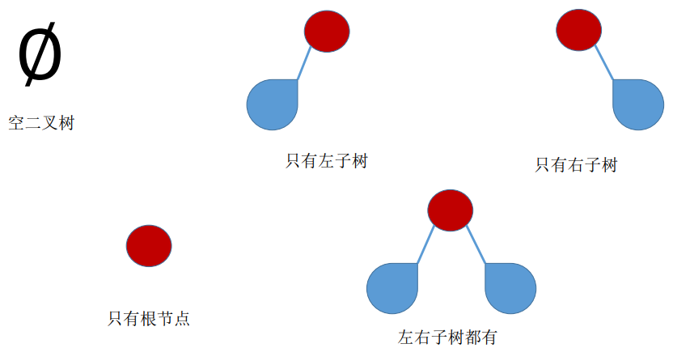


### 特殊二叉树

**满二叉树：**一棵高度为 h，且含有 $2^h - 1 $个结点的二叉树。

特点：

1. 只有最后一层有叶子结点。
2. 不存在度为 1 的结点。
3. 若按层序从 1 开始编号，结点 i 的左孩子为 2i，右孩子为 2i+1；结点 i 的父节点为 $⌊ i / 2 ⌋ $。


**完全二叉树**：当且仅当其每个结点都与高度为 h 的满二叉树中编号为1～n的结点一一对应时，称为完全二叉树。

特点：

1. 只有最后两层可能有叶子结点。
2. 最多只有一个度为 1 的结点。
3. 若按层序从 1 开始编号，结点 i 的左孩子为 2i，右孩子为 2i+1；结点 i 的父节点为 $⌊ i / 2 ⌋$ 
4. $i ≤ ⌊ n / 2 ⌋$为分支结点，$i > ⌊ n / 2 ⌋$为叶子结点。

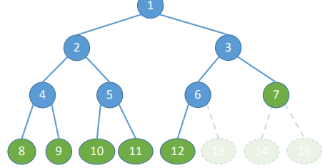

**二叉排序树**：一棵二叉树或者是空二叉树，或者是具有如下性质的二叉树：左子树上所有结点的关键字均小于根结点的关键字；右子树上所有结点的关键字均大于根结点的关键字。

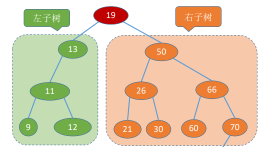

**平衡二叉树**：树上任一结点的左子树和右子树的深度之差不超过 1。

### 二叉树的性质

1. 设非空二叉树中度为 0、1 和 2 的结点个数分别为 $n_0$、$n_1$、$n_2$,则 $n_0 = n_2 + 1$

   推导过程：设树中结点总数为 n，则：$n=n_0+n_1+n_2$,$n=n_1+2n_2+1$

2. 二叉树第 i 层至多有 $2^{i-1} $个结点（i≥1）。

3. 高度为 h 的二叉树至多有 $2^h − 1 $个结点（满二叉树）。

4. 具有 n 个（n>0）结点的完全二叉树的高度 h 为$ ⌈ l o g 2 ( n + 1 ) ⌉ $或 $⌊ l o g 2 n ⌋ + 1 $

5. 对于完全二叉树，可以由总结点数 n 推出度为 0、1 和 2 的结点个数$n_0$、$n_1$和$n_2n$。

   1. 推导过程：$n_1 = 0$ 或 1，$n_0 = n_2 + 1$ 则$n_0 + n_2$一定是奇数。
   2. 若完全二叉树有$2k$（偶数）个结点，则有$n_1=1$，$n_0 = k$，$n_2 = k-1$；
   3. 若完全二叉树有 $2k−1$（奇数）个结点，则有$n_1=0$，$n_0 = k$，$n_2 = k-1$；


### 二叉树的实现

**二叉树的顺序存储：**

顺序存储完全二叉树：定义一个长度为 MaxSize 的数组 t，按照从上至下、从左至右的顺序依次存储完全二叉树中的各个结点。让第一个位置空缺，保证数组中下标和结点编号一致。

二叉树的顺序存储中，一定要把二叉树的结点编号与完全二叉树对应起来；

```c
#define MaxSize 100
struct TreeNode{  
    ElemType value; //结点中的数据元素  
    bool isEmpty;	//结点是否为空
}

//初始化树T
bool initTree(TreeNode T[]){  
    for(int i=0; i<MaxSize; i++){  
        T[i].isEmpty=true; 
    }  
    return true;
}

void test(){   
    struct TreeNode T[MaxSize];  
    initTree(T);
}
```

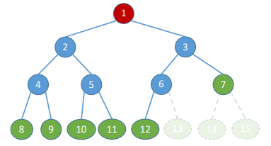

这样可以使用二叉树的性质求一些问题：

- 结点 i 的左孩子：$2i$
- 结点 i 的右孩子：$2i+1$
- 结点 i 的父节点： $⌊ i / 2 ⌋$ 
- 结点 i 的层次：$⌈ l o g 2 ( i + 1 ) ⌉ $或$⌊ l o g 2 i ⌋ + 1 $

但是如果不是完全二叉树，依然按层序将各节点顺序存储，那么将无法从结点编号反映出结点间的逻辑关系。可以将二叉树中的结点编号与完全二叉树对应起来存储，不过这样会浪费很多内存空间。因此，==二叉树的顺序存储结构，只适合存储完全二叉树==。

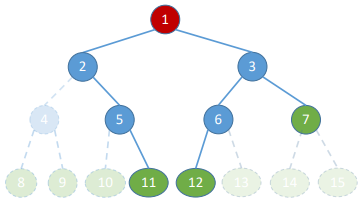

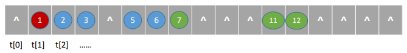


**二叉树的链式存储：**

```c
typedef struct BiTNode{  
    ElemType data;	
    struct BiTNode *lchild, *rchild;	
}BiTNode, *BiTree;

//初始化
bool initTree(BiTree &root){
    root = (BiTree)malloc(sizeof(BiTNode));   
    if(root == NULL)     
        return false;
    root->lchild = NULL; 
    root->rchild = NULL;
    return true;
}

void test{  
    BiTree root = NULL; 	
    initTree(root);
    ...
}
```

二叉树的链式存储可以非常方便的找到指定结点的左右孩子，但是找到指定结点的父结点却非常困难，只能从根节点开始遍历寻找。因此，如果寻找父结点的需求比较多，也可以加上父结点指针形成三叉链表。

````c
typedef struct BiTnode{
   ElemType data;          //数据域
   struct BiTNode *lchild, *rchild; //左、右孩子指针
   struct BiTNode *parent;          //父节点指针
}BiTNode, *BiTree;
````


### 二叉树的遍历

**先序遍历(根左右)**

- 若二叉树为空，不用操作
- 若二叉树非空：
  - 访问根节点
  - 先序遍历左子树
  - 先序遍历右子树

````c
typedef struct BiTnode{
   ElemType data;          
   struct BiTNode *lchild, *rchild; 
}BiTNode, *BiTree;

void PreOrder(BiTree T){
   if(T!=NULL){
      visit(T);                 //访问根结点
      PreOrder(T->lchild);      //递归遍历左子树
      PreOrder(T->rchild);      //递归遍历右子树
   }
}
````

**中序遍历(左根右)**

- 若二叉树为空，不用操作
- 若二叉树非空：
  - 先序遍历左子树
  - 访问根节点
  - 先序遍历右子树

````c
typedef struct BiTnode{
   ElemType data;          
   struct BiTNode *lchild, *rchild; 
}BiTNode, *BiTree;

void InOrder(BiTree T){
   if(T!=NULL){
      InOrder(T->lchild);       //递归遍历左子树
      visit(T);                 //访问根结点
      InOrder(T->rchild);       //递归遍历右子树
   }
}
````

**后续遍历(左右根)**

- 若二叉树为空，不用操作
- 若二叉树非空：
  - 先序遍历左子树
  - 先序遍历右子树
  - 访问根节点

````c
typedef struct BiTnode{
   ElemType data;          
   struct BiTNode *lchild, *rchild; 
}BiTNode, *BiTree;

void PostOrder(BiTree T){
   if(T!=NULL){
      PostOrder(T->lchild);       //递归遍历左子树    
      PostOrder(T->rchild);       //递归遍历右子树
      visit(T);                 //访问根结点
   }
}
````

**二叉树的层序遍历**

算法思想：

- 初始化一个辅助队列
- 根节点入队
- 若队列非空，则队头结点出队，访问该结点，依次将其左、右孩子插入队尾（如果有的话）
- 重复以上操作直至队列为空

````c
//二叉树的结点(链式存储)
typedef struct BiTnode{
   ElemType data;          
   struct BiTNode *lchild, *rchild; 
}BiTNode, *BiTree;

//链式队列结点
typedef struct LinkNode{
   BiTNode * data;
   typedef LinkNode *next;
}LinkNode;

typedef struct{
   LinkNode *front, *rear;  
}LinkQueue;

//层序遍历
void LevelOrder(BiTree T){
   LinkQueue Q;
   InitQueue (Q);          //初始化辅助队列
   BiTree p;
   EnQueue(Q,T);           //将根节点入队
   while(!isEmpty(Q)){     //队列不空则循环
      DeQueue(Q,p);        //队头结点出队
      visit(p);            //访问出队结点
      if(p->lchild != NULL)
         EnQueue(Q,p->lchild);   //左孩子入队
      if(p->rchild != NULL)
         EnQueue(Q,p->rchild);   //右孩子入队
   }
}
````

**由遍历序列构造二叉树**

1. 一个前序遍历序列可能对应多种二叉树形态。同理，一个后序遍历序列、一个中序遍历序列、一个层序遍历序列也可能对应多种二叉树形态。即：==若只给出一棵二叉树的 前/中/后/层序遍历序列 中的一种，不能唯一确定一棵二叉树==。

2. 由二叉树的遍历序列构造二叉树：

   1. 前序+中序遍历序列
   2. 后序+中序遍历序列
   3. 层序+中序遍历序列
3. 由 前序+中序遍历序列 构造二叉树：由前序遍历的遍历顺序（根节点、左子树、右子树）可推出根节点，由根节点在中序遍历序列中的位置即可推出左子树与右子树分别有哪些结点。
4. 由 后序+中序遍历序列 构造二叉树：由后序遍历的遍历顺序（左子树、右子树、根节点）可推出根节点，由根节点在中序遍历序列中的位置即可推出左子树与右子树分别有哪些结点。
5. 由 层序+中序遍历序列 构造二叉树：由层序遍历的遍历顺序（层级遍历）可推出根节点，由根节点在中序遍历序列中的位置即可推出左子树与右子树分别有哪些结点。
   

### 线索二叉树

1. 使用链式存储二叉树如何找到指定结点 p 在中序遍历序列中的前驱和后继？
   答：从根节点出发，重新进行一次中序遍历，指针 q 记录当前访问的结点，指针 pre 记录上一个被访问的结点。当 q == p时，pre 为 q的前驱结点；当 pre == p 时，q 为 p 的后继结点。
   缺点：找前驱、后继很不方便；遍历操作必须从根结点开始。

1. 线索二叉树的概念与作用

   - n 个结点的二叉树，有 n+1 个空链域，可用来记录前驱、后继的信息。指向前驱、后继的指针被称为“线索”，形成的二叉树被称为线索二叉树。
   - 在二叉树的结点上加上线索的二叉树称为线索二叉树，对二叉树以某种遍历方式（如先序、中序、后序或层次等）进行遍历，使其变为线索二叉树的过程称为对二叉树进行线索化。
     	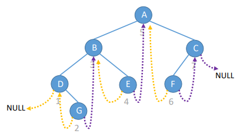

1. 线索二叉树的结点在原本二叉树的基础上，新增了左右线索标志 tag。

   - 当 `tag == 0` 时，表示指针指向孩子；
   - 当 `tag == 1` 时，表示指针是“线索”。
     ````c
     // 线索二叉树的结点
     typedef struct ThreadNode{ 
      ElemType data;   
      struct ThreadNode *lchild, *rchild; 
      int ltag, rtag;	//左、右线索标志
     }
     ````
1. 中序线索二叉树的存储：
		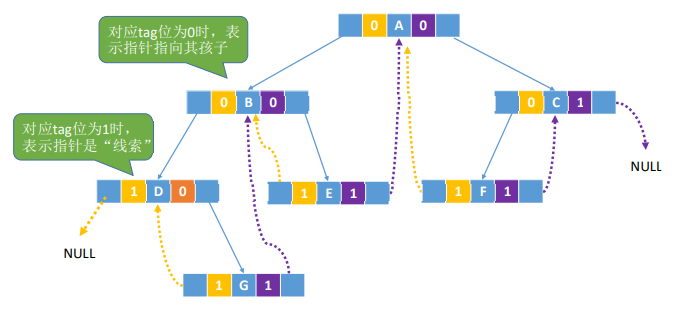
1. 先序线索二叉树的存储：
		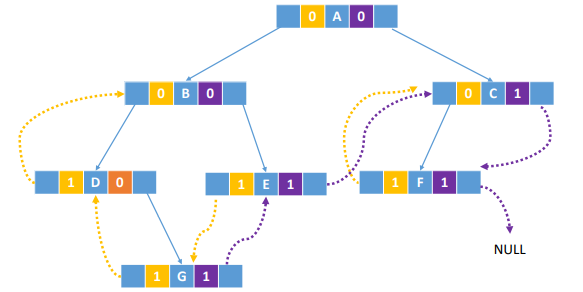
1. 后序线索二叉树的存储：
		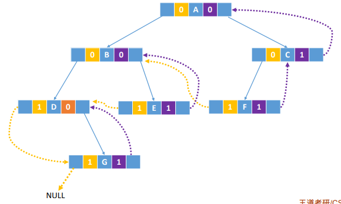


#### 二叉树的线索化

**中序线索化：**

````c
typedef struct ThreadNode{
   int data;
   struct ThreadNode *lchild, *rchild;
   int ltag, rtag;                // 左、右线索标志
}ThreadNode, *ThreadTree;

//全局变量pre, 指向当前访问的结点的前驱
TreadNode *pre=NULL;

void InThread(ThreadTree T){
    if(T!=NULL){
        InThread(T->lchild);    //中序遍历左子树
        visit(T);               //访问根节点
        InThread(T->rchild);    //中序遍历右子树
    }
}

void visit(ThreadNode *q){
   if(q->lchid = NULL){                 //左子树为空，建立前驱线索   
      q->lchild = pre;
      q->ltag = 1;
   }

   if(pre!=NULL && pre->rchild = NULL){ 
      pre->rchild = q;           //建立前驱结点的后继线索
      pre->rtag = 1;
   }
   pre = q;
}

//中序线索化二叉树T
void CreateInThread(ThreadTree T){
   pre = NULL;                //pre初始为NULL
   if(T!=NULL);{              //非空二叉树才能进行线索化
      InThread(T);            //中序线索化二叉树
      if(pre->rchild == NULL)
         pre->rtag=1;         //处理遍历的最后一个结点
   }
}
````

**先序线索化：**

````c
typedef struct ThreadNode{
   int data;
   struct ThreadNode *lchild, *rchild;
   int ltag, rtag;                // 左、右线索标志
}ThreadNode, *ThreadTree;

//全局变量pre, 指向当前访问的结点的前驱
TreadNode *pre=NULL;

//先序遍历二叉树，一边遍历一边线索化
void PreThread(ThreadTree T){
   if(T!=NULL){
      visit(T);
      if(T->ltag == 0)         //lchild不是前驱线索
         PreThread(T->lchild);
      PreThread(T->rchild);
   }
}

void visit(ThreadNode *q){
   if(q->lchid = NULL){                 //左子树为空，建立前驱线索   
      q->lchild = pre;
      q->ltag = 1;
   }

   if(pre!=NULL && pre->rchild = NULL){ 
      pre->rchild = q;           //建立前驱结点的后继线索
      pre->rtag = 1;
   }
   pre = q;
}

//先序线索化二叉树T
void CreateInThread(ThreadTree T){
   pre = NULL;                //pre初始为NULL
   if(T!=NULL);{              //非空二叉树才能进行线索化
      PreThread(T);            //先序线索化二叉树
      if(pre->rchild == NULL)
         pre->rtag=1;         //处理遍历的最后一个结点
   }
}
````

**后序线索化：**

````c
typedef struct ThreadNode{
   int data;
   struct ThreadNode *lchild, *rchild;
   int ltag, rtag;                // 左、右线索标志
}ThreadNode, *ThreadTree;

//全局变量pre, 指向当前访问的结点的前驱
TreadNode *pre=NULL;

//先序遍历二叉树，一边遍历一边线索化
void PostThread(ThreadTree T){
   if(T!=NULL){
      PostThread(T->lchild);
      PostThread(T->rchild);
      visit(T);                  //访问根节点
   }
}

void visit(ThreadNode *q){
   if(q->lchid = NULL){                 //左子树为空，建立前驱线索   
      q->lchild = pre;
      q->ltag = 1;
   }

   if(pre!=NULL && pre->rchild = NULL){ 
      pre->rchild = q;           //建立前驱结点的后继线索
      pre->rtag = 1;
   }
   pre = q;
}

//先序线索化二叉树T
void CreateInThread(ThreadTree T){
   pre = NULL;                //pre初始为NULL
   if(T!=NULL);{              //非空二叉树才能进行线索化
      PostThread(T);            //后序线索化二叉树
      if(pre->rchild == NULL)
         pre->rtag=1;         //处理遍历的最后一个结点
   }
}
````

#### 索二叉树中找前驱、后继

中序线索二叉树找中序后继：在中序线索二叉树中找到指定节点 *p 的中序后继 next

1. 若`p->rtag==1`，则`next = p->rchild`；
2. 若`p->rtag==0`，则 next 为 p 的右子树中最左下结点。


````c
//1. 找到以P为根的子树中，第一个被中序遍历的结点
ThreadNode *Firstnode(ThreadNode *p){
   //循环找到最左下的结点（不一定是叶结点）
   while(p->ltag == 0)
      p=p->lchild;
   return p;
}

//2. 在中序线索二叉树中找到结点p的后继结点
ThreadNode *Nextnode(ThreadNode *p){
   //右子树最左下结点
   if(p->rtag==0)
      return Firstnode(p->rchild);
   else 
      return p->rchild; //rtag==1，直接返回后继线索
}

//3. 对中序线索二叉树进行中序遍历
void Inorder(ThreadNode *T){            //T为根节点指针
   for(ThreadNode *p = Firstnode(T); p!=NULL; p = Nextnode(p))
      visit(p);
}
````

**中序线索二叉树找到指定结点 *p 的中序前驱 pre：**

1. 若`p->ltag==1`，则`pre = p->lchild`；
2. 若`p->ltag==0`，则 next 为 p 的左子树中最右下结点。

````c
// 找到以p为根的子树中，最后一个被中序遍历的结点
ThreadNode *LastNode(ThreadNode *p){
    // 循环找到最右下结点（不一定是叶结点）
    while(p->rtag==0)
        p=p->rchild;
    return p;
}

// 在中序线索二叉树中找到结点p的前驱结点
ThreadNode *PreNode(ThreadNode *p){
    // 左子树中最右下的结点
    if(p->ltag==0)
        return LastNode(p->lchild);
    else
        return p->lchild;
}

// 对中序线索二叉树进行中序循环（非递归方法实现）
void RevOrder(ThreadNode *T){
    for(ThreadNode *p=LastNode(T); p!=NULL; p=PreNode(p))
        visit(p);
}
````

**先序线索二叉树找到指定结点 * p 的先序后继 next：**

1. 若`p->rtag==1`，则`next = p->rchild`；
2. 若`p->rtag==0`：
   1. 若 p 有左孩子，则先序后继为左孩子；
   2. 若 p 没有左孩子，则先序后继为右孩子。

**先序线索二叉树找到指定结点 * p 的先序前驱 pre：**

1. 前提：改用三叉链表，可以找到结点 * p 的父节点。
2. 如果能找到 p 的父节点，且 p 是左孩子：p 的父节点即为其前驱；
3. 如果能找到 p 的父节点，且 p 是右孩子，其左兄弟为空：p 的父节点即为其前驱；
4. 如果能找到 p 的父节点，且 p 是右孩子，其左兄弟非空：p 的前驱为左兄弟子树中最后一个被先序遍历的结点；
5. 如果 p 是根节点，则 p 没有先序前驱。

**后序线索二叉树找到指定结点 * p 的后序前驱 pre：**

1. 若`p->ltag==1`，则`pre = p->lchild`；
2. 若`p->ltag==0`
   1. 若 p 有右孩子，则后序前驱为右孩子；
   2. 若 p 没有右孩子，则后续前驱为右孩子。

**后序线索二叉树找到指定结点 * p 的后序后继 next：**

1. 前提：改用三叉链表，可以找到结点 * p 的父节点。
2. 如果能找到 p 的父节点，且 p 是右孩子：p 的父节点即为其后继；
3. 如果能找到 p 的父节点，且 p 是左孩子，其右兄弟为空：p 的父节点即为其后继；
4. 如果能找到 p 的父节点，且 p 是左孩子，其右兄弟非空：p 的后继为右兄弟子树中第一个被后序遍历的结点；
5. 如果 p 是根节点，则 p 没有后序后继。


## 树和深林

### 树的存储结构

**双亲表示法(顺序存储)：**每个结点中保存指向双亲的指针

1. 数据域：存放结点本身信息。
2. 双亲域：指示本结点的双亲结点在数组中的位置。

````c
#define MAX_TREE_SIZE 100  //树中最多结点数

typedef struct{      //树的结点定义
   ElemType data; 
   int parent;      //双亲位置域
}PTNode;

typedef struct{                   //树的类型定义
   PTNode nodes[MAX_TREE_SIZE];   //双亲表示
   int n;                         //结点数
}PTree;
````

增：新增数据元素，无需按逻辑上的次序存储；（需要更改结点数n）
删（叶子结点）：① 将伪指针域设置为-1；②用后面的数据填补；（需要更改结点数n）
查询：①优点-查指定结点的双亲很方便；②缺点-查指定结点的孩子只能从头遍历，空数据导致遍历更慢；


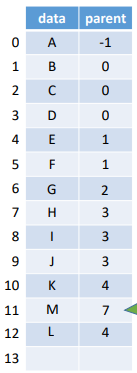

**孩子表示法(顺序+链式)**
孩子链表：把每个结点的孩子结点排列起来，看成是一个线性表，用单链表存储，则n个结点有n个孩子链表（叶子的孩子链表为空表）。而n个头结点又组成一个线性表，用顺序表（含n个元素的结构数组）存储。

````c
struct CTNode{
   int child;    //孩子结点在数组中的位置
   struct CTNode *next;    // 下一个孩子
};

typedef struct{
   ElemType data;
   struct CTNode *firstChild;    // 第一个孩子
}CTBox;

typedef struct{
   CTBox nodes[MAX_TREE_SIZE];
   int n, r;   // 结点数和根的位置
}CTree;
````


**孩子兄弟表示法（链式存储）：** 用孩子兄弟表示法可以将树转换为二叉树的形式。

````c
typedef struct CSNode{
   ElemType data;                               //数据域
   struct CSNode *firstchild, *nextsibling;     
   //第一个孩子和右兄弟指针, *firstchild 看作左指针，*nextsibling看作右指针
}CSNode. *CSTree;
````

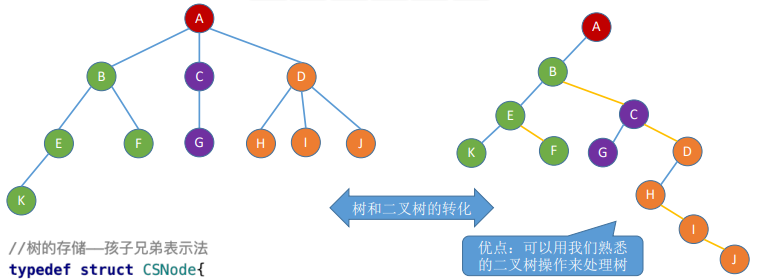


### 树、森林与二叉树的转换

本质：森林中各个树的根结点之间视为兄弟关系

**将树转换成二叉树：**

森林是m（m≥0）棵互不相交的树的集合，可以将森林中的树看做一棵树中的兄弟结点，再使用孩子兄弟表示法将其转换为二叉树。

1. 加线：在兄弟之间加一连线
2. 抹线：对每个结点去除其与孩子之间的关系（第一孩子除外）
3. 旋转：以树的根结点为轴心，顺时针转45度（兄弟相连留长子）


### 树和森林的遍历

**树的先根遍历**：若树非空，先访问根结点，再依次对每棵子树进行先根遍历；（与对应二叉树的先序遍历序列相同）

````c
void PreOrder(TreeNode *R){
   if(R!=NULL){
      visit(R);    //访问根节点
      while(R还有下一个子树T)
         PreOrder(T);      //先跟遍历下一个子树
   }
}
````

**树的后根遍历**：若树非空，先依次对每棵子树进行后根遍历，最后再返回根节点；（与对应二叉树的中序遍历序列相同）

````c
void PostOrder(TreeNode *R){
   if(R!=NULL){
      while(R还有下一个子树T)
         PostOrder(T);      //后跟遍历下一个子树
      visit(R);    //访问根节点
   }
}
````

**树的层次遍历（用队列实现）：**

1. 若树非空，则根节点入队；
2. 若队列非空，队头元素出队并访问，同 时将该元素的孩子依次入队；
3. 重复第二步直到队列为空

**森林的先序遍历：**若森林为非空，则按如下规则进行遍历：

1. 访问森林中第一棵树的根结点。
2. 先序遍历第一棵树中根结点的子树森林。
3. 先序遍历除去第一棵树之后剩余的树构成的森林

​	==森林的先序遍历等同于依次对各个树进行**先根遍历**；也可以先转换成与之对应的二叉树，对二叉树进行先序遍历==

**森林的中序遍历：**若森林为非空，则按如下规则进行遍历：

1. 中序遍历森林中第一棵树的根结点的子树森林。

2. 访问第一棵树的根结点。
3. 中序遍历除去第一棵树之后剩余的树构成的森林。

​	==森林的中序遍历等同于依次对各个树进行**后根遍历**；也可以先转换成与之对应的二叉树，对二叉树进行中序遍历==

## 应用

### 二叉排序树(BST)

**二叉排序树，又称二叉查找树（BST，Binary Search Tree）**。一棵二叉树或者是空二叉树，或者是具有如下性质的二叉树：

1. 左子树上所有结点的关键字均小于根结点的关键字；
2. 右子树上所有结点的关键字均大于根结点的关键字；
3. 左子树和右子树又各是一棵二叉排序树。
4. ==即：左子树结点值 < 根结点值 < 右子树结点值。因此，对二叉排序树进行中序遍历，可以得到一个递增的有序序列。==

**二叉排序树的查找**

````c
typedef struct BSTNode{
   int key;
   struct BSTNode *lchild, *rchild;
}BSTNode, *BSTree;

//在二叉排序树中查找值为key的结点（非递归）
//最坏空间复杂度：O(1)
BSTNode *BST_Search(BSTree T, int key){
   while(T!=NULL && key!=T->key){        //若树空或等于跟结点值，则结束循环
      if(key<T->key)       //值小于根结点值，在左子树上查找
         T = T->lchild;
      else                  //值大于根结点值，在右子树上查找
         T = T->rchild;
   }
   return T;
}

//在二叉排序树中查找值为key的结点（递归）
//最坏空间复杂度：O(h)
BSTNode *BSTSearch(BSTree T, int key){
   if(T == NULL || Key == T->key)
      return NULL;
   else if(key < T->key)
      return BSTSearch(T->lchild, key);
   else 
      return BSTSearch(T->rchild, key);
}
````

**二叉排序树的插入：** 若原二叉排序树为空，则直接插入结点；否则，若关键字 k 小于根结点值，则插入到左子树；若关键字 k 大于根结点值，则插入到右子树。

````c
//在二叉排序树中插入关键字为k的新结点（递归）
//最坏空间复杂度：O(h)
int BST_Insert(BSTree &T, int k){
   if(T==NULL){           //原树为空，新插入的结点为根结点
      T = (BSTree)malloc(sizeof(BSTNode));
      T->key = k;
      T->lchild = T->rchild = NULL;
      return 1;                       //插入成功
   }
   else if(K == T->key)               //树中存在相同关键字的结点，插入失败
      return 0;
   else if(k < T->key)                 
      return BST_Insert(T->lchild,k);
   else 
      return BST_Insert(T->rchild,k);
}
````

**二叉排序树的构造：**

````c
//按照str[]中的关键字序列建立二叉排序树
void Crear_BST(BSTree &T, int str[], int n){
   T = NULL;                     //初始时T为空树
   int i=0;
   while(i<n){
      BST_Insert(T,str[i]);     //依次将每个关键字插入到二叉排序树中
      i++;
   }
}
````

**二叉排序树的删除：** 先搜索找到目标结点：

1. 若被删除结点 z 是叶结点，则直接删除，不会破坏二叉排序树的性质；
2. 若结点 z 只有一棵左子树或右子树，则让 z 的子树成为 z 父结点的子树，替代 z 的位置；
3. 若结点 z 有左、右两棵子树，则令 z 的直接后继（或直接前驱）替代 z ，然后从二叉排序树中删去这个直接后继（或直接前驱），这样就转换成了第一或第二种情况。

**查找效率分析：**查找失败的平均查找长度 ASL（Average Search Length）

1. 查找长度：查找运算中，需要对比关键字的次数，反映了查找操作时间复杂度；
2. 查找成功的平均查找长度ASL
3. 查找失败的平均查找长度ASL

​	

​	$ASL=(3∗7+4∗2)/9=3.22$


### 二叉平衡树(AVL)

**平衡二叉树**（Balanced Binary Tree），简称平衡树（AVL树），在插入和删除二叉树的结点时，要保证任意结点的左右子树的高度差的绝对值不超过1，将这样的树称为**平衡二叉树**。

`结点的平衡因子 = 左子树高 - 右子树高`

````c
//平衡二叉树结点
typedef struct AVLNode{
   int key;         //数据域
   int balance;     //平衡因子
   struct AVLNode *lchild; *rchild; 
}AVLNode, *AVLTree;
````

**调整最小不平衡子树:** 在平衡二叉树的插入操作中，只要将最小不平衡子树调整平衡，则其他祖先结点都会恢复平衡。调整可分为以下四种情况：

1. LL: 在A结点的左孩子的左子树中插入导致不平衡
   - 调整： A的左孩子结点右上旋
2. RR: 在A结点的右孩子的右子树中插入导致不平衡
   - 调整： A的右孩子结点左上旋
3. LR: 在A结点的左孩子的右子树中插入导致不平衡
   - 调整： A的左孩子的右孩子，先左上旋再右上旋
4. RL: 在A结点的右孩子的左子树中插入导致不平衡
   - 调整： A的右孩子的左孩子，先右上旋再左上旋

> **调整最小不平衡子树（LL）：**由于在结点 A 的左孩子（L）的左子树（L）上插入了新结点，A的平衡因子由 1增至 2，导致以 A 为根的子树失去平衡，需要一次向右的旋转操作。将 A 的左孩子 B 向右上旋转代替 A 成为根结点，将 A 结点向右下旋转成为 B 的右子树的根结点，而 B 的原右子树则作为 A 结点的左子树。

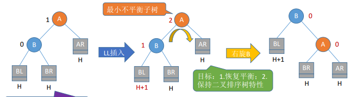

> **调整最小不平衡子树（RR）：**由于在结点 A 的右孩子（R）的右子树（R）上插入了新结点，A的平衡因子由 -1 减至 -2，导致以 A 为根的子树失去平衡，需要一次向左的旋转操作。将 A 的右孩子 B 向左上旋转代替 A成为根结点，将 A 结点向左下旋转成为 B 的左子树的根结点，而 B 的原左子树则作为 A 结点的右子树。

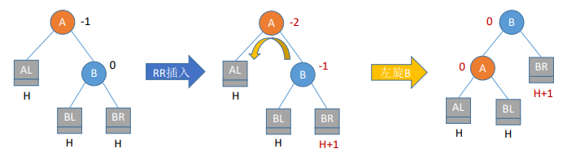

> **调整最小不平衡子树（LR）：**由于在 A 的左孩子（L）的右子树（R）上插入新结点，A 的平衡因子由 1 增至 2，导致以 A 为根的子树失去平衡，需要进行两次旋转操作，先左旋转后右旋转。先将 A 结点的左孩子 B 的右子树的根结点 C 向左上旋转提升到 B 结点的位置，然后再把该 C 结点向右上旋转提升到 A 结点的位置。

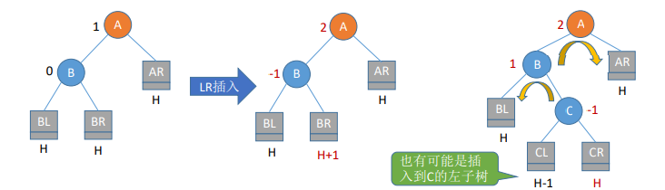

> **调整最小不平衡子树（RL）：**由于在 A 的右孩子（R）的左子树（L）上插入新结点，A 的平衡因子由 -1 减至 -2，导致以 A 为根的子树失去平衡，需要进行两次旋转操作，先右旋转后左旋转。先将A 结点的右孩子 B的左子树的根结点 C 向右上旋转提升到 B 结点的位置，然后再把该 C 结点向左上旋转提升到 A 结点的位置。

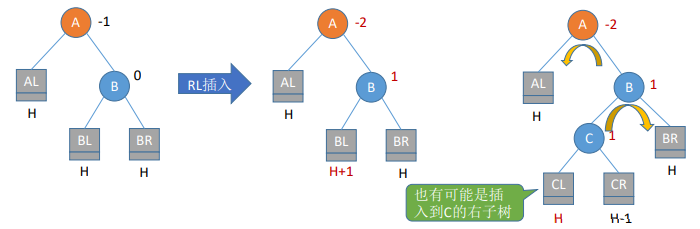

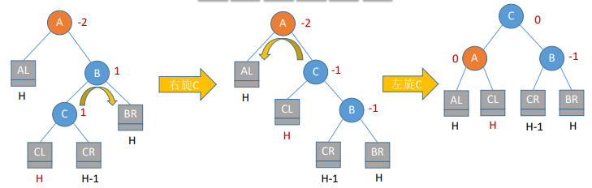


**查找效率分析：**若树高为h，则最坏情况下，查找一个关键字最多需要对比 h 次，即查找操作的时间复杂度不可能超过 O(h)。

由于平衡二叉树上任一结点的左子树和右子树的高度之差不超过 1，假如以 $n_h$ 表示深度为 h 的平衡树中含有的最少结点数，则有$n_0 = 0$，$n_1 = 1$，$n_2 = 2$，并且有$n_h = n_{h−1} + n_{h−2} +1 $


### 哈夫曼树

1. 结点的权：有某种现实含义的数值。
2. 结点的带权路径长度：从树的根到该结点的路径长度（经过的边数）与该结点上权值的乘积。
3. 树的带权路径长度：树中所有叶结点的带权路径长度之和（WPL，Weighted Path Length）。
4. 哈夫曼树的定义：在含有 n 个带权叶结点的二叉树中，其中带权路径长度（WPL）最小的二叉树称为哈夫曼树，也称最优二叉树。
5. 给定 n 个权值分别为 $w_1$,$w_2$,…,$w_n$的结点，构造哈夫曼树的算法描述如下：
   1. 将这 n 个结点分别作为 n 棵仅含一个结点的二叉树，构成森林 F。
   2. 构造一个新结点，从 F 中选取两棵根结点权值最小的树作为新结点的左、右子树，并且将新结点的权值置为左、右子树上根结点的权值之和。
   3. 从 F 中删除刚才选出的两棵树，同时将新得到的树加入 F 中。
   4. 重复步骤 2 和 3，直至 F 中只剩下一棵树为止。
6. 构造哈夫曼树的注意事项：
   1. 每个初始结点最终都成为叶结点，且权值越小的结点到根结点的路径长度越大。
   1. 哈夫曼树的结点总数为 2n−1。
   1. 哈夫曼树中不存在度为 1 的结点。
   1. 哈夫曼树并不唯一，但 WPL 必然相同且为最优。
1. 哈夫曼编码：字符集中的每个字符作为一个叶子结点，各个字符出现的频度作为结点的权值，根据之前介绍的方法构造哈夫曼树。

​		由哈夫曼树得到的二进制前缀编码称为哈夫曼编码。

​	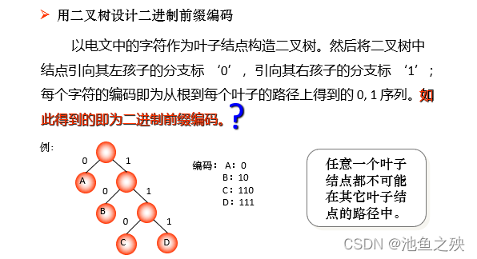


# 图

## 图的基本概念

1. 图是一种非线性结构
   图 G 由顶点集 V 和边集 E 组成，记为$ G=(V,E)$，其中 $V(G) $表示图 G 中顶点的有限非空集；$E(G)$ 表示图 G 中顶点之间的关系（边）集合。若 $V = \{v1, v2, … , vn\}$，则用$|V|$表示图 G 中顶点的个数，也称图 G 的阶；$E={(u,v)∣u∈V,v∈V}$，用$∣E∣ $表示图 G 中边的条数。
   注意：线性表可以是空表，树可以是空树，但图不可以是空，即V一定是非空集。

2. 图的特点：
   1. 顶点之间的关系是任意的
   2. 图中任意两个顶点之间都可能相关
   3. 顶点的前驱和后继个数无限制

3. 定义：图是一种数据元素间存在多对多关系的数据结构加上一组基本操作构成的抽象数据类型。
   生成树：所有顶点均由边连接在一起但不存在回路的图。

4. 无向图：若 E 是无向边（也称边）的有限集合时，则图 G 为无向图。边是顶点的无序对，记为$(v,w)$ 或$ (w, v)$，其中 v、w 是顶点。可以说顶点 w 和顶点 v 互为邻接点，边 $(v,w) $依附于顶点 w 和 v；或者说边$(v,w) $和顶点 v、w 相关联。

5. 有向图：若 E 是有向边（也称弧）的有限集合时，则图 G 为有向图。 弧是顶点的有序对，记为$<v,w>$，其中 v、w 是顶点，v 称为弧尾，w 称为弧头，称为从顶点 v 到顶点 w 的弧，也称 v邻接到w，或w邻接自v。$< v , w > ≠ < w , v > $

6. 简单图：① 不存在重复边； ② 不存在顶点到自身的边。

7. 多重图：图 G 某两个结点之间的边数多于一条，又允许顶点通过同一条边和自己关联， 则 G 为多重图。
   

8. 度、入度、出度：对于无向图，顶点 v 的度是指依附于该顶点的边的条数，记为 $TD(v)$。对于有向图，入度是以顶点 v 为终点的有向边的数目，记为 $ID(v)$； 出度是以顶点 v 为起点的有向边的数目，记为$OD(v)$。 顶点 v 的度等于其入度和出度之和，即 $TD(v) = ID(v) + OD(v)$。路

9. 径：顶点$v_p$到顶点$v_q$之间的一条路径是指顶点序列$v_p$$,v_{i1}$, $v_{i2}$，…，$v_q$

10. 回路：第一个顶点和最后一个顶点相同的路径称为回路或环。

11. 简单路径：在路径序列中，顶点不重复出现的路径称为简单路径。

12. 简单回路：除第一个顶点和最后一个顶点外，其余顶点不重复出现的回路称为简单回路。

13. 路径长度：路径上边的数目。

14. 点到点的距离：从顶点 u 出发到顶点 v 的最短路径若存在，则此路径的长度称为从 u 到 v 的距离。若从 u 到 v 根本不存在路径，则记该距离为无穷（∞）。

15. 连通、强连通：无向图中，若从顶点 v 到顶点 w 有路径存在，则称 v 和 w 是连通的。有向图中，若从顶点 v 到顶点 w 和从顶点 w 到顶点 v 之间都有路径，则称这两个顶点是强连通的。

16. 连通图：若图 G 中任意两个顶点都是连通的，则称图 G 为连通图，否则称为非连通图。对于 n 个顶点的无向图 G， 若 G 是连通图，则最少有 n-1 条边；若G是非连通图，则最多可能有$\mathrm{C}_{n-1}^2$条边。

17. 子图、生成子图：设有两个图 $G=(V,E) $和 $G ′ = ( V ′ , E ′ )$ ，若$V'$是  $V$ 的子集，且  $E'$是$E$ 的子集，则称$G'$是  $G$ 的子图。若有满足 $V(G') = V(G)$的子图$ G’$，则称其为 G 的生成子图。
    

18. 连通分量：无向图中的极大连通子图称为连通分量。
    

19. 强连通分量：有向图中的极大强连通子图称为有向图的强连通分量。
    

20. 生成树：连通图的生成树是包含图中全部顶点的一个极小连通子图。
    
21. 生成森林：在非连通图中，连通分量的生成树构成了非连通图的生成森林。
    
22. 边的权：在一个图中，每条边都可以标上具有某种含义的数值，该数值称为该边的权值。
23. 带权图：边上带有权值的图称为带权图，也称网。
24. 带权路径长度：当图是带权图时，一条路径上所有边的权值之和，称为该路径的带权路径长度。
25. 无向完全图：无向图中任意两个顶点之间都存在边。若无向图的顶点数 $∣V∣=n$，则  $|E|∈[0, \mathrm{C}_n^2]∣= [ 0 , n ( n – 1 ) / 2 ] $
26. 有向完全图：有向图中任意两个顶点之间都存在方向相反的两条弧。若有向图的顶点数$∣V∣=n$，则  $|E|∈[0, 2\mathrm{C}_n^2]=[0, n(n–1)]$。
27. 稀疏图、稠密图：边数很少的图称为稀疏图，反之称为稠密图。


## 图的存储

### 邻接矩阵

也叫数组表示法

**邻接矩阵存储无向图、有向图：**

````c
#define MaxVertexNum 100	//顶点数目的最大值

typedef struct{
    char Vex[MaxVertexNum];		//顶点表
    int Edge[MaxVertexNum][MaxVertexNum];	//邻接矩阵，边表
    int vexnum,arcnum;			//图的顶点数和边数
}MGraph;
````


度：第 i 个结点的度 = 第 i 行（或第 i 列）的非零元素个数；

出度：第 i 行的非零元素个数；

入度：第 i 列的非零元素个数。

**邻接矩阵法存储带权图：**

````c
#define MaxVertexNum 100		//顶点数目的最大值
#define INFINITY 2147483647;	//表示“无穷”

typedef char VertexType;	//顶点数据类型
typedef int EdgeType;		//边数据类型

typedef struct{
    VertexType Vex[MaxVertexNum];	//顶点表
    EdgeType Edge[MaxVertexNum][MaxVertexNum];	//边的权值
    int vexnum,arcnum;		//图的当前顶点数和弧数
}MGraph;
````


**性能分析：**

1. 空间复杂度：$O(|V|^2 )$，只和顶点数相关，和实际的边数无关。
2. 适合用于存储稠密图。
3. 无向图的邻接矩阵是对称矩阵，可以压缩存储（只存储上三角区或者下三角区）。

**邻接矩阵的性质**：设图 G 的邻接矩阵为 A（矩阵元素为 0 或 1），则$A^n$的元素 $A^n[i][j]$于由顶点 i 到顶点 j 的长度为 n 的路径的数目。

### 邻接表

类似于数的孩子链表表示法

**邻接表存储存储无向图、有向图：**

```c
#define MVNum 100							//最大顶点数

typedef struct ArcNode{                		//边/弧 
    int adjvex;                             //邻接点的位置 
    struct ArcNode *next;	      			//指向下一个表结点的指针 
}ArcNode;

typedef struct VNode{ 
    char data;                    	        //顶点信息 
    ArcNode *first;         				//第一条边/弧 
}VNode, AdjList[MVNum];                 	//AdjList表示邻接表类型 

typedef struct{ 
    AdjList vertices;              			//头结点数组
    int vexnum, arcnum;     				//当前的顶点数和边数 
}ALGraph; 

```


**对比邻接矩阵：**


|                    | 邻接表                                 | 邻接矩阵       |
| ------------------ | -------------------------------------- | -------------- |
| 空间复杂度         |                                        |                |
| 适用场景           | 存储稀疏图                             | 存储稠密图     |
| 表示方式           | 不唯一                                 | 唯一           |
| 计算度、入度、出度 | 计算有向图的度、入度不方便，其余很方便 | 遍历对应行或列 |
| 找相邻的边         | 找有向图的入边不方便，其余很方便       | 遍历对应行或列 |


### 十字链表

**十字链表存储有向图：**

````c
#define MAX_VERTEX_NUM 20	//最大顶点数量

typedef struct ArcBox{		//弧结点
	int tailvex, headvex;	//弧尾，弧头顶点编号（一维数组下标）
	struct ArcBox *hlink, *tlink;	//弧头相同、弧尾相同的下一条弧的链域
	InfoType info;			//权值
}ArcBox;

typedef struct VexNode{		//顶点结点
	VertexType data;		//顶点数据域
	ArcBox *firstin, *firstout;	//该顶点的第一条入弧和第一条出弧
}VexNode;

typedef struct{				//有向图
	VexNode xlist[MAX_VERTEX_NUM];	//存储顶点的一维数组
	int vexnum, arcnum;	//有向图的当前顶点数和弧数
}OLGraph;
````

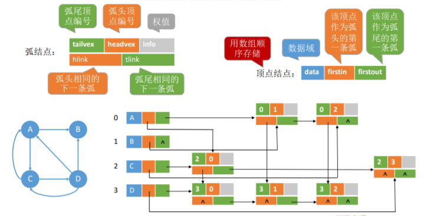


**邻接多重表存储无向图：**

````c
#define MAX_VERTEX_NUM 20	//最大顶点数量

struct EBox{				//边结点
	int i,j; 				//该边依附的两个顶点的位置（一维数组下标）
	EBox *ilink,*jlink; 	//分别指向依附这两个顶点的下一条边
	InfoType info; 			//边的权值
};
struct VexBox{
	VertexType data;
	EBox *firstedge; 		//指向第一条依附该顶点的边
};
struct AMLGraph{
	VexBox adjmulist[MAX_VERTEX_NUM];
	int vexnum,edgenum; 	//无向图的当前顶点数和边数
};
````

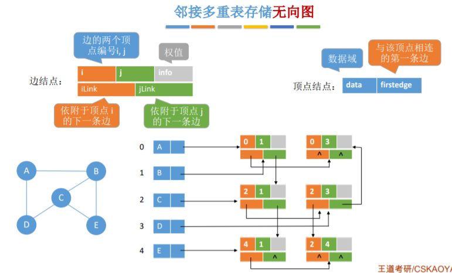


| 函数                         | 作用                                                         |
| ---------------------------- | ------------------------------------------------------------ |
| `Adjacent(G, x, y)`          | 判断图 G 是否存在边 < x , y > <x,y><x,y> 或 ( x , y ) (x, y)(x,y)。 |
| `Neighbors(G, x)`            | 列出图 G 中与结点 x 邻接的边                                 |
| `InsertVertex(G, x)`         | 在图 G 中插入顶点 x                                          |
| `DeleteVertex(G, x)`         | 从图 G 中删除顶点 x                                          |
| `AddEdge(G, x, y)`           | 若无向边 ( x , y ) (x, y)(x,y) 或有向边 < x , y > <x,y><x,y> 不存在，则向图 G 中添加该边 |
| `RemoveEdge(G, x, y)`        | 若无向边 ( x , y ) (x, y)(x,y) 或有向边 < x , y > <x,y><x,y> 存在，则从图 G 中删除该边 |
| `FirstNeighbor(G, x)`        | 求图 G 中顶点 x 的第一个邻接点，若有则返回顶点号。若 x 没有邻接点或图中不存在 x，则返回 -1 |
| `NextNeighbor(G, x, y)`      | 假设图 G 中顶点 y 是顶点 x 的一个邻接点，返回除 y 之外顶点 x 的下一个邻接点的顶点号，若 y 是 x 的最后一个邻接点，则返回 -1 |
| `Get_edge_value(G, x, y)`    | 获取图 G 中边 ( x , y ) (x, y)(x,y) 或 < x , y > <x,y><x,y> 对应的权值 |
| `Set_edge_value(G, x, y, v)` | 设置图 G 中边 ( x , y ) (x, y)(x,y) 或 < x , y > <x,y><x,y> 对应的权值为 v |


## 图的遍历

### 广度优先遍历

1. ⼴度优先遍历（Breadth-First-Search, BFS）要点：
   1. 找到与⼀个顶点相邻的所有顶点；
   2. 标记哪些顶点被访问过；
   3. 需要⼀个辅助队列。

2. 广度优先遍历用到的操作：

   1. `FirstNeighbor(G, x)`：求图 G 中顶点 x 的第⼀个邻接点，若有则返回顶点号；若 x 没有邻接点或图中不存在 x，则返回 -1。
   2. `NextNeighbor(G, x, y)`：假设图 G 中顶点 y 是顶点 x 的⼀个邻接点，返回除 y 之外顶点 x 的下⼀个邻接点的顶点号，若 y 是 x 的最后⼀个邻接点，则返回 -1。

3. 广度优先遍历伪代码：

   ````c
   bool visited[MAX_VERTEX_NUM];	//访问标记数组
   
   // 对图G进行广度优先遍历
   void BFSTraverse(Graph G){
       for(i=0; i<G.vexnum; ++i)	//访问标记数组初始化
           visited[i]=FALSE;
       InitQueue(Q);				//初始化辅助队列
       for(i=0; i<G.vexnum; ++i)	//从0号结点开始遍历，对每个连通分量进行一次广度优先遍历
           if(!visited[i])
               BFS(G,i);
   }
   
   //从顶点v开始广度优先遍历图G
   void BFS(Graph G,int v){
       visit(G,v);					//访问图G的结点v
       visited[v]=TREE;			//标记v已被访问
       EnQueue(Q,v);				//顶点v入队列Q
       while(!isEmpty(Q)){
           DeQueue(Q,v);			//队列头节点出队并将头结点的值赋给v
           for(w=FirstNeighbor(G,v); w>=0; w=NextNeighbor(G,v,w)){
               //检测v的所有邻结点
               if(!visited[w]){
                   visit(w);
                   visited[w]=TREE;
                   EnQueue(Q,w);
               }
           }
       }
   }
   ````

4. 复杂度分析：

   1. 空间复杂度：最坏情况，辅助队列⼤⼩为$O(|V|)$。

   2. 对于邻接矩阵存储的图，访问$∣V∣$ 个顶点需要$O(|V|)$ 的时间，查找每个顶点的邻接点都需要 $O(|V|)$的时间，⽽总共有 $∣V∣$ 个顶点，时间复杂度为 $O(|V|^2)$。

   3. 对于邻接表存储的图，访问 $∣V∣ $个顶点需要$O(|V|)$的时间，查找各个顶点的邻接点共需要$O(|E|)$的时间， 时间复杂度为 $O(|V|+|E|)$。

      

5. ⼴度优先⽣成树：⼴度优先⽣成树由⼴度优先遍历过程确定。由于邻接表的表示⽅式不唯⼀，因此基于邻接表的⼴度优先⽣成树也不唯⼀。

   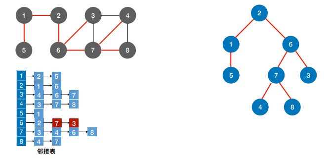


### 深度优先遍历

1. 深度优先遍历方法（Depth_First Search——DFS）

2. 递归实现DFS算法

   ````c
   bool visited[MAX_VERTEX_NUM];	//访问标记数组
   
   // 对图G进行深度优先算法
   void DFSTraverse(Graph G){
       for(v=0; v<G.vexnum; v++){	//初始化标记数组
           visited[v]=FALSE;
       }
       for(v=0; v<G.vexnum; v++){
           if(!visited[v])
               DFS(G,v);
       }
   }
   
   // 从顶点v出发深度优先遍历图G
   void DFS(Graph G,int v){
       visit(G,v);
       visited[v]=TREE;
       for(w=FirstNeighbor(G,v);w>=0;w=NextNeighbor(G,v)){
           if(!visited[w])
               DFS(G,v);
       }
   }
   ````

3. 复杂度分析：

   1. 空间复杂度主要来自来⾃函数调⽤栈，最坏情况下递归深度为 $O(|V|)$；最好情况为$O(1)$
   2. 对于邻接矩阵存储的图，访问 $|V|$个顶点需要 $O(|V|)$的时间，查找每个顶点的邻接点都需要  $O(|V|)$的时间，⽽总共有$∣V∣$ 个顶点，时间复杂度为$O(|V|^2)$。
   3. 对于邻接表存储的图，访问 $∣V∣$ 个顶点需要$O(|V|)$的时间，查找各个顶点的邻接点共需要 $O(|E|)$的时间， 时间复杂度为 $O(|V|+|E|)$。

4. 深度优先遍历序列:

   

   - 从 2 出发的深度优先遍历序列：2, 1, 5, 6, 3, 4, 7, 8
   - 从 3 出发的深度优先遍历序列：3, 4, 7, 6, 2, 1, 5, 8
   - 从 1 出发的深度优先遍历序列：1, 2, 6, 3, 4, 7, 8, 5

5. 深度优先⽣成树：
   
   
   	同⼀个图的邻接矩阵表示⽅式唯⼀，因此深度优先遍历序列唯⼀，深度优先生成树也唯⼀；
   	同⼀个图的邻接表表示⽅式不唯⼀，因此深度优先遍历序列不唯⼀，深度优先生成树也不唯⼀。

6. 图的遍历与图的连通性：

   1. 对⽆向图进行BFS/DFS 遍历，调⽤ BFS/DFS函数的次数=连通分量数。对于连通图，只需调⽤ 1 次 BFS/DFS函数。
   2. 对有向图进行 BFS/DFS 遍历，调⽤ BFS/DFS函数的次数要具体问题具体分析。若起始顶点到其他各顶点都有路径，则只需调⽤ 1 次 BFS/DFS函数。对于强连通图，从任⼀结点出发都只需调⽤ 1 次 BFS/DFS函数。
      


## 图的应用

### 最小生成树

1. 生成树：连通图的生成树是包含图中全部顶点的一个极小连通子图。 若图中顶点数为 n，则它的生成树含有 n-1 条边。对生成树而言，若砍去它的一条边，则会变成非连通图，若加上一条边则会形成一个回路。
2. 最小生成树（最小代价树）：对于⼀个带权连通⽆向图$G=(V,E)$，⽣成树不同，每棵树的权（即树中所有边上的权值之和）也可能不同。设 R 为 G 的所有⽣成树的集合，若 T 为 R 中边的权值之和最小的生成树，则 T 称为 G 的最小生成树（Minimum-Spanning-Tree, MST）。
   1. 最小生成树可能有多个，但边的权值之和总是唯⼀且最小的。
   2. 最小生成树的边数 = 顶点数 - 1。砍掉⼀条则不连通，增加⼀条边则会出现回路。
   3. 如果⼀个连通图本身就是⼀棵树，则其最小生成树就是它本身。
   4. 只有连通图才有生成树，非连通图只有生成森林。
3. Prim 算法（普⾥姆）：从某⼀个顶点开始构建生成树，每次将代价最小的新顶点纳入⽣成树，直到所有顶点都纳入为止。
4. Kruskal 算法（克鲁斯卡尔）：每次选择⼀条权值最小的边，使这条边的两头连通（原本已经连通的就不选），直到所有结点都连通。
   


### 无权图的单源最短路径问题——BFS算法

无权图可以视为每条边的权值都为 1 的带权图。

1. 使用 BFS算法求无权图的最短路径问题，需要使用三个数组：

   1. `d[]`数组用于记录顶点 u 到其他顶点的最短路径。
   2. `path[]`数组用于记录最短路径从那个顶点过来。
   3. `visited[]`数组用于记录是否被访问过。

2. 代码实现：

   ````c
   #define MAX_LENGTH 2147483647			//地图中最大距离，表示正无穷
   
   // 求顶点u到其他顶点的最短路径
   void BFS_MIN_Disrance(Graph G,int u){
       for(i=0; i<G.vexnum; i++){
           visited[i]=FALSE;				//初始化访问标记数组
           d[i]=MAX_LENGTH;				//初始化路径长度
           path[i]=-1;						//初始化最短路径记录
       }
       InitQueue(Q);						//初始化辅助队列
       d[u]=0;
       visites[u]=TREE;
       EnQueue(Q,u);
       while(!isEmpty[Q]){					//BFS算法主过程
           DeQueue(Q,u);					//队头元素出队并赋给u
           for(w=FirstNeighbor(G,u);w>=0;w=NextNeighbor(G,u,w)){
               if(!visited[w]){
                   d[w]=d[u]+1;
                   path[w]=u;
                   visited[w]=TREE;
                   EnQueue(Q,w);			//顶点w入队
               }
           }
       }
   }
   ````

###  单源最短路径问题——Dijkstra算法

1. BFS算法的局限性：BFS算法求单源最短路径只适用于无权图，或所有边的权值都相同的图。

2. 使用 Dijkstra算法求最短路径问题，需要使用三个数组：
   1. `final[]`数组用于标记各顶点是否已找到最短路径。
   2. `dist[]`数组用于记录各顶点到源顶点的最短路径长度。
   3. `path[]`数组用于记录各顶点现在最短路径上的前驱。
   

3. 代码实现：

   ````c
   #define MAX_LENGTH = 2147483647;
   
   // 求顶点u到其他顶点的最短路径
   void BFS_MIN_Disrance(Graph G,int u){
       for(int i=0; i<G.vexnum; i++){		//初始化数组
           final[i]=FALSE;
           dist[i]=G.edge[u][i];
           if(G.edge[u][i]==MAX_LENGTH || G.edge[u][i] == 0)
               path[i]=-1;
           else
               path[i]=u;
           final[u]=TREE;
       }
    
     	for(int i=0; i<G.vexnum; i++){
           int MIN=MAX_LENGTH;
           int v;
   		// 循环遍历所有结点，找到还没确定最短路径，且dist最⼩的顶点v
           for(int j=0; j<G.vexnum; j++){
   	        if(final[j]!=TREE && dist[j]<MIN){
    	            MIN = dist[j];
                   v = j;
               }
           }
           final[v]=TREE;
           // 检查所有邻接⾃v的顶点路径长度是否最短
           for(int j=0; j<G.vexnum; j++){
   	        if(final[j]!=TREE && dist[j]>dist[v]+G.edge[v][j]){
               	dist[j] = dist[v]+G.edge[v][j];
                   path[j] = v;
               }
           }
   	}
   }
   ````

   Dijkstra算法能够很好的处理带权图的单源最短路径问题，但不适用于有负权值的带权图。


### 各顶点间的最短路径问题——Floyd算法

1. Floyd算法：求出每⼀对顶点之间的最短路径，使用动态规划思想，将问题的求解分为多个阶段。

2. Floyd算法使用到两个矩阵：

   1. `dist[][]`：目前各顶点间的最短路径。
   2. `path[][]`：两个顶点之间的中转点。

3. 代码实现：

   ````c
   int dist[MaxVertexNum][MaxVertexNum];
   int path[MaxVertexNum][MaxVertexNum];
   
   void Floyd(MGraph G){
   	int i,j,k;
       // 初始化部分
   	for(i=0;i<G.vexnum;i++){
   		for(j=0;j<G.vexnum;j++){
   			dist[i][j]=G.Edge[i][j];		
   			path[i][j]=-1;
   		}
   	}
       // 算法核心部分
   	for(k=0;k<G.vexnum;k++){
   		for(i=0;i<G.vexnum;i++){
   			for(j=0;j<G.vexnum;j++){
   	   	    	if(dist[i][j]>dist[i][k]+dist[k][j]){
   	   		    	dist[i][j]=dist[i][k]+dist[k][j];
   	   		    	path[i][j]=k;
                   }
   			}
           }
       }
   }
   ````

   Floyd算法可以用于负权值带权图，但是不能解决带有“负权回路”的图（有负权值的边组成回路），这种图有可能没有最短路径。

    


### 有向无环图描述表达式

1. **有向无环图**：若⼀个有向图中不存在环，则称为有向⽆环图，简称 DAG图（Directed Acyclic Graph）。
   用有向无环图描述表达式 $( ( a + b ) ∗ ( b ∗ ( c + d ) ) + ( c + d ) ∗ e ) ∗ ( ( c + d ) ∗ e )$
   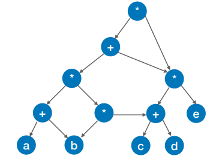
1. 有向无环图描述表达式的解题步骤：
   1. 把各个操作数不重复地排成⼀排；
   2. 标出各个运算符的⽣效顺序（先后顺序有点出⼊⽆所谓）；
   3. 按顺序加⼊运算符，注意“分层”；
   4. 从底向上逐层检查同层的运算符是否可以合并。

### 拓扑排序

1. AOV网（Activity On Vertex NetWork，用顶点表示活动的网）：用 DAG 图（有向无环图）表示⼀个⼯程。顶点表示活动，有向边$<V_i,V_j>$ ,表示活动 $V_i$必须先于活动 $V_j$进⾏。

   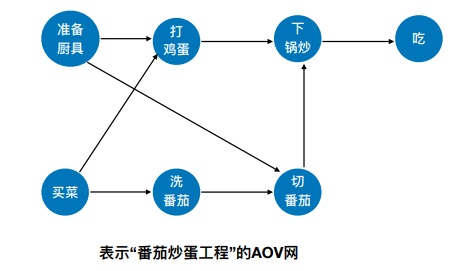

2. 拓扑排序：在图论中，由⼀个有向无环图的顶点组成的序列，当且仅当满⾜下列条件时，称为该图的⼀个拓扑排序：

   1. 每个顶点出现且只出现⼀次；
   2. 若顶点 A 在序列中排在顶点 B 的前⾯，则在图中不存在从顶点 B 到顶点 A 的路径。

   或定义为：拓扑排序是对有向无环图的顶点的⼀种排序，它使得若存在⼀条从顶点 A 到顶点 B 的路径，则在排序中顶点 B 出现在顶点 A 的后⾯。每个 AOV 网都有⼀个或多个拓扑排序序列。

3. 拓扑排序的实现：

   1. 从 AOV 网中选择⼀个没有前驱（入度为0）的顶点并输出。
   2. 从网中删除该顶点和所有以它为起点的有向边。
   3. 重复 ① 和 ② 直到当前的 AOV 网为空或当前网中不存在无前驱的顶点为止。

4. 代码实现拓扑排序（邻接表实现）：

   ````c
   #define MaxVertexNum 100			//图中顶点数目最大值
   
   typedef struct ArcNode{				//边表结点
       int adjvex;						//该弧所指向的顶点位置
       struct ArcNode *nextarc;		//指向下一条弧的指针
   }ArcNode;
   
   typedef struct VNode{				//顶点表结点
       VertexType data;				//顶点信息
       ArcNode *firstarc;				//指向第一条依附该顶点的弧的指针
   }VNode,AdjList[MaxVertexNum];
   
   typedef struct{
       AdjList vertices;				//邻接表
       int vexnum,arcnum;				//图的顶点数和弧数
   }Graph;								//Graph是以邻接表存储的图类型
   
   // 对图G进行拓扑排序
   bool TopologicalSort(Graph G){
       InitStack(S);					//初始化栈，存储入度为0的顶点
       for(int i=0;i<g.vexnum;i++){
           if(indegree[i]==0)
               Push(S,i);				//将所有入度为0的顶点进栈
       }
       int count=0;					//计数，记录当前已经输出的顶点数
       while(!IsEmpty(S)){				//栈不空，则存入
           Pop(S,i);					//栈顶元素出栈
           print[count++]=i;			//输出顶点i
           for(p=G.vertices[i].firstarc;p;p=p=->nextarc){
               //将所有i指向的顶点的入度减1，并将入度为0的顶点压入栈
               v=p->adjvex;
               if(!(--indegree[v]))
                   Push(S,v);			//入度为0，则入栈
           }
       }
       if(count<G.vexnum)
           return false;				//排序失败
       else
           return true;				//排序成功
   }
   ````

### 关键路径

1. AOE 网：在带权有向图中，以顶点表示事件，以有向边表示活动，以边上的权值表示完成该活动的开销（如完成活动所需的时间），称之为⽤边表示活动的网络，简称 AOE网(Activity On Edge NetWork)。

   

2. AOE网具有以下两个性质：
   1. 只有在某顶点所代表的事件发⽣后，从该顶点出发的各有向边所代表的活动才能开始；
   2. 只有在进⼊某顶点的各有向边所代表的活动都已结束时，该顶点所代表的事件才能发生。 另外，有些活动是可以并⾏进⾏的。
3. 在 AOE 网中仅有⼀个⼊度为 0 的顶点，称为开始顶点（源点），它表示整个⼯程的开始； 也仅有⼀个出度为 0 的顶点，称为结束顶点（汇点），它表示整个⼯程的结束。
4. 从源点到汇点的有向路径可能有多条，所有路径中，具有最⼤路径⻓度的路径称为关键路径，⽽把关键路径上的活动称为关键活动。完成整个⼯程的最短时间就是关键路径的长度，若关键活动不能按时完成，则整个 ⼯程的完成时间就会延长。
5. 术语：
   1. 事件$v_k$的最早发生时间$ve(k)$：决定了所有从$vk$ 开始的活动能够开⼯的最早时间。
   2. 事件$v_k$的最迟发生时间 $vl(k)$：它是指在不推迟整个⼯程完成的前提下，该事件最迟必须发⽣的时间。
   3. 活动 $a_i$的最早开始时间$e(i)$：指该活动弧的起点所表示的事件的最早发⽣时间。
   4. 活动$a_i$的最迟开始时间$l(i)$：它是指该活动弧的终点所表示事件的最迟发⽣时间与该活动所需时间之差。
   5. 动 $a_i$的时间余量$d(i)=l(i)-e(i)$，表⽰在不增加完成整个⼯程所需总时间的情况下，活动$a_i$可以拖延的时间若⼀个活动的时间余量为零，则说明该活动必须要如期完成， $d(i)=0$即$l(i)=e(i)$ 的活动$a_i$是关键活动，由关键活动组成的路径就是关键路径。
6. 求关键路径的步骤：
   1. 求所有事件的最早发⽣时间$ve()$：按拓扑排序序列，依次求各个顶点的$ve(k)$，$ve(源点)=0$，$ve(k) = Max\{ve(j) + Weight(v_j, v_k)\}$​,$v_j$为$v_k$的任意前驱。
   2. 求所有事件的最迟发⽣时间$vl()$：按逆拓扑排序序列，依次求各个顶点的$vl(k)$，$vl(汇点)=ve(汇点) $，$vl(k) = Min\{ vl(j) - Weight(v_k, v_j)\}$ ，$v_j$为  $v_k$的任意后继。
   3. 求所有活动的最早发⽣时间 $e()$：若边$<v_k,v_j>$ ,表示活动$a_i$，则有$e(i) = ve(k)$。
   4. 求所有活动的最迟发⽣时间$l()$：若边$<v_k,v_j>$,表示活动$a_i$，则有  $l(i) = vl(j)-Weight(v_k,v_j)$。
   5. 求所有活动的时间余量 $d()$： $d(i) = l(i) - e(i)$。
7. 关键活动、关键路径的特性：
   1. 若关键活动耗时增加，则整个⼯程的⼯期将增⻓。
   2. 缩短关键活动的时间，可以缩短整个⼯程的⼯期。
   3. 当缩短到⼀定程度时，关键活动可能会变成⾮关键活动。
   4. 可能有多条关键路径，只提⾼⼀条关键路径上的关键活动速度并不能缩短整个⼯程的⼯期，只有加快那些包括在所有关键路径上的关键活动才能达到缩短⼯期的目的


# 查找

## 基本概念

1. 查找：在数据集合中寻找满⾜某种条件的数据元素的过程称为查找。

2. 查找表（查找结构）：⽤于查找的数据集合称为查找表，它由同⼀类型的数据元素（或记录）组成。

3. 关键字：数据元素中唯⼀标识该元素的某个数据项的值，使⽤基于关键字的查找，查找结果应该是唯⼀的。

4. 对查找表的常⻅操作：

   1. 查找符合条件的数据元素
   2. 插⼊、删除某个数据元素
      只进⾏查找操作最好使用静态查找表，若需要进⾏大量插入删除操作可使用动态查找表。
1. 查找⻓度：在查找运算中，需要对⽐关键字的次数称为查找⻓度。
2. 平均查找⻓度（ASL, Average Search Length）：所有查找过程中进⾏关键字的⽐较次数的平均值。

$$
ASL=\sum_{i=1}^{n}P_iC_i
$$


## 顺序查找和折半查找

### 顺序查找

1. 顺序查找：⼜叫“线性查找”，通常⽤于线性表。

2. 算法思想：从头到尾挨个找（或者从尾到头）。

3. 时间复杂度为O(n)

4. 代码实现：

   ````c
   typedef struct{				//查找表的数据结构（顺序表）
       ElemType *elem;			//动态数组基址
       int TableLen;			//表的长度
   }SSTable;
   
   //顺序查找
   int Search_Seq(SSTable ST,ElemType key){
       int i;
       for(i=0;i<ST.TableLen && ST.elem[i]!=key;++i);
       // 查找成功返回数组下标，否则返回-1
       	return i=ST.TableLen? -1 : i;
   }
   ````

   哨兵模式

   ````c
   typedef struct{				//查找表的数据结构（顺序表）
       ElemType *elem;			//动态数组基址
       int TableLen;			//表的长度
   }SSTable;
   
   //顺序查找
   int Search_Seq(SSTable ST,ElemType key){
       ST.elem[0]=key;
       int i;
       for(i=ST.TableLen;ST.elem[i]!=key;--i)
       // 查找成功返回数组下标，否则返回0
   	    return i;
   }
   ````

### 折半查找

1. 折半查找：⼜称“⼆分查找”，仅适⽤于有序的顺序表。（顺序表拥有随机访问的特性，链表没有）

2. 代码实现：

   ````c
   typedef struct{
       ElemType *elem;
       int TableLen;
   }SSTable;
   
   // 折半查找
   int Binary_Search(SSTable L,ElemType key){
       int low=0,high=L.TableLen,mid;
       while(low<=high){
           mid=(low+high)/2;
           if(L.elem[mid]==key)
               return mid;
           else if(L.elem[mid]>key)
               high=mid-1;					//从前半部分继续查找
           else
               low=mid+1;					//从后半部分继续查找
       }
       return -1;
   }
   ````
1. 折半查找判定树的构造：$mid=\lfloor(low+high)/2 \rfloor$，如果当前 low 和 high 之间有奇数个元素，则 mid 分隔后，左右两部分元素个数相等；如果当前 low 和 high 之间有偶数个元素，则 mid 分隔后，左半部分⽐右半部分少⼀个元素。
2. 折半查找的判定树中，若$mid=\lfloor (low+high)/2\rfloor$ ，则对于任何⼀个结点，必有：`右⼦树结点数-左⼦树结点数=0/1`
3. 折半查找的判定树⼀定是平衡⼆叉树。折半查找的判定树中，只有最下⾯⼀层是不满的。因此，元素个数为 n 时树⾼$h = \lceil log_2(n + 1)\rceil$
4. 判定树结点关键字：左<中<右，满⾜⼆叉排序树的定义。失败结点：n+1个（等于成功结点的空链域数量）
5. 折半查找的查找效率：折半查找的时间复杂度 $O(log_2n)$

### 分块查找

1. 分块查找所针对的情况：块内⽆序、块间有序。
    

2. 索引表及顺序表代码：

    ````c
    // 索引表
    typedef struct{
        ElemType maxValue;
        int low,high;
    }Index;
    
    // 顺序表存储实际元素
    ElemType List[100];
    ````

3. 查找目标关键字所在分块可使用顺序查找和折半查找两种方式。

4. 若使用折半查找且索引表中不包含⽬标关键字，则最终要停在 low > high，要在 low 所指分块中查找目标关键字。

5. 查找效率分析（ASL）：假设⻓度为 n 的查找表被均匀地分为 b 块，每块 s 个元素。设索引查找和块内查找的平均查找⻓度分别为$L_i$、$L_s$，则分块查找的平均查找⻓度为：$ASL=L_i+L_s$
    

6. ⽤顺序查找查索引表，则$L_I=\frac{1+2+...+b}{b}=\frac{b+1}{2}$,$L_S=\frac{1+2+...+s}{s}=\frac{s+1}{2}$,$ASL=\frac{s^2+2s+n}{2s}$。故当$s=\sqrt{n}$时，ASL最小，为$\sqrt{n}+1$

7. ⽤顺序查找查索引表，则$L_I=\lceil log_2(b+1)\rceil$,$L_S=\frac{1+2+...+s}{s}=\frac{s+1}{2}$,则$ASL=\frac{S+1}{2}+\lceil log_2(b+1) \rceil$


## B树、B+树

### B树

#### B树的基本概念

1. B树，⼜称多路平衡查找树，B树中所有结点的孩⼦个数的最⼤值称为B树的阶，通常⽤m表示。⼀棵m阶B树或为空树，或为满⾜如下特性的m叉树：

   1. 树中每个结点⾄多有 m 棵⼦树，即⾄多含有 m-1 个关键字。

   2. 若根结点不是终端结点，则⾄少有两棵⼦树。

   3. 除根结点外的所有⾮叶结点⾄少有$ \lceil m/2 \rceil$ 棵⼦树，即⾄少含有 $\lceil m/2\rceil-1 $个关键字。（为了保证查找效率，每个结点的关键字不能太少）

   4. 所有⾮叶结点的结构如下：
   
      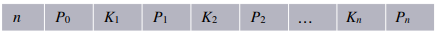
   
      其中，$K_i(i = 1, 2,…, n)$为结点的关键字，且满⾜$K_1 < K_2 <…< K_n$ ；$P_i(i = 0,1,…, n)$为指向⼦树根结点的指针，且指针$P_{i-1}$所指⼦树中所有结点的关键字均⼩于$K_i$ ，$P_i$所指⼦树中所有结点的关键字均⼤于$Ki$，$n(\lceil m/2 \rceil-1\ll n \ll m-1)$为结点中关键字的个数。
   
   5. 所有的叶结点都出现在同⼀层次上，并且不带信息（可以视为外部结点或类似于折半查找判定树的查找失败结点，实际上这些结点不存在，指向这些结点的指针为空）。
   

​		

2. m阶B树的核⼼特性：

   1. 根节点的⼦树数$∈ [ 2 , m ]$，关键字数$∈[1,m−1]$

      其他结点的⼦树数$∈[⌈m/2⌉ , m]$；关键字数$∈[-1, m-1]$。

   2. 对任⼀结点，其所有⼦树⾼度都相同。

   3. 关键字的值：⼦树$0 < 关键字1 < ⼦树1 < 关键字2 < ⼦树2 <…$(类⽐⼆叉查找树左<中<右)

3. B树的⾼度：含 n 个关键字的 m叉B树，最⼩⾼度、最⼤⾼度是多少？
   $log_mn+1≤h≤log_{\lceil m/2 \rceil}\frac{n+1}{2}+1$


#### B树的基本操作

1. B树的查找：B树的查找操作与二叉查找树类似。B树的查找包含两个基本操作：① 在B树中找结点；② 在结点中找关键字。B树常存储在磁盘上，因此前一个查找操作在磁盘上进行，后一个查找操作在内存中进行。在B树中查找到某个结点后，先在有序表中进行查找，若找到则查找成功，否则按照对应指针信息到所指的子树中去查找。查找到叶子结点（对应指针为空指针），则说明树中没有对应的关键字，查找失败。

2. B树的插入：将关键字 key 插入到B树的过程：

   1. 定位：利用B树的查找算法，找到插入该关键字的最底层中的某个非叶子结点。（插入位置一定是最底层的某个非叶子结点！）

   2. 插入：B树中，每个非失败节点的关键字个数都在区间$[ \lceil m/2 \rceil -1,m-1]$内。若插入关键字 key 之后结点关键字个数小于m，则可以直接插入；否则必须对结点进行分裂。

   3. 分裂：从结点的中间位置（$⌈m/2⌉$）将其中的关键字分为两部分，左半部分包含的关键字放到原结点中，右半部分包含的关键字放到新节点中，中间位置（$⌈m/2⌉$）的关键字则插入原节点的父节点。若此时父节点的关键字也超过了上限，则对父节点继续进行分裂操作，直到这个过程传到根节点为止，进而导致B树的高度增加。

      

3. B树的删除：

   1. 非终端结点的删除：使用直接前驱或者直接后继来代替被删除的关键字，转换为删除终端结点。

   2. 终端结点的删除，具体分为三种情况：

      1. 直接删除关键字：若删除关键字所在结点关键字个数$≥⌈m/2⌉$，则可直接删除。

      2. 兄弟够借：若删除关键字所在结点关键字个数$=⌈m/2⌉−1$，且与此结点相邻的左（或右）兄弟结点关键字个数$≥⌈m/2⌉$,则需调整该节点、左（或右）兄弟结点及其双亲结点（父子换位法）以达到新的平衡。

      3. 兄弟不够接：若删除关键字所在结点关键字个数$=⌈m/2⌉−1$，且与此结点相邻的左（或右）兄弟结点关键字个数 $=⌈m/2⌉−1$，则将该节点、左（或右）兄弟结点及其双亲结点中的关键字进行合并。

         


### B+树

1. 一棵m阶的B+树需满足以下条件：
   1. 每个分支节点最多有m棵子树（孩子结点）。
   2. 非叶根结点至少有两颗子树，其他每个分支结点至少有$⌈m/2⌉$棵子树。
   3. 结点的子树个数与关键字个数相同。
   4. 所有叶子结点包含所有关键字及指向相应记录的指针，叶子结点中将关键字按大小排列，并且相邻叶子结点按大小顺序相互链接起来。（说明B+树支持顺序查找）
   5. 所有分支节点仅包含它的各个节点中关键字的最大值及指向其子节点的指针。
      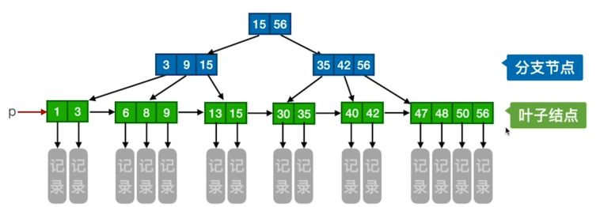

2. 对比 B树：

   |                            m阶B树                            |                           m阶B+树                            |
   | :----------------------------------------------------------: | :----------------------------------------------------------: |
   |                 结点中n个关键字对应n+1棵子树                 |                  结点中n个关键字对应n棵子树                  |
   | 根节点关键字数$n∈[1, m−1]$<br/>其他结点关键字数$n∈[⌈m/2⌉−1,m−1]$ |   根节点关键字数$n∈[1,m]$ <br/>其他点关键字数$n∈[⌈m/2⌉,m]$   |
   |                 各结点包含的关键字是不重复的                 | 叶子结点包含全部关键字，非叶结点出现过的关键字也会出现在叶子结点中 |
   |            结点中包含了关键字对应的记录的存储地址            | 叶子结点包含信息，非叶结点只起索引作用。非叶结点中的每个索引项只含有对应子树的最大关键字和指向该字树的指针，不含有该关键字对应记录的存储地址 |
   | 不支持顺序查找。查找成功时可能停在任何一层结点，查找速度不稳定 | 支持顺序查找。查找成功或失败一定会达到最下一层结点，查找速度稳定 |

   

## 散列查找及其性能分析

### 散列表的基本概念

1. 散列函数：一个把查找表中的关键字映射成该关键字对应的地址的函数，记作$Hash(key)=Addr$
2. 散列函数可能会把两个或两个以上的不同关键字映射到同一地址，称这种情况为冲突。发生碰撞的不同关键字称为同义词。
3. 散列表：根据关键字而直接进行访问的数据结构。散列表建立了关键字和存储地址之间的一种直接映射关系。

### 散列函数的构造方法

1. 直接定址法：直接取关键字的某个线性函数值为散列地址，散列函数为$H(key)=key$ 或$H(key)=a×key+b$。这种方法计算简单，不会产生冲突。缺点是空位较多，会造成存储空间浪费。

2. 除留余数法：假定散列表表长 m，取一个不大于但最接近 m 的质数 p，利用散列函数$H(key)=key\%p$将关键字转换为散列地址。p取质数是因为这样可以使关键字通过散列函数转换后等概率地映射到散列空间上的任一地址。

3. 数字分析法：假设关键字是 r进制数，而r个数码在个位上出现的频率不一定相同，可能在某些位上分布的均匀一些，而在某些位分布的不均匀。此时应选数码分布均匀的若干位作为散列地址。

4. 平方取中法：这种方法取关键字平方值的中间几位作为散列地址，具体取多少位视具体情况而定。这种方法得到的散列地址与关键字的每一位都有关系，因此使得散列地址分布比较均匀。适用于关键字每位取值都不够均匀或均小于散列地址所需的位数。

### 处理冲突的方法

1. 开放定址法：指可存放新表项的空闲抵制既向它的同义词表项开放，又向它的非同义词表项开放。其数学递推公式为：$H_i = (H(key)+d_i)%m$,其中，$H(key)$为散列函数，$i=0,1,2,...,k(k≤m-1)$，m表示散列表表长，$d_i$为增量序列。增量序列通常有四种取法：

   1. 线性探测法：$d_i=0,1,2,...,m-1$。使用方法发生冲突时，顺序查看下一个单元，直到找到一个空闲单元或查遍全表。使用这种方法可能造成大量元素在相邻的散列地址上堆积起来，大大降低了查找效率。使用这种方法删除元素时需要做标记，否则会影响查找元素。
   2. 平方探测法：$d_i=0^2,1^2,-1^2,2^2,-2^2,...,k^2,-k^2$。其中$k≤m/2$，散列表长度m必须是一个可以表示为$4k+3$的质数（符合这个条件才能够探测到所有位置）。使用这种方法可以避免堆积问题。再
   3. 散列法：$d_i=H_2(key)$。当通过第一个散列函数$H(key)$得到的地址发生冲突时，则利用第二个散列函数$H_2(key)$再次计算该关键字的地址。其散列函数为：$H_i=RH_i(key)$。
   4. 伪随机序列法：$d_i$= 伪随机序列。

2. 拉链法：对于不同的关键字通过散列函数映射到同一地址时，为了与避免非同义词发生冲突，可以把所有的同义词存储到一个线性链表中。拉链法适用于经常进行插入和删除的方法。

   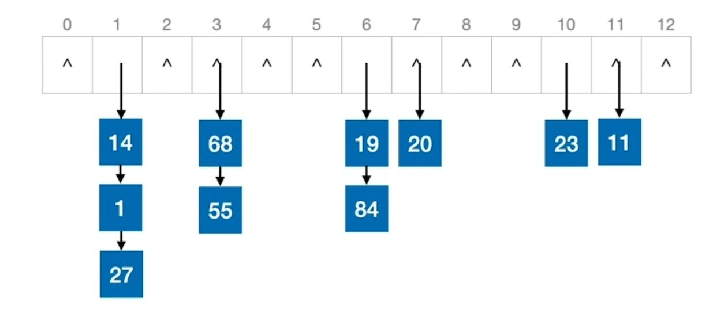

### 散列查找及性能分析

1. 散列查找执行步骤如下：

   1. 初始化：$Addr=Hash(key)$
   2. 检测查找表中地址为 Addr 的位置上是否有记录，若无记录，返回查找失败；若有记录，比较它和 key 的值，若相等则返回查找成功，否则执行步骤③。
   3. 用给定的处理冲突方式计算“下一个散列表地址”，并把 Addr 置为此地址，转入步骤②。

2. 平均查找长度（ASL）：散列表查找成功的平均查找长度即找到表中已有表项的平均比较次数；散列表查找失败的平均查找长度即找不到待查的表项但能找到插入位置的平均比较次数。

   > 例：现有长度为11且初始为空的散列表HT，散列函数$H(key)=key%7$，采用线性探查法解决冲突。将关键字序列87，40，30，6，11，22，98，20 ，38依次插入HT后，HT的查找失败的平均长度是多少？ 查找成功的平均查找长度又是多少？

   答：关键字序列依次插入后，散列表HT如下所示：

   | 散列地址 | 0    | 1    | 2    | 3    | 4    | 5    | 6    | 7    | 8    | 9    | 10   |
   | -------- | ---- | ---- | ---- | ---- | ---- | ---- | ---- | ---- | ---- | ---- | ---- |
   | 关键字   | 98   | 22   | 30   | 87   | 11   | 40   | 6    | 20   | 38   |      |      |
   | 冲突次数 | 0    | 0    | 0    | 0    | 0    | 0    | 0    | 1    | 5    |      |      |

​	$ASL_{查找成功}=(1+1+1+1+1+1+1+2+6)/9=5/3$

​	$ASL_{查找失败}=(10+9+8+7+6+5+4)/7=7$

3. 装填因子：一般计为$\alpha$，即一个表的装满程度。$\alpha=\frac{表中记录数n}{散列表长度m}$


# 排序

##  排序的基本概念

1. 排序：重新排列表中的元素，使表中元素满足按关键字有序的过程。
2. 输入：n个记录$R_1,R_2,...,R_n$，对应的关键字为$k_1,k_2,...,k_n$。输
3. 输出：输入序列的一个重排$R_1',R_2',...,R_n'$，使得$k_1'≤k_2'≤...≤k_n'$
4. 算法的稳定性：关键字相同的元素在使用某一排序算法之后相对位置不变，则称这个排序算法是稳定的，否则称其为不稳定的。稳定的排序算法不一定比不稳定的排序算法要好。
5. 排序算法的评价指标：时间复杂度、空间复杂度、稳定性。
6. 排序算法的分类：
   1. 内部排序： 排序期间元素都在内存中——关注如何使时间、空间复杂度更低。
   2. 外部排序： 排序期间元素无法全部同时存在内存中，必须在排序的过程中根据要求不断地在内、外存之间移动——关注如何使时间、空间复杂度更低，如何使读/写磁盘次数更少。

## 插入排序

### 直接插入排序

1. 算法思想：每次将一个待排序的记录按其关键字大小，插入到前面已经排好序的子序列中，直到全部记录插入完成。

2. 代码实现（不带哨兵）：

   ````c
   // 对A[]数组中共n个元素进行插入排序
   void InsertSort(int A[],int n){
       int i,j,temp;
       for(i=1; i<n; i++){
           if(A[i]<A[i-1]){    	//如果A[i]关键字小于前驱
               temp=A[i];  
               for(j=i-1; j>=0 && A[j]>temp; --j)
                   A[j+1]=A[j];    //所有大于temp的元素都向后挪
               A[j+1]=temp;
           }
       }
   }
   ````

3. 代码实现（带哨兵）：
   ````c
   // 对A[]数组中共n个元素进行插入排序
   void InsertSort(int A[], int n){
       int i,j;
       for(i=2; i<=n; i++){
           if(A[i]<A[i-1]){
               A[0]=A[i];     	//复制为哨兵，A[0]不放元素
               for(j=i-1; A[0]<A[j]; --j)
                   A[j+1]=A[j];
               A[j+1]=A[0];
           }
       }
   }
   ````
   
4. 算法效率分析：

   1. 时间复杂度：最好情况$O(n)$，最差情况$O(n^2)$，平均情况$O(n^2)$。
   2. 空间复杂度：$O(1)$。
   3. 算法稳定性：稳定。
   4. 适用性：适用于顺序存储和链式存储的线性表。

5. 对链表进行插入排序：

   ````c
   //对链表L进行插入排序
   void InsertSort(LinkList &L){
       LNode *p=L->next, *pre;
       LNode *r=p->next;
       p->next=NULL;
       p=r;
       while(p!=NULL){
           r=p->next;
           pre=L;
           while(pre->next!=NULL && pre->next->data<p->data)
               pre=pre->next;
           p->next=pre->next;
           pre->next=p;
           p=r;
       }
   }
   ````

   

###  折半插入排序

1. 算法思路： 每次将一个待排序的记录按其关键字大小，使用折半查找找到前面子序列中应该插入的位置并插入，直到全部记录插入完成

2. 注意：为了保证稳定性，当查找到和插入元素关键字一样的元素时，应该在这个元素的右半部分继续查找以确认位置。即当 $A[mid]==A[0]$时，应继续在mid所指位置右边寻找插入位置。

3. 代码实现：
   ````c
   //对A[]数组中共n个元素进行折半插入排序
   void InsertSort(int A[], int n){ 
       int i,j,low,high,mid;
       for(i=2; i<=n; i++){
           A[0]=A[i];    		     	 //将A[i]暂存到A[0]
               low=1; high=i-1;
           while(low<=high){            //折半查找
               mid=(low+high)/2;
               if(A[mid]>A[0])
                   high=mid-1;
               else
                   low=mid+1;
           }
           for(j=i-1; j>high+1; --j)
               A[j+1]=A[j];
           A[high+1]=A[0];
       }
   }
   ````

4. 与直接插入排序相比，比较关键字的次数减少了，但是移动元素的次数没有变。时间复杂度仍为$O(n^2)$
   

### 希尔排序

1. 算法思路：先追求表中元素的部分有序，再逐渐逼近全局有序，以减小插入排序算法的时间复杂度。

2. 具体实施：先将待排序表分割成若干形如 $L[i,i+d,i+2d,...,i+kd]$的“特殊”子表，对各个子表分别进行直接插入排序。缩小增量d，重复上述过程，直到 d=1 为止。

3. 代码实现：

   ````c
   // 对A[]数组共n个元素进行希尔排序
   void ShellSort(ElemType A[], int n){
       int d,i,j;
       for(d=n/2; d>=1; d=d/2){  	//步长d递减
           for(i=d+1; i<=n; ++i){
               if(A[i]<A[i-d]){
                   A[0]=A[i];		//A[0]做暂存单元，不是哨兵
                   for(j=i-d; j>0 && A[0]<A[j]; j-=d)
                       A[j+d]=A[j];
                   A[j+d]=A[0];
               }
   		}
       }
   }
   ````

4. 算法效率分析：
   1. 时间复杂度：希尔排序时间复杂度依赖于增量序列的函数。最差情况$O(n^2)$，n在某个特顶范围时可达$O(n^{1.3})$
   2. 空间复杂度：$O(1)$。
   3. 算法稳定性：不稳定。
      

## 交换排序

### 冒泡排序

1. 算法思路：从后往前（或从前往后）两两比较相邻元素的值，若为逆序（即$A[i−1]>A[i]$），则交换它们，直到序列比较完。如此重复最多 n-1 次冒泡就能将所有元素排好序。为保证稳定性，关键字相同的元素不交换。

2. 代码实现：

   ````c
   //交换
   void swap(int &a, int &b){
       int temp = a;
       a = b;
       b = temp;
   }
   
   //冒泡排序
   void BubbleSort(int A[], int n){   //从0开始存放
       for(int i=0; i<n-1; i++){
           bool flag = false; // 表示本趟冒泡是否发生交换的标志
           for(int j=n-1; j>i; j--) //一趟冒泡过程
               if(A[j-1]>A[j]){      //若为逆序
                   swap(A[j-1],A[j]);  //交换
                   flag=true;
               }
           if(flag==false)
               return;       //本趟遍历后没有发生交换，说明表已经有序，可以结束算法
       }
   }
   
   
   ````

3. 算法效率分析：
   时间复杂度：最好情况$O(n)$，最差情况$O(n^2)$，平均情况$O(n^2)$
   空间复杂度：$O(1)$。
   稳定性：稳定。
   适用性：冒泡排序可以用于顺序表、链表。

### 快速排序

1. 算法思路：在待排序表$L[1...n]$ 中任选一个元素 pivot 作为枢轴（通常取首元素），通过一趟排序将待排序表分为独立的两部分 $L[1...k−1]$ 和$L[k−1...n]$。使得$L[1...k−1]$中的所有元素小于pivot，$L[k−1...n]$中的所有元素大于等于pivot，则pivot放在了其最终位置$L[k]$上。重复此过程直到每部分内只有一个元素或空为止。

2. 快速排序是所有内部排序算法中性能最优的排序算法。

3. 在快速排序算法中每一趟都会将枢轴元素放到其最终位置上。（可用来判断进行了几趟快速排序）

4. 快速排序可以看作数组中n个元素组织成二叉树，每趟处理的枢轴是二叉树的根节点，递归调用的层数是二叉树的层数。

5. 代码实现：

   ````c
   //用第一个元素将待排序序列划分为左右两个部分
   int Partition(int A[], int low, int high){
       int pivot = A[low];          //用第一个元素作为枢轴
       while(low<high){
           while(low<high && A[high]>=pivot) --high; //high所指元素大于枢轴，high左移
           A[low] = A[high];   //high所指元素小于枢轴，移动到左侧
   
           while(low<high && A[low]<=pivot)  ++low; //low所指元素小于枢轴，low右移
           A[high] = A[low];   //low所指元素大于枢轴，移动到右侧
       }
       A[low] = pivot   //枢轴元素存放到最终位置
       return low；     //返回存放枢轴的最终位置
   } 
   
   //快速排序
   void QuickSort(int A[], int low, int high){
       if(low<high)   //递归跳出条件
           int pivotpos = Partition(A, low, high);   //划分
           QuickSort（A, low, pivotpos - 1);    //划分左子表
           QuickSort（A, pivotpos + 1, high);   //划分右子表
   }
   
   ````
   
   
   
6. 算法效率分析：
   1. 时间复杂度：快速排序的时间复杂度$=O(n×递归调用的层数)$。最好情况$O(nlog_2n)$，最差情况$O(n^2)$，平均情况$O(n^2)$。
   2. 空间复杂度：快速排序的空间复杂度$=O(递归调用的层数)$。最好情况$O(log_2n)$，最差情况$O(n)$，平均情况$O(n^2)$。
   3. 稳定性：不稳定。


## 选择排序

选择排序思想： 每一趟在待排序元素中选取关键字最小（或最大）的元素加入有序子序列。


### 简单的选择排序

1. 算法思路：每一趟在待排序元素中选取关键字最小的元素与待排序元素中的第一个元素交换位置。

2. 代码实现

   ````c
   // 交换a和b的值
   void swap(int &a, int &b){
       int temp = a;
       a = b;
       b = temp;
   }
   
   // 对A[]数组共n个元素进行选择排序
   void SelectSort(int A[], int n){
       for(int i=0; i<n-1; i++){          	//一共进行n-1趟，i指向待排序序列中第一个元素
           int min = i;
           for(int j=i+1; j<n; j++){		//在A[i...n-1]中选择最小的元素
               if(A[j]<A[min])
                   min = j;
           }
           if(min!=i)                     
               swap(A[i], A[min]);
       }
   }
   ````

   3. 算法效率分析：
      时间复杂度：无论待排序序列有序、逆序还是乱序，都需要进行 n-1 次处理，总共需要对比关键字$( n − 1 ) + ( n − 2 ) + . . . + 1 = n ( n − 1 ) / 2$ 次，因此时间复杂度始终是 $O(n^2)$ 
      空间复杂度：$O(1)$
      稳定性：不稳定。
      适用性：适用于顺序存储和链式存储的线性表。

   4. 对链表进行简单的选择排序

      ````c
      void selectSort(LinkList &L){
          LNode *h=L,*p,*q,*r,*s;
          L=NULL;
          while(h!=NULL){
              p=s=h; q=r=NULL;
              while(p!=NULL){
                  if(p->data>s->data){
                      s=p; r=q;
                  }
                  q=p; p=p->next;
              }
              if(s==h)
                  h=h->next;
              else
                  r->next=s->next;
              s->next=L; L=s;
          }
      }
      ````

### 堆排序

1. 堆(heap)：可理解为一棵顺序存储的完全二叉树

   大根堆：完全二叉树中，根 ≥ 左右，即 $L [i] ≥ L [2i] $且 $L[i]≥L[2i+1]$
   小根堆：完全二叉树中，根 ≤ 左右，即 $L[i]≤L[2i] $且$L[i]≤L[21+1] $ $（1 ≤ i ≤ ⌊ n / 2 ⌋ $

2. 算法思路：首先将存放在$L[1...n] $​中的n个元素建成初始堆，由于堆本身的特点，堆顶元素就是最大值。将堆顶元素与堆底元素交换，这样待排序列的最大元素已经找到了排序后的位置。此时剩下的元素已不满足大根堆的性质，堆被破坏，将堆顶元素下坠使其继续保持大根堆的性质，如此重复直到堆中仅剩一个元素为止。

3. 在顺序存储的完全二叉树中：

   - 非终端结点的编号 ：$i≤⌊n/2⌋$
   - i 的左右孩子 ：$2i$和$2i+1$
   - i 的父节点：$⌊i/2⌋$

4. 代码实现

   ````c
   //对初始序列建立大根堆
   void BuildMaxHeap(int A[], int len){
       for(int i=len/2; i>0; i--)   //从后往前调整所有非终端结点
           HeadAdjust(A, i, len);
   }
   
   /*将以k为根的子树调整为大根堆
   从最底层的分支结点开始调整*/
   void HeadAdjust(int A[], int k, int len){
       A[0] = A[k];                      //A[0]暂存子树的根结点
       for(int i=2*k; i<=len; i*=2){     //沿key较大的子结点向下筛选
                                         // i为当前所选根结点的左孩子
                                         //i*=2是为了判断调整后再下一层是否满足大根堆
           if(i<len && A[i]<A[i+1])      //判断：当前所选根结点的左、右结点哪个更大
               i++;                      //取key较大的子结点的下标
           if(A[0] >= A[i]) 
               break;                    //筛选结束：i指向更大的子结点
           else{
               A[k] = A[i];              //将A[i]调整至双亲结点上
               k=i;                      //修改k值，以便继续向下筛选
           }
       }
       A[k] = A[0]                       //被筛选的结点的值放入最终位置
   }
   
   //交换
   void swap(int &a, int &b){
       int temp = a;
       a = b;
       b = temp;
   }
   
   //基于大根堆进行排序
   void HeapSort(int A[], int len){
       BuildMaxHeap(A, len);          //初始建堆
       for(int i=len; i>1; i--){      //n-1趟的交换和建堆过程
           swap(A[i], A[1]);          //堆顶元素和堆底元素交换
           HeadAdjust(A,1,i-1);       //把剩余的待排序元素整理成堆
       }
   }
   ````

   5. 算法效率分析：
      - 时间复杂度：$O(nlog_2n)$。建堆时间 $O(n)$，之后进行$ n-1 $次向下调整操作，每次调整时间复杂度为 $O(log_2n)$空
      - 间复杂度：$O(1)$。
        稳定性：不稳定。
        堆的插入：对于大（或小）根堆，要插
   6. 堆的插入：对于大（或小）根堆，要插入的元素放到表尾，然后与父节点对比，若新元素比父节点更大（或小），则将二者互换。新元素就这样一路“上升”，直到无法继续上升为止。
   7. 堆的删除：被删除的元素用堆底元素替换，然后让该元素不断“下坠”，直到无法下坠为止。


##  归并排序和基数排序

### 归并排序

1. 归并（Merge）：把两个或多个已经有序的序列合并成一个新的有序表。k路归并每选出一个元素，需对比关键字k-1次。

2. 算法思想：把待排序表看作 n 个有序的长度为1的子表，然后两两合并，得到$\lceil n/2\rceil $个长度为2或1的有序表……如此重复直到合并成一个长度为n的有序表为止。

3. 代码实现

   ````c
   //创建辅助数组B
   int *B=(int *)malloc(n*sizeof(int));
   
   //A[low,...,mid],A[mid+1,...,high] 各自有序，将这两个部分归并
   void Merge(int A[], int low, int mid, int high){
       int i,j,k;
       for(k=low; k<=high; k++)
           B[k] = A[k];           //将A中所有元素复制到B中
       for(i=low, j=mid+1, k=i; i<=mid && j<= high; k++){
           if(B[i]<=B[j])          //为保证稳定性两个元素相等时，优先使用靠前的那个
               A[k]=B[i++];        //将较小值复制到A中
           else
               A[k]=B[j++];
       }//for
        
       //没有归并完的部分复制到尾部，while只会执行一个 
       while(i<=mid)  A[k++]=B[i++];     //若第一个表未检测完，复制
       while(j<=high) A[k++]=B[j++];     //若第二个表未检测完，复制
   }
   
   //递归操作
   void MergeSort(int A[], int low, int high){
       if(low<high){
           int mid = (low+high)/2;    //从中间划分
           MergeSort(A, low, mid);    //对左半部分归并排序
           MergeSort(A, mid+1, high); //对右半部分归并排序
           Merge(A,low,mid,high);     //归并
       }if
   }
   
   
   
   ````

4. 算法效率分析：
   - 时间复杂度：每趟归并时间复杂度$O(n)$，需要进行$\lceil log_2n\rceil$趟归并（将归并过程看作倒立的二叉树），所以时间复杂度为 $O(nlog_2n)$
   - 空间复杂度：$O(n)$。
   - 稳定性：稳定。


###  基数排序

1. 算法思想：把整个关键字拆分为d位，按照各个关键字位递增的次序（比如：个、十、百），做d趟“分配”和“收集”，若当前处理关键字位可能取得r个值，则需要建立r个队列。
2. 分配：顺序扫描各个元素，根据当前处理的关键字位，将元素插入相应的队列。一趟分配耗时$O(n)$。
3. 收集：把各个队列中的结点依次出队并链接。一趟收集耗时$O(r)$。
   

4. 基数排序擅长处理的问题：
   - 数据元素的关键字可以方便地拆分为d组，且d较小。
   - 每组关键字的取值范围不大，即r较小。
   - 数据元素个数n较大。
5. 算法效率分析：算法效率分析：
   - 时间复杂度：一共进行d趟分配收集，一趟分配需要  $O(n)$，一趟收集需要$O(r)$，时间复杂度为 $O[d(n+r)]$，且与序列的初始状态无关.
   - 空间复杂度：$O(r)$，其中r为辅助队列数量。
   - 稳定性：稳定。


## 内部排序算法总结

### 内部排序算法比较

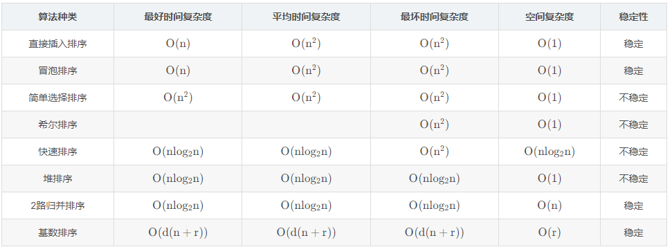

### 内部排序算法的应用

1. 选取排序方法需要考虑的因素：
   - 待排序的元素数目n。
   - 元素本身信息量的大小。
   - 关键字的结构及其分布情况。
   - 稳定性的要求。
   - 语言工具的条件，存储结构及辅助空间的大小等。
2. 排序算法的选择：
   - 若n较小，可采用 直接插入排序 或 简单选择排序。由于直接插入排序所需的记录移动次数较简单选择排序的多，因而当记录本身信息量较大时，用简单选择排序较好。
   - 若文件的初始状态已按关键字基本有序，则选用直接插入排序或冒泡排序为宜。
   - 若n较大，则应采用时间复杂度为 $O(nlog_2n)$的排序方法：快速排序、堆排序 或 归并排序。快速排序被认为是目前基于比较的内部排序方法中最好的方法，当待排序的关键字随机分布时，快速排序的平均时间最短。堆排序所需的辅助空间少于快速排序，并且不会出现快速排序可能出现的最坏情况，这两种排序都是不稳定的。若要求排序稳定且时间复杂度为  $O(nlog_2n)$，则可选用归并排序。但本章介绍的从单个记录起进行两两归并的排序算法并不值得提倡，通常可以将它和直接插入排序结合在一起使用。先利用直接插入排序求得较长的有序子文件，然后两两归并。直接插入排序是稳定的，因此改进后的归并排序仍是稳定的。
   - 在基于比较的排序方法中，每次比较两个关键字的大小之后，仅出现两种可能的转移，因此可以用一棵二叉树来描述比较判定过程，由此可以证明：当文件的n个关键字随机分布时，任何借助于“比较”的排序算法，至少需要$O(nlog_2n)$的时间。
   - 若n很大，记录的关键字位数较少且可以分解时，采用 基数排序 较好。
   - 当记录本身信息量较大时，为避免耗费大量时间移动记录，可用链表作为存储结构。


## 外部排序

### 外部排序的基本概念和方法

1. 外部排序：对大文件进行排序时，因为文件中的记录很多、信息量庞大，无法将整个文件复制进内存中进行排序。因此需要将待排序的记录存储在外存上，排序时再把数据一部分一部分地调入内存进行排序，在排序过程中需要多次进行内存和外存之间的交换。
2. 外部排序的步骤：① 跟据内存缓冲区大小，将外存上的文件分成 r 个子文件，依次读入内存并利用内部排序方法对它们进行排序，并将排序后得到的有序子文件重新写回外存（归并段）。② 对这些归并段进行 S 趟 k 路归并，使归并段（有序子文件)逐渐由小到大，直至得到整个有序文件为止，其中$S=\lceil log_kr\rceil$（需要在内存中分配k个输入缓冲区和1个输出缓冲区）
3. 如何进行 k 路归并：① 把k个归并段的块读入k个输入缓冲区。 ② 用“归并排序”的方法从k个归并段中选出几个最小记录暂存到输出缓冲区中。 ③ 当输出缓冲区满时，写出外存。
4. 外部排序时间开销 = 读写外存的时间 + 内部排序所需时间＋内部归并所需时间
5. 优化：
   - 增加归并路数k，但是需要增加相应的输入缓冲区，且每次从k个归并段中选出一个最小元素需要对比 (k-1) 次。
   - 减少初始归并段数量r。

### 败者树

1. 败者树解决的问题：使用多路平衡归并可以减少归并趟数，但是从 k 个归并段选出一个最小元素需要对比关键字 (k-1) 次，构造败者树可以使关键字对比次数减少到$ \lceil log_2k\rceil$。
2. 败者树可视为一棵完全二叉树（多了一个头头）。k个叶结点分别对应k个归并段中当前参加比较的元素，非叶子结点用来记忆左右子树中的“失败者”，而让胜者往上继续进行比较，一直到根结点。
   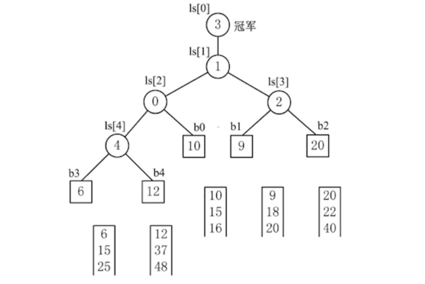


### 置换-选择排序（生成初始归并段）

1. 置换-选择排序：产生更长的初始归并段，从而减少初始归并段数量。

2. 设初始待排文件为FI，初始归并段输出文件为FO，内存工作区为WA，FO和WA的初始状态为空，WA可容纳w个记录。

3. 置换-选择算法的步骤如下：

   1. 从FI输入w个记录到工作区WA。

   2. 从WA中选出其中关键字取最小值的记录，记为MINIMAX记录。

   3. 将MINIMAX记录输出到FO中去。

   4. 若FI不空，则从FI输入下一个记录到WA中。

   5. 从WA中所有关键字比MINIMAX记录的关键字大的记录中选出最小关键字记录，作为新的MINIMAX记录。

   6. 重复③~⑤，直至在WA中选不出新的MINIMAX记录为止，由此得到一个初始归并段，输出一个归并段的结束标志到FO中去。

   7. 重复②~⑥，直至WA为空。由此得到全部初始归并段。

      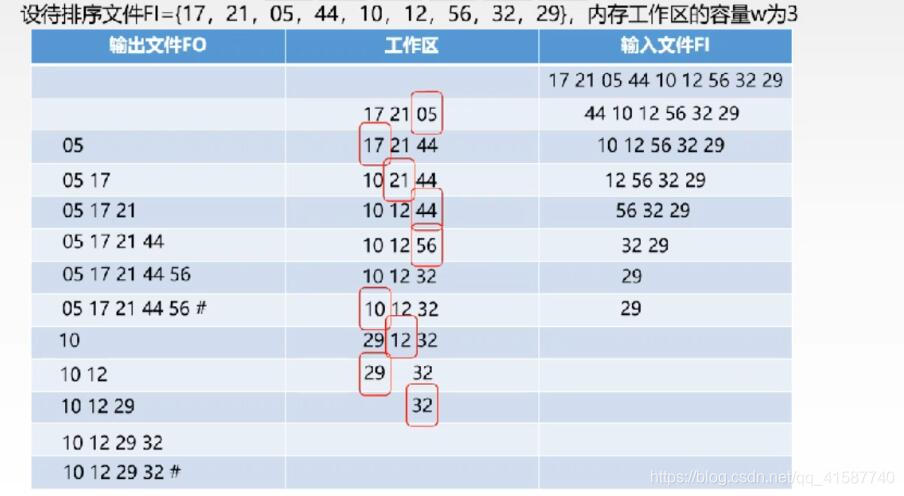

### 最佳归并树

1. 最佳归并树：调整多个初始归并段进行多路归并时的顺序，从而减少多路归并时I/O次数。
2. 理论基础：每个初始归并段对应一个叶子结点，把归并段的块数作为叶子的权值，归并树的WPL = 树中所有叶结点的带权路径长度之和。归并过程中的磁盘I/O次数 = 归并树的WPL * 2。
3. 注意：k叉归并的最佳归并树一定是严格k叉树，即树中只有度为k、度为0的结点。
4. 构造k叉哈夫曼树：每次选择k个根节点权值最小的树合并，并将k个根节点的权值之和作为新的根节点的权值。
5. 补充虚段：
   1. 若$(初始归并段数量-1)\%(k-1)=0$，说明刚好可以构成严格k叉树，此时不需要添加虚段。
   2. 若$(初始归并段数量-1)\%(k-1)=u≠0$，则需要补充 $(k-1) - u$个虚段。
