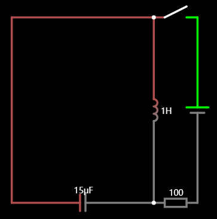
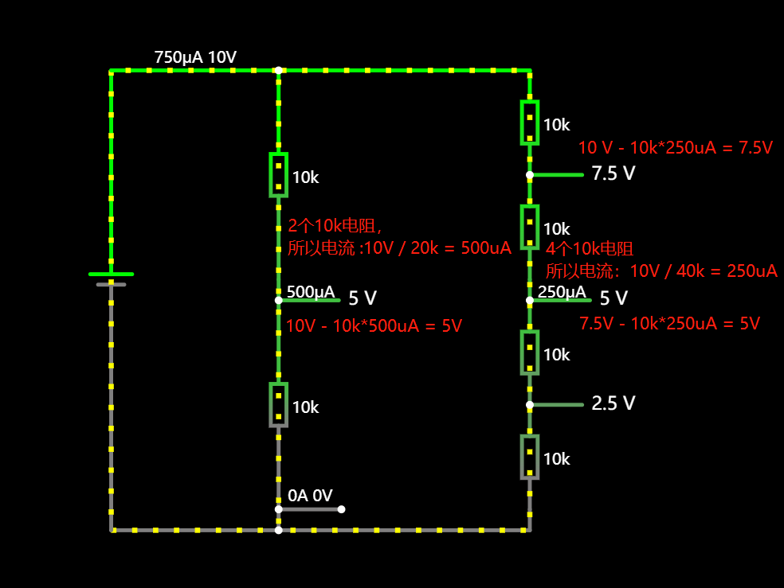

电阻：阻碍电子的流动

电容：防止电压的突变

电感：防止电流的突变

长正短负

## LRC振荡电路

当电源接通时，电感充电；当电源关闭时，电感中的能量流入电容，电流正向流动，当电感中没有能量时，电容中的能量流入电感，电流反向流动，循环往复

## 分压电路

如果只看导线1：电流为500uA

导线2：电流为250uA

总电流：500+250

电阻：串联分压，并联分流

电池：串联增加电流，并联增加容量

12580 mWh

P = IU

12580 / 3.7v = 3400

## 三极管

三极管由电流控制，base需要电流的流动

MOS管由电压控制，不需要电流，更加省点

