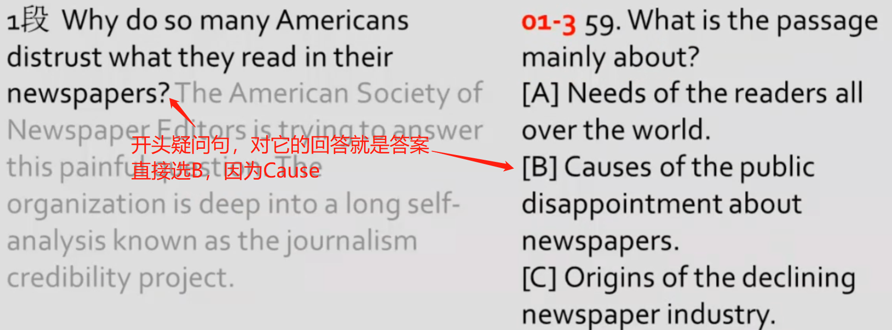

# 阅读

六大题型：主旨，细节，态度，词汇，推理，例证

分析题型很重要，不同的题型用不同的方式解题

# 细节题

细节题定位的句子就是正确答案

例证题定位的句子不是正确答案

梳理句中相同或相反的逻辑

找到相同的逻辑，前后逻辑相同，后句重复是因为观点重要，可推断出段落的中心思想，进而推出文章的中心思想

---------------------

遇到because

因果关系：because 、since、as、for 他们都有因为的意思

since、as、for在作介词时有很多意思，在作连接词时有因为的意思；

如何分辨是介词还是连接词？

1. 介词：介词后面是非句子
2. 连接词：连接词后面是句子  
3. 如何分辨是否是句子？句子中必须有谓语动词，如果没有谓语动词则说明不是句子

defive from;originate from;stem from;result from 后面也接因为

owing to；due to；attribute to；  归因于

contribute to；  导致了……结果

同样定语从句也表示因果关系(起解释说明的意思)

因果关系解题方法：问什么答什么

 

-----------------------

找到感情色彩鲜明的形容词或副词，通过这些词可以提现出来文章的意思

括号中的内容一定要读

考场之上无跳读

技巧：名词不认识可以用sth/sb代替

动词不认识可以用do代替

-------------------

be + adj + of == 形容词的动词形式；如：is supportive of == support

（套路）  作者的观点往往与大众的观点相反；

寻找最佳答案，而不是正确答案

**互为相反的选项往往有正确答案**

------------------------

**干扰选项特征**

1. 正反混淆
2. 偷换概念
3. 答非所问
4. 不同内容嫁接(拼凑)
5. 非最佳答案
6. 绝对化用词：only /must /exclusively /never /all /最高级——往往不选，除非原文中提到
   1. 选项中出现这类词，要注意；原文中如果出现，标记下来

常用比较级来设置干扰选项；选项中出现比较级要慎选

**正确答案特征**

1. 同义改写
2. **与中心思想密切相关**，最佳答案往往 与中心思想一致；**细节服从主旨**
   1. 遇到答案在原文中都有体现，选择最贴合主旨的答案
3. 语气缓和：some/may/partly

# 例证题

1. 标志：example /case /illustrate /demonstrate /to show /**to** ____
2. 例子本身不重要，重要的是例子所支持的观点；观点一般在例子前，有时也在例子后。
3. 干扰选项：就事论事 (讲例子本身)
4. 总结：**讲例子本身的就是错误答案，正确答案在例子之前或之后   (排除与原文例子中有相同的答案)**

例证题定位的句子不是正确答案

Paragraphs 2 and 3 are written **to** ___?   这是一个例证题

# 中心思想题

**正确方法**

1. 标志：mainly about / mainly  discuss / the best title / the purpose
2. 方法 
   - 串线(普遍适用)：将各段首末句串联成一个整体，**注意转折处**  (因为首句或末句一般是段落的中心思想，各个段落的中心思想就是文章的中心思想)
   - 中心句(看形式)：
     - 文章开头的提问**?**，对它的回答，才是文章的中心   
     - 独句段  (一个段落只有一句话，说明这个句子很重要)
   - 中心词(最直观)：文章中反复高频出现的词； 
     - 但是中心词可能是多个，要找到最能概况的哪个词
     - 中心词可能出现改写

**中心思想题干扰选项特征**

1. 范围太小 ——片面

2. 范围太大——回头作文(以选项为题目，自己构思一篇作文，与原文匹配，如果合适则是正确答案)

   

# 作者态度题

1. 标准：attitude / deem / consider / tone   tone：语气，语调
2. 方法：选项词汇归纳
   1. 正面态度类词汇
      - positive 积极 / optimistic 乐观 / approval 支持 / supportive 支持
   2. 负面态度类词汇
      - negative 消极 / pessimistic 悲观 / disapproval 反对 / critical 批评 / doubtful怀疑 / suspicious 怀疑 / skeptical 怀疑 / questionable 怀疑
   3. 中立态度类词汇
      -  neutral 中立 / objective 客观 / impartial 整体 / **disinterested 中立**
   4. **不可能选的**
      - Uninterested 不感兴趣 / unconcerned 不感兴趣 / indifferent 不感兴趣  
      - confused迷惑 / puzzled 迷惑 
      - biased 偏见 / prejudice 偏见 / contemptuous 偏见 / subjective 主观(偏见)

3. 当作者的态度没有明确提出时：
   1. 文章的框架——串线，各段首末句
   2. adj / adv
   3. 转折处 however / but / now
   4. 情态动词之后（should / must / could ……）

# 词汇猜测题

词汇猜测题做题方法：

1. 通过定位好的句子，根据逻辑关系找同义词或反义词。提炼出不断重复的内容（细节服从主旨）
2. 干扰选项的特点：表面意思，表面意思往往是错误答案

# 推理题

1. 标志：infer / imply / suggest / learn from / conclude
2. 方法：
   1. 同义改写——细节 + 主旨 + 逻辑
   2. 逻辑取反——推理多在转折处

  

 

# 标点符号的运用

**逗号**：两个逗号之间，或一个逗号之后为补充说明的成分，非主干(插入语)

**冒号**：冒号前后，一般是从抽象到具体，冒号后面的内容解释前面的内容 (冒号后面的内容 = 冒号前面的内容  )

**分号**：分号前后为并列关系；分号前面不懂看分号后面，分号后面不懂看分号前面 (分号后面的内容 = 分号前面的内容  )

 

**问号**：与中心密切相关

~~**引号**~~：

1. 引用
2. 反语或语意转移

