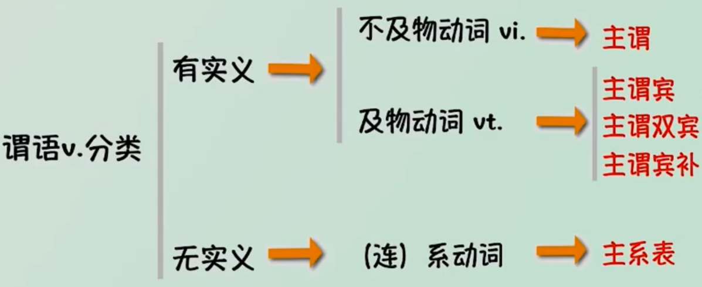
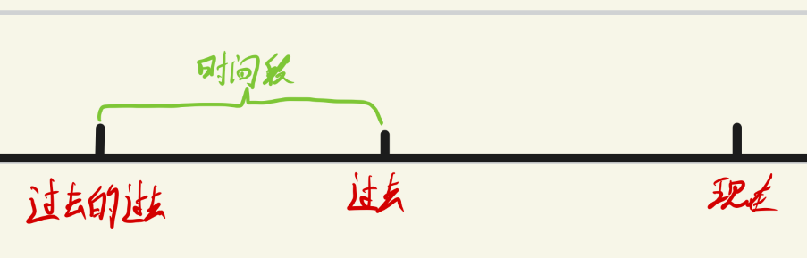
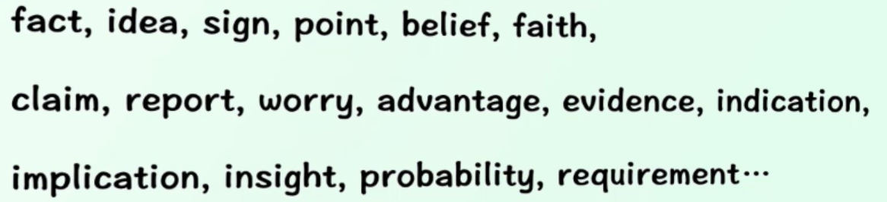
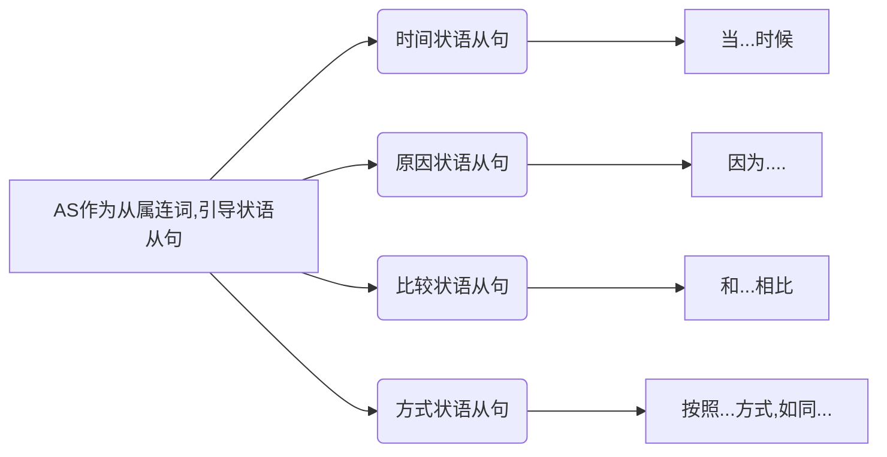

比较级 + and + 比较级 ：越来越……

# 动词

## 动词的分类

**一个简单句有一个谓语动词，但是一个谓语动词不一定是一个词**

### 实义动词 

也叫做行为动词，分为及物动词和不及物动词

### 系动词

**be与be的八种形式：**be、am、is、are、was、were、been、being

1. 原型 be 用在助动词和情态动词后面，或者用在动词不定式中
2. 第一人称用am，第三人称 is，You和复数用are
3. 单数的过去形式 was，复数的过去形式 were
4. 过去分词 been
5. 现在分词being

**其他系动词：**

1. 感官：look、sound、taste、smell、feel
2. 状态：keep、stay、remain、stand、lie
3. 变化：get、become、grow、turn、go、come、fall
4. 显得：appear、seem
5. 终止：prove、turn out

**助动词：**助动词没有意义，作用是帮助实义动词或系动词构成复合谓语，或构成疑问句、否定句、时态语态和语气

1. 常用的助动词有：be、do、have、will、would、shall、should

   ​	注意：be(其他形式)、do(did、does)、have(has、had)没有实际意义

2. 助动词的特点：

   1. 没有实际意义
   2. 不能单独使用，必须帮助构成其他各种结构
   3. 没有专门的助动词

**情态动词：**作用就是根在动词原型(包括动词短语、系动词be)构成复合谓语，情态动词本身有意义但不完整

1. 常见的情态动词：can、could、may、might、should、must、hare to、dare、need`s不必、had better最好、ought to应该、be able to = can

 

| 现在时 | 过去时   | 进行时 | 单三 | 过去分词 |
| ------ | -------- | ------ | ---- | -------- |
| do     | did      | doing  | does | done     |
| be     | was/were |        |      | been     |
| have   | had      |        | has  | had      |
| go     | went     |        | goes | went     |

## 动词的形式

**动词原型**

**第三人称单数：**

1. 直接动词结尾+s：ask->asks
2. 以s、x、ch、sh、o结尾 + es：watch->watches
3. 辅音字母加y结尾，变y为i + es：try->tries
4. 不规则变化：have->has,be->is

**动名词和现在分词**

1. 词尾+ing：play->playing
2. 词尾是e去掉e+ing：ride->riding
3. 词尾是ie把ie变y+ing：tie->tying

**过去式和过去分词**

1. 动词+ed

2. e结尾+d

三态一否：时态、情态、语态、否定、强调

## 动词的时态

|          |   过去的过去   |        过去        |        现在         |                  将来                   |               过去的将来                |
| :------: | :------------: | :----------------: | :-----------------: | :-------------------------------------: | :-------------------------------------: |
| **一般** |                |      **did**       |     **do/does**     | **will do** / **am/is/are going to do** | **would do** / **was/were going to do** |
| **进行** |                | **was/were doing** | **am/is/are doing** |              will be doing              |             would be doing              |
| **完成** |                |    **had done**    |  **hava/has done**  |             will hava done              |             would hava done             |
| 完成进行 | had been doing |  hava been doing   |                     |          will hava been doing           |          would hava been doing          |

> 不管表达时态的谓语动词是几个单词，都算作为一个整体，即一个谓语动词；注意：在多个谓语动词中间可能有副词

 

### 一般时态   

**一般过去时** 谓语动词变过去式

### 进行时态 

### 完成时态

1. “完成” $≠$ 都做完了
2. 完成包含两方面：
   - 全部完成
   - 部分完成
3. 完成时态主要表达一件事情的“完成结果”
4. 截止到目前的时间点，看之前 就是完成 时态
5. 强调的是一个时间段
6. 阶段性总结 (截止到现在、截止到二月、截止到2050年……)用对应的完成时态

**过去完成时** ：`had + done` ，过去的之前

eg：

1. By 2020 they <u>had finished</u> 30% of the research 截止到2020年，他们的研究完成了30%

   2020年为过去，过去的他们已经完成了30%；属于过去的之前，所以使用过去完成时

2. When he came，she <u>had</u> already <u>left</u>. 当他到的时候，她已经离开了

   came 为过去时态，他过去来的，她已经走了，发生在过去的过去

3. Many <u>said</u> that unemployment … <u>had improved</u> them in some ways… 

   一般过去 vs 过去完成；说发生在过去，而提升是已经发生了的

**现在完成时**：`have / has +done`

到现在为止，已经做的；

站在现在，看之前

eg：

1. …since 2010，drought and insects <u>have killed</u> over 100 million trees in California… 截止2010年，干旱和昆虫已经杀死了超过一亿课树

   since 一般表示的是截止到目前时间

2. This “brain drain” <u>has</u> long <u>bothered</u> policymakers in poor countries。人才流失将时间困扰了贫困国家的政策决策者

|            | **现在完成时**                                              | **一般过去时**          |
| ---------- | ----------------------------------------------------------- | ----------------------- |
| **宏观上** | 从过去到现在 (过去有，现在也有)                             | 过去 (过去有，现在没有) |
| **微观上** | 现在全部完成，可以换成过去时 现在没完成，不能换成过去时 |                         |

**将来完成时**：`will have done`  注意：have不能变

截止将来的过去

### 完成进行时态

1. 完成时态 + 进行
2.  在某时间的之前，强调一件事进行的过程
3. 统一公式：`have been doing`  have 根据时间进行调节

**过去完成进行时**：`had been doing`

eg：

1. The world art market <u>had</u> already <u>been losing</u> momentum for a while after rising bewilderingly since 2003.

   

**现在完成进行时**：`have/has been doing`

eg：

1. the attention <u>has been rising</u> steadily in recent week.  在最近的几个星期，注意力稳定持续的上升

   **has been rising** 什么东西正在持续上升，作文中可以使用

## 动词的情态

**情态动词+动词原型**：情态动词后面必须是原型，be也是原型不能是am/is/are

情态只有现在时和过去时

| **现在时** | **过去时** |
| :--------: | :--------: |
|    must    |     -      |
|    can     |   could    |
|    will    |   would    |
| ~~shall~~  |   should   |
|    may     |   might    |

**情态动词变否定**:`情态动词 + not`

**情态动词变疑问**:`情态动词前提`

have to :不得不

ought to：应该

## 动词的语态

**被动语态** ：`be +done`

考虑：

1. 被动的动作 `done`
2. 被动的时间 `be`
3. 主语的单复数

**被动与时态结合**

其中只有**done变化**

|          | **过去**                | **现在**                 | **将来**         | **过去将来**     |
| -------- | ----------------------- | ------------------------ | ---------------- | ---------------- |
| **一般** | `were/was + done`       | `am/is/are + done`       | `will be + done` | `would be +done` |
| **进行** | `were/was being + done` | `am/is/are being + done` |                  |                  |
| **完成** | `had been + done`       | `have/has been +done`    |                  |                  |

**被动与情态结合**

be 必须为原型 `情态动词 + be + done`

## 否定

**实义动词变否定**：`do/does/did + not +动词原型`

eg：

1. A few decades ago,many people <u>didn`t drink</u> water outsider of a meal 在几十年前，很多人不在吃饭的时间之外喝水
2. We <u>don`t need</u> more categories

**助动词和情态动词变否定**：`助动词/情态动词 + not` （be动词、情态动词、完成时中的have等）

eg：

1. thinner <u>isn't</u> always better.

如果有多个词出现，not放在第一个后面

1. I will not be waiting for you

 

# 主语、宾语、表语

1. **先找谓语动词，然后主语谓语表语就非常清楚了**

2. **完整的找到主语、谓语、宾语，可能有多个词构成**

**主语、谓语、宾语可以是**

1. 名词/代词
2. 非谓语动词 doing
3. 非谓语动词 to do
4. 并列多个
5. 从句

## 名词/代词

## 非谓语动词 doing

**doing作主语**：可以是单个doing，也可以是doing词组

eg：

1. `Monitoring` is the first step on the road to reduction.   Monitoring作主语

2. …`amplifying age and sex differences` became a dominant children's marketing strategy. 

   amplifying age and sex differences作主语，doing 的词组

3. `Impulsive spending` isn’t an option.  doing 的词组

 **doing作宾语**：

## 非谓语动词 to do

**预见it … to… 的句型，首先想it是形式主语或宾语**

**to do作主语**：to do作主语 和 doing作主语意思一样

eg：

1. `To beat plastic` is easy     也可以变化为  It‘s easy `to beat plastic`. it 作形式主语

2. `It` takes a while `to jude complex aspects of personality…` 判断性格上的复杂方面会花费一段时间

   ​	**while**：n一段时间；连词 当……时候，尽管

句型：

1. `It is adj.(for sb) to do sth ` 作…(对…)是…的
2. `It takes (sb.) some time to do sth` 花费某人多长时间去做某事

**to do作宾语**

eg:

1. Today many people find `it` difficult `to trust their own opinion and seek balance by gaining objectivity from external sources`. 今天，许多人发现很难相信自己的观点，并通过从外部来源获得客观性来寻求平衡，gaining 获得

   it 作形式宾语

## 并列多个

多个词或词组并列为一个主语/宾语/表语

eg：

1. however，`Google and other big tech providers` monitor their efficiency closely…  然而，谷歌和其他大型科技提供商密切监控着它们的效率

   两个名词并列作主语

2. `Buying gifts or giving to charity` is often more pleasurable than purchasing things for oneself 买礼物或捐给慈善机构往往比给自己买东西更令人愉快

   两个doing短语通过or连接作主语

   

# 其他词

## 形容词副词

==形容词修饰名称，副词修饰其他词==

eg：

1. The `angry` boy shouted `angrily`. 生气的男孩生气地喊

### **比较级**

**原级比较**：`as + adj./adv.原型(比较的内容) + as + 比较的对象` 表示“和……相比一样的……”

eg：

1. The supermarket is designed to lure customers into spending `as much time as` possible within its doors. 超市旨在吸引顾客尽可能多地在店里逗留。

**比较级**：`adj./adv.的比较级 + （than 比较的对象）` 表示“(和…相比)更…”，通常用于==两者之间==的比较

==比较级是在形容词或副词词尾加er或是前加more==

eg：

1. Today，we are much `more rigid` about immigrants. 今天，我们关于移民更加严格

2. machines can perform much `better` at `than human beings`.

**更高级**：`adj./adv.的最高级(+比较的对象，通常用介词短语表示范围)` 表示“(…范围内)最…”，通常用于==三者或以上==的比较

==更高级是在形容词或副词词尾加est或是前加most==

eg：

1. the `biggest` problem at the moment is nota lack of demand but a lack of good work to sell  目前最大的问题不是缺乏需求，而是缺乏好的作品可以出售 

2. The `most immediate` changes will be ovserved in skill level,strength and inches lost.   最直接的变化将观察到技术水平，力量和英寸损失。 

## 介词

`介词+名词/代词/doing = 介词词组`

### 表示时间的介词

|     介词     |        表达含义         |
| :----------: | :---------------------: |
|   at/on/in   | 在…时间点/时间上/时间内 |
| before/after |    在…时间之前/之后     |
| form，since  |        自从…时间        |
|  by，until   |    截止到(直到)…时间    |
|     for      |        持续…时间        |
|    during    |         在…时间         |

eg:

1. `For` the rest of the decade she apparently managed both roles without attracting much criticism 在这十年剩下的时间里，她显然同时扮演了这两个角色，并没有招致太多批评 

   for 持续了多长时间

### 表示地点范围的介词

点面体：at 在某个小点；on 在某面；in在某个东西里面

|                 介词                  |                   表达含义                    |
| :-----------------------------------: | :-------------------------------------------: |
|                at / in                |              在……地点 / 在……里面              |
| on，above，over / under,below,beneath |                在……上面 / 下面                |
|         in front of / behind          |                在……之前 / 之后                |
|       near / by，beside,next to       |              在……附近 / 在……旁边              |
|            between，among             | 在……之间（between 两者之间，among三者及以上） |
|                around                 |                   在……周围                    |
|             into / out of             |           进入……里面 / 从……里面出去           |
|              onto / off               |               到……上面 / 脱离……               |
|         across，through/past          |                穿过… / 经过……                 |
|                 along                 |                    沿着……                     |
|           from / to,towards           |               来自…… / 朝着……去               |
|                beyond                 |                  超过，超出                   |

eg：

1. Yet the link `between` feeling good and spending money `on others` can be seen `among` rich and poor people…… 然而，感觉良好和为他人花钱之间的联系在富人和穷人中都可以看到  两者用between，rich和 poor people 是很多人 所以使用among

### 其他的介词

|         介词         |                           表达含义                           |
| :------------------: | :----------------------------------------------------------: |
|          of          |                            ……的……                            |
|        about         |                            关于……                            |
|    with / without    |                     伴随着有…… / 没有……                      |
|         for          | 为了……（表示目的） 应为……（表示原因） 对于……（表示对象） |
|          by          | 通过……方法或方式 被……做（被动语态 + by +动作的发出者） **相差了……**（表示变化的差额） |
|          as          |                 作为…… 像……一样，如同……                 |
|         like         |                           像……一样                           |
| despite，in spite of |                             尽管                             |

despite，in spite of 和 though / although的区别

1. despite，in spite of 是介词 接 名称/代词/doing
2. though / although 是连词 接 句子

eg：

1. increasing GDP `by` 0.6% GDP**上升了**0.6%
2. increasing GDP `to` 0.6% GDP**上升到**0.6%

 

## 非谓语动词

**特别需要注意ed结尾的动词，如果意思是主动的就是谓语，如果意思是被动的就是非谓语**

非谓语的三种形式： doing / done / to do

**非谓语动词的用途？**

1. 非谓语动词相当于名词，作主/宾/表语

2. 非谓语动词修饰名词/句子，作定语/状语

doing / done / to do这三种形式如果==单独==出现，前面没有其他动词，才是非谓语动词

**非谓语动词作主/宾/表语** ： 只有 doing / to do 可以，done不可以

**非谓语动词作定语修饰名词**

1. doing done如果是单个的词 可以放在名词前，如果是一个词组则放词组后

2. 而to do本身就是词组 所以放名词后

eg：

1. This `proposed` mandate was born of frustration. 这一被提议的指令源于一次挫折
2. It is the firest worldwide epidemic `designated by the World Health Organization in 41 years` 这是世界卫生组织41年来第一次的世界流行病      是个词组放在名词后面

**非谓语动词作状语修饰句子**

eg:

1. `Looking around` ,I despaired at the singular lack of imagination about girls' lives and intrests 环顾了四周，由于异常缺乏对女生生活和兴趣的想象力，我感到很绝望.    

   主动的环顾，使用Looking

2. `Viewed in this light`,guilt is an opportunity.  从这个角度看，内疚是一个机会

## 同位语

同位语，用来解释说明名词，通常放在其解释的名词之后。可以是一个词，一个词组，一句话

1. 解释说明名称
2. 放在所解释的名词后(句中，句尾皆可)
3. 词/词组/句子都可以作同位语
4. 不是句子的核心信息
5. 标志性标点：逗号，破折号，冒号

eg：

1. We，`the users`，convert our lives to data for the benefit of the digital giants.我们，用户，为了数字巨头的利益，把我们的生活转化为数据
2. We ivide newcomers into two categories:`legal or illegal,good or bad`; 我们把新来的移民分为两类：合法或不合法，好或者坏
3. Therefore，eyeryone needs to find their extra`——their unique value contribution`；因此，每个人需要找到自己的附加值——他们独特的价值贡献

## 插入语

1. 后来插入句子中间的成分（造成分裂结构）
2. 表示补充说明的内容
3. 句子的非核心成分
4. 通常插入语两端有成对的逗号、破折号或括号(有时没有)

 

**主谓结构作插入语** ：表示“某人说，某人认为……”

eg：

1. Elegance，`he believed`，did not derive from abundance. 他认为优雅并不源于大量

2. Visual recognition,`reads the study`,is "an automatic psychological process,occurring rapidly and intuitively with little or no apparent conscious deliberation"  这项报告写到，视觉识别是“一个自动的心理过程，在直觉下快速发生，几乎没有或根本没有明显有意识的思考”

   

**副词作插入语**

eg：  

1. Some environmentalists，`however`，were disappointed. 然而，一些环保志愿者是失望的

**介词短语作插入语**

eg：

1. Guilt，`in other word`,can help hold a cooperative species together. 换句话说，内疚可以帮助一个合作的物种团结在一起

2. About a quarter of all Italian immigrants,`for example`,eventually returned to Italy for good.例如大约有1/4的意大利移民最终回到本国永久定居 

   for good:永久 与forever类似

# 长难句

## 并列句

**多件事一样重要使用并列句，多件事不一样重要使用复合句**

并列句 = 句子 + 并列连词 + 句子 ……

**表示顺接的并列连词**

|                           并列连词                           |     含义     |
| :----------------------------------------------------------: | :----------: |
|                   ……and…… both……and……                   |    ……和……    |
| not noly……but……as well not only……but also…… not only……but…… | 不但……而且…… |

eg：

1. That boy was Bill Gates,`and` he hasn't stopped reading yet……  这个男孩是比尔盖茨，他至今没有停止阅读

**表示转折的并列连词**

|       并列连词       |   含义   |
| :------------------: | :------: |
| ……but…… ……yet…… | ……但是…… |

eg：

1. Money may not quite buy happiness,`but` people in wealthier countries are generally happier than those in poor ones.金钱或许买不到幸福，但是富裕国家的人通常比贫穷国家的人幸福感更强
2. …adult women do not remember being so obsessed with the colour,`yet` it is pervasive in our young girls' lives .成年女性已经忘记了自己对这种颜色的痴迷，但是在我们年轻女性的生活中它无处不在。 obsessed:着迷的 persasive 普遍的，流行的

**表示选择的并列连词**

|         并列连词         |     含义     |
| :----------------------: | :----------: |
| ……or…… either……or…… |   ……或者……   |
|      neither……nor……      | 既不……也不…… |

eg：

1. In effect，the U.S. can import food `or` it can import the worker·

**表示因果的并列连词**

| 并列连词 |   含义   |
| :------: | :------: |
| ……for……  | ……因为…… |
|  ……so……  | ……所以…… |

并列句不仅可以并列两件事，还可以并列更多事，依次加入合适的并列连词即可.

若多件事之间并列，且并列连词相同，则只保留最后一个，并把前面相同的连词省列，替换为逗号；若并列连词不同则不能替换

eg：

1. Parents don't have to be exquisitely present at all times,`but` there needs to be a balance `and` parents need to be responsive `and` sensitive to a child's verval `or` nonverbal expressions of an emotional need.父母不必每时每刻对孩子都有求必应，但需要达到一个平衡，父母对孩子的语言和非语言上的情感需求表达足够敏感并予以回应.

**并列句的省略**

相同的成分可以省略，余下的成分保持不变

只有在并列句中，可以省略相同的主语，余下的谓语动词不变，这是并列句独有的特点。其他句子不能随便省略主语，若省略，则剩余的谓语动词要变为非谓语动词.

eg：

1. I had no money,`and` needed the job 我身无分文，我需要这份工作
2. Indeed, predictions of such a society have been around for two decades `but` have not yet come to fruition.事实上，对这样一个社会的预测已经存在了二十年，但还没有实现.   have been around for two decades  和 have not yet come to fruition 共用主语
3. Even Amerivan newspapers …… have `not only` survived `but` often returned to profit 甚至……美国的报纸不仅幸存了下来，而且经常有利润可赚.

## 复合句

复合句 = 主句 + 从句

从句分为：名词性从句、定于从句、状语从句

### 名词性从句

分为：宾语从句、表语从句、主语从句、同位语从句

四种名词性从句**写法基本相同，只是位置不同**

#### 宾语从句

**含义：**一整个句子作宾语，放在另一个句子之后

**并与从句的写法：**

1. 陈述句变宾语从句：前面加that (如果that不作成分，可省略)
2. 特殊疑问句变从句：将疑问句的主语前提
3. 一般疑问句变宾语从句：在句子之前加if/whether 表示“是否”

#### 表语从句

**含义**：一个句子作表语，放在另一个句子中

**表语从句的写法：**

1. 与宾语从句一致
2. that不作成分时，也不能省略

#### 主语从句

**主语从句的写法：**

1. 与宾语从句一致
2. that不作成分时，也不能省略

**位置：**

1. 放句首

2. 主语从句放句尾，使用 It 形式主语

**句型模板：**

1. it is done + 主语从句 ：表达人们对一件事的观点看法 
2. It is adj./n. + 主语从句 ：表达对一件事的评价

#### 同位语从句

**含义**：

1. 同位语，用来解释说明名词，通常放在其解释的名词之后。可以是一个词，一个词组，一句话

2. 同位语从句，放在抽象名词之后，作用是解释说明一个抽象名词

常考的使用同位语从句解释的抽象名词

**考场攻略**

1. 找从句：一个从句只能有一个谓语动词，也就是说找从句只需要找到从句之后的第二个谓语动词之前

2. 判断从句：判断名词从句的类型，确定名词从句的位置

### 定于从句

#### 定于从句的概述

**关系词的作用**

1. 引导从句
2. 代替从句中跟先行词一样的成分 (关系词 = 先行词)

**位置**：放在先行词(所修饰的名称)之后

**关系词**

|          先行词           |      关系词       |
| :-----------------------: | :---------------: |
|           事/物           |   which / that    |
|            人             | who / whom / that |
| 人 / 物 (某人的 / 某物的) |       whose       |
|           时间            |       when        |
|           地点            |       where       |
|           原因            |        why        |

eg：

1. The job security `that / which the US economy once offered to high school graduates` has largely evaporated 美国经济曾经提供给高中毕业生的工作保障大多已经消失了

2. …normal-weight people are in fact at higher risk of some diseases compared to those `who / that are overweight` 与超重的人相比，体重正常的人事实上患某些疾病的可能性更高。   不能使用whom，whom不能作主语

   

**关系词的注意事项**

1. 定语从句的所有关系词都必须作成分，包括that。
2. 定语从句的先行词是事或物时，关系词用which 或 that都可以，不需要区分。
3. whom指人，只能在作宾语时使用；而who和 that指人，可以作任何成分。
4. 关系词在定语从句中作宾语时(及物动词的宾语或介词后的宾语)，都可以省略
   1. I want to share these old truths `that` I‘ve learned along the way.  that = old truths -> I‘ve learned old truths along the way. that作宾语，可以省略

#### 定于从句的分类

> 遇到连接词(关系词)就想定语从句，不论有没有逗号

定语从句分为：

1. 限定性定语从句 (无逗号)

2. 非限定性定语从句 (有逗号)

eg：

1. He will call his friend who is working in London. 朋友有多个，定语从句修饰多个朋友，使意思明确
2. He will call his mother,who is working in London. 母亲只有一个，可以不使用定语从句修饰

|        |                        限定性定语从句                        |                 非限定性定语从句                 |
| :----: | :----------------------------------------------------------: | :----------------------------------------------: |
|  逗号  |                            无逗号                            |                      有逗号                      |
| 先行词 |                        修饰范围不明确                        |                   修饰范围明确                   |
|  作用  |             修饰限限定先行词，不能忽略，影响表意             |       补充说明先行词，可以省略，不影响表意       |
|  翻译  |                           往前翻译                           |                   不用往前翻译                   |
| 关系词 | 关系词可以用that，作宾语可以省略，指人作宾语使用whom/who/that都行 | 关系词不能用that，不能省略，指人作宾语只能用whom |

eg:

1. A couple of Christmases ago,my youngest stepdaughter,`who was nine years old at the time`,got a Superman T-shirt for Christmas. 几个圣诞节前，我最小的继女，当时九岁，为了圣诞节买了一件超人T恤。couple 也表示几个的意思

 

#### 定语从句的补充

找到定语从句的先行词：**定语从句和先行词可能被隔开**，定语从句修饰的先行词，不一定在定语从句之前的名词，可能在定语从句之前

eg：

1. This was also found inhigh-functioning `men` with some autistic spectrum symptoms，`who` may tend to avoid eye contact.  这在有一些自闭症谱系症状的高功能男性身上也发现了，他们可能倾向于避免眼神接触

    who修饰的是人，先行词肯定不是symptom，往前找，发现men

2. you can say `something` to your child `that` you may regret for a long time.   你可以对你的孩子说一些你可能会后悔很长一段时间的话。

   that 修饰something

预见 `逗号 + 句子 + 逗号`想是否是各种从句

### 状语从句

状语从句，指的是一个句子作状语，表达“描述性的信息”，补充说明另一个句子

写法：`主语 + 从属连词 + 完整的陈述句`
位置：主语前、主语后、主语中

分类：**时间状语从句**、地点状语从句、**原因状语从句**、**结果状语从句**、目的状语从句、**条件状语从句**、**让步状语从句**、比较状语从句、方式状语从句

**时间状语从句**

|     从属连词      |        含义         |
| :---------------: | :-----------------: |
| when / while / as |      当……时候       |
|  before / after   | 在……之前 / 在……之后 |
|   since / until   |   自从…… / 直到……   |
|    as soon as     |      一……就……       |
|    by the time    |    截止到……时候     |

eg:

1. But `as` companies continue their attempts at personalized medicine,the courts will remain rather busy. 但是当公司继续研发个性化药物是，法院将会相当忙碌
2. Facebook promised the European commission then that it would not link phone numbers to Facebook identities,but is broke the promise almost `as soon as` the deal went through.           Facebook当时向欧盟委员会承诺不会将电话号码与Facebook身份联系起来，但几乎一达成协议就违背承诺.

**地点状语从句**

| 从属连词 |   含义   |
| :------: | :------: |
|  where   | 在……地方 |

**原因状语从句**

| 从属连词 |     含义     |
| :------: | :----------: |
| because  |    因为……    |
|  since   |    因为……    |
|    as    |    因为……    |
| now that | 既然，由于…… |

eg：

1. `Since` weight loss is not my goal,it is less important for me to track my weight each week. 由于减肥不是我的目的，所以对我来说，每周跟踪体重就不那么重要了
2. `As` this new science of habot has emerged,controversies have erupted… 因为这些有关习惯的新科学的出现……争议就爆发了

**结果状语从句**

|  从属连词  |                含义                 |
| :--------: | :---------------------------------: |
|  so…that…  |   太…所以… (so后面接形容词或副词)   |
| such…that… | 太…所以… (such后面接名词或名词词组) |
|  so that…  |               所以……                |

eg：

1. He reads `so` passionately `that` his parents have to institute a "no reading policy" at the dinner table. 他太如饥似渴地读书，以至于他的父母不得不立下一条吃饭时不能看书的规矩.
2. I had `so` much anxiety `that` I would wake up in the middle of the night and stare at the ceiling. 我是如此的焦虑，以至于半夜醒来看着天花板

**目的状语从句**

|    从属连词    |   含义   |
| :------------: | :------: |
|    so that…    | 目的是…… |
| in order that… |  为了……  |

eg：

1. When you meet a person for the first time,make an effort to find the things which you and that person have in common `so that` you can build the conversation from that point.   当你第一次见到一个人的时候，努力去寻找你和哪个人的共同点，目的是你可以从这一点上建立对话.

**条件状语从句**

|        从属连词         |      含义      |
| :---------------------: | :------------: |
|           if            |     如果……     |
|         unless          | 如果不，除非…… |
|          once           |     一旦……     |
| as long as / so long as |     只要……     |

eg：

1. The US supreme Court frowns on sex-based classifications `unless` they are designed to adress an “important” policy interest. 除非旨在(它们被设计)解决“重要”政治利益，否则美国最高法院不赞成基于性别的分类
2. ……`once` you get that first word out everything else will just flow. …一旦你说出第一个词，其他一切将会自然随之而来.
3. `If` you're a physician,you can risk your patient's suicide `as long as` you don't intend their suicide.假定你是一名医生，只要你的目的不是想让病人自杀，你就可以去冒病人自杀的风险

**让步状语从句**

|          从属连词          |     含义     |
| :------------------------: | :----------: |
|     although / though      | 尽管，虽然…… |
|    even if/even though     | 即使，虽然…… |
|           while            | 虽然，尽管…… |
| however  (= no matter how) |  不管怎样……  |

eg：

1. It doesn't feel like a human or democratic relationship,`even` if both sides benefit. 即使双方都受益,它感觉也不像是人性化或者民主关系
2. `While` such numerical standards seem straightforward,they are not. 尽管这些数字标准看似简单明了，但实则不然.

**比较状语从句**

| 从属连词 |            含义            |
| :------: | :------------------------: |
|   than   |  和……相比较(用在比较级中)  |
|    as    | 和……相比较(用在原级比较中) |

eg：

1. The boy is convinced that if he reads enough,he can explore `as` many career paths `as` he likes.这个男孩相信了，如果他读的够多，那么他将探索比他想要的更多的职业道路

**方式状语从句**

| 从属连词 |         含义         |
| :------: | :------------------: |
|    as    | 按照……的方式，如同…… |
|  as if   |     似乎，好像……     |

eg：

1. Men make their own histiry,but they do not make it just `as` they please… 人们创造自己的历史，但他们并不是按照他们喜欢的那样去创造历史.
2. On a really good day,it no longer feels `as if` you're "making time to read",but just reading,and making time for everything else. 在一个非常好的日子里，感觉似乎你不再是在“腾出时间读书”，而只是读书，并为其他一切腾出时间.

**补充**

## 特殊句式 

### 虚拟语气

 

### 倒装

倒装就是指将一个句子的顺序颠倒；主语倒装，主语和谓语动词顺序颠倒，即谓语动词被放到主语前。主谓倒装分为两类：全部倒装和部分倒装

**全部倒装**

将句子中的谓语动词全部置于主语前。

eg：

1. Also unclear `is` <u>why Microsoft has gone it alone</u>. 同样不清楚的是为什么只有微软这样做了

   原本的正常语序是“先主后谓”，即why Microsoft has gone it alone is also unclear

特殊句型：`There be + 名词` 表示有；其中的be可以结合不同的时态和情态

eg：

1. `three was` significant flu activity in almost every state. 几乎每个州的流感发作都很明显
2. `There will` always `be` change——new jobs,new products,new services.  总将会有改变——新的工作、新的产品、新的服务
3. but `there have been` controversial views about its economic，political，social and cultural implications. 但是在经济上、政治、社会和文化上的影响，还有争议
4. `There may be` more matches in the database… 数据库里可能还有更多的匹配

**部分倒装**

> 否定副词或词组位于句首

否定句式提前，变一般疑问句

eg：

1. ……and perhaps `it has never served` so much to connect different peop;es and nations `before` as in the recent events in Europe.    变为

   …and perhaps `never before has it served` so much to connect different peoples and nations as in the recent events in Europe.  变否定句。has提前

   在欧洲进来发生的事务中，它把不同的民主和国家连到一起，其作用之大，前所未有.

   

> only位于句首

eg:

1. `They will be` useful servants and not Frankenstein's out-of-control monster `only then`    变为

   `Only then` `will they be` useful servants and not Frankenstein's out-of-control monster.     将only then提前到句首，句子部分倒装，适当与变一般疑问句

   只有到哪个时候，他们才会成为有用的仆人，而不是Frankenstein的失控怪物

> 虚拟条件句省略IF

### 强调

仅仅是将一个普通的句子拆成两部分，把“想强调的部分”放到"It is …that"中间，把句子余下的部分放到that之后

**句型** : `It is + 强调的部分 + that + 句子余下的部分`

**变化**：`It is/was … that / who …`

eg:

1. …`it was` not until the 1940s `that` a majority of states made women eligible for jury duty. 直到20世纪40年代，大多数州才规定女性有资格履行陪审团职责
2. `It is` man,real,living man `who` does all that. 是人，真实的，活生生的人创造了这一切

**区别强调句和主语从句后置**

1. 如果去掉`It is…that… `余下部分还能还原成完整的句子，则为强调句
2. 如果发现`It is…that… `中间是形容词或动词，则该句为主与从句，因为强调句不能强调形容词或动词

# 长难句分析

## 断开长难句

### 通过标点

**逗号**

 一般需要跟连接词一起使用

**冒号**

冒号后面一般不需要连接词，通常表示后面的内容是前面句子进一步的解释说明

**分号**

分号表示并列的关系，前后通常是完整的句子，表示并列的多种情况，且连接词可有可无.

eg：Many said that umemployment, while wxtremely painful,had improved them in some ways`:`they had become less materialistic and more financially prudent`;`they were more aware of the struggles of other。

1. Many said that umemployment, while wxtremely painful,had improved them in some ways`:` while wxtremely painful是插入语 不需要断开

   许多人所，失业虽然是痛苦的，但是失业在很多方面也提升了他们

2. they had become less materialistic and more financially prudent; 解释说明前面的句子`；`他们变得不那么物质了，并且在财政上更加谨慎

3. they were more aware of the struggles of other.并列；他们更加意识到了他人的努力.

### 通过连接词

前提：通过连接词连接的是句子，而不是词组；词组不需要断开分析；也就是看从句中是否有谓语动词

#### **结束于标点**

从句开始与连接词，结束于标点

eg：Students also benefit from learning something about coding `before` they get to college,`where` introductory computer-science classes are packed to the brim,`which` can drive the less-experienced or -determined students away.

1. sudents also benefit from learning something about coding                  学生也能从一些编程中获得利益
2. `before` they get to college                                                                       在大学之前
3. `where` introductory computer-science classes are packed to the brim   有关电脑科学的入门课程被安排得满满的
4. `which` can drive the less-experienced or -determined students away.    这会使那些缺少经验的或者意志不坚定的学生离开.

找到三个连接词before，where，which

#### **结束于下一个连接词前**

从句开始与连接词，结束于下一个连接词之前

eg:But the researchers believe `that` outside directors have an easier time of avoidinga blow to their reputation `if` they leave a firm `before` bad news breaks.                      easier：更容易

但是，研究者相信，如果外部董事在坏消息被揭露之前就离开公司，他们很容易就能避免名声的损失.

#### **结束于第二个谓语前**

从句开始与连接词，结束于第二个谓语动词之前；因为从句也是一个句子，因此只能有一个谓语动词

eg：Second,the majority of people `who use networked computers to upload` are not even aware of the significance of `what thet are doing`.

who use networked computers to upload 修饰people；

其次，大部分使用联网电脑上传质料的用户甚至还没意识到他们的举动所具有的重要性

### 分析主谓

先找谓语动词，谓语动词前的自然是主语

**主谓主谓，后面的是从句**

eg：India has just announced   it will “eliminate all single-use plastic in the country…”  印度刚刚宣布，“到2022年将消除该国家所有一次性塑料”

 it will “eliminate all single-use plastic in the country…” 作为宾语从句

**主主谓为，中间的是从句**

eg：…many of the products `we use every day`…are results of manufactured habits. …我们日常使用的许多产品… 都是制造出来的习惯的结果

we use every day 作为定语从句修饰products

**考场攻略**

1. 断开长难句只看谓语动词，不考虑非谓语动词
2. **先找从句，但先看主句**

## 简化长难句

去扩展，找核心

 

## 特殊结构

### 分裂结构

在句子中插入其他成分，或把其他某些成分从原本的位置上挪开

**插入式的分裂结构：**

1. 同位语、插入语造成的分裂结构
2. 从句插入造成的分裂结构——非限定性定于从句、状语从句

**从句后移式的分裂结构**——从句过长时会往后放，分析句子时注意还原到原来位置

### 嵌套结构

### 平行结构

