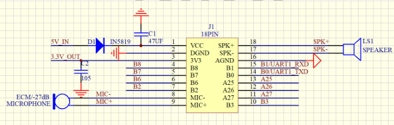
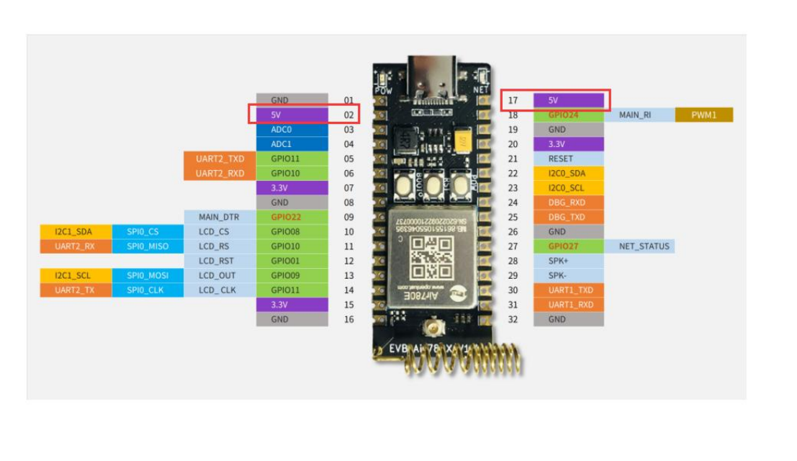
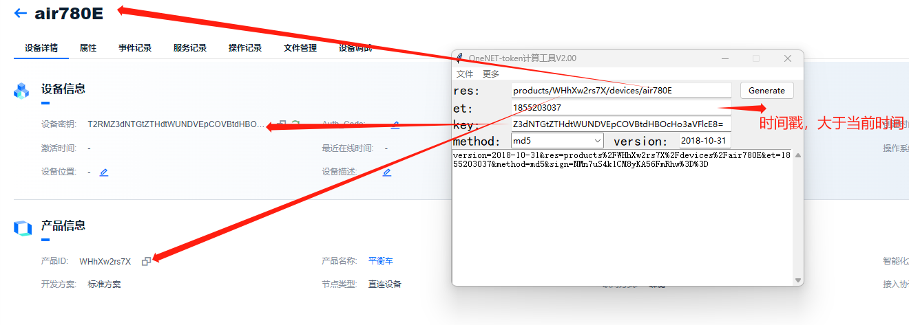
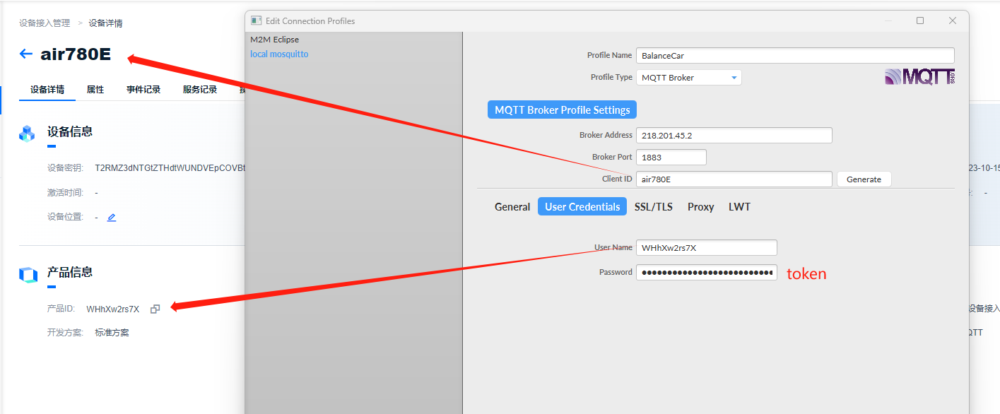
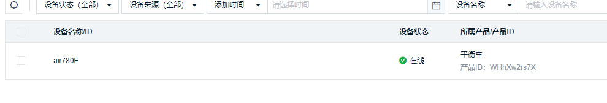
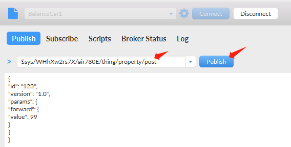
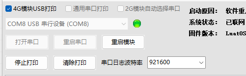
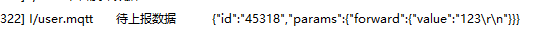
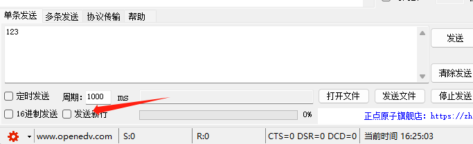

# 产品选型


# 模块

主控：STM32F103ZET6 STM32F103C8T6

通信：

* 合宙air780e 4G通信模块
* UART蓝牙模块

MPU6050：IIC通信

离线语音：UART


舵机：TIM输出两路PWM


UART：离线语音、蓝牙模块、4G通信

IIC：MPU6050

CAN：FOC驱动

TIM：舵机X2


PB6 PB7：IIC


PA11/PA12:CAN


PA9/PA10:UART1

PA2/PA3:UART2

PB10/PB11:UART3

## 离线语音

主板5V供电，喇叭5V

B6:UART1_RXD/I2C_SDA

B7:UART1_TXD/I2C_SCL

~~B0:UART1_TXD/I2C_SCL/TIM3_PWM~~

~~B1:UART1_RXD/I2C_SDA/TIM4_PWM~~




## 4G



尽量使用UART1


### MQTT

**生成token**

````
products/产品ID/devices/设备ID
products/WHhXw2rs7X/devices/air780E
````





**MQTTFX**

````c
项目ID：WHhXw2rs7X
设备ID：air780E
换算后的token：version=2018-10-31&res=products%2FWHhXw2rs7X%2Fdevices%2Fair780E&et=1855203037&method=md5&sign=NMn7uS4k1CM8yKA56FmRhw%3D%3D
````



当MQTTFX工具连接服务器后，进入onenet可以看见有个设备在线了



**订阅**

````
$sys/{pid}/{device-name}/thing/property/post/reply

$sys/WHhXw2rs7X/air780E/thing/property/post/reply
````


**发送**

````
$sys/{pid}/{device-name}/thing/property/post

$sys/WHhXw2rs7X/air780E/thing/property/post
````

````json
{
"id": "123",
"version": "1.0",
"params": {
"forward": {
"value": 99
}
}
}
````



到现在就可以使用FX工具，将想要发送的数据上传到mqtt服务器了


### 问题

使用串口打印日志







注意看，我们想要的是数值类型，但是通过串口接收数字123时，接收的是字符串类型，并且尾部出现`\r\n`，解决办法取消发送新行，并将收到的字符串类型转化为数字类型



````lua
uart.on(uart_id, "receive", function(id, len)
    local data = ""
    while 1 do
        local tmp = uart.read(uart_id)
        if not tmp or #tmp == 0 then
            break
        end
        data = data .. tmp
        sendData = data
        sendData = tonumber(sendData)		-- 将收到的字符串类型转化为数字类型
    end
    uart.write(1, sendData)
    log.info("uart", "uart收到数据长度", #data)
    sys.publish("mqtt_pub", pub_custome, data)
end)
````

